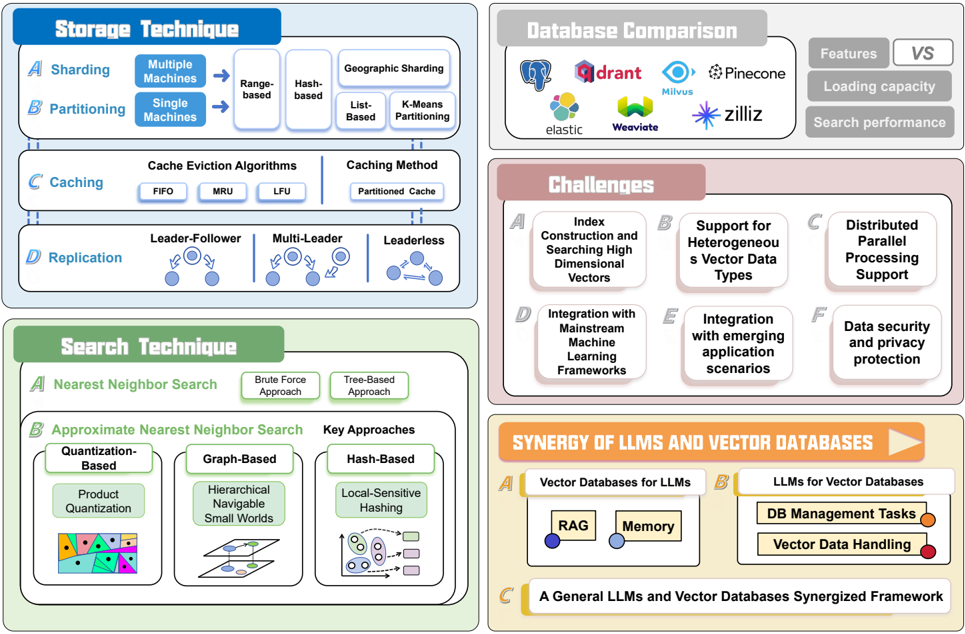
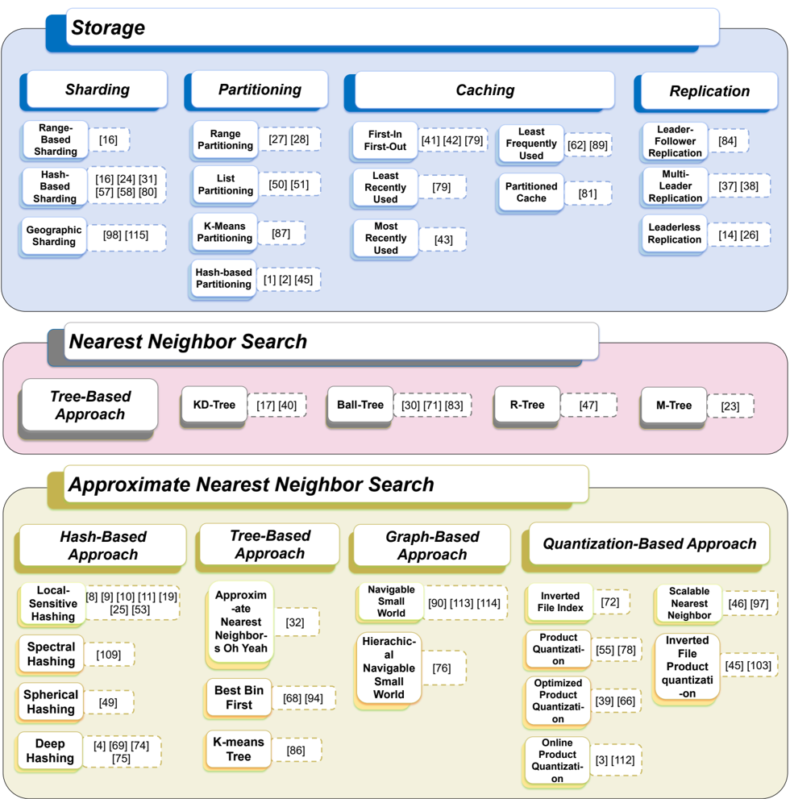
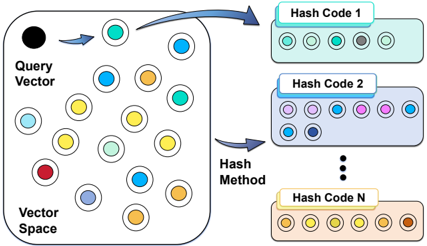
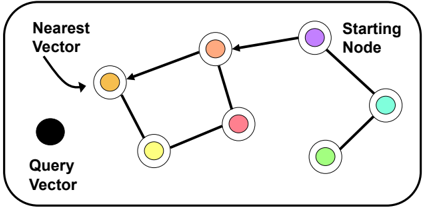
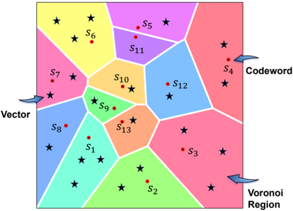
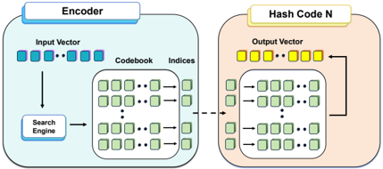
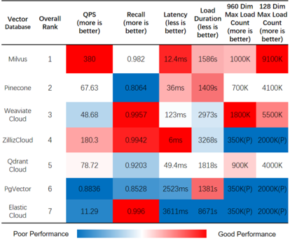
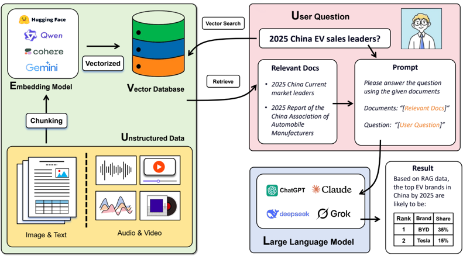
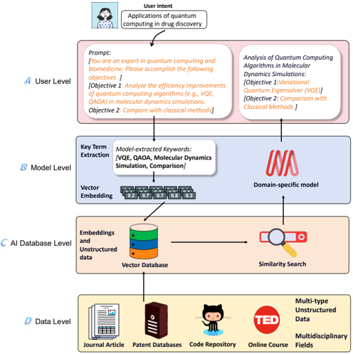

## A Comprehensive Survey on Vector Database: Storage and Retrieval Technique, Challenge

Le Ma ∗ , Ran Zhang ∗ , Yikun Han ∗ , Shirui Yu, Zaitian Wang, Zhiyuan Ning, Jinghan Zhang, Ping Xu, Pengjiang Li, Wei Ju, Chong Chen, Dongjie Wang, Kunpeng Liu, Pengyang Wang, Pengfei Wang, Yanjie Fu, Chunjiang Liu † , Yuanchun Zhou, Chang-Tien Lu

Abstract -Vector databases (VDBs) have emerged to manage high-dimensional data that exceed the capabilities of traditional database management systems, and are now tightly integrated with large language models as well as widely applied in modern artificial intelligence systems. Although relatively few studies describe existing or introduce new vector database architectures, the core technologies underlying VDBs, such as approximate nearest neighbor search, have been extensively studied and are well documented in the literature. In this work, we present a comprehensive review of the relevant algorithms to provide a general understanding of this booming research area. Specifically, we first provide a review of storage and retrieval techniques in VDBs, with detailed design principles and technological evolution. Then, we conduct an in-depth comparison of several advanced VDB solutions with their strengths, limitations, and typical application scenarios. Finally, we also outline emerging opportunities for coupling VDBs with large language models, including open research problems and trends, such as novel indexing strategies. This survey aims to serve as a practical resource, enabling readers to quickly gain an overall understanding of the current knowledge landscape in this rapidly developing area.

attributes [9]. Depending on the complexity and granularity of the underlying data, the dimensions of these high-dimensional vectors usually range from dozens to thousands. Unlike traditional relational databases, VDBs provide efficient mechanisms for large-scale storage, management, and search of highdimensional vectors [10]-[12]. These mechanisms bring various efficient functions to VDBs, such as supporting semantic similarity search, efficiently managing large-scale data, and providing low-latency responses. These functions make VDBs increasingly integrated into AI-based applications.

Index Terms -Vector Database, Retrieval, Storage, Large Language Models.

## I. INTRODUCTION

Vectors, particularly those in high-dimensional spaces, are mathematical representations of data, encoding the semantic and contextual information of entities such as text, images, audio, and video [1], [2]. These vectors are generally generated through some related machine learning models, and the generated vectors are usually high-dimensional and can be used for similarity comparison. The step of converting original unstructured data into vectors is the foundation of many artificial intelligence (AI) applications (including large language models (LLMs) [3], question-answering systems [4], [5], image recognition [6], recommendation systems [7], [8], etc.). However, in terms of managing and retrieving high-dimensional vector data, traditional databases designed for handling structured data are often inadequate. Vector databases, on the other hand, provide a specialized solution to these challenges.

Vector Databases (VDBs) are tools specifically designed to efficiently store and manage high-dimensional vectors. Specifically, VDBs store information as high-dimensional vectors, which are mathematical representations of data features or

- ∗ Equal contribution. † Corresponding author.

This paper was produced by the IEEE Publication Technology Group. They are in Piscataway, NJ.

Manuscript received April 19, 2021; revised August 16, 2021.

VDBs have two core functions: vector storage and vector retrieval. The vector storage function relies on techniques such as quantization, compression, and distributed storage mechanisms to improve efficiency and scalability. The retrieval function of VDBs relies on specialized indexing techniques, including tree-based methods, hashing methods [13], graph-based models, and quantization-based techniques [14]. These indexing techniques optimize high-dimensional similarity search by reducing computational cost and improving search performance. In addition, hardware acceleration and cloud-based technologies have further enhanced the capabilities of VDBs, making them suitable for large-scale and real-time applications [15]-[17].

Therefore, compared with traditional databases, vector databases (VDBs) have three significant advantages: (1) Vector databases possess efficient and accurate vector retrieval capabilities. The core function of VDBs is to retrieve relevant vectors through vector similarity (distance), and this function is also the core of applications such as natural language processing (NLP), computer vision, and recommendation systems [18], [19]. In contrast, traditional databases can only query data based on exact matching or predefined conditions, and this kind of query method is relatively slow and often does not consider the semantic information of the data itself. (2) Vector databases support the storage and query of complex and unstructured data. VDBs can store and search data with high complexity and granularity, such as text, images, audio, video, etc. However, traditional databases, such as relational databases, are difficult to store this kind of data information well [20]. (3) Vector databases have high scalability and real-time processing capabilities. Traditional databases face challenges in effectively handling unstructured data and large volumes of real-time datasets [21]. However, VDBs can process vector data at large scale and in real time, which is crucial for modern data science and artificial intelligence applications [22]. By using technologies such as sharding [23],

partitioning, caching, and replication, VDBs can distribute workloads and optimize resource utilization across multiple machines or clusters. Traditional databases, on the other hand, may face scalability bottlenecks, latency issues, or concurrency conflicts when handling big data [19].

Recent surveys on VDBs primarily cover fundamental concepts and practical applications of VDBs and vector database management systems. Some studies [12], [19], [24] focus on the workflow and technical challenges of VDBs, including key aspects such as query processing, optimization, and execution techniques. And some works [25] explore the critical role of VDBs in modern generative AI applications and provide an outlook on the future of VDBs. While these studies have their respective focuses, they do not provide a comprehensive survey of the overall storage and search technologies in VDBs, nor deliver a thorough analysis comparing the capabilities of existing VDBs. Furthermore, there is limited exploration of how these systems can integrate with rapidly advancing AI technologies, such as large language models (LLMs), to support modern data-intensive applications.

This gap shows the need for a comprehensive survey to consolidate current knowledge and uncover key research challenges related to VDB. To address this, our survey makes the following core contributions:

ical evolution.

- We provide a detailed comparative analysis of existing VDB solutions, highlighting their strengths, limitations, and typical application scenarios.
- We synthesize the main challenges, recent advancements, and future directions for VDBs, including open research problems and trends such as novel indexing strategies, adaptive query optimization, and integration with advanced AI capabilities.

This paper comprehensively summarizes the technologies related to vector databases, and systematically tests the performance of existing open-source vector databases. It also provides an outlook on the challenges that vector databases will face in the future. Through the summary of this paper, researchers can deepen their understanding of the field of vector databases. Figure 1 shows the overall framework of the paper, and we also construct a classification system of storage and search technologies for VDBs, as shown in Figure 2.

## II. STORAGE

- We systematically review storage and retrieval techniques in VDBs, outlining their design principles and technolog-

Efficient data management strategies are essential for the performance and scalability of VDBs. This section explores four key techniques: sharding and partitioning for data distribution, caching for reducing query latency, and replication for ensuring availability and fault-tolerance.

Fig. 1. Framework overview of this survey structure covering Storage Techniques, Search Techniques, Database Comparison, Challenges, and the Synergy of Large Language Models (LLMs) with VDBs. Each section represents a fundamental facet of the operation and integration of modern VDBs within advanced AI technologies.

## A. Sharding

Sharding is a technique that distributes a VDB across multiple machines or clusters, called shards, based on specific criteria, such as a hash function or a key range. It is a foundational strategy for achieving scalability, load balancing, and fault tolerance in distributed systems by dividing the dataset into smaller, manageable units. Different sharding methods are designed to address specific challenges, such as balancing data distribution, minimizing hotspots, reducing query latency, and supporting dynamic scaling. This section covers three widely adopted strategies: range-based sharding, hash-based sharding, and geographic sharding.

Range-Based Sharding. The most straightforward sharding method is range-based sharding, which partitions vector data across shards by dividing it into non-overlapping key intervals, or ranges, based on sorted keys [26]. For example, users can shard a VDB by dividing the ID column of the vector data into different ranges, such as 0-999, 1000-1999, 2000-2999, and so on, with each range assigned to a specific shard. Each range corresponds to a shard. This way, users can query the vector data more efficiently by specifying the shard name or range. Range-based sharding is simple to implement and provides efficient query performance for range-based queries, such as retrieving all vectors within a specific time period or ID range. However, this method often leads to data skew and uneven load distribution if key values are not uniformly distributed. Rangebased sharding is particularly suitable for use cases where data access patterns are predictable, such as time-series analytics or sequential ID-based queries.

Hash-Based Sharding . Another common sharding method in VDBs is hash-based sharding [26]-[28], which assigns vector data into different shards based on the hash value of a key column or a set of columns. For example, users can shard a VDB by applying a hash function to the ID column of the vector data. For example, users can distribute the vector data evenly across the shards and avoid hotspots. However, traditional hash-based methods, such as modulo hashing, introduce challenges during cluster scaling, suffering from significant data redistribution when adding or removing shards. To address this, consistent hashing is often employed in distributed VDBs. Unlike traditional hashing, consistent hashing maps both data and nodes to a ring-like hash space. This ensures that only a small fraction of data (O(1/N)) is remapped when nodes are added or removed. Consistent hashing minimizes reorganization overhead during cluster scaling while maintaining balanced data distribution. Additionally, virtual nodes (replicas of physical nodes on the hash ring) further enhance load balancing, mitigating hotspots. Although consistent hashing introduces slight computational complexity, its advantages in dynamic environments make it a preferred choice for modern distributed systems [29]-[31]

Geographic Sharding. Another approach is geographic sharding (also known as geo-sharding), which distributes vector data across shards based on geographic attributes [32], [33], such as user region or location. For instance, a VDB can be partitioned by a 'region' field, assigning each shard to a specific geographic zone (e.g., 'North America,' 'Europe,' or

'Asia'). This method is particularly useful for latency-sensitive localized queries, such as recommendation systems or geospatial analytics. By storing data in shards physically closer to users, geo-sharding reduces cross-region network latency and helps comply with data sovereignty regulations. Additionally, combined with dynamic load balancing, it can adapt to shifting geographic access patterns for optimal performance.

## B. Partitioning

Partitioning typically refers to dividing data within a single database instance into multiple logical subsets based on rules such as range, list, and K-Means, where all partitioned data remains within the same physical system. This approach improves query efficiency, facilitates parallel processing, and optimizes resource usage by organizing data into logical groups. For instance, users can partition a VDB by color values such as red, yellow, and blue, where each partition contains vector data associated with a specific 'color' column value. Queries can then target specific partitions, avoiding unnecessary scans of unrelated data and improving performance. While sharding focuses on distributing data across multiple machines in a distributed environment, partitioning primarily organizes data within a single machine or node. These two techniques serve different purposes but can be used together synergistically. In practical applications, sharding achieves horizontal scalability by distributing data across nodes, while partitioning optimizes local data organization within each node. By combining the two, systems can balance global scalability and localized query performance-sharding handles load distribution for large datasets, and partitioning ensures efficient data access within individual shards. Partitioning strategies vary depending on the characteristics of the data and application requirements. This section discusses four common partitioning methods: range partitioning, list partitioning, k-means partitioning, and hash-based Partitioning.

Range-based Partitioning. Range-based partitioning is a method widely used in VDBs, where data is divided into nonoverlapping key ranges to form partitions [34], [35]. Each range corresponds to a specific subset of data based on a sorted key (e.g., timestamps, numeric IDs). Similar to the strength of range-based sharding, range-based partitioning is particularly efficient for range-based queries, as it allows the system to target specific partitions directly. For example, users can partition a VDB by date ranges, such as monthly or quarterly. This way, users can query the vector data more efficiently by specifying the partition name or range.

List-based Partitioning. Another way that partitioning works in VDB is by using a list partitioning method, which assigns vector data to different partitions based on their value lists of a key column or a set of columns [36], [37]. For example, users can partition a vector database by color values, such as red, yellow, and blue. Each partition contains vector data that have a given value of the color column. This way, users can query the vector data more easily by specifying the partition name or list.

K-Means Partitioning. A third partitioning method for VDBs is k-means partitioning [20], which divides vector data

Fig. 2. Taxonomy of Vector Database (VDB) Storage and Search Technologies.

into a predetermined number (k) of clusters. Each cluster represents a partition, with vectors within the same cluster being similar to each other and vectors between clusters differing significantly. Similar vectors are placed in the same partition, which improves query efficiency. However, for largescale datasets, the computational cost of k-means clustering can be high, especially when frequent updates necessitate reclustering.

Hash-based Partitioning. Alternatively, some VDBs adopt hash-based partitioning, such as consistent or uniform hashing [38]-[40]. Specifically, the hashing partitioning strategy uses a hash function to map data to different partitions. The hash value of each data point determines which partition it belongs to. In VDBs, the hash value is typically calculated based on certain features of the vector (for example, values of specific dimensions or the entire vector). The hash function can evenly distribute data across partitions, preventing any single partition from storing too much data. However, when the data distribution is uneven, it may lead to some partitions becoming overloaded. Additionally, when the node number changes, hash-based partitioning may require the redistribution of the large dataset, which can incur significant overhead.

## C. Caching

Caching is a technique that stores frequently accessed or recently used data in a fast and accessible memory, such as

RAM, to reduce latency and improve data retrieval performance. Caching can be used in VDBs to speed up similarity search and vector retrieval. In traditional database systems, utilizing in-memory key-value stores (e.g., Redis) as a caching layer represents a widely adopted approach. This methodology generates cache keys by combining query parameters (such as specific column values for matching). When a target key is found in the cache, Redis serves the corresponding data; otherwise, a cache miss occurs, necessitating database queries to fetch the required information. However, this key-value paradigm proves unsuitable for VDBs, as they store highdimensional vector data rather than structured data, making it virtually impossible to reuse identical vectors across queries. To address these challenges, it is important to explore general caching algorithms and their applicability to VDBs. This section discusses four common caching methods: first-in firstout (FIFO), least recently used (LRU), most recently used (MRU), and least frequently used (LFU).

First-In First-Out (FIFO) . FIFO algorithm is a fundamental cache eviction strategy that operates on the principle of 'first in, first out': when the cache space is exhausted, it prioritizes removing the earliest stored vector data [41], [42]. This algorithm maintains a simple queue structure: new data is always appended to the tail, while eviction removes the oldest data from the head [43]. FIFO is particularly suitable for vector data scenarios with stable access patterns and no distinct hotspots, such as time-series vector data collected at fixed intervals. While its implementation is simple and efficient (with O(1) time complexity), it may inadvertently evict frequently used data due to disregarding access frequency. A typical application includes real-time processing systems for industrial sensor data, where the timeliness of historical vector data often outweighs its reuse value.

Least Recently Used (LRU) . One commonly employed caching strategy in VDBs is the least recently used (LRU) policy, which evicts the least recently accessed vector data when the cache reaches its capacity. This approach ensures that the cache retains the most relevant or frequently queried vectors, thereby improving the likelihood of cache hits [43]. For example, Redis, a widely used in-memory database, implements LRU caching to manage vector data and facilitate efficient vector similarity search. However, LRU may not effectively retain data with long-term or periodic popularity, as it only considers recent access history. LRU is particularly suitable for scenarios with strong temporal locality, such as recommendation systems and real-time search applications, where recently accessed vectors are highly likely to be queried again.

Most Recently Used (MRU) . The Most Recently Used (MRU) [44] algorithm is another caching strategy employed in VDBs that prioritizes evicting the most recently accessed vector data when cache capacity is reached. This approach operates under the assumption that recently queried vectors are less likely to be accessed again in the short term, thereby retaining less recently used data that may be needed in the future. MRU has been adopted in certain storage systems and applications with transient or one-time access patterns, such as data streaming or processing workloads, where immediate reuse of recently accessed vectors is unlikely. However, MRU is suboptimal for workloads with strong temporal locality, as it may prematurely evict data that will soon be accessed again.

Least Frequently Used (LFU) . The LFU algorithm is a frequency-based cache eviction mechanism that determines removal priority by continuously tracking the access count of each vector data item. The LFU algorithm maintains a frequency table and evicts the least frequently accessed items when the cache is full. A typical implementation requires maintaining an access counter for each cached item, often using a min-heap data structure to efficiently identify the lowest-frequency items with a time complexity of O(log n) [45], [46]. However, the LFU algorithm can be susceptible to cache pollution, as items frequently accessed in the past may linger in the cache even when they are no longer needed. Thus, LFU is suitable for applications with stable and long-lived spot data patterns (e.g., popular product recommendations, high-frequency user profile queries), while its effectiveness diminishes in environments with rapidly evolving access distributions.

Partitioned Cache . Partitioned caching is a common approach in VDBs, wherein vector data are divided into multiple partitions based on specific criteria [47], such as geographic location, category, or access frequency. Each partition can be allocated a distinct cache size and may employ different eviction policies according to the respective demand and usage patterns. This enables the cache to retain the most relevant vector data for each partition, thereby improving resource utilization and overall cache effectiveness. For example, Esri, a leading geographic information system (GIS) company, leverages the partitioned cache to efficiently store vector data and support high-performance map rendering.

## D. Replication

Replication is a technique that creates multiple copies of the vector data and stores them on different nodes or clusters. Replication can improve the availability, durability, and performance of VDB. This section discusses three common replication methods: leader-follower replication, multi-leader replication, and leaderless replication.

Leader-Follower Replication . Leader-Follower replication designates one node as the leader and the others as the followers, and allows only the leader to accept write requests and propagate them to the followers [48]. Leader-follower replication can ensure strong consistency and simplify the conflict resolution of VDB. However, it may also introduce availability issues and require failover mechanisms to handle leader failures.

Multi-Leader Replication . Multi-Leader replication extends the traditional leader-follower model by designating multiple nodes as leaders, each capable of independently accepting and processing write requests [49], [50]. In this architecture, all leader nodes can concurrently handle write operations and asynchronously propagate changes to other nodes in the system.

Leaderless Replication . Leaderless replication does not distinguish between leader and follower nodes, and allows any

node to accept write and read requests [51], [52]. Leaderless replication can avoid single points of failure and improve the scalability and reliability of VDB. However, it may also introduce consistency issues and require coordination mechanisms to resolve conflicts.

## III. SEARCH

VDBs are designed to facilitate efficient similarity search over high-dimensional vector data, an essential operation in many AI and machine learning applications. This similarity search is typically implemented through nearest neighbor search algorithms, which can be further divided into exact nearest neighbor search (NNS) and approximate nearest neighbor search (ANNS) methods.

NNS is the optimization problem of finding the point in a given set that is closest (or most similar) to a given point. Closeness is typically expressed in terms of a dissimilarity function: the less similar the objects, the larger the function values. For example, users can use NNS to find images that are similar to a given image based on their visual content and style, or documents that are similar to a given document based on their topic and sentiment. ANNS is a variation of NNS that allows for some error or approximation in the search results. ANNS can trade off accuracy for speed and space efficiency, which can be useful for large-scale and highdimensional data. For example, users can use ANNS to find products that are similar to a given product based on their features and ratings, or users that are similar to a given user based on their preferences and behaviors.

Observing the current division for NNS and ANNS algorithms, the boundary is precisely their design principle, such as how they organize, index, or hash the dataset, how they search or traverse the data structure, and how they measure or estimate the distance between points. NNS algorithms tend to use more exact or deterministic methods, such as partitioning the space into regions by splitting along one dimension (k-d tree) or enclosing groups of points in hyperspheres (ball tree), and visiting only the regions that may contain the nearest neighbor based on some distance bounds or criteria. ANNS algorithms tend to use more probabilistic or heuristic methods, such as mapping similar points to the same or nearby buckets with high probability (locality-sensitive hashing), visiting the regions in order of their distance to the query point and stopping after a fixed number of regions or points (best bin first), or following the edges that lead to closer points in a graph with different levels of coarseness (hierarchical navigable small world).

In fact, a data structure or algorithm that supports NNS can also be applied to ANNS, and for ease of categorization, such methods are included under the section on NNS. And in recent years, several new algorithms for high-dimensional vector NNS have emerged [13], [53]-[56]. Although these algorithms have not yet been widely adopted by VDBs, they hold significant potential for future applications.

## A. Nearest Neighbor Search

1) Brute Force Approach: A brute force algorithm for the NNS problem scans all points in the dataset, computing their distances to the query point and tracking the closest one. This algorithm guarantees to find the true nearest neighbor for any query point, but it has a high computational cost. The time complexity of a brute force algorithm for NNS problem is O ( n ) , where n is the size of the dataset. The space complexity is O (1) , since no extra space is needed.

- 2) Tree-Based Approach: Four tree-based methods will be presented here, namely k-dimensional tree (KD-Tree), BallTree, R-Tree, and M-Tree.

KD-Tree [57] . It is a technique for organizing points in a k-dimensional space, where k is usually a very big number. It works by building a binary tree in which every node is a k-dimensional point. Every non-leaf node in the tree acts as a splitting hyperplane that divides the space into two parts, known as half-spaces. The splitting hyperplane is perpendicular to the chosen axis, which is associated with one of the k dimensions. The splitting value is usually the median or the mean of the points along that dimension.

The algorithm maintains a priority queue of nodes to visit, sorted by their distance to the query point. At each step, the algorithm pops the node with the smallest distance from the queue, and checks if it is a leaf node or an internal node. If it is a leaf node, the algorithm compares the distance between the query point and the data point stored in the node, and updates the current best distance and nearest neighbor if necessary. If it is an internal node, the algorithm pushes its left and right children to the queue, with their distances computed as follows:

<!-- formula-not-decoded -->

<!-- formula-not-decoded -->

where q is the query point, N is the internal node, N.axis is the splitting axis of N , and N.value is the splitting value of N . The algorithm repeats this process until the queue is empty or a termination condition is met.

The advantage of KD-tree is that it is conceptually simpler and often easier to implement than some of the other tree structures. The performance of KD-tree depends on several factors, such as the dimensionality of the space, the number of points, and the distribution of the points. These factors affect the trade-off between accuracy and efficiency, as well as the complexity and scalability of the algorithm. There are also some challenges and extensions of KD-tree, such as dealing with the curse of dimensionality when the dimensionality is high, introducing randomness in the splitting process to improve robustness, or using multiple trees to increase recall. This is a variation of KD-tree named randomized KD-tree, that introduces some randomness in the splitting process, which can improve the performance of KD-tree by reducing its sensitivity to noise and outliers [58].

Ball-Tree [59], [60], [61]. It is a technique for finding the nearest neighbors of a given vector in a large collection of

vectors. It works by building a ball-tree, which is a binary tree that partitions the data points into balls, i.e. hyperspheres that contain a subset of the points. Each node of the balltree defines the smallest ball that contains all the points in its subtree. The algorithm then searches for the closest ball to the query point, and then searches within the closest ball to find the closest point to the query point.

To query for the nearest neighbor of a given point, the ball tree algorithm uses a priority queue to store the nodes to be visited, sorted by their distance to the query point. The algorithm starts from the root node and pushes its two children to the queue. Then, it pops the node with the smallest distance from the queue and checks if it is a leaf node or an internal node. If it is a leaf node, it computes the distance between the query point and each data point in the node, and updates the current best distance and nearest neighbor if necessary. If it is an internal node, it pushes its two children to the queue, with their distances computed as follows:

<!-- formula-not-decoded -->

where q is the query point, N is the internal node, N.center is the center of the ball associated with N , and N.value is the radius of the ball associated with N . The algorithm repeats this process until the queue is empty or a termination condition is met.

The advantage of ball-tree is that it can perform well in high-dimensional spaces, as it can avoid the curse of dimensionality that affects other methods such as KD-tree. The performance of ball-tree depends on several factors, such as the dimensionality of the data, the number of balls per node, and the distance approximation method used. These factors affect the trade-off between accuracy and efficiency, as well as the complexity and scalability of the algorithm. There are also some challenges and extensions of ball-tree search, such as dealing with noisy and outlier data, choosing a good splitting dimension and value for each node, or using multiple trees to increase recall.

R-Tree [62]. It is a technique for finding the nearest neighbors of a given vector in a large collection of vectors. It works by building an R-tree, which is a tree data structure that partitions the data points into rectangles, i.e. hyperrectangles that contain a subset of the points. Each node of the Rtree defines the smallest rectangle that contains all the points in its subtree. The algorithm then searches for the closest rectangle to the query point, and then searches within the closest rectangle to find the closest point to the query point.

The R-tree algorithm uses the concept of minimum bounding rectangle (MBR) to represent the spatial objects in the tree. The MBR of a set of points is the smallest rectangle that contains all the points. The formula for computing the MBR of a set of points P is:

<!-- formula-not-decoded -->

where p x and p y are the x and y coordinates of point p , and × denotes the Cartesian product.

The R-tree algorithm also uses two metrics to measure the quality of a node split: area and overlap. The area of a node is the area of its MBR, and the overlap of two nodes is the area of the intersection of their MBRs. The formula for computing the area of a node N is:

<!-- formula-not-decoded -->

where N.x min , N.x max , N.y min , and N.y max are the coordinates of the MBR of node N .

The advantage of R-tree is that it can support spatial queries, such as range queries or nearest neighbor queries, on data points that represent geographical coordinates, rectangles, polygons, or other spatial objects. R-tree search performance depends on roughly the same factors as B-tree, and also faces similar challenges as B-tree.

M-Tree [63]. It is a technique for finding the nearest neighbors of a given vector in a large collection of vectors. It works by building an M-tree, which is a tree data structure that partitions the data points into balls, i.e. hyperspheres that contain a subset of the points. Each node of the M-tree defines the smallest ball that contains all the points in its subtree. The algorithm then searches for the closest ball to the query point, and then searches within the closest ball to find the closest point to the query point.

The M-tree algorithm uses the concept of covering radius to represent the spatial objects in the tree. The covering radius of a node is the maximum distance from the node's routing object to any of its children objects. The formula for computing the covering radius of a node N is:

<!-- formula-not-decoded -->

where N.object is the routing object of node N , N.child is the set of child nodes of node N , C.object is the routing object of child node C , and d is the distance function.

The M-tree algorithm also uses two metrics to measure the quality of a node split: area and overlap. The area of a node is the sum of the areas of its children's covering balls, and the overlap of two nodes is the sum of the areas of their children's overlapping balls. The formula for computing the area of a node N is:

<!-- formula-not-decoded -->

where π is the mathematical constant, and r ( C ) is the covering radius of child node C .

The advantage of M-tree is that it can support dynamic operations, such as inserting or deleting data points, by updating the tree structure accordingly. M-tree search performance depends on roughly the same factors as B-tree, and also faces similar challenges as B-tree.

## B. Approximate Nearest Neighbor Search

1) Hash-Based Approach: The core idea of the hashbased approach is to reduce search complexity by mapping high-dimensional data to lower-dimensional hash codes with

technique arding

ding

Multiple Machines rtitioning

ching plication

Single Machines

Cache Eviction Algorithms

FIFO

MRU

LFU

Leader-Follower

Multi-Leader

Hash

Code N

Fig. 3. The process of approximate nearest neighbor search based on hash approach

Range-based

Hash-based

Primary approaches

Partitioned  Cache carefully designed hash functions, while preserving similarity between data points. As shown in Figure 3, each highdimensional vector is transformed into a low-dimensional hash code. Similar points are mapped to the same or neighboring codes, so the search only needs to examine a small subset of codes, greatly improving efficiency. Based on this idea, four representative methods will be introduced: locality-sensitive hashing, spectral hashing, Spherical Hashing, and deep hashing. The idea is to reduce the memory footprint and the search time by comparing the binary codes instead of the original vectors [64].

Local-Sensitive Hashing [65], [66]. It is a technique for finding the approximate nearest neighbors of a given vector in a large collection of vectors. It works by using a hash function to transform the high-dimensional vectors into compact binary codes, and then using a hash table to store and retrieve the codes based on their similarity or distance. In LSH, hash functions are designed to preserve the locality of vectors. Unlike traditional hash functions, LSH increases the probability that similar items are mapped to the same code, thus increasing collisions among similar vectors. A trace of algorithm description and implementation for locally sensitive hashing can be seen on the home page [67].

The LSH algorithm works by using a family of hash functions that use random projections or other techniques which are locality sensitive, meaning that similar vectors are more likely to have the same or similar codes than dissimilar vectors [68], which satisfy the following property:

<!-- formula-not-decoded -->

where h is a hash function, p and q are two points, d is a distance function, and f is a similarity function. The similarity function f is a monotonically decreasing function of the distance, such that the closer the points are, the higher the probability of collision.

There are different families of hash functions for different distance functions and similarity functions. For example, one of the most common families of hash functions for Euclidean distance and cosine similarity is:

<!-- formula-not-decoded -->

where a is a random vector, b is a random scalar, and w is a parameter that controls the size of the hash bucket. The similarity function for this family of hash functions is:

<!-- formula-not-decoded -->

where d ( p, q ) is the Euclidean distance between p and q . The advantage of LSH is that it can reduce the memory footprint and the search time by comparing the binary codes instead of the original vectors, also adapt to dynamic data sets, by inserting or deleting codes from the hash table without affecting the existing codes [69].

The performance of LSH depends on several factors, such as the dimensionality of the data, the number of hash functions, the number of bits per code, and the desired accuracy and recall. These factors affect the trade-off between accuracy and efficiency, as well as the complexity and scalability of the algorithm. There are also some challenges and extensions of LSH, such as dealing with noisy and outlier data, choosing a good hash function family, or using multiple hash tables to increase recall. It is improved by [70], [71], [72].

Spectral Hashing [73]. It is a technique for finding the approximate nearest neighbors of a given vector in a large collection of vectors. It works by using spectral graph theory to generate hash functions that minimize the quantization error and maximize the variance of the binary codes. Spectral hashing can perform well when the data points lie on a lowdimensional manifold embedded in a high-dimensional space.

The spectral hashing algorithm works by solving an optimization problem that balances two objectives: (1) minimizing the variance of each binary function, which ensures that the data points are evenly distributed among the hypercubes, and (2) maximizing the mutual information between different binary functions, which ensures that the binary code is informative and discriminative. The optimization problem can be formulated as follows:

<!-- formula-not-decoded -->

where y i is the i -th binary function, V ar ( y i ) is its variance, I ( y 1 , . . . , y n ) is the mutual information between all the binary functions, and λ is a trade-off parameter.

The advantage of spectral hashing is that it can perform well when the data points lie on a low-dimensional manifold embedded in a high-dimensional space. Spectral hashing search performance depends on roughly the same factors as local-sensitive hashing. There are also some challenges and extensions of spectral hashing, such as dealing with noisy and outlier data, choosing a good graph Laplacian for the data manifold, or using multiple hash functions to increase recall.

Spherical Hashing . Spherical hashing is a binary encoding technique based on hyperspheres, designed for efficient ANNS. Unlike traditional hyperplane-based methods, it partitions the data space using hyperspheres, which define tighter and more compact regions through their centers and radii. Each spherical hashing function, as described by Heo [74], is

characterized by ( p k ∈ R D ) and a distance threshold t k ∈ R + , as detailed below:

<!-- formula-not-decoded -->

where d ( · , · ) is the Euclidean distance between two points in D -dimensional real space; however, alternative distance metrics, such as the Lp-norms, could also be employed in place of the Euclidean distance. The output of each spherical hashing function h k ( x ) determines if the point x resides within the hypersphere that has p k as its center and t k as its radius. To improve similarity measurement, spherical hashing introduces the spherical Hamming distance, which accounts for the number of shared hyperspheres. The spherical Hamming distance is formulated as follows:

<!-- formula-not-decoded -->

where | b i ⊕ b j | represents the number of different bits (where the XOR operation results in 1) between two binary codes, | b i ∧ b j | represents the number of common bits (where the AND operation results in 1) between the two binary codes.

Compared to hyperplane-based hashing functions, spherical hashing can map more spatially coherent data points into binary codes. Moreover, in high-dimensional spaces, hyperspheres are more powerful than hyperplanes in defining closed regions, allowing more potential nearest neighbors to be captured within the binary code region of a query point.

Deep Hashing [75], [76]. It is a technique for finding the approximate nearest neighbors of a given vector in a large collection of vectors. It works by using a deep neural network to learn hash functions that transform high-dimensional vectors into compact binary codes, and then using a hash table to store and retrieve the codes based on their similarity or distance [77]. The hash functions are designed to preserve the semantic information of the vectors, which means that similar vectors are more likely to have the same or similar codes than dissimilar vectors [78].

The deep hashing algorithm works by optimizing an objective function that balances two terms: (1) a reconstruction loss that measures the fidelity of the binary codes to the original data points and (2) a quantization loss that measures the discrepancy between the binary codes and their continuous relaxations. The objective function can be formulated as follows:

<!-- formula-not-decoded -->

where x i is the i -th data point, b i is its continuous relaxation, sgn ( b i ) is its binary code, W is a weight matrix that maps the binary codes to the data space, and λ is a trade-off parameter.

The advantage of deep hashing is that it can leverage the representation learning ability of neural networks to generate more discriminative and robust codes for complex data, such as images, texts, or audios. The performance of deep hashing depends on several factors, such as the architecture of the neural network, the loss function used to train the network, and the number of bits per code. These factors affect the trade-off between accuracy and efficiency, as well as the complexity and scalability of the algorithm. There are also some challenges and extensions of deep hashing, such as dealing with noisy and outlier data, choosing a good initialization for the network, or using multiple hash functions to increase recall.

2) Tree-Based Approach: The main idea of the tree-based approach is to build hierarchical or recursively partitioned data structures, such as trees, to break high-dimensional datasets into smaller subsets. This method improves query efficiency by reducing the number of points that need to be searched. Along this line, three tree-based methods will be presented: approximate nearest neighbors oh yeah, best bin first, and kmeans tree. The idea is to reduce the search space by following the branches of the tree that are most likely to contain the nearest neighbors of the query point.

Approximate Nearest Neighbors Oh Yeah [79]. It is a technique which can perform fast and accurate similarity search and retrieval of high-dimensional vectors. It works by building a forest of binary trees, where each tree splits the vector space into two regions based on a random hyperplane. Each vector is then assigned to a leaf node in each tree based on which side of the hyperplane it falls on. To query a vector, Annoy traverses each tree from the root to the leaf node that contains the vector, and collects all the vectors in the same leaf nodes as candidates. Then, it computes the exact distance or similarity between the query vector and each candidate, and returns the top k nearest neighbors.

The formula for finding the median hyperplane between two points p and q is:

<!-- formula-not-decoded -->

where w = p -q is the normal vector of the hyperplane, x is any point on the hyperplane, and b = -1 2 ( w · p + w · q ) is the bias term. The formula for assigning a point x to a leaf node in a tree is:

<!-- formula-not-decoded -->

where w i and b i are the normal vector and bias term of the i -th split in the tree, and sign is a function that returns 1 if the argument is positive, -1 if negative, and 0 if zero. The point x follows the left or right branch of the tree depending on the sign of this expression, until it reaches a leaf node.

The formula for searching for the nearest neighbor of a query point q in the forest is:

<!-- formula-not-decoded -->

where C ( q ) is the set of candidate points obtained by traversing each tree in the forest and retrieving all the points in the leaf node that q belongs to, and d is a distance function, such as Euclidean distance or cosine distance. The algorithm uses a priority queue to store the nodes to be visited, sorted by their distance to q . The algorithm also prunes branches that are unlikely to contain the nearest neighbor by using a bound on the distance between q and any point in a node.

The advantage of Annoy is that it can uses multiple random projection trees to index the data points, which can increase the recall and robustness of the search, also reduce the memory usage and improve the speed of NNS, by creating large readonly file-based data structures that are mapped into memory so that many processes can share the same data. The performance of Annoy depends on several factors, such as the dimensionality of the data, the number of trees built, the number of nearest candidates to search, and the distance approximation method used. These factors affect the trade-off between accuracy and efficiency, as well as the complexity and scalability of the algorithm. There are also some challenges and extensions of Annoy, such as dealing with noisy and outlier data, choosing a good splitting plane for each node, or using multiple distance metrics to increase recall.

Best Bin First [80], [81]. It is a technique for finding the approximate nearest neighbors of a given vector in a large collection of vectors. It works by building a kd-tree that partitions the data points into bins, and then searching for the closest bin to the query point. The algorithm then searches within the closest bin to find the closest point to the query point. The best bin first algorithm still follows (1) (2). The advantage of best bin first is that it can reduce the search time and improve the accuracy of NNS, by focusing on the most promising bins and avoiding unnecessary comparisons with distant points. The performance of best bin first depends on several factors, such as the dimensionality of the data, the number of bins per node, the number of nearest candidates to search, and the distance approximation method used. These factors affect the trade-off between accuracy and efficiency, as well as the complexity and scalability of the algorithm. There are also some challenges and extensions of best bin first, such as dealing with noisy and outlier data, choosing a good splitting dimension and value for each node, or using multiple trees to increase recall.

K-means Tree [82]. It is a technique for clustering highdimensional data points into a hierarchical structure, where each node represents a cluster of points. It works by applying a k-means clustering algorithm to the data points at each level of the tree, and then creating child nodes for each cluster. The process is repeated recursively until a desired depth or size of the tree is reached.

The formula for assigning a point x to a cluster using the k-means algorithm is:

<!-- formula-not-decoded -->

where argmin is a function that returns the argument that minimizes the expression, and ∥ · ∥ 2 denotes the Euclidean norm. The formula for assigning a point x to a leaf node in a k-means tree is:

<!-- formula-not-decoded -->

where L ( x ) is the set of leaf nodes that x belongs to, and N .center is the cluster center of node N . The point x belongs to a leaf node if it belongs to all its ancestor nodes in the tree.

Fig. 4. The process of performing nearest neighbor search on a small-world network.

The formula for searching for the nearest neighbor of a query point q in the k-means tree is:

<!-- formula-not-decoded -->

where C ( q ) is the set of candidate points obtained by traversing each branch of the tree and retrieving all the points in the leaf nodes that q belongs to. The algorithm uses a priority queue to store the nodes to be visited, sorted by their distance to q . The algorithm also prunes branches that are unlikely to contain the nearest neighbor by using a bound on the distance between q and any point in a node.

The advantage of K-means tree is that it can perform fast and accurate similarity search and retrieval of data points based on their cluster membership, by following the branches of the tree that are most likely to contain the nearest neighbors of the query point. K-means tree can also support dynamic operations, such as inserting and deleting points, by updating the tree structure accordingly. The performance of K-means tree depends on several factors, such as the dimensionality of the data, the number of clusters per node, and the distance metric used. These factors affect the trade-off between accuracy and efficiency, as well as the complexity and scalability of the algorithm. There are also some challenges and extensions of K-means tree, such as dealing with noisy and outlier points, choosing a good initialization for the k-means algorithm, or using multiple trees to increase recall.

3) Graph-Based Approach: The core concept of the graphbased approach is the small-world network. A small-world network is a complex network where most nodes are not directly connected, but almost any node can be reached from another in just a few steps. This means the average path length between any two nodes is much shorter than the total number of nodes. The 'six degrees of separation' theory in sociology [83] is a concrete manifestation of a small-world network.

Given a query vector q and the task finding the k closest vectors from a set O , the graph-based approach uses a graph G ( V, E ) to represent these objects, where each object o i corresponds to a node v i . The small-world network graph is constructed by sequentially adding all nodes. As shown in Figure 4, when a new node is added, a list of neighboring nodes is generated using a greedy algorithm, and bidirectional connections are established between the new node and all nodes in the list. Once the graph is constructed, searching for

q is similar to the process of adding a new node. The search starts from a randomly selected node (with different smallworld variants possibly using different selection strategies). From the list of neighbors of the current node, the node most similar to q is identified. If such a node is found, it becomes the next node, and the search process is repeated. If a node has a higher similarity to q than all of its neighbors, the search stops, and that node is considered the one most similar to q . Two types of graph-based methods are introduced: navigable small world (NSW), and hierachical navigable small world (HNSW).

Navigable Small World It is a technique that uses a graph structure to store and retrieve high-dimensional vectors based on their similarity or distance [84]. The NSW algorithm builds a graph by connecting each vector to its nearest neighbors, as well as some random long-range links that span different regions of the vector space. The idea is that these long-range links create shortcuts that allow for faster and more efficient traversal of the graph, similar to how social networks have small world properties [85].

The NSW algorithm works by using a greedy heuristic to add edges to the graph [86]. The algorithm starts with an empty graph and adds one point at a time. For each point, the algorithm finds its nearest neighbor in the graph using a random walk, and connects it with an edge. Then, the algorithm adds more edges by connecting the point to other points that are closer than its current neighbors. The algorithm repeats this process until all points are added to the graph.

The formula for finding the nearest neighbor of a point p in the graph using a random walk is:

<!-- formula-not-decoded -->

where N(p) is the set of neighbors of p in the graph, and d is a distance function, such as Euclidean distance or cosine distance. The algorithm starts from a random point in the graph and moves to its nearest neighbor until it cannot find a closer point. The formula for adding more edges to the graph using a greedy heuristic is:

<!-- formula-not-decoded -->

where N ( p ) and N ( q ) are the sets of neighbors of p and q in the graph, respectively, and d is a distance function. The algorithm connects p to any point that is closer than its current neighbors.

The advantage of the NSW algorithm is that it can handle arbitrary distance metrics, it can adapt to dynamic data sets, and it can achieve high accuracy and recall with low memory consumption. The NSW algorithm also uses a greedy routing strategy, which means that it always moves to the node that is closest to the query vector, until it reaches a local minimum or a predefined number of hops.

The performance of the NSW algorithm depends on several factors, such as the dimensionality of the vectors, the number of neighbors per node, the number of long-range links per node, and the number of hops per query. These factors affect the trade-off between accuracy and efficiency, as well as the complexity and scalability of the algorithm. There are also some extensions and variations of the NSW algorithm, such as hierarchical navigable small world (HNSW), which adds multiple layers of graphs, each with different scales and densities, or navigable small world with pruning (NSWP), which removes redundant links to reduce memory usage and improve search speed.

Hierachical Navigable Small World [87]. It is a state-ofthe-art technique for finding the approximate nearest neighbors of a given vector in a large collection of vectors. It works by building a graph structure that connects the vectors based on their similarity or distance, and then using a greedy search strategy to traverse the graph and find the most similar vectors. The HNSW algorithm still follows (21) and (22). The HNSW algorithm also builds a hierarchical structure of the graph by assigning each point to different layers with different probabilities. The higher layers contain fewer points and edges, while the lower layers contain more points and edges. When a search query comes in, the HNSW algorithm finds the closest matching data points in the highest layer. It then proceeds layer by layer, moving downwards and finding the nearest data points in each subsequent layer based on those from the layer above. These points are considered the nearest neighbors. The algorithm continues this process in the lower layers, updating the list of nearest neighbors at each step. Once it reaches the bottom layer, the HNSW algorithm returns the data points that are closest to the search query. The algorithm uses a parameter Mto control the maximum number of neighbors for each point in each layer.

The formula for assigning a point p to a layer l using a random probability is:

<!-- formula-not-decoded -->

where M is the parameter that controls the maximum number of neighbors for each point in each layer. The algorithm assigns p to layer l with probability Pr[ p ∈ l ] , and stops when it fails to assign p to any higher layer.

The formula for searching for the nearest neighbor of a query point q in the hierarchical graph is:

<!-- formula-not-decoded -->

where C ( q ) is the set of candidate points obtained by traversing each layer of the graph from top to bottom and retrieving all the points that are closer than the current best distance. The algorithm uses a priority queue to store the nodes to be visited, sorted by their distance to q . The algorithm also prunes branches that are unlikely to contain the nearest neighbor by using a bound on the distance between q and any point in a node.

The advantage of HNSW is that it can achieve better performance than other methods of ANNS, such as treebased or hash-based techniques. For example, it can handle arbitrary distance metrics, it can adapt to dynamic data sets, and it can achieve high accuracy and recall with low memory consumption. HNSW also uses a hierarchical structure that

Vectors allows for fast and accurate search, by starting from the highest layer and moving down to the lowest layer, using the closest node as the next hop at each layer. So, HNSW can effectively 'jump over' large portions of data that don't require searching. Suppose a data store has only a single layer. In that case, the search algorithm is unable to bypass unrelated objects, meaning it has to examine many more data points, even if they are unlikely to be relevant matches. 𝑠𝑠3 𝑠𝑠8 𝑠𝑠6 𝑠𝑠7 𝑠𝑠9 𝑠𝑠10 𝑠𝑠11 𝑠𝑠12 Codewords

The performance of HNSW depends on several factors, such as the dimensionality of the vectors, the number of layers, the number of neighbors per node, and the number of hops per query. These factors affect the trade-off between accuracy and efficiency, as well as the complexity and scalability of the algorithm. There are also some challenges and extensions of HNSW, such as finding the optimal parameters for the graph construction, dealing with noise and outliers, and scaling to very large data sets. Some of the extensions include optimized product quantization (OPQ), which combines HNSW with product quantization to reduce quantization distortions, or product quantization network (PQN), which uses a neural network to learn an end-to-end product quantizer from data. 𝑠𝑠1 𝑠𝑠2 𝑠𝑠4 𝑠𝑠5 Voronoi Region r

̸

4) Quantization-Based Approach: The core idea of quantization is to map points in a high-dimensional space to a low-precision representation in a finite set. This reduces the number of bits required for storage, lowering storage demands. By using these quantized representations during queries, the distance between the original points can be quickly estimated. Specifically, a vector quantizer maps k-dimensional vectors from the vector space R k to a finite set of vectors S = { s i : i = 1 , . . . , n } . Each vector s i is called a code vector or codeword or centroids. The collection of all codewords is referred to as a codebook. Associated with each codeword, s i , is a nearest neighbor region called Voronoi region, and it is defined by: V i = { x ∈ R k : ∥ x -y i ∥ ≤ ∥ x -y j ∥ , forall j = i } . The set of Voronoi region partitions the entire space R k such that:

<!-- formula-not-decoded -->

̸

<!-- formula-not-decoded -->

<!-- formula-not-decoded -->

Figure 5 shows the codewords in a two-dimensional space, where input vectors are marked with blue stars, codewords are marked with orange circles, and the Voronoi regions are separated with boundary lines.

A vector quantizer consists of two primary components: an encoder and a decoder, as shown in figure6. The encoder takes an input vector and outputs the index of the codeword that minimizes the distortion. This minimal distortion is found by calculating the distance between the input vector and each codeword in the codebook, typically using metrics like Euclidean or Hamming distance. Once the codeword with the smallest distance is identified, its index is transmitted to the decoder. At the receiver, the decoder then maps this index back to the corresponding codeword. Generating an effective codebook involves selecting codewords that best represent a given set of input vectors, along with determining

Fig. 5. Codewords and Voronoi Regions in a Two-Dimensional Space

Fig. 6. Vector Quantization Process with Encoder and Decoder Operations

the appropriate number of codewords. Designing an optimal codebook is an NP-hard problem, implying that finding the absolute best set of codewords through exhaustive search becomes impractically complex as the number of codewords increases. As a result, heuristic methods, such as the LindeBuzo-Gray (LBG) algorithm, which is conceptually similar to the K-means clustering algorithm, are commonly employed. To create a codebook using the LBG algorithm, one first specifies the number of codewords, N , which defines the size of the codebook. Initially, N codewords are selected at random, often from the set of input vectors themselves. Each input vector is then associated with the nearest codeword based on the Euclidean distance. After all vectors have been assigned to their respective clusters, a new set of codewords is generated by computing the average of the vectors within each cluster. This process involves summing the components of the vectors in each cluster and dividing by the total number of vectors in that cluster. This iterative procedure refines the codebook until a satisfactory level of representation is achieved. The formula for calculating the average of the components within each cluster is:

<!-- formula-not-decoded -->

where i is the component of each vector , m is the number of vectors in the cluster. There are also many other methods to designing the codebook, methods such as Generative Pre-trained Transformer Vector quantization (GPTVQ) [88], Vector PostTraining Quantization (VPTQ) [89], deep network architecture for vector quantization (DeepVQ) [90], etc. Based on the core idea described above, six quantization-based methods will

be presented here, namely inverted file index (IVF), product quantization (PQ) [91], [92], optimized product quantization (OPQ) [93], [94], online product quantization [95], scalable nearest neighbor (ScaNN) [96], and inverted file product quantization (IVF PQ) [40], [97]. Product quantization can reduce the memory footprint and search time of ANN search, by comparing codes instead of the original vectors [98].

Inverted File Index . Inverted File Index is a technique designed to enhance search efficiency by narrowing the search area through the use of neighbor partitions or clusters [99]. It uses clustering (e.g., K-means) to partition high-dimensional vectors into multiple regions (Voronoi Cells) and records the vectors within each region through an inverted index. During a query, the search is restricted to a few regions closest to the query vector, significantly reducing the search space and improving retrieval efficiency. IVF is often combined with other techniques, such as Product Quantization (PQ), to further optimize storage and computation, making it widely used in image retrieval, recommendation systems, and VDBs. Its main advantages are fast search speed and high efficiency, though its performance in high-dimensional spaces may be limited by clustering quality and the complexity of dynamic updates.

Product Quantization . It is a technique for compressing high-dimensional vectors into smaller and more efficient representations [91], [92]. It works by dividing a vector into several sub-vectors, and then applying a clustering algorithm (such as k-means) to each sub-vector to assign it to one of a finite number of possible values (called centroids). The result is a compact code that consists of the indices of the centroids for each sub-vector.

The PQ algorithm works by using a vector quantization technique to map each subvector to its nearest centroid in a predefined codebook. The algorithm first splits each vector into m equal-sized subvectors, where m is a parameter that controls the length of the code. Then, for each subvector, the algorithm learns k centroids using the k-means algorithm, where k is a parameter that controls the size of the codebook. Finally, the algorithm assigns each subvector to its nearest centroid and concatenates the centroid indices to form the code.

The formula for splitting a vector x into m subvectors is:

<!-- formula-not-decoded -->

where x i is the i -th subvector of x , and has dimension d/m , where d is the dimension of x .

The formula for finding the centroids of a set of subvectors P using the k-means algorithm is:

<!-- formula-not-decoded -->

where c i is the i -th centroid, S i is the set of subvectors assigned to the i -th cluster, and | · | denotes the cardinality of a set.

The formula for assigning a subvector x to a centroid using the k-means algorithm is:

<!-- formula-not-decoded -->

where argmin is a function that returns the argument that minimizes the expression, and ∥ · ∥ 2 denotes the Euclidean norm.

The formula for encoding a vector x using PQ is:

<!-- formula-not-decoded -->

where x i is the i -th subvector of x , and q i is the quantization function for the i -th subvector, which returns the index of the nearest centroid in the codebook.

The advantage of product quantization is that it is simple and easy to implement, as it only requires a standard clustering algorithm and a simple distance approximation method.

The performance of product quantization depends on several factors, such as the dimensionality of the data, the number of sub-vectors, the number of centroids per sub-vector, and the distance approximation method used. These factors affect the trade-off between accuracy and efficiency, as well as the complexity and scalability of the algorithm. There are also some challenges and extensions of product quantization, such as dealing with noisy and outlier data, optimizing the space decomposition and the codebooks, or adapting to dynamic data sets.

Optimized Product Quantization [93]. It is a variation of product quantization (PQ), which is a technique for compressing high-dimensional vectors into smaller and more efficient representations. OPQ works by optimizing the space decomposition and the codebooks to minimize quantization distortions. OPQ can improve the performance of PQ by reducing the loss of information and increasing the discriminability of the codes [94].

The advantage of OPQ is that it can achieve higher accuracy and recall than PQ, as it can better preserve the similarity or distance between the original vectors.

The formula for applying a random rotation to the data is:

<!-- formula-not-decoded -->

where x is the original vector, x ′ is the rotated vector, and R is a random orthogonal matrix. The formula for finding the rotation matrix for a subvector using an optimization technique is:

<!-- formula-not-decoded -->

where P i is the set of subvectors assigned to the i -th cluster, R i is the rotation matrix for the i -th cluster, and c i is the quantization function for the i -th cluster, which returns the nearest centroid in the codebook.

The formula for encoding a vector x using OPQ is:

<!-- formula-not-decoded -->

where x i is the i -th subvector of x , R i is the rotation matrix for the i -th subvector, and q i is the quantization function for the i -th subvector, which returns the index of the nearest centroid in the codebook.

The performance of OPQ depends on several factors, such as the dimensionality of the data, the number of sub-vectors, the number of centroids per sub-vector, and the distance approximation method used. These factors affect the trade-off

between accuracy and efficiency, as well as the complexity and scalability of the algorithm. There are also some challenges and extensions of OPQ, such as dealing with noisy and outlier data, choosing a good optimization algorithm, or combining OPQ with other techniques such as hierarchical navigable small world (HNSW) or product quantization network (PQN).

Online Product Quantization [100]. It is a variation of product quantization (PQ), which is a technique for compressing high-dimensional vectors into smaller and more efficient representations. Online product quantization (O-PQ) works by adapting to dynamic data sets, by updating the quantization codebook and the codes online. O-PQ can handle data streams and incremental data sets, without requiring offline retraining or reindexing.

The formula for splitting a vector x into m subvectors is:

<!-- formula-not-decoded -->

where x i is the i -th subvector of x , and has dimension d/m , where d is the dimension of x .

The formula for initializing the centroids of a set of subvectors P using the k-means++ algorithm is:

<!-- formula-not-decoded -->

where c i is the i -th centroid, with probability proportional to D ( x ) 2 , D ( x ) is the distance between point x and its closest centroid among { c 1 , . . . , c i -1 } .

The formula for assigning a subvector x to a centroid using PQ is:

<!-- formula-not-decoded -->

where arg min is a function that returns the argument that minimizes the expression, and ∥ · ∥ 2 denotes the Euclidean norm.

The formula for encoding a vector x using PQ is:

<!-- formula-not-decoded -->

where x i is the i -th subvector of x , and q i is the quantization function for the i -th subvector, which returns the index of the nearest centroid in the codebook.

The O-PQ algorithm also updates the codebooks and codes for each subvector using an online learning technique. The algorithm uses two parameters: α , which controls the learning rate, and β , which controls the forgetting rate. The algorithm updates the codebooks and codes as follows:

For each new point x , assign it to its nearest centroid in each subvector using PQ.

For each subvector x i , update its centroid c q i ( x i ) as:

<!-- formula-not-decoded -->

For each subvector x i , update its code q i ( x i ) as:

<!-- formula-not-decoded -->

where x i and c j are the mean vectors of all points and centroids in subvector i , respectively.

The advantage of O-PQ is that it can deal with changing data distributions and new data points, as it can update the codebooks and the codes in real time.

O-PQ search performance depends on roughly the same factors as OPQ, and also faces similar challenges as OPQ.

Scalable Nearest Neighbor . It is a technique for efficient vector similarity search at scale [96], [101]. ScaNN optimizes Maximum Inner Product Search (MIPS) through search space pruning and quantization. Traditional MIPS schemes aim to minimize the average distance between each vector x and its centroids ˜ x , that is, to minimize quantization distortions.

The formula for typically measure the quantization distortion is:

<!-- formula-not-decoded -->

where N is the total number of vectors, x i is original vector, ˜ x is quantized centroid, and ∥ · ∥ 2 denotes Euclidean norm.

While the ScaNN algorithm argues that optimizing the average distance is not equivalent to optimizing the accuracy of nearest-neighbor searches. The hypothesis it puts forward is that the objective of maximizing the inner product between two points is not entirely consistent with the objective of minimizing the average distance between two points.

ScaNN taking into account the distribution characteristics of the data in different directions, ellipsoidal or other shaped regions are used instead of spherical regions around the centroids to better fit the local structure of the data. Building on this perspective, the anisotropic loss function can further enhance the adaptability of vector quantization to data anisotropy. By explicitly separating quantization errors into parallel and orthogonal components, the anisotropic loss function assigns distinct scaling parameters h ∥ i and h ⊥ i to these components, respectively. This allows for more fine-grained control over the quantization process, ensuring that the errors are distributed in alignment with the data's geometric characteristics.

The anisotropic vector quantization algorithm shares similarities with the Lloyd algorithm, iteratively refining the codebook and data partitions. The key distinction lies in the update rule for the codebook centroids:

<!-- formula-not-decoded -->

where X j is the set of data points assigned to the codeword c j . This update formula takes into account the directional scaling, ensuring that the resulting codewords are optimally positioned in accordance with the anisotropic properties of the data.

By integrating this anisotropic loss framework, the quantization process moves beyond spherical symmetry and better accommodates ellipsoidal or irregularly shaped distributions in the data. This alignment with ScaNN's approach to using ellipsoidal regions around centroids enhances both the representation accuracy and the retrieval efficiency, especially in cases where the data exhibits significant directional variance.

Moreover, extending this concept to product quantization allows the construction of multiple subspace-specific dictionaries, each tuned to the anisotropic characteristics of the corresponding subspace. This not only retains the efficiency of ScaNN's design but also adds a layer of flexibility for handling complex, high-dimensional data distributions. The

performance of ScaNN depends on several factors, such as the anisotropy of the data distribution, the choice of quantization methods like vector or product quantization, the size and quality of the codebooks, and the efficiency of the partitioning and scoring processes. These factors impact the trade-off between retrieval accuracy and computational speed, as well as the scalability of the algorithm for massive datasets. Additional challenges and potential extensions include handling highly irregular data distributions, selecting optimal scaling parameters for the score-aware loss function, and integrating ScaNN with complementary techniques like hierarchical search structures or advanced compression methods.

Inverted File Product quantization . It is a widely used technique for approximate nearest neighbor (ANN) search in high-dimensional vector spaces [40], [97]. This algorithm is a combination of the Inverted File Indexing (IVF) and Product Quantization (PQ) algorithms. IVF PQ first uses the IVF algorithm to divide or partition the data into clusters and uses the parameter nprobe to control the number of clusters. The higher the nprobe , the better the search results, but it also increases the time required. It then identifies the top-N clusters closest to the query vector and performs the search within these N clusters using the Product Quantization (PQ) algorithm.

The IVF PQ algorithm naturally results in two different approaches when using the PQ algorithm: the first involves performing K-means clustering with the IVF algorithm, followed by applying a local PQ algorithm for dimensionality reduction within each cluster; the second also starts with the IVF algorithm to divide all data points into several clusters but applies a globally unified PQ algorithm for dimensionality reduction within each cluster.In addition, there is another implementation scheme for the IVFPQ algorithm in FAISS (Facebook AI Similarity Search) 1 . First, all data points are clustered using the IVF algorithm. Then, for all data points within each cluster, the difference between each point and its cluster center (referred to as the '''residual') is calculated. Mathematically, the residual represents the offset of a data point relative to its cluster center. This operation is equivalent to shifting all cluster centers to the origin, causing all points to focus around the origin. Afterward, the PQ algorithm is applied to the residuals. Compared to the previous two approaches, the key difference is that PQ is applied to the residuals rather than the original vectors. The advantage of this scheme is that, as the data points become more tightly clustered, the average size of each cluster region is smaller, leading to reduced approximation errors during distance computations.

## IV. VECTOR DATABASE COMPARISON

In the realm of VDBs, a variety of storage and search technologies has given rise to a diverse range of commercial and open-source solutions. In this section, to help users better understand the performance of different VDBs, we have conducted a comprehensive comparison of several pop- ular options, including PgVector 2 , QdrantCloud 3 , WeaviateCloud 4 , ZillizCloud 5 , Milvus 6 , ElasticCloud 7 , and Pinecone 8 . The comparison of VDBs includes both the attributes and characteristics of different VDBs, as well as a comparison of their loading capacity and search performance.

1) The Comparison of Features and Characteristics of Vector Databases: The characteristics of VDBs directly affect their performance in practical applications. Therefore, gaining a deep understanding of these databases' features is essential for selecting the most suitable one. As shown in Table I, we compare several popular VDBs, focusing on their differences in indexing methods, query types, distance functions, scalability, maximum dimension, and support for data management features such as replication, sharding, and partitioning.

It can be observed from the table I that all VDBs support NNS and ANNS. However, the implementation strategies and optimizations for these searches vary significantly across databases, depending on their underlying indexing methods and architectural designs. For example, the indexing methods and distance functions are not exactly the same across databases, but there are commonalities. For instance, all databases except Pinecone support graph-based methods, which indicates that graph-based methods are widely adopted for their ability to handle complex relationships and data structures. Additionally, the majority of databases also support three distance functions: inner product, cosine similarity, and Euclidean distance. For details on the indexing methods and distance functions supported by different databases, see the table II and table III below.

Scalability is a critical factor in evaluating the performance and flexibility of VDBs, especially for large-scale and highdemand applications. Scalability is typically categorized into horizontal scaling and vertical scaling. Horizontal scaling refers to a database's ability to distribute data and computation across multiple nodes, allowing it to handle large datasets and high query throughput. This approach is particularly beneficial for cloud-native environments and distributed architectures, where data is sharded and replicated across multiple machines. In contrast, vertical scaling involves upgrading a single machine with more resources, such as additional CPU power or memory, to manage increased workloads. Both scaling methods offer distinct advantages depending on the application's requirements and the environment in which the database operates. Specifically, PgVector, QdrantCloud, and Pinecone support both horizontal and vertical scaling modes, while WeaviateCloud, Milvus, and ElasticCloud only support horizontal scaling. ZillizCloud is the only one that supports only vertical scaling. Although the level of support for scalability varies across databases, most exhibit strong capabilities in data storage and backup. Specifically, all databases, except for ElasticCloud, for which no relevant information was found,

2 http://github.com/pgvector.

3 https://www.qdrant.tech.

4 http://weaviate.io.

5 http://zilliz.com/.

6 http://milvus.io.

7 http://elastic.co.

8 http://pinecone.io.

TABLE I FEATURES OF VECTOR DATABASES

| Database      | Query Types   | Query Types   | Indexing Methods   | Indexing Methods   | Indexing Methods   | Indexing Methods   | Indexing Methods   | NSD   | Scalability        | Scalability      | Replication   | Sharding   | Partitioning   | Maximum Dimension   |
|---------------|---------------|---------------|--------------------|--------------------|--------------------|--------------------|--------------------|-------|--------------------|------------------|---------------|------------|----------------|---------------------|
| Database      | ANNS NNS      |               | Brute Force        | Tree Based         | Hash Based         | Graph Based        | Quantization Based | NSD   | Horizontal Scaling | Vertical Scaling | Replication   | Sharding   | Partitioning   | Maximum Dimension   |
| PgVector      | ✓             | ✓             | ✓                  | ✓                  | ✓                  | ✓                  | ✓                  | 7     | ✓                  | ✓                | ✓             | ✓          | ✓              | 16,000              |
| QdrantCloud   | ✓             | ✓             | ✓                  | ×                  | ×                  | ✓                  | ✓                  | 4     | ✓                  | ✓                | ✓             | ✓          | ✓              | 65,535              |
| WeaviateCloud | ✓             | ✓             | ✓                  | ×                  | ×                  | ✓                  | ×                  | 6     | ✓                  | ×                | ✓             | ✓          | ✓              | 65,535              |
| ZillizCloud   | ✓             | ✓             | ✓                  | ×                  | ✓                  | ✓                  | ✓                  | 4     | ×                  | ✓                | ✓             | ✓          | ✓              | 32,768              |
| Milvus        | ✓             | ✓             | ✓                  | ×                  | ×                  | ✓                  | ✓                  | 6     | ✓                  | ×                | ✓             | ✓          | ✓              | 32,768              |
| ElasticCloud  | ✓             | ✓             | ✓                  | ×                  | ×                  | ✓                  | ×                  | 4     | ✓                  | ×                | ✓             | ✓          | ✓              | N/A                 |
| Pinecone      | ✓             | ✓             | N/A                | N/A                | N/A                | N/A                | N/A                | 3     | ✓                  | ✓                | ✓             | ✓          | ✓              | N/A                 |

Abbreviations: NSD Number of Supported Distance Functions, N/A Unknown, ✓ Support, × Not Support The database information listed above is based on data up to December 1, 2024.

TABLE II

OVERVIEW OF SUPPORTED DISTANCE FUNCTIONS IN VECTOR DATABASES

| Inner Product                       | PgVector   | QdrantCloud   | WeaviateCloud   | ZillizCloud   | Milvus   | ElasticCloud   | Pinecone   |
|-------------------------------------|------------|---------------|-----------------|---------------|----------|----------------|------------|
| Cosine Similarity                   | ✓ ✓        | ✓ ✓           | ✓ ✓             | ✓ ×           | ✓        | ✓              | ✓          |
| Manhattan Distance Hamming Distance | ✓          | ×             | ✓               |               | ×        | ×              | ×          |
| Jaccard Distance                    | ✓          |               |                 | ✓             | ✓        | ×              | ×          |
|                                     | ✓          | ×             | ×               | ✓             | ✓        | ×              | ×          |
| Taxicab Distance Euclidean Distance | ✓          | × ✓           | × ✓             | ×             | ×        | ×              | × ✓        |
| Structural Similarity               | ×          | ×             | ×               | ×             | ✓        | ✓              |            |
|                                     |            |               |                 | ×             | ✓        | ×              | ×          |
| Max Inner Product                   | ×          | ×             | ×               | ×             | ×        | ✓              | ×          |

Abbreviations: ✓ Support, × Not Support

The database information listed above is based on data up to December 1, 2024.

support Replication, Sharding, and Partitioning. These features ensure fault tolerance, efficient data distribution, and flexible query handling.

The last column of the table I provides statistics on the maximum vector dimensions supported by each database. It can be observed that, with the exception of ElasticCloud and Pinecone, for which no relevant information was available, most of the listed VDBs support a total vector dimension in the range of tens of thousands, with the maximum supported dimensions ranging from 16,000 to 65,535. It should be noted that QdrantCloud has a default support for up to 65,535 dimensions, though this can be configured to support higher dimensions.

testing methodology, which provides reliable, reproducible results across various VDBs. By utilizing pre-existing data, we ensure consistency and comparability, as these results have been generated under controlled conditions, following established benchmarks.

2) The Comparison of Loading Capacity and Search Performance of Vector Database: In this subsection, we have opted to use the performance results obtained from the existing benchmarking tool, VectorDBBench(A Benchmark Tool for VectorDB) 9 , rather than conducting our own tests. This decision is based on the tool's comprehensive and standardized

VectorDBBench provides a comprehensive performance analysis by evaluating VDBs based on metrics such as Queries Per Second (QPS), recall rate, latency(the time required for each query from submission to system response), load duration, and maximum load count(The maximum number of vectors a database can successfully insert or store in a single loading operation.). Its testing methodology employs a relative scoring mechanism to ensure fair comparisons. For QPS, the highest observed value among all tested databases serves as the reference baseline; for latency, the lowest observed value among all tested databases is used as the baseline, with an additional 10ms adjustment to avoid distortions when latency is very low. For systems that fail or encounter timeouts in a specific test case, their scores are penalized by assigning a value proportionally worse than the lowest-performing result,

TABLE III OVERVIEW OF SUPPORTED INDEXING METHODS IN VECTOR DATABASES

|                       | PgVector   | QdrantCloud   | WeaviateCloud   | ZillizCloud   | Milvus   | ElasticCloud   | Pinecone   |
|-----------------------|------------|---------------|-----------------|---------------|----------|----------------|------------|
| HNSW                  | ✓          | ✓             | ✓               | ✓             | ✓        | ✓              | N/A        |
| Flat                  | ×          | ×             | ✓               | ×             | ✓        | ×              | N/A        |
| BINFlat               | ×          | ×             | ×               | ×             | ✓        | ×              | N/A        |
| IVF Flat              | ×          | ×             | ×               | ×             | ✓        | ×              | N/A        |
| BIN IVF Flat          | ×          | ×             | ×               | ×             | ✓        | ×              | N/A        |
| IVF SQ8               | ×          | ×             | ×               | ×             | ✓        | ×              | N/A        |
| IVF PQ                | ×          | ×             | ×               | ×             | ✓        | ×              | N/A        |
| B-tree                | ✓          | ×             | ×               | ×             | ×        | ×              | N/A        |
| LSH                   | ×          | ×             | ×               | ✓             | ×        | ×              | N/A        |
| BRIN                  | ✓          | ×             | ×               | ×             | ×        | ×              | N/A        |
| Inverted File Index   | ✓          | ×             | ×               | ×             | ✓        | ✓              | N/A        |
| SPARSE Inverted Index | ×          | ×             | ×               | ×             | ×        | ×              | N/A        |
| SPARSE WAND           | ×          | ×             | ×               | ×             | ✓        | ×              | N/A        |
| GIST                  | ✓          | ×             | ×               | ×             | ×        | ×              | N/A        |
| GIN                   | ✓          | ×             | ×               | ×             | ×        | ×              | N/A        |
| DiskANN               | ×          | ✓             | ×               | ✓             | ×        | ×              | N/A        |
| SCANN                 | ×          | ×             | ×               | ✓             | ×        | ×              | N/A        |
| Sparse Vector Index   | ×          | ✓             | ×               | ×             | ×        | ×              | N/A        |
| Parameterized index   | ×          | ✓             | ×               | ×             | ×        | ×              | N/A        |

Abbreviations: N/A Unknown, ✓ Support, × Not Support

The database information listed above is based on data up to December 1, 2024.

TABLE IV VECTOR DATABASE EVALUATION TEST CASES

|   Case No. | Case Type          | Dataset     | Dataset Size   |   Vector Dimensions | Filtering Rate   | Test Metrics    |
|------------|--------------------|-------------|----------------|---------------------|------------------|-----------------|
|          1 | Capacity           | SIFT 1      | 500K           |                 128 | N/A              | NIV             |
|          2 | Capacity           | GIST 2      | 100K           |                 960 | N/A              | NIV             |
|          3 | Search Performance | Google C4 3 | 500K           |                1536 | N/A              | IBT, R, L, MQPS |

1 http://corpus-texmex.irisa.fr/

- 2 http://corpus-texmex.irisa.fr/

3 The processed version of Google C4 dataset(https://huggingface.co/datasets/allenai/c4) Abbreviations: N/A. Not Applicable, NIV. Number of inserted vector, IBT. Index building time, R. Recall, L. Latency, MQPS. Maxiumum QPS

using a factor of two. For example, in the case of QPS, the score is reduced to half of the minimum observed value, while for latency, it is increased to twice the maximum observed value. The formulas for calculating QPS and latency metrics for VDB x are as follows:

SIFT and GIST datasets. Search performance cases (Cases 3) evaluate index building time, recall, latency, and maximum QPS using Google C4 dataset dataset.

<!-- formula-not-decoded -->

<!-- formula-not-decoded -->

where origin QPS x and origin Latency x represent the original QPS value and original latency value, respectively, measured for database x during the test. base QPS and base Latency is the reference baseline.

Specifically, as shown in table IV, the VDB evaluation consists of a series of test cases designed to assess capacity, search performance, and filtering search performance. Capacity cases (Cases 1 and 2) measure the database's ability to handle large datasets, focusing on the number of inserted vectors using

The VDB versions involved in the performance tests are as follows: Milvus-2c8g-hnsw-v2.2.12 (hereafter referred to as Milvus), Pinecone-p1.x1 (hereafter referred to as Pinecone), WeaviateCloud-standard (hereafter referred to as Weaviate Cloud), ZillizCloud-2cu-cap-v2023.6 (hereafter referred to as ZillizCloud), QdrantCloud-2c8g-1node (hereafter referred to as QdrantCloud), PgVector-2c8g (hereafter referred to as PgVector), and ElasticCloud-upTo2.5c8g (hereafter referred to as ElasticCloud). To ensure minimal differences in hardware performance across the tested databases, a configuration of 2 CPUs and 8GB of memory was specifically selected. For VDBs that do not meet this hardware requirement, similar configurations were chosen as closely as possible. The specific test results are shown in the figure7. The overall ranking in the figure 7 is calculated by averaging the rankings of each sub-test item, with the final overall ranking determined in ascending order of the average values. According to the

indicates timeout during testing; where the timed-out metrics are assigned penalty value

Fig. 7. Performance Test Results for Vector Databases

overall ranking, Milvus ranks first with its comprehensive performance, achieving a QPS of 380, latency of 12.4 milliseconds, and outstanding performance in load capacity. In contrast, ElasticCloud ranks last, with a QPS of 11.29 and latency as high as 361 milliseconds. In terms of recall rate, all databases perform close to 1.0, indicating little difference in query accuracy. ZillizCloud demonstrates the best latency performance, at only 6 milliseconds, but its load capacity is relatively low. It is worth noting that ZillizCloud, ElasticCloud, and PgVector were assigned penalty values (P) due to timeouts in the load capacity tests, which may have been caused by network issues and should not be taken as a definitive measure of their actual performance. Overall, no single database ranked in the top three across all tests, indicating that different databases may have their own strengths. Additionally, the overall rank is simply a straightforward average of the rankings in each test item, without applying weighted averages based on specific tasks, so it should be regarded as a preliminary reference.

## V. CHALLENGES

A. Index Construction and Searching of High-Dimensional Vectors

VDBs require efficient indexing and searching of billions of vectors in hundred or thousand dimensions, which poses a huge computational and storage challenge. Traditional indexing methods, such as B-trees or hash tables, are not suitable for high-dimensional vectors because they suffer from dimensionality catastrophe. Therefore, VDBs need to use specialized techniques such as ANN search, hashing, quantization, or graph-based search to reduce complexity and improve the accuracy of vector similarity search.

## B. Support for Heterogeneous Vector Data Types

VDBs need to support different types of vector data, such as dense vectors, sparse vectors, binary vectors, and so on. Each type of vector data may have different characteristics and requirements, such as dimensionality, sparsity, distribution, similarity metrics, and so on. Therefore, VDBs need to provide a flexible and adaptive indexing system to handle various vector data types and optimize their performance and availability.

## C. Distributed Parallel Processing Support

VDBs need to be scalable to handle large-scale vector data and queries that may exceed the capacity of a single machine. Therefore, VDBs need to support distributed parallel processing of vector data and queries across multiple computers or clusters. This involves challenges such as data partitioning, load balancing, fault tolerance, and consistency.

## D. Integration with Mainstream Machine Learning Frameworks

VDBs need to be integrated with popular machine learning frameworks such as TensorFlow, PyTorch, Scikit-learn, etc., which are used to generate and use vector embeddings. As a result, VDBs need to provide easy-to-use application programming interfaces (API) and encapsulated connectors to seamlessly interact with these frameworks and support a variety of data formats and models.

## E. Integration with Emerging Application Scenarios

Currently, many emerging application scenarios remain underexplored. For instance, the incremental k-NN search [102] adopted by recommendation and e-commerce platforms faces significant challenges due to the vast imbalance between the volume of vector data processed and the data displayed to users. This method cannot be effectively supported by most VDBs [20]. Furthermore, with the latest advancements in sparse vector technology, integrating these technologies into VDBs to enable hybrid retrieval (combining keyword and vector retrieval methods) is increasingly regarded as a best practice. Such hybrid systems must manage large datasets while enhancing computational efficiency and maintaining retrieval quality.

## F. Data Security and Privacy Protection

As cyber threats intensify and regulatory requirements become more stringent, data security and privacy protection for databases have become top priorities [103]. Compared to the comprehensive data security and privacy protection features of traditional relational databases, VDBs are still in the early stages. Unlike traditional relational databases, VDBs typically handle large amounts of high-dimensional embedding vectors, which pose higher risks of privacy breaches during storage, querying, and transmission. This is especially true in cloud platforms, where data is often stored in an unencrypted form or transmitted between different nodes, increasing the potential attack surface [104], [105]. In the future, VDBs will need to not only leverage traditional data security and privacy protection methods to build a robust security framework, but also integrate emerging technologies, such as blockchain tables [106] (to ensure data immutability) and AI-based anomaly detection (for proactive threat management), to adapt to specific application scenarios.

## VI. SYNERGY OF LLMS AND VDBS

By virtue of its excellent capability for rapid processing of unstructured data, a VDB can naturally meet the requirements of vector-intensive applications, especially for LLMs, where its role is becoming increasingly crucial. When processing natural language, LLMs need to convert text into high-dimensional vectors for computation and analysis, which demands robust storage and retrieval capabilities for high-dimensional vectors. Meanwhile, alleviating issues such as hallucinations and forgetfulness in LLMs also requires supporting facilities like vast external knowledge bases, all of which necessitate the support of VDBs. Therefore, the integration of LLMs and VDBs is set to be an inevitable trend in the future. Consequently, this section will delve into the integration and mutual influence between VDBs and LLMs, and provide an outlook on relevant potential applications, with the aim of offering valuable references and insights for subsequent scientific research and industrial applications. In the following sections, We will delve into the synergistic interaction between VDBs and LLMs, exploring their concrete application prospects in depth.

Given these challenges, researchers and developers have been exploring innovative solutions to enhance the performance and reliability of LLMs. One promising approach is the integration of VDBs into LLM systems.

## A. VDBs for LLMs

LLMs are characterized by large model capacity and vast data corpus [107]. With hundreds of billions (or more) of parameters and extensive textual training, they are highly adept at comprehending human knowledge and instructions [108]. However, LLMs do have certain shortcomings, though [3]. One major shortcoming is hallucinations where the model generates a response that is factually inaccurate. This shortcoming is mainly caused by the following issues, including knowledge limitations confined by the training corpa, the internal knowledge in LLMs cannot be updated resulting in outdated knowledge, LLMs may also introduce systematic errors due to the large dataset used for training. Another shortcoming is oblivion problem. LLMs have been found having the inclination to forget the previous input information, and also exhibit catastrophic forgetting behavior. In response to these issues, VDBs can offer robust support for LLMs in the following aspects:

1) VDBs as an External Knowledge Base: RetrievalAugmented Generation (RAG). The Retrieval-Augmented Generation (RAG) technique is an artificial intelligence technology that combines information retrieval technology with language generation models [109]. This technique enhances the capability of LLMs in handling knowledge-intensive tasks, such as question answering, text summarization, and content generation, by retrieving relevant information from an external knowledge base and inputting it as a prompt to the LLMs. To address the above limitations, recent research introduced the RAG technique. Retrieval models play an important role in various knowledge-intensive tasks by providing timely and accurate external knowledge through effective data maintenance in external databases. RAG models provide a promising direction for enhancing the performance and adaptability of LLMs in a variety of tasks by integrating retrieval with generation.

The RAG framework has become a paradigm and has brought a huge shift to NLP [110]. RAG models consist of several major processes in the era of LLMs, including retrieval, generation, and augmentation. A common workflow of RAG when meeting LLMs is illustrated in figure8. The complete operational workflow of the system essentially consists of three core components: data storage, information retrieval, and content generation.

The RAG workflow begins with the data storage phase. During this phase, externally collected unstructured data (text, images, audio, video) undergoes preprocessing. The processed data is then divided into smaller chunks, converted into vectors via an embedding model to capture semantic representations, and stored in a VDB for subsequent vector retrieval.

Next is the information retrieval phase. This stage starts when a user poses a question to the model in the form of a prompt. The embedding model (used earlier for processing external unstructured data) generates an embedding vector for the query, which is then used to retrieve the most semantically similar data chunks from the VDB. These retrieved results are converted back from vector format to their original format and returned to the user.

Finally, in the content generation phase, the large language model (LLM) generates the final answer. The user's original question and the retrieved information are integrated into a task-specific prompt template (the selection of the prompt template depends on the task type). The LLM then processes this prompt and produces the answer.

VDBs as a Cost-effective Semantic Cache. The running of LLMs consume huge resources. Its training requires massive computing power,and frequent API calls to third-party models racks up significant costs. With the help of VDBs, the interaction cost and computing workload of LLMs can be reduced significantly, thereby promoting cost-effective and end-to-end applications of LLMs.

By integrating VDBs with LLMs, VDBs serve as GPT semantic cache, which leverages semantic caching of query embeddings in in-memory storage. This method can efficiently identify semantically similar questions by storing embeddings of user queries, allowing for the retrieval of pre-generated responses without redundant API calls to the LLMs. This technique is an efficient way to reduce operational costs ,improve response times and address inefficiency [111]. This architecture mainly consists of three components, including an embedding generation that converts user queries into semantic embeddings, an in-memory caching that manages storage and retrieval of embeddings and responses and a similarity search that identifies semantically similar queries. The combination of VDBs with LLMs offers several advantages. This technique reduces API dependency while maintaining high response accuracy. In addition, it demonstrates substantial scalability and adaptability. By using vector searching algorithms and inmemory caching, it allows for the handling of large volumes of queries without a proportional increase in computational demands, supporting stable performance even under fluctuating

## Information Retrieval B

A

Ddata Storage

Content Generation

Fig. 8. A common workflow of RAG

workloads. It also supports for multiple embedding models and configurations, making the system adaptable to various deployment needs [112]. Using VDBs as GPT semantic cache will be a viable solution to facilitate the large-scale application of LLMs.

VDBs as A Reliable Memory of LLMs. Memory systems can power the intelligence LLMs, enabling them to demonstrate the capability of autonomous and thus show impressive performance in a wide range of tasks. The integration of memory systems and LLMs is conductive to the coherence, contextual, and efficiency of interactions and that the system can learn and adapt over time. Currently, a significant drawback of LLMs is lacking strong long-term memory capabilities [113]. This limitation will hinder LLMs' ability to maintain context over long periods of time and retrieve relevant information from past interactions. Therefore, in order to improve the decision quality and reasoning efficiency of LLMs in complex tasks, it is necessary to research and develop effective longterm memory mechanisms. Through the external knowledge storage and historical interactions, long-term memory is available for LLMs to store and retrieve and use in subsequent interactions, which enhances LLMs' intelligence ability in maintaining contextual coherence, improving decision-making quality, reducing cost of reasoning and demonstrating higher intelligence in long-term interactions.

The VDBs can be used as the underlying basic tool of LLMs to support the storage of historical information, so that LLMs can effectively store different types of historical interaction information, such as knowledge information, dialogue information, and related task information. Then different types of information during intelligent interaction are stored in the VDBs as long term memory after slicing and vectorizing, which facilitates the subsequent retrieval and updating of relevant memory information. Another shortcoming of LLMs is that they cannot update knowledge dynamically, lacking of the few-shot learning ability. VDBs provide a robust memory layer for LLMs to update new information continuously in the way of storage, thus ensuring that LLMs can make response according to the most current and relevant data.

## B. LLMs for VDBs

In addition, LLMs in turn can empower databases.AI technology has been proved to perform well in many data management tasks, such as data processing, database optimization, and data analysis. However, traditional machine learning algorithms are unable to solve generalization and inference problems. For example, traditional machine learning algorithms have difficulty in adapting to different databases, different query workloads, and different hardware environments, making them unable to solve the generalizability and inference problems in data management tasks. In addition, traditional machine learning algorithms cannot satisfy the need for contextual understanding and multi-step reasoning in optimization scenarios such as database diagnosis, root cause analysis, etc. However, LLMs bring promising solutions to the above problems [114].

LLMs assist database management tasks. LLMs revolutionize data management. LLMs show great potential in optimizing data management problems due to its excellent language comprehension and generalization capabilities in tasks such as data processing, database optimization, and data analysis. For example, LLMs can analyze anomalous database metrics and report root causes and potential solutions to data base administrators. LLMs can also be used as a natural

language (NL) interface for data analysis tasks, converting NL requests into executable queries against their databases. LLMs bring several advantages to database management tasks. The first point is higher transfer capability. Existing instanceoptimal works can optimize an instance but cannot be extended to other instances, whereas, the combination of LLMs with databases demonstrates exceptional transfer capability. With a few fine-tuned examples, comparable performance can be achieved on novel database tasks, making them more adaptable to database schema, workload, or even data and hardware changes. The second point is the ability to provide a userfriendly interface. LLMs allow users to provide some prompts as hints to guide the model's inference, thus offering an intuitive interface. The second is the ability to provide a user-friendly interface. LLMs allow users to provide some prompts as hints to guide the model's inference, thus offering an intuitive user experience without the need for large amounts of training data (supervised modelling) or multiple iterations (reinforcement learning) to capture and merge user feedback. The third point is to learn from prior knowledge. LLMs can extract insights from existing database components, including documents and even code. By integrating the strengths of these components, databases' performance can be enhanced while mitigating the individual weaknesses of the components [115].

LLMs smarten vector data handling . The deep integration of LLMs with VDBs has pioneered innovative application scenarios for data-driven workflows, encompassing content generation, knowledge enhancement, and system optimization. By combining semantic understanding with vectorized retrieval, LLMs can generate customized texts (e.g., thematic articles, stylized summaries) based on vector inputs, enrich ambiguous texts with additional details (e.g., supplementing statistical data or case studies), and facilitate cross-language, cross-domain text transformations (e.g., multilingual simplification of legal documents). Furthermore, LLMs significantly optimize the management tasks of VDBs: they recommend configuration parameters by analyzing historical performance data to improve system stability, automatically diagnose performance bottlenecks while generating interpretable reports, and efficiently process heterogeneous data through semantic analysis (e.g., schema matching and error correction). These applications not only reduce the cost of manual intervention but also extend the generalization capabilities of traditional methods through adaptive solutions, highlighting the core value of LLMs in enhancing the intelligence and scalability of VDBs [116]-[122].

## C. A General LLMs and VDBs Synergized Framework

For a framework that incorporates a large language model and a VDB, as shown in figure8 it can be understood by splitting it into four levels: the user level, the model level, the AI database level, and the data level, respectively. For a user who has never been exposed to large language modeling, it is possible to enter natural language to describe their problem. For a user who is proficient in large language modeling, a well-designed prompt can be entered. The LLM next processes the problem to extract the key- words in it, or in the case of

Fig. 9. A common workflow of Retrieval-Augmented Generation (RAG).

open source LLMs, the corresponding vector embeddings can be obtained directly. The VDB stores unstructured data and their joint embeddings. The next step is to go to the VDB to find similar nearest neighbors. The ones obtained from the sequences in the big language model are compared with the vector encodings in the VDB, by means of the NNS or ANNS algorithms. And different results are derived through a predefined serialization chain, which plays the role of a search engine. If it is not a generalized question, the results derived need to be further put into the domain model, for example, imagine we are seeking an intelligent scientific assistant, which can be put into the model of AI4S to get professional results. Eventually it can be placed again into the LLM to get coherent generated results. For the data layer located at the bottom, one can choose from a variety of file formats such as PDF, CSV, MD, DOC, PNG, SQL, etc., and its sources can be journals, conferences, textbooks, and so on. Corresponding disciplines can be art, science, engineering, business, medicine, law, and etc.

## VII. CONCLUSION

In this paper, we provide a comprehensive and up-to-date literature review on VDBs, including the key algorithms, storage, and retrieval methods. We also compare representative VDB systems, analyze their design trade-offs, and discuss their strengths, limitations, and typical use cases. Furthermore, we identify key challenges and outline potential research directions, including improved indexing and closer integration with LLMs. We believe this survey offers a solid reference for researchers and practitioners, and contributes to a clearer understanding of the current state and future direction of vector databases.

## REFERENCES

- [1] J. Cao, J. Fang, Z. Meng, and S. Liang, 'Knowledge graph embedding: A survey from the perspective of representation spaces,' ACM Computing Surveys , vol. 56, no. 6, pp. 1-42, 2024.
- [2] S. Pouyanfar, Y. Yang, S.-C. Chen, M.-L. Shyu, and S. S. Iyengar, 'Multimedia big data analytics: A survey,' ACM Comput. Surv. , vol. 51, no. 1, Jan. 2018. [Online]. Available: https://doi.org/10.1145/3150226
- [3] W. X. Zhao, K. Zhou, J. Li, T. Tang, X. Wang, Y. Hou, Y. Min, B. Zhang, J. Zhang, Z. Dong et al. , 'A survey of large language models,' arXiv preprint arXiv:2303.18223 , 2023.
- [4] A. M. N. Allam and M. H. Haggag, 'The question answering systems: A survey,' International Journal of Research and Reviews in Information Sciences (IJRRIS) , vol. 2, no. 3, 2012.
- [5] G. M. Biancofiore, Y. Deldjoo, T. D. Noia, E. Di Sciascio, and F. Narducci, 'Interactive question answering systems: Literature review,' ACM Computing Surveys , vol. 56, no. 9, pp. 1-38, 2024.
- [6] Y. Zhang, J. Wu, and J. Cai, 'Compact representation of highdimensional feature vectors for large-scale image recognition and retrieval,' IEEE Transactions on Image Processing , vol. 25, no. 5, pp. 2407-2419, 2016.
- [7] Z. Zhao, W. Fan, J. Li, Y. Liu, X. Mei, Y. Wang, Z. Wen, F. Wang, X. Zhao, J. Tang et al. , 'Recommender systems in the era of large language models (llms),' IEEE Transactions on Knowledge and Data Engineering , 2024.
- [8] Q. Liu, J. Hu, Y. Xiao, X. Zhao, J. Gao, W. Wang, Q. Li, and J. Tang, 'Multimodal recommender systems: A survey,' ACM Computing Surveys , vol. 57, no. 2, pp. 1-17, 2024.
- [9] G. Touya and I. Lokhat, 'Deep learning for enrichment of vector spatial databases: Application to highway interchange,' ACM Trans. Spatial Algorithms Syst. , vol. 6, no. 3, Apr. 2020. [Online]. Available: https://doi.org/10.1145/3382080
- [10] M. Wang, L. Lv, X. Xu, Y. Wang, Q. Yue, and J. Ni, 'An efficient and robust framework for approximate nearest neighbor search with attribute constraint,' Advances in Neural Information Processing Systems , vol. 36, 2024.
- [11] T. Kraska, A. Beutel, E. H. Chi, J. Dean, and N. Polyzotis, 'The case for learned index structures,' in Proceedings of the 2018 international conference on management of data , 2018, pp. 489-504.
- [12] X. Xie, H. Liu, W. Hou, and H. Huang, 'A brief survey of vector databases,' in 2023 9th International Conference on Big Data and Information Analytics (BigDIA) . IEEE, 2023, pp. 364-371.
- [13] X. Zhao, Y. Tian, K. Huang, B. Zheng, and X. Zhou, 'Towards efficient index construction and approximate nearest neighbor search in highdimensional spaces,' Proceedings of the VLDB Endowment , vol. 16, no. 8, pp. 1979-1991, 2023.
- [14] Z. Wang, P. Wang, T. Palpanas, and W. Wang, 'Graph-and treebased indexes for high-dimensional vector similarity search: Analyses, comparisons, and future directions.' IEEE Data Eng. Bull. , vol. 46, no. 3, pp. 3-21, 2023.
- [15] W. Li, Y. Zhang, Y. Sun, W. Wang, M. Li, W. Zhang, and X. Lin, 'Approximate nearest neighbor search on high dimensional data-experiments, analyses, and improvement,' IEEE Transactions on Knowledge and Data Engineering , vol. 32, no. 8, pp. 1475-1488, 2019.
- [16] V. Karthik, S. Khan, S. Singh, H. V. Simhadri, and J. Vedurada, 'Bang: Billion-scale approximate nearest neighbor search using a single gpu,' arXiv preprint arxiv:2401.11324 , 2024.
- [17] H. Jégou, M. Douze, J. Johnson, L. Hosseini, and C. Deng, 'Faiss: Similarity search and clustering of dense vectors library,' Astrophysics Source Code Library , pp. ascl-2210, 2022.
- [18] J. Mohoney, A. Pacaci, S. R. Chowdhury, A. Mousavi, I. F. Ilyas, U. F. Minhas, J. Pound, and T. Rekatsinas, 'High-throughput vector similarity search in knowledge graphs,' Proceedings of the ACM on Management of Data , vol. 1, no. 2, pp. 1-25, 2023.
- [19] J. J. Pan, J. Wang, and G. Li, 'Vector database management techniques and systems,' in Companion of the 2024 International Conference on Management of Data , 2024, pp. 597-604.
- [20] --, 'Survey of vector database management systems,' The VLDB Journal , vol. 33, no. 5, pp. 1591-1615, 2024.
- [21] T. R. Rao, P. Mitra, R. Bhatt, and A. Goswami, 'The big data system, components, tools, and technologies: a survey,' Knowledge and Information Systems , vol. 60, pp. 1165-1245, 2019.
- [22] M. Wang, W. Xu, X. Yi, S. Wu, Z. Peng, X. Ke, Y. Gao, X. Xu, R. Guo, and C. Xie, 'Starling: An i/o-efficient disk-resident graph index framework for high-dimensional vector similarity search on data segment,' Proceedings of the ACM on Management of Data , vol. 2, no. 1, pp. 1-27, 2024.
- [23] Y. Su, Y. Sun, M. Zhang, and J. Wang, 'Vexless: A serverless vector data management system using cloud functions,' Proceedings of the ACM on Management of Data , vol. 2, no. 3, pp. 1-26, 2024.
- [24] T. Taipalus, 'Vector database management systems: Fundamental concepts, use-cases, and current challenges,' Cognitive Systems Research , vol. 85, p. 101216, 2024.
- [25] S. Joshi, 'Introduction to vector databases for generative ai: Applications, performance, future projections, and cost considerations,' International Advanced Research Journal in Science, Engineering and Technology ISSN (O) , pp. 2393-8021.
- [26] V. Beecher. (2021) Oracle database using oracle sharding. [Online]. Available: https://docs.oracle.com/en/database/oracle/oracle-database/ 18/shard/book-index.html
- [27] C. H. Costa, P. Maia, F. Carlos et al. , 'Sharding by hash partitioning,' in Proceedings of the 17th International Conference on Enterprise Information Systems , vol. 1, 2015, pp. 313-320.
- [28] P. Done, Practical MongoDB Aggregations . GitHub, 2023, accessed: 2024-12-01. [Online]. Available: www. practical-mongodb-aggregations.com
- [29] V. Mirrokni, M. Thorup, and M. Zadimoghaddam, 'Consistent hashing with bounded loads,' in Proceedings of the Twenty-Ninth Annual ACMSIAM Symposium on Discrete Algorithms . SIAM, 2018, pp. 587-604.
- [30] D. Karger, A. Sherman, A. Berkheimer, B. Bogstad, R. Dhanidina, K. Iwamoto, B. Kim, L. Matkins, and Y. Yerushalmi, 'Web caching with consistent hashing,' Computer Networks , vol. 31, no. 11-16, pp. 1203-1213, 1999.
- [31] D. Karger, E. Lehman, T. Leighton, R. Panigrahy, M. Levine, and D. Lewin, 'Consistent hashing and random trees: Distributed caching protocols for relieving hot spots on the world wide web,' in Proceedings of the twenty-ninth annual ACM symposium on Theory of computing , 1997, pp. 654-663.
- [32] R. Taft, I. Sharif, A. Matei, N. VanBenschoten, J. Lewis, T. Grieger, K. Niemi, A. Woods, A. Birzin, R. Poss et al. , 'Cockroachdb: The resilient geo-distributed sql database,' in Proceedings of the 2020 ACM SIGMOD international conference on management of data , 2020, pp. 1493-1509.
- [33] Y. Zhang, R. Power, S. Zhou, Y. Sovran, M. K. Aguilera, and J. Li, 'Transaction chains: achieving serializability with low latency in geodistributed storage systems,' in Proceedings of the Twenty-Fourth ACM Symposium on Operating Systems Principles , 2013, pp. 276-291.
- [34] D. DeWitt and J. Gray, 'Parallel database systems: The future of high performance database systems,' Communications of the ACM , vol. 35, no. 6, pp. 85-98, 1992.
- [35] D. J. DeWitt and S. Ghandeharizadeh, 'Hybrid-range partitioning strategy: A new declustering strategy for multiprocessor database machine,' in Proc. 16th international Conference on VLDB , 1990, pp. 481-492.
- [36] L. Hobbs, S. Hillson, S. Lawande, and P. Smith, Oracle 10g data warehousing . Elsevier, 2011.
- [37] D. Hotka, Oracle9i Development by Example . Que Publishing, 2002.
- [38] http://weaviate.io.
- [39] http://vespa.ai.
- [40] R. Guo, X. Luan, L. Xiang, X. Yan, X. Yi, J. Luo, Q. Cheng, W. Xu, J. Luo, F. Liu et al. , 'Manu: a cloud native vector database management system,' arXiv preprint arXiv:2206.13843 , 2022.
- [41] D. Grund and J. Reineke, 'Abstract interpretation of fifo replacement,' in International Static Analysis Symposium . Springer, 2009, pp. 120136.
- [42] --, 'Precise and efficient fifo-replacement analysis based on static phase detection,' in 2010 22nd Euromicro Conference on Real-Time Systems . IEEE, 2010, pp. 155-164.
- [43] R. L. Mattson, J. Gecsei, D. R. Slutz, and I. L. Traiger, 'Evaluation techniques for storage hierarchies,' IBM Systems journal , vol. 9, no. 2, pp. 78-117, 1970.
- [44] X. Gu and C. Ding, 'On the theory and potential of lru-mru collaborative cache management,' ACM SIGPLAN Notices , vol. 46, no. 11, pp. 43-54, 2011.
- [45] D. Lee, J. Choi, J.-H. Kim, S. H. Noh, S. L. Min, Y. Cho, and C. S. Kim, 'On the existence of a spectrum of policies that subsumes the least recently used (lru) and least frequently used (lfu) policies,' in Proceedings of the 1999 ACM SIGMETRICS international conference on Measurement and modeling of computer systems , 1999, pp. 134143.
- [46] S. Podlipnig and L. B¨ osz¨ ormenyi, 'A survey of web cache replacement strategies,' ACM Computing Surveys (CSUR) , vol. 35, no. 4, pp. 374398, 2003.

- [47] S. Mittal, 'A survey of techniques for cache partitioning in multicore processors,' ACM Computing Surveys (CSUR) , vol. 50, no. 2, pp. 1-39, 2017.
- [48] D. Ongaro and J. Ousterhout, 'In search of an understandable consensus algorithm,' in 2014 USENIX annual technical conference (USENIX ATC 14) , 2014, pp. 305-319.
- [49] H. Garcia-Molina and D. Barbara, 'How to assign votes in a distributed system,' Journal of the ACM (JACM) , vol. 32, no. 4, pp. 841-860, 1985.
- [50] J. Garmany and R. G. Freeman, Oracle Replication: Snapshot, Multimaster and Materialized Views Scripts . Rampant TechPress, 2003.
- [51] G. DeCandia, D. Hastorun, M. Jampani, G. Kakulapati, A. Lakshman, A. Pilchin, S. Sivasubramanian, P. Vosshall, and W. Vogels, 'Dynamo: Amazon's highly available key-value store,' ACM SIGOPS operating systems review , vol. 41, no. 6, pp. 205-220, 2007.
- [52] P. Bailis, S. Venkataraman, M. J. Franklin, J. M. Hellerstein, and I. Stoica, 'Quantifying eventual consistency with pbs,' Communications of the ACM , vol. 57, no. 8, pp. 93-102, 2014.
- [53] J. Gao and C. Long, 'High-dimensional approximate nearest neighbor search: with reliable and efficient distance comparison operations,' Proceedings of the ACM on Management of Data , vol. 1, no. 2, pp. 1-27, 2023.
- [54] M. D. Manohar, Z. Shen, G. Blelloch, L. Dhulipala, Y. Gu, H. V. Simhadri, and Y. Sun, 'Parlayann: Scalable and deterministic parallel graph-based approximate nearest neighbor search algorithms,' in Proceedings of the 29th ACM SIGPLAN Annual Symposium on Principles and Practice of Parallel Programming , 2024, pp. 270-285.
- [55] C. Fu, C. Wang, and D. Cai, 'High dimensional similarity search with satellite system graph: Efficiency, scalability, and unindexed query compatibility,' IEEE Transactions on Pattern Analysis and Machine Intelligence , vol. 44, no. 8, pp. 4139-4150, 2021.
- [56] Z. Wang, Q. Wang, P. Wang, T. Palpanas, and W. Wang, 'Dumpy: A compact and adaptive index for large data series collections,' Proceedings of the ACM on Management of Data , vol. 1, no. 1, pp. 1-27, 2023.
- [57] J. L. Bentley, 'Multidimensional binary search trees used for associative searching,' Communications of the ACM , vol. 18, no. 9, p. 509-517, 1975.
- [58] B. Ghojogh, S. Sharifian, and H. Mohammadzade, 'Tree-based optimization: A meta-algorithm for metaheuristic optimization,' 2018.
- [59] S. M. Omohundro, Five balltree construction algorithms . Berkeley: International Computer Science Institute, 1989.
- [60] T. Liu, A. W. Moore, A. Gray, and K. Yang, 'New algorithms for efficient high-dimensional nonparametric classification,' Journal of machine learning research , vol. 7, no. 6, 2006.
- [61] M. Dolatshah, A. Hadian, and B. Minaei-Bidgoli, 'Ball*-tree: Efficient spatial indexing for constrained nearest-neighbor search in metric spaces,' Nov. 2015, arXiv:1511.00628 [cs]. [Online]. Available: http://arxiv.org/abs/1511.00628
- [62] A. Guttman, 'R-trees: a dynamic index structure for spatial searching,' in Proceedings of the 1984 ACM SIGMOD international conference on Management of data , 1984, p. 47-57.
- [63] P. Ciaccia, M. Patella, and P. Zezula, 'M-tree: An efficient access method for similarity search in metric spaces,' in Vldb , vol. 97, 1997, p. 426-435.
- [64] D. Cai, 'A revisit of hashing algorithms for approximate nearest neighbor search,' IEEE Transactions on Knowledge and Data Engineering , vol. 33, no. 6, pp. 2337-2348, 2019.
- [65] M. Datar, N. Immorlica, P. Indyk, and V. S. Mirrokni, 'Localitysensitive hashing scheme based on p-stable distributions,' in Proceedings of the twentieth annual symposium on Computational geometry , 2004, p. 253-262.
- [66] O. Jafari, P. Maurya, P. Nagarkar, K. M. Islam, and C. Crushev, 'A survey on locality sensitive hashing algorithms and their applications,' 2021.
- [67] A. Andoni, P. Indyk et al. , 'Locality sensitive hashing (lsh) home page,' ˆ1ˆ, 2023, accessed: 2023-10-18.
- [68] N. Dikkala, G. Kaplun, and R. Panigrahy, 'For manifold learning, deep neural networks can be locality sensitive hash functions,' 2021.
- [69] K. Bob, D. Teschner, T. Kemmer, D. Gomez-Zepeda, S. Tenzer, B. Schmidt, and A. Hildebrandt, 'Locality-sensitive hashing enables efficient and scalable signal classification in high-throughput mass spectrometry raw data,' BMC Bioinformatics , vol. 23, no. 1, p. 287, 2022. [Online]. Available: ˆ1ˆ
- [70] A. Andoni and P. Indyk, 'Near-optimal hashing algorithms for approximate nearest neighbor in high dimensions,' Communications of the ACM , vol. 51, no. 1, pp. 117-122, 2008.
- [71] A. Andoni, P. Indyk, H. L. Nguyen, and I. Razenshteyn, 'Beyond Locality-Sensitive Hashing,' Oct. 2013, arXiv:1306.1547 [cs]. [Online]. Available: http://arxiv.org/abs/1306.1547
- [72] A. Andoni and I. Razenshteyn, 'Optimal Data-Dependent Hashing for Approximate Near Neighbors,' Jul. 2015, arXiv:1501.01062 [cs]. [Online]. Available: http://arxiv.org/abs/1501.01062
- [73] Y. Weiss, A. Torralba, and R. Fergus, 'Spectral hashing,' Advances in neural information processing systems , vol. 21, 2008.
- [74] J.-P. Heo, Y. Lee, J. He, S.-F. Chang, and S.-E. Yoon, 'Spherical hashing,' in 2012 IEEE conference on computer vision and pattern recognition . IEEE, 2012, pp. 2957-2964.
- [75] H. Liu, R. Wang, S. Shan, and X. Chen, 'Deep supervised hashing for fast image retrieval,' in Proceedings of the IEEE conference on computer vision and pattern recognition , 2016, p. 2064-2072.
- [76] X. Luo, H. Wang, D. Wu, C. Chen, M. Deng, J. Huang, and X.-S. Hua, 'A survey on deep hashing methods,' 2022.
- [77] --, 'A survey on deep hashing methods,' ACM Transactions on Knowledge Discovery from Data , vol. 17, no. 1, pp. 1-50, 2023.
- [78] 'Remote Sensing | Free Full-Text | Deep Hashing Using Proxy Loss on Remote Sensing Image Retrieval.' [Online]. Available: https://www.mdpi.com/2072-4292/13/15/2924/htm
- [79] B. E and S. AB., 'Annoy (approximate nearest neighbors oh yeah),' [DB/OL]. (2015) [2023-07-28]. 3, 2015.
- [80] B. J. S and L. D. G., 'Shape indexing using approximate nearestneighbour search in high-dimensional spaces,' in Proceedings of IEEE computer society conference on computer vision and pattern recognition , 1997, pp. 1000-1006.
- [81] H. Liu, M. Deng, and C. Xiao, 'An improved best bin first algorithm for fast image registration,' in Proceedings of 2011 International Conference on Electronic &amp; Mechanical Engineering and Information Technology , vol. 1. IEEE, 2011, pp. 355-358.
- [82] T. P, T. P, and S. M., 'K-means tree: an optimal clustering tree for unsupervised learning,' The Journal of Supercomputing , vol. 77, pp. 5239-5266, 2021.
- [83] J. Guare, 'Six degrees of separation,' in The Contemporary Monologue: Men . Routledge, 2016, pp. 89-93.
- [84] A. Ponomarenko, Y. Malkov, A. Logvinov, and V. Krylov, 'Approximate nearest neighbor search small world approach,' in International Conference on Information and Communication Technologies &amp; Applications , vol. 17, 2011.
- [85] M. Y, P. A, L. A, and K. A., 'Approximate nearest neighbor algorithm based on navigable small world graphs,' Information Systems , vol. 45, pp. 61-68, 2014.
- [86] --, 'Scalable distributed algorithm for approximate nearest neighbor search problem in high dimensional general metric spaces,' in Similarity Search and Applications: 5th International Conference, SISAP 2012, Toronto, ON, Canada, August 9-10, 2012. Proceedings 5 , 2012, pp. 132-147.
- [87] Y. A. Malkov and D. A. Yashunin, 'Efficient and robust approximate nearest neighbor search using hierarchical navigable small world graphs,' IEEE transactions on pattern analysis and machine intelligence , vol. 42, no. 4, p. 824-836, 2018.
- [88] M. van Baalen, A. Kuzmin, M. Nagel, P. Couperus, C. Bastoul, E. Mahurin, T. Blankevoort, and P. Whatmough, 'Gptvq: The blessing of dimensionality for llm quantization,' arXiv preprint arXiv:2402.15319 , 2024.
- [89] Y. Liu, J. Wen, Y. Wang, S. Ye, L. L. Zhang, T. Cao, C. Li, and M. Yang, 'Vptq: Extreme low-bit vector post-training quantization for large language models,' arXiv preprint arXiv:2409.17066 , 2024.
- [90] D.-K. Le Tan, H. Le, T. Hoang, T.-T. Do, and N.-M. Cheung, 'Deepvq: A deep network architecture for vector quantization,' in Proceedings of the IEEE Conference on Computer Vision and Pattern Recognition Workshops , 2018, pp. 2579-2582.
- [91] H. Jegou, M. Douze, and C. Schmid, 'Product quantization for nearest neighbor search,' IEEE transactions on pattern analysis and machine intelligence , vol. 33, no. 1, p. 117-128, 2010.
- [92] Y. Matsui, Y. Uchida, H. Jégou, and S. Satoh, 'A survey of product quantization,' ITE Transactions on Media Technology and Applications , vol. 6, no. 1, pp. 2-10, 2018.
- [93] T. Ge, K. He, Q. Ke, and J. Sun, 'Optimized product quantization,' IEEE transactions on pattern analysis and machine intelligence , vol. 36, no. 4, pp. 744-755, 2013.
- [94] L. Li and Q. Hu, 'Optimized high order product quantization for approximate nearest neighbors search,' Frontiers of Computer Science , vol. 14, no. 2, pp. 259-272, 2020. [Online]. Available: ˆ1ˆ

- [95] 'Online Product Quantization | IEEE Transactions on Knowledge and Data Engineering.' [Online]. Available: https://dl.acm.org/doi/10. 1109/TKDE.2018.2817526
- [96] R. Guo, P. Sun, E. Lindgren, Q. Geng, D. Simcha, F. Chern, and S. Kumar, 'Accelerating large-scale inference with anisotropic vector quantization,' in International Conference on Machine Learning . PMLR, 2020, pp. 3887-3896.
- [97] J. Wang, X. Yi, R. Guo, H. Jin, P. Xu, S. Li, X. Wang, X. Guo, C. Li, X. Xu et al. , 'Milvus: A purpose-built vector data management system,' in Proceedings of the 2021 International Conference on Management of Data , 2021, pp. 2614-2627.
- [98] Y. Wang, Z. Pan, and R. Li, 'A new cell-level search based nonexhaustive approximate nearest neighbor (ann) search algorithm in the framework of product quantization,' IEEE Access , vol. 7, pp. 37 05937 070, 2019.
- [99] Y. Liu, Z. Pan, L. Wang, and Y. Wang, 'A new fast inverted file-based algorithm for approximate nearest neighbor search without accuracy reduction,' Information Sciences , vol. 608, pp. 613-629, 2022.
- [100] D. Xu, I. W. Tsang, Y. Zhang, and J. Yang, 'Online product quantization,' IEEE Transactions on Knowledge and Data Engineering , vol. 30, no. 11, p. 2185-2198, 2018.
- [101] P. Sun, D. Simcha, D. Dopson, R. Guo, and S. Kumar, 'Soar: improved indexing for approximate nearest neighbor search,' Advances in Neural Information Processing Systems , vol. 36, pp. 3189-3204, 2023.
- [102] G. Zhao, K. Xuan, D. Taniar, and B. Srinivasan, 'Incremental knearest-neighbor search on road networks,' Journal of Interconnection Networks , vol. 9, no. 04, pp. 455-470, 2008.
- [103] O. A. Farayola, O. L. Olorunfemi, and P. O. Shoetan, 'Data privacy and security in it: a review of techniques and challenges,' Computer Science &amp; IT Research Journal , vol. 5, no. 3, pp. 606-615, 2024.
- [104] R. R. Asaad and S. R. Zeebaree, 'Enhancing security and privacy in distributed cloud environments: A review of protocols and mechanisms,' Academic Journal of Nawroz University , vol. 13, no. 1, pp. 476-488, 2024.
- [105] A. Amaithi Rajan and V. V, 'Systematic survey: secure and privacypreserving big data analytics in cloud,' Journal of Computer Information Systems , vol. 64, no. 1, pp. 136-156, 2024.
- [106] D. C. G. Valadares, A. Perkusich, A. F. Martins, M. B. M. Kamel, and C. Seline, 'Privacy-preserving blockchain technologies,' Sensors , vol. 23, no. 16, 2023. [Online]. Available: https://www.mdpi.com/ 1424-8220/23/16/7172
- [107] J. A. OpenAI, S. Adler, S. Agarwal, L. Ahmad, I. Akkaya, F. L. Aleman, D. Almeida, J. Altenschmidt, S. Altman, S. Anadkat et al. , 'Gpt-4 technical report, 2024,' URL https://arxiv. org/abs/2303.08774 , vol. 2, p. 6, 2024.

[108] M. Shanahan, 'Talking about large language models,' 2023.

- [109] P. Lewis, E. Perez, A. Piktus, F. Petroni, V. Karpukhin, N. Goyal, H. K¨ uttler, M. Lewis, W.-t. Yih, T. Rockt¨ aschel et al. , 'Retrievalaugmented generation for knowledge-intensive nlp tasks,' Advances in neural information processing systems , vol. 33, pp. 9459-9474, 2020.
- [110] P. Lewis, E. Perez, A. Piktus, F. Petroni, V. Karpukhin, N. Goyal, H. K¨ uttler, M. Lewis, W. tau Yih, T. Rockt¨ aschel, S. Riedel, and D. Kiela, 'Retrieval-augmented generation for knowledge-intensive nlp tasks,' 2021. [Online]. Available: https://arxiv.org/abs/2005.11401
- [111] S. Regmi and C. P. Pun, 'Gpt semantic cache: Reducing llm costs and latency via semantic embedding caching,' arXiv preprint arXiv:2411.05276 , 2024.
- [112] F. Bang, 'Gptcache: An open-source semantic cache for llm applications enabling faster answers and cost savings,' in Proceedings of the 3rd Workshop for Natural Language Processing Open Source Software (NLP-OSS 2023) , 2023, pp. 212-218.
- [113] K. Hatalis, D. Christou, J. Myers, S. Jones, K. Lambert, A. AmosBinks, Z. Dannenhauer, and D. Dannenhauer, 'Memory matters: The need to improve long-term memory in llm-agents,' in Proceedings of the AAAI Symposium Series , vol. 2, no. 1, 2023, pp. 277-280.
- [114] X. Zhou, Z. Sun, and G. Li, 'Db-gpt: Large language model meets database,' Data Science and Engineering , vol. 9, no. 1, pp. 102-111, 2024.
- [115] G. Li, X. Zhou, and X. Zhao, 'Llm for data management,' Proceedings of the VLDB Endowment , vol. 17, no. 12, pp. 4213-4216, 2024.
- [116] R. Tang, X. Han, X. Jiang, and X. Hu, 'Does synthetic data generation of llms help clinical text mining?' 2023.
- [117] A. Albalak, Y. Elazar, S. M. Xie, S. Longpre, N. Lambert, X. Wang, N. Muennighoff, B. Hou, L. Pan, H. Jeong et al. , 'A survey on data selection for language models,' arXiv preprint arXiv:2402.16827 , 2024.
- [118] M. Fan, X. Han, J. Fan, C. Chai, N. Tang, G. Li, and X. Du, 'Costeffective in-context learning for entity resolution: A design space exploration,' in 2024 IEEE 40th International Conference on Data Engineering (ICDE) . IEEE, 2024, pp. 3696-3709.
- [119] X. Zhou, G. Li, Z. Sun, Z. Liu, W. Chen, J. Wu, J. Liu, R. Feng, and G. Zeng, 'D-bot: Database diagnosis system using large language models,' arXiv preprint arXiv:2312.01454 , 2023.
- [120] X. Huang, H. Li, J. Zhang, X. Zhao, Z. Yao, Y. Li, Z. Yu, T. Zhang, H. Chen, and C. Li, 'Llmtune: Accelerate database knob tuning with large language models,' arXiv preprint arXiv:2404.11581 , 2024.
- [121] S. Chang and E. Fosler-Lussier, 'How to prompt llms for text-to-sql: A study in zero-shot, single-domain, and cross-domain settings,' 2023.
- [122] C. Whitehouse, M. Choudhury, and A. F. Aji, 'Llm-powered data augmentation for enhanced crosslingual performance,' 2023.