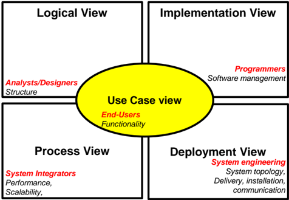
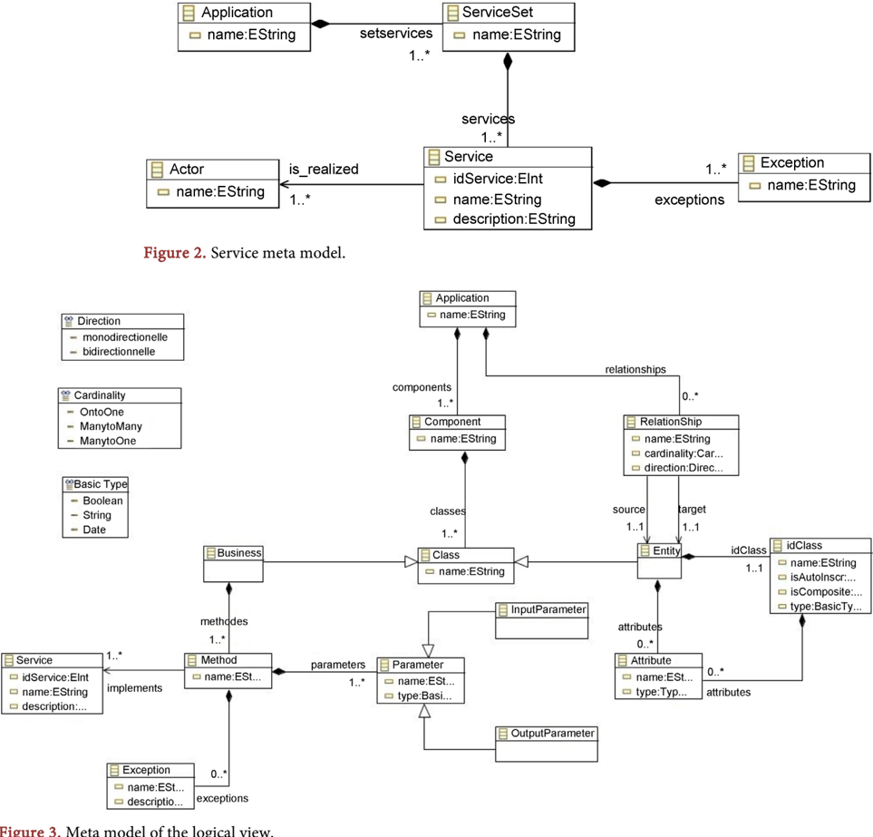
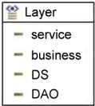
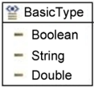
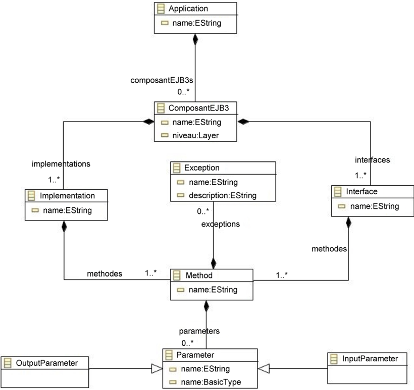
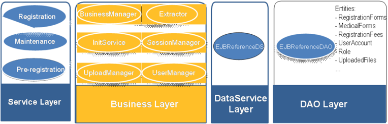
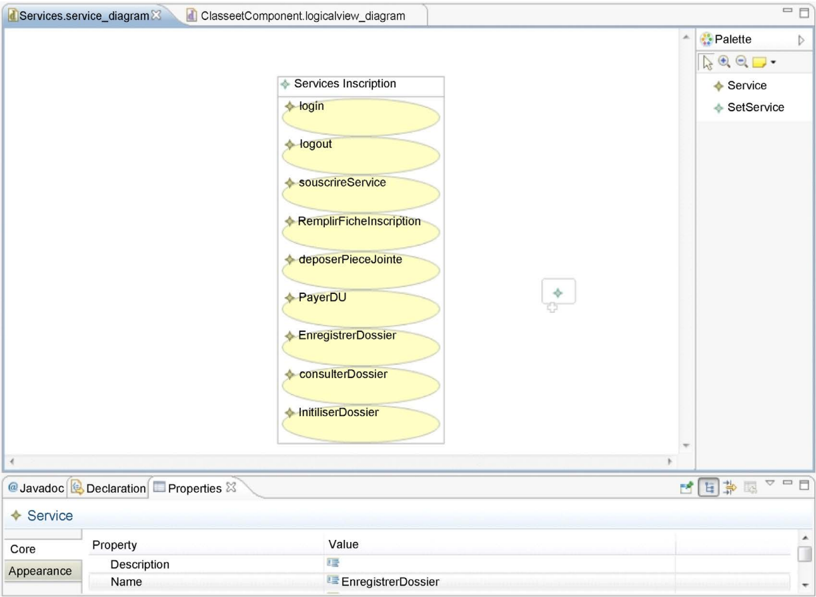
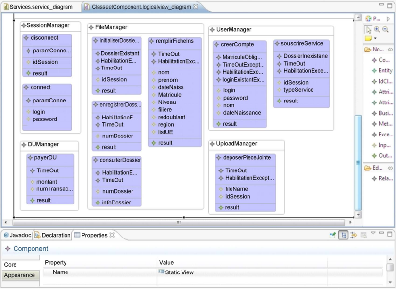
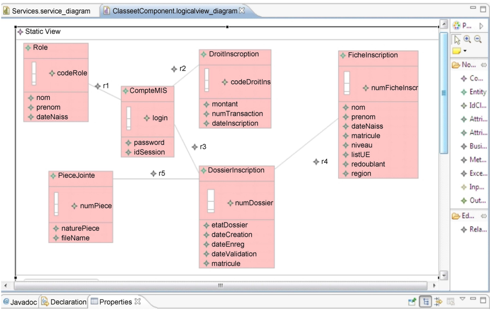

http://www.scirp.org/journal/jsea

ISSN Online: 1945-3124

ISSN Print: 1945-3116

## A Structural and Generative Approach to Multilayered Software Architectures

## Georges Edouard Kouamou 1 , Willy Kengne Kungne 2

1 Department of Computer Engineering, National Advanced School of Engineering, Yaounde, Cameroon 2 Department of Computer Science, Faculty of Science, University of Yaounde I, Yaounde, Cameroon

How to cite this paper: Kouamou, G.E. and Kungne, W.K. (2017) A Structural  and Generative Approach to Multilayered Software Architectures. Journal of Software Engineering and Applications, 10, 677-692.

## Abstract

https://doi.org/10.4236/jsea.2017.108037

Received: May 2, 2017

Accepted: July 8, 2017

Published: July 11, 2017

Copyright © 2017 by authors and Scientific Research Publishing Inc. This work is licensed under the Creative Commons Attribution International License (CC BY 4.0).

http://creativecommons.org/licenses/by/4.0/

The layered software architecture is the model commonly adopted for the development of information systems since it favors the modularity and the scalability of the systems. On the other hand, the emergence of model engineering  aims  to  raise  the  level  of  abstraction  to  allow  developers  to  reason  on models,  and  less  in  code.  The  research  question  is  to  combine  the  two  approaches to facilitate the work of developers. The proposal resulting from this study  is  based  on  a  set  of  concepts  defined  using  the  UML  profiles.  These concepts  include  services,  business  components,  and  data  persistence.  Then the Kruchten model is adopted to represent the development cycle according to several views, each view being represented by UML diagrams derived from the  previously  defined  profiles.  Finally,  rules  are  available  for  checking  inter-view consistency, from refinement to code generation. The result is a step towards the definition of a domain specific ADL and a development process as much as it includes the expected characteristics of such a language, namely: the fundamental concepts, the support tools and the multiview development.

## Keywords

ADL, Architectural Style, Model Driven Engineering, UML, Service, Software Development Process

## 1. Introduction

The  software  architectures  describe  in  a  symbolic  and  schematic  manner  the various constituent elements of computer systems, their interrelations and their interactions. The architectural styles specify the nature of the components, the connectors,  the  topological  distribution  of  these  components,  indicating  their relations and a set of semantic constraints. The development of software architectures in the software industry has led to the development of a generation of

languages so-called Architectural Description Language (ADL).

An ADL is a language that provides functionality for modeling the conceptual architecture  of  a  software  system.  An  ADL  provides  a  concrete  syntax  and  a conceptual framework for characterizing architectures. It should explain the basic concepts of the software architectures that are: components, connectors and configurations. To be valued, an ADL must provide a set of support tools for the development of architectures and their evolution [1]. In  this context,  multiple architectural views must be offered to developers through which they appreciate the consistency of the system being built. However, most of the known languages in this domain have not been imposed on software developers and builders for two reasons: 1) they require advanced knowledge in formal theories, 2) they are limited  only  to  the  description  of  the  architecture  and  its  verification,  without worrying about the implementation of the functionalities of the application [2].

UML provides simple graphical notations with understandable semantics for specifying, viewing, modifying, and building the necessary documents for software development. Recent developments in this modeling language have explicitly introduced the fundamental concepts of software architectures. It thus positions  itself  as  a  candidate  for  the  massification  of  software  architectures  [3]. First because it is accepted by the software manufacturers and the academic milieu. Then it is commonly used by most developers. In this situation, it is important  to  be  able  to  represent  the  whole  development  cycle  within  an  ADL.  Although UML through the diagrams it offers, presents the different abstractions of the system to be designed and it complies with the various architectural views as defined by the Kruchten model [4], it does not define a process of refinement to lead to the implementation. Apart from the transformation of the class diagram into  code  that  is  automatic,  the  refinement  process  for  new  architectural  concepts in UML is usually done manually. From these facts, UML considered alone does not offer all the features that are expected of an ADL.

In this paper, we propose a framework for the construction of software architectures based on UML, which we combine with the Kruchten model to satisfy certain missing characteristics, in particular the definition of architectural views. Once  this  choice  is  adopted,  we  focus  on  the  development  of  the  refinement mechanisms to ensure the coherence between views and to transform the conceptual elements into structural components of the application. We will take into account the use case view that materializes the services offered by the system, and the logical view that includes the  structural elements to derive the implementation  view  in  a  layered  architectural  style.  For  this  purpose,  we  define  a UML  profile  and  transformation  rules  described  with  Atlas  Transformation Language (ATL) [5].

The remainder of this article is organized as follows. Section 2 presents a state of the art on software architectures and the study of some ADLs in order to position our preoccupation with the existing ones. In Section 3 we propose the models underlying our approach to design a domain specific ADL. This approach is based on the use of UML metamodels through the Model Driven Architecture

(MDA)  approach  advocated  by  the  OMG.  Section  4  details  the  experimental framework in which a tool is implemented to support the proposed approach. Next the section 5 presents the validation of this tool which is carried out on the construction  of  the  back-end  of  an  application  for  managing  registration  in  a university. Section 6 presents the conclusion and some thinking for future studies.

## 2. Background

## 2.1. ADL

An ADL provides a concrete syntax and a conceptual framework for characterizing  architectures.  Each  ADL  must  rely  on  a  set  of  fundamental  concepts namely components, connectors and configurations. In addition to these concepts, an ADL must have some minimal features which are mainly support tools: architecture editor, refinement, code generator and architecture evolution management [1]. In the literature, we distinguish three approaches in the definition of ADL.

The first approach consists of native languages specifically designed to specify software  architectures:  Wright,  Darwin,  Rapide.  The  fundamental  concepts mentioned above are the elementary entities  they  offer.  If  they  offer  the  main characteristics  among those expected of  an  ADL in this  case specification editors,  static  and  dynamic  analysis  tools,  sometimes  code  generators  in  a  programming language, the main disadvantage of these Languages remain their heterogeneous terminology and their restriction to specific communities or application domains [6].

The second approach consists to extend a common programming language by incorporating  the  basic  concepts  of  ADLs.  ArchJAVA  is  an  illustration  [7].  If these ADLs allow the user to remain in his familiar language by exploiting his usual environment, this approach has the disadvantage of covering only the implementation view.

The third type consists of the languages that can be used as a common interchange format for architecture design tools. Acme is an illustration [8]. They are used to exchange one architecture format to another. Therefore they can be used as  a  pivot  language  between  two  architectures  defined  in  two  different  ADLs. Some may provide a basis for developing new ADL. The principle is based on a simple structure that takes up the basic structure of all the ADLs and the properties allowing to define auxiliary information, which supplement the description of  the  architecture.  Their principal  shortcoming is the  absence of mechanisms for analysis and code generation [6].

## 2.2. UML as an Approach to the Dissemination of ADL

UML is a modeling language based on graphical symbols to represent a system. It  provides  users  with  different  diagrams  that  put  together,  form  a  complete modeling of the system. UML does not impose any design methodology, that is, UML does not impose a particular way for the use of the diagrams it offers. Each

diagram must respect the syntax defined in its specification. Starting with version  2.0  UML improves its component diagram which explicitly takes into account the basic concepts of an ADL.

UML has  a  well-defined  syntax.  It  is  widely  adopted  by  developers  and  its evolution is  supported by several manufacturers. Each diagram can be used in one  of  the  views  of  the  Kruchten  architectural  model  [4].  This  symbiosis  between UML and the 4 + 1 views model promotes an architectural design method to which it will be necessary to associate support tools to build a true ADL [9]. Taking this into account, the concept of architectural style in the method should be  made  explicit  and  the  coherence  between  the  different  diagrams  should  be ensured.

## 3. Modeling Approach

The  traditional  IT  organizational  structures  of  the  most  companies  closely matches the layered architecture style. Nowadays this style is adopted for most Enterprise Information Systems consisting of four standard layers: presentation, business, persistence, and database [10]. This purpose of the approach is to develop a specific language dedicated to the description of layered software architectures.

With  regard  to  the  characteristics  as  defined  by  [11],  it  is  essential  to  have within the same ADL several views presenting different aspects of the architecture of the system. Krutchten's 4 + 1 views model allows to appreciate all the views of the system throughout the development. Each view can be represented by UML diagrams. In order to manipulate these models, OMG standardizes a model driven  approach  so-called  Model  Driven  Architecture  (MDA)  which  introduces UML extension mechanisms.

## 3.1. Kruchten Model

During the software development process, each step presents a different abstraction from the system to be designed. These different abstractions in Figure 1 derive the notion of view in the process model.

Figure 1. The 4 + 1 views model.

The logical view includes the structural elements (classes, components) of the design. It is the view that is at the heart of reuse. The process view captures the dynamics  and  timing  of  design  aspects.  The  physical  or  deployment  view  describes how the software is mapped to the hardware and reflects its distributed configuration. The implementation view describes the organization of the system source code. Finally, the central view shows the use cases that represent the functional requirements of the application.

Each view of this model is represented by UML diagrams. The central view (use  case  view)  is  illustrated  by  the  use  case  diagram,  the  logical  view  can  be represented  by  the  class  and  component  diagrams,  the  process  view  can  be represented by the activity diagram, State Chart diagram, Interaction diagram. The implementation view can be represented by the class diagram and also the component diagram since a UML component is a database, a source file, a Dynamic Link Library (DLL) and the deployment view can be represented by the deployment diagram.

Recent versions of UML aim to increase the level of abstraction by advocating model engineering [12]. This is equivalent to making the UML models perennial and  allowing  them  to  be  free  from  the  execution  platforms.  Among  the  new characteristics introduced are [13]:

- The elaboration of a Document Type Definition (DTD) for UML2.0 according to the XMI standard. It shows the importance of XMI which is the standard par excellence capable of exchanging models.
- Component-based development: UML2.0 supports the component paradigm, it  defines  profiles  to  support  Corba  Component  Model  (CCM)  and  Enterprise  Java  Bean  (EJB)  component  model  and  it  enables  profiles  for  other component platforms.

These characteristics  favor  the  definition  of  reusable  architectures  and  their storage in XMI format. The MDA approach intervenes in the definition of models and also in their transformations.

## 3.2. The MDA Approach

MDA is a set of modeling and model transformation techniques standardized by the OMG [14]. This approach advocates the use of models in the different phases of the development cycle of an application. Specially, it aims to develop model requirements, model analysis and design and code models. The transformations make it possible to link these different models.

## 3.2.1. Requirements Model

The first thing to do when building an application is to specify the client's requirements  to  define  what  services  are  offered  by  the  future  application.  Requirements are specified in a requirements model called Computation Independent Model (CIM). It allows to clearly express the links of traceability with the models that will be built in the other phases of the development cycle of the application.  With  UML, a requirements  model can be  summarized as  a use case diagram.

## 3.2.2. PIM Analysis and Design Models

It is during analysis and design that the software architecture of the application is realized. In the MDA approach, this phase also uses a Platform Independent Model (PIM). PIMs assure the transition from the requirements model (functionality)  to  the  implementation  model  so-called  Platform  Specific  Model (PSM).

## 3.2.3. PSM Code Models

Code generation begins after the PIM is obtained. This phase is tricky because the code patterns and the source code of the application can be confused.

## 3.2.4. Transforming Models

The transformations of models allow the mapping from one model to another. Because  the  transformation  is  at  the  heart  of  MDA,  OMG  has  standardized Query/View/Transformation (QVT) whose ATL is an implementation in the Eclipse  environment  [15].  This  language  allows  to  describe  rules  to  transform  a model into another one as well as query queries making it possible to convert a model into text.

## 3.3. The Steps of the Proposed Approach

The approach includes three steps that  are similar to  analysis, design and implementation. The first step concerns the requirements analysis that lists the expected services.  These  services  are  grouped  in  the  boundary  layer  between  the clients and the business application. The introduction of a service layer aims to satisfy the needs of the modern information systems characterized by the adoption  of  Service-Oriented  Architecture  (SOA)  principles  [16].  The  second  step deals with the identification of business components that implement the services identified during the requirements analysis. Because these components manipulate persistent entities, they must be identified and gathered to create the structure of the database in the third step.

The approach consists of three views. Each view represents a different aspect of  the  system  and  contains  a  modeling  formalism  to  represent  its  elements. These three views are:

- The central view (Service view): this is the view allowing to specify the user requirements in the form of use cases.
- The logical view: this is the view used to specify the class models as well as the business components.
- The implementation view: it is the view to check the consistency between the two other modules, to transform and refine their models to have a skeleton of code for which we preferred, without harming the generality, the technology Java for experimentation.

## 3.3.1. The Service View

This view describes the use cases that are the services provided by the application. Its modeling formalism is presented by the UML metamodel of Figure 2.

The meta-class Service allows to specify the functionalities of the application

as a services. It is composed of a set of exceptions represented by the Exception meta-class. The services are performed by actors represented by the meta-class Actor. In order to regroup the services by packages we defined a meta-class ServiceSet which gathers a set of services. This meta-model characterizes a CIM for an application that translates the functional requirements into the framework of services.

## 3.3.2. The Logical View

This view describes the database model in the form of a class diagram as well as the business components. A business component specifies the provided services and the required services as methods signature i.e. with their input and output parameters. Figure 3 describes the model formalism for this module. This figure contains the following classes:

Figure 3. Meta model of the logical view.

- Entity: coupled with Relationship describes persistent entities that require a Data Base Management System (DBMS) for their storage. Attribute and IdClass  respectively  represent  the  concepts  that  describe  respectively  the attributes and the keys of the different tables.
- Business: describes the interfaces of the business components. The services of these components are represented by Methods that have parameters (Parameter) that can be input parameters (Input Parameter) or output parameters (Output  Parameter).  The  services  declared  in  the cohesion  ADL  Service module are implemented by the methods of this module.
- Direction, Cardinality and Type Primitive are enumerated types. They define new types.

The models conforming to this formalism are considered as PIM in the sense that they are independent to the implementation platform.

## 3.3.3. The Implementation View

This third view makes it possible to:

- Check the consistency between the other two views.
- Transform the obtained PIM model into PSM close to the EJB3 components.
- Refine the previous PSM to obtain a code skeleton in Java including a layer of web services to manage client heterogeneity, an EJB component layer and a data access layer.

## Consistency check

It consists in ensuring that each identified service is implemented at the level of the business. Let's consider C the set of business components and S the set of registered services. Let us define on C the 'use' relation. Two business components 1 c and 2 c are related if one uses at least one service provided by the  other.  Groups  are  thus  formed  which  are  similar  to  equivalence  classes whose constituent elements are subsets of components which interact with one another. Let us note [ ] C the new set constituted by these groups.

Let's define the application: [ ] [ ] { } : ; , 1 i f C S f c s S i k → = ∈ = ⋅ ⋅ ⋅ which identifies the set of services implemented by a group of components.

1) If there is an element of C that does not belong to any equivalence class and does not implement any service of S then this business component is irrelevant.

A warning message is generated containing these irrelevant components so that the designer can take corrective action.

2) If an element of [ ] C has no image in S, then this group is irrelevant. In this case, the business components that constitute it appear in the warnings file.

- 3)  If f is  surjective  then  any  service s S ∈ has  an  implementation  in C. Otherwise, the service with no antecedent is reported in the warnings log.

This rules ensures consistency between the service view and the logical view. The  coherence  intra-view  (logical)  is  ensured  by  the  associations  defined  between the entities of the metamodel.

## Transformation and refinement of models

After the step of checking the consistency, if the set difference is empty, we transform the obtained model by federating the two models from the first two

views  (service  and  logic)  into  a  model  of  code  conforming  to  the  formalism represented in Figure 4. As the JEE platform is chosen for the validation of the approach, it only remains to refine the models in order to deliver the Java code skeleton consisting of EJB3 components. The ATL script used for this purpose has 10 rules and 17 helper.

1) Refinement of the service layer. The transformation program contains rules that map a SetService to an EJB3 Component for the Service Layer and the methods for the interface and implementation of the EBJ3 component are obtained by transforming the Business Class methods (Figure 3) that perform the Services  that  make up the SetService. The model is decorated with JAX-WS annotations (Java Annotation XML-Web Service). The Web Services will have to allow interoperability with  presentation layer  whatever its  nature (Web, Desktop,  Android, etc…).

2) Refinement of the business layer. The business layer contains EJB3 components constructed from the formalism presented in the logical view. In the latter, the Business class is transformed into the EJB3 component and its methods are

Figure 4. Metamodel towards EJB3 components.

transformed into methods for the interface and the implementation of the EJB3 component.

3) Refinement of the Data Access Object (DAO) layer. The DAO layer is built from the Entity, Attribute, IdClass, and RelationShip classes of the logical view. It of a sublayer containing of the entities that will be mapped to the tables in the database  and  another  sub-layer  (Data  Service)  that  provides  creation,  modification, deletion, and persistent feature search services. The DS layer encapsulates the services offered by the DAO layer and presents them to the business layer.

Since the EJB3 components for these two layers provide basic services for inserting, deleting, creating, and searching data entities, they will be closely refined from the Entity.

## 4. Experimentation Framework

To facilitate the creation of software architectures according to the approach and the reference style described in this paper, the support tools are built as an Eclipse plug-in using the following software: Eclipse Modeling Framework (EMF), Graphical Modeling Framework (GMF) and ATL.

## 4.1. Presentation of the Tools Used

EMF is a modeling framework that includes code generation from a data model. This is a Java implementation of a subset of the OMG MOF standard. To avoid ambiguities  with  MOF,  the  EMF  models  conform  to  the  eCORE  meta-model. We use EMF to construct the formalism of our models. Each view corresponds to a formalism represented by an .ecore extension file. However EMF does not offer graphic tools for modeling that is why GMF is also used. GMF is a framework allowing to create, from a data model, a graphics editor based on the Eclipse platform. This tool is composed of EMF and GEF. GEF is composed of two parts:

- Graphical Definition Model: represented by the extension file .gmfgraph allows to specify the graphic elements of the model.
- Tooling Definition Model: represented by the .gmftool extension file is used to specify the elements of the palette.

In order to link EMF models to GEF, GMF assembles through the mapping model, a file with the gmfmap extension. For each element of the Graphical Definition Model, it is assigned a node and an action as well as the corresponding class of the data model. After this step, you can generate a new .gmfgen file, gathering all the information in the project.

ATL allows to specify  the  transformation  rules  for  models  from  the  service and logical views to obtain the implementation view. Once the different views are modeled (logical view and service view), their representation are merged into a unique XMI. The XMI file that results from this merging is transmitted to the refinement module whose code is written in ATL which checks the consistency, transforms and generates the corresponding structured Java code.

## 4.2. Case Study: A University Registration Application

The on-line registration application allow the students of a university to register from  a  computer  (Laptop,  Desktop)  or  a  mobile  terminal  (phone,  PDA,  etc.). For this purpose, they must be able to pay their registration fees, complete the registration forms, get the medical form from an authorized doctor, and upload the documents which justifies their status. Then the 'Registration Agent' must be able to consult and manage the students' files in order to validate or reject a file.

Some constraints: 1) the payment of fees will be done by a mobile or electronic means of payment, 2) any person must subscribe to the service in order to have a user account on the platform. The components of the different views are summarized in Table 1.

Once the services are identified, they are assigned to the business components that  can  perform  them.  Service  behavior  is  entirely  delegated  to  the  business components. In anticipation of interactions with client devices that may be of a varied nature, we consider this layer of services as adapters capable of ensuring compatibility between the system and the user interfaces [17].

The cartography of the business components is defined by factoring behaviors at the service level. This technique avoids having a large number of components in proportion to the services. Other components are added by necessity, for example if the system requires an external component. This is the case of the PaymentManager component, which requires an electronic payment API to manage the financial transactions. Each component includes boxes that each materialize the service provided. In addition to the signature of the service, there are the exceptions that are taken into account.

The graphical representations of the constituents of the various views, shown in Figures A1-A3, are supplemented by textual properties, given by the designer, which describe the inter-view and intra-view relationships. These properties are data provided to instantiate the components from the metamodel. About the relationships between the entities, the developer gives a name, the cardinalities, and the direction. Concerning the business component, one needs to define the operation signature (its name and the type of  each  parameter), the exceptions

Table 1. Summary of the views.

| Services                                        | Business Components   | Entities           |
|-------------------------------------------------|-----------------------|--------------------|
| Login  Logout                                   | Session Manager       | User Account  Role |
| Subscribe                                       | User Manager          | User Account       |
| Upload Document                                 | Upload Manager        | Document           |
| Create File                                     |                       |                    |
| Fill Registration Form  Consult File  Save File | File Manager          | Registration Form  |
| Pay Registration Fees                           | Payment Manager       | Payment            |

The details and graphical overview are shown in Figures A1-A3.

that can be thrown. At the level of services, the association with the business operation that must implement each of them is required.

## 5. Evaluation

The tool in its current state allows to generate the back-end code of a given application. Figure 5 shows the corresponding architecture of the generated code. The  Service  layer,  DataService  layer  and  DAO  layer  are  generated  integrally therefore  do  not  need  to  be  completed.  Only  the  instructions  of  the  business layer are written manually because, at this stage of thinking, the dynamic view is not taken into account.

Automatic generation as well as the proper organization of the code have an impact on the productivity of the developers and the quality of the final software for many reasons:

- The reduction of the  programming delay since the programmer deals only with the business components.
- The lisibility of the application code.
- The improvement of the reuse and the extensibility of the software because of the adoption of a component-based approach.

Among the 4 layers, 3 are fully generated, i.e. 75%. These are the DAO, DataService  and  Services  layers.  The  4th  layer  contains  the  technical  requirements and the beans corresponding to the service calls. On this basis, we estimate that the development team will be responsible for writing 20% of the volume of the code  needed  to  implement  an  application.  This  code  corresponds  to  the  bean body instructions.

## 6. Conclusions and Further Works

Software  architectures  have  proven  importance  in  the  software  development process. Among the architectural styles reference, layered architectures are predominant especially for structuring information systems, because they favor the modularity, flexibility and scalability of systems. However many platforms like JEE are based on the layered architecture model, but they leave it up to the developers to organize the code manually from the conceptual model.

This study proposes an approach and a support tool for the design of multilayered software architectures. The approach combines the 4 + 1 process model

Figure 5. Architecture of the generated application.

from Krutchten and the use of UML diagrams to facilitate its dissemination. The importance of this work resides in the definition of a domain specific language dedicated to the specification of layered architectures, the assistance to the development team which will focus more on the models and will be less interested in the structure of the code.

The resulting tool is built in the form of an Eclipse plug-in. It consists of three modules: the first one allows to specify the requirements of the application to be constructed in the form of use cases, the second serves to describe the models of classes and components of the application and finally the transformation module including ATL rules allows to obtain the implementation view from the files obtained from the first two modules. The validation of the model and the experimentation of the prototype are carried out through the application of online registration in an academic institution.

The tool whose the design is presented in this article does not take into account the dynamic and the deployment view of the Kruchten model in order to complete all the views of a software system. These aspects will be taken into account in future versions in order to have a comprehensive tool that facilitates the work of the development team throughout the development process. The deployment aspect is all the more important as most current systems are distributed. It  would be interesting if the resulting environment supports the placement of the constituents on the different nodes of the network.

The basis of our reflection integrates ubiquity and distribution as fundamental aspects  of  modern  systems  such  as  state  in  [18].  The  ubiquity  deals  with  the presentation layer where the work carried out by [19], will be helpful to think on a generic metamodel that will enable us to build the front-end for Information systems,  that  is  independent  to  GUI  libraries  and  device  platforms  (desktop, Web, Android…). For this purpose, we are thinking on coupling the MVC model to the layered style where the model is represented by the backend conforming to the layered structure mentioned in this paper, the controller acts as an adapter to ensure the compatibility between the presentation layer and the services layer.

## References

- [1] Medvidovic, N. and Taylor, R. (2000) A Classification and Comparison Framework for  Software  Architecture  Description  Languages. IEEE  Transactions  on  Software Engineering, 126, 70-93. https://doi.org/10.1109/32.825767
- [2] Kouamou, G.E. (2012) Coherence of Views in the Specification of Software Architectures. ARIMA, 14, 205-216.
- [3] Medvidovic, N., Rosenblum, D.S., Redmiles, D.F. and. Robbins, J.E (2002) Modeling Software Architectures in the Unified Modeling Language. ACM Transactions on Software Engineering and Methodology, 11, 2-57. https://doi.org/10.1145/504087.504088
- [4] Kruchten, P. (1995) Architectural Blueprints-The '4+1' View Model of Software Architecture. IEEE Software, 12, 42-50. https://doi.org/10.1109/52.469759
- [5] Randak, A., Martínez, S. and Wimmer, M. (2011) Extending ATL for Native UML Profile  Support:  An  Experience  Report. Proceedings  of  the 3rd  International Workshop  on  Model  Transformation  with  ATL,  Zürich,  Switzerland,  CEUR-

- WS.org, Vol-742, Jul 2011, 49-62.
- [6] ACCORD  (2002)  Etat  de  l'Art  sur  les  Langages  de  Description  d'Architecture. INRIA.
- https://pdfs.semanticscholar.org/5fb0/c9409a903b296aa86b4e49dc59e7eaff0ef3.pdf
- [7] Aldrich,  J.,  Chambers,  C.  and  Notkin,  D.  (2002)  ArchJava:  Connecting  Software Architecture to Implementation. Proceedings of the ISCE, Orlando, Florida, 19-25 May 2002, 187-197. https://doi.org/10.1145/581339.581365
- [8] Garlan, D., Monroe R. and Wile, D. (1997) Acme: An Architecture Description Interchange  Language. Proceedings  of  CASCON'97,  November  1997,  Toronto,  Ontario, 169-183.
- [9] Hofmeister,  C.,  Kruchten,  P.,  Nord,  R.L.,  Obbink,  H.,  Ran,  A.  and  America,  P. (2007) A General Model of Software Architecture Design Derived from Five Industrial Approaches. Systems and Software, 80, 106-126. https://doi.org/10.1016/j.jss.2006.05.024
- [10] Richards, M. (2015) Software Architecture Patterns. O'Reilly Media, Inc.
- [11] Taylor, N., Medvidovic, N. and Dashofy, E.M. (2009) Software Architecture: Foundations, Theory, and Practice. John Wiley &amp; Sons Publishing, Hoboken.
- [12] Muchandi, V. (2007) Applying 4 + 1 View Architecture with UML 2. Sparx Systems.
- [13] Blanc, X. (2005) MDA in Action. Model Driven Software Engineering, Eyrolles.
- [14] Kleppe,  A.,  Warmer,  J.  and  Bast,  W.  (2003)  MDA  Explained:  The  Model  Driven Architecture: Practice and Promise. Addison-Wesley, Boston.
- [15] Bézévin, J., Jouault, F. and Valduriez, P. (2004) An Eclipse-Based IDE for the ATL Model Transformation Language. Nantes.
- [16] Razavian, M. and Lago, P. (2010) A Frame of Reference for SOA Migration. In: Di Nitto, E. and Yahyapour, R., Eds., Towards a Service-Based Internet. ServiceWave 2010. Lecture Notes in Computer Science, Vol. 6481, Springer, Berlin, Heidelberg, 150-162. https://doi.org/10.1007/978-3-642-17694-4\_13
- [17] Lorenz, A. (2013) Architectural Patterns for Applications with External User Interface Elements. Pervasive and Mobile Computing, 9, 269-280.
- [18] Nabi, F. and Mullins, R. (2011) Moving from Traditional Software Engineering to Componentware. Journal of Software Engineering and Applications, 4, 283-292. https://doi.org/10.4236/jsea.2011.45031
- [19] Belangour,  A,  Sadik,  S.  and  Abbar,  A.  (2017)  Towards  a  Platform  Independent Graphical User Interface. American Journal of Software Engineering and Applications, 6, 5-12. https://doi.org/10.11648/j.ajsea.20170601.12

## Annex

Figure A1. The service requirement model.

Figure A2. Business components represented by an Instance of the PIM.

Figure A3. Data models from persistent classes.

## Submit or recommend next manuscript to SCIRP and we will provide best service for you:

Accepting pre-submission inquiries through Email, Facebook, LinkedIn, Twitter, etc.

A wide selection of journals (inclusive of 9 subjects, more than 200 journals)

Providing 24-hour high-quality service

User-friendly online submission system

Fair and swift peer-review system

Efficient typesetting and proofreading procedure

Display of the result of downloads and visits, as well as the number of cited articles

Maximum dissemination of your research work

Submit your manuscript at: http://papersubmission.scirp.org/

Or contact jsea@scirp.org

