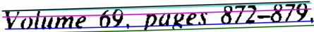
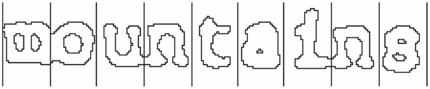
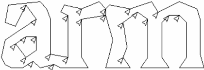
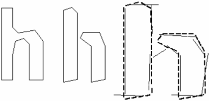
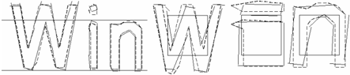

## An Overview of the Tesseract OCR Engine

Ray Smith Google Inc. theraysmith@gmail.com

## Abstract

## 2. Architecture

The Tesseract OCR engine, as was the HP Research Prototype  in  the  UNLV  Fourth  Annual  Test  of  OCR Accuracy[1], is described in a comprehensive overview. Emphasis is placed on aspects that are novel or  at  least  unusual  in  an  OCR  engine,  including  in particular the line finding, features/classification methods, and the adaptive classifier.

## 1. Introduction - Motivation and History

Tesseract  is  an  open-source  OCR  engine  that  was developed at HP between 1984 and 1994. Like a supernova,  it  appeared  from  nowhere  for  the  1995  UNLV Annual Test of OCR Accuracy [1], shone brightly with its  results,  and  then  vanished  back  under  the  same cloak  of  secrecy  under  which  it  had  been  developed. Now for the first time, details  of  the  architecture  and algorithms can be revealed.

Tesseract began as a PhD research project [2] in HP Labs,  Bristol,  and  gained  momentum  as  a  possible software  and/or  hardware  add-on  for  HP's  line  of flatbed scanners. Motivation was provided by the fact that  the  commercial  OCR engines of the day  were in their infancy, and failed miserably on anything but the best quality print.

After a joint project between HP Labs Bristol, and HP's  scanner  division  in  Colorado,  Tesseract  had  a significant lead in accuracy over the commercial engines, but did not become a product. The next stage of its development was back in HP Labs Bristol as an investigation of OCR for compression. Work concentrated  more  on  improving  rejection  efficiency than on base-level accuracy. At the end of this project, at  the  end  of  1994,  development  ceased  entirely.  The engine was sent to UNLV for the 1995 Annual Test of OCR Accuracy[1],  where  it  proved  its  worth  against the  commercial engines of the time. In late 2005, HP released Tesseract for open source. It is now available at http://code.google.com/p/tesseract-ocr.

Since HP had independently-developed page layout analysis  technology  that  was  used  in  products,  (and therefore not released for open-source) Tesseract never needed its own page layout analysis. Tesseract therefore assumes that its input is a binary image with optional polygonal text regions defined.

Processing follows a traditional step-by-step pipeline, but some of the stages were unusual in their day, and possibly remain so even now. The first step is a  connected  component analysis  in  which  outlines  of the components are stored. This was a computationally expensive  design  decision  at  the  time, but  had  a significant  advantage:  by  inspection  of  the  nesting  of outlines,  and  the  number  of  child  and  grandchild outlines, it is simple to detect inverse text and recognize it as easily as black-on-white text. Tesseract was  probably  the  first  OCR  engine  able  to  handle white-on-black text so trivially. At this stage, outlines are gathered together, purely by nesting, into Blobs .

Blobs are organized into text lines, and the lines and regions  are  analyzed  for  fixed  pitch  or  proportional text.  Text  lines  are  broken  into  words  differently according to the kind of character spacing. Fixed pitch text is chopped immediately by character cells. Proportional  text  is  broken  into  words  using  definite spaces and fuzzy spaces.

Recognition then proceeds as a two-pass process. In the  first  pass,  an  attempt  is  made  to  recognize  each word in turn. Each word that is satisfactory is passed to an  adaptive  classifier  as  training  data.  The  adaptive classifier then gets a chance to more accurately recognize text lower down the page.

Since the adaptive classifier  may  have  learned something useful too late to make a contribution near the top of the page, a second pass is run over the page, in which words that were not recognized well enough are recognized again.

A  final  phase  resolves  fuzzy  spaces,  and  checks alternative hypotheses for the x-height to locate smallcap text.

## 3. Line and Word Finding

## 3.1. Line Finding

The line finding algorithm is one of the few parts of Tesseract that has previously  been published [3]. The line  finding  algorithm  is  designed  so  that  a  skewed page  can  be  recognized  without  having  to  de-skew, thus saving loss of image quality. The key parts of the process are blob filtering and line construction.

Assuming  that  page  layout  analysis  has  already provided text regions of a roughly uniform text size, a simple  percentile  height  filter  removes  drop-caps  and vertically touching characters. The median height approximates the text size in the region, so it is safe to filter  out  blobs  that  are  smaller  than  some  fraction  of the  median  height,  being  most  likely  punctuation, diacritical marks and noise.

The filtered blobs are more likely to fit a model of non-overlapping,  parallel,  but  sloping  lines.  Sorting and  processing  the  blobs  by  x-coordinate  makes  it possible  to  assign  blobs  to  a  unique  text  line,  while tracking the slope across the page, with greatly reduced danger  of  assigning  to  an  incorrect  text  line  in  the presence  of  skew.  Once  the  filtered  blobs  have  been assigned  to  lines,  a  least  median  of  squares  fit  [4]  is used  to  estimate  the  baselines,  and  the  filtered-out blobs are fitted back into the appropriate lines.

The  final  step  of  the  line  creation  process  merges blobs that overlap by at least half horizontally, putting diacritical  marks  together  with  the  correct  base  and correctly associating parts of some broken characters.

## 3.2. Baseline Fitting

Once the text lines have been found, the baselines are fitted more precisely using a quadratic spline. This was  another  first  for  an  OCR  system,  and  enabled Tesseract  to  handle  pages  with  curved  baselines  [5], which are a common artifact in scanning, and not just at book bindings.

The  baselines  are  fitted  by  partitioning  the  blobs into groups with a reasonably continuous displacement for the original straight baseline. A quadratic spline is fitted  to  the  most  populous  partition,  (assumed  to  be the baseline) by a least squares fit. The quadratic spline has  the  advantage  that  this  calculation  is  reasonably stable,  but  the  disadvantage  that  discontinuities  can arise  when  multiple  spline  segments  are  required.  A more traditional cubic spline [6] might work better.

Fig. 1. An example of a curved fitted baseline.

Fig.1  shows  an  example  of  a  line  of  text  with  a fitted  baseline,  descender  line, meanline  and  ascender line. All these lines are 'parallel' (the y separation is a constant  over  the  entire  length)  and  slightly  curved. The ascender line is cyan (prints as light gray) and the black line above it is actually straight. Close inspection shows that the cyan/gray line is curved relative to the straight black line above it.

## 3.3. Fixed Pitch Detection and Chopping

Tesseract  tests  the  text  lines  to  determine  whether they  are  fixed  pitch.  Where  it  finds  fixed  pitch  text, Tesseract  chops  the  words  into  characters  using  the pitch, and disables the chopper and associator on these words  for  the  word  recognition  step.  Fig.  2  shows  a typical example of a fixed-pitch word.

Fig. 2. A fixed-pitch chopped word.

## 3.4. Proportional Word Finding

Non-fixed-pitch  or  proportional  text  spacing  is  a highly  non-trivial  task.  Fig.  3  illustrates  some  typical problems.  The  gap  between  the  tens  and  units  of '11.9%'  is  a  similar  size  to  the  general  space,  and  is certainly larger than the kerned space between 'erated' and 'junk'. There is no horizontal gap at all between the  bounding  boxes  of  'of'  and  'financial'.  Tesseract solves most of these problems by measuring gaps in a limited  vertical  range  between  the  baseline  and  mean line. Spaces that are close to the threshold at this stage are  made fuzzy, so that a final  decision  can  be  made after word recognition.

## of 9.59 annually while the Federated iunk fund returned 11.99

Fig. 3. Some difficult word spacing.

## 4. Word Recognition

Part  of  the  recognition  process  for  any  character recognition engine is to identify how a word should be segmented  into  characters.  The  initial  segmentation output from line finding is classified first. The rest of the  word  recognition  step  applies  only  to  non-fixedpitch text.

## 4.1 Chopping Joined Characters

While  the  result  from  a  word  (see  section  6)  is unsatisfactory, Tesseract attempts to improve the result by chopping the blob with worst confidence from the character  classifier.  Candidate  chop  points  are  found from  concave  vertices  of  a  polygonal  approximation [2] of the outline, and may have either another concave vertex opposite, or a line segment. It may take up to 3 pairs  of  chop  points  to  successfully  separate  joined characters from the ASCII set.

Fig. 4. Candidate chop points and chop.

Fig.  4  shows  a  set  of  candidate  chop  points  with arrows  and  the  selected  chop  as  a  line  across  the outline where the 'r' touches the 'm'.

Chops are executed in priority order. Any chop that fails to improve the confidence of the result is undone, but  not  completely  discarded  so  that  the  chop  can  be re-used later by the associator if needed.

## 4.2. Associating Broken Characters

When  the  potential  chops  have  been  exhausted,  if the  word  is  still  not  good  enough,  it  is  given  to  the associator .  The  associator  makes  an  A*  (best  first) search of the segmentation graph of possible combinations  of  the  maximally  chopped  blobs  into candidate characters. It  does this without  actually building the segmentation graph, but instead maintains a hash table of visited states. The A* search proceeds by pulling candidate new states from a priority queue and evaluating them by classifying unclassified combinations of fragments.

It may be argued that this fully-chop-then-associate approach is at best inefficient, at  worst  liable  to  miss important  chops,  and  that  may  well  be  the  case.  The advantage is that the chop-then-associate scheme simplifies the data structures that would be required to maintain the full segmentation graph.

Fig. 5. An easily recognized word.

When the A* segmentation search was first implemented  in  about  1989,  Tesseract's  accuracy  on broken  characters  was  well  ahead  of  the  commercial engines  of  the  day.  Fig.  5  is  a  typical  example.  An essential part of that success was the character classifier that could easily recognize broken characters.

## 5. Static Character Classifier

## 5.1. Features

An  early  version  of  Tesseract  used  topological features  developed  from  the  work  of  Shillman  et.  al. [7-8] Though nicely independent of font and size, these features  are not robust  to  the  problems  found  in reallife  images,  as  Bokser  [9]  describes.  An  intermediate idea  involved  the  use  of  segments  of  the  polygonal approximation as features, but this approach is also not robust  to  damaged  characters.  For  example,  in  Fig. 6(a), the right side of the shaft is in two main pieces, but in Fig. 6(b) there is just a single piece.

Fig. 6. (a) Pristine 'h, (b) broken  'h', (c) features matched to prototypes.

The  breakthrough  solution  is the idea that the features  in the  unknown need not be the same as the features in the training data. During  training, the segments of a polygonal approximation [2] are used for features,  but  in recognition,  features  of  a  small,  fixed length  (in  normalized  units)  are  extracted  from  the outline and matched many-to-one against the clustered prototype features of the training data. In Fig. 6(c), the short,  thick  lines  are  the  features  extracted  from  the unknown,  and  the  thin,  longer  lines  are  the  clustered segments of the polygonal approximation that are used as prototypes. One prototype bridging the two pieces is completely unmatched. Three features on one side and two on the other are unmatched, but, apart from those, every  prototype  and  every  feature  is  well  matched. This example shows that this process of small features matching large  prototypes  is  easily  able  to  cope  with recognition  of  damaged  images.  Its  main  problem  is that the computational cost of computing the distance between an unknown and a prototype is very high.

The features extracted from the unknown are thus 3dimensional, (x, y position, angle),  with  typically  50100 features in a character, and the prototype features are  4-dimensional  (x,  y,  position,  angle,  length),  with typically 10-20 features in a prototype configuration.

## 5.2. Classification

Classification proceeds as a two-step process. In the first step, a class pruner creates a shortlist of character classes  that  the  unknown  might  match.  Each  feature fetches, from a coarsely quantized 3-dimensional lookup table, a bit-vector of classes that it might match, and the  bit-vectors  are  summed  over  all  the  features.  The classes  with  the  highest  counts  (after  correcting  for expected number of features) become the short-list for the next step.

Each feature of the unknown looks up a bit vector of  prototypes  of  the  given  class  that  it  might  match, and then the actual similarity between them is computed. Each prototype character class is represented  by  a  logical  sum-of-product  expression with each term called a configuration ,  so  the  distance calculation process keeps a record of the total similarity evidence of each feature in each configuration,  as  well  as  of  each  prototype.  The  best combined distance, which is calculated from the summed  feature  and  prototype  evidences,  is  the  best over all the stored configurations of the class.

## 5.3. Training Data

Since  the  classifier  is  able  to  recognize  damaged characters  easily,  the  classifier  was  not  trained  on damaged characters. In fact, the classifier was trained on a mere 20 samples of 94 characters from 8 fonts in a single  size,  but  with  4  attributes  (normal,  bold,  italic, bold italic), making a total of 60160 training samples. This is a significant contrast to other published classifiers, such as the Calera classifier with more than a  million  samples  [9],  and  Baird's  100-font  classifier [10] with 1175000 training samples.

## 6. Linguistic Analysis

Tesseract contains relatively little linguistic analysis.  Whenever  the  word  recognition  module  is considering a new segmentation, the linguistic module (mis-named  the  permuter)  chooses  the  best  available word  string  in  each  of  the  following  categories:  Top frequent  word,  Top  dictionary  word,  Top  numeric word,  Top  UPPER  case  word,  Top  lower  case  word (with  optional  initial  upper), Top  classifier  choice word.  The  final  decision  for  a  given  segmentation  is simply the word with the lowest total distance rating, where each of the above categories is multiplied by a different constant.

Words  from different segmentations  may  have different  numbers  of  characters  in  them.  It  is  hard  to compare these words directly, even where a classifier claims  to  be  producing  probabilities,  which  Tesseract does  not.  This  problem  is  solved  in  Tesseract  by generating two numbers for each character classification. The first, called the confidence, is minus the normalized distance from the prototype. This enables it to be a 'confidence' in the sense that greater numbers are better, but still a distance, as, the farther from zero, the greater the distance. The second output, called  the  rating,  multiplies  the  normalized  distance from  the  prototype  by  the  total  outline  length  in  the unknown  character.  Ratings  for  characters  within  a word  can  be  summed  meaningfully,  since  the  total outline length for all characters within a word is always the same.

## 7. Adaptive Classifier

It  has  been  suggested  [11]  and  demonstrated  [12] that  OCR  engines  can  benefit  from  the  use  of  an adaptive classifier. Since the static classifier has to be good at generalizing to any kind of font, its ability to discriminate  between  different  characters  or  between characters  and  non-characters  is  weakened.  A  more font-sensitive  adaptive  classifier  that is  trained  by  the output  of  the  static  classifier  is  therefore  commonly [13] used to obtain greater discrimination within each document, where the number of fonts is limited.

Tesseract does not employ a template classifier, but uses  the  same  features  and  classifier  as  the  static classifier. The only significant difference between the static  classifier  and  the adaptive  classifier, apart  from the  training  data,  is  that  the  adaptive  classifier  uses isotropic  baseline/x-height normalization,  whereas  the static  classifier  normalizes  characters  by  the  centroid (first  moments)  for  position  and  second  moments  for anisotropic size normalization.

The baseline/x-height normalization makes it easier to distinguish upper and lower case characters as well as  improving  immunity  to  noise  specks.  The  main benefit of character moment normalization is removal of  font  aspect  ratio  and  some  degree  of  font  stroke width. It also makes recognition of sub and superscripts simpler, but requires an additional classifier feature to distinguish some upper and lower case characters. Fig. 7 shows an example of 3 letters in baseline/x-height normalized form and moment normalized form.

Fig. 7. Baseline and moment normalized letters.

## 8. Results

Tesseract was included in the 4 th UNLV annual test [1] of OCR accuracy, as 'HP Labs OCR,' but the code has  changed a lot  since  then, including  conversion  to Unicode and retraining. Table 1 compares results from a recent  version  of  Tesseract  (shown  as  2.0)  with the original 1995 results (shown as HP). All four 300 DPI binary  test  sets  that  were  used  in  the  1995  test  are shown,  along  with  the  number  of  errors  (Errs),  the percent error rate (%Err)  and  the  percent  change relative to the 1995 results (%Chg) for both character errors  and  non-stopword  errors.  [1]  More  up-to-date results are at http://code.google.com/p/tesseract-ocr.

Table 1. Results of Current and old Tesseract.

|     |       | Character   | Character   | Character   | Word   | Word   | Word   |
|-----|-------|-------------|-------------|-------------|--------|--------|--------|
| Ver | Set   | Errs        | %Err        | %Chg        | Errs   | %Err   | %Chg   |
| HP  | bus   | 5959        | 1.86        |             | 1293   | 4.27   |        |
| 2.0 | bus   | 6449        | 2.02        | 8.22        | 1295   | 4.28   | 0.15   |
| HP  | doe   | 36349       | 2.48        |             | 7042   | 5.13   |        |
| 2.0 | doe   | 29921       | 2.04        | -17.68      | 6791   | 4.95   | -3.56  |
| HP  | mag   | 15043       | 2.26        |             | 3379   | 5.01   |        |
| 2.0 | mag   | 14814       | 2.22        | -1.52       | 3133   | 4.64   | -7.28  |
| HP  | news  | 6432        | 1.31        |             | 1502   | 3.06   |        |
| 2.0 | news  | 7935        | 1.61        | 23.36       | 1284   | 2.62   | -14.51 |
| 2.0 | total | 59119       |             | -7.31       | 12503  |        | -5.39  |

## 9. Conclusion and Further Work

After lying dormant for more than 10 years, Tesseract is  now behind the leading commercial engines  in  terms  of  its  accuracy.  Its  key  strength  is probably its unusual choice of features. Its key weakness is probably its use of a polygonal approximation as input to the classifier instead of the raw outlines.

With internationalization done, accuracy could probably  be  improved significantly  with  the  judicious addition  of  a  Hidden-Markov-Model-based  character n-gram model, and possibly an improved chopper.

## 10. Acknowledgements

The author would like to thank John Burns and Tom Nartker  for  their  efforts  in  making  Tesseract  open source, the ISRI group at UNLV for sharing their tools and data, as well as Luc Vincent, Igor Krivokon, DarShyang Lee, and Thomas Kielbus for their comments on the content of this paper.

## 11. References

- [1] S.V. Rice, F.R. Jenkins, T.A. Nartker, The Fourth Annual Test of OCR Accuracy, Technical Report 95-03 , Information Science Research Institute, University of Nevada, Las Vegas, July 1995.
- [2] R.W. Smith, The Extraction and Recognition of Text from Multimedia  Document  Images, PhD  Thesis,  University  of Bristol, November 1987.
- [3]  R.  Smith,  'A  Simple  and  Efficient  Skew  Detection Algorithm via Text Row Accumulation', Proc. of the 3 rd Int. Conf. on Document Analysis and Recognition (Vol. 2), IEEE 1995, pp. 1145-1148.
- [4]  P.J.  Rousseeuw,  A.M.  Leroy, Robust  Regression  and Outlier Detection , Wiley-IEEE, 2003.
- [5]  S.V.  Rice,  G.  Nagy,  T.A.  Nartker, Optical  Character Recognition:  An  Illustrated  Guide  to  the  Frontier ,  Kluwer Academic Publishers, USA 1999, pp. 57-60.
- [6] P.J. Schneider, 'An Algorithm for Automatically Fitting Digitized Curves',  in A.S. Glassner, Graphics  Gems  I , Morgan Kaufmann, 1990, pp. 612-626.
- [7] R.J. Shillman, Character Recognition Based on Phenomenological  Attributes:  Theory  and  Methods, PhD. Thesis , Massachusetts Institute of Technology. 1974.
- [8]  B.A.  Blesser,  T.T.  Kuklinski,  R.J.  Shillman,  'Empirical Tests for Feature Selection Based  on a Pscychological Theory of Character Recognition', Pattern Recognition 8 (2), Elsevier, New York, 1976.
- [9]  M. Bokser, 'Omnidocument Technologies', Proc. IEEE 80 (7), IEEE, USA, Jul 1992, pp. 1066-1078.
- [10] H.S. Baird, R. Fossey, 'A 100-Font Classifier', Proc. of the  1 st Int.  Conf.  on  Document  Analysis  and  Recognition , IEEE, 1991, pp 332-340.
- [11] G. Nagy, 'At the frontiers of OCR', Proc. IEEE 80( 7 ) , IEEE, USA, Jul 1992, pp 1093-1100.
- [12]  G.  Nagy,  Y.  Xu,  'Automatic  Prototype  Extraction  for Adaptive  OCR', Proc.  of  the  4 th Int.  Conf.  on  Document Analysis and Recognition , IEEE, Aug 1997, pp 278-282.
- [13]  I.  Marosi,  'Industrial  OCR  approaches:  architecture, algorithms and adaptation techniques', Document Recognition and Retrieval XIV, SPIE Jan 2007,  6500-01.