## Classificação automática de documentos de características econômicas para defesa jurídica

Bruno Leme

Texto de dissertação para obtenção do título de mestre apresentada ao Instituto de Matemática e Estatística da Universidade de São Paulo

Programa: Ciência da Computação

Orientador: Prof. Dr. Marcelo Finger

São Paulo, fevereiro de 2021

Classificação automática de documentos de características econômicas para defesa jurídica

Esta é a versão submetida para obtenção do título de mestre de Bruno Leme

## Agradecimentos

"Somos a soma de nossas vivências, experiências, alegrias, frustrações, tudo que passa por nossas vidas deixa uma marca..." Sirlandra Barbosa

Eu me sinto muito grato por ter a oportunidade de fazer um mestrado. Não foi uma jornada simples e fácil, porém me proporcionou um abrangente e profundo aprendizado, não apenas intelectual, mas também pessoalmente. Este não pode ser considerado apenas o meu sonho, mas também de todas as pessoas que já estiveram ou que estão presentes em minha vida, desde familiares e amigos, a professores e muitos outros.

Gostaria de agradecer inicialmente ao meu pai Adilson Leme, que mesmo não estando mais neste plano desde meus 11 anos de idade, sempre estará presente em minha vida. Seu orgulho demonstrado com todas as minhas perguntas, sua forma de me conscientizar da importância e valor dos estudos, sua forma de se referir a mim como 'meu filho mais inteligente', todos os seus ensinamentos, visão e pioneirismo como profissional da Análise de Sistemas serve como fonte de inspiração para minha trajetória pessoal e profissional.

Gostaria também de agradecer minha vó Cacilda Nascimento Leme, que mesmo após a partida do meu pai, continuou sempre estimulando eu e meus irmãos a estudar, sempre enfatizando a importância de aprender sempre mais e crescer na vida. Sempre colocou como missão ajudar todos os seus netos a estudar e a fazerem uma faculdade. Com certeza, de onde estiver, estará com muito orgulho por esta conquista de seu neto.

Não posso deixar de agradecer a minha irmã Priscila Leme, a pessoa mais forte que já conheci, que me deu uma lição de vida, de como devemos sempre focar nos nossos sonhos e em ser felizes. Mesmo antes de partir, ela fez questão de me manter para cima, me contando com intensa empolgação sobre matérias que havia visto na televisão sobre Inteligência Artificial, da sua forma buscando garantir que eu seguisse em frente na minha jornada do mestrado.

Assim como ao meu irmão Alexandre Leme Neto, alguém que sempre segui e admirei, não à toa escolhi fazer Ciência da Computação, mesmo curso que ele. Meu irmão também foi a pessoa que me introduziu ao mundo de banco de dados, com seu vasto conhecimento e experiência, me ensinando pessoalmente sobre a linguagem SQL, aprendizado que me guiou a caminhos inimagináveis de mineração de dados, reconhecimento de padrões, aprendizado de máquina, inteligência artificial,

processamento de linguagem natural. Áreas pelas quais sou apaixonado e amo vivenciar no meu dia a dia. Meu irmão, de onde estiver agora, essa conquista também é sua.

À minha mãe Sônia Maria de Souza Leme, agradeço por todo o amor, suporte e carinho que você me dá. Por ser essa fortaleza que me inspira e me traz segurança. Seu incentivo e valorização para meus estudos fez e faz profundo impacto na minha vida, através de atos simples, como exibir minhas provas com boas notas na porta da geladeira de casa.

Também agradeço muito a minha irmã Marília Gabriela Leme, por todo seu apoio e força. Te observar durante a minha infância estudando em seu período universitário, bem como ainda o faz hoje com temas de profundo valor social, me preenche de inspiração. Sua confiança e entusiasmo comigo me incentiva a ser sempre melhor a cada dia.

À minha esposa Rafaela Caroline da Silva Leme, agradeço muito por todo amor, carinho, força, motivação e paciência nestes meus momentos de intenso estudo e trabalho. Sempre me estimulando nos momentos necessários, e garantindo que eu continue sempre em frente. Sem sombras de dúvida, a concretização dessa pesquisa também é uma realização sua. Todas as conquistas são muito maiores por serem divididas com você.

Ao meu tio Edmilson Cardoso, agradeço por ser um grande exemplo de valorização ao crescimento pessoal, acadêmico e profissional. Seu profundo interesse no meu sucesso fazem enorme diferença na minha vida. Tenho grande orgulho e me espelho muito na sua trajetória vencedora.

Sou eternamente grato também à minha mentora Dona Maria Navalha, por todo o amparo, por me ajudar nos momentos de pouca inspiração e por estar sempre presente para todo e qualquer momento de dificuldade.

Agradeço enormemente ao meu orientador, professor Marcelo Finger, pela oportunidade de realizar essa pesquisa de mestrado, por todas as discussões realizadas, pelos conselhos dados, pelo fornecimento de referências que ajudaram com que a pesquisa fosse realizada, e por me motivar e auxiliar nos momentos de grande dificuldade.

Sem deixar também de mencionar o professor Juliano Maranhão pelo grande apoio, incentivo e visão de negócio fornecida para garantir o sucesso na abordagem do problema estudado.

Por fim, agradeço muito ao CADE, pela disponibilização dos dados que permitiram a realização desta pesquisa, com um problema bastante desafiador, que possibilitou o estudo e experimentação de técnicas de estado da arte de uma área pujante, que vêm evoluindo significativamente ao longo dos últimos anos, que irão contribuir muito com minha carreira profissional.

## Resumo

Direito é uma das áreas beneficiadas pelo avanço da Inteligência Artificial, com destaque para automatização de tarefas como previsão de sentenças, diligência prévia, revisão de documentos e análise de propriedade intelectual.

O Conselho Administrativo de Defesa Econômica (CADE), entidade vinculada ao Ministério da Justiça do Governo Federal do Brasil, tem como objetivo garantir a livre concorrência de mercado no território nacional. Uma de suas atribuições se dá pela avaliação e, aprovação ou reprovação, de processos de ato de concentração, que devem ser submetidos para avaliação pelo grupo de agentes econômicos envolvidos, quando a operação atende a determinados requisitos. Uma das tarefas iniciais realizadas nesta atividade se dá pela classificação do rito do processo, que pode ser sumário ou ordinário, de acordo com sua complexidade. A automatização da tarefa de classificação do rito pode acarretar menor burocracia, proveniente do menor tempo de avaliação do processo como um todo.

Este trabalho visa avaliar técnicas de aprendizado de máquina, bem como de aprendizado profundo, que têm demonstrado melhorias no desempenho das tarefas de processamento de linguagem natural, para construção de modelos de classificação automática do rito de processos de ato de concentração, dividindo o problema em dois grandes subproblemas principais: (i) representação numérica e distribuída de palavras e textos de documentos dos processos e (ii) aprendizado supervisionado para classificação do rito indicado dos processos.

Palavras-chave: aprendizado de máquina, aprendizado profundo, processamento de linguagem natural, representação numérica e distribuída de palavras e textos, classificação automática, aprendizado supervisionado.

## Abstract

## LEME, B. Automatic classification of economic-featured documents for legal defense .

Law is one of the areas benefited by the advance of Artificial Intelligence, through the automatization of relevant tasks such as outcome prediction, due dilligence, document review and intellectual property analysis.

The Administrative Council of Economic Defense (CADE), an entity under the Ministry of Justice of Federal Government of Brazil, has the objective of ensure the free market competition on brazilian national territory. One of its attributions is given by the evaluation and approving, or disapproving, of merger cases, that must be submited for approval, by the group of envolved economic agents, when the operation meets specific requiriments. One of the first tasks in this process is given by the classification of the legal procedural rite the proccess must folow, it could be summary or ordinary, according with its complexity. The automatization of this task can result in less bureaucracy, due the shorter time of evaluation of the entire proccess.

This research aims to evaluate machine learning techniques, as well as deep learning techniques, which have shown relevant improvements in several natural language processing tasks, to build automatic classification models to predict the most appropriated legal proccess rite a merger case must follow. We split the problem in two big challenges: (i) word and document embeddings and (iii) supervised learning of the appropriated legal proccess rite.

Palavras-chave: machine learning, deep learning, natural language processing, word embedding, automatic classification, supervised learning.

## Sumário

| Lista de Figuras   | Lista de Figuras                                                                 | Lista de Figuras                                                                 | Lista de Figuras                                                                 | ix   |
|--------------------|----------------------------------------------------------------------------------|----------------------------------------------------------------------------------|----------------------------------------------------------------------------------|------|
| Lista de Tabelas   | Lista de Tabelas                                                                 | Lista de Tabelas                                                                 | Lista de Tabelas                                                                 | xiii |
| 1 Introdução       | 1 Introdução                                                                     | 1 Introdução                                                                     | 1 Introdução                                                                     | 1    |
|                    | 1.1                                                                              | Motivações e Justificativas . . . . . . .                                        | . . . . . . . . . . . . . . . . . . . . . .                                      | 2    |
|                    | 1.2                                                                              | Objetivos . . . . . . . . . . . . . . . . . . . . . . . . . . . . . . . . . .    | . . . .                                                                          | 3    |
|                    | 1.3                                                                              | Contribuições . . . . . . . . . . . . . . . . . . . .                            | . . . . . . . . . . . . . . . .                                                  | 3    |
|                    | 1.4                                                                              | Organização do Trabalho . . . . . . . .                                          | . . . . . . . . . . . . . . . . . . . . . .                                      | 4    |
| 2                  | Trabalhos Relacionados                                                           | Trabalhos Relacionados                                                           | Trabalhos Relacionados                                                           | 5    |
| 3                  | Revisão Bibliográfica                                                            | Revisão Bibliográfica                                                            | Revisão Bibliográfica                                                            | 9    |
|                    | 3.1                                                                              | Representação Vetorial de Palavras - Word Embedding . . . . . . . . . . . .      | .                                                                                | 9    |
|                    |                                                                                  | 3.1.1 . . . . .                                                                  | Bag-of-Words (BOW) . . . . . . . . . . . . . . . . . . . . . .                   | 9    |
|                    | 3.1.2                                                                            | Continuous Skipgram . . . . . . . . . . . . . . . . . .                          | . . . . . . . . . .                                                              | 11   |
|                    | 3.2                                                                              | Aprendizado de Máquina - Machine Learning . . . . . . . .                        | . . . . . . . . . .                                                              | 14   |
|                    |                                                                                  | 3.2.1 . . . . . . . .                                                            | Função de Custo . . . . . . . . . . . . . . . . . . . . . .                      | 15   |
|                    |                                                                                  | 3.2.2 . .                                                                        | Otimização de Parâmetros . . . . . . . . . . . . . . . . . . . . . . .           | 16   |
|                    |                                                                                  | 3.2.3                                                                            | Aprendizado com dados desbalanceados . . . . . . . . . . . . . . . . .           | 18   |
|                    | 3.2.4                                                                            |                                                                                  | Parada Adiantada ( Early Stopping ) . . . . . . . . . . . . . . . . . . . .      | 19   |
| 3.3                | Aprendizado Profundo - Deep Learning . . . . . . . . . . . . . . . . . . . . . . | Aprendizado Profundo - Deep Learning . . . . . . . . . . . . . . . . . . . . . . | Aprendizado Profundo - Deep Learning . . . . . . . . . . . . . . . . . . . . . . | 20   |
|                    | 3.3.1                                                                            | Redes Neurais Convolucionais - Convolutional Neural Networks                     | - (CNN) . . .                                                                    | 20   |
|                    |                                                                                  | 3.3.2                                                                            | Redes Neurais Recorrentes - Recurrent Neural Networks (RNNs) . . .               | 22   |
|                    |                                                                                  | 3.3.3                                                                            | Redes Long Short-Term Memory (LSTM) . . . . . . . . . . . . . . . .              | 23   |
|                    |                                                                                  | 3.3.4 . . . . . . . . . .                                                        | Transformers . . . . . . . . . . . . . . . . . . . . . .                         | 26   |
|                    | 3.3.5                                                                            | . . . . . . . . . . . . . .                                                      | BERT . . . . . . . . . . . . . . . . . . . . . .                                 | 29   |
| 4                  | Metodologia                                                                      | Metodologia                                                                      | Metodologia                                                                      | 33   |
|                    | 4.1                                                                              | Coleta de Dados . . . . . . . . . . . .                                          | . . . . . . . . . . . . . . . . . . . . . .                                      | 34   |
|                    | 4.2                                                                              | Base de Dados . . . . . . . . . . . . .                                          | . . . . . . . . . . . . . . . . . . . . . .                                      | 37   |
|                    |                                                                                  | 4.2.1 . . .                                                                      | Particionamento de Base . . . . . . . . . . . . . . . . . . . . . . .            | 37   |
|                    |                                                                                  | 4.2.2 . . . . . .                                                                | Validação Cruzada . . . . . . . . . . . . . . . . . . . . . . .                  | 37   |
| 4.3                | Análise Descritiva da Base . .                                                   | . . . . .                                                                        | . . . . . . . . . . . . . . . . . . . . . .                                      | 38   |
| 4.4                | Definição do Modelo . . . . . . . . . . . . .                                    | Definição do Modelo . . . . . . . . . . . . .                                    | . . . . . . . . . . . . . . . . . . .                                            | 40   |
|                    | 4.4.1 Modelos Pré-treinados .                                                    | . . . .                                                                          | . . . . . . . . . . . . . . . . . . . . . .                                      | 40   |

|    |                            | 4.4.2                                                                                   | Plataforma de Teste . . . . . . . . . . . . . . . . . . . . . . . . . . . . . . . .   |   40 |
|----|----------------------------|-----------------------------------------------------------------------------------------|---------------------------------------------------------------------------------------|------|
|    |                            | 4.4.3                                                                                   | Processo de Treinamento . . . . . . . . . . . . . . . . . . . . . . . . . . . . . .   |   41 |
|    |                            | 4.4.4                                                                                   | Modelo Baseline . . . . . . . . . . . . . . . . . . . . . . . . . . . . . . . . . .   |   41 |
|    |                            | 4.4.5                                                                                   | Proposta: Continuous Skipgram . . . . . . . . . . . . . . . . . . . . . . . . . .     |   41 |
|    |                            | 4.4.6                                                                                   | BERT - Fine Tuning . . . . . . . . . . . . . . . . . . . . . . . . . . . . . . . .    |   42 |
|    |                            | 4.4.7                                                                                   | Proposta: BERT e CNN . . . . . . . . . . . . . . . . . . . . . . . . . . . . . .      |   44 |
|    |                            | 4.4.8                                                                                   | Proposta: BERT e LSTM . . . . . . . . . . . . . . . . . . . . . . . . . . . . .       |   45 |
|    |                            | 4.4.9                                                                                   | Proposta: BOW + SkipGram . . . . . . . . . . . . . . . . . . . . . . . . . . .        |   45 |
|    |                            | 4.4.10                                                                                  | Proposta: BOW + BERT e CNN . . . . . . . . . . . . . . . . . . . . . . . . .          |   46 |
|    |                            | 4.4.11                                                                                  | Proposta: BOW + BERT e LSTM . . . . . . . . . . . . . . . . . . . . . . . .           |   47 |
|    |                            | 4.4.12                                                                                  | Proposta: BOW + BERT e BiLSTM . . . . . . . . . . . . . . . . . . . . . . .           |   48 |
|    | 4.5                        | Avaliação . . . . . . . . . . . . . . . . . . . . . . . . . . . . . . . . . . . . . . . | . . .                                                                                 |   49 |
| 5  | Resultados                 | Resultados                                                                              | Resultados                                                                            |   53 |
|    | 5.1                        | Avaliação dos Experimentos . . . . .                                                    | . . . . . . . . . . . . . . . . . . . . . . . . . . .                                 |   53 |
|    | 5.2                        | Experimentos Falhos e Lições Aprendidas . . . . . . . . . . . . . . . . . .             | . . . . . .                                                                           |   70 |
|    | 5.3                        | Análise Final . . . . . . . . . . . . . .                                               | . . . . . . . . . . . . . . . . . . . . . . . . . .                                   |   70 |
| 6  | Conclusão                  | Conclusão                                                                               | Conclusão                                                                             |   73 |
|    | 6.1                        | Trabalhos Futuros . . . .                                                               | . . . . . . . . . . . . . . . . . . . . . . . . . . . . . . . . .                     |   73 |
|    |                            | 6.1.1                                                                                   | Variáveis estruturadas . . . . . . . . . . . . . . . . . . . . . . . . . . . . . . .  |   73 |
|    |                            | 6.1.2                                                                                   | Documentos sem omissão de dados sensíveis . . . . . . . . . . . . . . . . . . .       |   74 |
|    |                            | 6.1.3                                                                                   | Reconhecimento de entidades mencionadas - Named Entity Recognition (NER)              |   74 |
|    |                            | 6.1.4                                                                                   | Inclusão de informações externas . . . . . . . . . . . . . . . . . . . . . . . . .    |   74 |
|    |                            | 6.1.5                                                                                   | Sumarização de documentos . . . . . . . . . . . . . . . . . . . . . . . . . . . .     |   74 |
|    | Referências Bibliográficas | Referências Bibliográficas                                                              | Referências Bibliográficas                                                            |   75 |

## Lista de Figuras

|   3.1 | Exemplo do processo de construção de vocabulário, e de definição de representações one-hot . . . . . . . . . . . . . . . . . . . . . . . . . . . . . . . . . . . . . . . . . . .                                                                                                                                                         | 10   |
|-------|------------------------------------------------------------------------------------------------------------------------------------------------------------------------------------------------------------------------------------------------------------------------------------------------------------------------------------------|------|
|  3.2  | Representação de documentos a partir do vocabulário aprendido. . . . . . . . . . .                                                                                                                                                                                                                                                       | 11   |
|  3.3  | Exemplo da tarefa realizada na técnica Skipgram . . . . . . . . . . . . . . . . . . . .                                                                                                                                                                                                                                                  | 11   |
|  3.4  | Arquitetura da rede neural da técnica Skipgram , proposta em [MCCD13]. . . . . .                                                                                                                                                                                                                                                         | 12   |
|  3.5  | Exemplo de definição das amostras de treino do modelo Skipgram . . . . . . . . . . .                                                                                                                                                                                                                                                     | 13   |
|  3.6  | Exemplo de realização de analogias sintáticas e semânticas com as representações numéricas de palavras no modelo Skipgram . Adaptado dos exemplos ilustrados em [MYZ13] . . . . . . . . . . . . . . . . . . . . . . . . . . . . . . . . . . . . . . . . . .                                                                              | 14   |
|  3.7  | Exemplo de otimização de parâmetro para minimização da função de custo J . . .                                                                                                                                                                                                                                                           | 16   |
|  3.8  | Processo de parada adiantada. Após a observação do melhor desempenho na base de validação no tempo t, se o modelo não superar esse desempenho por uma quan- tidade de p (paciência) épocas, o processo de treinamento é encerrado, e o modelo considerado é o da época t . . . . . . . . . . . . . . . . . . . . . . . . . . . . . . . . | 20   |
|  3.9  | Processo de convolução com um filtro f ( i ) com janela de tamanho h = 3 . . . . . .                                                                                                                                                                                                                                                     | 21   |
|  3.1  | Arquitetura de rede neural CNN. Figura adaptada de [Kim14]. . . . . . . . . . . .                                                                                                                                                                                                                                                        | 22   |
|  3.11 | Formato de uma rede do tipo RNN [FGL + 17] . . . . . . . . . . . . . . . . . . . . .                                                                                                                                                                                                                                                     | 23   |
|  3.12 | Arquitetura da rede LSTM. . . . . . . . . . . . . . . . . . . . . . . . . . . . . . . .                                                                                                                                                                                                                                                  | 24   |
|  3.13 | Arquitetura da rede LSTM, desmembrada em instantes de tempo. . . . . . . . . . .                                                                                                                                                                                                                                                         | 25   |
|  3.14 | Estrutura de uma rede neural BiLSTM, observa-se que se tratam de duas estrutu- ras em conjunto, uma no sentido usual de leitura da primeira até a última palavra (forward) e outra no sentido oposto (backward) . . . . . . . . . . . . . . . . . . . . .                                                                                | 25   |
|  3.15 | Arquitetura de uma rede neural do tipo Transformer [VSP + 17] . . . . . . . . . . .                                                                                                                                                                                                                                                      | 26   |
|  3.16 | Subcamada de atenção [VSP + 17] . . . . . . . . . . . . . . . . . . . . . . . . . . . .                                                                                                                                                                                                                                                  | 28   |
|  3.17 | Multi-cabeçalho de auto-atenção [VSP + 17] . . . . . . . . . . . . . . . . . . . . . . .                                                                                                                                                                                                                                                 | 29   |
|  3.18 | Modelo BERT [DCLT18] . . . . . . . . . . . . . . . . . . . . . . . . . . . . . . . . .                                                                                                                                                                                                                                                   | 30   |
|  3.19 | Refinamento do modelo BERT, para a tarefa classificação de sentenças, como a de- sejada na presente pesquisa [DCLT18]. . . . . . . . . . . . . . . . . . . . . . . . . .                                                                                                                                                                 | 31   |
|  3.2  | Refinamento do modelo BERT, para a tarefa classificação da relação entre 2 senten- ças. Recebe 2 sentenças como entrada [DCLT18]. . . . . . . . . . . . . . . . . . . .                                                                                                                                                                  | 31   |
|  3.21 | Refinamento do modelo BERT, para a tarefa de extração de fragmentos de um texto. Ex: extração do fragmento de resposta de uma pergunta dada. Recebe 2 sentenças                                                                                                                                                                          |      |

| 3.22                                    | Refinamento do modelo BERT, para a tarefa de classificação de tokens individuais. Ex: reconhecimento de entidades mencionadas [DCLT18]. . . . . . . . . . . . . . . .                                                                                              | 32   |
|-----------------------------------------|--------------------------------------------------------------------------------------------------------------------------------------------------------------------------------------------------------------------------------------------------------------------|------|
| 4.1                                     | Resumo gráfico com todas as etapas do estudo do problema de classificação do rito de atos de concentração, avaliados pelo CADE. . . . . . . . . . . . . . . . . . . . . .                                                                                          | 34   |
| 4.2                                     | Página de pesquisa de processos de Ato de Concentração . . . . . . . . . . . . . . . .                                                                                                                                                                             | 35   |
| 4.3                                     | Resultado da busca de processos de Ato de Concentração . . . . . . . . . . . . . . .                                                                                                                                                                               | 35   |
| 4.4                                     | Seleção de documentos e geração de PDF consolidado. .                                                                                                                                                                                                              | 36   |
| 4.5                                     | . . . . . . . . . . . . . . . . Organização do processo de validação cruzada, e da verificação do desempenho na base de teste. . . . . . . . . . . . . . . . . . . . . . . . . . . . . . . . . . . . . . . . .                                                     | 38   |
| 4.6 .                                   | Proporção entre ritos dos processos . . . . . . . . . . . . . . . . . . . . . . . . . . .                                                                                                                                                                          | 38   |
| 4.7                                     | Histograma de quantidade de palavras de processos de rito sumário na base de treino                                                                                                                                                                                | 39   |
| 4.8                                     | Histograma de quantidade de palavras de processos de rito ordinário na base de treino                                                                                                                                                                              | 39   |
| 4.9                                     | Histograma de quantidade de palavras de processos de rito sumário na base de teste                                                                                                                                                                                 | 40   |
| 4.10                                    | Histograma de quantidade de palavras de processos de rito ordinário na base de teste                                                                                                                                                                               | 40   |
|                                         | 4.11 Modelo baseline (BOW) para classificação de rito . . . . . . . . . . . . . . . . . . . .                                                                                                                                                                      | 41   |
| 4.12 . . .                              | Proposta de modelo Skipgram . . . . . . . . . . . . . . . . . . . . . . . . . . . .                                                                                                                                                                                | 42   |
| 4.13                                    | Processo de refinamento para a tarefa fim: identificação de rito mais apropriado . . .                                                                                                                                                                             | 43   |
| 4.14                                    | Particionamento do documento em pequenos blocos com sobreposição . . . . . . . .                                                                                                                                                                                   | 44   |
| 4.15                                    | Proposta de modelo utilizando BERT com CNN . . . . . . . . . . . . . . . . . . . . .                                                                                                                                                                               | 44   |
| 4.16                                    | Proposta de modelo utilizando BERT com LSTM . . . . . . . . . . . . . . . . . . . .                                                                                                                                                                                | 45   |
| 4.17                                    | Proposta de modelo de rede neural híbrida utilizando BOW com SkipGram . . . . .                                                                                                                                                                                    | 46   |
| 4.18                                    | Proposta de modelo de rede neural híbrida utilizando BOW com BERT e CNN . . .                                                                                                                                                                                      | 47   |
| 4.19                                    | Proposta de modelo de rede neural híbrida utilizando BOW com BERT e LSTM . .                                                                                                                                                                                       | 48   |
| 4.20                                    | Proposta de modelo de rede neural híbrida utilizando BOW com BERT e BiLSTM .                                                                                                                                                                                       | 49   |
| 5.1                                     | Convergência de erro do modelo baseline ( BOW ) ao longo das épocas, para cada fold de validação. . . . . . . . . . . . . . . . . . . . . . . . . . . . . . . . . . . . . . .                                                                                      | 54   |
| 5.2                                     | Acurácia do modelo baseline ( BOW ) ao longo das épocas, para cada fold de validação.                                                                                                                                                                              | 54   |
| 5.3                                     | Convergência do erro do modelo skipgram com regressão logística ao longo das épo- cas, para cada fold de validação. . . . . . . . . . . . . . . . . . . . . . . . . . . . . .                                                                                      | 55   |
| 5.4 5.5                                 | Acurácia do modelo skipgram com regressão logística ao longo das épocas, para cada fold de validação. . . . . . . . . . . . . . . . . . . . . . . . . . . . . . . . . . . . . . . Ajuste do modelo BERT no processo de refinamento para a configuração de treino/- | 55   |
| validação fold 1. . . . . . . . . . . . | . . . . . . . . . . . . . . . . . . . . . . . . . . .                                                                                                                                                                                                              | 56   |
| 5.6                                     | Ajuste do modelo BERT no processo de refinamento para a configuração de treino/- validação fold 2. . . . . . . . . . . . . . . . . . . . . . . . . . . . . . . . . . . . . . .                                                                                     | 56   |
| 5.7                                     | Ajuste do modelo BERT no processo de refinamento para a configuração de treino/- validação fold 3. . . . . . . . . . . . . . . . . . . . . . . . . . . . . . . . . . . . . . .                                                                                     | 57   |
| 5.8                                     | Ajuste do modelo BERT no processo de refinamento para a configuração de treino/- validação fold 4. . . . . . . . . . . . . . . . . . . . . . . . . . . . . . . . . . . . . . .                                                                                     |      |
| 5.9                                     | Ajuste do modelo BERT no processo de refinamento para a configuração de treino/- validação fold 5. . . . . . . . . . . . . . . . . . . . . . . . . . . . . . . . . . . . .                                                                                         | 57   |
|                                         | . . Convergência do erro do modelo BERT_CNN para cada fold de validação.                                                                                                                                                                                           | 58   |
| 5.10                                    | . . . .                                                                                                                                                                                                                                                            | 59   |

|   5.11 | Acurácia do modelo BERT_CNN para cada fold de validação. . . . . . . . . . .                                                                                                                                                                        |   59 |
|--------|-----------------------------------------------------------------------------------------------------------------------------------------------------------------------------------------------------------------------------------------------------|------|
|   5.12 | Convergência do erro do modelo BERT_LSTM para cada fold de validação. . . .                                                                                                                                                                         |   60 |
|   5.13 | Acurácia do modelo BERT_LSTM para cada fold de validação. . . . . . . . . . .                                                                                                                                                                       |   60 |
|   5.14 | Convergência do erro do modelo de rede neural que combina o padrão BOW com o modelo Skipgram, para cada fold de validação. . . . . . . . . . . . . . . . . . . . .                                                                                  |   61 |
|   5.15 | Acurácia do modelo de rede neural que combina o padrão BOW com o modelo Skip- gram, para cada fold de validação. . . . . . . . . . . . . . . . . . . . . . . . . . . .                                                                              |   61 |
|   5.16 | Convergência do erro do modelo de rede neural que combina o padrão BOW com o modelo CNN aplicado na sequência de representações do token [CLS], calculadas pelo modelo BERT para cada sequência de palavras do documento. . . . . . . . . .         |   62 |
|   5.17 | Acurácia do modelo de rede neural que combina o padrão BOW com o modelo CNN aplicado na sequência de representações do token [CLS], calculadas pelo modelo BERT para cada sequência de palavras do documento. . . . . . . . . . . . . . . . .       |   62 |
|   5.18 | Convergência do erro do modelo de rede neural que combina o padrão BOW com o modelo LSTM aplicado na sequência de representações do token [CLS], calculadas pelo modelo BERT para cada sequência de palavras do documento. . . . . . . . . .        |   63 |
|   5.19 | Acurácia do modelo de rede neural que combina o padrão BOW com o modelo LSTM aplicado na sequência de representações do token [CLS], calculadas pelo modelo BERT para cada sequência de palavras do documento. . . . . . . . . . . . . . . . .      |   63 |
|   5.2  | Convergência do erro do modelo de rede neural que combina o padrão BOW com o modelo LSTM bidirecional aplicado na sequência de representações do token [CLS], calculadas pelo modelo BERT para cada sequência de palavras do documento. . . .       |   64 |
|   5.21 | Acurácia do modelo de rede neural que combina o padrão BOW com o modelo LSTM bidirecional aplicado na sequência de representações do token [CLS], calculadas pelo modelo BERT para cada sequência de palavras do documento. . . . . . . . . . . . . |   64 |
|   5.22 | Matriz de confusão do modelo baseline ( BOW ) . . . . . . . . . . . . . . . . . . . .                                                                                                                                                               |   69 |
|   5.23 | Matriz de confusão do modelo BOW_BERT_LSTM . . . . . . . . . . . . . . .                                                                                                                                                                            |   69 |

## Lista de Tabelas

|   4.1 | Diferença de frequência média de palavras entre rito sumário e ordinário na base de treino . . . . . . . . . . . . . . . . . . . . . . . . . . . . . . . . . . . . . . . . . . . .      |   39 |
|-------|-----------------------------------------------------------------------------------------------------------------------------------------------------------------------------------------|------|
|   4.2 | Matriz de confusão para avaliação de modelos. . . . . . . . . . . . . . . . . . . . . . .                                                                                               |   50 |
|   5.1 | Precisão de classificação de ordinário na base de teste, entre os modelos treinados nos 5 folds . . . . . . . . . . . . . . . . . . . . . . . . . . . . . . . . . . . . . . . . . .     |   65 |
|   5.2 | Precisão de classificação de sumário na base de teste, entre os modelos treinados nos 5 folds . . . . . . . . . . . . . . . . . . . . . . . . . . . . . . . . . . . . . . . . . . . . . |   65 |
|   5.3 | Cobertura de classificação de ordinário na base de teste, entre os modelos treinados nos 5 folds . . . . . . . . . . . . . . . . . . . . . . . . . . . . . . . . . . . . . . . . . .    |   66 |
|   5.4 | Cobertura de classificação de sumário na base de teste, entre os modelos treinados nos 5 folds . . . . . . . . . . . . . . . . . . . . . . . . . . . . . . . . . . . . . . . . . .      |   67 |
|   5.5 | F1 Score de classificação de ordinário na base de teste, entre os modelos treinados nos 5 folds . . . . . . . . . . . . . . . . . . . . . . . . . . . . . . . . . . . . . . . . . .     |   67 |
|   5.6 | F1 Score de classificação de sumário na base de teste, entre os modelos treinados nos 5 folds . . . . . . . . . . . . . . . . . . . . . . . . . . . . . . . . . . . . . . . . . . . . . |   68 |
|   5.7 | Acurácia de classificação na base de teste, entre os modelos treinados nos 5 folds . . .                                                                                                |   68 |

## Capítulo 1 Introdução

O Conselho Administrativo de Defesa Econômica (CADE), entidade vinculada ao Ministério da Justiça, tem como missão garantir a livre concorrência de mercado, sendo responsável pela investigação e decisão sobre ações envolvendo diferentes agentes econômicos, que possam afetar a livre concorrência no território brasileiro 1 . Uma de suas atribuições é analisar e aprovar as intenções de ato de concentração econômica (processos de fusão, incorporação, aquisição e joint venture ) entre diferentes agentes econômicos. Todo conjunto de agentes econômicos que deseja realizar um ato de concentração e que atenda a determinados requisitos deve obrigatoriamente notificar o CADE através da abertura de um processo de ato de concentração (submetendo documentos com dados e informações referentes à operação pretendida), sendo que o CADE será responsável pela analise deste processo, resultando na aprovação, com ou sem restrição, ou pela reprovação da operação 2 .

A variação do tempo requerido para análise dos atos de concentração está diretamente relacionado com o rito processual pelo qual os mesmos são seguidos, podendo ser classificados como sumário , para casos de baixa complexidade e que requerem menor tempo de análise, ou como ordinário , para casos de maior complexidade e que requerem maior tempo de análise. A parte interessada no ato de concentração deve enviar o processo informando a priori o rito em que o mesmo se enquadra. No entanto, o processo é analisado pelo CADE para verificar se a classificação do rito foi adequada, e caso não o seja, o rito do processo é reclassificado, resultando em um tempo maior para análise do processo como um todo. A automatização da análise do rito indicado para atos de concentração pode reduzir a burocracia deste processo através da redução no esforço e tempo dedicados para validação do rito no qual o processo foi submetido.

A notificação do ato de concentração se dá através do envio de documentos contendo os detalhes da operação, com os quais o CADE faz uma avaliação, utilizando critérios legais, de aspectos como participação de mercado, tanto horizontal quanto vertical, rivalidade entre empresas, entre outros. Muitas informações presentes nos documentos do processo são consideradas sensíveis para as empresas envolvidas na operação, pois podem proporcionar vantagens competitivas para seus concorrentes. Cabe às empresas interessadas requererem a confidencialidade das informações que desejarem. Porém, este requerimento deve ser aprovado por técnicos do CADE, e em última instância pelo Superintendente-Geral (no âmbito da Superintendência-Geral) ou pelo Conselheiro-Relator (no âmbito do Tribunal) 3 .

Os documentos do processo, em sua maioria, são constituídos por dados em linguagem natural, que é o tipo de linguagem utilizada pelos humanos como protocolo de comunicação entre si, como

1 Acesso a Informação: Conheça o CADE, disponível em: http://www.cade.gov.br/acessoa-informacao/ institucional, acesso em: 2018-03-27

2 Perguntas sobre atos de concentração econômica. disponivel em: http://www.cade.gov.br/servicos/ perguntas-frequentes/perguntas-sobre-atos-de-concentracao-economica, acesso em: 2018-12-22

3

Cartilha do

CADE, disponível

em:

http://http://www.cade.gov.br/acesso-a-informacao/

por exemplo as línguas portuguesa, inglesa, espanhola, cada uma com suas regras sintáticas e gramaticais. Dados de linguagem natural podem estar na forma de documentos de textos (símbolos), áudio ou vídeo. Documentos de texto escritos em linguagem natural frequentemente são gerados e consumidos por pessoas em suas rotinas habituais. Em muitas situações, seu consumo/análise em tarefas rotineiras é fundamental para tomadas de decisão. A automatização das tarefas realizadas com dados desta natureza pode resultar em grandes ganhos de produtividade, provenientes da economia dos esforços empregados para realização das mesmas.

O desafio de processamento e análise de dados em linguagem natural é endereçado pela área de Processamento de Linguagem Natural (PLN), uma área multidisciplinar que faz fronteira com as áreas de Linguística, Computação, Estatística, Engenharia, entre outras. PLN consiste no estudo de problemas relacionados a interpretação e produção de dados em linguagem natural de forma automatizada por máquinas. Existem diferentes tipos de problemas estudados na área de PLN, dentre os principais é possível citar reconhecimento de fala, correção ortográfica, sumarização de documentos, tradução automática, extração de informação e classificação supervisionada de documentos [Cho03].

O problema de classificação do rito indicado de um processo pode ser endereçado por técnicas de classificação supervisionada de documentos, que consistem em realizar duas principais sub-tarefas: a extração de características dos documentos e o treinamento de um modelo de aprendizado de máquina, com base nas características extraídas, a fim de classificar automaticamente documentos entre categorias pré-determinadas.

Um desafio considerável para este problema de classificação do rito de atos de concentração se dá pelo tamanho dos documentos existentes sobre a operação, com dezenas de milhares de palavras, uma característica distinta com relação a outros exemplos de problemas de classificação de documentos mais comumente citados, tais como tais análise de sentimentos, categorização de mensagens, entre outras. O que leva à necessidade de avaliar as limitações das diferentes técnicas existentes para textos de tamanho extremamente elevado.

A presente pesquisa focará na aplicação de possíveis técnicas de extração de características de documentos de processos de atos de concentração, bem como no treinamento de diferentes modelos de aprendizado de máquina e de aprendizado profundo a fim de resolver o desafio de identificação automática do rito mais apropriado que um processo de ato de concentração deve seguir para avaliação do CADE, baseado em seus longos documentos com detalhes da operação pretendida.

Importante destacar que a pesquisa é focada no problema do CADE, sendo assim os resultados observados não necessariamente podem ser extrapolados para outros problemas de características similares.

## 1.1 Motivações e Justificativas

A principal motivação e justificativa para essa pesquisa se dá pelo grande esforço humano necessário para classificação do rito dos atos de concentração. A automatização desta tarefa pode ser muito útil para o CADE, através da economia de recursos gerada, que pode ser direcionada para outras tarefas relevantes.

De forma mais geral, o aperfeiçoamento de técnicas de classificação de documentos também se mostra de grande utilidade devido ao relevante volume de processos humanos que se baseiam na geração e consumo de documentos de linguagem natural.

## 1.2 Objetivos

A tarefa de PLN que vai de encontro com o problema de classificação automática de ritos de atos de concentração, é a tarefa de classificação supervisionada de documentos. O presente projeto de pesquisa tem como objetivo geral identificar o método que apresente o melhor desempenho de precisão e acurácia para classificação supervisionada do rito dos processos de atos de concentração avaliados pelo CADE. Para isso, busca-se responder as seguintes perguntas:

- Representações vetoriais de palavras baseadas em redes neurais e aprendizado profundo apresentam melhor precisão e acurácia de classificação do que representações tradicionais baseadas em frequência como o modelo bag-of-words ?
- Algoritmos de aprendizado profundo apresentam melhor precisão e acurácia de classificação do que algoritmos de aprendizado de máquina tradicionais?
- Características obtidas através de modelos de estado da arte pré-treinados, como o Bidirectional Encoder Representations from Transformers (BERT) , apresentam melhorias de precisão e acurácia dos modelos?
- A combinação de técnicas voltadas para aprendizado de diferentes tipos de padrão (linear, sequencial, hierárquico, e etc) melhoram o desempenho na resolução do problema estudado?

Pode-se ainda, dividir este objetivo geral nos seguintes objetivos específicos:

- Definir a melhor forma de representação vetorial de documentos e suas características que maximize a acurácia dos classificadores supervisionados de texto em rito sumário ou ordinário.
- Identificar o algoritmo de estado da arte de aprendizado que maximize a precisão e acurácia de classificação dos textos de atos de concentração em rito sumário ou ordinário.

Após a identificação do melhor método para a resolução deste problema como um todo, desejase identificar oportunidades de melhoria, em termos de acurácia, dos métodos de estado da arte utilizados atualmente.

## 1.3 Contribuições

As principais contribuições deste trabalho são as seguintes:

- Uma abordagem para automatizar atividades de classificação de documentos de características econômicas e jurídicas.
- Identificação das técnicas mais adequadas para otimizar o processo de análise de solicitações de atos de concentração do CADE.

## 1.4 Organização do Trabalho

O Capítulo 2 apresenta trabalhos com problemas similares aos estudados para esta pesquisa. O Capítulo 3 apresenta o referencial teórico utilizado como base resolução do problema proposto. No Capítulo 4 é descrito o método e os experimentos que serão realizados para resolução da tarefa de classificação dos atos de concentração entre possíveis ritos. No Capítulo 5 apresentamos os resultados obtidos pelos experimentos propostos. Finalmente, no Capítulo 6 nós discutimos as conclusões e listamos algumas ideias que poderiam ser realizadas para a continuidade da pesquisa.

## Capítulo 2

## Trabalhos Relacionados

Uma das técnicas mais simples de extração de características de documentos se dá pela abordagem Saco-de-Palavras ( Bag-of-Words - BOW) [ZJZ10], que mesmo apresentando bons resultados em suas primeiras aplicações, foi possível observar algumas deficiências [LM14] com seu uso, tais como alta dimensionalidade de dados, além da falta de manutenção de informação sobre o contexto, ordem, semântica e significado das palavras.

A fim de endereçar os problemas observados na técnica BOW, [MCCD13] introduziu duas técnicas baseadas em redes neurais rasas para representação numérica e distribuída de palavras: continuous bag-of-words (CBOW) e continuous skipgram . Ambas as técnicas consistem no aprendizado da representação de uma palavra baseado nas palavras do contexto na qual a mesma palavra está inserida, permitindo uma representação numérica de palavras em formato mais denso (com baixa dimensionalidade de dados), retendo informações semânticas e do contexto das palavras. Observouse, através destas duas técnicas, que este novo espaço vetorial para representação distribuída de palavras se mostrou extremamente eficiente para identificação de relações sintáticas e semânticas entre palavras, permitindo a realização de analogias tanto sintáticas quanto semânticas.

Com o tempo surgiram versões mais sofisticadas de representação numérica de palavras tais como o modelo Glove, introduzido por [PSM14], que propuseram uma combinação da ideia de aprendizado com o uso de estatísticas eficientes de co-ocorrência de palavras em contextos, além da extensão do modelo continuous skipgram com o uso de n-gramas de caracteres das palavras, introduzida por [BGJM16].

Algumas outras abordagens também foram estudadas para representação não apenas de palavras, mas de fragmentos de texto de tamanho variável, tais como [LM14] que propôs modelos de aprendizado de representações numéricas de fragmentos de texto inteiros, podendo ser na granularidade de frases, sentenças, parágrafos e até documentos completos.

O uso das técnicas de representação densa e reduzida apresentaram grandes ganhos, com relação às abordagens utilizadas anteriormente, porém elas apresentaram como deficiência a não retenção de informação do contexto na representação das palavras, que podem ter significados diferentes de acordo com o seu contexto (principalmente com palavras homônimas), bem como a falta de identificação de relação entre diferentes palavras dentro de uma mesma sentença, algo recorrente em linguagem natural, como por exemplo no uso de pronomes para referenciação de sujeitos e objetos.

Para adicionar informação de contexto para representação de palavras, algumas técnicas foram estudadas, tais como o modelo ELMo [PNI + 18], que faz uso de redes LSTM bidirecionais, a fim de aprender representações levando em consideração a própria palavra, e as camadas ocultas recorrentes dos sentidos forward e backward .

No que tange ao problema de classificação, com córpus de domínio bastante específico tal como documentos jurídicos, [LGL + 17] propuseram uma forma de classificação com algoritmos de aprendizado de máquina mais simples, como Naive Bayes, Árvore de Decisão ( Decision Tree ), Floresta Aleatória ( Random Forest ) e Máquinas de Vetores Suporte ( Support Vector Machine ).

Tais algoritmos levam em consideração a suposição de que as características explicativas são independentes entre si, o que não ocorre em documentos de linguagem natural, na qual se observa fortes dependências entre palavras, através de seus padrões sequenciais de ocorrência das mesmas, nos quais uma palavra empregada pode alterar significativamente o sentido de uma palavra seguinte.

Para lidar com este desafio, foram estudadas técnicas de aprendizado profundo ( deep learning ), baseadas em redes neurais de arquiteturas mais complexas, capazes de identificar esses padrões mais complexos frequentemente observados em linguagem natural.

Muito usadas em problemas de imagem, Redes Neurais Convolucionais ( Convolutional Neural Networks - CNN) são um tipo de arquitetura de rede neural que consiste no aprendizado de filtros de convolução, a fim de capturar padrões úteis para a resolução de problemas, em pequenos blocos de dados unidimensionais (como textos), bidimensionais (como imagens) ou de dimensão mais elevada [LBBH98].

Modelos baseados em redes neurais recorrentes ( Recurrent Neural Networks - RNN) possuem arquitetura otimizada para o aprendizado de padrões sequenciais em longas sentenças de dados, consistem em analisar sequencialmente palavra por palavra, armazenando todo o histórico em uma camada intermediária de tamanho fixo. Entretanto, uma desvantagem do modelo RNN se dá pela considerável chance de ocorrência de desaparecimento ou explosão dos gradientes [GSC99] durante o processo de aprendizado dos parâmetros, que na prática faz com que o modelo dê mais relevância para as palavras mais recentes da sequência, limitando o tamanho máximo de palavras passadas a serem utilizadas em cada inferência.

Para minimizar este problema de viés da RNN, [HS97] introduziu as rede Long Short-Term Memory (LSTM), uma arquitetura de RNN feita com o intuito de que durante o treinamento a rede neural aprenda o que deve ser memorizado e o que deve ser esquecido das palavras anteriores.

Modelos de CNN têm como vantagem a capacidade de aprendizado de padrões de forma hierárquica e paralela, porém não se mostram eficientes para aprendizado de padrões de forma realmente sequencial. Enquanto que RNN/LSTM se mostram mais eficientes para o aprendizado de padrões sequenciais (como textos), mas não apresentam bons resultados na extração paralela de variáveis. [ZSLL15] e [CYX + 17] propuseram uma combinação das técnicas de CNN e RNN para realização da mesma tarefa.

RNN/LSTM se mostraram muito úteis para resolução de problemas de texto, que apresentam dados (palavras) com padrões sequenciais, permitindo além da classificação direta de uma sentença, a classificação de palavra por palavra da mesma, bem como a criação de modelos sequence2sequence , que consiste na produção de uma sentença de palavras, a partir da entrada uma outra sentença de palavras. Abordagem muito útil para tarefas como tradução automática, sumarizador automático, sistemas de pergunta e resposta, entre outros.

Muito úteis para tarefas como tradução automática, sistemas de pergunta e resposta, entre outras, os modelos sequence2sequence evidenciaram ainda mais a dificuldade das redes neurais de arquitetura recorrente em lidar com sequências de tamanho elevado, bem como a dificuldade de associação entre palavras da sequência de entrada e da sequência de saída.

Para solucionar esse problema, uma variação da arquitetura sequence2sequence foi estudada com a introdução de um mecanismo de atenção [BCB14], que permite que para a produção de cada palavra da sentença de saída, o modelo aprenda o quanto ele deve prestar de atenção em uma ou mais palavras específicas da sentença de entrada.

Baseado no conceito de atenção, um novo tipo de modelo de redes neurais profundas denominado Transformer foi desenvolvido [VSP + 17], com estrutura totalmente baseada em mecanismos de atenção. Porém, fazendo uso de estruturas de codificação-decodificação com mecanismos de autoatenção de multi-cabeçalhos, ao invés de camadas recorrentes.

O sucesso no uso de Transformers em tarefas de máquinas de tradução neural, e seu melhor desempenho, com relação às LSTMs, para lidar com dependências de longo prazo, fez com que outros tipos de tarefa de NLP fossem testadas através do uso de transformers , tais como classificação de sentenças, sistemas de resposta e pergunta, bem como representação de tokens.

Com base nas arquiteturas Transformers , pesquisadores do Google desenvolveram o modelo BERT ( Bidirectional Encoder Representations from Transformers ) [DCLT18], um modelo de linguagem naturalmente bidirecional, pois a representação de uma palavra leva em consideração ambos os sentidos ao seu redor, além de ser sensível ao contexto, devido a sua capacidade de se atentar a diferentes palavras da mesma sentença, bem como é um modelo de aprendizado profundo, capaz de identificar padrões em múltiplas camadas de abstração.

Considerado como um modelo análogo à rede ResNet [HZRS16] (que permitiu profundos avanços em tarefas de imagem) para tarefas PLN, o modelo BERT também se baseia no conceito de transferência de aprendizado [TS10], pois consiste no pré-treinamento utilizando um grande volume de documentos de diferentes córpus, a fim de aprender um modelo de linguagem capaz de identificar relações complexas entre palavras de uma mesma sentença.

O modelo BERT pré-treinado foi disponibilizado pelo Google para ser utilizado na resolução de outras tarefas específicas, permitindo o refinamento de seus parâmetros para otimização da resolução da tarefa desejada.

Embora o BERT tenha apresentado bons resultados, o mesmo apresenta limitações com relação à documentos muito longos (como é o caso da presente pesquisa). O BERT foi desenvolvido com entradas limitadas a exatamente 512 tokens. Para lidar com essa limitação, algumas estratégias foram estudadas, tais como em [SQXH19], que testou o uso apenas do início (cabeçalho) e/ou conclusão (rodapé) de longos documentos (artigos) para refinamento dos parâmetros do modelo BERT pré-treinado, a fim de realizar a classificação dos documentos.

## Capítulo 3

## Revisão Bibliográfica

O problema de classificação supervisionada de documentos pode ser dividido em dois subproblemas: (1) extração e engenharia de características de documentos, que pode ser endereçado com o uso de técnicas de representação vetorial de palavras, ou através do uso de técnicas de extração de características e associações em sentenças completas; (2) definição do modelo supervisionado de classificação entre as categorias de respostas, através do reconhecimento de diferentes tipos de padrão no conjunto de características existente.

## 3.1 Representação Vetorial de Palavras Word Embedding

A seguir descrevemos duas formas de representação vetorial de palavras, que serão testadas em nosso trabalho: o modelo Bag-of-Words e o modelo Continuous Skipgram .

## 3.1.1 Bag-of-Words (BOW)

Normalmente, um modelo de aprendizado de máquina é construído com base em um conjunto de dados estruturados, de formato tabular, no qual cada linha se refere a uma observação, e cada atributo representa uma variável das observações, sendo que um dos atributos se remete ao comportamento de interesse (variável resposta), e todos os outros atributos representam as características associadas ao comportamento alvo.

Para a grande maioria dos algoritmos de aprendizagem de máquina, as características das observações devem ser representadas de forma numérica. Algoritmos tais como regressão linear, regressão logística, rede neural, consistem em equações matemáticas e, portanto, apenas dados numéricos podem ser utilizados neste tipo de técnica.

Sendo assim, não é possível utilizar dados de texto bruto para construção de modelos deste tipo, se fazendo necessária a realização algum tipo de pré-processamento de texto, bem como o uso de técnicas para extração de características em formato tabular, para possibilitar seu uso nos modelos.

Uma forma muito simples de extração de características de textos se dá através do modelo Bag-of-Words - (BOW) , que realiza a extração de características da seguinte forma:

- Seja D , o conjunto de d documentos.
- Inicialmente, um processo de tokenização é realizado no conjunto de documentos, derivando em um conjunto de listas de palavras, com cada lista referente a um texto respectivo.

- Em seguida, um vocabulário de tamanho V é construído, para representar cada uma das V palavras distintas presentes no vocabulário. Denota-se i | i ∈ 1 ...V o índice que representa cada uma das V palavras do vocabulário.
- Cada palavra w i das listas definidas no início são substituídas por vetores com representação one-hot (seu valor será 1 no índice i e 0 em todos os outros índices do vetor).
- Para cada lista, seus vetores de palavras são somados, resultando em um único vetor, de dimensionalidade V , para cada documento.
- Cada vetor é então empilhado, formando uma matriz de dimensionalidade d X V .

Nas Figuras 3.1 e 3.2 a seguir, ilustra-se um exemplo do funcionamento da técnica BOW.

| a   | juíza    | inqueriu   | a          | testemunha   | da         | defesa     |
|-----|----------|------------|------------|--------------|------------|------------|
| a   | ministra | concedeu   | a          | liminar      | solicitada | solicitada |
| a   | sentença | foi        | transitada | em           | julgado    | julgado    |
| o   | habeas   | corpus     | foi        | concedido    | pelo       | juíz       |

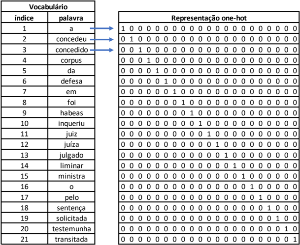

Figura 3.1: Exemplo do processo de construção de vocabulário, e de definição de representações one-hot.

| Vocabulário   | Vocabulário   |
|---------------|---------------|
| índice        | palavra       |
| 1             | a             |
| 2             | concedeu      |
| 3             | concedido     |
| 4             | corpus        |
| 5             | da            |
| 6             | defesa        |
| 7             | em            |
| 8             | foi           |
| 9             | habeas        |
| 10            | inqueriu      |
| 11            | juiz          |
| 12            | juíza         |
| 13            | julgado       |
| 14            | liminar       |
| 15            | ministra      |
| 16            | o             |
| 17            | pelo          |
| 18            | sentença      |
| 19            | solicitada    |
| 20            | testemunha    |
| 21            | transitada    |

Figura 3.2: Representação de documentos a partir do vocabulário aprendido.

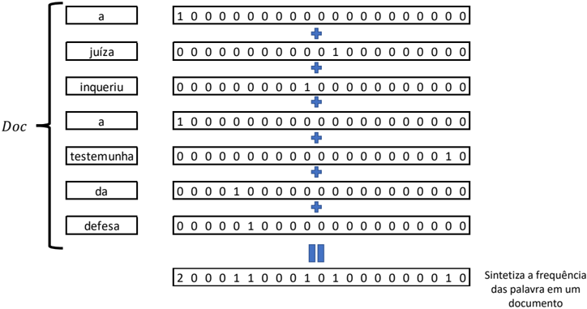

Conforme ilustrado, observa-se que ao fim deste processo o conjunto de dados se torna estruturado, pois todo documento terá a mesma quantidade de atributos em formato numérico, permitindo sua utilização em modelos de aprendizado. De forma intuitiva, é possível notar que cada característica extraída representa uma palavra do vocabulário, e o modelo quantifica a quantidade de ocorrências que cada palavra nos documentos.

Apesar de se mostrar muito útil para extração de características de textos, o modelo BOW possuí algumas limitações, tais como: alta dimensionalidade de dados, dificuldade de capturar características sintáticas e semânticas de palavras, bem como a perda da informação da ordem de ocorrência das palavras, uma vez que os vetores das palavras são somados.

## 3.1.2 Continuous Skipgram

O objetivo da técnica Continuous Skipgram é treinar um modelo que seja capaz de aprender a ocorrência das palavras de um contexto, dado a ocorrência da palavra central do mesmo. Conforme ilustrado na Figura 3.3.

Figura 3.3: Exemplo da tarefa realizada na técnica Skipgram.

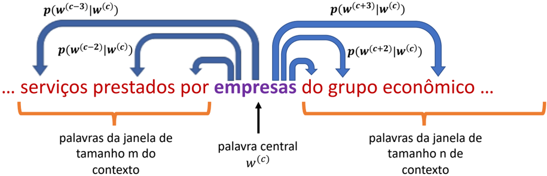

Para realização desta tarefa, utiliza-se uma rede neural rasa contendo uma camada de entrada, uma camada oculta e uma camada de saída, com conexão densa ( fully connected ) entre elas (ligação

entre todos os neurônios da camada anterior para a camada posterior).

A camada de entrada é composta por um vetor de tamanho V que representa a palavra central do contexto, codificada através da codificação one-hot. A camada oculta possuí dimensionalidade D , que será a dimensionalidade da nova representação das palavras. Já a camada de saída tem dimensionalidade V , que representa uma das palavras do contexto da palavra central.

A palavra do contexto, utilizada como valor alvo, também é representado na codificação one-hot. Na camada de saída uma função softmax é aplicada para estimar as probabilidades de ocorrência de cada palavra do vocabulário no mesmo contexto da palavra central. Na Figura 3.4 nota-se a arquitetura da rede neural da técnica Skipgram.

Figura 3.4: Arquitetura da rede neural da técnica Skipgram, proposta em [MCCD13].

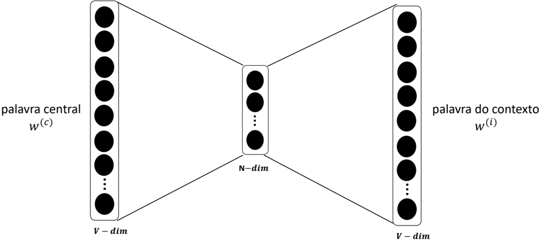

Apesar de um contexto ser formado por mais de uma palavra além da palavra central, para a realização do treinamento são formados pares de amostras de palavra central com cada uma das palavras do contexto. Conforme ilustrado na Figura 3.5.

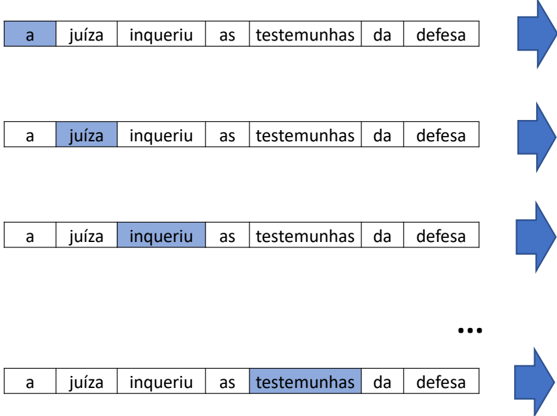

|    |       |          |    |             |    |        | Amostras de Treino   | Amostras de Treino   |
|----|-------|----------|----|-------------|----|--------|----------------------|----------------------|
|    |       |          |    |             |    |        | palavra central      | palavra do contexto  |
| a  | juíza | inqueriu | as | testemunhas | da | defesa | a                    | juíza                |
|    |       |          |    |             |    |        | a                    | inqueriu             |
|    |       |          |    |             |    |        | juíza                | a                    |
| a  | juíza | inqueriu | as | testemunhas | da | defesa | juíza                | inqueriu             |
|    |       |          |    |             |    |        | juíza                | as                   |
|    |       |          |    |             |    |        | inqueriu             | a                    |
| a  | juíza | inqueriu | as | testemunhas | da | defesa | inqueriu             | juíza                |
|    |       |          |    |             |    |        | inqueriu             | as                   |
|    |       |          |    |             |    |        | inqueriu             | testemunhas          |
|    |       |          |    |             |    | ...    |                      |                      |
|    |       |          |    |             |    |        | testemunhas          | inqueriu             |
| a  | juíza | inqueriu | as | testemunhas | da | defesa | testemunhas          | as                   |
|    |       |          |    |             |    |        | testemunhas          | da                   |
|    |       |          |    |             |    |        | testemunhas          | defesa               |

...

Figura 3.5: Exemplo de definição das amostras de treino do modelo Skipgram.

A partir do modelo treinado utilizando a técnica Skipgram, espera-se de forma intuitiva que os pesos entre a camada escondida e a camada de saída sejam similares para palavras similares, pois ambas comumente aparecem dentro de contextos parecidos. Bem como espera-se que esses pesos sejam dissimilares entre palavras dissimilares, pois as mesmas ocorrem em contextos bem distintos. Com isso, os pesos entre essas duas camadas se mostram uma útil representação numérica das palavras.

O uso desta técnica possibilitou a captura de relações sintáticas e semânticas entre palavras. Permitindo até a realização de analogias, através de operações de soma e subtração dos vetores resultantes. Conforme ilustrado na Figura 3.6.

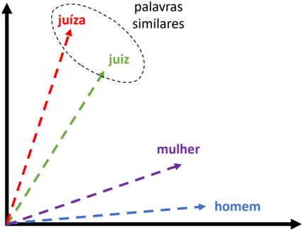

𝑢í𝑧𝑎 ≈ 𝑗𝑢𝑖𝑧 - ℎ𝑜𝑚𝑒𝑚 + 𝑚𝑢𝑙ℎ𝑒𝑟

j

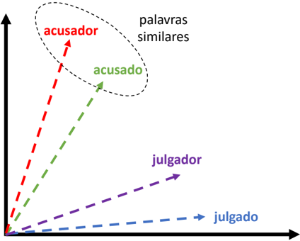

𝑎𝑐𝑢𝑠𝑎𝑑𝑜𝑟 ≈ 𝑎𝑐𝑢𝑠𝑎𝑑𝑜 - 𝑗𝑢𝑙𝑔𝑎𝑑𝑜 + 𝑗𝑢𝑙𝑔𝑎𝑑𝑜𝑟

𝑢𝑖𝑧 ≈ 𝑗𝑢í𝑧𝑎 - 𝑚𝑢𝑙ℎ𝑒𝑟 + ℎ𝑜𝑚𝑒𝑚

j

𝑎𝑐𝑢𝑠𝑎𝑑𝑜 ≈ 𝑎𝑐𝑢𝑠𝑎𝑑𝑜𝑟 - 𝑗𝑢𝑙𝑔𝑎𝑑𝑜𝑟 + 𝑗𝑢𝑙𝑔𝑎𝑑𝑜

Figura 3.6: Exemplo de realização de analogias sintáticas e semânticas com as representações numéricas de palavras no modelo Skipgram. Adaptado dos exemplos ilustrados em [MYZ13]

[MSC + 13] disponibilizou uma ferramenta open source denominada word2vec para representação distribuída de palavras com a implementação da arquitetura ( Continuous Skipgram ).

## 3.2 Aprendizado de Máquina Machine Learning

Aprendizado de máquina é uma das subáreas da Inteligência Artificial responsável pelo estudo de técnicas de reconhecimento de padrões não triviais em bases de dados aplicadas para ensinar sistemas computacionais na resolução de problemas. Existem diferentes técnicas e algoritmos de aprendizado de máquina.

As técnicas de aprendizado de máquina podem ser divididas em dois tipos: supervisionado e não supervisionado [MB03].

Nas tarefas de aprendizado não supervisionado, o objetivo é descobrir relações e associações entre dados e/ou variáveis, porém sem a existência de um fenômeno ou variável alvo específica.

Já nas tarefas de aprendizado supervisionado, existe uma variável alvo que representa um fenômeno que desejamos explicar seu comportamento através de outras variáveis existentes. Neste processo faz-se uso de um conjunto de exemplos com características explicativas e uma variável resposta associada a cada exemplo, o objetivo é treinar um modelo que seja capaz de explicar a variável resposta com base nas características explicativas. Um uso muito comum deste tipo de modelo é para prever se um fenômeno de interesse, representado pela variável alvo, irá se repetir para uma nova situação no futuro, com base em exemplos já conhecidos.

O problema de aprendizado supervisionado pode ser expresso da seguinte forma:

Seja X o conjunto de n exemplos, cada um com d características, θ o conjunto de parâmetros associados às características, e Y as n respostas associadas a cada exemplo, o objetivo é aprender os melhores parâmetros de θ para construção de um modelo f, tal que f ( X,θ ) = ˆ Y ≈ Y . Onde ˆ Y denota o conjunto de respostas estimadas para Y com base em X , e quanto mais próximo ˆ Y for de

Y , melhor ajustado é o modelo para explicar o fenômeno representado por Y .

O processo de aprendizado de θ se dá através do uso de técnicas de otimização com base em alguma medida de avaliação, como por exemplo: erro quadrático médio ou entropia cruzada. Cada medida de avaliação é calculada através de sua respectiva função de custo. A medida de avaliação tem o papel de mensurar o quão bom é o modelo para aquela tarefa na qual o modelo está sendo treinado.

## 3.2.1 Função de Custo

Conforme mencionado acima, uma função de custo tem o papel de mensurar o quão bem ajustado está o modelo para realizar aquela tarefa na qual ele foi treinado. O objetivo do processo de treinamento é otimizar uma função de custo através da identificação da configuração ótima de valores dos parâmetros.

Seu resultado pode indicar o quão bom está o ajuste do modelo (neste caso, o objetivo é maximizar o resultado a função) ou o quão ruim está o seu ajuste (neste caso, o objetivo é minimizar o resultado da função).

Funções de custo nas quais o objetivo é sua maximização geralmente são utilizadas em problemas de aprendizado por reforço. Enquanto que para problemas de aprendizado supervisionado, normalmente se utiliza uma função de custo na qual o objetivo está na minimização de seu resultado, que pode ser denominada como erro, custo ou perda do modelo.

Existem diferentes tipos de função de custo, e sua escolha dependerá do tipo de variável reposta que está sendo estudada, que pode ser quantitativa ou categórica.

Uma função de custo muito utilizada para problemas de variável resposta categórica é a função de entropia cruzada, que consiste em medir a diferença entre duas distribuições de probabilidade. O objetivo do uso neste tipo de problema está em para qualquer evento observado, medir a diferença entre a distribuição de probabilidade resultante do modelo com a distribuição de probabilidade observada.

Como distribuição de probabilidade do evento observado, dado que existe a certeza do evento observado, considera-se a probabilidade 1 para a categoria observada, e probabilidade 0 para todas as outras categorias. Com isso, utiliza-se a seguinte função de entropia cruzada:

<!-- formula-not-decoded -->

Onde x representa o índice de referência de cada categoria da variável resposta. Dado que para um evento de P a probabilidade é 1 para a categoria observada e 0 para as categorias restantes, denotando x = c como a categoria observada, verifica-se que P ( x ) ∗ log ( Q ( x )) = 0 para todas as outras categorias de x diferentes de c . Sendo assim, é possível reescrever a função de entropia cruzada em função apenas de c da seguinte forma:

<!-- formula-not-decoded -->

Essa função é calculada individualmente para cada observação. Para calcular um valor agregado para uma amostra de observações, realiza-se a média do que foi calculado individualmente para cada observação.

A entropia cruzada pode ser utilizada como função de custo para treinamento de um modelo, através da identificação dos parâmetros ótimos que minimizam o resultado da função entre as observações.

## 3.2.2 Otimização de Parâmetros

A definição dos melhores parâmetros θ do modelo pode ser classificado como um problema de otimização. Para modelos com funções de custo baseadas em equações diferenciáveis, tais como regressão linear, regressão logística, redes neurais, entre outras, uma forma de encontrar os melhores parâmetros se dá através de algorítimos de otimização baseados no cálculo de gradientes.

Um algoritmo muito utilizado para este fim é o Gradiente Descendente ( Gradient Descendent - GD ), um algoritmo iterativo que a cada passo calcula o vetor de gradientes da função de custo com respeito a cada parâmetro do modelo, e com isso atualiza os pesos dos parâmetros a fim de otimizar o resultado da função de custo. A intuição por trás do uso de vetor de gradientes está em, identificar a direção na qual se obtém o maior incremento na variação do parâmetro, e com base na direção oposta (o negativo do gradiente) e em uma taxa de aprendizado pré-definida, realiza-se proporcionalmente a atualização do parâmetro. Na Figura 3.7 observa-se objetivo deste algorítimo: atualizar o parâmetros a cada interação até que J convirja até seu valor mínimo.

Figura 3.7: Exemplo de otimização de parâmetro para minimização da função de custo J

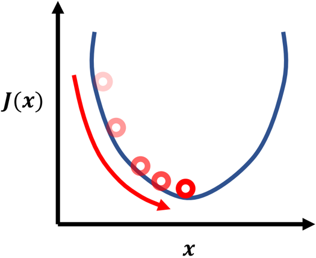

A versão clássica do modelo Gradient Descent leva em consideração todas as observações para cálculo dos gradientes, o que em algumas situações pode levar a atualizações muito bruscas dos parâmetros, e consequentemente em dificuldades de convergência ao se aproximar do valor míninmo de J . Devido a isso, algumas variantes deste algoritmo foram criadas, tais como Gradiente Descendente Estocástico ( Stochastic Gradient Descent - SGD ) e Gradiente Descendente por Mini-Lote ( MiniBatch Gradient Descent ) [Rud], que respectivamente consistem em: para cada passo de atualização, selecionar aleatoriamente uma única observação ou um bloco de observações, para considerar no cálculo da atualização dos parâmetros.

Ambas essas variantes do algoritmo permitiram uma atualização em menores passos, melhorando a convergência, porém apresentando alta sensibilidade à dados ruidosos, dificultando a convergência de J . Com isso, uma outra variante do algoritmo foi criada com a adição de um mecanismo de

momento, que leva em consideração não apenas o os gradientes das observações atuais, bem como a média móvel dos gradientes dos passos anteriores, ponderando a fim de dar mais peso para os gradientes dos passos mais recentes. Essa variante é denominada Gradiente Descendente Estocástico com Momento ( Sthocastic Gradient Descent with Momentum ) [Qia99].

Para todos os algoritmos citados, uma taxa de aprendizado única é utilizada em todo o processo de otimização, e é necessário testar diferentes valores para escolher aquele que apresenta a melhor convergência. Novos algoritmos foram criados para lidar com este problema, como por exemplo o algoritmo de Gradiente Adaptativo ( Adaptative Gradient - Adagrad ) [DHS11] que funciona muito bem com gradientes esparsos, bem como o algoritmo Root Mean Square Propagation - RMSProp , que funciona bem com configurações online e não estacionárias.

- O algoritmo Adaptive Moment Estimation (Adam) pode ser visto como uma combinação entre os algoritmos Adagrad e RMSProp [KB14].

Algortimos baseados em gradiente adaptativos se mostraram muito efetivos para algoritmos de aprendizado profundo. Modelos deste tipo têm como característica arquiteturas complexas e enormes quantidades de parâmetros para serem treinados, que facilita a ocorrência de sobre-ajuste de aprendizado. Sendo assim, o uso de métodos de regularização são fundamentais. A regularização L 2 é ma método muito utilizado para este fim.

[LH17] propuseram uma adaptação dos modelos SGD e Adam , implementando uma lógica de decaimento de pesos ( Weight Decay ) como método de regularização. Os modelos propostos foram denominados como SGDW e AdamW , respectivamente. No algoritmo 1 é possível observar os detalhes do algoritmo AdamW .

## Algorithm 1 AdamW

- 1: Seja α ← 0 . 0001 , β 1 ← 0 . 9 , β 2 ← 0 . 9999 , glyph[epsilon1] ← 10 -8 , λ ∈ ❘
- 2: Inicialize iterador de passos t ← 0 , vetor de parâmetros θ t =0 ∈ ❘ n , vetor de primeiro momento m t =0 ← 0 , vetor de segundo momento v t =0 ← 0 , multiplicador agendado η t =0 ∈ ❘
- 3: repeat
- 4: t ← t +1 5: ∇ f t ( θ t -1 ) ← SelectBatch ( θ t -1 ) 6: g t ←∇ f t ( θ t -1 ) 7: m t ← β 1 m t -1 +(1 -β 1 ) g t 8: v t ← β 2 v t -1 +(1 -β 2 ) g t 2 9: ˆ m t ← m t / (1 -β 2 1 ) 10: ˆ v t ← v t / (1 -β 2 2 ) 11: η t ← SetScheduleMultiplier ( t ) 12: θ t ← θ t -1 -η t ( α ˆ m t / ( √ ˆ v t + glyph[epsilon1] ) + λθ t -1 ) 13: until condições satisfeitas 14: return θ t

Neste algoritmo é possível observar como funciona sua lógica para atualização dos parâmetros. Nas linhas 5 e 6, um lote é selecionado e os gradientes dos parâmetros do modelo são calculados para esse lote.

Nas linhas 7 e 8 os vetores de momento, iniciados com zero, são atualizados. Verifica-se que m captura o comportamento da média dos gradientes ao longo das iterações, enquanto que v captura o comportamento da variância (de estimador não-enviesado). Para ambos os vetores de momento, os passos mais recentes terão mais peso do que passos mais antigos, conforme demonstrado a seguir:

<!-- formula-not-decoded -->

<!-- formula-not-decoded -->

Como β 1 é um número interior a 1, é possível concluir, através de sua potenciação demonstrada na fórmula acima, que os primeiros gradientes ( g 1 , g 2 , ... ) terão pesos inferiores com relação aos gradientes mais recentes ( ..., g t -1 , g t ) .

Nas linhas 9 e 10, uma correção é realizada nos vetores de momento, devido ao viés causado por sua inicialização em zero, derivando nos vetores de momento ˆ m e ˆ v .

Na linha 11, o procedimento SetScheduleMultiplier é utilizado a fim de permitir a programação de um fator de ponderação η da atualização dos parâmetros ao longo dos passos. Esse valor pode ser fixo, com decaimento, assim como também pode ser utilizado para aplicação de reaquecimentos do valor afim de melhorar o desempenho do aprendizado.

Na linha 12, os parâmetros são por fim atualizados, com base nos vetores de momento, aplicando uma taxa de aprendizado α o fator de de decaimento de pesos ponderado por λ , a fim de regularizar o processo de aprendizado. A atualização será ponderada por pelo fator η , que poderá variar de forma programada.

## 3.2.3 Aprendizado com dados desbalanceados

Conforme explicado, o processo de aprendizado se dá pela otimização dos melhores parâmetros que otimizem uma função de custo. Durante este processo, cada amostra da base de treino será considerada para aprendizado dos parâmetros. De forma intuitiva, o erro de cada uma destas amostras contribuirá na alteração dos parâmetros, a fim de minimizar a taxa de erro todas as amostras.

Porém, se a distribuição entre as possíveis classes da variável resposta forem muito desbalanceadas, o aprendizado será enviesado para classificação da classe de maior frequência. Isto pode ser um problema, pois é muito comum as bases terem variável resposta desbalanceadas, como por exemplo com problemas como detecção de fraude, anomalia, entre outros. Uma forma muito simples de lidar com essa situação se dá pelo uso de técnicas de balanceamento, tais como sub-amostragem (undersampling) e sobre-amostragem (oversampling) .

Sub-amostragem consiste selecionar aleatoriamente n amostras para todas as categorias possíveis, tal que n é o número de amostras da categoria de menor frequência entre todas. Um ponto negativo desta abordagem se dá pela possível perda de informação útil no processo de amostragem, já que parte das amostras serão descartadas para garantir uma distribuição uniforme de classes.

Sobre-amostragem realiza o processo no sentido oposto à subamostragem, consiste em repetir aleatoriamente amostras de cada classe, até que sua frequência seja n , tal que n é o número de amostras da categoria de maior frequência entre todas. Uma desvantagem deste método se dá pelo

fato de que o aumento de base realizado é artificial, pois exemplos que já foram observados serão repetidos, o que pode elevar o risco de sobre-ajuste de modelo, além do risco de causar um aumento considerável da base de treino, elevando a complexidade do processo de treinamento.

Outra maneira de lidar com esse problema se dá pela ponderação da função de custo, de acordo com a frequência de cada classe [CJL + 19]. Por exemplo, a adição do vetor peso de ponderação das categorias na função de custo permite uma ponderação maior para o erro em categorias menos frequentes, e uma ponderação menor para o erro em categorias mais frequentes, de tal forma que o desbalanceamento seja compensado durante o processo de aprendizado. Conforme observa-se abaixo:

<!-- formula-not-decoded -->

A grande vantagem de resolver através de ponderação está no fato que este método não causa nem perda de informação, nem aumento artificial da base de treino.

## 3.2.4 Parada Adiantada ( Early Stopping )

Conforme explicado anteriormente nesta seção o processo de aprendizado dos parâmetros ótimos se dá ao longo de iterações, também referenciadas como épocas, e é muitas vezes comum observar sobre-ajuste de treinamento de modelos muito complexos, após um número suficiente de épocas. Sobre-ajuste indica a incapacidade de um modelo treinado ser generalizado para novas bases, pois o erro nestas novas bases é significativamente superior ao erro da base de treino. A constatação, assim como o momento, de ocorrência de sobre-ajuste se dá de forma empírica, através da avaliação do erro do modelo ao longo das épocas das bases de treino e validação, em conjunto. Ambas as curvas do erro nas bases de treino e validação devem estar próximas, com o erro em validação um pouco inferior ao de treino, porém no momento que o erro em validação atingir um mínimo global e começar a aumentar (ou não reduzir mais) nas épocas seguintes, enquanto que na base de treino o erro continua decrescendo, costuma-se assumir da ocorrência de um sobre-ajuste.

No entanto, não é indicado parar o treinamento logo após o erro começar a subir em validação, pois nunca se sabe se o erro mais baixo observado até aquela época é apenas um mínimo local, antes de processar as épocas seguintes. Mas se após um número razoável de épocas o modelo não voltar a superar aquele mínimo observado, podemos assumir de forma empiricamente que o modelo não voltará mais a superar aquele erro mínimo, não havendo motivos para continuar o processo de treinamento.

Um conceito utilizado para determinar o momento de encerrar o processo de treinamento é denominado parada adiantada ( early stopping ) [YRC07], que consiste utilizar uma variável de paciência p , para indicar quantas épocas o modelo irá tolerar sem superar o menor erro em validação, armazenando este modelo de menor erro em validação e o selecionando após o término do processo [YRC07]. Conforme ilustrado na Figura 3.8.

Figura 3.8: Processo de parada adiantada. Após a observação do melhor desempenho na base de validação no tempo t, se o modelo não superar esse desempenho por uma quantidade de p (paciência) épocas, o processo de treinamento é encerrado, e o modelo considerado é o da época t .

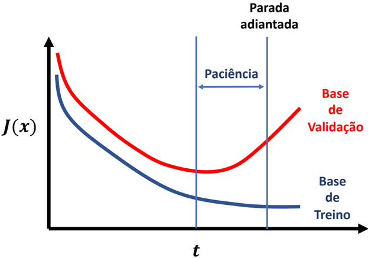

## 3.3 Aprendizado Profundo Deep Learning

A engenharia de características, que consiste no levantamento e construção de variáveis relevantes para construção de um modelo, é uma das atividades mais trabalhosas no processo de aprendizado supervisionado, pois exige um conhecimento relevante do negócio no qual o problema se insere. Para problemas que envolvem padrões muito complexos como textos, vídeos e imagens, esse processo se mostra ainda mais complicado devido à dificuldade de identificação e representação de muitas características relevantes.

Aprendizado profundo é um ramo da área de aprendizado de máquina voltado no conjunto de técnicas capazes de, durante o processo de treinamento, aprender características complexas relevantes que seriam muito difíceis de identificar manualmente. Essas técnicas consistem em redes neurais de arquitetura complexa, tais como a família de redes neurais convolucionais (que envolve múltiplas camadas intermediárias) ou como a família de redes neurais recorrentes (que envolve camadas intermediárias que auto-alimentam com dados recorrentes) [LBH15].

## 3.3.1 Redes Neurais Convolucionais Convolutional Neural Networks - (CNN)

Redes Neurais Convolucionais é uma classe de redes neurais profundas comumente aplicada para problemas de reconhecimento de imagens, com formato de dados bidimensional, mas que também pode ser aplicado para dados unidimensionais, tais como processamento de sinais e de textos (cadeia de tokens).

Sua arquitetura é feita de tal maneira para minimizar os problemas de sobreajuste observados em redes neurais perceptron multicamadas com um número elevado de camadas. Consiste no aprendizado de filtros de convolução que captura padrões úteis para o problema em pequenos blocos da sentença. O filtro varre toda a sentença, do início até o final, a fim de destacar os padrões encontrados. Após isso, uma operação denominada pooling (que pode se basear em funções de máximo, média, soma) é utilizada para destacar se o padrão foi encontrado. Diferentes filtros são utilizados para promover o aprendizado de diferentes tipos de padrões que podem ser úteis para o problema.

A intuição por traz destes filtros está em aprender padrões relevantes de ocorrência de conjuntos de tokens que ocorrem dentro do mesmo bloco. No contexto de aprendizado em textos, uma rede CNN pode ser expressa da seguinte maneira.

Seja w a cadeia de palavras [ w (0) , w (1) , w (2) , ..., w ( t -1) , w ( t ) ] , representadas por vetores de dimensionalidade d , e k o conjunto de filtros [ f (0) , f (1) , ..., f ( m -1) , f ( m ) ] . Um conjunto de características será produzido através de uma operação de convolução de cada filtro f com todas as possíveis janelas de palavras de tamanho h na cadeia w , produzindo um mapa de características c ( i ) = [ c ( i ) 0 , c ( i ) 1 , ..., c ( i ) i -1 , c ( i ) i ] , onde i se refere ao i-ézimo filtro daquele mapa. Cada filtro f produzirá um mapa de características distinto, e normalmente em cada um deles, uma agregação é realizada para destacar se os padrões daquele filtro foram identificados na cadeia w , resultando em uma única característica v i para aquele filtro, calculada por exemplo por v i = Max ([ c ( i ) 0 , c ( i ) 1 , ..., c ( i ) i -1 , c ( i ) i ]) . O conjunto de características v de todos os filtros f é então utilizado em camada densa para estimação da variável resposta daquela cadeia.

O processo de aprendizado do modelo consiste em aprender os melhores parâmetros de cada filtro de convolução utilizado, a fim de que estes filtros sejam capazes de aprender características em janelas de dados. Sem a necessidade de especialistas para construção das características candidatas para resolução do problema. O processo de aplicação do filtro de convolução e realce de padrões é ilustrado através da Figura 3.13.

Figura 3.9: Processo de convolução com um filtro f ( i ) com janela de tamanho h = 3

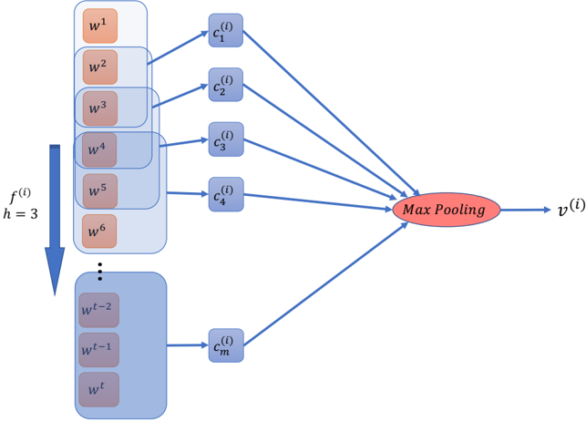

Camadas adicionais de filtros de convolução e realce ( pooling ) podem ser adicionadas. A fim de possibilitar o aprendizado de padrões a partir de padrões aprendidos na camada anterior. Levando a construção de arquiteturas de rede neural com camadas profundas de aprendizado, porém permitindo a identificação de padrões complexos em maiores níveis de abstração. Conforme exemplificado na Figura 3.10

Figura 3.10: Arquitetura de rede neural CNN. Figura adaptada de [Kim14].

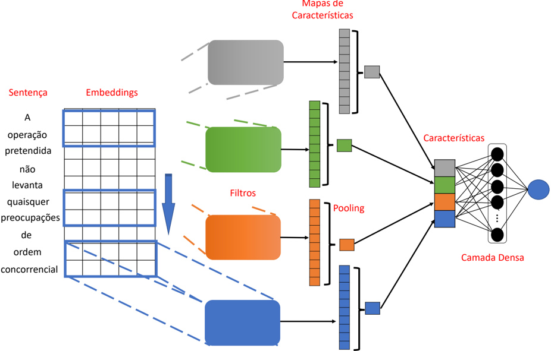

## 3.3.2 Redes Neurais Recorrentes Recurrent Neural Networks (RNNs)

Redes Neurais Recorrentes são de um tipo de arquitetura de redes neurais multicamadas, contendo as camadas de entrada, escondida e de saída, com a particularidade de que a camada escondida é alimentada não apenas com a camada de entrada, como também os valores da camada escondida do instante de tempo imediatamente anterior. Por este motivo, RNN's é um tipo de modelo supervisionado utilizados para aprendizados em dados sequenciais, como é o caso de dados em linguagem natural.

Este tipo de arquitetura soluciona o problema identificado com o modelo BOW, no qual a ordem de ocorrência das palavras é perdido. Uma RNN pode ser representada da seguinte forma:

<!-- formula-not-decoded -->

<!-- formula-not-decoded -->

<!-- formula-not-decoded -->

Conforme observa-se, para calcular o y no instante t é necessário calcular o h a partir do tempo 0 até o h no tempo t. Desta forma, o modelo de RNN consegue levar em consideração dados sequenciais em diferentes instantes de tempo. Na Figura 3.11 observa-se como é o formato deste tipo de rede neural com recorrência.

Figura 3.11: Formato de uma rede do tipo RNN [FGL + 17]

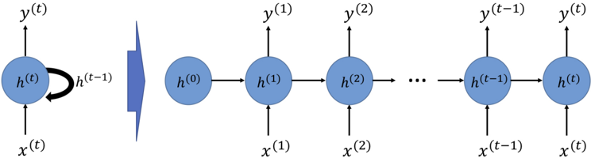

O processo de treinamento se dá pelo método do gradiente descendente, propagando os gradientes do último instante de tempo até o primeiro instante de tempo. Conforme nota-se na fórmula a seguir.

<!-- formula-not-decoded -->

O ponto negativo dessa arquitetura se dá pelo aumento da chance de ocorrência de desaparecimento ou explosão do gradiente conforme se aumenta o tamanho da sequencia, devido a grande recorrência de multiplicações dos gradientes. Se tomarmos como exemplo a função de ativação sigmoid σ ( x ) , que tem derivada σ ′ ( x ) = σ ( x ) ∗ (1 -σ ( x )) , como a função sigmoid retorna valores entre 0 e 1, sucessivas multiplicações de gradientes facilmente causarão um problema de underflow , que ocorre quando um número é tão pequeno, que não existem casas decimais o suficiente para representá-lo, levando seu valor para 0, e ocasionando o desaparecimento dos gradientes. O mesmo problema se aplica quando as derivadas resultam em valores superiores a 1, sucessivas multiplicações podem levar o produto a valores muito grandes para serem representados computacionalmente, ocasionando a explosão de gradientes.

Em termos práticos, os dados mais recentes da sequencia terão maior peso do que os dados mais recentes.

## 3.3.3 Redes Long Short-Term Memory (LSTM)

Para contornar esta deficiência da arquitetura RNN, algumas derivações da mesma foram criadas, entre elas a arquitetura Long Short Term Memory (LSTM), que introduziu alguns mecanismos a fim de minimizar a chance de ocorrência de desaparecimento ou explosão de gradientes. Através da Figura 3.12 é possível observar a arquitetura de uma rede LSTM 1 .

Figura 3.12: Arquitetura da rede LSTM.

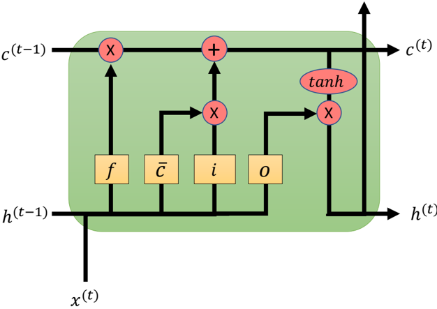

Com relação a RNN, nota-se a inclusão dos seguintes elementos:

- Cell State c : além de h , um novo estado oculto é inserido, denominado estado celular, responsável por manter a memória dos instantes de tempo passados da rede. Sua atualização é controlada pelos portões de esquecimento ( forget gate ) e de inserção ( insert gate ), descritos a seguir.
- Forget Gate : responsável por determinar o que deve ser 'esquecido' do estado celular.

<!-- formula-not-decoded -->

- Input Gate : responsável por determinar o que vai ser inserido no estado celular a partir da entrada atual.

<!-- formula-not-decoded -->

- Output Gate : responsável por determinar o que será utilizado do estado celular para estimar a saída da rede.

<!-- formula-not-decoded -->

A atualização do estado celular c se dá da seguinte forma:

- Cell Candidate : inicialmente, uma célula candidata ˆ c ( t ) é calculada com base em x ( t ) e h ( t -1) :

<!-- formula-not-decoded -->

- Cell Update : com isso, o estado celular c ( t ) é atualizado com base em f ( t ) , i ( t ) , ˆ c ( t ) e c ( t -1) , através da seguinte fórmula:

<!-- formula-not-decoded -->

1 Figura extraída de Understanding LSTM Networks , disponível em: http://colah.github.io/posts/ 2015-08-Understanding-LSTMs/

Finalmente, a atualização de h ( t ) é feita com base em o ( t ) e c ( t ) .

<!-- formula-not-decoded -->

Abstraindo as características internas da LSTM, é possível visualizar seu comportamento de forma similar à RNN, com a diferença de existirem um conjunto de dois estados ocultos h e c ao longo do tempo. Na Figura 3.13 ilustramos o formato de uma rede LSTM 2 .

Figura 3.13: Arquitetura da rede LSTM, desmembrada em instantes de tempo.

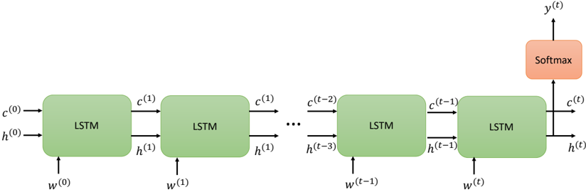

Com essa arquitetura de rede, a LSTM é capaz de minimizar profundamente o problema de desaparecimento e explosão de gradientes, permitindo seu uso para problemas envolvendo sentenças de longo tamanho.

Redes neurais de arquitetura recorrente, tal como RNN e LSTM, são treinadas com base em dados sequenciais, podendo aprender padrões sequenciais em ambas as direções: da primeira palavra até a última ( forward ), ou da última palavra até a primeira da sentença ( backward ). É possível combinar as duas direções de sequência em uma única rede neural, tornando-a capaz de aprender características em ambos os sentidos para o mesmo problema. Essa variante é denominada BiLSTM (no caso de LSTM) ou BiRNN (no caso de RNN). Na Figura 3.14 ilustramos o formato de uma rede BiLSTM 3 .

Figura 3.14: Estrutura de uma rede neural BiLSTM, observa-se que se tratam de duas estruturas em conjunto, uma no sentido usual de leitura da primeira até a última palavra (forward) e outra no sentido oposto(backward)

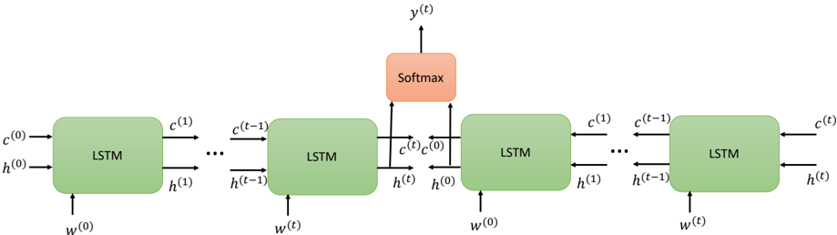

2 Figura extraída de Understanding LSTM Networks , disponível em: http://colah.github.io/posts/ 2015-08-Understanding-LSTMs/ 3 Figura adaptada de Bi-LSTM , disponível em: https://medium.com/@raghavaggarwal0089/ bi-lstm-bc3d68da8bd0

## 3.3.4 Transformers

Transformers é uma arquitetura baseada em estrutura de codificação-decodificação, na qual o codificador realiza um mapeamento de uma sequência de símbolos de entrada x = ( x 1 , ..., xn ) para uma sequência de representação contínua z = ( z 1 , ..., zn ) . Com base em z , o decodificador gera uma sequência de símbolos de saída y = ( y 1 , ..., ym ) , com geração de um símbolo para cada passo, de forma auto-regressiva, ou seja, a geração de um símbolo leva em consideração além de z , a sequência de símbolos gerados até aquele momento.

Na Figura 3.15 observa-se a arquitetura de um modelo do tipo Transformer .

## Probabilidades das Saídas

Figura 3.15: Arquitetura de uma rede neural do tipo Transformer [VSP + 17]

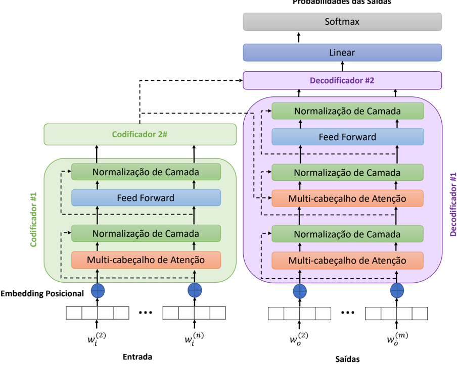

Nota-se que o modelo é composto por uma sequência de codificadores empilhados, que recebem como parâmetro a cadeia de símbolos de entrada x, uma sequência de decodificadores empilhados, que recebem como parâmetro a cadeia de representação contínua z em conjunto com a cadeia de saída y. Ambas as cadeias de símbolos de entrada x e saída y passam por um processo de embedding de palavras e embedding posicional. Após a realização da última camada de embedding, é realizada uma transformação linear, seguida da aplicação da função softmax para estimação do vetor de probabilidades do token seguinte.

## Codificação

Estrutura composta por 6 camadas idênticas. Cada camada é composta por 2 subcamadas: uma responsável pela realização do mecanismo de auto-atenção com multi-cabeçalhos, e uma outra subcamada com uma estrutura simples de conexão neural densa ( feed forward fully-connected ) para cada posição da cadeia entrada ( position-wise ). Na saída de cada subcamada é empregada uma normalização de seu resultado em conjunto com uma conexão residual empregada.

## Decodificação

A estrutura de descodificação também é composta por 6 camadas idênticas, cada uma contendo 3 subcamadas. De forma similar à estrutura de codificação, a 1 a subcamada é responsável pelo mecanismo de auto-atenção com multi-cabeçalhos, com a diferença de que os tokens subsequentes ao último gerado são mascarados, a fim de manter a característica auto-regressiva. A 2 a subcamada é responsável pela realização de um mecanismo de atenção na saída produzida pela pilha de codificadores em conjunto com as representações dos tokens já gerados até aquele momento. A estrutura da 3 a camada é igual à descrita nas camadas de codificação, com uma simples conexão neural densa. Aqui também é realizada normalização após cada subcamada, em conjunto com sua respectiva conexão residual.

## Atenção

Consiste no mapeamento de uma consulta, um conjunto de pares de chave-valor para uma saída, onde consultas, chaves, valores e saídas são todos vetores. A saída é calculada através de uma soma ponderada de valores, os pesos associados a cada valores são gerados através de uma função de compatibilidade da consulta com sua respectiva chave. De forma intuitiva, quanto maior a compatibilidade de uma chave com uma consulta, maior será o peso do valor associado aquela chave.

<!-- formula-not-decoded -->

A fórmula acima caracteriza o processo de auto-atenção, e pode ser descrito nos passos abaixo.

- O 1 o passo do processo de auto-atenção é calcular, para cada token da cadeia w , os vetores de consulta q , de chave k e de valor v . A criação dos vetores q , k e v se dá pela respectivamente pela multiplicação do vetor de embedding do token pelas matrizes de pesos W Q , W K e W V , treinadas durante o processo de treinamento do modelo.
- O 2 o passo é calcular, para cada token da cadeia, uma representação com base em todos os tokens da cadeia. Essa representação se dá da seguinte forma: Seja w t o token para o qual deseja-se calcular o score, com base no seu vetor se consulta associado, multiplica-se seu vetor de consulta associado pelos os vetores de chave de todos os tokens da cadeia. A intuição por trás deste calculo de compatibilidade entre consultas e chaves está em identificar o quanto que o modelo deve prestar atenção em um conjunto de palavras para descrever uma palavra específica.
- O 3 o passo é realizar a divisão dos valores resultantes das multiplicações realizadas acima, pela raíz da dimensionalidade do modelo, e então normalizados pela função softmax.
- 4 o passo se dá pela multiplicação dos scores softmax resultantes por seus respectivos vetores de valor associados.

5 o passo se dá pela soma de todos estes vetores para resultar na representação do token w t .

Na Figura 3.16 observa-se um resumo das operações descritas no passo a passo acima.

Figura 3.16: Subcamada de atenção [VSP + 17]

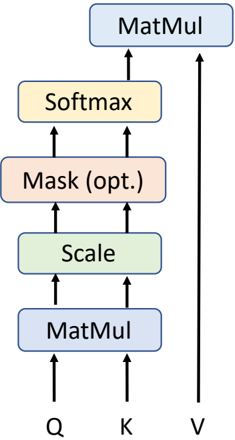

## Multi-cabeçalho de auto-atenção

O score de um token tende a ser dominado pela chave e valor do mesmo, por isso, na arquitetura deste modelo, é feito uso de múltiplos cabeçalhos de auto-atenção, permitindo que o modelo preste atenção em outros tokens para representar um token específico, aprendendo outras formas de representação que podem ser úteis. Conforme nota-se na fórmula a seguir.

<!-- formula-not-decoded -->

O modelo aprende projeções lineares em paralelo, denotadas por W i Q , W i K e W i V . Na imagem a seguir observa-se o formato de um multi-cabeçalho de atenção.

Figura 3.17: Multi-cabeçalho de auto-atenção [VSP + 17]

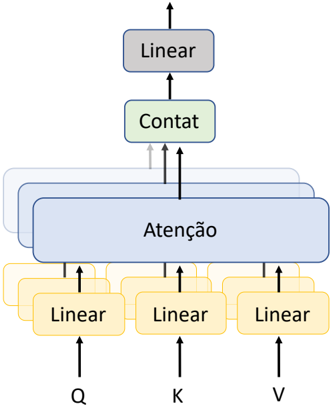

## Representação numérica da posição de tokens

Dado que o modelo não possuí nenhum tipo de recorrência, nem convolução, o modelo contém uma camada de representação posicional (positional encoding), a fim de introduzir uma forma de o modelo levar em consideração a posição e a ordem da sequência. Essa representação posicional é de mesma dimensionalidade das representações dos tokens, permitindo que ambos os vetores sejam somados no início das pilhas de codificação e decodificação. A intuição deste processo é adicionar uma noção de distância no aprendizado de auto-atenção entre os tokens da sentença, permitindo ao modelo dar mais ênfase na atenção a tokens mais próximos entre si.

No artigo [VSP + 17], os autores fazem uso de duas funções sinusoidais para este fim, utilizando a função seno para as dimensões pares e a função cosseno para as dimensões ímpares do vetor de representação posicional. A seguir observam-se as funções que os autores utilizaram para as posições pares e ímpares.

<!-- formula-not-decoded -->

<!-- formula-not-decoded -->

<!-- formula-not-decoded -->

Outros tipos de função poderiam ser utilizados para este fim, no entanto os autores elegeram uma função sinusoidal pois está permite que o modelo extrapole para sequências de tamanho superior às observadas durante o processo de treinamento.

## 3.3.5 BERT

Baseado no uso de Transformers , BERT ( Bidirectional Encoder Representations from Transformers ) é um método pré-treinado de representação de linguagem. Que faz uso de uma pilha de codificadores, com camadas de auto-atenção, para calcular a representação dos tokens de uma sentença.

BERT faz uso do conceito de transferência de aprendizado (transfer learning), dividindo o problema em 2 etapas: a 1 a consiste em pré-treinar um modelo de transformer para representação de linguagem, de forma não supervisionada, fazendo uso de corpus grandiosos não anotados (como o Wikipedia) voltados para propósitos gerais, e que demandam um longo tempo de treinamento em máquinas de alto desempenho (4 dias de treinamento utilizando de 4 a 16 TPUs). A 2 a etapa consiste em utilizar os parâmetros aprendidos no pré-treinamento para a tarefa final que se deseja resolver, com os dados anotados, fazendo um refinamento para calibrar os parâmetros pré-treinados para aquela nova tarefa. A intuição nesta etapa.de refinamento se dá pela calibragem do modelo para corpus de domínios bem específicos, relacionados com a tarefa que se deseja resolver.

Figura 3.18: Modelo BERT [DCLT18]

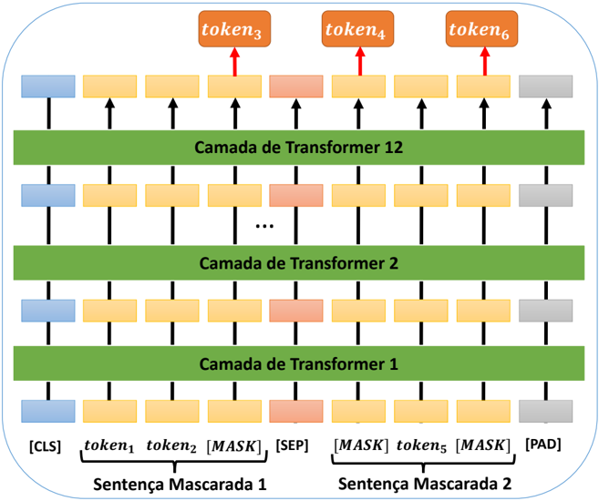

## Pré-treinamento

Conforme ilustrado Na Figura 3.18, o processo de pré-treinamento para representação de linguagem se dá pelo mascaramento de tokens aleatórios do corpus (os autores mascararam 15% dos tokens), o processo então é treinado para classificar os tokens que foram mascarados do corpus. Este artifício foi utilizado para evitar que o modelo classificasse um token com base nele mesmo.

## Refinamento Fine Tuning

O processo de refinamento do modelo BERT também pode ser realizado para outras tarefas de interesse. Os autores do artigo [DCLT18] realizaram o processo de refinamento para diferentes tipos de tarefas de processamento de linguagem natural. Nas Figuras 3.19, 3.20, 3.21 e 3.22, são ilustradas formas de refinamento para abordar diferentes tipos de tarefas.

Figura 3.19: Refinamento do modelo BERT, para a tarefa classificação de sentenças, como a desejada na presente pesquisa [DCLT18].

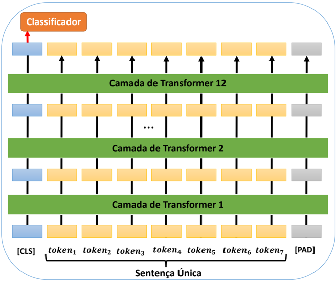

Figura 3.20: Refinamento do modelo BERT, para a tarefa classificação da relação entre 2 sentenças. Recebe 2 sentenças como entrada [DCLT18].

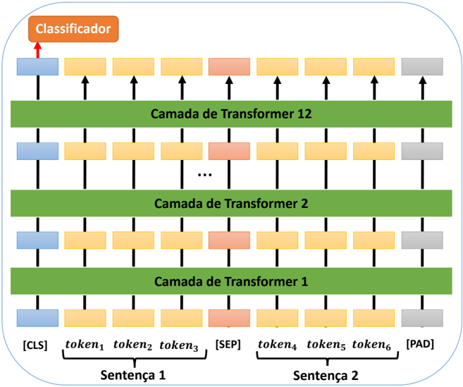

Figura 3.21: Refinamento do modelo BERT, para a tarefa de extração de fragmentos de um texto. Ex: extração do fragmento de resposta de uma pergunta dada. Recebe 2 sentenças como entrada [DCLT18].

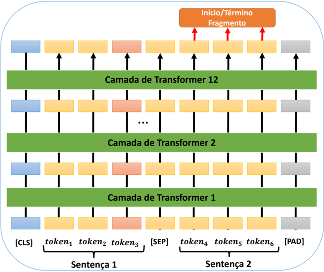

Figura 3.22: Refinamento do modelo BERT, para a tarefa de classificação de tokens individuais. Ex: reconhecimento de entidades mencionadas [DCLT18].

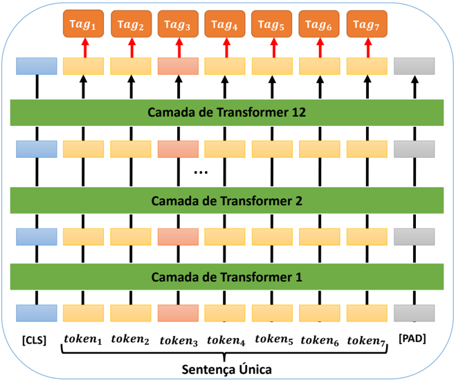

## Capítulo 4

## Metodologia

O presente estudo se trata de uma pesquisa quantitativa baseada em dados primários coletados através do portal do CADE, que disponibiliza os documentos dos processos de ato de concentração de forma digitalizada.

Sendo assim, uma das primeiras tarefas para realização desta pesquisa se dá pela coleta de processos de ato de concentração para construção do conjunto de dados para estudo.

Em seguida, se faz necessária a conversão dos documentos digitalizados em documentos de textos que podem ser consumidos pelas técnicas de PLN.

Após esse etapa, é necessária a realização de atividades de pré-processamento dos textos, com o intuito de padronizar os mesmos garantindo uma melhoria de desempenho dos modelos a serem criados.

Com os dados devidamente normalizados na etapa de pré-processamento, será realizada a tarefa de representação numérica de textos, que no nível mais granular consiste no uso de técnicas de representação numérica e densa de palavras e documentos.

Por fim serão realizadas atividades da etapa de modelagem de aprendizado de máquina e aprendizado profundo, na qual serão testadas técnicas para inferir o rito dos processos baseado nas características presentes nos documentos da operação.

Na figura 4.1 observa-se o resumo gráfico da proposta para resolução do problema estudado na presente pesquisa. Nas seções seguintes, nós detalhamos os principais pontos especificados na proposta.

Figura 4.1: Resumo gráfico com todas as etapas do estudo do problema de classificação do rito de atos de concentração, avaliados pelo CADE.

## 4.1 Coleta de Dados

Os dados foram obtidos através da plataforma SEI (Serviço Eletrônico de Informações), ferramenta de gestão de documentos e processos eletrônicos que visa a promoção de eficiência administrativa. O SEI foi desenvolvido e cedido pelo Tribunal Regional da 4 a Região (TRF4) e integra o Processo Eletrônico Nacional (PEN), uma iniciativa conjunta de órgão e entidades de diversas áreas da administração pública com o intuito de construir uma infraestrutura pública de processos e documentos administrativos eletrônicos.

A ferramenta de pesquisa pública do SEI permite a busca de processos utilizando diferentes filtros, tais como por número de processo, parte interessada, tipo de processo, período do processo/documento, entre outros. Através do filtro tipo de processo é possível delimitar a busca apenas para processos de ato de concentração, foco do presente estudo, utilizando os tipos 'Finalístico: Ato de Concentração Sumário' e 'Finalístico: Ato de Concentração Ordinário'. Na Figura 4.2 observa-se o formato da página de busca de processos por tipo.

Figura 4.2: Página de pesquisa de processos de Ato de Concentração

- O resultado da busca de processos da ferramenta resulta em uma lista de páginas que listam até 10 processos em cada uma delas. Conforme ilustrado na Figura 4.3.

Figura 4.3: Resultado da busca de processos de Ato de Concentração

No número de cada processo listado existe um hiperlink para uma página com os detalhes do processo, além da lista de documentos presentes dos mesmos. Conforme notado na Figura 4.4.

## Pesquisa Processual

|                   |                                                                                                                                                                                                                                                                                      | Gerar PDF   |
|-------------------|--------------------------------------------------------------------------------------------------------------------------------------------------------------------------------------------------------------------------------------------------------------------------------------|-------------|
| Autuação          | Autuação                                                                                                                                                                                                                                                                             | Autuação    |
| Processo:         | 08700.005705/2018-75                                                                                                                                                                                                                                                                 |             |
| Tipo              | Finalístico: Ato de Concentração Ordinário                                                                                                                                                                                                                                           |             |
| Data de Registro: | 25/09/2018                                                                                                                                                                                                                                                                           |             |
|                   | Notre Dame Intermédica Saúde SA MEDIPLAN ASSISTENCIAL LTDA Lino José Rodrigues Alves Fabiana de Souza Fernandes Luciana Marques Caropreso Maria Alicia Lorenzo Porto Renato Yervant Badiglian Leandro dos Sanlos Vieira Celso Cintra Mori                                            |             |
| Interessados:     | Rodrigo de Ihães Carneiro de Oliveira Cristianne Saccab Zarzur Renê Guilherme da Silva Medrado Marcos Pajolla Garrido Gláucia Gomes Menato Beatriz Alencar Dalessio Carolina Destailleur Gomes Battistella Bueno HOSPITAL SAMARITANO LTDA HOSPITAL MATERNIDADE SAMARITANO LTDA Magal |             |

Lista de Protocolos (421 registros):

Figura 4.4: Seleção de documentos e geração de PDF consolidado.

|   Documento Procosso | Tipo dc Documento                   | Data do Documento   | Data de Registro   | Unidade   |
|----------------------|-------------------------------------|---------------------|--------------------|-----------|
|              0529682 | Notlilicação de Ato de Concentração | 25/09/2018          | 25/09/2018         | PROT      |
|              0529683 | Formulário de Notificação de AC     | 25/09/2018          | 25/09/2018         | PROT      |
|              0529680 | Guia de Recolhimento da União GRU   | 25/09/2018          | 25/09/2018         | PROT      |
|              0529685 | Procuração (Notre Dame Intermédica) | 25/09/2018          | 25/09/2018         | PROT      |
|              0529701 | Recibo de Notificação de AC         | 25/09/2018          | 25/09/2018         | PROT      |
|              0530084 | Anexo SISGRU 0036306998             | 25/09/2018          | 25/09/2018         | SECONT    |

Para fazer o download dos documentos do processo, é necessário selecionar aqueles que se têm interesse e clicar em 'Gerar PDF', que gera um arquivo PDF contendo todos os documentos selecionados.

Nota-se que, como a pesquisa e o download dos documentos dos processos ocorre de forma individual, o uso desta ferramenta se torna pouco efetivo para levantamento de um volume relevante de processos e documentos.

Os documentos incluídos em um processo podem ser referentes a diferentes fases que envolvem a análise de um processo de ato de concentração, seja nas fases iniciais de requisição de aprovação do processo, seja durante as fases de avaliação e análises de impacto da operação, ou até mesmo nas fases de conclusão do processo.

Para permitir que o CADE faça uso deste modelo já nas fases iniciais do processo de ato de concentração, é importante considerar documentos submetidos no máximo até essas mesmas fases. Evitando, com isso, qualquer tipo de viés de informação futura.

Avaliando os documentos presentes nos processos, observa-se que no início todos têm em comum os documentos nomeados como: Notificação, Formulário de Ato de Concentração e Publicação no Diário Oficial da União. Sendo assim, para condução da pesquisa, nos concentraremos apenas nos documentos nomeados desta forma.

Fazendo uso do filtro de período do processo, foram coletados documentos de 1.275 processos, sendo 217 (17%) de rito ordinário e 1058 (83%) de rito sumário, do período que compreende de 1 de janeiro de 2015 até 27 de maio de 2018. Essa proporção desbalanceada entre ritos se dá pelo fato de a maioria dos processos serem de baixa complexidade, sendo assim, é esperado observar uma proporção muito superior de processos sumários.

Como se tratam de documentos digitalizados, foi necessário utilizar uma ferramenta de reconhecimento ótico de caracteres ( Optical Character Recognition - OCR), para conversão dos mesmos em documentos de texto. Para esta tarefa utilizamos a ferramenta Tesseract OCR.

## 4.2 Base de Dados

## 4.2.1 Particionamento de Base

O número de parâmetros a serem aprendidos no processo de treinamento do modelo é significantemente maior para técnicas de aprendizado profundo, em comparação com as técnicas tradicionais de aprendizado de máquina, aumentando consideravelmente o risco de ocorrência de sobre-ajuste ( overfiting ) de modelo, situação na qual o modelo aprende padrões muito específicos que só ocorrem na amostra de treino e não se repete em novas amostras de dados, e que leva a perda de capacidade de generalização do modelo.

A fim de verificar a ocorrência de sobre-ajuste de modelos, uma estratégia muito adotada é a de particionamento da base entre amostra de treino, validação e teste. A base de treino, como o nome indica, é utilizada para aprender os melhores parâmetros para minimizar a função de custo nesta mesma base. A base de validação é utilizada no processo de validação cruzada, a fim de avaliar a ocorrência (e seu momento) de sobre ajuste, bem como permitir o refinamento dos hiper parâmetros do modelo. Por fim, a amostra de teste é utilizada apenas para verificar se os padrões aprendidos na base de treino, e refinados pela base de validação, podem ser generalizados para uma nova base de dados com exemplos que o modelo desconhece.

Para seleção da amostra de teste utilizaremos a técnica de amostragem aleatória simples, também chamada de validação holdout . Para este trabalho, selecionamos aleatoriamente 30% dos documentos para serem utilizados como teste do modelo.

Para validação cruzada do modelo, dado o tamanho limitado de exemplos da base, nós iremos utilizar a técnica k-fold para validação cruzada, explicada na seção 4.2.2, o que nos permitirá inclusive avaliar a robustez do modelo para diferentes amostras.

## 4.2.2 Validação Cruzada

No processo de treinamento será adotada uma estratégia de validação cruzada denominada kfold , que consiste na divisão da base de treino em k sub-bases, e em seguida na realização, para cada sub-base i ∈ k , do treinamento utilizando a sub-base i como amostra de validação e as outras k -1 sub-bases restantes como amostra de treino.

Este processo resulta em k diferentes modelos treinados para cada técnica testada, um modelo para cada uma das k permutações do método k-fold , o que permite diferentes ações, tais como: seleção do modelo de melhor desempenho entre os k modelos treinados, ou utilização dos k modelos treinados ponderando o resultado de todos para cada amostra.

Na presente pesquisa, nós denotamos cada permutação do método k-fold simplesmente como fold i , tal que i ∈ k . E cada um destes k modelos serão aplicados na base de teste para averiguação dos resultados. Para aferição da medida de desempenho de cada técnica na base de teste, será calculada a média simples do desempenho dos k modelos resultantes de cada técnica.

Na Figura 4.5 ilustra-se o processo de k-fold para cada técnica que será testada, bem como a consolidação do desempenho observado na base de teste, para os k modelos treinados.

Figura 4.5: Organização do processo de validação cruzada, e da verificação do desempenho na base de teste.

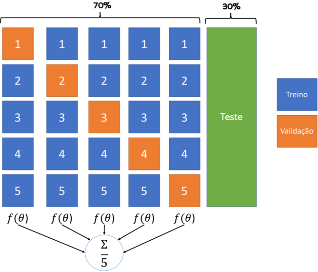

Desta forma, podemos avaliar tanto o desempenho (precisão, cobertura, acurácia, etc) médio do modelo entre as diferentes combinações de amostras de treino e validação, bem como avaliar a estabilidade dessas medidas através de seu desvio padrão e variância entre as combinações.

## 4.3 Análise Descritiva da Base

A seguir, realizamos uma análise descritiva na base de dados, a fim de conhecer as características gerais do problema estudado.

Na Figura 4.6 observa-se a proporção entre rito sumário e rito ordinário.

Figura 4.6: Proporção entre ritos dos processos

Importante observar a diferença de padrão de tamanho, em termos de quantidade de palavras, entre sumário e ordinário, conforme nota-se na Tabela 4.1.

Tabela 4.1: Diferença de frequência média de palavras entre rito sumário e ordinário na base de treino

| rito      |   treino |   teste |
|-----------|----------|---------|
| sumário   |   10.352 |  13.82  |
| ordinário |   25.075 |  26.041 |

Ao criar histogramas de frequência de palavras, também chegamos na mesma conclusão. Notase pelas Figuras 4.7, 4.8, que na base de treino os processos de rito ordinário tendem a ter em média uma quantidade de palavras relativamente superior em comparação com processos de rito sumário. Um dos motivos para este comportamento se dá pelo fato de processos ordinários terem maior complexidade, e portanto, maior volume de informações e detalhamentos sobre a operação.

Figura 4.7: Histograma de quantidade de palavras de processos de rito sumário na base de treino

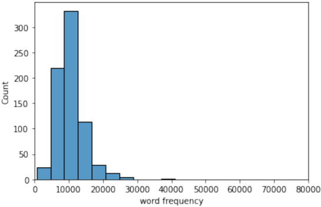

Figura 4.8: Histograma de quantidade de palavras de processos de rito ordinário na base de treino

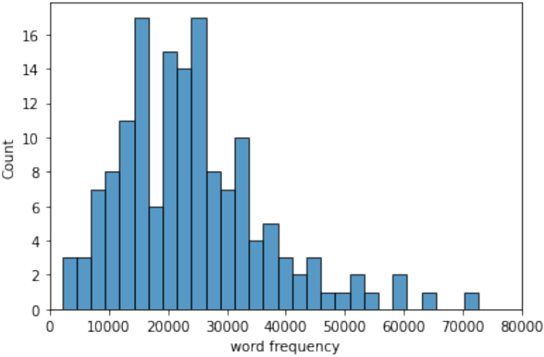

Assim como esperado, nota-se pelas Figuras 4.9 e 4.10 que na base de teste o mesmo comportamento de frequência de palavras é observado.

Figura 4.9: Histograma de quantidade de palavras de processos de rito sumário na base de teste

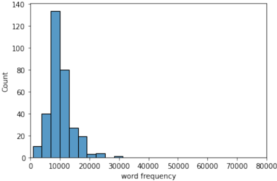

Figura 4.10: Histograma de quantidade de palavras de processos de rito ordinário na base de teste

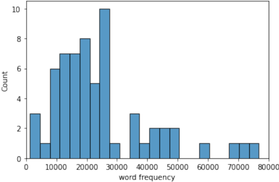

## 4.4 Definição do Modelo

A partir da definição das bases de dados, nós iremos descrever a seguir as propostas de modelos que iremos utilizar para realização dos experimentos. Serão testadas as técnicas BOW, Skipgram e BERT, em conjunto com as técnicas de Regressão Logística, Redes Neaurais, CNN, LSTM, BiLSTM, além de combinações entre elas.

## 4.4.1 Modelos Pré-treinados

Para uso da técnica Skipgram , nós iremos testar o modelo pré-treinado para português brasileiro desenvolvido para o seguinte trabalho [HFS + 17]. Quanto ao modelo BERT, nós testaremos o modelo pré-treinado para português brasileiro BERTimbau, versão Base , com 12 camadas de encoders e decoders , desenvolvido para o seguinte trabalho [SNL19].

## 4.4.2 Plataforma de Teste

Será utilizado como plataforma de teste o ambiente do Google Colab , que disponibiliza um ambiente Python com disponibilidade de CPUs, GPUs e TPUs, para a realização de testes, estudos

e experimentos. O código fonte de cada experimento está disponível no GitHub 1 , assim como as bases de dados utilizadas estão disponíveis no Mendeley Data 2 .

## 4.4.3 Processo de Treinamento

Para todos os modelos propostos, nós utilizaremos o algoritmo AdamW para otimização dos parâmetros. Além disso, o treinamento será realizado utilizando o conceito de parada adiantada, explicada na revisão bibliográfica, com paciência p = 20 . A entropia cruzada será utilizada como função de custo (erro) para treinamento dos modelos, porém de forma ponderada pela frequência de cada categoria da variável resposta, conforme também explicado na revisão bibliográfica.

## 4.4.4 Modelo Baseline

Iniciaremos com a construção de um modelo Baseline , com uma abordagem simples utilizando a representação BOW em conjunto com um modelo de Regressão Logística. Esse modelo será denotado simplesmente por BOW na avaliação dos resultados. Esta proposta está ilustrada na Figura 4.11.

Figura 4.11: Modelo baseline (BOW) para classificação de rito

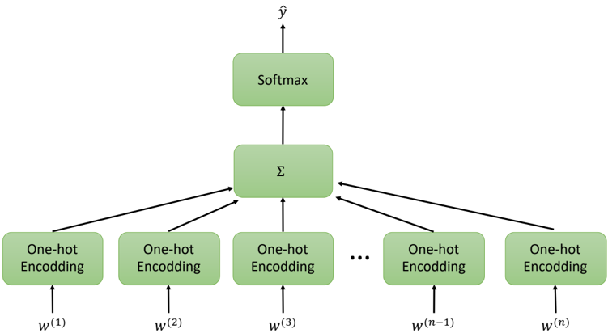

A fim de controlar a ênfase dada para palavras muito frequentes, que muitas vezes não representam importância significativa para discriminação entre sumário e ordinário, nós iremos aplicar uma normalização pela norma L p após a somatória dos vetores one-hot .

## 4.4.5 Proposta: Continuous Skipgram

Nossa proposta de modelo utilizando o modelo continuous skipgram está ilustrado na Figura 4.12. Faremos uso do modelo pré-treinado para a língua portuguesa [HFS + 17]. A partir dos vetores de cada palavra resultantes do modelo skipgram , nós iremos somá-los para obtenção de uma representação única de cada documento, adicionando uma camada softmax no topo da rede neural. Denotamos essa proposta como Skipgram .

1 https://github.com/brunoleme/Master\_Research

2 http://dx.doi.org/10.17632/yzyxtpcnxm.1

Figura 4.12: Proposta de modelo Skipgram

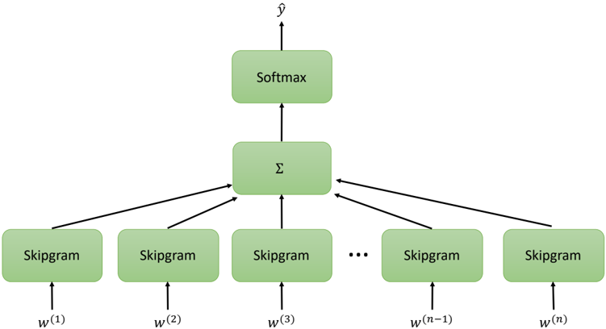

Assim como no modelo BOW, nós iremos aplicar uma normalização após a somatória dos vetores de embedding .

## 4.4.6 BERT Fine Tuning

Para o uso e refinamento do modelo pré-treinado BERT em nossas propostas, como nosso modelo tem em média uma frequência de palavras muito superior à limitação do modelo BERT (de até 512 tokens), nós iremos seguir o raciocínio adotado por [SQXH19], que consiste em selecionar os 128 primeiros e os 382 tokens finais de cada documento, refinando os parâmetros para resolução do problema de classificação do rito do processo. Uma estratégia muito comum para classificação de sentenças com o BERT se dá pelo uso apenas da representação calculada para o token inicial [CLS].

Na Figura 4.13 observa-se a estrutura para refinamento, com o formato de entrada de cada exemplo (com a lógica proposta por [SQXH19]), e o uso da representação do token [CLS] da última camada do modelo, para classificação da resposta desejada (sumário ou ordinário).

Figura 4.13: Processo de refinamento para a tarefa fim: identificação de rito mais apropriado

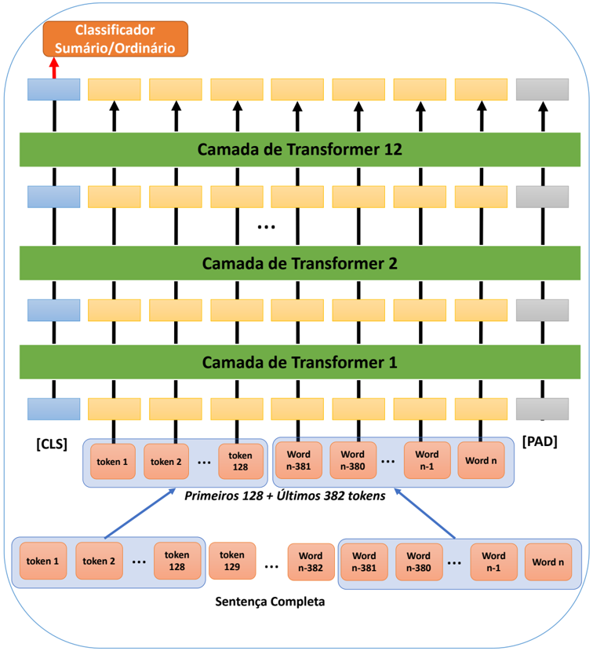

A intuição por trás desta estratégia de considerar os 128 tokens iniciais com os 382 tokens finais está em capturar nos exemplos as argumentações iniciais, onde começa a tese de solicitação de classificação do rito, em conjunto com as argumentações finais, que geralmente consiste em um resumo e apanhado geral de todas as alegações e provas que sustentam a aceitação da tese defendida.

Após o processo de refinamento é necessário estruturar como será feita a aplicação do modelo BERT, para cada exemplo da base, dado que os documentos têm tamanhos constatadamente elevados. Nós adotamos a lógica proposta por [PŻV + 19], que consiste na quebra da sentença de tokens em pequenos blocos ( chunks ), com sobreposição, a fim de evitar perda de tokens úteis para representação de um contexto. Conforme ilustrado na Figura 4.14.

Figura 4.14: Particionamento do documento em pequenos blocos com sobreposição

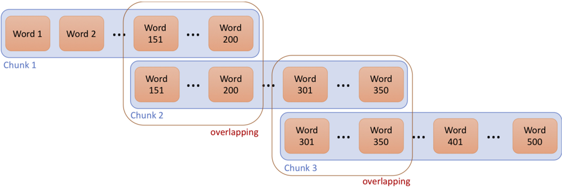

O modelo BERT pós-refinamento será então aplicado em cada um destes blocos, resultando em uma representação para cada um dos 512 tokens de cada bloco de cada documento. Conforme a prática explicada para o refinamento do modelo BERT, nós iremos utilizar nas próximas propostas apenas a representação de saída do token [CLS] de cada bloco, de cada documento. A grosso modo, cada documento se transformará em uma lista de representações de tokens [CLS], de cada bloco correspondente.

## 4.4.7 Proposta: BERT e CNN

A partir do particionamento dos documentos em blocos de sentenças, será testada a técnica CNN com base na representação vetorial do token [CLS] da última camada do BERT, de cada um dos blocos, para todos os documentos. Conforme ilustrado na Figura 4.15. Essa proposta será denotada por BERT\_CNN .

Figura 4.15: Proposta de modelo utilizando BERT com CNN

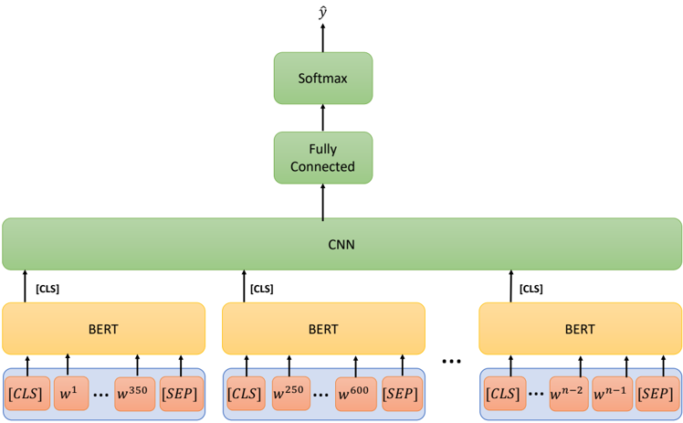

Para realizar o treinamento dos parâmetros da camada CNN, nós iremos fixar o tamanho da lista de vetores [CLS] em 50, tamanho que permite a representação de 25.000 (50 x 510) tokens por documento, truncando os vetores [CLS] de índice acima de 50.

Para documentos de quantidade de vetores de tokens [CLS] inferior a 50, nós iremos realizar o preenchimento à esquerda com vetores contendo valores zerados. Essa estratégia se faz necessária, pois o framework (PyTorch) utilizado para treinamento dos modelos tem como requisito o mesmo tamanho de vetor de entrada para todas as observações da base.

Nós realizaremos uma normalização após o cálculo dos vetores [CLS], e testaremos uma rede neural com 1 camada de 64 filtros de convolução, com kernel de tamanho 2, utilizando como pooling a função max . Adotamos uma arquitetura de CNN bastante simples, evitando adicionar muita complexidade (com mais de 1 camada de convolução e pooling ) em um problema de baixo número observações, minimizando assim possíveis problemas de overfitting .

## 4.4.8 Proposta: BERT e LSTM

Assim como na proposta com CNN, será testada a técnica LSTM com base na representação vetorial do token [CLS] da última camada do BERT, de cada um dos blocos, para todos os documentos. Conforme ilustrado na Figura 4.16. Essa proposta será denotada por BERT\_LSTM .

Figura 4.16: Proposta de modelo utilizando BERT com LSTM

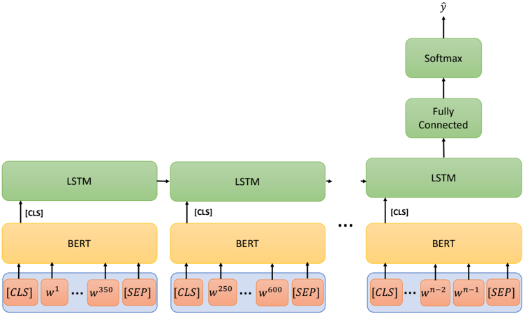

Assim como no modelo BERT e LSTM, nós iremos fixar o tamanho da lista de vetores [CLS] em 50, truncando a sentença ou realizando o mesmo tipo de preenchimento (para casos com vetores [CLS] de tamanho inferior a 50), quando necessário.

Nós realizaremos uma normalização após o cálculo dos vetores [CLS], e testaremos uma LSTM com 2 camadas ocultas.

## 4.4.9 Proposta: BOW + SkipGram

As próximas propostas serão com base em redes neurais de arquitetura híbrida que combina características da técnica BOW com as características das outras técnicas propostas. Permitindo a identificação de ambos os tipos de padrão em um mesmo modelo. Na Figura 4.20 ilustra-se uma arquitetura que combina a técnica BOW com Skipgram em um mesmo modelo. Essa proposta será

denotada por BOW\_Skipgram .

Figura 4.17: Proposta de modelo de rede neural híbrida utilizando BOW com SkipGram

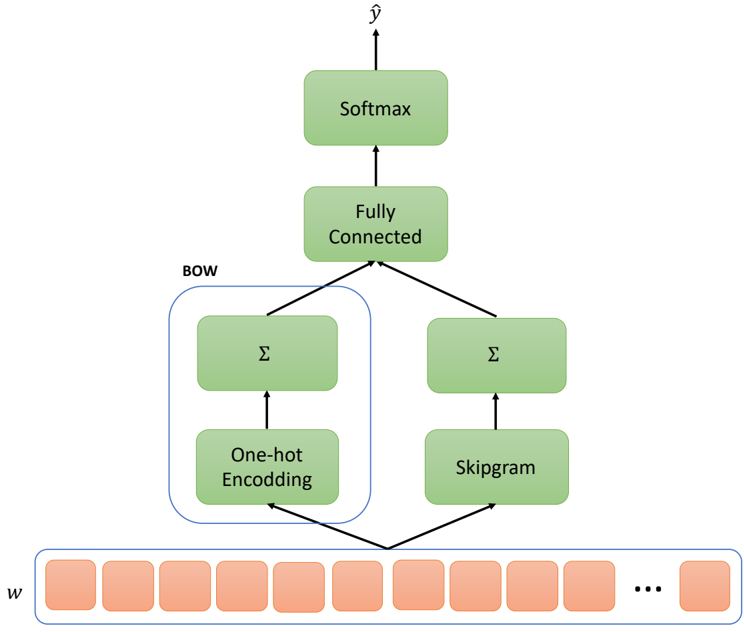

Assim como nas propostas anteriores, nós realizaremos uma normalização após a somatória dos vetores, tanto resultantes da método BOW quanto do método Skipgram, ainda mais pelo fato de os dois métodos proverem vetores com escalas distintas.

## 4.4.10 Proposta: BOW + BERT e CNN

Na proposta a seguir, testaremos uma rede neural que combina a arquitetura BOW, com um modelo BERT para representação das sentenças dos documentos, e com uma camada de CNN aplicada na sequência de representações do token [CLS] de cada sentença resultante do modelo BERT. Essa proposta será denotada por BOW\_BERT\_CNN . O tamanho da lista de vetores [CLS] está fixado em 50.

Figura 4.18: Proposta de modelo de rede neural híbrida utilizando BOW com BERT e CNN

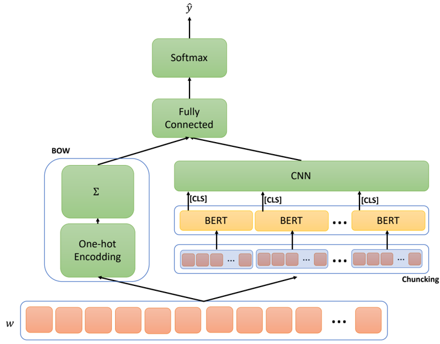

Nós realizaremos uma normalização após a somatória dos vetores do método BOW, e após o cálculo dos vetores [CLS] (antes da camada CNN). Além disso, testaremos uma camada de CNN com 1 camada de 64 filtros de convolução, com kernel de tamanho 2, utilizando como pooling a função max .

## 4.4.11 Proposta: BOW + BERT e LSTM

Na proposta a seguir, testaremos uma rede neural que combina a arquitetura BOW, com um modelo BERT para representação das sentenças dos documentos, e com uma camada de LSTM aplicada na sequência de representações do token [CLS] de cada sentença resultante do modelo BERT. Essa proposta será denotada por BOW\_BERT\_LSTM . O tamanho da lista de vetores [CLS] está fixado em 50.

Figura 4.19: Proposta de modelo de rede neural híbrida utilizando BOW com BERT e LSTM

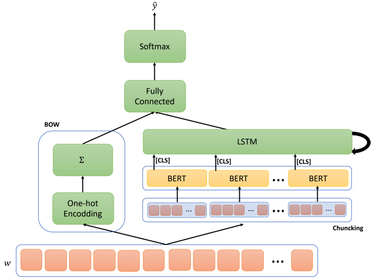

Nós realizaremos uma normalização após a somatória dos vetores do método BOW, e após o cálculo dos vetores [CLS] (antes da camada LSTM). Além disso, testaremos nossa camada LSTM com 2 camadas empilhadas.

## 4.4.12 Proposta: BOW + BERT e BiLSTM

Na proposta a seguir, testaremos uma rede neural que combina a arquitetura BOW, com um modelo BERT para representação das sentenças dos documentos, e com uma camada de BiLSTM aplicada na sequência de representações do token [CLS] de cada sentença resultante do modelo BERT. Essa proposta será denotada por BOW\_BERT\_BiLSTM . O tamanho da lista de vetores [CLS] está fixado em 50.

Figura 4.20: Proposta de modelo de rede neural híbrida utilizando BOW com BERT e BiLSTM

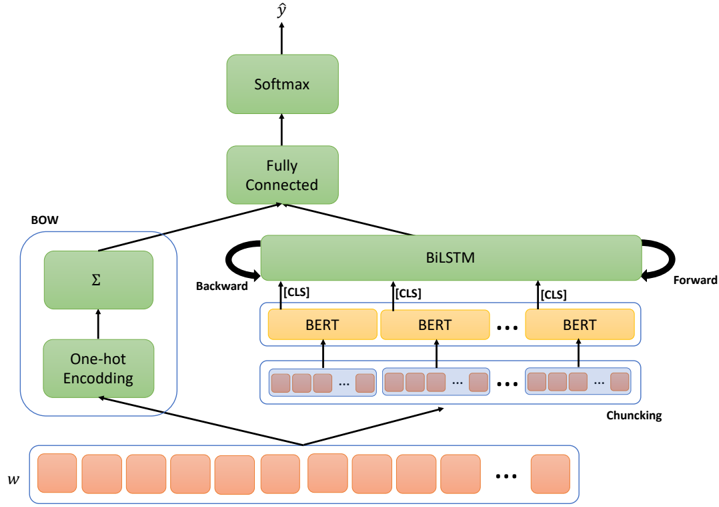

Nós realizaremos uma normalização após a somatória dos vetores do método BOW, e após o cálculo dos vetores [CLS] (antes da camada BiLSTM). Além disso, testaremos nossa camada BiLSTM com apenas 1 camada, devido a complexidade do modelo.

## 4.5 Avaliação

Os modelos de classificação propostos nesse trabalho retornam probabilidades como resultado, com domínio de valores variando de 0 a 1 . As arquiteturas dos modelos propostos nesse trabalho finalizam com uma normalização Softmax , que retorna uma probabilidade para cada categoria de resposta possível (sumário ou ordinário). Para realizar a decisão da categoria c predita pelo modelo, faremos uso da probabilidade p de a observação ser da categoria ordinário, conforme descrito abaixo.

<!-- formula-not-decoded -->

Com base nas categorias preditas pelo modelo, em conjunto com as categorias verdadeiramente observadas, é possível construir uma matriz de confusão, método comumente utilizado para avaliação da qualidade de ajuste do modelo. O formato da matriz de confusão pode ser observado na Tabela 4.2.

Para construção da matriz de confusão, as seguintes métricas (no contexto do problema de classificação entre sumário e ordinário) precisam ser calculadas:

- Verdadeiros sumários ( V S ): número de processos sumários que o modelo verdadeiramente classificou como sumários.
- Verdadeiros ordinários ( V O ): número de processos ordinários que o modelo verdadeiramente classificou como ordinários.

Tabela 4.2: Matriz de confusão para avaliação de modelos.

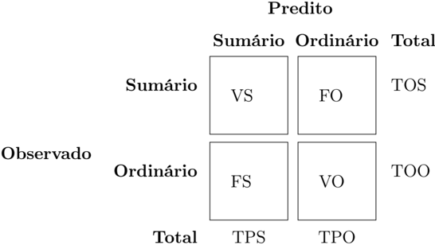

- Falsos sumários ( FS ): número de processos ordinários que o modelo erroneamente classificou como sumários.
- Falsos ordinários ( FO ): número de processos sumários que o modelo erroneamente classificou como ordinários.
- Total observado de sumários ( TOS ): número total de processos sumários observados.
- Total observado de ordinários ( TOO ): número total de processos ordinários observados.
- Total predito de sumários ( TPS ): número total de processos classificados como sumários pelo modelo.
- Total predito de ordinários ( TPO ): número total de processos classificados como ordinários pelo modelo.

Fazendo uso destas métricas da matriz de confusão nós calcularemos medidas de qualidade de ajuste do modelo, tais como precisão, cobertura e F1 score de classificação para cada categoria, além da acurácia de classificação geral do modelo.

Precisão de classificação mensura a taxa de acerto do modelo para classificação de uma categoria de interesse. Na fórmula a seguir nota-se como seu cálculo é realizado.

<!-- formula-not-decoded -->

<!-- formula-not-decoded -->

<!-- formula-not-decoded -->

Observada individualmente, a medida de precisão de classificação pode levar a más interpretações, se o modelo tiver uma altíssima precisão para classificar uma categoria, porém não prever a ampla maioria dos exemplos desta categoria, o mesmo não será útil para aquela tarefa. A medida de cobertura de classificação mensura o quanto que o modelo conseguiu classificar corretamente de todos os exemplos existentes daquela categoria de interesse. Na fórmula a seguir nota-se como seu cálculo é realizado.

<!-- formula-not-decoded -->

<!-- formula-not-decoded -->

A probabilidade resultante do modelo indica o grau de certeza do modelo para classificar para aquela categoria. Elevar o ponto de corte para decisão de classificação resulta em aumentar o grau de certeza (aumentando sua precisão de classificação do modelo), porém acarreta na redução do número de exemplos classificados corretamente para a mesma categoria (diminuindo a cobertura de classificação do modelo). Reduzir o ponto de corte causa o inverso em ambas as métricas. Como ambas as medidas mensuram a qualidade do modelo em diferentes aspectos, bem como são totalmente correlacionadas, podemos calcular uma medida baseada na média harmônica entre precisão e cobertura, neste caso, medida também conhecida como F1 Score, conforme detalhado a seguir.

<!-- formula-not-decoded -->

Por fim, podemos calcular a medida de acurácia do modelo, que mensura a taxa de acerto de classificação para qualquer uma das categorias de resposta do modelo. Seu calculo se dá da seguinte forma:

<!-- formula-not-decoded -->

As medidas descritas acima são muito utilizadas para avaliação da qualidade de ajuste de modelos de classificação entre 2 ou mais categorias de resposta.

## Capítulo 5

## Resultados

## 5.1 Avaliação dos Experimentos

Após o particionamento da base, a amostra de treino ficou composta por 153 processos ordinários e 735 processos sumários (17% e 83%), proporção que se manteve na amostra de teste (64 e 317). Se classificássemos todas as observações como sumário, logo de início teríamos uma acurácia de 83%.

Em geral, o tamanho dos documentos é muito elevado. Processos de rito sumário têm em média 9.934 palavras, enquanto que processos ordinários têm em média 24.328 palavras (2,45 a mais que processos sumários).

Conforme descrito na seção anterior, realizou-se inicialmente o treinamento de modelos na amostra de treino, utilizando k-fold como técnica de validação cruzada com k = 5 . Posteriormente, os modelos treinados de cada uma das k possíveis configurações de folds foram aplicados na base de teste.

Por ser uma das abordagens mais simples para classificação de documentos, usou-se a técnica BOW em conjunto com a técnica de regressão logística como baseline inicial dos experimentos. Para aprendizado dos paramêtros da regressão, adotamos o algoritmo de otimização AdamW para minimizar o erro das respostas preditas, com uma taxa de aprendizado LR = 0 , 01 . Como medida de erro ajuste do modelo, utilizamos a função de entropia cruzada.

Nas Figuras 5.1 e 5.2 observa-se a qualidade de ajuste do modelo, através do erro e acurácia, ao longo das épocas na base de validação.

Figura 5.1: Convergência de erro do modelo baseline ( BOW ) ao longo das épocas, para cada fold de validação.

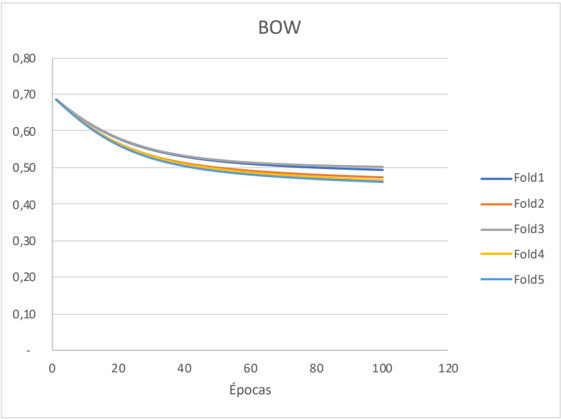

Nota-se que o modelo BOW não apresentou dificuldades de convergência para nenhum dos folds de treinamento (configurações possíveis do método k-fold ). O erro convergiu para pouco abaixo de 0,5 em todos os folds .

Figura 5.2: Acurácia do modelo baseline ( BOW ) ao longo das épocas, para cada fold de validação.

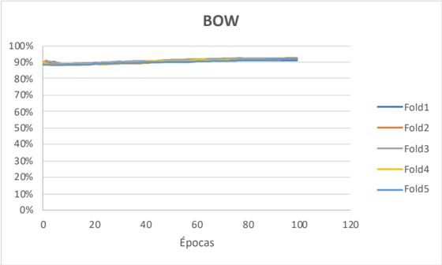

Em geral, a acurácia do modelo BOW convergiu para pouco acima de 0,9. A facilidade de convergência pode se dar devido a simplicidade (em termos de quantidade de parâmetros) dessa abordagem.

Em seguida, testamos a abordagem utilizando o modelo de representação de palavras Skipgram, pré-treinado para o português brasileiro, em conjunto com a regressão logística. Nas Figuras 5.3 e 5.4 verifica-se qualidade de ajuste com esta abordagem, através do erro e acurácia.

Figura 5.3: Convergência do erro do modelo skipgram com regressão logística ao longo das épocas, para cada fold de validação.

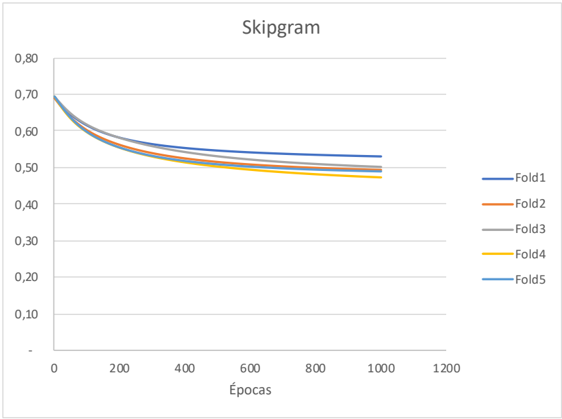

Observa-se que com o modelo Skipgram também não houve dificuldades de convergência, embora o erro seja em geral pior que o observado no modelo BOW .

Figura 5.4: Acurácia do modelo skipgram com regressão logística ao longo das épocas, para cada fold de validação.

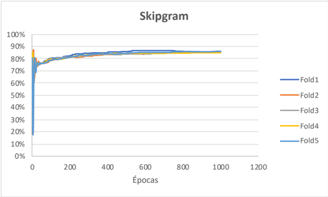

Verifica-se de forma clara nas curvas de acurácia o pior desempenho do modelo Skipgram. Em geral, ficando notadamente abaixo de 90%, diferente do modelo BOW que ficou acima de 90% em todos os folds . Além disso, nota-se uma dificuldade um pouco maior de convergência de acurácia nas épocas iniciais de treinamento. Uma hipótese para o desempenho

Na sequência, realizamos a aplicação do modelo BERT para realização dos experimentos com as outras propostas planejadas.

Para refinamento nós utilizamos a biblioteca Hugging Face 1 , que disponibiliza implementações modelos pré-treinados de NLP, entre elas o modelo BERT, possibilitando o treinamento de novos modelos, bem como o carregamento de modelos pré-treinados e o refinamento de seus parâmetros para novos problemas. No nosso caso, carregamos o modelo BERTimbau, e utilizamos a classe BertForSentenceClassification para refinamento do modelo. A seguir observam-se o ajuste e acurácia do modelo BERT, ao longo das épocas de refinamento, para cada possível conjunto de treino e validação do método k-fold .

Figura 5.5: Ajuste do modelo BERT no processo de refinamento para a configuração de treino/validação fold 1.

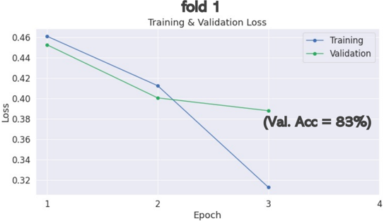

Nota-se que o processo de refinamento no fold 1 fez com que o erro ( loss ) reduzisse em ambas as amostras de treino e validação. No entanto, observa-se que a diferença de ajuste entre treino e validação se acentua a partir da época 3. A acurácia observada na amostra de validação deste fold foi de 83%.

Figura 5.6: Ajuste do modelo BERT no processo de refinamento para a configuração de treino/validação fold 2.

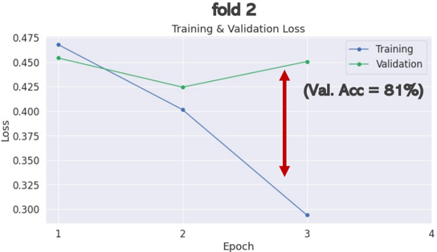

Nota-se uma maior dificuldade de ajuste no fold 2, o erro da amostra de validação piora sensivelmente entre as épocas 2 e 3, além da ocorrência de um descolamento (destacado na figuro) entre as amostras de treino e validação, o que indica um possível overfitting ). A acurácia observada na amostra de validação deste fold foi de 81%.

1 Figura extraída de Biblioteca Hugging Face , disponível em: https://huggingface.co//

Figura 5.7: Ajuste do modelo BERT no processo de refinamento para a configuração de treino/validação fold 3.

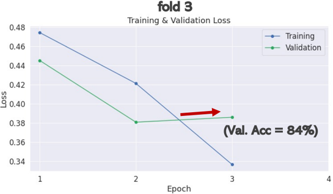

No fold 3, nota-se que o processo de refinamento conseguiu reduzir, de forma geral, o erro ao longo das épocas, com o ponto de atenção para a amostra de validação que não apresentou redução entre as épocas 2 e 3 (apresentando inclusive uma leve piora). A acurácia observada na amostra de validação deste fold foi de 84%.

Figura 5.8: Ajuste do modelo BERT no processo de refinamento para a configuração de treino/validação fold 4.

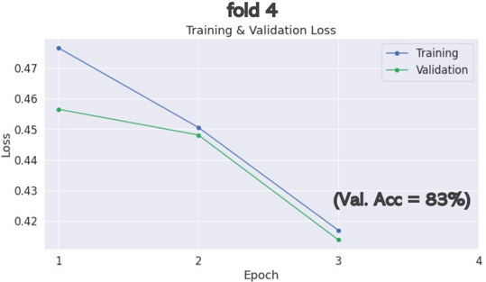

No fold 4, nota-se que o processo de refinamento conseguiu reduzir o erro ao longo de todas as 3 épocas, para ambas as amostras de treino e validação, com desempenho final muito próximos entre ambas. A acurácia observada na amostra de validação deste fold foi de 83%.

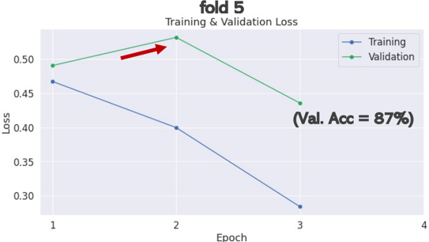

Epoch

Figura 5.9: Ajuste do modelo BERT no processo de refinamento para a configuração de treino/validação fold 5.

Já no fold 5, embora o erro tenha piorado entre as épocas 1 e 2 para a amostra de validação, após a época 3 houve uma melhora significativa na mesma amostra. Embora nota-se uma diferença relevante entre o desempenho final observado em treino e validação. A acurácia observada na amostra de validação deste fold foi de 87%.

A dificuldade de refinamento para alguns folds pode ser por decorrência da complexidade deste tipo de modelo, para um cenário de poucas observações (1.275 processos, sem considerar a divisão entre amostras de treino, validação e teste).

A partir do modelo BERT, já com os devidos processos de refinamento realizado, demos sequência aos nossos experimentos. Dividimos cada documento blocos ( chuncks ) com sobreposição, de tamanho inferior a 512 palavras, para possibilitar a aplicação do modelo BERT.

O modelo BERT foi aplicado para cada bloco de palavras, de cada documento. Cada aplicação, em cada bloco, resulta em uma representação vetorial daquele bloco (expressada pelo token [CLS]). Sendo assim, esse processo retornará para cada documento com sua lista de blocos de palavras, uma lista de representações vetoriais resultantes do modelo BERT, uma para cada bloco, respectivamente.

Por fim, aplicamos as técnicas de CNN ( BERT\_CNN ) e LSTM ( BERT\_LSTM ) na tentativa de aprender padrões nas listas de representações vetoriais de cada documento, a fim de criar um classificador para o comportamento alvo (rito sumério ou ordinário). A seguir apresentamos os resultados de convergência obtidos do modelo BERT\_CNN nas Figuras 5.10 e 5.11.

Figura 5.10: Convergência do erro do modelo BERT\_CNN para cada fold de validação.

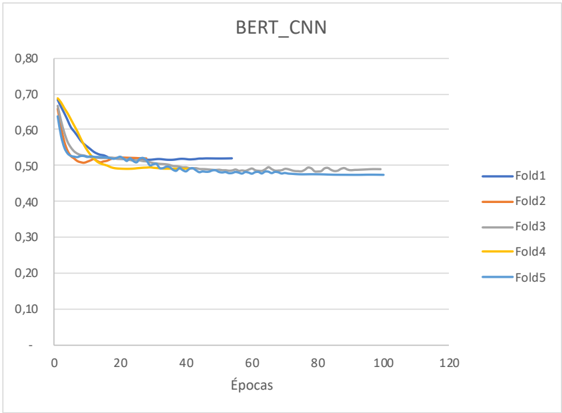

Observa-se que com o modelo BERT\_CNN a convergência foi muito mais rápida, com pouco mais de 10 épocas de treinamento, o erro chegou muito próxima do seu mínimo, devido ao uso do método de parada adiantada, o processo de treinamento se encerrou antes de 60 épocas para 3 dos 5 folds . No entanto, o erro em geral ficou pior que o observado no modelo BOW .

Figura 5.11: Acurácia do modelo BERT\_CNN para cada fold de validação.

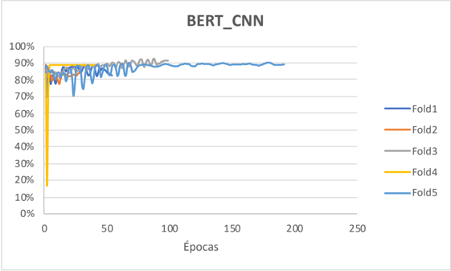

Destaca-se na convergência de acurácia do modelo BERT\_CNN , uma maior dificuldade, com relação as propostas anteriores, conforme observa-se pela instabilidade (acréscimo e decréscimo) ao longo das épocas, em praticamente todos os folds .

Na sequência, nas Figuras 5.12 e 5.13, apresentamos os resultados de convergência obtidos do modelo BERT\_LSTM .

Figura 5.12: Convergência do erro do modelo BERT\_LSTM para cada fold de validação.

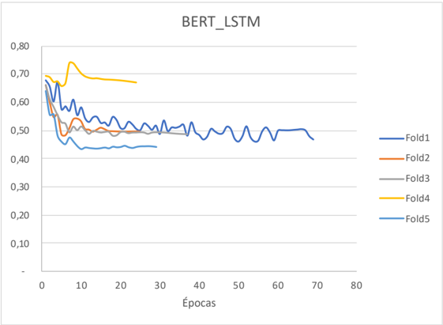

Conforme observado, a abordagem com modelo BERT\_LSTM apresentou grandes dificuldades para convergência do erro, conforme se nota pela variabilidade entre todos os folds (variação de pouco mais de 0,4 até pouco menot de 0,7).

Figura 5.13: Acurácia do modelo BERT\_LSTM para cada fold de validação.

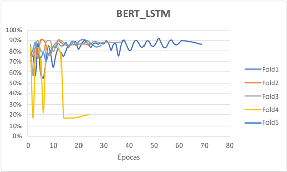

- O mesmo comportamento de instabilidade pode ser observado no gráfico de convergência de acurácia. Notadamente, o modelo não conseguiu convergir para com o fold 4.

Conforme observado, o modelo baseline ( BOW ) apresentou o melhor desempenho entre todos, até o momento. Uma hipótese para isso se dá pela diferença de frequência média de palavras entre processos sumários e ordinários (9.934 vs 24.328), ou pela possível presença de palavras chave muito significantes para auxiliar na discriminação entre sumário e ordinário. Características que, em comparação com as outras técnicas testadas, o modelo BOW consegue capturar de forma muito eficiente.

Devido a isso, testamos a utilização de diferentes tipos de modelos de rede neural de arquitetura híbrida, combinando o tipo de padrão identificado pelo modelo BOW com a adição das características extraídas por modelos de representação de linguagem (Skipgram e BERT), bem como com arquiteturas de redes neurais de aprendizado profundo (CNN, LSTM, BiLSTM).

A seguir, observam-se os resultados da arquitetura de rede neural que combina o formato BOW

com a representação Skipgram ( BOW\_Skipgram ).

Figura 5.14: Convergência do erro do modelo de rede neural que combina o padrão BOW com o modelo Skipgram, para cada fold de validação.

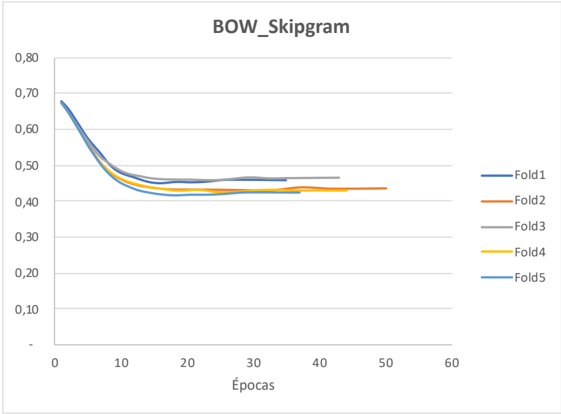

Nota-se que com a abordagem BOW\_Skipgram , a convergência se mostrou superior aos modelos testados anteriormente, além de ser muito mais rápida (chegando perto do máximo com apenas 10 épocas de treinamento). O erro observado foi em geral superior ao observado no modelo BOW , o melhor até o momento.

Figura 5.15: Acurácia do modelo de rede neural que combina o padrão BOW com o modelo Skipgram, para cada fold de validação.

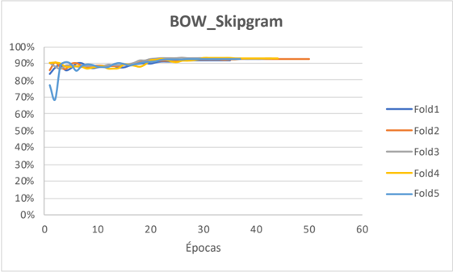

Nota-se também um desempenho superior em termos de convergência de acurácia ao longo das épocas de treinamento.

Uma hipótese para a superação de desempenho se dá pela adição de novas features (provenientes dos vetores de representação Skipgram ) além das features já utilizadas no modelo BOW (frequência de palavras).

A seguir, fizemos o mesmo raciocínio combinando o modelo BOW com uma rede CNN, aprendendo padrões sequenciais nas listas de representações do token [CLS], de cada documento, calculadas pelo modelo BERT ( BOW\_BERT\_CNN ).

Figura 5.16: Convergência do erro do modelo de rede neural que combina o padrão BOW com o modelo CNN aplicado na sequência de representações do token [CLS], calculadas pelo modelo BERT para cada sequência de palavras do documento.

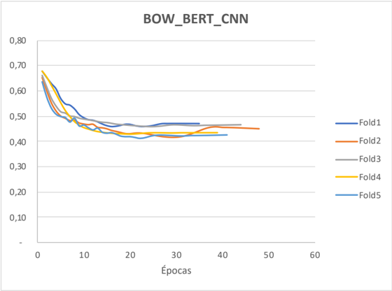

Observa-se que este modelo também consegue convergir de forma efetiva, também superando o modelo BOW , se aproximando de 0,4 de erro para os folds 4 e 5. Porém observa-se uma maior instabilidade, com relação ao observado no modelo BOW\_Skipgram . Uma hipótese para essa maior dificuldade inicial de convergência pode estar relacionada a maior complexidade do modelo.

Figura 5.17: Acurácia do modelo de rede neural que combina o padrão BOW com o modelo CNN aplicado na sequência de representações do token [CLS], calculadas pelo modelo BERT para cada sequência de palavras do documento.

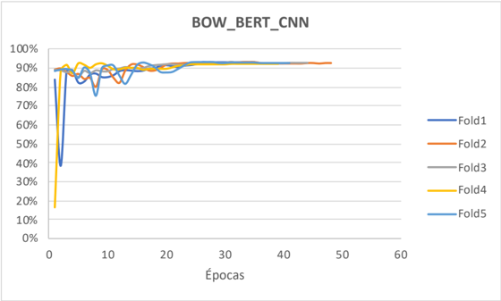

A convergência em termos de acurácia se dá com um pouco mais dificuldade nas épocas iniciais, porém os patamares alcançados ao final do treinamento são similares ao modelo BOW\_Skipgram .

Na sequência, testamos uma arquitetura híbrida do padrão BOW com as redes LSTM e BiLSTM. ( BOW\_BERT\_LSTM e BOW\_BERT\_BiLSTM ).

Figura 5.18: Convergência do erro do modelo de rede neural que combina o padrão BOW com o modelo LSTM aplicado na sequência de representações do token [CLS], calculadas pelo modelo BERT para cada sequência de palavras do documento.

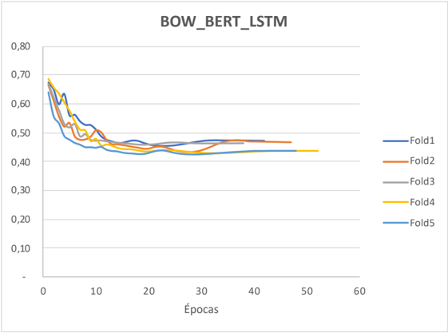

Observa-se que este modelo também consegue convergir de forma efetiva, porém com um pouco mais de dificuldade no início do treinamento, também superando o modelo BOW no final e se aproximando de 0,4 de erro para os folds 4 e 5. Também observa-se uma maior instabilidade neste modelo.

Figura 5.19: Acurácia do modelo de rede neural que combina o padrão BOW com o modelo LSTM aplicado na sequência de representações do token [CLS], calculadas pelo modelo BERT para cada sequência de palavras do documento.

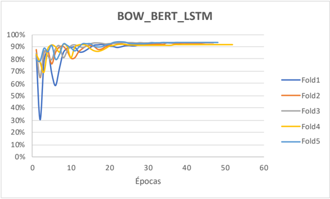

Analisando a acurácia ao longo das épocas do modelo BOW\_BERT\_LSTM , fica mais evidente a instabilidade nas épocas iniciais. Porém a acurácia se estabiliza na sequencia, se mantendo acima de 90% em todos os folds . A mesma hipótese de complexidade pode se aplicar para explicar essa maior instabilidade e dificuldade de convergência.

Figura 5.20: Convergência do erro do modelo de rede neural que combina o padrão BOW com o modelo LSTM bidirecional aplicado na sequência de representações do token [CLS], calculadas pelo modelo BERT para cada sequência de palavras do documento.

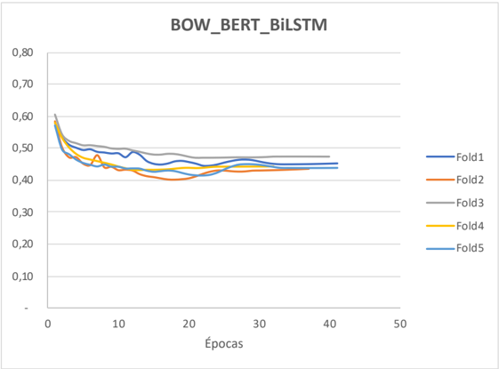

Destaca-se no modelo BOW\_BERT\_BiLSTM muito mais rapidez para convergência, em geral terminando o treinamento até 40 épocas.

Figura 5.21: Acurácia do modelo de rede neural que combina o padrão BOW com o modelo LSTM bidirecional aplicado na sequência de representações do token [CLS], calculadas pelo modelo BERT para cada sequência de palavras do documento.

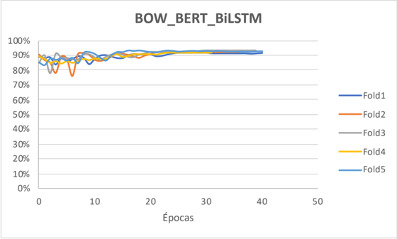

Assim como no modelo anterior (porém em menor grau), observa-se uma instabilidade de acurácia nas épocas iniciais do treinamento do modelo BOW\_BERT\_BiLSTM . Porém a acurácia se estabiliza na sequencia, também se mantendo acima de 90% em todos os folds .

A seguir, nós construímos tabelas resumo contendo as métricas especificadas (precisão, cobertura, F1 score e acurácia) para avaliação da qualidade dos modelos treinados. Na Tabela 5.1 observase os resultados de precisão de classificação de processos ordinários para cada uma das abordagens testadas.

Tabela 5.1: Precisão de classificação de ordinário na base de teste, entre os modelos treinados nos 5 folds.

| Modelo          | 1     | 2     | 3     | 4     | 5     | Média   | Desvio Padrão   |
|-----------------|-------|-------|-------|-------|-------|---------|-----------------|
| BOW             | 77,8% | 81,5% | 84,0% | 78,2% | 80,0% | 80,3%   | 2,28%           |
| Skipgram        | 56,3% | 54,5% | 57,1% | 52,4% | 56,6% | 55,4%   | 1,72%           |
| BERT_CNN        | 48,2% | 51,8% | 75,0% | 67,2% | 65,7% | 61,6%   | 10,04%          |
| BERT_LSTM       | 55,8% | 57,3% | 64,6% | 17,2% | 56,8% | 50,4%   | 16,88%          |
| BOW_Skipgram    | 82,4% | 86,0% | 85,7% | 84,3% | 83,0% | 84,3%   | 1,44%           |
| BOW_BERT_CNN    | 89,4% | 87,2% | 86,0% | 81,1% | 84,6% | 85,7%   | 2,75%           |
| BOW_BERT_LSTM   | 91,1% | 93,0% | 89,4% | 78,2% | 95,1% | 89,4%   | 5,91%           |
| BOW_BERT_BiLSTM | 82,0% | 81,5% | 91,1% | 79,6% | 89,1% | 84,7%   | 4,56%           |

Acompanhando o que já fora sinalizado nas análises de convergência realizadas, verifica-se pela tabela 5.1 que o desempenho de precisão de classificação de rito ordinário das abordagens Skipgram , BERT\_CNN e BERT\_LSTM é muito inferior ao desempenho alcançado pelo modelo baseline BOW .

Nota-se que o modelo BOW\_BERT\_LSTM obteve na média entre todos os folds , a maior precisão de classificação de ordinários com taxa de de 89,4%. Este modelo apresentou o melhor desempenho nos folds 1, 2 e 5. Outra forma de avaliar se dá pelo erro de precisão de ordinários de 10,6% (100% - 89,4%), contra um erro de precisão de ordinários de 19,7% (100% - 80,3%) do modelo BOW . Uma redução de 46,2% ((10,6% / 19,7%) - 1) no erro médio de precisão de ordinários.

No entanto verifica-se que este modelo possui um pouco de instabilidade, dado que seu desvio padrão de (5,91%) é o terceiro maior entre todos os modelos. Essa instabilidade é causada principalmente pelo desempenho observado no fold 4, com desempenho significativamente abaixo ao observado nos outros folds . Os modelos de melhor desempenho nos folds 3 e 4 foram respectivamente o BOW\_BERT\_CNN e o BOW\_BERT\_BiLSTM .

Omodelo de maior estabilidade é o BOW\_Skipgram , com desvio padrão de 1,44%, no entanto sua precisão média (84,3%) é significativamente abaixo do modelo de melhor precisão média (89,4%).

Importante destacar que para o modelo BERT\_LSTM , o processo de treinamento não conseguiu convergir satisfatoriamente, e resultando em uma precisão de ordinário de apenas 17,2% (a proporção de ritos ordinários da base de teste, que indica que o modelo está classificando praticamente todas as amostras deste fold como ordinário).

Na Tabela 5.2 observa-se os resultados de precisão de classificação de processos sumários para cada uma das abordagens testadas.

| Modelo          | 1     | 2     | 3     | 4     | 5     | Média   | Desvio Padrão   |
|-----------------|-------|-------|-------|-------|-------|---------|-----------------|
| BOW             | 93,6% | 94,2% | 93,7% | 93,9% | 94,2% | 93,9%   | 0,25%           |
| Skipgram        | 92,6% | 93,1% | 92,6% | 93,3% | 93,4% | 93,0%   | 0,36%           |
| BERT_CNN        | 92,6% | 93,6% | 94,4% | 92,6% | 94,5% | 93,5%   | 0,85%           |
| BERT_LSTM       | 93,4% | 93,5% | 93,4% | 92,3% | 94,3% | 93,4%   | 0,64%           |
| BOW_Skipgram    | 93,6% | 94,0% | 93,7% | 93,9% | 94,2% | 93,9%   | 0,21%           |
| BOW_BERT_CNN    | 93,7% | 93,4% | 94,0% | 93,9% | 94,2% | 93,8%   | 0,27%           |
| BOW_BERT_LSTM   | 93,5% | 93,2% | 93,7% | 93,9% | 92,9% | 93,4%   | 0,34%           |
| BOW_BERT_BiLSTM | 93,4% | 94,2% | 93,5% | 93,9% | 93,4% | 93,7%   | 0,32%           |

Tabela 5.2: Precisão de classificação de sumário na base de teste, entre os modelos treinados nos 5 folds.

Observa-se que a maior precisão média de sumários foi obtida pelos modelos BOW\_Skipgram e BOW . Nota-se em ambos 93,9% de precisão média. Ambos também se mostram como os modelos de maior estabilidade, com desvio padrão de 0,21% e 0,25%, respectivamente.

Destaca-se no fold 4 o empate entre 5 diferentes modelos como os de melhor precisão de sumário. O modelo BOW também foi o melhor no fold 2. Já o modelo BERT\_CNN foi o melhor nos folds 3 e 5. Enquanto que no fold 1 o melhor modelo foi o BOW\_BERT\_BiLSTM .

Nota-se que o modelo BERT\_CNN , bem como o BERT\_LSTM , apresentam uma instabilidade significativamente superior ao restante, com desvio padrão de 0,85% e 0,64%, respectivamente.

Na Tabela 5.3 observa-se o desempenho de cobertura de classificação de processos ordinários para cada uma das abordagens testadas.

Tabela 5.3: Cobertura de classificação de ordinário na base de teste, entre os modelos treinados nos 5 folds.

| Modelo          | 1     | 2     | 3     | 4     | 5     | Média   | Desvio Padrão   |
|-----------------|-------|-------|-------|-------|-------|---------|-----------------|
| BOW             | 66,7% | 69,8% | 66,7% | 68,3% | 69,8% | 68,3%   | 1,42%           |
| Skipgram        | 63,5% | 66,7% | 63,5% | 68,3% | 68,3% | 66,0%   | 2,15%           |
| BERT_CNN        | 65,1% | 69,8% | 71,4% | 61,9% | 73,0% | 68,3%   | 4,14%           |
| BERT_LSTM       | 68,3% | 68,3% | 66,7% | 96,8% | 73,0% | 74,6%   | 11,31%          |
| BOW_Skipgram    | 66,7% | 68,3% | 66,7% | 68,3% | 69,8% | 67,9%   | 1,19%           |
| BOW_BERT_CNN    | 66,7% | 65,1% | 68,3% | 68,3% | 69,8% | 67,6%   | 1,62%           |
| BOW_BERT_LSTM   | 65,1% | 63,5% | 66,7% | 68,3% | 61,9% | 65,1%   | 2,24%           |
| BOW_BERT_BiLSTM | 65,1% | 69,8% | 65,1% | 68,3% | 65,1% | 66,7%   | 2,01%           |

Nota-se que o modelo que obteve o melhor desempenho médio de cobertura de ordinários foi o BERT\_LSTM , sendo também o melhor modelo nos folds 1, 4 e 5, neste último fold em empate com o modelo BERT\_CNN , que também foi o melhor modelo nos folds 2 e 3. No fold 2 também observou-se um empate de melhor desempenho com os modelos BOW e BOW\_BERT\_BiLSTM .

Importante destacar que apesar de apresentar o melhor desempenho de cobertura média de ordinários, o modelo BERT\_LSTM é o mais instável entre todos, com desvio padrão de 11,31%, muito acima do desvio padrão dos outros modelos. Esse alto desvio padrão é decorrente do problema de convergência deste modelo para o fold 4, que levou a classificação de quase todos os processos como ordinário, resultando em uma cobertura discrepante de 96,8%.

O modelo de maior estabilidade observada foi o BOW\_Skipgram , com desvio padrão de 1,19%.

Na Tabela 5.4 observa-se o desempenho de cobertura de classificação de processos sumários para cada uma das abordagens testadas.

Tabela 5.4: Cobertura de classificação de sumário na base de teste, entre os modelos treinados nos 5 folds.

| Modelo          | 1     | 2     | 3     | 4     | 5     | Média   | Desvio Padrão   |
|-----------------|-------|-------|-------|-------|-------|---------|-----------------|
| BOW             | 96,2% | 96,9% | 97,5% | 96,2% | 96,5% | 96,7%   | 0,47%           |
| Skipgram        | 90,3% | 89,0% | 90,6% | 87,7% | 89,6% | 89,4%   | 1,01%           |
| BERT_CNN        | 86,2% | 87,1% | 95,3% | 94,0% | 92,5% | 91,0%   | 3,69%           |
| BERT_LSTM       | 89,3% | 89,9% | 92,8% | 7,5%  | 89,0% | 73,7%   | 33,11%          |
| BOW_Skipgram    | 97,2% | 97,8% | 97,8% | 97,5% | 97,2% | 97,5%   | 0,28%           |
| BOW_BERT_CNN    | 98,4% | 98,1% | 97,8% | 96,9% | 97,5% | 97,7%   | 0,54%           |
| BOW_BERT_LSTM   | 98,7% | 99,1% | 98,4% | 96,2% | 99,4% | 98,4%   | 1,11%           |
| BOW_BERT_BiLSTM | 97,2% | 96,9% | 98,7% | 96,5% | 98,4% | 97,5%   | 0,88%           |

Observa-se que o modelo BOW\_BERT\_LSTM apresenta o melhor desempenho de cobertura de sumários, com uma taxa de 98,4%. Esse modelo também foi o que obteve melhor desempenho nos folds 1, 2 e 5. O modelo BOW\_BERT\_BiLSTM foi o de melhor desempenho no fold 3, enquanto que o BOW\_Skipgram foi o de melhor desempenho no fold 4.

- O modelo de pior desempenho nesta métrica foi o BERT\_LSTM com cobertura de 73,7%. Esse baixo desempenho é causado pelo já sinalizado problema de convergência deste modelo no fold 4. Como o modelo classificou a grande maioria como ordinário, uma quantidade muito pequena foi classificada como sumário, sendo assim, a cobertura de sumários resultante foi ínfima (apenas 7,5%).
- O modelo BERT\_LSTM também é o mais instável entre todos para cobertura de sumários, com desvio padrão de 33,11%, muito acima do desvio padrão dos outros modelos. O modelo de maior estabilidade observada também foi o BOW\_Skipgram , com desvio padrão observado de 0,28%.

Nas Tabelas 5.5 e 5.6 fazemos uma análise da métrica F1 Score de classificação, de processos ordinários e sumários, respectivamente. F1 Score consiste na média hormônica entre precisão e cobertura de classificação, permitindo uma avaliação em conjunto de ambas.

Tabela 5.5: F1 Score de classificação de ordinário na base de teste, entre os modelos treinados nos 5 folds.

| Modelo          | 1     | 2     | 3     | 4     | 5     | Média   | Desvio Padrão   |
|-----------------|-------|-------|-------|-------|-------|---------|-----------------|
| BOW             | 71,8% | 75,2% | 74,3% | 72,9% | 74,6% | 73,8%   | 1,24%           |
| Skipgram        | 59,7% | 60,0% | 60,2% | 59,3% | 61,9% | 60,2%   | 0,88%           |
| BERT_CNN        | 55,4% | 59,5% | 73,2% | 64,5% | 69,2% | 64,3%   | 6,40%           |
| BERT_LSTM       | 61,4% | 62,3% | 65,6% | 29,2% | 63,9% | 56,5%   | 13,73%          |
| BOW_Skipgram    | 73,7% | 76,1% | 75,0% | 75,4% | 75,9% | 75,2%   | 0,85%           |
| BOW_BERT_CNN    | 76,4% | 74,5% | 76,1% | 74,1% | 76,5% | 75,5%   | 0,99%           |
| BOW_BERT_LSTM   | 75,9% | 75,5% | 76,4% | 72,9% | 75,0% | 75,1%   | 1,21%           |
| BOW_BERT_BiLSTM | 72,6% | 75,2% | 75,9% | 73,5% | 75,2% | 74,5%   | 1,25%           |

Nota-se que o modelo de melhor F1 Score de ordinários foi o BOW\_BERT\_CNN , com desempenho médio de 75,5%, sendo também o melhor modelo nos folds 1 e 5. No fold 3, o modelo de melhor desempenho foi o BOW\_BERT\_LSTM . Observa-se também que o modelo BOW\_Skipgram foi o de melhor desempenho médio nos folds 2 e 4, bem como foi o que apresentou a melhor estabilidade entre todos, com desvio padrão de 0,85%.

Destaca-se com baixo desempenho o modelo BERT\_LSTM , que se mostrou o mais instável entre todos, com variância de 13,73%.

Tabela 5.6: F1 Score de classificação de sumário na base de teste, entre os modelos treinados nos 5 folds.

| Modelo          | 1     | 2     | 3     | 4     | 5     | Média   | Desvio Padrão   |
|-----------------|-------|-------|-------|-------|-------|---------|-----------------|
| BOW             | 94,9% | 95,5% | 95,5% | 95,0% | 95,3% | 95,3%   | 0,26%           |
| Skipgram        | 91,4% | 91,0% | 91,6% | 90,4% | 91,5% | 91,2%   | 0,42%           |
| BERT_CNN        | 89,3% | 90,2% | 94,8% | 93,3% | 93,5% | 92,2%   | 2,12%           |
| BERT_LSTM       | 91,3% | 91,7% | 93,1% | 14,0% | 91,6% | 76,3%   | 31,19%          |
| BOW_Skipgram    | 95,4% | 95,8% | 95,7% | 95,7% | 95,7% | 95,6%   | 0,15%           |
| BOW_BERT_CNN    | 96,0% | 95,7% | 95,8% | 95,4% | 95,8% | 95,7%   | 0,22%           |
| BOW_BERT_LSTM   | 96,0% | 96,0% | 96,0% | 95,0% | 96,0% | 95,8%   | 0,40%           |
| BOW_BERT_BiLSTM | 95,2% | 95,5% | 96,0% | 95,2% | 95,9% | 95,6%   | 0,33%           |

Observa-se que o modelo de melhor F1 Score de sumários foi o BOW\_BERT\_LSTM , com desempenho médio de 95,8%, sendo também o melhor modelo nos folds 1 (empatado com o modelo BOW\_BERT\_CNN ), 2, 3 (empatado com o modelo BOW\_BERT\_BiLSTM ) e 5, não sendo o melhor apenas no fold 4, que teve como vencedor o modelo BOW\_Skipgram , que também foi o que apresentou a melhor estabilidade entre todos, com desvio padrão de 0,15%.

Destaca-se novamente com baixo desempenho o modelo BERT\_LSTM , que se mostrou o mais instável entre todos, com desvio padrão de 31,19%.

Por último, apresentamos na Tabela 5.7 a análise comparativa de acurácia dos modelos, que leva em consideração o acerto de classificação em ambas as categorias de resposta (rito sumário e rito ordinário).

Tabela 5.7: Acurácia de classificação na base de teste, entre os modelos treinados nos 5 folds.

| Modelo          | 1     | 2     | 3     | 4     | 5     | Média   | Desvio Padrão   |
|-----------------|-------|-------|-------|-------|-------|---------|-----------------|
| BOW             | 91,3% | 92,4% | 92,4% | 91,6% | 92,1% | 92,0%   | 0,43%           |
| Skipgram        | 85,8% | 85,3% | 86,1% | 84,5% | 86,1% | 85,6%   | 0,60%           |
| BERT_CNN        | 82,7% | 84,3% | 91,3% | 88,7% | 89,2% | 87,2%   | 3,25%           |
| BERT_LSTM       | 85,8% | 86,4% | 88,5% | 22,3% | 86,4% | 73,9%   | 25,79%          |
| BOW_Skipgram    | 92,1% | 92,9% | 92,7% | 92,7% | 92,7% | 92,6%   | 0,26%           |
| BOW_BERT_CNN    | 93,2% | 92,7% | 92,9% | 92,1% | 92,9% | 92,8%   | 0,36%           |
| BOW_BERT_LSTM   | 93,2% | 93,2% | 93,2% | 91,6% | 93,2% | 92,9%   | 0,63%           |
| BOW_BERT_BiLSTM | 91,9% | 92,4% | 93,2% | 91,9% | 92,9% | 92,4%   | 0,54%           |

Analisando a acurácia calculadas dos modelos, observa-se que o modelo de melhor desempenho foi o de BOW\_BERT\_LSTM , com acurácia média de 92,9%, sendo também o de melhor desempenho nos folds 1, 2, 3 e 5. Seguido pelo modelo combinado com BOW\_BERT\_CNN , com acurácia média de 92,8%, empatando com o melhor desempenho no fold 1. No fold 3 também ocorreu um empate com o modelo BOW\_BERT\_BiLSTM também apresentando o melhor desempenho. No fold 4 o melhor modelo foi o BOW\_Skipgram , que também foi o mais estável em termos de acurácia, com desvio padrão de 0,26%.

O modelo mais instável foi o BERT\_LSTM , com desvio padrão de 25,79%, bem acima do restante dos modelos.

Em geral, todas as arquiteturas híbridas se mostraram com desempenho superior ao observado no modelo baseline ( BOW ), mostrando que a adição de novos tipos de características obtidas de outros modelos de representação de linguagem (com Skipgram e BERT), bem como através do reconhecimento de outros tipos de padrão (com CNN, LSTM e BiLSTM), pode elevar o desempenho

do modelo que individualmente havia se mostrado o melhor ( BOW ).

Nas Figuras 5.22 e 5.23 observam-se as matrizes de confusão do modelo baseline ( BOW ) e do modelo de melhor desempenho de acurácia ( BOW\_BERT\_LSTM ).

Figura 5.22: Matriz de confusão do modelo baseline ( BOW )

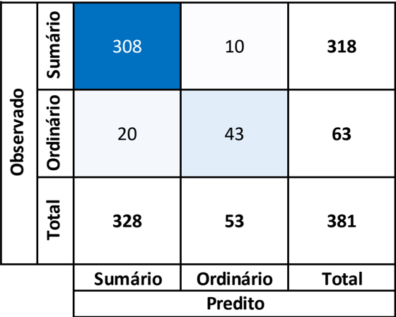

| Observado   | Sumário 308   | 10        | 318   |
|-------------|---------------|-----------|-------|
| Observado   | Ordinário 20  | 43        | 63    |
| Observado   | Total 328     | 53        | 381   |
|             | Sumário       | Ordinário | Total |

.

Figura 5.23: Matriz de confusão do modelo BOW\_BERT\_LSTM

| Observado   | Sumário      | 315     | 3         | 318     |
|-------------|--------------|---------|-----------|---------|
| Observado   | Ordinário 21 | 42      | 63        |         |
| Observado   | Total 336    | 45      | 381       |         |
|             |              | Sumário | Ordinário | Total   |
|             |              | Predito | Predito   | Predito |

.

Nota-se que o desempenho de cobertura de classificação de processos ordinários se eleva significativamente do modelo BOW para o modelo BOW\_BERT\_LSTM , a quantidade de casos não cobertos de sumários (falsos ordinários) reduziu de 10 para apenas 3 (redução de 70% de sumários não cobertos), respectivamente.

Embora a cobertura de ordinários tenha ficado praticamente igual, com 68% (43 em 63 ordinários observados) no modelo BOW e 67% (42 em 63 ordinários observados) no BOW\_BERT\_LSTM ,

a precisão de ordinários aumentou significativamente entre os modelos, passando de 81% (43 em 53 classificados como ordinário) para 93% (42 em 45 classificados como ordinário).

## 5.2 Experimentos Falhos e Lições Aprendidas

Durante o processo de estabelecimento das melhores formas de resolver o problema estudado nesta pesquisa, algumas tentativas foram testadas sem muito sucesso, conforme descrito abaixo:

- Balanceamento de Base : a primeira tentativa de ajuste dos modelos, se deu com o balanceamento dos exemplos de sumário e ordinário, através da técnica de undersampling . Com essa abordagem, a quantidade de exemplos descartados foi extremamente elevado, devido ao algo grau de desbalanceamento e a quantidade reduzida de observações, o que tornou os modelos extremamente instáveis entre cada fold .
- Fining Tuning com todos os chunks : essa abordagem causou um aumento artificial de exemplos, pois era necessário repetir um mesmo exemplo de sumário ou ordinário com cada bloco ( chunk ) de um documento. Isso fez com que aumentasse absurdamente o tempo do processo de Fining Tuning , bem como potencializou significativamente a ocorrência de sobreajuste, ainda no primeiro step no processo.
- Uso de todas as representações de cada token do BERT : tentamos utilizar representações de todas as camadas do modelo BERT, para todos os 512 tokens do modelo. Porém o volume de base se tornou muito elevado, provocando estouro de memória durante o treinamento dos modelos seguintes. Seguimos apenas com a representação do token [CLS] da última camada do modelo.
- CNN com mais camadas de filtros de convolução : essas variações da arquitetura da CNN resultaram em perda do poder de discriminação de modelo. Acabamos seguindo com a versão mais simples de apenas 1 camada de convolução.

## 5.3 Análise Final

Com base nos resultados observados nos experimentos realizados, podemos responder as perguntas elencadas na estruturação dos objetivos da presente pesquisa.

Com relação a questão 1, sobre se a aplicação de técnicas de representações vetoriais baseadas em redes neurais e aprendizado profundo acarretam em melhor desempenho de classificação do rito dos processos de atos de concentração, comparado ao modelo BOW, os experimentos mostram que não necessariamente. Para problemas onde existem palavras chave muito forte, e que não dependem tanto da interpretação do texto, o modelo BOW se mostra muito útil. Neste tipo de situação, as características geradas pelas representações baseadas em redes neurais e aprendizado profundo, podem ser úteis de forma adicional, e não necessariamente como substituição.

Já com relação a questão 2, de forma individual, para o problema estudado, o desempenho das técnicas de aprendizado profundo (BERT, CNN e LSTM) não apresentaram desempenho superior ao modelo BOW. Porém quando combinadas, ambas apresentaram desempenho bastante superior ao modelo BOW individualmente, respondendo positivamente às questões 3 e 4.

No entanto, vale ressaltar que um dos desafios enfrentados nesta pesquisa se deu pelo baixo volume de observações, situação com a qual algoritmos de aprendizado profundo podem apresentar dificuldades para aprendizado. Além disso, devido à especificidade do problema (de classificação de

rito de processos de atos de concentração), as conclusões observadas não necessariamente podem ser generalizadas para todo tipo de problema de classificação de documentos.

## Capítulo 6

## Conclusão

Os recentes avanços nas técnicas representação densa e numérica de palavras e, princialmente, nas técnicas de redes neurais de arquitetura profunda tem proporcionado grandes evoluções em tarefas de processamento de linguagem natural. Porém ainda com alguns desafios, como em situações de textos de tamanho muito elevado.

Este trabalho focou no experimento de técnicas de processamento de linguagem natural para resolver o problema de classificação de documentos extremamente grandes e de domínio bastante específico (direito).

Nós testamos diferentes formas de representação densa e numérica de palavras, tanto de forma individual, como de forma combinada. Também foram testadas diferentes técnicas de aprendizado, tanto de arquitetura rasa, como Regressão Logística, bem como arquiteturas profundas e complexas como LSTM e CNN, para a captura de padrões sequenciais e hierárquicos.

Observamos que as técnicas mais avançadas de estado da arte não necessariamente funcionam melhor do que as técnicas mais simples. Os padrões identificados pelo modelo BOW se mostraram fundamentais para incrementar os resultados obtidos pelas técnicas mais avançadas.

Adicionalmente, esse trabalho contribui para demonstrar que as características de diferentes técnicas podem ser combinadas em conjunto em uma rede neural, para aumentar a diversidade de tipos de padrões que um modelo pode aprender. Esse tipo de abordagem pode ser replicado para muitos outros problemas de processamento de linguagem natural com desafios similares.

## 6.1 Trabalhos Futuros

Como evolução, embora os resultados obtidos no presente trabalho se mostrem úteis (em termos de precisão e acurácia de classificação) para resolução do problema. Existem muitas possibilidades que poderiam ser exploradas para avançar na resolução da tarefa de classificação automática de rito de atos de concentração. Conforme citado nas subseções seguintes.

## 6.1.1 Variáveis estruturadas

Nesta pesquisa, trabalhamos apenas com dados não estruturados de texto provenientes de documentos de operações de atos de concentração submetidos para aprovação do CADE. No entanto, o CADE dispõe de variáveis estruturadas sobre as operações, que poderiam ser testadas em conjunto com os dados não estruturados. Assim como mostramos ser possível neste trabalho, uma rede neural que aprenda diferentes tipos de padrões pode ser desenvolvida para esse fim.

## 6.1.2 Documentos sem omissão de dados sensíveis

Os documentos submetidos ao CADE são tornados públicos com a omissão de dados sensíveis para os agentes econômicos envolvidos. O uso dos documentos originais, sem omissão de dados sensíveis tem grandes potenciais de promover melhorias na resolução do problema.

## 6.1.3 Reconhecimento de entidades mencionadas - Named Entity Recognition (NER)

Em conjunto com a possibilidade descrita acima, utilizar técnicas de reconhecimento de entidades mencionadas, bem como o estudo de relação entre essas atividades, pode elevar o desempenho dos modelos, através da extração de características relevantes da operação, tais como faturamentos, valores envolvidos, entre outros.

## 6.1.4 Inclusão de informações externas

Outra possibilidade, se dá pelo estudo de formas de inclusão de características que não estão necessariamente incluídas nos dados da operação, mas sim no contexto na qual a operação ou seus agentes econômicos estão incluídos. Por exemplo: informações sobre o mercado relevante, concorrentes, clientes e fornecedores, que são utilizados pelos analistas do CADE em seu processo de análise, possuem grandes potenciais para melhoria nos modelos.

## 6.1.5 Sumarização de documentos

Para abordar a questão de documentos muito longos, uma possibilidade se dá pelo teste de técnicas de sumarização automática de documentos [LL19], a fim de resumir a operação, mantendo apenas as informações chave sobre a mesma. Minimizando a chance de perda de informação relevante no processo de refinamento do modelo BERT, bem como diminuindo a dependência de longo prazo das técnicas de LSTM.

## Referências Bibliográficas

|            | [BCB14] Dzmitry Bahdanau, Kyunghyun Cho e Yoshua Bengio. Neural machine translation by jointly learning to align and translate. arXiv preprint arXiv:1409.0473 , 2014. 7                                                                                                              |
|------------|---------------------------------------------------------------------------------------------------------------------------------------------------------------------------------------------------------------------------------------------------------------------------------------|
|            | [BGJM16] Piotr Bojanowski, Edouard Grave, Armand Joulin e Tomas Mikolov. Enriching word vectors with subword information. arXiv preprint arXiv:1607.04606 , 2016. 5                                                                                                                   |
|            | [Cho03] Gobinda G Chowdhury. Natural language processing. Annual review of information science and technology , 37(1):51-89, 2003. 2                                                                                                                                                  |
| [CJL + 19] | Yin Cui, Menglin Jia, Tsung-Yi Lin, Yang Song e Serge Belongie. Class-balanced loss based on effective number of samples. Em Proceedings of the IEEE Conference on Computer Vision and Pattern Recognition , páginas 9268-9277, 2019. 19                                              |
| [CYX + 17] | Guibin Chen, Deheng Ye, Zhenchang Xing, Jieshan Chen e Erik Cambria. Ensemble application of convolutional and recurrent neural networks for multi-label text categori- zation. Em Neural Networks (IJCNN), 2017 International Joint Conference on , páginas 2377-2383. IEEE, 2017. 6 |
|            | [DCLT18] Jacob Devlin, Ming-Wei Chang, Kenton Lee e Kristina Toutanova. Bert: Pre-training of deep bidirectional transformers for language understanding. arXiv preprint ar- Xiv:1810.04805 , 2018. ix, x, 7, 30, 31, 32                                                              |
|            | [DHS11] John Duchi, Elad Hazan e Yoram Singer. Adaptive subgradient methods for online learning and stochastic optimization. Journal of machine learning research , 12(7), 2011. 17                                                                                                   |
| [FGL + 17] | Weijiang Feng, Naiyang Guan, Yuan Li, Xiang Zhang e Zhigang Luo. Audio visual speech recognition with multimodal recurrent neural networks. Em 2017 International Joint Conference on Neural Networks (IJCNN) , páginas 681-688. IEEE, 2017. ix, 23                                   |
|            | [GSC99] Felix A Gers, Jürgen Schmidhuber e Fred Cummins. Learning to forget: Continual prediction with lstm. 1999. 6                                                                                                                                                                  |
| [HFS + 17] | Nathan Hartmann, Erick Fonseca, Christopher Shulby, Marcos Treviso, Jessica Rodri- gues e Sandra Aluisio. Portuguese word embeddings: Evaluating on word analogies and natural language tasks. arXiv preprint arXiv:1708.06025 , 2017. 40, 41                                         |
| [HS97]     | Sepp Hochreiter e Jürgen Schmidhuber. Long short-term memory. Neural computation , 9(8):1735-1780, 1997. 6                                                                                                                                                                            |
|            | [HZRS16] Kaiming He, Xiangyu Zhang, Shaoqing Ren e Jian Sun. Deep residual learning for image recognition. Em Proceedings of the IEEE conference on computer vision and pattern recognition , páginas 770-778, 2016. 7                                                                |
|            | [KB14] Diederik P Kingma e Jimmy Ba. Adam: A method for stochastic optimization. arXiv preprint arXiv:1412.6980 , 2014. 17                                                                                                                                                            |

[Kim14] Yoon Kim. Convolutional neural networks for sentence classification. arXiv preprint arXiv:1408.5882 , 2014. ix, 22

[LBBH98] Yann LeCun, Léon Bottou, Yoshua Bengio e Patrick Haffner. Gradient-based learning applied to document recognition. Proceedings of the IEEE , 86(11):2278-2324, 1998. 6

[LBH15] Yann LeCun, Yoshua Bengio e Geoffrey Hinton. Deep learning. nature , 521(7553):436, 2015. 20

[LGL + 17] Miaomiao Lei, Jidong Ge, Zhongjin Li, Chuanyi Li, Yemao Zhou, Xiaoyu Zhou e Bin Luo. Automatically classify chinese judgment documents utilizing machine learning algorithms. Em International Conference on Database Systems for Advanced Applications , páginas 3-17. Springer, 2017. 6

[LH17] Ilya Loshchilov e Frank Hutter. Decoupled weight decay regularization. arXiv preprint arXiv:1711.05101 , 2017. 17

[LL19] Yang Liu e Mirella Lapata. Text summarization with pretrained encoders. arXiv preprint arXiv:1908.08345 , 2019. 74

[LM14] Quoc Le e Tomas Mikolov. Distributed representations of sentences and documents. Em International Conference on Machine Learning , páginas 1188-1196, 2014. 5

[MB03] Maria Carolina Monard e José Augusto Baranauskas. Conceitos sobre aprendizado de máquina. Sistemas Inteligentes-Fundamentos e Aplicações , 1(1):32, 2003. 14

[MCCD13] Tomas Mikolov, Kai Chen, Greg Corrado e Jeffrey Dean. Efficient estimation of word representations in vector space. arXiv preprint arXiv:1301.3781 , 2013. ix, 5, 12

[MSC + 13] Tomas Mikolov, Ilya Sutskever, Kai Chen, Greg S Corrado e Jeff Dean. Distributed representations of words and phrases and their compositionality. Em Advances in neural information processing systems , páginas 3111-3119, 2013. 14

[MYZ13] Tomáš Mikolov, Wen-tau Yih e Geoffrey Zweig. Linguistic regularities in continuous space word representations. Em Proceedings of the 2013 conference of the north american chapter of the association for computational linguistics: Human language technologies , páginas 746-751, 2013. ix, 14

[PNI + 18] Matthew E. Peters, Mark Neumann, Mohit Iyyer, Matt Gardner, Christopher Clark, Kenton Lee e Luke Zettlemoyer. Deep contextualized word representations. Em Proc. of NAACL , 2018. 5

[PSM14] Jeffrey Pennington, Richard Socher e Christopher Manning. Glove: Global vectors for word representation. Em Proceedings of the 2014 conference on empirical methods in natural language processing (EMNLP) , páginas 1532-1543, 2014. 5

[PŻV + 19] Raghavendra Pappagari, Piotr Żelasko, Jesús Villalba, Yishay Carmiel e Najim Dehak. Hierarchical transformers for long document classification. arXiv preprint arXiv:1910.10781 , 2019. 43

[Qia99] Ning Qian. On the momentum term in gradient descent learning algorithms. Neural networks , 12(1):145-151, 1999. 17

[Rud] Sebastian Ruder. Gradient descent variants. 16

[SNL19] Fabio Souza, Rodrigo Nogueira e Roberto Lotufo. Portuguese named entity recognition using bert-crf. arXiv preprint arXiv:1909.10649 , 2019. 40

[SQXH19] Chi Sun, Xipeng Qiu, Yige Xu e Xuanjing Huang. How to fine-tune bert for text classification? Em China National Conference on Chinese Computational Linguistics , páginas 194-206. Springer, 2019. 7, 42

[TS10] Lisa Torrey e Jude Shavlik. Transfer learning. Em Handbook of research on machine learning applications and trends: algorithms, methods, and techniques , páginas 242-264. IGI global, 2010. 7

[VSP + 17] Ashish Vaswani, Noam Shazeer, Niki Parmar, Jakob Uszkoreit, Llion Jones, Aidan N Gomez, Łukasz Kaiser e Illia Polosukhin. Attention is all you need. Em Advances in neural information processing systems , páginas 5998-6008, 2017. ix, 7, 26, 28, 29

[YRC07] Yuan Yao, Lorenzo Rosasco e Andrea Caponnetto. On early stopping in gradient descent learning. Constructive Approximation , 26(2):289-315, 2007. 19

[ZJZ10] Yin Zhang, Rong Jin e Zhi-Hua Zhou. Understanding bag-of-words model: a statistical framework. International Journal of Machine Learning and Cybernetics , 1(1-4):43-52, 2010. 5

[ZSLL15] Chunting Zhou, Chonglin Sun, Zhiyuan Liu e Francis Lau. A c-lstm neural network for text classification. arXiv preprint arXiv:1511.08630 , 2015. 6