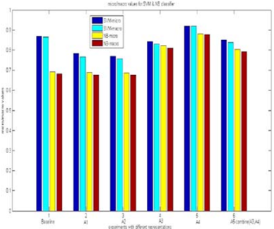

## Comparing SVM and Naïve Bayes Classifiers for Text Categorization with Wikitology as knowledge enrichment

Sundus Hassan Computer Science Department NUCES-FAST, Karachi Campus K093059@nu.edu.pk

## Muhammad Rafi

Computer Science Department NUCES-FAST, Karachi Campus muhammad.rafi@nu.edu.pk

Muhammad Shahid Shaikh Electrical Engineering Department NUCES-FAST, Karachi Campus shahid.shaikh@nu.edu.pk

Abstract -The activity of labeling of documents according to their content is known as text categorization. Many experiments have been  carried out to enhance  text categorization  by  adding background knowledge to the document using knowledge repositories  like  Word  Net,  Open  Project  Directory  (OPD), Wikipedia  and  Wikitology.  In  our  previous  work,  we  have carried out intensive experiments by extracting knowledge from Wikitology  and  evaluating  the  experiment  on  Support  Vector Machine  with  10-  fold  cross-validations.  The  results  clearly indicate Wikitology is far better than other knowledge bases. In this  paper  we  are  comparing  Support  Vector  Machine  (SVM) and Naïve Bayes (NB) classifiers under text enrichment through Wikitology.  We  validated  results  with  10-fold  cross  validation and  shown  that  NB  gives  an  improvement  of  +28.78%,  on  the other hand SVM  gives an  improvement of +6.36%  when compared with  baseline  results.  Naïve  Bayes  classifier  is  better choice  when  external  enriching  is  used  through  any  external knowledge base.

Word Net  is  a  lexical  database  of  English  language.  Elberrichi, Rahmoun, Bentaalah [4] uses Word Net; Gabrilovich, Markovitch [5] uses  OPD, Gabrilovich[6][8] and Pu Wang[7] uses Wikipedia knowledge  to  improve  text  categorization  by  retrieving  knowledge from these resources. Hotho[9] incorporates Word Net knowledge to text documents to improve text clustering by reducing the variance of text semantics among documents under one category. Wikitology is a knowledge base where information is extracted from Wikipedia and kept  in  structured  and  unstructured  form  as  information  retrieval indices.  In  our  previous  work  [12],  we  retrieved  knowledge  from Wikitology  and  added  to  document  using  different  text  document representation  and  enrichment  techniques.  We  carried  out  intensive experiments by using combination of different text document representation and enrichment techniques. Experimental results proved  that  there  was  a  better  text  categorization  and  clustering  by enriching documents with the knowledge of Word  Net,  OPD, Wikipedia and  Wikitology as compared to their defined baseline on diverse datasets. But  the best text categorization  was  done  by integrating knowledge from Wikitology.

Keywords- Text Categorization, Machine Learning, Wikitology, Support Vector Machine, 20 News Group. Knowledge base, Naïve Bay

## I. INTRODUCTION

The  action  of  assigning  one  or  more  pre-defined  categories  to  a document on the basis of its content is defined as text categorization. It has 2 basic types: Single label and Multi-label. It is formally defined as, assume there are set of Documents D= {d1, d2 …….dn}, where 'n' is very large number. Now by using any text categorization algorithm, the document has to be semantically categorized in pre-defined set of classes or categories C= {C1, C2…..Ck}, where each Ci is class. It is possible that documents categorized in 2 different categories such as category Ci and Cj, semantically may share largely some similar sense or  they  can  be  largely  dissimilar  also.  Knowledge  Engineering  and Machine Learning are 2 main approaches to develop text categorization  techniques.  In  this  paper  we  are  comparing  results  of Support Vector Machine (SVM)  and Naïve Bayes techniques. Different  Experimental  results  prove  that  SVM  performs  better  than NB  in  general  classification  tasks.      Many  experiments  have  been carried out by researchers to enhance text categorization. Improvement is shown by adding semantic background to document. This method  is used by researchers using different  knowledge repositories like WordNet,  OPD,  Wikipedia  and  Wikitology  etc.

In [12] an improvement of +6.36% (as compared to baseline) was  shown  by  using  machine  learning  technique  Support Vector  Machine  (SVM).  In  this  paper  we  have  directed  our research  by  using  another  machine  learning  technique  Naïve Bayes.  It  has  been  shown  that  as  Naïve  Bayes  shown  an improvement of +28.78% (as compared to baseline).

The  organization  of  our  paper  is  as  follows:    Section  2 discusses the related work carried out in this domain. Section 3 illustrates empirical evaluation of experiments carried out on a dataset of 20 News Group.

## II. RELATED WORK

Many researchers shown text enriching method facilitates text categorization by adding semantic background knowledge from knowledge  bases  like  Word  Net,  Wikipedia,  Open  Project Directory (OPD) and Wikitology.

Elberrichi, Rahmoun, Bentaalah [4] proposed a model in which for all the terms the general concepts are extracted from Word Net. Proposed model was evaluated on Reuters-21578 and 20 News  Group  dataset.  Improvement  from  0.649  to  0.714  and 0.667 to 0.719 is shown on Reuters-21578 and 20 News Group dataset  respectively.  Improvement  in  text  clustering  was  also shown by Hotho, Staab, Stumme [9], incorporating knowledge from  Word  Net.  They  assimilate  background  information  to text document  to  reduce  the  variance  in  semantics  of a document under one category. Evaluation was done on Reuters-21578 using purity and inverse purity measures. Gabrilovich,  Markovitch  [5]  suggested  a  model  in  which feature  generator  is  built  by  mapping  terms  of  document  to Open  Project  Directory  (OPD)  concepts  and  features  are generated  by  contextual  analysis  of  the  document.  Model  is evaluated  on  datasets  of  Reuters-21578,  RCV1,  20  News Group and Movies. Evaluated results shown improvement on all the datasets.

Gabrilovich, Markovitch [6] also utilizes Wikipedia knowledge and put forward the model in which feature generation is done through  multi-resolution  approach.  In  this  approach  basically documents are matched with most relevant documents without considering thesaurus of the article. Proposed model is evaluated on diverse datasets (Reuters-21578, RCV1, OHSUMED, 20 News Group and Movies) show improvement. Wang,  Hu,  Zeng  [7]  focused  on  Wikipedia  thesaurus  like synonymy,  polysemy,  hyponymy  and  associative  relations. Text document is enriched by integrating Wikipedia thesaurus and  it  is  evaluated  on  Reuters-21578,  OHSUMED  and  20 News Group dataset. This approach shows more improvement then Gabrilovich, Markovitch [6] proposed model. Gabrilovich,  Markovitch  [8]  proposed  a  novel  method  of semantic relatedness is calculated using Wikipedia-based explicit  semantic  analysis,  in  which  concepts  obtained  from Wikipedia are represented in high-dimensional space. Improvement is shown in computing word or text relatedness. Razvan  Bunescu  and  Marius  Pasca  [10]  used  Wikipedia information  for  resolving  Named  Entity  Disambiguation.  For this intention they exploit redirect pages, disambiguation pages, categories  and  hypelinks.  They  developed  novel  approaches from Wikipedia context article similarity, taxonomy and identifying  entities  which  are  out  from  Wikipedia.  The  best experimental results were obtained from Wikipedia taxonomy.

In  this  paper,  we  are  extending  the  research  present  by  us  in [12].  In  [12]  we  enrich  document by adding knowledge from Wikitology. Wikitology is a hybrid knowledge base of structured and unstructured information extracted from Wikipedia. Knowledge in Wikitology is represented in different forms like an IR index, graphs (category links, page links and entity links), relational database and a triple store. We also  present  4  document  representation  and  5  enrichment techniques. The 4 document representation techniques are: T1 remove stop words, T2 - tag document as entity types (person, location, and organization), T3 - apply T1 and remove all other words except nouns and T4 - apply T3 and tag terms as entity types  (person,  location,  and  organization).  The  5  enrichment techniques  are:  E1  -  get  top  similar  articles,  add  titles  and categories,  E2  -  query  Wikitology  using  Lucene,  add  titles, categories  and  linked  concepts,  E3  -  apply  E2  and  query Freebase on entity types, E4 - Filter results returned by E1, E2 and  E3  on  defined  criteria;  and  E5  -  remove  noise  and delimiters from  results  returned  by  E1,  E2,  E3  and  E4. Comprehensive experiments are carried out on 20 Newsgroup dataset with different combinations of text document representation  (T1-T4)  and  enrichment  (E1-E5)  techniques. Experiments were evaluated on Support Vector  Machine (SVM)  using  10  fold  cross-validations.  In  this  paper  we  are representing same experiments evaluation on Naïve Bayes and will compare results of both SVM and NB.

Now, we will like to give brief description of machine learning techniques  used  by  us  (SVM  and  NB),  for  our  experiments evaluation.  The  Support  Vector  Machines  is  a  classifier  that finds best hyper  plane between  two  classes of data, by separating positive and negative examples through solid line in the  middle  called  decision  line.  In  following  figure;  gap between solid and dashed line reflects the margin of movement of  decision  line  left  or  right  without  miss-classification  of document [3]. Naive Bayes classifier is basically a probabilistic classifier based on hypothesis. On the basis of assumption and training document; Bayesian learning is to find most appropriate  assumption  based  on  prior  hypothesis  and  initial knowledge.  Main  assumption  is  that  terms  in  test  document have no relation among them and probability is calculated that document belong to category C [1] [2] [3].

## III. EXPERIMENTAL EVAULTION

In  this  section  we  explain  the  experimental  setup,  the dataset used and the approach used for this research.

## A. Data

We use the dataset of 20 News group . It is a well-balanced data set of 20 categories with 1000 documents in each.

## B. Experimental Results

Baseline  for  the  experiment  is  setup  by  removing  stop words,  delimiters  and  stemmed  the  dataset  by  using  Porter Stemmer. In baseline we haven't add any semantic background knowledge  [12].  We  are  picking  results  evaluated  on  SVM from  [12]  and  analyzing  the  same  experiments  on  NB.  We have  use  micro-average  and  macro-average  F  measure.  For evaluating data set we have use 10 fold cross- validation and used paired t-test to assess the significance.

Table 1 shows the performance of dataset by augmenting  knowledge  (top  5  and  20  categories  and  titles) using combined enrichment technique E1, E4 and E5 on text document  representation  T1.  In  table  2  Baseline  shows  the dataset  with  no  semantic  background  knowledge,  A1  means top 5 titles and their related categories, A2 means top 20 titles and their related categories.  Table 2 illustrates the performance of dataset by integrating knowledge (top 5 and 20 categories, titles and linked concepts) using combined enrichment technique E2, E4 and E5 on text document representation T1. In table 3 Baseline is same, A3 means top 5 titles, their related categories  and  linked  concepts,  A4  means  top  20  titles,  their related  categories  and  linked  concepts.  Table  3  demonstrates the performance of dataset by incorporating data (top categories, titles and linked entities) using combined enrichment  technique  E1,  E2,  E4  and  E5  on  text  document representation  T1.  In  table  4  Baseline  remains  the  same,  A5 means top 20 titles, their related categories and linked concepts. Table 1, 2, 3 in general illustrates the micro-average F-measure,  macro-average  F-  Measure  and  improvement  (or declination) of experiments A1-A5 after applying text classification technique SVM [12] and Naïve Bayes.

The best improvement up to date by adding semantic background  knowledge  to  enhance  text  categorization  is  of 0.919  (micro-average  F-Measure)  /  0.920  (macro-average  FMeasure) with improvement of +5.88% and +6.36%, respectively  as  compare  to  simple  baseline  using  SVM  text classifier  [12].  Using  Naïve  Bayes  classifier  0.881  (microaverage  F-Measure)  /  0.877  (macro-average  F-Measure)  with improvement of +27.12% and +28.78%, respectively as compare to simple baseline. This improvement is achieved on A4  in  which  we  have  add  top  20  titles,  categories  and  their linked concepts and also applying filtration criteria defined in enrichment  technique  E4  and  E5[12].  The  worst  results  is achieved  on  A2  by  adding  top  20  titles  and  their  related categories  using  enrichment  techniques  E1,  E4  and  E5[12]. From  [12]  using  SVM  classifier  0.770  (micro-average  FMeasure) / 0.757 (macro-average F-Measure) with declination of  -11.29%  &amp;  -12.49%  respectively.  Using  Naïve  Bayes  text classifier on 0.685 (micro-average F-Measure) / 0.676 (macroaverage  F-Measure)  with  declination  of  -1.15%  &amp;  -0.73% respectively.  Figure  1  is  a  graphical  representation  of  microaverage and macro-average F-measure of all approaches (including  baseline)  comparing  micro-average  and  macroaverage F- measure of SVM and Naïve Bayes classifier. Figure 2  shows  the  percentage  of  improvement  or  declination  of micro-average  and  macro-average  F-Measure  of  SVM  and Naïve Bayes classifier, after integrating knowledge  from Wikitology.

News  Group  dataset.  Improvement  from  0.649  to  0.714  and 0.667 to 0.719 is shown on Reuters-21578 and 20 News Group dataset  respectively.  Improvement  in  text  clustering  was  also shown by Hotho, Staab, Stumme [9], incorporating knowledge from  Word  Net.  They  assimilate  background  information  to text document  to  reduce  the  variance  in  semantics  of a document under one category. Evaluation was done on Reuters-21578 using purity and inverse purity measures. Gabrilovich,  Markovitch  [5]  suggested  a  model  in  which feature  generator  is  built  by  mapping  terms  of  document  to Open  Project  Directory  (OPD)  concepts  and  features  are generated  by  contextual  analysis  of  the  document.  Model  is evaluated  on  datasets  of  Reuters-21578,  RCV1,  20  News Group and Movies. Evaluated results shown improvement on all the datasets.

TABLE 1: Percentage improvement over SVM

|            | SVM   | SVM   | SVM -Improvement   | SVM -Improvement   |
|------------|-------|-------|--------------------|--------------------|
| Enrichment | Micro | Macro | Micro              | Macro              |
| Baseline   | 0.868 | 0.865 | -                  | -                  |
| A1         | 0.784 | 0.768 | -9.68%             | -11.21%            |
| A2         | 0.770 | 0.757 | -11.29%            | -12.49%            |
| A3         | 0.843 | 0.830 | -2.88%             | -4.05%             |
| A4         | 0.919 | 0.920 | 5.88%              | 6.36%              |
| A5         | 0.851 | 0.839 | -1.96%             | -3.01%             |

TABLE 2: Percentage improvement over NB

Figure 1 Graphical Representation of experimental results.

|            | Naïve Bayes(NB)   | Naïve Bayes(NB)   | NB -Improvement   | NB -Improvement   |
|------------|-------------------|-------------------|-------------------|-------------------|
| Enrichment | Micro             | Macro             | Micro             | Macro             |
| Baseline   | 0.693             | 0.681             | -                 | -                 |
| A1         | 0.687             | 0.676             | -0.86%            | -0.73%            |
| A2         | 0.685             | 0.676             | -1.15%            | -0.73%            |
| A3         | 0.693             | 0.681             | 18.75%            | 18.94%            |
| A4         | 0.823             | 0.820             | 27.12%            | 28.78%            |
| A5         | 0.804             | 0.792             | 16.01%            | 16.29%            |

## IV. FUTURE WORK &amp; CONCLUSION

In  this  paper  we  present  an  enhanced  version  of  our previous  research  [12]  by  comparing  experiment  results  on SVM and Naïve Bayes Classifier. In [12]  we have evaluated our experiments on SVM, in which we found the improvement from  0.868  to  0.919  (micro-average  f-measure)  and  0.865  to 0.920 (macro-average f-measure). After evaluating same experiments on Naïve Bayes classifier, we found the improvement  from  0.693  to  0.881  (micro-average  f-measure) and 0.681 to 0.877 (macro-average f-measure). Clear improvement of 6.36% and 28.78% is achieved on SVM and Naïve Bayes classifier respectively, by integrating information extracted from Wikitology.

For  future  works  we  can  carry  out  the  same  experiments  on different  datasets  like  Reuters-21578,  RCV1,  OHSUMED, Movies  etc  and  can also apply other text categorization algorithms like  K-  Nearest  Neighbor, Matrix  Regression,  and Decision  trees  etc.  In-depth  analysis  and  comparison  can  be holding on the diverse datasets and text classification techniques.

## REFERENCES

- [1] Sebastiani, 'Machine Learning in automated text categorization', ACM Comput. Surveys, Vol. 34, March 2002
- [2] Ioannis Antonellis, Christos Bouras, Vassilis Poulopoulos and Anastasios Zouzias, 'Scalability of Text Classification', WEBIST (Web Interfaces and Applications), 2006
- [3] Iulian SANDU POPA, Karine ZEITOUNI, Georges GARDARIN, 'Text Categorization for Multi-label Documents and many Categories', Twentieth IEEE International Symposium on Computer-Based Medical Systems (CBMS'07), 2007
- [4] Zakaria Elberrichi, Abdelattif Rahmoun, and Mohamed Amine Bentaalah, "Using WordNet for Text Categorization," The International Arab Journal of Information Technology, vol. 5, iss. 1, January 2008.
- [5] Evgeniy  Gabrilovich  and  Shaul  Markovitch,  "Feature  Generation  for Text Categorization Using World Knowledge," IJCAI'05, 2005
- [6] Evgeniy Gabrilovich and Shaul Markovitch, "Overcoming the Brittleness Bottleneck Using Wikipedia: Enhancing Text Categorization with  Encyclopedic  Knowledge,"  AAAI'06  proceedings  of  the  21st national conference on Artificial intelligence, vol. 2, 2006.
- [7] Pu  Wang,  Jian  Hu,  Hua-Jun  Zeng,  Lijun  Chen,  and  Zheng  Chen, "Improving  Text  Classification  by  Using  Encyclopedia  Knowledge," ICDM  '07 Proceedings of the 2007 Seventh IEEE International Conference on Data Mining, 2007.
- [8] Evgeniy  Gabrilovich  and  Shaul  Markovitch,  "Computing  Semantic Relatedness Using Wikipedia-based Explicit Semantic Analysis," Proceedings  of  the  20th  International  Joint  Conference  on  Artificial Intelligence, 2007.
- [9] Andreas Hotho, Steffen Staab  and  Gerd  Stumme, 'WordNet improves Text Document Clusterng', Proceedings of Semantic Web Workshop at SIGIR'03,2003
- [10] Razvan Bunescu and Marius Pasca, 'Using Encyclopedic knowledge for Named Entity Disambiguation', EACL,2006
- [11] Zareen Syed and Tim  Finn, "Creating and Exploiting a Hybrid Knowledge Base for Linked Data" , ser. Revised Selected Papers Series: Communications in Computer and Information Science, Joaquim Filipe, Ana Fred, and Bernadette Sharp, Eds. Springer, Vol. 129, April 25, 2011
- [12] Sundus  Hassan,  Muhammad  Rafi,  Zareen  Syed,  'Content-based  Text Categorization using Wikitology' submitted for publication in IJICIC.