Article

## Design, Implementation and Practical Energy-Efficiency Evaluation of a Blockchain Based Academic Credential Verification System for Low-Power Nodes

Gabriel Fernández-Blanco 1,2 , Iván Froiz-Míguez 1,2 , Paula Fraga-Lamas 1,2, * and Tiago M. Fernández-Caramés 1,2

- 1 Department of Computer Engineering, Faculty of Computer Science, Universidade da Coruña, 15071 A Coruña, Spain; g.fblanco@udc.es (G.F.-B.); ivan.froiz@udc.es (I.F.-M.); tiago.fernandez@udc.es (T.M.F.-C.)
- 2 Centro de Investigación CITIC, Universidade da Coruña, 15071 A Coruña, Spain
* Correspondence: paula.fraga@udc.es; Tel.: +34-981167000

Abstract: The educational system manages extensive documentation and paperwork, which can lead to human errors and sometimes abuse or fraud, such as the falsification of diplomas, certificates or other credentials. In fact, in recent years, multiple cases of fraud have been detected, representing a significant cost to society, since fraud harms the trustworthiness of certificates and academic institutions. To tackle such an issue, this article proposes a solution aimed at recording and verifying academic records through a decentralized application that is supported by a smart contract deployed in the Ethereum blockchain and by a decentralized storage system based on Inter-Planetary File System (IPFS). The proposed solution is evaluated in terms of performance and energy efficiency, comparing the results obtained with a traditional Proof-of-Work (PoW) consensus protocol and the new Proof-of-Authority (PoA) protocol. The results shown in this paper indicate that the latter is clearly greener and demands less CPU load. Moreover, this article compares the performance of a traditional computer and two Single-Board Computers (SBCs) (a Raspberry Pi 4 and an Orange Pi One), showing that is possible to make use of the latter low-power devices to implement blockchain nodes but at the cost of higher response latency. Furthermore, the impact of Ethereum gas limit is evaluated, demonstrating its significant influence on the blockchain network performance. Thus, this article provides guidelines, useful practical evaluations and key findings that will help the next generation of green blockchain developers and researchers.

Keywords: blockchain; distributed ledger technologies; education; CV; academic forgery; energy efficiency; decentralized application; DApp

## 1. Introduction

The educational system manages multiple types of documentation and paperwork, which opens up the possibility for human errors and sometimes abuse or fraud, such as the falsification of diplomas, certificates or other credentials. Today, it is common to find news related to academic fraud and to the rise of diploma mills [1]. It is also estimated than more than half of all people claiming a new PhD actually have a fake degree [2]. These incidents cause serious damage to society, especially because of the undeniable value of a university degree. In addition to damaging the reputation of educational institutions, this type of fraud can cause problems of labor intrusion if the person presenting a fake degree

Academic Editors: Ana M. Madureira, Ivo Pereira, Filipe Sá, Christophe Soares and Rui Humberto Pereira

Received: 1 April 2025

Revised: 1 June 2025

Accepted: 3 June 2025

Published: 12 June 2025

Citation: Fernández-Blanco, G.; Froiz-Míguez, I.; Fraga-Lamas, P.; Fernández-Caramés, T.M. Design, Implementation and Practical Energy-Efficiency Evaluation of a Blockchain Based Academic Credential Verification System for Low-Power Nodes. Appl. Sci. 2025 , 15 , 6596. https://doi.org/10.3390/ app15126596

Copyright: © 2025 by the authors. Licensee MDPI, Basel, Switzerland. This article is an open access article distributed under the terms and conditions of the Creative Commons Attribution (CC BY) license (https://creativecommons.org/ licenses/by/4.0/).

commits usurpation of functions that require a higher degree of training or specialization, as it occurs, for example, in the medical field.

However, the lack of efficient tools for background verification and the administrative bureaucracy, which are expensive and time-consuming, discourage the necessary consultation and verification tasks by the entities that are responsible for the veracity of the provided information.

Stakeholders like institutions (e.g., schools, universities), organizations, companies and individuals (e.g., students) face multiple language and administrative barriers in the verification of diplomas, degrees or other credentials, the translation and comparison of degrees at different educational institutions and/or sharing information among them due to the lack of interoperability. Moreover, there are no global standards accepted by educational institutions, which makes it difficult to evaluate credentials in a homogeneous way and can cause issues both in academia and in the labor market. Therefore, it is necessary to have a trustworthy electronic verification of credentials to improve the verification and the validation process of knowledge/skills acquired during the educational process. In fact, it is important to develop a student-centered model that gives students ownership of their data and that allows them to control their academic identity and the information about them that an employer or other stakeholders can access. In addition to the complexity of current procedures and systems, the infrastructure where the student information is stored is usually completely centralized in applications where no tracking or history of the student grades is usually provided, so anyone with access to the system can make changes to the information (in many cases without leaving a trace).

Over the last decade, Distributed Ledger Technology (DLT), specifically blockchain [3-6], have been seen as an opportunity to address major problems affecting security, privacy and fraud control in education due to its features: decentralization, traceability , immutability and authenticity . Therefore, the problem of counterfeiting diplomas, academic records or a curriculum vitae (CV) is a problem that can be addressed by using blockchain technologies [7-9].

A blockchain is a distributed record that is shared, replicated and synchronized by multiple computational nodes in a decentralized network [10]. Transactions that take place throughout the entire network are verified and entered into the registry by consensus of all participants, without the control of central authorities or intermediaries [11]. Such a consensus protocol, together with the use of asymmetric cryptography, results in a high level of information security and tamper resistance [12]. Moreover, Decentralized Applications (DApps) are applications whose backend is executed in a blockchain, unlike traditional applications where the backend runs on centralized servers [13-15]. DApps acquire all the decentralization properties provided by the blockchain, resulting in applications that preserve data privacy and are transparent and resistant to Denial of Service (DoS) attacks [16].

Blockchains also introduced the concept of smart contracts, which are code stored in the blockchain that is executed after reaching certain conditions, without the need for trustful entities or third-party supervision. In contrast to classical applications, the backend of a DApp relies on such contracts, which are immutable and indisputable. The security provided by a blockchain provides smart contracts with a great potential for implementing multiple practical applications [17], but they need to be secure against possible attacks [18].

As it will be later detailed in Section 2, there have been previous attempts to implement blockchain-based solutions for academic document verification. However, most of such solutions focus on the verification of academic certificates, not considering the continuous monitoring of the Academic Records (ARs). Such academic history can be tracked and verified, as it becomes clear that fraud can come through the student's career and not only at its end.

Although in recent years blockchain applications have become popular, they have also been criticized for having low performance, being too energy intensive or not decentralized enough [19]. The latest research has been devoted to the analysis of different techniques to benchmark and to optimize its operation, leading to what is called green blockchain [20-22]. These novel techniques pave the way to mass adoption, as these would turn blockchain technologies as efficient as many centralized systems, as well as benefiting from all the advantages provided by decentralization. In addition, evaluations involving low-power devices in proof-of-concept implementations are still scarce in the current literature and are rarely explored in depth.

In contrast, while recent research has made significant contributions to academic verification, it still presents certain gaps and limitations. Specifically, there are areas that have not been fully explored or adequately addressed, opening the opportunity for new applications. Considering the previously mentioned issues, this article describes a blockchain-based solution for verifying the authenticity of ARs and professional merits. Such a solution relies on a DApp that makes use of a decentralized database [23] based on the Inter-Planetary File System (IPFS) protocol [24], which stores the raw off-chain data. Such data identify and track the academic information through the use of hashes that are stored in the blockchain [25]. The traceability and immutability of ARs is guaranteed with a hash that represents any kind of raw data (in this case, off-chain data) and that represents the changes in the data through their updates.

The developed DApp can verify not only academic certificates, but also the complete academic career of a student. The low complexity and time required by the proposed solution to perform the verification avoids the vast amount of bureaucracy usually involved in this kind of validation. Moreover, these records can also be verified after the issue of an academic certificate, as well as before the student obtains his/her degree.

Overall, the proposed system allows:

- Students to share their ARs with any third-party, so that they can be verified.
- Administrators to custody the validity of the changes. With the hashing technique, any minor change in an AR stored in the database will completely transform its hash, so administrators will always be aware of such changes.
- Third-parties to easily and efficiently verify an AR, as they simply need to introduce the AR provided by a student.

The performance of the proposed approach was evaluated as described later in Section 5, emphasizing energy efficiency and scalability. All the code of the developed DApp is available as open-source (under GPL-3.0 license), so it can be downloaded from GitHub [26] and then be used and/or modified by future researchers and developers.

It is important to note that a preliminary version of the work presented in this article was previously published as a conference paper [27]. That paper had a limited scope, focusing primarily on presenting a few experiments. In contrast, this article significantly extends that prior work, providing a thorough overview of the overall design, implementation and detailed validation.

In summary, this article presents a blockchain-based solution with the following main contributions:

- It includes a thorough analysis of state-of-the-art systems that make use of blockchain for document verification.
- A detailed description is provided on the design and implementation of a novel blockchain-based system for AR and CV verification.
- Adetailed evaluation of the proposed solution is presented in terms of performance (latency, throughput and gas limit) and energy consumption, when using a traditional computer and two different low-power Single-Board Computers (SBCs).

The remainder of this article is structured as follows. Section 2 reviews the state of the art of traditional and blockchain-based systems aimed at document verification and academic anti-forgery, and describes the basics of blockchain. Section 3 presents the design of the proposed system, detailing the communications architecture, as well as the main functionality of the proposed system, whose implementation is described in Section 4. Next, Section 5 presents the results of the performed experiments, which were aimed at quantifying the system performance and its energy consumption when executing it in traditional and low-power computers. Finally, Section 6 summarizes the key findings of the experiments, as well as the main open challenges and future work, while Section 7 is devoted to conclusions.

## 2. State of the Art

## 2.1. Traditional Systems for Document Verification

In recent years, governments, companies, and institutions have tried to achieve a high degree of trust in their certificates and fight counterfeits [28]. In fact, many universities around the world make use of their own systems to verify their diplomas and certificates. However, these systems are based on centralized models, which have well-known security issues:

- They introduce Single Points of Failure (SPoFs), so they are prone to DoS attacks, which impact data availability.
- They usually do not provide secure traceability, so, if an attacker manages to impersonate someone, he/she will be able to perform unauthorized modifications without leaving a trace.
- They imply the existence of central authorities, which are not necessarily trustworthy regarding the way they manage user private data.
- They are prone to data leaks, which is a critical concern in industries like healthcare, insurance or education.

Until recently, most stakeholders had to accept the previously mentioned risks as a trade-off for the easier and faster operation of centralized systems. However, consequences are becoming increasingly dangerous as companies gather more data [29].

## 2.2. Blockchain Basics

DLTs like blockchains represent a novel approach to address the major drawbacks mentioned in the previous subsection. A blockchain is a sequence of timestamped blocks linked through cryptographic hashes [30]. In a blockchain, data are synchronized and shared among all nodes in a Peer-to-Peer (P2P) network [10]. The blockchain utilizes asymmetric cryptography, meaning each network node is assigned two keys: a private key for signing blockchain transactions, and a public key that acts as the user's unique identifier [31]. Once a node initiates a transaction, it signs it and broadcasts it to its peers. The transaction's signature serves for authentication and as guarantee of integrity (any data transmission errors prevent successful decryption). As the peers of the broadcasting node receive the signed transaction, they verify its validity before retransmitting it to other peers.

Transactions validated through this process and accepted by the network are organized and grouped into a timestamped block by specialized nodes usually known as miners. The selection of miners and the data included in the block are determined by a consensus algorithm (a more comprehensive definition is provided later in Section 2.3). Once a miner has compiled the blocks, they are broadcast back into the network. The nodes proceed to confirm the validity of the transactions within the broadcast block and ensure it references the previous block in the chain through the corresponding hash. If both requirements are

met, the block is added to their chain, thus updating the transaction. Otherwise, the block is discarded. Thus, the described mechanism ensures the integrity of the stored data, as no one can modify the information without network consensus [11].

Blockchains can be categorized based on the type of data they manage, the availability of such data, and the actions a user can perform. This leads to a distinction between public/private as well as permissioned/permissionless blockchains [30]. It is worth noting that some authors use the terms public/permissionless and private/permissioned interchangeably. While this may be applicable in the context of cryptocurrencies, it does not hold true for other applications. In some cases, it is crucial to distinguish between authentication (i.e., who can access) and authorization (i.e., what can be done). However, these distinctions are still under debate, and their definition varies in the literature.

Public blockchains allow anyone to join without third-party approval, enabling them to act as a simple node or as a miner/validator. Economic incentives are typically provided to miners/validators in public blockchains such as Ethereum (one of the most popular blockchains) or Litecoin. In contrast, private blockchains limit network access. Many private blockchains are also permissioned, dictating which users can conduct transactions, execute smart contracts (self-executing code operated over the blockchain), or serve as network miners (for example, in a consortium blockchain where a predetermined group of nodes controls the consensus process). However, not all private blockchains are necessarily permissioned. For instance, an organization could establish a permissionless private blockchain using Ethereum.

Finally, it is also worth mentioning that blockchains can also be classified based on their intended use, with some solely designed for tracking digital assets, and others facilitating the execution of specific logic. Moreover, some systems employ tokens (e.g., Ripple, Ethereum), while others do not (e.g., Hyperledger, Corda).

Adetailed explanation of the inner workings of blockchain technology is beyond the scope of this article, but the interested readers can explore further information in [30,32].

Considering the previously described features, Ethereum was selected for developing the anti-forgery system described in this article. Ethereum can be both deployed in a private or public blockchain and, being permissionless, it allows anyone to verify potentially forged documents. In addition, smart contracts enable automating the verification functionality through code written in a high-level language (Solidity). However, it must be noted that, for the proposed application, Ethereum has four limitations that had to be addressed by the solution proposed in this article:

- It is necessary to deploy an efficient and secure off-chain storage subsystem for storing a relatively large amount of structured data.
- It is necessary to study the restrictions related to parameters like gas to create an efficient solution.
- Since consensus protocols based on Proof-of-Work (PoW) have been traditionally energy hungry, it is necessary to analyze its power consumption and compare it with an energy-efficient consensus protocol such as Proof-of-Authority (PoA).
- To demonstrate the effectiveness of the overall solution, it would be ideal to try it when using low-power affordable devices as blockchain nodes.

## 2.3. Consensus Protocols for Ethereum and Energy Efficiency

As it was indicated in the previous subsection, consensus protocols are used to reach an agreement among the blockchain nodes. The first consensus protocol made use of a PoW mechanism that was utilized by Bitcoin. Although PoW provides trust and security, its massive energy consumption brought in recent years discussions about its long-term sustainability [33-35]. For instance, The Cambridge Bitcoin Electricity Consumption Index

(CBECI) [36] estimated that PoW consumption involved around 147 terawatt-hours and 74 metric tons of CO2 a year [37], which is the same consumption as a small country like Denmark. As a consequence, it has been successfully deprecated in recent years by new consensus protocols that are able to maximize energy efficiency without losing the trustworthiness provided by PoW [38-40].

In general, the trade-off for increasing energy efficiency is to decrease decentralization. In practice, PoW cannot always provide complete decentralization either, since, when the network is not big enough, a few nodes with high mining capacity can monopolize the validation process.

In a permissioned scenario, the network is populated with nodes that have a certain degree of trust in each other. Therefore, there is no need to provide computational competition among the participating parties to ensure they are following the rules of the network. Hence, in permissioned blockchains, the use of an alternative protocol can accelerate block creation, since there is no need for keeping a high block time. Moreover, in this type of networks, blocks can be larger than in a mainnet, resulting in a higher transaction throughput. To tackle the previous issues, different consensus protocols have been proposed in recent years to decrease energy consumption.

Proof-of-Stake (PoS) and PoA are two protocols that provide a good balance between efficiency and performance without losing excessive decentralization. In addition, they are suitable for environments where the involved parties have similar interests (like the validation of ARs proposed in this article):

- Proof-of-Stake (PoS). It is the protocol currently supported by the mainnet of the Ethereum network and one of the most popular. There is a lot of research with respect to its energy consumption and, as demonstrated by the Crypto Carbon Ratings Institute [41], its energy consumption is orders of magnitude below Bitcoin's PoW mechanism. In PoS, validator nodes (i.e., the ones responsible for validating transactions and for creating new blocks) do not come to an agreement through the resolution of a computational problem as in PoW, but by making use of the amount of stake they possess. This eventually can lead to an imbalance on the validation process where the nodes with most stake are always selected, so parameters like randomness or coin age can be adjusted to keep the validation decentralized. Thus, PoS may involve new security risks, but it prevents other type of attacks, since an attacker needs to get stake to perform fraudulent transactions.
- Proof-of-Authority (PoA). PoA establishes a pool of known and trustworthy validator nodes. The guarantor element is not the amount of stake the validator nodes contribute with, but their public identity. This acts as an incentive to improve their standing on the network to keep them as validators [42]. Moreover, validators need to comply with pre-requisites and regulations present in a smart contract. These rules and the lack of competition among the stakeholders provide a good level of trust. Furthermore, PoA is more resistant than PoW to 51% attacks [38], since it is far more complicated to control half of the nodes than half of the computational power. Current analyses on consensus algorithms' carbon footprint indicate that PoA stands out as the most carbon-efficient algorithm, as it operates in trusted environments with limited nodes and validations [43,44]. On the other hand, PoA keeps being one of the most used consensus algorithms for permissioned and private scenarios in the literature [45]. For example, the suitability of PoA for the supply chain is explored in [46], where they use Quorum as a private ledger for a dairy production factory. Quorum is an Ethereum fork that provides permissioned or private access to blockchain data and smart contracts and maintains interoperability and compatibility with the Ethereum ecosystem.

Finally, it is worth indicating that Ethereum's clients like Geth offered the possibility of alternating between PoW and a specific implementation of PoA called Clique in previous versions. Thanks to such a feature, in this article it was possible to compare PoA and PoW in a fair way through multiple tests, which are later detailed in Section 5.

It is important to note that the scope of this article is centered in a resource consumption analysis between PoA and PoW, aiming at quantifying the resource savings of using an energy-efficient consensus protocol. Consequently, other essential aspects of blockchain performance such as scalability or security are beyond the scope of this work and are therefore not examined in detail. Nevertheless, recognizing the relevance of these topics, we have included selected references to guide interested readers toward further exploration.

For instance, in [47], the authors conduct a more extensive performance analysis and comparison of the three main algorithm implementations of PoA: Clique, Istanbul Byzantine Fault Tolerance (IBFT) 2.0 and Quorum Byzantine Fault Tolerance (QBFT). This comparison was performed in terms of transaction throughput, latency, resource utilization and scalability within a Hyperledger Besu private setting. The authors find that the block size is one of the most significant variables when it comes to performance, which is a fact that was also validated in Section 5. Although ref. [47] provides valuable insights into the impact of PoA algorithms on various parameters, the work has certain limitations when it comes to assessing their practical applicability in real-world environments, specifically, networks comprising tens of validators and thousands of geographically distributed nodes. In [48], the authors explore scalability, arguing that as the number of authorities grows, transaction throughput in Aura and Clique drops significantly. They find that Clique achieves the greatest availability, Aura ensures the most robust security, and their solution delivers the quickest transaction processing along with the shortest consensus time.

In addition, future researchers and developers should be aware of the security of vanilla PoA algorithms. For example, in order to prevent key compromise, redundancy can be introduced by replicating keys across multiple nodes and conducting routing failure tests to identify compromised nodes [49]. In [50], a comparison of PoA and Practical Byzantine Fault Tolerance (PBFT) is made in terms of consistency, availability and partition tolerance (CAP), finding out that a PBFT algorithm is more suitable than PoA for permissioned blockchains deployed over the internet. However, PBFT is not designed to scale outside a small network, as it relies on a leader node to coordinate consensus, and as the number of nodes increases, communication and coordination become much more complex and slower [48]. According to [51], PoA has two main security vulnerabilities: network synchronization and potential centralization of authorities. For example, clock synchronization issues may split the network into two groups. The group with the majority of authorities needed to make decisions would have the ability to outvote the other group. On the other hand, the fact of having a limited number of identified authorized nodes to validate blocks generates a degree of centralization that cannot be dismissed. In fact, PoA sacrifices some security and fault tolerance to achieve simpler, faster consensus with known validators, while full Byzantine Fault Tolerance (BFT) algorithms provide a stronger guarantee against malicious participants. This is why PoA is considered less robust in adversarial environments, where collusion, and therefore centralization, is more likely to arise [48].

To reduce the probability of collusion, further mechanisms need to be added. For example, in [48], the authors propose to add a Verifiable Random Function to the authority election to introduce randomness in the authority selection. As it was mentioned, the risks of PoA greatly depend on the type of network. For example, for IoT networks, the authors of [52] propose an implementation of Clique that enables to substitute dormant or misbehaving validator nodes by redundant ones to avoid centralization and slow block

production. In [53], the authors propose a permissioned blockchain system for clustered Wireless Sensor Networks (WSNs) using PoA. It introduces two main innovations: (1) an energy-aware PoA mechanism that rotates block proposers to extend network lifetime, and (2) a Multi-Level Blockchain Model (MLBM) that organizes WSN clusters into local and master blockchains. Each cluster maintains its own blockchain and periodically submits block headers to the main chain, improving data integrity and block production. The obtained results show that the proposed approach outperforms traditional PoA in both network lifetime and block production.

After reviewing the state of the art, it can be concluded that, in general, vanilla algorithms of PoA are currently not sufficiently robust to be implemented 'as is' in production systems, and that countermeasures adapted to the specific domain need to be implemented. For example, a cross-domain approach would typically imply a dynamic validator selection based on specific parameters (e.g., reputation, security score, online aging, performance [54,55]).

## 2.4. Blockchain for Document Verification

Certificate forgery is a problem that has been previously addressed by different blockchain-based solutions [56-60]. For instance, Tellew and Kuo proposed to manage healthcare training certificates through the use of smart contracts and a blockchain called CertificateChain [61]. Specifically, the authors explored the feasibility of storing full files into the blockchain by breaking them into slices. To demonstrate the feasibility of the proposed approach, CertificateChain was evaluated in terms of scalability and performance. The obtained results show that the operation of the system becomes unviable in mainnets (i.e., fully operational blockchain networks) where the size of the transactions is directly proportional to the transaction costs, but it can work well in private blockchains.

Regarding academic fraud, there are currently many studies and proofs of concept available, many of which have been analyzed by the literature [7,62]. For instance, the Massachusetts Institute of Technology (MIT) [8] developed an application where students' diplomas were stored, managed and verified through the Bitcoin blockchain. However, Bitcoin limits significantly the potential use cases of this kind of applications in comparison to other blockchains like Ethereum [13]. For example, Gresch et al. [25] took advantage of Ethereum and stored encrypted student diplomas in their blockchain. In such a system, the verification only consists of encrypting the provided diploma and then checking whether the resultant hash matches one of the hashes stored in the blockchain.

Turkannovic et al. [63] proposed a more global approach that aims to be used across European universities. The proposed system is based on the use of a token akin to the European credits (European Credit Transfer and Accumulation System, ECTS) and on a verification process that consists in checking the amount of tokens of a student. As the authors point out, the system could be further improved by introducing the standardization of the ARs among universities.

Chen et al. [4] proposed to use verifiable credits in cross-university courses. Thus, the credits earned by the students and the hash value of the records would be stored in a blockchain. Moreover, data would be maintained jointly by the universities, and one university would be capable of verifying the final examination of students, thus recognizing the credits from other universities, and at the same time, effectively protecting students' privacy using Elliptic Curve Digital Signature Algorithm (ECDSA). In the described system, the proposed architecture is conceived to make use of a consortium blockchain like Hyperledger Fabric, which can outperform other relevant solutions in terms of cost and security [64-66].

In [67], the process of fetching the academic certificate is enforced by several smart contracts, and the academic data is stored on a centralized subsystem to comply with the General Data Protection Regulation (GDPR). The smart contract can be used by the holder of the academic certificate to grant or revoke access to third parties. The same authors took a similar approach in [68], using the blockchain smart contract to create Non-Fungible Tokens (NFTs) that, when issued, allow owners (e.g., third-parties) to access student's data. The authors provide a novel approach to GDPR compliance with [67,68], but the main focus of these works is the academic certificate or diploma.

It is also worth mentioning that only a few previous works propose fully decentralized approaches. For instance, in the system described in [69], an administrator is responsible for encrypting the student's data, which are then uploaded to IPFS. These data need to be tamper-proof and not modifiable, so cipher texts are uploaded to a blockchain so their authenticity could be verified. The encrypted data can be decrypted and displayed to the student from IPFS using the proper credentials. Unfortunately, in [69] no implementation details are provided, and the system uses the mainnet of Ethereum, which significantly degrades performance and usability. In [70], the progress of an AR is considered, as they create a smart contract called 'Progress,' where a university with the appropriate access level in the platform records events only in relation to its students. However, the centralized database is not backed up by an Oracle, and the code is not open-source.

As a reference, Table 1 compares the features of some of the most relevant state-ofthe-art blockchain-based solutions with the ones provided by the system presented in this article. As it can be observed in Table 1, there are other solutions aimed at verifying certificates and academic data, but only a few of them have been explicitly devised to verify the progression of the individual activities carried out by a student throughout a subject or a course. Moreover, although many systems support the storage of off-chain data, unfortunately such information is in general stored in centralized legacy systems (e.g., university local databases), which are prone to cyberattacks like DoS attacks, leaks or untraced modifications. Furthermore, most systems provide in their respective articles a good description of their inner workings, but only some of them quantify their performance and barely none considers energy consumption (specially for low-power devices). Finally, it is also relevant to point out that many of the platforms are not available as open-source software, although some of them have an official GitHub repository.

Therefore, after a thorough review of the state of the art, it was not found any blockchain-based solution that provided together all the features of the system presented in this article.

Table 1. Comparison of the proposed work with some of the most relevant state-of-the-art systems.

| Criterion                                                | Verified Documentation                                 | Verification Method          | Verification of Progressing Activities          | Blockchain                                                  | Consensus Protocol             | Decentralized Off-Chain Storage                                       | IPFS Support                                   | Multi-Node Evaluation                      | Performance Evaluation          | Low-Power Evaluation   | Open Source                                        |
|----------------------------------------------------------|--------------------------------------------------------|------------------------------|-------------------------------------------------|-------------------------------------------------------------|--------------------------------|-----------------------------------------------------------------------|------------------------------------------------|--------------------------------------------|---------------------------------|------------------------|----------------------------------------------------|
| Platform                                                 |                                                        |                              |                                                 |                                                             |                                |                                                                       |                                                |                                            |                                 |                        |                                                    |
| CertificateChain [61]                                    | Healthcare training certificates                       | Permanent link to website    | ×                                               | Ethereum (designed for private networks, tested in Ropsten) | PoW                            | ×                                                                     | ×                                              | ✓ (up to 2 local nodes; tested in Ropsten) | Throughput                      | ×                      | × (but all code is available in Zenodo and GitHub) |
| MIT Blockcerts [8]                                       | Digital credentials                                    | Through website              | × (no native support, but could be implemented) | Supports multiple blockchains                               | Depends on the used blockchain | × (off-chain storage, but no native support for its decentralization) | × (not native support, but can be implemented) | ✓                                          | ×                               | ×                      | ✓                                                  |
| University of Zurich Blockchain (conceptual design) [25] | Higher education diplomas                              | Through website              | ×                                               | Ethereum                                                    | Not specified                  | × (off-chain storage, but no native support for its decentralization) | ×                                              | ×                                          | ×                               | ×                      | ×                                                  |
| EduCTX [63]                                              | Higher education credits                               | Requires to implement an API | ✓ (at credit level)                             | ARK                                                         | DPoS                           | × (off-chain storage, but no native support for its decentralization) | ×                                              | ×                                          | ×                               | ×                      | ✓                                                  |
| Chen et al. (conceptual design) [4]                      | Academic records (at activity level)                   | Requires to implement an API | ✓                                               | Hyperledger Fabric (proposed)                               | Not indicated                  | ✓ (proposed)                                                          | ×                                              | ×                                          | ×                               | ×                      | ×                                                  |
| Sultana et al. [69]                                      | Academic certificates                                  | Through website              | ×                                               | Ethereum                                                    | PoW                            | ✓                                                                     | ✓                                              | ✓                                          | Throughput, latency             | ✓                      | ×                                                  |
| PriFoB [71]                                              | Digital credentials                                    | Requires to implement an API | × (no native support, but could be implemented) | Proprietary public permissioned                             | PoA                            | × (off-chain storage, but no native support for its decentralization) | ×                                              | ✓                                          | Throughput, latency             | ×                      | × (but code available in GitHub)                   |
| This Work                                                | Academic records (at activity level (e.g., exam, lab)) | Through website              | ✓                                               | Ethereum                                                    | PoW and PoA                    | ✓                                                                     | ✓                                              | ✓ (up to 16 local nodes)                   | Performance, latency, gas limit | ✓                      | ✓                                                  |

## 2.5. Ongoing Efforts in Standardization and Interoperability

The World Wide Web Consortium (W3C) standards for Decentralized Identities (DIDs) and Verifiable Credentials (VCs) represent a promising approach that could transform interactions for individuals, applications and several industrial domains [72]. The academic credential verification is a paradigmatic use case for this novel identity management standard. In fact, the solution proposed in this article allows for direct integration of DIDs and VCs. Specifically, the use of DIDs and VCs for an academic verification system would require an issuer (e.g., a university) to issue a VC for holders (e.g., a student), allowing verifiers (e.g., third-parties, companies) to verify such VC.

The issuer has its own DID, which represents the organization identity. When a student reaches a milestone (e.g., completing a degree), the university issues a VC that includes the corresponding merits, signed with the private key associated with its DID. The complete VC is stored off-chain (e.g., in a decentralized database) and its hash would be stored on the blockchain. To verify this VC, a third party can check:

- That the VC's DID is the DID of the university.
- The validity of the VC's signature using the university's public key.
- The VC's hash, which is effectively stored on the blockchain.

As it is detailed in the next Sections, the approach proposed by the DIDs and VCs standards is similar to the one of the solution described in this article, so its future adaptation to the use of VCs and DIDs is straightforward. In fact, several papers have already demonstrated similar approaches, showing the potential applicability of DIDs and VCs to diverse scenarios [73,74].

Finally, it is worth mentioning initiatives such as the Electronic Identification, Authentication and Trust Services Regulation (eIDAS) [75] or the European Blockchain Services Infrastructure (EBSI) [76], which are an ongoing effort to provide the necessary interoperability for the creation of cross-border platforms that can be formed by a great number of stakeholders (e.g., private companies, academic institutions). However, the presence of such initiatives in the literature is scarce [77]. For the interested reader, Tan et al. [76] provide a comprehensive review on these initiatives, showing that such interoperability requires not only a complex implementation, but also a big effort from the different institutions to implement a successful European platform.

## 2.6. Regulatory Compliance Regarding to Data Privacy

Despite the potential use cases of blockchain in fields like education, healthcare or industry, the concern of privacy and regulatory compliance of DLTs is a relevant problem that is currently under discussion [78,79]. For instance, according to the GDPR, storing data in permanent storage subsystems (e.g., IPFS, OrbitDB, DLTs), even if encrypted, is forbidden. To tackle this problem, authors like Von Eitzen et al. [68] propose to use NFTs as keys to access the stored academic information. With such a mechanism, storing private data (e.g., grades, names and surnames) on-chain is avoided and the blockchain smart contracts are used to define the NFTs. Thus, the academic institution is able to limit the access to the shared information with third parties according to the students' preferences. The source of the data keeps being at the university's centralized database, so the approach of this solution is compatible with existing systems.

Zero-Knowledge Proofs (ZKPs) [80] can enhance blockchain by enabling privacypreserving verification without revealing data, resolving many identification processes while keeping sensitive information confidential [81]. As a result, ZKPs have unlocked many new applications in decentralized systems [82]. The proof-of-concept presented in this article was designed to be easily enhanced by ZKPs, as it is described as follows:

Let the case where a third-party wants to confirm that a student completed his/her degree. The student wants to prove that "the Computer Science degree was successfully completed" without revealing other personal details included in the AR:

AR : The full Academic Record (i.e., Name: Alice, ..., DegreeCompleted: true ). Thus, AR can be structured as:

<!-- formula-not-decoded -->

K : Acryptographic hash function (e.g., SHA-256).

H = K ( AR ) : The hash of the AR. For instance:

<!-- formula-not-decoded -->

The hash H is published on the blockchain. Then a student may need to prove the following statement without revealing any other part of AR :

'I know an academic record AR such as that K ( AR ) = H and AR DegreeCompleted = true.'

AZero-Knowledge Proof p is generated that proves this statement:

<!-- formula-not-decoded -->

The student or institution publishes:

The AR hash H = K ( AR )

The Zero-Knowledge Proof p

The public statement: 'The committed AR indicates that the degree is completed.'

Then anyone can verify:

That the proof p is valid,

That it corresponds to the commitment H ,

That it confirms that the DegreeCompleted field is true ,

Without learning anything else in AR

Verify ( p , H , 'DegreeCompleted = true' ) = true

With this viable implementation of ZKPs, the student is able to prove one of his/her merits. Moreover, this selective disclosure gives students total control of their data, complying with the GDPR.

Without showing the complete AR, third parties (e.g., employers, companies) can independently verify the claim truth. However, this implies having the AR stored somewhere. As no personal data can be stored in decentralized subsystems according to the GDPR, an initial approach of this ZKP-based design would imply having such ARs in a centralized subsystem. This can be seen as an initial step where current centralized academic systems could be complemented with a ZKP-based verification system without requiring a complete move towards a decentralized approach.

## 3. Design of the Proposed System

3.1. Communications Architecture

Figure 1 shows the communications architecture of the proposed system, whose main subsystems (highlighted in green in Figure 1) are:

- Decentralized App . The application enables users and professors to interact with the blockchain through a simple interface. Students can see the current state of their ARs, whereas administrators have the ability to update them. In addition, this subsystem provides an input field that can be used by any user that wants to verify an AR easily.
- Blockchain . It keeps the traceability of the students' ARs through their hashes. With this strategy, the amount of information stored in the blockchain is significantly reduced, but it requires keeping raw information outside the chain (off-chain). This increases transaction speed and cost savings, since operational cost decrease (e.g., the gas spent on Ethereum-based applications is reduced).
- Decentralized Database . This database stores the private information of professors and students in a decentralized manner, as well as their public keys. The DApp interacts with this database in order to log in students and administrators, and allows for detecting new changes in the ARs. It is important to note that some decentralized databases like OrbitDB store the information in plain by default [83], so developers have to take privacy-protection actions to comply with laws regarding data privacy.

Figure 1. Relationships between actors and subsystems.

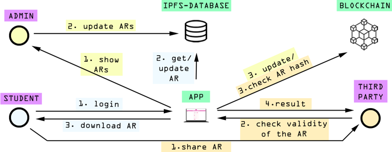

Figure 1 also shows the different actors that interact with the system (highlighted in purple), who are:

- Students . Once registered, students are able to see the evolution of their ARs after their periodic exams and courses. Whenever a student needs it, his/her AR can be downloaded (typically in a PDF file) and shared with a third-party, like an organization interested in hiring him/her that wants to validate the student academic merits.
- Administrators . After exams, professors register the marks obtained by the students in the decentralized database. However, such marks need to be verified before getting traced in the blockchain. Administrators can be seen as permissioned professors, who are responsible for looking into mark changes and update the hashes in the blockchain. Specifically, the developed DApp detects when the ARs state is changed by the professors and creates a list with the updated ARs, which will be shown to the administrator (e.g., to the head of the department or to a person that works for the university/school administration) and, if he/she approves the changes, he/she will create a transaction to update the AR hashes on the blockchain. Such an update can be performed individually for each AR or in batch (i.e., for several ARs at the same time) to accelerate the process. It is important to note that, as it was previously mentioned, each transaction only uploads the AR hash to the blockchain (not the AR raw data).
- Third-party . It is any external user that wants to verify the validity of an AR. This is simply performed by uploading the provided AR document to the DApp, which will

show almost instantly whether the introduced AR is part of the blockchain or not (by comparing its hash with all of the hashes stored in the blockchain).

To deploy the devised architecture, every participating entity needs a full node to interact with the blockchain. However, the process of setting up a full node is not straightforward for most users. As this would not favor the adoption of the proposed solution, there are other ways to access the blockchain such as using node providers. For instance, there are third-party intermediate services that provide already configured full nodes able to interact with the DApp and with the blockchain network [84]. In the case of Metamask wallets [85], they already use these services to emit transactions, so simply using a Metamask wallet hides the complexity of the infrastructure to non-technical users although it presents other limitations from an usability standpoint, as it will be discussed in Section 4.3.

Figure 2 provides a low-level perspective of the three main subsystems of the DApp and how they communicate. Such a Figure depicts an architecture that follows a Remote Procedure Call (RPC) model, where the DApp is the client and the RPC node is the server. The client just sends requests to the RPC node, allowing an easy real-time interaction with the blockchain data.

Figure 2. Main subsystems of the proposed DApp and their interconnections.

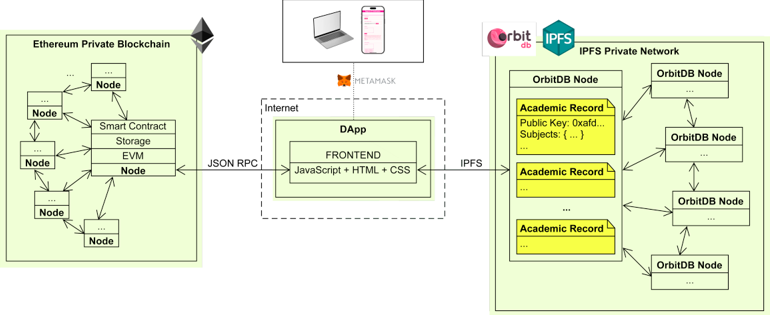

## 3.2. Main Functionality of the System

## 3.2.1. Ethereum Authentication

In order to describe how user authentication is performed, it must be first indicated that the state of an Ethereum blockchain consists of accounts and contracts. User accounts are represented by private (SK) and public keys (PK), which are necessary to interact with the blockchain. Wallets [84,85] allow users to easily generate accounts to sign messages, hold assets or perform transactions in the network.

To access an AR, it is necessary to log in into the DApp. Among the different techniques to log in users into Web3 applications, the developed application implements a standardized login system that involves a signature verification using an ECDSA [86] to determine that the PK/SK holds the legitimacy of the user. For such a purpose, the user needs to sign a string with his/her SK, resulting in a ciphered string. Then, to make sure that the user is the legitimate holder of the SK, he/she needs to introduce the aforementioned string, the cipher string and his/her PK. With these three values, the DApp can determine whether the user used his/her SK to sign the message, without actually knowing or storing the SK.

## 3.2.2. Access to the ARs

All students have their data stored in the database, so their ARs are linked to their PKs. However, initially, AR hashes are not included in the blockchain. For such a purpose, every student has to ask for an initial transaction to get his/her AR hash tracked by the

blockchain the first time they login into the DApp. Once a DApp administrator performs such an initial transaction, the resulting transaction hash will be appended to the student AR in the database (i.e., a flag that indicates that the AR is tracked in the blockchain). Thus, after the initial transaction the AR can be displayed to the student upon request. For the sake of clarity, the previously described process is illustrated in the sequence diagram shown in Figure 3, where OrbitDB is the decentralized database.

## 3.2.3. AR Update

After every exam period, professors update student ARs with the corresponding marks. These changes need to be confirmed by a group of administrators. Even though the implementation provided in the public open-source repository [26] just uses one administrator account for demonstration purposes, it is necessary more than one for the update process in a real deployment. The more administrators validating these updates, the less the chances of tampering or bribery.

The administrators will have access to all the modified ARs of the database. Once checked by the administrator, a transaction is performed to update the ARs stored in the blockchain (i.e., the ARs hashes are updated). All blockchain transactions are public, so anyone with access to a web browser-based block inspector can see the transaction information [87]. All the previously described updating process is detailed step-by-step in the sequence diagram shown in Figure 4.

Figure 3. Issue of an AR for the first time.

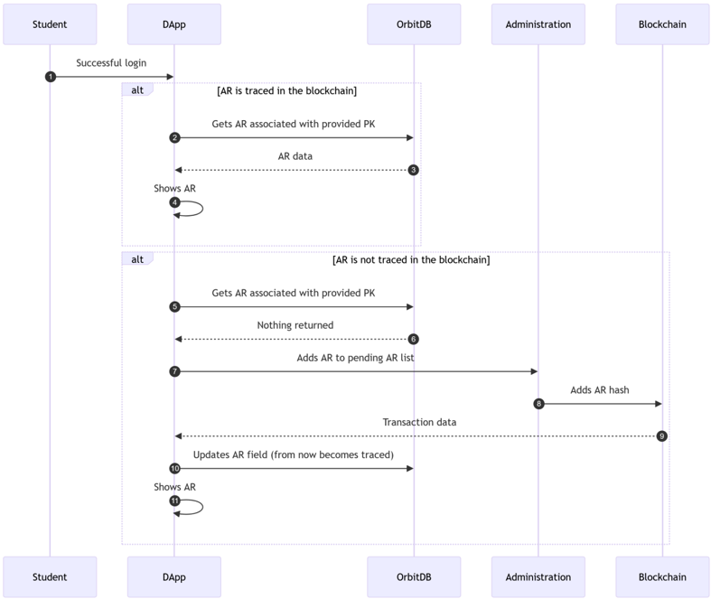

Figure 4. AR update process.

## 3.2.4. AR Verification

Students can download and share their ARs with any third-party in order to prove their merits. As it is illustrated in Figure 5, the verification process simply takes the AR file (introduced by the third-party) and checks whether its corresponding hash is stored in the blockchain. If such a hash matches any of the stored hashes, then the system can confirm that the AR is tracked by the blockchain; therefore, it is valid and tamper-proof.

Figure 5. AR verification process.

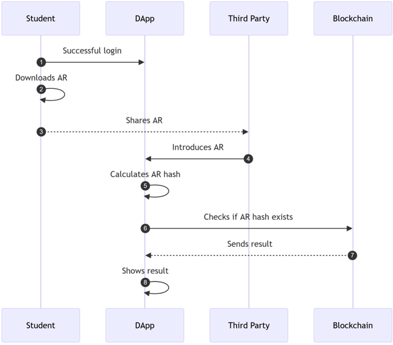

## 4. Implementation of the System

## 4.1. DApp

The main functionality of the DApp described in Section 3.2 was implemented as follows:

- Authentication. The application first asks the user to verify his/her identity through his/her Metamask wallet (illustrated in Figure 6). Then, users can sign the messages or the transactions that will be submitted to the network (an example is shown in Figure 7).
- AR access/first issue. After a successful PK/SK verification, the application will look for the student's PK in the off-chain storage. Note that, as it was previously mentioned, the student's data must be already present in the database (i.e., the AR database is indexed by the PKs, as they are unique values). Once found, the application checks the transaction hash of the student's AR. If the transaction hash field is not empty, then the AR is already recorded in the blockchain, so the application can display the AR to the student directly (an example of a retrieved AR record is shown in Figure 8). On the contrary, if the transaction hash field is empty, that means that the AR is stored in the database, but it is not recorded in the blockchain. Therefore, the administration would perform a transaction to trace it in the blockchain for the first time.
- AR update. Any slight modification on the AR file will completely change its hash. Therefore, a new hash represents an AR update (or a new AR) that is not traced in the blockchain. When this happens, the application adds the AR (and all the updated ARs) to a 'pending AR list'. This list of ARs is what the administrator will see on his/her interface (an example is shown in Figure 9), waiting to be confirmed after the validation process.
- AR verification. As it was previously mentioned, a student can download his/her AR to share it with third parties, typically, an entity that wants to verify a CV. Such a downloading can be performed through a link that is enabled once the student has gained access to his/her information (such a link can be observed at the top of Figure 10). Then, the mentioned third-party would validate the CV merits by introducing the AR file into the application through the menu shown in Figure 11. The verification process is very fast (just a few seconds), as the application only needs to encrypt the AR (using the keccak256 function) and then to check whether its hash matches one of the hashes stored in the blockchain.

Figure 6. Metamask signature request in the DApp.

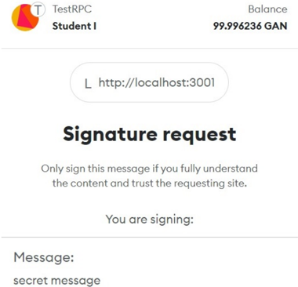

Figure 7. Message signed successfully with the developed DApp.

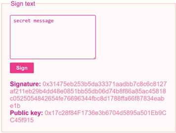

Id: Ox4ac13fc45076525bd5e883fbf8cd4ed40cf9b251aegee ddf7e5a0e784f2438f6

Public f915 Key:

Degree: Computer science

Academic title issue date:

Name: Rose

Surname: Howard

Figure 8. Example of a retrieved AR shown by the DApp, where several subjects are not yet evaluated.

| Subject                             | Mark   | Subject Type   | [Course   |
|-------------------------------------|--------|----------------|-----------|
| Computing Theory                    | 5.2    | [Basic Core    | [23/24    |
| Calculus                            | 2.7    | Basic Core     | [23/24    |
| Bussiness Management                |        | [Basic Core    | [23/24    |
| Programming                         | 5.7    | Basic Core     | [23/24    |
| Discrete Math                       |        | [Basic Core    | [23/24    |
| Principles of Computer [Engineering |        | [Basic Core    | [23/24    |
| Programming                         |        | [Basic Core    | [23/24    |
| Linear Algebra                      |        | [Basic Core    | [23/24    |
| Physics                             |        | [Basic Core    | [23/24    |
| Statistics                          |        | Basic Core     | [23/24    |

Update academic records

| Subject                            | Mark   | Subject Type   | [Course   |
|------------------------------------|--------|----------------|-----------|
| Computing Theory                   | 5.2    | IBasic Core    | [23/24    |
| Calculus                           | 2.7    | Basic Core     | 23/24     |
| Bussiness Management               |        | IBasic Core    | [23/24    |
| Programming                        | 5.7    | [Basic Core    | [23/24    |
| Discrete Math                      |        | Basic Core     | [23/24    |
| Principles of Computer Engineering | 8.1    | Basic Core     | [23/24    |
| [Programming                       | 5.5    | IBasic Core    | [23/24    |
| [Linear Algebra                    | 8.2    | [Basic Core    | [23/24    |
| Physics                            | 1.6    | IBasic Core    | 23/24     |
| [Statistics                        |        | [Basic Core    | [23/24    |

Figure 9. Pending AR list shown to the administrator.

## Download

Id: Ox4ac13fc45076525bd5e883fbf8cd4ed4Ocf9b251ae9ee ddf7e5a0e784f2438f6 Public Key: Ox17c28f84F173603b6704d5895a501Eb9CC45 f915 Degree: Computer science Academic title issue date: Name: Rose Surname: Howard

Figure 10. After the updating process, students can see the added marks.

| Subject                              | Mark   | Subject Type   | Course   |
|--------------------------------------|--------|----------------|----------|
| Computing Theory                     | 5.2    | Basic Core     | [23/24   |
| [Calculus                            | 2.7    | Basic Core     | [23/24   |
| [Bussiness Management                |        | Basic Core     | [23/24   |
| [Programming                         |        | Basic Core     | [23/24   |
| [Discrete Math                       |        | Basic Core     | [23/24   |
| [Principles of Computer [Engineering |        | Basic Core     | [23/24   |
| [Programming II                      | 5.5    | Basic Core     | [23/24   |
| [Linear Algebra                      | 8.2    | Basic Core     | [23/24   |
| [Physics                             | 1.6    | Basic Core     | [23/24   |
| Statistics                           |        | Basic Core     | [23/24   |

Figure 11. Successful verification of an AR.

## 4.2. Subsystem Implementation

## 4.2.1. Blockchain Logic Smart Contract

The core of the blockchain-based system relies on a smart contract that makes use of two essential functions. The first one is the 'store' function, which introduces the AR hash to an array. The second one is the 'check' function, which verifies whether the submitted hash is present on the array or not. Note that the critical operation in the smart contract is the 'check' function, which will be executed by third-party providers who want to verify specific merits. The execution of such an operation is cheap, energy efficient and very fast, because it is a simple read from the blockchain [88], which makes it suitable for contexts with a great number of read-type requests (as it will be illustrated in Section 5). Similarly, it can be easily inferred that the gas consumption of the 'store' function will be minimal. Precisely, such a function just involves a single SSTORE operation on the EVM to set the value of a hash to true. The efficiency of such a write operation will be demonstrated in Section 5 by deploying the contract to a public testnet.

The technique used in the proposed smart contract provides a flexible verification mechanism applicable to many kinds of domains where data need to be monitored continuously. In fact, this technique is also used to track the history of small blockchains through their Merkle trees (i.e., their state). This architecture is called a dual-chain system [46], where a private network or sidechain could be devoted to store academic data (i.e., ARs hashes), and a public blockchain to register the Merkle trees of such a private blockchain.

To verify the security of the developed smart contract, it was evaluated using two widely recognized tools for smart contract auditing: Slither [89] and Mythril [90]. The obtained results indicate that no additional security measures are required, since the current method of storing hashes is sufficiently robust against potential attacks. The security challenges may arise on other aspects of the application that need to be addressed for a production-ready decentralized platform. For example, the use of the same set of keys may increase the risk of physical linkability of a student to his/her address [91]. Moreover, cases of lost or stolen keys have to be considered in a production environment. Furthermore,

if third parties do not manage the AR provided by a student correctly, there is a risk of data leak. This can be prevented as described in Section 2.6, where selective disclosure through ZKPs permits complying with the GDPR. The authorization control of the DApp should also be enforced, as only authorized accounts should be able to confirm the changes in the database. This demands a thorough control access that can be achieved by introducing a smart contract for role management [92] to comply with current security standards.

## 4.2.2. Decentralized Database

OrbitDB [23] was selected as decentralized database. It is based on IPFS and provides an easy way to store and retrieve information through Create, Retrieve, Update, Delete (CRUD) operators. The decentralized database operates in a similar way to a blockchain, so every peer in the network has a synchronized view of the database. Moreover, the stored data are scattered among the participating peers and are tracked by an address and a hash table. OrbitDB offers developers five predefined types of databases (log, feed, keyvalue, docstore and counter), each with its own API and CRUD operators. The docstore database stores information with JSON format, so it is a good fit for managing structured data. OrbitDB databases also provide a control access system to manage the read/write permissions of the users. However, it must be remarked that decentralized databases such as OrbitDB do not implement privacy by default [83], so developers have to take privacy-protection actions to achieve regulatory compliance.

It must be indicated that OrbitDB performance can be tested in terms of response time. Although such an evaluation is out of the scope of this article, the interested reader has further information in [93], where OrbitDB was used for a healthcare DApp. In such a paper, OrbitDB nodes were deployed locally and remotely (in Fog and Cloud computing environments), and it was found that response times were in the order of milliseconds, which demonstrates that OrbitDB is suitable even for scenarios where response time is critical.

## 4.3. Usability and User Experience

A well-designed User Experience (UX) is crucial for the widespread adoption of DLT-based applications. The development of such applications is usually challenging because, beyond adhering to established best practices and modern standards (such as user-centric design, intuitive navigation, consistency or responsiveness), it must also ensure that interactions with DLTs are as seamless and transparent as possible to encourage user adoption [94]. Since the solution proposed in this article was conceived as a technical demonstration for practitioners, developers and researchers, no UI frameworks were used. In addition, the number of interface elements and available options was kept as small as possible to create an easy-to-use verification system.

In order to evaluate the UX of the developed interface, an exploratory assessment was carried out to obtain feedback from potential users of the platform. The interviewees represented a range of backgrounds, encompassing the three different roles: students (aged 18-25), professors (aged 28-35), administrators (aged 35-40) and human resource managers (aged 35-40). The list of available tasks for the students, professors and the human resources manager to evaluate the application is shown in Tables 2, 3 and 4, respectively. The group sample size was small, but their feedback was really valuable for obtaining an initial exploratory understanding of the UX and for identifying potential issues at an early stage.

Table 2. Evaluation tasks for students.

|   No. | Task                           | Explanation                                                                                 |
|-------|--------------------------------|---------------------------------------------------------------------------------------------|
|     1 | Install Metamask               | Click on the link to install the browser extension of Metamask.                             |
|     2 | Create an account              | Use Metamask to create an Ethereum account.                                                 |
|     3 | Change the Ethereum network    | Open Metamask and change the Ethereum network of the account from the Mainnet to a testnet. |
|     4 | Connect Metamask with the DApp | Use the button Connect with Metamask located at the top right corner of the DApp's website. |
|     5 | Sign a message                 | Authenticate by signing a message and filling three input fields in the menu.               |
|     7 | Visualize ARs                  | Access the ARs details.                                                                     |
|     8 | Download ARs                   | Get the file of the accessed AR.                                                            |

Table 3. Evaluation tasks for administrators.

|   No. | Task                           | Explanation                                                                                 |
|-------|--------------------------------|---------------------------------------------------------------------------------------------|
|     1 | Install Metamask               | Click on the link to install the browser extension of Metamask.                             |
|     2 | Create an account              | Use Metamask to create an Ethereum account.                                                 |
|     3 | Change the Ethereum network    | Open Metamask and change the Ethereum network of the account from the Mainnet to a testnet. |
|     4 | Connect Metamask with the DApp | Use the button Connect with Metamask located at the top right corner of the DApp's website. |
|     5 | Sign a message                 | Authenticate by signing a message and filling three input fields in the menu.               |
|     6 | Validate ARs                   | Confirm recent changes in ARs by sending a transaction to the blockchain.                   |

Table 4. Evaluation tasks for the human resources manager.

|   No. | Task             | Explanation                                                          |
|-------|------------------|----------------------------------------------------------------------|
|     1 | Get a set of ARs | Inspect a set of ARs, some of which have been fraudulently modified. |
|     2 | Verify ARs       | Introduce the AR in the application and react to the result.         |

The participants raised several interesting points. First, the use of a decentralized application requires the use of a wallet and even though wallet providers have detailed instructions in their websites on how to set them up, it was a barrier for the interviewed users, who wondered why they had to leave the application in order to install it (Tasks 1-4 in Tables 2 and 3).

Second, as it was mentioned in Section 3.2.1, users are required to sign a message in order to log-in in the application (Task 5 in Tables 2 and 3). Words like 'Sign text', 'Verify signature', 'Public key' (Figure 7) were not familiar for both students and professors. Moreover, it was suggested that a step-by-step guidance would be better than having all the input fields in the same place. This modification is straightforward and can be easily achieved by integrating a progress bar with tool tips, descriptive texts and help icons to explain the required inputs and their purpose. Thus, after completing the account validation process, students were able to see their AR (Figure 8). In this panel, there is only one button that allows for downloading the AR (Figure 11). The simplicity of inspecting and sharing the AR was highly appreciated, but was complemented with the suggestion to support additional user-friendly and widely recognized file formats, such as PDF (Task 8 in Table 2).

Regarding the administrators, their panel showed a set of ARs that changed since the last update, and a button to confirm such changes in the blockchain. Although they knew that their function was to confirm the changes that took place in the database of the university, they wanted to understand what implied the transaction to the blockchain (Task 6 in Table 3). Some testers acknowledged that managing up to a high number of ARs could become difficult with the current implementation. They appreciated the system technical scalability and identified an opportunity to improve scalability from a UX

standpoint. They also wondered why did they have to pay for transactions, even though they did not have to obtain native token by themselves. Such a comment underscores the need for improving user education on blockchain/DLTs, specifically regarding the role of transaction fees.

Finally, the human resources manager was given some ARs so he could verify them through the platform (Task 1 in Table 4). Some ARs were intentionally modified simulating a malicious practice. The platform does not require to log-in or to connect a wallet to verify the ARs, so anyone with an AR file can use it. The AR verification interface is very similar to the one provided by MIT's Blockcerts [8]. After the verification process, the human resources manager was glad to see the simplicity and the ease-of-use of the platform, which actually resolved his problems with current procedures, when struggling to effectively verify the claimed merits of applicants (Table 4, number 2).

Despite that some testers did not fully understand the underlying technology, they recognized a great interest for this kind of platform. Our insights were very similar to those found in [95]. For example, the need of confirming and paying transactions for every interaction, and the non-familiarity with low-level terms such as gas price, gas fee, block size are a barrier even for tech-savvy users. In fact, most DLT-based applications require the purchase and management of native tokens in order to interact with smart contracts and execute transactions. Such Know Your Customer (KYC) processes to acquire the relevant native token can be a major barrier for potential adoption. In this regard, the concept of meta-transactions arose in recent years to allow users to execute transactions delegating the payment of the gas fees to a third-party [96]. Thus, the process of sending transactions to the blockchain would be completely transparent for end-users, something specially valuable for academic platforms where the use of token is not necessary in many types of interactions. However, such techniques are still emerging and are not fully standardized.

The usability and UX challenges previously discussed remain ongoing issues within the blockchain ecosystem, particularly when it comes to designing DApps for non-technical users. Although the carried out small-scale evaluation provided valuable insights for current development and practical considerations, future improvements in UX design and interface development are necessary. Specifically, future work should build on this evaluation through additional direct user feedback, structured usability testing and iterative design improvements to align with best practices and promote user adoption within the blockchain ecosystem.

## 5. Experiments

## 5.1. Experimental Setup

The devised experiments were carried out to evaluate the performance of the proposed system in terms of query latency, transaction throughput, resource usage and energy consumption. It is worth pointing out that the aim of the tests was not to provide an extensive analysis on every factor that impacts blockchain performance or efficiency [97-99], but to show the overall performance of the system in a realistic but limited permissioned scenario. In addition, the tests were also aimed at evaluating the performance of the system in resource-constrained devices, where power consumption is crucial [100]. Furthermore, it must be indicated that the results shown in the next sections depend on the underlying hardware and on the existing resource constraints (e.g., limitations in CPU, memory or disk I/O), which can introduce variability in performance and energy measurements. Nonetheless, in the performed experiments, thanks to averaging out the obtained measurements, only small variations were observed, which do not impact the overall tendency for each experiment (e.g., the overall tendency of the difference in performance between PoA and PoW).

Specifically, the following parameters are evaluated in the following subsections:

- Latency of read operations, which allow for determining how fast the developed system responds to requests such as AR verifications.
- Throughput of write operations, which enables analyzing the speed of the blockchain implementation.
- CPU usage and CPU power consumption.
- Energy consumption when deploying a node in two different resource-constrained devices.

For the sake of brevity, the performed experiments were focused on evaluating the power consumption of the consensus protocol, which usually supposes the most energyhungry subsystem of a DApp.

The experiments were carried out in a local network, so it was necessary to use a client framework. Such a framework allows for configuring and for executing a node able to access the network. The used framework was Geth, which was selected due to its flexibility and good documentation. However, it is worth noting that there is previous research on other popular alternative frameworks that focus on performance and efficiency [100-105], which are interesting for real-world applications that make use of resource-constrained devices. For example, Nimbus [106] and Reth [107] are good alternatives for green blockchains, since they provide a consensus and an execution client focused on energy efficiency and Internet of Things (IoT) devices.

## 5.2. Latency of Read Operations

In order to measure the latency of read operations, Flood [108] was used to 'flood' the developed Ethereum-based application with read-only RPC requests. The latency of each request was measured as the time that goes by between the submission of a transaction and the confirmation response that it is valid. It must be noted that latency is one of the metrics that potential users are usually more concerned about when deploying a DApp, essentially due to its impact on the overall performance and on user experience. The higher the number requests per second (rps) are emitted, the higher the load of the RPC node (i.e., the server) in terms of CPU cycles, I/O speed and memory usage.

To create a realistic scenario, sixteen nodes were used for this set of tests. The selected read-only operation for the tests was 'eth\_call'. As a reference, two out of the sixteen nodes were evaluated (Node1 and Node2). Tests were performed for 10, 100, 500, 1000, 1500 and 2000 rps with a duration of 60 s (i.e., for each rate, the tool maintained a specific pace of requests per second for 60 s). The results for each rate were obtained in ascending order according to the number of rps and then three percentiles were calculated (p50, p90 and p99).

The obtained results are shown in Figure 12. As it can be observed, Figure 12 has a sort of U-shape for each curve, having more latency at 10 rps than for 500 rps. This behavior should be ignored, as it does not represent realistic nor reliable outputs for this range. Since such a reported issue is inherent to the used test tool (Flood), it has been preserved in the figure so that future researchers can consider it. However, from 500 rps the nodes start behaving as expected, having a smooth increase in the latency as rps increases.

Figure 12. Latency results when performing up to 2000 transactions of a typical read operation.

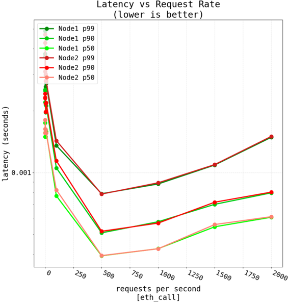

Moreover, it can be observed in Figure 12 that, as expected, the lowest latency can be found for 500 rps, which is a realistic rate in practical scenarios. Furthermore, for the worst case evaluated (i.e., for a maximum of 2000 rps), latency is still very low (in the order of milliseconds). Loads above 2000 rps will derive into a relevant increase in latency, but such loads are not usual in a typical academic data verification application.

## 5.3. Throughput of Write Operations

For evaluating write operation performance, Pandoras [109] was used as stress testing tool. Such a tool is able to automate sending transactions between externally-owned accounts. The experimental results were recorded through Geth, measuring different metrics to analyze node performance and memory/CPU consumption.

The throughput ( T ) of write operations was calculated as the number of successful transactions per second (TPS), defined by:

<!-- formula-not-decoded -->

where nt is the total number of successful transactions and tt is the total time in seconds. Such a total time refers to the time required to create the blocks that contain nt transactions that will be appended to the blockchain (i.e., the workload handled per unit of time).

## 5.3.1. Testnet

The 'store' operation of the proposed smart contract was executed 100 times to assess the response time of each transaction. Note that 11 out of 100 transactions failed and were not added to the data source. The script of this test can be inspected in [26]. The response time was calculated by obtaining the difference in seconds between the moment of emission and the timestamp of the block where the transaction was included and converted to TPS

(i.e., T = 1/ tt ). The results are depicted in Figure 13. Considering the massive traffic of a public network, the 'store' operation is fast enough for an AR verification platform, where it is acceptable to wait some seconds after an update has been produced to be able to verify it.

Figure 13. Evolution of the TPS for the tested testnet.

## 5.3.2. Local Network

As a virtualized environment is more suitable for intensive testing, a greater load test was performed to see the differences between PoA and PoW in terms of throughput. The used tool [109] is able to send a batch of transactions between externally-owned accounts in an automated way. The experimental results were recorded by collecting the data of a Geth node of the network.

The network was set up with 16 nodes and 4 validators, configuring the gas limit to 1 million units of gas. Regarding the options provided by Pandoras, the transactions were set to EOA type, and the batch size was set to 1 (i.e., one transaction at a time). A fixed number of transactions was emitted (250, 500, 750 and 1000) and the resulting transactions per second (TPS) were averaged 100 times per point.

The first set of tests measured the TPS of the network using PoW and PoA, when both made use of the same network parameters. The obtained results are shown in Figure 14. As it can be observed, PoA performs better with a moderate number of emitted transactions (up to 1000). As the number of transactions increases, the differences are reduced significantly, mainly because of setting the gas limit to 1 M units, which becomes rapidly a bottleneck for the throughput of the network.

The influence of the gas limit was analyzed in a second set of tests that explored how TPS evolved when using different gas limits (from 1 to 60 million units of gas), while keeping the same consensus protocol (PoA) and network parameters unchanged. The obtained results are shown in Figure 15, where it can be observed that increasing the gas limit derives into increased TPS. However, there is a point in each curve where transaction throughput stops increasing, which is mainly due to the number of emitted transactions and to the impact of other blockchain parameters. In any case, in a realistic scenario, a gas limit of 1 M units of gas should be enough to deal with an eventual complex data manipulation for this application (as of writing, the public network of Ethereum uses 30 M as the gas limit).

It is important to acknowledge the limitations of the aforementioned experiments. Anetwork up to 16 nodes cannot be considered fully decentralized. However, such a scale allows researchers and developers to easily perform specific tests. In this case, the scale of these networks allows for finding out the performance and the energy consumption gap between both consensus algorithms and to localize bottlenecks.

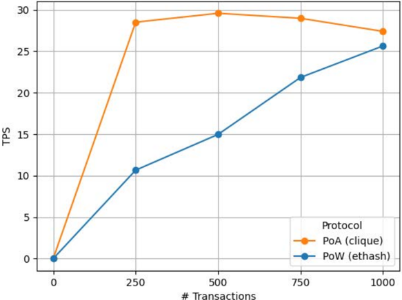

Figure 14. Transactions per second of the network with PoW and PoA.

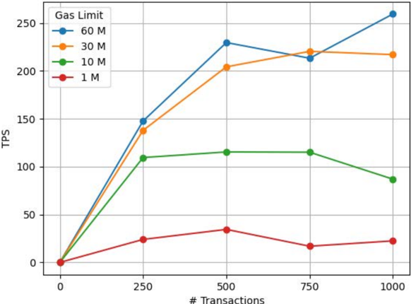

# Transactions

Figure 15. Transactions per second for four different gas limits using PoA.

## 5.4. CPU Usage and CPU Power Consumption

Aset of tests was carried out to compare the CPU usage and the energy consumption for PoW and PoA. For such a purpose, a blockchain network was deployed with 24 nodes, three of them acting as validators/sealers. Such an amount of nodes was selected to recreate a realistic scenario for the developed DApp.

These tests considered two scenarios. On one hand, the first one was aimed at evaluating the network resource consumption at idle state (i.e., with no transaction load, just block mining/sealing). On the other hand, the second scenario put under stress the network by launching different amounts of transactions (between 100 to 1000). CPU usage was measured using the Geth built-in metrics. Note that Geth measures CPU usage as the percentage of use of one processing core (i.e., 100% means that one processing core is fully dedicated). The electrical consumption was measured using HWiNFO [110], a well-known software that provides real-time CPU information. More precisely, the metric recorded by this tool was 'CPU Package Power', which provides the total energy consumed by a CPU.

Figure 16 shows the CPU usage for the first scenario (i.e., under no load). As it can be observed, even in idle PoW clearly requires much more CPU usage than PoA. However, such a difference between PoW and PoA is narrower in terms of power consumption, as it is shown in Figure 17, although, overall, PoA has a lower CPU power consumption.

Figure 16. CPU usage in idle for PoW and PoA.

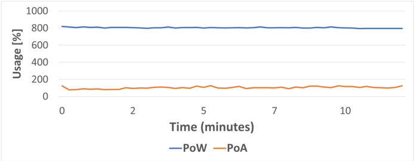

Figure 17. CPU power consumption in idle for PoW and PoA.

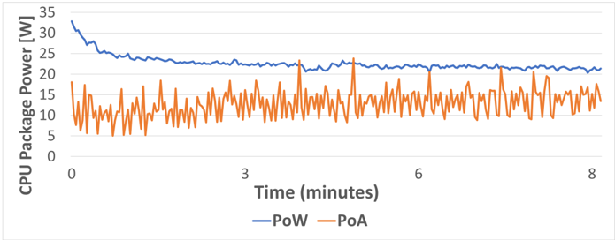

When the network is put under stress, the obtained results differ, as it is shown in Figures 18 and 19. As it can be observed, PoA CPU usage is clearly lower than for PoW (specifically, PoW average CPU usage is 66% higher than for PoA). However, during very specific high-transaction load peaks, power consumption is higher for PoA than for PoW. In fact, PoW average power consumption is only 23% higher than for PoA due to such peaks. In any case, it is important to take such a power consumption percentage with caution, since CPU power measurements are not performed in an isolated way, so other processes can be executed in parallel by the CPU (e.g., by the operating system) and therefore can impact the obtained results.

Figure 18. CPU usage for PoW and PoA under stress.

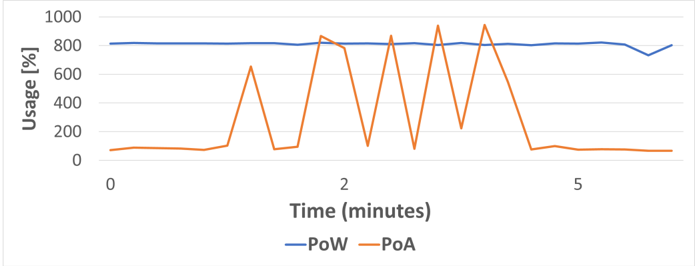

Figure 19. CPU power consumption for PoW and PoA under stress.

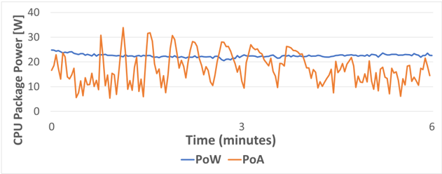

## 5.5. Practical Evaluation on Resource-Constrained Devices

One of the foundations of DLTs are distributed communications. In this aspect, one of the most popular current trends consist in performing data and request processing close to the end user (e.g., Edge or Fog Computing [111]), thus offloading part of the workload of the cloud servers. Moreover, due to the need for deploying a large number of devices in certain applications, Single-Board Computers (SBCs) are commonly used due to their small size, reduced power consumption and low cost.

## 5.5.1. Response Latency

The performed latency tests allowed for determining the maximum request load that each SBC can handle without degrading response time. Figures 20 and 21 show the read operation latency obtained for two different SBC devices (Orange Pi One and Raspberry Pi 4, whose main specifications are shown in Table 5) under different workloads. Specifically , Figure 20 shows the results obtained for the Raspberry Pi 4 for up to 1000 requests per second (with a duration of 60 s per each test), while Figure 21 shows the read operation latency obtained for the Orange Pi One when performing up to 50 requests per second.

Table 5. Main characteristics of the tested SBC hardware.

| Board          | SoC                      |   CPU Clock (GHz) | Memory (GB)   | Ethernet   |
|----------------|--------------------------|-------------------|---------------|------------|
| Raspberry Pi 4 | Quad-Cortex A72 (ARM64)  |               1.8 | 1 + 1.1 Swap  | Gigabit    |
| Orange Pi One+ | H6 Quad-core A53 (ARM64) |               1.8 | 1 + 1.1 Swap  | Gigabit    |

As it can be observed in Figure 20, the Raspberry Pi 4 (Raspberry Pi Trading Ltd., Cambridge, UK) offers response times similar to those shown in Figure 12 up to 500 requests per second, despite being the latter figure obtained on a higher performance computer. In the case of the Raspberry 4, after the initial spike (preserved in the figure for the sake of transparency, but due to the behavior of the used measurement tool, as it was previously described in Section 5.2), latency remains under 10 ms up to 600 requests per second. After such a number of requests per second, latency increases significantly with the number of requests except for the 50th percentile, where it remains low throughout all tests.

In the case of the Orange Pi One (Shenzhen Xunlong Software Co., Ltd., Shenzhen, China), due to the hardware differences with the Raspberry Pi 4, response times are clearly higher, as it can be seen in Figure 21. For such a SBC, the maximum number of evaluated requests per second was 50 since the latency was notably high, reaching values of up to

10 s. In the case of the 50th percentile, it remains stable under 10 ms until 40 requests per second, exceeding 100 ms for 50 requests per second.

Figure 20. Latency results when performing up to 1000 transactions on the Raspberry Pi 4.

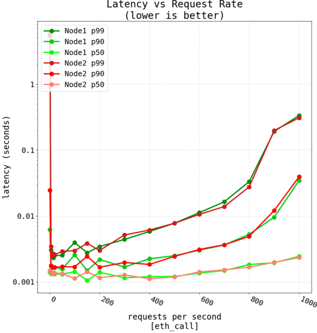

Figure 21. Latency results when performing up to 50 transactions on the Orange Pi One.

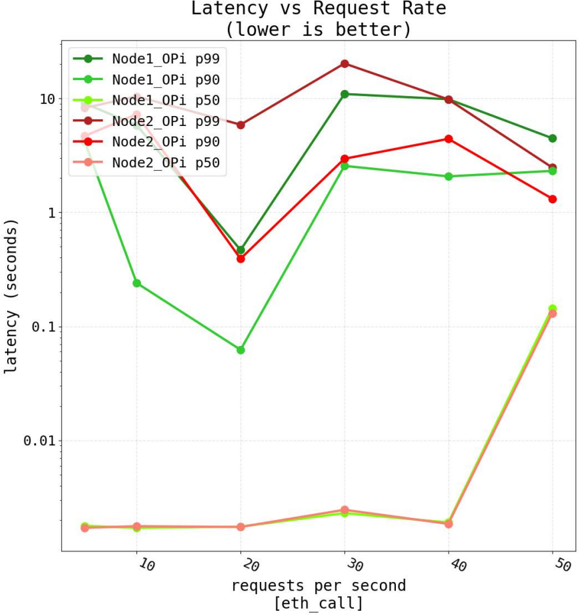

## 5.5.2. Network Performance

The Raspberry Pi 4 was selected for carrying out network performance tests as previously described in Section 5.3. This was due to the fact that the Orange Pi, although it was able to run both consensus protocols, did not have enough power to perform high-load stress tests.

Thus, Figures 22 and 23 show the TPS obtained under different workload levels for the Raspberry Pi 4 in a network of four nodes and one validator. Specifically, Figure 22 shows the performance of the Raspberry Pi 4 for PoA at different gas limits. For obtaining such a figure, the same number of transactions employed in Section 5.3 was sent but each point was averaged only 20 times due to the notable difference in hardware performance. In addition, it should be indicated that, when using resource-constrained devices, the gas limit cannot be too high: a high gas limit allows for a greater allocation of computational resources, thus avoiding network congestion, but due to the lower computational capacity of the SBCs, the synchronization process becomes slower when more transactions are validated for each block. In contrast, such a computational limitation implies that setting the gas limit too low may cause transactions to run out of gas due to their intrinsic complexity.

For such reasons, during the tests, the minimum gas limit was set to 5 M and the maximum to 30 M. The obtained results show a similar behavior to the ones depicted in Figure 15, but with a lower TPS performance, demonstrating that increasing the gas limit leads to an increase in TPS.

Figure 22. Network performance for PoA with different gas limits on the Raspberry Pi 4.

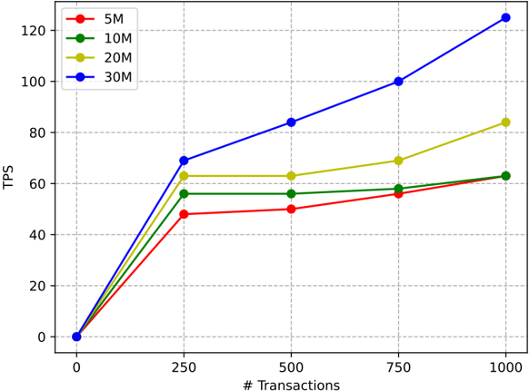

Figure 23 shows the difference in performance of PoW and PoA with the previously described test network using a gas limit of 20 M. Like in the non-SBC-based case, the Figure shows, for different amounts of transactions, the remarkable difference in TPS between PoA and PoW, thus indicating that, under the selected experimental conditions, PoA is a better fit for the evaluated SBCs.

## 5.5.3. Energy Consumption

In order to perform an energy consumption analysis of PoW and PoA for the selected resource-constrained devices, highly accurate hardware was used to carry out measurements on the two SBC models evaluated. Specifically, the energy consumption measurements were performed with a Joulescope [112], which is a high-precision power

meter with a 1.5 nA resolution that is able to measure voltage and current at 2 million samples per second with a 250 KHz bandwidth.

Figure 23. Network performance for PoW and PoA for a 20 M gas limit on the Raspberry Pi 4.

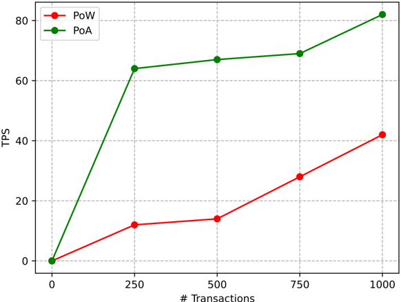

During the energy consumption tests, different amounts of workload were generated for both SBCs. In the case of the Orange Pi, since it is less powerful, only one peer was included for both PoA and PoW. For the Raspberry Pi 4, two tests were performed for comparing PoA and PoW energy consumption: one for two peers and another one with eight peers.

Figures 24-26 show the energy consumption obtained by the SBCs for PoW and PoA. In particular, Figure 24 shows an example of the evolution of the energy consumption on the Orange Pi during the execution of the PoA algorithm. In such a figure different noticeable peaks with similar maximum values and duration can be observed, which correspond to the performed block validations. For example, the interval defined as P1 in Figure 24 (delimited by two vertical red dashed lines), contains a peak that has a duration of approximately 1.8 s and an average current consumption of 600 mA.

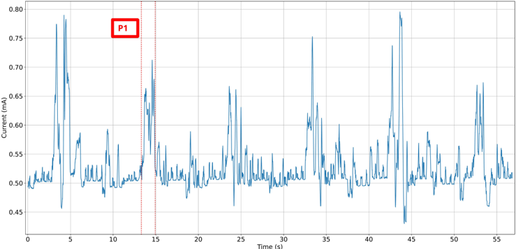

Time (s)

Figure 24. Power consumption for the PoA algorithm on the Orange Pi by simulating one peer.

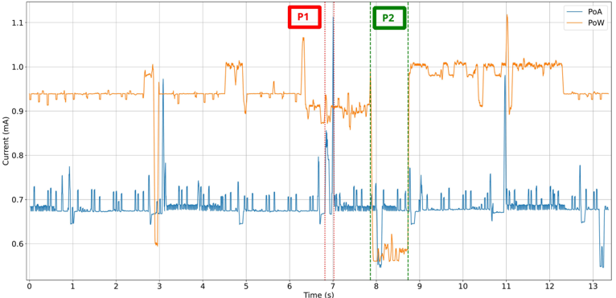

Time (s)

Figure 25. Power consumption for the PoA vs PoW algorithm on the Raspberry Pi by simulating two peers.

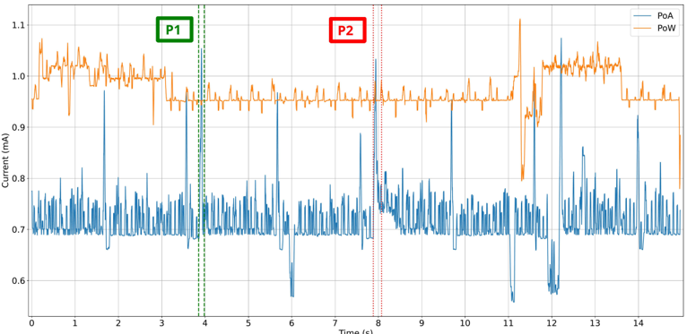

Time (s)

Figure 26. Power consumption for the PoA vs the PoW algorithm on the Raspberry Pi by simulating eight peers.

Figure 25 shows a comparison between PoW and PoA when executing two peers on the Raspberry Pi 4. In this case, it can be first observed the considerable difference in consumption between PoW and PoA. It can be also observed that the performance exhibited by the Raspberry Pi significantly surpasses the one delivered by the Orange Pi: the Raspberry Pi is able to validate blocks approximately every 4 s, compared to the 10 s needed by the Orange Pi. Moreover, the time required by every validation is considerably smaller (about 250 ms, as indicated through interval P1), which is due to the computational power difference between both SBCs.

Regarding the energy consumption difference between PoW and PoA, Figure 25 allows for observing that PoW is significantly more energy-intensive. In fact, it can be stated that PoW is not suitable for low computational power devices like the Orange Pi. It is also interesting to observe through Figure 25 that there is an idle interval of approximately one second (labeled as P2), which corresponds to the search of PoW for new peers prior to initiating the mining operation. The rest of the time PoW energy consumption remains constant, with values ranging between 0.9 and 1 A.

The increase in the number of peers exhibits a comparable trend in both algorithms. The main difference is a slight increase in their average consumption. As illustrated in

Figure 25, for PoA with two peers, the average consumption was 0.68 mA, while only 0.72 mAwere consumed on average for eight peers (this is shown in Figure 26). In the case of PoW, 0.92 mA were consumed for two peers and 0.96 mA for eight peers.

Finally, regarding PoA performance, it can be observed in Figure 26 that, despite increasing from two to eight peers, the obtained time intervals are similar (approximately 220 ms, as illustrated by P1 and P2 in such a figure), with validations occurring every 4 s.

The increase in the number of peers that is required to handle operation requests from a globally distributed user base would necessitate the adoption of a hybrid architecture. This architecture would involve the synchronization of resource-constrained devices with multiple public blockchain networks. Such a setup introduces new challenges related energy efficiency. To assess the sustainability of this scenario, future evaluations should incorporate standardized energy consumption metrics widely used in the literature [113] like annual power consumption (MWh) or energy consumed per transaction (Wh/Tx). These indicators enable objective comparisons across different blockchain platforms and consensus mechanisms. For instance, recent advancements, such as the transition of Ethereum to PoS through Ethereum 2.0, have led to a drastic reduction in energy usage, significantly enhancing the energy efficiency of DApps. Nonetheless, existing energy assessment models primarily designed for PoW systems are becoming increasingly inadequate for characterizing modern blockchain architectures. As noted in [43], evaluating the environmental footprint of PoS-based platforms, Layer 2 scaling solutions (e.g., rollups), and sharded architectures requires updated models that account for their reduced computational overhead [114].

## 6. Key Findings

## 6.1. Experimental Results

After performing the theoretical and practical analyses described this article, several key findings can be highlighted:

- The read and write operation latency of the proposed decentralized system can be really low, in the same order as similar centralized applications but providing higher levels of cybersecurity. This fact indicates that applications for scenarios where low response times are not critical can benefit from the use of blockchain, since the difference in terms of user experience is negligible.
- On the same conditions, the use of PoA significantly increases TPS with respect to the use of PoW. Therefore, the use of PoA includes benefits in terms of efficiency, energy consumption and speed.
- Setting an appropriate gas limit is essential when it comes to determine the blockchain behavior. As it was observed in the previously described experiments, increasing the gas limit significantly increases TPS, since blocks can include more transactions. However, this requires nodes to have more computational resources to verify these transactions, and it would take longer to propagate blocks through the network (i.e., more overhead would be involved). Therefore, resource-constrained devices would not be able to validate blocks on time, losing the capacity to keep the network synchronized and eventually leading to centralization.

According to the results of the experiments presented in this article, both for low and high gas limits, and even with high transaction loads (e.g., 250 transactions per second is considered a high load for the application described in this paper), the system maintained acceptable request rates. Therefore, low gas limits are effective in terms of performance and increase decentralization, which is essential when using consensus protocols such as PoA.

- With respect to CPU usage and CPU power consumption, the behavior of PoW substantiates the one described in [98], where the plateau of PoW is associated with the constant mining process for securing the blockchain. In any case, it must be noted that the previously described CPU usage and power consumption results are actually unlikely in practice, since the simulated workloads (i.e., a progressive load that ranged progressively from 100 to 1000 transactions) were aimed at testing the performance of the system rather than to recreate a realistic scenario for the application described in this article.
- As for the deployment in SBC devices, its use can be beneficial for the greater proximity to the end users. The experiments performed confirm that the use of SBCs is viable for implementing both PoA and PoW-based blockchain nodes, but it is necessary to consider the limitations of such devices in terms of computational power to make proper use of the system and to not to degrade their performance. Specifically, the experiments showed that, to provide an adequate performance level, devices required at least 1 GB of RAM (combined with at least 1 GB of swap memory) together with a CPU with at least four cores of a relatively powerful ARM processor.

## 6.2. Open Challenges and Future Work

## 6.2.1. Interoperability Among Institutions with Different Legal Frameworks

In a case where interoperability is required in an ecosystem of universities with different regulatory frameworks, the solution proposed in this article can be scaled so that each institution can have its own private blockchain. The flexibility of the proposed smart contract would provide the necessary interoperability among the involved organizations. All the operations performed on the students' ARs would be tracked in each university private blockchain. The history of changes of a specific student could be retrieved by performing a simple query to the blockchain history. Thus, the stored history could be hashed and such hash could be uploaded through the proposed smart contract to a public blockchain (the use of a public blockchain is key to increase the security and trustworthiness of the process). This way, the platform, which would be common to the international university consortium, would track the state of each student's AR, regardless of the university they belong to.

## 6.2.2. Smart Contract Enhancements

Regardless of their nature, databases do not have an inherent verification mechanism. The proposed smart contract solves this by tracking the off-chain information with hashes, allowing it to detect fraudulent changes, acting as a watchdog. However, the flexibility of Solidity smart contracts allows for the consideration of several academic processes. For example, the modifications to the AR could be performed on-chain, that is, directly in the smart contract. An example of such enhancement would be to create a smart contract per subject. Such 'subject' smart contracts would share the same structure, so a Manager or Factory pattern could be used [115]. This way, subjects would be identified by their contract address, and they would be effectively identified by their parent smart contract (e.g., a smart contract that represents a specific degree). Additionally, the complexity of the education regulations should be considered. For example, the Bologna Process rules may change annually. Such changes would require the smart contracts to be 'upgradable', a feature that would make the contract sustainable for the long-term [116].

The aforementioned smart contracts could handle different kinds of processes that affect the AR, ranging from academic results to reputation systems based on different kinds of actions. For example, the subject smart contracts would typically contain a method to link students to achieved marks, not only for final exams but also for the completion

of other tasks. Such results would not be stored for every student, as this would create a massive on-chain structure that would increase the gas fees to an unfeasible extent. Rather, event tracking can be used. Such methods would trigger events whenever they are called, so verifying the results of students would simply require read operations to the blockchain history, avoiding expensive data structures such as mappings or arrays and providing a 'green' and scalable solution to the academic field. Other examples of such functions may include a method to add new members to the validation committee (e.g., new professors, program directors). This is aligned with the concept of DAO smart contracts, where different kind of organizational decisions could be taken in a transparent manner. The scope of these DAOs could range from the subject departments to a multiparty, cross-border consortium of institutions.

With the proposed new system, professors would be able to independently trigger transactions involving students' results. Therefore, these transactions would publicly register data such as the author of such assessment (i.e., the message sender), the moment of such assessment (block timestamp), the affected student and the final score, among other possible data. This evidence in the form of blockchain transactions would make the process completely auditable, potentially preventing fraud. Also, such transparency in the process would avoid the current validation process, where a set of administrators needs to supervise every off-chain change. In fact, avoiding such a validation process would be aligned with reality, where professors are assigned different subset of exams and they do not respond to corrections performed by others.

In addition, the proposed smart contract enhancement would address cases of public/private key pair loss. Such a matter is an important concern within decentralized systems, as it determines the resilience of the overall system to attacks such as key hijacking. In the current system, such loss would impede the student to access his/her AR, while administrators would not be able to access his/her validation panel. To tackle this issue, a possible solution would involve notifying the loss to the administrative department of the university, along with some physical verification evidence. The public key field of the AR would require to be changed off-chain and then be confirmed by the administrative department of the university. This way, the AR associated to the lost key pair would become invalid and any potential access from such lost key to the information would be prevented.

## 6.2.3. Revocation of Certificates

Most of the analyzed state-of-the-art academic platforms include the possibility of invalidating previously issued certificates, something which is challenging due to the immutable nature of a blockchain. However, the platform proposed in this article makes this process seamless. This is because the revocation can be seen as another update in the state of an AR that it is aimed at correcting an error. Therefore, a specific department of the university would amend the error on the off-chain AR of the student.

For instance, an example of use case can occur when the completion of a degree needs to be amended, which in the proposed platform would involve to set the corresponding boolean field to false. Such a change would be confirmed in the validation process by a specific commission of administrators. Once confirmed, the prior AR hash would be overwritten with the amended one. This means that if a third-party introduces the AR that specifies the completion of a degree marked as true, the platform would not find such AR hash in the smart contract, so it would mark it as invalid. This process would be enabled thanks to the enhancement proposed in Section 6.2.2, where student addresses would be linked to their AR hash.

## 6.2.4. Decentralized Reputation and Incentives

It must be remarked that decentralized networks must be driven by some kind of reward to ensure long-term activity. When consortiums are competitive and led by profit, a common incentive is the data shared by the different stakeholders. However, the incentives of academic environments are different. In fact, the aforementioned issues regarding the current verification procedures and the lack of trust are an important incentive for academic institutions and organizations to maintain trust around their data.

The literature has extensively studied the impact of incentives within decentralized networks. For example, in [117] the authors classified incentives into three subcategories: reputation, tokens and staking revenues. Precisely, the reputation-based weighted voting incentives the individual to gain additional (non-tradeable) reputation, which leads to more influence in voting. Surprisingly enough, after reviewing 220 public DAOs, they found out that the existence of incentives do not positively influence DAO long term viability. However, this is not an empirical conclusion, and more research is required to fully understand the impact of reputation mechanisms.

The ERC20 (Fungible Token Standard) can enable a reputation mechanism, where universities or certifying bodies (i.e., a certificate scenario could go beyond academia) could earn tokens for maintaining the trust in the network (e.g., adapting to the consensus algorithm, transparent issue of records). However, the tradeable nature of ERC20 tokens makes it unsuitable for many cases, as reputation should not be traded.

Reputation and penalty algorithms can be set based on the performance of participants. For instance, a reputation algorithm could assess an organization reputation considering its CO2 emissions or the provider's punctuality of commodity delivery in a supply chain management scenario. In the case of the platform presented in this article, reputation could be based on the total number of credentials issued by the system, on the number of verification requests or on the institution revocation rate.

Finally, it is also worth mentioning that the ERC721 standard unlocks many possibilities within several domains, specially in the academic field [118]. NFTs can be modified so that, once transferred, they cannot be exchanged again. Thus, NFTs can represent badges, trophies or achievements related to academic merits and that would be publicly visible. Students would be encouraged to earn them, as they would be representative of the student's performance or skills [119]. This is related with the concept of gamification, which can be applied to other domains [120]. The tradeable nature of the tokens may make them unsuitable for certain use cases. In recent years, some authors have explored the use of soulbound tokens, a type of NFT that remains in the possession of an individual or entity permanently [121,122]. Therefore, the concept of soulbound tokens could better fit an academic platform like the one proposed. For example, trust certifications can be assigned to certain actors in the form of soulbound tokens, which are non-transferable.

## 6.2.5. Additional Improvements

After carrying out the previously described work, other potential enhancements have been identified that could significantly increase the value of the proposed verification platform:

- Users appreciated the implemented functionality for its straightforward operation. Section 4.3 provided insightful areas of improvement to the current state of the frontend. A future version of the platform should be aligned not only with standardized UX practices, but also with the aim of making DLTs as transparent as possible for non-experienced and non-technical users, which is crucial for future adoption and potential use.
- Section 2.5 analyzed the standardization efforts for digital identity and credential management. It was demonstrated that DIDs and VCs standards could be easily

added to the platform to standardize the current operation. Additionally, a future version of the platform could aim for cross-border interoperability by being deployed in initiatives such as the EBSI, as the grade of trust in DLT-based applications is directly proportional to the number of stakeholders that take part of the network.

- A comprehensive smart contract audit extending beyond the formal assessment of the proposed system should be performed. For instance, Section 2.6 analyzed the regulatory compliance of the platform, which can be fully achieved with ZKPs. The integration of such technique within the platform was demonstrated.
- Athorough design should be carried out to explore the latest architecture proposals of the literature that aim for sustainability, performance and other scalability mechanisms in order to make the system robust for real scenarios.
- Athorough access control with standardized libraries should be added to strengthen the security of the platform.
- The database activity could be secured by the use of an oracle [123]. Such an oracle could be connected to the smart contract, so every interaction to the database would be registered on the decentralized ledger. Hence, this would provide an increased security to centralized databases, allowing for a progressive decentralization of current centralized systems.

## 7. Conclusions

This article presented the design, implementation and evaluation of a solution for recording and verifying academic records through a DApp deployed on an Ethereum-based blockchain. The application uses a decentralized storage system based on IPFS to manage off-chain data. The proposed implementation is open-source (under GPL-3.0 license), so it can serve as a reference for future researchers and developers to carry out further improvements and tests.

To demonstrate the efficiency of the developed solution, it was evaluated in terms of performance (transaction latency and throughput) and efficiency (CPU usage and energy consumption) on both traditional computers and SBCs. For traditional computer-based nodes and normal workloads (under 250 requests per second), read operation latency was approximately 1 ms, while such a latency increased to roughly 5 ms for a Raspberry Pi 4, but to almost 10 s in some situations for the least powerful SBC evaluated (an Orange Pi One). When comparing the results between PoA and PoW, it is clear that the PoA protocol is more environmentally friendly and requires less CPU load for both traditional computers and SBCs. Moreover, the impact of Ethereum's gas limit was analyzed, observing its clear influence on the system performance.

Author Contributions: Conceptualization, T.M.F.-C.; methodology, P.F.-L. and T.M.F.-C.; investigation, G.F.-B., I.F.-M., P.F.-L. and T.M.F.-C.; writing-original draft preparation, G.F.-B., I.F.-M. and T.M.F.-C.; writing-review and editing, G.F.-B., I.F.-M., P.F.-L. and T.M.F.-C.; supervision, P.F.-L. and T.M.F.-C.; project administration, T.M.F.-C.; funding acquisition, T.M.F.-C. All authors have read and agreed to the published version of the manuscript.

Funding: This work has been funded by grant TED2021-129433A-C22 (HELENE) funded by MCIN/AEI/10.13039/501100011033 and the European Union NextGenerationEU/PRTR.

Institutional Review Board Statement: Not applicable.

Informed Consent Statement: Not applicable.

Data Availability Statement: The original contributions presented in this study are included in the article. Further inquiries can be directed to the corresponding author.

Conflicts of Interest: The authors declare no conflicts of interest.

## References

1. Carmichael, J.; Eaton, S. Fake Degrees and Fraudulent Credentials in Higher Education: Conclusions and Future Directions. In Ethics and Integrity in Educational Contexts; Springer: Berlin/Heidelberg, Germany, 2023; pp. 269-285. [CrossRef]
2. Ezell, A.; Bear, J. Degree Mills: The Billion-Dollar Industry that Has Sold over a Million Fake Diplomas 2005. Available online: https://api.semanticscholar.org/CorpusID:109604213 (accessed on 1 April 2025).
3. Alammary, A.; Alhazmi, S.; Almasri, M.; Gilani, S. Blockchain-Based Applications in Education: A Systematic Review. Appl. Sci. 2019 , 9 , 2400. [CrossRef]
4. Chen, C.L.; Wang, T.; Tsaur, W.J.; Weng, W.; Deng, Y.Y.; Cui, J.; Leng, J. Based on Consortium Blockchain to Design a Credit Verifiable Cross University Course Learning System. Secur. Commun. Netw. 2021 , 2021 . [CrossRef]
5. Jovovi´ c, B.; Popovi´ c, T.; Šandi, S.; Djikanovi´ c, Z. A Blockchain-Based Approach to Management of University Diploma Authenticity. In Proceedings of the 2023 27th International Conference on Information Technology (IT), Zabljak, Montenegro, 15-18 February 2023; pp. 1-4. [CrossRef]
6. Varriale, V.; Cammarano, A.; Michelino, F.; Caputo, M. Industry 5.0 and Triple Bottom Line Approach in Supply Chain Management: The State-of-the-Art. Sustainability 2023 , 15 , 5712. [CrossRef]
7. Silaghi, D.L.; Popescu, D.E. A Systematic Review of Blockchain-Based Initiatives in Comparison to Best Practices Used in Higher Education Institutions. Computers 2025 , 14 , 141. [CrossRef]
8. Blockcerts-The Open Standard for Blockchain Credentials. Available online: https://www.blockcerts.org (accessed on 1 April 2025).
9. BCDiploma Official Webpage. Available online: https://www.bcdiploma.com (accessed on 1 April 2025).
10. Nakamoto, S. Bitcoin: A Peer-to-Peer Electronic Cash System. Available online: https://bitcoin.org/bitcoin.pdf (accessed on 1 April 2025).
11. Buterin, V. Ethereum: A Next-Generation Smart Contract and Decentralized Application Platform. Available online: https: //ethereum.org/es/whitepaper/ (accessed on 1 April 2025).
12. Li, X.; Jiang, P.; Chen, T.; Luo, X.; Wen, Q. A survey on the security of blockchain systems. Future Gener. Comput. Syst. 2020 , 107 , 841-853. [CrossRef]
13. Taherdoost, H. Smart Contracts in Blockchain Technology: A Critical Review. Information 2023 , 14 , 117. [CrossRef]
14. Marchesi, L.; Marchesi, M.; Tonelli, R.; Lunesu, M.I. A blockchain architecture for industrial applications. Blockchain Res. Appl. 2022 , 3 , 100088. [CrossRef]
15. Farnaghi, M.; Mansourian, A. Blockchain, an enabling technology for transparent and accountable decentralized public participatory GIS. Cities 2020 , 105 , 102850. [CrossRef]
16. Fraga-Lamas, P.; Fernández-Caramés, T.M. A Review on Blockchain Technologies for an Advanced and Cyber-Resilient Automotive Industry. IEEE Access 2019 , 7 , 17578-17598. [CrossRef]
17. Fraga-Lamas, P.; Fernández-Caramés, T.M.; Rosado da Cruz, A.M.; Lopes, S.I. An Overview of Blockchain for Industry 5.0: Towards Human-Centric, Sustainable and Resilient Applications. IEEE Access 2024 , 12 , 116162-116201. [CrossRef]
18. Sayeed, S.; Marco-Gisbert, H.; Caira, T. Smart Contract: Attacks and Protections. IEEE Access 2020 , 8 , 24416-24427. [CrossRef]
19. Heinonen, H.T.; Semenov, A.; Veijalainen, J.; Hämäläinen, T. A Survey on Technologies Which Make Bitcoin Greener or More Justified. IEEE Access 2022 , 10 , 74792-74814. [CrossRef]
20. Fernández-Caramés, T.; Fraga-Lamas, P. A Comprehensive Survey on Green Blockchain: Developing the Next Generation of Energy Efficient and Sustainable Blockchain Systems. arXiv 2024 , arXiv:2410.20581. [CrossRef]
21. Qian, K.; Liu, Y.; Shu, C.; Sun, Y.; Wang, K. Fine-Grained Benchmarking and Targeted Optimization: Enabling Green IoT-Oriented Blockchain in the 6G Era. IEEE Trans. Green Commun. Netw. 2023 , 7 , 1036-1051. [CrossRef]
22. Escobar, C.C.; Roy, S.; Kreidl, O.P.; Dutta, A.; Bölöni, L. Toward a Green Blockchain: Engineering Merkle Tree and Proof of Work for Energy Optimization. IEEE Trans. Netw. Serv. Manag. 2022 , 19 , 3847-3857. [CrossRef]
23. OrbitDB Official Repository. Available online: https://github.com/orbitdb/ (accessed on 1 April 2025).
24. InterPlanetary File System. Available online: https://ipfs.io/ (accessed on 1 April 2025).
25. Gresch, J.; Rodrigues, B.; John Scheid, E.; Kanhere, S.; Stiller, B. The Proposal of a Blockchain-Based Architecture for Transparent Certificate Handling. In Proceedings of the BIS 2018 International Workshops, Berlin, Germany, 18-20 July 2018; pp. 185-196. [CrossRef]
26. DApp for Credential Verification. Available online: https://gitlab.com/helene-project1/decentralized-verification-system (accessed on 1 April 2025).
27. Fernández-Blanco, G.; Froiz-Míguez, I.; Fraga-Lamas, P.; Fernández-Caramés, T.M. A Blockchain Based System for Preventing Academic Forgery: Design and Practical Evaluation for CPU-Based and Low-Power Computers. In Proceedings of the 2024 6th International Conference on Blockchain Computing and Applications (BCCA), Dubai, United Arab Emirates, 26-29 November 2024; pp. 406-413. [CrossRef]

28. Fraga-Lamas, P.; Fernández-Caramés, T.M. Leveraging Blockchain for Sustainability and Open Innovation: A Cyber-Resilient Approach toward EU Green Deal and UN Sustainable Development Goals. In Computer Security Threats ; Thomas, C., Fraga-Lamas, P., Fernández-Caramés, T.M., Eds.; IntechOpen: Rijeka, Croatia, 2020; Chapter 8. [CrossRef]
29. Tariq, U.; Ahmed, I.; Bashir, A.; Shaukat Dar, K. A Critical Cybersecurity Analysis and Future Research Directions for the Internet of Things: A Comprehensive Review. Sensors 2023 , 23 , 4117. [CrossRef] [PubMed]
30. Fernández-Caramés, T.M.; Fraga-Lamas, P. A Review on the Use of Blockchain for the Internet of Things. IEEE Access 2018 , 6 , 32979-33001. [CrossRef]
31. Ebert, C.; Louridas, P.; Fernández-Caramés, T.M.; Fraga-Lamas, P. Blockchain Technologies in Practice. IEEE Softw. 2020 , 37 , 17-25. [CrossRef]
32. Nguyen, D.C.; Pathirana, P.N.; Ding, M.; Seneviratne, A. Blockchain for 5G and beyond networks: A state of the art survey. J. Netw. Comput. Appl. 2020 , 166 , 102693. [CrossRef]
33. Kshetri, N.; Voas, J. Blockchain's Carbon and Environmental Footprints. Computer 2022 , 55 , 89-94. [CrossRef]
34. Ghadertootoonchi, A.; Bararzadeh, M.; Fani, M. Long- and Short-Term Prediction of Bitcoin Energy Consumption. In Proceedings of the 2023 8th International Conference on Technology and Energy Management (ICTEM), Babol, Iran, 8-9 February 2023; pp. 1-5. [CrossRef]
35. Khosravi, A.; Säämäki, F. Beyond Bitcoin: Evaluating Energy Consumption and Environmental Impact across Cryptocurrency Projects. Energies 2023 , 16 , 6610. [CrossRef]
36. Cambridge Bitcoin Electricity Consumption Index. Available online: https://ccaf.io/cbeci/index (accessed on 1 April 2025).
37. Bitcoin Network Power Demand. Available online: https://ccaf.io/cbnsi/cbeci (accessed on 1 April 2025).
38. Kaur, S.; Chaturvedi, S.; Sharma, A.; Kar, J. A Research Survey on Applications of Consensus Protocols in Blockchain. Secur. Commun. Netw. 2021 , 2021 , 1-22. [CrossRef]
39. Nguyen, C.T.; Hoang, D.T.; Nguyen, D.N.; Niyato, D.; Nguyen, H.T.; Dutkiewicz, E. Proof-of-Stake Consensus Mechanisms for Future Blockchain Networks: Fundamentals, Applications and Opportunities. IEEE Access 2019 , 7 , 85727-85745. [CrossRef]
40. Bada, A.O.; Damianou, A.; Angelopoulos, C.M.; Katos, V. Towards a Green Blockchain: A Review of Consensus Mechanisms and their Energy Consumption. In Proceedings of the 2021 17th International Conference on Distributed Computing in Sensor Systems (DCOSS), Pafos, Cyprus, 14-16 July 2021; pp. 503-511. [CrossRef]
41. CCRI Crypto Carbon Ratings Institute: Determining the Electricity Consumption and Carbon Footprint of Proof of Stake Networks. Available online: https://carbon-ratings.com/dl/whitepaper-pos-methods-2024 (accessed on 1 April 2025).
42. The Energy Web Chain. Available online: https://www.energyweb.org/wp-content/uploads/2019/05/EWF-PaperTheEnergyWebChain-v2-201907-FINAL.pdf (accessed on 1 April 2025).
43. Pineda, M.; Jabba, D.; Nieto-Bernal, W.; Pérez, A. Sustainable Consensus Algorithms Applied to Blockchain: A Systematic Literature Review. Sustainability 2024 , 16 , 10552. [CrossRef]
44. Energy Efficiency of Blockchain Technologies. Available online: https://blockchain-observatory.ec.europa.eu/document/ download/4e612a85-eac1-44fd-b7b6-bf97e51abaea\_en?filename=Energy%20Efficiency%20of%20Blockchain%20Technologies\_ 1\_0.pdf&amp;prefLang=fi (accessed on 1 April 2025).
45. Henrichs, E.; Boller, M.L.; Stolz, J.; Krupitzer, C. Quantum of Trust: Overview of Blockchain Technology for Product Authentication in Food and Pharmaceutical Supply Chains. Trends Food Sci. Technol. 2025 , 157 , 104892. [CrossRef]
46. Melissari, F.; Papadakis, A.; Chatzitheodorou, D.; Tran, D.; Schouteten, J.; Athanasiou, G.; Zahariadis, T. Experiences Using Ethereum and Quorum Blockchain Smart Contracts in Dairy Production. J. Sens. Actuator Netw. 2024 , 13 , 6. [CrossRef]
47. Fan, C.; Lin, C.; Khazaei, H.; Musilek, P. Performance Analysis of Hyperledger Besu in Private Blockchain. Computers 2022 , 11 , 64. [CrossRef]
48. Islam, M.M.; Merlec, M.M.; In, H.P. Proof of Random Leader: A Fast and Manipulation-Resistant Proof-of-Authority Consensus Algorithm for Permissioned Blockchains Using Verifiable Random Function. IEEE Trans. Serv. Comput. 2025 , 1-14. [CrossRef]
49. Siam, M.K.; Saha, B.; Hasan, M.M.; Hossain Faruk, M.J.; Anjum, N.; Tahora, S.; Siddika, A.; Shahriar, H. Securing Decentralized Ecosystems: A Comprehensive Systematic Review of Blockchain Vulnerabilities, Attacks, and Countermeasures and Mitigation Strategies. Future Internet 2025 , 17 , 183. [CrossRef]
50. Angelis, S.; Aniello, L.; Baldoni, R.; Lombardi, F.; Margheri, A.; Sassone, V. PBFT vs Proof-of-Authority: Applying the CAP Theorem to Permissioned Blockchain. In Proceedings of the Second Italian Conference on Cybersecurity, Milan, Italy, 6-9 February 2018.
51. Rebello, G.A.F.; Camilo, G.F.; Guimarães, L.C.B.; de Souza, L.A.C.; Thomaz, G.A.; Duarte, O.C.M.B. A security and performance analysis of proof-based consensus protocols. Ann. Telecommun. 2022 , 77 , 517-537. [CrossRef]
52. Kim, D.S.; Igboanusi, I.S.; Chijioke Ahakonye, L.A.; Anyanwu, G.O. Proof-of-Authority-and-Association Consensus Algorithm for IoT Blockchain Networks. In Proceedings of the 2025 IEEE International Conference on Consumer Electronics (ICCE), Las Vegas, NV, USA, 11-14 January 2025; pp. 1-6. [CrossRef]

53. Hanggoro, D.; Windiatmaja, J.H.; Muis, A.; Sari, R.F.; Pournaras, E. Energy-aware proof-of-authority: Blockchain consensus for clustered wireless sensor network. Blockchain Res. Appl. 2024 , 5 , 100211. [CrossRef]
54. Alrubei, S.; Ball, E.; Rigelsford, J. HDPoA: Honesty-based distributed proof of authority via scalable work consensus protocol for IoT-blockchain applications. Comput. Netw. 2022 , 217 , 109337. [CrossRef]
55. Nazir, A.; Singh, M.; Destefanis, G.; Memon, J.; Neykova, R.; Kassab, M.; Tonelli, R. An Optimized Concurrent Proof of Authority Consensus Protocol. In Proceedings of the 2023 IEEE International Conference on Software Analysis, Evolution and Reengineering (SANER), Taipa, Macao, 21-24 March 2023; pp. 874-877. [CrossRef]
56. Pu, S.; Lam, J.S.L. The benefits of blockchain for digital certificates: A multiple case study analysis. Technol. Soc. 2023 , 72 , 102176. [CrossRef]
57. Capece, G.; Levialdi Ghiron, N.; Pasquale, F. Blockchain Technology: Redefining Trust for Digital Certificates. Sustainability 2020 , 12 , 8952. [CrossRef]
58. Rustemi, A.; Dalipi, F.; Atanasovski, V.; Risteski, A. A Systematic Literature Review on Blockchain-Based Systems for Academic Certificate Verification. IEEE Access 2023 , 11 , 64679-64696. [CrossRef]
59. Shukla, A.; Indra, S.; Trivedi, T.J.; Singh, U.; Catherine, M. Academic Credential Verification Technique Using Blockchain. Int. J. Adv. Sci. Technol. 2020 , 29 , 4244-4254.
60. Pfefferling, A.; Kehling, P. Design Disclosure for Blockchain-based Application used in Public Education Certificates with Electronic Hashes. Konf. Zum Sci. Track Blockchain Autumn Sch. 2021 , 5 , 34-41.
61. Tellew, J.; Kuo, T.T. CertificateChain: Decentralized healthcare training certificate management system using blockchain and smart contracts. JAMIA Open 2022 , 5 , ooac019. [CrossRef]
62. Gottlieb, M.; Deutsch, C.; Hoops, F.; Pongratz, H.; Krcmar, H. Expedition to the blockchain application potential for higher education institutions. Blockchain Res. Appl. 2024 , 5 , 100203. [CrossRef]
63. Turkanovi´ c, M.; Hölbl, M.; Košiˇ c, K.; Hericko, M.; Kamisalic, A. EduCTX: A Blockchain-Based Higher Education Credit Platform. IEEE Access 2017 , 6 , 5112-5127. [CrossRef]
64. Sharples, M.; Domingue, J. The Blockchain and Kudos: A Distributed System for Educational Record, Reputation and Reward. In Proceedings of the 11th European Conference on Technology Enhanced Learning (EC-TEL) ; Springer: Cham, Switzerland, 2016; pp. 490-496. Available online: https://link.springer.com/chapter/10.1007/978-3-319-45153-4\_48 (accessed on 2 June 2025).
65. Mishra, R.A.; Kalla, A.; Braeken, A.; Liyanage, M. Privacy Protected Blockchain Based Architecture and Implementation for Sharing of Students' Credentials. Inf. Process. Manag. 2021 , 58 , 102512. [CrossRef]
66. Jeong, J.; Kim, D.; Ihm, S.-Y.; Lee, Y.; Son, Y. Multilateral Personal Portfolio Authentication System Based on Hyperledger Fabric. ACMTrans. Internet Technol. 2021 , 21 , 14. [CrossRef]
67. Delgado-von-Eitzen, C.; Anido-Rifón, L.; Fernández-Iglesias, M.J. Blockchain for the Scalable Issuance and Verification of Private Academic Information. In Proceedings of the 2021 International Conference on Advanced Learning Technologies (ICALT), Tartu, Estonia, 12-15 July 2021; pp. 436-438. [CrossRef]
68. Delgado-von Eitzen, C.; Anido-Rifón, L.; Fernández-Iglesias, M.J. NFTs for the Issuance and Validation of Academic Information that Complies with the GDPR. Appl. Sci. 2024 , 14 , 706. [CrossRef]
69. Sultana, S.A.; Rupa, C.; Malleswari, R.P.; Gadekallu, T.R. IPFS-Blockchain Smart Contracts Based Conceptual Framework to Reduce Certificate Frauds in the Academic Field. Information 2023 , 14 , 446. [CrossRef]
70. Kistaubayev, Y.I.; Mutanov, G.; Mansurova, M.; Saxenbayeva, Z.; Shakan, Y. Ethereum-Based Information System for Digital Higher Education Registry and Verification of Student Achievement Documents. Future Internet 2022 , 15 , 3. [CrossRef]
71. Baniata, H.; Kertesz, A. PriFoB: A Privacy-Aware Fog-Enhanced Blockchain-Based System for Global Accreditation and Credential Verification. J. Netw. Comput. Appl. 2022 , 205 , 103440. [CrossRef]
72. Mazzocca, C.; Acar, A.; Uluagac, S.; Montanari, R.; Bellavista, P.; Conti, M. A Survey on Decentralized Identifiers and Verifiable Credentials. IEEE Commun. Surv. Tutor. 2025, early access . [CrossRef]
73. Feraudo, A.; Romandini, N.; Mazzocca, C.; Montanari, R.; Bellavista, P. DIVA: A DID-based reputation system for secure transmission in VANETs using IOTA. Comput. Netw. 2024 , 244 , 110332. [CrossRef]
74. Mazzocca, C.; Acar, A.; Uluagac, S.; Montanari, R. EVOKE: Efficient revocation of verifiable credentials in IoT networks. In Proceedings of the 33rd USENIX Conference on Security Symposium, Philadelphia, PA, USA, 14-16 August 2024.
75. Biedermann, B.; Scerri, M.; Kozlova, V.; Ellul, J. A Systematisation of Knowledge: Connecting European Digital Identities with Web3. In Proceedings of the 2024 IEEE International Conference on Blockchain (Blockchain), Copenhagen, Denmark, 19-22 August 2024; pp. 605-610. [CrossRef]
76. Tan, E.; Lerouge, E.; Du Caju, J.; Du Seuil, D. Verification of Education Credentials on European Blockchain Services Infrastructure (EBSI): Action Research in a Cross-Border Use Case Between Belgium and Italy. Big Data Cogn. Comput. 2023 , 7 , 79. [CrossRef]
77. Lax, G.; Nardone, R.; Russo, A. Enabling secure health information sharing among healthcare organizations by public blockchain. Multimed. Tools Appl. 2024 , 83 , 64795-64811. [CrossRef]

78. Corte-Real, A.; Nunes, T.; da Cunha, P.R. Reflections About Blockchain in Health Data Sharing: Navigating a Disruptive Technology. Int. J. Environ. Res. Public Health 2024 , 21 , 230. [CrossRef]
79. Belen-Saglam, R.; Altuncu, E.; Lu, Y.; Li, S. A systematic literature review of the tension between the GDPR and public blockchain systems. Blockchain Res. Appl. 2023 , 4 , 100129. [CrossRef]
80. Wang, Z.; Chaliasos, S.; Qin, K.; Zhou, L.; Gao, L.; Berrang, P.; Livshits, B.; Gervais, A. On How Zero-Knowledge Proof Blockchain Mixers Improve, and Worsen User Privacy. In Proceedings of the ACM Web Conference 2023, Austin, TX, USA, 30 April-4 May 2023; pp. 2022-2032. [CrossRef]
81. Fekete, D.L.; Kiss, A. Toward Building Smart Contract-Based Higher Education Systems Using Zero-Knowledge Ethereum Virtual Machine. Electronics 2023 , 12 , 664. [CrossRef]
82. Zhou, L.; Diro, A.; Saini, A.; Kaisar, S.; Hiep, P.C. Leveraging zero knowledge proofs for blockchain-based identity sharing: A survey of advancements, challenges and opportunities. J. Inf. Secur. Appl. 2024 , 80 , 103678. [CrossRef]
83. OrbitDB Field Manual. Available online: https://github.com/orbitdb/field-manual (accessed on 1 April 2025).
84. Infura Official Webpage. Available online: https://docs.infura.io/infura (accessed on 1 April 2025).
85. Metamask. Available online: https://docs.metamask.io/guide/ (accessed on 1 April 2025).
86. Ethers Key Sign. Available online: https://docs.ethers.org/v5/api/utils/signing-key/ (accessed on 1 April 2025).
87. Etherscan. Available online: https://etherscan.io/ (accessed on 1 April 2025).
88. Wood, G. Ethereum: A secure decentralised generalised transaction ledger. Ethereum Proj. Yellow Pap. 2014 , 151 , 1-32.
89. Slither Repository. Available online: https://github.com/crytic/slither (accessed on 1 June 2025).
90. Mythril Repository. Available online: https://github.com/ConsenSysDiligence/mythril (accessed on 1 June 2025).
91. Bernal Bernabe, J.; Canovas, J.L.; Hernandez-Ramos, J.L.; Torres Moreno, R.; Skarmeta, A. Privacy-Preserving Solutions for Blockchain: Review and Challenges. IEEE Access 2019 , 7 , 164908-164940. [CrossRef]
92. Access Control OpenZeppelin. Available online: https://docs.openzeppelin.com/contracts/5.x/ (accessed on 1 June 2025).
93. Fernández-Caramés, T.M.; Froiz-Míguez, I.; Blanco-Novoa, O.; Fraga-Lamas, P. Enabling the Internet of Mobile Crowdsourcing Health Things: A Mobile Fog Computing, Blockchain and IoT Based Continuous Glucose Monitoring System for Diabetes Mellitus Research and Care. Sensors 2019 , 19 , 3319. [CrossRef]
94. Jang, H.; Han, S.H.; Kim, J.H. User Perspectives on Blockchain Technology: User-Centered Evaluation and Design Strategies for DApps. IEEE Access 2020 , 8 , 226213-226223. [CrossRef]
95. Saldivar, J.; Martínez-Vicente, E.; Rozas, D.; Valiente, M.C.; Hassan, S. Blockchain (not) for Everyone: Design Challenges of Blockchain-based Applications. In Proceedings of the Extended Abstracts of the 2023 CHI Conference on Human Factors in Computing Systems, Hamburg, Germany, 23-28 April 2023; CHI EA '23. [CrossRef]
96. Santos, A.F.; Marinho, J.; Bernardino, J. Blockchain-Based Loyalty Management System. Future Internet 2023 , 15 , 161. [CrossRef]
97. Fan, C.; Ghaemi, S.; Khazaei, H.; Musilek, P. Performance Evaluation of Blockchain Systems: A Systematic Survey. IEEE Access 2020 , 8 , 126927-126950. [CrossRef]
98. Saingre, D.; Ledoux, T.; Menaud, J.M. Measuring performances and footprint of blockchains with BCTMark: A case study on Ethereum smart contracts energy consumption. Clust. Comput. 2022 , 25 , 2819-2837. [CrossRef]
99. Schäffer, M.; di Angelo, M.; Salzer, G. Performance and Scalability of Private Ethereum Blockchains. In Proceedings of the Business Process Management: Blockchain and Central and Eastern Europe Forum ; Di Ciccio, C., Gabryelczyk, R., García-Bañuelos, L., Hernaus, T., Hull, R., Indihar Štemberger, M., K˝ o, A., Staples, M., Eds.; Springer: Cham, Switzerland, 2019; pp. 103-118.
100. Rosa, M.; Núñez-Gómez, C.; Caminero, B.; Carrión, M. Exploring the use of blockchain in resource-constrained fog computing environments. Softw. Pract. Exp. 2023 , 53 , 971-987. [CrossRef]
101. Mostarda, L.; Pinna, A.; Sestili, D.; Tonelli, R. Performance Analysis of a BESU Permissioned Blockchain ; Springer: Cham, Switzerland, 2023; pp. 279-291. [CrossRef]
102. Pierro, G.A.; Cocco, L.; Tonelli, R. Besu vs. Quorum: Comparative Analysis in the Context of Simulated Energy Communities. In Proceedings of the Sixth Distributed Ledger Technology Workshop (DLT 2024), Turin, Italy, 14-15 May 2024 ; Bartoletti, M., Schifanella, C., Vitaletti, A., Eds.; CEUR-WS.org, RWTH Aachen University: Aachen, Germany, 2024; Volume 3791, CEUR Workshop Proceedings.
103. Capocasale, V.; Gotta, D.; Perboli, G. Comparative analysis of permissioned blockchain frameworks for industrial applications. Blockchain Res. Appl. 2022 , 4 , 100113. [CrossRef]
104. Cortes-Goicoechea, M.; Franceschini, L.; Bautista-Gomez, L. Resource Analysis of Ethereum 2.0 Clients. arXiv 2020 , arXiv:2012.14718.
105. Samuel, C.N.; Glock, S.; Verdier, F.; Guitton-Ouhamou, P. Choice of Ethereum Clients for Private Blockchain: Assessment from Proof of Authority Perspective. In Proceedings of the 2021 IEEE International Conference on Blockchain and Cryptocurrency (ICBC), Sydney, Australia, 3-6 May 2021; pp. 1-5. [CrossRef]
106. Nimbus Client. Available online: https://nimbus.team/ (accessed on 1 April 2025).
107. Reth Client Repository. Available online: https://github.com/paradigmxyz/reth (accessed on 1 April 2025).
108. Flood Repository. Available online: https://github.com/paradigmxyz/flood (accessed on 1 April 2025).

109. Pandoras-Box Repository. Available online: https://github.com/madz-lab/pandoras-box (accessed on 1 April 2025).
110. HWiNFO. Available online: https://www.hwinfo.com/ (accessed on 1 April 2025).
111. Fraga-Lamas, P.; Lopez-Iturri, P.; Celaya-Echarri, M.; Blanco-Novoa, O.; Azpilicueta, L.; Varela-Barbeito, J.; Falcone, F.; FernándezCaramés, T.M. Design and Empirical Validation of a Bluetooth 5 Fog Computing Based Industrial CPS Architecture for Intelligent Industry 4.0 Shipyard Workshops. IEEE Access 2020 , 8 , 45496-45511. [CrossRef]
112. Joulescope Energy Analyzer. Available online: https://www.joulescope.com/ (accessed on 1 April 2025).
113. Alzoubi, Y.I.; Mishra, A. Green blockchain-A move towards sustainability. J. Clean. Prod. 2023 , 430 , 139541. [CrossRef]
114. Zhang, X.; Zhu, X. Joint Optimization Algorithm of Training Delay and Energy Efficiency for Wireless Large-Scale Distributed Machine Learning Combined with Blockchain for 6G Networks. IEEE Internet Things J. 2024 , 11 , 31602-31618. [CrossRef]
115. Xu, X.; Pautasso, C.; Zhu, L.; Lu, Q.; Weber, I. A Pattern Collection for Blockchain-based Applications. In Proceedings of the 23rd European Conference on Pattern Languages of Programs, Irsee, Germany, 4-8 July 2018; EuroPLoP '18. [CrossRef]
116. AL Amri, S.; Aniello, L.; Sassone, V. A Review of Upgradeable Smart Contract Patterns based on OpenZeppelin Technique. J. Br. Blockchain Assoc. 2023 . [CrossRef]
117. Rikken, O.; Janssen, M.; Kwee, Z. Governance impacts of blockchain-based decentralized autonomous organizations: An empirical analysis. Policy Des. Pract. 2023 , 6 , 465-487. [CrossRef]
118. Chivu, R.G.; Popa, I.C.; Orzan, M.C.; Marinescu, C.; Florescu, M.S.; Orzan, A.O. The Role of Blockchain Technologies in the Sustainable Development of Students' Learning Process. Sustainability 2022 , 14 , 1406. [CrossRef]
119. Kontzinos, C.; Karakolis, E.; Kokkinakos, P.; Skalidakis, S.; Askounis, D.; Psarras, J. Application and Evaluation of a BlockchainCentric Platform for Smart Badge Accreditation in Higher Education Institutions. Appl. Sci. 2024 , 14 , 5191. [CrossRef]
120. Davies, J.; Sharifi, H.; Lyons, A.; Forster, R.; Elsayed, O.K.S.M. Non-fungible tokens: The missing ingredient for sustainable supply chains in the metaverse age? Transp. Res. Part E Logist. Transp. Rev. 2024 , 182 , 103412. [CrossRef]
121. Pirani, M.; Cacopardo, A.; Cucchiarelli, A.; Spalazzi, L. A Soulbound Token-based Reputation System in Sustainable Supply Chains. In Proceedings of the 2023 International Conference on Embedded Wireless Systems and Networks, Rende, Italy, 25-27 September 2023; pp. 363-368. EWSN '23.
122. Tumati, T.V.; Tian, Y.; Jiang, X. A Soulbound Token Certificate Verification System (SBTCert): Design and Implementation. In Proceedings of the 2024 IEEE 14th Annual Computing and Communication Workshop and Conference (CCWC), Las Vegas, NV, USA, 8-10 January 2024; pp. 345-350. [CrossRef]
123. Caldarelli, G. Before Ethereum. The Origin and Evolution of Blockchain Oracles. IEEE Access 2023 , 11 , 50899-50917. [CrossRef]

Disclaimer/Publisher's Note: The statements, opinions and data contained in all publications are solely those of the individual author(s) and contributor(s) and not of MDPI and/or the editor(s). MDPI and/or the editor(s) disclaim responsibility for any injury to people or property resulting from any ideas, methods, instructions or products referred to in the content.