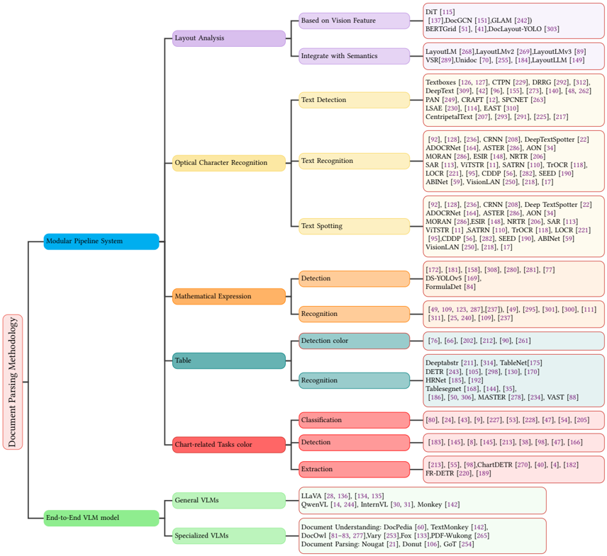
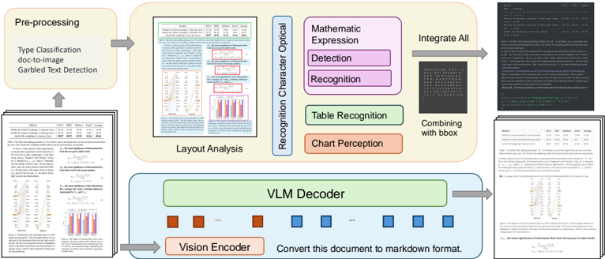
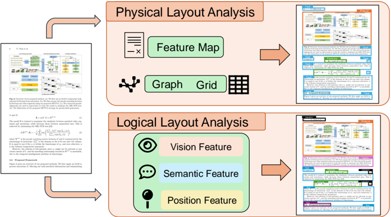
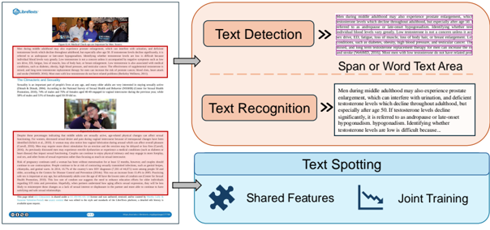
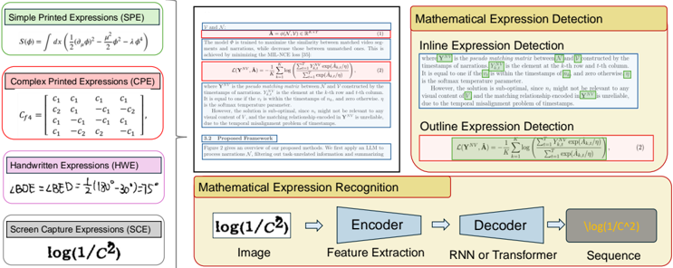
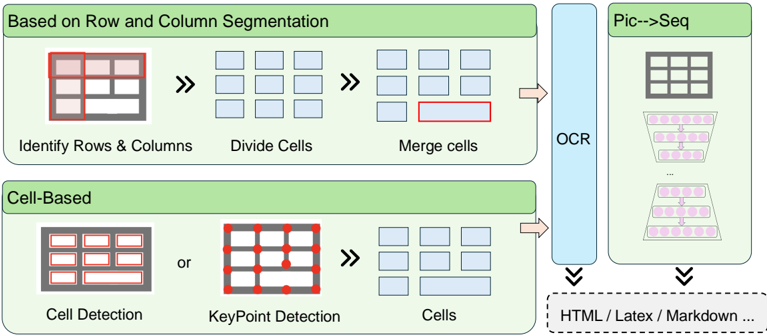
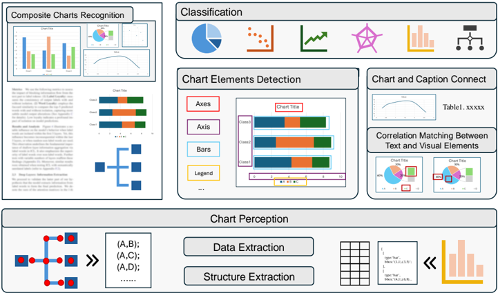

## Document Parsing Unveiled: Techniques, Challenges, and Prospects for Structured Data Extraction

QINTONG ZHANG ∗∗ ,

Peking University, China

BIN WANG ∗ , Shanghai Artificial Intelligence Laboratory, China

VICTOR SHEA-JAY HUANG, Beihang University, China

JUNYUAN ZHANG,

Shanghai Artificial Intelligence Laboratory, China

ZHENGREN WANG, Peking University, China

HAO LIANG,

Peking University, China

CONGHUI HE † , Shanghai Artificial Intelligence Laboratory, China

WENTAO ZHANG, Peking University, China

Document parsing is essential for converting unstructured and semi-structured documents-such as contracts, academic papers, and invoices-into structured, machine-readable data. Document parsing reliable structured data from unstructured inputs, providing huge convenience for numerous applications. Especially with recent achievements in Large Language Models, document parsing plays an indispensable role in both knowledge base construction and training data generation. This survey presents a comprehensive review of the current state of document parsing, covering key methodologies, from modular pipeline systems to end-to-end models driven by large vision-language models. Core components such as layout detection, content extraction (including text, tables, and mathematical expressions), and multi-modal data integration are examined in detail. Additionally, this paper discusses the challenges faced by modular document parsing systems and vision-language models in handling complex layouts, integrating multiple modules, and recognizing high-density text. It outlines future research directions and emphasizes the importance of developing larger and more diverse datasets.

CCS Concepts: · Computing methodologies → Natural language processing ; Computer vision .

Additional Key Words and Phrases: Document Parsing, Document OCR, Document Layout Analysis, Vision-language Model

## ACMReference Format:

Qintong Zhang, Bin Wang, Victor Shea-Jay Huang, Junyuan Zhang, Zhengren Wang, Hao Liang, Conghui He, and Wentao Zhang. 2024. Document Parsing Unveiled: Techniques, Challenges, and Prospects for Structured Data Extraction. J. ACM 1, 1 (April 2024), 42 pages. https://doi.org/XXXXXXX.XXXXXXX

- ∗ Authors contributed equally to this research.The work is done during an internship at Shanghai Artifcial Intelligence Laboratory.

† Conghui He is the corresponding author.

Authors' addresses: Qintong Zhang, Peking University, Beijing, China, zhangqintong@pjlab.org.cn; Bin Wang, Shanghai Artificial Intelligence Laboratory, Shanghai, China, wangbin@pjlab.org.cn; Victor Shea-Jay Huang, Beihang University, Beijing, China, jeix782@gmail.com; Junyuan Zhang, Shanghai Artificial Intelligence Laboratory, Shanghai, China, junyuanpk@gmail.com; Zhengren Wang, Peking University, Beijing, China, wzr@stu.pku.edu.cn; Hao Liang, Peking University, Beijing, China, hao.liang@stu.pku.edu.cn; Conghui He, Shanghai Artificial Intelligence Laboratory, China, heconghui@pjlab. org.cn; Wentao Zhang, Peking University, China, wentao.zhang@pku.edu.cn.

Permission to make digital or hard copies of all or part of this work for personal or classroom use is granted without fee provided that copies are not made or distributed for profit or commercial advantage and that copies bear this notice and the full citation on the first page. Copyrights for components of this work owned by others than ACM must be honored. Abstracting with credit is permitted. To copy otherwise, or republish, to post on servers or to redistribute to lists, requires prior specific permission and/or a fee. Request permissions from permissions@acm.org.

- © 2024 Association for Computing Machinery.

Manuscript submitted to ACM

Manuscript submitted to ACM

## 1 INTRODUCTION

As digital transformation accelerates, electronic documents have increasingly replaced paper as the primary medium for information exchange across various industries. This shift has broadened the diversity and complexity of document types, including contracts, invoices, and academic papers. Consequently, there is a growing need for efficient systems to manage and retrieve information [104, 275]. However, many historical records, academic publications, and legal documents remain in scanned or image-based formats, posing significant challenges to tasks such as information extraction, document comprehension, and enhanced retrieval [18, 219, 258].

To address these challenges, document parsing (DP), also known as document content extraction, has become an essential tool for converting unstructured and semi-structured documents into structured information. Document parsing extracts elements like text, equations, tables, and images from various inputs while preserving their structural relationships. The extracted content is then transformed into structured formats such as Markdown or JSON, facilitating integration into modern workflows [68].

Document parsing is crucial for document-related tasks, reshaping how information is stored, shared, and applied across numerous applications. It underpins various downstream processes, including the development of RetrievalAugmented Generation (RAG) systems and the automated construction of electronic storage and retrieval libraries [129, 147, 283, 299]. Moreover, document parsing technology can effectively extract and organize rich knowledge, laying a solid foundation for the development of next-generation intelligent systems, such as more advanced multimodal models [239, 258].

Recent years have seen significant advancements in document parsing technologies, particularly those based on deep learning, leading to a proliferation of tools and promising parsers. However, research in this field still faces limitations. Many existing surveys are outdated, resulting in pipelines that lack rigor and comprehensiveness, with technological descriptions failing to capture recent advancements and changes in application scenarios [18, 219]. High-quality reviews often focus on specific sub-technologies within document parsing, such as layout analysis [19, 159], mathematical expression recognition [2, 108, 199], table structure recognition [101, 154, 161], and chart-related work [45], without providing a comprehensive overview of the entire process.

Given these limitations, a comprehensive review of document parsing is urgently needed. This survey analyzes advancements in document parsing from a holistic perspective, providing researchers and developers with a broad understanding of recent developments and future directions. The key contributions of this survey are as follows:

- Comprehensive Review of Document Parsing. This paper systematically integrates and evaluates recent advancements in document parsing technologies across the stages of the parsing pipeline.
- Holistic Insight for Researchers and Practitioners. This work provides a holistic perspective on the current state and future directions of document parsing, bridging the gap between academic research and practical applications.
- Introductory Guide for Newcomers. It serves as a guide for newcomers to quickly understand the field's landscape and identify promising research directions.
- Consolidation of Datasets and Evaluation Metrics. We consolidate widely used datasets and evaluation metrics, addressing gaps in existing reviews within the field.

The paper is organized as follows: Section 2 provides an overview of the two main approaches to document parsing. From Section 3 to Section 6.3, we study the key algorithms used in modular document parsing systems. Section 7 introduces vision-language models suitable for document-related tasks, with a focus on document parsing and OCR.

Fig. 1. Overview of Document Parsing Methodology.

Section 9 discusses current challenges in the field and highlights important future directions. Finally, Section 10 provides a concise and insightful conclusion. The appendix of the survey provides a detailed summary of datasets and metrics related to document parsing.

## 2 METHODOLOGY

Our taxonomy is primarily based on two different document parsing strategies, as illustrated in Figure 1. Specifically, this paper is organized around two primary document parsing approaches, as shown in Figure 2. Document parsing can generally be divided into two methods: modular pipeline systems and end-to-end approaches utilizing large vision-language models [288].

Fig. 2. Two Methodology of Document Parsing.

## 2.1 Document Parsing System

2.1.1 Layout Analysis. Layout detection identifies structural elements of a document-such as text blocks, paragraphs, headings, images, tables, and mathematical expressions-along with their spatial coordinates and reading order. This foundational step is crucial for accurate content extraction. Mathematical expressions, especially inline ones, are often handled separately due to their complexity.

## 2.1.2 Content Extraction.

- Text Extraction : Utilizes Optical Character Recognition (OCR) to convert the text in document images into machine-readable text by analyzing character shapes and patterns.
- Mathematical Expression Extraction : Detects and converts mathematical symbols and structures into standardized formats like LaTeX or MathML, addressing the complexity of symbols and their spatial arrangements.
- Table Data and Structure Extraction : Involves recognizing table structures by identifying cell layouts and relationships between rows and columns. Extracted data is combined with OCR results and converted into formats such as LaTeX.
- Chart Recognition : Focuses on identifying different chart types and extracting underlying data and structural relationships, converting visual information into raw data tables or structured formats like JSON.
- 2.1.3 Relation Integration. This step combines extracted elements into a unified structure, using spatial coordinates from layout detection to preserve spatial and semantic relationships. Rule-based systems or specialized reading order models ensure the logical flow of content.

## 2.2 End-to-End Approaches and Multimodal Large Models

Traditional modular systems perform well in specific domains, but often face limitations in the performance and optimization of individual modules and generalization across multiple document types. Recent advances in multimodal large models, especially visual language models (VLMs), offer promising alternatives. Models such as GPT-4 and Manuscript submitted to ACM

Fig. 3. Overview of the Document Layout Analysis.

QwenVL process both visual and textual data, enabling end-to-end conversion of document images into structured outputs. Specialized models such as Nougat, Fox, and GOT address the unique challenges of document images, such as dense text and complex layouts, and represent significant progress in automated document parsing and understanding.

## 3 DOCUMENT LAYOUT ANALYSIS

Document layout analysis (DLA) for scanned images began in the 1990s, initially focusing on simple document structures as a preprocessing step. With the growing demand for parsing visually rich documents, DLA for complex layouts has become essential for document parsing. Various elements such as text segments, tables, formulas, and images can be detected and categorized through layout analysis. This step also provides crucial information like position and reading order, facilitating the integration of final recognition results. This section reviews and introduces recent key works related to DLA and the overview of the document layout analysis is shown in Figure 3.

## 3.1 Based on Visual Feature

Early deep learning approaches to DLA primarily focused on analyzing physical layouts using visual features from document images. Documents were treated as images, with elements such as text blocks, images, and tables detected and extracted through neural network architectures [79].

3.1.1 CNN-based Methods. The introduction of convolutional neural networks (CNNs) marked a significant advancement in document layout analysis (DLA). Initially designed for object detection, these models were later adapted for tasks such as page segmentation and layout detection. R-CNN, Fast R-CNN, and Mask R-CNN were particularly influential in detecting components like text blocks and tables [173]. Subsequent research improved the region proposal process and architecture to enhance page object detection [279]. Models such as fully convolutional networks (FCNs) and ARU-net were developed to handle more complex layouts [69, 256]. The YOLO series has also achieved leading results and widespread application in document layout analysis. DocLayout-YOLO [303] is a DLA algorithm known for

its high analysis accuracy and inference speed. It incorporatesthe the Global-to-Local Controllable Receptive Module (GL-CRM) based on YOLO-v10, enabling the model to effectively detect targets of varying scales.

- 3.1.2 Transformer-based Methods. Recent advances in Transformer models have extended their application in DLA. BEiT (Bidirectional Encoder Representation from Image Transformers), inspired by BERT, employs self-supervised pretraining to learn robust image representations, excelling at extracting global document features such as titles, paragraphs, and tables [16]. The Document Image Transformer (DiT), with its Vision Transformer (ViT)-like architecture, splits document images into patches to enhance layout analysis. However, these models are computationally intensive and require extensive pretraining [115]. Recent work, such as [1, 15], also focuses on using transformers for classification tasks based on document visual features.
- 3.1.3 Graph-based Methods. While image-based approaches have significantly advanced DLA, they often rely heavily on visual features, limiting their understanding of semantic structures. Graph Convolutional Networks (GCNs) address this issue by modeling relationships between document components, enhancing the semantic analysis of layouts [137, 289]. For instance, Doc-GCN improves understanding of semantic and contextual relationships among layout components [151]. GLAM, another prominent model, represents a document page as a structured graph, combining visual features with embedded metadata for superior performance [242].
- 3.1.4 Grid-Based Methods. Grid-based methods preserve spatial information by representing document layouts as grids, which aids in retaining spatial details [41, 51, 102, 302]. For instance, BERTGrid adapts BERT to represent layouts while maintaining spatial structures [51]. The VGT model integrates Vision Transformer (ViT) and Grid Transformer (GiT) modules to capture features at both token and paragraph levels. However, grid-based methods often face challenges such as large parameter sizes and slow inference speeds, limiting their practical application [41].

## 3.2 Integrate with Semantic Information

As document analysis becomes more complex, physical layout analysis alone is insufficient. Although models like YOLO v8 are effective for layout analysis in some languages based on graphemes [3], DLA methods that integrate semantic information remain a key area of development. Logical layout analysis is needed to classify document elements by their semantic roles, such as titles, charts, or footers. With the rise of multimodal models, methods that combine visual, textual, and layout information have gained prominence in DLA research.

Logical layout analysis, driven by the need to classify document elements based on their semantic roles, has led to the development of multimodal models that integrate text and layout information for more comprehensive analysis. Studies have explored multimodal data integration by combining supervised learning with pre-trained natural language processing (NLP) or computer vision (CV) models. For example, LayoutLM was the first model to fuse text and layout information within a single framework, using the BERT architecture to capture document features through text, positional, and image embeddings [268].

[255] extended this by combining RoBERTa with GCNs to capture relational layout information from both text and images. [289] introduced a multi-scale adaptive aggregation module to fuse visual and semantic features, producing an attention map for more accurate feature alignment.

Self-supervised pretraining in multimodal NLP has also significantly advanced the field. During pretraining, models jointly process text, images, and layout information using a unified Transformer architecture, enabling them to learn Manuscript submitted to ACM

DLA Result

Men during middle adulthood may also experience prostate enlargement, which can interfere with urination, and deficient testosterone levels which decline throughout adulthood, but especially after age 50. If testosterone levels decline significantly, it is referred to as andropause or late-onset hypogonadism. Identifying whether testosterone levels are low is difficult because individual blood levels vary greatly. Low testosterone is not a concern unless it accompanied by negative symptoms such as low sex drive, ED, fatigue, loss of muscle, loss of body hair, or breast enlargement. Low testosterone is also associated with medical conditions, such as diabetes, obesity, high blood pressure, and testicular cancer. The effectiveness of supplemental testosterone is mixed, and long term testosterone replacement therapy for men can increase the risk of prostate cancer, blood clots, heart attack and stroke (WebMD, 2016). Most men with low testosterone do not have related problems (Berkeley Wellness, 2011).

......

Despite these percentages indicating that middle adults are sexually active, age-related physical changes can affect sexual functioning. For women, decreased sexual desire and pain during vaginal intercourse because of menopausal changes have been identified (Schick et al., 2010). A woman may also notice less vaginal lubrication during arousal which can affect overall pleasure (Carroll, 2016). Men may require more direct stimulation for an erection and the erection may be delayed or less firm (Carroll, 2016). As previously discussed men may experience erectile dysfunction or experience a medical conditions (such as diabetes or heart disease) that impact sexual functioning. Couples can continue to enjoy physical intimacy and may engage in more foreplay, oral sex, and other forms of sexual expression rather than focusing as much on sexual intercourse. Risk of pregnancy continues until a woman has been without menstruation for at least 12 months, however, and couples should continue to use contraception. People continue to be at risk of contracting sexually transmitted infections, such as genital herpes, chlamydia, and genital warts. In 2014, 16.7% of the country's new HIV diagnoses (7,391 of 44,071) were among people 50 and older, according to the Centers for Disease Control and Prevention (2014e). This

OCR Result

Fig. 4. Overview of the Optical Character Recognition.

cross-modal knowledge from various document types. This approach improves model versatility, requiring minimal supervision for fine-tuning across different document types and styles.

In 2020, [184] proposed a multimodal document pre-training framework that encodes information from multi-page documents end-to-end, incorporating tasks such as document topic modeling and random document prediction. This framework enables models to learn rich representations of images, text, and layout. Notable work, such as UniDoc [70] uses a Transformer and ResNet-50 architecture to extract linguistic and visual features, aligned through a gated cross-modal attention mechanism.

Advancements include LayoutLMv2 and LayoutLMv3, which refine LayoutLM by optimizing the fusion of text, image, and layout information. These models improve feature extraction through deeper multimodal interactions and masking mechanisms, achieving more efficient and comprehensive document analysis [89, 269]. Additionally, LayoutLLM [149] attempts to use a large language model to integrate certain semantic information to complete tasks related to document layout.

## 4 OPTICAL CHARACTER RECOGNITION

Optical Character Recognition (OCR) is a critical research area in computer vision and pattern recognition. It focuses on identifying text in visual data and converting it into editable digital formats for further analysis and organization.

In the context of documents, OCR applies general OCR technology to the document field. It typically involves two stages: text detection and text recognition. Initially, text is localized within an image, and then recognition algorithms convert the identified text into computer-readable characters. When OCR combines both text detection and recognition, it is known as text spotting. This section discusses these three crucial technical aspects of OCR and the overview of OCR is shown in Figure 4.

## 4.1 Text Detection

Deep learning-based text detection algorithms, which build upon object detection and instance segmentation techniques, can be categorized into four main approaches: one-stage regression-based methods, two-stage region proposal methods, instance segmentation-based methods, and hybrid methods.

- 4.1.1 Regression-Based Single-Stage Methods. These methods, also known as direct regression methods, directly predict the corner coordinates or aspect ratios of text boxes from specific points in the image, bypassing multi-stage candidate region generation and subsequent classification. Examples include TextBoxes [127], TextBoxes++ [126], SegLink [224], and DRRG [292], which focus on handling irregular text boxes with varying aspect ratios and offsets.
- 4.1.2 Region Proposal-Based Two-Stage Methods. These methods treat text blocks as specific detection targets, utilizing two-stage object detection techniques like Fast R-CNN and Faster R-CNN. Their goal is to generate candidate boxes optimized for text, improving detection accuracy for arbitrarily oriented text [85, 309].
- 4.1.3 Segmentation-Based Methods. Text detection can also be approached as an image segmentation problem, where pixels are classified to identify text regions. This method is flexible in handling various text shapes and orientations. Early approaches [48] used fully convolutional networks (FCNs) to detect text lines, with subsequent work enhancing accuracy through character-level detection [12], instance segmentation [48], and other improvements [230, 263].
- 4.1.4 Hybrid Methods. Hybrid methods combine the strengths of regression and segmentation techniques to capture both global and local text details, enhancing localization accuracy while reducing the need for extensive post-processing. EAST [310] employs position-aware non-maximum suppression (PA-NMS) to optimize detection at different scales. Recent methods like CentripetalText [207] use centripetal shifts for better text localization. Additionally, innovations such as graph networks and Transformer architectures [291, 293] further enhance detection capabilities by leveraging adaptive boundary proposals and attention mechanisms.

In conclusion, text detection has advanced significantly, leveraging improvements in object detection, segmentation, and novel architectural innovations, making it a robust tool for various applications.

## 4.2 Text Recognition

Text recognition is a crucial component of Optical Character Recognition (OCR) and can be categorized into three main groups: vision feature-based methods, connectionist temporal classification (CTC) loss-based methods, and sequence-to-sequence (seq2seq) techniques.

## 4.2.1 Vision Feature-Based OCR Technology.

- Image Feature-Based Methods: Recent advancements leverage image processing, particularly Convolutional Neural Networks (CNNs), to capture spatial features from text images. These methods localize and recognize characters without traditional feature engineering, deriving features directly from images [92, 246]. They simplify model design and are effective for regular, simple text images. The CA-FAN model [128] enhances accuracy using a character attention mechanism. TextScanner [236] combines CNNs with Recurrent Neural Networks (RNNs) to improve character segmentation and positioning accuracy.
- CTC Loss-Based Methods: The connectionist temporal classification (CTC) loss function addresses sequence alignment and is a classic solution for text recognition. It calculates probabilities for all possible alignment paths, handling variable-length text without explicit input-output sequence alignment during training. CRNN [208]

is a classic application of CTC, with further developments like Deep TextSpotter [22] and ADOCRNet [164]. However, CTC struggles with extended text and contextual nuances, affecting computational complexity and real-time performance.

- Sequence-to-Sequence Methods: Seq2seq techniques use an encoder-decoder architecture to encode input sequences and generate outputs, managing long-distance dependencies through attention mechanisms for endto-end training. Traditional approaches employ RNNs and CNNs to convert image features into one-dimensional sequences, processed by attention-based decoders. Challenges arise with arbitrarily oriented and irregular texts
- when using Transformer-based architectures. To address these, models use input correction and two-dimensional feature maps. Spatial Transformer Networks (STNs) rectify text images into rectangular, horizontally aligned characters [148, 286]. Other models directly extract characters from 2D space to accommodate irregular and multi-directional text [34, 110, 113]. With the advent of the Vision Transformer architecture, there has been a shift from traditional CNN and RNN models to encoder-decoder systems based on attention mechanisms, such as ViTSTR [11] and TrOCR [118]. Some Transformer-based solutions focus on 2D geometric position information for irregular or elongated text sequences to enhance performance [27, 218, 221, 305].
- 4.2.2 Incorporation of Semantic Information. Text recognition is traditionally viewed as a visual classification task, but the integration of semantic information and contextual understanding can greatly benefit text recognition, especially whendealing with irregular, blurred, or occluded text. Recent research emphasizes incorporating semantic understanding into text recognition systems, which can be roughly divided into three approaches: character-level semantic integration, enhancement through dedicated semantic modules, and training improvements to improve contextual awareness.
- Character-Level Semantic Integration: Enhancing OCR performance with character-level semantic information involves leveraging character-related features, such as counts and orders. The RF-L (Reciprocal Feature Learning) framework proposed by [95] highlights the benefit of using implicit labels, such as text length, for improved recognition. RF-L incorporates a counting task (CNT) to predict character frequencies, aiding the recognition task. Similarly, [56] presents a context-aware dual-parallel encoder (CDDP), using cross-attention and specialized loss functions to integrate sorting and counting modules.
- Enhancements Through Semantic Modules: While character-level semantic integration is valuable, some approaches focus on independent semantic modules to capture higher-level semantic features. These strategies align visual and semantic data via contextual relationships within specialized modules. SRN [282], for instance, introduces a Parallel Visual Attention Module (PVAM) and a Global Semantic Reasoning Module (GSRM) to align 2D visual features with characters, transforming character features into semantic embeddings for global reasoning. Similarly, SEED [190] adds a semantic module between the encoder and decoder, enhancing feature sequences through semantic transformations. ABINet [59] refines character positions through iterative feedback, using a separately trained language model for contextual refinement.
- Training Advancements for Contextual Awareness: Pre-training strategies adapted from natural language processing (NLP), such as BERT, have played a pivotal role in enhancing context-awareness in OCR tasks. Methods like VisionLAN [250] use masking to improve contextual understanding, introducing a Masked Language Perception Module (MLM) and a Visual Reasoning Module (VRM) for parallel reasoning. Similarly, Text-DIAE [218] applies degradation methods like masking, blurring, and noise addition during pre-training to improve OCR

capabilities. PARSeq [17] modifies Permutation Language Modeling (PLM) to enhance text recognition by reordering encoded tags for better contextual sequences. While these pre-training approaches improve semantic learning, they often increase computational complexity and resource demands.

## 4.3 Text Spotting

Text spotting involves detecting and transcribing textual information from images, combining the tasks of text detection and recognition. Traditionally, these tasks were handled independently: a detector identified text regions, followed by a recognition module to transcribe the detected text. While this approach is conceptually straightforward, separating detection and recognition can limit performance, as the accuracy of the overall system heavily depends on the precision of the detection model.

Recent advancements in deep learning have shifted the focus toward end-to-end models that integrate detection and recognition tasks. These models improve efficiency and accuracy by sharing feature representations and eliminating the need for separate processing stages. End-to-end text spotting models can be broadly categorized into two types: twostage and one-stage methods. While both approaches have been explored, recent research has increasingly emphasized one-stage methods.

- Two-Stage Methods: Two-stage methods integrate text detection and recognition architectures, enabling joint training and feature alignment. These approaches typically share feature representations between detection and recognition tasks, often through shared convolutional layers, and link the tasks using a Region of Interest (RoI) mechanism. In this framework, the detection phase identifies potential text regions, which are then mapped onto the shared feature map for transcription during the recognition phase.

The earliest two-stage methods combined a single-scan text detector with a sequence-to-sequence recognizer using rectangular RoIs [112]. Subsequent improvements targeted multi-directional text detection using similar architectures [22]. However, rectangular RoIs are primarily suited for structured text layouts and can struggle with irregular or curved text, leading researchers to develop more flexible RoI mechanisms. For instance, RoIRotate [138] and RoIAlign [125, 153] were introduced to better handle arbitrary text shapes.

Notable advancements include Mask TextSpotter v1, which was the first fully end-to-end OCR system, enabling feedback between detection and recognition during joint training. Mask TextSpotter v3 [125] advanced this approach by incorporating a Segmentation Proposal Network (SPN) to represent text regions more flexibly. Other innovations in RoI mechanisms include:

Innovations in RoI mechanisms include TextDragon's [61] RoLSide operator, which extracts and aligns arbitrary text regions, and BezierAlign in ABCNet [139], which adapts to text contours rather than rectangular boundaries. PAN++ [248] uses a masked region of interest attention recognition head to balance accuracy and speed, while SwinTextSpotter [86] introduced a mechanism for detection-informed recognition. In 2022, GLASS [195] proposed Rotated-RoIAlign to enhance text feature extraction from shared backbones, addressing challenges posed by varying text sizes and orientations through a global attention module.

While two-stage methods have achieved significant progress, they have inherent limitations. Their reliance on precise detection results places high demands on the detection module and requires high-quality annotated datasets. Additionally, RoI operations and post-processing steps can be computationally expensive, particularly for handling arbitrary or complex text shapes.

- One-Stage Methods: One-stage methods unify text detection and recognition into a single architecture, eliminating the need for separate modules. By sharing loss functions, these methods enable joint training and optimization of both tasks, reducing potential performance losses caused by modular separation.
- The first one-stage approach, proposed by [266], introduced Convolutional Character Networks, which detect characters as fundamental units and predict character boundaries and labels without requiring RoI cropping. While effective for English text, this method was computationally intensive. CRAFTS [13] extended this characterbased approach by integrating detection results into an attention-based recognizer, propagating recognition loss across the network.

Subsequent developments, such as [188], incorporated Shape Transformer Modules to optimize end-to-end detection and recognition, while MANGO [187] employed a position-aware mask attention module to apply attention weights directly to character sequences. Recent encoder-decoder models have further evolved, with PGNet [245] and PageNet [177] decoding feature maps into sequences, while the SPTS series [143, 178] and TESTR [296] adopted Transformer-based architectures.

More recent innovations leverage CLIP-based models [284], which enhance collaboration between image and text embeddings for improved accuracy. In [257], a Transformer-based framework called TransDETR was introduced for video text spotting, simplifying the tracking and recognition of text across time, which could also benefit document text spotting tasks.

While one-stage models demonstrate versatility and improved accuracy, they often involve more complex training processes compared to two-stage models. Additionally, they may not perform as effectively in specialized text-processing tasks that require high precision or domain-specific adaptations.

## 5 MATHEMATICAL EXPRESSION DETECTION AND RECOGNITION

Mathematical expressions play a crucial role in documents across various domains, including education and industries like finance. They often encapsulate key information but also represent one of the most challenging aspects of document recognition.

Theprocessing of mathematical expressions in documents typically involves two main steps: detection and recognition. In this process, the position of the expression is first identified, after which the rendered or handwritten expression is converted into a structured format, such as LaTeX or Markdown.

Mathematical expressions in documents can appear in two forms: displayed expressions and in-line expressions. Displayed expressions are visually distinct from the surrounding text and are easier to detect using document layout analysis. In contrast, in-line expressions are embedded within text lines, making them more difficult to identify due to their close proximity to regular text. Detecting in-line expressions requires specialized techniques to differentiate them from surrounding content.

The challenge of recognizing printed mathematical expressions dates back to the 1960s [5], when initial efforts were made to convert images of mathematical expressions into structured code or tags. Unlike standard text, mathematical expressions are inherently complex due to their large symbol set, two-dimensional arrangement, and context-dependent semantics.

This section focuses on research related to the offline detection and recognition of mathematical expressions and the algorithm overview is shown in Figure 5.

Fig. 5. Overview of the Mathematical Expression Detection and Recognition.

## 5.1 Mathematical Expression Detection

5.1.1 Early Work and Convolutional Neural Networks. Initial efforts in mathematical expression detection (MED) employed convolutional neural networks (CNNs) to locate mathematical expressions. Studies like [65, 120, 279] combined CNNs with traditional feature extraction methods to create bounding boxes for identifying expressions. However, these models lacked true end-to-end detection capabilities, limiting their generalization and performance. The Unet model, introduced in [172], aimed to provide end-to-end detection for printed documents, avoiding complex segmentation tasks. Although effective for detecting in-line expressions, it struggled with noise robustness.

5.1.2 Based on Object Detection. MED has advanced through adaptations of general object detection algorithms into specialized forms, including both single-stage and two-stage approaches. Single-stage detectors, such as DS-YOLOv5 [169], utilized deformable convolutions and multi-scale architectures to enhance detection accuracy and speed. Similarly, the Single Shot MultiBox Detector (SSD) [158] accelerated computations using a sliding window strategy for scaleinvariant detection. The 2021 ICDAR competition highlighted innovations like the Generalized Focal Loss (GFL) to tackle class imbalance, leveraging feature pyramid networks to improve performance on small expressions.

Two-stage detectors, particularly R-CNN variants [280, 281], offer high accuracy but at the cost of computational speed. Techniques such as Faster R-CNN and Mask R-CNN have been enhanced with region proposal networks (RPNs) to boost performance [29, 247]. Although anchor-free methods like FCOS and DenseBox have emerged, their application to MED remains limited.

In addition to existing detection and segmentation algorithms, FormulaDet [84] redefines MED as an entity and relation extraction problem, effectively using context- and layout-aware networks. This integrated approach significantly improves the understanding and detection of complex formula structures.

## 5.2 Mathematical Expression Recognition

Mathematical Expression Recognition (MER) models often use encoder-decoder architectures to transform visual representations into structured formats like LaTeX. These models typically rely on CNN-based encoders, with recent Manuscript submitted to ACM

Document Parsing Unveiled: Techniques, Challenges, and Prospects for Structured Data Extraction advancements incorporating Transformer-based encoders. On the decoder side, RNN and Transformer architectures are frequently used, along with various performance-enhancing techniques to boost model effectiveness.

- 5.2.1 Encoder Strategies in MER. The primary role of MER encoders is to extract meaningful image features that capture the complexity of mathematical expressions. Traditional CNNs, known for their ability to capture local features, have been widely used. However, they often struggle with the multi-scale and intricate nature of mathematical expressions. Enhancements such as dense convolutional architectures and multi-directional scanning (e.g., MDLSTM) address these challenges by enriching spatial dependencies.
- Convolutional Approaches: Various convolutional architectures, such as DenseNet and ResNet, have been proposed to enhance feature extraction for MER [123, 287]. Recent advancements involve integrating CNNs with RNNs or positional encoding to better capture the structures of mathematical expressions, thereby improving spatial and contextual understanding [49, 109].
- Transformer Encoders: Recognizing the limitations of CNNs in managing long-range dependencies, newer models employ vision-based Transformers like the Swin Transformer [237]. These models excel in handling global context and complexity through self-attention mechanisms.
- 5.2.2 Decoder Approaches for MER. Decoding in MER involves sequential data processing similar to optical character recognition (OCR), using architectures like RNNs and Transformers. RNN-based decoders, enhanced with attention mechanisms, generate sequences that reflect the inherent order of the input [49, 295]. These models are adept at managing contextual dependencies, which are crucial for accurately handling nested and hierarchical expressions.

Advanced designs incorporate Gated Recurrent Units (GRUs) and attention mechanisms for efficient processing, addressing the complexities of intricate mathematical expression structures. Meanwhile, tree-structured and Transformerbased decoders overcome challenges related to vanishing gradients and computational overhead, enhancing robustness in handling extensive formulaic notation [300, 301].

- 5.2.3 Other Improvement Strategies. Beyond advancements in encoder-decoder architectures, several strategies have emerged to enhance MER accuracy.
- Character and Length Hints: Incorporating character and length information helps manage diverse handwriting styles and sequence lengths, often embedded as supplementary clues within traditional frameworks [111, 311].
- Stroke Order Information: Utilizing stroke sequence data is particularly beneficial for online handwritten mathematical expressions, providing deeper insights into structural semantics [25, 240].
- Data Augmentation: Innovative data manipulation techniques, such as pattern generation and pre-training augmentation, are crucial for enhancing dataset robustness and model performance, mitigating architectural stagnation [109, 237].

## 6 TABLE DETECTION AND RECOGNITION

Tables provide structured data representation, facilitating a quick understanding of relationships and hierarchies. Accurate table detection and recognition are crucial for effective document analysis.

Table detection involves identifying and segmenting table areas within document images or electronic files. The goal is to locate tables and distinguish them from other content, such as text or images.

Manuscript submitted to ACM

Fig. 6. Overview of the Table Detection and Recognition.

With improvements in detection accuracy, research has shifted toward Table Structure Recognition. This involves analyzing the internal structure of tables after detection, including segmenting rows and columns, extracting cell content, and interpreting cell relationships into structured formats like LaTeX.

This section reviews target detection-based algorithms for table detection and discusses three deep learning-based table recognition methods from recent research. The algorithm overview is shown in Figure 6.

## 6.1 Table Detection Based on Object Detection Algorithms

Table detection (TD) is often approached as an object detection task, where tables are treated as objects, using models originally designed for natural images. Despite differences between page elements and natural images, one-stage, two-stage, and transformer-based models can achieve robust results with careful retraining and tuning, often serving as benchmarks for TD.

To adapt object detection for TD, various studies have enhanced standard methods. For instance, [76] integrates PDF features, like character coordinates, into CNN-based models. [66] customizes Faster R-CNN for document images by modifying representation and optimizing anchor points. [202] combines Deformable CNNs with Faster R-CNN to handle varying table scales, while [212] fine-tunes Faster R-CNN specifically for tables. [90] employs the YOLO series, enhancing anchor and post-processing techniques.

To address table sparsity, [261] expands SparseR-CNN with Gaussian Noise Augmented Image Size proposals and many-to-one label assignments, introducing the Information Coverage Score (ICS) to evaluate recognition accuracy.

## 6.2 Table Structure Recognition

Traditionally, table structure recognition depended on manual rules and heuristics, such as the Hough Transform for line detection and blank space analysis for unframed tables. These methods often struggled with complex layouts. Recent advancements have utilized algorithms from document layout and formula detection, improving table structure recognition through row and column segmentation, cell detection, and sequence generation methods. Manuscript submitted to ACM

TabNet [10] is a pioneering deep learning model for table feature extraction, handling both numerical and categorical features in an end-to-end fashion. It features an efficient and interpretable learning architecture, optimized for various tasks. TabNet's sequential attention mechanism allows the model to focus on relevant features progressively, using instance-level sparse feature selection and a multi-step decision process. This enhances TabNet's ability to explain feature importance at both local and global levels. Building on this, models like TabTransformer [87] have further advanced table feature extraction, providing valuable insights for developing robust table recognition models.

- 6.2.1 Methods Based on Row and Column Segmentation. A key challenge in table structure recognition is detecting individual cells, particularly in the presence of large blank spaces. Early deep learning approaches addressed this by segmenting tables into rows and columns. These algorithms generally adopt a top-down strategy, first identifying the overall table region and then segmenting it into rows and columns. This method is effective for tables with clear boundaries and simple layouts.
- Row and Column Detection: Initially, table structure recognition was seen as an extension of table detection, primarily using object detection algorithms to identify table bounding boxes. Segmentation algorithms then established relationships between rows and columns. Convolutional neural networks (CNNs) and transformer architectures were pivotal in this context [211, 314]. Transformers, such as DETR, excel at recognizing global relationships within an image, enhancing generalization. Innovations include row and column segmentation through transformer queries [71] and a dynamic query enhancement model, DQ-DETR [243]. Additionally, Bi-directional Gated Recurrent Units (Bi-GRUs) effectively
- captured row and column separators by scanning images bidirectionally [105].
- Fusion Module: Earlier methods focused on detecting table lines but often overlooked complex inter-cell relationships. Advanced algorithms now estimate merging probabilities between cells to improve recognition accuracy in tables without explicit row and column lines. For example, embedding modules integrate plain text within grid contexts to guide merge predictions via GRU decoders [298]. Other techniques use adjacency criteria and spatial compatibility to predict cell mergers [130]. The integration of global computational models, such as Transformers, further enhances the analysis of complex tables [170].

CNNs remain foundational for feature extraction in table images, although recent efforts aim to optimize architectures for table-specific characteristics. For example, replacing ResNet18 with ShuffleNetv2 significantly reduced model parameters [294]. Despite progress, challenges persist in tables that lack explicit lines, such as those with sparse content or irregular arrangements.

- 6.2.2 Methods Based on Cells. Cell-based methods, characterized as bottom-up approaches, construct tables by detecting individual cells and merging them based on visual or textual relationships. These methods typically involve two stages: detecting cell boundaries and subsequently associating cells to form the overall table structure, offering advantages in handling complex tables and minimizing error propagation.

Early enhancements focused on improving cell keypoint detection and segmentation accuracy. For example, HRNet served as a backbone for high-resolution feature representation in tasks such as multi-stage instance segmentation [185]. Some approaches introduced new loss terms to enhance detection, including continuity and overlap loss [192]. Others developed dual-path models to learn local features and optimize table segmentation [168].

Vertex prediction, which focuses on the corners of cells, proved beneficial for addressing deformed cells resulting from angles or perspectives. Techniques like the Cycle-Pairing Module simultaneously predicted centers and vertices of cells [144]. Representing tables as graph structures enabled a more nuanced understanding, employing Graph Neural Manuscript submitted to ACM

Networks (GNNs) to model complex relationships [35]. These methods effectively improved upon the limitations of traditional grid-based approaches in capturing intricate cell relationships.

Graph-based methods leverage cell characteristics by treating tables as graphs, where cells represent vertices and relationships signify edges. This approach allows for comprehensive modeling of adjacency relationships, positioning GNNs as powerful tools for managing complex tables [186].

While effective, cell-based methods can be computationally demanding, as they involve independent detection and classification for each cell. Errors occurring at this stage can significantly affect the final table structure.

6.2.3 Image-to-Sequence Approaches. Building on advancements in OCR and formula recognition, image-to-sequence methods convert table images into structured formats such as LaTeX, HTML, or Markdown. Encoder-decoder frameworks utilize attention mechanisms to encode table images into feature vectors, which decoders subsequently transform into descriptive text sequences.

Early efforts by [50] implemented encoder-decoder architectures to translate images from scientific papers into LaTeX code. Subsequent models refined these techniques with dual-decoder architectures, enabling concurrent handling of structural and textual information [306]. The MASTER architecture, adapted for scene text recognition, effectively distinguished between structural elements and positional information [278].

Recent advancements propose designing Transformer architectures specifically for scientific tables, enhancing robustness against the complex features found in particular contexts, such as medical reports [234]. Solutions like the VAST framework have demonstrated improved accuracy by employing dual-decoders for managing both HTML and coordinate sequences [88].

These methods offer significant advantages in processing complex tables, though challenges remain in training models to capture diverse table structures without error propagation.

## 6.3 Chart Perception

6.3.1 Introduction to Tasks Related to Charts in Documents. Charts in documents serve as graphical representations that present data concisely and intuitively, making it easier to visualize patterns, trends, and relationships. Common chart types include line charts, bar charts, area charts, pie charts, and scatter plots, all essential for conveying key insights.

Tasks related to processing charts in documents typically involve several subtasks, such as chart classification, segmentation of composite charts, title matching, chart element identification, and data and structure extraction, as illustrated in Figure 7.

The main challenges in chart recognition focus on extracting chart information-identifying and understanding visually represented data, converting it into structured formats like tables or JSON, and supporting downstream tasks such as chart reasoning. Additionally, there is significant potential for research in content extraction from charts like flowcharts, structure diagrams, and mind maps.

This section provides a comprehensive and concise overview of tasks related to charts in documents.

## 6.4 Chart Classification

Chart classification involves categorizing different chart types based on their visual characteristics and representational forms. This process aims to accurately identify charts-such as bar charts, pie charts, line charts, scatter plots, and heat Manuscript submitted to ACM

Fig. 7. Overview of the Chart-related Tasks in Document.

maps-either manually or through automation. A significant challenge is the diversity of chart types and their often subtle visual distinctions, which complicates automatic differentiation [53].

The success of AlexNet in the 2015 ImageNet competition led to the widespread use of deep learning models, particularly convolutional neural networks (CNNs), in image classification, including chart classification [9, 43, 228]. Despite these advances, CNN-based models often struggle with noisy or visually similar charts. To address these challenges, Vision Transformers have emerged as a promising solution. In the 2022 chart classification competition, a pre-trained Swin Transformer outperformed other models [47]. The Swin Transformer, with its hierarchical structure and local window attention mechanism, effectively manages both global and local image features, excelling in handling complex charts [53]. The Swin-Chart model [54], which incorporates a fine-tuned Swin Transformer, further enhanced performance through a weight-averaging strategy. Additionally, [205] proposed a coarse-to-fine curriculum learning strategy, significantly improving the classification of visually similar charts.

## 6.5 Chart Detection and Element Recognition

6.5.1 Recognition of Composite Charts. Composite charts compile multiple sub-charts within a single frame, each with distinct data. Separating these components allows for more accurate feature extraction. Segmentation algorithms based on geometric features and pixel contours continue to be crucial [8]. Viewing segmentation as an object detection task, approaches like YOLO and Faster R-CNN enable simultaneous detection of sub-charts and their elements [32, 145].

6.5.2 Detection of Chart Elements. Charts contain both text and visual elements, which are essential for conveying information. Key tasks include detecting text and classifying it into categories like titles and labels. Algorithms for text detection in charts often use semi-automatic systems with user input to identify important elements such as axis Manuscript submitted to ACM

labels [38, 98, 200, 213]. Traditional systems like Microsoft OCR and Tesseract OCR, although limited in precision, remain widely used [182, 213]. Visual elements are detected similarly to text, with deep learning models increasingly replacing rule-based methods. The 2023 Context-Aware system utilizes Faster R-CNN to detect elements like legends and data points, relying on a Region Proposal Network [267].

- 6.5.3 Correlation Matching Between Text and Visual Elements. Linking text to corresponding visual elements is critical for interpreting chart data. Early methods were rule-based, focusing on positional relationships [39, 43]. Recent advancements, such as the Swin Transformer-based method introduced in 2022, have refined these techniques, offering improved correlation matching through transformer architectures [47, 166].
- 6.5.4 Chart Structure Extraction. Extracting structural information from charts, such as flowcharts and tree diagrams, requires detecting components like cell boxes and connecting lines. Research on flowchart structure extraction has focused on both hand-drawn and machine-generated charts [23, 196]. Recent models, such as FR-DETR [220], combine DETR and LETR to simultaneously detect symbols and edges, enhancing accuracy. However, challenges remain, especially with complex connecting lines, as highlighted by [189], which focuses on organizational charts using a two-stage method for line detection.

## 7 LARGE MODELS FOR DOCUMENT PARSING: OVERVIEW AND RECENT ADVANCEMENTS

Document Extraction Large Models (DELMs) utilize Transformer-based architectures to convert multimodal information from documents (e.g., text, tables, images) into structured data. Unlike traditional rule-based systems, DELMs integrate visual, linguistic, and structural information, enhancing document structure analysis, table extraction, and crossmodal associations. These capabilities make DELMs suitable for end-to-end document parsing, supporting deeper understanding for downstream tasks.

With advancements in Multimodal Large Language Models (MLLMs), particularly Visual-Language Models (LVLMs), processing complex multimodal inputs such as documents and web pages has become more effective. However, challenges remain in efficiently handling academic and professional documents, especially in OCR and detailed document structure extraction. The following sections explore the evolution of DELMs, highlighting solutions to these challenges and illustrating how each model builds on previous efforts.

## 7.1 Early Developments in Document Multimodal Processing

Initial models like Qwen-VL [14] and InternVL [31] focused on understanding multimodal content (images and text) in documents. These models laid the groundwork for large-scale document analysis by training on extensive datasets. However, their general-purpose image understanding was insufficient for complex academic and professional documents, which require domain-specific tasks like OCR and detailed structure analysis. While effective at visual content comprehension, they lacked the granularity needed for text-heavy documents, such as technical reports or academic papers.

To bridge this gap, models like DocOwl1.5 [82] and Qwen2VL [244] were fine-tuned on document-specific datasets. Enhancements to the CLIP-ViT architecture improved performance in document-related tasks. Techniques such as sliding windows, used by models like Ureader [277] and TextMonkey [142], segmented large, high-resolution documents, enhancing OCR accuracy. However, these early models still struggled with aligning extensive textual and visual information, as seen with the GOT model [68], where a focus on visual reasoning conflicted with fine-grained text extraction.

Manuscript submitted to ACM

## 7.2 Advancements in OCR and End-to-End Document Parsing

In 2023, Nougat [21] represented a significant advancement as the first end-to-end Transformer model for academic document processing. Built on Donut, with a Swin Transformer encoder and mBART [36] decoder, Nougat enabled direct conversion of academic documents into Markdown format. This innovation integrated mathematical expression recognition and page relationship organization, making it particularly suitable for scientific documents. Nougat shifted from modular OCR systems that separately handled text extraction, formula recognition, and page formatting. However, it faced limitations with non-Latin scripts and slower conversion speeds due to high computational demands.

While Nougat addressed many shortcomings of previous models, its focus on academic documents left room for improvement in areas like fine-grained OCR tasks and chart interpretation. Vary [252] emerged to tackle these challenges by improving chart and document OCR. Vary expanded the visual vocabulary by integrating a SAM-style visual vocabulary, enhancing OCR and chart understanding without fragmenting document pages. However, Vary still struggled with language diversity and multi-page documents, highlighting the ongoing need for more specialized models.

## 7.3 Handling Multi-Page Documents and Fine-Grained Tasks

In 2024, Fox [133] introduced a novel approach for multi-page document understanding and fine-grained tasks. By leveraging multiple pre-trained visual vocabularies, such as CLIP-ViT and SAM-style ViT, Fox enabled simultaneous processing of natural images and document data without modifying pretrained weights. Fox employed hybrid data generation strategies that synthesized datasets with textual and visual elements, improving performance in tasks like cross-page translation and summary generation. This model addressed earlier DELMs' limitations with complex, multi-page document structures.

Although Fox excelled in multi-page document processing, its approach to hierarchical document structures was further refined by models like Detect-Order-Construct [241]. This model introduced a tree-construction-based method for hierarchical document analysis, dividing the process into detection, ordering, and construction stages. By detecting page objects, assigning logical roles, and establishing reading order, the model reconstructed hierarchical structures for entire documents. This unified relation prediction approach outperformed traditional rule-based methods in understanding and reconstructing complex document structures.

## 7.4 Unified Frameworks for Document Parsing and Structured Data Extraction

The introduction of models like OmniParser [235] marked a shift toward unified frameworks combining multiple document processing tasks, such as text parsing, key information extraction, and table recognition. OmniParser's two-stage decoder architecture enhanced structural information extraction, offering a more interpretable and efficient method for managing complex relationships within documents. By decoupling OCR from structural sequence processing, OmniParser outperformed earlier task-specific models like TESTER and SwinTextSpotter in text detection and table recognition, while also reducing inference time.

In parallel, GOT [68], released in 2024, introduced a universal OCR paradigm by treating all characters (text, formulas, tables, musical scores) as objects. This approach enabled the model to handle a wide range of document types, from scene text OCR to fine-grained document OCR. GOT's use of a 5 million text-image pair dataset and its three-stage training strategy-pre-training, joint training, and fine-tuning-allowed it to surpass previous document-specific models

in handling complex charts, non-traditional content like musical scores, and geometric shapes. GOT represents a step toward a general OCR system capable of addressing the diverse content found in modern documents.

In conclusion, the evolution of DELMs has been marked by progressive advancements addressing specific limitations in earlier models. Initial developments improved multimodal document processing, while later models like Nougat and Vary advanced OCR capabilities and fine-grained extraction tasks. Models like Fox and Detect-Order-Construct further refined multi-page and hierarchical document understanding. Finally, unified frameworks like OmniParser and universal OCR models like GOT are paving the way for more comprehensive, efficient, and general-purpose document extraction solutions. These advancements represent significant strides in how complex documents are analyzed and processed, benefiting both academic and professional fields.

## 8 OPEN SOURCE TOOLS FOR DOCUMENT EXTRACTION

Table 1 highlights several open-source document extraction tools with over 1,000 stars on GitHub, designed to manage various document formats and conversion tasks.

Optical Character Recognition (OCR) is a crucial component of document processing and content extraction. It employs computer vision techniques to identify and extract text from documents, transforming images into editable and searchable data. Modern OCR tools have greatly improved in accuracy, speed, and multi-language support. Widely-used systems like Tesseract and PaddleOCR have significantly advanced this field. Tesseract, an open-source engine, provides robust text recognition and flexible configuration, making it effective for large-scale text extraction. PaddleOCR excels in multi-language capabilities, offering high accuracy and speed, particularly in complex scenarios.

While general-purpose tools such as Tesseract and PaddleOCR are highly effective for document OCR, specialized tools like Unstructured and Zerox excel in handling complex document structures, such as nested tables or those containing both text and images. These tools are particularly skilled at extracting structured information.

Beyond OCR, large models are increasingly utilized for document parsing. Recent models like Nougat, Fox, Vary, and GOT excel at processing complex documents, especially in PDF format. Nougat is tailored for scientific documents, proficient in extracting formulas and symbols. Fox integrates multi-modal information, enhancing semantic understanding and information retrieval. Vary specializes in parsing diverse formats, including those with embedded images, text boxes, and tables. GOT, a leading model in the OCR 2.0 era, uses a unified end-to-end architecture with advanced visual perception, enabling it to handle a wide range of content, such as text, tables, mathematical formulas, molecular structures, and geometric figures. It also supports region-level OCR, high-resolution processing, and batch operations for multi-page documents.

Additionally, large multi-modal models commonly used in image and language tasks, such as GPT-4, QwenVL, InternVL, and the LLaMA series, can also perform document parsing to some extent.

## 9 DISCUSSION

Both modular document parsing systems and Visual-Language Models (VLMs) face significant challenges and limitations in their current implementations. This section highlights these obstacles and explores potential directions for future research and development.

Challenges and Future Directions for Pipeline-Based Systems. Pipeline-based document parsing systems rely on the integration of multiple modules, which can lead to challenges in modular coordination, standardization of outputs, and handling irregular reading orders in complex layouts. For example, systems like MinerU require extensive pre-processing, Manuscript submitted to ACM

Table 1. A detailed list of Open Source Projects for Document Parsing

| Tools           | Developer          |    Time | Introduction                                                                                                                                                                            |
|-----------------|--------------------|---------|-----------------------------------------------------------------------------------------------------------------------------------------------------------------------------------------|
| GROBID          | Patrice Lopez      | 2011    | A machine learning library that focuses on extracting and restructuring original docu- ments, converting them into structured formats such as XML/TEI encoding.                         |
| PyMuPDF         | Jorj X. McKie      | 2011    | A Python library for extracting, analyzing, converting, and processing data from PDFs and other documents, supporting tables, figures, and other types of content.                      |
| doc2text        | Joe Sutherland     | 2016.9  | Specializes in extracting low-quality documents; only ensures compatibility in Linux.                                                                                                   |
| pdfplumber      | Jeremy Singer-Vine | 2019.1  | Tools for extraction and parsing of characters, images, lines, tables, and other elements from digital PDF documents.                                                                   |
| Parsr           | axa-group          | 2019.8  | A tool for cleaning, parsing, and extracting content from various document types, with outputs including JSON, Markdown, CSV/pandasDF, and txt formats.                                 |
| PP-StructureV2  | Baidu              | 2021.8  | Intelligent document analysis system, supports layout analysis of Chinese and English documents, table recognition, and semantic recognition.                                           |
| DocxChain       | Alibaba            | 2023.9  | A system for non-structured or semi-structured document conversion into various infor- mation and formats, including complex document applications based on computational capabilities. |
| pdf2htmlEX      | Lu Wang            | 2023.12 | A project to convert PDF documents into HTML format.                                                                                                                                    |
| MinerU          | OpenDataLab        | 2024.4  | A system for extracting content from PDF and converting it into markdown or JSON formats.                                                                                               |
| PDF-Extract-Kit | OpenDataLab        | 2024.7  | Asystem based on MinerU to extract various content from PDF, including layout analysis, OCR, table recognition, and formula recognition tasks.                                          |
| OmniParser      | Adithya S Kolavi   | 2024.6  | A platform for extracting and parsing any unstructured data, transforming it into struc- tured, actionable data optimized for GenAI applications.                                       |
| LLM_aided_ocr   | Jeff Emanuel       | 2024.8  | Uses Tesseract for document OCR, followed by LLM-based error correction, with final output in markdown or similar formats.                                                              |

intricate post-processing, and specialized training for each module to achieve accurate results. Many approaches still depend on rule-based methods for reading order, which are inadequate for documents with complex layouts, such as multi-column or nested structures. Furthermore, these systems often process documents page by page, limiting their efficiency and scalability.

The overall performance of pipeline systems is heavily dependent on the capabilities of individual modules. While advancements in these components have been made, several critical challenges persist:

- Document Layout Analysis: Accurately analyzing complex layouts with nested elements remains difficult. Future advancements should prioritize integrating semantic information to improve the understanding of fine-grained layouts, such as multi-level headings and hierarchical structures.
- Document OCR: Current OCR systems struggle with densely packed text blocks and diverse font styles (e.g., bold, italics). Balancing general OCR tasks with specialized tasks, such as table recognition, continues to be a challenge.
- Table Detection and Recognition: Detecting tables with unclear boundaries or those spanning multiple pages is particularly challenging. Additionally, recognizing nested tables, tables without visible borders, and cells containing multi-line text requires further improvement.
- Mathematical expression Recognition: Both inline and multi-line mathematical expressions remain difficult to detect and recognize. Structural extraction for printed expressions needs refinement, while robustness against noise, distortions, and varying font sizes in screen-captured expressions is still lacking. Handwritten mathematical

Manuscript submitted to ACM

expressions pose additional challenges. Current evaluation metrics for mathematical recognition are insufficient, necessitating more granular and standardized benchmarks.

- Diagram Extraction: Diagram parsing is an emerging field but lacks unified definitions and standardized transformation frameworks. Existing methods are often semi-automated or tailored to specific diagram types, limiting their applicability. End-to-end models show promise but require advancements in recognizing diagram elements, OCR integration, and understanding structural relationships. Although multi-modal large language models (MLLMs) demonstrate potential in handling complex diagram types, their integration into modular systems remains difficult.

Challenges and Future Directions for Large Visual Models. Large visual models (LVMs) offer end-to-end solutions, eliminating the need for complex modular connections and post-processing. They also demonstrate advantages in understanding document structures and producing outputs with greater semantic coherence. However, these models face their own set of challenges:

- Performance Limitations: Despite their capabilities, LVMs do not consistently outperform modular systems in tasks such as distinguishing page elements (e.g., headers, footers) or handling high-density text and intricate table structures. This limitation is partly due to insufficient fine-tuning for tasks involving complex documents and high-resolution content.
- Frozen Parameters and OCR Capabilities: Many LVMs freeze large language model (LLM) parameters during training, which restricts their OCR capabilities when processing extensive text. While these models excel at encoding document images, they often produce repeated outputs or formatting errors in long document generation. These issues could be mitigated through improved decoding strategies or regularization techniques.
- Resource Efficiency: Training and deploying large models is resource-intensive, and their inefficiency in processing high-density text leads to significant computational waste. Current methods for aligning image and text features are inadequate for dense formats, such as A4-sized documents. Although large models inherently require substantial parameters, architectural optimization and data augmentation could reduce their computational demands without compromising performance.

Beyond technical challenges, the field of document parsing often focuses on structured document types, such as scientific papers and textbooks, while more complex formats-like instruction manuals, posters, and newspapers-remain underexplored. This narrow scope limits the generalizability and applicability of current systems. Expanding the diversity of datasets for training and evaluation is essential to support advancements in handling a wider range of document types.

## 10 CONCLUSION

This paper offers a comprehensive overview of document parsing, focusing on both modular systems and large models. It examines datasets, evaluation metrics, and open-source tools, while highlighting current limitations in the field. Document parsing technology is gaining interest due to its diverse applications, including retrieval-augmented generation (RAG), information storage, and serving as a source of training data. Although modular systems are commonly used, end-to-end large models hold significant promise for future advancements. Document parsing is expected to become more accurate, multilingual, and adaptable to various OCR tasks in the future.

## REFERENCES

- [1] Abdelrahman Abdallah, Daniel Eberharter, Zoe Pfister, and Adam Jatowt. 2024. Transformers and language models in form understanding: A comprehensive review of scanned document analysis. arXiv preprint arXiv:2403.04080 (2024).
- [2] Ridhi Aggarwal, Shilpa Pandey, Anil Kumar Tiwari, and Gaurav Harit. 2022. Survey of mathematical expression recognition for printed and handwritten documents. IETE Technical Review 39, 6 (2022), 1245-1253.
- [3] Md Mutasim Billah Abu Noman Akanda, Maruf Ahmed, AKM Shahariar Azad Rabby, and Fuad Rahman. 2024. Optimum Deep Learning Method for Document Layout Analysis in Low Resource Languages. In Proceedings of the 2024 ACM Southeast Conference . 199-204.
- [4] Rabah Al-Zaidy and C Giles. 2017. A machine learning approach for semantic structuring of scientific charts in scholarly documents. In Proceedings of the AAAI Conference on Artificial Intelligence , Vol. 31. 4644-4649.
- [5] Robert H Anderson. 1967. Syntax-directed recognition of hand-printed two-dimensional mathematics. In Symposium on interactive systems for experimental applied mathematics: Proceedings of the Association for Computing Machinery Inc. Symposium . 436-459.
- [6] Dan Anitei, Joan Andreu Sánchez, José Manuel Fuentes, Roberto Paredes, and José Miguel Benedí. 2021. ICDAR 2021 competition on mathematical formula detection. In International Conference on Document Analysis and Recognition . Springer, 783-795.
- [7] Apostolos Antonacopoulos, David Bridson, Christos Papadopoulos, and Stefan Pletschacher. 2009. A realistic dataset for performance evaluation of document layout analysis. In 2009 10th International Conference on Document Analysis and Recognition . IEEE, 296-300.
- [8] Emilia Apostolova, Daekeun You, Zhiyun Xue, Sameer Antani, Dina Demner-Fushman, and George R Thoma. 2013. Image retrieval from scientific publications: Text and image content processing to separate multipanel figures. Journal of the American Society for Information Science and Technology 64, 5 (2013), 893-908.
- [9] Tiago Araújo, Paulo Chagas, Joao Alves, Carlos Santos, Beatriz Sousa Santos, and Bianchi Serique Meiguins. 2020. A real-world approach on the problem of chart recognition using classification, detection and perspective correction. Sensors 20, 16 (2020), 4370.
- [10] Sercan Ö Arik and Tomas Pfister. 2021. Tabnet: Attentive interpretable tabular learning. In Proceedings of the AAAI conference on artificial intelligence , Vol. 35. 6679-6687.
- [11] Rowel Atienza. 2021. Vision transformer for fast and efficient scene text recognition. In International conference on document analysis and recognition . Springer, 319-334.
- [12] Youngmin Baek, Bado Lee, Dongyoon Han, Sangdoo Yun, and Hwalsuk Lee. 2019. Character region awareness for text detection. In Proceedings of the IEEE/CVF conference on computer vision and pattern recognition . 9365-9374.
- [13] Youngmin Baek, Seung Shin, Jeonghun Baek, Sungrae Park, Junyeop Lee, Daehyun Nam, and Hwalsuk Lee. 2020. Character region attention for text spotting. In Computer Vision-ECCV 2020: 16th European Conference, Glasgow, UK, August 23-28, 2020, Proceedings, Part XXIX 16 . Springer, 504-521.
- [14] Jinze Bai, Shuai Bai, Shusheng Yang, Shijie Wang, Sinan Tan, Peng Wang, Junyang Lin, Chang Zhou, and Jingren Zhou. 2023. Qwen-vl: A versatile vision-language model for understanding, localization, text reading, and beyond. (2023).
- [15] Ayan Banerjee, Sanket Biswas, Josep Lladós, and Umapada Pal. 2024. SemiDocSeg: harnessing semi-supervised learning for document layout analysis. International Journal on Document Analysis and Recognition (IJDAR) (2024), 1-18.
- [16] Hangbo Bao, Li Dong, Songhao Piao, and Furu Wei. 2021. Beit: Bert pre-training of image transformers. arXiv preprint arXiv:2106.08254 (2021).
- [17] Darwin Bautista and Rowel Atienza. 2022. Scene text recognition with permuted autoregressive sequence models. In European conference on computer vision . Springer, 178-196.
- [18] Dipali Baviskar, Swati Ahirrao, Vidyasagar Potdar, and Ketan Kotecha. 2021. Efficient automated processing of the unstructured documents using artificial intelligence: A systematic literature review and future directions. IEEE Access 9 (2021), 72894-72936.
- [19] Galal M Binmakhashen and Sabri A Mahmoud. 2019. Document layout analysis: a comprehensive survey. ACM Computing Surveys (CSUR) 52, 6 (2019), 1-36.
- [20] Lukas Blecher. 2022. pix2tex - LaTeX OCR. https://github.com/lukas-blecher/LaTeX-OCR. Accessed: 2024-2-29.
- [21] Lukas Blecher, Guillem Cucurull, Thomas Scialom, and Robert Stojnic. 2023. Nougat: Neural optical understanding for academic documents. arXiv preprint arXiv:2308.13418 (2023).
- [22] Michal Busta, Lukas Neumann, and Jiri Matas. 2017. Deep textspotter: An end-to-end trainable scene text localization and recognition framework. In Proceedings of the IEEE international conference on computer vision . 2204-2212.
- [23] Céres Carton, Aurélie Lemaitre, and Bertrand Coüasnon. 2013. Fusion of statistical and structural information for flowchart recognition. In 2013 12th International Conference on Document Analysis and Recognition . IEEE, 1210-1214.
- [24] Paulo Chagas, Rafael Akiyama, Aruanda Meiguins, Carlos Santos, Filipe Saraiva, Bianchi Meiguins, and Jefferson Morais. 2018. Evaluation of convolutional neural network architectures for chart image classification. In 2018 International Joint Conference on Neural Networks (IJCNN) . IEEE, 1-8.
- [25] Chungkwong Chan. 2020. Stroke extraction for offline handwritten mathematical expression recognition. IEEE Access 8 (2020), 61565-61575.
- [26] Jinyue Chen, Lingyu Kong, Haoran Wei, Chenglong Liu, Zheng Ge, Liang Zhao, Jianjian Sun, Chunrui Han, and Xiangyu Zhang. 2024. OneChart: Purify the Chart Structural Extraction via One Auxiliary Token. arXiv preprint arXiv:2404.09987 (2024).
- [27] Jingye Chen, Bin Li, and Xiangyang Xue. 2021. Scene text telescope: Text-focused scene image super-resolution. In Proceedings of the IEEE/CVF Conference on Computer Vision and Pattern Recognition . 12026-12035.

Manuscript submitted to ACM

- [28] Wei-Ge Chen, Irina Spiridonova, Jianwei Yang, Jianfeng Gao, and Chunyuan Li. 2023. Llava-interactive: An all-in-one demo for image chat, segmentation, generation and editing. arXiv preprint arXiv:2311.00571 (2023).
- [29] Xinlei Chen, Ross Girshick, Kaiming He, and Piotr Dollár. 2019. Tensormask: A foundation for dense object segmentation. In Proceedings of the IEEE/CVF international conference on computer vision . 2061-2069.
- [30] Zhe Chen, Weiyun Wang, Hao Tian, Shenglong Ye, Zhangwei Gao, Erfei Cui, Wenwen Tong, Kongzhi Hu, Jiapeng Luo, Zheng Ma, et al. 2024. How far are we to gpt-4v? closing the gap to commercial multimodal models with open-source suites. arXiv preprint arXiv:2404.16821 (2024).
- [31] Zhe Chen, Jiannan Wu, Wenhai Wang, Weijie Su, Guo Chen, Sen Xing, Muyan Zhong, Qinglong Zhang, Xizhou Zhu, Lewei Lu, et al. 2024. Internvl: Scaling up vision foundation models and aligning for generic visual-linguistic tasks. In Proceedings of the IEEE/CVF Conference on Computer Vision and Pattern Recognition . 24185-24198.
- [32] Beibei Cheng, Sameer Antani, R Joe Stanley, and George R Thoma. 2011. Automatic segmentation of subfigure image panels for multimodal biomedical document retrieval. In Document Recognition and Retrieval XVIII , Vol. 7874. SPIE, 294-304.
- [33] Hiuyi Cheng, Peirong Zhang, Sihang Wu, Jiaxin Zhang, Qiyuan Zhu, Zecheng Xie, Jing Li, Kai Ding, and Lianwen Jin. 2023. M6doc: A large-scale multi-format, multi-type, multi-layout, multi-language, multi-annotation category dataset for modern document layout analysis. In Proceedings of the IEEE/CVF Conference on Computer Vision and Pattern Recognition . 15138-15147.
- [34] Zhanzhan Cheng, Yangliu Xu, Fan Bai, Yi Niu, Shiliang Pu, and Shuigeng Zhou. 2018. Aon: Towards arbitrarily-oriented text recognition. In Proceedings of the IEEE conference on computer vision and pattern recognition . 5571-5579.
- [35] Zewen Chi, Heyan Huang, Heng-Da Xu, Houjin Yu, Wanxuan Yin, and Xian-Ling Mao. 2019. Complicated table structure recognition. arXiv preprint arXiv:1908.04729 (2019).
- [36] Hugh A Chipman, Edward I George, Robert E McCulloch, and Thomas S Shively. 2022. mBART: multidimensional monotone BART. Bayesian Analysis 17, 2 (2022), 515-544.
- [37] Chee Kheng Ch'ng and Chee Seng Chan. 2017. Total-text: A comprehensive dataset for scene text detection and recognition. In 2017 14th IAPR international conference on document analysis and recognition (ICDAR) , Vol. 1. IEEE, 935-942.
- [38] Sagnik Ray Choudhury, Shuting Wang, and C Lee Giles. 2016. Scalable algorithms for scholarly figure mining and semantics. In Proceedings of the International Workshop on Semantic Big Data . 1-6.
- [39] Sagnik Ray Choudhury, Shuting Wang, Prasenjit Mitra, and C Lee Giles. 2015. Automated data extraction from scholarly line graphs. In Proc. Int. Workshop Graph. Recognit .
- [40] Mathieu Cliche, David Rosenberg, Dhruv Madeka, and Connie Yee. 2017. Scatteract: Automated extraction of data from scatter plots. In Machine Learning and Knowledge Discovery in Databases: European Conference, ECML PKDD 2017, Skopje, Macedonia, September 18-22, 2017, Proceedings, Part I 10 . Springer, 135-150.

[41]

Cheng Da, Chuwei Luo, Qi Zheng, and Cong Yao. 2023. Vision grid transformer for document layout analysis. In

Proceedings of the IEEE/CVF

international conference on computer vision

. 19462-19472.

- [42] Jifeng Dai, Yi Li, Kaiming He, and Jian Sun. 2016. R-fcn: Object detection via region-based fully convolutional networks. Advances in neural information processing systems 29 (2016).
- [43] Wenjing Dai, Meng Wang, Zhibin Niu, and Jiawan Zhang. 2018. Chart decoder: Generating textual and numeric information from chart images automatically. Journal of Visual Languages &amp; Computing 48 (2018), 101-109.
- [44] Kenny Davila, Bhargava Urala Kota, Srirangaraj Setlur, Venu Govindaraju, Christopher Tensmeyer, Sumit Shekhar, and Ritwick Chaudhry. 2019. ICDAR 2019 competition on harvesting raw tables from infographics (chart-infographics). In 2019 International Conference on Document Analysis and Recognition (ICDAR) . IEEE, 1594-1599.
- [45] Kenny Davila, Srirangaraj Setlur, David Doermann, Bhargava Urala Kota, and Venu Govindaraju. 2020. Chart mining: A survey of methods for automated chart analysis. IEEE transactions on pattern analysis and machine intelligence 43, 11 (2020), 3799-3819.

[46]

Kenny Davila, Chris Tensmeyer, Sumit Shekhar, Hrituraj Singh, Srirangaraj Setlur, and Venu Govindaraju. 2021.

ICPR 2020-competition on harvesting raw tables from infographics. In

International Conference on Pattern Recognition

. Springer, 361-380.

- [47] Kenny Davila, Fei Xu, Saleem Ahmed, David A Mendoza, Srirangaraj Setlur, and Venu Govindaraju. 2022. Icpr 2022: Challenge on harvesting raw tables from infographics (chart-infographics). In 2022 26th International Conference on Pattern Recognition (ICPR) . IEEE, 4995-5001.
- [48] Dan Deng, Haifeng Liu, Xuelong Li, and Deng Cai. 2018. Pixellink: Detecting scene text via instance segmentation. In Proceedings of the AAAI conference on artificial intelligence , Vol. 32.
- [49] Yuntian Deng, Anssi Kanervisto, Jeffrey Ling, and Alexander M Rush. 2017. generation with coarse-to-fine attention. In International Conference on Machine Learning . PMLR, 980-989.
- [50] Yuntian Deng, David Rosenberg, and Gideon Mann. 2019. Challenges in end-to-end neural scientific table recognition. In 2019 International Conference on Document Analysis and Recognition (ICDAR) . IEEE, 894-901.
- [51] Timo I Denk and Christian Reisswig. 2019. Bertgrid: Contextualized embedding for 2d document representation and understanding. arXiv preprint arXiv:1909.04948 (2019).
- [52] Harsh Desai, Pratik Kayal, and Mayank Singh. 2021. TabLeX: a benchmark dataset for structure and content information extraction from scientific tables. In Document Analysis and Recognition-ICDAR 2021: 16th International Conference, Lausanne, Switzerland, September 5-10, 2021, Proceedings, Part II 16 . Springer, 554-569.

- [53] Anurag Dhote, Mohammed Javed, and David S Doermann. 2023. A survey and approach to chart classification. In International Conference on Document Analysis and Recognition . Springer, 67-82.
- [54] Anurag Dhote, Mohammed Javed, and David S Doermann. 2024. Swin-chart: An efficient approach for chart classification. Pattern Recognition Letters 185 (2024), 203-209.
- [55] Daniel Drevon, Sophie R Fursa, and Allura L Malcolm. 2017. Intercoder reliability and validity of WebPlotDigitizer in extracting graphed data. Behavior modification 41, 2 (2017), 323-339.
- [56] Yongkun Du, Zhineng Chen, Caiyan Jia, Xiaoting Yin, Chenxia Li, Yuning Du, and Yu-Gang Jiang. 2023. Context perception parallel decoder for scene text recognition. arXiv preprint arXiv:2307.12270 (2023).
- [57] Randa Elanwar, Wenda Qin, Margrit Betke, and Derry Wijaya. 2021. Extracting text from scanned Arabic books: a large-scale benchmark dataset and a fine-tuned Faster-R-CNN model. International Journal on Document Analysis and Recognition (IJDAR) 24, 4 (2021), 349-362.
- [58] Jing Fang, Xin Tao, Zhi Tang, Ruiheng Qiu, and Ying Liu. 2012. Dataset, ground-truth and performance metrics for table detection evaluation. In 2012 10th IAPR International Workshop on Document Analysis Systems . IEEE, 445-449.
- [59] Shancheng Fang, Hongtao Xie, Yuxin Wang, Zhendong Mao, and Yongdong Zhang. 2021. Read like humans: Autonomous, bidirectional and iterative language modeling for scene text recognition. In Proceedings of the IEEE/CVF conference on computer vision and pattern recognition . 7098-7107.
- [60] Hao Feng, Qi Liu, Hao Liu, Wengang Zhou, Houqiang Li, and Can Huang. 2023. Docpedia: Unleashing the power of large multimodal model in the frequency domain for versatile document understanding. arXiv preprint arXiv:2311.11810 (2023).
- [61] Wei Feng, Wenhao He, Fei Yin, Xu-Yao Zhang, and Cheng-Lin Liu. 2019. Textdragon: An end-to-end framework for arbitrary shaped text spotting. In Proceedings of the IEEE/CVF international conference on computer vision . 9076-9085.
- [62] Jinglun Gao, Yin Zhou, and Kenneth E Barner. 2012. View: Visual information extraction widget for improving chart images accessibility. In 2012 19th IEEE international conference on image processing . IEEE, 2865-2868.
- [63] Liangcai Gao, Yilun Huang, Hervé Déjean, Jean-Luc Meunier, Qinqin Yan, Yu Fang, Florian Kleber, and Eva Lang. 2019. ICDAR 2019 competition on table detection and recognition (cTDaR). In 2019 International Conference on Document Analysis and Recognition (ICDAR) . IEEE, 1510-1515.
- [64] Liangcai Gao, Xiaohan Yi, Zhuoren Jiang, Leipeng Hao, and Zhi Tang. 2017. ICDAR2017 competition on page object detection. In 2017 14th IAPR International Conference on Document Analysis and Recognition (ICDAR) , Vol. 1. IEEE, 1417-1422.

[65]

Liangcai Gao, Xiaohan Yi, Yuan Liao, Zhuoren Jiang, Zuoyu Yan, and Zhi Tang. 2017. A deep learning-based formula detection method for PDF

documents. In

2017 14th IAPR International Conference on Document Analysis and Recognition (ICDAR)

, Vol. 1. IEEE, 553-558.

Azka Gilani, Shah Rukh Qasim, Imran Malik, and Faisal Shafait. 2017. Table detection using deep learning. In

[66]

2017 14th IAPR international conference on document analysis and recognition (ICDAR)

, Vol. 1. IEEE, 771-776.

- [67] Max Göbel, Tamir Hassan, Ermelinda Oro, and Giorgio Orsi. 2013. ICDAR 2013 table competition. In 2013 12th international conference on document analysis and recognition . IEEE, 1449-1453.

[68]

Adel Got, Djaafar Zouache, Abdelouahab Moussaoui, Laith Abualigah, and Ahmed Alsayat. 2024. Improved manta ray foraging optimizer-based

SVM for feature selection problems: a medical case study.

Journal of Bionic Engineering

21, 1 (2024), 409-425.

- [69] Tobias Grüning, Gundram Leifert, Tobias Strauß, Johannes Michael, and Roger Labahn. 2019. A two-stage method for text line detection in historical documents. International Journal on Document Analysis and Recognition (IJDAR) 22, 3 (2019), 285-302.

[70]

Jiuxiang Gu, Jason Kuen, Vlad I Morariu, Handong Zhao, Rajiv Jain, Nikolaos Barmpalios, Ani Nenkova, and Tong Sun. 2021. Unidoc: Unified pretraining framework for document understanding.

Advances in Neural Information Processing Systems

34 (2021), 39-50.

Zengyuan Guo, Yuechen Yu, Pengyuan Lv, Chengquan Zhang, Haojie Li, Zhihui Wang, Kun Yao, Jingtuo Liu, and Jingdong Wang. 2022. Trust: An accurate and end-to-end table structure recognizer using splitting-based transformers.

arXiv preprint arXiv:2208.14687

(2022).

Ankush Gupta, Andrea Vedaldi, and Andrew Zisserman. 2016. Synthetic data for text localisation in natural images. In

[71]

[72]

Proceedings of the IEEE

conference on computer vision and pattern recognition

. 2315-2324.

- [73] Jan Hajič and Pavel Pecina. 2017. The MUSCIMA++ dataset for handwritten optical music recognition. In 2017 14th IAPR International Conference on Document Analysis and Recognition (ICDAR) , Vol. 1. IEEE, 39-46.
- [74] Mrinal Haloi, Shashank Shekhar, Nikhil Fande, Siddhant Swaroop Dash, et al. 2022. Table Detection in the Wild: A Novel Diverse Table Detection Dataset and Method. arXiv preprint arXiv:2209.09207 (2022).

[75]

Yucheng Han, Chi Zhang, Xin Chen, Xu Yang, Zhibin Wang, Gang Yu, Bin Fu, and Hanwang Zhang. 2023. Chartllama: A multimodal llm for chart understanding and generation.

arXiv preprint arXiv:2311.16483

(2023).

- [76] Leipeng Hao, Liangcai Gao, Xiaohan Yi, and Zhi Tang. 2016. A table detection method for pdf documents based on convolutional neural networks. In 2016 12th IAPR Workshop on Document Analysis Systems (DAS) . IEEE, 287-292.
- [77] Khurram Azeem Hashmi, Alain Pagani, Marcus Liwicki, Didier Stricker, and Muhammad Zeshan Afzal. 2021. Cascade network with deformable composite backbone for formula detection in scanned document images. Applied Sciences 11, 16 (2021), 7610.
- [78] Muhammad Yusuf Hassan, Mayank Singh, et al. 2023. Lineex: data extraction from scientific line charts. In Proceedings of the IEEE/CVF Winter Conference on Applications of Computer Vision . 6213-6221.
- [79] Kaiming He, Xinlei Chen, Saining Xie, Yanghao Li, Piotr Dollár, and Ross Girshick. 2022. Masked autoencoders are scalable vision learners. In Proceedings of the IEEE/CVF conference on computer vision and pattern recognition . 16000-16009.
- [80] Kaiming He, Xiangyu Zhang, Shaoqing Ren, and Jian Sun. 2016. Deep residual learning for image recognition. In Proceedings of the IEEE conference on computer vision and pattern recognition . 770-778.

Manuscript submitted to ACM

- [81] Anwen Hu, Haiyang Xu, Jiabo Ye, Ming Yan, Liang Zhang, Bo Zhang, Chen Li, Ji Zhang, Qin Jin, Fei Huang, et al. 2024. mplug-docowl 1.5: Unified structure learning for ocr-free document understanding. arXiv preprint arXiv:2403.12895 (2024).

[82]

Anwen Hu, Haiyang Xu, Jiabo Ye, Ming Yan, Liang Zhang, Bo Zhang, Chen Li, Ji Zhang, Qin Jin, Fei Huang, et al. 2024. mplug-docowl 1.5: Unified structure learning for ocr-free document understanding.

arXiv preprint arXiv:2403.12895

(2024).

- [83] Anwen Hu, Haiyang Xu, Liang Zhang, Jiabo Ye, Ming Yan, Ji Zhang, Qin Jin, Fei Huang, and Jingren Zhou. 2024. mplug-docowl2: High-resolution compressing for ocr-free multi-page document understanding. arXiv preprint arXiv:2409.03420 (2024).

[84]

Kai Hu, Zhuoyao Zhong, Lei Sun, and Qiang Huo. 2024. Mathematical formula detection in document images: A new dataset and a new approach.

Pattern Recognition

148 (2024), 110212.

- [85] Lichao Huang, Yi Yang, Yafeng Deng, and Yinan Yu. 2015. Densebox: Unifying landmark localization with end to end object detection. arXiv preprint arXiv:1509.04874 (2015).
- [86] Mingxin Huang, Yuliang Liu, Zhenghao Peng, Chongyu Liu, Dahua Lin, Shenggao Zhu, Nicholas Yuan, Kai Ding, and Lianwen Jin. 2022. Swintextspotter: Scene text spotting via better synergy between text detection and text recognition. In proceedings of the IEEE/CVF conference on computer vision and pattern recognition . 4593-4603.
- [87] Xin Huang, Ashish Khetan, Milan Cvitkovic, and Zohar Karnin. 2020. Tabtransformer: Tabular data modeling using contextual embeddings. arXiv preprint arXiv:2012.06678 (2020).
- [88] Yongshuai Huang, Ning Lu, Dapeng Chen, Yibo Li, Zecheng Xie, Shenggao Zhu, Liangcai Gao, and Wei Peng. 2023. Improving table structure recognition with visual-alignment sequential coordinate modeling. In Proceedings of the IEEE/CVF Conference on Computer Vision and Pattern Recognition . 11134-11143.
- [89] Yupan Huang, Tengchao Lv, Lei Cui, Yutong Lu, and Furu Wei. 2022. Layoutlmv3: Pre-training for document ai with unified text and image masking. In Proceedings of the 30th ACM International Conference on Multimedia . 4083-4091.
- [90] Yilun Huang, Qinqin Yan, Yibo Li, Yifan Chen, Xiong Wang, Liangcai Gao, and Zhi Tang. 2019. A YOLO-based table detection method. In 2019 International Conference on Document Analysis and Recognition (ICDAR) . IEEE, 813-818.

[91]

Zheng Huang, Kai Chen, Jianhua He, Xiang Bai, Dimosthenis Karatzas, Shijian Lu, and CV Jawahar. 2019. Icdar2019 competition on scanned receipt ocr and information extraction. In

2019 International Conference on Document Analysis and Recognition (ICDAR)

. IEEE, 1516-1520.

- [92] Max Jaderberg, Karen Simonyan, Andrea Vedaldi, and Andrew Zisserman. 2014. Synthetic data and artificial neural networks for natural scene text recognition. arXiv preprint arXiv:1406.2227 (2014).
- [93] Max Jaderberg, Karen Simonyan, Andrea Vedaldi, and Andrew Zisserman. 2016. Reading text in the wild with convolutional neural networks. International journal of computer vision 116 (2016), 1-20.
- [94] Guillaume Jaume, Hazim Kemal Ekenel, and Jean-Philippe Thiran. 2019. Funsd: A dataset for form understanding in noisy scanned documents. In 2019 International Conference on Document Analysis and Recognition Workshops (ICDARW) , Vol. 2. IEEE, 1-6.

[95]

Hui Jiang, Yunlu Xu, Zhanzhan Cheng, Shiliang Pu, Yi Niu, Wenqi Ren, Fei Wu, and Wenming Tan. 2021. Reciprocal feature learning via explicit and implicit tasks in scene text recognition. In

International Conference on Document Analysis and Recognition

. Springer, 287-303.

- [96] Yingying Jiang, Xiangyu Zhu, Xiaobing Wang, Shuli Yang, Wei Li, Hua Wang, Pei Fu, and Zhenbo Luo. 2018. R 2 cnn: Rotational region cnn for arbitrarily-oriented scene text detection. In 2018 24th International conference on pattern recognition (ICPR) . IEEE, 3610-3615.
- [97] KV Jobin, Ajoy Mondal, and CV Jawahar. 2019. Docfigure: A dataset for scientific document figure classification. In 2019 International Conference on Document Analysis and Recognition Workshops (ICDARW) , Vol. 1. IEEE, 74-79.
- [98] Daekyoung Jung, Wonjae Kim, Hyunjoo Song, Jeong-in Hwang, Bongshin Lee, Bohyoung Kim, and Jinwook Seo. 2017. Chartsense: Interactive data extraction from chart images. In Proceedings of the 2017 chi conference on human factors in computing systems . 6706-6717.
- [99] Dimosthenis Karatzas, Lluis Gomez-Bigorda, Anguelos Nicolaou, Suman Ghosh, Andrew Bagdanov, Masakazu Iwamura, Jiri Matas, Lukas Neumann, Vijay Ramaseshan Chandrasekhar, Shijian Lu, et al. 2015. ICDAR 2015 competition on robust reading. In 2015 13th international conference on document analysis and recognition (ICDAR) . IEEE, 1156-1160.

[100]

Dimosthenis Karatzas, Faisal Shafait, Seiichi Uchida, Masakazu Iwamura, Lluis Gomez i Bigorda, Sergi Robles Mestre, Joan Mas, David Fernandez

Mota, Jon Almazan Almazan, and Lluis Pere De Las Heras. 2013. ICDAR 2013 robust reading competition. In

2013 12th international conference on document analysis and recognition

. IEEE, 1484-1493.

- [101] Mahmoud Kasem, Abdelrahman Abdallah, Alexander Berendeyev, Ebrahem Elkady, Mohamed Mahmoud, Mahmoud Abdalla, Mohamed Hamada, Sebastiano Vascon, Daniyar Nurseitov, and Islam Taj-Eddin. 2022. Deep learning for table detection and structure recognition: A survey. Comput. Surveys (2022).
- [102] Anoop Raveendra Katti, Christian Reisswig, Cordula Guder, Sebastian Brarda, Steffen Bickel, Johannes Höhne, and Jean Baptiste Faddoul. 2018. Chargrid: Towards understanding 2d documents. arXiv preprint arXiv:1809.08799 (2018).
- [103] Pratik Kayal, Mrinal Anand, Harsh Desai, and Mayank Singh. 2023. Tables to LaTeX: structure and content extraction from scientific tables. International Journal on Document Analysis and Recognition (IJDAR) 26, 2 (2023), 121-130.
- [104] Mohamed Kerroumi, Othmane Sayem, and Aymen Shabou. 2021. VisualWordGrid: information extraction from scanned documents using a multimodal approach. In International Conference on Document Analysis and Recognition . Springer, 389-402.
- [105] Saqib Ali Khan, Syed Muhammad Daniyal Khalid, Muhammad Ali Shahzad, and Faisal Shafait. 2019. Table structure extraction with bi-directional gated recurrent unit networks. In 2019 International Conference on Document Analysis and Recognition (ICDAR) . IEEE, 1366-1371.

| [106]   | Geewook Kim, Teakgyu Hong, Moonbin Yim, JeongYeon Nam, Jinyoung Park, Jinyeong Yim, Wonseok Hwang, Sangdoo Yun, Dongyoon Han, and Seunghyun Park. 2022. Ocr-free document understanding transformer. In European Conference on Computer Vision . Springer, 498-517.                                                                                                                                                                                                |
|---------|--------------------------------------------------------------------------------------------------------------------------------------------------------------------------------------------------------------------------------------------------------------------------------------------------------------------------------------------------------------------------------------------------------------------------------------------------------------------|
| [107]   | Elvis Koci, Maik Thiele, Josephine Rehak, Oscar Romero, and Wolfgang Lehner. 2019. DECO: A dataset of annotated spreadsheets for layout and table recognition. In 2019 International Conference on Document Analysis and Recognition (ICDAR) . IEEE, 1280-1285.                                                                                                                                                                                                    |
| [108]   | Vinay Kukreja et al. 2023. Recent trends in mathematical expressions recognition: An LDA-based analysis. Expert Systems with Applications 213 (2023), 119028.                                                                                                                                                                                                                                                                                                      |
| [109]   | Anh Duc Le, Bipin Indurkhya, and Masaki Nakagawa. 2019. Pattern generation strategies for improving recognition of handwritten mathematical expressions. Pattern Recognition Letters 128 (2019), 255-262.                                                                                                                                                                                                                                                          |
| [110]   | Junyeop Lee, Sungrae Park, Jeonghun Baek, Seong Joon Oh, Seonghyeon Kim, and Hwalsuk Lee. 2020. On recognizing texts of arbitrary shapes with 2D self-attention. In Proceedings of the IEEE/CVF Conference on Computer Vision and Pattern Recognition Workshops . 546-547.                                                                                                                                                                                         |
| [111]   | Bohan Li, Ye Yuan, Dingkang Liang, Xiao Liu, Zhilong Ji, Jinfeng Bai, Wenyu Liu, and Xiang Bai. 2022. When counting meets HMER: counting-aware network for handwritten mathematical expression recognition. In European conference on computer vision . Springer, 197-214.                                                                                                                                                                                         |
| [112]   | Hui Li, Peng Wang, and Chunhua Shen. 2017. Towards end-to-end text spotting with convolutional recurrent neural networks. In Proceedings of                                                                                                                                                                                                                                                                                                                        |
| [113]   | the IEEE international conference on computer vision . 5238-5246. Hui Li, Peng Wang, Chunhua Shen, and Guyu Zhang. 2019. Show, attend and read: A simple and strong baseline for irregular text recognition. In                                                                                                                                                                                                                                                    |
| [114]   | Proceedings of the AAAI conference on artificial intelligence , Vol. 33. 8610-8617. Jiachen Li, Yuan Lin, Rongrong Liu, Chiu Man Ho, and Humphrey Shi. 2021. RSCA: Real-time segmentation-based context-aware scene text detection. In Proceedings of the IEEE/CVF conference on computer vision and pattern recognition . 2349-2358.                                                                                                                              |
| [115]   | Junlong Li, Yiheng Xu, Tengchao Lv, Lei Cui, Cha Zhang, and Furu Wei. 2022. Dit: Self-supervised pre-training for document image transformer. In Proceedings of the 30th ACM International Conference on Multimedia . 3530-3539.                                                                                                                                                                                                                                   |
|         | Kai Li, Curtis Wigington, Chris Tensmeyer, Handong Zhao, Nikolaos Barmpalios, Vlad I Morariu, Varun Manjunatha, Tong Sun, and Yun Fu. 2020.                                                                                                                                                                                                                                                                                                                        |
| [116]   | Cross-domain document object detection: Benchmark suite and method. In Proceedings of the IEEE/CVF conference on computer vision and pattern recognition . 12915-12924.                                                                                                                                                                                                                                                                                            |
| [117]   | Minghao Li, Lei Cui, Shaohan Huang, Furu Wei, Ming Zhou, and Zhoujun Li. 2020. Tablebank: Table benchmark for image-based table detection and recognition. In Proceedings of the Twelfth Language Resources and Evaluation Conference . 1918-1925.                                                                                                                                                                                                                 |
| [118]   | Minghao Li, Tengchao Lv, Jingye Chen, Lei Cui, Yijuan Lu, Dinei Florencio, Cha Zhang, Zhoujun Li, and Furu Wei. 2023. Trocr: Transformer-based optical character recognition with pre-trained models. In Proceedings of the AAAI Conference on Artificial Intelligence , Vol. 37. 13094-13102.                                                                                                                                                                     |
| [119]   | Minghao Li, Yiheng Xu, Lei Cui, Shaohan Huang, Furu Wei, Zhoujun Li, and Ming Zhou. 2020. DocBank: A benchmark dataset for document layout analysis. arXiv preprint arXiv:2006.01038 (2020).                                                                                                                                                                                                                                                                       |
| [120]   | Xiao-Hui Li, Fei Yin, and Cheng-Lin Liu. 2018. Page object detection from pdf document images by deep structured prediction and supervised                                                                                                                                                                                                                                                                                                                         |
|         | clustering. In 2018 24th International Conference on Pattern Recognition (ICPR) . IEEE, 3627-3632.                                                                                                                                                                                                                                                                                                                                                                 |
| [121]   | Yiren Li, Zheng Huang, Junchi Yan, Yi Zhou, Fan Ye, and Xianhui Liu. 2021. GFTE: graph-based financial table extraction. In Pattern Recognition. ICPR International Workshops and Challenges: Virtual Event, January 10-15, 2021, Proceedings, Part II . Springer, 644-658.                                                                                                                                                                                        |
| [122]   | Zichao Li, Aizier Abulaiti, Yaojie Lu, Xuanang Chen, Jia Zheng, Hongyu Lin, Xianpei Han, and Le Sun. 2024. Readoc: A unified benchmark for realistic document structured extraction. arXiv preprint arXiv:2409.05137 (2024).                                                                                                                                                                                                                                       |
| [123]   | Zhe Li, Lianwen Jin, Songxuan Lai, and Yecheng Zhu. 2020. Improving attention-based handwritten mathematical expression recognition with scale augmentation and drop attention. In 2020 17th International Conference on Frontiers in Handwriting Recognition (ICFHR) . IEEE, 175-180.                                                                                                                                                                             |
| [124]   | Jisheng Liang, Ihsin T Phillips, and Robert M Haralick. 1997. Performance evaluation of document layout analysis algorithms on the UW data set. In Document Recognition IV , Vol. 3027. SPIE, 149-160.                                                                                                                                                                                                                                                             |
| [125]   | Minghui Liao, Guan Pang, Jing Huang, Tal Hassner, and Xiang Bai. 2020. Mask textspotter v3: Segmentation proposal network for robust scene text spotting. In Computer Vision-ECCV 2020: 16th European Conference, Glasgow, UK, August 23-28, 2020, Proceedings, Part XI 16 . Springer, 706-722.                                                                                                                                                                    |
| [126]   | Minghui Liao, Baoguang Shi, and Xiang Bai. 2018. Textboxes++: A single-shot oriented scene text detector. IEEE transactions on image processing 27, 8 (2018), 3676-3690.                                                                                                                                                                                                                                                                                           |
| [127]   | Minghui Liao, Baoguang Shi, Xiang Bai, Xinggang Wang, and Wenyu Liu. 2017. Textboxes: A fast text detector with a single deep neural network. In Proceedings of the AAAI conference on artificial intelligence , Vol. 31.                                                                                                                                                                                                                                          |
| [128]   | Minghui Liao, Jian Zhang, Zhaoyi Wan, Fengming Xie, Jiajun Liang, Pengyuan Lyu, Cong Yao, and Xiang Bai. 2019. Scene text recognition from two-dimensional perspective. In Proceedings of the AAAI conference on artificial intelligence , Vol. 33. 8714-8721. arXiv preprint arXiv:2401.12599                                                                                                                                                                     |
| [129]   | Demiao Lin. 2024. Revolutionizing retrieval-augmented generation with enhanced PDF structure recognition. (2024).                                                                                                                                                                                                                                                                                                                                                  |
| [130]   | Weihong Lin, Zheng Sun, Chixiang Ma, Mingze Li, Jiawei Wang, Lei Sun, and Qiang Huo. 2022. Tsrformer: Table structure recognition with transformers. In Proceedings of the 30th ACM International Conference on Multimedia . 6473-6482. Xiaoyan Lin, Liangcai Gao, Zhi Tang, Xiaofan Lin, and Xuan Hu. 2012. Performance evaluation of mathematical formula identification. In 2012 10th IAPR International Workshop on Document Analysis Systems . IEEE, 287-291. |
| [131]   |                                                                                                                                                                                                                                                                                                                                                                                                                                                                    |
| [132]   | Ron Litman, Oron Anschel, Shahar Tsiper, Roee Litman, Shai Mazor, and R Manmatha. 2020. Scatter: selective context attentional scene text                                                                                                                                                                                                                                                                                                                          |

- [133] Chenglong Liu, Haoran Wei, Jinyue Chen, Lingyu Kong, Zheng Ge, Zining Zhu, Liang Zhao, Jianjian Sun, Chunrui Han, and Xiangyu Zhang. 2024. Focus Anywhere for Fine-grained Multi-page Document Understanding. arXiv preprint arXiv:2405.14295 (2024).
- [134] Haotian Liu, Chunyuan Li, Yuheng Li, and Yong Jae Lee. 2024. Improved baselines with visual instruction tuning. In Proceedings of the IEEE/CVF Conference on Computer Vision and Pattern Recognition . 26296-26306.
- [135] Haotian Liu, Chunyuan Li, Yuheng Li, Bo Li, Yuanhan Zhang, Sheng Shen, and Yong Jae Lee. [n. d.]. Llava-next: Improved reasoning, ocr, and world knowledge (January 2024). URL https://llava-vl. github. io/blog/2024-01-30-llava-next 2, 5 ([n. d.]), 8.
- [136] Shilong Liu, Hao Cheng, Haotian Liu, Hao Zhang, Feng Li, Tianhe Ren, Xueyan Zou, Jianwei Yang, Hang Su, Jun Zhu, et al. 2023. Llava-plus: Learning to use tools for creating multimodal agents. arXiv preprint arXiv:2311.05437 (2023).

[137]

Xiaojing Liu, Feiyu Gao, Qiong Zhang, and Huasha Zhao. 2019. Graph convolution for multimodal information extraction from visually rich documents.

arXiv preprint arXiv:1903.11279

(2019).

- [138] Xuebo Liu, Ding Liang, Shi Yan, Dagui Chen, Yu Qiao, and Junjie Yan. 2018. Fots: Fast oriented text spotting with a unified network. In Proceedings of the IEEE conference on computer vision and pattern recognition . 5676-5685.
- [139] Yuliang Liu, Hao Chen, Chunhua Shen, Tong He, Lianwen Jin, and Liangwei Wang. 2020. Abcnet: Real-time scene text spotting with adaptive bezier-curve network. In proceedings of the IEEE/CVF conference on computer vision and pattern recognition . 9809-9818.
- [140] Yuliang Liu, Tong He, Hao Chen, Xinyu Wang, Canjie Luo, Shuaitao Zhang, Chunhua Shen, and Lianwen Jin. 2019. Exploring the capacity of sequential-free box discretization network for omnidirectional scene text detection. arXiv preprint arXiv:1912.09629 3 (2019), 15.
- [141] Yuliang Liu, Lianwen Jin, Shuaitao Zhang, Canjie Luo, and Sheng Zhang. 2019. Curved scene text detection via transverse and longitudinal sequence connection. Pattern Recognition 90 (2019), 337-345.
- [142] Yuliang Liu, Biao Yang, Qiang Liu, Zhang Li, Zhiyin Ma, Shuo Zhang, and Xiang Bai. 2024. Textmonkey: An ocr-free large multimodal model for understanding document. arXiv preprint arXiv:2403.04473 (2024).
- [143] Yuliang Liu, Jiaxin Zhang, Dezhi Peng, Mingxin Huang, Xinyu Wang, Jingqun Tang, Can Huang, Dahua Lin, Chunhua Shen, Xiang Bai, et al. 2023. Spts v2: single-point scene text spotting. IEEE Transactions on Pattern Analysis and Machine Intelligence (2023).
- [144] Rujiao Long, Wen Wang, Nan Xue, Feiyu Gao, Zhibo Yang, Yongpan Wang, and Gui-Song Xia. 2021. Parsing table structures in the wild. In Proceedings of the IEEE/CVF International Conference on Computer Vision . 944-952.
- [145] Luis D Lopez, Jingyi Yu, Cecilia Arighi, Catalina O Tudor, Manabu Torii, Hongzhan Huang, K Vijay-Shanker, and Cathy Wu. 2013. A framework for biomedical figure segmentation towards image-based document retrieval. BMC systems biology 7 (2013), 1-16.
- [146] Simon M Lucas, Alex Panaretos, Luis Sosa, Anthony Tang, Shirley Wong, Robert Young, Kazuki Ashida, Hiroki Nagai, Masayuki Okamoto, Hiroaki Yamamoto, et al. 2005. ICDAR 2003 robust reading competitions: entries, results, and future directions. International Journal of Document Analysis and Recognition (IJDAR) 7 (2005), 105-122.
- [147] Chuwei Luo, Changxu Cheng, Qi Zheng, and Cong Yao. 2023. Geolayoutlm: Geometric pre-training for visual information extraction. In Proceedings of the IEEE/CVF conference on computer vision and pattern recognition . 7092-7101.
- [148] Canjie Luo, Lianwen Jin, and Zenghui Sun. 2019. Moran: A multi-object rectified attention network for scene text recognition. Pattern Recognition 90 (2019), 109-118.
- [149] Chuwei Luo, Yufan Shen, Zhaoqing Zhu, Qi Zheng, Zhi Yu, and Cong Yao. 2024. LayoutLLM: Layout Instruction Tuning with Large Language Models for Document Understanding. In Proceedings of the IEEE/CVF Conference on Computer Vision and Pattern Recognition . 15630-15640.
- [150] Junyu Luo, Zekun Li, Jinpeng Wang, and Chin-Yew Lin. 2021. Chartocr: Data extraction from charts images via a deep hybrid framework. In Proceedings of the IEEE/CVF winter conference on applications of computer vision . 1917-1925.

[151]

Siwen Luo, Yihao Ding, Siqu Long, Josiah Poon, and Soyeon Caren Han. 2022. Doc-gcn: Heterogeneous graph convolutional networks for document layout analysis.

arXiv preprint arXiv:2208.10970

(2022).

- [152] Nam Tuan Ly, Atsuhiro Takasu, Phuc Nguyen, and Hideaki Takeda. 2023. Rethinking image-based table recognition using weakly supervised methods. arXiv preprint arXiv:2303.07641 (2023).

[153]

Pengyuan Lyu, Minghui Liao, Cong Yao, Wenhao Wu, and Xiang Bai. 2018. Mask textspotter: An end-to-end trainable neural network for spotting text with arbitrary shapes. In

Proceedings of the European conference on computer vision (ECCV)

. 67-83.

- [154] Chixiang Ma, Weihong Lin, Lei Sun, and Qiang Huo. 2023. Robust table detection and structure recognition from heterogeneous document images. Pattern Recognition 133 (2023), 109006.
- [155] Jianqi Ma, Weiyuan Shao, Hao Ye, Li Wang, Hong Wang, Yingbin Zheng, and Xiangyang Xue. 2018. Arbitrary-oriented scene text detection via rotation proposals. IEEE transactions on multimedia 20, 11 (2018), 3111-3122.
- [156] Weihong Ma, Hesuo Zhang, Shuang Yan, Guangshun Yao, Yichao Huang, Hui Li, Yaqiang Wu, and Lianwen Jin. 2021. Towards an efficient framework for data extraction from chart images. In International Conference on Document Analysis and Recognition . Springer, 583-597.
- [157] Mahshad Mahdavi, Richard Zanibbi, Harold Mouchere, Christian Viard-Gaudin, and Utpal Garain. 2019. ICDAR 2019 CROHME+ TFD: Competition on recognition of handwritten mathematical expressions and typeset formula detection. In 2019 International Conference on Document Analysis and Recognition (ICDAR) . IEEE, 1533-1538.
- [158] Parag Mali, Puneeth Kukkadapu, Mahshad Mahdavi, and Richard Zanibbi. 2020. ScanSSD: Scanning single shot detector for mathematical formulas in PDF document images. arXiv preprint arXiv:2003.08005 (2020).
- [159] Song Mao, Azriel Rosenfeld, and Tapas Kanungo. 2003. Document structure analysis algorithms: a literature survey. Document recognition and retrieval X 5010 (2003), 197-207.

Manuscript submitted to ACM

| [160]       | Logan Markewich, Hao Zhang, Yubin Xing, Navid Lambert-Shirzad, Zhexin Jiang, Roy Ka-Wei Lee, Zhi Li, and Seok-Bum Ko. 2022. Segmentation                                                                                                                                                                                                                                                  |
|-------------|-------------------------------------------------------------------------------------------------------------------------------------------------------------------------------------------------------------------------------------------------------------------------------------------------------------------------------------------------------------------------------------------|
| [161]       | Mohammad Minouei, Khurram Azeem Hashmi, Mohammad Reza Soheili, Muhammad Zeshan Afzal, and Didier Stricker. 2022. Continual learning for table detection in document images. Applied Sciences 12, 18 (2022), 8969.                                                                                                                                                                         |
| [162]       | Anand Mishra, Karteek Alahari, and CV Jawahar. 2012. Scene text recognition using higher order language priors. In BMVC-British machine vision conference . BMVA.                                                                                                                                                                                                                         |
| [163]       | Ajoy Mondal, Peter Lipps, and CV Jawahar. 2020. IIIT-AR-13K: A new dataset for graphical object detection in documents. In Document Analysis                                                                                                                                                                                                                                              |
| [164]       | Systems: 14th IAPR International Workshop, DAS 2020, Wuhan, China, July 26-29, 2020, Proceedings 14 . Springer, 216-230. Lamia Mosbah, Ikram Moalla, Tarek M Hamdani, Bilel Neji, Taha Beyrouthy, and Adel M Alimi. 2024. ADOCRNet: A Deep Learning OCR for                                                                                                                               |
| [165]       | Arabic Documents Recognition. IEEE Access (2024). Harold Mouchere, Christian Viard-Gaudin, Richard Zanibbi, and Utpal Garain. 2014. ICFHR 2014 competition on recognition of on-line handwritten                                                                                                                                                                                          |
| [166]       | mathematical expressions (CROHME 2014). In 2014 14th International Conference on Frontiers in Handwriting Recognition . IEEE, 791-796. Osama Mustafa, Muhammad Khizer Ali, Momina Moetesum, and Imran Siddiqi. 2023. ChartEye: A Deep Learning Framework for Chart Information                                                                                                            |
| [167]       | Extraction. In 2023 International Conference on Digital Image Computing: Techniques and Applications (DICTA) . IEEE, 554-561. Ahmed Nassar, Nikolaos Livathinos, Maksym Lysak, and Peter Staar. 2022. Tableformer: Table structure understanding with transformers. In                                                                                                                    |
| [168]       | Proceedings of the IEEE/CVF Conference on Computer Vision and Pattern Recognition . 4614-4623. Duc-Dung Nguyen. 2022. TableSegNet: a fully convolutional network for table detection and segmentation in document images. International                                                                                                                                                   |
| [169]       | Journal on Document Analysis and Recognition (IJDAR) 25, 1 (2022), 1-14. Minh-Thang Nguyen, Thi-Lan Le, Lan Huong Nguyen Thi, and Thu Ha Nguyen. 2021. DS-YOLOv5: Deformable and scalable YOLOv5 for mathematical formula detection in scientific documents. In 2021 International Conference on Multimedia Analysis and Pattern Recognition (MAPR) . IEEE, 1-6.                          |
| [170]       | Nam Quan Nguyen, Anh Duy Le, Anh Khoa Lu, Xuan Toan Mai, and Tuan Anh Tran. 2023. Formerge: Recover spanning cells in complex table structure using transformer network. In International Conference on Document Analysis and Recognition . Springer, 522-534.                                                                                                                            |
| [171]       | Jason Obeid and Enamul Hoque. 2020. Chart-to-text: Generating natural language descriptions for charts by adapting the transformer model. arXiv preprint arXiv:2010.09142 (2020).                                                                                                                                                                                                         |
| [172]       | Wataru Ohyama, Masakazu Suzuki, and Seiichi Uchida. 2019. Detecting mathematical expressions in scientific document images using a u-net trained on a diverse dataset. IEEE Access 7 (2019), 144030-144042.                                                                                                                                                                               |
| [173]       | Dario Augusto Borges Oliveira and Matheus Palhares Viana. 2017. Fast CNN-based document layout analysis. In 2017 IEEE International Conference on Computer Vision Workshops (ICCVW) . IEEE, 1173-1180.                                                                                                                                                                                    |
| [174]       | Linke Ouyang, Yuan Qu, Hongbin Zhou, Jiawei Zhu, Rui Zhang, Qunshu Lin, Bin Wang, Zhiyuan Zhao, Man Jiang, Xiaomeng Zhao, et al. 2024. OmniDocBench: Benchmarking Diverse PDF Document Parsing with Comprehensive Annotations. arXiv preprint arXiv:2412.07626 (2024).                                                                                                                    |
| [175]       | Shubham Singh Paliwal, D Vishwanath, Rohit Rahul, Monika Sharma, and Lovekesh Vig. 2019. Tablenet: Deep learning model for end-to-end table detection and tabular data extraction from scanned document images. In 2019 International Conference on Document Analysis and Recognition (ICDAR) . IEEE, 128-133.                                                                            |
| [176]       | Seunghyun Park, Seung Shin, Bado Lee, Junyeop Lee, Jaeheung Surh, Minjoon Seo, and Hwalsuk Lee. 2019. CORD: a consolidated receipt dataset for post-OCR parsing. In Workshop on Document Intelligence at NeurIPS 2019 .                                                                                                                                                                   |
| [177] [178] | Dezhi Peng, Lianwen Jin, Yuliang Liu, Canjie Luo, and Songxuan Lai. 2022. Pagenet: Towards end-to-end weakly supervised page-level handwritten chinese text recognition. International Journal of Computer Vision 130, 11 (2022), 2623-2645. Dezhi Peng, Xinyu Wang, Yuliang Liu, Jiaxin Zhang, Mingxin Huang, Songxuan Lai, Jing Li, Shenggao Zhu, Dahua Lin, Chunhua Shen, et al. 2022. |
| [179]       | B Pfitzmann, C Auer, M Dolfi, AS Nassar, and PWJ Staar. [n. d.]. Doclaynet: A large humanannotated dataset for document-layout analysis (2022). URL: https://arxiv. org/abs/2206 1062 ([n. d.]).                                                                                                                                                                                          |
| [180]       | Ihsin Tsaiyun Phillips. 1996. User's reference manual for the UW english/technical document image database III. UW-III English/technical document image database manual (1996).                                                                                                                                                                                                           |
| [181]       | Bui Hai Phong, Thang Manh Hoang, and Thi-Lan Le. 2020. A hybrid method for mathematical expression detection in scientific document images. IEEE Access 8 (2020), 83663-83684.                                                                                                                                                                                                            |
|             | Jorge Poco and Jeffrey Heer. 2017. Reverse-engineering visualizations: Recovering visual encodings from chart images. In ,                                                                                                                                                                                                                                                                |
| [182]       | Computer graphics forum Vol. 36. Wiley Online Library, 353-363.                                                                                                                                                                                                                                                                                                                           |
| [183]       | Piotr Adam Praczyk and Javier Nogueras-Iso. 2013. Automatic extraction of figures from scientific publications in high-energy physics. Information Technology and Libraries 32, 4 (2013), 25-52.                                                                                                                                                                                          |
| [184]       | Subhojeet Pramanik, Shashank Mujumdar, and Hima Patel. 2020. Towards a multi-modal, multi-task learning based pre-training framework for arXiv preprint arXiv:2009.14457 (2020).                                                                                                                                                                                                          |
|             | document representation learning. Devashish Prasad, Ayan Gadpal, Kshitij Kapadni, Manish Visave, and Kavita Sultanpure. 2020. CascadeTabNet: An approach for end to end                                                                                                                                                                                                                   |
| [185]       | table detection and structure recognition from image-based documents. In Proceedings of the IEEE/CVF conference on computer vision and pattern recognition workshops . 572-573.                                                                                                                                                                                                           |

- [186] Shah Rukh Qasim, Hassan Mahmood, and Faisal Shafait. 2019. Rethinking table recognition using graph neural networks. In 2019 International Conference on Document Analysis and Recognition (ICDAR) . IEEE, 142-147.
- [187] Liang Qiao, Ying Chen, Zhanzhan Cheng, Yunlu Xu, Yi Niu, Shiliang Pu, and Fei Wu. 2021. Mango: A mask attention guided one-stage scene text spotter. In Proceedings of the AAAI Conference on Artificial Intelligence , Vol. 35. 2467-2476.
- [188] Liang Qiao, Sanli Tang, Zhanzhan Cheng, Yunlu Xu, Yi Niu, Shiliang Pu, and Fei Wu. 2020. Text perceptron: Towards end-to-end arbitrary-shaped text spotting. In Proceedings of the AAAI conference on artificial intelligence , Vol. 34. 11899-11907.

[189]

Meixuan Qiao, Jun Wang, Junfu Xiang, Qiyu Hou, and Ruixuan Li. 2023.

Structure Diagram Recognition in Financial Announcements. In

International Conference on Document Analysis and Recognition

. Springer, 20-44.

- [190] Zhi Qiao, Yu Zhou, Dongbao Yang, Yucan Zhou, and Weiping Wang. 2020. Seed: Semantics enhanced encoder-decoder framework for scene text recognition. In Proceedings of the IEEE/CVF conference on computer vision and pattern recognition . 13528-13537.
- [191] Lorenzo Quirós. 2018. Multi-task handwritten document layout analysis. arXiv preprint arXiv:1806.08852 (2018).
- [192] Sachin Raja, Ajoy Mondal, and CV Jawahar. 2022. Visual understanding of complex table structures from document images. In Proceedings of the IEEE/CVF Winter Conference on Applications of Computer Vision . 2299-2308.
- [193] Pau Riba, Anjan Dutta, Lutz Goldmann, Alicia Fornés, Oriol Ramos, and Josep Lladós. 2019. Table detection in invoice documents by graph neural networks. In 2019 International Conference on Document Analysis and Recognition (ICDAR) . IEEE, 122-127.
- [194] Anhar Risnumawan, Palaiahankote Shivakumara, Chee Seng Chan, and Chew Lim Tan. 2014. A robust arbitrary text detection system for natural scene images. Expert Systems with Applications 41, 18 (2014), 8027-8048.
- [195] Roi Ronen, Shahar Tsiper, Oron Anschel, Inbal Lavi, Amir Markovitz, and R Manmatha. 2022. Glass: Global to local attention for scene-text spotting. In European Conference on Computer Vision . Springer, 249-266.
- [196] Marçal Rusinol, Lluís-Pere de las Heras, Joan Mas, Oriol Ramos Terrades, Dimosthenis Karatzas, Anjan Dutta, Gemma Sánchez, and Josep Lladós. 2012. CVC-UAB's Participation in the Flowchart Recognition Task of CLEF-IP 2012.. In CLEF (Online Working Notes/Labs/Workshop) .
- [197] Rana SM Saad, Randa I Elanwar, NS Abdel Kader, Samia Mashali, and Margrit Betke. 2016. BCE-Arabic-v1 dataset: Towards interpreting Arabic document images for people with visual impairments. In Proceedings of the 9th ACM International Conference on PErvasive Technologies Related to Assistive Environments . 1-8.
- [198] Narendra Sahu and Manoj Sonkusare. 2017. A study on optical character recognition techniques. International Journal of Computational Science, Information Technology and Control Engineering 4, 1 (2017), 01-15.
- [199] Sakshi and Vinay Kukreja. 2024. Machine learning and non-machine learning methods in mathematical recognition systems: Two decades' systematic literature review. Multimedia Tools and Applications 83, 9 (2024), 27831-27900.
- [200] Manolis Savva, Nicholas Kong, Arti Chhajta, Li Fei-Fei, Maneesh Agrawala, and Jeffrey Heer. 2011. Revision: Automated classification, analysis and redesign of chart images. In Proceedings of the 24th annual ACM symposium on User interface software and technology . 393-402.
- [201] Felix M Schmitt-Koopmann, Elaine M Huang, Hans-Peter Hutter, Thilo Stadelmann, and Alireza Darvishy. 2022. FormulaNet: A benchmark dataset for mathematical formula detection. IEEE Access 10 (2022), 91588-91596.
- [202] Sebastian Schreiber, Stefan Agne, Ivo Wolf, Andreas Dengel, and Sheraz Ahmed. 2017. Deepdesrt: Deep learning for detection and structure recognition of tables in document images. In 2017 14th IAPR international conference on document analysis and recognition (ICDAR) , Vol. 1. IEEE, 1162-1167.
- [203] Wonkyo Seo, Hyung Il Koo, and Nam Ik Cho. 2015. Junction-based table detection in camera-captured document images. International Journal on Document Analysis and Recognition (IJDAR) 18 (2015), 47-57.
- [204] Asif Shahab, Faisal Shafait, Thomas Kieninger, and Andreas Dengel. 2010. An open approach towards the benchmarking of table structure recognition systems. In Proceedings of the 9th IAPR International Workshop on Document Analysis Systems . 113-120.
- [205] Nour Shaheen, Tamer Elsharnouby, and Marwan Torki. 2024. C2F-CHART: A Curriculum Learning Approach to Chart Classification. arXiv preprint arXiv:2409.04683 (2024).

[206]

Fenfen Sheng, Zhineng Chen, and Bo Xu. 2019. NRTR: A no-recurrence sequence-to-sequence model for scene text recognition. In

2019 International conference on document analysis and recognition (ICDAR)

. IEEE, 781-786.

- [207] Tao Sheng, Jie Chen, and Zhouhui Lian. 2021. Centripetaltext: An efficient text instance representation for scene text detection. Advances in Neural Information Processing Systems 34 (2021), 335-346.

[208]

Baoguang Shi, Xiang Bai, and Cong Yao. 2016. An end-to-end trainable neural network for image-based sequence recognition and its application to scene text recognition.

IEEE transactions on pattern analysis and machine intelligence

39, 11 (2016), 2298-2304.

- [209] Baoguang Shi, Xinggang Wang, Pengyuan Lyu, Cong Yao, and Xiang Bai. 2016. Robust scene text recognition with automatic rectification. In Proceedings of the IEEE conference on computer vision and pattern recognition . 4168-4176.
- [210] Joseph Shtok, Sivan Harary, Ophir Azulai, Adi Raz Goldfarb, Assaf Arbelle, and Leonid Karlinsky. 2021. CHARTER: heatmap-based multi-type chart data extraction. arXiv preprint arXiv:2111.14103 (2021).
- [211] Shoaib Ahmed Siddiqui, Imran Ali Fateh, Syed Tahseen Raza Rizvi, Andreas Dengel, and Sheraz Ahmed. 2019. Deeptabstr: Deep learning based table structure recognition. In 2019 international conference on document analysis and recognition (ICDAR) . IEEE, 1403-1409.
- [212] Shoaib Ahmed Siddiqui, Muhammad Imran Malik, Stefan Agne, Andreas Dengel, and Sheraz Ahmed. 2018. Decnt: Deep deformable cnn for table detection. IEEE access 6 (2018), 74151-74161.

- [213] Noah Siegel, Zachary Horvitz, Roie Levin, Santosh Divvala, and Ali Farhadi. 2016. Figureseer: Parsing result-figures in research papers. In Computer Vision-ECCV 2016: 14th European Conference, Amsterdam, The Netherlands, October 11-14, 2016, Proceedings, Part VII 14 . Springer, 664-680.
- [214] Noah Siegel, Nicholas Lourie, Russell Power, and Waleed Ammar. 2018. Extracting scientific figures with distantly supervised neural networks. In Proceedings of the 18th ACM/IEEE on joint conference on digital libraries . 223-232.
- [215] Fotini Simistira, Manuel Bouillon, Mathias Seuret, Marcel Würsch, Michele Alberti, Rolf Ingold, and Marcus Liwicki. 2017. Icdar2017 competition on layout analysis for challenging medieval manuscripts. In 2017 14th IAPR International Conference on Document Analysis and Recognition (ICDAR) , Vol. 1. IEEE, 1361-1370.
- [216] Brandon Smock, Rohith Pesala, and Robin Abraham. 2022. PubTables-1M: Towards comprehensive table extraction from unstructured documents. In Proceedings of the IEEE/CVF Conference on Computer Vision and Pattern Recognition . 4634-4642.
- [217] Sibo Song, Jianqiang Wan, Zhibo Yang, Jun Tang, Wenqing Cheng, Xiang Bai, and Cong Yao. 2022. Vision-language pre-training for boosting scene text detectors. In Proceedings of the IEEE/CVF Conference on Computer Vision and Pattern Recognition . 15681-15691.
- [218] Mohamed Ali Souibgui, Sanket Biswas, Andres Mafla, Ali Furkan Biten, Alicia Fornés, Yousri Kessentini, Josep Lladós, Lluis Gomez, and Dimosthenis Karatzas. 2023. Text-DIAE: a self-supervised degradation invariant autoencoder for text recognition and document enhancement. In proceedings of the AAAI conference on artificial intelligence , Vol. 37. 2330-2338.
- [219] Nishant Subramani, Alexandre Matton, Malcolm Greaves, and Adrian Lam. 2020. A survey of deep learning approaches for ocr and document understanding. arXiv preprint arXiv:2011.13534 (2020).
- [220] Lianshan Sun, Hanchao Du, and Tao Hou. 2022. FR-DETR: End-to-end flowchart recognition with precision and robustness. IEEE Access 10 (2022), 64292-64301.
- [221] Yu Sun, Dongzhan Zhou, Chen Lin, Conghui He, Wanli Ouyang, and Han-Sen Zhong. 2024. LOCR: Location-Guided Transformer for Optical Character Recognition. arXiv preprint arXiv:2403.02127 (2024).
- [222] Masakazu Suzuki, Seiichi Uchida, and Akihiro Nomura. 2005. A ground-truthed mathematical character and symbol image database. In Eighth International Conference on Document Analysis and Recognition (ICDAR'05) . IEEE, 675-679.

[223]

Binbin Tang, Xiao Liu, Jie Lei, Mingli Song, Dapeng Tao, Shuifa Sun, and Fangmin Dong. 2016. Deepchart: Combining deep convolutional networks and deep belief networks in chart classification.

Signal Processing

124 (2016), 156-161.

- [224] Jun Tang, Zhibo Yang, Yongpan Wang, Qi Zheng, Yongchao Xu, and Xiang Bai. 2019. Seglink++: Detecting dense and arbitrary-shaped scene text by instance-aware component grouping. Pattern recognition 96 (2019), 106954.
- [225] Jingqun Tang, Wenqing Zhang, Hongye Liu, MingKun Yang, Bo Jiang, Guanglong Hu, and Xiang Bai. 2022. Few could be better than all: Feature sampling and grouping for scene text detection. In Proceedings of the IEEE/CVF Conference on Computer Vision and Pattern Recognition . 4563-4572.
- [226] Shivalika Tanwar, Patrick Auberger, Germain Gillet, Mario DiPaola, Katya Tsaioun, and Bruno O Villoutreix. 2022. A new ChEMBL dataset for the similarity-based target fishing engine FastTargetPred: Annotation of an exhaustive list of linear tetrapeptides. Data in Brief 42 (2022), 108159.

[227]

Jennil Thiyam, Sanasam Ranbir Singh, and Prabin K Bora. 2021. Chart classification: an empirical comparative study of different learning models.

In

Proceedings of the Twelfth Indian Conference on Computer Vision, Graphics and Image Processing

. 1-9.

- [228] Jennil Thiyam, Sanasam Ranbir Singh, and Prabin Kumar Bora. 2024. Chart classification: a survey and benchmarking of different state-of-the-art methods. International Journal on Document Analysis and Recognition (IJDAR) 27, 1 (2024), 19-44.
- [229] Zhi Tian, Weilin Huang, Tong He, Pan He, and Yu Qiao. 2016. Detecting text in natural image with connectionist text proposal network. In Computer Vision-ECCV 2016: 14th European Conference, Amsterdam, The Netherlands, October 11-14, 2016, Proceedings, Part VIII 14 . Springer, 56-72.
- [230] Zhuotao Tian, Michelle Shu, Pengyuan Lyu, Ruiyu Li, Chao Zhou, Xiaoyong Shen, and Jiaya Jia. 2019. Learning shape-aware embedding for scene text detection. In Proceedings of the IEEE/CVF conference on computer vision and pattern recognition . 4234-4243.

[231]

Lukas Tuggener, Ismail Elezi, Jurgen Schmidhuber, Marcello Pelillo, and Thilo Stadelmann. 2018. Deepscores-a dataset for segmentation, detection and classification of tiny objects. In

2018 24th International Conference on Pattern Recognition (ICPR)

. IEEE, 3704-3709.

- [232] Andreas Veit, Tomas Matera, Lukas Neumann, Jiri Matas, and Serge Belongie. 2016. Coco-text: Dataset and benchmark for text detection and recognition in natural images. arXiv preprint arXiv:1601.07140 (2016).
- [233] Karin Verspoor, Dat Quoc Nguyen, Saber A Akhondi, Christian Druckenbrodt, Camilo Thorne, Ralph Hoessel, Jiayuan He, and Zenan Zhai. 2020. ChEMU dataset for information extraction from chemical patents. Mendeley Data 2, 10 (2020), 17632.
- [234] Honglin Wan, Zongfeng Zhong, Tianping Li, Huaxiang Zhang, and Jiande Sun. 2023. Contextual transformer sequence-based recognition network for medical examination reports. Applied Intelligence 53, 14 (2023), 17363-17380.
- [235] Jianqiang Wan, Sibo Song, Wenwen Yu, Yuliang Liu, Wenqing Cheng, Fei Huang, Xiang Bai, Cong Yao, and Zhibo Yang. 2024. OmniParser: A Unified Framework for Text Spotting Key Information Extraction and Table Recognition. In Proceedings of the IEEE/CVF Conference on Computer Vision and Pattern Recognition . 15641-15653.
- [236] Zhaoyi Wan, Minghang He, Haoran Chen, Xiang Bai, and Cong Yao. 2020. Textscanner: Reading characters in order for robust scene text recognition. In Proceedings of the AAAI conference on artificial intelligence , Vol. 34. 12120-12127.
- [237] Bin Wang, Zhuangcheng Gu, Chao Xu, Bo Zhang, Botian Shi, and Conghui He. 2024. UniMERNet: A Universal Network for Real-World Mathematical Expression Recognition. arXiv preprint arXiv:2404.15254 (2024).
- [238] Bin Wang, Fan Wu, Linke Ouyang, Zhuangcheng Gu, Rui Zhang, Renqiu Xia, Bo Zhang, and Conghui He. 2024. Cdm: A reliable metric for fair and accurate formula recognition evaluation. arXiv preprint arXiv:2409.03643 (2024).

Manuscript submitted to ACM

- [239] Dongsheng Wang, Natraj Raman, Mathieu Sibue, Zhiqiang Ma, Petr Babkin, Simerjot Kaur, Yulong Pei, Armineh Nourbakhsh, and Xiaomo Liu. 2023. DocLLM: A layout-aware generative language model for multimodal document understanding. arXiv preprint arXiv:2401.00908 (2023).
- [240] Jiaming Wang, Jun Du, Jianshu Zhang, and Zi-Rui Wang. 2019. Multi-modal attention network for handwritten mathematical expression recognition. In 2019 International Conference on Document Analysis and Recognition (ICDAR) . IEEE, 1181-1186.
- [241] Jiawei Wang, Kai Hu, Zhuoyao Zhong, Lei Sun, and Qiang Huo. 2024. Detect-Order-Construct: A Tree Construction based Approach for Hierarchical Document Structure Analysis. arXiv preprint arXiv:2401.11874 (2024).
- [242] Jilin Wang, Michael Krumdick, Baojia Tong, Hamima Halim, Maxim Sokolov, Vadym Barda, Delphine Vendryes, and Chris Tanner. 2023. A graphical approach to document layout analysis. In International Conference on Document Analysis and Recognition . Springer, 53-69.
- [243] Jiawei Wang, Weihong Lin, Chixiang Ma, Mingze Li, Zheng Sun, Lei Sun, and Qiang Huo. 2023. Robust table structure recognition with dynamic queries enhanced detection transformer. Pattern Recognition 144 (2023), 109817.
- [244] Peng Wang, Shuai Bai, Sinan Tan, Shijie Wang, Zhihao Fan, Jinze Bai, Keqin Chen, Xuejing Liu, Jialin Wang, Wenbin Ge, et al. 2024. Qwen2-vl: Enhancing vision-language model's perception of the world at any resolution. arXiv preprint arXiv:2409.12191 (2024).
- [245] Pengfei Wang, Chengquan Zhang, Fei Qi, Shanshan Liu, Xiaoqiang Zhang, Pengyuan Lyu, Junyu Han, Jingtuo Liu, Errui Ding, and Guangming Shi. 2021. Pgnet: Real-time arbitrarily-shaped text spotting with point gathering network. In Proceedings of the AAAI Conference on Artificial Intelligence , Vol. 35. 2782-2790.
- [246] Tao Wang, David J Wu, Adam Coates, and Andrew Y Ng. 2012. End-to-end text recognition with convolutional neural networks. In Proceedings of the 21st international conference on pattern recognition (ICPR2012) . IEEE, 3304-3308.
- [247] Tai Wang, Xinge Zhu, Jiangmiao Pang, and Dahua Lin. 2021. Fcos3d: Fully convolutional one-stage monocular 3d object detection. In Proceedings of the IEEE/CVF International Conference on Computer Vision . 913-922.

[248]

Wenhai Wang, Enze Xie, Xiang Li, Xuebo Liu, Ding Liang, Zhibo Yang, Tong Lu, and Chunhua Shen. 2021. Pan++: Towards efficient and accurate end-to-end spotting of arbitrarily-shaped text.

IEEE Transactions on Pattern Analysis and Machine Intelligence

44, 9 (2021), 5349-5367.

- [249] Wenhai Wang, Enze Xie, Xiaoge Song, Yuhang Zang, Wenjia Wang, Tong Lu, Gang Yu, and Chunhua Shen. 2019. Efficient and accurate arbitraryshaped text detection with pixel aggregation network. In Proceedings of the IEEE/CVF international conference on computer vision . 8440-8449.
- [250] Yuxin Wang, Hongtao Xie, Shancheng Fang, Jing Wang, Shenggao Zhu, and Yongdong Zhang. 2021. From two to one: A new scene text recognizer with visual language modeling network. In Proceedings of the IEEE/CVF International Conference on Computer Vision . 14194-14203.

[251]

Zelun Wang and Jyh-Charn Liu. 2021. Translating math formula images to LaTeX sequences using deep neural networks with sequence-level training.

International Journal on Document Analysis and Recognition (IJDAR)

24, 1 (2021), 63-75.

- [252] Haoran Wei, Lingyu Kong, Jinyue Chen, Liang Zhao, Zheng Ge, Jinrong Yang, Jianjian Sun, Chunrui Han, and Xiangyu Zhang. 2023. Vary: Scaling up the vision vocabulary for large vision-language models. arXiv preprint arXiv:2312.06109 (2023).

[253]

Haoran Wei, Lingyu Kong, Jinyue Chen, Liang Zhao, Zheng Ge, Jinrong Yang, Jianjian Sun, Chunrui Han, and Xiangyu Zhang. 2025. Vary: Scaling up the Vision Vocabulary for Large Vision-Language Model. In

European Conference on Computer Vision

. Springer, 408-424.

- [254] Haoran Wei, Chenglong Liu, Jinyue Chen, Jia Wang, Lingyu Kong, Yanming Xu, Zheng Ge, Liang Zhao, Jianjian Sun, Yuang Peng, et al. 2024. General ocr theory: Towards ocr-2.0 via a unified end-to-end model. arXiv preprint arXiv:2409.01704 (2024).

[255]

Mengxi Wei, Yifan He, and Qiong Zhang. 2020. Robust layout-aware IE for visually rich documents with pre-trained language models. In

Proceedings of the 43rd International ACM SIGIR Conference on Research and Development in Information Retrieval

. 2367-2376.

- [256] Christoph Wick and Frank Puppe. 2018. Fully convolutional neural networks for page segmentation of historical document images. In 2018 13th IAPR International Workshop on Document Analysis Systems (DAS) . IEEE, 287-292.
- [257] Weijia Wu, Yuanqiang Cai, Chunhua Shen, Debing Zhang, Ying Fu, Hong Zhou, and Ping Luo. 2024. End-to-end video text spotting with transformer. International Journal of Computer Vision 132, 9 (2024), 4019-4035.
- [258] Renqiu Xia, Song Mao, Xiangchao Yan, Hongbin Zhou, Bo Zhang, Haoyang Peng, Jiahao Pi, Daocheng Fu, Wenjie Wu, Hancheng Ye, et al. 2024. DocGenome: An Open Large-scale Scientific Document Benchmark for Training and Testing Multi-modal Large Language Models. arXiv preprint arXiv:2406.11633 (2024).
- [259] Renqiu Xia, Bo Zhang, Haoyang Peng, Hancheng Ye, Xiangchao Yan, Peng Ye, Botian Shi, Yu Qiao, and Junchi Yan. 2023. Structchart: Perception, structuring, reasoning for visual chart understanding. arXiv preprint arXiv:2309.11268 (2023).
- [260] Renqiu Xia, Bo Zhang, Hancheng Ye, Xiangchao Yan, Qi Liu, Hongbin Zhou, Zijun Chen, Min Dou, Botian Shi, Junchi Yan, et al. 2024. Chartx &amp; chartvlm: A versatile benchmark and foundation model for complicated chart reasoning. arXiv preprint arXiv:2402.12185 (2024).
- [261] Bin Xiao, Murat Simsek, Burak Kantarci, and Ala Abu Alkheir. 2023. Table detection for visually rich document images. Knowledge-Based Systems 282 (2023), 111080.
- [262] Shanyu Xiao, Liangrui Peng, Ruijie Yan, Keyu An, Gang Yao, and Jaesik Min. 2020. Sequential deformation for accurate scene text detection. In European Conference on Computer Vision . Springer, 108-124.
- [263] Enze Xie, Yuhang Zang, Shuai Shao, Gang Yu, Cong Yao, and Guangyao Li. 2019. Scene text detection with supervised pyramid context network. In Proceedings of the AAAI conference on artificial intelligence , Vol. 33. 9038-9045.
- [264] Xudong Xie, Ling Fu, Zhifei Zhang, Zhaowen Wang, and Xiang Bai. 2022. Toward understanding wordart: Corner-guided transformer for scene text recognition. In European conference on computer vision . Springer, 303-321.
- [265] Xudong Xie, Liang Yin, Hao Yan, Yang Liu, Jing Ding, Minghui Liao, Yuliang Liu, Wei Chen, and Xiang Bai. 2024. WuKong: A Large Multimodal Model for Efficient Long PDF Reading with End-to-End Sparse Sampling. arXiv preprint arXiv:2410.05970 (2024).

Manuscript submitted to ACM

- [266] Linjie Xing, Zhi Tian, Weilin Huang, and Matthew R Scott. 2019. Convolutional character networks. In Proceedings of the IEEE/CVF international conference on computer vision . 9126-9136.
- [267] Daliang Xu, Hao Zhang, Liming Yang, Ruiqi Liu, Gang Huang, Mengwei Xu, and Xuanzhe Liu. 2024. Empowering 1000 tokens/second on-device llm prefilling with mllm-npu. arXiv preprint arXiv:2407.05858 (2024).
- [268] Yiheng Xu, Minghao Li, Lei Cui, Shaohan Huang, Furu Wei, and Ming Zhou. 2020. Layoutlm: Pre-training of text and layout for document image understanding. In Proceedings of the 26th ACM SIGKDD international conference on knowledge discovery &amp; data mining . 1192-1200.
- [269] Yang Xu, Yiheng Xu, Tengchao Lv, Lei Cui, Furu Wei, Guoxin Wang, Yijuan Lu, Dinei Florencio, Cha Zhang, Wanxiang Che, et al. 2020. Layoutlmv2: Multi-modal pre-training for visually-rich document understanding. arXiv preprint arXiv:2012.14740 (2020).
- [270] Wenyuan Xue, Dapeng Chen, Baosheng Yu, Yifei Chen, Sai Zhou, and Wei Peng. 2023. Chartdetr: A multi-shape detection network for visual chart recognition. arXiv preprint arXiv:2308.07743 (2023).
- [271] Wenyuan Xue, Baosheng Yu, Wen Wang, Dacheng Tao, and Qingyong Li. 2021. Tgrnet: A table graph reconstruction network for table structure recognition. In Proceedings of the IEEE/CVF International Conference on Computer Vision . 1295-1304.
- [272] Fan Yang, Lei Hu, Xinwu Liu, Shuangping Huang, and Zhenghui Gu. 2023. A large-scale dataset for end-to-end table recognition in the wild. Scientific Data 10, 1 (2023), 110.
- [273] Qiangpeng Yang, Mengli Cheng, Wenmeng Zhou, Yan Chen, Minghui Qiu, Wei Lin, and Wei Chu. 2018. Inceptext: A new inception-text module with deformable psroi pooling for multi-oriented scene text detection. arXiv preprint arXiv:1805.01167 (2018).

[274]

Xiao Yang, Ersin Yumer, Paul Asente, Mike Kraley, Daniel Kifer, and C Lee Giles. 2017. Learning to extract semantic structure from documents using multimodal fully convolutional neural networks. In

Proceedings of the IEEE conference on computer vision and pattern recognition

. 5315-5324.

- [275] Cong Yao. 2023. Docxchain: A powerful open-source toolchain for document parsing and beyond. arXiv preprint arXiv:2310.12430 (2023).
- [276] Cong Yao, Xiang Bai, Wenyu Liu, Yi Ma, and Zhuowen Tu. 2012. Detecting texts of arbitrary orientations in natural images. In 2012 IEEE conference on computer vision and pattern recognition . IEEE, 1083-1090.

[277]

Jiabo Ye, Anwen Hu, Haiyang Xu, Qinghao Ye, Ming Yan, Guohai Xu, Chenliang Li, Junfeng Tian, Qi Qian, Ji Zhang, et al. 2023. Ureader: Universal ocr-free visually-situated language understanding with multimodal large language model.

arXiv preprint arXiv:2310.05126

(2023).

- [278] Jiaquan Ye, Xianbiao Qi, Yelin He, Yihao Chen, Dengyi Gu, Peng Gao, and Rong Xiao. 2021. PingAn-VCGroup's solution for ICDAR 2021 competition on scientific literature parsing task B: table recognition to HTML. arXiv preprint arXiv:2105.01848 (2021).

[279]

Xiaohan Yi, Liangcai Gao, Yuan Liao, Xiaode Zhang, Runtao Liu, and Zhuoren Jiang. 2017. CNN based page object detection in document images.

In

2017 14th IAPR International Conference on Document Analysis and Recognition (ICDAR)

, Vol. 1. IEEE, 230-235.

Junaid Younas, Syed Tahseen Raza Rizvi, Muhammad Imran Malik, Faisal Shafait, Paul Lukowicz, and Sheraz Ahmed. 2019.

[280]

FFD: Figure and formula detection from document images. In

2019 Digital Image Computing: Techniques and Applications (DICTA)

. IEEE, 1-7.

- [281] Junaid Younas, Shoaib Ahmed Siddiqui, Mohsin Munir, Muhammad Imran Malik, Faisal Shafait, Paul Lukowicz, and Sheraz Ahmed. 2020. Fi-Fo detector: figure and formula detection using deformable networks. Applied Sciences 10, 18 (2020), 6460.
- [282] Deli Yu, Xuan Li, Chengquan Zhang, Tao Liu, Junyu Han, Jingtuo Liu, and Errui Ding. 2020. Towards accurate scene text recognition with semantic reasoning networks. In Proceedings of the IEEE/CVF conference on computer vision and pattern recognition . 12113-12122.

[283]

Shi Yu, Chaoyue Tang, Bokai Xu, Junbo Cui, Junhao Ran, Yukun Yan, Zhenghao Liu, Shuo Wang, Xu Han, Zhiyuan Liu, et al. 2024. VisRAG:

Vision-based Retrieval-augmented Generation on Multi-modality Documents.

arXiv preprint arXiv:2410.10594

(2024).

Wenwen Yu, Yuliang Liu, Wei Hua, Deqiang Jiang, Bo Ren, and Xiang Bai. 2023. Turning a clip model into a scene text detector. In

[284]

Proceedings of the IEEE/CVF Conference on Computer Vision and Pattern Recognition

. 6978-6988.

- [285] Ye Yuan, Xiao Liu, Wondimu Dikubab, Hui Liu, Zhilong Ji, Zhongqin Wu, and Xiang Bai. 2022. Syntax-aware network for handwritten mathematical expression recognition. In Proceedings of the IEEE/CVF conference on computer vision and pattern recognition . 4553-4562.
- [286] Fangneng Zhan and Shijian Lu. 2018. ESIR: End-to-end Scene Text Recognition via Iterative Rectification. Cornell University Library (2018), 1-8.
- [287] Jianshu Zhang, Jun Du, and Lirong Dai. 2018. Multi-scale attention with dense encoder for handwritten mathematical expression recognition. In 2018 24th international conference on pattern recognition (ICPR) . IEEE, 2245-2250.
- [288] Junyuan Zhang, Qintong Zhang, Bin Wang, Linke Ouyang, Zichen Wen, Ying Li, Ka-Ho Chow, Conghui He, and Wentao Zhang. 2024. OCR Hinders RAG: Evaluating the Cascading Impact of OCR on Retrieval-Augmented Generation. arXiv preprint arXiv:2412.02592 (2024).
- [289] Peng Zhang, Can Li, Liang Qiao, Zhanzhan Cheng, Shiliang Pu, Yi Niu, and Fei Wu. 2021. VSR: a unified framework for document layout analysis combining vision, semantics and relations. In Document Analysis and Recognition-ICDAR 2021: 16th International Conference, Lausanne, Switzerland, September 5-10, 2021, Proceedings, Part I 16 . Springer, 115-130.
- [290] Rui Zhang, Yongsheng Zhou, Qianyi Jiang, Qi Song, Nan Li, Kai Zhou, Lei Wang, Dong Wang, Minghui Liao, Mingkun Yang, et al. 2019. Icdar 2019 robust reading challenge on reading chinese text on signboard. In 2019 international conference on document analysis and recognition (ICDAR) . IEEE, 1577-1581.
- [291] Shi-Xue Zhang, Chun Yang, Xiaobin Zhu, and Xu-Cheng Yin. 2023. Arbitrary shape text detection via boundary transformer. IEEE Transactions on Multimedia 26 (2023), 1747-1760.
- [292] Shi-Xue Zhang, Xiaobin Zhu, Jie-Bo Hou, Chang Liu, Chun Yang, Hongfa Wang, and Xu-Cheng Yin. 2020. Deep relational reasoning graph network for arbitrary shape text detection. In Proceedings of the IEEE/CVF Conference on Computer Vision and Pattern Recognition . 9699-9708.
- [293] Shi-Xue Zhang, Xiaobin Zhu, Chun Yang, Hongfa Wang, and Xu-Cheng Yin. 2021. Adaptive boundary proposal network for arbitrary shape text detection. In Proceedings of the IEEE/CVF international conference on computer vision . 1305-1314.

Manuscript submitted to ACM

- [294] Tao Zhang, Yi Sui, Shunyao Wu, Fengjing Shao, and Rencheng Sun. 2023. Table Structure Recognition Method Based on Lightweight Network and Channel Attention. Electronics 12, 3 (2023), 673.
- [295] Wei Zhang, Zhiqiang Bai, and Yuesheng Zhu. 2019. An improved approach based on CNN-RNNs for mathematical expression recognition. In Proceedings of the 2019 4th international conference on multimedia systems and signal processing . 57-61.
- [296] Xiang Zhang, Yongwen Su, Subarna Tripathi, and Zhuowen Tu. 2022. Text spotting transformers. In Proceedings of the IEEE/CVF Conference on Computer Vision and Pattern Recognition . 9519-9528.
- [297] Zhenrong Zhang, Pengfei Hu, Jiefeng Ma, Jun Du, Jianshu Zhang, Baocai Yin, Bing Yin, and Cong Liu. 2024. SEMv2: Table separation line detection based on instance segmentation. Pattern Recognition 149 (2024), 110279.
- [298] Zhenrong Zhang, Jianshu Zhang, Jun Du, and Fengren Wang. 2022. Split, embed and merge: An accurate table structure recognizer. Pattern Recognition 126 (2022), 108565.
- [299] Penghao Zhao, Hailin Zhang, Qinhan Yu, Zhengren Wang, Yunteng Geng, Fangcheng Fu, Ling Yang, Wentao Zhang, and Bin Cui. 2024. Retrievalaugmented generation for ai-generated content: A survey. arXiv preprint arXiv:2402.19473 (2024).
- [300] Wenqi Zhao and Liangcai Gao. 2022. Comer: Modeling coverage for transformer-based handwritten mathematical expression recognition. In European conference on computer vision . Springer, 392-408.
- [301] Wenqi Zhao, Liangcai Gao, Zuoyu Yan, Shuai Peng, Lin Du, and Ziyin Zhang. 2021. Handwritten mathematical expression recognition with bidirectionally trained transformer. In Document analysis and recognition-ICDAR 2021: 16th international conference, Lausanne, Switzerland, September 5-10, 2021, proceedings, part II 16 . Springer, 570-584.
- [302] Xiaohui Zhao, Endi Niu, Zhuo Wu, and Xiaoguang Wang. 2019. Cutie: Learning to understand documents with convolutional universal text information extractor. arXiv preprint arXiv:1903.12363 (2019).
- [303] Zhiyuan Zhao, Hengrui Kang, Bin Wang, and Conghui He. 2024. DocLayout-YOLO: Enhancing Document Layout Analysis through Diverse Synthetic Data and Global-to-Local Adaptive Perception. arXiv preprint arXiv:2410.12628 (2024).
- [304] Xinyi Zheng, Douglas Burdick, Lucian Popa, Xu Zhong, and Nancy Xin Ru Wang. 2021. Global table extractor (gte): A framework for joint table identification and cell structure recognition using visual context. In Proceedings of the IEEE/CVF winter conference on applications of computer vision . 697-706.
- [305] Yi Zheng, Qitong Wang, and Margrit Betke. 2019. Deep neural network for semantic-based text recognition in images. arXiv preprint arXiv:1908.01403 (2019).

[306]

Xu Zhong, Elaheh ShafieiBavani, and Antonio Jimeno Yepes. 2020.

Image-based table recognition: data, model, and evaluation. In

European conference on computer vision

. Springer, 564-580.

- [307] Xu Zhong, Jianbin Tang, and Antonio Jimeno Yepes. 2019. Publaynet: largest dataset ever for document layout analysis. In 2019 International conference on document analysis and recognition (ICDAR) . IEEE, 1015-1022.
- [308] Yuxiang Zhong, Xianbiao Qi, Shanjun Li, Dengyi Gu, Yihao Chen, Peiyang Ning, and Rong Xiao. 2021. 1st place solution for ICDAR 2021 competition on mathematical formula detection. arXiv preprint arXiv:2107.05534 (2021).

[309]

Zhuoyao Zhong, Lianwen Jin, and Shuangping Huang. 2017. Deeptext: A new approach for text proposal generation and text detection in natural images. In

2017 IEEE international conference on acoustics, speech and signal processing (ICASSP)

. IEEE, 1208-1212.

- [310] Xinyu Zhou, Cong Yao, He Wen, Yuzhi Wang, Shuchang Zhou, Weiran He, and Jiajun Liang. 2017. East: an efficient and accurate scene text detector. In Proceedings of the IEEE conference on Computer Vision and Pattern Recognition . 5551-5560.
- [311] Jianhua Zhu, Liangcai Gao, and Wenqi Zhao. 2024. ICAL: Implicit Character-Aided Learning for Enhanced Handwritten Mathematical Expression Recognition. In International Conference on Document Analysis and Recognition . Springer, 21-37.

[312]

Yiqin Zhu, Jianyong Chen, Lingyu Liang, Zhanghui Kuang, Lianwen Jin, and Wayne Zhang. 2021. Fourier contour embedding for arbitrary-shaped text detection. In

Proceedings of the IEEE/CVF conference on computer vision and pattern recognition

. 3123-3131.

- [313] Anni Zou, Wenhao Yu, Hongming Zhang, Kaixin Ma, Deng Cai, Zhuosheng Zhang, Hai Zhao, and Dong Yu. 2024. DOCBENCH: A Benchmark for Evaluating LLM-based Document Reading Systems. arXiv preprint arXiv:2407.10701 (2024).
- [314] Yajun Zou and Jinwen Ma. 2020. A deep semantic segmentation model for image-based table structure recognition. In 2020 15th IEEE International Conference on Signal Processing (ICSP) , Vol. 1. IEEE, 274-280.

## 11 APPENDIX

## 11.1 Datasets for Document Parsing Unveiled

- 11.1.1 Datasets for Document Layout Analysis. Datasets for Document Layout Analysis (DLA) are primarily classified into synthetic, real-world (Documents and scanned images), and hybrid datasets. Early efforts focused on historical documents, after 2010, research interest has transitioned towards complex printed layouts alongside the continued examination of handwritten historical texts. Table 2 lists key datasets used in DLA research over the last ten years.

Manuscript submitted to ACM

Table 2. A detailed list of datasets for document layout analysis.

| Dataset             | Class      | Instance   | Document Type                     | Language           |
|---------------------|------------|------------|-----------------------------------|--------------------|
| PRImA [7]           | 10         | 305        | Multiple Types                    | English            |
| BCE-Atabic-v1 [197] | 3          | 1833       | Arabic books                      | Arabic             |
| Diva-hisdb [215]    | Text Block | 150        | Handwritten Historical Docu- ment | Multiple Languages |
| DSSE200 [274]       | 6          | 200        | Magazines, Academic papers        | English            |
| OHG [191]           | 6          | 596        | Handwritten Historical Docu- ment | English            |
| CORD [176]          | 5          | 1000       | Receipts                          | Indonesian         |
| FUNSD [198]         | 4          | 199        | Form document                     | English            |
| PubLayNet [307]     | 5          | 360000     | Academic papers                   | English            |
| Chn [116]           | 5          | 8005       | Chinese Wikipedia pages           | Chinese            |
| DocBank [119]       | 13         | 500000     | Academic papers                   | English, Chinese   |
| BCE-Arabic [57]     | 21         | 9000       | Arabic books                      | Arabic             |
| DAD [160]           | 5          | 5980       | Articles                          | English            |
| DocLayNet [179]     | 11         | 80863      | Multiple Types                    | Primarily English  |
| D4LA [41]           | 27         | 11092      | Multiple Types                    | English            |
| M6Doc [33]          | 74         | 9080       | Multiple Types                    | English, Chinese   |
| DocSynth-300K [303] | 74         | 300,000    | Multiple Types                    | English, Chinese   |

- 11.1.2 Datasets for Optical Character Recognition. In terms of OCR datasets, scene text OCR datasets still dominate, and also contain a large amount of artificially synthesized data. There are also some works that have compiled datasets related to text recognition in documents, as shown in Table 3.
- 11.1.3 Datasets for Mathematical Expression Detection and Recognition. In document analysis, mathematical expression detection and recognition are crucial research areas. With specialized datasets, researchers now achieve improved recognition of diverse mathematical mathematical expressions. Table 4 lists common benchmark datasets for mathematical expression detection and recognition, covering both printed and handwritten mathematical expressions across various document formats like images and Documents. These datasets support tasks such as mathematical expression detection, extraction, localization, and mathematical expression recognition.

11.1.4 Dataset for Table Detection and Structure Recognition. Tabular data is diverse and complex in structure, and a large number of representative datasets have emerged in table-related tasks. Basic and widely applicable table datasets mainly come from the ICDAR official competition. In order to enhance the diversity of tables in the dataset, researchers not only introduced high-quality annotated tables from various fields such as scientific literature and commercial documents to increase the diversity of tables but also provided more detailed structured information (such as internal cell representation and table structure details) to provide a wider range of application scenarios and more realistic data for table detection and recognition tasks, which facilitates more accurate structural analysis. The datasets for table detection and table structure recognition tasks are organized in Table 5.

Table 3. A detailed list of datasets for optical character recognition.

| Dataset                              | Instance   | Task         | Feature                                   | Language         |
|--------------------------------------|------------|--------------|-------------------------------------------|------------------|
| IIIT5K [162]                         | 5000       | TR           | Real-world scene text                     | English          |
| Street View Text [93]                | 647        | TD           | Street View                               | English          |
| Street View Text Perspec- tive [209] | 645        | TD           | Street View with perspec- tive distortion | English          |
| ICDAR 2003 [146]                     | 507        | TD & TR      | Real-world short scene text               | English          |
| ICDAR 2013 [100]                     | 462        | TD & TR      | Real-world short scene text               | English          |
| MSRA-TD500 [276]                     | 500        | TD           | Rotated text                              | English, Chinese |
| CUTE80 [194]                         | 13000      | TD & TR      | Curved text                               | English          |
| COCO-Text [232]                      | 63,686     | TD & TR      | Real-world short scene text               | English          |
| Robust Reading(ICDAR 2015) [99]      | 1670       | TD & TR & TS | Scene text and video text                 | English          |
| SCUT-CTW1500 [141]                   | 1500       | TD           | Curved text                               | English, Chinese |
| Total-Text [37]                      | 1555       | TD & TR      | Multi-oriented scene text                 | English, Chinese |
| SynthText [72]                       | 800,000    | TD & TR      | Synthetic images                          | English          |
| SynthAdd [132]                       | 1,200,000  | TD & TR      | Synthetic images                          | English          |
| Occlusion Scene Text [250]           | 4832       | TD           | Occlusion text                            | English          |
| WordArt [264]                        | 6316       | TR           | Artistic text                             | English          |
| ICDAR2019-ReCTS [290]                | 25,000     | TD & TR & TS | TD & TR & Document Structure Analysis     | Chinese          |
| LOCR [221]                           | 7,000,000  | TD & TR & TS | TD & TR & Document Structure Analysis     | Chinese          |

TD: Text Detection; TR: Text Recognition; TS: Text Spotting.

Table 4. A detailed list of datasets for mathematical expression detection and recognition

| Dataset              | Image     | Instance   | Type                         | Task   |
|----------------------|-----------|------------|------------------------------|--------|
| UW-III [124]         | 100       | /          | Inline and displayed Formula | MED    |
| InftyCDB-1 [222]     | 467       | 21,000     | Inline and displayed Formula | MED    |
| Marmot [131]         | 594       | 9,500      | Inline and displayed Formula | MED    |
| ICDAR-2017 POD [64]  | 3,900     | 5,400      | Only displayed Formula       | MED    |
| TFD-ICDAR 2019 [157] | 851       | 38,000     | Inline and displayed Formula | MED    |
| ICDAR-2021 IBEM [6]  | 8,900     | 166,000    | Inline and displayed Formula | MED    |
| FormulaNet [201]     | 46,672    | 1,000,00   | Inline and displayed Formula | MED    |
| ArxivFormula [84]    | 700,000   | 813.3      | Inline and displayed Formula | MED    |
| Im2Latex-100K [49]   | 103,556   | 103,556    | Printed                      | MER    |
| Pix2tex [20]         | 189117    | 189117     | Printed                      | MER    |
| CROHME [165]         | 12178     | 12178      | Handwritten                  | MER    |
| HME100K [285]        | 99109     | 99109      | Handwritten                  | MER    |
| UniMER-1M [237]      | 1,061,791 | 1,061,791  | Printed and Handwritten      | MER    |

Table 5. A detailed list of datasets for table detection and structure recognition.

| Dataset                       | Instance                       | Type                                   | Language                  | Task     | Feature                                                       |
|-------------------------------|--------------------------------|----------------------------------------|---------------------------|----------|---------------------------------------------------------------|
| ICDAR2013 [67]                | 150                            | Government Documents                   | English                   | TD & TSR | Covers complex structures and cross- page tables              |
| ICDAR2017 POD [64]            | 1548                           | Academic papers                        | English                   | TD       | Includes shape and formula detection                          |
| ICDAR2019 [63]                | 2439                           | Multiple Types                         | English                   | TD & TSR | Includes historical and modern tables                         |
| TABLE2LATEX-450K [50]         | 140000                         | Academic papers                        | English                   | TSR      |                                                               |
| RVL-CDIP (subset) [193]       | 518                            | Receipts                               | English                   | TD       | Derived from RVL-CDIP                                         |
| IIIT-AR-13K [163]             | 17,000 (not only tables)       | Annual Reports                         | Multi-langugae            | TD       | Does not only contain tables                                  |
| CamCap [203]                  | 85                             | Table images                           | English                   | TD & TSR | Used for evaluating table detection in camera-captured images |
| UNLV Table [204]              | 2889                           | Journals, Newspapers, Business Letters | English                   | TD       |                                                               |
| UW-3 Table [180]              | 1,600 (around 120 tables)      | Books, Magazines                       | English                   | TD       | Manually labeled bounding boxes                               |
| Marmot [58]                   | 2000                           | Conference Papers                      | English and Chinese       | TD       | Includes diversified table types; still ex- panding           |
| TableBank [117]               | 417234                         | Multiple Types                         | English                   | TD & TSR | Automatically created by weakly super- vised methods          |
| DeepFigures [214]             | 5,500,000 (tables and figures) | Academic papers                        | English                   | TD       | Supports figure extraction                                    |
| PubTabNet [306]               | 568000                         | Academic papers                        | English                   | TSR      | Structure and content recognition of ta- bles                 |
| PubTables-1M [216]            | 1000000                        | Academic papers                        | English                   | TSR [35] | Evaluates the oversegmentation issue                          |
| SciTSR [304]                  | 15000                          | Academic papers                        | English                   | TSR      |                                                               |
| FinTable [304]                | 112887                         | Academic and Financial Tables          | English                   | TD & TSR | Automatic Annotation methods                                  |
| SynthTabNet [167]             | 600000                         | Multiple Types                         | English                   | TD & TSR | Synthetic tables                                              |
| Wired Table in the Wild [144] | 14582 (pages)                  | Photos, Files, and Web Pages           | English                   | TSR      | Deformed and occluded images                                  |
| WikiTableSet [152]            | 50000000                       | Wikipedia                              | English, Japanese, French | TSR      |                                                               |
| STDW [74]                     | 7000                           | Multiple Types                         | English                   | TD       |                                                               |
| TableGraph-350K [271]         | 358,767                        | Academic Table                         | English                   | TSR      | including TableGraph-24K                                      |
| TabRecSet [272]               | 38100                          | Multiple Types                         | English and Chinese       | TSR      |                                                               |
| DECO [107]                    | 1165                           | Multiple Types                         | English                   | TD       | Enron document electronic table files                         |
| iFLYTAB [297]                 | 17291                          | Multiple Types                         | Chinese and English       | TD & TSR | Online and offline tables from various scenarios              |
| FinTab [121]                  | 1,600                          | Financial Table                        | Chinese                   | TSR      |                                                               |
| TableX [52]                   | 4,000,000                      | Academic papers                        | English                   | TSR      | Includes multiple fonts and aspect ratios                     |

TD: Table Detection; TSR: Table Structure Recognition

11.1.5 Datasets for Chart-related Task. Charts in documents involve several key tasks, including chart classification, data extraction, structure extraction, and chart interpretation. Various datasets exist to support these tasks, and those related to chart classification and information extraction are listed in the Table 6.

In specialized domains, the CHEMU [233] and ChEMBL25 [226] datasets focus on recognizing molecular mathematical expressions and chemical structures in chemical literature, thus expanding OCR applications to scientific symbol extraction and analysis. MUSCIMA++ [73] and DeepScores [231] target music score OCR by annotating handwritten music scores and symbols, thereby advancing music symbol recognition. These datasets illustrate the potential and challenges of OCR in highly technical fields.

11.1.6 Datasets for Multi-Tasks in Documents. In addition to specific task-oriented datasets, there are others supporting multiple document-related tasks. Early datasets include FUNSD [94] and SROIE [91], which provide data related to structure parsing and information extraction of simple image documents.

OCRBench [313] serves as a comprehensive evaluation platform, integrating 29 datasets that cover various OCRrelated tasks such as text recognition, visual question answering, and handwritten mathematical expression recognition. It highlights the complexity of OCR tasks and the potential of multimodal models for cross-task performance.

Recent developments in datasets for large document models have opened new avenues for document parsing and large-scale model training. For instance, Nougat utilizes datasets from arXiv, PubMed Central (PMC), and the Industrial Manuscript submitted to ACM

Table 6. A detailed list of datasets for chart-related tasks.

| Dataset                       | Year   | Instance   | Class                             | Task                                                                 | Feature                                                        |
|-------------------------------|--------|------------|-----------------------------------|----------------------------------------------------------------------|----------------------------------------------------------------|
| DeepChart [223]               | 2015   | 5000       | 5                                 | Chart Classification                                                 | -                                                              |
| VIEW [62]                     | 2012   | 300        | 3                                 | Chart Classification                                                 | -                                                              |
| ReVision [200]                | 2011   | 2601       | 10                                | Chart Classification                                                 | Based on ChartSense dataset                                    |
| CHART 2019 [44] PMC           | - 2019 | 4242       | multi-class                       | Chart Classification                                                 | Real charts from scientific publications                       |
| CHART 2019 - Syn- thetic [97] | 2019   | 202,550    | multi-class                       | Chart Classification                                                 | Synthetic charts                                               |
| DocFigure [44]                | 2019   | 33000      | 28                                | Chart Classification                                                 | Includes various figure images                                 |
| UB-PMC 2019 [44]              | 2019   | 4242       | 7                                 | Chart Classification                                                 | Competition dataset                                            |
| UB-PMC 2020 [46]              | 2020   | 2123       | 4                                 | Chart Data Extraction                                                | Real charts from PubMedCentra                                  |
| UM-PMC 2021 [156]             | 2021   | 22924      | 15                                | Chart Classification                                                 | Competition dataset                                            |
| UB-PMC 2022 [47]              | 2022   | 33186      | 15                                | Chart Classification                                                 | Competition dataset                                            |
| Synth 2020 [156]              | 2020   | 9600       | 4                                 | Chart Data Extraction                                                | Synthetic charts                                               |
| LINEEX430k [78]               | 2023   | 430,000    | Line charts                       | Chart Data Extraction                                                | Focused on line charts                                         |
| ICPR 2022 [47]                | 2022   | 26,596     | 15                                | Chart Classification                                                 | Charts with embedded text                                      |
| ExcelChart400K [150]          | 2021   | 400,0000   | Pie and bar charts                | Chart Data Extraction                                                | Extracted from Excel charts with JSON annotations              |
| CHARTER [210]                 | 2021   | 32334      | 4                                 | Chart Data Extraction                                                | Sourced from document pages, web pages, PubMed, FigureQA, etc. |
| StructChart dataset [259]     | 2023   | 16466      | Organization and structure charts | Chart Structure Extraction                                           | -                                                              |
| OneChart [26]                 | 2023   | 10000000   | 5                                 | Chart Information Extraction, QA, and Inference                      | Synthesized using Matplotlib                                   |
| Chart-to-Text [171]           | 2023   | 8305       | 6                                 | Chart Information Extraction                                         | Contains chart samples and corresponding data                  |
| ChartLlama [75]               | 2023   | 1500       | 10                                | 7 comprehensive chart tasks includ- ing chart information extraction | GPT-4 generates charts and instruction data                    |
| ChartX [260]                  | 2024   | 48000      | 18                                | 7 comprehensive chart tasks includ- ing chart information extraction | Automatically generated by GPT-4 and manually checked          |

Document Library (IDL), constructed by pairing Document pages with source code, particularly for preserving semantic information in mathematical expressions and tables.

The Vary dataset includes 2 million Chinese and English document image-text pairs, 1.5 million chart image-text pairs, and 120,000 natural image negative sample pairs. This dataset merges new visual vocabulary with CLIP vocabulary, making it suitable for tasks like OCR, Markdown/LaTeX conversion, and chart understanding in both Chinese and English contexts.

The GOT model dataset contains about 5 million image-text pairs sourced from Laion-2B, Wukong, and Common Crawl, covering Chinese and English data. It includes 2 million scene-text data points and 3 million document-level data points, with synthetic datasets supporting tasks such as music score recognition, molecular mathematical expressions, geometric figures, and chart analysis. This diversity positions GOT to address a wide range of OCR tasks, from general document OCR to specialized and fine-grained OCR.

[122] points out that many existing works on document data focus on a single task, ignoring the complexity of document layout and composition in the real world. This work treats the document structure extraction task as an end-to-end task and proposes a corresponding evaluation process. It automatically constructs 2,233 PDF-Markdown pairs from arXiv and GitHub, covering a variety of types, years, and topics, and supports comprehensive document tasks such as layout detection, chart recognition, table recognition, formula detection, and reading order.

The researchers in MinerU team proposed an excellent work, OmniDocbench [174], which comprehensively evaluated existing modular pipelines and multimodal end-to-end methods. OmniDocbench contains 981 PDF pages and 10,0000 annotations, covering 9 different document types, 19 layout tags, and 14 attribute tags. It has established a powerful, diverse, and fair evaluation standard for the field of document content extraction, providing important contributions to the data and future development of document parsing.

Manuscript submitted to ACM

There are some other datasets that, although not completely suitable for document parsing tasks, also provide some ideas and options. For example, the open source large-scale benchmark DocGenome [258] is designed to evaluate and train large multimodal models for document understanding tasks. It contains 500,000 scientific documents from arXiv, covering 153 disciplines and 13 document components (such as diagrams, mathematical expressions, tables). It was created using the DocParser annotation tool and supports multimodal tasks such as document classification, layout detection, and visual positioning, as well as converting document components to LaTeX.

The diversity and complexity of document parsing datasets fuel advancements in document-related algorithms and large models. These datasets provide a broad testing ground for models and offer new solutions for document processing across various fields.

## 11.2 Metrics

11.2.1 Metrics for Document Layout Analysis. In document layout detection, the results typically include the coordinate region information and classification of document elements. Therefore, as shown in Table 7, the evaluation metrics for Document Layout Analysis (DLA) emphasize the accuracy of element position recognition, recognition accuracy, and the importance of structural hierarchy to comprehensively reflect the model's performance in segmenting, recognizing, and reconstructing document structure. For the accuracy of element position recognition, Intersection over Union (IoU) is mainly used to measure the overlap between the predicted and actual boxes. Regarding model recognition accuracy, commonly used metrics include Precision, Recall, and F1-score. Apart from the traditional evaluation metrics mentioned above, adjustments can be made flexibly according to specific analysis goals. In the following sections, for text detection, mathematical expressions, table detection, etc., metrics such as Precision, Recall, F1-score, and IoU are mainly used for evaluation, so detailed introductions will not be provided.

Table 7. A detailed list of metrics for document layout analysis.

| Metric       | Definition                                           | Description                                                                                      |
|--------------|------------------------------------------------------|--------------------------------------------------------------------------------------------------|
| IoU          | IoU = Area of Overlap Area of Union                  | Measures the overlap between predicted and ground truth boxes.                                   |
| ReCall       | ReCall = 𝑇𝑃 𝑇𝑃 + 𝐹𝑁                                  | Measures how many true positive samples are correctly predicted by the model.                    |
| mAP          | mAP = 1 𝑁 𝑁 ∑︁ 𝑖 = 1 AP 𝑖                             | Average precision across all classes, assessing overall model performance.                       |
| mAP@IoU[a:b] | mAP@IoU[a:b] = 1 𝑀 𝑀 ∑︁ 𝑗 = 1 mAPIoU 𝑗                | Computes over a range of IoU thresholds [a, b], calculating at specified intervals and averaged. |
| F1-score     | F1-score = 2 × Precision × Recall Precision + Recall | Balances precision and recall and useful in imbalanced class scenarios.                          |

11.2.2 Metrics for Optical Character Recognition. Text detection and text recognition are two crucial steps in the OCR task, each with different evaluation metrics. Text detection focuses more on localization accuracy and coverage, primarily using precision, recall, F1 score, and IoU to evaluate performance. In contrast, text recognition emphasizes the correctness of the recognition results and is typically assessed using character error rate, word error rate, edit distance, and BLEU score. In projects like LOCR [221], METEOR is also introduced to compensate for some of BLEU's shortcomings, providing a more comprehensive evaluation of the similarity between machine-generated text and reference text. Detailed metrics for OCR tasks are listed in Table 8.

Table 8. A detailed list of metrics for optical character recognition.

| Metric        | Definition                                                                                                                            | Description                                                                                                                         |
|---------------|---------------------------------------------------------------------------------------------------------------------------------------|-------------------------------------------------------------------------------------------------------------------------------------|
| CER           | CER = 𝑆 + 𝐷 + 𝐼 𝑁                                                                                                                     | Measures the character-level discrepancy between recognized and ground truth text, suitable for OCR tasks requiring high precision. |
| Edit Distance | 𝐷 ( 𝑖, 𝑗 ) = min        𝐷 ( 𝑖 - 1 , 𝑗 ) + 1 𝐷 ( 𝑖, 𝑗 - 1 ) + 1 𝐷 ( 𝑖 - 1 , 𝑗 - 1 ) + Cost ( 𝑠 1 [ 𝑖 ] , 𝑠 2 [ 𝑗 ] )            | Measures the minimum edit distance needed to convert recognized text into ground truth text.                                        |
| BLEU          | BLEU = 𝐵𝑃 × exp ∑︁ 𝑛 = 1 𝑤 𝑛 log 𝑃 𝑛                                                                                                   | Measures the minimum edit distance needed to convert recognized text into ground truth text.                                        |
| METEOR        | METEOR = 𝐹 mean × ( 1 - Penalty )                                                                                                     | Accounts for both precision and recall, and supports stem and synonym matching.                                                     |
| ROUGE-N       | ROUGE-N = ˝ ngram ∈ Reference min ( Count match ( ngram ) , Count candidate ( ngram ) ) ˝ ngram ∈ Reference Count reference ( ngram ) | An improved version of BLEU that focuses on recall rather than precision.                                                           |

11.2.3 Metrics for Mathematical Expression Recognition. Although mathematical expression can be evaluated using OCR task metrics after being converted into formatted code, BLEU, edit distance, and ExpRate are the most commonly used evaluation metrics in the current field of mathematical expression recognition, each with its own limitations. Since mathematical expression can have multiple valid representations, metrics solely relying on text matching cannot fairly and accurately assess recognition results. Some studies have attempted to apply image evaluation metrics to mathematical expression recognition, but the results have not been idea [251]l. Evaluating the results of mathematical expression recognition remains an area that requires further exploration and development. [238] proposed Character Detection Matching (CDM), a metric that eliminates issues arising from different LaTeX representations, offering a more intuitive, accurate, and fair evaluation approach. Table 9 provides a summary of the metrics used in the mathematical expression recognition task.

Table 9. A detailed list of metrics for mathematical expression recognition.

| Metric   | Definition                                                                                    | Description                                                                                                         |
|----------|-----------------------------------------------------------------------------------------------|---------------------------------------------------------------------------------------------------------------------|
| ExpRate  | ExpRate = Number of exact matches Total number of samples                                     | Measures the proportion of samples that are completely correct, suitable for scenarios requiring high accuracy.     |
| MSE      | = 1 𝑚𝑛 𝑚 ∑︁ 𝑖 = 1 𝑛 ∑︁ 𝑗 = 1 ( 𝐼 ( 𝑖, 𝑗 ) - 𝐾 ( 𝑖, 𝑗 ) ) 2                                      | Measures the average squared difference between corre- sponding pixels in two images.                               |
| SSIM     | 𝑥, 𝑦 ) = ( 2 𝜇 𝑥 𝜇 𝑦 + 𝐶 1 ) ( 2 𝜎 𝑥𝑦 + 𝐶 2 ) ( 𝜇 2 𝑥 + 𝜇 2 𝑦 + 𝐶 1 ) ( 𝜎 2 𝑥 + 𝜎 2 𝑦 + 𝐶 2 ) | Measures the structural similarity of images, taking into account brightness, contrast, and structural information. |
| CDM      | CDM = 2 × 𝑇𝑃 2 × 𝑇𝑃 + 𝐹𝑃 + 𝐹𝑁                                                                 | Converts LaTeX mathematical expression into image and matches it with the corresponding image structure.            |

11.2.4 Metrics for Table Recognition. There are many metrics that can be used for the evaluation of table structure recognition task, as shown in Table 10. In table detection tasks, in addition to common character-level recall, precision, and F1-score, purity and completeness can also be used for detection. Table structure recognition mainly focuses on analyzing the layout structure inside the table and the relationships between cells. Besides traditional metrics like precision and recall, recently developed detailed evaluation methods provide more dimensions for evaluating table recognition tasks, such as row and column accuracy, multi-column recall (MCR), and multi-row recall (MRR) [103]. With the continuous development of the table recognition field, some universal evaluation metrics have also been proposed, such as cell adjacency relations (CAR) and tree-edit-distance-based similarity (TEDS)[306]. [88] introduced a simplified version of the S-TEDS metric, which only considers the logical structure of tables, ignoring cell content, and Manuscript submitted to ACM

focuses on the matching of row, column, spanning row, and spanning column information. The performance evaluation metrics in TGRNet [189] provide several innovative ideas, proposing metrics such as Aall, which describes four logical positions simultaneously, and 𝐹 𝛽 , which measures comprehensive performance. It also uses weighted average F-score to evaluate the performance of adjacency relation prediction at different IoU thresholds. Tasks involving the conversion of tables into LaTeX or other structured languages, character-level evaluation is typically the primary evaluation method. Alpha-Numeric Tokens Evaluation (AN) assesses the degree of matching between the structured code generated by the model and the alphanumeric symbols in the ground truth. LaTeX Tokens and Non-LaTeX Symbols Evaluation (LT) measures the accuracy of the model in generating LaTeX-specific symbols. Additionally, the Average Levenshtein Distance (ALD) computes the edit distance between the generated structured code and the true value, quantifying the similarity between the two strings. Due to the particularity of table detection and recognition tasks, there is a wide variety of evaluation metrics. Many studies propose different metrics with specific focuses based on their needs. Using a combination of multiple metrics provides a more comprehensive evaluation of model performance. As the complexity of tasks increases, future evaluation work may rely more on fine-grained evaluation metrics.

Table 10. A detailed list of metrics for table structure recognition.

| Metric       | Definition                                                                         | Description                                                                                                                 |
|--------------|------------------------------------------------------------------------------------|-----------------------------------------------------------------------------------------------------------------------------|
| Purity       | Purity = 1 𝑁 𝑘 ∑︁ 𝑖 = 1 max 𝑗 | 𝐶 𝑖 ∩ 𝐿 𝑗 | 𝑘                                       | Measures the level of noise contained in the detected results.                                                              |
| Completeness | Completeness = 1 𝑁 ∑︁ 𝑗 = 1 max 𝑖 | 𝐿 𝑗 ∩ 𝐶 𝑖 |                                     | Measure the proportion of table areas detected within the tables.                                                           |
| CAR          | CAR = ˝ 𝑛 𝑖 = 1 1 ( predicted adjacency ( 𝐶 𝑖 ) = true adjacency ( 𝐶 𝑖 ) ) 𝑛       | Evaluates boundary detection and relative positioning of table cells, reflecting the structural relationships of the table. |
| TEDS         | TEDS ( 𝑇 1 , 𝑇 2 ) = 1 - TED ( 𝑇 1 , 𝑇 2 ) max ( size ( 𝑇 1 ) , size ( 𝑇 2 ) )     | Measures similarity based on tree edit distance, focusing on table struc- ture, including tags and content.                 |
| Aall         | Aall = | { 𝑖 | 𝐴 rowSt ( 𝑖 ) ∩ 𝐴 rowEd ( 𝑖 ) ∩ 𝐴 colSt ( 𝑖 ) ∩ 𝐴 colEd ( 𝑖 ) } | 𝑁 | A cell's prediction is considered correct if and only if all four of its logical positions are accurately predicted.        |
| F_beta       | 𝐹 𝛽 = 0 . 5 = ( 1 + 0 . 5 2 ) · 𝐻 · 𝐴 all 0 . 5 2 · 𝐻 + 𝐴 all                      | Combines spatial positioning and logical accuracy, balancing layout and spatial location evaluation better than F1-score.   |
| WAF          | 𝑊𝐴𝐹 = ˝ 4 𝑖 = 1 IoU 𝑖 · 𝐹 𝛽 = 1 @IoU 𝑖 ˝ 4 𝑖 = 1 IoU 𝑖                             | Evaluates adjacency relation prediction based on intersection over union (IoU).                                             |

11.2.5 Metrics for Chart-related Tasks. In chart classification, evaluation metrics are similar to those in standard classification tasks, so we will not detail them here. For chart element detection, metrics like Average IoU, Recall, and Precision are typically used to evaluate the detection of elements (e.g., text areas, bars) [156]. Additionally, for data conversion, metrics like 𝑠 0 (visual element detection score), 𝑠 1 (average name score for legend matching accuracy), 𝑠 2 (average data series score for data conversion accuracy), and 𝑠 3 (comprehensive score across all indicators) are employed. These metrics thoroughly assess the effectiveness and robustness of data extraction frameworks for various types of chart data.

The task of extracting data and structure from charts remains underdeveloped, with no standard evaluation metrics established. For instance, in the ChartOCR project, custom metrics are used for different chart types, such as bar, pie, and line charts. Bar chart evaluation uses a distance function between predicted and ground truth bounding boxes, with scores derived from solving an allocation problem. For pie charts, data value importance and order are considered in a sequence matching framework with scores calculated via dynamic programming. ChartDETR uses Precision, Recall, and F1-score.

For line charts, Strict and Relaxed Object Keypoint Similarity metrics are used, offering a balanced perspective incorporating accuracy and flexibility. This method is also adopted by LINEEX.

For charts with structural relationships (e.g., tree diagrams), structured data extraction evaluators modify existing metrics. For instance, in [189], tuples like ownership or subordinate relationships are deemed correct only if all components are accurately extracted, and metrics such as Precision, Recall, and F1 Score are computed.

StructChart [259] introduces the Structuring Chart-oriented Representation Metric (SCRM) for evaluating chart perception tasks. SCRM includes Precision under a fixed similarity threshold and mean Precision (mPrecision) across variable thresholds. The formulas are:

<!-- formula-not-decoded -->

<!-- formula-not-decoded -->

Here, 𝐿 denotes the total number of images, and 𝑑 ( 𝑖 ) IoUthr , tol is the discriminant function, outputting 1 if the IoU of the 𝑖 -th image meets the threshold within tolerance; otherwise, 0. Similarly, 𝑑 ( 𝑖, 0 . 05 𝑡 ) tol is another discriminant function for varying thresholds 𝑡 from 0.5 to 0.95.

In conclusion, chart data and structure extraction tasks present significant developmental opportunities due to diverse and complex evaluation criteria. As research progresses, establishing a comprehensive and universally applicable evaluation system for chart extraction becomes increasingly necessary.