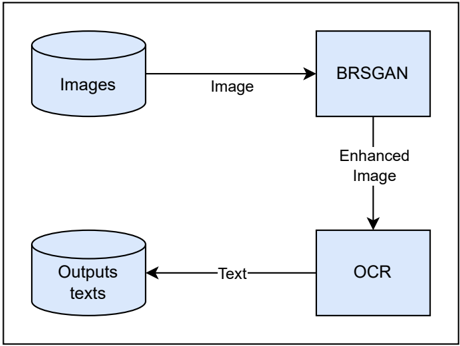
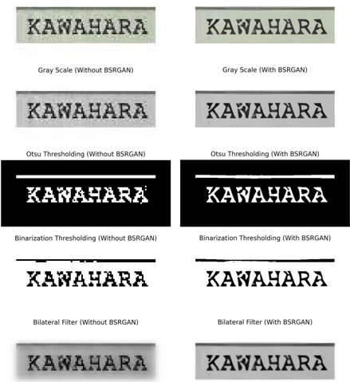
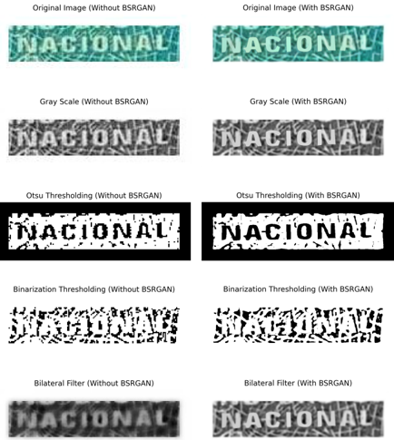

## Enhancing Text Recognition in OCR Systems Through Image Processing with BSRGAN

Fernando Baptistella de Lima ∗ fbl@ecomp.poli.br University of Pernambuco Recife, Pernambuco, Brazil

## Abstract

Context: Image enhancement is essential for advancing Optical Character Recognition (OCR), a technology widely applied across various Information Systems (IS) to enable accurate text extraction from scanned documents, IDs, invoices, and other document types. Problem: Despite OCR's importance, challenges such as noise, variable illumination, and low-resolution scans often compromise recognition quality, leading to distorted and inaccurate results. These issues can impact the reliability and effectiveness of IS. Solution: This study presents a methodology to improve the quality of lowresolution images by combining image filtering techniques with OpenCV, super-resolution using the BSRGAN model, and EasyOCR for character extraction. IS Theory: The research is anchored in the Information Quality theory in IS, addressing the importance of improving input data to enhance system outputs and reliability. Method: The proposed methodology consists of two main stages. First, low-resolution images are processed using the BSRGAN superresolution model, which enhances image quality for improved OCR performance. Then, the enhanced images are processed by an OCR system to extract and convert characters into text. Validation was conducted on three datasets: Brazilian Identity Document (BID), IIIT 5K-Word, and SVHN, simulating real-world application conditions. Summary of Results: The results demonstrate the proposed methodology's effectiveness in enhancing OCR accuracy, significantly reducing error rates in various contexts. Contributions and Impact on IS: This work contributes to the IS field by providing a solution that enhances OCR input quality, benefiting academia through advanced image processing research and the industry by enabling more reliable text recognition in practical applications.

## CCS Concepts

- Information systems → Document representation ; · Applied computing → Optical character recognition .

## Keywords

Optical Character Recognition, Image Enhancement, Improved Character Recognition, Deep Learning, Information Retrieve

## 1 Introduction

Optical Character Recognition (OCR) enables the conversion of text contained in images or digitized documents into editable text [24]. Applications that contain character recognition tasks are essential in the digital age and perform for various purposes such as identity verification, request processing, and form filling. Additionally, Information Retrieval (IR) plays a vital role in extracting and organizing relevant data from large text volumes, and OCR-based systems

## Eraylson Galdino da Silva †

egs@ecomp.poli.br University of Pernambuco Recife, Pernambuco, Brazil are fundamental for digitizing and processing both printed and handwritten documents. By integrating OCR with IR techniques, organizations can enhance data accessibility, streamline workflows, and improve overall efficiency in information management [10].

In this context, personal documents like identity cards, driver's cards, and passports contain critical and confidential information and must be extracted accurately their information. However, several specific challenges related to the formatting and quality of personal documents, such as different font types, layouts, formats, and image quality, can affect the quality of accuracy. Several approaches have gained significant advancements, particularly in activities aimed at text extraction to reduce manual processes through automation such as automatic license plate recognition [30], public transportation stations and security systems [4], and digitizing documents in PDF files [15].

In recent years, significant advances in deep learning approaches have emerged, yielding remarkable results in improving image quality by removing noise. One major improvement has been the development of Generative Adversarial Networks (GANs), which have produced highly realistic images and significantly enhanced data quality for various tasks such as image restoration, superresolution, and style transfer. Utilizing GANs can substantially improve image quality with precision, expanding the possibilities in digital image enhancement [21].

Super-Resolution Generative Adversarial Networks (SRGAN)[22] have pioneered the domain of image super-resolution by employing an adversarial framework to upscale low-resolution images to highresolution counterparts. SRGAN utilizes a deep convolutional neural network paired with a discriminator network, enhancing image fidelity and perceptual quality. Enhanced SRGAN (ESRGAN)[34] builds upon SRGAN by incorporating advanced architectural modifications and perceptual loss functions, yielding superior image textures and finer details. Blind Residual Super-Resolution GAN (BSRGAN)[37] further extends these advancements by addressing the complexities of real-world image degradations, including noise, blur, and compression artifacts, through a robust degradation model. In the seminal study of BSRGAN[37], the effectiveness of the proposed model was compared to various image super-resolution methods, and the experimental results demonstrated a significant improvement over models such as ESRGAN[34], FSSR-JPEG[11], FSSR-DPED[18], and RealSR-DPED[18]. The progressive developments of SRGAN, ESRGAN, and BSRGAN have substantially advanced the state-of-the-art in image super-resolution, facilitating significant improvements across various applications such as digital photography, medical imaging, and remote sensing.

This work introduces an innovative approach to improving OCR input quality by combining filtering techniques with the BSRGAN

super-resolution model. Previous studies have addressed similar challenges in OCR enhancement, but in different contexts, such as investigate how OCR quality impacts information retrieval effectiveness in digitized documents [9], and in image enhancement techniques to reduce OCR errors in fiscal receipts [1]. Both studies emphasize the importance of image enhancement for improving OCR performance, which aligns with our work but extends it by employing BSRGAN, a more robust and effective solution for enhancing image quality.

In this work, we address a major challenge in text recognition: dealing with low-resolution images affected by noise, varying illumination, and the physical condition of documents. This innovation for document processing systems in real-world applications is essencial, where OCR is extensively utilized across various information systems, significantly improving their overall efficiency and effectiveness. We propose using BSRGAN as a preprocessing step to enhance image resolution before applying OCR, the methodology and results are fully reproducible from the code available

- 1 . BSRGAN effectively mitigates real-world image degradations, producing high-resolution images that improve OCR accuracy. This integration aims to enhance text extraction performance, resulting in more reliable character recognition across various applications. The use of BSRGAN was compared with classic image processing techniques, including grayscale conversion and binarization using Otsu's method, to evaluate the improvement in OCR accuracy across several metrics and different contexts. The primary outcomes and contributions of this study can be summarized as follows:
- We propose a novel methodology for character recognition in low-resolution images by integrating a Generative Adversarial Network (GAN) model, specifically BSRGAN, to enhance image resolution. This approach includes a detailed performance evaluation, demonstrating its effectiveness in improving OCR accuracy.
- Acomprehensive comparative analysis was conducted using three different text image datasets to validate the proposed methodology. The results indicate that our approach is robust across multiple contexts and dataset variations.

And the secondary outcomes and contributions of this study can be summarized as follows:

- Our findings show that the use of classical image processing filters alone is not sufficient to enhance OCR performance, reinforcing the need for advanced super-resolution techniques.
- To the best of our knowledge, this is the first study to explore the application of BSRGAN as a preprocessing step to improve OCR accuracy, opening new research directions in the field.

The remainder of this article is organized as follows. In Section 2, we introduce our proposed methodology, while Section 3 details the experimental protocol applied. Subsequently, Section 4 presents and discusses the results. Finally, Section 5 concludes the paper, addresses research limitations, and evaluates paths for future work.

1 https://github.com/FernandoBLima/ImageEnhance-TextRec-OCR

## 2 Proposed Methodology

The proposed methodology, as illustrated in the diagram in Figure 1, involves applying the images, segmenting, and extracting relevant textual areas for the BSRGAN model that enhances these extracted images. Finally, the enhanced images are processed by an OCR system to recognize and extract the text.

Figure 1: Steps of the proposed methodology. Image created by the authors.

## 2.1 Character Region Recognition

In the initial step, it is necessary to detect and extract text regions from personal documents. This work uses the Character Region Awareness for Text Detection (CRAFT) model [3], a state-of-theart method for detecting complex scene text images, including arbitrarily-oriented, curved, or deformed texts. The CRAFT model uses bounding boxes to identify the minimum bounding rectangles on a binary map after thresholding character region and affinity scores. As a result, it effectively detects text areas by each character region, subsequently linking these regions to construct complete text lines. The detection module is based on the convolutional neural network architecture VGG-16, which consists of multiple convolutional and pooling layers, followed by prediction layers that estimate the presence of characters in specific regions of the image. The model stands out for its precision in recognizing complex regions and handling irregular and various types of text layouts. In this work, a pre-trained CRAFT model was used, trained on the SynthText [13], IC13 [19], IC17 [32] datasets for general purpose.

## 2.2 Blind Residual Super-Resolution GAN

Given the variability in the quality and resolution of the images within the dataset, enhancing the text images is a crucial step to improve the accuracy of character recognition. The next step in the proposed methodology is to enhance the quality of selected areas in the images that suffer from low resolution. This step aims to ensure that the cropped images are of good quality and format, facilitating more accurate text detection and recognition.

The proposed methodology uses a model for super-resolution of text in images based on BSRGAN, an approach to blind text image

super-resolution. This method features a style-based generator architecture, where the generator learns to control the coarse and fine details of the image separately, thereby enhancing the overall quality of the text images. This separation allows greater control over the appearance of the generated images.

A Generative Adversarial Network (GAN) consists of two competing neural networks: a generator and a discriminator. The combination training theses networks together can to help the generator enhance its creations [8]. The model stands out by focusing on character structure, learning to represent and generate high-resolution structural details [38]. The model is called blind because it does not require knowledge about the degradation process that led to the low-resolution from the image. The model was trained using synthetic data from MARCONet paper and was trained on Chinese and English characters from low-resolution inputs [23].

BSRGAN is chosen over models like SRGAN and ESRGAN due to its superior performance in general-purpose blind image superresolution. Unlike SRGAN and ESRGAN, BSRGAN addresses severe image degradation using a larger low-resolution (LR) patch size of 72 × 72, allowing the model to capture more information for better restoration. It also removes blurry images based on the variance of the Laplacian, ensuring higher quality inputs. BSRGAN is trained by minimizing a weighted combination of L1 loss, VGG perceptual loss, and spectral norm-based least square PatchGAN loss, providing a balanced approach to preserving fine details and preventing color shifts [37]. This robust training regime, combined with its architecture, makes BSRGAN more effective in enhancing text images and can improving OCR accuracy in real-world scenarios with varying image resolution.

## 2.3 Optical Character Recognition

After image enhancement, the final stage in the image pipeline is to perform the text extraction. For this step, two popular methods can be applied: Tesseract OCR [33] and EasyOCR [7]. Tesseract is a pioneering OCR framework initially developed at HP between 1984 and 1994, and open-sourced in 2005 before being acquired by Google. Its architecture integrates Long Short-Term Memory (LSTM) networks, which excel at recognizing sequences of characters, enhancing text recognition accuracy in complex layouts and varied fonts[17]. EasyOCR is a robust OCR framework that supports over 80 languages, designed to recognize characters from images. It utilizes a combination of ResNet, LSTM, and CTC models for character recognition. The detection phase in EasyOCR employs the Craft Algorithm. The architecture of EasyOCR consists of three main components: feature extraction, sequence labeling, and decoding. The ResNet model is used for feature extraction, LSTM (Long Short-Term Memory) for sequence labeling, and CTC (Connectionist Temporal Classification) for decoding [2].

Preliminary experiments [5] were conducted to compare the performance of EasyOCR and Tesseract on our datasets. The results indicated that EasyOCR consistently outperformed Tesseract in the metrics evaluated in this work, supported by results shown in the literature [2], [17]. Consequently, we have chosen EasyOCR as the primary OCR tool for the proposed methodology in this study.

## 3 Experimental Protocol

Our main objective is to evaluate the improvement in the performance of OCRs (Optical Character Recognition) through the application of the Blind Residual Super-Resolution GAN (BSRGAN) model. This investigation is conducted across different scenarios, including various datasets and image filters. The analysis aims to identify the conditions under which super-resolution can improve the accuracy of character and word recognition. In this section, we will present the experimental protocol used to achieve the objectives of this study. We will detail the steps involved, including character region recognition, image enhancement techniques, and the evaluation of OCR performance using different approaches.

## 3.1 Datasets

In this section provides a overview of text images dataset where each dataset offers challenges and opportunities to evaluate the proposed method.

- BID : A subset comprising 1.679 images was extracted from the dataset, covering Brazilian identity documents including CNH (National Driving License) Front, RG (Identity Card) Front, RG Verso (Back), and CPF (Individual Taxpayer Registry) Front, and each image was labeled with its corresponding textual content. This set of images were used in the pipeline to evaluate for evaluating various approaches within the pipeline to evaluate the extracting textual information from theses documents.
- The Street View House Numbers (SVHN) : House numbers from Google Street View images with a diverse background, varying illumination, and complex spatial arrangements of the digits [28]. It was used the test dataset that contains 13.068 images.
- IIIT 5K-Word : Created by the International Institute of Information Technology, Hyderabad (IIIT-H) used in the field of optical character recognition (OCR) from Google image search [25], this datasets contains images collected from various sources, like billboards, signboards, house numbers, house name plates in diverse font styles, sizes, and orientations. In the experiments it was used only the test part that contains 3.000 images.

For the BID dataset, the first phase involves segmenting and extracting relevant textual areas from documents using the CRAFTPytorch model. This model uses the Character Region Awareness for Text Detection (CRAFT) model [3], a state-of-the-art method for detecting complex scene text images, including arbitrarily-oriented, curved, or deformed texts. The CRAFT model uses bounding boxes to identify the minimum bounding rectangles on a binary map after thresholding character region and affinity scores. As a result, it effectively detects text areas by each character region, subsequently linking these regions to construct complete text lines. The detection module is based on the convolutional neural network architecture VGG-16, which consists of multiple convolutional and pooling layers, followed by prediction layers that estimate the presence of characters in specific regions of the image. The model stands out for its precision in recognizing complex regions and handling irregular and various types of text layouts. In this work, a pre-trained CRAFT model was used, trained on the SynthText [13], IC13 [19],

IC17 [32] datasets for general purpose. For the other datasets, the images are cropped in a suitable format to apply the proposed methodology.

## 3.2 Classical Filters and Treatments

The use of BSRGAN was compared with classical filters: Grayscale, Binary thresholding [31], Otsu thresholding [35], and Bilateral filtering [36]. These treatments were applied using OpenCV [16].

Grayscale is an important treatment that converts images into shades of gray, simplifying color information, reducing computational complexity, and enhancing text visibility for the OCR step. In this study, we evaluate the impact on OCR performance when using only the grayscale treatment.

Binary Thresholding converts grayscale images into binary images, where the pixels are either black or white. It is particularly effective in distinguishing text from the background, providing a clear contrast that aids in accurate text extraction. In this study, we evaluate the impact on OCR performance when using the grayscale treatment with binary thresholding.

Otsu Thresholding is an extension of binary thresholding that automatically determines the optimal threshold value to separate the foreground (text) from the background. This adaptive approach is useful for images with varying lighting conditions, ensuring consistent text recognition performance. In this study, we evaluate the impact on OCR performance when using the grayscale treatment with Otsu Thresholding, employing Otsu thresholding with binary inversion with an initial threshold value of 0, and simple binary thresholding with a maximum value of 255 assigned to pixels passing the threshold.

Bilateral Filtering is a technique that reduces noise while preserving edges, making it effective for enhancing text clarity in images. Bilateral filtering smooths images while maintaining sharp edges, which is crucial for retaining the integrity of textual information. In this study, we evaluate the impact on OCR performance when using the grayscale treatment with Bilateral Filtering, which we utilized with a diameter of 9 pixels and standard deviations of 75 pixels for both space and intensity to preserve text image edges.

The choice of these filters was based on their proven effectiveness in improving image quality. We selected these methods due to their broad applicability across different scenarios without adding unnecessary complexity to the preprocessing pipeline. Other approaches, such as Gaussian Blur [12], Median Filtering [14], and Adaptive Thresholding [6], could have been explored, but we focused on well-established techniques that offer a good balance between simplicity and performance.

## 3.3 Performance Metrics

Evaluating the preservation of critical information present in personal documents to the results obtained of recognition systems is crucial in optical character recognition field. In text evaluation, it share common parameters for metrics, for instance, the number of substitutions is represented by 𝑆 , 𝐷 denotes the number of deletions, and 𝐼 is the count of insertions. Additionally, 𝐶 represent the number of correctly identified characters, while 𝑁 is the total number of characters in a given text, calculated as the sum of substitutions, deletions, and correct characters. These parameters enabling to measure the texts and characters accuracy and helps to identify areas for improvement. Commonly the given metrics are use to evaluate texts recognition such as Word Error Rate (WER), measures the error rate of identified words compared to the original text [20]. This metric is defined in Equation (1):

<!-- formula-not-decoded -->

Anadditional important metric is the Character Error Rate (CER), evaluates the individual accuracy of identified characters. The main difference between WER and CER lies in their level of granularity, while WER considers the recognition accuracy of entire words compared to a reference text, CER focuses on individual characters given a detailed text recognition performance. This metric is defined in Equation (2):

<!-- formula-not-decoded -->

Another widely used metric for text evaluation is the Word Information Lost (WIL), which measures the total amount of lost or missing textual information [27]. In this metric, the parameter 𝑃 , representing the number of words in the prediction, is considered. The WIL is calculated according to Equation (3):

<!-- formula-not-decoded -->

Finally, the Word Information Preserved (WIP) metric provides the amount of textual information preserved between a groundtruth text [26]. The WIP is calculated according to Equation (4):

<!-- formula-not-decoded -->

Ascore of 0 in the WER, CER, and WIL metrics signifies a perfect match between the given sentence and the recognized text. Conversely, a higher WIP score indicates better preservation of words and characters, with a value of 1 representing the best possible score. We compute the mean and standard deviation of the metrics obtained for each database. These values allow us to identify the overall performance of the experiments and compare the different approaches.

## 4 Results

Table 1 presents the results obtained from various image treatments applied to EasyOCR on differents datasets. Applying BSRGAN results in improvements across all evaluated metrics, especially when compared to using the original untreated images and other image filters without BSRGAN. On the BID dataset, using the original image, the combination of BSRGAN with EasyOCR achieves performance gains of 12%, 28%, 14%, and 12% in the WER, CER, WIL, and WIP metrics, respectively. Specifically, the WER improves from 0.488 to 0.429, CER from 0.282 to 0.203, WIL from 0.469 to 0.401, and WIP from 0.531 to 0.599.

Applying classic filters without BSRGAN typically decreases EasyOCRperformance across all metrics. Specifically, Otsu's Thresholding is identified as the most detrimental, increasing the WER by 70.9% and the CER by 142.6%, while reducing the WIP by 63.1%. Additionally, Otsu's leads to the largest increase in WIL at 71.4%. However, the Bilateral filter, though also reducing performance,

results in less severe impacts compared to Otsu's Thresholding. Using BSRGAN alone is recommended for enhancing OCR accuracy, as it avoids the negative effects associated with classic filters.

When BSRGAN is combined with classic filters, its effectiveness varies by metric and filter type. The best performing combinations are BSRGAN with Gray Scale, which shows the highest improvement in CER by 27.0%, and BSRGAN with Bilateral, leading in the WIP with a 12.1% improvement and the lowest decrease in WIL at 13.6%. However, the combination with Binary Thresholding is the worst, significantly increasing the WER by 57.2% and CER by 87.9%, while also showing the largest decreases in WIP by 37.5% and increases in WIL by 42.4%. This indicates that while BSRGAN generally mitigates the negative effects of classic filters, the outcomes are highly dependent on the specific filter used.

The results presented on the IIIT5K dataset show that different image treatments applied result in significant performance variations. The application of BSRGAN demonstrates improvements in several evaluated metrics compared to the original image and other filters without BSRGAN. The combination of BSRGAN with EasyOCR achieves performance gains of 5.0%, 5.4%, 3.8%, and 8.1% in the WER, CER, WIL, and WIP metrics, respectively. The application of classic filters without BSRGAN generally decreases EasyOCR performance on the IIIT5K dataset. Binary Thresholding consistently exhibits the worst effects, leading to the highest increases in WER by 11 . 0%, CER by 19 . 2%, and WIL by 13 . 1%, and the largest decrease in WIP by 27 . 6%. Conversely, Otsu's filter shows the least impact, with the smallest increases in WER by 3 . 4%, CER by 6 . 3%, and WIL by 5 . 8%, and a relatively moderate decrease in WIP by 12 . 1%.

When BSRGAN is combined with classic filters, performance results on the IIIT5K dataset vary. For WER, the best improvement is with BSRGAN + Bilateral at 5 . 7%, while the worst increase is with BSRGAN + Binary Thresholding at 6 . 2%. For CER, BSRGAN + Bilateral also shows the best improvement at 5 . 0%, and the worst increase is with BSRGAN + Binary Thresholding at 11 . 2%. In terms of WIL, BSRGAN + Bilateral leads to the best improvement by 4 . 0%, and BSRGAN + Binary Thresholding results in the highest increase at 8 . 3%. For WIP, BSRGAN + Bilateral shows the best improvement at 8 . 4%, whereas BSRGAN + Binary Thresholding results in the most significant decrease at 17 . 4%. These results illustrate that BSRGAN's effectiveness in mitigating the negative impacts of classic filters varies significantly depending on the filter used.

The results presented on the SVHN dataset show that different image treatments applied to the EasyOCR result in significant performance variations. For EasyOCR, the application of BSRGAN shows improvements across several evaluated metrics compared to the original image and filters without BSRGAN. The combination of BSRGAN with EasyOCR results in performance gains of 25.3%, 27.8%, 27.6%, and 85.8% in the WER, CER, WIL, and WIP metrics, respectively.

The application of classic filters without BSRGAN reduces the performance of EasyOCR on the SVHN dataset. For WER, the worst increase is observed with Binary Thresholding at 19.2%, and the least increase with Otsu's at 14.4%. In CER, Binary Thresholding also leads to the highest increase at 24.2%, with Otsu's showing a smaller increase at 18.8%. For WIL, Binary Thresholding results in the highest error increase at 19.3%, while Otsu's has a lower increase at 14.0%. Finally, in WIP, Binary Thresholding shows the most significant decrease at 60.1%, and Otsu's the least at 43.6%. Overall, Binary Thresholding is consistently the worst filter, increasing errors across all metrics more than other filters.

When BSRGAN is combined with classic filters on the SVHN dataset, the results show varying improvements and deteriorations. For WER, the best improvement is with BSRGAN + Gray Scale at 27.1%, while the worst deterioration is with BSRGAN + Otsu's at 11.7%. For CER, BSRGAN + Gray Scale leads with an improvement of 30.4%, and the worst deterioration is with BSRGAN + Binary Thresholding at 5.6%. In terms of WIL, BSRGAN + Gray Scale also shows the best improvement at 29.5%, while BSRGAN + Binary Thresholding causes the worst deterioration at 5.4%. Finally, for WIP, BSRGAN + Gray Scale provides the best improvement at 91.8%, whereas BSRGAN + Otsu's shows the worst deterioration at 47.3%. These results indicate that BSRGAN's effectiveness in mitigating the negative impacts of classic filters varies significantly depending on the specific filter used.

Table 2 presents the total mean and standard deviation of processing time (in seconds) required for text recognition through different filters applied to the BID, IIIT5k, and SVHN datasets, with and without the use of BSRGAN. These results demonstrate that while BSRGAN may improve the quality of the images, it also significantly increases the time required for text recognition across different filters and datasets. However, despite this increase in processing time, the scale remains very low and does not render the use of BSRGAN unfeasible for various contexts.

## 4.1 Discussion

Through the results, we observe that BSRGAN without filters can significantly improves the performance metrics, including WER, CER, WIL, and WIP, over the original untreated images when applied in EasyOCR. An improvement in WER can lead to a substantial reduction in word-level inaccuracies in OCR. Lower CER values highlight the ability of OCR in the retention of individual character details. Decreasing WIL results imply that OCR outputs retain more semantic information, leading to a more complete and useful output text. The increase in the WIP results proves that OCR increases the proportion of correct information captured from the original images.

These metrics are crucial for OCR systems as they directly reflect the quality of the extracted text. In the SVHN dataset, the BSRGAN + Gray Scale filter achieved the lowest WER of 0.561 ± 0.552, enhancing the readability and extraction of house numbers. On the other hand, CER is particularly relevant for applications requiring precise text recognition, such as document digitization. Improving both WER and CER enhances the accuracy and reliability of OCR systems, leading to better performance in practical applications such as document processing and automated monitoring. The comparative Figure 2 illustrate a example of a character extraction with high-quality result in a image with the word "KAWAHARA" from the BID dataset processed with OpenCV preprocessing.

Table 3 present results of a successful OCR performance evaluation on a image using the EasyOCR and Tesseract OCR engines under varying preprocessing conditions. All preprocessing steps, including OTSU thresholding, binary thresholding, and bilateral filter, achieved near-perfect recognition with minimal charactere

Table 1: Comparison of various image processing techniques using EasyOCR on different datasets. Metrics with the best results are highlighted in bold.

| Dataset   | Filter                       | WER(mean ± std)   | CER (mean ± std)   | WIL (mean ± std)   | WIP (mean ± std)   |
|-----------|------------------------------|-------------------|--------------------|--------------------|--------------------|
| SVHN      | Original                     | 0.770 ± 0.451     | 0.727 ± 0.586      | 0.757 ± 0.428      | 0.243 ± 0.428      |
| SVHN      | Bilateral                    | 0.907 ± 0.308     | 0.885 ± 0.408      | 0.902 ± 0.297      | 0.098 ± 0.297      |
| SVHN      | Gray Scale                   | 0.760 ± 0.455     | 0.717 ± 0.596      | 0.748 ± 0.433      | 0.252 ± 0.433      |
| SVHN      | Binary Thresholding          | 0.918 ± 0.327     | 0.903 ± 0.438      | 0.903 ± 0.295      | 0.097 ± 0.295      |
| SVHN      | Otsu's Thresholding          | 0.881 ± 0.376     | 0.864 ± 0.505      | 0.863 ± 0.342      | 0.137 ± 0.342      |
| SVHN      | BSRGAN                       | 0.575 ± 0.550     | 0.525 ± 0.618      | 0.548 ± 0.498      | 0.452 ± 0.498      |
| SVHN      | BSRGAN + Bilateral           | 0.564 ± 0.550     | 0.507 ± 0.598      | 0.537 ± 0.499      | 0.463 ± 0.499      |
| SVHN      | BSRGAN + Gray Scale          | 0.561 ± 0.552     | 0.506 ± 0.618      | 0.534 ± 0.499      | 0.466 ± 0.499      |
| SVHN      | BSRGAN + Binary Thresholding | 0.745 ± 0.503     | 0.688 ± 0.569      | 0.716 ± 0.451      | 0.284 ± 0.451      |
| SVHN      | BSRGAN + Otsu's Thresholding | 0.679 ± 0.550     | 0.664 ± 0.691      | 0.642 ± 0.480      | 0.358 ± 0.480      |
| IIIT-5K   | Original                     | 0.755 ± 0.715     | 0.536 ± 0.450      | 0.678 ± 0.467      | 0.322 ± 0.467      |
| IIIT-5K   | Bilateral                    | 0.810 ± 0.693     | 0.612 ± 0.435      | 0.735 ± 0.441      | 0.265 ± 0.441      |
| IIIT-5K   | Gray Scale                   | 0.753 ± 0.721     | 0.536 ± 0.450      | 0.676 ± 0.468      | 0.324 ± 0.468      |
| IIIT-5K   | Binary Thresholding          | 0.838 ± 0.658     | 0.639 ± 0.433      | 0.767 ± 0.422      | 0.233 ± 0.422      |
| IIIT-5K   | Otsu's Thresholding          | 0.781 ± 0.673     | 0.570 ± 0.440      | 0.717 ± 0.450      | 0.283 ± 0.450      |
| IIIT-5K   | BSRGAN                       | 0.717 ± 0.641     | 0.507 ± 0.443      | 0.652 ± 0.476      | 0.348 ± 0.476      |
| IIIT-5K   | BSRGAN + Bilateral           | 0.712 ± 0.634     | 0.509 ± 0.442      | 0.651 ± 0.476      | 0.349 ± 0.476      |
| IIIT-5K   | BSRGAN + Gray Scale          | 0.720 ± 0.647     | 0.510 ± 0.447      | 0.652 ± 0.476      | 0.348 ± 0.476      |
| IIIT-5K   | BSRGAN + Binary Thresholding | 0.802 ± 0.623     | 0.596 ± 0.434      | 0.734 ± 0.442      | 0.266 ± 0.442      |
| IIIT-5K   | BSRGAN + Otsu's Thresholding | 0.748 ± 0.642     | 0.533 ± 0.440      | 0.682 ± 0.465      | 0.318 ± 0.465      |
| BID       | Original                     | 0.488 ± 0.534     | 0.282 ± 0.387      | 0.469 ± 0.498      | 0.531 ± 0.498      |
| BID       | Bilateral                    | 0.757 ± 0.550     | 0.559 ± 0.445      | 0.714 ± 0.452      | 0.286 ± 0.452      |
| BID       | Gray Scale                   | 0.507 ± 0.533     | 0.297 ± 0.395      | 0.488 ± 0.499      | 0.512 ± 0.499      |
| BID       | Binary Thresholding          | 0.784 ± 0.505     | 0.591 ± 0.454      | 0.749 ± 0.433      | 0.251 ± 0.433      |
| BID       | Otsu's Thresholding          | 0.834 ± 0.472     | 0.684 ± 0.449      | 0.804 ± 0.396      | 0.196 ± 0.396      |
| BID       | BSRGAN                       | 0.429 ± 0.545     | 0.203 ± 0.345      | 0.401 ± 0.489      | 0.599 ± 0.489      |
| BID       | BSRGAN + Bilateral           | 0.436 ± 0.552     | 0.218 ± 0.365      | 0.405 ± 0.490      | 0.595 ± 0.490      |
| BID       | BSRGAN + Gray Scale          | 0.441 ± 0.553     | 0.206 ± 0.343      | 0.410 ± 0.491      | 0.590 ± 0.491      |
|           | BSRGAN + Binary Thresholding | 0.767 ± 0.655     | 0.530 ± 0.489      | 0.668 ± 0.470      | 0.332 ± 0.470      |
|           | BSRGAN + Otsu's Thresholding | 0.722 ± 0.530     | 0.589 ± 0.494      | 0.685 ± 0.462      | 0.315 ± 0.462      |

errors. Without BSRGAN, both OCR models perform well in most cases, achieving perfect accuracy except in certain methods like Otsu Thresholding for both EasyOCR and Tesseract, where errors appear. However, with BSRGAN, both models experience a slight decline in accuracy, showing that BSRGAN can sometimes reduce accuracy for text recognition in this specific setup.

image super-resolution, which enables it to handle a variety of degradation types, given a significant advantage when working with images that have complex or unknown degradations, as it can generalize well to different kinds of input.

An example of a low-quality extraction result can be seen in Figure 3 , where the image processing fails to accurately extract the word "NACIONAL" leading to distorted or incomplete text output, the figure indicates that the pipeline consistently poor across all preprocessing steps. The BSRGAN pipeline, preprocessing methods such as Otsu thresholding and binary thresholding produced similar results, suggesting that in this example the enhance by BSRGAN did not improve the image quality. These variations in extraction quality contribute to the higher standard deviation observed in BSRGAN results, as lower-quality images introduce greater inconsistency in OCR performance. Despite the higher standard deviation values in BSRGAN result, this approach could still be a good solution for OCR on degraded images because is a deep-blind model for general

Table 4 present the predictions using EasyOCR and Tesseract with and without the BSRGAN. Using EasyOCR without BSRGAN, the results show consistently high error rates, WER, CER, and WIL all at 1.0, with slight improvements in accuracy with BSRGAN. Tesseract's performance, however, shows little variation across methods without BSRGAN, consistently misinterpreting the text as NaN. With BSRGAN, only the "Bilateral" method yields accurate results with Tesseract, achieving a WER and CER of 0.0, WIL of 0.0, and a perfect WIP of 1.0. This highlights the potential of BSRGAN to enhance OCR accuracy, particularly when combined with the Bilateral method in Tesseract.

Furthermore, the use of BSRGAN was able to improve the OCR performance in different contexts. For instance, in the BID dataset, BSRGAN is found to be relevant in increasing accuracy in OCR meant for automated identity document verification. In the context

Table 2: Total mean and standard deviation of processing time (in seconds) for different filters, with and without BSRGAN for BID, IIIT5k, and SVHN datasets.

| Dataset   | Filter                    | Without BSRGAN (mean ± std)   | With BSRGAN (mean ± std)   |
|-----------|---------------------------|-------------------------------|----------------------------|
| BID       | Bilateral                 | 0.011580 ± 0.005168           | 0.033672 ± 0.011752        |
|           | Gray Scale                | 0.012855 ± 0.003958           | 0.021738 ± 0.007811        |
|           | Binarization Thresholding | 0.011569 ± 0.005484           | 0.019399 ± 0.008124        |
|           | Otsu Thresholding         | 0.010267 ± 0.005390           | 0.017965 ± 0.008667        |
|           | Original                  | 0.014121 ± 0.010026           | 0.023303 ± 0.013975        |
| IIIT5k    | Bilateral                 | 0.012393 ± 0.010043           | 0.039923 ± 0.018060        |
|           | Gray Scale                | 0.012657 ± 0.007229           | 0.026173 ± 0.011682        |
|           | Binarization Thresholding | 0.011957 ± 0.007233           | 0.024522 ± 0.011376        |
|           | Otsu Thresholding         | 0.012694 ± 0.007805           | 0.025547 ± 0.011023        |
|           | Original                  | 0.016197 ± 0.019089           | 0.027332 ± 0.016339        |
| SVHN      | Bilateral                 | 0.009659 ± 0.007067           | 0.033676 ± 0.007650        |
|           | Gray Scale                | 0.009597 ± 0.005471           | 0.020820 ± 0.005667        |
|           | Binarization Thresholding | 0.008102 ± 0.004704           | 0.018111 ± 0.005522        |
|           | Otsu Thresholding         | 0.008637 ± 0.005796           | 0.020013 ± 0.006323        |
|           | Original                  | 0.012063 ± 0.005786           | 0.023066 ± 0.009131        |

Table 3: Evaluation of High-Quality Character Extraction Predictions and Metrics with and without BSRGAN

| Filter                    | OCR       | Without BSRGAN   | Without BSRGAN   | Without BSRGAN   | Without BSRGAN   | Without BSRGAN   | With BSRGAN   | With BSRGAN   | With BSRGAN   | With BSRGAN   | With BSRGAN   |
|---------------------------|-----------|------------------|------------------|------------------|------------------|------------------|---------------|---------------|---------------|---------------|---------------|
|                           |           | Prediction       | WER              | CER              | WIL              | WIP              | Prediction    | WER           | CER           | WIL           | WIP           |
| Original                  | EasyOCR   | KAWAHARA         | 0.0              | 0.000            | 0.0              | 1.0              | KAMAHARA      | 1.0           | 0.125         | 1.0           | 0.0           |
| Gray Scale                | EasyOCR   | KAWAHARA         | 0.0              | 0.000            | 0.0              | 1.0              | KAMAHARA      | 1.0           | 0.125         | 1.0           | 0.0           |
| Otsu Thresholding         | EasyOCR   | KANAHARX         | 1.0              | 0.250            | 1.0              | 0.0              | KAMAHARA      | 1.0           | 0.125         | 1.0           | 0.0           |
| Binarization Thresholding | EasyOCR   | KAWAHARA         | 0.0              | 0.000            | 0.0              | 1.0              | KAMAHARA      | 1.0           | 0.125         | 1.0           | 0.0           |
| Bilateral                 | EasyOCR   | KAWAHARA         | 0.0              | 0.000            | 0.0              | 1.0              | KAMAHARA      | 1.0           | 0.125         | 1.0           | 0.0           |
| Original                  | Tesseract | KAWAHARA         | 0.0              | 0.000            | 0.0              | 1.0              | KAWANARA      | 1.0           | 0.125         | 1.0           | 0.0           |
| Gray Scale                | Tesseract | KAWAHARA         | 0.0              | 0.000            | 0.0              | 1.0              | KAWANARA      | 1.0           | 0.125         | 1.0           | 0.0           |
| Otsu Thresholding         | Tesseract | EERATEEES        | 1.0              | 1.000            | 1.0              | 0.0              | KAWANARA      | 1.0           | 0.125         | 1.0           | 0.0           |
| Binarization Thresholding | Tesseract | XANAHARA         | 1.0              | 0.250            | 1.0              | 0.0              | KAWANARA      | 1.0           | 0.125         | 1.0           | 0.0           |
| Bilateral                 | Tesseract | NaN              | 1.0              | 1.000            | 1.0              | 0.0              | KANAHMARA     | 1.0           | 0.250         | 1.0           | 0.0           |

Table 4: Table of Evaluation of Poor-Quality Character Extraction Predictions and Metrics with and without BSRGAN

| Filter                    | OCR       | Without BSRGAN   | Without BSRGAN   | Without BSRGAN   | Without BSRGAN   | Without BSRGAN   | With BSRGAN        | With BSRGAN   | With BSRGAN   | With BSRGAN   | With BSRGAN   |
|---------------------------|-----------|------------------|------------------|------------------|------------------|------------------|--------------------|---------------|---------------|---------------|---------------|
|                           |           | Prediction       | WER              | CER              | WIL              | WIP              | Prediction         | WER           | CER           | WIL           | WIP           |
| Original                  | EasyOCR   | nacionau         | 1.0              | 1.000            | 1.0              | 0.0              | nAcionnu           | 1.0           | 0.875         | 1.0           | 0.0           |
| Gray Scale                | EasyOCR   | iaciownn         | 1.0              | 1.000            | 1.0              | 0.0              | NACIongu           | 1.0           | 0.500         | 1.0           | 0.0           |
| Otsu Thresholding         | EasyOCR   | bua cioÀ2        | 2.0              | 1.125            | 1.0              | 0.0              | WaCIOAA'L          | 1.0           | 0.500         | 1.0           | 0.0           |
| Binarization Thresholding | EasyOCR   | 50               | 1.0              | 1.000            | 1.0              | 0.0              | 5242               | 1.0           | 1.000         | 1.0           | 0.0           |
| Bilateral                 | EasyOCR   | Lacona           | 1.0              | 1.000            | 1.0              | 0.0              | nacionau           | 1.0           | 1.000         | 1.0           | 0.0           |
| Original                  | Tesseract | NaN              | 1.0              | 1.000            | 1.0              | 0.0              | NaN                | 1.0           | 1.000         | 1.0           | 0.0           |
| Gray Scale                | Tesseract | NaN              | 1.0              | 1.000            | 1.0              | 0.0              | NaN                | 1.0           | 1.000         | 1.0           | 0.0           |
| Otsu Thresholding         | Tesseract | NaN              | 1.0              | 1.000            | 1.0              | 0.0              | NaN                | 1.0           | 1.000         | 1.0           | 0.0           |
| Binarization Thresholding | Tesseract | NaN              | 1.0              | 1.000            | 1.0              | 0.0              | Dis dia «ar ha ... | 18.0          | 6.750         | 1.0           | 0.0           |
| Bilateral                 | Tesseract | NaN              | 1.0              | 1.000            | 1.0              | 0.0              | NACIONAL           | 0.0           | 0.000         | 0.0           | 1.0           |

of the IIIT 5K-Word dataset, BSRGAN improves the performance of OCR on images from several types like billboards, signboards,

Visual comparison of image filters with and without BSRGAN in high-quality extraction

Original Image (Without BSRGAN)

Original Image (With BSRGAN)

Figure 2: Visual comparison of filters from a character extraction with high-quality result with and without BSRGAN. Image created by the authors.

house numbers, house names, and diverse font styles, sizes, and orientations. Lastly, for the SVHN dataset containing house numbers with varied backgrounds, illumination, and complex spatial arrangements of the digits, BSRGAN shows significant improvements.

Additionally, the performance can sometimes be improved when BSRGAN is applied alongside a classical image filter, such as Bilateral or Gray Scale; however, applying BSRGAN with other filters, such as Binary Thresholding and Otsu's Thresholding, overall degrades performance. The implication is that when used in conjunction with BSRGAN, the choice of filter has a significant influence on the result, emphasizing the need for selective filter application within processes of OCR enhancement. Overall, these results are promising for the use of BSRGAN as a preliminary treatment in OCR for various real-world applications.

On the other hand, the classical image filters evaluated were, in most cases, unable to enhance OCR performance compared to using the original image. Furthermore, it was observed that BSRGAN may underperform when combined with classical filters. This behavior can be attributed to the architecture of the EasyOCR framework, which already incorporates image processing steps before the OCR stage. Thus, this hypothesis can be further investigated in future studies by evaluating other OCR approaches.

Visual comparison of image filters with and without BSRGAN in low-quality extraction

Figure 3: Visual comparison of filters from a character extraction with low-quality result with and without BSRGAN. Image created by the authors.

## 5 Conclusions and Future Works

In this work, we present a new OCR methodology that employs BSRGAN to enhance OCR performance. This methodology was evaluated using three datasets with different contexts. The first dataset is BID, which covers Brazilian identity documents. The second dataset is IIIT 5K-Word, containing images collected from various sources such as billboards, signboards, house numbers, and house name plates in diverse font styles, sizes, and orientations. The third dataset is SVHN, composed of house numbers from Google Street View images. In all cases, using BSRGAN as a preprocessing step before OCR significantly improved the performance of EasyOCR across different metrics.

Furthermore, the results of this study reveal that traditional filters like Binary and Otsu's Thresholding did not enhance OCR performance. This brings to light the discussion about the effectiveness of classical filters compared to GAN approaches, which can be used to improve image quality for OCR applications. In this study, we acknowledge a few limitations that present opportunities for future research. Firstly, we focused exclusively on evaluating the BSRGAN for image enhancement, thus limiting our exploration of other potential enhancement methods. Secondly, our experiments were conducted using only three datasets, which may not fully represent the diversity of real-world scenarios. Thirdly, our choice to utilize EasyOCR as the sole optical character recognition (OCR) tool can restrict the generalizability of our findings, as different OCR engines could yield varying results.

For future work, we aim to explore more advanced denoising models capable of handling a wide range of noise patterns. Additionally, we plan to conduct experiments comparing different GAN architectures to further improve image resolution and assess their performance against a comprehensive set of filters. We will also evaluate the impact of these enhancements using others OCR tools [29]. These future experiments will include testing on larger datasets, such as MIDV-500 and MIDV-2019, to validate the effectiveness of our proposed method.

## References

- [1] Manoela Auad, Sarah Alves, Gabriel Kakizaki, Julio Reis, and Michel Silva. 2024. A Filtering and Image Preparation Approach to Enhance OCR for Fiscal Receipts. In Anais da XXXVII Conference on Graphics, Patterns and Images (Manaus/AM). SBC, Porto Alegre, RS, Brasil. https://sol.sbc.org.br/index.php/sibgrapi/article/ view/31713
- [2] Ninad Awalgaonkar, Prashant Bartakke, and Ravindra Chaugule. 2021. Automatic license plate recognition system using SSD. In 2021 international symposium of Asian control association on intelligent robotics and industrial automation (IRIA) . IEEE, 394-399.
- [3] Youngmin Baek et al. 2019. Character region awareness for text detection. In Proceedings of the IEEE/CVF conference on computer vision and pattern recognition .
- [4] Shivani Bansal, Meenu Gupta, and Amit Kumar Tyagi. 2020. Building a character recognition system for vehicle applications. In Advances in Decision Sciences, Image Processing, Security and Computer Vision: International Conference on Emerging Trends in Engineering (ICETE) . Vol. 1. Springer International Publishing.
- [5] F. Baptistella. [n. d.]. FernandoBLima/ImageEnhance-TextRec-OCR. https:// github.com/FernandoBLima/ImageEnhance-TextRec-OCR. Accessed on 1 jul. 2024.
- [6] Yu Binbin. 2019. An improved infrared image processing method based on adaptive threshold denoising. EURASIP Journal on Image and Video Processing 2019, 1 (2019), 5.
- [7] Y. L. Chaitra et al. 2023. Text Detection and Recognition from the Scene Images Using RCNN and EasyOCR. In International Conference on Information and Communication Technology for Intelligent Systems . Springer Nature Singapore.
- [8] Antonia Creswell et al. 2018. Generative adversarial networks: An overview. IEEE signal processing magazine 35, 1 (2018), 53-65.
- [9] Lucas Lima de Oliveira and Viviane P. Moreira. 2024. Creating Resources and Evaluating the Impact of OCR Quality on Information Retrieval: A Case Study in the Geoscientific Domain. In Anais Estendidos do XXXIX Simpósio Brasileiro de Bancos de Dados (Florianópolis/SC). SBC, Porto Alegre, RS, Brasil, 202-206. https://doi.org/10.5753/sbbd\_estendido.2024.241190
- [10] Lucas Lima de Oliveira, Danny Suarez Vargas, Antônio Marcelo Azevedo Alexandre, Fábio Corrêa Cordeiro, Diogo da Silva Magalhães Gomes, Max de Castro Rodrigues, Regis Kruel Romeu, and Viviane Pereira Moreira. 2023. Evaluating and mitigating the impact of OCR errors on information retrieval. International Journal on Digital Libraries 24, 1 (2023), 45-62.
- [11] Manuel Fritsche, Shuhang Gu, and Radu Timofte. 2019. Frequency separation for real-world super-resolution. In 2019 IEEE/CVF International Conference on Computer Vision Workshop (ICCVW) . IEEE, 3599-3608.
- [12] Estevão S Gedraite and Murielle Hadad. 2011. Investigation on the effect of a Gaussian Blur in image filtering and segmentation. In Proceedings ELMAR-2011 . IEEE, 393-396.
- [13] A. Gupta, A. Vedaldi, and A. Zisserman. 2016. Synthetic data for text localisation in natural images. In Proceedings of the IEEE conference on computer vision and pattern recognition . 2315-2324.
- [14] Gajanand Gupta et al. 2011. Algorithm for image processing using improved median filter and comparison of mean, median and improved median filter. International Journal of Soft Computing and Engineering (IJSCE) 1, 5 (2011), 304311.
- [15] Pan He et al. 2016. Reading scene text in deep convolutional sequences. In Proceedings of the AAAI conference on artificial intelligence , Vol. 30.
- [16] Joseph Howse. 2013. OpenCV computer vision with python . Vol. 27. Packt Publishing Birmingham, UK.
- [17] Parth Hasmukh Jain et al. 2023. Artificially intelligent readers: an adaptive framework for original handwritten numerical digits recognition with OCR Methods. Information 14, 6 (2023), 305.
- [18] Xiaozhong Ji, Yun Cao, Ying Tai, Chengjie Wang, Jilin Li, and Feiyue Huang. 2020. Real-world super-resolution via kernel estimation and noise injection. In proceedings of the IEEE/CVF conference on computer vision and pattern recognition workshops . 466-467.
- [19] Dimosthenis Karatzas et al. 2013. ICDAR 2013 robust reading competition. In 2013 12th international conference on document analysis and recognition . IEEE.
- [20] Dietrich Klakow and Jochen Peters. 2002. Testing the correlation of word error rate and perplexity. Speech Communication 38, 1-2 (2002), 19-28.
- [21] Christian Ledig et al. 2017. Photo-realistic single image super-resolution using a generative adversarial network. In Proceedings of the IEEE conference on computer vision and pattern recognition .
- [22] Christian Ledig et al. 2017. Photo-realistic single image super-resolution using a generative adversarial network. In Proceedings of the IEEE conference on computer vision and pattern recognition . 4681-4690.
- [23] Xiaoming Li, Wangmeng Zuo, and Chen Change Loy. 2023. Learning generative structure prior for blind text image super-resolution. In Proceedings of the IEEE/CVF Conference on Computer Vision and Pattern Recognition .
- [24] J. Liang, D. Doermann, and H. Li. 2005. Camera-based analysis of text and documents: a survey. International Journal of Document Analysis and Recognition (IJDAR) 7 (2005), 84-104.
- [25] Anand Mishra, Karteek Alahari, and C. V. Jawahar. 2012. Scene text recognition using higher order language priors. In BMVC-British machine vision conference . BMVA.
- [26] Andrew Morris. 2002. An information theoretic measure of sequence recognition performance. IDIAP.
- [27] Andrew Cameron Morris, Viktoria Maier, and Phil Green. 2004. From WER and RIL to MER and WIL: improved evaluation measures for connected speech recognition. In Eighth International Conference on Spoken Language Processing .
- [28] Yuval Netzer et al. 2011. Reading digits in natural images with unsupervised feature learning. In NIPS workshop on deep learning and unsupervised feature learning , Vol. 2011.
- [29] Clemens Neudecker et al. 2021. A survey of OCR evaluation tools and metrics. In Proceedings of the 6th International Workshop on Historical Document Imaging and Processing . 13-18.
- [30] Aishik Rakshit, Samyak Mehta, and Anirban Dasgupta. 2023. A Novel Pipeline for Improving Optical Character Recognition through Post-processing Using Natural Language Processing. In 2023 IEEE Guwahati Subsection Conference (GCON) . IEEE.
- [31] Prasanna K. Sahoo, S. A. K. C. Soltani, and Andrew KC Wong. 1988. A survey of thresholding techniques. Computer vision, graphics, and image processing 41, 2 (1988), 233-260.
- [32] Joan Andreu Sanchez et al. 2017. ICDAR2017 competition on handwritten text recognition on the READ dataset. In 2017 14th IAPR international conference on document analysis and recognition (ICDAR) , Vol. 1. IEEE.
- [33] Ray Smith. 2007. An overview of the Tesseract OCR engine. In Ninth international conference on document analysis and recognition (ICDAR 2007) , Vol. 2. IEEE.
- [34] Xintao Wang et al. 2018. Esrgan: Enhanced super-resolution generative adversarial networks. In Proceedings of the European conference on computer vision (ECCV) workshops .
- [35] Xiangyang Xu et al. 2011. Characteristic analysis of Otsu threshold and its applications. Pattern recognition letters 32, 7 (2011), 956-961.
- [36] Qingxiong Yang, Kar-Han Tan, and Narendra Ahuja. 2012. Shadow removal using bilateral filtering. IEEE Transactions on Image processing 21, 10 (2012), 4361-4368.
- [37] Kai Zhang et al. 2021. Designing a practical degradation model for deep blind image super-resolution. In Proceedings of the IEEE/CVF International Conference on Computer Vision . 4791-4800.
- [38] Kai Zhang et al. 2021. Designing a practical degradation model for deep blind image super-resolution. In Proceedings of the IEEE/CVF International Conference on Computer Vision . 4791-4800.