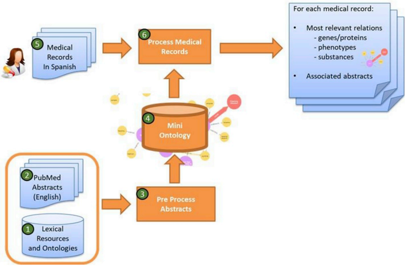
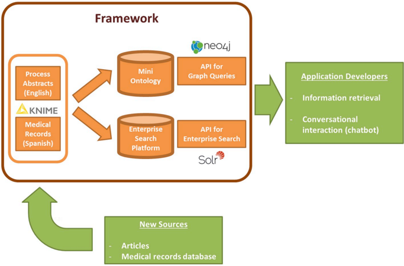
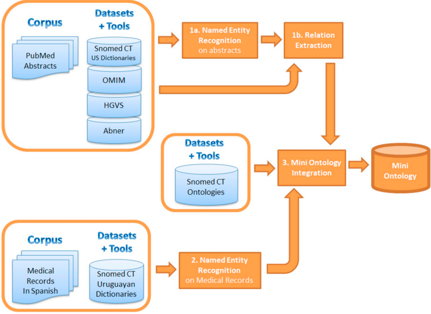
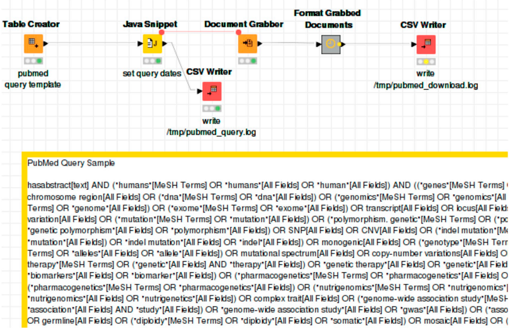
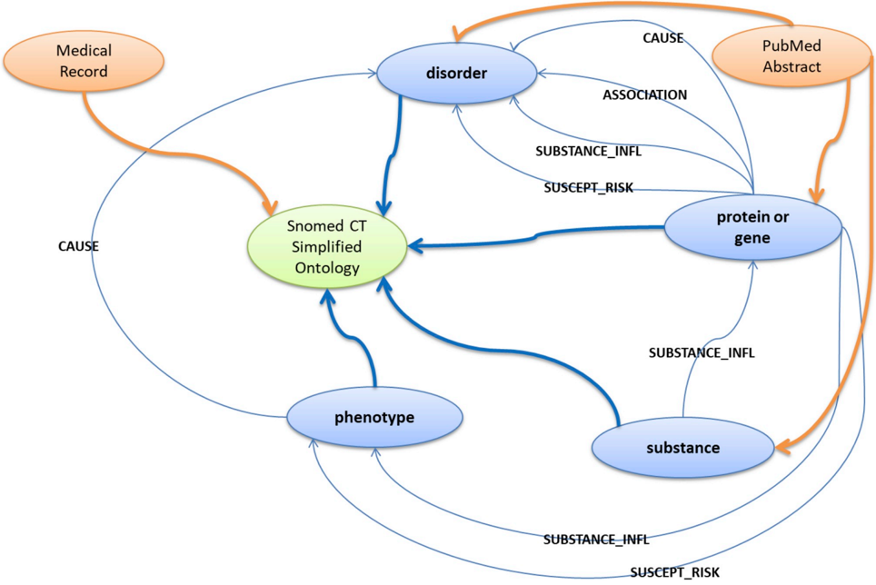
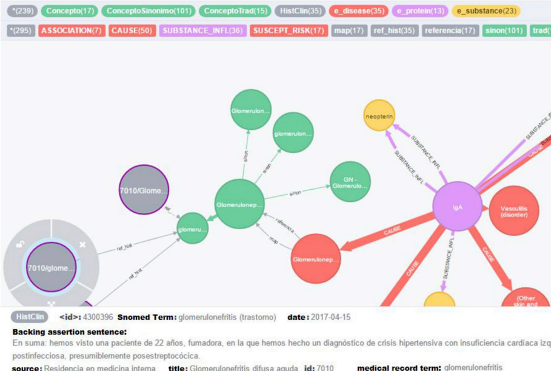
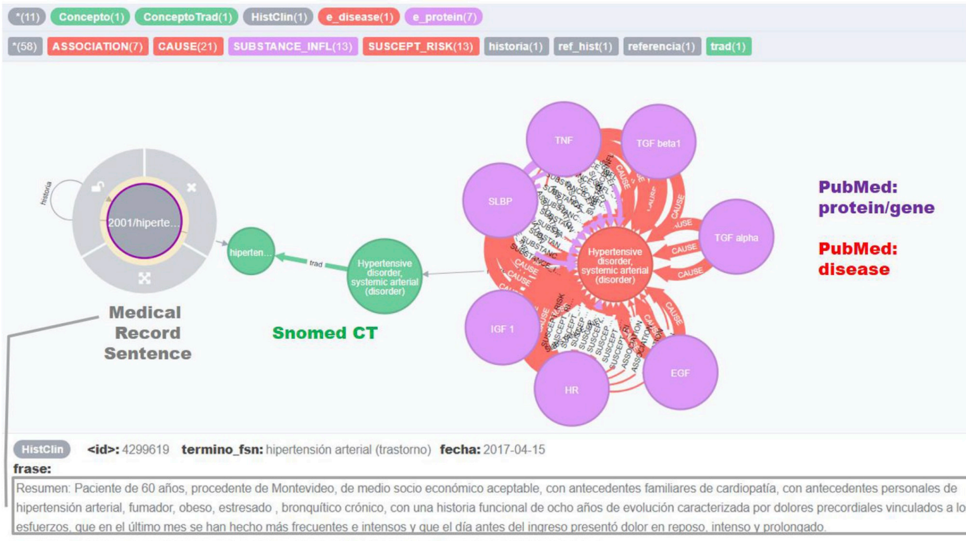
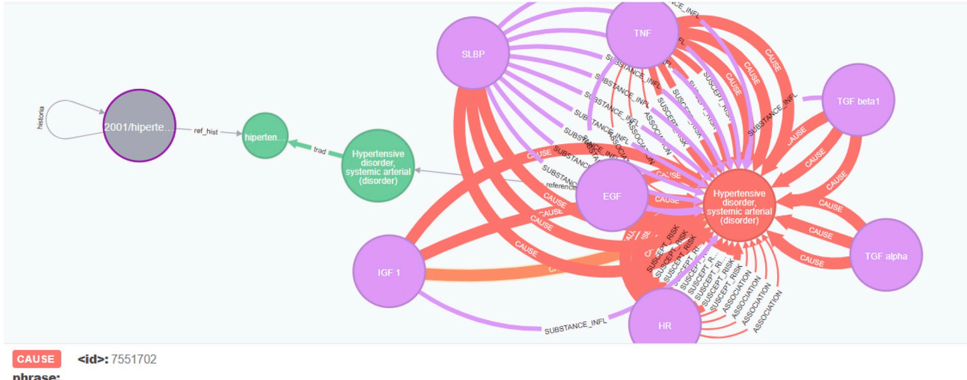

Contents lists available at ScienceDirect

## Informatics in Medicine Unlocked

journal homepage: www.elsevier.com/locate/imu

## From medical records to research papers: A literature analysis pipeline for supporting medical genomic diagnosis processes ☆

Fernando López Bello a, ∗ , Hugo Naya b , Víctor Raggio c , Aiala Rosá d

- a Basic Sciences Development Program (PEDECIBA, www.pedeciba.edu.uy), ICT4V (ict4v.org), Av. Italia 6201, Parque Tecnológico del LATU, Montevideo, 11500,

Uruguay

- b Bioinformatics Unit, Institut Pasteur de Montevideo, Montevideo, Uruguay
- c Genetics Department, Facultad de Medicina, Universidad de la República de Uruguay, Montevideo, Uruguay
- d Computer Science Institute (Instituto de Computación, INCO), Engineering School (Facultad de Ingeniería, FING), Universidad de la República, Montevideo, Uruguay

## A R T I C L E I N F O

## A B S T R A C T

Keywords: Controlled vocabulary Natural language processing Genomics Automated pattern recognition Publications

Medical records

## 1. Introduction

## 1.1. Motivation

With the advent of next-generation sequencing technologies, a vast amount of genomic data is generated for each patient. It is well-known that this trend surpasses Moore's Law in terms of cost, therefore facilitating the incorporation of genomic sequencing into routine clinical studies. A patient genome can be sequenced in a few hours or even minutes [1], and then is annotated using available genetic databases. Nevertheless, there is still further work needed before the physician has all of the necessary elements readily available for a specific case. The literature requires reviewing in such a way that will allow the gathering of the latest findings, including gene, gene expression, and gene-disease associations.

In this paper, we introduce a framework for processing genetics and genomics literature, based on ontologies and lexical resources from the biomedical domain. The main objective is to support the diagnosis process that is done by medical geneticists who extract knowledge from published works. We constructed a pipeline that gathers several genetics- and genomics-related resources and applies natural language processing techniques, which include named entity recognition and relation extraction. Working on a corpus created from PubMed abstracts, we built a knowledge database that can be used for processing medical records written in Spanish. Given a graph queries for relevant knowledge paths. The framework is not an end user application, but an extensible processing structure to be leveraged by external applications, enabling software developers to streamline incorporation of the extracted knowledge.

health conditions. Generally speaking, genes cause phenotypic variation, which is not necessarily pathogenic. The clinical expression of a gene variant, its interaction with non-genetic factors and substances, and its causative relationship with disorders or health conditions are progressively being documented as a result of ongoing research. From a medical standpoint, it is important that a medical geneticist can seize the specific knowledge that applies to an individual and his/her genome. Typical starting questions are: Is this variant pathogenic?; With which phenotypes/diseases is this variant associated?; Are there known substance/drug interactions?; and How is it associated with other traits or medically relevant conditions or risks?

The diagnosis process of medical geneticists must consider traits and incident factors, which starts from the inherited alleles downstream of the observed phenotypes, which are frequently noticed as diseases or

A vast number of relevant publications seed a constantly growing knowledge set relevant to these medical genomics-related areas. Only counting PubMed, this figure is close to300 1 publications per day. This makes attempts to become properly acquainted with the latest findings that could be relevant to a specific patient particularly challenging.

☆ Thanks to Dr. Laura Rodríguez (MD), who collaborated with an exhaustive analysis of the process outputs for evaluating this work's results.

∗

Corresponding author.

E-mail address:

fernando.lopez@ict4v.org (F. López Bello).

1 This figure corresponds to the number of abstracts retrieved from PubMed [2] for Genetics, with the query shown in Fig. 4 - Document Grabber Process, on a daily basis.

## https://doi.org/10.1016/j.imu.2019.100181

Received 19 February 2019; Received in revised form 26 March 2019; Accepted 7 April 2019

Available online 13 April 2019

document collection. Access APIs: Neo4J API (REST, Python, Java), Solr API (REST, Java)

5. Medical Records are received in an inbox, currently in CSV format. Tools used: KNIME
6. Process Medical Records block identifies entities in Medical Records, and maps them to the existing Mini Ontology entities. Tools used: KNIME, Neo4J, Solr

## 1.2. Objective

The goal of this work is to provide tools for the medical geneticist that optimize his/her access to the latest research pertaining to a specific patient (or to specific genomic information). Given some clinical and genomic information, the medical geneticist's diagnostic process should benefit from a toolset that eases discovering useful knowledge, such as related disorders, genetic causes or predispositions, associated proteins or substance interactions. A typical usage sequence is depicted in Fig. 1.

That said, the main product of our work is a framework for integrating domain sources and extracting useful knowledge from them, proposing a workflow for extending it with new sources. Furthermore, it should be possible to build applications that leverage this product with open application programming interfaces (APIs).

## 2. Background

## 2.1. Corpus of research abstracts

For our work, PubMed [2] was the main corpus of reference, with a yearly publication rate close to one million articles, being used for the preparation of more specific annotated benchmarks and corpora. Currently, PubMed features over 25 million XML formatted abstracts, including all MEDLINE abstracts (journals files since 1946) [3].

Since these documents contain text, written in natural language, to extract information from them requires Natural Language Processing (NLP) techniques. Several workshops and conferences address NLP for biomedical texts - the so-called BioNLP. A good example focusing on healthcare is BioASQ [4], one of the main ongoing competitions on the subject, gathering private, government, and academic technology and health-related institutions.

## 2.2. Challenges and resources

A usual challenge in BioNLP is the great variety and ambiguity of the terminology. Here is where lexical resources, such as thesauri and ontologies, specific to this domain, become a fundamental tool for the whole process.

In the healthcare domain, terminology standards have achieved notable maturity. Remarkable cases include ICD [5] for term classification, and SNOMED CT [6] as a multi-language collection of ontology organized hierarchies, also custom-built and extended for various affiliated countries.

More specifically, SNOMED CT is a collection of medical term thesauri, with an ontology structure-including synonyms, hyponyms, and hypernyms for each term. SNOMED CT comprises over 400 K concepts and 7.5M relations, which can be mapped to preexisting standards, such as ICD-9. There is an adapted country version for Uruguay [7].

Gene and protein nomenclature normalization efforts have produced well-defined standards, such as VarNomen/HUGO/HGVS [8] and UniProt [9]. Nevertheless, BioNLP papers quite often show different denominations for the same gene or protein. For example, the Homo sapiens gene WASHC5 [10] (also known as KIAA0196) codes for protein WASH-complex-subunit 5 (also known as Strumpellin).

Abbreviations pose an additional challenge in BioNLP, with its disambiguation being a context-sensitive problem. Thus, for example, the symbol T can refer to both T-cells and the T-gene. Liu et al. [11] obtain an abbreviation accuracy of 82% on this matter.

## 2.3. Entity recognition works in biomedical texts

An important reference for this work addresses the extraction of relevant entities and potential relations, targeting the identification of risk factors and associated pathologies [12]. The cited article explores the power of combining tools and sources, such as MeSH, Genia Tagger, SNOMED CT, and MEDLINE, thus acting as a capstone for the idea that we develop in this work. As we will see, several of these components play a role in our processing pipeline. Genia Tagger [13] has been frequently used both for part of speech tagging and named entity recognition (NER) in the BioNLP domain. For Spanish medical documents, Genia Tagger has been used in conjunction with Freeling [14] for entity recognition and automatic annotation [15]. ABNER [16] is another often-used gene and protein tagger with good performance, based on Conditional Random Fields. Additionally, several approaches rely strongly on gazetteers for precise entity identification (e.g., Hina et al. [17]).

Some efforts have addressed automatic or semi-automatic annotation of medical records. For the NER task, several mixed approaches combine Conditional Random Fields (CRF) and thesauri or ontologies

Fig. 1. Proposed framework usage from a user perspective. The user input consists of medical records, written in Spanish. Using a pre-generated knowledge database, each medical record is linked to the most significant relations extracted from research articles. As a result, on output, the framework produces a graph that integrates the main medical concepts of the medical record and applicable relations inferred from abstracts. The main steps are.

1. PubMed Abstracts (English) are acquired from PubMed by a process that downloads, unpacks and parses documents. Tools used: KNIME, Entrez
2. Lexical Resources and Ontologies were previously downloaded. Resources used: SNOMED CT, OMIM, HGVS
3. These two resources are used by the Pre Process Abstracts block, which builds the Mini Ontology graph with recognized entities and relations. At the same time, it builds a document collection form information retrieval. Tools used: KNIME, Abner Tagger, Java, Neo4J, Solr.
4. The Mini Ontology is available as graph and

Fig. 2. Framework context: Ingestion from text sources and application development.

[18,19]. In addition to those methods, others (e.g., Chikka et al. [20]) achieved a notable performance in information extraction, making use of specifically trained text mining models (e.g., using Apache cTAKES [21]).

## 2.5. Integration

Wu et al. [22] compare alternatives based on word embeddings to improve NER results in BioNLP, against existent proposals based on CRF, MaxEnt, and SVM. Chiu et al. [23] devise guidelines for good word2vec based embeddings, both CBOW and skip-gram, working on PubMed and the PMC corpus. For auxiliary tasks, these authors use GeniaSS as a sentence splitter and NLTK [24] for word tokenizing.

Gong [25] discusses the current application of text mining alternatives to the biomedical domain, proposing a pipeline for recognizing biomedical concepts, as well as discussing core components, such as POS tagging and CRF-based (like ABNER) or support vector machines, and how to combine machine learning with the dictionary-based approach. Several of these processing concepts are present in our work.

## 2.4. Relation extraction

Once the problem of identifying named entities has been addressed, knowledge can be expressed in terms of relations within each pair of entities, conforming tuples:

{relation\_type, entitity\_1, entity\_2}.

Among the vast number of publications regarding relation extraction, it is worth mentioning a few examples to contextualize our work. Open information extraction initiatives, such as Never Ending Language Learning (NELL) [26] or question answering targeted IBM Watson [27], present broad scope solutions for relation extraction, where relationship types might not be completely known in advance. In our case, we are focusing on a more specific context, with the defined entity and relationship types (e.g., genes and substances) and the interactions (e.g., cause or association) between them. An example of such a scenario can be found in BeFree [28]. Besides this, we also considered distant supervision. According to Mintz et al. [29]: 'The intuition of distant supervision is that any sentence that contains a pair of entities that participate in a known […] relation is likely to express that relationship in some way'. It is a relation learning strategy that builds a machine learning model from known ground truth, with pre-annotated relations, to classify a relation as existent or nonexistent. This model evaluates multiple features extracted from the natural language sentence.

On knowledge integration, NIH/NLM's SemRep [30] includes a relation extraction tool, from which the SemMedDB [31] database is generated. SemMedDB is a set of relations extracted from MEDLINE and includes a visualization browser, providing a concrete example of what we expect from a knowledge ontology. However, it is worth noting that our approach aims to integrate disparate sources, incorporating lexicon specific to genetics and genomics, and regionalized resources, such as SNOMED CT per-country releases.

The extracted information is traditionally delivered through a relational database, a dedicated framework [32] for querying normalized text or a data warehouse infrastructure [18]. For our proposal, we considered existing ontology graph representations for healthcare scenarios [33,34].

## 3. Material and methods

## 3.1. General framework description

Recapping Fig. 1, we built a framework capable of processing medical records written in Spanish, and producing an output that synthesizes literature findings that are relevant to it, from a genetics perspective. This knowledge synthesis is composed of concepts (entities) and relevant relations between them, as well as the actual document reference that backs each of these results. Actually, this output is the subset of a major knowledge database that has been preprocessed in advance.

Entities can be genes or proteins, phenotypes, substances or disorders. The main knowledge base, called Mini Ontology, is permanently updated from a corpus that contains novel articles, on a daily basis. Each new document from the corpus can eventually produce new relations between entities. Currently, the corpus consists of genomicsrelated PubMed abstracts (about 3 million abstracts in English, from 1990 until 2018), but can be extended to new sources. Also, each new medical record can be integrated into the knowledge base for further exploration.

The knowledge base can be queried in two ways: 1) starting from the medical record, and leading to related entities (like genes); or 2) starting from genes of interest (previously obtained from patients genome or exome analysis), and leading to related diseases and

substances.

The framework exposes services that application developers can leverage, and can easily integrate new data sources (Fig. 2).

As the main resource, the framework builds a knowledge base (Mini Ontology) from article abstracts and can be used to either traverse genomics concepts and articles in an ontology fashion or assess the medical genetics literature about relevant findings related to a specific medical record, written in Spanish.

The Mini Ontology can be accessed from external applications via Application Program Interfaces (APIs) that include graph queries and enterprise search requests, from almost every modern programming language. Before providing the pipeline details, it is worth noting that there are several integration points that can be used to bring new sources on board: 1) Abstract articles are currently received from PubMed, but the same inbox can receive documents from other sources. For extraction from PubMed, we built a custom process that could eventually fetch literature from other sites or news feeds. 2) Tools for NER currently include several statically bound dictionaries, but this set can easily be extended with new ones, to handle more terminology. 3) The Mini Ontology relies on the ontological definition of the concept from SNOMED CT, which is language independent.

## 3.2. Implementation

Our proposal relies on a combination of curated thesauri and dictionaries, NLP techniques, and a graph database engine. At its core, building the Mini Ontology includes these main components (see Fig. 3): Abstracts Processing (NER and Relation Extraction, in English); Medical Records (NER, in Spanish), and Mini Ontology Integration.

The development platform included the following tools: KNIME [35], a Java-based open source data science platform; Neo4j graph engine [36] with Cypher query language.

functionality was implemented with Apache Solr [37], which builds an index on top of the Mini Ontology to enable Solr JSON queries.

## 3.2.1. Obtaining PubMed documents

Our working corpus consists of about 3 million PubMed abstracts, which are retrieved from PubMed on a periodic basis (e.g., daily) by submitting a query against the PubMed database, using the Entrez search and retrieval system [38]. The query defines a document subset specific to Human Genetics.

Our document retrieval process is implemented in KNIME (Fig. 4, Document Grabber Process), and produces Comma Separated Value (CSV) files containing the abstracts, tokenized with OpenNLP Word Tokenizer [39]. This CSV is transformed into an internal representation format containing: Article ID, Title, Abstract Text, Authors, Source, and Release Date.

We take into account that other sources, beyond PubMed, could be added into our pipeline. In any case, the new source must be adapted to the above-defined format, which can be easily achieved by leveraging existing KNIME functionality, such as PDF-to-text conversion based on Tika [40], RSS feeds, and REST requests.

## 3.2.2. English Abstracts Processing

Typically, our corpus abstracts are relatively short paragraphs, from tens to a few hundreds of words. Each relation is scoped within a sentence. This stage is also implemented in KNIME, integrating NER and relation extraction strategies as described below.

3.2.2.1. Named entity recognition (NER) . We rely on SNOMED CT ontologies to identify entities, such as disorder, finding, substance, product, organism, and morphological abnormalities. Acronym and pre-coordination disambiguation tasks are part of this workflow.

Apart from the present work, additional Enterprise Search

We also used OMIM [41], a curated database of gene-phenotype relations, which includes gene name homonyms. It is worth noting that

Fig. 3. Process pipeline for generating the Mini Ontology from corpora and datasets.

Fig. 4. Document Grabber process Excerpt.

OMIM enumerates specific phenotypes (which might be a disorder or not) related with genetics, and thus-for our specific case-is a more precise source for phenotype identification than SNOMED CT.

Type &gt; . We specified the following relation rules:

Finally, VarNomen-HUGO-HGVS provides a standardized symbol nomenclature for genes and proteins. Once the abstracts corpus is ready, initial tasks include sentence splitting, case conversion, and special characters removal, translating foreign symbols. A cascade of dictionary-based identification is applied for initial entity identification. Then, we use ABNER tagger to recognize genes and proteins. ABNER tagger is based on Conditional Random Fields, and in our case, it is configured to use the BioCreative corpus model.

3.2.2.2. Relation extraction . For relation extraction within our pipeline, we propose a simple heuristics-based mechanism that leverages available domain-specific resources and also lets domain experts establish basic rule sets for identifying significant relations.

Rules for inferring relation are specified by indicating two entity types and one or more cue words , as shown in Table 1. To improve recall, cue words are reduced to its word stems. This way, a user can specify as many plain rules as needed, later expanded into single, atomic rules in the form &lt; Relation Type, Entity 1 Type, Cue Word Stem, Entity 2

- Cause : An entity ( protein , gene , substance or phenotype ) that causes a disease
- Association : A generic association between an entity ( protein , gene , substance or phenotype ) and a disease , not necessarily implying causative effects
- Substance influence : A substance that is relevant for functional aspects of a gene or protein
- Susceptibility or risk: A protein or gene that poses a risk of triggering a disease or phenotype

For example, for ' Heparin-induced thrombocytopenia is caused by the formation of antibodies that bind to specific complexes of platelet factor 4 (PF4) and heparin' , two cause (CAUSE) relations are inferred, as per the second rule defined in Table 1:

CAUSE defined by: gene-symbol = pf4 (PF4) / disease = heparin induc thrombocytopenia (Heparin induced thrombocytopenia) / cue = caus by

Table 1 Rules for detecting relations.

| Rel.Type                                       | Entity 1 Type                  | Cue Words                                                                                                                                                    | Entity 2 Type       |
|------------------------------------------------|--------------------------------|--------------------------------------------------------------------------------------------------------------------------------------------------------------|---------------------|
| ASOC CAUSA CAUSA CAUSA INFSUS INFSUS SURI SURI | PROTEIN|GENE-SYMBOL            | associated                                                                                                                                                   | DISEASE             |
|                                                | PROTEIN|GENE- SYMBOL|PHENOTYPE | caused|caused by|mutations|causing|underlies|linked|directs                                                                                                  | DISEASE             |
|                                                | GENE-SYMBOL|PROTEIN            | cause|caused|lead to|leading to|responsible|involved                                                                                                         | DISEASE             |
|                                                | GENE-SYMBOL|PROTEIN            | mutated|underlies|family|Presenting|dysfunction|effect                                                                                                       | DISEASE             |
|                                                | SUBSTANCE                      | effect|impact|related|associated with|sensivity|determined|influence|weight|genetic marker|responsive loci|predicting|outcome|relationship|efficacy|based on | GENE-SYMBOL|PROTEIN |
|                                                | SUBSTANCE                      | response|role|link between|association|moderation|relationship betweenresponse                                                                               | GENE-SYMBOL|PROTEIN |
|                                                | CHROM                          | susceptibility                                                                                                                                               | DISEASE             |
|                                                | PROTEIN|GENE-SYMBOL            | associated|Association|risk|contributes|susceptibility                                                                                                       | DISEASE|PHENOTYPE   |
| INFSUS                                         | PROTEIN|GENE-SYMBOL            | dose|acquire|express|alter                                                                                                                                   | PHENOTYPE           |
| INFSUS                                         | PROTEIN|GENE-SYMBOL            | dose|acquire|express|alter                                                                                                                                   | DISEASE             |

CAUSE defined by: protein = platelet factor 4 (platelet factor 4) / disease = heparin induc thrombocytopenia (Heparin induced thrombocytopenia) / cue = caus by}

Finally, to improve precision, we refined the relation extraction strategy using distant supervision, as explained in section 4.3.1 Improving Precision.

## 3.2.3. Medical records: NER, in Spanish

The expected input of the framework, either from a user or an external application, are medical records written in Spanish. We perform an NER recognition on them, to map Medical Records with the existing knowledge base. This step is implemented in KNIME.

Since an actual set of medical records in Spanish was not available for research, we manually transcribed 109 clinical notes with physician observations, from actual patient cases, used for medical education. Original stories come from university course textbooks from the Faculty of Medicine (Universidad de la República, Uruguay), covering multiple topics: Hematology (Hematología), Neurology (Encares de Clínica Neurológica 1, Encares de Clínica Neurológica 2), Internal Medicine (Encares para el Internado Obligatorio, Residencia en medicina interna), and Cardiology (Encares de Clínica Cardiológica)

As a government healthcare agency (Salud.Uy) initiative, a fullfledged SNOMED CT release is available for Uruguayan Spanish terminology, for translating existing terms, and constantly incorporating new ones. This gives us the chance to elaborate specific dictionaries for entity recognition, which are specific to medical records spellings: Findings, Substances and Product Names, Organisms, Morphologic Abnormalities, and Disorders.

Most of these disease term recognition tasks are performed based on the dictionary approach. Additionally, we attempted an additional step for further recognition using KNIME's nodes for Stanford Named Entity Learner [42], for which we trained a CoreNLP CRF model, but had issues recognizing multi-term diseases. For example, for hipertensión arterial (English arterial hypertension ), the dictionary-based approach correctly recognizes hipertensión arterial disease in Spanish, but the CoreNLP node recognized both hipertensión (English hypertension ) and arterial only individually.

## 3.3. Mini Ontology Integration

Relevant relations, medical records, and PubMed abstracts corpora are integrated into the depicted graph structure (Fig. 5).

The relation triplets produced so far carry their source information as attributes to enrich the graph of our ontology: publication ID, authors, source, abstract title, and a sentence from which the relation was inferred.

All of this information is exported to the graph database, which was implemented in the Neo4J graph engine. The graph can be queried and visualized for inquiry and exploration. At this point, querying from a medical record vertex to a PubMed entity by using the inferred relations as the valid path should convey the expected end-to-end result, as depicted in Fig. 6. The graph can be traversed from the medical record to PubMed entities, through inferred relations. In this example:

- A medical record concept (gray node with ID 7010), has a relation that points to the Spanish SNOMED CT translation glomerulonephritis (trastorno) (green node). The medical record attributes include the source sentence.
- Node glomerulonephritis (trastorno) is a translation from the main SNOMED CT concept Glomerulonephritis (disorder) (green node, bigger size).
- Glomerulonephritis (disorder) SNOMED CT concept is a reference from the Glomerulonephritis disease entity (red node), found in a PubMed abstract.
- Another PubMed entity, IgA , is a protein/gene (violet node) related

(CAUSE relation) with the Glomerulonephritis disease entity . The CAUSE relation attributes include the source sentence and PubMed article ID.

In summary, from the medical record nodes , we reach a causative relation that involves a gene/protein node .

## 4. Results

## 4.1. Mini ontology dimensions

To give an idea of the size of the built knowledge base, here we show a few count measures of the graph.

- Entities. Nodes correspond to entities that are either preloaded from SNOMED CT or recognized at PubMed abstracts or medical records.
- Relations. Edges represent relations, either pre-loaded from SNOMED CT or inferred from PubMed.

## 4.2. NER evaluation

## 4.2.1. PubMed abstracts

To evaluate NER, we selected asthma , a common disorder with potential genetics causes or associations, and which is a disorder family.

We focus on the named entities that take part in relations involving genes or proteins. For the sake of better coverage, we consider relaxed criteria, in which we accept gene-related concepts as valid entities (for example: '5 lipoxygenase promoter', 'A1A2 genotype', 'A2 genotype').

This approach produced a rather fair result for precision (see Table 2). On the other hand, calculation of the NER recall requires manually identifying entities in actual abstracts corpus that were not automatically recognized. We consider this additional effort as beyond the scope of this work.

## 4.2.2. Medical records, in Spanish

The simple NER approach that we applied to medical records, leveraging Uruguayan terminology dictionaries from SNOMED CT, produced the results listed in Table 3 for the domains of disease and finding entities. A physician manually evaluated the expected vs. found entities for each medical record, considering an entity as correctly

Fig. 5. Structure of the mini ontology: A graph with nodes representing entities and edges representing relations between them.

identified when its recognized name was exactly or nearly exactly as expected. We obtained a precision of 94% when counting entity repetitions (more than one mention), and 87% leaving repetitions apart.

with an evaluation set of 800 relation instances. We obtain the best results with KNN (79% precision) and SVM (74% precision).

## 4.3. Relation extraction

For relation extraction, we perform a manual evaluation of three relatively rare disorders: glaucoma, Wilms tumor, and pancreatitis. We need to accommodate the human effort in a timely fashion, so we focus on the obtained relations (88 in total). With such a low number, to have a first approximation to precision and recall, we consider whether the relation exists or not.

These results correspond to manual evaluation from a medical geneticist, also considering OMIM MorbidMap, which pairs each disorder with a collection of related gene symbols [43]. These first results are shown in Table 4.

Interestingly, a few novel valid relations are found, which were not registered in our OMIM MorbidMap [41], as described in Table 5.

## 4.3.1. Improving precision

At this point, the Relation Extraction strategy returned rather low precision figures (Table 4). We observe that many automatically inferred relations were not valid. To address this, we refine primary results by adding a Distant Supervision strategy. In our case, this is used to sharpen precision by re-classifying extracted relations as valid or invalid.

Briefly, Distant Supervision is a semi-supervised method that captures the patterns of true, known relations (usually from a known database), to segregate them from nonexistent relations. To implement Distant Supervision, we create a set of 4000 positive and 4000 negative relation samples in plain text sentences and define a set of selected features for each one. Then, we train and evaluate different classifiers,

Finally, we use the KNN classifier to filter out invalid relations from our initial results, obtaining a better precision figure at the expense of sacrificing recall (Table 6).

## 4.4. Graph queries

Queries to the Mini Ontology are built using Neo4J Cypher language. In the example depicted in Fig. 7, we show how a medical record is mapped to the knowledge base. In this case, the medical record includes an assertion about hipertensión arterial in Spanish (hypertensive disorder, or HTN, in English), which we first recognize as a known disorder type entity using SNOMED CT. Then, the Cypher query retrieves the subgraph of interest that applies to this disorder, composed of entities and recognized relations in PubMed.

To improve query precision, the query validates that all retrieved relations occur more than T times, where T is a safety threshold for checking that the relation exists in at least T abstract mentions. If we expand one of these relations, we can check for the abstract sentence that motivated the inference (Fig. 8). Besides this, the query ranks results by the number of evidences - a count on relations between each pair of concepts, ranking the most frequently occurring relationships in first place.

## 5. Discussion and conclusions

In summary, we present a framework for building software applications to help the medical geneticists diagnostics process, and accept Spanish medical records as input. We identified multiple advantages and limitations associated with our methods.

source: Residencia en medicina interna title: Glomerulonefritis difusa aguda

id: 7010

medical record term: glomerulonefritis

Fig. 6. Subgraph showing related entities, including medical record concepts (grey), SNOMED CT concepts [displayed as green nodes, with size big for principal concepts (FSN), medium for synonyms, and small for translations], and entities recognized in PubMed (red = disorder, yellow = substance, violet = protein/gene, pink = phenotype). ASSOCIATION , CAUSE , SUBSTANCE\_INFL, and SUSCEPT\_RISK are inferred relations. (For interpretation of the references to colour in this figure legend, the reader is referred to the Web version of this article.)

Table 2 Precision for named entities that participate in relations in Asthma

dataset.

| NER Evaluation Summary - Asthma   |       |
|-----------------------------------|-------|
| Retrieved Entities                | 4.147 |
| True Positive                     | 2.498 |
| False Positive                    | 1.649 |
| Precision:                        | 60%   |

## Table 3

Precision for named entities in Spanish (medical records).

| Correct or nearly correct entities, counting repetitions:                       | Correct or nearly correct entities, counting repetitions:                       |
|---------------------------------------------------------------------------------|---------------------------------------------------------------------------------|
| Identified named entities:                                                      | 812                                                                             |
| Relevant entities:                                                              | 760                                                                             |
| Precision:                                                                      | 94%                                                                             |
| Strict criteria (correct or nearly correct entities, not counting repetitions): | Strict criteria (correct or nearly correct entities, not counting repetitions): |
| Identified named entities:                                                      | 403                                                                             |
| Relevant entities:                                                              | 351                                                                             |
| Precision:                                                                      | 87%                                                                             |

## 5.1. Advantages

- Extensibility. The proposed workflow includes a corpus and resources set that can be extended by including more papers and ontology sources. The document acquisition part of the pipeline can integrate new sources available in multiple common ways, such as RSS feeds or REST APIs. No change is needed to the processing components that build the Mini Ontology.

## Table 4

First results of relation extraction on selected rare diseases.

|           |                     | Actual Related            | Not Related   |
|-----------|---------------------|---------------------------|---------------|
| Predicted | Related Not Related | 47 0 Precision = Recall = | 41 0 53% 100% |

## Table 5

Automatically inferred relations, validated by manual evaluation, and not present in the OMIM MorbidMap.

| Disorder                    | Gene Symbol                    | Relation                                                  |
|-----------------------------|--------------------------------|-----------------------------------------------------------|
| Glaucoma Wilms Pancreatitis | Gene FOXC1 Gene PCDHA Gene HLA | Susceptibility/Risk, Association, Cause Cause Association |

Table 6 Improved precision after distant supervision.

|           |             | Actual Related   | Not Related   |
|-----------|-------------|------------------|---------------|
| Predicted | Related     | 20 27            | 10 31         |
|           | Not Related |                  |               |
|           |             | Precision =      | 67%           |
|           |             | Recall =         | 43%           |

fuente: Encares de Clínica Cardiológica titulo: Angina inestable   termino: hipertensión arterial   id: 2001

Fig. 7. Query that links a medical record to inferred relations. Each relation instance corresponds to a different mention.

- Novel relations inference. The framework can infer novel relations. In the evaluation of asthma results, we show new relations that are not present in our reference baseline (OMIM MorbidMap) but are manually evaluated as correct. This is an interesting finding since it actually corresponds to new valid relations not found in the MorbidMap release we used.

valid relation can be found in several sentences.

- Precision. Although an evaluation on a broader set is crucial, we showed how Distant Supervision is a promising method for improving precision. Even though this affects recall, the missing relations due to diminished recall can eventually be mitigated by ingesting new abstracts (or the entire document), because usually a
- Language independence. The implemented pipeline addresses concepts and relation extractions from English language literature sources, and map them to Spanish medical records via SNOMED CT, which contains language agnostic concept definitions, as well as their corresponding translations. As a result, we also built a knowledge database that can be queried from external applications.
- Advanced search features , inherent to graphs. The Mini Ontology is implemented as a graph, which enables queries that are more complex than simple searches. Thus, instead of performing a traditional index-based search, a graph inquire can leverage the

phrase:

The Iow EGF TGF alpha; and IGF 1 concentrations in HTN irrespective of their clonal origin or the presence or absence of activating mutations argue for increased cAMP as the primary cause for thyroid epithelial cell proliferation in established HTN.

idPubMed: 11288981 relType: CAUSA source: Thyroid official joumnal of the American Thyroid Association title: Growth factor expression in cold and hot thyroid nodules.

Fig. 8. Relation attributes for the selected relation (orange). (For interpretation of the references to colour in this figure legend, the reader is referred to the Web version of this article.)

following capabilities:

- o The distance between entities , in terms of the number of relationships that connect them
- o The centrality of concepts , in terms of importance: how important is one concept as it relates to others
- o Relationship strength : how many evidences in abstracts support the existence of the inferred relationship

## 5.2. Limitations

- False negatives. We experimented with Distant Supervision for improving precision, but this could also produce a number of false negatives. Active learning could provide relief on this matter: relations that were discarded by our pipeline could be optionally marked as 'classified negative', but prompted user confirmation. This way, each originally inferred relation could be suggested for discard by our relation classifier, but the final decision could be left to the physician, thereby reducing the impact on recall.
- Precision risks. In our relation detection logic, good recall is prone to accepting false positives. We are aware of this situation, and as a first approach, we mitigate this by checking whether the same relation exists at different sources. But this is just a heuristic, which deserves a quantitative validation (not included in this article).

## 5.3. Usage notes

- At the core of our framework, the mini ontology gathers knowledge to be leveraged by consumer applications, powered by two standard API libraries :
- o Neo4J graph API , for exploring the knowledge graph relations, using a full-fledged graph query language (Cypher). Furthermore, the graph database includes its own graph processing algorithms, such as identifying node neighborhoods (e.g. concept affinity, in our case).
- o Solr information retrieval API , for querying abstracts using complex search operators. This is not a regular plain text search: since entities were previously identified (e.g. proteins, diseases), the search can focus on specific term types, or term proximity using Solr's Lucene syntax.

An application can make use of both APIs, in many different programming languages, including Java, Python and REST invocations.

## 5.4. Usage scenarios

- An external medical system can interrogate the graph in order to: o retrieve relevant relations between causes and diseases
- o find the articles that best suit a patient case description
- o build custom queries for new semantic requirements, for instance:
- determine concept affinity (e.g. neighbor proteins, in terms of semantics) - leveraging graph community detection algorithms
- identify relationships backed by most assertions - by querying graph relation edges
- It is also possible to fulfill information retrieval requirements, which include:
- o query for single terms in the enriched collection of abstracts search by abstract terms, source or identified entities
- o build complex queries on the collection, combining operators and available fields
- As a usage example that uses the above mentioned standard APIs, a chatbot prototype application was built (link to video) for a few Genetics implied disorders. This external app makes use of the Mini Ontology to answer questions like 'what is disorder X?', or 'which X factors cause Y disorder?'. The chatbot can interact in English and accept a medical record in Spanish.

Supplementary video related to this article can be found at https:// doi.org/10.1016/j.imu.2019.100181

## 6. Future work

This work provides a basis for deepening into further functionalities. Below we present a list of potential future improvements:

- There are several important aspects of NLP performance that deserve more consideration. Since the framework was the main focus, it is worth noting that there is room for improvement in terms of NLP tasks, namely:
- o Add handling of negation and hedging. An interesting work in this matter is presented in Ref. [44], and for BioNLP, in Ref. [45].
- o Identify quantities (e.g., patient analysis measures) or time references.
- o A number of methods could be incorporated to improve precision:
- Dependency Parsing, for more precise relation extraction rules, combined with Semantic Role Labeling.
- Document/Word vector representations [46], for handling document similarity and for cue words generalization.
- Broaden domain scope
- o Incorporate new corpus sources. In particular, for Spanish and Portuguese spoken countries, we consider Scielo [47] as the main reference in Latin America.
- o Integrate new resources, in particular, NCBI's ClinVar [48].
- o Automate release updates on resources like thesauri and ontologies (SNOMED, OMIM, VarNomen).
- o Extend to other biomedical subdomains, beyond Genetics and Bioinformatics.
- Extend the framework base with machine learning and neural networks platforms, such as TensorFlow [49], Theano [50], Keras [51], and Spark MLLib [52].
- Add quality metrics to inferred relations,
- o derived from sources:
- the impact factor of the publication
- release date ( more recent means better )
- number of references to the article
- o calculated from the graph database itself:
- Incorporate influence metrics of each article (abstract), derived from graph metrics, such as centrality.
- Elaborate a synthesized, summary graph, eliminating redundant relationship edges.

## Funding statement

This work was supported by ICT4V -Information and Communications Technologies for Verticals (ict4v.org), grant number POS\_ICT4V\_2016\_1\_05.

## Competing interests statement

We, the authors, declare that have no competing interests.

## Contributorship statement

Dr. Hugo Naya conceived the presented idea. Dr. Víctor Raggio offered the medical perspective for the objectives and participated in actual results evaluations. Fernando López Bello developed the theory and performed the computations. Dr. Aiala Rosá verified the analytical methods, and encouraged Fernando López Bello to investigate improvements through applying distant supervision. All authors discussed the results and contributed to the final manuscript.

## Appendix A. Supplementary data

Supplementary data to this article can be found online at https:// doi.org/10.1016/j.imu.2019.100181.

## References

- [1] Broad Institute. Can DNA sequencing get any faster and cheaper? Broadminded Blog 2011. https://doi.org/10.1360/zd-2013-43-6-1064.
- [2] US National Library of Medicine National Institutes of Health, PubMed, https:// www.ncbi.nlm.nih.gov/pubmed/ [Accessed 30 December 2018].
- [3] National Institutes of Health. PubMed Fact Sheet. 2013. p. 1-6http://www.nlm.nih. gov/pubs/factsheets/medline.html, Accessed date: 5 May 2018.
- [4] Tsatsaronis G, Balikas G, Malakasiotis P, Partalas I, Zschunke M, Alvers MR, Weissenborn D, Krithara A, Petridis S, Polychronopoulos D, others. An overview of the BIOASQ large-scale biomedical semantic indexing and question answering competition. BMC Bioinf 2015;16:138.
- [5] World Health Organization (WHO). International statistical classification of diseases and related health problems. 2016.
- [6] International Health Terminology Standards Development Organisation (IHTSDO). SNOMED CT. 2017.
- [7] AGESIC. Snomed CT Uruguay. 2015.
- [8] Human Genome Variation Society (HGVS). Human variome project (HVP), HUman genome organization (HUGO), sequence variant nomenclature. 2017.
- [9] UniProt consortium, Uniprot (Universal Protein resource) Knowledge Base, https:// www.uniprot.org [Accessed 10 January 2019].
- [10] UniProt, UniProtKB - Q12768 (WASC5\_HUMAN), https://www.uniprot.org/ uniprot/Q12768 [Accessed 27 August 2017].
- [11] Liu Y, Ge T, Mathews KS, Ji H, McGuinness DL. Exploiting task-oriented resources to learn word embeddings for clinical abbreviation expansion. Proc. 2015 work. Biomed. Nat. Lang. Process. 2015. p. 92-7.
- [12] Hamon T, Graña M, Raggio V, Grabar N, Naya H. Identification of relations between risk factors and their pathologies or health conditions by mining scientific literature. Medinfo 2010:964-8.
- [13] Tsuruoka Y. GENIA tagger: Part-of-speech tagging, shallow parsing, and named entity recognition for biomedical text. 2006.
- [14] Padró L, Stanilovsky E. FreeLing 3.0: towards wider multilinguality. Proc. Lang. Resour. Eval. Conf. (LREC 2012). Turkey: Istanbul; 2012.
- [15] Oronoz M, Casillas A, Gojenola K, Perez A. Automatic annotation of medical records in Spanish with disease, drug and substance names. Iberoam. Congr. Pattern recognit. 2013. p. 536-43.
- [16] Settles B. ABNER: an open source tool for automatically tagging genes, proteins and other entity names in text. Bioinformatics 2005;21:3191-2.
- [17] Hina S, Atwell E, Johnson O. Secure information extraction from clinical documents using SNOMED CT gazetteer and natural language processing. Internet technol. Secur. Trans. (ICITST), 2010 Int. Conf.; 2010. p. 1-5.
- [18] Fette G, Ertl M, Wörner A, Kluegl P, Störk S, Puppe F. Information extraction from unstructured electronic health records and integration into a data warehouse. GIJahrestagung; 2012. p. 1237-51.
- [19] Yang H, Garibaldi JM. A hybrid model for automatic identification of risk factors for heart disease. J Biomed Inform 2015;58:S171-82.
- [20] Chikka VR, Mariyasagayam N, Niwa Y, Karlapalem K. Information extraction from clinical documents: towards disease/disorder template filling. Int. Conf. Cross-language eval. Forum Eur. Lang.; 2015. p. 389-401.
- [21] Savova GK, Masanz JJ, Ogren PV, Zheng J, Sohn S, Kipper-Schuler KC, Chute CG. Mayo clinical Text Analysis and Knowledge Extraction System (cTAKES): architecture, component evaluation and applications. J Am Med Inform Assoc 2010;5:507-13.
- [22] Wu Y, Xu J, Jiang M, Zhang Y, Xu H. A study of neural word embeddings for named entity recognition in clinical text. AMIA annu. Symp. Proc. 2015. p. 1326.
- [23] Chiu B, Crichton G, Korhonen A, Pyysalo S. How to train good word embeddings for biomedical NLP. ACL 2016; 2016. p. 166.
- [24] Bird S. NLTK: the natural language toolkit. Proc. COLING/ACL interact. Present.

| [25]      | Sess. 2006. p. 69-72. Gong L. Application of biomedical text mining. Artif. Intell. Trends appl.,                                                                                                                                                                                     |
|-----------|---------------------------------------------------------------------------------------------------------------------------------------------------------------------------------------------------------------------------------------------------------------------------------------|
| [26]      | Carlson A, Betteridge J, Kisiel B, Settles B, Hruschka Jr. ER, Mitchell TM. Toward an architecture for never-ending language learning. AAAI. 2010. p. 3.                                                                                                                              |
| [27]      | Ferrucci DA. Introduction to 'this is Watson. IBM J Res Dev 2012;56:1.                                                                                                                                                                                                                |
| [28]      | Bravo À, Piñero J, Queralt-Rosinach N, Rautschka M, Furlong LI. Extraction of re- lations between genes and diseases from text and large-scale data analysis: im- plications for translational research. BMC Bioinf 2015;16:55.                                                       |
| [29]      | Mintz M, Bills S, Snow R, Jurafsky D. Distant supervision for relation extraction without labeled data. Proc. Jt. Conf. 47th annu. Meet. ACL 4th int. Jt. Conf. Nat. Lang. Process. AFNLP vol. 2 vol. 2. 2009. p. 1003-11.                                                            |
| [30]      | Rindflesch TC, Fiszman M. The interaction of domain knowledge and linguistic structure in natural language processing: interpreting hypernymic propositions in biomedical text. J Biomed Inform 2003;36:462-77.                                                                       |
| [31]      | Kilicoglu H, Shin D, Fiszman M, Rosemblat G, Rindflesch TC. SemMedDB: a PubMed-scale repository of biomedical semantic predications. Bioinformatics 2012;28:3158-60.                                                                                                                  |
| [32]      | Harkema H, Roberts I, Gaizauskas R, Hepple M. Information extraction from clinical records. Proc. 4th UK e-Science All Hands Meet. 2005.                                                                                                                                              |
| [33]      | Campbell WS, Pedersen J, McClay JC, Rao P, Bastola D, Campbell JR. An alternative database approach for management of SNOMED CT and improved patient data queries. J Biomed Inform 2015;57:350-7.                                                                                     |
| [34]      | Neo4J. Neo4j life sciences and healthcare network. 2017.                                                                                                                                                                                                                              |
| [35]      | Berthold MR, Cebron N, Dill F, Gabriel TR, Kötter T, Meinl T, Ohl P, Sieb C, Thiel K, Wiswedel B. {KNIME}: the {K}onstanz {I}nformation {M}iner. Stud. Classif. Data anal. Knowl. Organ. (GfKL 2007). Springer; 2007.                                                                 |
| [36]      | Neo4j. Neo4j. 2017.                                                                                                                                                                                                                                                                   |
| [37] [38] | Solr. Apache Solr enterprise search. 2017. NCBI, Entrez, https://www.ncbi.nlm.nih.gov/books/NBK3837/#EntrezHelp.The_                                                                                                                                                                  |
| [39]      | Entrez_Databases [Accessed 31 December 2017]. Apache, OpenNLP, https://opennlp.apache.org/ [Accessed 31 December 2017].                                                                                                                                                               |
| [40]      | Apache, Tika, https://tika.apache.org [Accessed 31 December 2017].                                                                                                                                                                                                                    |
| [41]      | McKusick VA B. McKusick-nathans institute for genetic medicine. Johns Hopkins University. National Center for Biotechnology Information, National Library of Medicine, Online Mendelian Inheritance in Man, OMIM; 2004.                                                               |
| [42]      | Manning C, Surdeanu M, Bauer J, Finkel J, Bethard S, McClosky D. The Stanford CoreNLP natural language processing toolkit. Proc. 52nd annu. Meet. Assoc. Comput. Linguist. Syst. Demonstr.; 2014. p. 55-60.                                                                           |
| [43]      | McKusick VA, McKusick-Nathans Institute for Genetic Medicine, Johns Hopkins University. National Center for Biotechnology Information, National Library of Medicine, Online Mendelian Inheritance in Man, OMIM: MorbidMap, https://www. omim.org/help/faq#1_5 [Accessed 25 May 2017]. |
| [44]      | Moncecchi G, Minel J-L, Wonsever D. Improving speculative language detection using linguistic knowledge. Proc. Work. Extra-propositional Asp. mean. Comput. Linguist.. 2012. p. 37-46.                                                                                                |
| [45]      | Morante R, Daelemans W. Learning the scope of hedge cues in biomedical texts. Proc. Work. Curr. Trends biomed. Nat. Lang. Process.. 2009. p. 28-36.                                                                                                                                   |
| [46]      | Mikolov T, Sutskever I, Chen K, Corrado GS, Dean J. Distributed representations of words and phrases and their compositionality. Adv. Neural inf. Process. Syst. 2013. p. 3111-9.                                                                                                     |
| [47]      | São Paulo Research Foundation (FAPESP), Latin American and Caribbean Center on Health Sciences Information (BIREME), Scientific Electronic Library Online, SciELO, http://www.scielo.org [Accessed 9 September 2018].                                                                 |
| [48]      | NCBI, ClinVar, https://www.ncbi.nlm.nih.gov/clinvar [Accessed 12 September 2018].                                                                                                                                                                                                     |
| [49]      | Abadi M, Agarwal A, Barham P, Brevdo E, Chen Z, Citro C, Corrado GS, Davis A, Dean J, Devin M. others, Tensorflow: large-scale machine learning on hetero- geneous distributed systems. 2016. ArXiv Prepr. ArXiv1603.04467.                                                           |
| [50]      | Université de Montréal, Theano, http://deeplearning.net/software/theano/ [Accessed 6 September 2018].                                                                                                                                                                                 |
| [51]      | A. Keras, Keras, https://keras.io [Accessed 9 July 2018].                                                                                                                                                                                                                             |
| [52]      | Meng X, Bradley J, Yavuz B, Sparks E, Venkataraman S, Liu D, Freeman J, Tsai DB, Amde M, Owen S. Others, mllib: machine learning in Apache Spark. J Mach Learn                                                                                                                        |