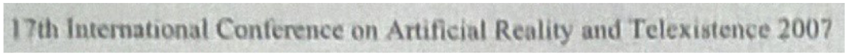
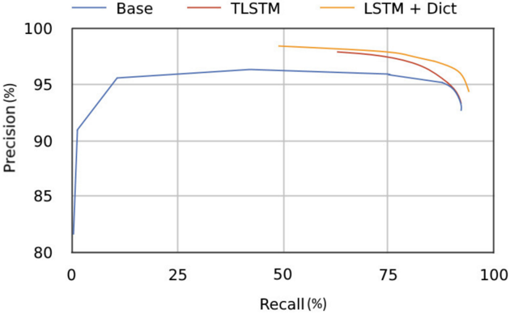
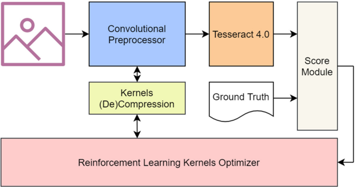
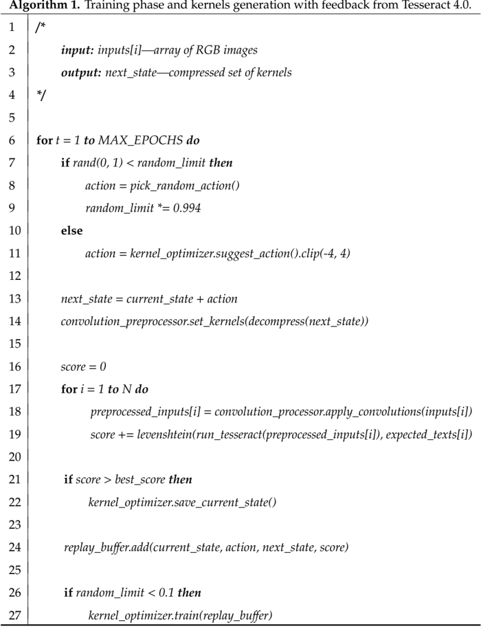
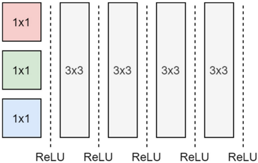
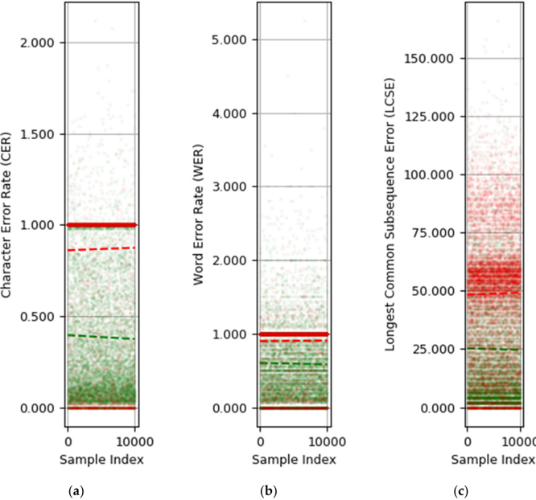
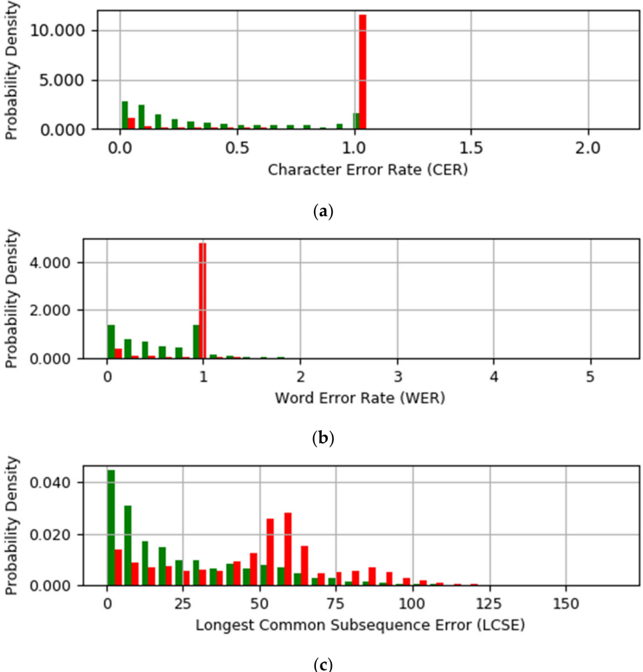
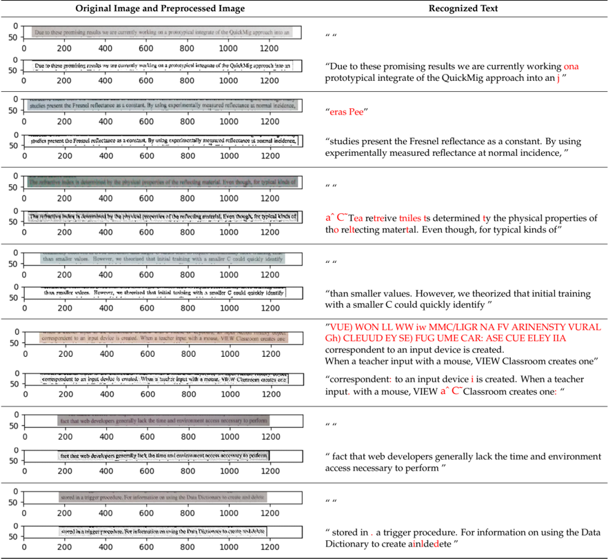
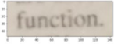
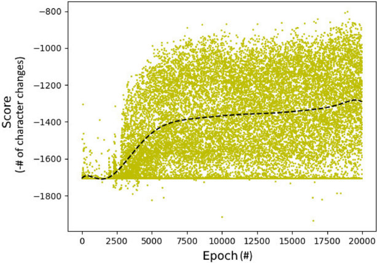

Article

## Improving the Accuracy of Tesseract 4.0 OCR Engine Using Convolution-Based Preprocessing

Dan Sporici , Elena Cus ,nir and Costin-Anton Boiangiu *

Computer Science and Engineering Department, Faculty of Automatic Control and Computers, Politehnica University of Bucharest, Splaiul Independent , ei 313, 060042 Bucharest, Romania; dan.sporici@cti.pub.ro (D.S.); elena.cusnir@stud.acs.upb.ro (E.C.)

* Correspondence: costin.boiangiu@cs.pub.ro

/gid00001

Received: 21 February 2020; Accepted: 15 April 2020; Published: 2 May 2020

/gid00030/gid00035/gid00032/gid00030/gid00038 /gid00001 /gid00033/gid00042/gid00045 /gid00048 /gid00043 /gid00031 /gid00028 /gid00047 /gid00032 /gid00046

Abstract: Optical Character Recognition (OCR) is the process of identifying and converting texts rendered in images using pixels to a more computer-friendly representation. The presented work aims to prove that the accuracy of the Tesseract 4.0 OCR engine can be further enhanced by employing convolution-based preprocessing using specific kernels. As Tesseract 4.0 has proven great performance when evaluated against a favorable input, its capability of properly detecting and identifying characters in more realistic, unfriendly images is questioned. The article proposes an adaptive image preprocessing step guided by a reinforcement learning model, which attempts to minimize the edit distance between the recognized text and the ground truth. It is shown that this approach can boost the character-level accuracy of Tesseract 4.0 from 0.134 to 0.616 ( + 359% relative change) and the F1 score from 0.163 to 0.729 ( + 347% relative change) on a dataset that is considered challenging by its authors.

Keywords: optical character recognition; convolution; tesseract; unsupervised learning; reinforcement learning; actor-critic model; convolutional neural network

## 1. Introduction

Tesseract [1,2] is a popular open-source Optical Character Recognition (OCR) engine, developed initially by Hewlett Packard and later sponsored by Google. The original model has been improved since, now reaching version 4.1 (stable) at the time of writing. Among the significant changes is the inclusion of a Long-Short Term Memory (LSTM) OCR module, as stated in the manual [3].

Despite the various enhancements, Tesseract's performance can be greatly influenced by specific features of the input images. This paper investigates if input image augmentation, using generated convolution kernels, is feasible. The current work revolves around Tesseract 4.0 0 s inability to recognize texts from samples which present certain noise patterns, as shown in [4]. The idea of encountering similar behavior in realistic pictures of text, taken with handheld devices, is introduced and discussed by evaluating the performance of the OCR engine using a public dataset.

The main contribution of this study consists of an implementation that relies on generating convolution kernels in an unsupervised manner, with the purpose of preprocessing the samples in order to maximize Tesseract 4.0 0 s performance. Multiple metrics, such as Character Error Rate (CER), Word Error Rate (WER) and F1 Score are used to evaluate the performance of the proposed method on a large (10,000 images) test set. The project proved to achieve comparatively better performances than other external image preprocessors for OCR engines, regardless of the chosen metric. e.g., the current solution achieves a + 0.48 absolute accuracy improvement at the character level, compared to + 0.25 or + 0.22, as presented in other papers-see Section 2.3 for additional information.

The paper is structured as follows: below, a discussion about di GLYPH&lt;11&gt; erent papers which tackle similar problems and the motivation of the current work, while Section 2 illustrates the proposed strategies, techniques and implementation. Section 3 covers performance-wise aspects. The paper ends with Section 4, which discusses conclusions and future work.

## 1.1. Previous Work

Harraj et al. [5] propose a four-step algorithm to improve Tesseract 3.02 0 s accuracy. The article focuses on using image processing methods to preprocess the input such that the OCR engine receives a clearer data to analyze. The technique involves brightness and contrast management, greyscale conversion, an unsharp masking [6] approach and Otsu's binarization method [7]. The authors prove that preprocessing can improve the detection accuracy from 77.17% to 83.97% on a challenging input.

Koistinen et al. [8] support the idea that Tesseract's performance can be increased through image preprocessing (e.g., Linear Normalization, Wolf's binarization method [9] and Contrast Limited Adaptive Histogram Equalization [10]). Five di GLYPH&lt;11&gt; erent combinations of algorithms generate new samples, based on the original image, that are forwarded to Tesseract. An hOCR-formatted [11] output is created and later checked by a morphological analyzer, according to each word's confidence. The implementation is built around Tesseract 3.04 and authors state a 27.48% improvement versus ABBYY FineReader 7 or 8 and 9.16% versus ABBYY FineReader 11. Precision and recall are evaluated between 0.69 and 0.71.

Adi GLYPH&lt;11&gt; erent implementation is described by Reul et al. [12], which targets datasets consisting of early printed books. The cross-fold training and voting mechanism are key elements in the proposed method. By training the same OCR engine (OCRopus) on di GLYPH&lt;11&gt; erent subsets, the authors obtain architecturally-similar models but with di GLYPH&lt;11&gt; erent characteristics. Voting occurs by taking into account the confidence of OCRopus for each character. A maximum of 50% relative reduction of CER is illustrated through the results of the experiment and, on average, a 0.02 absolute decrease in CER.

OCR error can be further decreased by automatically selecting favorable preprocessing algorithms [13]. The authors claim that in the context of unknown distortions applied to the input image, the preprocessing methods will not o GLYPH&lt;11&gt; er the guarantee of improving the quality of the recognition process. Therefore, a 15 layer convolutional neural network is proposed and used to pick the most suitable preprocessing step (e.g., binarization, noise reduction, sharpening) for the given case. Two OCR engines are employed: Tesseract 2.0 and NNOCR, the latter including a modern LSTM architecture. The evaluation consists of recording normalized character-level accuracy for three sets of images, each containing 1000 samples. Results indicate an increase in accuracy from 0.38 to 0.63 for Tesseract 2.0 and from 0.93 to 0.96 for NNOCR.

Background elimination is another problem addressed in the context of OCR optimization [14]. As certain documents might include background artifacts, these can lead to the occurrence of errors. The proposed solution revolves around image preprocessing by altering contrast with respect to brightness and chromaticity. Background and foreground pixels are linked through an equation whose coe GLYPH&lt;14&gt; cients (brightness and color distortion) are computed using error minimization on a training set. Image enhancement techniques are also applied in order to suppress the background region. The method was evaluated using Tesseract and compared to ABBYY FineReader and HANWANG OCR. The following results are presented for Tesseract: the original set of samples achieves a precision of 0.907 and 0.901 recall rate, while the preprocessed set leads to a precision of 0.929 and a recall of 0.928.

Thompson et al. propose in [15] a strategy centered around spellchecking biased towards medical terms and rule-based error correction. As stated, the work is highly focused on enhancing OCR performance on the British Medical Journal (BMJ) archive. The rule-based method targets character-level correction of false positives such as punctuation marks recognized in the middle of certain words. Spellchecking is performed with the assistance of Hunspell, configured to favor decade-specific word frequency lists with respect to the publication date of the targeted document.

Dictionary augmentation is also performed. Evaluation reveals an up to 16% decrease in WER on poor quality texts; on average, the WER is decreased from 0.169 to 0.09.

An alternative approach to improving OCR accuracy is presented by de Jager et al. [16]. Even though their work relies on Google Cloud Vision for text recognition within the context of a more particular use case, a similar problem is addressed. Accuracy improvement is accomplished through various techniques such as identifying and pairing field names and corresponding values. Additionally, approximate string matching (ASM) [17] is employed when comparing the OCR's output with the ground truth. The described method is based on the Levenshtein distance, permitting string matching with respect to a fixed numeric threshold. As a result, the F1 score is increased from 60.18% to 80.61% with the assistance of index pairing and, finally, to 90.06% when ASM is applied. Furthermore, the authors discuss the choice of an optimal OCR engine for the experiment. A comparison between Tesseract and Google Cloud Vision is also included: the dataset composed of 19 images revealed a 71.76% accuracy for the former and 89.03% accuracy for the latter.

Asimilar postprocessing OCR optimization is discussed by Priambada et al. [18]. The Levenshtein distance is used as a metric for successfully matching Tesseract's readings with information stored in a database. The prototype targets a real-time analysis scenario, with 300-600 ms processing time, and boosts precision, recall and F1 score from 17% to 60%.

In [19], Brisinello et al. propose a method of improving Tesseract 4.0 0 s accuracy on recognizing text from images that originate from Set-Top Boxes (STBs). Four preprocessing actions are included: image resizing, sharpening, blurring and foreground-background separation through k-means clustering. Combinations of the first three preprocessing actions are said to boost the accuracy of Tesseract 4.0 from 70.2% to 92.9%.

Finally, the authors of the Brno Mobile OCR dataset, the same used in this article, propose two state-of-the-art baseline models of neural networks for text recognition with the intention of assessing the di GLYPH&lt;14&gt; culty of the dataset [20]. The former relies on Gated Recurrent Unit (GRU) layers and achieves 0.33% CER and 1.93% WER, while the latter is described as a fully convolutional network and produces a 0.50% CER and a 2.79% WER on the 'easy' version of the dataset. The paper concludes that the dataset is considered challenging.

## 1.2. Problem Motivation

Many preprocessing solutions resort to image-specific alterations (e.g., binarization, noise reduction, sharpening, contrast management), applied according to predetermined conditions, which evaluate di GLYPH&lt;11&gt; erent characteristics. A question arises whether these changes are more beneficial if performed with respect to specific features or shapes (i.e., characters and symbols) and not globally. The majority of projects that perform image preprocessing with the purpose of enhancing OCR seem biased towards applying common filters, which neither adapt to the preferences of a certain engine nor provide su GLYPH&lt;14&gt; cient granularity or flexibility in their alterations (see Table 5 for more details).

Moreover, determining conditions and thresholds for image enhancement by relying on principles related to human vision might not yield optimal results. OCR engines are nowadays mostly implemented using neural networks, which might favor inputs that seem unnatural, the same way they manifest undesired behavior when presented with specially crafted inputs [21]. Performing substantial feature-level changes would require a more powerful image processing action than the ones previously enumerated.

Thefollowing problem is also addressed: certain images prove to be challenging for Tesseract 4.0, as the results are unexpectedly inaccurate and large segments of text are apparently omitted. As presented in [4], small amounts of salt-and-pepper noise can diminish the performance of Tesseract 4.0, to a point where text from ideal samples is not identified at all or causes segmentation errors. Nevertheless, the 'hidden text' is correctly perceived by the human eye with little to no e GLYPH&lt;11&gt; ort. The approach involves genetic algorithm based fuzzing, therefore the noise signature is sample-specific and the behavior cannot be deterministically reproduced. The existence of di GLYPH&lt;11&gt; erent, more natural image perturbations

(e.g., color contrasts, lightning e GLYPH&lt;11&gt; ects, blurring, etc.), which produce similar behavior, while being less noticeable, is plausible.

The objective of this article is to implement and prove the e GLYPH&lt;11&gt; ectiveness of convolution-based preprocessing in order to perform flexible and informed feature-level decisions and alterations. Additionally, the resulted convolutional filters will highly optimize the images so that they conform to Tesseract 4.0 0 s preferences, without necessarily relying on aesthetical validation or external guidance (e.g., page segmentation method, language, etc.).

Current investigation proves that realistic, yet low-quality photographs of texts represent di GLYPH&lt;14&gt; cult inputs for Tesseract 4.0. An example is illustrated in Figure 1.

Figure 1. Sample from Brno Mobile Optical Character Recognition (OCR) dataset [20], which contains legible text that is not recognized by Tesseract 4.0: an empty result is returned.

Considering the aforementioned aspects, the following hypothesis arises: Tesseract 4.0 0 s weakness does not rely within the character classifier itself and it is more likely to be caused by the layout detection and analysis procedure. This is supported by Figure 2, which shows a tendency of Tesseract towards greater precision when improvements are applied, while the recall is lower and remains almost constant. In this work, precision (1), recall (2) and F1 score (3) are defined as follows, where LCS stands for the Longest Common Subsequence [22]:

<!-- formula-not-decoded -->

<!-- formula-not-decoded -->

<!-- formula-not-decoded -->

Figure 2. Tesseract's performance expressed using a Receiver Operating Characteristic (ROC) curve (Precision vs. Recall) [23] when tested using the Google Books Dataset.

A good true positives to false positives ratio is suggested, therefore characters are correctly classified by their features; however, the larger number of false negatives might imply that some characters are not detected or recognized at all.

Similar behavior can be caused by samples that contain specific artifacts or distortions. Moreover, the presence of unfavorable lighting and color contrasts can produce incorrect binarization and lead to an early corruption of the sample, before even reaching the segmentation step or the classifier.

## 2. Samples Preprocessing Using Generated Convolution Kernels

The challenge at hand can be formulated as an optimization problem, where the algorithm needs to discover the best convolution kernels, which maximize Tesseract's accuracy over a set of training samples. Each set of kernels is viewed as a state, composed of real values from the interval [ GLYPH&lt;0&gt; 4; 4]-limits which were empirically chosen. Since the environment imposes no constraints regarding the transition from one state to another and the intermediate states do not directly contribute to the final result, the proposed method includes only 2 states: initial and final. The task resembles the multi-armed bandit problem with a continuous search space.

The current implementation employs multiple modules in kernel optimization; for the sake of simplicity, the architecture of the current implementation is presented in Figure 3.

Figure 3. Architecture which illustrates the flow of information and the working mode of the solution described in the paper.

Agiven image runs through the convolutional preprocessor and the result is passed to Tesseract 4.0. The output is compared to the ground truth and a score is determined; this score evaluates the quality of the current kernels and instructs the reinforcement learning model. Once new kernels are generated, based on previous 'compressed' versions, they are 'decompressed', in order to fit the convolutional preprocessor and the cycle repeats. The training methodology is further described using the pseudo-code from Algorithm 1.

Below, the concept implemented in each module is further discussed.

Convolutional Preprocessor: This module applies a set of given convolution kernels to the input image. It resembles a basic convolutional neural network as it comprises 5 convolution layers separated by ReLU activation functions for nonlinearity purposes. Architecture is presented in Figure 4.

Figure 4. Structure of the convolutional preprocessor presented in this work.

Apadding is applied in order to preserve the original size of the sample. The input images are represented as 3 channels (RGB) signals and compressed to a 1 channel (grayscale) model using 1 GLYPH&lt;2&gt; 1 convolutions for each channel. The purposes of this filter are manifold:

1. Performs basic binarization by assigning a weight to each channel;
2. Reduces the number of variables by 'flattening' the image.

The concept of symmetry is employed in the following 4 one-channel kernels with respect to the middle horizontal line, vertical line, first and second diagonal.

A first benefit brought by symmetrical kernels addresses the problem of a large search space: 4 filters of size 3 GLYPH&lt;2&gt; 3 GLYPH&lt;2&gt; 1 ( width GLYPH&lt;2&gt; height GLYPH&lt;2&gt; num\_channels ) imply working with 24 variables instead of 36, thus reducing the number by 33.(3)%.

The second advantage is represented by the ' mirroring ' constraint, which prevents the over-optimization of kernels. Since the symmetrical kernels will target variations of low-level well-defined features (e.g., lines at di GLYPH&lt;11&gt; erent angles) there is a smaller chance of overfitting.

The choice of using 4 kernels is made to properly capture the 4 essential features within the 3 GLYPH&lt;2&gt; 3 space. Separating the convolutional layers with ReLU activators has the purpose of creating a preprocessing model more suitable for non-linear inputs, such as images that contain edges and fast transitions between colors. This becomes useful in removing regions which are not of interest (i.e., non-positive colors in the image) while also guiding the preprocessor into working with and outputting values compatible with the grayscale color interval.

Finally, the convolutional model relies only on basic components and avoids downsampling and working with higher-level features for performance and generalization reasons.

Score Module: The current component implements the score function which guides the reinforcement learning algorithm. The metric is defined as the Levenshtein distance between the output of Tesseract and the ground truth; in the implementation, the score is represented as the negative value in order to perform reward maximization, as expressed in Equation (4). A value of 0 indicates an optimal result as it implies the OCR engine correctly identified every character in all the given Nimages.

<!-- formula-not-decoded -->

Reinforcement Learning Kernels Optimizer: The module handles the generation of kernels, which attempt to maximize the score, in an unsupervised (actor-critic) manner. It uses states and actions to represent the current configuration of the convolution kernels. Since the search space is large (27 variables in continuous search space), the following constraints were added:

1. The algorithm always starts from the same initial state;

## 2. The trajectory's length is limited to 1.

It works using a 'compressed' version of the kernels, in order to enforce the symmetry constraints.

Amodified implementation of the Twin Delayed Deep Deterministic Policy Gradient (TD3), as presented by Fujimoto et al. [24] is employed.

Maintaining convergence is a daunting task, given the large number of hyperparameters and the large search space. Several issues occurred, ranging from plain divergence, getting stuck in local optimum caused by the amounts of noise, to catastrophic forgetting, which is highly influenced by the experience replay window. Values for such parameters must follow certain rules and constraints; however, the e GLYPH&lt;14&gt; ciency of the final model can only be evaluated empirically, after it performed a number of optimizations. This approach, while it delivers notable results, is both time and resource consuming.

The algorithm relies on a fixed initial state, based on the identity kernel. It starts with a high probability of generating randomized kernel configurations, which are added to the initial state. This approach, when compared to generating kernels from scratch, brings multiple advantages: it permits fine control regarding how much the image will be altered post-convolution since it applies 'masks' to the identity kernels, while also attaining better results within fewer epochs. The probability of randomly generating kernels decreases linearly after each epoch; during this time, the neural network is continuously trained through experience replay.

As the probability lowers, the actor is queried more often for recommended actions. An action also contains a small amount of uniformly distributed noise (0.5%-5%), in order to perform exploration around the suggested kernel configuration.

Kernels (De)Compression: This method ensures that generated kernels are symmetrical to one of the reference lines (horizontal, vertical, first and second diagonal). As an example, states reached by the reinforcement learning algorithm are expanded into kernels by duplicating values and are then written in the convolutional preprocessor for further usage. Likewise, current kernels are 'compressed' by this module into states by removing duplicates and being fed to the kernel optimizer. This directly employs working with a smaller number of variables and prevents overfitting, up to a point. Observations reveal that non-symmetric kernels produce better scores on the training set but do not generalize well.

## 2.1. Approaching the Overfitting Issue

As stated in [25], reinforcement learning algorithms are environment-dependent and have di GLYPH&lt;14&gt; culty in adapting to new test cases. Their task is to optimize solutions for a single specific problem. The same set of samples is used both as a 'training set' and 'testing set', therefore heavily encouraging overfitting behavior, since the model specializes in solving only the problem described by the given inputs. The model's performance in the context of fresh input data is never considered, as its purpose is to learn to optimally handle only the particular situation described in the training set. Therefore, when transitioning to a new set of inputs (i.e., a new environment), the overfitted model will not necessarily produce the expected outputs.

In the current scenario, the algorithm is required to produce kernels that generalize well over a larger set of images. This is addressed by limiting the number of training epochs and the number of convolution layers. Additionally, the convolutional preprocessor does not use any sort of downsampling techniques, thus ensuring the fact that the kernels will only handle generic, low-level features. The symmetry produced by mirroring values inside the kernels also ensures greater compatibility with a larger, more diverse set of samples, as it reduces the overall number of variables. The intuition behind the concept relies within the fact that a convolution filter captures more information, and starts particularizing a feature once it grows in size. This ensures better accuracy at the cost of genericity. As an example, a kernel with the same size as the input sample acts as a fully-connected dense layer; this resembles a good approximator, but the resulted multivariable function will perform correctly only on the samples that it was trained on, because of memorization. By using a smaller number of variables in the convolutional model, this situation can be partially prevented.

## 2.2. Evaluation

The model was trained on a set of 30 images from Brno Mobile OCR Dataset [11], with no external information about the dataset. The performance of this implementation was validated with a testing set which consists of 10,000 successive images from the same dataset using 3 relevant metrics.

Due to a dataset constraint, a white padding was added around the images to ensure they are of the same size-these new images are used in the presented work for both training and evaluation. Postprocessing artifacts might appear because of this padding, which can lead to an increase in the edit distance when comparing to the ground truth.

The results are presented in Figure 5a-c, each illustrating a di GLYPH&lt;11&gt; erent metric-Character Error Rate (CER), Word Error Rate (WER), Longest Common Subsequence Error (LCSE)-used for comparison between Tesseract's output and the ground truth. CER and WER rely on the Levenshtein distance applied to either characters or encoded words; LCSE, on the other hand, will compare the lengths of the resulted texts using Formula (5).

<!-- formula-not-decoded -->

Dashed lines represent linear regressions performed by minimizing the least-squares error, for the sake of clarity.

The existence of outliers suggests that two sets of points cannot be perfectly grouped into clusters; this implies that the current solution is not e GLYPH&lt;11&gt; ective for every sample. Numerical results, including precision and recall, are available in Table 1.

Figure 5. ( a ) Plot of a granular, character-level, error rate (preprocessed (in green) vs. original (in red) samples); ( b ) Plot of a word-level error rate (preprocessed (in green) vs. original (in red) samples); ( c ) Overall error when texts are compared with the longest common subsequence (preprocessed (in green) vs. original (in red) samples).

Table 1. Numerical results (on average) for each metric and overall improvement when compared to non-preprocessed images.

| Metric    |   Preprocessed (Average) |   Original (Average) | Absolute Change   | Relative Change (%)   |
|-----------|--------------------------|----------------------|-------------------|-----------------------|
| CER       |                    0.384 |                0.866 | GLYPH<0> 0.482    | GLYPH<0> 55.65%       |
| WER       |                    0.593 |                0.903 | GLYPH<0> 0.310    | GLYPH<0> 34.33%       |
| LCSE      |                   24.987 |               48.834 | GLYPH<0> 23.847   | GLYPH<0> 48.83%       |
| Precision |                    0.725 |                0.155 | + 0.570           | + 367.74%             |
| Recall    |                    0.734 |                0.172 | + 0.562           | + 326.74%             |
| F1 Score  |                    0.729 |                0.163 | + 0.566           | + 347.23%             |

Further evaluation investigates the performance of the implementation from a qualitative point of view. Samples which generate a minimal number of errors during the OCR process are desired. Since the Levenshtein distance does not strictly enforce this condition (e.g., a one character improvement in all the samples might be equivalent to a 100 characters improvement in one sample), it is important to properly validate the e GLYPH&lt;14&gt; ciency of the preprocessing step. A histogram for each metric was computed with the purpose of observing how the distributions are a GLYPH&lt;11&gt; ected. Figure 6a (CER), Figure 6b (WER) and Figure 6c (LCSE) successfully illustrate the comparison between the preprocessed and original samples in the testing set, with respect to each metric.

Figure 6. ( a ) Histogram of Character Error Rate (CER), which compares the preprocessed (in green) and original (in red) distributions; ( b ) Histogram of Word Error Rate (WER), which compares the preprocessed (in green) and original (in red) distributions; ( c ) Histogram of Longest Common Subsequence Error (LCSE), which compares the preprocessed (in green) and original (in red) distributions.

Symmetry

2020

,

12

, 715

11  of  19

'Due to these promising results we are currently

working ona prototypical integrate of the QuickMig

approach into an j '

Symmetry

'eras Pee'

Symmetry

2020

,

12

, x FOR PEER REVIEW

11  of  19

2020

,

12

, 715

11  of  19

Aquick observation reveals 2 spikes in the distributions related to the CER and WER produced by the original samples (Figure 6a,b). These suggest that the most frequent error a GLYPH&lt;11&gt; ects the recognition of all characters (CER = 1) or words (WER = 1), thus manifesting at the block / segment level. 'studies present the Fresnel reflectance as a constant. By using experimentally measured reflectance at Symmetry 2020 , 12 , 715 11  of  19 Table 2. A visual comparison between original and preprocessed samples from the testing set (scaled to 85%), including the texts identified by tesseract 4.0. Errors are highlighted. Original Image and Preprocessed Image Recognized Text ' ' Table 2. A visual comparison between original and preprocessed samples from the testing set (scaled to 85%), including the texts identified by tesseract 4.0. Errors are highlighted. Recognized Text ' ' Table 2. A visual comparison between original and preprocessed samples from the testing set (scaled to 85%), including the texts identified by tesseract 4.0. Errors are highlighted. Recognized Text ' '

A visual comparison between the original and the preprocessed images is available in Table 2. The result of the character recognition process is also included. An interesting observation is that the adapted samples, while ensuring improved OCR, are not necessarily easier to read by the human eye, as there is nothing to guide the algorithm in that direction. Symmetry 2020 , 12 , 715 11  of  19 Symmetry 2020 , 12 , 715 11  of  19 Symmetry 2020 , 12 , 715 11  of  19 Table 2. A visual comparison between original and preprocessed samples from the testing set (scaled Symmetry 2020 , 12 , 715 11  of  19 Table 2. A visual comparison between original and preprocessed samples from the testing set (scaled 'aˆ C˜Tea retreive tniles ts determined ty the physical properties of tho reltecting matertal. Even though, for typical kinds of' Symmetry 2020 , 12 , 715 11  of  19 Table 2. A visual comparison between original and preprocessed samples from the testing set (scaled to 85%), including the texts identified by tesseract 4.0. Errors are highlighted. Recognized Text Symmetry 2020 , 12 , 715 11  of  19 Table 2. A visual comparison between original and preprocessed samples from the testing set (scaled to 85%), including the texts identified by tesseract 4.0. Errors are highlighted. Symmetry 2020 , 12 , 715 11  of  19 Table 2. A visual comparison between original and preprocessed samples from the testing set (scaled to 85%), including the texts identified by tesseract 4.0. Errors are highlighted. Recognized Text 'Due to these promising results we are currently working ona prototypical integrate of the QuickMig app oach into an j ' working ona prototypical integrate of the QuickMig approach into an j ' 'eras Pee' results we are currently working ona prototypical integrate of the QuickMig appr ach into an j ' 'eras Pee' results we are currently working ona prototypical integrate of the QuickMig approach into an j ' 'eras Pee'

The preprocessing method, on the other hand, is observed to shift the peak of each distribution towards the minimal error rate and highly improve the recognition process. normal incidence, ' ' ' Recognized Text ' ' 'Due to these promising results we are currently 'Due to these promising 'Due to these promising to 85%), including the texts identified by tesseract 4.0. Errors are highlighted.

Recognized Text

Table 2. Avisual comparison between original and preprocessed samples from the testing set (scaled to 85%), including the texts identified by tesseract 4.0. Errors are highlighted. Symmetry 2020 , 12 , 715 11  of  19 Table 2. A visual comparison between original and preprocessed samples from the testing set (scaled Symmetry 2020 , 12 , 715 11  of  19 Table 2. A visual comparison between original and preprocessed samples from the testing set (scaled Table 2. A visual comparison between original and preprocessed samples from the testing set (scaled to 85%), including the texts identified by tesseract 4.0. Errors are highlighted. Recognized Text Table 2. A visual comparison between original and preprocessed samples from the testing set (scaled to 85%), including the texts identified by tesseract 4.0. Errors are highlighted. Recognized Text Recognized Text ' ' Recognized Text ' ' 'than smaller values. However, we theorized that 'Due to these promising ' ' 'Due to these promising 'Due to these promising results we are currently 'studies present the Fresnel reflectance as a constant. By using experimentally measured reflectance at reflectance as a constant. By using experimentally measured reflectance at 'studies present the Fresnel reflectance as a constant. By using experimentally

' '

'studies present the Fresnel to 85%), including the texts identified by tesseract 4.0. Errors are highlighted.

'studies present the Fresnel

'eras Pee'

' '

' '

reflectance as a constant. By to 85%), including the texts identified by tesseract 4.0. Errors are highlighted.

results we are currently measured reflectance at

to 85%), including the texts identified by tesseract 4.0. Errors are highlighted.

' '

| Original Image and Preprocessed Image   | Original Image and Preprocessed Image   | Original Image and Preprocessed Image   | Original Image and Preprocessed Image   | Original Image and Preprocessed Image   | Original Image and Preprocessed Image   | Original Image and Preprocessed Image   | Recognized Text working ona prototypical  normal incidence, '                                                                                                                                                                                                                                                                                                                                                                                                                                                                                                                                                                                                                                                                                                                                                                                                                                                                                                                                                                                                                                                                                                                                                                                                                                                                                                                                                                                                                                                                                                                                                                                                                                                                                                                                                                                                                                                                                                                                                                                                                                                                                                                                                                                                                                                                                                                                                                                                                                                                                                                                                                                                                                                                                                                                                                                                                                                                                                                                                    |
|-----------------------------------------|-----------------------------------------|-----------------------------------------|-----------------------------------------|-----------------------------------------|-----------------------------------------|-----------------------------------------|------------------------------------------------------------------------------------------------------------------------------------------------------------------------------------------------------------------------------------------------------------------------------------------------------------------------------------------------------------------------------------------------------------------------------------------------------------------------------------------------------------------------------------------------------------------------------------------------------------------------------------------------------------------------------------------------------------------------------------------------------------------------------------------------------------------------------------------------------------------------------------------------------------------------------------------------------------------------------------------------------------------------------------------------------------------------------------------------------------------------------------------------------------------------------------------------------------------------------------------------------------------------------------------------------------------------------------------------------------------------------------------------------------------------------------------------------------------------------------------------------------------------------------------------------------------------------------------------------------------------------------------------------------------------------------------------------------------------------------------------------------------------------------------------------------------------------------------------------------------------------------------------------------------------------------------------------------------------------------------------------------------------------------------------------------------------------------------------------------------------------------------------------------------------------------------------------------------------------------------------------------------------------------------------------------------------------------------------------------------------------------------------------------------------------------------------------------------------------------------------------------------------------------------------------------------------------------------------------------------------------------------------------------------------------------------------------------------------------------------------------------------------------------------------------------------------------------------------------------------------------------------------------------------------------------------------------------------------------------------------------------------|
|                                         |                                         |                                         |                                         |                                         |                                         |                                         | Recognized Text  ' '  'Due to these promising  ' ' Recognized Text  ' '  'Due to these promising  'Due to these promising results we are currently working ona 'Due to these promising  results we are currently  working ona prototypical  ' '  'Due to these promising  results we are currently  working ona prototypical  'Due to these promising  results we are currently  working ona prototypical  integrate of the QuickMig  approach into an j '  'Due to these promising  results we are currently  working ona prototypical  integrate of the QuickMig  approach into an j '  initial training with a smaller  C could quickly identify '  'VUE) WON LL WW iw  MMC/LIGR NA FV  ARINENSTY VURAL Gh)  working ona prototypical  integrate of the QuickMig  approach into an j '  'eras Pee'  working ona prototypical  integrate of the QuickMig  approach into an j '  'eras Pee'  integrate of the QuickMig  approach into an j '  'eras Pee'  using experimentally  measured reflectance at  normal incidence, '  ' '  ' '  'aˆ C˜Tea retreive tniles ts  determined ty the physical  normal incidence, '  ' '  'aˆ C˜Tea retreive tniles ts  determined ty the physical  normal incidence, '  ' '  'aˆ C˜Tea retreive tniles ts  determined ty the physical                                                                                                                                                                                                                                                                                                                                                                                                                                                                                                                                                                                                                                                                                                                                                                                                                                                                                                                                                                                                                                                                                                                                                                                                                                                                                                                                                                                                                                                                                                                                                                                                                                                                                                                                        |
| 50                                      |                                         |                                         |                                         |                                         |                                         |                                         | Recognized Text  ' '  'Due to these promising  ' ' Recognized Text  ' '  'Due to these promising  'Due to these promising results we are currently working ona 'Due to these promising  results we are currently  working ona prototypical  ' '  'Due to these promising  results we are currently  working ona prototypical  'Due to these promising  results we are currently  working ona prototypical  integrate of the QuickMig  approach into an j '  'Due to these promising  results we are currently  working ona prototypical  integrate of the QuickMig  approach into an j '  initial training with a smaller  C could quickly identify '  'VUE) WON LL WW iw  MMC/LIGR NA FV  ARINENSTY VURAL Gh)  working ona prototypical  integrate of the QuickMig  approach into an j '  'eras Pee'  working ona prototypical  integrate of the QuickMig  approach into an j '  'eras Pee'  integrate of the QuickMig  approach into an j '  'eras Pee'  using experimentally  measured reflectance at  normal incidence, '  ' '  ' '  'aˆ C˜Tea retreive tniles ts  determined ty the physical  normal incidence, '  ' '  'aˆ C˜Tea retreive tniles ts  determined ty the physical  normal incidence, '  ' '  'aˆ C˜Tea retreive tniles ts  determined ty the physical                                                                                                                                                                                                                                                                                                                                                                                                                                                                                                                                                                                                                                                                                                                                                                                                                                                                                                                                                                                                                                                                                                                                                                                                                                                                                                                                                                                                                                                                                                                                                                                                                                                                                                                                        |
|                                         | 200                                     | 400                                     | 600                                     | 800                                     |                                         | 1200                                    | Recognized Text  ' '  'Due to these promising  ' ' Recognized Text  ' '  'Due to these promising  'Due to these promising results we are currently working ona 'Due to these promising  results we are currently  working ona prototypical  ' '  'Due to these promising  results we are currently  working ona prototypical  'Due to these promising  results we are currently  working ona prototypical  integrate of the QuickMig  approach into an j '  'Due to these promising  results we are currently  working ona prototypical  integrate of the QuickMig  approach into an j '  initial training with a smaller  C could quickly identify '  'VUE) WON LL WW iw  MMC/LIGR NA FV  ARINENSTY VURAL Gh)  working ona prototypical  integrate of the QuickMig  approach into an j '  'eras Pee'  working ona prototypical  integrate of the QuickMig  approach into an j '  'eras Pee'  integrate of the QuickMig  approach into an j '  'eras Pee'  using experimentally  measured reflectance at  normal incidence, '  ' '  ' '  'aˆ C˜Tea retreive tniles ts  determined ty the physical  normal incidence, '  ' '  'aˆ C˜Tea retreive tniles ts  determined ty the physical  normal incidence, '  ' '  'aˆ C˜Tea retreive tniles ts  determined ty the physical                                                                                                                                                                                                                                                                                                                                                                                                                                                                                                                                                                                                                                                                                                                                                                                                                                                                                                                                                                                                                                                                                                                                                                                                                                                                                                                                                                                                                                                                                                                                                                                                                                                                                                                                        |
| 50                                      | 200                                     | 400                                     | 600                                     | 800                                     |                                         | 1200                                    | prototypical integrate of the QuickMig approach into an j ' integrate of the QuickMig  integrate of the QuickMig  'studies present the Fresnel  'studies present the Fresnel  'aˆ C˜Tea retreive tniles ts  properties of tho reltecting  properties of tho reltecting  properties of tho reltecting                                                                                                                                                                                                                                                                                                                                                                                                                                                                                                                                                                                                                                                                                                                                                                                                                                                                                                                                                                                                                                                                                                                                                                                                                                                                                                                                                                                                                                                                                                                                                                                                                                                                                                                                                                                                                                                                                                                                                                                                                                                                                                                                                                                                                                                                                                                                                                                                                                                                                                                                                                                                                                                                                                             |
| CAR: ASE CUE ELEY IIA  50               | CAR: ASE CUE ELEY IIA  50               | CAR: ASE CUE ELEY IIA  50               | CAR: ASE CUE ELEY IIA  50               | CAR: ASE CUE ELEY IIA  50               | CAR: ASE CUE ELEY IIA  50               | CAR: ASE CUE ELEY IIA  50               | integrate of the QuickMig  approach into an j '  integrate of the QuickMig  approach into an j '  'eras Pee'  'eras Pee' 'eras Pee'  'studies present the Fresnel  reflectance as a constant. By  'studies present the Fresnel  reflectance as a constant. By  correspondent to an input  device is created.  reflectance as a constant. By  using experimentally  measured reflectance at  r flectance as a constant. By  using experime tally  using experimentally  measured reflectance at  determined ty the physical  properties of tho reltecting  matertal. Even though, for  typical kinds of'  ' '  matertal. Even though, for  typical kinds of'  ' '  matertal. Even though, for  typical kinds of'  ' '                                                                                                                                                                                                                                                                                                                                                                                                                                                                                                                                                                                                                                                                                                                                                                                                                                                                                                                                                                                                                                                                                                                                                                                                                                                                                                                                                                                                                                                                                                                                                                                                                                                                                                                                                                                                                                                                                                                                                                                                                                                                                                                                                                                                                                                                                             |
|                                         | 200                                     | 400                                     | 600                                     | 800                                     |                                         | 1200                                    | integrate of the QuickMig  approach into an j '  integrate of the QuickMig  approach into an j '  'eras Pee'  'eras Pee' 'eras Pee'  'studies present the Fresnel  reflectance as a constant. By  'studies present the Fresnel  reflectance as a constant. By  correspondent to an input  device is created.  reflectance as a constant. By  using experimentally  measured reflectance at  r flectance as a constant. By  using experime tally  using experimentally  measured reflectance at  determined ty the physical  properties of tho reltecting  matertal. Even though, for  typical kinds of'  ' '  matertal. Even though, for  typical kinds of'  ' '  matertal. Even though, for  typical kinds of'  ' '                                                                                                                                                                                                                                                                                                                                                                                                                                                                                                                                                                                                                                                                                                                                                                                                                                                                                                                                                                                                                                                                                                                                                                                                                                                                                                                                                                                                                                                                                                                                                                                                                                                                                                                                                                                                                                                                                                                                                                                                                                                                                                                                                                                                                                                                                             |
| 50                                      | 50                                      | 50                                      | 50                                      | 50                                      | 50                                      | 50                                      | 'eras Pee'  'eras Pee'  'studies present the Fresnel  reflectance as a constant. By  'studies present the Fresnel  reflectance as a constant. By  'studies present the Fresnel reflectance as a constant. By using experimentally measured reflectance at normal incidence, ' using experimentally  measured reflectance at  using experimentally  measured reflectance at  When a teacher input with a  mouse, VIEW Classroom  creates one '  normal incidence, '  ' '  measured reflectance at  normal incidence, '  ' '  normal incidence, '  ' '  typical kinds of'  ' '  'than smaller values.  'than smaller values.  'than smaller values.                                                                                                                                                                                                                                                                                                                                                                                                                                                                                                                                                                                                                                                                                                                                                                                                                                                                                                                                                                                                                                                                                                                                                                                                                                                                                                                                                                                                                                                                                                                                                                                                                                                                                                                                                                                                                                                                                                                                                                                                                                                                                                                                                                                                                                                                                                                                                                |
|                                         | 200                                     | 400                                     | 600                                     | 800                                     | 10oo                                    | 1200                                    | 'studies present the Fresnel                                                                                                                                                                                                                                                                                                                                                                                                                                                                                                                                                                                                                                                                                                                                                                                                                                                                                                                                                                                                                                                                                                                                                                                                                                                                                                                                                                                                                                                                                                                                                                                                                                                                                                                                                                                                                                                                                                                                                                                                                                                                                                                                                                                                                                                                                                                                                                                                                                                                                                                                                                                                                                                                                                                                                                                                                                                                                                                                                                                     |
|                                         |                                         |                                         |                                         |                                         |                                         |                                         | reflectance as a constant. By  using experimentally  'studies present the Fresnel  reflectance as a constant. By  using experimentally  measured reflecta ce at  normal incidence, '  ' '  using experimentally  measured reflectance at  normal incidence, '  normal incidence, '  ' '  ' ' normal incidence, '  ' '  ' correspondent: to an input  device i is created. When a  teacher input. with a mouse,  'aˆ C˜Tea retreive tniles ts  determined ty the physical  'aˆ C˜Tea retreive tniles ts  'aˆ C˜Tea retreive tniles ts  determined ty the physical  'than smaller values.  However, we theorized that  However, we theorized that  initial training with a smaller  C could quickly identify '  However, we theorized that  initial training with a smaller  C could quickly identify '  However, we theorized that  initial training with a smaller  C could quickly identify '                                                                                                                                                                                                                                                                                                                                                                                                                                                                                                                                                                                                                                                                                                                                                                                                                                                                                                                                                                                                                                                                                                                                                                                                                                                                                                                                                                                                                                                                                                                                                                                                                                                                                                                                                                                                                                                                                                                                                                                                                                                                                                                   |
| 50                                      |                                         |                                         |                                         |                                         |                                         |                                         | reflectance as a constant. By  using experimentally  'studies present the Fresnel  reflectance as a constant. By  using experimentally  measured reflecta ce at  normal incidence, '  ' '  using experimentally  measured reflectance at  normal incidence, '  normal incidence, '  ' '  ' ' normal incidence, '  ' '  ' correspondent: to an input  device i is created. When a  teacher input. with a mouse,  'aˆ C˜Tea retreive tniles ts  determined ty the physical  'aˆ C˜Tea retreive tniles ts  'aˆ C˜Tea retreive tniles ts  determined ty the physical  'than smaller values.  However, we theorized that  However, we theorized that  initial training with a smaller  C could quickly identify '  However, we theorized that  initial training with a smaller  C could quickly identify '  However, we theorized that  initial training with a smaller  C could quickly identify '                                                                                                                                                                                                                                                                                                                                                                                                                                                                                                                                                                                                                                                                                                                                                                                                                                                                                                                                                                                                                                                                                                                                                                                                                                                                                                                                                                                                                                                                                                                                                                                                                                                                                                                                                                                                                                                                                                                                                                                                                                                                                                                   |
|                                         | 200                                     | 400                                     | 600                                     | 800                                     |                                         | 1200                                    | reflectance as a constant. By  using experimentally  'studies present the Fresnel  reflectance as a constant. By  using experimentally  measured reflecta ce at  normal incidence, '  ' '  using experimentally  measured reflectance at  normal incidence, '  normal incidence, '  ' '  ' ' normal incidence, '  ' '  ' correspondent: to an input  device i is created. When a  teacher input. with a mouse,  'aˆ C˜Tea retreive tniles ts  determined ty the physical  'aˆ C˜Tea retreive tniles ts  'aˆ C˜Tea retreive tniles ts  determined ty the physical  'than smaller values.  However, we theorized that  However, we theorized that  initial training with a smaller  C could quickly identify '  However, we theorized that  initial training with a smaller  C could quickly identify '  However, we theorized that  initial training with a smaller  C could quickly identify '                                                                                                                                                                                                                                                                                                                                                                                                                                                                                                                                                                                                                                                                                                                                                                                                                                                                                                                                                                                                                                                                                                                                                                                                                                                                                                                                                                                                                                                                                                                                                                                                                                                                                                                                                                                                                                                                                                                                                                                                                                                                                                                   |
| 50                                      | 50                                      | 50                                      | 50                                      | 50                                      | 50                                      | 50                                      | measured reflectance at  normal incidence, '  ' '  measured reflectance at  normal incidence, '  ' '  ' '  'aˆ C˜Tea retreive tniles ts  determined ty the physical  'aˆ C˜Tea retreive tniles ts  determined ty the physical  VIEW aˆ C˜  Classroom creates one: '  Tea retreive tniles ts determined ty the physical properties of tho reltecting matertal. Even though, for typical kinds of' properties of tho reltecting  matertal. Even though, for  determined ty the physical  propert es of tho reltecting  matertal. Even though, for  properties o  tho reltec ing  matertal. Even though, for  typical kinds of'  initial training with a smaller  C could quickly identify '  'VUE) WON LL WW iw  MMC/LIGR NA FV  VUE) WON LL WW iw  MMC/LIGR NA FV  'VUE) WON LL WW iw  MMC/LIGR NA FV                                                                                                                                                                                                                                                                                                                                                                                                                                                                                                                                                                                                                                                                                                                                                                                                                                                                                                                                                                                                                                                                                                                                                                                                                                                                                                                                                                                                                                                                                                                                                                                                                                                                                                                                                                                                                                                                                                                                                                                                                                                                                                                                                                                                             |
|                                         |                                         |                                         | 600                                     | 800                                     | 100o                                    |                                         | measured reflectance at  normal incidence, '  ' '  measured reflectance at  normal incidence, '  ' '  ' '  'aˆ C˜Tea retreive tniles ts  determined ty the physical  'aˆ C˜Tea retreive tniles ts  determined ty the physical  VIEW aˆ C˜  Classroom creates one: '  Tea retreive tniles ts determined ty the physical properties of tho reltecting matertal. Even though, for typical kinds of' properties of tho reltecting  matertal. Even though, for  determined ty the physical  propert es of tho reltecting  matertal. Even though, for  properties o  tho reltec ing  matertal. Even though, for  typical kinds of'  initial training with a smaller  C could quickly identify '  'VUE) WON LL WW iw  MMC/LIGR NA FV  VUE) WON LL WW iw  MMC/LIGR NA FV  'VUE) WON LL WW iw  MMC/LIGR NA FV                                                                                                                                                                                                                                                                                                                                                                                                                                                                                                                                                                                                                                                                                                                                                                                                                                                                                                                                                                                                                                                                                                                                                                                                                                                                                                                                                                                                                                                                                                                                                                                                                                                                                                                                                                                                                                                                                                                                                                                                                                                                                                                                                                                                             |
|                                         |                                         | 400                                     |                                         |                                         |                                         | 1200                                    | 'aˆ C˜Tea retreive tniles ts  determined ty the physical  'aˆ C˜Tea retreive tniles ts  properties of tho reltecting  properties of tho reltecting  'VUE) WON LL WW iw  ARINENSTY VURAL Gh)  CLEUUD EY SE) FUG UME  ARINENSTY VURAL Gh)  CLEUUD EY SE) FUG UME  ARINENSTY VURAL Gh)                                                                                                                                                                                                                                                                                                                                                                                                                                                                                                                                                                                                                                                                                                                                                                                                                                                                                                                                                                                                                                                                                                                                                                                                                                                                                                                                                                                                                                                                                                                                                                                                                                                                                                                                                                                                                                                                                                                                                                                                                                                                                                                                                                                                                                                                                                                                                                                                                                                                                                                                                                                                                                                                                                                              |
| 50                                      | 200                                     | 400                                     | 600                                     | 800                                     | 1000                                    | 1200                                    | 'aˆ C˜Tea retreive tniles ts  determined ty the physical  properties of tho reltecting  matertal. Even though, for  'aˆ C˜Tea retreive tniles ts  determined ty the physical  properties of tho reltecting  matertal. Even though, for  properties of tho reltecting  matertal. Even though, for  typical kinds of' ' '  determined ty the physical  properties of tho reltecting  matertal. Even though, for  typical kinds of'  ' '  matertal. Even though, for  ' '  matertal. Even though, for  ' '  ' fact that web developers  generally lack the time and  environment access necessary  'than smaller values.  However, we theorized that  'than smaller values.  However, we theorized that  'than smaller values. However, we theorized that initial training with a smaller C could quickly identify ' 'than smaller values.  H wever, we theorized that  initial training with a smaller  ARINENSTY VURAL Gh)  CLEUUD EY SE) FUG UME  CAR: ASE CUE ELEY IIA  correspondent to an input CAR: ASE CUE ELEY IIA  correspondent to an input  device is created.  When a teacher input with a  CAR: ASE CUE ELEY IIA  correspondent to an input  device is created.  When a teacher input with a  CLEUUD EY SE) FUG UME  CAR: ASE CUE ELEY IIA  correspondent to an input  device is created.                                                                                                                                                                                                                                                                                                                                                                                                                                                                                                                                                                                                                                                                                                                                                                                                                                                                                                                                                                                                                                                                                                                                                                                                                                                                                                                                                                                                                                                                                                                                                                                                                                                                                                             |
| 50                                      | 200                                     |                                         |                                         |                                         | 1000                                    |                                         | 'aˆ C˜Tea retreive tniles ts  determined ty the physical  properties of tho reltecting  matertal. Even though, for  'aˆ C˜Tea retreive tniles ts  determined ty the physical  properties of tho reltecting  matertal. Even though, for  properties of tho reltecting  matertal. Even though, for  typical kinds of' ' '  determined ty the physical  properties of tho reltecting  matertal. Even though, for  typical kinds of'  ' '  matertal. Even though, for  ' '  matertal. Even though, for  ' '  ' fact that web developers  generally lack the time and  environment access necessary  'than smaller values.  However, we theorized that  'than smaller values.  However, we theorized that  'than smaller values. However, we theorized that initial training with a smaller C could quickly identify ' 'than smaller values.  H wever, we theorized that  initial training with a smaller  ARINENSTY VURAL Gh)  CLEUUD EY SE) FUG UME  CAR: ASE CUE ELEY IIA  correspondent to an input CAR: ASE CUE ELEY IIA  correspondent to an input  device is created.  When a teacher input with a  CAR: ASE CUE ELEY IIA  correspondent to an input  device is created.  When a teacher input with a  CLEUUD EY SE) FUG UME  CAR: ASE CUE ELEY IIA  correspondent to an input  device is created.                                                                                                                                                                                                                                                                                                                                                                                                                                                                                                                                                                                                                                                                                                                                                                                                                                                                                                                                                                                                                                                                                                                                                                                                                                                                                                                                                                                                                                                                                                                                                                                                                                                                                                             |
|                                         |                                         | 400                                     | 600                                     | 800                                     |                                         | 1200                                    | typical kinds of'  ' '  'than smaller values.  typical kinds of'  ' '  'than smaller values.  However, we theorized that  initial training with a smaller  'than smaller values.  However, we theorized that  However, we theorized that  initial training with a smaller  C could quickly identify '  However, we theorized that  initial training with a smaller  C could quickly identify '  to perform '  initial training with a smaller  C could quickly identify '  'VUE) WON LL WW iw  MMC/LIGR NA FV  initial training with a smaller  C could quickly identify '  'VUE) WON LL WW iw  MMC/LIGR NA FV  C cou d quickly identify '  'VUE) WON LL WW iw  MMC/LIGR NA FV  ARINENSTY VURAL Gh)  'VUE) WON LL WW iw MMC / LIGR NA FV ARINENSTY VURAL Gh) CLEUUD EY SE) FUG UME CAR: ASE CUE ELEY IIA correspondent to an input device is created. When a teacher input with a mouse, VIEW Classroom creates one' device is created.  When a teacher input with a  mouse, VIEW Classroom  creates one '  mouse, VIEW Classroom  creates one '  ' correspondent: to an input  device i is created. When a  mouse, VIEW Classroom  creates one '  ' correspondent: to an input  device i is created. When a  When a teacher input with a  mouse, VIEW Classroom  creates one '  ' correspondent: to an input                                                                                                                                                                                                                                                                                                                                                                                                                                                                                                                                                                                                                                                                                                                                                                                                                                                                                                                                                                                                                                                                                                                                                                                                                                                                                                                                                                                                                                                                                                                                                                                                                                                                                                    |
| 50                                      | 200                                     |                                         | 600                                     | 800                                     |                                         |                                         | typical kinds of'  ' '  'than smaller values.  typical kinds of'  ' '  'than smaller values.  However, we theorized that  initial training with a smaller  'than smaller values.  However, we theorized that  However, we theorized that  initial training with a smaller  C could quickly identify '  However, we theorized that  initial training with a smaller  C could quickly identify '  to perform '  initial training with a smaller  C could quickly identify '  'VUE) WON LL WW iw  MMC/LIGR NA FV  initial training with a smaller  C could quickly identify '  'VUE) WON LL WW iw  MMC/LIGR NA FV  C cou d quickly identify '  'VUE) WON LL WW iw  MMC/LIGR NA FV  ARINENSTY VURAL Gh)  'VUE) WON LL WW iw MMC / LIGR NA FV ARINENSTY VURAL Gh) CLEUUD EY SE) FUG UME CAR: ASE CUE ELEY IIA correspondent to an input device is created. When a teacher input with a mouse, VIEW Classroom creates one' device is created.  When a teacher input with a  mouse, VIEW Classroom  creates one '  mouse, VIEW Classroom  creates one '  ' correspondent: to an input  device i is created. When a  mouse, VIEW Classroom  creates one '  ' correspondent: to an input  device i is created. When a  When a teacher input with a  mouse, VIEW Classroom  creates one '  ' correspondent: to an input                                                                                                                                                                                                                                                                                                                                                                                                                                                                                                                                                                                                                                                                                                                                                                                                                                                                                                                                                                                                                                                                                                                                                                                                                                                                                                                                                                                                                                                                                                                                                                                                                                                                                                    |
|                                         | 400 1000 1200                           | 400 1000 1200                           | 400 1000 1200                           | 400 1000 1200                           | 400 1000 1200                           | 400 1000 1200                           | However, we theorized that  initial training with a smaller  C could quickly identify '  'VUE) WON LL WW iw  MMC/LIGR NA FV  ARINENSTY VURAL Gh)  CLEUUD EY SE) FUG UME  CAR: ASE CUE ELEY IIA  correspondent to an input  'than smaller values.  However, we theorized that  initial training with a smaller  C could quickly identify '  'VUE) WON LL WW iw  MMC/LIGR NA FV  ARINENSTY VURAL Gh)  CLEUUD EY SE) FUG UME  CAR: ASE CUE ELEY IIA  correspondent to an input  C could quickly identify '  'VUE) WON LL WW iw  MMC/LIGR NA FV  ARINENSTY VURAL Gh)  CLEUUD EY SE) FUG UME  CAR: ASE CUE ELEY IIA  correspondent to an input  device is created.  When a teacher input with a  initial training with a smaller  C could quickly identify '  'VUE) WON LL WW iw  MMC/LIGR NA FV  ARINENSTY VURAL Gh)  CLEUUD EY SE) FUG UME  CAR: ASE CUE ELEY IIA  correspondent to an input  device is created.  'VUE) WON LL WW iw  MMC/LIGR NA FV  ARINENSTY VURAL Gh)  CLEUUD EY SE) FUG UME  CAR: ASE CUE ELEY IIA  correspondent to an input  device is created.  When a teacher input with a  mouse, VIEW Classroom  creates one '  'VUE) WON LL WW iw  MMC/LIGR NA FV  ARINENSTY VURAL Gh)  CLEUUD EY SE) FUG UME  CAR: ASE CUE ELEY IIA  correspondent to an input  device is created.  When a teacher input with a  mouse, VIEW Classroom  ARINENSTY VURAL Gh)  CLEUUD EY SE) FUG UME  CAR: ASE CUE ELEY IIA  correspondent to an input  device is created.  When a teacher input with a  mouse, VIEW Classroom  creates one '  ' correspondent: to an input  ARINENSTY VURAL Gh)  CLEUUD EY SE) FUG UME  CAR: ASE CUE ELEY IIA  correspondent to an input  device is created.  When a teacher input with a  mouse, VIEW Classroom  creates one '  ' correspondent: to an input  CLEUUD EY SE) FUG UME  CAR: ASE CUE ELEY IIA  correspondent to an input  device is created.  When a teacher input with a  mouse, VIEW Classroom  creates one ' ' correspondent: to an input  device i is created. When a  ' correspondent: to an input  device i is created. When a  teacher i put. with a mouse,  VIEW aˆ C˜Classroom creates  one: ' ' '  ' fact that web developers  gen rally lack he time and  'correspondent: to an input device i is created. When a teacher input. with a mouse, VIEW teacher input. with a mouse,  VIEW aˆ C˜  Classroom creates one: '  ' '  ' fact that web developers  generally lack the time and  environment access necessary  to perform '  Classroom creates one: ' teacher input. with a mouse, VIEW aˆ C˜Classroom creates  one: '  ' '  ' fact that web developers  generally lack the time and  environment access necessary  to perform '  ' ' device i is created. When a  teacher input. with a mouse,  VIEW aˆ C˜Classroom creates  one: '  ' '  ' fact that web developers  generally lack the time and  environment access necessary  ' fact that web developers generally lack the time and environment access necessary to perform ' 12  of  19  12  of  19 |
| 50                                      |                                         |                                         |                                         |                                         |                                         |                                         | However, we theorized that  initial training with a smaller  C could quickly identify '  'VUE) WON LL WW iw  MMC/LIGR NA FV  ARINENSTY VURAL Gh)  CLEUUD EY SE) FUG UME  CAR: ASE CUE ELEY IIA  correspondent to an input  'than smaller values.  However, we theorized that  initial training with a smaller  C could quickly identify '  'VUE) WON LL WW iw  MMC/LIGR NA FV  ARINENSTY VURAL Gh)  CLEUUD EY SE) FUG UME  CAR: ASE CUE ELEY IIA  correspondent to an input  C could quickly identify '  'VUE) WON LL WW iw  MMC/LIGR NA FV  ARINENSTY VURAL Gh)  CLEUUD EY SE) FUG UME  CAR: ASE CUE ELEY IIA  correspondent to an input  device is created.  When a teacher input with a  initial training with a smaller  C could quickly identify '  'VUE) WON LL WW iw  MMC/LIGR NA FV  ARINENSTY VURAL Gh)  CLEUUD EY SE) FUG UME  CAR: ASE CUE ELEY IIA  correspondent to an input  device is created.  'VUE) WON LL WW iw  MMC/LIGR NA FV  ARINENSTY VURAL Gh)  CLEUUD EY SE) FUG UME  CAR: ASE CUE ELEY IIA  correspondent to an input  device is created.  When a teacher input with a  mouse, VIEW Classroom  creates one '  'VUE) WON LL WW iw  MMC/LIGR NA FV  ARINENSTY VURAL Gh)  CLEUUD EY SE) FUG UME  CAR: ASE CUE ELEY IIA  correspondent to an input  device is created.  When a teacher input with a  mouse, VIEW Classroom  ARINENSTY VURAL Gh)  CLEUUD EY SE) FUG UME  CAR: ASE CUE ELEY IIA  correspondent to an input  device is created.  When a teacher input with a  mouse, VIEW Classroom  creates one '  ' correspondent: to an input  ARINENSTY VURAL Gh)  CLEUUD EY SE) FUG UME  CAR: ASE CUE ELEY IIA  correspondent to an input  device is created.  When a teacher input with a  mouse, VIEW Classroom  creates one '  ' correspondent: to an input  CLEUUD EY SE) FUG UME  CAR: ASE CUE ELEY IIA  correspondent to an input  device is created.  When a teacher input with a  mouse, VIEW Classroom  creates one ' ' correspondent: to an input  device i is created. When a  ' correspondent: to an input  device i is created. When a  teacher i put. with a mouse,  VIEW aˆ C˜Classroom creates  one: ' ' '  ' fact that web developers  gen rally lack he time and  'correspondent: to an input device i is created. When a teacher input. with a mouse, VIEW teacher input. with a mouse,  VIEW aˆ C˜  Classroom creates one: '  ' '  ' fact that web developers  generally lack the time and  environment access necessary  to perform '  Classroom creates one: ' teacher input. with a mouse, VIEW aˆ C˜Classroom creates  one: '  ' '  ' fact that web developers  generally lack the time and  environment access necessary  to perform '  ' ' device i is created. When a  teacher input. with a mouse,  VIEW aˆ C˜Classroom creates  one: '  ' '  ' fact that web developers  generally lack the time and  environment access necessary  ' fact that web developers generally lack the time and environment access necessary to perform ' 12  of  19  12  of  19 |
|                                         |                                         |                                         |                                         |                                         |                                         | 1200                                    | However, we theorized that  initial training with a smaller  C could quickly identify '  'VUE) WON LL WW iw  MMC/LIGR NA FV  ARINENSTY VURAL Gh)  CLEUUD EY SE) FUG UME  CAR: ASE CUE ELEY IIA  correspondent to an input  'than smaller values.  However, we theorized that  initial training with a smaller  C could quickly identify '  'VUE) WON LL WW iw  MMC/LIGR NA FV  ARINENSTY VURAL Gh)  CLEUUD EY SE) FUG UME  CAR: ASE CUE ELEY IIA  correspondent to an input  C could quickly identify '  'VUE) WON LL WW iw  MMC/LIGR NA FV  ARINENSTY VURAL Gh)  CLEUUD EY SE) FUG UME  CAR: ASE CUE ELEY IIA  correspondent to an input  device is created.  When a teacher input with a  initial training with a smaller  C could quickly identify '  'VUE) WON LL WW iw  MMC/LIGR NA FV  ARINENSTY VURAL Gh)  CLEUUD EY SE) FUG UME  CAR: ASE CUE ELEY IIA  correspondent to an input  device is created.  'VUE) WON LL WW iw  MMC/LIGR NA FV  ARINENSTY VURAL Gh)  CLEUUD EY SE) FUG UME  CAR: ASE CUE ELEY IIA  correspondent to an input  device is created.  When a teacher input with a  mouse, VIEW Classroom  creates one '  'VUE) WON LL WW iw  MMC/LIGR NA FV  ARINENSTY VURAL Gh)  CLEUUD EY SE) FUG UME  CAR: ASE CUE ELEY IIA  correspondent to an input  device is created.  When a teacher input with a  mouse, VIEW Classroom  ARINENSTY VURAL Gh)  CLEUUD EY SE) FUG UME  CAR: ASE CUE ELEY IIA  correspondent to an input  device is created.  When a teacher input with a  mouse, VIEW Classroom  creates one '  ' correspondent: to an input  ARINENSTY VURAL Gh)  CLEUUD EY SE) FUG UME  CAR: ASE CUE ELEY IIA  correspondent to an input  device is created.  When a teacher input with a  mouse, VIEW Classroom  creates one '  ' correspondent: to an input  CLEUUD EY SE) FUG UME  CAR: ASE CUE ELEY IIA  correspondent to an input  device is created.  When a teacher input with a  mouse, VIEW Classroom  creates one ' ' correspondent: to an input  device i is created. When a  ' correspondent: to an input  device i is created. When a  teacher i put. with a mouse,  VIEW aˆ C˜Classroom creates  one: ' ' '  ' fact that web developers  gen rally lack he time and  'correspondent: to an input device i is created. When a teacher input. with a mouse, VIEW teacher input. with a mouse,  VIEW aˆ C˜  Classroom creates one: '  ' '  ' fact that web developers  generally lack the time and  environment access necessary  to perform '  Classroom creates one: ' teacher input. with a mouse, VIEW aˆ C˜Classroom creates  one: '  ' '  ' fact that web developers  generally lack the time and  environment access necessary  to perform '  ' ' device i is created. When a  teacher input. with a mouse,  VIEW aˆ C˜Classroom creates  one: '  ' '  ' fact that web developers  generally lack the time and  environment access necessary  ' fact that web developers generally lack the time and environment access necessary to perform ' 12  of  19  12  of  19 |
|                                         | 200                                     | 400                                     | 600                                     | 800                                     |                                         |                                         |                                                                                                                                                                                                                                                                                                                                                                                                                                                                                                                                                                                                                                                                                                                                                                                                                                                                                                                                                                                                                                                                                                                                                                                                                                                                                                                                                                                                                                                                                                                                                                                                                                                                                                                                                                                                                                                                                                                                                                                                                                                                                                                                                                                                                                                                                                                                                                                                                                                                                                                                                                                                                                                                                                                                                                                                                                                                                                                                                                                                                  |
| 50                                      | 200 400 600 800                         |                                         |                                         |                                         |                                         | 1200                                    |                                                                                                                                                                                                                                                                                                                                                                                                                                                                                                                                                                                                                                                                                                                                                                                                                                                                                                                                                                                                                                                                                                                                                                                                                                                                                                                                                                                                                                                                                                                                                                                                                                                                                                                                                                                                                                                                                                                                                                                                                                                                                                                                                                                                                                                                                                                                                                                                                                                                                                                                                                                                                                                                                                                                                                                                                                                                                                                                                                                                                  |
| 50                                      | 2020                                    |                                         |                                         |                                         |                                         |                                         |                                                                                                                                                                                                                                                                                                                                                                                                                                                                                                                                                                                                                                                                                                                                                                                                                                                                                                                                                                                                                                                                                                                                                                                                                                                                                                                                                                                                                                                                                                                                                                                                                                                                                                                                                                                                                                                                                                                                                                                                                                                                                                                                                                                                                                                                                                                                                                                                                                                                                                                                                                                                                                                                                                                                                                                                                                                                                                                                                                                                                  |
| Symmetry Symmetry                       | ,  12 , 715  ,  12 , 715                | 400                                     | 600                                     | 800                                     | 10oo                                    |                                         |                                                                                                                                                                                                                                                                                                                                                                                                                                                                                                                                                                                                                                                                                                                                                                                                                                                                                                                                                                                                                                                                                                                                                                                                                                                                                                                                                                                                                                                                                                                                                                                                                                                                                                                                                                                                                                                                                                                                                                                                                                                                                                                                                                                                                                                                                                                                                                                                                                                                                                                                                                                                                                                                                                                                                                                                                                                                                                                                                                                                                  |
|                                         | 2020                                    |                                         |                                         |                                         |                                         | 1200                                    | device is created.  When a teacher input with a  mouse, VIEW Classroom  device is created.  When a teacher input with a  mouse, VIEW Classroom  creates one '  ' correspondent: to an input  When a teacher input with a  mouse, VIEW Classroom  creates one '  ' correspondent: to an input  device i is created. When a  creates one '  ' correspondent: to an input  device i is created. When a  device i is created. When a  teacher input. with a mouse,  VIEW aˆ C˜Classroom creates  device i is created. When a  teacher input. with a mouse,  VIEW aˆ C˜Classroom creates  teacher input. with a mouse,  VIEW aˆ C˜Classroom creates  one: '  environment access necessary  to perform '  to perform '  ' '  ' stored in . a trigger  ' ' ' '  ' stored in . a trigger  ' stored in . a trigger procedure. For information on using the Data                                                                                                                                                                                                                                                                                                                                                                                                                                                                                                                                                                                                                                                                                                                                                                                                                                                                                                                                                                                                                                                                                                                                                                                                                                                                                                                                                                                                                                                                                                                                                                                                                                                                                                                                                                                                                                                                                                                                                                                                                                                                                                                                                           |
| 50                                      | 200                                     |                                         |                                         |                                         |                                         |                                         | device is created.  When a teacher input with a  mouse, VIEW Classroom  device is created.  When a teacher input with a  mouse, VIEW Classroom  creates one '  ' correspondent: to an input  When a teacher input with a  mouse, VIEW Classroom  creates one '  ' correspondent: to an input  device i is created. When a  creates one '  ' correspondent: to an input  device i is created. When a  device i is created. When a  teacher input. with a mouse,  VIEW aˆ C˜Classroom creates  device i is created. When a  teacher input. with a mouse,  VIEW aˆ C˜Classroom creates  teacher input. with a mouse,  VIEW aˆ C˜Classroom creates  one: '  environment access necessary  to perform '  to perform '  ' '  ' stored in . a trigger  ' ' ' '  ' stored in . a trigger  ' stored in . a trigger procedure. For information on using the Data                                                                                                                                                                                                                                                                                                                                                                                                                                                                                                                                                                                                                                                                                                                                                                                                                                                                                                                                                                                                                                                                                                                                                                                                                                                                                                                                                                                                                                                                                                                                                                                                                                                                                                                                                                                                                                                                                                                                                                                                                                                                                                                                                           |
|                                         | 600 800                                 |                                         |                                         |                                         |                                         | 1200                                    | device is created.  When a teacher input with a  mouse, VIEW Classroom  device is created.  When a teacher input with a  mouse, VIEW Classroom  creates one '  ' correspondent: to an input  When a teacher input with a  mouse, VIEW Classroom  creates one '  ' correspondent: to an input  device i is created. When a  creates one '  ' correspondent: to an input  device i is created. When a  device i is created. When a  teacher input. with a mouse,  VIEW aˆ C˜Classroom creates  device i is created. When a  teacher input. with a mouse,  VIEW aˆ C˜Classroom creates  teacher input. with a mouse,  VIEW aˆ C˜Classroom creates  one: '  environment access necessary  to perform '  to perform '  ' '  ' stored in . a trigger  ' ' ' '  ' stored in . a trigger  ' stored in . a trigger procedure. For information on using the Data                                                                                                                                                                                                                                                                                                                                                                                                                                                                                                                                                                                                                                                                                                                                                                                                                                                                                                                                                                                                                                                                                                                                                                                                                                                                                                                                                                                                                                                                                                                                                                                                                                                                                                                                                                                                                                                                                                                                                                                                                                                                                                                                                           |
| 50                                      | 200                                     |                                         |                                         |                                         |                                         |                                         | mouse, VIEW Classroom  teacher input. with a mouse,                                                                                                                                                                                                                                                                                                                                                                                                                                                                                                                                                                                                                                                                                                                                                                                                                                                                                                                                                                                                                                                                                                                                                                                                                                                                                                                                                                                                                                                                                                                                                                                                                                                                                                                                                                                                                                                                                                                                                                                                                                                                                                                                                                                                                                                                                                                                                                                                                                                                                                                                                                                                                                                                                                                                                                                                                                                                                                                                                              |
|                                         |                                         | 400                                     |                                         |                                         |                                         |                                         | ' correspondent: to an input  teacher input. with a mouse,                                                                                                                                                                                                                                                                                                                                                                                                                                                                                                                                                                                                                                                                                                                                                                                                                                                                                                                                                                                                                                                                                                                                                                                                                                                                                                                                                                                                                                                                                                                                                                                                                                                                                                                                                                                                                                                                                                                                                                                                                                                                                                                                                                                                                                                                                                                                                                                                                                                                                                                                                                                                                                                                                                                                                                                                                                                                                                                                                       |
|                                         |                                         |                                         |                                         |                                         |                                         | 1200                                    | procedure. For information on                                                                                                                                                                                                                                                                                                                                                                                                                                                                                                                                                                                                                                                                                                                                                                                                                                                                                                                                                                                                                                                                                                                                                                                                                                                                                                                                                                                                                                                                                                                                                                                                                                                                                                                                                                                                                                                                                                                                                                                                                                                                                                                                                                                                                                                                                                                                                                                                                                                                                                                                                                                                                                                                                                                                                                                                                                                                                                                                                                                    |
|                                         |                                         |                                         |                                         |                                         |                                         |                                         | Dictionary to create ainldedete '                                                                                                                                                                                                                                                                                                                                                                                                                                                                                                                                                                                                                                                                                                                                                                                                                                                                                                                                                                                                                                                                                                                                                                                                                                                                                                                                                                                                                                                                                                                                                                                                                                                                                                                                                                                                                                                                                                                                                                                                                                                                                                                                                                                                                                                                                                                                                                                                                                                                                                                                                                                                                                                                                                                                                                                                                                                                                                                                                                                |
|                                         |                                         |                                         | 600                                     | 800                                     |                                         |                                         | device i is created. When a  device i is created. When a  VIEW aˆ C˜Classroom creates  VIEW aˆ C˜Classroom creates  using the Data Dictionary to  procedure. For information on                                                                                                                                                                                                                                                                                                                                                                                                                                                                                                                                                                                                                                                                                                                                                                                                                                                                                                                                                                                                                                                                                                                                                                                                                                                                                                                                                                                                                                                                                                                                                                                                                                                                                                                                                                                                                                                                                                                                                                                                                                                                                                                                                                                                                                                                                                                                                                                                                                                                                                                                                                                                                                                                                                                                                                                                                                  |
|                                         |                                         |                                         |                                         |                                         |                                         |                                         | device is created.  When a teacher input with a  mouse, VIEW Classroom  device is created.  When a teacher input with a  mouse, VIEW Classroom  creates one '  ' correspondent: to an input  When a teacher input with a  mouse, VIEW Classroom  creates one '  ' correspondent: to an input  device i is created. When a  creates one '  ' correspondent: to an input  device i is created. When a  device i is created. When a  teacher input. with a mouse,  VIEW aˆ C˜Classroom creates  device i is created. When a  teacher input. with a mouse,  VIEW aˆ C˜Classroom creates  teacher input. with a mouse,  VIEW aˆ C˜Classroom creates  one: '  environment access necessary  to perform '  to perform '  ' '  ' stored in . a trigger  ' ' ' '  ' stored in . a trigger  ' stored in . a trigger procedure. For information on using the Data                                                                                                                                                                                                                                                                                                                                                                                                                                                                                                                                                                                                                                                                                                                                                                                                                                                                                                                                                                                                                                                                                                                                                                                                                                                                                                                                                                                                                                                                                                                                                                                                                                                                                                                                                                                                                                                                                                                                                                                                                                                                                                                                                           |
|                                         |                                         |                                         |                                         |                                         |                                         |                                         | device is created.  When a teacher input with a  mouse, VIEW Classroom  device is created.  When a teacher input with a  mouse, VIEW Classroom  creates one '  ' correspondent: to an input  When a teacher input with a  mouse, VIEW Classroom  creates one '  ' correspondent: to an input  device i is created. When a  creates one '  ' correspondent: to an input  device i is created. When a  device i is created. When a  teacher input. with a mouse,  VIEW aˆ C˜Classroom creates  device i is created. When a  teacher input. with a mouse,  VIEW aˆ C˜Classroom creates  teacher input. with a mouse,  VIEW aˆ C˜Classroom creates  one: '  environment access necessary  to perform '  to perform '  ' '  ' stored in . a trigger  ' ' ' '  ' stored in . a trigger  ' stored in . a trigger procedure. For information on using the Data                                                                                                                                                                                                                                                                                                                                                                                                                                                                                                                                                                                                                                                                                                                                                                                                                                                                                                                                                                                                                                                                                                                                                                                                                                                                                                                                                                                                                                                                                                                                                                                                                                                                                                                                                                                                                                                                                                                                                                                                                                                                                                                                                           |

one: '

teacher input. with a mouse,

' correspondent: to an input teacher input. with a mouse,

' correspondent: to an input using the Data Dictionary to

create ainldedete '

' fact that web developers

VIEW aˆ C˜Classroom creates device i is created. When a

create ainldedete '

one: '

generally lack the time and to perform '

teacher input. with a mouse, VIEW aˆ C˜Classroom creates one: ' ' ' ' fact that web developers generally lack the time and device i is created. When a teacher input. with a mouse, VIEW aˆ C˜Classroom creates one: ' ' ' ' fact that web developers one: ' ' ' ' fact that web developers generally lack the time and environment access necessary to perform ' VIEW aˆ C˜Classroom creates one: ' ' ' ' fact that web developers generally lack the time and environment access necessary ' ' ' fact that web developers generally lack the time and environment access necessary to perform ' ' ' ' fact that web developers generally lack the time and environment access necessary to perform ' ' fact that web developers generally lack the time and environment acc ss necessary to perform ' ' fact that web developers generally lack the time and e vironment access necessary to perform ' generally lack the time and environment access necessary to perform ' Table 3 presents the concrete values used for each filter in the convolutional preprocessor. The first layer performs a basic grayscale conversion with emphasis on the green and blue channel while reducing the weight of the red nuances-which are mostly encounter d in the background. The next layers have the role of adapting the received data by performing convolutions. The final layer will additionally attempt to scale the values to a valid interval; clipping values to 0-255 is still required. Table 3. The mapping between each layer and the concrete values of the kernels. Table 3 presents the concrete values used for each filter in the convolutional preprocessor. The first layer performs a basic grayscale conversion with emphasis on the green and blue channel while reducing the weight of the red nuances-which are mostly encounter d in the background. The next layers have the role of adapting the received data by performing convolutions. The final layer will additionally attempt to scale the values to a valid interval; clipping values to 0-255 is still required. Table 3 presents the concrete values used for each filter in the convolutional preprocessor. The first layer performs a basic grayscale conversion with emphasis on the green and blue channels while reducing the weight of the red nuances-which are mostly encountered in the background. The next layers have the role of adapting the received data by performing convolutions. The final layer will additionally attempt to scale the values to a valid interval; clipping values to 0-255 is still required.

Table 3.

The mapping between each layer and the concrete values of the kernels.

Layer #1

Layer #2

Layer #3

(1 × 1 × 3)

Layer #1

(1 × 1 × 3)

R

0.

R

G

G

B

B

7

0.

7

1.

1.

3

1.

3

1.

3

3

(3 × 3 × 1)

environment access necessary

Layer #3

Layer #2

(3 × 3 × 1)

0.257

0.257

-

0.

3

0.3

-

0.

3

0.3

0.3

0.3

0.257

3

0.257

3

3

3

1.3

1.3

-

0.

3

-

0.

3

-

0.29

5

-

0.29

5

0.3

0.3

(3 × 3 × 1)

(3 × 3 × 1)

-

0.299

6

-

0.299

6

1.2949

1.2949

0.2922

0.2922

-

Layer #4

Layer #5

environment access necessary to perform '

Layer #4

Layer #5

(3 × 3 × 1)

(3 × 3 × 1)

to perform '

0.279

0.239

3

-

0.279

0.2885

0.239

3

0.2885

0.2395

0.2395

0.2885

0.2885

5

0.711

5

0.711

9

9

0.3

0.3

(3 × 3 × 1)

(3 × 3 × 1)

-

-

0.294

0.294

0.3

0.3

-

0.282

8

-

0.282

8

0.3

0.3

0.232

8

-

0.232

8

-

0.290

-

5

-

-

0.290

5

1.162

1.162

0.3

0.3

-

-

0.293

0.293

9

0.290

9

-

0.290

5

5

0.294

-

0.294

-

0.3

0.3

0.3

0.280

0.3

0.280

-

2

2

-

0.3

0.3

0.3

0.280

0.3

0.280

-

2

2

-

Symmetry

2020

,

12

, 715

13  of  19

Table 3. The mapping between each layer and the concrete values of the kernels.

Table 4.

Visual examples for each preprocessing stage.

Initial

| Layer #1 (1 GLYPH<2> 1 GLYPH<2> 3)   |   Layer #1 (1 GLYPH<2> 1 GLYPH<2> 3) | Layer #2 (3 GLYPH<2> 3 GLYPH<2> 1) Symmetry 2020 ,  12 , 715  Stage   | Layer #2 (3 GLYPH<2> 3 GLYPH<2> 1) Symmetry 2020 ,  12 , 715  Stage   | Layer #2 (3 GLYPH<2> 3 GLYPH<2> 1) Symmetry 2020 ,  12 , 715  Stage   | Layer #3 (3 GLYPH<2> 3 GLYPH<2> 1) Image   | Layer #3 (3 GLYPH<2> 3 GLYPH<2> 1) Image   | Layer #3 (3 GLYPH<2> 3 GLYPH<2> 1) Image   | Layer #4 (3 GLYPH<2> 3 GLYPH<2> 1) Notes                      |   Layer #4 (3 GLYPH<2> 3 GLYPH<2> 1) Notes | Layer #4 (3 GLYPH<2> 3 GLYPH<2> 1) Notes                                       | Layer #5 (3 GLYPH<2> 3 GLYPH<2> 1) 13  of  19   | Layer #5 (3 GLYPH<2> 3 GLYPH<2> 1) 13  of  19   | Layer #5 (3 GLYPH<2> 3 GLYPH<2> 1) 13  of  19   |
|--------------------------------------|--------------------------------------|-----------------------------------------------------------------------|-----------------------------------------------------------------------|-----------------------------------------------------------------------|--------------------------------------------|--------------------------------------------|--------------------------------------------|---------------------------------------------------------------|--------------------------------------------|--------------------------------------------------------------------------------|-------------------------------------------------|-------------------------------------------------|-------------------------------------------------|
| R                                    |                                  0.7 | 0.2573                                                                | GLYPH<0> 0.3                                                          | 0.3                                                                   | 0.3                                        | GLYPH<0> 0.2996 Table 4.                   | 0.3                                        | GLYPH<0> 0.2793 Visual examples for each preprocessing stage. |                                     0.2395 | 0.2885                                                                         | GLYPH<0> 0.294                                  | GLYPH<0> 0.2905                                 | GLYPH<0> 0.2939                                 |
| G                                    |                                  1.3 | 0.3 Symmetry                                                          | 1.3 2020                                                              | GLYPH<0> 0.295 ,  12 , 715                                            | 0.3                                        | 1.2949                                     | 0.3                                        | 0.2395                                                        |                                     0.7119 | 0.3                                                                            | 0.3                                             | 1.162                                           | GLYPH<0> 0.2905 13  of  19                      |
| B                                    |                                  1.3 | 0.2573                                                                | GLYPH<0> 0.3 Stage                                                    | 0.3                                                                   | GLYPH<0> 0.2802 Image                      | 0.2922                                     | GLYPH<0> 0.2802                            | 0.2885                                                        |                                     0.3    | GLYPH<0> 0.2828 Notes  This represents the original image, taken from the same | GLYPH<0> 0.2328                                 | 0.3                                             | GLYPH<0> 0.294                                  |

dataset but no white padding was added. Incomplete

Sample

Table 4.

Visual examples for each preprocessing stage.

The kernels work in synergy towards the final result; as there are no interval constraints in between the layers, the model has additional freedom for data manipulation. This implies that intermediate samples might not necessarily resemble valid images, as the pixels' values might be outside the grayscale interval. For the sake of presenting visual examples of what each preprocessing stage does, the following samples are rescaled to the valid interval after each convolution; this is only for demonstration purposes-the preprocessor will still use the non-scaled values. The results can be observed in Table 4. Symmetry 2020 , 12 , 715 13  of  19 Table 4. Visual examples for each preprocessing stage. Symmetry 2020 , 12 , 715 13  of  19 Table 4. Visual examples for each preprocessing stage. Stage Image Notes Symmetry 2020 , 12 , 715 13  of  19 Table 4. Visual examples for each preprocessing stage. Stage Image Notes Initial Sample This represents the original image, taken from the same dataset but no white padding was added. Incomplete characters can be observed in the upper-left region, which Stage Image Notes Initial Sample This represents the original image, taken from the same dataset but no white padding was added. Incomplete characters can be observed in the upper-left region, which may cause problems during the OCR stage. Initial Sample This represents the original image, taken from the same dataset but no white padding was added. Incomplete ch racters can be observed in the upper-left region, which may cause problems during the OCR stage. Layer #1 The first layer outputs a grayscale version of the sample. Good contrast is presented but the shapes of the characters may cause problems during the OCR stage. Layer #1 Output The first layer outputs a grayscale version of the sample. Good contrast is presented but the shapes of the characters are not accurate.

characters can be observed in the upper-left region, which

Output are not accurate.

Stage

Table 4. Visual examples for each preprocessing stage. Image Notes dataset but no white padding was added. Incomplete The first layer outputs a grayscale version of the sample.

This represents the original image, taken from the same may cause problems during the OCR stage.

Initial

Sample

Output

Layer #1

characters can be observed in the upper-left region, which

Good contrast is presented but the shapes of the characters

| Stage Output  Layer #2  Output                                                                     | Image     | Notes may cause problems during the OCR stage.  are not accurate.  reconstructed at the cost of losing contrast; the resulted text                                                                                                                                                                                                                                                                                                                                                                                                                                                                                                                                                                                                                                                                                                                                                                                                                                                                                                                                                                                                                                                                                                  |
|----------------------------------------------------------------------------------------------------|-----------|-------------------------------------------------------------------------------------------------------------------------------------------------------------------------------------------------------------------------------------------------------------------------------------------------------------------------------------------------------------------------------------------------------------------------------------------------------------------------------------------------------------------------------------------------------------------------------------------------------------------------------------------------------------------------------------------------------------------------------------------------------------------------------------------------------------------------------------------------------------------------------------------------------------------------------------------------------------------------------------------------------------------------------------------------------------------------------------------------------------------------------------------------------------------------------------------------------------------------------------|
| Initial Sample Initial  Sample  Layer #1  Output  Layer #2  Output                                 | function  | This represents the original image, taken from the same  dataset but no white padding was added. Incomplete  characters can be observed in the upper-left region, which  may cause problems during the OCR stage.  This represents the original image, taken from the same dataset but no white padding was added. Incomplete characters can be observed in the upper-left region, which may cause problems during the OCR stage. The first layer outputs a grayscale version of the sample.  Good contrast is presented but the shapes of the characters  are not accurate.  The sample is adjusted and the characters are  reconstructed at the cost of losing contrast; the resulted text  is rather 'noisy' at this stage.  is rather 'noisy' at this stage.                                                                                                                                                                                                                                                                                                                                                                                                                                                                    |
| Layer #1 Output Layer #1  Output  Layer #2  Output  Layer #3  Output                               |           | The first layer outputs a grayscale version of the sample.  Good contrast is presented but the shapes of the characters  are not accurate.  The first layer outputs a grayscale version of the sample. Good contrast is presented but the shapes of the characters are not accurate. The sample is adjusted and the characters are  reconstructed at the cost of losing contrast; the resulted text  is rather 'noisy' at this stage.  While reconstructing the shapes of the characters, the  background might no longer remain white but the text                                                                                                                                                                                                                                                                                                                                                                                                                                                                                                                                                                                                                                                                                 |
| Layer #1  Output  Layer #2 Output Layer #2  Output  Layer #3  Output                               | functkn   | The first layer outputs a grayscale version of the sample.  Good contrast is presented but the shapes of the characters  are not accurate.  The sample is adjusted and the characters are  reconstructed at the cost of losing contrast; the resulted text  is rather 'noisy' at this stage.  The sample is adjusted and the characters are reconstructed at the cost of losing contrast; the resulted text is rather 'noisy' at this stage. While reconstructing the shapes of the characters, the  background might no longer remain white but the text  starts regaining its black color.  starts regaining its black color.                                                                                                                                                                                                                                                                                                                                                                                                                                                                                                                                                                                                     |
| Layer #2  Output  Layer #3 Output Layer #3  Output  Layer #4  Output                               | furction  | The sample is adjusted and the characters are  reconstructed at the cost of losing contrast; the resulted text  is rather 'noisy' at this stage.  While reconstructing the shapes of the characters, the  background might no longer remain white but the text  starts regaining its black color.  While reconstructing the shapes of the characters, the background might no longer remain white but the text starts regaining its black color. This step presents an intermediate compromise between  the background color, the shape of the characters and their                                                                                                                                                                                                                                                                                                                                                                                                                                                                                                                                                                                                                                                                 |
| Layer #2  Output  Layer #3  Output  Layer #4 Output Layer #4  Output                               |           | The sample is adjusted and the characters are  reconstructed at the cost of losing contrast; the resulted text  is rather 'noisy' at this stage.  While reconstructing the shapes of the characters, the  background might no longer remain white but the text  starts regaining its black color.  This step presents an intermediate compromise between  the background color, the shape of the characters and their  color.  This step presents an intermediate compromise between the background color, the shape of the characters and their color. color.  The final result illustrates an acceptable compromise for                                                                                                                                                                                                                                                                                                                                                                                                                                                                                                                                                                                                           |
| Layer #3  Layer #3  Output  Layer #4  Layer #4  Output  Layer #5  Layer #5 Output Layer #5  Output | function. | While reconstructing the shapes of the characters, the  background might no longer remain white but the text  While reconstructing the shapes of the characters, the  background might no longer remain white but the text  starts regaining its black color.  This step presents an intermediate compromise between  This step presents an intermediate compromise between  the background color, the shape of the characters and their  color.  The final result illustrates an acceptable compromise for  the OCR process: a black text on a white background with  decent characters' representations. In addition to this, the  the OCR process: a black text on a white background with  decent characters' representations. In addition to this, the  character fragments in the upper-left region of the sample  were successfully removed and will not cause unwanted  The final result illustrates an acceptable compromise for the OCR process: a black text on a white background with decent characters' representations. In addition to this, the character fragments in the upper-left region of the sample were successfully removed and will not cause unwanted side-e GLYPH<11> ects during the text recognition. |

Output starts regaining its black color.

The sample is adjusted and the characters are the background color, the shape of the characters and their

Output side-effects during the text recognition.

color.

The final result illustrates an acceptable compromise for character fragments in the upper-left region of the sample

Layer #4 Output This step presents an intermediate compromise between the background color, the shape of the characters and their color. Layer #4 Output This step presents an intermediate compromise between the background color, the shape of the characters and their color. The final result illustrates an acceptable compromise for the OCR process: a black text on a white background with Layer #5 Output The final result illustrates an acceptable compromise for the OCR process: a black text on a white background with decent characters' representations. In addition to this, the character fragments in the upper-left region of the sample were successfully removed and will not cause unwanted side-effects during the text recognition. Layer #5 Output the OCR process: a black text on a white background with decent characters' representations. In addition to this, the character fragments in the upper-left region of the sample were successfully removed and will not cause unwanted side-effects during the text recognition. 2.3. Discussion were successfully removed and will not cause unwanted side-effects during the text recognition. 2.3. Discussion The current algorithm relies on randomness to a certain degree. Informed decisions are made by the reinforcement learning model but noise is still applied in order to perform additional exploration. Given this fact, the consistency of the results cannot be guaranteed and neither their optimality. 2.3. Discussion The current algorithm relies on randomness to a certain degree. Informed decisions are mad by the reinforcement learning model but noise is still applied in order to perform additional exploration. Given this fact, the consistency of the results cannot be guaran ed and neither their optimality. Moreover, there exists a compromise between score and generalization. A better score usually requires a larger training period; however, this also prompts the algorithm to start over-optimizing the kernels and manifest a tendency to overfit. The 'simplicity' of the convolutional processor might Observations revealed that the preprocessor's behavior is influenced by white padding added to the images; samples that contain white padding are treated di GLYPH&lt;11&gt; erently than those which do not. Tesseract-compatible results are achieved in both cases, nonetheless. The training procedure, however, was made using only padded images for the ease of implementation (in order to satisfy dataset constraints). e.g., the sample illustrated in Table 4 does not contain any white padding, yet the preprocessed sample is compatible with Tesseract's OCR preferences.

Layer #5 Output The final result illustrates an acceptable compromise for the OCR process: a black text on a white background with decent characters' representations. In addition to this, the character fragments in the upper-left region of the sample were successfully removed and will not cause unwanted side-effects during the text recognition. 2.3. Discussion The current algorithm relies on randomness to a certain degree. Informed decisions are made by Layer #5 Output decent characters' representations. In addition to this, the character fragments in the upper-left region of the sample were successfully removed and will not cause unwanted side-effects during the text recognition. 2.3. Discussion The current algorithm relies on randomness to a certain degree. Informed decisions are made by the reinforcement learning model but noise is still applied in order to perform additional exploration. Given this fact, the consistency of the results cannot be guaranteed and neither their optimality. Moreover, there exists a compromise between score and generalization. A better score usually 2.3. Discussion The current algorithm relies on randomness to a certain degree. Informed decisions are made by the reinforcement learning model but noise is still applied in order to perform additional exploration. Given this fact, the consistency of the results cannot be guaranteed and neither their optimality. Moreover, there exists a compromise between score and generalization. A better score usually requires a larger training period; however, this also prompts the algorithm to start over-optimizing the kernels and manifest a tendency to overfit. The 'simplicity' of the convolutional processor might prevent  this  up  to  a  point,  although  empirically  it  was  discovered  that  the  network  still  favors The current algorithm relies on randomness to a certain degree. Informed decisions are made by the reinforcement learning model but noise is still applied in order to perform additional exploration. Given this fact, the consistency of the results cannot be guaranteed and neither their optimality. Moreover, there exists a compromise between score and generalization. A better score usually requires a larger training period; however, this also prompts the algorithm to start over-optimizing the kernels and manifest a tendency to overfit. The 'simplicity' of the convolutional processor might prevent  this  up  to  a  point,  although  empirically  it  was  discovered  that  the  network  still  favors samples from the training set. Moreover, there exists a compromise between score and generalization. A better score usually requires a larger training period; however, this also prompts the algorithm to start over-optimizing the kernels and manifest a tendency to overfit. The 'simplicity' of the convolutional processor might prevent  this  up  to  a  point,  although  empirically  it  was  discovered  that  the  network  still  favors samples from the training set. prevent  this  up  to  a  point,  although  empirically  it  was  discovered  that  the  network  still  favors samples from the training set. The preprocessor works by attempting to discover a compromise between a good contrast and the accuracy of each character's shape, while also attempting to fix Tesseract's segmentation problem. Once certain parts of the text are recognized, the problem of optimizing for contrast or for 'readability' arises as the information found in the image is many times insu GLYPH&lt;14&gt; cient for doing both. This is mostly specific to the OCR-engine and to the sample (e.g., colors, amount of text, distortions, etc.); in many situations, samples with good contrast and damaged characters are preferred (see Table 2). However, if the image permits, the shapes of the characters are also corrected up to a point and, additionally, certain amounts of noise (up to the size of a character fragment) are removed, as shown in Table 4.

samples from the training set.

the reinforcement learning model but noise is still applied in order to perform additional exploration.

requires a larger training period; however, this also prompts the algorithm to start over-optimizing the kernels and manifest a tendency to overfit. The 'simplicity' of the convolutional processor might

Given this fact, the consistency of the results cannot be guaranteed and neither their optimality.

prevent  this  up  to  a  point,  although  empirically  it  was  discovered  that  the  network  still  favors

Moreover, there exists a compromise between score and generalization. A better score usually samples from the training set.

requires a larger training period; however, this also prompts the algorithm to start over-optimizing the kernels and manifest a tendency to overfit. The 'simplicity' of the convolutional processor might

prevent  this  up  to  a  point,  although  empirically  it  was  discovered  that  the  network  still  favors samples from the training set.

## 2.3. Discussion

The current algorithm relies on randomness to a certain degree. Informed decisions are made by the reinforcement learning model but noise is still applied in order to perform additional exploration. Given this fact, the consistency of the results cannot be guaranteed and neither their optimality.

Moreover, there exists a compromise between score and generalization. A better score usually requires a larger training period; however, this also prompts the algorithm to start over-optimizing the kernels and manifest a tendency to overfit. The 'simplicity' of the convolutional processor might prevent this up to a point, although empirically it was discovered that the network still favors samples from the training set.

Regarding the chosen optimization metric, the Levenshtein distance o GLYPH&lt;11&gt; ers good granularity and relevance, thus making a good candidate for a score function. However, in certain scenarios it might favor undesired results; as an example, during the training phase, the algorithm might focus on producing more noisy samples which resolve to 'random characters', instead of having fewer samples which are correctly identified. This behavior is attenuated, as the model converges to more optimal solutions.

The solution proves powerful enough to correct various image defects up to the size of incomplete characters, as shown in Table 4.

From a methodological point of view, a comparison is made between the presented solution and similar projects which discuss the subject of image preprocessing for enhancing OCR results. Therefore, Table 5 illustrates the advantages and disadvantages identified for each method.

Table5. Comparisonbetweendi GLYPH&lt;11&gt; erent methodologies with emphasis on advantages and disadvantages.

| Method                                                                                           | Description                                                                                                                         | Advantages                                                                                                                                                                                                                                                                                                                                                                                                                                                                                                                                       | Disadvantages                                                                                                                                                                                                                                                                                              |
|--------------------------------------------------------------------------------------------------|-------------------------------------------------------------------------------------------------------------------------------------|--------------------------------------------------------------------------------------------------------------------------------------------------------------------------------------------------------------------------------------------------------------------------------------------------------------------------------------------------------------------------------------------------------------------------------------------------------------------------------------------------------------------------------------------------|------------------------------------------------------------------------------------------------------------------------------------------------------------------------------------------------------------------------------------------------------------------------------------------------------------|
| Adaptive Convolution-based Image Preprocessing                                                   | Optimizes the CER of Tesseract through convolutional preprocessing using unsupervised learning                                      | Alow number of ground truth texts is required (30 tuples < image, text > were used) Compatible with Black-Box OCR software Can identify and correct OCR engine specific weaknesses without external information, such as Tesseract 4.0 0 s inability to recognize any text in certain images Performs optimizations from a numerical point of view instead of relying on aesthetic standards GPU support through PyTorch Relies on a fast preprocessing operation which can accommodate a large amount of image operations with good granularity | Discovering solutions through reinforcement learning is time-consuming and computationally expensive The training stage might get stuck on local optimum Highly specific kernels are produced; compatibility with other OCR engines is not guaranteed unless retrained Sensitive to hyperparameters tuning |
| Using a CNN to Pick the most Appropriate Preprocessing Action [13]                               | A15 layers Convolutional Neural Network is used to decide, given a list, which preprocessing step is the most suitable for an image | Automatically analyzes the image and decides on a preprocessing action Supports Black-Box OCR engines Model design permits applying gradient descent to minimize the loss function thus ensuring reasonable convergence time Less prone to overoptimizing images for a specific OCR engine as there is no parameters variation in the training stage                                                                                                                                                                                             | The classifier-based model o GLYPH<11> ers a set of rigid preprocessing actions that cannot accommodate more diverse pixels operations The limited number of available preprocessing steps might lead to suboptimal results Requires a large annotated training set (200,000 images)                       |
| Background Removal as Preprocessing Step [14]                                                    | Adjusts the contrast by relying on brightness and chromaticity using a pair of coe GLYPH<14> cients                                 | Implements a fast, low-complexity transformation Has good granularity as it takes decisions and performs preprocessing at the pixel level, instead of relying on features or global filters Proves compatible with multiple OCR engines                                                                                                                                                                                                                                                                                                          | The algorithm works on the assumption that backgrounds are colorful (and not black / white) Certain background artifacts cannot be completely removed since they might be identified as texts                                                                                                              |
| Image Enhancing through Resizing, Sharpening, Blurring and Foreground-Background Separation [19] | Applies di GLYPH<11> erent combinations of preprocessing actions in order to maximize Tesseract 4.0 0 s accuracy                    | Fixed parameters for transformations ensure that no OCR engine will be favored Compatibility with multiple versions of Tesseract (3.5 and 4.0) Provides concrete evidence of what preprocessing actions prove beneficial to the OCR engine and to what extent                                                                                                                                                                                                                                                                                    | The method implements a small number of possible image operations Employing rigid preprocessing alterations on the whole image for a highly specific recognition problem might prevent reaching optimal results                                                                                            |

A comparison to similar projects is performed using relative metrics, i.e., comparing the performance of the raw OCR engine and then the performance of the complete implementation (see Table 6). This way, external factors such as performances of di GLYPH&lt;11&gt; erent OCR engines and di GLYPH&lt;11&gt; erences of di GLYPH&lt;14&gt; culty between datasets are minimized. Both absolute and relative changes are determined for each implementation, using the available results as either one or the other is referenced in similar projects.

The relative change indicates, as a percentage, the performance increase after OCR enhancement. This number, however, is biased towards smaller starting values, and can yield misleading results in certain cases: e.g., a performance increase from 0.01 (1%) to 0.02 (2%) has a relative change of 100%, yet this does not apply for 0.98 (98%) to 0.99 (99%). Therefore, this metric is to be compared with the absolute change for a better understanding of the results.

A non-relative comparison can be made in the context of considering the same dataset but for di GLYPH&lt;11&gt; erent OCR engines. In this case, the current solution (CER = 0.384, WER = 0.593) performs worse than the state-of-the-art baseline GRU network (CER = 0.0033, WER = 0.0193), presented in [20].

The improvement can most likely be justified by the following facts: (1) this approach ensures numerically oriented optimizations by taking into account uncanny image characteristics which might seem odd to the human eye, but can o GLYPH&lt;11&gt; er good insight to the OCR engine; (2) the chosen preprocessing method o GLYPH&lt;11&gt; ers enough flexibility to accommodate the transformations required for the text to be properly interpreted.

Table 6. Performance-wise comparison (improvement emphasis) between the proposed solution and related work.

| Related Work   | Referenced Metric in Related Work   | Absolute Change in Related Work   | Relative Change in Related Work (%)   | Absolute Change in Current Work   | Relative Change in Current Work (%)   |
|----------------|-------------------------------------|-----------------------------------|---------------------------------------|-----------------------------------|---------------------------------------|
| [12]           | CER                                 | GLYPH<0> 0.02                     | GLYPH<0> 50.0%                        | GLYPH<0> 0.48                     | GLYPH<0> 55.6%                        |
| [15]           | WER                                 | GLYPH<0> 0.07                     | GLYPH<0> 44.3%                        | GLYPH<0> 0.31                     | GLYPH<0> 34.3%                        |
| [5]            | CAR                                 | + 0.06                            | + 8.8%                                | * + 0.48                          | * + 359.7%                            |
| [13]           | CAR                                 | + 0.25                            | + 65.7%                               | * + 0.48                          | * + 359.7%                            |
| [19]           | CAR                                 | + 0.22                            | + 32.3%                               | * + 0.48                          | * + 359.7%                            |
| [14]           | PRECISION                           | + 0.02                            | + 2.4%                                | + 0.57                            | + 367.7%                              |
| [14]           | RECALL                              | + 0.02                            | + 2.9%                                | + 0.56                            | + 326.7%                              |
| [16]           | F1 Score                            | + 0.29                            | + 49.6%                               | + 0.56                            | + 347.2%                              |
| [18]           | F1 Score                            | + 0.43                            | + 252.9%                              | + 0.56                            | + 347.2%                              |

* Character accuracy (CAR) for this project is determined from CER.

## 3. Performance Measurements

The project ran on a workstation equipped with an Nvidia GeForce GTX 1080 Ti GPU and an AMD Ryzen 7-2700x CPU clocked at 3.7 GHz. Regarding the training time, application profiling indicates approximately 4.5 s execution time for one epoch, when the training set consists of 30 samples.

The number of epochs required to reach a certain score greatly varies because of the randomness factor. Figure 7 shows the evolution of the score according to the number of epochs during one of the training stages.

A more in-depth performance analysis targets function-level profiling, using cPython, with emphasis on the execution time. A comparison is made between a dataset image and a more realistic sample: a digitally-crafted 300 PPI A4-sized page, which resolves to a resolution of 2480 GLYPH&lt;2&gt; 3508. Both samples contain the same number of characters. The results are presented in Table 7. An increase in the required time is seen only at the image preprocessing layer. The other components achieve similar performance since the size of the input image does not directly influence them. Tesseract's execution time is lowered in the case of the A4-sized sample, most probably because of its more OCR-friendly aspect, which implies fewer tasks.

Table 7. Performance of each process; values are padded with zeros for alignment purposes.

| Current Process                 |   Dataset Percall Time (s) |   A4-Size Percall Time (s) |
|---------------------------------|----------------------------|----------------------------|
| Filter Generation               |                      0.001 |                      0.001 |
| Image Preprocessing             |                      0.001 |                      0.003 |
| OCR (Tesseract)                 |                      0.156 |                      0.137 |
| Score Calculation (Levenshtein) |                      6e-06 |                      6e-06 |
| Training (One Batch)            |                      0.009 |                      0.009 |

Figure 7. The evolution of the score according to the number of epochs. The vertical axis represents the sum of the Negative Levenshtein Distances of all the samples in the training set. For the sake of visibility, a higher-order regression line was added to illustrate the progress.

## 4. Conclusions

The paper underlines one of Tesseract 4.0 0 s flaws, highly related to the segmentation procedure, which caused the OCR engine to completely ignore sections of text. The proposed implementation is based on convolutions using kernels generated in an unsupervised manner, therefore, it adjusts samples with the purpose of maximizing the overall recognition e GLYPH&lt;14&gt; ciency without requiring external guidance or knowledge. This has the direct benefit of also including kernels, which can generate samples that might look unnatural, but nevertheless, lead to better accuracy.

The method demonstrates that the F1 score of Tesseract 4.0 can be increased from 0.163 to 0.729 using only image preprocessing, for images that are not part of the training set and without external information about the dataset. From a qualitative point of view, the changes are substantial yet not optimal.

## Future Work

Future work might focus on better tuning of the reinforcement learning optimizer and improving the architecture of the convolutional preprocessor. Ensuring stability and having more reproducible and deterministic results is one of the priorities, since a reinforcement learning approach, given a large search space, does not guarantee that local optimums will be avoided each time. Therefore, the algorithm might get stuck on kernel configurations, which provide inferior results if not enough exploration is being performed. Even with this, the exploration step still relies on randomness, and might not always provide the starting point to the best available optimization path.

Moreover, it should be taken into consideration increasing the size of the kernels in the first layer, in order to perform a more informed, feature-aware binarization-at the expense of slightly increasing the number of variables.

In order to further improve the accuracy of the OCR detection, the proposed research may be employed in the middle of the processing sequence formed by using other correction stages, like voting based processing [26] and similar word detection [27].

Author Contributions: Conceptualization, D.S. and C.-A.B.; Data curation, D.S. and E.C.; Formal analysis, D.S. and C.-A.B.; Funding acquisition, C.-A.B.; Investigation, E.C. and C.-A.B.; Methodology, D.S. and C.-A.B.; Project administration, D.S.; Resources, D.S., E.C. and C.-A.B.; Software, D.S. and E.C.; Supervision, C.-A.B.; Validation,

E.C. and C.-A.B.; Visualization, D.S. and E.C.; Writing-original draft, D.S. and E.C.; Writing-review and editing, D.S. and C.-A.B. All authors have read and agreed to the published version of the manuscript.

Funding: This work was supported by a grant of the Romanian Ministry of Research and Innovation, CCCDI-UEFISCDI, project number PN-III-P1-1.2-PCCDI-2017-0689 / 'Lib2Life-Revitalizarea bibliotecilor si a patrimoniului cultural prin tehnologii avansate' / 'Revitalizing Libraries and Cultural Heritage through Advanced Technologies', within PNCDI III.

Conflicts of Interest: The authors declare no conflict of interest.

## References

1. Smith, R. An overview of the Tesseract OCR engine. In Proceedings of the Ninth International Conference on Document Analysis and Recognition (ICDAR 2007), Parana, Brazil, 23-26 September 2007; Volume 2, pp. 629-633.
2. Patel, C.; Patel, A.; Patel, D. Optical character recognition by open source OCR tool tesseract: A case study. Int. J. Comput. Appl. 2012 , 55 , 50-56. [CrossRef]
3. TESSERACT(1) Manual Page. Available online: https: // github.com / tesseract-ocr / tesseract / blob / master / doc / tesseract.1.asc (accessed on 23 January 2020).
4. Sporici, D.; Chiroiu, M.; Ciocîrlan, D. An Evaluation of OCR Systems Against Adversarial Machine Learning. In Proceedings of the International Conference on Security for Information Technology and Communications, SECITC 2018, Bucharest, Romania, 8-9 November 2018; pp. 126-141.
5. Harraj, A.E.; Naoufal, R. OCR Accuracy Improvement on Document Images through a Novel Pre-Processing Approach. arXiv 2015 , arXiv:1509.03456.
6. Malin, D.F. Unsharp Masking. Aas Photo Bull. 1977 , 16 , 10-13.
7. Otsu, N. A threshold selection method from gray-level histograms. Ieee Trans. Syst. ManCybern. 1979 , 9 , 62-66. [CrossRef]
8. Koistinen, M.; Kettunen, K.; Kervinen, J. How to Improve Optical Character Recognition of Historical Finnish Newspapers Using Open Source Tesseract OCR Engine ; Adam Mickiewicz University: Pozna´ n, Poland, 2018; pp. 279-283. ISBN 978-83-932640-9-6.
9. Wolf, C.; Jolion, J.M.; Chassaing, F. Text localization, enhancement and binarization in multimedia documents. In Object Recognition Supported by User Interaction for Service Robots ; IEEE: Piscataway, NJ, USA, 2002; Volume 2, pp. 1037-1040.
10. Pizer, S.M.; Amburn, E.P.; Austin, J.D.; Cromartie, R.; Geselowitz, A.; Greer, T.; ter Haar Romeny, B.; Zimmerman, J.B.; Zuiderveld, K. Adaptive histogram equalization and its variations. Comput. Vis. Graph. Image Process. 1987 , 39 , 355-368. [CrossRef]
11. Breuel, T.M. The hOCR microformat for OCR workflow and results. In Proceedings of the Ninth International Conference on Document Analysis and Recognition (ICDAR 2007), Parana, Brazil, 23-26 September 2007; Volume 2, pp. 1063-1067.
12. Reul, C.; Springmann, U.; Wick, C.; Puppe, F. Improving OCR accuracy on early printed books by utilizing cross fold training and voting. In Proceedings of the 2018 13th IAPR International Workshop on Document Analysis Systems (DAS), Vienna, Austria, 24-27 April 2018; pp. 423-428.
13. Bui, Q.A.; Mollard, D.; Tabbone, S. Selecting automatically pre-processing methods to improve OCR performances. In Proceedings of the 2017 14th IAPR International Conference on Document Analysis and Recognition (ICDAR), Kyoto, Japan, 9-15 November 2017; Volume 1, pp. 169-174.
14. Shen, M.; Lei, H. Improving OCR performance with background image elimination. In Proceedings of the 2015 12th International Conference on Fuzzy Systems and Knowledge Discovery (FSKD), Zhangjiajie, China, 15-17 August 2015; pp. 1566-1570.
15. Thompson, P.; McNaught, J.; Ananiadou, S. Customised OCR correction for historical medical text. In Proceedings of the 2015 Digital Heritage, Granada, Spain, 28 September-2 October 2015; Volume 1, pp. 35-42.
16. de Jager, C.; Nel, M. Business Process Automation: A Workflow Incorporating Optical Character Recognition and Approximate String and Pattern Matching for Solving Practical Industry Problems. Appl. Syst. Innov. 2019 , 2 , 33. [CrossRef]

17. Ford, G.; Hauser, S.E.; Le, D.X.; Thoma, G.R. Pattern matching techniques for correcting low-confidence OCR words in a known context. In Proceedings of the Document Recognition and Retrieval VIII, San Jose, CA, USA, 24-25 January 2001; Volume 4307, pp. 241-249.
18. Priambada, S.; Widyantoro, D.H. Levensthein distance as a post-process to improve the performance of OCR in written road signs. In Proceedings of the 2017 Second International Conference on Informatics and Computing (ICIC), Jayapura, Indonesia, 1-3 November 2017; pp. 1-6.
19. Brisinello, M.; Grbi´ c, R.; Pul, M.; An đ eli´ c, T. Improving optical character recognition performance for low quality images. In Proceedings of the 2017 International Symposium ELMAR, Zadar, Croatia, 18-20 September 2017; pp. 167-171.
20. Kišš, M.; Hradiš, M.; Kodym, O. Brno Mobile OCR Dataset. arXiv 2019 , arXiv:1907.01307.
21. Kurakin, A.; Goodfellow, I.; Bengio, S. Adversarial machine learning at scale. In Proceedings of the 2017 International Conference on Learning Representations (ICLR), Toulon, France, 24-26 April 2017.
22. Rice, S.V.; Kanai, J.; Nartker, T.A. An algorithm for matching OCR-generated text strings. In Document Image Analysis ; World Scientific: Singapore, 1994; pp. 263-272.
23. International Workshop on Document Analysis Systems (DAS) 2016, Chapter 7. Available online: https: // github.com / tesseract-ocr / docs / blob / master / das\_tutorial2016 (accessed on 23 January 2020).
24. Fujimoto, S.; van Hoof, H.; Meger, D. Addressing function approximation error in actor-critic methods. arXiv 2018 , arXiv:1802.09477.
25. Cobbe, K.; Klimov, O.; Hesse, C.; Kim, T.; Schulman, J. Quantifying generalization in reinforcement learning. arXiv 2018 , arXiv:1812.02341.
26. Boiangiu, C.A.; Ioanitescu, R.; Dragomir, R.C. Voting-Based OCR System. Proc. J. ISOM J. Inf. Syst. Oper. Manag. 2016 , 10 , 470-486.
27. Boiangiu, C.A.; Zaharescu, M.; Ferche, O.; Danescu, A. Automatic Correction of OCR Results Using Similarity Detection for Words and Fonts. Int. J. Appl. Math. Inform. 2016 , 10 , 10-18.

' 2020 by the authors. Licensee MDPI, Basel, Switzerland. This article is an open access article distributed under the terms and conditions of the Creative Commons Attribution (CC BY) license (http: // creativecommons.org / licenses / by / 4.0 / ).