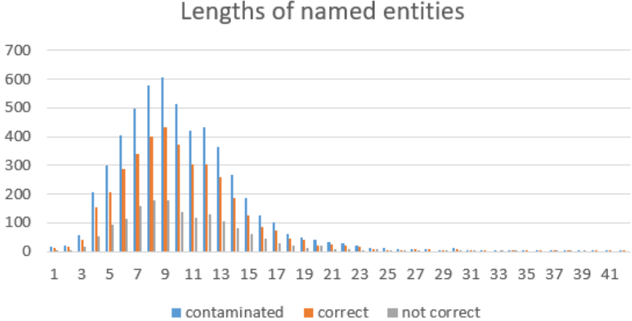
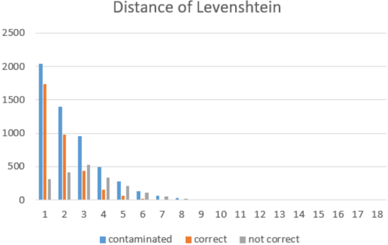
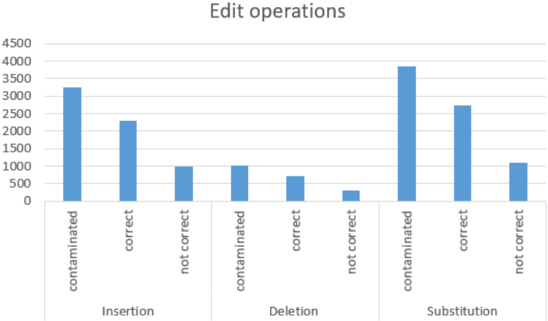

## ARTICLE

## In-Depth Analysis of the Impact of OCR Errors on Named Entity Recognition and Linking

Ahmed Hamdi, Elvys Linhares Pontes, Nicolas Sid` ere, Micka¨ el Coustaty and Antoine Doucet

University of La Rochelle, Laboratoire L3i Faculté des Sciences et Technologies, Bâtiment Pascal Avenue Michel Crépeau, 17042, La Rochelle, France

firstname.lastname@univ-lr.fr

(Received xx xxx xxx; revised xx xxx xxx; accepted xx xxx xxx)

## Abstract

Named entities are among the most relevant type of information that can be used to properly index digital documents and thus easily retrieve them. It has long been observed that named entities are key to accessing the contents of digital library portals as they are contained in most user queries. However, most digitized documents are indexed through their OCRed version which include numerous errors. Although OCR engines have considerably improved over the last few years, OCR errors still considerably impact document access. Previous works were conducted to evaluate the impact of OCR errors on named entity recognition and linking techniques separately. In this article, we experimented with a variety of OCRed documents with different levels and types of OCR noise to assess in depth the impact of OCR on named entity processing. We provide a deep analysis of OCR errors that impact the performance of named entity recognition and linking. We then present the resulting exhaustive study and subsequent recommendations on the adequate documents, the OCR quality levels and the post-OCR correction strategies required to perform reliable named entity recognition and linking.

## 1. Introduction

Large quantities of printed documents are scanned and archived as images. Text extraction using optical character recognition (OCR) systems is then necessary for indexing documents, which is an essential feature for the accessibility to these documents. Unfortunately, the quality of OCR output is imperfect and sometimes far from the actual expected text, known as the ground truth. Compared to the costly efforts that can be spent fixing OCR errors, it is considered that the quality of OCR outputs is sufficient to read and explore documents. However, several studies show that the effectiveness of systems processing OCR output texts might be considerably harmed by OCR errors (Ittner et al. 1995; Lopresti 2009).

The quality of the generated texts using OCR engines depends on their algorithms and on the parameter settings of the scanner used to digitize documents as well as on the quality of the original image and the nature of the document. For example, generated text from recent/historical newspapers and normal/damaged manuscripts do not usually have the same quality. Reasonable levels of OCR errors have relatively little impact on the human ability to read the documents. However, the text resulting from OCR is the one used for indexing. Subsequently, if some words have been wrongly recognized by the OCR, they will be indexed with their errors. This represents a serious problem for document indexing and retrieval.

Named entities are useful in many applications in Web search (Guo et al. 2009). A study has shown that named entities (NEs) are the first point of entry for users in a search system (Gefen 2014). It is estimated that four out of five user queries on the Gallica a contain at least one NE (Chiron et al. 2017). Thus, properly recognising NEs can be considered more important than properly recognising other words. In order to improve the quality of user searches in a system, it is thus necessary to ensure the quality of these particular terms.

Named entity recognition (NER) is a traditional natural language processing (NLP) task used for many information retrieval applications (Petkova and Croft 2007; Guo et al. 2009) such as indexing and text mining. NER emerged in the middle of the 90 ′ s (Grishman and Sundheim 1996). It aims to locate specific terms in a given text and to categorize them into a set of predefined classes. Three main classes are usually used for named entity labeling: person, location, and organization (Nadeau and Sekine 2007).

Combined or subsequent to NER, named entity linking (NEL) connects NEs to external knowledge bases such as Wikipedia b , Wikidata c , DBpedia (Lehmann et al. 2015), GeoNames d , YAGO(Suchanek et al. 2007) and Google Knowledge Graph e . This allows differentiating ambiguous geographical locations or names (e.g. the mention Paris can be linked to several cities or people), and implies that the descriptions from the knowledge bases can be used for semantic enrichment.

However, NER and NEL are especially challenging for large quantities of documents as the diversity of NEs is increasing with the size of the collections. In the case of digitized documents, represented by their OCRed version which may contain numerous OCR errors, NEs are particularly affected, as stated by (Chiron et al. 2017). To perform NER and NEL, many techniques were developed in the literature over the last 25 years. These techniques can be classified into rule-based and machine learning-based approaches. For rule-based methods, rules are extracted manually. They are related to linguistic descriptions, trigger words and lexicons of proper names (also known as gazetteers). These rules use patterns and regular expressions in order to locate NEs, classify them and link them to knowledge bases. The machine-learning approaches, on the other hand, aim to extract rules autonomously using large corpora. In the presence of OCR errors, rule-based methods are clearly hampered and unable to override the degradation generated by the OCR. However, machine learning methods introduce sufficient flexibility to be adapted to processing noisy text.

Recent works have analysed the impact of OCR errors on NER (Hamdi et al. 2020) and NEL (Linhares Pontes et al. 2019). More precisely, they analysed different levels and types of OCR degradation and their impact on the performance of NER and NEL systems. They concluded that OCR is strongly related to the drop in performance of these tasks. For instance, the performance of NER systems drops from 90% to 60% when the character error rate exceeds 20% while the results on NEL systems decrease around 10 percentage point when the OCR error rates are respectively 4% and 15% at the character and word levels.

The present work proposes to extend the analysis of these previous works (Linhares Pontes et al. 2019; Hamdi et al. 2020) with a deep analysis of OCR errors over the noisy collections. We define and study types of character/word errors and in which way they impact the performance of NER and NEL systems. In order to do that, we study five aspects related to general OCR errors and compare them with human-generated misspellings, including length effects, erroneous character positions, segmentation errors (named entity boundaries), Levenshtein distance and edit

a Gallica is the digital library portal of the National Library of France.

b http://www.wikipedia.org

c https://www.wikidata.org

d http://www.geonames.org

e https://developers.google.com/knowledge-graph

operations. These observations allowed us to give several suggestions on how to implement effective OCR post-processing approaches when intending to perform named entity recognition and linking.

The rest of this paper is organized as follows: in Section 2, we describe typical NER and NEL approaches. Section 2.3 studies the impact of OCR on many NER and NEL systems processing its outputs. Section 3 consists of two parts. The first one concerns the datasets, with an overview of the NER and NEL datasets used. The second part outlines the impact of OCR errors on NER and NEL systems from a global point of view, using results on clean and noisy OCRed texts. Based on the resulting observations, we propose an in-depth analysis of the types of OCR errors and their impact on NER and NEL in Section 4. Finally, Section 5 concludes the paper.

## 2. Related work

This paper studies NER and NEL applied to OCRed documents. Consequently, we first introduce the main underlying NER and NEL approaches, and then review works related to the impact of OCR quality on the performance on NE processing.

## 2.1 Named entity recognition

NERsystems aim to locate named entities in a given sequence of words, and to assign them a label (e.g. PER for persons, LOC for locations and ORG for organizations). Many NER approaches annotate texts using the IOB tagging scheme, where each token is marked as being inside (I), outside (O) or at the beginning (B) of an entity of a certain class. The sentence ' Paris Hilton visited Paris ', is for instance to be labeled as follow: B PER I PER O B LOC .

NERapproaches appeared in the 1990's (Grishman and Sundheim 1996), and the early systems relied on rule-based approaches. Rules used in those systems are defined by humans and based on dictionaries, trigger words and linguistic descriptors. Such techniques require a lot of time and effort to be extracted and handled. Thus they cannot easily be updated to new types of texts or entities. To overcome this problem, the efforts on NER are largely dominated by machine learning techniques such as fully supervised learning, semi-supervised learning, unsupervised learning, and more recently deep learning.

Fully supervised approaches to NER include support vector machines (SVM) (Asahara and Matsumoto 2003) and maximum entropy models (Borthwick et al. 1998), as well as sequential tagging methods such as hidden Markov models (Bikel et al. 1998), and conditional random fields (CRFs) (Filannino et al. 2013). These approaches, similarly to rule-based methods, rely on handcrafted features, which are challenging and time-consuming to develop, and may be costly to update and generalize to new data.

More recently, neural networks have been shown to outperform other supervised algorithms for NER. The first neural network-based system has been developed in 2011 (Collobert et al. 2011). It reached very competitive results for NER in comparison to previous machine learning works. Therefore, many NER systems using neural networks architectures have been proposed and have shown their abilities to outperform all previous systems. Most deep learning NER models are based on BiLSTM (Dernoncourt et al. 2017; Peters et al. 2017) or Transformer architectures (Vaswani et al. 2017; Devlin et al. 2019; Boros et al. 2020a). However, BiLSTM models, with a CRF top-layer as tag decoder, dominate existing models (Lample et al. 2016; Ma and Hovy 2016). Deep learning-based approaches rely on word and character distributed representations. Common algorithms for such context-independent word embeddings include Google word2vec (Goldberg and Levy 2014) and Stanford Glove (Pennington et al. 2014). Many other works have been proposed to enrich word representations with sub-word and contextual information, such as ELMo (Peters et al. 2018), Flair (Akbik et al. 2019) and BERT (Devlin et al. 2019).

The effectiveness of NER systems using neural networks is due to their ability to be updated and generalized. These systems can jointly learn effective features with model parameters directly from the training dataset, instead of relying on hand-crafted features developed for a specific dataset.

## 2.2 Named entity linking

As we mentioned in the introduction, the aim of the NEL task is to map named entities to their corresponding entities in a knowledge base (KB) (Shen et al. 2015), where KBs contain a set of named entities and a set of documents.

As with NER, NEL methods based on neural networks (Ganea and Hofmann 2017; Le and Titov 2018) have shown an ability to outperform models based on hand-crafted features that learn from data on the base of manually selected features. Neural network-based methods include all variants of deep learning techniques, such as transfer learning (Linhares Pontes et al. 2020b), reinforcement learning (Fang et al. 2019) or multi-task learning (Martins et al. 2019b) to analyze features, relationships, and complex interactions among features, which allow a better analysis of documents and improve their performance. These methods combine context-aware words, spans and entity embeddings with neural similarity functions to analyze the context of mentions and correctly disambiguate them to a KB. To disambiguate named entities, NEL systems are based on three steps:

- (1) generate all potential entities to each linkable NE;
- (2) rank the candidate entities;
- (3) predict unlinkable mentions of extracted NEs.

More precisely, the generation of candidate entities consists in retrieving the related entity mentions from a KB that refer to mentions in a document. To do so, NEL systems have used dictionaries (Guo et al. 2013) and search engines (Han and Zhao 1999) or expanded surface forms from the local document (Zhang et al. 2011). They ranked then selected candidates to the most likely mention from the KB. Many state-of-the-art methods have been proposed to analyse and rank these candidates such as name string comparison (Zheng et al. 2010), entity popularity (Guo et al. 2013), entity type (Dredze et al. 2010), textual context (Li et al. 2013), and coherence between mapping entities (Cucerzan 2007). Once candidates from the KB are ranked, the last module checks for each mention whether the input NE matches with the target top-ranked NE.

Many other studies developed end-to-end systems, which jointly handle NER and NEL. Early works were based on engineered features (Sil and Yates 2013; Luo et al. 2015). Neural networkbased systems were then proposed to capture the mutual dependency between NER and NEL. The first neural system f has been proposed by Kolitsas et al. (2018). Their method first generates all potential NEs and then learns similarity features based on contextual embeddings in order to disambiguate these mentions. Then, many other neural architectures have been proposed using either BiLSTM (Martins et al. 2019a) or BERT (Broscheit 2019; Chen et al. 2019). More recently, Cao et al. (2021) implemented the mGENRE system, which takes advantage of language connections to predict and link NEs of multiple languages.

## 2.3 Natural language processing of OCRed documents

Despite decades of research on OCR, outputs of such systems often contain errors especially when the OCR input document is damaged, old or badly digitized. OCR systems are always located at the beginning of pipeline processes and their errors might have a negative impact and can be

sometimes harmful for further tasks. For this reason, many researchers have studied the problems relating to processing text data from noisy sources. Those studies where led in order to understand the effects of optical recognition errors on text analysis routines and eventually estimate which zones of digitized documents may require a prior error correction process.

Many works have been done in the field of NLP to process noisy data (Lopresti 2005). For instance, Lopresti (2009) have considered a text analysis pipeline consisting of sentence boundary detection, tokenization and part-of-speech tagging of noisy unstructured text data. They reported that on the sentence boundary task for example, the insertion errors have more destructive impact than character deletion errors, while OCR substitution errors are worse on part-of-speech tagging. More recently, Nguyen et al. (2019) proposed an analysis of OCR errors on many collections of historical documents obtained from digital libraries. They showed that 81.49% of OCRed words contain two erroneous characters and that characters such as 'b', 'd', 'm' and 'n' are more easily misrecognized than others. The effects of processing noisy texts have also been studied on many other NLP tasks such as machine translation (Yaser 2005), document summarization (Jing et al. 2003) and topic modelling (Mutuvi et al. 2018).

Several works focused on information retrieval from noisy data (Croft et al. 1994). Chiron et al. (2017) proposed a method to estimate the impact of OCR errors on the use of digital libraries. They built an OCR error model using a large corpus of OCRed documents aligned with their corresponding gold standard. Their model estimated the risk that a user's query might fail to match with the targeted documents. Taghva et al. (1996) showed that moderate OCR errors have no desperate impact on the effectiveness of classical information retrieval measures. Other studies focused on the impact of OCR errors on the classification of pathology reports for cancer notification (Zuccon et al. 2012). They concluded that OCR errors even with modest rates are not perceptible for extracting cancer notification items.

## 2.3.1 OCR errors and Named-Entity Recognition

Concerning named entity recognition, several works have been done to extract named entities from diverse text types such as outputs of OCR Hamdi et al. (2019), automatic speech recognition (ASR) systems (Favre et al. 2005), informal text messages and noisy social network posts (Ritter et al. 2011). An exhaustive survey on NER on historical documents was recently published (Ehrmann et al. 2021). Palmer and Ostendorf (2001) described an approach for improving named entity extraction from ASR systems outputs by explicitly modeling errors through the use of confidence scores. In a similar setting, Miller et al. (2000) studied the NER performance under a variety of spoken and OCRed data. They trained a NER system on both clean and noisy input material and observed that performance degraded linearly as a function of word error rate. They concluded that results may lose about 8 points of F-score with only 15% of word error rate. Rodriquez et al. (2012) reported that manual correction of OCR output do not result in a clear improvement of NER results. Many other studies took interest in named entity extraction from digitized historical journals (Grover et al. 2008), broadcast news (Gotoh and Renals 2000) and religious monologues, scientific books and medical emails (Maynard et al. 2001).

Recently, two studies showed that neural network NER models are better able to alleviate OCR errors compared to traditional machine learning approaches (van Strien et al. 2020; Hamdi et al. 2019; Boros et al. 2020b). However, even with neural networks, NER performances considerably decrease when applied on OCRed documents. van Strien et al. (2020) conducted a large-scale analysis of the impact of OCR errors on several NLP tasks. They found that the impact on NER is less significant than on other tasks such as dependency parsing and sentence segmentation. Interestingly, the damaging effect seems greater on geo-political entities than person names or dates. Hamdi et al. (2019) focused on NER. They processed five noisy datasets using a BiLSTM NER system and reported that NER F1-score drop about 30 percentage points when the error rate is around 20%. Huynh et al. (2020) then applied a post-OCR correction method on these datasets

and showed that the OCR impact can be considerably attenuated by only correcting OCR words with up to two erroneous characters.

Additional related work proposed to create collections for NER on digitised Chinese documents (Lawrie et al. 2020). The aim of building such collections is to support the full context of NERover OCRed text and to improve NER performance. The methodology proposed for building OCR/NER collections is to convert blocks of text into images and then to extract the text from images using OCR. Finally, they generated OCRed text enriched with NER annotations.

## 2.3.2 OCR errors and Named-Entity Linking

Concerning NEL, we previously evaluated the performance of state-of-the-art named entity linking approaches over digitized documents with different levels of OCR quality (Linhares Pontes et al. 2019). We simulated OCR mistakes on contemporary datasets and analyzed the performance of Ganea and Hofmann (2017) and Le and Titov (2018) systems on these data. Ganea and Hofmann embed entities and words in a common vector space and use a neural attention mechanism over local context windows to select words that are informative for the disambiguation decision. Le and Titov relied on representation learning and learn embeddings of mentions, contexts, and relations to reduce the amount of human expertise required to construct the system and make the analysis more portable across languages and domains. In our analysis, the performance of these systems decreased around 20% when OCR errors, at the character and word levels, reached rates of 5% and 15% respectively.

In addition to OCR errors, works in digital humanities deal with historical documents that may contain spelling variations from modern languages, which can be difficult to recognize because spelling conventions may be reformed from time to time. Some works focused on the use of available NEL approaches to analyze historical data (van Hooland et al. 2013; Munnelly and Lawless 2018; Ruiz and Poibeau 2019). Other works studied the development of features and rules to improve specific-domain NEL (Heino et al. 2017) or entity types (Brando et al. 2016). Moreover, some studies focused on the effect of problems frequently encountered in historical documents on NEL (Linhares Pontes et al. 2020a). They represented the entities in a continuous space and combined them with a neural attention mechanism to analyze context words and candidate entity embeddings to disambiguate mentions in historical documents. In addition, they developed several modules to handle the multilingualism and errors related to OCR engines.

Similarly to van Strien et al. (2020), we propose in the next sections to study the impact of OCR quality on NLP tasks, specifically NER and NEL, however, running detailed analysis over noisy data. Unlike previous work, we use larger corpora for evaluation without relying on postcorrection. The datasets used in this work cover several languages and the noisy version contains different types of degradation that might be related to storage or digitization processes. Finally we present a deep analysis of the OCR quality and provide different types and levels of OCR errors required to perform reasonably reliable NER and NEL approaches.

## 3. Resources

Processing named entities in a noisy context is very common with historical content, since the text to be analysed is almost always resulting from a digitization and an OCR process. Few annotated datasets (with named entities and their links) in a noisy context aligned with their ground truth are publicly available to assess the impact of OCR errors on those tasks. As the main objective of this paper is to have a deep analysis of OCR error categories for NER/NEL tasks, we first review experiments on the global impact of OCR errors. To this end, we start with an overview of the two publicly available datasets we used. We then present how we simulated degradations of the digitization process and their OCR errors. Finally, we present the obtained results from the point

of view of OCR quality, using the classical measures that are character error rate (CER) and word error rate (WER).

## 3.1 Datasets

## 3.1.1 Named entity recognition datasets

First, we focused on NER on a publicly available dataset g presented by Hamdi et al. (2020). These corpora are based on dataset presented in the conference on natural language learning in 2002 and 2003 (CoNLL-02 and CoNLL-03). Then, we performed some operations to synthesize real OCR errors. These resources consist of 3 datasets covering 3 languages : English, Spanish and Dutch. Each dataset is cut into the 3 subsets that are commonly used in machine learning, i.e. training set, development set and test set. For each corpus (English, Dutch and Spanish), degraded images and noisy texts extracted by the OCR as well as the aligned version with clean data at the word and the character levels are provided.

Named entities are classified into 4 pre-defined categories: PER for persons, LOC for locations, ORG for organisations and MISC for miscellaneous, which is used to annotate all NEs not belonging to any of the other three classes.

## 3.1.2 Named entity linking datasets

For NEL experiments, we used a publicly available dataset h , presented in Linhares Pontes et al. (2019). As for NER datasets, this corpora are based on degraded versions of clean existing NEL datasets:

- AIDA-CoNLL dataset (Hoffart et al. 2011) is based on CoNLL-03 data that was used for the NER task. This dataset is divided into AIDA-train for training, AIDA-A for validation, and AIDA-B for testing. This dataset contains 1,393 Reuters news articles and 27,817 linkable mentions.
- AQUAINT dataset (Guo and Barbosa 2014) is composed of 50 short news documents (250300 words) from the Xinhua News Service, the New York Times, and the Associated Press. This dataset contains 727 mentions.
- ACE2004 dataset (Guo and Barbosa 2014) is a subset of the ACE2004 coreference documents with 57 articles and 306 mentions, annotated through crowdsourcing.
- MSNBC dataset (Guo and Barbosa 2014) is composed of 20 news articles from 10 different topics (two articles per topic: Business, U.S. Politics, Entertainment, Health, Sports, Tech &amp; Science, Travel, News).

## 3.1.3 Simulation of noisy data

Both datasets follow the same process of construction. Due to the lack of real noisy annotated data, they were built by synthesizing the process of text extraction from digitized documents. First, this was done by generating clean images from raw text coming from NER-NEL datasets. To simulate the noise induced by digitization, they then used the DocCreator tool i developed by Journet et al. (2017). This tool provides many filters to apply various degradations to document images such as blurring, bleeding-through, ink degradation, holes and more.

In order to simulate OCRed versions, the raw texts are extracted from the NER and NEL annotated corpora. They are then converted into images which have been contaminated by injecting common OCR degradation when using a scanner. Using the tesseract OCR engine, the noisy texts

g https://zenodo.org/record/3877554

h https://zenodo.org/record/3490333

i http://doc-creator.labri.fr/

Figure 1. Sample of noisy images.

| original image        | [Nadim Ladki ALAIN , United Arab Emirates 1996-12-06 the defence of their Asian Cup title with a lucky 2-1 win Syria in a Group C championship Imatch on Friday cegan against                            |
|-----------------------|----------------------------------------------------------------------------------------------------------------------------------------------------------------------------------------------------------|
| characters            | [Nadim Ladki ALAIN , United Arab Emirates 1996-12-06 [Japan the defence of their Asian Cup title with a lucky 2-1 win against Syria in a Group C championship Imatch on Friday began                     |
| phantom through       | Inewcomers Uzbekistan [Nadim Ladki ALAIN , United Arab Emirates 1996-12-06 [Japan the defence of their Asian Cup title with a lucky 2-1 win against Syria in a C championship Group                      |
| bleed                 | on Friday [But China saw their luck desert them in the second match of the group crashing to a surprise 2-0 defeat to [ewcomers Uzbekistan Imatch                                                        |
| character degradation | [OCCER JALAIN United Arab Emirates 1996-12-06. Imatch on Friday [But Chna saw their luck desert them in the second match of the group crashing to a surpríse ?-0 defeat Io [newcomets Uzbekistan began , |
| blurring effects      |                                                                                                                                                                                                          |

are then extracted from the degraded document images. Finally, the original and noisy texts are aligned using the RETAS j tool, to match the annotations from the original corpus to the noisy version.

Four types of degradation are applied to both datasets: the character degradation adds small ink spots on characters due to the age of documents. The phantom degradation simulates eroded characters that can occur after successive uses of documents. The bleed-through simulates the ink from the back side of a page, appearing on its front side. The blurring adds a blurring effect. Each of these types of degradation are performed at two levels in the NER datasets: LEV-1 level where noises are applied rarely and LEV-2 where they are applied more frequently. On the NEL dataset, only the LEV-1 has been applied. Figure 1 shows an original image and its degraded version.

Two additional degradations have been defined: LEV-0 and LEV-MIX. LEV-0 is the re-OCRred version of original images with no degradation added. It aims to provide a baseline of the OCR engine with a clean image. LEV-MIX is more of a real-world example, representing the result of simultaneously applying the four types of degradation at LEV-1 to the original texts. Table 1 outlines the CER and WER percentages for each OCRed version of test sets. These results are close to OCR error rates with real-life collections (Holley 2009).

Table 1. OCR errors rates on NER and NEL datasets at the character and the word levels.

|               |         | NER dataset   | NER dataset   | NER dataset   | NER dataset   | NER dataset   | NER dataset   | NEL dataset   | NEL dataset   | NEL dataset   | NEL dataset   | NEL dataset   | NEL dataset   | NEL dataset   | NEL dataset   |
|---------------|---------|---------------|---------------|---------------|---------------|---------------|---------------|---------------|---------------|---------------|---------------|---------------|---------------|---------------|---------------|
|               |         | English       | English       | Dutch         | Dutch         | Spanish       | Spanish       | AIDA          | AIDA          | ACE2004       | ACE2004       | AQUAINT       | AQUAINT       | MSNBC         | MSNBC         |
|               |         | CER           | WER CER       |               |               | WER CER       |               | WER CER       |               | WER CER       | WER CER       |               |               |               | WER CER WER   |
| LEV-0         | LEV-0   | 1 . 7         | 8 . 5         | 1 . 6         | 7 . 8         | 0 . 7         | 4 . 8         | 1 . 0         | 3 . 9         | 0 . 8         | 3 . 0         | 0 . 4         | 2 . 0         | 1 . 1         | 2 . 3         |
| Bleed-through | LEV-1   | 1 . 8         | 8 . 5         | 1 . 7         | 8 . 2         | 0 . 8         | 4 . 9         | 1 . 0         | 3 . 9         | 0 . 7         | 3 . 0         | 0 . 4         | 1 . 9         | 0 . 3         | 1 . 6         |
|               | LEV-2   | 1 . 8         | 8 . 6         | 1 . 8         | 8 . 9         | 0 . 8         | 5 . 4         | -             | -             | -             | -             | -             | -             | -             | -             |
| Blurring      | LEV-1   | 6 . 3         | 20 . 0        | 5 . 9         | 22 . 0        | 3 . 0         | 12 . 0        | 1 . 8         | 5 . 4         | 1 . 3         | 3 . 8         | 0 . 6         | 2 . 2         | 0 . 9         | 3 . 2         |
| Blurring      | LEV-2   | 41 . 3        | 54 . 0        | 27 . 0        | 44 . 7        | 19 . 5        | 29 . 9        | -             | -             | -             | -             | -             | -             | -             | -             |
| Char deg.     | LEV-1   | 3 . 6         | 21 . 8        | 4 . 5         | 25 . 1        | 2 . 1         | 14 . 2        | 3 . 4         | 16 . 9        | 2 . 5         | 14 . 9        | 2 . 1         | 13 . 4        | 2 . 3         | 14 . 3        |
| Char deg.     | LEV-2   | 4 . 3         | 23 . 7        | 6 . 4         | 31 . 6        | 2 . 7         | 16 . 3        | -             | -             | -             | -             | -             | -             | -             | -             |
| Phantom deg.  | LEV-1   | 1 . 7         | 8 . 8         | 1 . 6         | 8 . 0         | 0 . 8         | 5 . 5         | 1 . 1         | 5 . 6         | 0 . 8         | 4 . 6         | 0 . 5         | 4 . 0         | 0 . 5         | 3 . 4         |
| Phantom deg.  | LEV-2   | 1 . 8         | 10 . 0        | 1 . 7         | 8 . 4         | 0 . 9         | 5 . 9         | -             | -             | -             | -             | -             | -             | -             | -             |
| LEV-MIX       | LEV-MIX | 6 . 9         | 22 . 8        | 5 . 8         | 22 . 2        | 3 . 5         | 11 . 9        | 4 . 8         | 18 . 2        | 4 . 8         | 15 . 4        | 2 . 5         | 13 . 7        | 3 . 1         | 15 . 4        |

## 3.2 Global impact of OCR errors on NER/NEL

Neural networks as well as the training process have several hyper-parameters such as character embedding dimension, character-based token embedding, LSTM dimension, token embedding dimension, etc. The same parameters for training and testing have been used for both OCRed and clean datasets. In order to quantitatively estimate the impact of OCR errors on the NER and NEL tasks, we highlighted our previous works (Hamdi et al. 2020; Linhares Pontes et al. 2019) over the clean corpora and the noisy simulated ones.

## 3.2.1 Impact of OCR errors on NER

All experiments we will perform in this article are exposed in Hamdi et al. (2020). The first one was conducted over clean corpora. Then, the same experiment was run on the OCRed datasets. We evaluated four NER systems, one machine learning-based system and three deep learning-based systems. As results showed that deep learning-based systems have very similar performances and outperform the machine learning-based system, we reuse in this paper the results obtained by the BiLSTM-CNN-CRF model k (Ma and Hovy 2016). The model uses a forward LSTM and a backward LSTM that encode the left and right contexts, respectively. The forward and backward LSTM pair is referred to as a bidirectional LSTM (BiLSTM). Then, a CRF layer generates the most probable sequence of predicted labels from surrounding words. In order to get the best possible performances, we adapted this architecture to only use word and character embeddings. For the character-level embedding, the system induces character-level features using a convolutional neural network (CNN) engine. It therefore adds to each word vector a new feature in the form of a character-based vector. Character features can be character embedding and character types ( i.e. uppercase, lowercase, numbers, punctuation marks, special characters). For the word embedding level, we used the FastText (Bojanowski et al. 2017) embedding as this is a word-fragment based model that can usually handle unseen words, and it still generates one vector per word. Finally, the character-level representation vector is concatenated with the word embedding vector to feed the BiLSTM network. Finally, the output vectors of BiLSTM are used as inputs to the CRF layer to jointly decode the best label sequence. The word embedding model of our system relies on the pretrained word embedding FastText model (Grave et al. 2018), while the character embedding was trained on our data. To remedy issues with out-of-vocabulary (OOV) words, we use both characterbased and subword-based embeddings computed with FastText (Bojanowski et al. 2017). This

k The model is publicly available: https://github.com/kermitt2/delft

method is able to retrieve embeddings for unknown words by incorporating subword information. These systems convert the input sequence of words into a sequence of fixed-size vectors ( x 1, x 2,..., xn ), i.e. the word-embedding part, and return another sequence of vectors ( h 1, h 2,..., hn ) that represents named entity labels at every step of the input. This tool achieved impressive results on two linguistic sequence labeling tasks: POS tagging with an accuracy exceeding 97% and named entity recognition with a F1-score of 91% (Ma and Hovy 2016). Results are detailed in Table 2.

Table 2. Micro-averaged F1 scores using BiLSTM-CNN-CRF system (Ma and Hovy 2016) on NER clean and noisy OCRed data.

|                 | English   | Dutch   | Spanish   |
|-----------------|-----------|---------|-----------|
| Clean           | 90 . 90   | 80 . 12 | 85 . 45   |
| LEV-0           | 87 . 45   | 74 . 03 | 85 . 13   |
| Bleed LEV-1     | 86 . 11   | 73 . 15 | 84 . 07   |
| Bleed LEV-2     | 83 . 96   | 72 . 75 | 75 . 12   |
| Blur LEV-1      | 71 . 03   | 63 . 77 | 68 . 79   |
| Blur LEV-2      | 60 . 31   | 44 . 56 | 61 . 44   |
| DegChar LEV-1   | 74 . 11   | 56 . 33 | 64 . 93   |
| DegChar LEV-2   | 68 . 77   | 50 . 78 | 64 . 12   |
| PhantChar LEV-1 | 87 . 01   | 73 . 18 | 77 . 21   |
| PhantChar LEV-2 | 85 . 20   | 72 . 97 | 76 . 76   |
| LEV-MIX         | 70 . 82   | 64 . 88 | 73 . 98   |

The results show that the relative performance variations are essentially comparable for the three languages. As expected, the accuracy of NER drops proportionally to the level of OCR errors, which is itself related to the degradation type and level. Additionally, Table 2 shows that NER results may drop 3 to 5 percentage points from clean data to LEV-0 OCRed data, the OCRed synthesised data with no noise added. In other words, even with perfect storage and digitization, NER accuracy may be affected by the OCR quality. For other types of degradation, taking English as an example, the OCR word error rates vary from 8% to 50%, while NER F-score drop from 90% to 50%.

## 3.2.2 Impact of OCR errors on NEL

In this subsection, we give an overview of our previous work (Linhares Pontes et al. 2019) about the impact of OCR errors on NEL. As Ganea and Hofmann's and Le and Titov's systems had a similar impact on the performance generated by the OCRed documents, we reused the results of the Ganea and Hofmann system to explain and link the impact of OCRed documents between NER and NEL applications. We used the Ganea and Hofmann system instead of an end-to-end NEL system in order to evaluate the impact of the OCR quality on entity disambiguation only (using NER gold tags). This choice also allows us to evaluate the impact of OCR errors on the end-to-end process for entity linking by using the outputs of the NER system as input to Ganea and Hofmann's NEL system (Section 4.7).

In order to analyze the impact of OCR degradation on the NEL task, experiments were conducted using the system of Ganea and Hofmann (2017) on OCRed datasets. Ganea and Hofmann proposed a deep learning model l that represents entities and words in a common vector space.

l The model is publicly available: https://github.com/dalab/deep-ed

Their model uses a neural attention mechanism over local context windows and a conditional random field that collectively disambiguates the mentions in a document. Their model was pre-trained using the word embedding model Word2Vec with vectors of 300 dimensions from the Wikipedia corpus published in February 2014. Then, it was trained on the AIDA-CoNLL dataset (Hoffart et al. 2011).

Table 3 shows the performance of the Ganea and Hofmann's system (Ganea and Hofmann 2017) on datasets with multiple levels of OCR quality, in terms of micro-averaged F1 scores. It can be seen that the CER and WER generated by OCR degradation are globally correlated to the performance of NEL. While the LEV-0 and bleed degradation had the lowest CER and WER levels and generated the least impact on the F1 scores, character degradation produced larger CER and WER values and caused a bigger drop in the NEL performance. In contrast to the effect on the NER datasets, the blur degradation had a similar impact on the NEL performance as the bleed degradation. Among all datasets, ACE2004 was the most affected by OCR degradation, with a drop of almost 20 percentage points for the LEV-MIX degradation.

Table 3. Micro-averaged F1 scores using Ganea and Hofmann's system on NEL noisy OCRed data.

|                 |   AIDA |   ACE2004 |   AQUAINT |   MSNBC |
|-----------------|--------|-----------|-----------|---------|
| Clean           |  0.914 |     0.889 |     0.902 |   0.935 |
| LEV-0           |  0.904 |     0.791 |     0.887 |   0.917 |
| Bleed LEV-1     |  0.904 |     0.791 |     0.891 |   0.917 |
| Blur LEV-1      |  0.904 |     0.793 |     0.886 |   0.911 |
| DegChar LEV-1   |  0.902 |     0.687 |     0.79  |   0.85  |
| PhantChar LEV-1 |  0.904 |     0.787 |     0.88  |   0.91  |
| LEV-MIX         |  0.904 |     0.686 |     0.804 |   0.846 |

The combination of the OCR degradations (LEV-MIX) generated the highest CER and WER. Despite high error rates, this does not appear to have a significant impact on the NEL performance (decrease rate on the F1-scores up to 11%).

In spite of the complexity of the NEL task and the introduction of several types of errors, the systems achieved robust results with limited document degradation (up to 5% WER). However, degradations causing a stronger decrease in OCR performance had double the impact on NEL performance.

## 4. In-depth OCR error analysis

This section contains a key contribution of this paper. We propose an in-depth analysis of OCR errors and their impact on NER and NEL. Based on the conclusions from our analysis, one can observe that some OCR errors have a stronger impact on the tasks of named entity recognition and linking. Noting this is notably useful for the implementation of effective OCR post-processing approaches related to NER and NEL.

As discussed in Section 3.2 and detailed by Hamdi et al. (2020) and Linhares Pontes et al. (2019), the impact of OCR quality on NER and NEL is very similar regardless of the system or the dataset used on each task. For NER, all the systems achieve satisfying results when the OCR error rates are between 1% and 5% at the character level and 8% and 15% at the word level. Similarly all NEL systems reach good results when the CER is less than 7% and the WER does not exceed 17%. From these rates, NER and NEL are harmed by OCR errors. For these reasons, we use for each task one system and one dataset including all the noisy versions (Section 3). However, the BiLSTM-CNN-CRF model and the system of Ganea and Hofmann (2017) showed slightly

better results for NER and NEL respectively. We used the outputs of these systems to conduct our analysis. In terms of corpora, we used the English CoNLL-03 corpus for NER and its extension the AIDA corpus for NEL. Indeed, they are mostly used to evaluate state-of-the-art systems for the two tasks separately rather than through an end-to-end approach. Our in-depth analysis aims at covering the most relevant phenomena that define good strategies for post-OCR correction (edit operations, Levenshtein distance, length effects, first character errors and segmentation errors).

## 4.1 Recognition and linking of contaminated named entities

Contaminated named entities are named entities that are wrongly recognized from the image by the OCR process. As we mentioned earlier, NER and NEL systems are able in some cases to face OCR errors and to correctly recognize and link NEs. However, in many cases NER and NEL systems fail to overcome OCR errors.

To the best of our knowledge, all post-OCR research focused on general words Nguyen et al. (2021). No previous research study has been conducted on the analysis OCR errors over named entities. In order to study post-OCR on named entities, we have first extracted the contaminated entities in all the noisy versions of our datasets. Then, we have identified among them the NEs correctly recognized/linked and those wrongly recognized/linked in order to analyse them and identify OCR aspects that impacted the effectiveness of NER and NEL systems. Table 4 shows the percentages of contaminated and non-contaminated NEs on our datasets and the relative rates of the NEs correctly tagged by the systems. We perform this analysis with several OCRed versions of both datasets, each with varying error rates resulting from the injection of different types of document image noise.

Table 4. Percentages of contaminated named entities.

|               | CoNLL-03 (NER)        | CoNLL-03 (NER)       | AIDA (NEL)            | AIDA (NEL)       |
|---------------|-----------------------|----------------------|-----------------------|------------------|
|               | contaminated entities | correctly recognized | contaminated entities | correctly linked |
| LEV-0         | 4 . 11                | 98 . 87              | 0 . 42                | 100              |
| Bleed-through | 7 . 32                | 97 . 13              | 0 . 35                | 92 . 60          |
| Phantom deg.  | 9 . 44                | 97 . 33              | 0 . 51                | 94 . 87          |
| Char deg.     | 23 . 04               | 82 . 09              | 1 . 58                | 91 . 13          |
| Blurring      | 28 . 78               | 79 . 61              | 0 . 62                | 100              |
| LEV-MIX       | 31 . 17               | 70 . 36              | 1 . 47                | 92 . 39          |

Table 4 shows that the recognition and linking of contaminated named entities is slightly affected by OCR errors, particularly when the level of errors is low (LEV-0, bleed-through effects and phantom degradation for NER; and LEV-0 and blurring for NEL). Despite higher CER and WER values (3.4 and 16.9, respectively), AIDA does not contain as many contaminated named entities as the CoNLL-03 dataset. Indeed, most tokens that were affected by the OCR degradation are not entities. Among the degraded entities, the main OCR errors in the AIDA dataset are: deletion of characters (' outh Korea ' and ' South Korea '), accent (' Jerusalém ' and ' Jerusalem '), uppercase character (' indonesia ' and ' Indonesia ', and ' United states ' and ' United States '), and punctuation (' Australia. ' and ' Australia ').

Unsurprisingly, the more NEs are contaminated, the more NER results are degraded. Things are less clear with NEL. For example, the phantom degradation affected more NEs than the bleedthrough. However, more contaminated NEs are correctly linked in data with phantom degradation. In addition, all the contaminated NEs in the blurred data are successfully linked despite the number of contaminated NEs compared to other degraded data. These observations show that an additional

analysis is required in order to understand different OCR aspects and their impact on NER and NEL.

OCR errors directly affected contaminated entities but also uncontaminated entities. The performance of NEL was worse for LEV-MIX and character degradation (Table 4). One of the main reasons for this performance reduction is related to the context of these entities that were contaminated by OCR errors and degraded the disambiguation analysis of these entities.

For this reason, we conducted five experiments to characterize contaminated NEs and find out reasons why they are correctly or wrongly tagged by the NER and NEL systems. We have studied known aspects related to general OCR errors including length effects, edit operations, distance with original NEs, case sensitivity and segmentation errors.

## 4.2 Length effects

It was already observed that shorter words are more affected by OCR engines (Kukich 1992). This section aims to examine this aspect on NE tokens. In practice, the length of OCRed tokens may differ from the actual length of the tokens in the ground truth. For example, the OCRed token ' Japgfl ' of length 6 comes from the ground truth (GT) word ' Japan ' of length 5. We therefore analysed the effect of length over the OCRed tokens, since post-OCR algorithms focus on those rather than on the GT tokens. To do so, we first categorized contaminated NEs according to the length of their tokens and then identified among them those that were correctly tagged by the NER and the NEL systems. Counts of correct/incorrect NE recognized according to their lengths on our datasets are shown in Figure 2.

Figure 2. Length effects on NER in the CoNLL-03 dataset.

The analysis of OCRed token lengths (see Figure 2) shows two main findings. First, the vast majority of contaminated tokens are of length between 4 and 10 (about 78%). Second, most tokens outside this interval are correctly recognised despite OCR errors. We therefore suggest a post-OCR correction of tokens of lengths between 4 and 10.

Contrary to NER, the length effect does not show a significant impact on NEL. The model is mostly able to overcome OCR errors regardless of the entity length. Table 5 shows the number of noisy entities in the AIDA dataset that are correctly (or incorrectly) linked according to their lengths.

Table 5. Length effects on NEL in the AIDA dataset.

|   Length |   #contaminated |   #correct |   #not correct |
|----------|-----------------|------------|----------------|
|        4 |              24 |         22 |              2 |
|        5 |              87 |         81 |              6 |
|        6 |              46 |         46 |              0 |
|        7 |              70 |         66 |              4 |
|        8 |              24 |         21 |              3 |
|        9 |              40 |         36 |              4 |
|       10 |              11 |         10 |              1 |
|       11 |              10 |         10 |              0 |
|       12 |               4 |          4 |              0 |
|       13 |              14 |         14 |              0 |
|       14 |               6 |          6 |              0 |
|       15 |               2 |          2 |              0 |

## 4.3 Levenshtein distance

The Levenshtein distance is a measure of the difference between two strings. It considers the edit distance required to convert a string into another one based on classical edition operations (insertion, deletion and substitution). With it, we can estimate the degree of modification that the OCR degradation generated compared to the clean version and how this degradation affected the performance of NER/NEL systems. Percentages of errors based on Levenshtein distances (edit distances) of our datasets are shown in Figure 3. Depending on edit distance, there are singleerror tokens (e.g. 'Spain' vs. 'Span') and multi-error tokens with edit distances higher than 1 (e.g. 'Spain' vs. 'Syin'). Mitton (1987) reported that single-error words largely exceed multierror words in OCR outputs. The edit distance is an important criteria for post-OCR approaches. It helps to filter potential candidates and to select relevant ones. Figure 3 gives the distribution of contaminated NEs (blue) in the CoNLL-03 corpus according to their Levenshtein distances with the GT as well as with the number of NEs correctly recognised (orange) among them and those wrongly recognised (gray).

Figure 3. Impact of Levenshtein distance on NER in the CoNLL-03 dataset.

As Figure 3 shows, most OCR errors are single-error tokens with approximately 58.92% of the occurrences. When it comes to multi-error tokens, most of them are of edit distance 2 (22.57% in total). The rate of contaminated NEs correctly recognised is satisfactory when the edit distance is larger than 2. However, from a distance of 6, the NER system cannot handle OCR errors anymore since none of the NEs are correctly identified. Interestingly, NEs with edit distances 3, 4 and 5 that are correctly recognised are almost always multi-token NEs and errors, with the errors distributed over different tokens.

Regarding NEL, the OCR degradation on AIDA generated errors with a Levenshtein distance of at most 4. Table 6 shows the number of NEs correctly linked accorded to the Levenshtein distance between the noisy NEs and the corresponding ground truth.

Table 6. Impact of Levenshtein distance on NEL in the AIDA dataset.

|   Distance |   #contaminated |   #correct |   #not correct |
|------------|-----------------|------------|----------------|
|          1 |             324 |        304 |             20 |
|          2 |               8 |          8 |              0 |
|          3 |               4 |          4 |              0 |
|          4 |               2 |          2 |              0 |

As shown in Table 6, the errors had a limited impact on the performance of the NEL system. OCR errors are dominated by single-error tokens. The NEL system is based on a probability table p ( e | m ) to identify the entity candidates related to the entity mention m . When the degraded mention m does not have a corresponding entry in this probability table, the NEL approach cannot correctly link it to the KB. For instance, the mention 'Europe' exists in our probability table (possible entity candidates: continent, band, music album, and so on) and can be disambiguated to the correct candidate. However, the mentions 'Europi', 'Europe.', 'Eurape', and 'europe' (Levenshtein distance of 1 to 'Europe') do not exist in the probability table and, consequently, the NEL system cannot disambiguate them because they do not have any corresponding candidate. However, when these errors correspond to additional punctuation marks and lower/upper mistakes (e.g. 'france' and 'France' or 'france' and 'France.'), a pre-processing method normalises the mentions to fix these OCR errors. Moreover, a co-referencing method is used to find all mentions that refer to the same entity in a text. This process potentially links degraded mentions to non-degraded mentions and thus allows the NEL system to correctly disambiguate some of the degraded mentions and fixes these OCR errors. Moreover, a co-referencing method is used to find all mentions that refer to the same entity in a text.

For the two tasks, the analysis indicates that most contaminated NEs are of edit distances 1 and 2 in both the CoNLL (81.49%) and the AIDA corpora (98.22%). When the Levenshtein distance exceeds 2, errors are often distributed over different tokens of the degraded named entity. An edit distance threshold 2 at the token level can therefore be defined for post-OCR approaches to filter out irrelevant candidates.

## 4.4 Edit operations

In this section, we discuss in further details the impact of the different types of edit operations. Three basic edit operation types can be performed:

- Substitution , where one character has been replaced by another.
- Deletion , where a character has simply not been recognized by the OCR.
- Insertion , where an additional character has been wrongly added.

Contaminated named entities necessarily contain at least one type of modification (deletion, insertion and substitution). Nguyen et al. (2019) demonstrated that in around 23% of OCRed words, the three operations of deletion, insertion and substitution can appear together in the same word. Based on that and on the edit distance analysis (Section 4.3), post-OCR algorithms should pay more attention to single modification types instead of their combinations in order to filter potential candidates. In this aim, we analysed the correlation of contaminated NEs and single-error types. Figure 4 and Table 7 respectively show the corresponding distribution of contaminated NEs in the CoNLL-03 and the AIDA corpora. We also show the relative rates of NEs correctly/wrongly tagged in both corpora.

Figure 4. Impact of edit operations on NER in the CoNLL-03 dataset.

Table 7. Impact of edit operations on NEL in the AIDA dataset.

| Insertion   | Insertion   | Insertion   | Deletion   | Deletion   | Deletion    | Substitution   | Substitution   | Substitution   |
|-------------|-------------|-------------|------------|------------|-------------|----------------|----------------|----------------|
| contam.     | correct     | not correct | contam.    | correct    | not correct | contam.        | correct        | not correct    |
| 48          | 46          | 2           | 98         | 90         | 8           | 200            | 190            | 10             |

These results demonstrate two interesting facts. First, for NER, most of the contaminated named entities with one OCR error either undergo a substitution or an insertion operation. Second, the NEL corpus is clearly dominated by the substitution operation. On the other hand, the analysis shows that the delete operation is easily handled by NER systems (79.5% NEs are correctly recognised). For NEL in the AIDA corpus, contrary to NER, all the single-error NEs can be correctly linked regardless of the error type.

Our suggestions for OCR post-processing methods is thus to focus on insertion and substitution operations in order to filter potential candidates and mainly benefit to NER.

## 4.5 First character errors

In named entities the first character generally has more importance than the other characters, for instance when it is a capital letter. This is illustrated by the fact that early systems for named entity extraction only focused on capital letters (McDonald 1993; Mikheev 1999). These systems based on capital letters were using them to identify and delimit named entities (in English). Each word (or sequence of words) which did not occur in an ambiguous position (such as the beginning of a

sentence, or in a capitalized title) with a capitalized first letter was considered as a named entity. However, with OCR degradation, upper and lower case characters may be mixed up. NER results are, therefore, very impacted by case modifications (e.g. Apple vs apple).

Mitton (1987) described that 7% of the misspellings of his dataset appeared at the first character. Misspellings can change the first character by another capitalized character (e.g.'Spain' vs. 'Opain') or by a lower character (e.g. 'Spain' vs. 'spain') or by another type of character (e.g. 'Spain' vs. ';pain'). Table 8 shows the percentages of NEs impacted by errors at the first character in NER and NEL.

Table 8. Impact of first character errors on NER and NEL.

|                    | CoNLL-03     | CoNLL-03             | AIDA         | AIDA             |
|--------------------|--------------|----------------------|--------------|------------------|
|                    | contaminated | correctly recognized | contaminated | correctly linked |
| Number of entities | 822          | 250                  | 209          | 197              |
| Percentage         | 100%         | 30 . 41%             | 100%         | 94 . 25%         |

Results show that the NER system is very sensitive to the first character. Only 30.41% of the NEs are correctly recognised in spite of errors at the first character. For NEL, upper and lower letters have a lower impact since matching with KBs is not case-dependent. The NEL system is able to correctly link the NEs even if the first character is wrongly lower-cased. However, a few errors remain critical, such as the common substitution of a small case ' l ' instead of large case ' I ', as in ' Iowa ' and ' lowa '. In this case, the mention ' lowa ' does not exist in the probability table and, consequently, the NEL approach cannot link this mention to the KB.

In summary, when aiming at NER, we recommend post-OCR systems to specifically focus on the correction of first character errors, since only 30% of the contaminated NEs are properly recognized.

## 4.6 Segmentation errors

Also known as spacing errors, they occur in two cases:

- over-segmentation: when a word is split into several words (generally due to different text alignments and spacing).
- under-segmentation: when multiple words are wrongly joined.

It is worth noting that over- and under-segmentation can occur simultaneously. In the case of NEs, segmentation errors occur when a white space character is omitted between words in multiword NEs or when white space characters are erroneously inserted between two characters in at least one token of a named entity.

Table 9 shows the percentages of NEs impacted by segmentation errors on the CoNLL-03 corpus. The impact is dramatic as only 19.25% of the contaminated NEs are correctly recognized.

Table 9. Impact of segmentation errors on NER in the CoNLL-03 dataset.

|                    | contaminated   | correctly recognized   | wrongly recognized   |
|--------------------|----------------|------------------------|----------------------|
| Number of entities | 530            | 102                    | 428                  |
| Percentage         | 100%           | 19 . 25%               | 80 . 75%             |

All types of degradation in the AIDA dataset generated a few cases of segmentation errors that were correctly disambiguated by the NEL system.

In conclusion, together with first character errors, segmentation errors have the highest impact on NER performance, and a similar yet weaker impact on NEL. To deal with segmentation errors, post-OCR based on auto-encoders or language models could be used in future works to attempt to decrease the impact of content degradation.

## 4.7 End-to-end named entity processing

Finally, in order to better understand how OCR errors are propagated from NER to NEL systems, we propose to evaluate the overall impact of OCR errors in an end-to-end named entity linking scenario. This scenario consists in both recognising (NER) and disambiguating (NEL) the entities into a knowledge base (KB). This section analyses the cumulative errors of this two-step pipeline, and evaluates to what extent this impacts the performance of NEL systems. We conducted two experiments: one (NEL-only) based on the LEV-1 degradations (Section 3.2) and the other based on the propagation of OCR errors between the NER and the NEL systems (we applied the NER techniques on the OCRed version with errors, and then applied NEL directly on the output). The OCRed versions were obtained by applying the degradation procedures detailed in Section 3.2 of the paper (blurring, bleeding effect, phantom and character degradation) as well as the mix of all degradations.

In order to compare the performance of the NEL system in the disambiguation-only (Section 3.2.2) and the end-to-end scenarios, we used our NER approach (BiLSTM-CNN-CRF) to recognise the entities on the AIDA dataset and then Ganea and Hofmann's approach to disambiguate them to a KB. Table 10 shows the performance evolution between the NEL system only (from Section 3.2.2) and the end-to-end combination for each OCR degradation. Table 3 shows the impact of the propagation of OCR errors from NER to NEL. For comparative reasons we report the results of the NEL-only experiments. Despite the good NEL performance in the NEL-only scenario for all versions on the AIDA dataset, we can observe that the combination of NER and NEL caused a performance drop of 12%. Among all OCR versions, the LEV-MIX achieved the worst results.

Table 10. F-scores values of the OCR impact on the NEL-only and the end-to-end NEL performances in the AIDA dataset, and its associated loss.

| OCR version   |   NEL-only |   End-to-end NEL |   Performance loss |
|---------------|------------|------------------|--------------------|
| Clean         |      0.914 |            0.886 |              0.028 |
| LEV-0         |      0.904 |            0.867 |              0.037 |
| Bleed-through |      0.904 |            0.868 |              0.036 |
| Blurring      |      0.904 |            0.856 |              0.048 |
| char deg.     |      0.902 |            0.788 |              0.114 |
| Phantom deg.  |      0.904 |            0.865 |              0.039 |
| LEV-MIX       |      0.904 |            0.784 |              0.12  |

As Table 10 shows, the NEL-only model unsurprisingly outperforms the end-to-end model. Linking the output of the NER system (end-to-end) is more complicated than disambiguating GT named entities annotated in the clean version. In the noisy versions, it is clear that NER errors on OCRed data are impacting the NEL process, leading to a performance drop of the end-to-end model compared to the NEL-only model. Nevertheless, despite this drop, we can consider that the

end-to-end NEL pipeline achieved good results (almost 0.8 m in F-scores), which shows that the combination of NER and NEL systems can provide satisfying results for OCRed documents even without post-OCR correction. Recently, we proposed an analysis of the NEL process in order to overcome some OCR errors in historical documents Linhares Pontes et al. (2020a), which can improve the performance of NEL systems in OCRed documents.

## 4.8 Discussion

Huynh et al. (2020) showed that post-OCR correction algorithms are able to improve NER results over noisy texts when error rates at the character and word levels respectively exceed 2% and 10%. However, this approach does not consistently increase NER performance and the results sometimes remain far from those obtained with clean text. To address this shortcoming, we believe that defining heuristics to assist post-OCR algorithms can remedy the issue in a more effective way.

To perform our analysis, the selection of the dataset was thus intended to target and exhaust a dataset with variable OCR types and a realistic number of errors. The spectrum of the analysis is meant to be broad in the types of degradation rather than in the amount of data processed. As shown in Section 3, the CoNLL-03 and AIDA corpora, which are frequently used in NER and NEL tasks, contain diverse types of OCR errors, and the five aspects analysed in this section are sufficiently distributed in the noisy versions of each of them. As a matter of fact, OCR error rates in the CoNLL-03 corpus vary from 2% to 7% at the character level and from 8% to 23% at the word level whereas in the AIDA corpus the character error rate is between 1% and 5% and the word error rate is between 4% and 18% (cf. Table 1). Our findings suggest that the type and breadth of OCR errors is independent of the performance of the NER and NEL systems. It is mainly their extent that varies.

## 5. Conclusion

The recognition and linking of named entities in OCRed documents remains a challenge when compared with the clean version of these documents (Hamdi et al. 2020; Linhares Pontes et al. 2019). The errors generated by OCR engines and degraded documents have an impact on the performances of NER/NEL systems. Despite the recent progress achieved with neural networks and post-OCR corrections systems, several improvements can be done in order to minimise the impact of these errors and reduce the gap in the performance of these tasks between OCRed and clean documents.

In order to identify the types of OCR errors and propose possible solutions to achieve this goal, we presented an in-depth quantitative analysis of the types of OCR errors and their impact on the performance of the NER and NEL tasks both jointly and separately. We selected a dataset that, on the one hand, has annotations for both tasks, and on the other hand, contains variable OCR error types. The study covers 5 types of OCR errors and the analysis of the impact on NER and NEL output led to many interesting findings. The length effects demonstrated that most contaminated NEs, which the NER/NEL systems fail to recognise/link, are of length between 5 and 15 characters. The edit distance analysis showed that most of the contaminated NEs contain either singleor double-character errors. Post-OCR techniques should therefore be able to fix about 81.49% of the impacted named entities with an edit distance threshold of 2. Moreover, our observations showed that character deletion errors are the most easily overcome by NER/NEL systems contrary to character insertion and substitution errors. Post-OCR algorithms are recommended to primarily

m Performances are comparable to efficient state-of-the-art end-to-end systems on the AIDA dataset (Kolitsas et al. 2018; van Hulst et al. 2020; Ravi et al. 2021)

favor the correction of character substitutions, then insertions. For NEL, post-OCR can be limited to correct substitutions, as the edit operation analysis showed that the NEL system is able to deal with errors generated from deletion and insertion. When it comes to the position of erroneous characters, our observations showed that NER systems are particularly vulnerable to errors made with the first character notably when the case is changed. For NEL, however, case sensitivity has little impact, while the substitution of the first character did. Finally, the analysis showed that segmentation errors had a very strong impact on NER performance. Post-OCR correction techniques need to be tailored towards these kind of errors to best benefit the NER task.

In future works, we will extend our analysis to include space errors occurring at the end of the row of multi-column documents which lead to block segmentation errors. We additionally plan to rely on probabilities of OCR outputs at the character and the word levels to process NEs. Using the background knowledge of this study, we could predict named entities and improve the precision of NER and NEL systems. Another important point that we aim to study is NE-focused OCR post-correction. Given the importance of NEs in the activity of the users of digital libraries, post-OCR solutions geared towards NEs would have high impact on their access to information.

## Acknowledgement

This work has been supported by the European Union's Horizon 2020 research and innovation programme under grant 770299 (NewsEye) and by the ANNA project funded by the NouvelleAquitaine Region.

## References

Akbik, A. , Bergmann, T. , Blythe, D. , Rasul, K. , Schweter, S. , and Vollgraf, R. 2019. FLAIR: An Easy-to-Use Framework for State-of-the-Art NLP. In Proceedings of the 2019 Conference of the North American Chapter of the Association for Computational Linguistics (Demonstrations) , pp. 54-59, Minneapolis, Minnesota. Association for Computational Linguistics.

- Asahara, M. and Matsumoto, Y. 2003. Japanese named entity extraction with redundant morphological analysis. In Proceedings of the 2003 Conference of the North American Chapter of the Association for Computational Linguistics on Human Language Technology-Volume 1 , pp. 8-15. Association for Computational Linguistics.

Bikel, D. M. , Miller, S. , Schwartz, R. , and Weischedel, R. 1998. Nymble: a high-performance learning name-finder. arXiv preprint cmp-lg/9803003 .

- Bojanowski, P. , Grave, E. , Joulin, A. , and Mikolov, T. 2017. Enriching word vectors with subword information. Transactions of the Association for Computational Linguistics , 5:135-146.
- Boros, E. , Hamdi, A. , Linhares Pontes, E. , Cabrera-Diego, L. A. , Moreno, J. G. , Sidere, N. , and Doucet, A. 2020a. Alleviating Digitization Errors in Named Entity Recognition for Historical Documents. In Proceedings of the 24th Conference on Computational Natural Language Learning , pp. 431-441, Online. Association for Computational Linguistics.
- Boros, E. , Linhares Pontes, E. , Cabrera-Diego, L. A. , Hamdi, A. , Moreno, J. G. , Sid` ere, N. , and Doucet, A. 2020b. Robust Named Entity Recognition and Linking on Historical Multilingual Documents. In Conference and Labs of the Evaluation Forum (CLEF 2020) , volume 2696 of Working Notes of CLEF 2020 - Conference and Labs of the Evaluation Forum , pp. 1-17, Thessaloniki, Greece. CEUR-WS Working Notes.

Borthwick, A. , Sterling, J. , Agichtein, E. , and Grishman, R. 1998. Nyu: Description of the mene named entity system as used in muc-7. In Seventh Message Understanding Conference (MUC-7): Proceedings of a Conference Held in Fairfax, Virginia, April 29-May 1, 1998 .

- Brando, C. , Frontini, F. , and Ganascia, J.-G. 2016. REDEN: Named Entity Linking in Digital Literary Editions Using Linked Data Sets. Complex Systems Informatics and Modeling Quarterly , (7):60 - 80.
- Broscheit, S. 2019. Investigating entity knowledge in BERT with simple neural end-to-end entity linking. In Proceedings of the 23rd Conference on Computational Natural Language Learning (CoNLL) , pp. 677-685, Hong Kong, China. Association for Computational Linguistics.
- Cao, N. D. , Wu, L. , Popat, K. , Artetxe, M. , Goyal, N. , Plekhanov, M. , Zettlemoyer, L. , Cancedda, N. , Riedel, S. , and Petroni, F. 2021. Multilingual autoregressive entity linking. CoRR , abs/2103.12528.
- Chen, H. , Zukov-Gregoric, A. , Li, X. D. , and Wadhwa, S. 2019. Contextualized end-to-end neural entity linking. arXiv preprint arXiv:1911.03834 .

- Chiron, G. , Doucet, A. , Coustaty, M. , Visani, M. , and Moreux, J.-P. 2017. Impact of ocr errors on the use of digital libraries: towards a better access to information. In Proceedings of the 17th ACM/IEEE Joint Conference on Digital Libraries , pp. 249-252. IEEE Press.
- Collobert, R. , Weston, J. , Bottou, L. , Karlen, M. , Kavukcuoglu, K. , and Kuksa, P. 2011. Natural language processing (almost) from scratch. Journal of Machine Learning Research , 12(Aug):2493-2537.
- Croft, W. , Harding, S. , Taghva, K. , and Borsack, J. 1994. An evaluation of information retrieval accuracy with simulated ocr output. In Symposium on Document Analysis and Information Retrieval , pp. 115-126.
- Cucerzan, S. 2007. Large-scale named entity disambiguation based on Wikipedia data. In Proceedings of the 2007 Joint Conference on Empirical Methods in Natural Language Processing and Computational Natural Language Learning (EMNLP-CoNLL) , pp. 708-716, Prague, Czech Republic. Association for Computational Linguistics.
- Dernoncourt, F. , Lee, J. Y. , and Szolovits, P. 2017. Neuroner: an easy-to-use program for named-entity recognition based on neural networks. arXiv preprint arXiv:1705.05487 .
- Devlin, J. , Chang, M.-W. , Lee, K. , and Toutanova, K. 2019. BERT: Pre-training of deep bidirectional transformers for language understanding. In Proceedings of the 2019 Conference of the North American Chapter of the Association for Computational Linguistics: Human Language Technologies, Volume 1 (Long and Short Papers) , pp. 4171-4186, Minneapolis, Minnesota. Association for Computational Linguistics.
- Dredze, M. , McNamee, P. , Rao, D. , Gerber, A. , and Finin, T. 2010. Entity disambiguation for knowledge base population. In Proceedings of the 23rd International Conference on Computational Linguistics , COLING '10, pp. 277-285, Stroudsburg, PA, USA. Association for Computational Linguistics.
- Ehrmann, M. , Hamdi, A. , Pontes, E. L. , Romanello, M. , and Doucet, A. 2021. Named entity recognition and classification on historical documents: A survey. CoRR , abs/2109.11406.
- Fang, Z. , Cao, Y. , Li, Q. , Zhang, D. , Zhang, Z. , and Liu, Y. 2019. Joint entity linking with deep reinforcement learning. In The World Wide Web Conference , WWW'19, 438-447, New York, NY, USA. Association for Computing Machinery.
- Favre, B. , Béchet, F. , and Nocéra, P. 2005. Robust named entity extraction from large spoken archives. In Proceedings of the conference on Human Language Technology and Empirical Methods in Natural Language Processing , pp. 491-498. Association for Computational Linguistics.
- Filannino, M. , Brown, G. , and Nenadic, G. 2013. Mantime: Temporal expression identification and normalization in the tempeval-3 challenge. arXiv preprint arXiv:1304.7942 .
- Ganea, O.-E. and Hofmann, T. 2017. Deep joint entity disambiguation with local neural attention. In Proceedings of the 2017 Conference on Empirical Methods in Natural Language Processing , pp. 2619-2629. Association for Computational Linguistics.
- Gefen, A. 2014. Les enjeux épistémologiques des humanités numériques. Socio-La nouvelle revue des sciences sociales , (4):61-74.
- Goldberg, Y. and Levy, O. 2014. word2vec explained: deriving mikolov et al.'s negative-sampling word-embedding method. arXiv preprint arXiv:1402.3722 .
- Gotoh, Y. and Renals, S. 2000. Information extraction from broadcast news. Philosophical Transactions of the Royal Society of London. Series A: Mathematical, Physical and Engineering Sciences , 358(1769):1295-1310.
- Grave, E. , Bojanowski, P. , Gupta, P. , Joulin, A. , and Mikolov, T. 2018. Learning word vectors for 157 languages. In Proceedings of the International Conference on Language Resources and Evaluation .
- Grishman, R. and Sundheim, B. 1996. Message understanding conference-6: A brief history. In COLING 1996 Volume 1: The 16th International Conference on Computational Linguistics , volume 1.
- Grover, C. , Givon, S. , Tobin, R. , and Ball, J. 2008. Named entity recognition for digitised historical texts. In LREC .
- Guo, J. , Xu, G. , Cheng, X. , and Li, H. 2009. Named entity recognition in query. In Proceedings of the 32nd International ACM SIGIR Conference on Research and Development in Information Retrieval , SIGIR '09, 267-274, New York, NY, USA. Association for Computing Machinery.
- Guo, S. , Chang, M.-W. , and Kiciman, E. 2013. To link or not to link? a study on end-to-end tweet entity linking. In Proceedings of the 2013 Conference of the North American Chapter of the Association for Computational Linguistics: Human Language Technologies , pp. 1020-1030, Atlanta, Georgia. Association for Computational Linguistics.
- Guo, Z. and Barbosa, D. 2014. Robust entity linking via random walks. In Proceedings of the 23rd ACM International Conference on Conference on Information and Knowledge Management , CIKM '14, pp. 499-508, New York, NY, USA. ACM.
- Hamdi, A. , Jean-Caurant, A. , Sidere, N. , Coustaty, M. , and Doucet, A. 2019. An analysis of the performance of named entity recognition over ocred documents. In 2019 ACM/IEEE Joint Conference on Digital Libraries (JCDL) , pp. 333-334. IEEE.
- Hamdi, A. , Jean-Caurant, A. , Sid` ere, N. , Coustaty, M. , and Doucet, A. 2020. Assessing and minimizing the impact of ocr quality on named entity recognition. In Hall, M. , Merˇ cun, T. , Risse, T. , and Duchateau, F. , editors, Digital Libraries for Open Knowledge , pp. 87-101, Cham. Springer International Publishing.
- Han, X. and Zhao, J. 1999. Nlpr kbp in tac 2009 kbp track: A two-stage method to entity linking. In In Proceedings of Test Analysis Conference 2009 (TAC 09) . MIT Press.

- Heino, E. , Tamper, M. , M¨ akel¨ a, E. , Leskinen, P. , Ikkala, E. , Tuominen, J. , Koho, M. , and Hyv¨ onen, E. 2017. Named entity linking in a complex domain: Case second world war history. In Gracia, J. , Bond, F. , McCrae, J. P. , Buitelaar, P. , Chiarcos, C. , and Hellmann, S. , editors, Language, Data, and Knowledge , pp. 120-133, Cham. Springer International Publishing.
- Hoffart, J. , Yosef, M. A. , Bordino, I. , F¨ urstenau, H. , Pinkal, M. , Spaniol, M. , Taneva, B. , Thater, S. , and Weikum, G. 2011. Robust disambiguation of named entities in text. In Proceedings of the Conference on Empirical Methods in Natural Language Processing , EMNLP '11, pp. 782-792, Stroudsburg, PA, USA. Association for Computational Linguistics.
- Holley, R. 2009. How good can it get? analysing and improving ocr accuracy in large scale historic newspaper digitisation programs. D-Lib Magazine , 15(3/4).
- Huynh, V.-N. , Hamdi, A. , and Doucet, A. 2020. When to use ocr post-correction for named entity recognition? In Digital Libraries at Times of Massive Societal Transition - Collaborating and Connecting Community during Global Change . Springer International Publishing.
- Ittner, D. J. , Lewis, D. D. , and Ahn, D. D. 1995. Text categorization of low quality images. In Symposium on Document Analysis and Information Retrieval , pp. 301-315. Citeseer.
- Jing, H. , Lopresti, D. , and Shih, C. 2003. Summarizing noisy documents. In Proceedings of the Symposium on Document Image Understanding Technology , pp. 111-119.
- Journet, N. , Visani, M. , Mansencal, B. , Van-Cuong, K. , and Billy, A. 2017. Doccreator: A new software for creating synthetic ground-truthed document images. Journal of imaging , 3(4):62.
- Kolitsas, N. , Ganea, O.-E. , and Hofmann, T. 2018. End-to-end neural entity linking. In Proceedings of the 22nd Conference on Computational Natural Language Learning , pp. 519-529. Association for Computational Linguistics.
- Kukich, K. 1992. Spelling correction for the telecommunications network for the deaf. Communications of the ACM , 35(5):80-91.
- Lample, G. , Ballesteros, M. , Subramanian, S. , Kawakami, K. , and Dyer, C. 2016. Neural architectures for named entity recognition. arXiv preprint arXiv:1603.01360 .
- Lawrie, D. , Mayfield, J. , and Etter, D. 2020. Building ocr/ner test collections. In Proceedings of The 12th Language Resources and Evaluation Conference , pp. 4639-4646.
- Le, P. and Titov, I. 2018. Improving entity linking by modeling latent relations between mentions. In Proceedings of the 56th Annual Meeting of the Association for Computational Linguistics (Volume 1: Long Papers) , pp. 1595-1604. Association for Computational Linguistics.
- Lehmann, J. , Isele, R. , Jakob, M. , Jentzsch, A. , Kontokostas, D. , Mendes, P. N. , Hellmann, S. , Morsey, M. , van Kleef, P. , Auer, S. , and Bizer, C. 2015. DBpedia - a large-scale, multilingual knowledge base extracted from wikipedia. Semantic Web Journal , 6(2):167-195.
- Li, Y. , Wang, C. , Han, F. , Han, J. , Roth, D. , and Yan, X. 2013. Mining evidences for named entity disambiguation. In Proceedings of the 19th ACM SIGKDD International Conference on Knowledge Discovery and Data Mining , KDD '13, pp. 1070-1078, New York, NY, USA. ACM.
- Linhares Pontes, E. , Cabrera-Diego, L. A. , Moreno, J. G. , Boros, E. , Hamdi, A. , Sid` ere, N. , Coustaty, M. , and Doucet, A. 2020a. Entity linking for historical documents: Challenges and solutions. In Digital Libraries at Times of Massive Societal Transition - Collaborating and Connecting Community during Global Change . Springer International Publishing. Linhares Pontes, E. , Hamdi, A. , Sidere, N. , and Doucet, A. 2019. Impact of ocr quality on named entity linking. In Jatowt, A. , Maeda, A. , and Syn, S. Y. , editors, Digital Libraries at the Crossroads of Digital Information for the Future , pp. 102-115, Cham. Springer International Publishing.
- Linhares Pontes, E. , Moreno, J. G. , and Doucet, A. 2020b. Linking named entities across languages using multilingual word embeddings. In Proceedings of the ACM/IEEE Joint Conference on Digital Libraries in 2020 , JCDL '20, 329-332, New York, NY, USA. Association for Computing Machinery.
- Lopresti, D. 2005. Performance evaluation for text processing of noisy inputs. In Proceedings of the 2005 ACM symposium on Applied computing , pp. 759-763. ACM.
- Lopresti, D. 2009. Optical character recognition errors and their effects on natural language processing. International Journal on Document Analysis and Recognition (IJDAR) , 12(3):141-151.
- Luo, G. , Huang, X. , Lin, C.-Y. , and Nie, Z. 2015. Joint entity recognition and disambiguation. In Proceedings of the 2015 Conference on Empirical Methods in Natural Language Processing , pp. 879-888.
- Ma, X. and Hovy, E. 2016. End-to-end sequence labeling via bi-directional lstm-cnns-crf. arXiv preprint arXiv:1603.01354 . Martins, P. H. , Marinho, Z. , and Martins, A. F. 2019a. Joint learning of named entity recognition and entity linking. arXiv preprint arXiv:1907.08243 .
- Martins, P. H. , Marinho, Z. , and Martins, A. F. T. 2019b. Joint learning of named entity recognition and entity linking. In Proceedings of the 57th Annual Meeting of the Association for Computational Linguistics: Student Research Workshop , pp. 190-196, Florence, Italy. Association for Computational Linguistics.
- Maynard, D. , Tablan, V. , Ursu, C. , Cunningham, H. , and Wilks, Y. 2001. Named entity recognition from diverse text types. In Recent Advances in Natural Language Processing 2001 Conference , pp. 257-274.
- McDonald, D. D. 1993. Internal and external evidence in the identification and semantic categorization of proper names. In

Acquisition of Lexical Knowledge from Text .

- Mikheev, A. 1999. A knowledge-free method for capitalized word disambiguation. In Proceedings of the 37th Annual Meeting of the Association for Computational Linguistics , pp. 159-166.
- Miller, D. , Boisen, S. , Schwartz, R. , Stone, R. , and Weischedel, R. 2000. Named entity extraction from noisy input: speech and ocr. In Proceedings of the sixth conference on Applied natural language processing , pp. 316-324. Association for Computational Linguistics.
- Mitton, R. 1987. Spelling checkers, spelling correctors and the misspellings of poor spellers. Information processing &amp; management , 23(5):495-505.
- Munnelly, G. and Lawless, S. 2018. Investigating entity linking in early english legal documents. In Proceedings of the 18th ACM/IEEE on Joint Conference on Digital Libraries , JCDL'18, 59-68, New York, NY, USA. Association for Computing Machinery.
- Mutuvi, S. , Doucet, A. , Odeo, M. , and Jatowt, A. 2018. Evaluating the impact of OCR errors on topic modeling. In Dobreva, M. , Hinze, A. , and Zumer, M. , editors, Maturity and Innovation in Digital Libraries - 20th International Conference on Asia-Pacific Digital Libraries, ICADL 2018, Hamilton, New Zealand, November 19-22, 2018, Proceedings , volume 11279 of Lecture Notes in Computer Science , pp. 3-14. Springer.
- Nadeau, D. and Sekine, S. 2007. A survey of named entity recognition and classification. Lingvisticae Investigationes , 30(1):3-26.
- Nguyen, T. T. H. , Jatowt, A. , Coustaty, M. , and Doucet, A. 2021. Survey of post-ocr processing approaches. ACM Computing Surveys , 54(6).
- Nguyen, T.-T.-H. , Jatowt, A. , Coustaty, M. , Nguyen, N.-V. , Doucet, A. , and others 2019. Deep statistical analysis of ocr errors for effective post-ocr processing. In 2019 ACM/IEEE Joint Conference on Digital Libraries (JCDL) , pp. 29-38. IEEE.
- Palmer, D. D. and Ostendorf, M. 2001. Improving information extraction by modeling errors in speech recognizer output. In Proceedings of the first international conference on Human language technology research , pp. 1-5. Association for Computational Linguistics.
- Pennington, J. , Socher, R. , and Manning, C. 2014. Glove: Global vectors for word representation. In Proceedings of the 2014 conference on empirical methods in natural language processing (EMNLP) , pp. 1532-1543.
- Peters, M. E. , Ammar, W. , Bhagavatula, C. , and Power, R. 2017. Semi-supervised sequence tagging with bidirectional language models. arXiv preprint arXiv:1705.00108 .
- Peters, M. E. , Neumann, M. , Iyyer, M. , Gardner, M. , Clark, C. , Lee, K. , and Zettlemoyer, L. 2018. Deep contextualized word representations. arXiv preprint arXiv:1802.05365 .
- Petkova, D. and Croft, W. B. 2007. Proximity-based document representation for named entity retrieval. In Proceedings of the sixteenth ACM conference on Conference on information and knowledge management , pp. 731-740.
- Ravi, M. P. K. , Singh, K. , Mulang, I. O. , Shekarpour, S. , Hoffart, J. , and Lehmann, J. 2021. Cholan: A modular approach for neural entity linking on wikipedia and wikidata. arXiv preprint arXiv:2101.09969 .
- Ritter, A. , Clark, S. , Etzioni, O. , and others 2011. Named entity recognition in tweets: an experimental study. In Proceedings of the conference on empirical methods in natural language processing , pp. 1524-1534. Association for Computational Linguistics.
- Rodriquez, K. J. , Bryant, M. , Blanke, T. , and Luszczynska, M. 2012. Comparison of named entity recognition tools for raw ocr text. In KONVENS , pp. 410-414.
- Ruiz, P. and Poibeau, T. 2019. Mapping the Bentham Corpus: Concept-based Navigation. Journal of Data Mining and Digital Humanities. , Special Issue: Digital Humanities between knowledge and know-how (Atelier Digit Hum).
- Shen, W. , Wang, J. , and Han, J. 2015. Entity linking with a knowledge base: Issues, techniques, and solutions. IEEE Transactions on Knowledge and Data Engineering , 27(2):443-460.
- Sil, A. and Yates, A. 2013. Re-ranking for joint named-entity recognition and linking. In Proceedings of the 22nd ACM international conference on Information &amp; Knowledge Management , pp. 2369-2374.
- Suchanek, F. M. , Kasneci, G. , and Weikum, G. 2007. Yago: A core of semantic knowledge. In Proceedings of the 16th International Conference on World Wide Web , WWW'07, pp. 697-706, New York, NY, USA. ACM.
- Taghva, K. , Borsack, J. , and Condit, A. 1996. Effects of ocr errors on ranking and feedback using the vector space model. Inf. Process. Manage. , 32(3):317-327.
- van Hooland, S. , De Wilde, M. , Verborgh, R. , Steiner, T. , and Van de Walle, R. 2013. Exploring entity recognition and disambiguation for cultural heritage collections. Digital Scholarship in the Humanities , 30(2):262-279.
- van Hulst, J. M. , Hasibi, F. , Dercksen, K. , Balog, K. , and de Vries, A. P. 2020. Rel: An entity linker standing on the shoulders of giants. Proceedings of the 43rd International ACM SIGIR Conference on Research and Development in Information Retrieval .
- van Strien, D. , Beelen., K. , Ardanuy, M. C. , Hosseini, K. , McGillivray, B. , and Colavizza, G. 2020. Assessing the impact of ocr quality on downstream nlp tasks. In Proceedings of the 12th International Conference on Agents and Artificial Intelligence - Volume 1: ARTIDIGH, , pp. 484-496. INSTICC, SciTePress.
- Vaswani, A. , Shazeer, N. , Parmar, N. , Uszkoreit, J. , Jones, L. , Gomez, A. N. , Kaiser, Ł. , and Polosukhin, I. 2017.

Attention is all you need. In Guyon, I. , Luxburg, U. V. , Bengio, S. , Wallach, H. , Fergus, R. , Vishwanathan, S. , and Garnett, R. , editors, Advances in Neural Information Processing Systems , volume 30, pp. 5998-6008, Long Beach, California, US. Curran Associates, Inc.

Yaser, A.-O. 2005. Effect of degraded input on statistical machine translation. In 2005 Symposium on Document Image Understanding Technology , 103.

- Zhang, W. , Sim, Y. C. , Su, J. , and Tan, C. L. 2011. Entity linking with effective acronym expansion, instance selection and topic modeling. In Proceedings of the Twenty-Second International Joint Conference on Artificial Intelligence - Volume Volume Three , IJCAI'11, pp. 1909-1914. AAAI Press.
- Zheng, Z. , Li, F. , Huang, M. , and Zhu, X. 2010. Learning to link entities with knowledge base. In Human Language Technologies: The 2010 Annual Conference of the North American Chapter of the Association for Computational Linguistics , HLT '10, pp. 483-491, Stroudsburg, PA, USA. Association for Computational Linguistics.
- Zuccon, G. , Nguyen, A. N. , Bergheim, A. , Wickman, S. , and Grayson, N. 2012. The impact of ocr accuracy on automated cancer classification of pathology reports. In HIC , pp. 250-256.