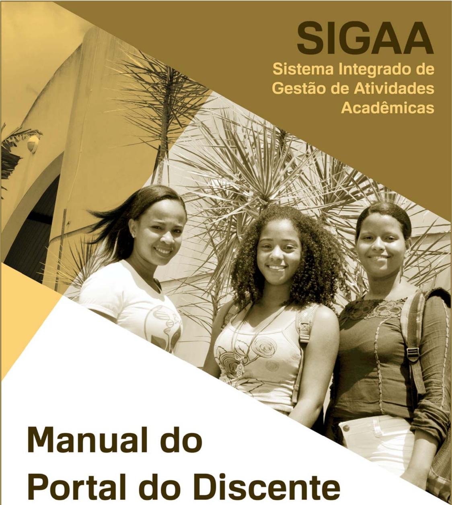

## Sumário

| 1. Acesso ...............................................................................   | 3   |
|---------------------------------------------------------------------------------------------|-----|
| 2. Portal do Discente ...............................................................       | 4   |
| 3. Atualizar Foto e Perfil ...........................................................      | 5   |
| 4. Meus Dados Pessoais ...........................................................          | 6   |
| 5. Minhas Notas ......................................................................      | 7   |
| 6. Atestado de Matrícula ..........................................................         | 8   |
| 7. Histórico ............................................................................   | 9   |
| 8. Declaração de Vínculo ..........................................................         | 10  |
| 9. Fórum de Cursos .................................................................        | 11  |
| 10. Atendimento ao Aluno ........................................................           | 12  |
| 11. Página do Curso ................................................................        | 13  |
| 12. Página Principal da Turma Virtual .........................................             | 14  |
| 13. Menu Turma Virtual ...........................................................          | 18  |
| 14. Área de Trabalho ...............................................................        | 20  |
| 15. Painel de Notícias ..............................................................       | 21  |
| 16. Dúvidas ............................................................................    |     |

22

## Manual do Portal do Discente

## 1. Acesso

Acesse o endereço sistemas.ufrb.edu.br/sigaa , digite a sua matrícula precedida da letra ' a ' (Ex.: a201012345) e sua senha dos sistemas  internos  (rede  wifi  e  laboratórios  de  informática).  Caso nunca tenha acessado, a senha é o número do CPF.

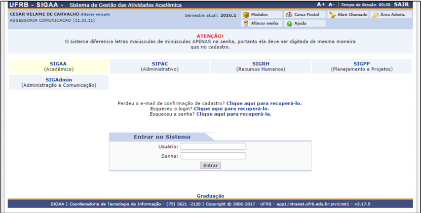

Outra opção de acesso se dá pelo Portal UFRB.

## Manual do Portal do Discente

## 2. Portal do Discente

Após efetuar o acesso, a tela inicial exibirá o Portal do Discente.

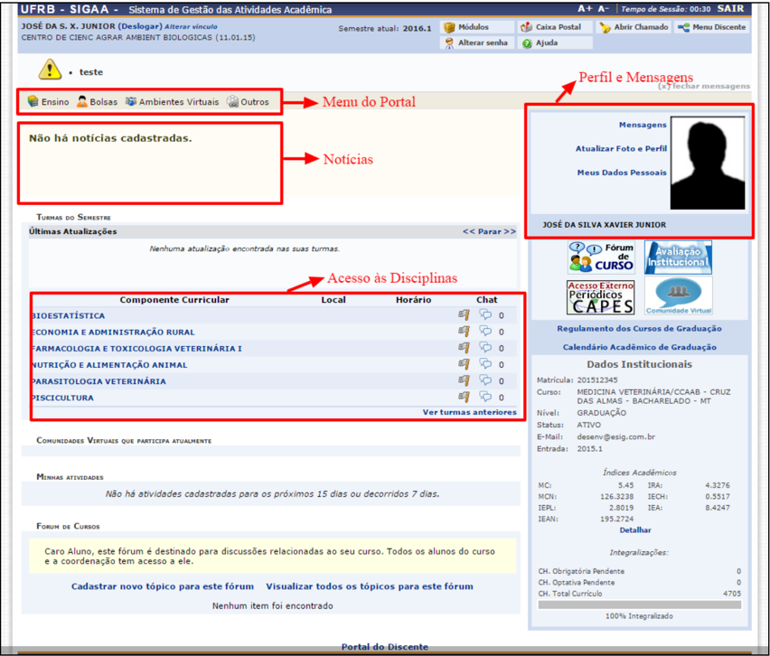

## 3. Atualizar Foto e Perfil

Esta funcionalidade permite que o discente atualize sua foto e suas informações  que  foram  previamente  cadastradas  no  sistema  que serão exibidas em seu perfil público, disponível para visualização por qualquer outro usuário do sistema.

Para realizar a operação, acesse o SIGAA → Módulos → Portal do Discente → Atualizar Foto e Perfil .

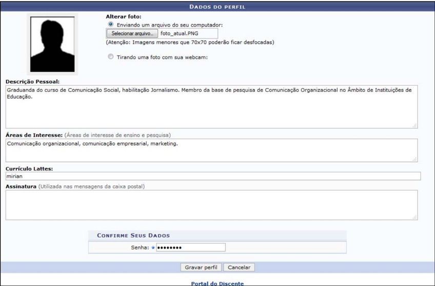

## Manual do Portal do Discente

## 4. Meus Dados Pessoais

Esta  funcionalidade  permite  ao  usuário  visualizar,  no  portal  do discente, seus dados pessoais cadastrados no sistema. Essas informações  constarão  no  diploma  que  será  recebido  ao  final  do curso. Para tanto, há a possibilidade de modificar alguns dos campos já preenchidos. No caso de haver erro em dados pessoais bloqueados,  o  usuário  terá  de  comparecer  à  coordenação  do  curso para que se realizem as devidas alterações.

Para realizar a operação, acesse o SIGAA → Módulos → Portal do Discente → Meus Dados Pessoais .

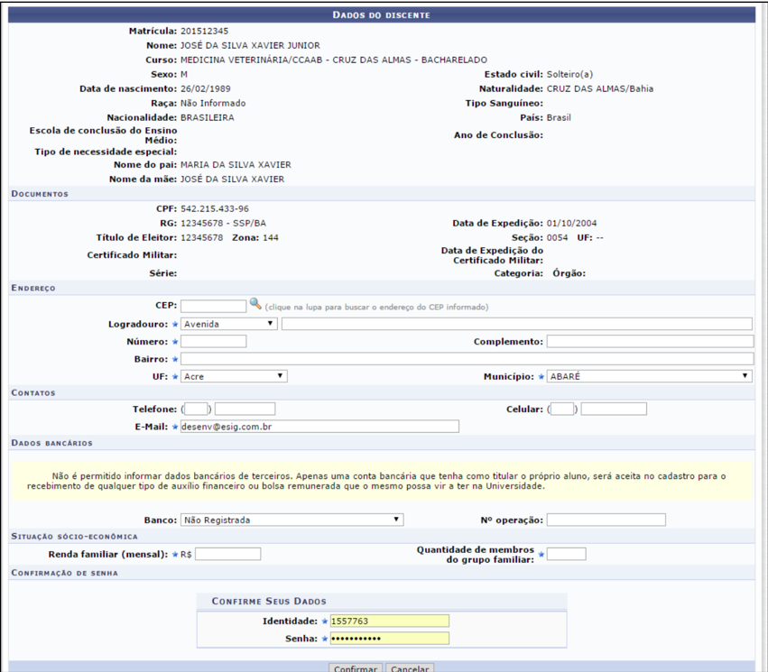

Copfirmar

Cancelar

## 5. Minhas Notas

Esta  funcionalidade  permite  que  o  discente  emita  um  relatório contendo informações referentes ao seu curso de graduação, como as matérias que já cursou e as principais informações referentes a elas: notas obtidas, quantidade de faltas e situação ao fim do semestre.

Para visualizar o relatório de notas, acesse o SIGAA → Módulos → Portal do Discente → Ensino → Consultar Minhas Notas .

| Código   | Disciplina                             | Unidade. Unidade.   | Unidade. Unidade.   | Unidade.   | Recuperação   | Resultado   | Faltas   | Situação    |
|----------|----------------------------------------|---------------------|---------------------|------------|---------------|-------------|----------|-------------|
| GCET219  |                                        |                     |                     |            |               |             |          |             |
|          | ADMINISTRAÇÃO RURAL                    |                     |                     |            |               |             |          | MATRICULADO |
| GCCa424  | FARMACOLOGIA E TOXICOLOGIA VETERINÁRIA |                     |                     |            |               |             |          | MATRICULADO |
| GCCA422  | NUTRIÇÃO E ALIMENTAÇÃO ANIMAL          |                     |                     |            |               |             |          | MATRICULADO |
|          | PISCICULTURA                           |                     |                     |            |               |             |          | MATRICULADO |

| Código   | Disciplina   | Unidade.   | Unidade.   | Unidade   | Unidade.   | Recuperação   | Resultado   | Faltas   | Situação   |
|----------|--------------|------------|------------|-----------|------------|---------------|-------------|----------|------------|
| GCET219  |              |            |            |           |            |               |             |          | REPROVADO  |
| GCCa415  |              |            |            |           |            |               |             |          | APROVADO   |
|          |              |            |            |           |            |               |             |          | REPROVADO  |

| Código   | Disciplina                      | Unidade.   | Unidade.   | Unidade.   | Unidade_   | Unidade_   | Recuperação   | Resultado   | Faltas   | Situação   |
|----------|---------------------------------|------------|------------|------------|------------|------------|---------------|-------------|----------|------------|
|          | ANATOMIA PATOLÓGICA VETERINÁRIA |            |            |            |            |            |               | 5,0         |          | APROVADO   |
| GCC4015  | APICULTURA                      |            |            |            |            |            |               |             |          | APROVADO   |
| GCET219  |                                 |            |            |            |            |            |               |             |          | REPROVADO  |
|          |                                 |            |            |            |            |            |               |             |          | REPROVADO  |

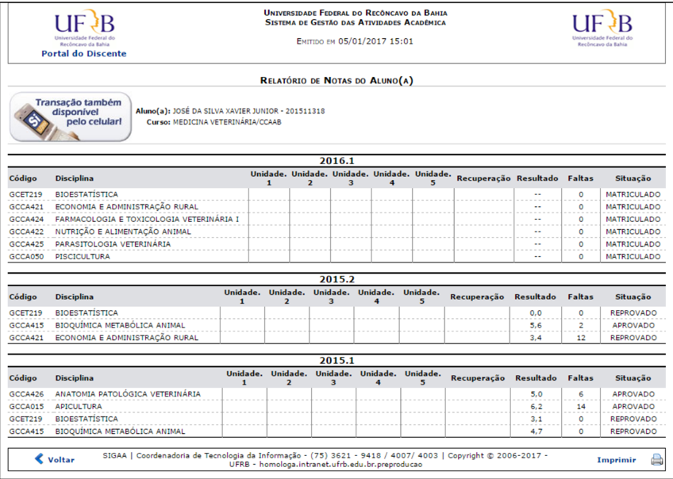

## 6. Atestado de Matrícula

Esta funcionalidade permite ao discente visualizar um relatório com o seu atestado de matrícula.

Para gerar o atestado de matrícula, acesse o SIGAA → Módulos → Portal do Discente → Ensino → Atestado de Matrícula .

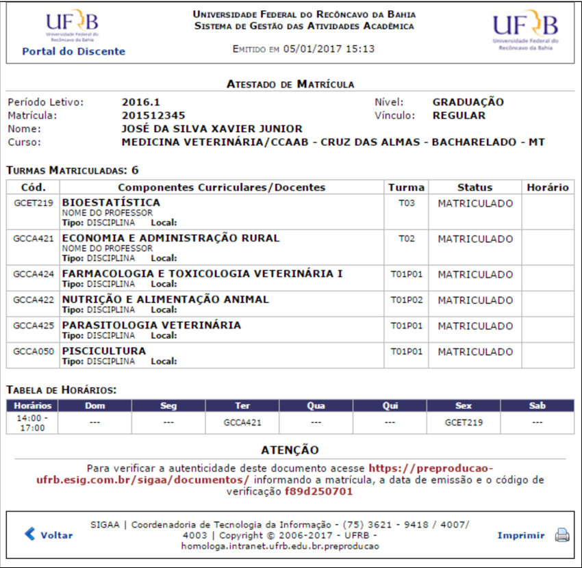

Um  código  de  autenticação  será  disponibilizado  para  verificar  a autenticidade do documento.

## Manual do Portal do Discente

## 7. Histórico

Esta  funcionalidade  permite  que  o  discente  emita  seu  histórico contendo seus dados pessoais, os dados do curso e os detalhes dos componentes curriculares já cursados e dos que ainda está cursando.

Para emitir o histórico, o discente deve acessar o SIGAA → Módulos → Portal do Discente → Ensino → Consultar Histórico.

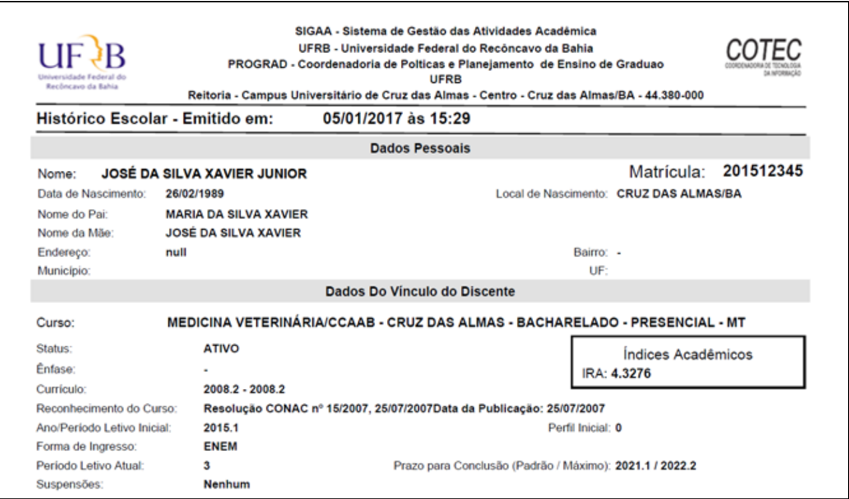

## Manual do Portal do Discente

## 8. Declaração de Vínculo

Esta funcionalidade permite a emissão de uma declaração de vínculo, por parte da Instituição, afirmando que, para os fins que se fizerem necessários, o discente encontra-se devidamente vinculado à universidade.

Para  emitir  a  declaração  de  vínculo,  o  usuário  deverá  acessar  o SIGAA → Módulos → Portal do Discente → Ensino → Declaração de Vínculo .

## Manual do Portal do Discente

## 9. Fórum de Cursos

Esta  funcionalidade  permite  ao  usuário  visualizar  divulgações  de projetos, bolsas e outros assuntos, que são cadastrados por docentes, e entrar em contato com eles. O discente pode cadastrar novos tópicos ou responder os já existentes (desde que sua matrícula esteja ativa). Além disso, o usuário pode gerenciar apenas os tópicos criados por ele.

Para  ter  acesso  ao  fórum  do  curso,  o  discente  deverá  acessar  o SIGAA → Módulos → Portal do Discente → Outros → Coordenação de Curso → Fórum de Cursos .

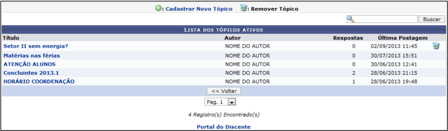

Clicando  em Cadastrar  Novo  Tópico ,  o  discente  será  direcionado para a seguinte tela, na qual poderá cadastrar um novo tópico:

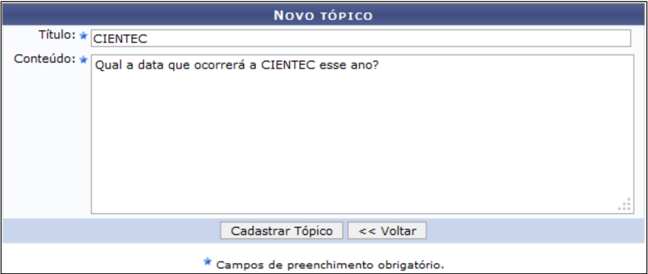

## 10. Atendimento ao Aluno

Esta  funcionalidade  permite  ao  discente  entrar  em  contato  com  a coordenação do curso. A mensagem de resposta será enviada para o email  do  usuário  cadastrado  no  sistema.  Ainda  é  fornecida  ao discente  a  possibilidade  de  realizar  o  acompanhamento  da  sua pergunta na tela de atendimento ao aluno.

Para entrar em contato com a coordenação, o discente deve acessar o SIGAA → Módulos → Portal do Discente → Outros → Coordenação de Curso → Atendimento ao Aluno .

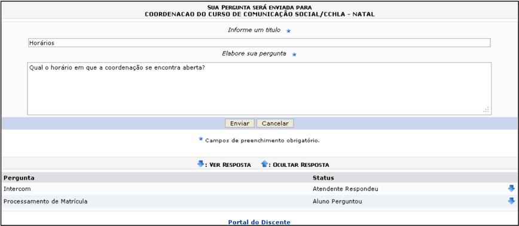

## Manual do Portal do Discente

## 11. Página do Curso

Esta  funcionalidade  direcionará  o  discente  para  a  página  de  seu respectivo  curso,  tendo  acesso  a  documentos,  calendários,  turmas destinadas ao curso, entre outros dados.

Para  realizar  esta  operação,  o  usuário  deverá  acessar  o SIGAA → Módulos → Portal  do  Discente → Outros → Coordenação  de Curso → Página do Curso .

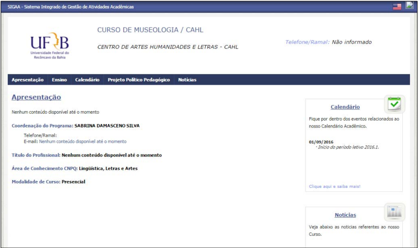

## 12. Página Principal da Turma Virtual

Esta  funcionalidade  permite  que  o  discente  matriculado  em  um componente curricular tenha acesso à turma virtual. Nela, é possível a interação entre professores e alunos, bem como é através dela que atividades, fóruns, enquetes e notícias e atividades são cadastrados.

Para  visualizar  uma  turma  virtual,  acesse  o SIGAA → Módulos → Portal  do  Discente → Componente  Curricular → Escolha  um Componente Curricular .

Inicialmente o usuário deverá acessar o Portal do Discente no SIGAA e  clicar  no  link  da  turma  que  deseja  acessar.  Será  exibida  a  tela principal  da  turma  virtual.  Utilizamos  como  exemplo  o  Componente Curricular  EST0232 - Fundamentos de Estatística (2012.1 - T01). A tela principal da turma virtual será exibida da seguinte forma:

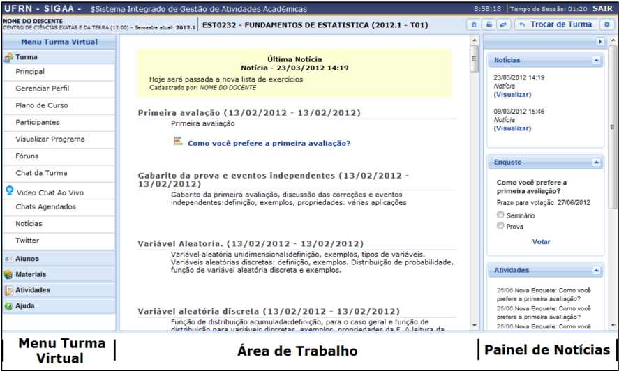

Nesta tela, serão exibidas as funções que poderão ser utilizadas pelo discente. Na parte superior, ao lado direito da barra em azul escuro, será exibido um relógio indicando a hora atual e, enquanto o discente estiver  na  turma  virtual,  ele  permanecerá  sendo  apresentado.  O relógio  serve  para  que  o  discente  possa  ver  a  hora  do  sistema  no momento de enviar uma tarefa, acessar  um  questionário  ou  entrar em chats agendados. Além disso, é exibido o Tempo de Sessão que indica há quanto tempo o discente está logado no sistema.

## Manual do Portal do Discente

Ainda na parte superior da página, consta a barra de opções onde o usuário poderá acessar o Portal do Discente, imprimir os conteúdos programados  para  as  aulas,  assim  como  consultar  outras  turmas virtuais das quais participa.

Ao lado esquerdo da tela, o discente poderá visualizar o menu turma virtual com suas funções disponíveis. No centro, encontra-se a área de  trabalho,  onde  as  atividades  serão  realizadas  de  acordo  com  a operação  acessada  nesta  funcionalidade.  Ao  lado  direito  da  tela principal, constará o painel de notícias com a descrição das principais alterações  realizadas  nas  atividades,  informações  sobre  avaliações, enquetes e a publicação de notícias.

Se deseja retornar ao menu principal do módulo Portal do Discente, clique no ícone .

O discente poderá imprimir o conteúdo presente na área de trabalho ao clicar no ícone .

O usuário poderá consultar as aulas em formato de página, ao clicar no  ícone .  Assim,  as  aulas  serão  exibidas  individualmente  e  o discente poderá consultá-las utilizando a barra superior, para navegação entre as que estão cadastradas.

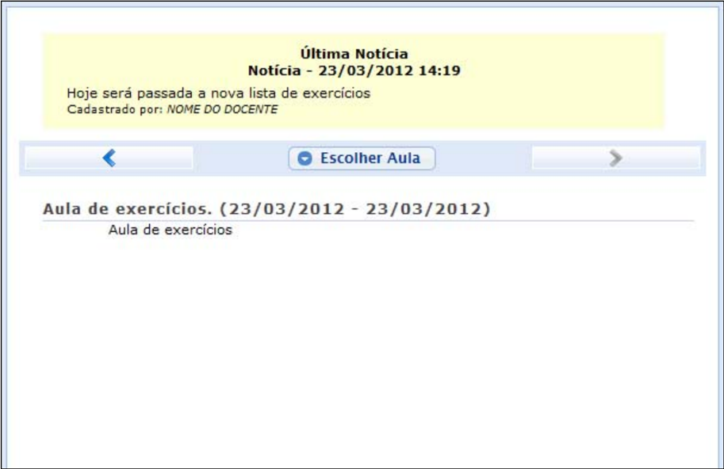

## Manual do Portal do Discente

Caso  queira  consultar  diretamente  uma  aula  desejada,  clique  no ícone .  Em  seguida,  será  exibida  a  tela  que  permite que o usuário Selecione uma Aula . Escolher Aula

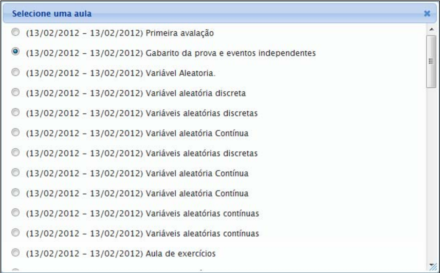

Selecione  a  aula  que  deseja  dentre  as  opções  disponíveis  e  suas informações poderão ser visualizadas.

Caso desista desta operação e queira encerrar a visualização da tela, clique  no  ícone .  Esta  função  será  válida  sempre  que  estiver presente. X

Durante  a  consulta  da  turma  virtual,  o  sistema  possibilitará  que  o discente  consulte  outras  turmas  virtuais  das  quais  ele  participa, clicando em . Então, a tela que permite o usuário Trocar  de  Turma será  exibida  com  todas  as  turmas  virtuais associadas ao discente. Trocar de Turma

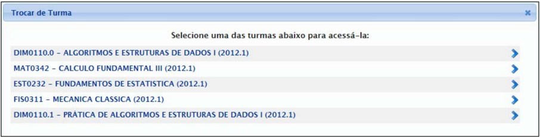

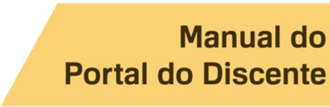

Selecione a turma e o sistema o encaminhará para a Página Principal da  Turma  Virtual que  deseja  consultar  clicando  no  componente curricular ou no ícone .

Ao clicar no ícone serão exibidas as Opções presentes na página principal  do  Portal  do  Discente,  as  quais  permitem  o  acesso  aos módulos do sistema, caixa postal, entre outras funções conforme a figura a seguir:

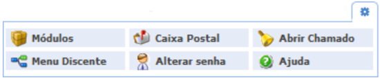

O usuário poderá ter acesso aos Módulos conforme seu perfil, a Caixa Postal onde poderá receber e enviar mensagens para os servidores, docentes  e  discentes  vinculados  à  Instituição,  assim  como Abrir Chamado caso  queira  contactar  algum  setor  ou  funcionário.  Além disso,  será  possível Alterar  Senha de  acesso,  consultar  os  manuais de Ajuda para  a  utilização  do  sistema,  bem  como  retornar  ao Menu Discente , de acordo com seu critério.

## 13. Menu Turma Virtual

No  Menu  Turma  Virtual  estão  contidas  as ações que se referem aos assuntos da disciplina  (nota,  frequência  e  etc),  onde  os discentes  encontram  maneiras  de  interagir uns  com  os  outros  e  com  o  docente  da turma. Além disso, são disponibilizados materiais para estudos e atividades extraclasse e avaliações.

-  Turma: nesta seção, o discente poderá acessar as principais funções referentes à turma virtual que participa:
- o Gerenciar Perfil: Permite ao aluno gerenciar um  texto que será exibido em  seu  perfil na turma virtual;

## Manual do Portal do Discente

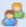

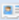

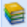

- o Plano  de  Curso: Permite  que  o discente visualize o Plano de Curso disponibilizado pelo docente da turma;
- o Participantes: Permite ao discente visualizar uma listagem  com  as  informações  de  contato  de  todos  os participantes da turma virtual;
- o Visualizar Programa: Permite que o discente visualize o conteúdo do programa que será desenvolvido pelo docente no período letivo, informando o que será ministrado para a turma;
- o Fóruns: Permite  ao  participante  da  turma  visualizar  e responder  aos  fóruns  destinados  para  discussões  sobre assuntos  da  disciplina,  além  de  visualizar  avisos  gerais enviados pelo docente a todos discentes da turma;
- o Chat  da  turma: Permite  ao  discente  que  compõe  a turma  interagir  de  forma  simultânea  com  os  demais participantes  da  turma  virtual,  possibilitando  a  troca  de informações de interesse da turma;
- o Chats agendados: O  discente  poderá  participar  de  um bate-papo  virtual  agendado  pelo  docente  da  disciplina, possibilitando uma interação simultânea entre os participantes, em tempo real;
- o Notícias: Permite visualizar as notícias cadastradas pelo professor  para  a  turma.  Essas  notícias  também  podem ser visualizadas pelos participantes no e-mail cadastrado no sistema.

| Menu Turma Virtual   |
|----------------------|
| Turma                |
| Principal            |
| Gerenciar Perfil     |
| Plano de Curso       |
| Participantes        |
| Visualizar Programa  |
| Fóruns               |
| Noticias             |
| Alunos               |
| Materiais            |
| Atividades           |
| Estatistica          |
| Ajuda                |

## Manual do Portal do Discente

-  Alunos: nesta seção, é permitido ao aluno verificar as informações referentes à sua participação na turma:
- o Frequência: Permite  ao  aluno  a  visualização  das  suas faltas e frequência em sala da aula;
- o Ver Grupo: Esta opção permite ao discente visualizar os integrantes de seu grupo na turma;
- o Ver Notas: Esta função permite ao aluno ver as notas de suas avaliações na turma virtual.
-  Materiais: nesta seção, o discente terá acesso às funcionalidades correspondentes aos materiais utilizados para o ensino da disciplina:
- o Conteúdo/Página Web: Permite ao aluno visualizar as opções de conteúdo e páginas na internet disponibilizadas pelo docente da turma;
- o Referências: Permite ao discente visualizar as referências bibliográficas propostas pelo docente da turma virtual relacionadas à disciplina;
- o Vídeos: Disponibiliza  ao  aluno  as  referências  de  vídeo passadas pelo professor;
- o Arquivos: Nesta  seção,  o  discente  acessa  os  arquivos publicados pelo professor.
-  Atividades: nesta seção, o discente terá acesso às atividades da disciplina:
- o Avaliações: Neste  tópico  são  visualizadas  as  datas  e horário das avaliações que serão aplicadas;
- o Enquetes: Permite  que  o  discente  vote  numa  enquete, cadastrada pelo professor, escolhendo uma das alternativas;
- o Tarefas: Permite  que  o  discente  que  acesso  às  tarefas que  o  docente  da  turma  cadastrou.  Possibilita  ainda  o envio das mesmas para o docente e a posterior visualização da tarefa corrigida pelo professor;
- o Questionários: Nessa  função,  o  discente  é  levado  a responder questionários elaborados pelo professor.
-  Ajuda: nesta  seção,  pode  ser  exibida  uma  operação  que  dá suporte ao usuário em relação ao funcionamento do sistema e suas operações gerais.

## Manual do Portal do Discente

## 14. Área de Trabalho

Na área de trabalho são organizadas as informações detalhadas sobre as  aulas  da  turma  virtual,  organizadas  de  acordo  com  as  datas específicas. O docente pode disponibilizar para os alunos, nesta área, suas atividades no sistema para que  sejam  visualizadas pelos participantes da turma.

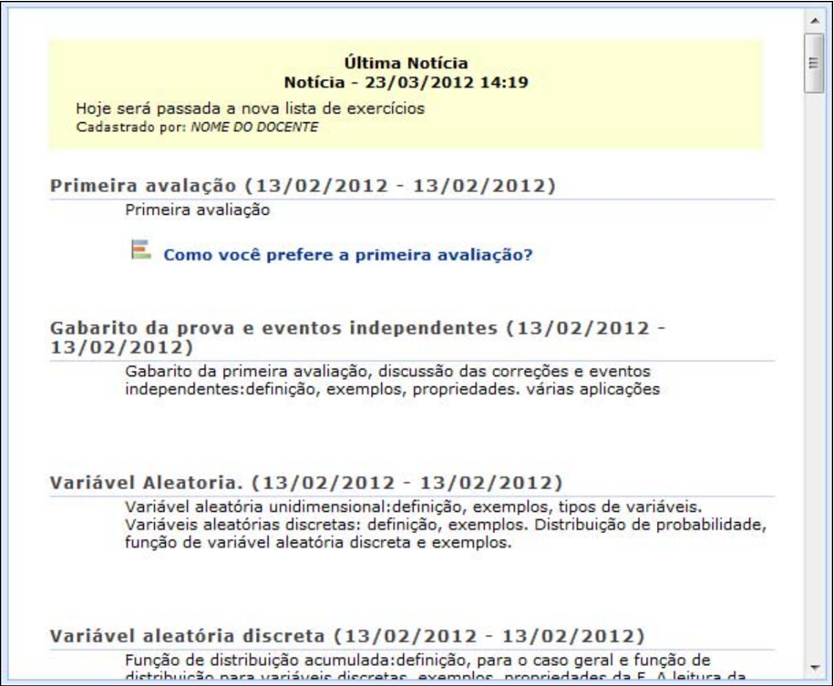

## 15. Painel de Notícias

O painel de notícias consiste na publicação de informações sobre o formato de Notícias, Enquetes, Atividades e Avaliações. Neste painel, as atividades  e  avaliações  serão  publicadas de modo que os discentes poderão visualizar os dados cadastrados sobre as aulas ministradas.

## Manual do Portal do Discente

## 16. Dúvidas

Envie email para sigaa@surrac.ufrb.edu.br

23