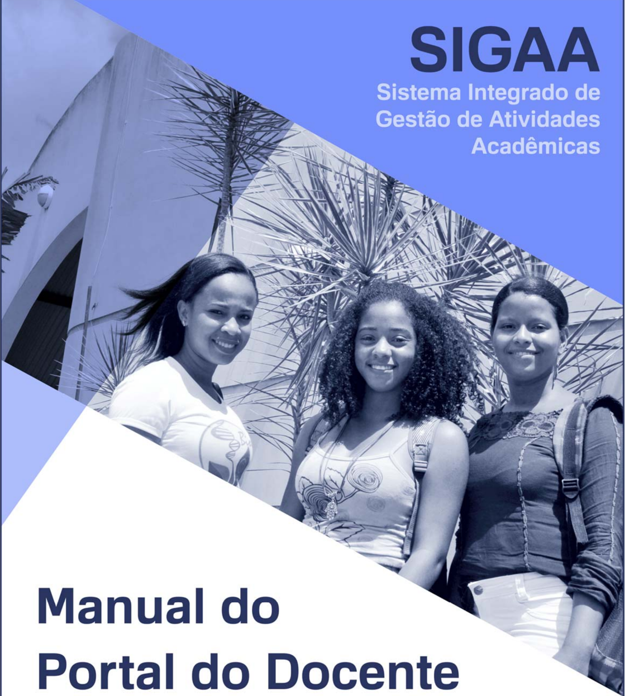

## Manual do Portal do Docente

## Sumário

| 1. Acesso .............................................................................   | 3   |
|-------------------------------------------------------------------------------------------|-----|
| 2. Portal do Docente ..............................................................       | 4   |
| 3. Atualizar Foto e Perfil .........................................................      | 5   |
| 4. Dados do Site Pessoal do Docente .......................................               | 6   |
| 5. Turma Virtual ...................................................................      | 7   |
| 6. Menu Turma Virtual ...........................................................         | 13  |
| 7. Tópicos de Aula .................................................................      | 16  |
| 8. Plano de Curso ..................................................................      | 18  |
| 9. Conteúdo Programado .......................................................            | 20  |
| 10. Participantes ...................................................................     | 21  |
| 11. Visualizar Programa .........................................................         | 22  |
| 12. Fóruns ...........................................................................    | 23  |
| 13. Notícias ..........................................................................   | 25  |
| 14. Registrar Aula Extra .........................................................        | 26  |
| 15. Visualizar como Aluno ......................................................          | 27  |
| 16. Alunos Trancados ............................................................         | 28  |
| 17. Gerenciar Grupos ............................................................         | 29  |
| 18. Lançar Freqüência ...........................................................         | 30  |
| 19. Lançar Frequência Em Planilha ..........................................              | 32  |
| 20. Lançar Notas ...................................................................      | 33  |
| 21. Conteúdo Programado ......................................................            | 35  |
| 22. Diário de Turma ..............................................................        | 36  |
| 23. Lista de Presença .............................................................       | 37  |
| 24. Mapa de Freqüência .........................................................          | 38  |
| 25. Total de Faltas por Unidade ...............................................           | 39  |
| 26. Conteúdo/Página Web ......................................................            | 40  |
| 27. Porta-Arquivos ................................................................       | 42  |
| 28. Inserir Arquivo na Turma ..................................................           | 44  |
| 29. Referências .....................................................................     | 45  |
| 30. Vídeos ............................................................................   | 47  |
| 31. Avaliações ......................................................................     | 48  |
| 32. Enquetes ........................................................................     | 49  |
| 33. Tarefas ..........................................................................    | 50  |
| 34. Questionários ..................................................................      | 54  |
| 35. Banco de Questões ..........................................................          | 59  |
| 36. Configurar Turma ............................................................         | 61  |
| 37. Permissões .....................................................................      | 63  |
| 38. Publicar Turma Virtual ......................................................         | 64  |
| 39. Área de Trabalho .............................................................        | 65  |
| 40. Painel de Notícias ............................................................       | 66  |
| 41. Dúvidas .........................................................................     |     |

67

## Manual do Portal do Docente

## 1. Acesso

Acesse o endereço sistemas.ufrb.edu.br/sigaa e digite sua matrícula Siape e sua senha dos sistemas internos (email e SIPAC).

Outra opção de acesso se dá pelo Portal UFRB.

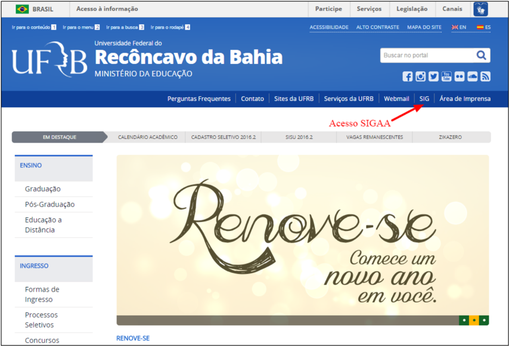

## Manual do Portal do Docente

## 2. Portal do Docente

Após efetuar o acesso, a tela inicial exibirá o Portal do Docente.

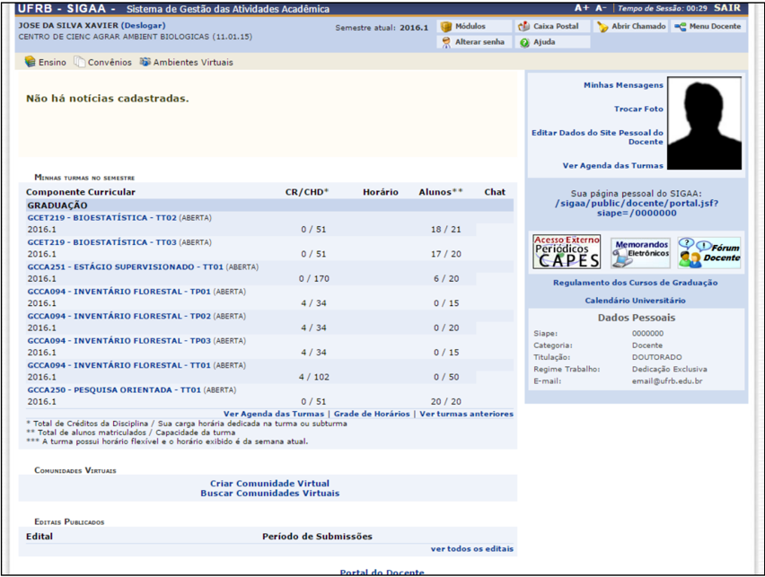

## 3. Atualizar Foto e Perfil

Esta  funcionalidade  permite  que  o  docente  atualize  sua  foto  e  suas informações  que  foram  previamente  cadastradas  no  sistema  que serão exibidas em seu perfil público, disponível para visualização por qualquer outro usuário do sistema.

Para realizar a operação, acesse o SIGAA → Módulos → Portal do Docente → Trocar Foto .

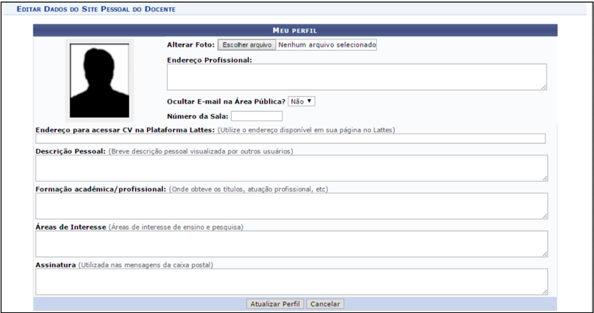

## 4. Dados do Site Pessoal do Docente

Esta funcionalidade permite ao docente editar dados do site pessoal.

Para realizar a operação, acesse o SIGAA → Módulos → Portal do Docente → Meus Dados Pessoais .

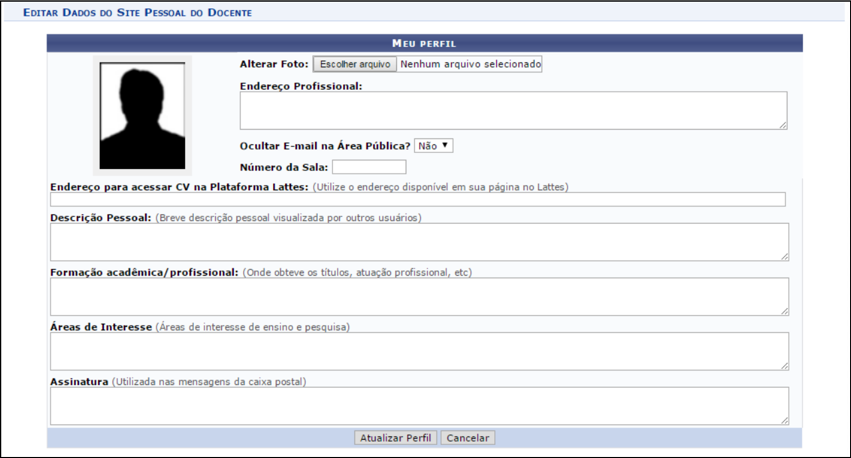

Após efetuar as edições, o site pessoal pode ser acessado através da área pública do SIGAA.

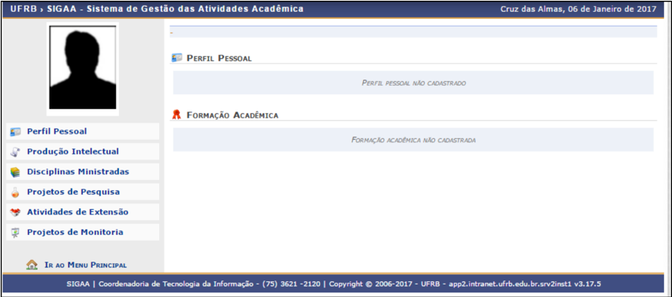

## 5. Turma Virtual

A Turma Virtual é uma ferramenta de ensino complementar colocada à  disposição  dos  docentes  e  discentes.  Ela  é  um  espaço  construído para ajudar no aprendizado dos discentes, criando uma extensão da sala  de  aula  no  SIGAA.  Encontra-se  nos  Portais  do  Docente  e  do Discente,  permitindo  o  intercâmbio  virtual  de  informações  entre discentes e docentes de uma turma.

Nela, é possível a interação entre professores e alunos, bem como é através  dela  que  notas,  frequência,  atividades,  fóruns,  enquetes, notícias e atividades são cadastrados.

Para  visualizar  uma  turma  virtual,  acesse  o SIGAA → Módulos → Portal  do  Docente → Componente  Curricular → Escolha  um Componente Curricular .

Inicialmente o usuário deverá acessar o Portal do Docente no SIGAA e  clicar  no  link  da  turma  que  deseja  acessar.  Será  exibida  a  tela principal  da  turma  virtual.    A  tela  principal  da  turma  virtual  será exibida da seguinte forma:

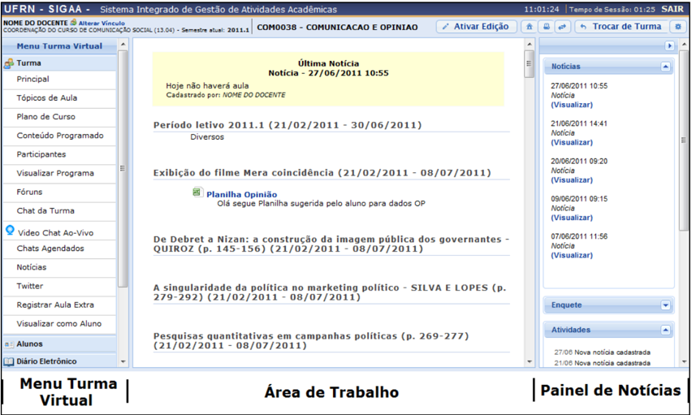

Nesta tela, serão exibidas as funções que poderão ser utilizadas na gestão da turma virtual. Na parte superior, ao lado direito da barra em  azul  escuro,  será  exibido  um  relógio  indicando  a  hora  atual  e, enquanto o docente estiver na turma virtual, ele permanecerá sendo

## Manual do Portal do Docente

apresentado. O relógio serve para que o docente possa ver a hora do sistema no momento de cadastrar uma tarefa, acessar um questionário  ou  entrar  em  chats  agendados.  Além  disso,  é  exibido o tempo de sessão que indica há quanto tempo o docente está logado no sistema.

Ainda  na  mesma  tela,  na  parte  superior,  consta  a  barra  de  opções onde  o  usuário  poderá  alterar  as  aulas  cadastradas,  consultar  e imprimir  os  conteúdos  programados  para  as  aulas,  assim  como consultar outras turmas virtuais das quais participa.

Ao lado esquerdo da tela, o docente poderá visualizar o menu turma virtual com  suas  funções  disponíveis.  No  centro,  encontra-se  a área de  trabalho,  onde  as  atividades  serão  realizadas  de  acordo  com  a operação  acessada  nesta  funcionalidade.  Ao  lado  direito  da  tela principal, constará o painel de notícias com a descrição das principais alterações  realizadas  nas  atividades,  informações  sobre  avaliações, enquetes e a publicação de notícias.

O docente poderá alterar  o  conteúdo  das  aulas  e  suas  informações registradas, ao clicar no ícone . Deste modo,  o sistema  recarregará  a  seção  da  Área  de  Trabalho,  permitindo  a modificação  dos  tópicos  de  aula  cadastrados,  conforme  a  figura  a seguir: Ativar Edicio

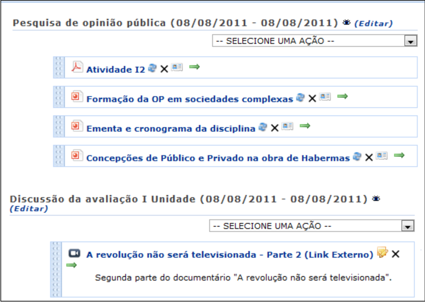

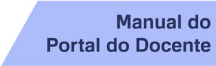

Ao clicar no ícone o docente poderá ocultar o tópico de aula para os  discentes  participantes  da  turma,  matriculados  no  componente curricular que ministra. Ao realizar esta operação, a seguinte mensagem de sucesso será exibida:

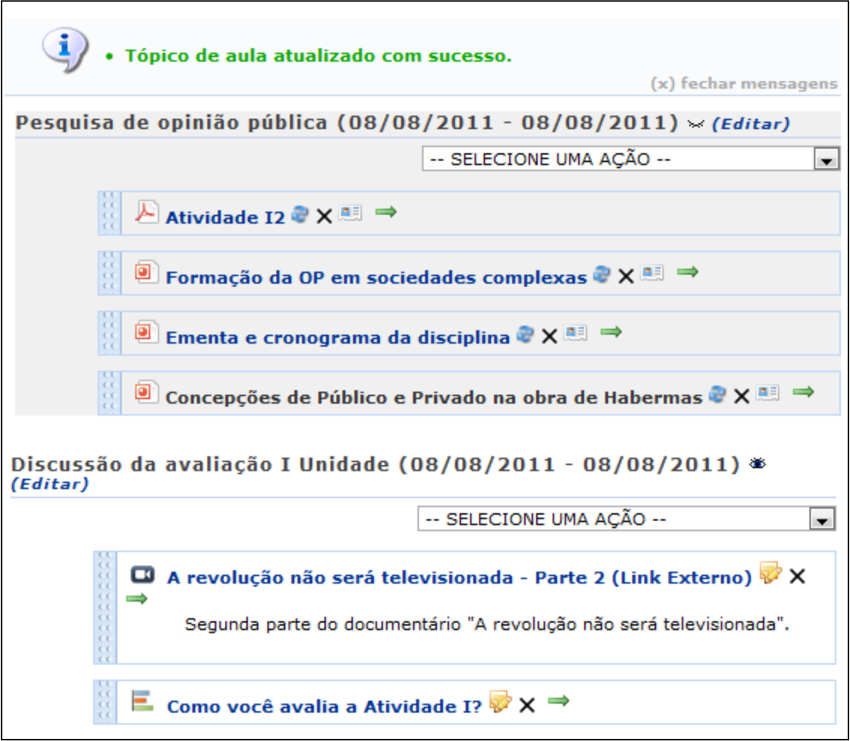

O tópico ocultado estará destacado. Caso queira deixá-lo novamente disponível  para  visualização  pelos  discentes,  clique  no  ícone . Então, a mensagem será exibida novamente.

Se  desejar  modificar  as  informações  contidas  no  tópico,  clique em Editar. Em seguida, será exibida a tela onde o usuário poderá editar tópico e os critérios disponíveis para alteração.

Será possível aplicar uma ação ao tópico da aula, selecionando uma das opções presentes na lista relacionada a cada conteúdo cadastrado. As operações presentes nesta lista serão semelhantes às funções  disponíveis  no menu  turma  virtual,  que  serão  descritas  em um tópico seguinte deste manual.

## Manual do Portal do Docente

Caso  o  tópico  de  aula  possua  arquivos  inseridos,  ao  clicar  no  link correspondente  ao  nome  do  arquivo,  será  possível  visualizar  o documento anexado. Além disso, será possível atualizar os dados do arquivo, removê-lo ou consultá-los, conforme os seguintes ícones:

- :  ao  clicar  neste  ícone,  o  usuário  poderá  atualizar  o  arquivo registrado;
- :  clicando  neste  ícone,  será  possível  alterar  os  dados  do  tópico, conforme o tipo de conteúdo inserido;
- : caso queira remover o documento do sistema, clique neste ícone;
- :  ao  clicar  neste  ícone,  o  docente  terá  acesso  aos  discentes  que consultaram na turma virtual o arquivo anexado;
- : clique neste ícone, se desejar mudar o posicionamento do arquivo na tela.

As operações relacionadas à consulta do arquivo inserido no sistema serão semelhantes às funções disponíveis no menu turma virtual, que serão descritas posteriormente.

Para encerrar o processo de edição do conteúdo das aulas, clique no ícone . Desativar Edicão

Se desejar retornar ao menu principal do módulo Portal do Docente, clique no ícone .

O docente poderá imprimir o conteúdo presente na área de trabalho, ao clicar no ícone .

O usuário poderá consultar as aulas em formato de página, ao clicar no  ícone .  Assim,  as  aulas  serão  exibidas  individualmente  e  o docente poderá consultá-las utilizando a barra superior, para navegação entre as que estão cadastradas.

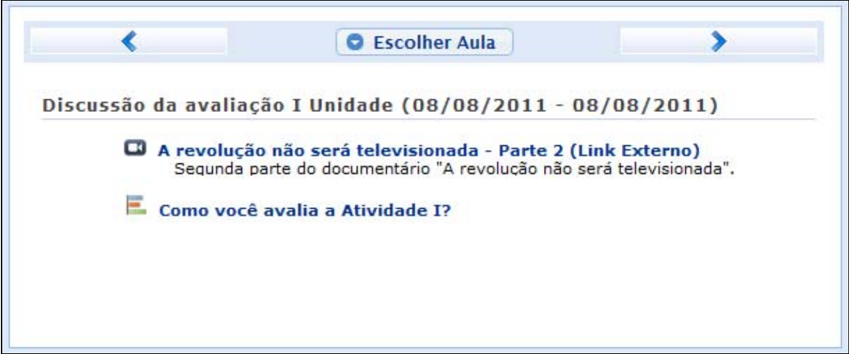

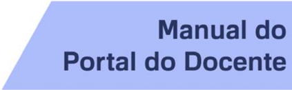

Caso  queira  consultar  diretamente  uma  aula  desejada,  clique  no ícone .  Em  seguida,  será  exibida  a  tela  que  permite que o usuário Selecione uma Aula. Escolher Aula

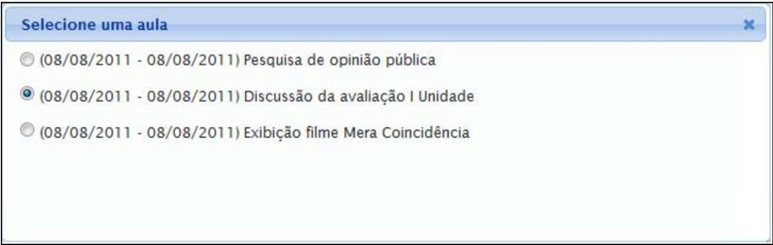

Selecione  a  aula  que  deseja  dentre  as  opções  disponíveis  e  suas informações poderão ser visualizadas.

Caso desista desta operação e queira encerrar a visualização da tela, clique  no  ícone .  Esta  função  será  válida  sempre  que  estiver presente.

Durante  a  consulta  da  turma  virtual,  o  sistema  possibilitará  que  o docente  consulte  outras  turmas  virtuais  das  quais  ele  participa, clicando em . Então, a tela que permite o usuário trocar  de  turma será  exibida  com  todas  as  turmas  virtuais associadas ao docente. Trocar de Turma

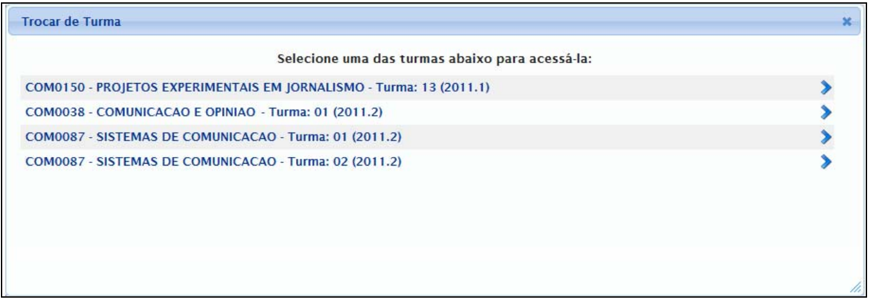

Selecione a turma e o sistema o encaminhará para a página principal da turma  virtual que deseja consultar clicando  no  componente curricular ou no ícone .

Ao clicar  no  ícone serão  exibidas  as opções presentes  na  página principal  do  Portal  do  Docente,  as  quais  permitem  o  acesso  aos módulos  do  sistema,  caixa  postal  entre  outras  funções  conforme  a figura a seguir:

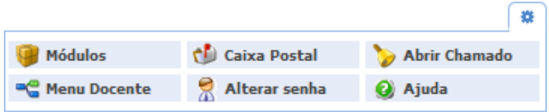

O usuário poderá ter acesso aos Módulos conforme seu perfil, a Caixa Postal onde poderá receber e enviar mensagens para os servidores, docentes  e  discentes vinculados à Instituição  assim  como Abrir Chamado caso queira contactar algum departamento ou funcionário. Além  disso,  será  possível Alterar  Senha de  acesso,  consultar  os manuais  de Ajuda para  a  utilização  do  sistema  bem  como  retornar ao Menu Docente, de acordo com seu critério.

## 6. Menu Turma Virtual

No Menu Turma Virtual estão contidas as ações que se referem aos assuntos da disciplina (nota, frequência etc). Além  disso, são disponibilizados,  neste  menu,  materiais  para  estudos  e  atividades extraclasse e avaliações.

-  Turma: nesta  seção,  o usuário terá acesso  as  principais funções referente à turma virtual a qual ministra:
- o Principal: Refere-se à tela principal do menu virtual;
- o Tópicos  De  Aula: Cadastro  e  consulta  dos  tópicos  de aula que serão ministrados pelo docente;
- o Plano De Curso: O usuário poderá cadastrar o plano de curso do componente curricular;
- o Conteúdo  Programado: Defina  o  conteúdo  que  será abordado na disciplina;
- o Participantes: Será  possível  visualizar  os participantes da turma virtual, como o docente,  os  discentes  e  monitores,  caso haja;
- o Visualizar  Programa: O  docente  poderá visualizar o programa da disciplina que será aplicado;
- o Fóruns: Se desejar poderá cadastrar fóruns para discussão com os discentes da turma;
- o Chat Da Turma: Será possível enviar mensagens instantâneas para os discentes e vice-versa, estabelecendo um chat de comunicação entre os participantes da turma;
- o Chats  Agendados: Caso  queira,  agende um chat no período que desejar;
- o Registrar  Aula  Extra: Caso  necessite,  o docente poderá registrar uma aula extra no sistema;
- o Visualizar Como Aluno: O sistema possibilita  que  o  docente  possa  visualizar  a turma virtual, como aluno da turma.
-  Alunos: nesta seção, o docente poderá ter acesso às operações referentes aos alunos matriculados na turma virtual:
- o Alunos  Trancados: Será  possível  consultar  os  alunos que trancaram o componente curricular;
- o Gerenciar Grupos: O  docente  poderá  gerenciar  grupos de alunos para atividades acadêmicas;

| Menu Turma Virtual    |
|-----------------------|
| Turma                 |
| Principal             |
| Tópicos de Aula       |
| Plano de Curso        |
| Conteúdo Programado   |
| Participantes         |
| Visualizar Programa   |
| Fóruns                |
| Noticias              |
| Registrar Aula Extra  |
| Visualizar como Aluno |
| Alunos                |
| Diário Eletrônico     |
| Materiais             |
| Atividades            |
| Configurações         |
| Estatística           |
| Ajuda                 |

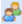

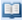

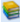

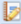

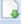

## Manual do Portal do Docente

- o Lançar  Frequência: Consulte  ou  cadastre  a  frequência dos alunos no sistema;
- o Lançar  Freq.  Em  Planilha: Se desejar, registre a frequência  no  sistema  importando  os  dados  de  uma planilha eletrônica;
- o Lançar  Notas: Cadastre  as  notas  de  avaliações  dos discentes da turma.
-  Diário Eletrônico: nesta  seção,  o  docente  poderá  realizar  as operações referentes ao diário eletrônico da turma virtual:
- o Conteúdo Programado: Consulte o conteúdo programado para disciplina;
- o Diário  de  Turma: Consulte  o  diário  de  turma,  onde constarão  as  notas,  as  frequências  e  o  plano  de  curso referente ao componente curricular;
- o Lista de Presença: Será possível visualizar a lista com a presença dos alunos que frequentaram a disciplina;
- o Mapa de Frequência: O sistema possibilitará a consulta das faltas conforme a frequência cadastrada;
- o Total  de  Faltas  por  Unidade: Serão  contabilizadas  as faltas por unidades, sendo visualizadas pelo usuário.
-  Materiais: nesta seção, o usuário terá acesso às funcionalidades correspondentes aos materiais utilizados para o ensino da disciplina:
- o Conteúdo/Página  Web: Cadastre e/ou consulte os conteúdos que serão oferecidos na disciplina;
- o Porta-Arquivos: Gerencie os arquivos inseridos no sistema, com base no armazenamento de pastas classificadas por conteúdo;
- o Inserir  Arquivo  na  Turma: Se  desejar,  o  docente poderá inserir um arquivo para a visualização pela turma virtual;
- o Referências: Disponibilize as referências que julgar necessárias para os alunos;
- o Vídeos: Caso queira, disponibilize um vídeo para visualização pelos discentes.
-  Atividades: nesta seção, o usuário terá acesso as funções que permitem o gerenciamento de suas atividades:
- o Avaliações: Cadastre  as  datas  e  os  horários  em  que serão realizadas as avaliações pelos discentes;
- o Enquetes: Se desejar, cadastre uma enquete que poderá ser respondida pelos alunos;
- o Tarefas: O  docente  poderá  registrar  no  sistema  tarefas que poderão ser visualizadas pelos discentes;
- o Questionários : Consulte os questionários registrados ou cadastre-os, se desejar.

## Manual do Portal do Docente

-  Questionários: nesta  seção,  o  docente  poderá  acessar  as operações  referentes  aos  questionários  registrados.  Apenas estará  disponível  para  visualização,  caso  o  usuário  clique  na seção Atividades:
- o Banco De Questões: Permite gerenciar todas as questões,  arquivadas  por  categorias,  que  poderão  ser utilizadas nos questionários;
- o Criar Novo Questionário: Possibilita  a  configuração  de um questionário e a definição de suas questões;
-  Configurações: nesta seção, serão exibidas as funções relacionadas as configurações da turma virtual:
- o Configurar Turma: Configure a maneira através da qual os alunos poderão interagir com a turma virtual;
- o Importação de Dados: Importe  os  seus  dados  para  o sistema  conforme  as  aulas  ministradas  no  componente curricular;
- o Permissões: Possibilita a que o docente abra concessões a  outras  pessoas  para  gerenciar  operações  referentes  à disciplina que ele leciona;
- o Publicar  Turma  Virtual: Se  desejar  tornar  pública  a turma, o docente possibilitará que as pessoas que acessem o portal  público  visualizem  somente  os  tópicos de aulas e materiais relacionados.
-  Estatística: nesta seção, serão apresentadas as funcionalidades referentes as estatísticas em relação ao desempenho da turma virtual:
- o Situação dos Discentes: Serão apresentados os dados referentes a situação dos discentes na disciplina;
- o Estatísticas  de  Notas: O  docente  poderá  visualizar  a média das notas dos alunos segundo sua avaliação;
- o Relatório de Acesso: Consulte os acessos realizados na turma virtual;
- o Relatório de Ações: Permite a visualização do relatório de ações realizadas na turma pelos docentes;
- o Gráfico  de  Acesso: O  usuário  poderá  visualizar  esse gráfico com base nos acessos registrados.
-  Ajuda: nesta  seção,  será  exibida  a  operação  que  poderá  dar suporte ao usuário em relação ao funcionamento dos sistemas e suas operações gerais:
- o Manual  da  Turma  Virtual: Ao  acessar  essa  opção,  o sistema encaminhará o usuário para este manual com a descrição  da  página  principal  da  turma  virtual  e  suas respectivas funções.

## 7. Tópicos de Aula

Esta funcionalidade permite ao docente realizar o gerenciamento dos tópicos  de  aula  correspondentes  à  matéria  que  o  mesmo  planeja ministrar  para  os  discentes,  durante  um  determinado  período  de aulas.

Para  isso,  acesse  o SIGAA → Módulos → Portal  do  Docente → Componente  Curricular → Menu  Turma  Virtual → Turma → Tópicos de Aula .

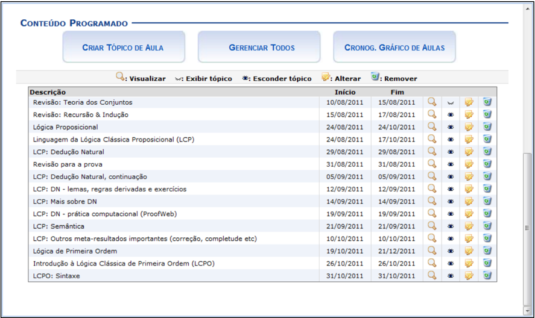

Caso deseje cadastrar um novo tópico de aula, clique em .

## Manual do Portal do Docente

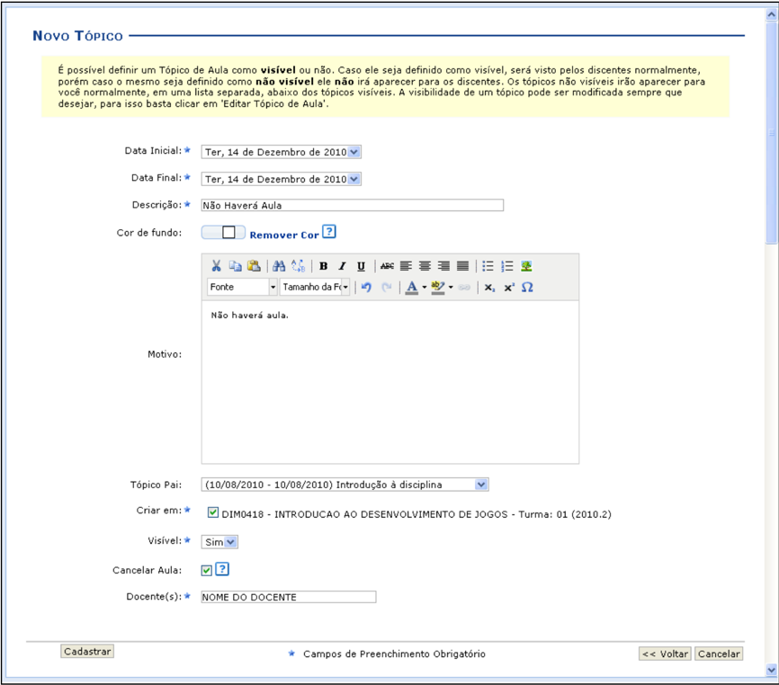

Clique no ícone , para que o tópico de aula se torne visível para os alunos da turma.

Caso deseje mascarar um tópico, clique no ícone . Logo, o tópico de aula não será visível para os alunos da turma.

Ao clicar em , será possível realizar alterações no tópico.

Clique em , para remover um tópico.

## Manual do Portal do Docente

## 8. Plano de Curso

Esta  funcionalidade  permite  ao  usuário  preencher  o  plano  de  curso necessário para todas as turmas no início do semestre. O plano de curso permite uma visão da trajetória e todo o perfil do curso. Sua leitura atenta facilitará o desenvolvimento correto das várias fases e mostrará também a metodologia, os procedimentos de avaliação da aprendizagem e tópicos complementares que deverão ser trabalhados no curso.

Para  isso,  acesse  o SIGAA → Módulos → Portal  do  Docente → Curricular → Menu Turma Virtual → Turma → Plano de Curso .

## Manual do Portal do Docente

Caso já tenha lecionado em outra turma desta mesma disciplina possivel Importar Plano de Curso as Aulas as Referências para esta turma Para realizar importação, clique aqui.

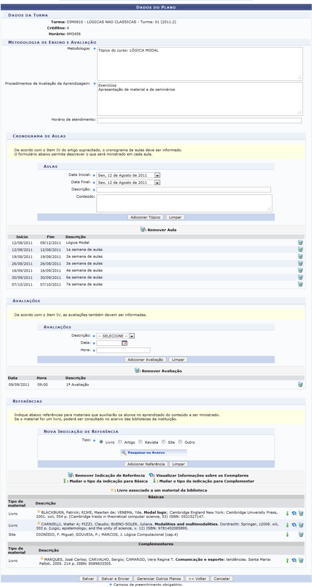

## 9. Conteúdo Programado

Esta funcionalidade permite ao docente, verificar o conteúdo programado  para  determinada  turma.  O  conteúdo  planejado  pelo docente  para  os  alunos  durante  um  determinado  período  de  aulas será  apresentado  como  tópicos  de  aula.  Mediante  esses  tópicos,  o professor  poderá  incluir  materiais  e  tarefas  para  os  alunos  da  sua turma.

Para realizar esta operação, acesse o SIGAA → Módulos → Portal do Docente → Componente Curricular → Menu Turma Virtual → Turma → Conteúdo Programado .

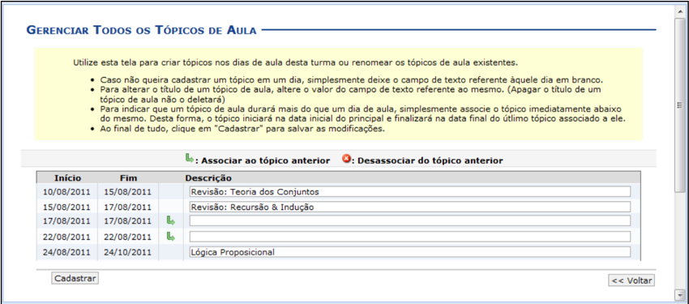

## 10. Participantes

Esta funcionalidade permite ao docente visualizar uma listagem com o contato de todos os participantes da turma virtual, com o intuito de auxiliar a comunicação entre os participantes da turma. Caso um dos participantes  possua  alguma  necessidade  especial,  será  exibido  um ícone,  possibilitando  ao  docente  acessar  o  tipo  de  necessidade especial  do  discente,  assim  como  o  parecer  técnico  emitido  pela CAENE.

Para realizar essa operação, acesse o SIGAA → Módulos → Portal do Docente → Componente Curricular → Menu Turma Virtual → Turma → Participantes .

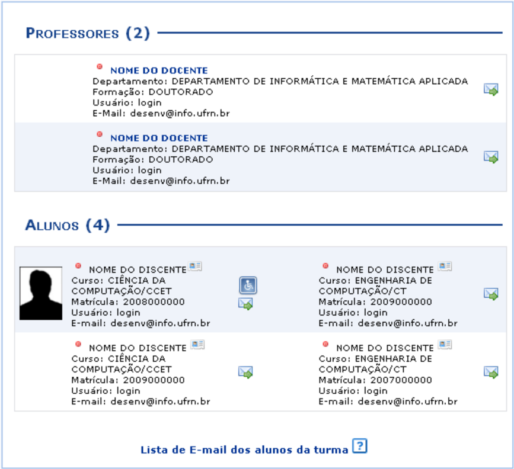

## 11. Visualizar Programa

Ao iniciar uma disciplina, o docente organiza o conteúdo do programa que  será  desenvolvido  no  período  letivo,  informando  o  que  será ministrado para a turma. Dados como o objetivo e metodologia serão exibidos neste programa.

Para  isso,  acesse  o SIGAA → Módulos → Portal  do  Docente → Componente  Curricular → Menu  Turma  Virtual → Turma → Visualizar Programa .

## 12. Fóruns

Esta  funcionalidade  permite  ao  docente  realizar  o  cadastro  de  um novo  fórum  destinado  para  discussões  relacionadas  ao  curso  e também  para  dar  avisos  gerais  a  todos  os  alunos,  bem  como, visualizar os fóruns já cadastrados anteriormente.

Para  isso,  acesse  o SIGAA → Módulos → Portal  do  Docente → Componente  Curricular → Menu  Turma  Virtual → Turma → Fóruns .

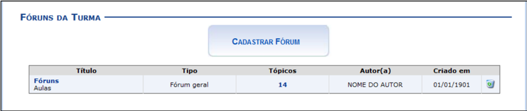

Clicando sobre o link referente ao título do fórum desejado, o docente será direcionado para a tela Fórum, onde será exibida uma listagem com todos os fóruns de discussão cadastrados na turma. A página a seguir será equivalente a página exibida ao clicar no link relacionado à quantidade de Tópicos cadastrados.

Se desejar o usuário poderá remover o tópico do fórum, para isso, clique  no  ícone .  Esta  operação  será  exemplificada  a  seguir  no tópico Cadastrar Tópico para o Fórum presente neste manual.

## Manual do Portal do Docente

Para visualizar as respostas direcionadas ao conteúdo postado, clique no link referente à numeração de respostas cadastradas ou utilize o link do título do tópico apresentado. A página gerada será equivalente nesses dois links.

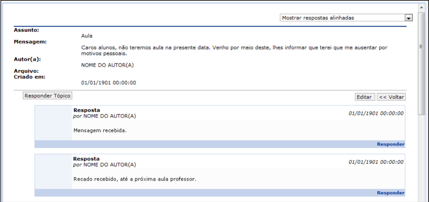

Caso queira realizar o cadastro de um novo fórum, clique em . CADASTRAR FORUM

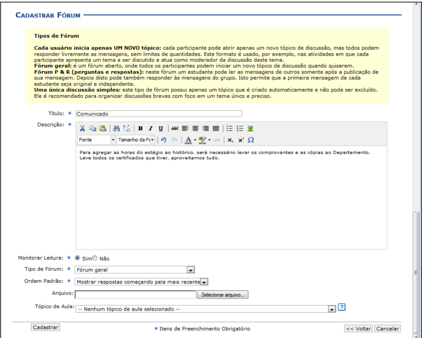

## 13. Notícias

Esta  funcionalidade  permite  ao  docente,  realizar  o  cadastro  de notícias  com  o  intuito  de  divulgar  informações  de  interesse  dos participantes da turma virtual. Ao realizar o cadastro de uma notícia, será possível enviá-la por e-mail.

Para  isso,  acesse  o SIGAA → Módulos → Portal  do  Docente → Componente  Curricular → Menu  Turma  Virtual → Turma → Notícias .

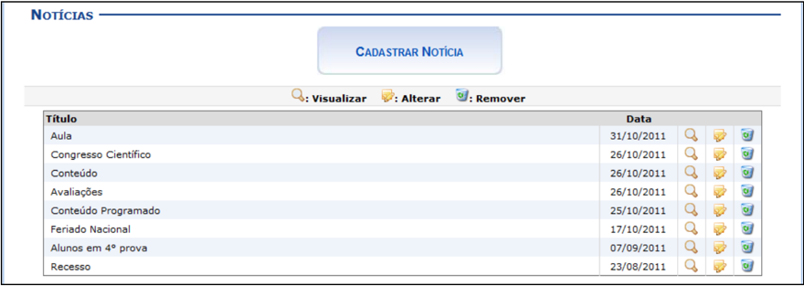

Caso queira realizar o cadastro de uma  nova notícia, clique

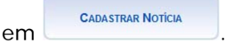

.

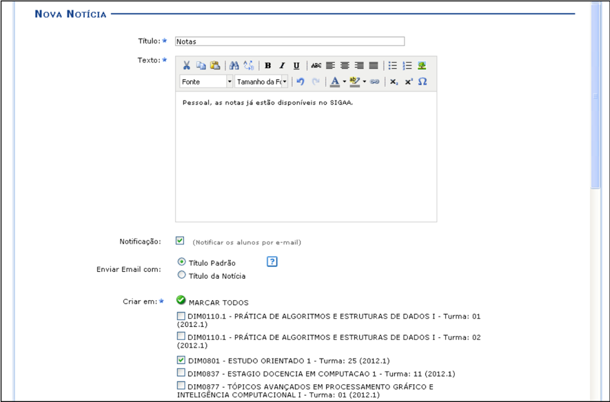

## 14. Registrar Aula Extra

Esta  funcionalidade  permite  ao  docente  realizar  o  cadastro  de  uma aula extra. Ao registrar uma  aula extra, o sistema cadastra automaticamente um tópico de aula. A descrição  do  tópico  de  aula passa a ser a descrição da aula extra e o conteúdo do tópico passa a ter as observações das aulas. O tópico não possui nenhuma relação de  dependência  com  a  aula  extra,  ao  deletar  ou  alterar  uma  aula extra o tópico de aula continua o mesmo.

Para realizar essa operação, acesse o SIGAA → Módulos → Portal do Docente → Componente Curricular → Menu Turma Virtual → Turma → Registrar Aula Extra .

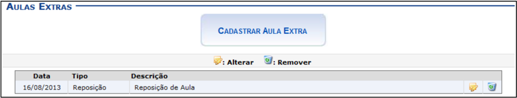

Clique em para efetuar o cadastro da aula extra.

CADASTRAR AULA EXTRA

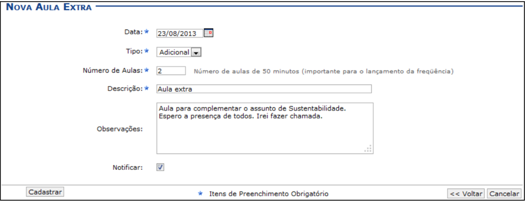

## 15. Visualizar como Aluno

Esta funcionalidade permite que o docente visualize as configurações e edições realizadas na turma, como se fosse um de seus discentes vinculados à turma virtual.

Para  isso,  acesse  o SIGAA → Módulos → Portal  do  Docente → Componente  Curricular → Menu  Turma  Virtual → Turma → Visualizar como Aluno .

## 16. Alunos Trancados

Esta  funcionalidade  permite  ao  docente,  visualizar  a  relação  de discentes que realizaram o trancamento em um determinado componente  curricular.  O  trancamento  de  matrícula  em  disciplina, significa a desvinculação voluntária do aluno da turma referente.

Para  isso,  clique  em SIGAA → Módulos → Portal  do  Docente → Componente  Curricular → Menu  Turma  Virtual → Alunos → Alunos Trancados .

## 17. Gerenciar Grupos

Esta funcionalidade permite ao docente visualizar uma listagem com todos os alunos matriculados no componente curricular selecionado. Por intermédio dessa listagem, o professor poderá realizar a divisão desses  discentes  em  grupos,  facilitando  a  realização  de  tarefas  na turma.

Para  isso,  acesse  o SIGAA → Módulos → Portal  do  Docente → Componente  Curricular → Menu  Turma  Virtual → Alunos → Gerenciar Grupos .

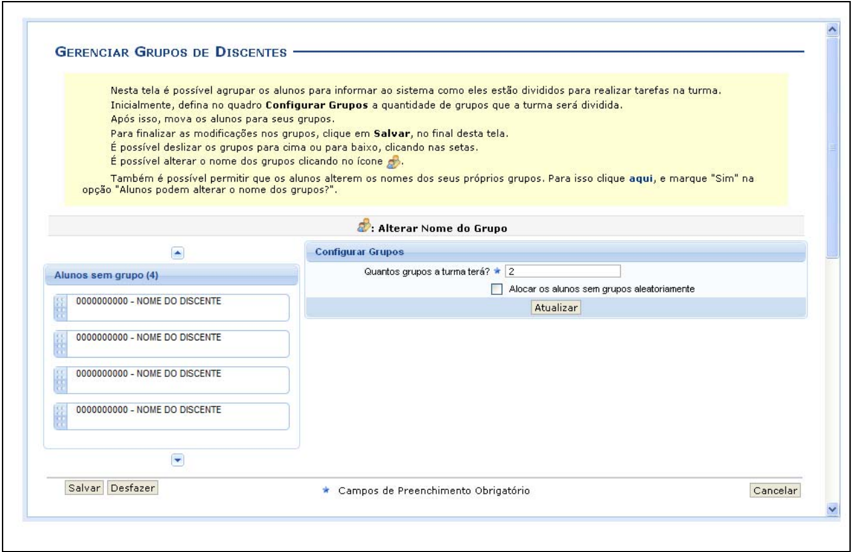

## 18. Lançar Frequência

Esta  funcionalidade  tem  o  objetivo  de  registrar  as  frequências  dos discentes de uma determinada turma virtual. Para lançar as frequências, se faz necessário que a turma possua alunos matriculados e que não tenha sido consolidada.

Através deste recurso é possível marcar as presenças dos alunos da turma, preenchendo automaticamente a folha de frequência do diário de classe.

Para realizar essa operação, acesse o SIGAA → → Módulos Portal do Docente → → → Componente Curricular Menu Turma Virtual Alunos → Lançar Frequência .

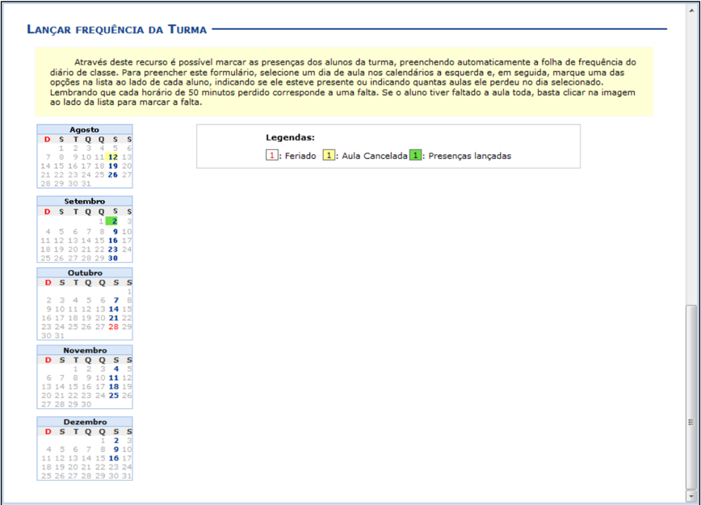

Na tela  acima,  serão  exibidos  os  calendários  dos  meses  do  período corrente  da  turma.  Nestes  calendários,  são  indicados,  em  azul,  os dias de aula da turma que podem ter a frequência registrada.

No  calendário,  os  dias  da  semana  que  aparecem  em  vermelho  são feriados,  os  que  aparecem  com  o  fundo  em  amarelo  são  aulas canceladas e em verde são presenças já registradas.

## Manual do Portal do Docente

Ao clicar em um dia que não teve a frequência lançada no calendário, será exibida uma listagem com todos os discentes da turma. Como exemplo, selecionamos o mês de Dezembro e a data 16.  A seguinte tela será exibida:

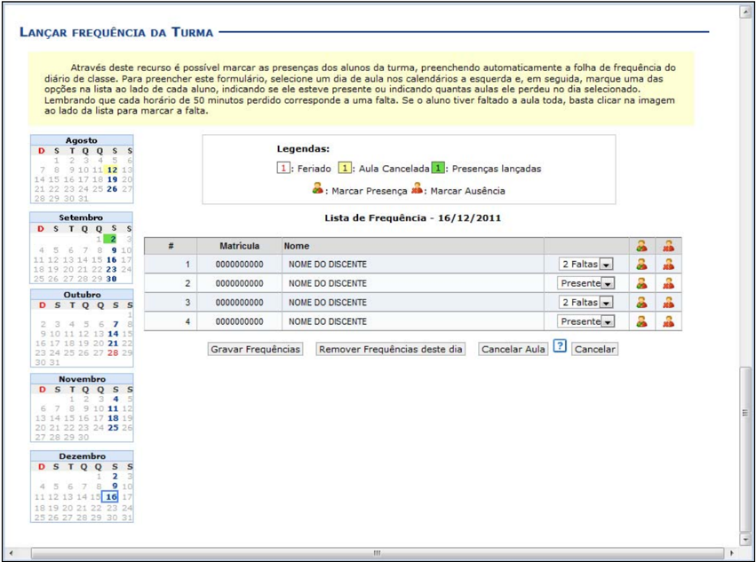

Nesta tela, são exibidos os nomes de todos os discentes matriculados na  turma.  Para  preencher  a  lista  de  frequência,  marque  uma  das opções  na  lista  ao  lado  de  cada  aluno,  indicando  se  ele  esteve presente ou indicando quantas aulas ele perdeu no dia selecionado. Se o aluno faltar à aula toda, clique no ícone . Caso o aluno tenha a presença completa na aula, clique no ícone localizado  na  lista  ao lado dos discentes para marcar a presença individualmente.

Vale  lembrar  que  os  ícones  apresentados  anteriormente  que  estão dispostos no topo da lista, permitem marcar a ausência ou presença de todos os alunos da turma, enquanto que os ícones apresentados na  lista  ao  lado  dos  discentes  serão  marcados  individualmente  as presenças ou ausências do aluno.

## 19. Lançar Frequência Em Planilha

Esta funcionalidade permite ao docente  realizar o cadastro de frequência  dos  discentes  matriculados  em  uma  determinada  turma virtual.  Será  permitido  cadastrar  a  frequência  para  todo  o  período letivo, utilizando o auxilio de uma planilha. Através desta planilha o docente poderá registrar as frequências com mais facilidade.

Para realizar essa operação, acesse o SIGAA → → Módulos Portal do  Docente  Componente  Curricular → → Menu  Turma  Virtual Alunos → Lançar Freq. em Planilha .

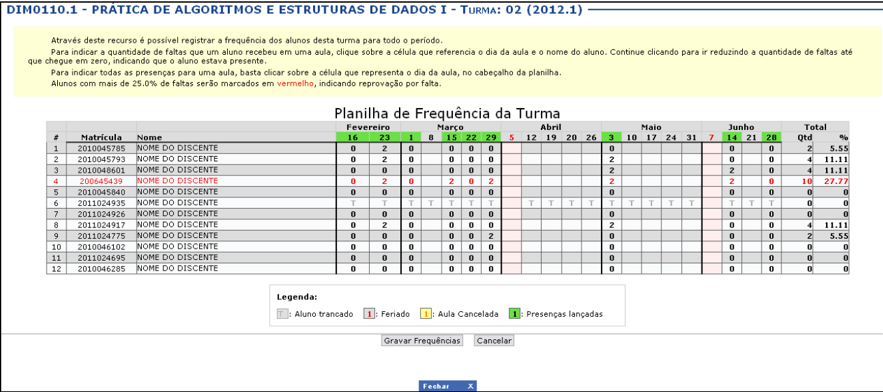

Para indicar  a  quantidade  de  faltas  que  um  aluno  recebeu  em  uma aula, clique sobre a célula que referencia o dia da aula e o nome do aluno. Continue clicando para ir reduzindo a quantidade de faltas até que chegue a zero, indicando que o aluno estava presente.

Para indicar todas as presenças para uma aula, clique sobre a célula que representa o dia da aula, no cabeçalho da planilha.

Nos dias em que houver feriados, os mesmos devem ser exibidos em vermelho  e  as  aulas  canceladas  devem  aparecer  com  os  dias  em amarelo, e não será possível cadastrar frequência nelas. E os dias em que  o  docente  já  estiver  lançado  as  frequências  apareceram  em verde.

Os alunos que tiverem trancado a disciplina, suas faltas não poderão ser  contabilizadas  e  será  sinalizado  com  a  letra  T  nos  campos apresentados.

Para finalizar a operação, clique em Gravar Frequências. Em seguida, uma mensagem informando o sucesso da ação será exibida.

## 20. Lançar Notas

Esta  funcionalidade  permitirá  ao  docente  realizar  o  lançamento  de notas  para  suas  turmas  do  referente  semestre.  Um  docente  tem permissão para lançar notas apenas das turmas nas quais ele leciona. A  finalidade  do  lançamento  de  notas  é  avaliar  o  andamento  dos discentes de uma turma, colocando informações que irão indicar se eles  serão  aprovados  ou  reprovados  na  turma  em  questão.  Esta operação pode ser feita a qualquer momento do semestre letivo até o momento em que o docente consolide a turma, momento a partir do qual  não  será  mais  possível  alterar  as  suas  informações,  a  não  ser pela unidade responsável pelo nível de ensino da turma.

Para  realizar  esta  operação,  o  usuário  deverá  acessar  o SIGAA → Módulos → → → Portal  do  Docente Componente  Curricular Menu Turma Virtual → → Alunos Lançar Notas .

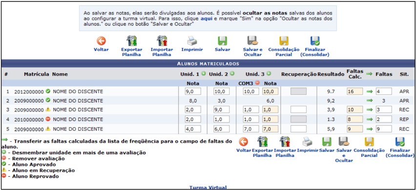

Além disso, serão exibidas as faltas calculadas no campo Faltas Calc., que não poderá ser alterado, pois as ausências registradas neste item são provenientes do lançamento de frequência.

Durante  o  lançamento  das  notas,  o  usuário  poderá  a  qualquer momento salvar os dados inseridos, ao clicar no ícone .  Assim, os  valores  registrados  serão  salvos  no  sistema  e  o  docente  poderá alterá-los sempre que julgar necessário.

O sistema possibilita ainda que o docente salve os dados e os oculte,

simultaneamente,  clicando  no  ícone .  Assim,  os  valores  de notas serão armazenados e disponibilizados para o docente, mas não poderão ser visualizados pelos discentes matriculados.

## Manual do Portal do Docente

O docente também poderá salvar as notas e publicá-las novamente, de  modo  que  tornem-se  visíveis  para  os  alunos  no  sistema.  Para

realizar esta operação, clique no ícone .

Para realizar a consolidação parcial da turma, o docente deverá clicar

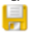

no ícone .  A  consolidação parcial consiste em consolidar as matrículas  de  todos  os  alunos  que  não  ficaram  em  prova  final, incluindo  aprovados  ou  reprovados  na  avaliação  do  componente curricular. Parcial

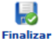

Ao clicar no ícone , o usuário poderá consolidar totalmente a turma  virtual.  É  importante  ressaltar  que  uma  vez  finalizada,  não será  possível  realizar  a  alteração  das  informações  na  turma  virtual consultada por meio desta funcionalidade. Portanto, é recomendado que o usuário certifique-se que os dados inseridos estão corretos e que a turma deve ser fechada.

Para  finalizar  uma  turma  virtual,  será  necessário  que  o  docente registre todas as notas dos discentes, incluindo as notas de recuperação.

## 21. Conteúdo Programado

Esta  operação  possibilitará  que  o  usuário  consulte  o  cronograma programado  para  as  aulas  do  período  letivo,  que  serão  lecionadas para a turma virtual. Neste caso, será possível criar e alterar tópicos de aulas, assim como gerenciá-los e consultar o cronograma gráfico das aulas ministradas.

Para  utilizar  esta  funcionalidade,  acesse  o SIGAA → → Módulos Portal  do  Docente → → Componente  Curricular Menu  Turma Virtual → → Diário Eletrônico Conteúdo Programado .

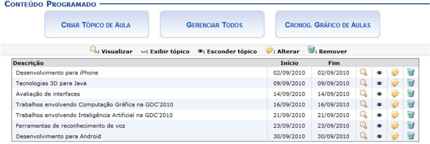

Caso deseje cadastrar um novo tópico de aula, clique em

CRIAR ToPico DE AULA

## 22. Diário de Turma

Esta operação tem como finalidade possibilitar que o docente tenha acesso  ao  diário  de  turma.  Esse  diário  consiste  na  descrição  das informações sobre a turma virtual que o usuário ministra. Dentre os dados principais estão os alunos matriculados, os valores de notas e faltas, a lista de presença bem  como  as  principais atividades realizadas e a ementa da disciplina.

Para  utilizar  esta  funcionalidade,  acesse  o SIGAA → → Módulos Portal  do  Docente → → Componente  Curricular Menu  Turma Virtual → → Diário Eletrônico Diário de Turma .

Ao acessar esta operação, o usuário poderá ter acesso ao diário de turma com as principais informações sobre os alunos matriculados na disciplina ministrada pelo docente.

## Manual do Portal do Docente

## 23. Lista de Presença

Esta operação tem como finalidade possibilitar que o docente tenha acesso  à  lista  de  presença  dos  alunos.  Essa  lista  consiste  em apresentar  os  alunos  matriculados  na  disciplina  ministrada  pelo docente  e  as  suas  respectivas  presenças  de  acordo  com  os  meses correspondentes ao período letivo.

Para  utilizar  esta  funcionalidade,  acesse  o SIGAA → → Módulos Portal  do  Docente → → Componente  Curricular Menu  Turma Virtual → → Diário Eletrônico Lista de Presença .

Ao  acessar  esta  operação,  o  usuário  poderá  ter  acesso  à  lista  de presença,  com  os  alunos  matriculados  na  disciplina  e  a  frequência referente à presença da turma cadastrada no sistema.

## 24. Mapa de Frequência

Esta operação tem como finalidade possibilitar que o docente tenha acesso  ao  mapa  de  frequência.  Esse  mapa  consiste  em  listar  os alunos matriculados na disciplina ministrada pelo docente e as suas respectivas frequências de acordo com os meses correspondentes ao período letivo.

Para  utilizar  esta  funcionalidade,  acesse  o SIGAA → → Módulos Portal  do  Docente → → Componente  Curricular Menu  Turma Virtual → → Diário Eletrônico Mapa de Frequência .

Ao acessar esta operação, o usuário poderá ter acesso ao mapa de frequência com a lista de alunos matriculados na disciplina ministrada e  a  frequência  da  turma  cadastrada  no  sistema.  Para  isso,  será exibida uma caixa de diálogo que permite a abertura do arquivo que corresponde ao mapa ou a realização de seu download.

## 25. Total de Faltas por Unidade

Esta  operação  permite  que  o  usuário  consulte  o  total  de  faltas  por unidade do período letivo. Neste caso, o docente poderá consultar as faltas de cada aluno matriculado na disciplina conforme as unidades que dividem o período acadêmico.

- É importante destacar que para realizar esta operação será necessário  que  as  datas  de  encerramento  das  unidades  estejam definidas no sistema.

Para consultar as faltas, acesse o SIGAA → → Módulos Portal do Docente → → → Componente  Curricular Menu  Turma  Virtual Diário Eletrônico → Total de Faltas por Unidade .

- O  sistema  exibirá  a  lista  dos  discentes  matriculados  na  disciplina ministrada pelo docente e as suas respectivas ausências.

## 26. Conteúdo/Página Web

Esta  operação  possibilita  que  o  usuário  cadastre  um  conteúdo  ou página  da  web  no  sistema,  disponibilizando-o  para  os  discentes matriculados no componente curricular consultado. Além de cadastrar, o usuário poderá  consultar os  conteúdos  registrados anteriormente assim como modificá-los ou removê-los.

Para  utilizar  esta  funcionalidade,  acesse  o SIGAA → → Módulos Portal  do  Docente → → Componente  Curricular Menu  Turma Virtual → → Materiais Conteúdo/Página Web .

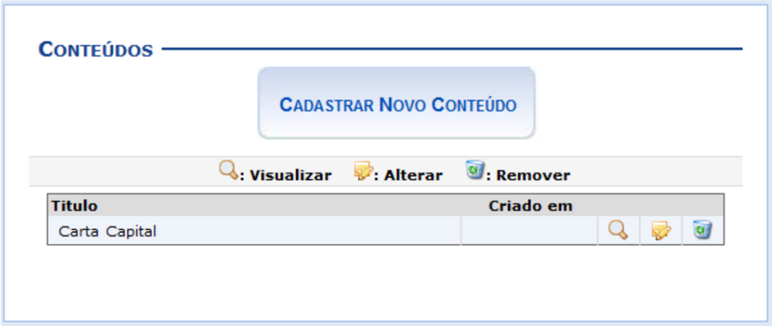

O docente poderá cadastrar novos conteúdos no sistema que estarão disponíveis para os alunos pertencentes à turma virtual do componente  curricular.  Será  possível  visualizar  detalhadamente  os dados dos conteúdos cadastrados, alterar as informações registradas ou removê-las conforme o critério do docente.

Caso queira cadastrar um conteúdo/página web, clique no ícone . CADASTRAR Novo CONTEÚDO

## Manual do Portal do Docente

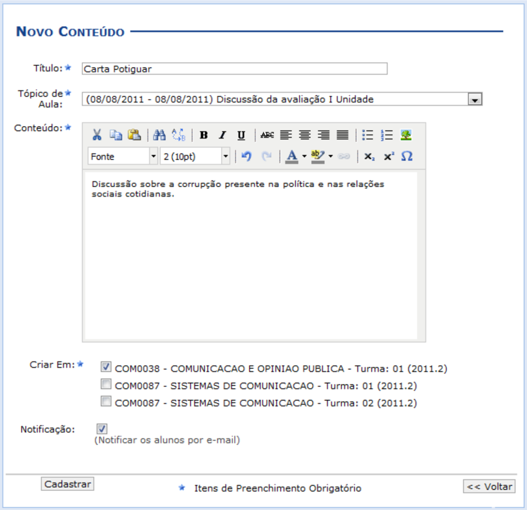

## 27. Porta-Arquivos

Esta  funcionalidade  permitirá  ao  docente  armazenar  conteúdos  e materiais no sistema e disponibilizá-los aos alunos. Desta forma, será possível  gerenciar  pastas,  alterar  ou  remover  arquivos  assim  como associá-los a outras turmas virtuais das quais o docente participa.

Para  realizar  esta  operação,  o  usuário  deverá  acessar  o SIGAA → Módulos → → → Portal  do  Docente Componente  Curricular Menu Turma Virtual → → Materiais Porta-Arquivos .

O  usuário  poderá  consultar  as  pastas  presentes  no  porta-arquivos, bem como os arquivos contidos nela. Para inserir um novo arquivo no porta-arquivos, o usuário deverá clicar no ícone . Novo Arquivo

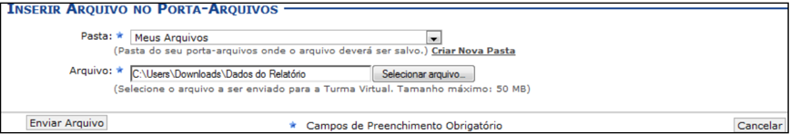

O  docente  poderá  cadastrar  uma  nova  pasta  no  porta-arquivos clicando  no  ícone .  Desta  forma,  será  exibida  a  tela  que permite ao usuário criar uma nova pasta. A localização da pasta que será criada dependerá de qual pasta foi selecionada anteriormente no porta-arquivos,  de  modo  que  a  nova  pasta  estará  associada  à primeira pasta selecionada no porta-arquivos. Nova Pasta

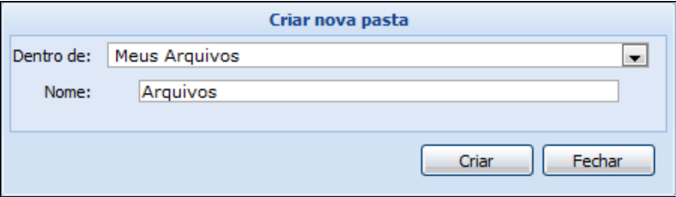

## Manual do Portal do Docente

O usuário poderá associar um arquivo a outras turmas virtuais das quais  o  docente  participa.  Clique  no  ícone para realizar esta operação. Associar Arquivo

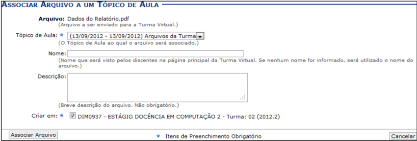

## 28. Inserir Arquivo na Turma

Esta funcionalidade permitirá ao usuário inserir arquivos para que a turma virtual possa consultá-los posteriormente. Será possível anexar um arquivo,  cadastrar  a  sua  descrição,  além  de  torná-lo  disponível para consultas em  diferentes turmas virtuais ministradas pelo docente.

Para  realizar  esta  operação,  o  usuário  deverá  acessar  o SIGAA → Módulos → → → Portal  do  Docente Componente  Curricular Menu Turma Virtual → → Materiais Inserir Arquivo na Turma .

## 29. Referências

Esta  operação  possibilita  que  o  usuário  disponibilize  referências bibliográficas para que os discentes as consultem durante o período letivo.  Neste  caso,  será  possível  cadastrá-las  no  sistema,  podendo visualizar  as  informações  detalhadas  das  referências  já  registradas bem como alterá-las ou removê-las.

Para  utilizar  esta  funcionalidade,  acesse  o SIGAA → → Módulos Portal  do  Docente → → Componente  Curricular Menu  Turma Virtual → → Materiais Referências .

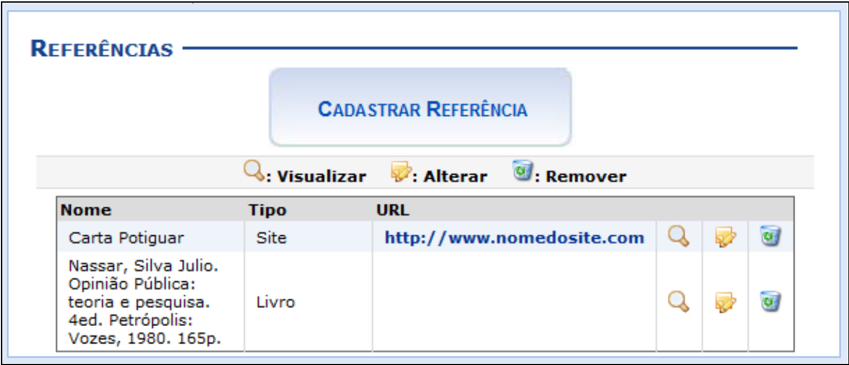

O docente poderá cadastrar novas referências no sistema que estarão disponíveis para os alunos pertencentes à turma virtual do componente curricular. Ao clicar no link correspondente ao endereço eletrônico da referência, o sistema encaminhará o docente para o site cadastrado.

Será  possível  visualizar  detalhadamente  os  dados  das  referências cadastradas, alterar as informações registradas ou removê-las conforme o critério do docente.

Caso queira cadastrar uma nova referência, clique no ícone . Desta forma, será exibida a tela que permite a CADASTRAR REFERÊNCIA

inserção dos dados para o cadastro da Nova Referência.

## Manual do Portal do Docente

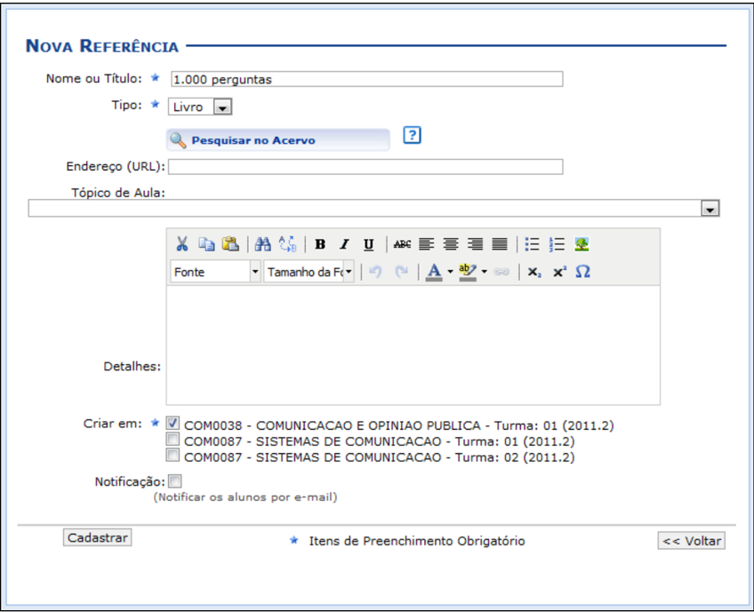

## 30. Vídeos

Esta funcionalidade permite que o usuário disponibilize vídeos para os alunos da turma virtual. Esses vídeos serão exibidos na listagem das aulas, dentro de seu respectivo tópico. O sistema exibirá um player com o vídeo dentro do tópico, caso o site seja reconhecido ou se o docente enviar um vídeo de seu computador.

Para  utilizar  esta  funcionalidade,  acesse  o SIGAA → → Módulos Portal  do  Docente → → Componente  Curricular Menu  Turma Virtual → → Materiais Vídeos .

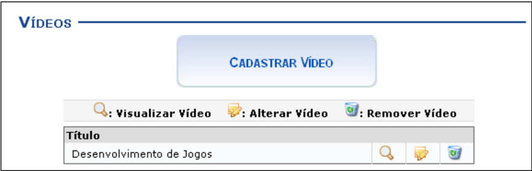

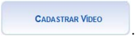

Caso  queira  cadastrar  um  vídeo,  clique  no  ícone . Desta forma, será exibida a tela que permite a inserção dos dados para o cadastro do Novo Vídeo.

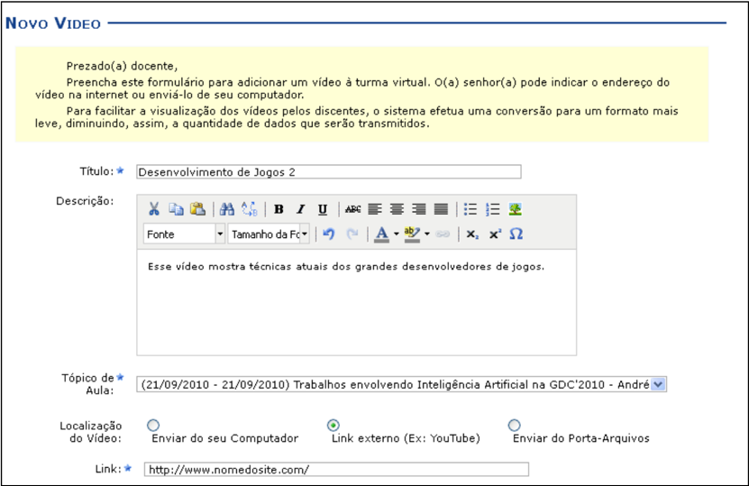

## Manual do Portal do Docente

## 31. Avaliações

Esta  funcionalidade  permite  que  o  docente  cadastre  uma  data  de avaliação  para  a  turma  virtual.  O  objetivo  é  informar  aos  discentes quando ocorrerá a avaliação.

Para  isso,  acesse  o SIGAA → Módulos → → Portal  do  Docente Componente Curricular → → → Menu Turma Virtual Atividades Avaliações .

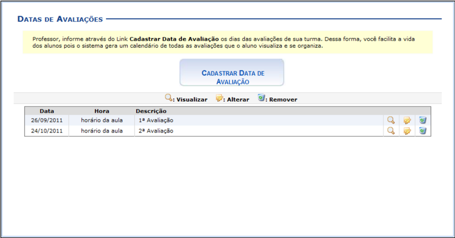

## 32. Enquetes

Esta  funcionalidade  permite  que  o  docente  cadastre  uma  enquete contendo  perguntas  destinadas  à  turma  virtual.  Essas  perguntas permitem  que  os  participantes  possam  votar,  escolhendo  uma  das alternativas cadastradas pelo docente da turma.

Para  isso,  acesse  o SIGAA → → → Módulos Portal  do  Docente Componente Curricular → → → Menu Turma Virtual Atividades Enquetes .

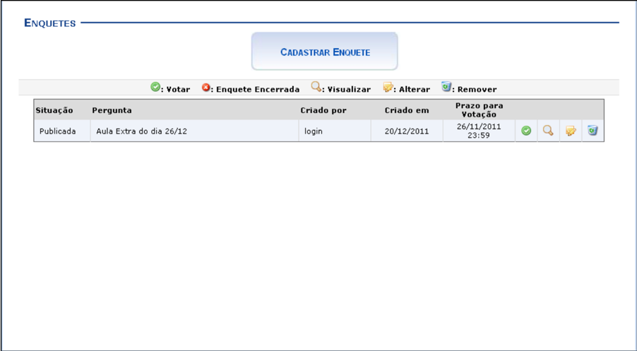

Na tela Enquetes, se for visualizado o ícone significa que a enquete foi encerrada.

Clique em para criar uma nova enquete.

CADASTRAR ENOUETE

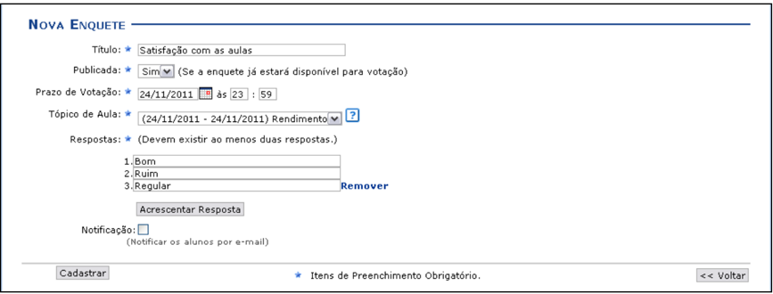

## 33. Tarefas

As  tarefas  são  as  atividades  que  os  professores  do  componente curricular podem disponibilizar para que os alunos pratiquem exercícios sobre os conteúdos da disciplina fora da sala de aula. Esta funcionalidade permite que o docente responsável pela turma virtual possa  cadastrar  tarefas,  corrigi-las,  de  acordo  com  a  demanda  de respostas dos alunos, além de alterar e/ou remover as atividades já cadastradas.

Para  isso,  acesse  o SIGAA → → → Módulos Portal  do  Docente Componente Curricular → → → Menu Turma Virtual Atividades Tarefas .

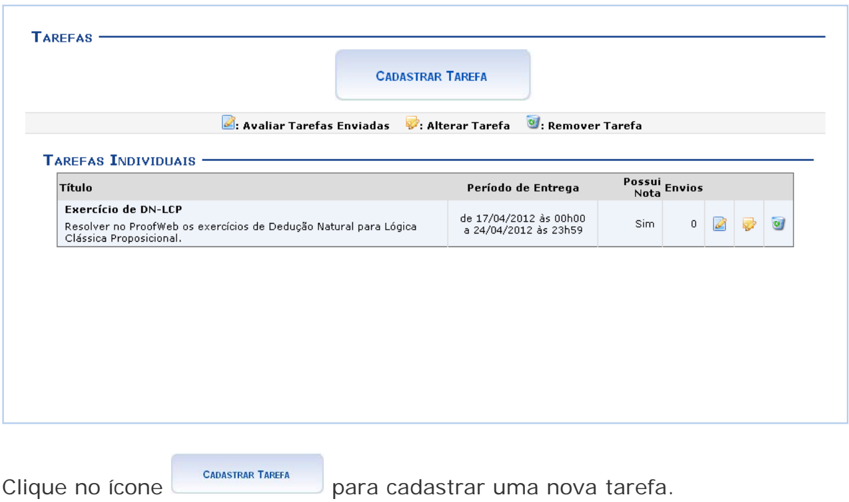

## Manual do Portal do Docente

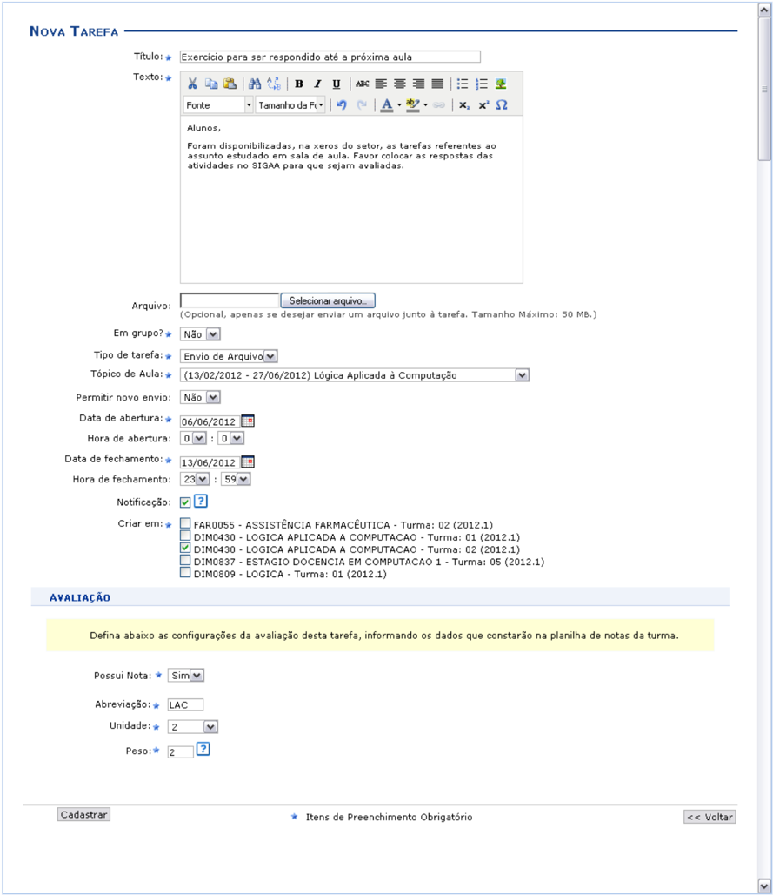

De volta à página com as Tarefas Individuais, clique no ícone para avaliar  as  tarefas  enviadas  pelos  discentes  da  turma  virtual,  em resposta à tarefa enviada pelo discente.

## Manual do Portal do Docente

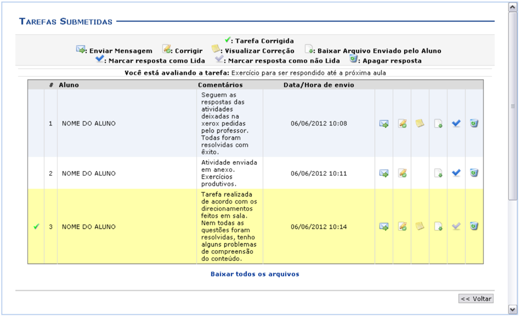

Caso deseje marcar a resposta como lida, clique em .  A  resposta marcada aparecerá em destaque de cor amarelo para diferenciar-se das outras. O ícone é exibido somente ao lado das tarefas já lidas e corrigidas.

Para marcar a resposta já visualizada como não lida, clique em .

Se desejar corrigir a tarefa, clique em

.

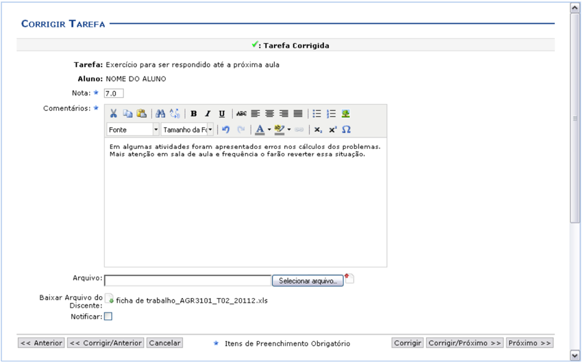

De volta à página de Tarefas Submetidas, clique em caso  deseje enviar uma mensagem ao discente.

Caso  deseje  realizar  o  download  o  arquivo  enviado  pelo  aluno referente à tarefa disponibilizada, clique no ícone .

## Manual do Portal do Docente

## 34. Questionários

Essa  operação  permite  que  o  docente  crie  listas  de  questões  aos discentes da turma virtual. Estas listas são respondidas e o sistema as corrige automaticamente sempre que possível. Somente quando a questão for de resposta dissertativa complexa que o docente terá de avaliar. Após isso, é possível passar a nota à planilha de notas dos alunos, liberando o professor de ter que digitá-las.

Para  isso,  acesse  o SIGAA → → → Módulos Portal  do  Docente Componente Curricular → → → Menu Turma Virtual Atividades Questionários .

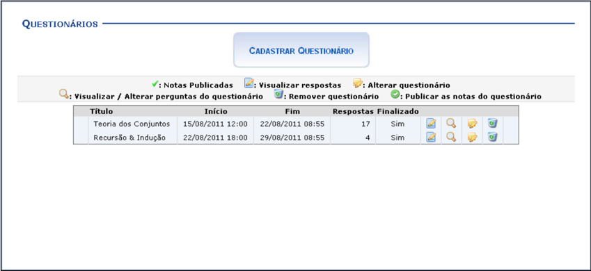

Clique no ícone para cadastrar uma nova tarefa.

CADASTRAR OUESTIONARIO

## Manual do Portal do Docente

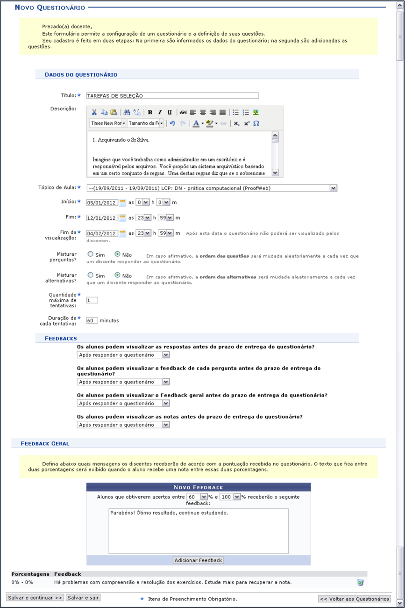

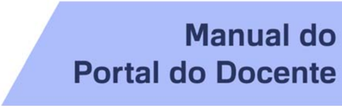

Utilize  o  ícone para  visualizar  a  data  no  calendário  nos  campos relacionados. Nos campos para preenchimento das horas, escolha os números disponibilizados pelo sistema em cada opção.

Para  voltar  aos  questionários  anteriores,  clique  em «  Questionários Anteriores. Para salvar e sair da operação, clique em Salvar e Sair.

Se  desejar  salvar  e  continuar  na  operação,  clique  em Salvar  e Continuar  ».  A  seguinte  tela  será  exibida  com  a  mensagem  de sucesso e a tela com o resumo do questionário criado:

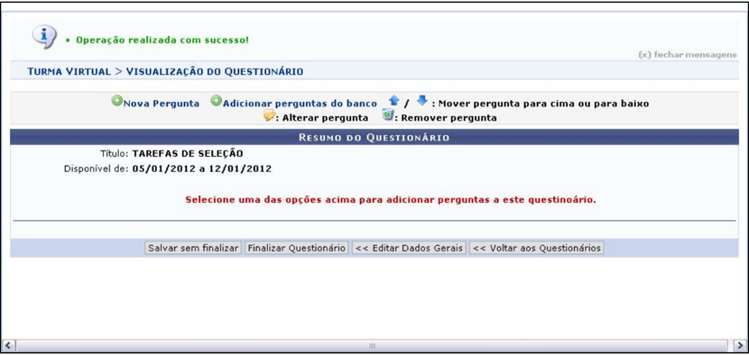

Para adicionar uma nova pergunta ao questionário, clique em .

## Manual do Portal do Docente

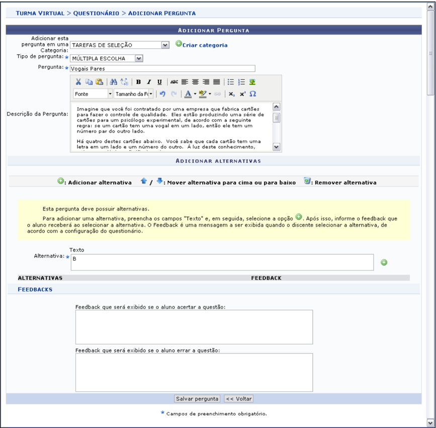

Retornando  à  tela  de Questionários,  clique  em para  visualizar  as respostas ao questionário.

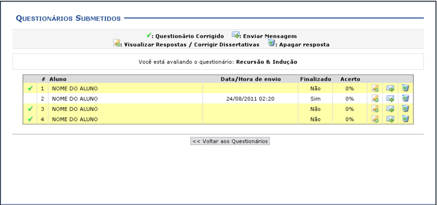

## Manual do Portal do Docente

As respostas destacadas na cor amarela e que aparecem o ícone são os questionários de alunos que já foram corrigidos.

Na  tela  de Questionários  Submetidos,  para  corrigir  as  respostas dissertativas, clique em .

## 35. Banco de Questões

Essa  funcionalidade  permite  que  o  docente  crie  um  banco  que armazena as questões já utilizadas por ele em questionários antigos, permitindo  ainda  que  ele  as  adicione  em  questionários  novos.  O docente  pode,  também,  adicionar  novas  questões  diretamente  no banco, separando por categorias, sem associá-las a um questionário previamente:

Para  isso,  acesse  o SIGAA → → → Módulos Portal  do  Docente Componente Curricular → → → Menu Turma Virtual Atividades Questionários → Banco de Questões .

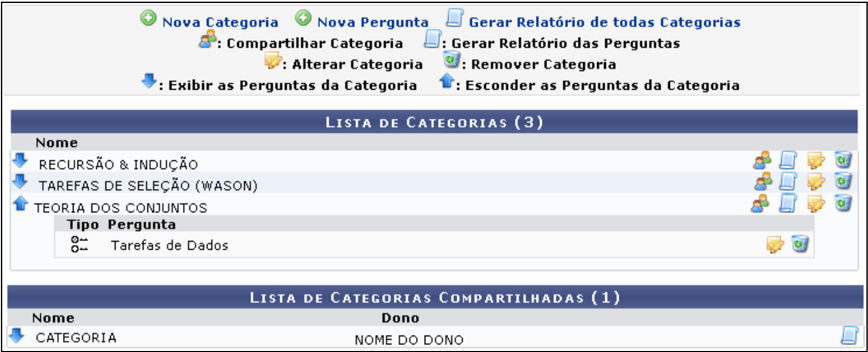

Utilize os  ícones e para exibir  ou  ocultar  as  respostas  das perguntas cadastradas em cada categoria.

Se desejar adicionar uma nova categoria à Lista de Categorias, clique em .

Clique  em para adicionar  uma  nova  pergunta  ao banco.

## Manual do Portal do Docente

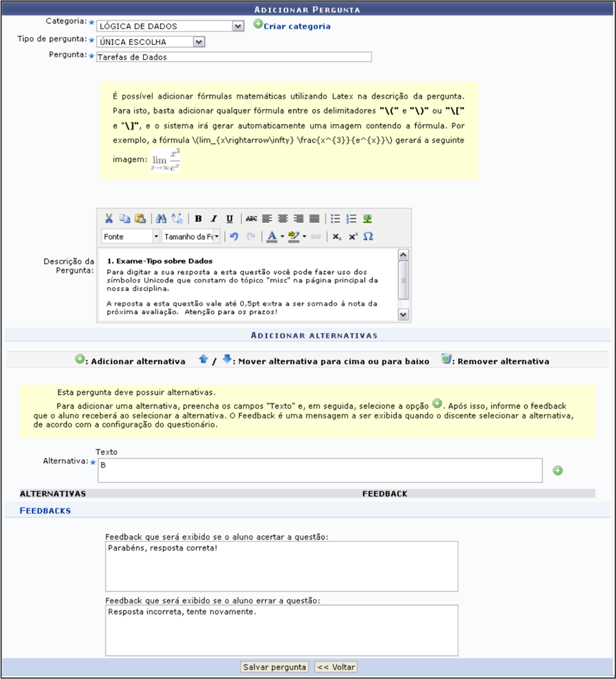

## Manual do Portal do Docente

## 36. Configurar Turma

Esta  funcionalidade  permitirá  ao  docente  configurar  a  turma  virtual de forma que esta atenda às necessidades da disciplina lecionada por ele.

Será possível configurar a forma como os tópicos de aula e o layout da turma virtual vão aparecer, informar se os alunos poderão ou não cadastrar fóruns e enquetes, configurar a forma como eles visualizarão  as  suas  notas,  se  poderá  publicar  no  Portal  dos  Cursos Abertos e se poderá informar a média da turma no relatório de notas.

Para  realizar  esta  operação,  o  usuário  deverá  acessar  o SIGAA → Módulos → → → Portal  do  Docente Componente  Curricular Menu Turma Virtual → Configurações → Configurar Turma .

## Manual do Portal do Docente

## TURMA VIRTUAL

Configure a maneira através da qual os alunos desta turma poderão interagir com Turma Virtual. Você poderá informar se eles poderão ou não cadastrar fóruns e enquetes, além de configurar a forma como eles visualizarão as suas notas

É possível também definir como a média da unidade será calculada caso deseje-se dividir uma unidade em avaliações. Para isso, selecione uma das opções do campo "No cadastro de avaliações, a média da unidade será: As Opções possíveis são:

- Média Ponderada: Cada avaliação deverá ter um peso. 4 nota da unidade sera calculada multiplicando as notas pelos pesos, somando 0s resultados € dividindo tudo pela soma pesos dos
- Soma das Notas: As notas das avaliações serão somadas unidade
- Média Aritmética: As notas das avaliações serão somadas e 0 resultado será dividido pelo número de avaliações.

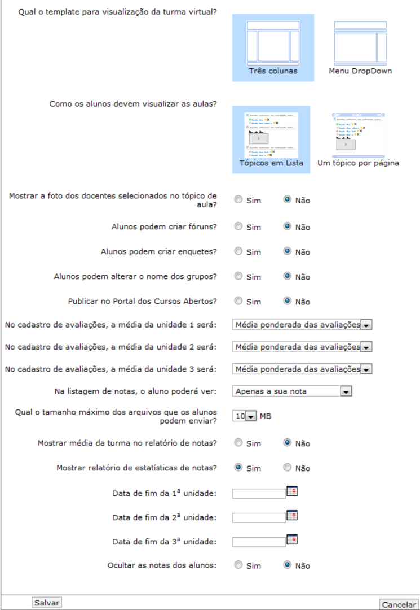

## 37. Permissões

Esta  funcionalidade  permite  que  o  docente  da  turma  virtual  abra concessões  a  outras  pessoas  para  gerenciar  algumas  operações referentes à disciplina que ele leciona.

Para  isso,  acesse  o SIGAA → → → Módulos Portal  do  Docente Componente Curricular → → Menu Turma Virtual Configurações → Permissões .

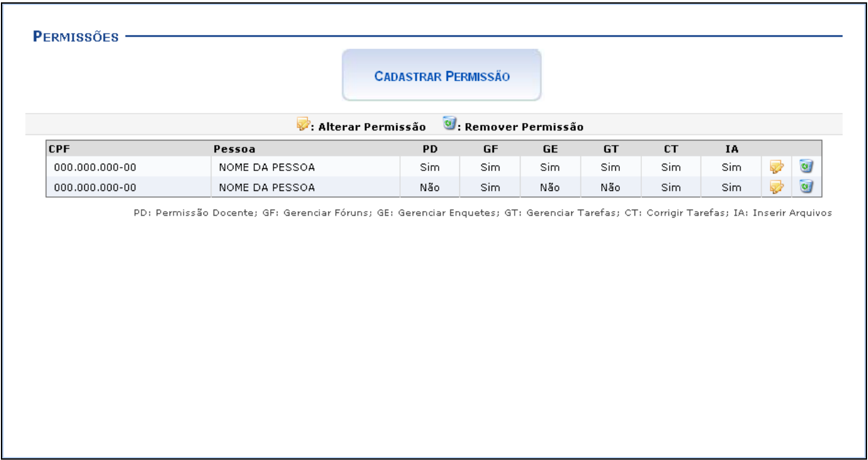

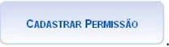

Para cadastrar uma nova permissão, clique em

.

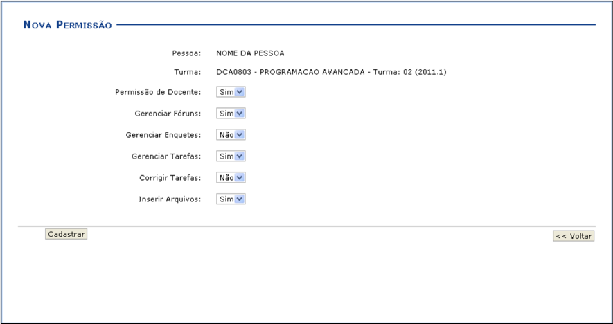

## 38. Publicar Turma Virtual

Essa  funcionalidade  permite  ao  docente  tornar  pública  a  turma virtual, em que qualquer pessoa poderá visualizar somente os tópicos de  aulas  e  materiais  relacionados.  Caso  o  usuário  deseje,  a  turma virtual será disponibilizada neste portal para toda internet ter acesso.

Para  isso,  acesse  o SIGAA → → → Módulos Portal  do  Docente Componente Curricular → → Menu Turma Virtual Configurações → Publicar Turma Virtual .

## 39. Área de Trabalho

Na área de trabalho são organizadas as informações detalhadas sobre as  aulas  da  turma  virtual,  de  acordo  com  as  datas  específicas.  O docente pode disponibilizar para os alunos, nesta área, suas atividades no sistema para que sejam visualizadas pelos participantes da turma.

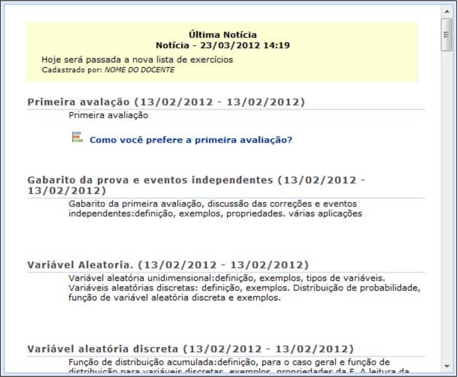

## 40. Painel de Notícias

O painel de notícias consiste na publicação de informações sobre o formato de Notícias, Enquetes, Atividades e Avaliações. Neste painel, as atividades  e  avaliações  serão  publicadas de modo que os discentes poderão visualizar os dados cadastrados sobre as aulas ministradas.

## Manual do Portal do Docente

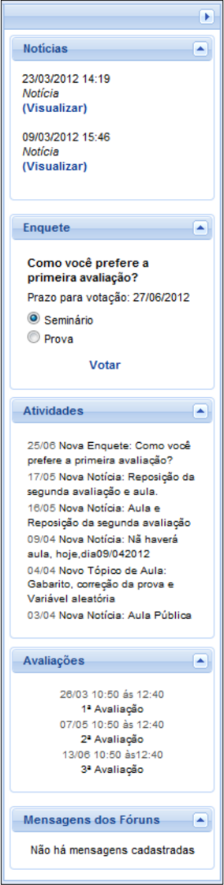

## 41. Dúvidas

Envie email para sigaa@surrac.ufrb.edu.br

## Manual do Portal do Docente

68