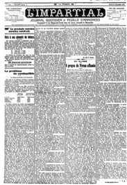

## Named Entity Recognition and Classification in Historical Documents: A Survey

MAUD EHRMANN, Ecole Polytechnique Fédérale de Lausanne, Switzerland AHMED HAMDI and ELVYS LINHARES PONTES, University of La Rochelle, France MATTEO ROMANELLO, University of Lausanne, Switzerland ANTOINE DOUCET, University of La Rochelle, France

After decades of massive digitisation, an unprecedented number of historical documents are available in digital format, along with their machine-readable texts. While this represents a major step forward with respect to preservation and accessibility, it also opens up new opportunities in terms of content mining and the next fundamental challenge is to develop appropriate technologies to efficiently search, retrieve, and explore information from this 'big data of the past'. Among semantic indexing opportunities, the recognition and classification of named entities are in great demand among humanities scholars. Yet, named entity recognition (NER) systems are heavily challenged with diverse, historical, and noisy inputs. In this survey, we present the array of challenges posed by historical documents to NER, inventory existing resources, describe the main approaches deployed so far, and identify key priorities for future developments.

CCS Concepts: · Computing methodologies → Information extraction ; Machine learning ; Language resources ; · Information systems → Digital libraries and archives;

Additional Key Words and Phrases: Named entity recognition and classification, historical documents, natural language processing, digital humanities

## ACMReference format:

Maud Ehrmann, Ahmed Hamdi, Elvys Linhares Pontes, Matteo Romanello, and Antoine Doucet. 2023. Named Entity Recognition and Classification in Historical Documents: A Survey. ACMComput. Surv. 56, 2, Article 27 (September 2023), 47 pages.

https://doi.org/10.1145/3604931

## 1 INTRODUCTION

For several decades now, digitisation efforts by cultural heritage institutions are contributing an increasing number of facsimiles of historical documents [196]. Billions of images are being acquired and, when it comes to textual documents, their content is transcribed either manually via

This work was supported in part by the Swiss National Science Foundation under the grants No. CR-SII5\_173719 (Impresso Media Monitoring of the Past, M. Ehrmann) and No. CPZ00P1\_186033 (M. Romanello), and in part by the European Union's Horizon 2020 research and innovation program under grant No. 770299 (NewsEye, A. Hamdi, E. Linhares Pontes and A. Doucet).

Authors' addresses: M. Ehrmann, Ecole Polytechnique Fédérale de Lausanne, Lausanne, Switzerland, 1015; email: maud.ehrmann@epfl.ch; A. Hamdi, E. Linhares Pontes, and A. Doucet, University of La Rochelle, La Rochelle, France, 17000; emails: {ahmed.hamdi, elvys.linhares\_pontes, antoine.doucet}@univ-lr.fr; M. Romanello, University of Lausanne, Lausanne, Switzerland, 1015; email: matteo.romanello@unil.ch.

This work is licensed under a Creative Commons Attribution-ShareAlike International 4.0 License.

© 2023 Copyright held by the owner/author(s). 0360-0300/2023/09-ART27 $15.00

https://doi.org/10.1145/3604931

dedicated interfaces, or automatically via optical character recognition (OCR) or handwritten text recognition (HTR) [36, 139]. As a result, it is nowadays commonplace for memory institutions (e.g., libraries, archives, museums) to provide digital repositories that offer rapid, time- and locationindependent access to facsimiles of historical documents as well as, increasingly, full-text search over some of these collections.

Beyond this great achievement in terms of preservation and accessibility, the availability of historical records in machine-readable formats also bears the potential of new ways to engage with their contents. In this regard, the application of machine reading to historical documents is potentially transformative and the next fundamental challenge is to adapt and develop appropriate technologies to efficiently search, retrieve, and explore information from this 'big data of the past' [107]. Here research is stepping up and the interdisciplinary efforts of the digital humanities (DH), natural language processing (NLP), and computer vision communities are progressively pushing forward the processing of facsimiles, as well as the extraction, linking and representation of the complex information enclosed in transcriptions of digitised collections. In this endeavour, information extraction techniques, and particularly named entity (NE) processing, can be considered among the first and most crucial processing steps.

Named entity recognition and classification (NER for short) corresponds to the identification of entities of interest in texts, generally of the types Person , Organisation, and Location . Such entities act as referential anchors which underlie the semantics of texts and guide their interpretation. Acknowledged some twenty years ago, NE processing has undergone major evolution since then, from entity recognition and classification to entity disambiguation and linking, and is representative of the evolution of information extraction from a document- to a semantic-centric view point [165]. As for most NLP research areas, recent developments around NE processing are dominated by deep neural networks and the usage of embedded language representations [43, 119]. Since their inception up to now, NE-related tasks are of ever-increasing importance and at the core of virtually any text mining application.

From the NLP perspective, NE processing is useful first and foremost in information retrieval, or the activity of retrieving a specific set of documents within a collection given an input query. Guo et al. [90] as well as Lin et al. [127] showed that more than 70% of queries against modern search engines contain a named entity, and it has been suggested that more than 30% of content-bearing words in news text correspond to proper names [81]. Entity-based document indexing is therefore desirable. NEs are also highly beneficial in information extraction, or the activity of finding information within large volumes of unstructured texts. The extraction of salient facts about predefined types of entities in free texts is indeed an essential part of question answering [137], media monitoring [191], and opinion mining [14]. Besides, NER is helpful in machine translation [97], text summarisation [106] and document clustering [71], especially in a multilingual setting [190].

As for historical material (cf. Figure 1), primary needs also revolve around retrieving documents and information, and NE processing is of similar importance [41]. There are fewer query logs over historical collections than for the contemporary web, but several studies demonstrate how prevalent entity names are in humanities users' searches: 80% of search queries on the national library of France's portal Gallica contain a proper name [38], and geographical and person names dominate the searches in various digital libraries, be they of artworks, domain-specific historical documents, historical newspapers, or broadcasts [18, 37, 102]. Along the same line, several user studies emphasise the role of entities in various phases of the information-seeking workflow of historians [52, 83], now also reflected in the 'must-have' of exploration interfaces, e.g., as search facets over historical newspapers [54, 156] or as automatic suggestions over large-scale cultural heritage records [84]. Besides document indexing, NER can also benefit downstream processes (e.g., biography reconstruction [74] or event detection [185]), as well as various data analysis and visualisation (e.g., on

alimcntal dont Icur bls la loi cicns. cncorc sacra Il1 du  lait manquon dcmnal Si nc rcstrcind portation fabrkati blcs sous ccti servi de laltag ctnarssa vicnnois Et tou TEconon propos de Vienne affamée EN SUISSE De M. Tony Roche dans ie Genevois Ue Conseil national a, on to sait approuvé le Conseil fédéra, dans l'cuvre humanitaire (le rav ailfcment d'e. viJle de Vienne pour laquelle ia Suisse pu proposer efficacement -et nous nous en rejouissons ses bons offices aux pu. Jnces $ e l'Entente\_ Cette résolution n'à'pas laissé cependant de rencontrer des détracteurs dans l'opinion publique, qui marquent leur étonnement que l'humanité se. soit réveillée si fort dans nos Autorités fédérales apràs s'y être si longtemps assoupie durant que la Belgique, le nord de la France, Serbie, subissaient les plus effroyables privations. M. le'Conseiller nationalHorace Micbelr, était intervenu dans la débat à Berne, déplore ce sentiment hostile qu'il, qualifie de'peu ehrétttu rappelle que la Suisse, même du temps de M. Hoffmann n'a jamais méconnu le rôle de était 'bonne Samaritaine qui lui dévolu-\_ qni

## En 0i

Gcncvois mnais ordinaire conscils dc alimentation issent la fronvoics scront transports 'micurs semaines. vicnt

:ontingent fournis sC heurtent Dcinc quat on 10 sait; approuvé le laquelle Suisse proposcr ciiicacement nous pas laissc cependant dc rcncontrcr des détractcurs dans etrc Conscilkcr nationa Horacc MiNous reconnaissons volonticrs avec M. Mlchcli qu1 do peu chevalorcsque dans Ics protcstations qui sc sont clcvécs, plus nutnbreuscs contfe Vicnne. Mais nous scmble ausst quc la qucstion

Fig. 1. Swiss journal L'Impartial , issue of 31 Dec. 1918. Facsimile of the first page (left), zoom on an article (middle), and OCR of this article as provided by the Swiss National Library (completed in the 2010s) (right).

networks [203]). Finally, and perhaps most importantly, NER is very often the first step of entity linking, which can support the cross-linking of multilingual and heterogeneous heritage collections based on authority files and knowledge bases. Overall, entity-based semantic indexing can greatly support the search and exploration of historical documents, and NER is increasingly being applied to such material.

Yet, the recognition and classification of NEs in historical texts is not straightforward, and performances are rarely on par with what is usually observed on contemporary, well-edited English news material [55]. In particular, NER on historical documents faces the challenges of domain heterogeneity, input noisiness, dynamics of language, and lack of resources. If some of these issues have already been tackled in isolation in other contexts (with e.g., user-generated text), what makes the task particularly difficult is their combination, as well as their magnitude: texts are severely noisy, domains and time periods are far apart, and there is no (or not yet) historical web to easily crawl to capture language models. In this context of new material, interests and needs, and in times of rapid technological change with deep learning, this paper presents a survey of NER research on historical documents. The objectives are to study the main challenges facing named entity recognition and classification when applied to historical documents, to inventory the strategies deployed to deal with them so far, and to identify key priorities for future developments.

The survey is organised as follows: first, Section 2 outlines the objectives, the scope and the methodology of the survey, and Section 3 provides some background on NE processing (complemented by Appendix A in Supplementary Materials). Next, Section 4 introduces and discusses the challenges of NER on historical documents. In response, Section 5 proposes an inventory of existing resources, while Sections 6 and 7 present the main approaches, in general and in view of specific challenges, respectively. Finally, Section 8 discusses next priorities and concludes.

## 2 FRAMING OF THE SURVEY

## 2.1 Objectives

This survey focuses on NE recognition and classification, and does not consider entity linking nor entity relation extraction. With the overall objective of characterising the landscape of NER on historical documents, the survey reviews the history, the development, and the current state of related approaches. In particular, we attempt to answer the following questions:

- Q1 What are the key challenges posed by historical documents to NER?
- Q2 Which existing resources can be leveraged in this task, and what is their coverage in terms of historical periods, languages, and domains?

Q3 Whichstrategies were developed and successfully applied in response to the challenges faced by historical NER? Which aspects of NER systems require adaptation in order to obtain satisfying performances on this material?

While investigating the answers to these questions, the survey will also shed light on the variety of domains and usages of NE processing in the context of historical documents.

## 2.2 Document Scope and Methodology

In this survey, we consider as historical document any document of textual nature mainly, produced or published up to 1979, regardless of its topic, genre, style or acquisition method. The year 1979 is not arbitrary and corresponds to one of the most recent 'turning points' acknowledged by historians [29]. This document scope is rather broad, and the question of the too far-reaching 'textual nature' can be raised in relation to documents such as engravings, comics, card boards or even maps, which can also contain text. In practice, however, NER was mainly applied on printed documents so far, and these represent most of the material of the work reviewed here.

The compilation of the literature was based on the following strategies: scanning of the archives of relevant journals and conference series, search engine-based discovery, and citation chaining. Weconsidered key journals and conference series both in the fields of natural language processing and digital humanities (see Table C in Appendix C in Supplementary Materials). 1 For searching, we used a combination of keywords over the Google Scholar and Semantic Scholar search engines. 2 With a few exceptions, we only considered publications that included a formal evaluation.

## 2.3 Previous Surveys and Target Audience

Previous surveys on NER focused either on approaches in general, or on specific domains or languages. In the first group, Nadeau and Sekine [140] provided the first comprehensive survey after a decade of work on NE processing, reviewing existing machine learning approaches of that time, as well as typologies and evaluation metrics. Their survey remained the main reference until the introduction of neural network-based systems, recently reviewed by Yadav and Bethard [210] and Li et al. [125]. The latest NER survey to date is the one by Nasar et al. [141], which focuses specifically on generic domains and on relation extraction. In the second group, Leaman and Gonzalez [120] and Campos et al. [33] presented a survey of advances in biomedical named entity recognition, while Lei et al. [121] considered the same domain in Chinese. Shaalan focused on general NER in Arabic [184], and surveys exist for Indian languages [153]. Recently, Georgescu et al. [80] focused on NER aspects related to the cybersecurity domain. Turning our attention to digital humanities, Sporlerder [186] and Piotrowski [158] provided general overviews of NLP processing for cultural heritage domains, considering institutional, documentary, and technical aspects. To the best of our knowledge, this is the first survey on the application of NER to historical documents.

The primary target audiences are researchers and practitioners in the fields of natural language processing and digital humanities, as well as humanities scholars interested in knowing and applying NER on historical documents. Since the focus is on adapting NER to historical documents and not on NER techniques themselves, this study assumes a basic knowledge of NER principles and techniques; however, it will provide information and guidance as needed. We use the terms 'historical NER' and 'modern NER' to refer to work and applications which focus on, respectively, historical and non-historical (as we define them) materials.

1 Subsequent references to the appendix sections can be found in the Supplementary Materials file available online with the article.

2 E.g., 'named entity recognition', 'nerc', 'named entity processing', 'historical documents', 'old documents' over https: //scholar.google.com and https://www.semanticscholar.org/.

## 3 BACKGROUND

Before delving into NER for historical documents, this section -complemented by Appendix Aprovides a generic introduction to named entity processing.

## 3.1 NE Processing in General

As of today, named entity tasks correspond to text processing steps of increasing level of complexity, defined as follows:

- (1) recognition and classification - or the detection of named entities, i.e., elements in texts which act as a rigid designator for a referent, and their categorisation according to a set of predefined semantic categories;
- (2) disambiguation/linking - or the linking of named entity mentions to a unique reference in a knowledge base, and
- (3) relation extraction - or the discovery of relations between named entities.

First introduced in 1995 during the 6th Message Understanding Conference [87], the task of NE recognition and classification (task 1 above) quickly broadened and became more complex, with the extension and refinement of typologies, 3 the diversification of languages taken into account, and the expansion of the linguistic scope with, along proper names, the consideration of pronouns and nominal phrases as candidate lexical units. Later on, as recognition and classification were reaching satisfying performances, attention shifted to finer-grained processing, with metonymy recognition [133] and (ultra) fine-grained classification [39, 67, 130], and to the next logical step, namely entity resolution or disambiguation (task 2 above, not covered in this survey). Besides the general domain of clean and well-written news wire texts, NE processing is also applied to specific domains, particularly bio-medical [85], and to more noisy inputs such as speech transcriptions [78] and tweets [159, 168]. In recent years, one of the major developments of NE processing is its application to historical material.

Although the question of the definition of named entities is not under focus here, we shall specify that we adopt the position of Nadeau and Sekine [140] for which ' the word 'Named' aims to restrict [Named Entities] to only those entities for which one or many rigid designators, as defined by S. Kripke, stands for the referent '. Concretely speaking, named entities correspond to different types of lexical units, mostly proper names and definite descriptions, which, in a given discourse and application context, autonomously refer to a predefined set of entities of interest. Overall, there is no strict definition of named entities, but only a set of linguistic and application-related criteria which, eventually, compose a heterogeneous set of units. 4 Finally, let us mention two NE-related specific research directions, namely temporal information processing and geoparsing. This survey does not consider work related to temporal analysis and, when relevant, occasionally mentions some related to geotagging.

## 3.2 NER in a Nutshell

Named entity recognition and classification is defined as a sequence labelling task where, given a sequence of tokens, a system seeks to assign labels (NE classes) to this sequence. The objective for a system is to observe, in a set of labelled examples, the word-labels correspondences and their most distinctive features in order to learn identification and classification patterns which can then be used to infer labels for new, unseen sequences of tokens. NER systems' input corresponds

3 See e.g., the overviews of Nadeau and Sekine [140, pp. 3-4] and Ehrmann et al. [56].

4 See Ehrmann [53, pp. 81-188] for an in-depth discussion of NE definition.

to a linear representation of text as a sequence of characters, usually processed as a sequence of words and sentences. This input is enriched with features or 'clues' a system consumes in order to learn (or generalise) a model. Typical NER features may be observed at three levels: words, close context or sentences, and document. These features can be absent or ambiguous, and none of them is systematically reliable; it is therefore necessary to combine them. Similarly to other NLP tasks, NER systems are developed according to three standard families of algorithms, namely rule-based, feature-based (traditional machine learning), and neural-based (deep learning). In traditional, feature-based machine learning, features are specified by the developer (feature engineering), while in recent deep learning they are learned by the system itself (feature learning). Owing to the page limitation, those points are not further detailed and we refer to Appendix A for additional background on NE processing with, more specifically, detailed introductions to:

- -modern NER in general, including evaluation (Appendix A.1);
- -the types of resources required when developing NER systems, that is to say typologies, lexicons and knowledge bases, word embeddings and language models, and annotated corpora (Appendix A.2);
- -and to the techniques underlying main NER approaches (Appendix A.3).

## 4 CHALLENGES

Named entity recognition on historical documents faces four main challenges for which systems developed on contemporary datasets are often ill-equipped. Those challenges are intrinsic to the historical setting, like time evolution and types of documents, and endemic to the text acquisition process, like OCR noise. This translates into a variable and sparse feature space, a situation compounded by the lack of resources. This section successively considers the challenges of document type and domain variety, noisy input, dynamics of language, and lack of resources.

## 4.1 The (Historical) Variety Space

First, NER on historical texts corresponds to a wide variety of settings, with documents of different types (e.g., administrative documents, media archives, literary works, documentation of archival sites or art collections, correspondences, secondary literature), of different nature (e.g., articles, letters, declarations, memoirs, wires, reports), and in different languages, which, moreover, span different time periods and encompass various domains and countless topics. The objective here is not to inventory all historical document types, domains and topics, but to underline the sheer variety of settings which, borrowing an expression from Plank [160], compose the 'variety space' NLP is confronted with, intensified in the present case by the time dimension. 5

Two comments should be made in connection with this variety. First, domain shift is a wellknown issue for NLP systems in general and for modern NER in particular. While Plank [160] and J. Einsenstein [66] investigated what to do about bad and non-standard (or non-canonical) language with NLP in general, Augenstein et al. [13] studied the ability of modern NER systems to generalise over a variety of genres, and Taillé et al. [195] over unseen mentions. Both studies demonstrated an NER transfer gap between different text sources and domains, confirming earlier findings of Vilain et al. [206]. While no studies have (yet) been conducted on the generalisation capacities of NER systems within the realm of historical documents, there are strong

5 Considering that there is no consensus on what constitutes a domain and that the term is largely overloaded (i.e., it is used interchangeably with genre, register, text type, domain, style), Plank proposes the concept of 'variety space', defined as a ' unknown high-dimensional space, whose dimensions contain (fuzzy) aspects such as language (or dialect), topic or genre, and social factors (age, gender, personality, etc.), amongst others. A domain forms a region in this space, with some members more prototypical than others ' [160].

grounds to believe that systems are equally impacted when switching domain and/or document type.

Second, this (historical) variety space is all the more challenging as the scope of needs and applications in humanities research is much broader than the one usually addressed in modern NLP. For sure the variety space does not differ much between today and yesterday's documents (i.e., if we were NLP developers living in the 18C we would be more or less confronted with the same 'amount' of variety as today), however here the difference lies in the interest for all or part of this variety: while NLP developments tend to focus on some well-identified and stable domains/sub-domains (sometimes motivated by commercial opportunities), the (digital) humanities and social sciences research communities are likely interested in the whole spectrum of document types and domains. In brief, if the magnitude of the variety space is more or less similar for contemporary and historical documents, the range of interests and applications in humanities and cultural heritage requiresalmost by design-the consideration of an extensive array of domains and document types.

## 4.2 Noisy Input

Next, historical NER faces the challenges of noisy input derived from automatic text acquisition over document facsimiles. Text is acquired via two processes: (1) optical character recognition (OCR) and handwritten text recognition (HTR), which recognise text characters from images of printed and handwritten documents respectively, and (2) optical layout recognition (OLR), which identifies, orders, and classifies text regions (e.g., paragraph, column, header). We consider both successively.

4.2.1 Character Recognition. The OCR transcription of the newspaper article on the right-hand side of Figure 1 illustrates a typical, mid-level noise, with words perfectly readable ( la Belgique ), others illegible ( pu. s &gt;s « \_jnces ), and tokenization problems ( n'à'pas , le'Conseiller ). While this does not really affect human understanding when reading, the same is not true for machines which face numerous out-of-vocabulary (OOV) words. Be it by means of OCR or HTR, text acquisition performances can be impacted by several factors, including: (a) the quality of the material itself, affected by the poor preservation and/or original state of documents with e.g., ink bleed-through, stains, faint text, and paper deterioration; (b) the quality of the scanning process, with e.g., an inadequate resolution or imaging process leading to frame or border noise, skew, blur and orientation problems; or (c) as per printed documents and in absence of standardisation, the diversity of typographic conventions through time including e.g., varying fonts, mixed alphabets but also diverse shorthand, accents and punctuation. These difficulties naturally challenge character recognition algorithms which are, what is more, evolving from one OCR campaign to another, usually conducted at different times by libraries and archives. As a result, not only the transcription quality is below expectations, but the type of noise present in historical machine-readable corpora is also very heterogeneous.

Several studies investigated the impact of OCR noise on downstream NLP tasks. While Lopresti [129] demonstrated the detrimental effect of OCR noise propagation through a typical NLP pipeline on contemporary texts, van Strien et al. [204] focused on historical material and found a consistent impact of OCR noise on the six NLP tasks they evaluated. If sentence segmentation and dependency parsing bear the brunt of low OCR quality, NER is also affected with a significant drop of F-score between good and poor OCR (from 87% to 63% for person entities). Focusing specifically on entity processing, Hamdi et al. [91, 92] confronted a BiLSTM-based NER model with OCR outputs of the same text but of different qualities and observed a 30 percentage point loss in F-score when the character error rate increased from 7% to 20%. Finally, in order to assess the impact of noisy entities on NER during the CLEF-HIPE-2020 NE evaluation campaign on

historical newspapers (HIPE-2020 for short), 6 Ehrmannet al. [60] evaluated systems' performances on various entity noise levels, defined as the length-normalised Levenshtein distance between the OCR surface form of an entity and its manual transcription. They found remarkable performance differences between noisy and non-noisy mentions, and that already as little noise as 0.1 severely hurts systems' abilities to predict an entity and may halve their performances. To sum up, whether focused on a single OCR version of text(s) [204], on different artificially-generated ones [91], or on the noise present in entities themselves [60], these studies clearly demonstrate how challenging OCR noise is for NER systems.

- 4.2.2 Layout Recognition. Beside incorrect character recognition, textual input quality can also be affected by faulty layout recognition. Two problems surface here. The first relates to incorrect page region segmentation which mixes up text segments and produces, even with correct OCR, totally unsuitable input (e.g., a text line reading across several columns). Progress in OLR algorithms makes this problem rarer, but it is still present for collections processed more than a decade ago. The second has to do with the unusual text segmentation resulting from correct OLR of columnbased documents, with very short line segments resulting in numerous hyphenated words (cf. Figure 1). The absence of proper sentence segmentation and word tokenization also affects performances, as demonstrated in HIPE-2020, in particular Boros et al. [28], Ortiz Suárez et al. [148], and Todorov and Colavizza [200] (see Section 6.3).

Overall, OCR and OLR noises lead to a sparser feature space which greatly affects NER performances. What makes this 'noisiness' particularly challenging is its wide diversity and range: an input can be noisy in many different ways, and be little to very noisy. Compared to social media, for which Baldwin et al. [15] demonstrated that there exists a noise similarity from a medium to another (blog, Twitter, etc.) and that this noise is mostly 'NLP-tractable', OCR and OLR noises in historical documents appear as real moving targets.

## 4.3 Dynamics of Language

Another challenge relates to the effects of time and the dynamics of language. As a matter of fact, historical languages exhibit a number of differences with modern ones, having an impact on the performances of NLP tools in general, and of NER in particular [158].

- 4.3.1 Historical Spelling Variations. The first source of difficulty relates to spelling variations across time, due either to the normal course of language evolution or to more prescriptive orthographic reforms. For instance, the 1740 edition of the dictionary of the French Academy (which had eight editions between 1694 and 1935) introduced changes in the spelling of about one third of the French vocabulary and, in Swedish 19C literary texts, the letters &lt;f/w/e/q&gt; were systematically used instead of &lt;v/v/ä/k&gt; in modern Swedish [24]. NER can therefore be affected by poor morpho-syntactic tagging over such morphological variety, and by spelling variation of trigger words and of proper names themselves. While the latter are less affected by orthographic reforms, they do vary through time [24].
- 4.3.2 Naming Conventions. Changes in naming conventions, particularly for person names, can also be challenging. Let alone the numerous aristocratic and military titles that were used in people's addresses, it was, until recently, quite common to refer to a spouse using the name of her husband (which affects more the linking than recognition), and to use now outdated addresses, e.g., the French expression sieur . These changes have been studied by Rosset et al. [175] who compared

6 A CLEF Evaluation Lab on 'Identifying Historical People, Places and other Entities', which was first held in 2020: https: //impresso.github.io/CLEF-HIPE-2020/.

the structure of entity names in historical newspapers vs. in contemporary broadcast news. Differences include the prevalence of the structure title + last name vs. first + last name for Person in historical newspapers and contemporary broadcast news respectively, and of single-component names vs. multiple-component names for Organisation (idem). Testing several classifiers, the authors also showed that it is possible to predict the period of a document from the structure of its entities, thus confirming the evolution of names over time. For their part, Lin et al. [126] studied the generalisation capacities of a state-of-the-art neural NER system on entities with weak name regularity in a modern corpus and concluded that name regularity is critical for supervised NER models to generalise over unseen mentions.

4.3.3 Entity and Context Drifts. Finally, a further complication comes from the historicity of entities, also known as entity drift, with places, professions, and types of major entities fading and emerging over time. For instance, a large part of profession names, which can be used as clues to recognise persons, has changed from the 19C to the 21C. 7 This dynamism is still valid today (NEs are an open class) and its characteristics as well as its impact on performances are particularly well documented for social media: Fromreide et al. [76] showed a loss of 10 F-score percentage points between two Twitter corpora sampled two years apart, and Derczynski et al. [47] systematised the analysis with the W-NUT2017 shared task on novel and emerging entities where, on training and test sets with very little entity overlaps, the maximum F-score was only 40%. Besides confirming some degree of 'artificiality' of classical NE corpora where the overlap between mentions in the train and the test sets does not reflect real-life settings, these studies illustrate the poor generalisation capacities of NER systems to unseen mentions due to time evolution. How big and how quick is entity drift in historical corpora? We could not find any quantitative study on this, but a high variability of the global referential frame through time is more than likely.

Overall, the dynamics of language represent a multi-faceted challenge where the disturbing factor is not anymore an artificially introduced noise like with OCR and OLR, but the naturally occurring alteration of the signal by the effects of time. Both phenomena result in a sparser feature space, but the dynamics of language appear less elusive and volatile than OCR. Compared to OCR noise, its impact on NER performances is however relatively under-studied, and only a few diachronic evaluations were conducted on historical documents so far. Worth of mention is the evaluation of several NER systems on historical newspaper corpora spanning ca. 200 years, first with the study of Ehrmann et al. [55], second on the occasion of the HIPE-2020 shared task [60]. Testing the hypothesis of the older the document, the lower the performance, both studies reveal a contrasted picture with non-linear F-score variations over time. If a clear trend of increasing recall over time can be observed in [55], further research is needed to distinguish and assess the impact of each of the aforementioned time-related variations.

## 4.4 Lack of Resources

Finally, the three previous challenges are compounded by a fourth one, namely a severe lack of resources. As presented in Appendix A.2, the development of NER systems relies on four types of resources-typologies, lexicons, embeddings, and corpora-which are of particular importance for the adaptation of NER systems to historical documents.

With respect to typologies, the issue at stake is, not surprisingly, their dependence on time and domain. While mainstream typologies with few 'universal' classes (e.g., Person , Organisation , Location , and a few others) can for sure be reused for historical documents, this obviously does not

7 See for example the variety of occupational titles in the HISCO database: https://iisg.amsterdam/en/data/data-websites/ history-of-work.

mean that they are perfectly suited to the content or application needs of any particular historical collection. Just as universal entity types cannot be used in all contemporary application contexts, neither can they be systematically applied to all historical documents: only a small part can be reused, and they require adaptation. An example is warships, often mentioned in 19C documents, for which none of the mainstream typologies has an adequate class. To say that typologies need to be adapted is almost a truism, but it is worth mentioning for it implies that the application of off-the-shelf NER tools-as is often done-is unlikely to capture all entities of interest in a specific collection and, therefore, is likely to penalise subsequent studies.

Besides the (partial) inadequacy of typologies, the lack of annotated corpora severely impedes the development of NER systems for historical documents, for both training and evaluation purposes. While unsupervised domain adaptation approaches are gaining interest [164], most methods still depend on labelled data to train their models. Little training data usually results in inferior performances, as demonstrated-if proof were needed-by Augenstein et al. for NER on contemporary data [13, p. 71], and by Ehrmann et al. on historical newspapers [60, Section 7]. NE-annotated historical corpora exist, but are still rare and scattered over time and domains (cf. Section 5). This paucity also affects systems' evaluation and comparison which, besides the lack of gold standards, is also characterised by fragmented and non-standardised evaluation approaches. The recently organised HIPE shared tasks on named entity recognition and linking in multilingual historical documents are essential first step towards alleviating this situation: both editions, HIPE-2020 [57, 60] and HIPE-2022 [58, 63, 65], have produced significant datasets for the evaluation of NE processing systems on historical material. 8

Last but not least, if large quantities of textual data are being produced via digitisation, several factors slow down their dissemination and usage as base material to acquire embeddings and language models. First, textual data is acquired via a myriad of OCR software which, despite the definition of standards by libraries and archives, supply quite disparate and heavy-to-process output formats [59, 172]. Second, even when digitised, historical collections are not systematically openly accessible due to copyright restrictions. Despite the recent efforts and the growing awareness of cultural institutions of the value of such assets for machine learning purposes [150], these factors still hamper the learning of language representations from large amounts of historical texts.

Far from being unique to historical NER, lack of resources is a well-known problem in modern NER[56], and more generally in NLP [105]. In the case at hand, the lack of resources is exacerbated by the somewhat youth of the research field and the relatively low attention towards the creation of resources compared to other domains. Moreover, considering how wide is the spectrum of domains, languages, document types and time periods to cover, it is likely that a certain resource sparsity will always remain. Finding ways to mitigate the impact of the lack of resources on system development and performances is thus essential.

Conclusion on challenges . NER on historical documents faces four main challenges, namely historical variety space, noisy input, dynamics of language, and lack of resources. If none of these challenges is new per se-which does not lessen their difficulty-, what makes the situation particularly challenging is their combination, in what could somehow be qualified as an 'explosive cocktail'. This set of challenges has two main characteristics: first, the prevalence of the time dimension, which not only affects language and OCR quality but also causes domain and entity drifts; and, second, the intensity of the present difficulties, with OCR noise being a real moving target, and domains and (historical) languages being highly heterogeneous. As a result, with feature sparsity adding up to multiple confounding factors, systems' learning capacities are severely affected. NER

8 See https://hipe-eval.github.io/ and the Zenodo HIPE-eval community: https://zenodo.org/communities/hipe-eval/.

on historical documents can therefore be cast as a domain and time adaptation problem, where approaches should be robust to non-standard, historical inputs, what is more in a low-resource setting. A first step towards addressing these challenges is to rely on appropriate resources.

## 5 RESOURCES FOR HISTORICAL NER

This section surveys existing resources for historical NER, considering typologies and annotation guidelines, annotated corpora, and language representations (see Appendix A.2 for a presentation of NER resource types). Special attention is devoted to how these resources distribute over languages, domains and time periods, in order to highlight gaps that future efforts should attempt to fill.

## 5.1 Typologies and Annotation Guidelines

Typologies and annotation guidelines for modern NER cover primarily the general and bio-medical domains, and the most used ones (MUC [88], CoNLL [199], and ACE [50]) consist mainly of a few high-level classes with the 'universal' triad Person , Organisation, and Location [56]. Although they are used in various contexts, they do not necessarily cover the needs of historical documents. To the best of our knowledge, very few typologies and guidelines designed for historical material were publicly released so far. Exceptions include the Quaero [175, 176], SoNAR [136], and impresso (used in HIPE-2020) [61] typologies and guidelines developed for historical newspapers in French, German, and English, as well as the AjMC guidelines for the domain of classics [173]. Designing guidelines and effectively annotating NEs in historical documents is not as easy as it sounds and peculiarities of historical texts must be taken into account. These include for example OCRed text, with the question of how to determine the boundaries of mentions in gibberish strings, and historical entities, with the existence of various historical statuses of entities through times (e.g., Germany has eight Wikidata IDs over the 19C and 20C [62, pp. 9-10]).

## 5.2 Annotated Corpora

Annotated corpora correspond to sets of documents manually or semi-automatically tagged with NEs according to a given typology, and are essential for the development and evaluation of NER systems (see Appendix A.2). This section inventories NE-annotated historical corpora documented in publications and released under an open license. 9 Their presentation is organised into four broad groups ('news', 'literature(s)', 'official or legal', and 'other'), where they appear in alphabetical order. Unless otherwise noted, all corpora consist of OCRed documents.

Let us start with some observations on the general picture. We could inventory 22 corpora, whose salient characteristics are summarised in Table 1. It is worth noting that collecting information about released corpora is far from easy and that our descriptions are therefore not homogeneous. In terms of language coverage, the majority of corpora are monolingual, and less than a third include documents written in two or more languages. Overall, these corpora provide support for eleven currently spoken languages and two dead languages (Coptic and Latin). With respect to corpus size, the number of entities appears as the main proxy and we distinguish between small (&lt;10k), medium (10-30k), large (30-100k) and very large corpora (&gt;100k). 10 In the present inventory, very large corpora are rather exceptional; roughly one third of them are small-sized, while the remaining are medium- or large-sized corpora. Next, and not surprisingly, a wide spectrum of

9 Inventory as of September 2022. The Voices of the Great War corpus [30] is not included for not released under an open license.

10 For comparison, the CoNLL-03 dataset contains ca. 70k mentions for English and 20k for German [199], while OntoNotes v5.0 contains 194k mentions for English, 130k for Chinese, and 34k for Arabic [162].

Table 1. Overview of Reviewed NE-annotated Historical Corpora (Ordered by Publication Year)

| Corpus                                 | Doc. type             | Time period   | Tag set (# types)     | Lang.              | # NE s   | Size   | License     |
|----------------------------------------|-----------------------|---------------|-----------------------|--------------------|----------|--------|-------------|
| Quaero Old Press (2012) [175]          | newspapers            | 19C           | Quaero /star (8)      | fr                 | 147,682  | xl     | elra        |
| Europeana (2016) [142]                 | newspapers            | 19C           | per,loc,org (3)       | fr, de, nl         | 40,801   | l      | cc0         |
| De Gasperi (2016) [189]                | various types         | 20C           | per,gpe (2)           | it                 | 35,491   | l      | cc by-nc-sa |
| Latin NER (2016) [69]                  | literary texts        | 1C bce-2C     | per,geo,grp (3)       | la                 | 7,175    | s      | gpl v3.0    |
| HIMERA (2016) [198]                    | medical lit.          | 19C-21C       | custom (7)            | en                 | 8,400    | s      | cc by       |
| Venetian references (2017) [42]        | publications          | 19C-21C       | custom (3 or 26)      | Multi              | 12,879   | m      | cc by       |
| Finnish NER (2018) [178]               | newspapers            | 19C-20C       | per,loc,org (3)       | fi                 | 26,588   | m      | n/a         |
| droc (2018) [115]                      | novels                | 17C-20C       | custom (?)            | de                 | 6,013    | s      | cc by       |
| Travel writings (2018) [187]           | travelogues           | 19C-20C       | loc (1)               | en                 | 2,228    | s      | n/a         |
| Coptic Scriptorium (2018)              | literary texts        | 3C-5C         | custom (10)           | cop                | 88,068   | l      | cc by       |
| LitBank (2019) [17]                    | novels                | 19C-20C       | ace (w/o wea) (6)     | en                 | 14,000   | l      | cc by-sa    |
| BIOfid (2019) [4]                      | publications          | 18C-20C       | extended GermEval (5) | de                 | 33,545   | l      | gpl v3.0    |
| Cz. Hist. NE Corpus (2020) [101]       | newspapers            | 19C           | custom (5)            | cz                 | 4,017    | s      | cc by-nc-sa |
| HIPE-2020 (2020) [62]                  | newspapers            | 18C-21C       | impresso /star (5)    | de, en, fr         | 19,848   | m      | cc by-nc-sa |
| BDCamões (2020) [86]                   | literary texts        | 16C-21C       | custom (6)            | pt                 | 144,600  | xl     | cc by-nc-nd |
| GeoNER (2020) [113]                    | literary texts        | 16C-17C       | geo (1)               | fr                 | 264      | s      | lgpl-lr     |
| NewsEye (2021) [93]                    | newspapers            | 19C-20C       | impresso -comp. (4)   | de, fr, fi, sv     | 30,580   | l      | cc by       |
| TopRes19th (2021) [12]                 | newspapers            | 19C           | toponyms (6)          | en                 | 3,364    | s      | cc by-nc-sa |
| Charters (2022) [202]                  | medieval charters     | 10C-15C       | per,loc (2)           | fr, la, sp         | -        | -      | not stated  |
| Est. Parish Court records (2022) [147] | court records         | 19C           | custom (7)            | et                 | 27,540   | m      | not stated  |
| AjMC (2022)                            | class. commentaries   | 19C           | custom /star (6)      | de, en, fr         | 7,482    | s      | cc by       |
| HIPE-2022 (2022) [63]                  | newspapers & classics | 19C-20C       | various /star (12)    | de, en, fr, fi, sv | 71,114   | l      | various     |

In the column Tag set , the star superscript indicates that the used typology is organised in a taxonomy. In such case, the number of types (# types) corresponds to the higher level.

domains is represented, from news to literature. This tendency towards domain specialisation is also reflected in typologies with, alongside the ubiquitous triad of Person , Location , and Organisation types, a long tail of specific types reflecting the information or application needs of particular domains. Finally, in terms of time periods covered, we observe a high concentration of corpora in the 19C, directly followed by 20C and 21C, while corpora for previous centuries are either scarce or absent.

- 5.2.1 News. The first group brings together corpora built from historical newspaper collections. With corpora in seven languages (Czech, Dutch, English, Finnish, French, German, and Swedish), news emerges as the best-equipped domain in terms of labelled data availability.

The Czech Historical NE Corpus [101] is a small corpus created from the year 1872 of the Czech title Posel od Čerchova . Articles are annotated according to six entity types-persons, institutions, artifacts &amp; objects, geographical names, time expressions, and ambiguous entities-which, despite being custom, bear similarities with major typologies. The corpus was manually annotated by two annotators with an inter-annotator agreement (IAA) of 0.86 (Cohen's kappa).

Europeana NER corpora [142] is a large-sized collection of NE-annotated historical newspaper articles in Dutch, French and German, containing primarily 19C materials. These corpora were sampled from the Europeana newspaper collection [143] by randomly selecting 100 pages from all titles for each language, considering only pages with a minimum word-level accuracy of 80%. Three entity types were considered (person, location, organisation), yet no IAA for the annotations is reported. Instead, the quality and usefulness of these annotated corpora were assessed by training and evaluating the Stanford CRF NER classifier (see Appendix A.3.2).

The Finnish NER corpus [178] is composed of a selection of pages from journals and newspapers published between 1836 and 1918 and digitized by the national library of Finland. The OCR of this medium-size corpus was manually corrected by librarians and NE annotations were made manually for half of them, semi-automatically for the other half (via the manual correction of the output

of a Stanford NER system trained on the manually corrected subset). Overall, the annotations show a good IAA of 0.8 (Cohen's kappa).

The HIPE-2020 corpus [62] is a medium-sized, historical news corpus in French, German and English, created as part of the HIPE-2020 shared task. It consists of newspaper articles sampled from Swiss, Luxembourgish, and American newspaper collections covering a time span of ca. 200 years (1798-2018). OCR quality of the corpus corresponds to real-life setting and varies depending on the digitisation time and preservation state of original documents. The corpus was annotated following the impresso guidelines [61], which are based on and are retro-compatible with the Quaero guidelines [176]. The annotation tag set comprises 5 coarse-grained and 23 fine-grained entity types, and includes entity components as well as nested entities. Wrongly OCRed entity surface forms are manually corrected and entities are linked towards Wikidata. NERC and EL annotations reached an average IAA across languages of 0.8 (Krippendorf's alpha).

The NewsEye dataset [93] is a large-sized corpus composed of articles extracted from newspapers published between mid 19C and mid 20C in French, German, Finnish, and Swedish. Four entity types were considered (person, location, organisation, and human product) and annotated according to guidelines 11 similar to the impresso ones; entities are linked towards Wikidata and articles are further annotated with authors' stances. The annotation reaches high IAAs exceeding 0.8 for Swedish and 0.9 for German, French, and Finnish (Cohen's kappa).

The Quaero Old Press Extended NE corpus [175] is a very large annotated corpus composed of 295 pages sampled from French newspapers of December 1890. The OCR quality is rather good, with character and word error rates of 5% and 36.5% respectively. Annotators were asked to transcribe wrongly OCRed entity surface forms-similarly to what was done for the HIPE-2020 corpus-which makes both corpora suitable to check the robustness of NER systems to OCR noise. The annotator agreement on this corpus reaches 0.82 (Cohen's kappa).

Produced as part of the Living with Machines project, the TopRes19th dataset [12] focuses on the geographical side of newspaper data and concentrates on place names in four provincial British newspapers. The dataset consists of 343 articles published between 1780 and 1870 that were manually annotated with six types of toponyms (the main ones being location, building, and street), additionally linked to Wikipedia entries when possible (ca. 83% of the mentions). Both NERC and EL annotations show good IAAs of 0.87 and 0.89 respectively (Krippendorf's alpha), and a extra manual check was additionally performed at the end of the process to further ensure the quality of the dataset.

Finally, the HIPE-2022 corpus [63], prepared in the context of the HIPE-2022 shared task, consists of six NE-annotated datasets composed of historical newspapers and classical commentaries covering ca. 200 years. The datasets originate from several previous research projects, feature several languages and document types, and were annotated according to different typologies and annotation guidelines (the objective of HIPE-2022 was to foster transferability of approaches). The newspaper data is composed of the HIPE-2020, NewsEye and TopRes19th datasets (see above), and of two newly published datasets with French and German historical newspapers articles (stemming from the work of Ehrmann et al. [55] and from the SoNAR project [135], respectively). The classical commentaries data correspond to the AjMC dataset (see below Section 5.2.2). All datasets underwent several preparation steps, with conversion to the HIPE format, correction of data inconsistencies, metadata consolidation, re-annotation of parts of the datasets, deletion of extremely rare entity types, and rearrangement or composition of train and dev splits, ultimately composing a large and easy to use resource for historical NER training and evaluation.

11 https://zenodo.org/record/4574199.

5.2.2 Literature(s). The second group of corpora relates to literature and is more heterogeneous in terms of domains and document types, ranging from literary texts to scholarly publications.

To begin with, two resources consist of ancient literary texts. First, the Latin NER corpus [69] comprises ancient literary material sampled from three texts representatives of different literary genres (prose, letters, and elegiac poetry) and spanning over three centuries (1C bce-2C). The annotation tag set covers persons, geographical place names, and group names (e.g., 'Haeduos', a Gallic tribe). Next, the Coptic Scriptorium corpus is a large-sized collection of literary works written in Coptic, the language of Hellenistic era Egypt (3C-5C CE), and belonging to multiple genres (hagiographic texts, letters, sermons, martyrdoms, and the Bible). Besides lemma and POS tags, this corpus also contains (named and non-named) entity annotations, with links towards Wikipedia. In addition to persons, places and organisations, the entity types include- in a quite loose and 'permissive' definition of named entities-abstract entities (e.g., 'humility'), animals, events, objects (e.g., 'bottles'), substances (e.g., 'water'), and time expressions. Entity annotations were produced automatically (resulting in 11k named entities and 6k linked entities), a subset of which was manually corrected (2,4k named entities and 1,5k linked entities).

Then, several corpora were designed to support computational literary analysis. This is the case of the BDCamões Collection of Portuguese Literary Documents [86], a very large annotated corpus composed of 208 OCRized texts (4 million words) representative of 14 literary genres and covering five centuries of Portuguese literature (16C-21C). Due to the large time span covered, texts adhere to different orthographic conventions. Named entity annotations correspond to locations, organisations, works, events and miscellaneous entities, and were automatically produced (silver annotations). They constitute only one of the many layers of linguistic annotations of this corpus, alongside POS tags, syntactic analysis, and semantic roles. Next, the LitBank [17] dataset is a medium-sized corpus composed of 100 English literary texts published between mid 19C and beginning 20C. Entities were annotated following the ACE guidelines-with the only exception of weapons as rarely attested-and include noun phrases as well as nested entities. Finally, the Deutsches ROman Corpus (DROC) [115] is a set of 90 richly-annotated fragments of German novels published between 1650 and 1950. The DROC corpus is enriched with character mentions, character co-references, and direct speech occurrences. It features more than 50k character mentions, of which only 12% (6k) contain proper names and thus correspond to traditional person entity mentions (others correspond to pronouns or appellatives).

Next, two of the surveyed corpora in this group focus specifically on place names. First, Travel writings [187] is a small corpus of 38 English travelogues printed between 1850 and 1940. Its tag set consists of a single type (location), which encompasses geographical, political and functional locations, thus corresponding to ACE's gpe, loc and fac entity types altogether. Second, the GeoNER corpus [113] is a very small corpus consisting of three 16C-17C French literary texts by Racine, Molière and Marguerite de Valois. Each annotated text is available in its original version, as well as with automatic and manual historical spelling normalization. Despite its limited size, this corpus can be a valuable resource for researchers investigating the effects of historical normalisation on NER.

Then, moving from literature to scholarly literature, three corpora should be mentioned. First, BIOfid [4] is a large NE-annotated corpus composed of ca. 1,000 articles sampled from German books and scholarly journals in the domain of biodiversity and published between 18C and 20C. The annotation guidelines used for this corpus build upon those used for the GermEval dataset [19], with the addition of time expressions and taxonomies ( Taxon ), i.e., systematic classifications of organisms by their characteristics (e.g., 'northern giant mouse lemur'). Second, HIstory of Medicine CoRpus Annotation (HIMERA) [198] is a small-sized corpus in the domain of medical history, consisting of journal articles and medical reports published between 1840 and 2013. This corpus is

annotated with NEs according to a custom typology comprising, for example, medical conditions, symptoms, or biological entities. While all annotations were performed on manually corrected OCR output, the annotation of certain types was carried out in a semi-automatic fashion. Globally, the annotation reaches good IAAs of 0.8 and 0.86 for exact and relaxed match, respectively (Fscore). Third, the Venetian References corpus [42] contains about 40,000 annotated bibliographic references from a multilingual corpus of books and journal articles on the history of Venice (19C21C century). Components of references (e.g., author, title, publication date, etc.) are annotated according to a custom tag set of 26 tags, and references themselves are classified according to the type of work they refer to (e.g., primary vs. secondary sources).

Finally, turning to commentaries-a particular type of scholarly publications that focus on one specific text and aim to provide in-depth information for understanding it-, we should mention the AjMC dataset, created in the context of the Ajax MultiCommentary project. 12 The dataset is composed of pages sampled from 19C classical commentaries written in German, English, and French about an Ancient Greek tragedy by Sophocles (the Ajax ) and annotated according to newlydeveloped annotation guidelines [173, 174]. Annotations include domain-specific entity types such as work, objects (e.g., manuscripts) and bibliographic references, in addition to more universal person, location, and organisation types. Entity mentions are linked towards Wikidata. The AjMC dataset was used for the HIPE-2022 shared task.

- 5.2.3 Official or Legal Documents. The third group includes corpora composed of official or legal documents issued by various authorities (state or church).

The Estonian Parish Court Records is a medium-sized corpus of 1,500 documents selected from the National Library of Estonia's parish court records [147]. These documents were issued during the 19C and concern decisions on civil disputes, registered agreements, and wills. Linguistically, they show a great diversity in terms of dialects and spelling, however, from a transcription point of view, they are of high quality as they were transcribed manually. The corpus was annotated with seven entity types, with an IAA of .95 (mean pair-wise F1-scores).

As one of the earliest set of documents of this corpora inventory, the corpus of medieval charters assembled by Torres Aguilar [202] covers five centuries from 10C to 15C. It is composed of ca. 7,500 acts (charters are equivalent to various types of deeds) that originate from the digital editions of five collections of medieval charters ( Corpus de la Bourgogne du Moyen Âge [2], the Diplomata Belgica database [1], the HOME-Alcar corpus [192], the CODEA corpus [25], and the Eslonza cartulary). The corpus includes documents in French, Latin, and Spanish and was annotated with person and location entity types on the base of an automatic process corrected by two annotators (no IAA). 13

- 5.2.4 Other. Finally, we found one corpus in the domain of political writings. The De Gasperi corpus [201] consists of the complete collection of public documents by Alcide De Gasperi, Italy's Prime Minister in office from 1945 to 1953. This large corpus includes 2,762 documents published between 1901 and 1954 and belonging to a wide variety of genres. It was automatically annotated with parts of speech, lemmas, person and place names (by means of TextPro [157]). This corpus consists of clean texts extracted from the electronic versions of previously published volumes.

## 5.3 Language Representations

As distributional representations, embeddings and language models need to be trained on large textual corpora in order to be effective (see Appendix A.2.3 for a presentation of embedding types,

12 https://mromanello.github.io/ajax-multi-commentary/.

13 Due to the multiple origins of this dataset, its semi-automatic annotation and the absence of IAA, we do not present statistics on entity mentions in Table 1 and instead refer the reader to the article.

Table 2. Overview of Available Word Embeddings and LMs Trained on Historical Corpora

| Publication                    | Type(s)                                                | Model(s)                          | Language(s)        | Training Corpus                  |
|--------------------------------|--------------------------------------------------------|-----------------------------------|--------------------|----------------------------------|
| Hamilton et al. [94] (2016)    | classic word embeddings [link]                         | PPMI, SVD, word2vec               | de, fr, en, cn     | Google Books + COHA              |
| Sprugnoli et al. [188] (2019)  | char.-based word & word embeddings [link]              | dependency-based, fastText, GloVe | en                 | CHAE                             |
| Hengchen et al. [95] (2019)    | classic word embeddings [link]                         | word2vec                          | en, nl, fi, se     | newspapers and periodicals       |
| Schweter et al. [180] (2019)   | character-level LM embeddings[link]                    | BERT, ELECTRA                     | de, fr             | Europeana Newspaper corpus       |
| Doughman et al. [51] (2020)    | classic word embeddings [link]                         | word2vec                          | ar                 | Lebanese News Archives           |
| Bamman et al. [16] (2020)      | word-level LM embeddings [link]                        | BERT                              | la                 | various Latin corpora            |
| Ehrmann et al. [59, 62] (2020) | char.-based word & char.-level LM embedd. [link, link] | fastText, flair                   | de, fr, en         | impresso corpus                  |
| Hengchen et al. [96] (2021)    | char.-based word & word embeddings link                | fastText, word2vec                | sv                 | Kubhist 2                        |
| Hosseini et al. [98] (2021)    | all types [link]                                       | word2vec, fastText, flair, BERT   | en                 | Microsoft British Library corpus |
| Manjavacas et al. [132] (2021) | word-level LM embeddings [link]                        | BERT                              | en                 | various English corpora          |
| Gabay et al. [77] (2022)       | word-level LM embeddings                               | BERT                              | fr                 | FREnch Early Modern corpus       |
| Aprosio et al. [11] (2022)     | word-level LM embeddings [link]                        | BERT                              | it                 | Liberliber + Wikisource          |
| Schweter et al. [182] (2022)   | word-level LM embeddings [link]                        | BERT                              | de, en, fr, fi, se | Europeana Newspaper corpus + MBL |

their specificities and modes of acquisition). There now exists several large-scale, diachronic collections of historical documents (e.g., [34, 59, 108, 143]) which are increasingly being used to acquire historical embeddings and language models, thus constituting a growing pool of resources useful for historical NER. This section inventories existing historical language representations, an overview of which is presented in Table 2.

5.3.1 Static Embeddings. As to traditional word embeddings, we could inventory two main resources. Sprugnoli and Tonelli [188] have released a collection of pre-trained word and sub-word English embeddings learned from a subset of the Corpus of Historical American English [45], considering 37k texts published between 1860 and 1939 amounting to about 198 million words. These embeddings of 300 dimensions are available according to three types of word representations: embeddings based on linear bag-of-words contexts (GloVe [154]), on dependency parse-trees (Levy and Goldberg [122]), and on bag of character n-grams (fastText [22]). Doughman et al. [51] have created Arabic word embeddings from three Lebanese news archives, with materials published between 1933 and 2011. Archive-level as well as decade-level embeddings were trained using word2vec with a continuous bag of words model. Given the imperfect OCRed, hyper-parameter tuning was used to maximise accuracy on a set of analogy tasks.

Another set of traditional word embeddings consists of diachronic or dynamic embeddings, i.e., static embeddings trained on different time bins of a corpus and thereafter aligned according to different strategies (post-hoc alignment after training on different time bins, or incremental training). Such resources provide a view of words over time and are usually used in diachronic studies such as culturomics and semantic change, but can also be used to feed neural architectures for other tasks. Some of the pioneers in releasing such material were Hamilton et al. [94], who published a collection of multilingual diachronic word embeddings for English, French, German, and Chinese, covering roughly 19C-20C. They were computed from various corpora by using word2vec skip-gram with negative sampling. Later on, Hengchen et al. [95] released a set of diachronic embeddings of the same type in English, Dutch, Finnish, and Swedish trained on large corpora of 19C-20C newspapers. More recently, Hengchen and Tahmasebi [96] pursued these efforts with the publication of diachronic word2vec and fastText models trained on a large corpus of Swedish OCRed newspapers (1645-1926). Thanks to its ability to capture sub-word information, their fastText model allows for retrieving OCR misspellings and spelling variations, thus being a useful resource for post-OCR correction and historical normalisation.

- 5.3.2 Contextualised Embeddings. Historical character-level LM embeddings are currently available for German, French, and English. For historical German, Schweter and Baiter [180] have trained contextualised string embeddings (flair) on articles from two titles from the Europeana

newspaper collection, the Hamburger Anzeiger (ca. 741M tokens, 1888-1945) and the Wiener Zeitung (ca. 801M tokens, 1703-1875). 14 Next, in the context of the HIPE-2020 shared task, fastText word embeddings and flair contextualised string embeddings were made available as auxiliary resources for participants. They were trained on newspaper materials in French, German, and English, and cover roughly 18C-21C (full details in [62] and [59]). Similarly, Hosseini et al. [98] published a collection of static (word2vec, fastText) and contextualised embeddings (flair) trained on the Microsoft British Library (MBL) corpus. MBL is a large-scale corpus composed of 47,685 OCRed books in English (1760-1900) which cover a wide range of subject areas including philosophy, history, poetry, and literature, for a total of approximately 5.1 billion tokens. For each architecture, authors released models trained either on the whole corpus or on books published before 1850.

Word-level LM embeddings trained on historical data are increasingly becoming available for several languages. Latin BERT is an LM for Latin trained on 640M tokens spanning 22 centuries, with targeted applications in digital classics. In order to reach a sufficiently large volume of training material, Bamman and Burns [16] used a wide variety of digital repositories including the Perseus Digital Library, the Latin Wikipedia (Vicipaedia), and Latin texts of the Internet Archive. Extrinsic evaluation of the model was performed on POS tagging and word sense disambiguation, for which Latin BERT demonstrated state-of-the-art results.

With regards to French, Gabay et al. [77] developed D'AlemBERT, a RoBERTa-based model for historical French, trained from scratch on the FREnch Early Modern (FreEM) corpus (ca. 190M tokens, 1500-1800). Evaluated on the PoS tagging of 16C-20C texts, this model considerably outperforms CamemBERT, a similar RoBERTa-based model trained on a much larger corpus of present-day data. Evaluation results seem to suggest the model's ability to transfer knowledge learned from later periods (18C-20C) to earlier, less-resourced periods (16C).

Working on historical German and French, Schweter [179] published BERT and ELECTRA models trained on two subsets of the Europeana newspapers corpus, consisting of 8 and 11 billion tokens for German and French, respectively. The German models were evaluated on two historical NE datasets, on which the ELECTRA models over-performed the BERT ones, leading to an overall improvement on the current state-of-the-art results reported by Schweter and Baiter [180].

Focusing on Italian, Aprosio et al. [11] recently published historical BERT models trained on a corpus consisting of documents published between 1200 and 1900 and freely available on the Liberliber and Wikisource digital repositories (ca. 370M tokens). Removal of duplicates from the training data proves to be beneficial as it reduces training time without affecting performances. The authors trained two models: from scratch (BERToldo) and as a continuous pre-training of Hugging Face's BERT-base uncased (ContBERToldo). Evaluated on the task of PoS-tagging of Dante Alighieri's work, the continuous training outperforms training from scratch, which contradicts previous findings by Manjavacas and Fonteyn [131] on BERT historical models for English (on which see below).

AswithFrench and German, there are also multiple historical word-level LMs for English. Firstly, Hosseini et al. [98] continuously pre-trained a present-day BERT model (BERT-base uncased) on the MBL corpus (5.1B tokens, 1760-1900). They released the histLM model collection which contains one model continuously pre-trained on the entire corpus, as well as additional models for individual time bins to enable the study of linguistic and cultural changes over the 19C. Secondly, Manjavacas Arevalo and Fonteyn [132] released MacBERTh, a model which-unlike histLM-was pre-trained from scratch on a corpus slightly smaller (3.9B tokens) yet covering a larger time

14 Resulting embeddings are part of the Flair library with the ID de-historic-ha-X (HHA) and de-historic-wz-X (WZ) respectively.

span (from 1450 to 1950). They conducted a systematic evaluation of present-day and historical BERT-based LMs on a wide array of tasks including PoS-tagging, NER, word sense disambiguation, word-in-context, fill-in-the-blank, and sentence periodization. Based on this evaluation, they conclude that 'it seems reasonable to state that the most reliable means of making a BERT model suitable for applications to historical text is to pre-train a BERT model from scratch on historical corpus data' [131].

Finally, in the context of the HIPE-2022 shared task, Schweter et al. [182] have developed hmBERT, the first multilingual BERT model trained on historical newspapers in German, French, English, Finnish, and Swedish. Up- and down-sampling, together with filtering based on OCR confidence, were used to select an equal amount of data from the different languages. Evaluated on a downstream NER task on the NewsEye corpus, hmBERT outperforms the current state-of-the-art for three out of four languages (i.e., all except German).

Conclusion on Resources. Resources for historical NER are not numerous but do exist. A few typologies and guidelines adapted for historical OCRed texts were published. More and more annotated corpora are being released, but the 22 that we could inventory here are far from the 121 inventoried in [56] for modern NE processing. They are to a large extent built from historical newspaper collections, a type of document massively digitised during the last years. If historical newspaper contents lend themselves particularly well to NER, this preponderance could also be taken as an early warning of the risk of reproducing the news bias already observed for contemporary NLP [160]. Besides, NE-annotated historical corpora show a modest degree of multilingualism, and most of them are published under open licenses. As per language representations, the number of historical embeddings and language models is scarce but rapidly growing.

## 6 APPROACHES TO HISTORICAL NER

This section provides an overview of existing work on NER for historical documents, organised by type of approach: rule-based, traditional machine learning, and deep learning. The emphasis here is more on the implementation and settings of historical NER methods, while strategies to deal with specific challenges-regardless of the method-are presented in Section 7. Since research was almost exclusively done in the context of individual projects, and since there was no shared gold standard up to recently, system performances are often not comparable. We therefore report results only when computed on sufficiently large data and explicitly state when results are comparable. All works deal with OCRed material unless mentioned otherwise. In absence of obvious thematic or technical grouping criteria, they are presented in order of publication (oldest to newest). Table 3 presents a synthetic view of the reviewed literature.

## 6.1 Rule-based Approaches

As for modern NER, first NER works dealing with historical documents were mainly symbolic. Rule-based systems do not require training data and are easily interpretable, but need time and expertise for designing the rules. Numerous rule-based systems have been developed for modern NER, and they usually obtain good results on well-formed texts (see Section A.3.1).

Symbolic NER systems designed for historical documents commonly rely on custom rule sets and make substantial use of gazetteers, with the objective of addressing the language and domain peculiarities of historical texts. Jones and Crane [104] designed a rule-based system to extract named entities from the Civil War years (1861-1865) of the American newspaper the Richmond Times Dispatch (on manually segmented and transcribed issues). They focus on 10 entity types, some of them specific to the period and the material at hand such as warships, military units, and regiments. Their system consists of three main phases: gazetteer lookup to extract easily identifiable entities; application of high precision rules to guess new names; and learning of

## Named Entity Recognition and Classification in Historical Documents

Table 3. Historical NER Literature Overview

| Publication                      | Domain                       | Document type          | Time period   | Language(s)   | System     | Comp.         |
|----------------------------------|------------------------------|------------------------|---------------|---------------|------------|---------------|
| Rule-based                       |                              |                        |               |               |            |               |
| Bontcheva et al. (2002) [23]     | legal                        | court trials           | 18C           | en-GB         | rule-based |               |
| Jones et al. (2006) [104]        | news                         | newspapers             | mid 19C       | en-US         | rule-based |               |
| Borin et al. (2007) [24]         | literature                   | literary classics      | 19C           | sv            | rule-based |               |
| Grover et al. (2008) [89]        | state                        | parliamentary proc.    | 17C & 19C     | en-GB         | rule-based |               |
| Broux and Depauw (2015) [31]     | state                        | papyri                 | 4C-1C bce     | egy, el, la   | lookup     |               |
| Kettunen et al. (2017) [109]     | news                         | newspapers             | 19C-20C       | fi            | rule-based |               |
| Alex et al. (2015) [8]           | state/literature             | parl. proc./classics   | var           | en-scotland   | lookup     |               |
| Alex et al. (2019) [10]          | literature                   | novels                 | 19C           | en-scotland   | lookup     |               |
| Moncla et al. (2017) [138]       | literature                   | novels                 | 19C           | fr            | lookup     |               |
| Platas et al. (2020) [161]       | literature                   | poetry, drama          | 12C-15C       | es            | rule-based |               |
| Traditional machine learning     | Traditional machine learning |                        |               |               |            |               |
| Nissim et al. (2004) [145]       | admin                        | parish registers       | 18C-19C       | en-scotland   | MaxEnt     |               |
| Packer et al. (2010) [149]       | mix                          | various                | -             | en            | ensemble   |               |
| Rodriquez et al. (2012) [171]    | egodocs                      | letters & testimonies  | WWII          | en-GB         | several    |               |
| Galibert et al. (2012) [79]      | news                         | newspapers             | 19C           | fr            | several    |               |
| Dinarelli et al. (2012) [49]     | news                         | newspapers             | 19C           | fr            | CRF+PCFG   |               |
| Ritze et al. (2014) [169]        | state                        | admiralty court rec.   | 17C           | en-GB         | CRF        |               |
| Neudecker et al. (2014) [144]    | news                         | newspapers             | 19C-20C       | de, fr, nl    | CRF        |               |
| Passaro et al. (2014) [152]      | state                        | war bulletins          | 20C           | it            | CRF        |               |
| Kim et al. (2015) [111]          | news                         | newspapers             | -             | en            | CRF        |               |
| Ehrmann et al. (2016) [55]       | news                         | newspapers             | 19C-20C       | fr            | several    |               |
| Aguilar et al. (2016) [3]        | news                         | medieval charters      | 10C-13C       | la            | CRF        |               |
| Erdmann et al. (2016) [69]       | literature                   | classical texts        | 1C bce-2C     | la            | CRF        |               |
| Ruokolainen et al. (2018) [178]  | news                         | newspapers             | 19C-20C       | fi            | CRF+gaz    |               |
| Won et al. (2018) [208]          | egodocs                      | letters                | 17-18C        | en-GB         | ensemble   |               |
| El Vaigh et al. (2020) [68]      | news                         | newspapers (hipe-2020) | 19C-20C       | de, en, fr    | CRF        |               |
| Kogkitsidou et al. (2020) [113]  | literature                   | theatre and memoirs    | 16C-17C       | French        | several    |               |
| Deep Learning                    |                              |                        |               |               |            |               |
| Riedl et al. (2018) [166]        | news                         | newspapers             | 19C-20C       | de            | BiLSTM-CRF | ♦             |
| Rodrigues A. et al. (2018) [170] | bibliometry                  | journals & monographs  | 19C-20C       | multi         | BiLSTM-CRF |               |
| Sprugnoli et al. (2018) [187]    | literature                   | travel writing         | 19C-20C       | en-US         | BiLSTM-CRF |               |
| Ahmed et al. (2019) [4]          | biodiversity                 | scholarly pub.         | 19C-20C       | de            | BiLSTM-CRF |               |
| Kew et al. (2019) [110]          | literature                   | alpine texts           | 19C-20C       | multi         | BiLSTM-CRF |               |
| Schweter et al. (2019) [180]     | news                         | newspapers             | 19C-20C       | de            | BiLSTM-CRF | ♦             |
| Labusch et al. (2019) [118]      | news                         | newspapers             | 19C-20C       | de            | BERT       | ♦             |
| Dekhili and Sadat (2020) [46]    | news                         | newspapers (hipe-2020) | 19C-20C       | fr            | BiLSTM-CRF | /diamondsolid |
| Ortiz S. et al. (2020) [148]     | news                         | newspapers (hipe-2020) | 19C-20C       | fr, de        | BiLSTM-CRF | /diamondsolid |
| Kristanti et al. (2020) [114]    | news                         | newspapers (hipe-2020) | 19C-20C       | en, fr        | BiLSTM-CRF | /diamondsolid |
| Provatorova et al. (2020) [163]  | news                         | newspapers (hipe-2020) | 19C-20C       | de, en, fr    | BiLSTM-CRF | /diamondsolid |
| Todorov et al. (2020) [200]      | news                         | newspapers (hipe-2020) | 19C-20C       | de, en, fr    | BiLSTM-CRF | /diamondsolid |
| Schweter et al. (2020) [181]     | news                         | newspapers (hipe-2020) | 19C-20C       | de            | BiLSTM-CRF | /diamondsolid |
| Labusch et al. (2020) [116]      | news                         | newspapers (hipe-2020) | 19C-20C       | de, en, fr    | BERT       | /diamondsolid |
| Ghannay et al. (2020) [82]       | news                         | newspapers (hipe-2020) | 19C-20C       | fr            |            | /diamondsolid |
| Boros et al. (2020) [28]         | news                         | newspapers (hipe-2020) | 19C-20C       | de, en, fr    | BERT       | /diamondsolid |
| Swaileh et al. (2020) [194]      | economy                      | financial yearbooks    | 20C           | de, fr        | BiLSTM-CRF |               |
| Yu et al. (2020) [212]           | history                      | state official books   | 1bce-17C      | zh            | BERT       |               |
| Hubkova et al. (2020) [101]      | news                         | newspapers             | 19C-20C       | cz            | BiLSTM     |               |

Papers are grouped by family of approaches and ordered by publication year. 'Comp.' stands for comparable and denotes works whose results are obtained on same test sets.

frequency-based rules (e.g., how often Washington appears as a person rather than a place, and in which context). Best results are obtained for Location and Date , while the identification of Person , Organisation, and Newspaper titles is lower. Based on a thorough error analysis, authors conclude that shorter but historically relevant gazetteers may be better than long ones, and make a plea for the development of comprehensive domain-specific knowledge resources.

Working on Swedish literary classics from the 19C, Borin et al. [24] designed a system made of multiple modules: a gazetteer lookup and finite-state grammars module to recognise entities, a name similarity module to address lexical variation, and a document centred module to propagate labels based on documents' global evidence. They focused on eight entity types and evaluated system modules' performances on an incremental basis. On all types together, the best F-measure reaches 89%, and recall is systematically lower than precision in all evaluation iterations (evaluation setting is partial match). The main sources of error are spelling variations, unknown names, and noisy word segmentation due to hyphenation in the original document.

Grover et al. [89] focused on two subsets of the Journal of the House of Lords of Great Britain, one from the late 17C and the other from early 19C, OCRed with different systems and at different times. OCR quality is erratic, and suffers from numerous quotation marks as well as from the presence of marginalia and of text portions in Latin. An in-house rule-based system, consisting of a set of rules applied incrementally with access to a variety of lexica, is applied to recognise person and place names. Before NE tagging, the system attempts to identify marginalia words and noisy characters in order to ignore them during parsing. The overall performance is evaluated against test sets of each period, which comprise significantly more person than location names. Results are comparable for person names for both 17C and 19C sets (ca. 75% F-score), but the earliest period has significantly worse performance for locations (24 . 1% and 66 . 5%). In most configurations, precision is slightly above recall (evaluation setting not specified, most likely exact match). An error analysis revealed that character misspellings and segmentation errors (broken NEs) were the main factors impacting performances.

The experiments conducted by Broux and Depauw [31] are part of an initiative aiming at improving access to texts from the ancient world. Working with a large collection of documentary texts produced between 800 BCE and 800 CE, including all languages and scripts written on any surface (mainly papyrological and epigraphical resources), one of the objective is to develop and curate onomastic lists and prosopographies of non-royal individuals attested as living during this period. 15 Authors apply a rule-based system benefiting from a huge onomastic gazetteer covering names, name variants and morphological variants in several ancient languages and scripts. Rules encode various sets of onomastic patterns specific to Greek, Latin, and Egyptian (Greek names are 'simpler' than the often multiple Roman names, e.g., Gaius Iulius Caesar ) and specifically designed to capture genealogical information. This system is used to speed up manual NE annotation of texts, which in turn is used for network analysis in order to assist the creation of prosopographies. No formal evaluation is provided.

Fast-forwarding to contemporary times, Kettunen and Ruokolainen [109] experimented with NER on a collection of Finnish historical newspapers from late 19C-early 20C. Authors insist on the overall poor quality of the OCR (word level correctness around 70%-75%), as well as on the fact that they use an existing rule-based system designed for modern Finnish with no adaptation. Not surprisingly, this combination leads to rather low results with F-scores ranging from 30% to 45% for the eight targeted entity types (evaluation setting is exact match). The main sources of errors are bad OCR and multi-word entities.

15 Onomastic relates to the study of the history and origin of proper names (Oxford English dictionary), and prosopography relates to the collection and study of information about a person.

Finally, a recent work by Platas et al. [161] focuses on a set of manually transcribed Medieval Spanish texts (12C-15C) covering various genres such as legal documents, epic poetry, narrative, or drama. Based on the needs of literary scholars and historians, the authors defined a custom entity typology of eight main types (plus sub-types). It covers traditional but also more specific types for the identification of name parts, especially relevant for Medieval Spanish person names featuring many attributes and complex syntactic structures ( Don Alfonso por la gracia de Dios rey de Castiella de Toledo de Leon de Gallizia de Seuilla de Cordoua de Murcia e de Jaen ). The system is composed of several modules dedicated to recognising names using rules and/or gazetteers, increasing the coverage using variant generation and matching, and recognising person attributes using dependency parsing. Evaluated on a manually annotated corpus representative of the time periods and genres of the collection, the system reached satisfactory results with an overall F-score of 77%, ranging from 74% to 87% depending on the entity type (evaluation setting is exact match). As usual, recall is lower than precision, but differences are not high. Although these numbers are lower than what neural-based systems can achieve, this demonstrates the capacities and suitability of a carefully designed rule-based system.

In addition to the above, Appendix B presents some works on the recognition of place names (geoparsing).

Conclusion on rule-based approaches . Symbolic approaches were applied on a large variety of document types, domains and time periods (see Table 3 for an overview of characteristics). In general, rule-based systems are modular and almost systematically include gazetteer lookup, rule incremental application, and variant matching. They have difficulties dealing with noisy and historical input, for which they require normalisation rules and additional linguistic knowledge. The number of works we could inventory, from the beginning of the 2000s until today, confirms the long-standing need for NER on historical documents as well as the suitability of symbolic approaches that can be better dealt with by non experts. Research nevertheless moved away from such systems in favour of machine learning ones.

## 6.2 Traditional Machine Learning Approaches

Machine learning algorithms inductively learn statistical models from annotated data on the basis of manually selected features (see Appendix A.3.2). Heavily researched and applied in the 2000s, machine learning-based approaches contributed strong baselines for mainstream NER, and were rapidly adopted for NER on historical documents. In this section we review the usage of such traditional, pre-neural machine learning approaches on historical material, first considering works which apply already existing models, an second which train new ones.

6.2.1 Applying Existing Models. Early achievements adopted the 'off-the-shelf' strategy with the application of pre-trained NER systems or web services to various historical documents, mainly with the objectives of assessing baselines and/or comparing system performances. This is the case of Rodriquez et al. [171], who compared the performances of four NER systems (Stanford CRF classifier, OpenNLP, AlchemyAPI, and OpenCalais) on two English datasets related to WWII: individual Holocaust survivor testimonies from the Wiener Library of London and letters of soldiers from King's College archive. Evaluated on a small dataset, the recognition of Person , Location, and Organization reached an F-score between 47% and 54% for the testimonies (Stanford CRF being the most accurate), and between 32% and 36% for the letters (OpenCalais performing best). Surprisingly, running the same evaluation on manually corrected OCR did not improve results significantly. Major sources of errors were different ways of naming and metonymy phenomena (e.g., warships named after people), and lack of background knowledge, especially for organisations.

Along the same line, Ehrmann et al. [55] conducted experiments on French historical newspapers on a diachronic basis (covering 200 years) for the types Person and Location , with the objective of investigating whether NER performance degrades when going back in time. Their study includes four systems representative of major approaches for NER: a rule-based system, a supervised machine learning one (MaxEnt classifier), and two proprietary web services offering NER functionalities (AlchemyAPI and DandelionAPI). They showed that, compared to a baseline on contemporary news, all systems feature degraded performances, both in absolute terms and over time (maximum of 67 . 6% F-score for person names for the best system, with exact match). As for time-based observation, precision is quite irregular, with several ups and downs for all systems for both entity types, but recall shows less variability and a slight but regular increase for Person , suggesting that person names are less stable than location names and therefore better recognised when more recent.

Focusing on the impact of historical language normalisation (in this respect see also Section 7.3), Kogkitsidou and Gambette [113] also used and benchmarked several systems (rule-based and machine learning) for the recognition of Location names in French literary texts from the 16C and 17C. When applied without any adaptation, systems features very diverse performances, from very low (36%) to reasonable (70%) F-scores, with rule-based ones being better at precision, and machine learning ones at recall.

Ritze et al. [169] worked on historical records of the English High Court of Admiralty of the 17C and used the Stanford CRF classifier with its default English model to recognise Person and Location types (others were considered but not evaluated). Given the very specific domain of this corpus, obtained results were reasonable, with a precision in the 77% for both types (recall was not reported).

Finally, some adopt the approach of ensembling systems, i.e., of considering NE predictions not from one but several recognisers, according to various voting strategies. Packer et al. [149] applied three algorithms (dictionary-based, regular expressions-based, and HMM-based) in isolation and in combination for the recognition of person names in various types of English OCRed documents. They observed increased performances (particularly a better P/R balance) with a majority vote ensembling. Won et al. [208] worked on British personal archives from 16C and 17C and applied five different systems to recognise place names. They too observed that the combination of multiple systems through a majority vote (with a minimum of two to a maximum of three votes) was able to consistently outperform the individual NER systems.

Mere application of existing systems, these work illustrate the inadequacy of already trained NERmodels for historical texts. Performances (and settings) of these baseline studies are extremely diverse, but the following constants are observed: recall is always the most affected, and the Location type is usually the most robust.

- 6.2.2 Training Models. Other work trained NER systems anew on custom material. Early attempts include the experiments of Nissim et al. [145] on Location entity type in manually transcribed Scottish parish registers of the late 18C and early 19C. They trained a maximum entropy tagger with its in-built standard features on a dataset of ca. 6,000 location mentions and obtained very satisfying performance (94 . 2% F-score), which they explained by the custom training data and the binary classification task (location vs non-location).

Subsequently, the most frequently used system is the Stanford CRF classifier 16 [72], particularly on historical newspapers. Working with the press collection of the National Library of Australia, Kim and Cassidy [111] evaluated two Stanford CRF models, the default English one trained on CoNLL-03 English data, and a custom one trained on 600 articles of the Trove collection (the time

16 https://nlp.stanford.edu/software/CRF-NER.html.

period of the sample is not specified). Interestingly, the model trained on in-domain data did not outperform the default one, and both yielded F-scores around 75% for Person and Location , with a drop below 50% for Organisation . Neudecker et al. [144] focused on newspaper material in French, German, and Dutch from the Europeana collection [142], on which they trained a Stanford CRF model with additional gazetteers. The 4-fold cross-evaluation yielded F-scores in the range of 7080% for Dutch and French, while no results were reported for German. For both languages, recall was significantly lower than precision. Working on Finnish historical newspapers, Ruokolainen and Kettunen [178] considered Person and Location and trained the Stanford CRF classifier on manually corrected OCRed material, with large gazetteers covering inflected forms. The model gave satisfying performances with F-scores of 87% (location) and 80% (person) on a test set taken from the same manually corrected data, and of 78% and 71% on non-corrected OCR texts (with recall being lower than precision). This time on French and in the context of HIPE-2020, El Vaigh et al. [68] (slightly) fine-tuned the CRF baseline provided by the organisers and reached 66% on all types (exact match), two points more than the baseline.

Going back in time, Aguilar et al. [3] experimented NER on manually transcribed Latin medieval charters from the 10C to 13C. Focusing on person and place names, they used dedicated pre-processing and trained a CRF classifier using the Wapiti toolkit. 17 Results are remarkable, on average in the 90% for both types, certainly due to the regularity of the documents in terms of names, naming conventions, context and overall structure.

Finally, Passaro et al. [152] attempted to extract entities from WWI and WWII Italian official war bulletins. They focused on the traditional entity types, plus Military organisations , Ships, and Airplanes . The Stanford system was trained (without gazetteers) on semi-automatically annotated data from the two periods as well as on contemporary Italian news, and various experiments mixing in- vs. out-of-time data were carried out. Results showed that performances are highest when the model is trained on data close in time, that entities of type Location are systematically better recognised, and that custom types (ships, military organisations, etc.) are poorly recognised.

Conclusion on traditional machine learning approaches. Overall, the availability of machine learning-based NER systems that could either be applied as such or trained on new material greatly fostered a second wave of experiments on historical documents. Settings are quite diverse, and so are the performances, but F-scores are usually in the order of 60-70%, which is significantly lower than those usually obtained on contemporary material (frequently in the 90%). The Stanford CRF classifier is by far the most commonly used, as well as CRF in general. Not surprisingly, performances are higher when systems are trained on in-domain material.

## 6.3 Deep Learning Approaches

Latest developments in historical NER are dominated by deep learning techniques which have recently shown state-of-the-art results for modern NER. Deep learning-based sequence labelling approaches rely on word and character distributed representations and learn sentence or sequence features during end-to-end training. Most models are based on BiLSTM architectures or selfattention networks, and use a CRF layer as tag decoder to capture dependencies between labels (see Appendix A.3.3). Building on these results, much work attempts to apply and/or adapt deep learning approaches to historical documents, under different settings and following different strategies.

6.3.1 Preliminary Comments. Let us begin with some observations on the main lines of research. In a feature learning context the crucial point is, by definition, the capacity of the model to learn or reuse appropriate knowledge for the task at hand. Given a situation of time and domain shifts

17 https://wapiti.limsi.fr/.

and of resource scarcity, what is at stake for neural-based historical NER approaches is to capture historical language idiosyncrasies (including OCR noise) and to adequately leverage previously learned knowledge - a process made increasingly possible with the usage of pre-trained language models in a transfer learning context. Transfer learning (TL) refers to a set of methods which aims at leveraging knowledge from a source setting and adapting it to a target setting [151]. TL is not new in NLP but was recently given considerable momentum, in particular sequential transfer learning where the source task (e.g., language modeling) differs from the target task (e.g., NER). In this supervised TL setting, a widely used process is to first learn representations on a large unlabelled corpus (source), before adapting them to a specific task using labelled data (target). The previously learned model can be adapted to the target task in different ways, the most frequent being weight adaptation, where pre-trained weights are either kept unchanged ('frozen') and used as features in the downstream model (feature extraction), or fine-tuned to the target task and used as initialisation in the downstream model (fine-tuning) [177].

To date, most DL approaches to historical NER have primarily focused on experimenting with (a) different input representations, that is to say embeddings of different granularity (character, subword, word), learned at the type or token level (static vs. contextualised) and derived from domain data or not (in vs. out-of-domain), and (b) different transfer learning strategies. Those aspects are often intermingled in various experiments reported in the literature, which does not easily lend itself to a clear-cut narrative outline. The discussion which follows is organised according to the demarcation line 'words vs. words-in-context', complemented with observations on TL settings and types of networks. However imperfect this line is, it reflects the recent evolution of incorporating more context and of testing all-round language models in historical settings. As a complement, and in order to frame further the discussion, we identified a set of key research questions from the types of experiments reported in publications, summarised in Table 4.

- 6.3.2 Approaches based on Static Embeddings. First attempts are based on state-of-the-art BiLSTM-CRF and investigate the transferability of various types of pre-trained static embeddings to historical material. They all use traditional CRFs as a baseline.

Focusing on location names in 19-20C English travelogues, 18 Sprugnoli [187] compares two classifiers, Stanford CRF and BiLSTM-CRF, and experiment with different word embeddings: GloVe embeddings, based on linear bag-of-words contexts and trained on Common Crawl data [154], Levy and Goldberg embeddings, produced from the English Wikipedia with a dependency-based approach [122], and fastText embeddings, also trained on the English Wikipedia but using subword information [22]. Additionally to these pre-trained vectors, Sprugnoli trains each embedding type afresh on historical data (a subset of the Corpus of Historical American English), ending up with 3 × 2 input options for the neural model. Both classifiers are trained on a relatively small labelled corpus. Results show that the neural approach performs systematically and remarkably better than CRF, with a difference ranging from 11 to 14 F-score percentage points, depending on the word vectors used (best F-score is 87.4%). If in-domain supervised training improves the F-score of the Stanford CRF module, it is worth noting that the gain is mainly due to recall, the precision of the English default model remaining higher. In this regard, the neural approach shows a better P/R balance across all settings. With respect to embeddings, linear bag-of-words contexts (GloVe) prove to be more appropriate (at least in this context), with its historical embeddings yielding the highest scores across all metrics (fastText following immediately after). A detailed examination of results reveals an uneven impact of in-domain embeddings, leading either to higher precision but lower recall (Levy and GloVe), or higher recall but lower precision (fastText and GloVe). Overall, this

18 Corpus presented in Section 5.2.2.

## Named Entity Recognition and Classification in Historical Documents

Table 4. Synthetic View of DL Experiments Mapped with Research Questions

| Research questions                                                     | Experiments                                                  | Publication                 |
|------------------------------------------------------------------------|--------------------------------------------------------------|-----------------------------|
| Input representation                                                   |                                                              |                             |
| Which type of embedding is best?                                       |                                                              |                             |
|                                                                        | Test different static embedding algorithms                   | [187]                       |
|                                                                        | Test different static embedding granularity                  | [170]                       |
|                                                                        | Use modern static embeddings (word2vec, fastText)            | [101]                       |
|                                                                        | Use modern char-level LM embeddings (Flair)                  | [194]                       |
|                                                                        | Use modern word-level LM embeddings (BERT, ELMo)             | [82, 163, 212]              |
|                                                                        | Uses stack of modern embeddings                              | [114, 148, 170]             |
| Transfer learning                                                      |                                                              |                             |
| How well modern embeddings can transfer to historical texts?           | How well modern embeddings can transfer to historical texts? |                             |
|                                                                        | Test modern vs. historical static embeddings                 | [166]                       |
|                                                                        | Test modern vs. historical char-level LM embeddings          | [46, 110, 148, 180, 181]    |
|                                                                        | Test modern vs. historical word-level LM embeddings          | [4, 118, 180]               |
|                                                                        | Test stack of embeddings                                     | [4, 28, 118, 180, 181, 200] |
|                                                                        | Test feature extraction (frozen) vs. fine-tuning             | [101, 163, 170]             |
|                                                                        | Test different training corpus sizes                         | [4, 114, 166]               |
|                                                                        | Test cross-corpus model application                          | [28, 114, 118, 166, 200]    |
|                                                                        | Test cross-corpus model training                             | [166]                       |
| Neural architecture How neural approaches compare to traditional CRFs? |                                                              |                             |
|                                                                        | Compare BiLSTM and traditional CRF                           | [148, 166, 170, 187]        |
|                                                                        | Compare CRF decoder vs. softmax decoder                      | [170]                       |
|                                                                        | Compare BiLSTM and LSTM                                      | [101]                       |
|                                                                        | Test single vs. multitask learning                           | [170, 200]                  |
|                                                                        | Compare transformers and BiLSTM                              | [28]                        |

work shows the positive impact of in-domain training data: the BiLSTM-CRF approach, combined with in-domain training set and in-domain historical embeddings, systematically outperforms the linear CRF classifier.

In the context of reference mining in the arts and humanities, Rodriguez Alves [170] also investigate the benefit of BiLSTM over traditional CRFs, and of multiple input representations. Their experiments focus on three architectural components: input layer (word and character-level word embeddings), prediction layers (Softmax and CRF), and learning setting (multi-task and singletask). Authors consider a domain-specific tagset of 27 entity types covering reference components (e.g., author, title, archive, publisher) and work with 19-21C scholarly books and journals featuring a wide variety of referencing styles and sources. 19 While character-level word embeddings, likely to help with OCR noise and rare words, are learned either via CNN or BiLSTM, word embeddings are based on word2vec and are tested under various settings: present or not, pre-trained on the in-domain raw corpus or randomly initialised, and frozen or fined-tuned on the labelled

19 Corpus presented in Section 5.2.2.

corpus during training. Among those settings, the one including in-domain word embeddings further fine-tuned during training and CRF prediction layer yields the best results (89 . 7% F-score). Character embeddings provide a minor yet positive contribution, and are better learned via BiLSTM than with CNN. The BiLSTM outperforms the CRF baseline by a large margin (+7%), except for very infrequent tags. Overall, this work confirms the importance of word information (rather in-domain, though here results with generic embeddings were not reported) and the remarkable capacities of a BiLSTM network to learn features, better decoded by a CRF classifier than a softmax function.

Working with Czech historical newspapers, 20 Hubková et al. [101] target the recognition of five generic entity types. Authors experiment with two neural architectures, LSTM and BiLSTM, followed by a softmax layer. Both are trained on a relatively small labelled corpus (4k entities) and fed with modern fastText embeddings (as released by the fastText library) under three scenarios: randomly initialised, frozen, and fine-tuned. Character-level word embeddings are not used. Results show that the BiLSTM model based on pre-trained embeddings with no further fine-tuning performs best (73% F-score). Authors do not comment on the performance degradation resulting from fine-tuning, but one reason might be the small size of the training data.

Rather than aiming at calibrating a system to a specific historical setting, Riedl and Padó [166] adopt a more generic stance and investigate the possibility of building a German NER system that performs at the state of the art for both contemporary and historical texts. The underlying question-whether one type of model can be optimised to perform well across settings- naturally resonates with the needs of cultural heritage institution practitioners (see also Schweter and Baiter [180] and Labusch et al. [118] hereafter). Experimental settings consist of: two sets of German labelled corpora, with large contemporary datasets (CoNNL-03 and GermEval) and small historical ones (from the Friedrich Temann and Austrian National library); two types of classifiers, CRFs (Stanford and GermaNER) and BiLSTM-CRF; finally, for the neural system, usage of fastText embeddings derived from generic (Wikipedia) and in-domain (Europeana corpus) data. On this base, authors perform three experiments. The first investigates the performances of the two types of systems on the contemporary datasets. On both GermEval and CoNNL, the BiLSTM-CRF models outperform the traditional CRF ones, with Wikipedia-based embeddings yielding better results than the Europeana-based ones. It is noteworthy that the GermaNER CRF model performs better than the LSTM of Lample et al. [119] on CoNLL-03, but suffers from low recall compared to BiLSTM. The second experiment focuses on all-corpora crossing, with each system being trained and evaluated on all possible combinations of contemporary and historical corpora pairs. With no surprise, best results are obtained when models are trained and evaluated on the same material. Interestingly, CRFs perform better than BiLSTM in the historical setting (i.e., train and test sets from historical corpora) by quite a margin, suggesting that although not optimised for historical texts, CRFs are more robust than BiLSTM when faced with small training datasets. The type of embeddings (Wikipedia vs. Europeana) plays a minor role in the BiLSTM performance in the historical setting. Ultimately, the third experiment explores how to overcome this neural net dependence on large data with domain adaptation transfer learning: the model is trained on a contemporary corpus until convergence and then further trained on a historical one for a few more epochs. Results show consistent benefits for BiLSTM on historical datasets (ca. +4 F-score percentage points). In general, main difficulties relate to OCR mistakes and wrongly hyphenated words due to line breaks, and to the Organisation type. Overall, this work shows that BiLSTM and CRF achieve similar performances in a small-data historical setting, but that BiLSTM-CRF outperforms CRF when supplied with enough data or in a transfer learning setting.

20 Corpus presented in Section 5.2.1.

This first set of work confirms the suitability of the state-of-the-art BiLSTM-CRF approach for historical documents, with the major advantage of not requiring feature engineering. Provided that there is enough in-domain training data, this architecture obtains better performances than traditional CRFs (the latter performing on par or better otherwise). In-domain pre-training of static word embeddings seems to contribute positively, although to various degrees depending on the experimental settings and embedding types. Sub-word information (either character embeddings or character-based word embeddings) also appears to have positive effect.

6.3.3 Approaches based on Character-level LM Embeddings. Approaches described above rely on static, token-level word representations which fail to capture context information. This drawback can be overcome by context-dependent representations derived from the task of modelling language, either as distribution over characters, such as the Flair contextual string embeddings [5], or over words, such as BERT [48] and ELMo [155] (see Appendix A.3.2). Such representations have boosted performances of modern NER and are also used in the context of historical texts. This section considers work based on character-based contextualised embeddings (flair).

In the context of the CLEF-HIPE-2020 shared task [60], Dekhili and Sadat [46] proposed different variations of a BiLSTM-CRF network, with and without the in-domain HIPE flair embeddings and/or an attention layer. The gains of adding one or the other or both are not easy to interpret, with uneven performances of the model variants across NE types. Their overall F-scores range from 62% to 65% under the strict evaluation regime. For some entity types the CRF baseline is better than the neural models, and the benefit of in-domain embeddings is overall more evident than the one of the attention layer (which proved more useful in handling metonymic entities).

Kew et al. [110] address the recognition of toponyms in an alpine heritage corpus consisting of over 150 years of mountaineering articles in five languages (mainly from the Swiss and British Alpine Clubs). Focusing on fine-grained entity types (city, mountain, glacier, valley, lake, and cabin), the authors compare three approaches. The first is a traditional gazetteer-based approach completed with a few heuristics which achieves high precision across types (88% P, 73% F-score), and even very high precision ( &gt; 95%) for infrequent categories with regular patterns. Suitable for reliable location-based search but suffering from low recall, this approach is then compared with a BiLSTM-CRF architecture. The neural system is fed with stacked embeddings composed of indomain contextual string embeddings pre-trained on the alpine corpus concatenated with generalpurpose fastText word embeddings pre-trained on web data, and trained on a silver training set containing 28k annotations obtained via the application of the gazetteer-based approach. The model leads to an increase of recall for the most frequent categories, without degrading precision scores (76% F-score). This shows the generalisation capacity of the neural approach in combination with context-sensitive string embeddings and given sufficient training data.

Swaileh et al. [194] target even more specific entity types in French and German financial yearbooks from the first half of 20C. They apply a BiLSTM-CRF network trained on custom data and fed with modern flair embeddings. Results are very good (between 85% to 95% F-score depending on the book sections), with the CRF baseline and the BiLSTM model performing on par for French books, and BiLSTM being better than CRF for the German one, which has a lower OCR quality. Overall, these performances can be explained by the regularity of the structure and language as well as the quality of the considered material, resulting in stable contexts and non-noisy entities.

6.3.4 Approaches based on Word-level LM Embeddings. The release of pre-trained contextualised language model-based word embeddings such as BERT (based on transformers) and ELMo (based on LSTM) pushed further the upper bound of modern NER performances. They show promising results either in replacement or in combination with other embedding types, and offer

the possibility of being further fine-tuned [125]. If they are becoming a new paradigm of modern NER, the same seems to be true for historical NER.

Using pre-trained modern embeddings. We first consider work based on pre-trained modern LMbased word embeddings (BERT or ELMo) without extensive comparison experiments. They make use of BiLSTM or transformer architectures.

Working on the 'Chinese Twenty-Four Histories', a set of Chinese official history books covering a period from 3000 BCE to 17C, Yu and Wang [212] face the problems of the complexity of classical Chinese and of the absence of appropriate training data in their attempt to recognise Person and Location . Their BiLSTM-CRF model is trained on a NE-annotated modern Chinese corpus and makes use of modern Chinese BERT embeddings in a feature extraction setting (frozen). Evaluated on a (small) dataset representative of the time span of the target corpus, the model achieves relatively good performances (from 72% to 82% F-score depending on the book), with a pretty good P/R balance, better results for Location than for Person , and on recent books. Given the complete 'modern' setting of embeddings and training labelled data, those results shows the benefit of large LM-based embeddings-keeping in mind the small size of the test set and perhaps the regularity of entity occurrences in the material, not detailed in the paper.

Also based on the bare usage of state-of-the-art LM-based representations is a set of work from the HIPE-2020 evaluation campaign. These works tackle the recognition of five entity types in about 200 years of historical newspapers in French, English, and German. 21 The task included various NER settings, however only the coarse literal NE recognition is considered here. Ortiz Suárez et al. [148] focused on French and German. They first pre-process the newspaper line-based format (or column segments) into sentence-split segments before training a BiLSTM-CRF model using a combination of modern static fastText and contextualised ELMo embeddings as input representations. They favoured ELMo over BERT because of its capacity to handle long sequences and its dynamic vocabulary thanks to its CNN character embedding layer. In-domain fastText embeddings provided by the organisers were tested but performed lower. Their models ranked third on both languages during the shared task, with strict F-score of 79% and 65% for French and German, respectively. The considerably lower performance of their improved CRF baseline illustrates the advantage of contextual embeddings-based neural models. Ablation experiments on sentence splitting showed an improvement of 3.5 F-score percentage points on French (except for Location ) confirming the importance of proper context for neural NER.

Running for French and English, Kristanti and Romary [114] also make use of a BiLSTM-CRF relying on modern fastText and ELMo embeddings. In the absence of training set for English, authors use the CoNLL-2012 corpus, while for French the training data is further augmented with another NE-annotated journalistic corpus from 1990, which proved to have positive impact. They scored at 63% and 52% in terms of strict F-score for French and English, respectively. Compared to the French results of Ortiz Suàez et al., Kristanti and Romary use the same French embeddings but a different implementation framework and different hyper-parameters, and do not apply sentence segmentation.

Finally, still within the HIPE-2020 context, two teams tested pre-trained LM embeddings with transformer-based architectures. Provatorova et al. [163] proposed an approach based on the finetuning of BERT models using Huggingface's transformer framework for the three shared task's languages, using the cased multilingual BERT base model for French and German and the cased monolingual BERT base model for English. They used the CoNLL-03 data for training their English model, the HIPE data for the others, and additionally set up a majority vote ensemble of five

21 Corpus presented in Section 5.2.1.

fine-tuned model instances per language in order to improve the robustness of the approach. Their models achieved F-scores of 68%, 52% , and 47% for French, German, and English, respectively. Ghannay et al. [82] used CamemBERT, a multi-layer bidirectional transformer similar to ROBERTa [128, 134] initialised with a pre-trained modern French CamemBERT and completed with a CRF tag decoder. This model obtained the second-best results for French with 81% strict F-score.

Even when learned from modern data, pre-trained LM-based word embeddings encode rich prior knowledge that effectively support neural models trained on (usually) small historical training sets. As for HIPE-related systems, it should be noted that word-level LM embeddings systematically lead to slightly higher recall than precision, demonstrating their powerful generalisation capacities, even on noisy texts.

Using modern and historical pre-trained embeddings. As for static embeddings, it is logical to expect higher performances from LM-embeddings when pre-trained on historical data, in combination with modern ones or not. The set of work reviewed here explores this perspective.

Ahmed et al. [4] work on the recognition of universal and domain-specific entities in German historical biodiversity literature. 22 They experiment with two BiLSTM-CRF implementations (their own and Flair framework) which both use modern token-level German word embeddings and are trained on the BIOfid corpus. Experiments consist in adding richer representations (modern Flair embeddings, additionally completed by newly trained ELMo embeddings or BERT base multilingual cased embeddings) or adding more task-specific training data (GermEval, CoNLL-03, and BIOfid). Models perform more or less equally, and authors explained the low gain of in-domain ELMo embeddings by the small size of the training data (100k sentences). Higher gains come with larger labelled data, however the absence of ablation tests hinders the complete understanding of the contribution of the historical part of this labelled data, and the use of two implementation frameworks does not warrant full results comparability.

Both Schweter and Baiter [180] and Labusch et al. [118] build on the work of Riedl and Padó [166] and try to improve NER performances on the same historical German evaluation datasets, thereby constituting (with HIPE-2020) one of the few sets of comparable experiments. 23 Schweter and Baiter seek to offset the lack of training data by using only unlabelled data via pre-trained embeddings and language models. They use the Flair framework to train and combine ('stack') their language models, and to train a BiLSTM-CRF model. Their first experiment consists in testing various static word representations, with: character embeddings learned during training, fastText embeddings pre-trained on Wikipedia or Common Crawl (with no sub-word information), and the combination of all of these. While Riedl and Padó experimented with similar settings (character embeddings and pre-trained modern and historical fastText embeddings), it appears that combining Wikipedia and Common Crawl embeddings leads to better performances, even higher than the transfer learning setting of Riedl and Padó using more labelled data. As a second experiment, Schweter and Baiter use pre-trained LM embeddings: flair embeddings newly trained on two historical corpora having temporal overlaps with the test data, and two modern pre-trained BERT models (multilingual and German). On both historical test sets, in-domain LMs yield the best results (outperforming those of Riedl and Padó), all the more so when the temporal overlap between embedding and task-specific training data is large. This demonstrates that the selection of the language model corpus plays an important role, and that unlabelled data close in time might have more impact than more (and difficult to obtain) labelled data.

With the objective of developing a versatile approach that performs decently on texts of different epochs without intense adaptation, Labusch et al. [118] experiment with BERT under different

22 Corpus presented in Section 5.2.2.

23 Flagged in Table 3 via the column 'Comp.'.

pre-training and fine-tuning settings. In a nutshell, they apply a model based on multilingual BERT embeddings, which is further pre-trained on large OCRed historical German unlabelled data (the Digital Collection of the Berlin State Library) and subsequently fine-tuned on several NE-labelled datasets (CoNLL-03, GermEval, and the German part of Europeana NER corpora). Tested across different contemporary/historical dataset pairs (similar to the all-corpora crossing of Riedl and Padó [166]), it appears that additional in-domain pre-training is most of the time beneficial for historical pairs, while performances worsen on contemporary ones. The combination of several task-specific training datasets has positive yet less important impact than BERT pre-training, as already observed by Schweter and Baiter [180]. Overall, this work shows that an appropriately pre-trained BERT model delivers decent recognition performances in a variety of settings. In order to further improve them, authors propose to use the BERT large instead of the BERT base model, to build more historical labelled training data, and to improve the OCR quality of the collections.

The same spirit of combinatorial optimization drove the work of Todorov and Colavizza [200] and Schweter and März [181] in the context of HIPE-2020. Todorov and Colavizza build on the bidirectional LSTM-CRF architecture of Lample et al. [119] and introduce a multi-task approach by splitting the top layers of the model (i.e., the final layers are specific to each entity type). Their general embedding layer combines a multitude of embeddings, on the level of characters, subwords and words; some newly trained by the authors, as well as pre-trained BERT and HIPE's in-domain fastText embeddings. They also vary the segmentation of the input: line segmentation, document segmentation as well as sub-document segmentation for long documents. No additional NERtraining material was used for German and French, while for English, the Groningen Meaning Bank 24 was adapted for training. Results suggest that splitting the top layers for each entity type is not beneficial. However, the addition of various embeddings improves the performance, as shown in the very detailed ablation test report. In this regard, character-level and BERT embeddings are particularly important, while in-domain embeddings contribute mainly to recall. Fine-tuning pretrained embeddings did not prove beneficial. Using (sub-)document segmentation clearly improved results when compared to the line segmentation found in newspapers, emphasising once again the importance of context. Post-campaign F-scores for coarse literal NER are 75% and 66% for French and German (strict setting). English experiments yielded poor results, certainly due to the time and linguistic gaps between training and test data, and the pretty bad OCR quality of the material (in the same way as for Provatorova et al. [163] and Kristanti and Romary [114]).

For their part, Schweter and März [181] focused on German and experimented with ensembling different word and subword embeddings (modern fastText and historical self-trained and HIPE flair embeddings), as well as transformer-based language models (trained on modern and historical data), all integrated by the neural Flair NER tagging framework [5]. They used a state-of-theart BiLSTM with an on-top CRF layer as proposed by [100], and performed sentence splitting and hyphen normalisation as pre-processing. To identify the optimal combination of embeddings and LMs, authors first selected the best embeddings for each type before combining them. Using richer representations (fastText&lt;flair&lt;BERT) leads to better results each time. Among the options, Wikipedia fastText embeddings proved better than the Common Crawl ones, suggesting that similar data (news) is more beneficial than larger data for static representations; HIPE flair embeddings proved better than other historical ones, likely because of their larger training data size and data proximity; and BERT LM trained on large data proved better than the one trained on historical (smaller) data. The best final combination includes fastText and BERT, leading to 65% F-score on coarse literal NER (strict setting).

24 https://gmb.let.rug.nl/.

Finally, Boros et al. [28] also tackled NER tagging for HIPE-2020 in all languages and achieved best results. They used a hierarchical transformer-based model [205] built upon BERT in a multitask learning setting. On top of the pre-trained BERT blocks (multilingual BERT for all languages, additionally Europeana BERT for German and CamemBERT for French [134]), two task-specific transformer layers were optionally added to alleviate data sparsity issues, for instance out-ofvocabulary words, spelling variations, or OCR errors in the HIPE dataset. A state-of-the-art CRF layer was added on top in order to model the context dependencies between entity tags. For base BERT with a limited context of 512 sub-tokens, documents are too long and newspaper lines are too short for proper contextualization. Therefore, an important pre-processing step consisted in the reconstruction of hyphenated words and in sentence segmentation. For the two languages with in-domain training data (French and German), their best run consisted in BERT fine-tuning, completed with the two stacked transformer blocks and the CRF layer. For English without in-domain training data, two options for fine-tuning were tested: (a) training on monolingual CoNLL-03 data, and (b) transfer learning by training on the French and German HIPE data. Both options worked better without transformer layers, and training on the French and German HIPE data led to better results. Final F-scores for coarse literal NER were 84%, 79% , and 63% for French, German, and English, respectively (strict setting).

Conclusion on deep learning approaches. What conclusions can be drawn from all this? First, the 20 or so papers reviewed above illustrate the growing interest of researchers and practitioners from different fields in the application of deep learning approaches to NER on historical collections. Second, it is obvious that these many publications also equate with a great diversity in terms of document, system, and task settings. Apart from the historical German [118, 166, 180] and HIPE papers, most publications use different datasets and evaluation settings, which prevents result comparison; what is more, the sensitivity of DL approaches to experimental settings (pre-processing, embeddings, hyper-parameters, hardware) usually undermines any attempt to compare or reproduce experiments, and often leads to misconceptions about what works and what does not [211]. As shown in the DL literature review above, what is reported can sometimes be contradictory. However, and with this in mind, a few conclusions can be drawn:

- -State-of-the-art BiLSTM architectures achieve very good performances and largely outperform traditional CRFs, except in small data contexts and on very regular entities. As inference layer, CRF is a better choice than softmax (also confirmed by Yang et al. [211]). Yet, in the fast-changing DL landscape, transformer-based networks are already taking over BiLSTM.
- -Character and sub-word information is beneficial and helps to deal with OOV words, presumably historical spelling variations and OCR errors. CNN appears to be a better option than LSTM to learn character embeddings.
- -As for word representation, the richer the better. The same neural architecture performs better with character or word-based contextualised embeddings than with static ones, and even better with stacked embeddings. The combination of flair or fastText embeddings plus a BERT language model seems to provide an appropriate mix of morphological and lexical information. Contextualised representations also have positive impact in low resource setting.
- -Pre-trained modern embeddings prove to transfer reasonably well to historical texts, even more when learned on very large textual data. As expected, in-domain embeddings contribute positively to performances most of the time, and the temporal proximity between the corpora from which embeddings are derived and the targeted historical material seems to play an important role. Although a combination of generic and historical prior knowledge is likely to increase performances, what is best between very large modern vs. in-domain LMs remains an open question.

- -Careful pre-processing of input text (word de-hyphenation, sentence segmentation) in order to work with valid linguistic units appears to be a key factor.

Ultimately, apart from clearly outperforming traditional ML and rule-based systems, the most compelling aspect of DL approaches is certainly their transferability; if much still needs to be investigated, the possibility of having systems performing (relatively) well across historical settings -or a subset thereof- seems to be an achievable goal.

## 7 STRATEGIES TO DEAL WITH SPECIFIC CHALLENGES

Wereport here on the main strategies implemented by the different types of approaches to manage the historical variety space, overcome OCR noise, adapt to language shifts, and deal with lack of resources. Table 5 provides a synthetic view of the challenges, their impact, and the possible solutions to address them.

## 7.1 Dealing with the Historical Variety Space

This first challenge relates to the wide range of possibilities in terms of domains and document types that characterize the collections on which NER can be applied. Adapting systems to multilingual and multi-domain historical input data, which also have varying document characteristics and annotation schemes, is a high priority for cultural heritage institutions [117]. While this realworld scenario has been the least addressed to date (due to lack of data and focus on even higher priorities such as OCR noise), things have started to move forward recently with the availability of new data and new advances in transfer learning.

In terms of data and evaluation setting, the second edition of the HIPE shared task on NE processing in historical documents provided a framework particularly suited to developing approaches that work across settings. HIPE-2022 objectives were to contribute new insights on how best to ensure the transferability of NE processing approaches across languages, time periods, document and annotation types, and to answer the question whether one architecture or model can be optimised to perform well across settings and annotation targets in a cultural heritage context [64]. To this end, the lab put forward two elements. First, the HIPE-2022 data was based on six original NEannotated corpora, composed of two document types (newspapers and classical commentaries), in five languages, with different entity tag sets, and covering about 200 years. Second, besides the traditional evaluation measures, the lab proposed 'evaluation challenges' where participants had to submit runs for different settings, e.g., with documents in at least two different languages or of two document types. Given the difficulty, most participants worked on isolated settings, reaching however good performances in many of them [26, 182]. Overall, the HIPE-2022 data fills a gap and is certainly an important asset on which future work can build to address the challenges posed by domain and document type changes in historical NER. 25

To our knowledge, no work has so far addressed cross-domain or cross-document type transfer in historical NER. However, it is possible to mention-with no intention to be exhaustive heresome approaches to domain adaptation in modern NER, especially with regard to adaptation to different entity tag sets. Addressing the transfer of NER models between news and medical domains, Beryozkin et al. [20] proposed a method to deal with related but heterogeneous tag sets (where the test tag set differs from each training tag set) based on the incorporation of the tag hierarchy information (which subsumes the different tag sets) at learning time. Li et al. [124] tackled a similar issue using a meta-learning approach (a.k.a. learning to learn) designed to acquire robust representations across different domains in a highly data-efficient way and obtained state-of-the-

25 https://hipe-eval.github.io/HIPE-2022-data.

Table 5. NER on Historical Documents: Main Challenges, their Impact, and Possible Solutions

| Challenges                                                                                              | Impact                                                  | Possible solutions                                                                                 |
|---------------------------------------------------------------------------------------------------------|---------------------------------------------------------|----------------------------------------------------------------------------------------------------|
| Historical variety space • multilingualism • variety of domains/tagsets • variety of document types     | performance gap, model silos.                           | transfer learning meta learning                                                                    |
| Noisy input • OOV • broken token sequences                                                              | sparser feature space, low recall.                      | OCR post-correction string similarity historical LMs in-domain training data sub-word tokenisation |
| Dynamics of language • spelling variations • name irregularities • entity drift                         | sparser feature space, low recall.                      | normalisation historical LMs in-domain training data                                               |
| Lack of resources • inappropriate typologies • lack of NE-annotated corpora • paucity of historical LMs | limited learning capacities, limited system comparison. | transfer learning active learning data augmentation resource sharing                               |

art results on various modern NER datasets. Nozza et al. [146] experimented yet another method to adapt a NER system trained on a source typology to a given target one based on the exploitation of a rich semantic input space, i.e., the distributional representations of entity mentions.

## 7.2 Dealing with Noisy Input

There exist two main strategies to deal with OCR and OLR noise: adapting the input, i.e., correcting the text before parsing it, or adapting the tool, i.e., making the NER system capable of dealing with the noise. Let us recall here that OCR and OLR noise mostly correspond to: misrecognised characters, erroneously truncated or connected word parts, spurious word hyphenations and incorrect mix of textual segments, all of these translating into OOV words and/or inconsistencies affecting both entities and their context.

The first strategy corresponds to OCR/OLR post-correction and aims at recovering correct word forms and rebuilding linguistically motivated token sequences. Such processes depend on the specifics of each input (e.g., in terms of layout, typographic conventions, presence of marginalia) and are not easy to implement given the countless erroneous punctuation marks added by OCR and the subtle difference between soft and hard hyphens, an information often lost through the different digital versions of a document. In this context, most works apply a mix of well-known and ad hoc correction strategies based on corpus examination, including: (a) correction of the 'long s', an archaic from of the 's' letter systematically confused with 'f' by OCR engines [9]; (b) word dehyphenation, which consists in removing the end-of-line soft hyphens and checking the validity of the resulting word form [9, 49]; (c) word OCR post-correction based on the edit distance between input tokens and a list of most frequent OOV words manually corrected (allowing to correct the majority of mistakes) [49]; (d) application of a generic spelling correction system [103]; and (e) application of sentence segmentation [28, 148]. Word de-hyphenation and sentence segmentation (or an approximation of it, depending on the quality of the input) are beneficial for all types of systems but

are particularly critical for neural-based systems. Word corrections have positive albeit moderate and irregular impact on the performances [49], which illustrates the difficulty of OCR postcorrection and raises the question of under which conditions it is most beneficial. Using a generic spelling correction system, Huynh et al. [103] precisely leave aside the fine-tuning of OCR correction to focus, instead, on the question of when to apply it. They show that post-OCR correction is most beneficial with character and word-level error rates above 3% and 20%, respectively, while it degrades NER performances for lower rates, due to spurious corrections. Overall, noise correction or reduction is beneficial but should be adjusted according to the type and importance of noise.

Another approach is to leave the input untouched but to provide the system with relevant information about the noise, mainly in the form of embedded language representations for neuralbased approaches. In this regard, word embeddings computed at the character and sub-words levels (fastText [22]) as well as character-level LM embeddings (flair [6]) are particularly efficient in dealing with miss-recognised characters. For example, a BiLSTM-CRF model based on flair historical embeddings could correctly recognise and label T«i*louse (Toulouse) and Caa.Qrs (Cahors) as Location , and o˚an ( Jean ) as Person [21]. Beside input representations, transformer-based architectures such as BERT integrate sub-word tokenizers based on e.g., Byte-Pair Encoding [183] or WordPiece [209] algorithms. Such tokenisation allows to consider word pieces not present in the LM vocabulary, thereby learning representations of OOV words. This is however not the total answer since resulting sub-words depend on the anatomy of the misspelling: if character insertion mostly results in known sub-word units, substitution or deletion produce uncommon units which still cause difficulties [193]. Boros et al. [27] (outperforming their previous work [28]) carried out an in-depth error analysis of the performances of different variants of a BERT-based system augmented (or not) with extra transformer layers, considering among others the percentage of OOV words and the severeness of OCR noise in entity mentions. Conclusions are that the representation capacity of the extra layers is beneficial for both recall and precision: while misspelled entities are better recognised in general, the system with extra layers does not over-predict entities, as is the case for the non-augmented system. In general, language models and transformers thus appear as good options to deal with noisy input with the least effort, but the effectiveness of targeted correction heuristics should not be underrated.

Finally, taking a more pragmatic stance and considering highly application-oriented contexts (e.g., exploration interfaces for cultural heritage collections) where none of the approaches described above is feasible (due to document quality or lack of human resources), an alternative solution is to estimate the OCR quality of the documents in order to communicate it to the end-users or to determine a threshold below which documents are not analyzed (as in, e.g., Alex and Burns [7]).

## 7.3 Dealing with Dynamics of Language

Similarly to noise, adaptation to dynamics of language aims at reducing the gap between the text to analyse and the knowledge of the system. Let us recall the issues at stake here: historical spelling variations, evolving naming conventions, and entity drift. There is no single and clear-cut answer to each of these issues, but rather a set of possibilities which can help address them.

As previously mentioned, rule-based and traditional ML systems using gazetteers often suffer from low recall due to vocabulary mismatches between name variants and gazetteer entries. Several approaches can help alleviate this issue. First, the lookup conditions can be loosened using a string similarity measure with an empirically determined threshold. In this respect, Borin et al. [24] showed that allowing a small Levenshtein distance between input tokens and gazetteers entries allows to capture orthographic variations between 19C and 20C Swedish names and thus to increase the performances of their rule-based system, particularly recall (+5 percentage points). Another option consists in normalising historical spellings using transformation rules, either manually crafted,

such as in Neudecker [142] and Platas et al. [161], or automatically acquired on aligned texts such as in Kogkitsidou and Gambette [113]. Results obtained on normalised versions of texts or entities are usually better, though a somehow contrasted picture emerges depending on the system, the type of texts, and the time period - as per OCR post-correction.

When trying to adapt the knowledge of the system rather than the input, the key factor is, not surprisingly, temporal proximity. Here word embeddings and language models derived from temporally close corpora seem to be better able to capture historical language idiosyncrasies, including spelling variations [118, 180]. There is no clear evidence yet regarding what is best between pretraining from scratch on historical texts or fine-tuning a modern model on historical texts (in a supervised or unsupervised manner) and further research is necessary on this point. Beyond technicalities, an important aspect to consider when adapting a system to time is its application scope, i.e., whether it is intended to perform well on a unique target (one document type, one time period) or across several.

## 7.4 Dealing with the Lack of Resources

As emphasised in Section 4.4, the situation of lack of resources is not unique to historical NER and corresponds here to inappropriate typologies, and lack of labelled and unlabelled historical corpora.

With respect to typologies, one can only adapt and/or define a typology when existing tag sets are not appropriate [4, 161, 198]. As easy as it may seem, two comments are in order here: first, this represents a time-consuming process that requires several expertises (in linguistics, in the historical domain at hands, and in knowledge representation) and that must be documented, notably via annotation guidelines. Specifically, phenomena such as nested entities and metonymy [32, 73, 167] are of great interest to the (re)research needs of humanists and should receive more attention. Second, careful attention should be paid to typologies interoperability, without which resources are mere silos and need an extra mapping step.

Several strategies can be adopted to cope with the lack of training data. A first set of approaches is to do what is possible with the available data. Here the most widely used approach so far is transfer learning, as described in Appendix A.3.3. Another option is active learning, where an ML system asks an oracle (or a user) to select the most relevant examples to consider, thereby lowering the number of data points required to learn a model. This is the approach adopted by Erdmann et al. [69] to recognise entities in various Latin classical texts, based on an active learning pipeline able to predict how many and which sentences need to be annotated to achieve a certain degree of accuracy, and later on released as toolkit to build custom NER models for the humanities [70]. Finally, another way of dealing with the low-data setting is few-shot learning, where systems seek to generalise from very small amounts of in-domain labeled data, via metric-based learning or semisupervised training. Such approaches, or a combination thereof, have recently been successfully applied in modern NER [75, 99, 123] and could certainly be deployed for historical NER.

A second set of strategies is to try-quite naturally-to get more data. One strategy is data augmentation, where an existing data set is expanded via the transformation of training instances without changing their label. This approach, which has not yet been deployed in a historical context, has been successfully tested by Dai and Adel [44] for NER on biomedical data, where several data augmentation techniques, in isolation or in combination, led to improved performance, especially with small training datasets. A related approach is to leverage conventional lexical resources, as Klein et al. [112] who used DBpedia to bootstrap a lexicon of historical commodity names for a rule-based system applied to 19C documents or, more recently, Wang et al. [207] who proposed to use bilingual lexicons to adapt pre-trained multilingual language models to under-represented languages. An alternative option is crowd-sourcing, that is to say the fact of using contributions from

a large group of participants (usually via the internet) to undertake a specific task. This practice has grown considerably in the digital humanities over the last decade [197], specifically for handwritten text transcription and OCR correction [35, 40]. Few experiments were conducted for crowdsourcing NE annotations on historical texts; a notable example is the work of Kew et al. [110] on toponym recognition in an alpine heritage corpus where they demonstrate that a small number of human-corrected annotations incorporated into the training set has a positive effect on the model's ability to recognise new toponyms.

## 8 CONCLUSIONS AND OUTLOOK

We presented an extensive survey of research, published in the last 20 years, on the topic of NER on historical documents. We introduced the main challenges of historical NER, namely document type and domain variety, noisy input, dynamics of language, and lack of resources. We inventoried existing resources available for historical NER (typologies and annotation guidelines, annotated corpora and language representations), and surveyed the approaches developed to date to tackle this task, paying special attention to how they adapt to historical settings.

What clearly emerges from this review is, first, that research on historical NER has gained real momentum over the last decade. The availability of machine-readable historical texts coupled with the recent advances in deep learning has led to increased attention from researchers and cultural heritage practitioners for what has now become a cornerstone of semantic indexing of historical documents. Second, the body of research on historical NER started by following state-of-the-art approaches in modern NER (with rule-based and then traditional ML approaches), before fully experimenting with the various possibilities arising from diachronic transfer learning with neuralbased approaches. This last development helped increase the performances of NER systems on historical material with F-scores going from 60-70% on average for rule-based and traditional ML systems to, for the best neural systems, 80%. As of today, it is therefore possible to design systems capable of dealing with historical and noisy inputs, whose performances almost compete with those obtained on contemporary texts. This success, however, should not conceal the progress still to be made. In this regard, we outline a set of key priorities for the next generation of historical NER systems:

- (1) Transferability . We emphasise that beyond addressing a specific type of document and/or time period lies the question of systems' portability across historical settings. While addressing system adaptability across both time and domain at once might be overly ambitious for the time being, having systems performing equally well across one or the other is highly desirable-especially for cultural heritage institutions-and represents to next great challenge. In this respect, we encourage to pursue and especially systematise further the transfer learning experiments undertaken so far.
- (2) Robustness . Although a great deal of headway has been made to enable systems to deal with atypical historical inputs, we highlight that OCR/OLR noise and historical spellings are still the main sources of errors of NER systems on historical texts. One of the ways forward includes a better assessment of which type of noise is detrimental and to which extent in order to devise more systematic and focused strategies to deal with it.
- (3) System comparability . The systematic comparison of the advantages and shortcomings of approaches to historical NER was made difficult because of the variety of settings to which they applied (domains, time periods, languages) and of the corpora against which they were evaluated. We stress the importance of gold standards and of shared tasks on historical material to enable system comparison and drive progress in historical NER.

- (4) Finer-grained historical NER . The (re)search interests of scholars go beyond the recognition of main entity types and we underline the need to carry out finer-grained NER, taking into account e.g., nested entities, entity name composition, and entity metonymy.
- (5) Resource sharing . All recent advances in deep learning were made possible by the availability of large-scale textual data. While the sharing of such resources has just begun, we emphasise the need for access to large-scale historical textual data or to language models derived thereof. This sharing should also extend to typologies, annotation guidelines, and training material, with a special attention to interoperability.

NERonhistorical documents is an exciting field of research with high added-value for both NLP researchers and digital scholars. While the first can test the robustness of their approaches and gain new insights with respect to domain, language and time adaptation, the second can benefit from more accurate semantic indexing and text understanding of historical material. Lastly, we wish to mention two facets which, even if not directly related to development of historical NER systems, should be considered while working on this topic: any large-scale endeavour around historical NEs should acknowledge ethical and legal obligations related to personal data protection, and is most likely to be useful if humanities scholarship knowledge and needs are taken into account within an interdisciplinary framework.

## AUTHOR CONTRIBUTION STATEMENT

ME, AH, MR and AD devised the survey methodology. ME conceptualised the survey together with AH, MR and AD. ME, AH and MR collected and analysed the literature with the help from ELP. AH and ELP wrote a preliminary draft with the help of AD. ME wrote the paper with input from AH and MR. All authors contributed to editing and revision. ME supervised research directions with support of AD.

## REFERENCES

- [1] [n.d.]. DiplomataBelgica -The Diplomatic Sources from the Medieval Southern Low Countries. https://www. diplomata-belgica.be/colophon\_fr.html.
- [2] [n.d.]. Projet CBMA - Corpus Burgundiae Medii Aevi. Site Du Projet Corpus de La Bourgogne Du Moyen Âge. http: //www.cbma-project.eu/.
- [3] Sergio Torres Aguilar, Xavier Tannier, and Pierre Chastang. 2016. Named Entity Recognition Applied on a Data Base of Medieval Latin Charters. the Case of Chartae Burgundiae. In Proceedings of the 3rd International Workshop on Computational History (HistoInformatics 2016) . 67-71. [link].
- [4] Sajawel Ahmed, Manuel Stoeckel, Christine Driller, Adrian Pachzelt, and Alexander Mehler. 2019. BIOfid Dataset: Publishing a German Gold Standard for Named Entity Recognition in Historical Biodiversity Literature. In Proceedings of the CoNLL . 871-880. [link].
- [5] Alan Akbik, Tanja Bergmann, Duncan Blythe, Kashif Rasul, Stefan Schweter, and Roland Vollgraf. 2019. FLAIR: An Easy-to-Use Framework for State-of-the-Art NLP. In Proceedings of the 2019 Conference of the North American Chapter of the ACL (Demonstrations) . 54-59. [link].
- [6] Alan Akbik, Duncan Blythe, and Roland Vollgraf. 2018. Contextual String Embeddings for Sequence Labeling. In Proceedings of the 27th International Conference on Computational Linguistics . 1638-1649. [link].
- [7] Beatrice Alex and John Burns. 2014. Estimating and Rating the Quality of Optically Character Recognised Text. In Proceedings of the First International Conference on Digital Access to Textual Cultural Heritage (DATeCH'14) . Association for Computing Machinery, New York, NY, 97-102. https://doi.org/10.1145/2595188.2595214
- [8] Beatrice Alex, Kate Byrne, Claire Grover, and R. Tobin. 2015. Adapting the Edinburgh Geoparser for Historical Georeferencing. International Journal of Humanities and Arts Computing 9, 1 (2015), 15-35.
- [9] Bea Alex, Claire Grover, Ewan Klein, and Richard Tobin. 2012. Digitised Historical Text: Does It Have to Be mediOCRe?. In Proceedings of KONVENS 2012 . 401-409. [link].
- [10] Beatrice Alex, Claire Grover, R. Tobin, and J. Oberlander. 2019. Geoparsing Historical and Contemporary Literary Text Set in the City of Edinburgh. Lang Resources &amp; Evaluation 53 (2019), 651-675.

- [11] Alessio Palmero Aprosio, Stefano Menini, and Sara Tonelli. 2022. BERToldo, the Historical BERT for Italian. In Proceedings of the Second Workshop on Language Technologies for Historical and Ancient Languages (LT4HALA 2022) . European Language Resources Association (ELRA), Marseille, 5.
- [12] Mariona Coll Ardanuy, David Beavan, Kaspar Beelen, Kasra Hosseini, Jon Lawrence, Katherine McDonough, Federico Nanni, Daniel van Strien, and Daniel C. S. Wilson. 2022. A Dataset for Toponym Resolution in Nineteenth-Century English Newspapers. Journal of Open Humanities Data 8, 0 (Jan. 2022), 3. https://doi.org/10.5334/johd.56
- [13] Isabelle Augenstein, Leon Derczynski, and Kalina Bontcheva. 2017. Generalisation in Named Entity Recognition: A Quantitative Analysis. Computer Speech &amp; Language 44 (July 2017), 61-83. [link].
- [14] Alexandra Balahur, Ralf Steinberger, Mijail A. Kabadjov, Vanni Zavarella, Erik van der Goot, Matina Halkia, Bruno Pouliquen, and Jenya Belyaeva. 2010. Sentiment Analysis in the News. In Proceedings of LREC'10 . 2216-2220. [link].
- [15] Timothy Baldwin, Paul Cook, Marco Lui, Andrew MacKinlay, and Li Wang. 2013. How Noisy Social Media Text, How Diffrnt Social Media Sources?. In Proceedings of the Sixth International Joint Conference on Natural Language Processing . 356-364. [link].
- [16] David Bamman and Patrick J. Burns. 2020. Latin BERT: A Contextual Language Model for Classical Philology. (Sept. 2020). [link].
- [17] David Bamman, Sejal Popat, and Sheng Shen. 2019. An Annotated Dataset of Literary Entities. In Proceedings of NAACL-HLT 2019, Minneapolis, MN, USA, June 2-7, 2019, Volume 1 (Long and Short Papers) . 2138-2144. [link].
- [18] Marcia J. Bates. 1996. The Getty End-User Online Searching Project in the Humanities: Report No. 6: Overview and Conclusions | Bates | College &amp; Research Libraries. College &amp; Research Libraries 57, 6 (1996), 514-523. [link].
- [19] Darina Benikova, Chris Biemann, and Marc Reznicek. 2014. NoSta-D Named Entity Annotation for German: Guidelines and Dataset. In Proceedings of LREC'14 . 2524-2531.
- [20] Genady Beryozkin, Yoel Drori, Oren Gilon, Tzvika Hartman, and Idan Szpektor. 2019. A Joint Named-Entity Recognizer for Heterogeneous Tag-sets Using a Tag Hierarchy. In Proceedings of the 57th Annual Meeting of the Association for Computational Linguistics . Florence, Italy, 140-150. https://aclanthology.org/P19-1014
- [21] Stefan Bircher. 2019. Toulouse and Cahors are French Cities, but T «i* Louse and Caa. Qrs as Well . PhD Thesis. University of Zurich.
- [22] Piotr Bojanowski, Edouard Grave, Armand Joulin, and Tomas Mikolov. 2017. Enriching Word Vectors with Subword Information. Transactions of the Association for Computational Linguistics 5 (2017), 135-146. [link].
- [23] Kalina Bontcheva, Diana Maynard, Hamish Cunningham, and Horacio Saggion. 2002. Using Human Language Technology for Automatic Annotation and Indexing of Digital Library Content. In Research and Advanced Technology for Digital Libraries (Lecture Notes in Computer Science) . 613-625.
- [24] Lars Borin, Dimitrios Kokkinakis, and Leif-Jöran Olsson. 2007. Naming the Past: Named Entity and Animacy Recognition in 19th Century Swedish Literature. In Proceedings of the Workshop on Language Technology for Cultural Heritage Data (LaTeCH 2007). 1-8. [link].
- [25] Pedro Sánchez-Prieto Borja. 2012. Desarrollo y explotación del 'Corpus de Documentos Españoles Anteriores a 1700' (CODEA). Scriptum digital: revista de corpus diacrònics i edició digital en llengües iberoromàniques 1 (2012), 5-35. https://dialnet.unirioja.es/servlet/articulo?codigo=5893137.
- [26] Emanuela Boros, Carlos-Emiliano González-Gallardo, Edward Giamphy, Ahmed Hamdi, José G. Moreno, and Antoine Doucet. 2022. Knowledge-Based Contexts for Historical Named Entity Recognition &amp; Linking. In Proceedings of the Working Notes of CLEF 2022 - Conference and Labs of the Evaluation Forum (CEUR Workshop Proceedings, Vol. 3180) , Guglielmo Faggioli, Nicola Ferro, Allan Hanbury, and Martin Potthast (Eds.). CEUR, Bologna, 1064-1078. http://ceurws.org/Vol-3180/#paper-84.
- [27] Emanuela Boros, Ahmed Hamdi, Elvys Linhares Pontes, Luis A. Cabrera-Diego, Jose G. Moreno, Nicolas Sidere, and Antoine Doucet. 2020. Alleviating Digitization Errors in Named Entity Recognition for Historical Documents. In Proceedings of the 24th CoNLL . 431-441. [link].
- [28] Emanuela Boros, Elvys Linhares Pontes, Luis Adrián Cabrera-Diego, Ahmed Hamdi, Jose G. Moreno, Nicolas Sidère, and Antoine Doucet. 2020. Robust Named Entity Recognition and Linking on Historical Multilingual Documents. In Working Notes of CLEF 2020 , Vol. 2696. 1-17. [link].
- [29] Frank Bösch. 2019. Zeitenwende 1979. Als Die Welt von Heute Begann .
- [30] Federico Boschetti, Stefano Dei Rossi, Felice Dell'Orletta, Michele Di Giorgio, Martina Miliani, Lucia C. Passaro, Angelica Puddu, Giulia Venturi, Nicola Labanca, and Alessandro Lenci. 2020. 'Voices of the Great War': A Richly Annotated Corpus of Italian Texts on the First World War. In Proceedings of The 12th Language Resources and Evaluation Conference . 911-918. [link].
- [31] Yanne Broux and Mark Depauw. 2015. Developing Onomastic Gazetteers and Prosopographies for the Ancient World through Named Entity Recognition and Graph Visualization: Some Examples from Trismegistos People. In Social Informatics . 304-313.

## Named Entity Recognition and Classification in Historical Documents

- [32] Kate Byrne. 2007. Nested Named Entity Recognition in Historical Archive Text. In International Conference on Semantic Computing (ICSC'07) . 589-596.
- [33] David Campos, Sérgio Matos, and José Luís Oliveira. 2012. Biomedical Named Entity Recognition: A Survey of Machine-Learning Tools. In Theory and Applications for Advanced Text Mining . 175-195.
- [34] Steve Cassidy. 2016. Publishing the Trove Newspaper Corpus. In Proceedings of LREC'16 . 4520-4525. [link].
- [35] Tim Causer and Melissa Terras. 2014. Crowdsourcing Bentham: Beyond the Traditional Boundaries of Academic History. International Journal of Humanities and Arts Computing 8, 1 (2014), 46-64.
- [36] Tim Causer and Melissa Terras. 2014. 'Many Hands Make Light Work. Many Hands Together Make Merry Work': Transcribe Bentham and Crowdsourcing Manuscript Collections. In Crowdsourcing Our Cultural Heritage . 57-88. [link].
- [37] Anne Chardonnens, Ettore Rizza, Mathias Coeckelbergs, and Seth van Hooland. 2017. Mining User Queries with Information Extraction Methods and Linked Data. Journal of Documentation 74, 5 (2017), 936-950.
- [38] Guillaume Chiron, Antoine Doucet, Mickaël Coustaty, Muriel Visani, and Jean-Philippe Moreux. 2017. Impact of OCR Errors on the Use of Digital Libraries: Towards a Better Access to Information. In Proceedings of the 17th ACM/IEEE Joint Conference on Digital Libraries . IEEE, 249-252.
- [39] Eunsol Choi, Omer Levy, Yejin Choi, and Luke Zettlemoyer. 2018. Ultra-Fine Entity Typing. In Proceedings of the 56th Annual Meeting of the Association for Computational Linguistics (Volume 1: Long Papers) . Association for Computational Linguistics, Melbourne, Australia, 87-96. https://doi.org/10.18653/v1/P18-1009
- [40] Simon Clematide, Lenz Furrer, and Martin Volk. 2016. Crowdsourcing an OCR Gold Standard for a German and French Heritage Corpus. (2016).
- [41] Giovanni Colavizza, Maud Ehrmann, and Fabio Bortoluzzi. 2019. Index-Driven Digitization and Indexation of Historical Archives. Frontiers in Digital Humanities 6 (2019), 4. [link].
- [42] Giovanni Colavizza and Matteo Romanello. 2017. Annotated References in the Historiography on Venice: 19 th -21 st Centuries. Journal of Open Humanities Data 3, 0 (Nov. 2017), 2. [link].
- [43] Ronan Collobert, Jason Weston, Leon Bottou, Michael Karlen, Koray Kavukcuoglu, and Pavel Kuksa. 2011. Natural Language Processing (Almost) from Scratch. Journal of Machine Learning Research 12 (2011), 2493-2537.
- [44] Xiang Dai and Heike Adel. 2020. An Analysis of Simple Data Augmentation for Named Entity Recognition. In Proceedings of the 28th International Conference on Computational Linguistics . 3861-3867. [link].
- [45] Mark Davies. 2012. Expanding Horizons in Historical Linguistics with the 400-Million Word COHA. Corpora 7, 2 (2012), 121-157.
- [46] Ghaith Dekhili and Fatiha Sadat. 2020. Hybrid Statistical and Attentive Deep Neural Approach for Named Entity Recognition in Historical Newspapers. In Working Notes of CLEF 2020 , Vol. 2696. 1-17. [link].
- [47] Leon Derczynski, Eric Nichols, Marieke van Erp, and Nut Limsopatham. 2017. Results of the WNUT2017 Shared Task on Novel and Emerging Entity Recognition. In Proceedings of the 3rd Workshop on Noisy User-Generated Text . 140-147. [link].
- [48] Jacob Devlin, Ming-Wei Chang, Kenton Lee, and Kristina Toutanova. 2019. BERT: Pre-Training of Deep Bidirectional Transformers for Language Understanding. In Proceedings of the 2019 Conference of the North American Chapter of the ACL: Human Language Technologies . 4171-4186.
- [49] Marco Dinarelli and Sophie Rosset. 2012. Tree-Structured Named Entity Recognition on OCR Data: Analysis, Processing and Results. In Proceedings of LREC'12 . 23-25.
- [50] George Doddington, Alexis Mitchell, Mark Przybocki, Lance Ramshaw, Stephanie Strassel, and Ralph Weischedel. 2004. The Automatic Content Extraction (ACE) Program - Tasks, Data, and Evaluation. In Proceedings of LREC'04 . 837-840. [link].
- [51] Jad Doughman, Fatima Abu Salem, and Shady Elbassuoni. 2020. Time-Aware Word Embeddings for Three Lebanese News Archives. In Proceedings of the 12th Language Resources and Evaluation Conference . 4717-4725. [link].
- [52] Wendy M. Duff and Catherine A. Johnson. 2002. Accidentally Found on Purpose: Information-Seeking Behavior of Historians in Archives. The Library Quarterly 72, 4 (2002), 472-496.
- [53] MaudEhrmann. 2008. Named Entities, from Linguistics to NLP: Theoretical Status and Disambiguation Methods (Les Entitées Nommées, de La Linguistique Au TAL: Statut Théorique et Méthodes de Désambiguïsation) . Theses. Paris Diderot University. [link].
- [54] Maud Ehrmann, Estelle Bunout, and Marten Düring. 2019. Historical Newspaper User Interfaces: A Review. In Proceedings of the 85 th IFLA General Conference and Assembly . 1-26. [link].
- [55] Maud Ehrmann, Giovanni Colavizza, Yannick Rochat, and Frédéric Kaplan. 2016. Diachronic Evaluation of NER Systems on Old Newspapers. In Proceedings of the 13th Conference on Natural Language Processing (KONVENS 2016) . 97-107. [link].
- [56] Maud Ehrmann, Damien Nouvel, and Sophie Rosset. 2016. Named Entity Resources - Overview and Outlook. In Proceedings of LREC'16 . 3349-3356. [link].

- [57] Maud Ehrmann, Matteo Romanello, Stefan Bircher, and Simon Clematide. 2020. Introducing the CLEF 2020 HIPE Shared Task: Named Entity Recognition and Linking on Historical Newspapers. In Advances in Information Retrieval - 42nd European Conference on IR Research, ECIR 2020, Lisbon, Portugal, April 14-17, 2020, Proceedings, Part II (Lecture Notes in Computer Science, Vol. 12036) . 524-532. [link].
- [58] Maud Ehrmann, Matteo Romanello, Simon Clematide, and Antoine Doucet. 2022. Introducing the HIPE 2022 Shared Task:Named Entity Recognition and Linking in Multilingual Historical Documents. In Proceedings of the 44th European Conference on IR Research (ECIR'22) . Lecture Notes in Computer Science, Springer, Stavanger, Norway. https://link.springer.com/chapter/10.1007/978-3-030-99739-7\_44
- [59] MaudEhrmann,MatteoRomanello,SimonClematide, Phillip Benjamin Ströbel, and Raphaël Barman. 2020. Language Resources for Historical Newspapers: The Impresso Collection. In Proceedings of LREC'12 . 958-968. [link].
- [60] Maud Ehrmann, Matteo Romanello, Alex Flückiger, and Simon Clematide. 2020. Extended Overview of CLEF HIPE 2020: Named Entity Processing on Historical Newspapers. In Working Notes of CLEF 2020 , Vol. 2696. 38. [link].
- [61] Maud Ehrmann, Matteo Romanello, Alex Flückiger, and Simon Clematide. 2020. Impresso Named Entity Annotation Guidelines . Annotation Guidelines. Ecole Polytechnique Fédérale de Lausanne (EPFL) and Zurich University (UZH). [link].
- [62] MaudEhrmann,MatteoRomanello,AlexFlückiger, and Simon Clematide. 2020. Overview of CLEF HIPE 2020: Named Entity Recognition and Linking on Historical Newspapers. In Experimental IR Meets Multilinguality, Multimodality, and Interaction . 288-310. [link].
- [63] Maud Ehrmann, Matteo Romanello, Sven Najem-Meyer, Antoine Doucet, and Simon Clematide. 2022. Extended Overview of HIPE-2022: Named Entity Recognition and Linking in Multilingual Historical Documents. In Proceedings of the Working Notes of CLEF 2022 - Conference and Labs of the Evaluation Forum , Guglielmo Faggioli, Nicola Ferro, Allan Hanbury, and Martin Potthast (Eds.), Vol. 3180. CEUR-WS. https://doi.org/10.5281/zenodo.6979577
- [64] Maud Ehrmann, Matteo Romanello, Sven Najem-Meyer, Antoine Doucet, and Simon Clematide. 2022. Extended Overview of HIPE-2022: Named Entity Recognition and Linking on Multilingual Historical Documents. In Proceedings of the Working Notes of CLEF 2022 - Conference and Labs of the Evaluation Forum (CEUR Workshop Proceedings, Vol. 3180) , Guglielmo Faggioli, Nicola Ferro, Allan Hanbury, and Martin Potthast (Eds.). http://ceur-ws.org/Vol3180/#paper-83
- [65] Maud Ehrmann, Matteo Romanello, Sven Najem-Meyer, Antoine Doucet, and Simon Clematide. 2022. Overview of HIPE-2022: Named Entity Recognition and Linking in Multilingual Historical Documents. In Experimental IR Meets Multilinguality, Multimodality, and Interaction. Proceedings of the Thirteenth International Conference of the CLEF Association (CLEF 2022) (Lecture Notes in Computer Science (LNCS), Vol. 13390) , Alberto Barron-Cedeno, Giovanni Da San Martino, Mirko Degli Esposti, Fabrizio Sebastiani, Craig Macdonald, Gabriella Pasi, Allan Hanbury, Martin Potthast, Guglielmo Faggioli, and Nicola Ferro (Eds.). Springer.
- [66] Jacob Eisenstein. 2013. What to Do about Bad Language on the Internet. In Proceedings of the 2013 Conference of the North American Chapter of the Association for Computational Linguistics: Human Language Technologies . 359-369. [link].
- [67] Asif Ekbal, Eva Sourjikova, Anette Frank, and Simone Paolo Ponzetto. 2010. Assessing the Challenge of Fine-Grained Named Entity Recognition and Classification. In Proceedings of the 2010 Named Entities Workshop (NEWS'10) . 93-101.
- [68] Cheikh Brahim El Vaigh, Guillaume Le Noé-Bienvenu, Guillaume Gravier, and Pascale Sébillot. 2020. IRISA System for Entity Detection and Linking at HIPE'20. In Working Notes of CLEF 2020 , Vol. 2696. 1-7. [link].
- [69] Alex Erdmann, Christopher Brown, Brian D. Joseph, Mark Janse, Petra Ajaka, Micha Elsner, and Marie-Catherine de Marneffe. 2016. Challenges and Solutions for Latin Named Entity Recognition. In COLING 2016: 26th International Conference on Computational Linguistics . 85-93.
- [70] Alexander Erdmann, David Joseph Wrisley, Benjamin Allen, Christopher Brown, Sophie Cohen-Bodénès, Micha Elsner, Yukun Feng, Brian Joseph, Béatrice Joyeux-Prunel, and Marie-Catherine de Marneffe. 2019. Practical, Efficient, and Customizable Active Learning for Named Entity Recognition in the Digital Humanities. In Proceedings of the CoNLL . 2223-2234. [link].
- [71] Llorenç Escoter, Lidia Pivovarova, Mian Du, Anisia Katinskaia, and Roman Yangarber. 2017. Grouping Business News Stories Based on Salience of Named Entities. In Proceedings of the 15th Conference of the European Chapter of the Association for Computational Linguistics . 1096-1106. [link].
- [72] Jenny Rose Finkel, Trond Grenager, and Christopher Manning. 2005. Incorporating Non-Local Information into Information Extraction Systems by Gibbs Sampling. In Proceedings of the 43rd Annual Meeting on Association for Computational Linguistics . 363-370.
- [73] Jenny Rose Finkel and Christopher D. Manning. 2009. Nested Named Entity Recognition. In Proceedings of the 2009 Conference on Empirical Methods in Natural Language Processing: Volume 1 - Volume 1 (EMNLP'09) . Association for Computational Linguistics, USA, 141-150.

## Named Entity Recognition and Classification in Historical Documents

- [74] Antske Fokkens, Serge ter Braake, Ronald Sluijter, Paul Longley Arthur, and Eveline Wandl-Vogt (Eds.). 2018. Proceedings of the Second Conference on Biographical Data in a Digital World 2017 . CEUR Workshop Proceedings, Vol. 2119. [link].
- [75] Alexander Fritzler, Varvara Logacheva, and Maksim Kretov. 2019. Few-Shot Classification in Named Entity Recognition Task. In Proceedings of the 34th ACM/SIGAPP Symposium on Applied Computing (SAC'19) . Association for Computing Machinery, New York, NY, 993-1000. https://doi.org/10.1145/3297280.3297378
- [76] Hege Fromreide, Dirk Hovy, and Anders Søgaard. 2014. Crowdsourcing and Annotating NER for Twitter #drift. In Proceedings of LREC'14 . [link].
- [77] Simon Gabay, Pedro Ortiz Suarez, Alexandre Bartz, Alix Chagué, Rachel Bawden, Philippe Gambette, and Benoît Sagot. 2022. From FreEM to D'AlemBERT: A Large Corpus and a Language Model for Early Modern French. arXiv:2202.09452 [cs]
- [78] Olivier Galibert, Jeremy Leixa, Gilles Adda, Khalid Choukri, and Guillaume Gravier. 2014. The ETAPE Speech Processing Evaluation. In Proceedings of LREC'14 . 3995-3999. [link].
- [79] O. Galibert, S. Rosset, C. Grouin, P. Zweigenbaum, and L. Quintard. 2012. Extended Named Entity Annotation on OCRed Documents : From Corpus Constitution to Evaluation Campaign. In Proceedings of the Eighth Conference on International Language Resources and Evaluation . 3126-3131.
- [80] Tiberiu-Marian Georgescu, Bogdan Iancu, Alin Zamfiroiu, Mihai Doinea, Catalin Emilian Boja, and Cosmin Cartas. 2021. A Survey on Named Entity Recognition Solutions Applied for Cybersecurity-Related Text Processing. In Proceedings of Fifth International Congress on Information and Communication Technology (Advances in Intelligent Systems and Computing) . 316-325.
- [81] Fredric C. Gey. 2000. Research to Improve Cross-Language Retrieval - Position Paper for CLEF. In Revised Papers from the Workshop of Cross-Language Evaluation Forum on Cross-Language Information Retrieval and Evaluation (CLEF'00) . 83-88.
- [82] Sahar Ghannay, Cyril Grouin, and Thomas Lavergne. 2020. Experiments from LIMSI at the French Named Entity Recognition Coarse-Grained Task. In Working Notes of CLEF 2020 , Vol. 2696. 1-8. [link].
- [83] Paul Gooding. 2016. Exploring the Information Behaviour of Users of Welsh Newspapers Online through Web Log Analysis. Journal of Documentation 72, 2 (Jan. 2016), 232-246. [link].
- [84] Sergiu Gordea, Monica Lestari Paramita, and Antoine Isaac. 2020. Named Entity Recommendations to Enhance Multilingual Retrieval in Europeana.Eu. In Foundations of Intelligent Systems (Lecture Notes in Computer Science) . 102-112.
- [85] Rodrigo Rafael Villarreal Goulart, Vera Lúcia Strube de Lima, and Clarissa Castellã Xavier. 2011. A Systematic Review of Named Entity Recognition in Biomedical Texts. Journal of the Brazilian Computer Society 17, 2 (June 2011), 103-116. [link].
- [86] Sara Grilo, Márcia Bolrinha, João Silva, Rui Vaz, and António Branco. 2020. The BDCamões Collection of Portuguese Literary Documents: A Research Resource for Digital Humanities and Language Technology. In Proceedings of LREC'12 . 849-854. [link].
- [87] Ralph Grishman and Beth Sundheim. 1995. Design of the MUC-6 Evaluation. In Proceedings of MUC6'95 . [link].
- [88] Ralph Grishman and Beth Sundheim. 1996. Message Understanding Conference- 6: A Brief History. In Proceedings of COLING 1996 . 466-471. [link].
- [89] Claire Grover, Sharon Givon, Richard Tobin, and Julian Ball. 2008. Named Entity Recognition for Digitised Historical Texts. In Proceedings of LREC'08 . 1343-1346. [link].
- [90] Jiafeng Guo, Gu Xu, Xueqi Cheng, and Hang Li. 2009. Named Entity Recognition in Query. In Proceedings of the 32nd International ACM SIGIR Conference on Research and Development in Information Retrieval (SIGIR'09) . 267-274. [link].
- [91] Ahmed Hamdi, Axel Jean-Caurant, Nicolas Sidere, Mickaël Coustaty, and Antoine Doucet. 2019. An Analysis of the Performance of Named Entity Recognition over OCRed Documents. In Proceeding of the 18th Joint Conference on Digital Libraries (JCDL'19) . IEEE, 333-334. [link].
- [92] Ahmed Hamdi, Axel Jean-Caurant, Nicolas Sidère, Mickaël Coustaty, and Antoine Doucet. 2020. Assessing and Minimizing the Impact of OCR Quality on Named Entity Recognition. In Digital Libraries for Open Knowledge (Lecture Notes in Computer Science) . 87-101.
- [93] Ahmed Hamdi, Elvys Linhares Pontes, Emanuela Boros, Thi Tuyet Hai Nguyen, Günter Hackl, Jose G. Moreno, and Antoine Doucet. 2021. A Multilingual Dataset for Named Entity Recognition, Entity Linking and Stance Detection in Historical Newspapers. In Proceedings of SIGIR'21 . [link].
- [94] William L. Hamilton, Jure Leskovec, and Dan Jurafsky. 2016. Diachronic Word Embeddings Reveal Statistical Laws of Semantic Change. In Proceedings of the 54th Annual Meeting of the Association for Computational Linguistics (Volume 1: Long Papers) . 1489-1501. [link].

| [95]   | Simon Hengchen, Ruben Ros, Jani Marjanen, and Mikko Tolonen. 2019. Models for 'A Data-Driven Approach to Studying Changing Vocabularies in Historical Newspaper Collections'. NewsEye Project. [link].                                                                                                                                                                                                                                                        |
|--------|---------------------------------------------------------------------------------------------------------------------------------------------------------------------------------------------------------------------------------------------------------------------------------------------------------------------------------------------------------------------------------------------------------------------------------------------------------------|
| [96]   | Simon Hengchen and Nina Tahmasebi. 2021. A Collection of Swedish Diachronic Word Embedding Models Trained on Historical Newspaper Data. Journal of Open Humanities Data 7, 0 (Jan. 2021), 2. [link].                                                                                                                                                                                                                                                          |
| [97]   | Ulf Hermjakob, Kevin Knight, and Hal Daumé III. 2008. Name Translation in Statistical Machine Translation - Learn- ing When to Transliterate. In Proceedings of ACL-08: HLT . 389-397. [link].                                                                                                                                                                                                                                                                |
| [98]   | Kasra Hosseini, Kaspar Beelen, Giovanni Colavizza, and Mariona Coll Ardanuy. 2021. Neural Language Models for Nineteenth-Century English. arXiv:2105.11321 [cs] (May 2021), 5. [link].                                                                                                                                                                                                                                                                        |
| [99]   | Jiaxin Huang, Chunyuan Li, Krishan Subudhi, Damien Jose, Shobana Balakrishnan, Weizhu Chen, Baolin Peng, Jian- feng Gao, and Jiawei Han. 2021. Few-Shot Named Entity Recognition: An Empirical Baseline Study. In Proceedings of the 2021 Conference on Empirical Methods in Natural Language Processing . Association for Computational Linguistics, Online and Punta Cana, Dominican Republic, 10408-10423. https://doi.org/10.18653/v1/2021.emnlp-main.813 |
| [100]  | Zhiheng Huang, Wei Xu, and Kai Yu. 2015. Bidirectional LSTM-CRF Models for Sequence Tagging. (2015). [link].                                                                                                                                                                                                                                                                                                                                                  |
| [101]  | Helena Hubková, Pavel Kral, and Eva Pettersson. 2020. Czech Historical Named Entity Corpus v 1.0. In Proceedings of the 12th Language Resources and Evaluation Conference . 4458-4465. [link].                                                                                                                                                                                                                                                                |
| [102]  | Bouke Huurnink, Laura Hollink, Wietske van den Heuvel, and Maarten de Rijke. 2010. Search Behavior of Media Professionals at an Audiovisual Archive: A Transaction Log Analysis. Journal of the American Society for Information Science and Technology 61, 6 (2010), 1180-1197. [link].                                                                                                                                                                      |
| [103]  | Vinh-Nam Huynh, Ahmed Hamdi, and Antoine Doucet. 2020. When to Use OCR Post-Correction for Named Entity Recognition?. In Digital Libraries at Times of Massive Societal Transition (Lecture Notes in Computer Science) . 33-42.                                                                                                                                                                                                                               |
| [104]  | A. Jones and G. Crane. 2006. The Challenge of Virginia Banks: An Evaluation of NamedEntity Analysis in a 19th- Century Newspaper Collection. In Proceedings of the 6th ACM/IEEE-CS Joint Conference on Digital Libraries (JCDL'06) . 31-40. [link].                                                                                                                                                                                                           |
| [105]  | Pratik Joshi, Sebastin Santy, Amar Budhiraja, Kalika Bali, and Monojit Choudhury. 2020. The State and Fate of Lin- guistic Diversity and Inclusion in the NLP World. In Proceedings of the 58th Annual Meeting of the Association for Computational Linguistics . 6282-6293. [link].                                                                                                                                                                          |
| [106]  | Mijail Kabadjov, Josef Steinberger, and Ralf Steinberger. 2013. Multilingual Statistical News Summarization. In Multi- Source, Multilingual Information Extraction and Summarization . 229-252. [link].                                                                                                                                                                                                                                                       |
| [107]  | Frédéric Kaplan and Isabella di Lenardo. 2017. Big Data of the Past. Frontiers in Digital Humanities 4 (2017), 1-21. [link].                                                                                                                                                                                                                                                                                                                                  |
| [108]  | Kimmo Kettunen, Timo Honkela, Krister Lindén, Pekka Kauppinen, Tuula Pääkkönen, Jukka Kervinen, et al. 2014. Analyzing and Improving the Quality of a Historical News Collection Using Language Technology and Statistical Machine Learning Methods. In Proceedings of IFLA'14 . 1-23.                                                                                                                                                                        |
| [109]  | Kimmo Kettunen and Teemu Ruokolainen. 2017. Names, Right or Wrong: Named Entities in an OCRed Historical Finnish Newspaper Collection. In Proceedings of the 2nd International Conference on Digital Access to Textual Cultural Heritage - DATeCH2017 . 181-186. [link].                                                                                                                                                                                      |
| [110]  | Tannon Kew, Anastassia Shaitarova, Isabel Meraner, Janis Goldzycher, Simon Clematide, and Martin Volk. 2019. Geotagging a Diachronic Corpus of Alpine Texts: Comparing Distinct Approaches to Toponym Recognition. In Proceedings of the Workshop on Language Technology for Digital Historical Archives . 11-18. [link].                                                                                                                                     |
| [111]  | Sunghwan Mac Kim and Steve Cassidy. 2015. Finding Names in Trove: Named Entity Recognition for Australian Historical Newspapers. In Proceedings of the Australasian Language Technology Association Workshop 2015 . 57-65. [link].                                                                                                                                                                                                                            |
| [112]  | Ewan Klein, Beatrice Alex, and Jim Clifford. 2014. Bootstrapping a Historical Commodities Lexicon with SKOS and DBpedia. In Proceedings of the 8th Workshop on Language Technology for Cultural Heritage, Social Sciences, and Hu- manities (LaTeCH) . Association for Computational Linguistics, Gothenburg, Sweden, 13-21. https://doi.org/10.3115/ v1/W14-0603                                                                                             |
| [113]  | Eleni Kogkitsidou and Philippe Gambette. 2020. Normalisation of 16th and 17th Century Texts in French and Geographical Named Entity Recognition. In Proceedings of the 4th ACM SIGSPATIAL Workshop on Geospatial Hu- manities (GeoHumanities'20) . 28-34. [link].                                                                                                                                                                                             |
| [114]  | Tanti Kristanti and Laurent Romary. 2020. DeLFT and Entity-Fishing: Tools for CLEF HIPE 2020 Shared Task. In Working Notes of CLEF 2020 , Vol. 2696. 1-10. [link].                                                                                                                                                                                                                                                                                            |
| [115]  | Markus Krug, Lukas Weimer, Isabella Reger, Luisa Macharowsky, Stephan Feldhaus, Frank Puppe, and Fotis Jannidis. 2018. Description of a Corpus of Character References in German Novels - DROC [Deutsches ROman Corpus] . Technical Report. SUB Göttingen. [link].                                                                                                                                                                                            |
| [116]  | Kai Labusch and Clemens Neudecker. 2020. Named Entity Disambiguation and Linking Historic Newspaper OCR with BERT. In Working Notes of CLEF 2020 , Vol. 2696. 1-14. [link].                                                                                                                                                                                                                                                                                   |

## Named Entity Recognition and Classification in Historical Documents

- [117] Kai Labusch and Clemens Neudecker. 2022. Entity Linking in Multilingual Newspapers and Classical Commentaries with BERT. In Proceedings of the Working Notes of CLEF 2022 - Conference and Labs of the Evaluation Forum (CEUR Workshop Proceedings, Vol. 3180) , Guglielmo Faggioli, Nicola Ferro, Allan Hanbury, and Martin Potthast (Eds.). CEUR, Bologna, 1079-1089. http://ceur-ws.org/Vol-3180/#paper-85
- [118] Kai Labusch, Clemens Neudecker, and David Zellhöfer. 2019. BERT for Named Entity Recognition in Contemporary and Historic German. In Preliminary Proceedings of the 15th Conference on Natural Language Processing (KONVENS'19) . 1-9.
- [119] Guillaume Lample, Miguel Ballesteros, Sandeep Subramanian, Kazuya Kawakami, and Chris Dyer. 2016. Neural Architectures for Named Entity Recognition. In Proceedings of the 2016 Conference of the North American Chapter of the ACL: Human Language Technologies . 260-270. [link].
- [120] Robert Leaman and Graciela Gonzalez. 2008. BANNER: An Executable Survey of Advances in Biomedical Named Entity Recognition. In Proceedings of the Pacific Symposium on Biocomputing 2008 . 652-663. [link].
- [121] J. Lei, Buzhou Tang, Xueqin Lu, Kaihua Gao, Min Jiang, and H. Xu. 2014. Research and Applications: A Comprehensive Study of Named Entity Recognition in Chinese Clinical Text. Journal of the American Medical Informatics Association 21, 5 (2014), 808-814.
- [122] Omer Levy and Yoav Goldberg. 2014. Dependency-Based Word Embeddings. In Proceedings of the 52nd Annual Meeting of the Association for Computational Linguistics (Volume 2: Short Papers) . 302-308. [link].
- [123] Jing Li, Billy Chiu, Shanshan Feng, and Hao Wang. 2020. Few-Shot Named Entity Recognition via Meta-Learning. IEEE Transactions on Knowledge and Data Engineering (2020), 1-1.
- [124] Jing Li, Shuo Shang, and Ling Shao. 2020. MetaNER: Named Entity Recognition with Meta-Learning. In Proceedings of The Web Conference 2020 (Taipei, Taiwan) (WWW'20) . Association for Computing Machinery, New York, NY, USA, 429-440. https://doi.org/10.1145/3366423.3380127
- [125] Jing Li, Aixin Sun, Jianglei Han, and Chenliang Li. 2020. A Survey on Deep Learning for Named Entity Recognition. IEEE Transactions on Knowledge and Data Engineering (2020), 1-20.
- [126] Hongyu Lin, Yaojie Lu, Jialong Tang, Xianpei Han, Le Sun, Zhicheng Wei, and Nicholas Jing Yuan. 2020. A Rigorous Study on Named Entity Recognition: Can Fine-Tuning Pretrained Model Lead to the Promised Land?. In Proceedings of EMNLP'20 . 7291-7300. [link].

[127] Thomas Lin, Patrick Pantel, Michael Gamon, Anitha Kannan, and Ariel Fuxman. 2012. Active Objects: Actions for Entity-Centric Search. In Proceedings of the 21st International Conference on World Wide Web (WWW'12) . 589-598. [link].

- [128] Yinhan Liu, Myle Ott, Naman Goyal, Jingfei Du, Mandar Joshi, Danqi Chen, Omer Levy, Mike Lewis, Luke Zettlemoyer, and Veselin Stoyanov. 2019. RoBERTa: A Robustly Optimized BERT Pretraining Approach. arXiv preprint arXiv:1907.11692 (2019).
- [129] Daniel Lopresti. 2009. Optical Character Recognition Errors and Their Effects on Natural Language Processing. International Journal on Document Analysis and Recognition (IJDAR) 12, 3 (Sept. 2009), 141-151. [link].
- [130] Khai Mai, Thai-Hoang Pham, Minh Trung Nguyen, Tuan Duc Nguyen, Danushka Bollegala, Ryohei Sasano, and Satoshi Sekine. 2018. An Empirical Study on Fine-Grained Named Entity Recognition. In Proceedings of the 27th International Conference on Computational Linguistics . 711-722. [link].
- [131] Enrique Manjavacas and Lauren Fonteyn. 2022. Adapting vs. Pre-training Language Models for Historical Languages. Journal of Data Mining &amp; Digital Humanities NLP4DH (June 2022). https://doi.org/10.46298/jdmdh.9152
- [132] Enrique Manjavacas Arevalo and Lauren Fonteyn. 2021. MacBERTh: Development and Evaluation of a Historically Pre-trained Language Model for English (1450-1950). In Proceedings of the Workshop on Natural Language Processing for Digital Humanities (NLP4DH) . Association for Computational Linguistics, 23-36. http://icon2021.nits.ac.in/ resources/nlp4dh.pdf#page=35

[133] Katja Markert and Malvina Nissim. 2009. Data and Models for Metonymy Resolution. Language Resources and Evaluation 43, 2 (2009), 123-138.

- [134] Louis Martin, Benjamin Muller, Pedro Javier Ortiz Suárez, Yoann Dupont, Laurent Romary, Éric de la Clergerie, Djamé Seddah, and Benoît Sagot. 2020. CamemBERT: A Tasty French Language Model. In Proceedings of ACL'20 . 7203-7219. [link].
- [135] Sina Menzel, Hannes Schnaitter, Josefine Zinck, Vivien Petras, Clemens Neudecker, Kai Labusch, Elena Leitner, and Georg Rehm. 2021. Named Entity Linking mit Wikidata und GND - Das Potenzial handkuratierter und strukturierter Datenquellen für die semantische Anreicherung von Volltexten. In Named Entity Linking mit Wikidata und GND Das Potenzial handkuratierter und strukturierter Datenquellen für die semantische Anreicherung von Volltexten . De Gruyter Saur, 229-258. https://doi.org/10.1515/9783110691597-012
- [136] Sina Menzel, Josefine Zinck, Hannes Schnaitter, and Vivien Petras. 2021. Guidelines for Full Text Annotations in the SoNAR (IDH) Corpus . Technical Report. [link].

| [137]   | Diego Mollá, Menno van Zaanen, and Daniel Smith. 2006. Named Entity Recognition for Question Answering. In Proceedings of the Australasian Language Technology Workshop 2006 . 51-58. [link].                                                                                                                                                                                            |
|---------|------------------------------------------------------------------------------------------------------------------------------------------------------------------------------------------------------------------------------------------------------------------------------------------------------------------------------------------------------------------------------------------|
| [138]   | Ludovic Moncla, Mauro Gaio, Thierry Joliveau, and Yves-François Le Lay. 2017. Automated Geoparsing of Paris Street Names in 19th Century Novels. In Proceedings of the 1st ACM SIGSPATIAL Workshop on Geospatial Humanities . 1-8. [link].                                                                                                                                               |
| [139]   | Guenter Muehlberger et al. 2019. Transforming Scholarship in the Archives through Handwritten Text Recognition: Transkribus as a Case Study. Journal of Documentation 75, 5 (Jan. 2019), 954-976. [link].                                                                                                                                                                                |
| [140]   | David Nadeau and Satoshi Sekine. 2007. A Survey of Named Entity Recognition and Classification. Lingvisticae Investigationes 30, 1 (2007), 3-26.                                                                                                                                                                                                                                         |
| [141]   | Zara Nasar, Syed Waqar Jaffry, and Muhammad Kamran Malik. 2021. Named Entity Recognition and Relation Ex- traction: State-of-the-Art. Comput. Surveys 54, 1 (Feb. 2021), 20:1-20:39. [link].                                                                                                                                                                                             |
| [142]   | Clemens Neudecker. 2016. An Open Corpus for Named Entity Recognition in Historic Newspapers. In Proceedings of LREC'16 . 4348-4352.                                                                                                                                                                                                                                                      |
| [143]   | Clemens Neudecker and Apostolos Antonacopoulos. 2016. Making Europe's Historical Newspapers Searchable. In 2016 12th IAPR Workshop on Document Analysis Systems (DAS) . 405-410. [link].                                                                                                                                                                                                 |
| [144]   | Clemens Neudecker, Lotte Wilms, Wille Jaan Faber, and Theo van Veen. 2014. Large-Scale Refinement of Digital Historic Newspapers with Named Entity Recognition. In Proc IFLA Newspapers/GENLOC Pre-Conference Satellite Meeting . 1-15.                                                                                                                                                  |
| [145]   | Malvina Nissim, Colin Matheson, and James Reid. 2004. Recognising Geographical Entities in Scottish Historical                                                                                                                                                                                                                                                                           |
| [146]   | Documents. In Proceedings of the Workshop on Geographic Information Retrieval at SIGIR 2004 , Vol. 38. 1-3. [link]. Debora Nozza, Pikakshi Manchanda, Elisabetta Fersini, Matteo Palmonari, and Enza Messina. 2021. LearningToAd- apt with Word Embeddings: Domain Adaptation of Named Entity Recognition Systems. Information Processing & Management 58, 3 (May 2021), 102537. [link]. |
| [147]   | Siim Orasmaa, Kadri Muischnek, Kristjan Poska, and Anna Edela. 2022. Named Entity Recognition in Estonian 19th Century Parish Court Records. In Proceedings of the 13th Conference on Language Resources and Evaluation (LREC 2022) . European Language Resources Association (ELRA), Marseille, France, 10.                                                                             |
| [148]   | Pedro Javier Ortiz Suárez, Yoann Dupont, Gaël Lejeune, and Tian Tian. 2020. SinNer@CLEF-HIPE2020: Sinful Adap- tation of SotA Models for Named Entity Recognition in Historical French and German Newspapers. In Working Notes of CLEF 2020 , Vol. 2696. 1-12. [link].                                                                                                                   |
| [149]   | Thomas L. Packer, Joshua F. Lutes, Aaron P. Stewart, David W. Embley, Eric K. Ringger, Kevin D. Seppi, and Lee S. Jensen. 2010. Extracting Person Names from Diverse and Noisy OCR Text. In Proceedings of the Fourth Workshop on Analytics for Noisy Unstructured Text Data (AND'10) . 19-26. [link].                                                                                   |
| [150]   | Thomas Padilla. 2020. Responsible Operations: Data Science, Machine Learning, and AI in Libraries . Technical Report. OCLC Research. [link].                                                                                                                                                                                                                                             |
| [151]   | Sinno Jialin Pan and Qiang Yang. 2010. A Survey on Transfer Learning. IEEE Transactions on Knowledge and Data Engineering 22, 10 (2010), 1345-1359. [link].                                                                                                                                                                                                                              |
| [152]   | Lucia Passaro and Alessandro Lenci. 2014. 'Il Piave Mormorava...': Recognizing Locations and Other Named Entities in Italian Texts on the Great War. In Proceedings of CLiC-It 2014 . 286-290.                                                                                                                                                                                           |
| [153]   | Nita Patil, Ajay S. Patil, and B. V. Pawar. 2016. Survey of Named Entity Recognition Systems with Respect to Indian and Foreign Languages. International Journal of Computer Applications 134, 16 (Jan. 2016), 21-26. [link].                                                                                                                                                            |
| [154]   | Jeffrey Pennington, Richard Socher, and Christopher Manning. 2014. GloVe: Global Vectors for Word Representation. In Proceedings of the 2014 Conference on Empirical Methods in Natural Language Processing (EMNLP) . 1532-1543. [link].                                                                                                                                                 |
| [155]   | Matthew Peters, Mark Neumann, Mohit Iyyer, Matt Gardner, Christopher Clark, Kenton Lee, and Luke Zettlemoyer. 2018. Deep Contextualized Word Representations. In Proceedings of the 2018 Conference of the North American Chapter of the ACL: Human Language Technologies . 2227-2237. [link].                                                                                           |
| [156]   | Eva Pfanzelter, Sarah Oberbichler, Jani Marjanen, Pierre-Carl Langlais, and Stefan Hechl. 2021. Digital Interfaces of Historical Newspapers: Opportunities, Restrictions and Recommendations. Journal of Data Mining & Digital Human- ities HistoInformatics (2021), 1-26. [link].                                                                                                       |
| [157]   | Emanuele Pianta, Christian Girardi, and Roberto Zanoli. 2008. The TextPro Tool Suite. In Proceedings of LREC'08 . 2603-2607. [link].                                                                                                                                                                                                                                                     |
| [158]   | Michael Piotrowski. 2012. Natural Language Processing for Historical Texts . Synthesis Lectures on Human Language Technologies, Vol. 17. [link].                                                                                                                                                                                                                                         |
| [159]   | Jakub Piskorski and Maud Ehrmann. 2013. On Named Entity Recognition in Targeted Twitter Streams in Polish. In Proceedings of the 4th Biennial International Workshop on Balto-Slavic Natural Language Processing . 84-93. [link].                                                                                                                                                        |
| [160]   | Barbara Plank. 2016. What to Do about Non-Standard (or Non-Canonical) Language in NLP. In Proceedings of KON- VENS 2016 . 13-20.                                                                                                                                                                                                                                                         |

## Named Entity Recognition and Classification in Historical Documents

- [161] Mª Luisa Díez Platas, Salvador Ros Muñoz, Elena González-Blanco, Pablo Ruiz Fabo, and Elena Álvarez Mellado. 2020. Medieval Spanish Named Entity Recognition and Attribute Annotation System Based on Contextual Information. Journal of the Association for Information Science and Technology (2020). https://asistdl.onlinelibrary.wiley.com/doi/ full/10.1002/asi.24399.

[162] Sameer Pradhan, Alessandro Moschitti, Nianwen Xue, Olga Uryupina, and Yuchen Zhang. 2012. CoNLL-2012 Shared Task: Modeling Multilingual Unrestricted Coreference in OntoNotes. In Joint Conference on EMNLP and CoNLL Shared Task (CoNLL'12) . 1-40.

- [163] Vera Provatorova, Svitlana Vakulenko, Evangelos Kanoulas, Koen Dercksen, and Johannes M van Hulst. 2020. Named Entity Recognition and Linking on Historical Newspapers: UvA.ILPS &amp; REL at CLEF HIPE 2020. In Working Notes of CLEF 2020 , Vol. 2696. 8. [link].
- [164] Alan Ramponi and Barbara Plank. 2020. Neural Unsupervised Domain Adaptation in NLP-A Survey. In Proceedings of the 28th International Conference on Computational Linguistics . 6838-6855. [link].
- [165] Delip Rao, Paul McNamee, and Mark Dredze. 2013. Entity Linking: Finding Extracted Entities in a Knowledge Base. In Multi-Source, Multilingual Information Extraction and Summarization . 93-115. [link].
- [166] Martin Riedl and Sebastian Padó. 2018. A Named Entity Recognition Shootout for German. In Proceedings of the 56th Annual Meeting of the Association for Computational Linguistics (Volume 2: Short Papers) . 120-125. [link].
- [167] Nicky Ringland, Xiang Dai, Ben Hachey, Sarvnaz Karimi, Cecile Paris, and James R. Curran. 2019. NNE: A Dataset for Nested Named Entity Recognition in English Newswire. In Proceedings of the 57th Annual Meeting of the Association for Computational Linguistics . Association for Computational Linguistics, Florence, Italy, 5176-5181. https://doi.org/ 10.18653/v1/P19-1510
- [168] Alan Ritter, Sam Clark, Oren Etzioni, et al. 2011. Named Entity Recognition in Tweets: An Experimental Study. In Proceedings of the Conference on Empirical Methods in Natural Language Processing . 1524-1534.
- [169] Dominique Ritze, Cäcilia Zirn, Colin Greenstreet, Kai Eckert, and Simone Paolo Ponzetto. 2014. Named Entities in Court: The MarineLives Corpus. In Language Resources and Technologies for Processing and Linking Historical Documents and Archives (LRT4HDA) . [link].
- [170] Danny Rodrigues Alves, Giovanni Colavizza, and Frédéric Kaplan. 2018. Deep Reference Mining From Scholarly Literature in the Arts and Humanities. Frontiers in Research Metrics and Analytics 3 (2018), 1-13. [link].
- [171] Kepa Joseba Rodriquez, Mike Bryant, Tobias Blanke, and Magdalena Luszczynska. 2012. Comparison of Named Entity Recognition Tools for Raw OCR Text. In Proceedings of KONVENS 2012 (Scientific Series of the ÖGAI, Vol. 5) . 410-414. [link].
- [172] Matteo Romanello, Maud Ehrmann, Simon Clematide, and Daniele Guido. 2020. The Impresso System Architecture in a Nutshell. [link].
- [173] Matteo Romanello and Sven Najem-Meyer. 2022. Guidelines for the Annotation of Named Entities in the Domain of Classics. (March 2022). https://doi.org/10.5281/zenodo.6368101
- [174] Matteo Romanello, Najem-Meyer Sven, and Robertson Bruce. 2021. Optical Character Recognition of 19th Century Classical Commentaries: The Current State of Affairs. In The 6th International Workshop on Historical Document Imaging and Processing (HIP'21) . Association for Computing Machinery, New York, NY, 1-6. https://doi.org/10.1145/ 3476887.3476911
- [175] Sophie Rosset, Cyril Grouin, Karen Fort, Olivier Galibert, Juliette Kahn, and Pierre Zweigenbaum. 2012. Structured Named Entities in Two Distinct Press Corpora: Contemporary Broadcast News and Old Newspapers. In 6th Linguistics Annotation Workshop (The LAW VI) . 40-48.
- [176] Sophie Rosset, Cyril Grouin, and Pierre Zweigenbaum. 2011. Entités Nommées Structurées: Guide d'annotation Quaero . Technical Report 2011-04. LIMSI-CNRS.
- [177] Sebastian Ruder, Matthew E. Peters, Swabha Swayamdipta, and Thomas Wolf. 2019. Transfer Learning in Natural Language Processing. In Proceedings of the 2019 Conference of the North American Chapter of the Association for Computational Linguistics: Tutorials . 15-18. [link].
- [178] Teemu Ruokolainen and Kimmo Kettunen. 2018. À La Recherche Du Nom Perdu-Searching for Named Entities with Stanford NER in a Finnish Historical Newspaper and Journal Collection. In 13th IAPR International Workshop on Document Analysis Systems . 1-2.
- [179] Stefan Schweter. 2020. Europeana BERT and ELECTRA Models. Zenodo. [link].
- [180] Stefan Schweter and Johannes Baiter. 2019. Towards Robust Named Entity Recognition for Historic German. In Proceedings of the 4th Workshop on Representation Learning for NLP (RepL4NLP-2019) . 96-103. [link].
- [181] Stefan Schweter and Luisa März. 2020. Triple E - Effective Ensembling of Embeddings and Language Models for NER of Historical German. In Working Notes of CLEF 2020 , Vol. 2696. 1-13. [link].

[182] Stefan Schweter, Luisa März, Katharina Schmid, and Erion Çano. 2022. hmBERT: Historical Multilingual Language Models for Named Entity Recognition. In Proceedings of the Working Notes of CLEF 2022 - Conference and Labs of the Evaluation Forum (CEUR Workshop Proceedings, Vol. 3180) , Guglielmo Faggioli, Nicola Ferro, Allan Hanbury, and Martin Potthast (Eds.). CEUR, Bologna, Italy, 1109-1129. http://ceur-ws.org/Vol-3180/#paper-87.

| [183]       | Rico Sennrich, Barry Haddow, and Alexandra Birch. 2016. Neural Machine Translation of Rare Words with Subword Units. In Proceedings of the 54th Annual Meeting of the Association for Computational Linguistics (Volume 1: Long Papers) . 1715-1725. [link].                                                 |
|-------------|--------------------------------------------------------------------------------------------------------------------------------------------------------------------------------------------------------------------------------------------------------------------------------------------------------------|
| [184]       | Khaled Shaalan. 2013. A Survey of Arabic Named Entity Recognition and Classification. Computational Linguistics 40, 2 (2013), 469-510. [link].                                                                                                                                                               |
| [185]       | David A. Smith. 2002. Detecting Events with Date and Place Information in Unstructured Text. In Proceedings of the 2nd ACM/IEEE-CS Joint Conference on Digital Libraries (JCDL'02) . 191-196. [link].                                                                                                        |
| [186]       | Caroline Sporleder. 2010. Natural Language Processing for Cultural Heritage Domains. Language and Linguistics Compass 4, 9 (2010), 750-768.                                                                                                                                                                  |
| [187]       | Rachele Sprugnoli. 2018. Arretium or Arezzo? A Neural Approach to the Identification of Place Names in Historical Texts. In Proceedings of the Fifth Italian Conference on Computational Linguistics (CLiC-It 2018) (CEUR Workshop Proceedings, Vol. 2253) . 1-6. [link].                                    |
| [188]       | Rachele Sprugnoli and Sara Tonelli. 2019. Novel Event Detection and Classification for Historical Texts. Computa- tional Linguistics 45, 2 (2019). [link].                                                                                                                                                   |
| [189]       | Rachele Sprugnoli, Sara Tonelli, Giovanni Moretti, and Stefano Menini. 2016. Fifty Years of European History through the Lens of Computational Linguistics: The De Gasperi Project. IJCoL. Italian Journal of Computational Linguistics 2, 2 (Dec. 2016), 89-99. [link].                                     |
| [190]       | Ralf Steinberger, Maud Ehrmann, Júlia Pajzs, Mohamed Ebrahim, Josef Steinberger, and Marco Turchi. 2013. Multilin- gual Media Monitoring and Text Analysis - Challenges for Highly Inflected Languages. In Text, Speech, and Dialogue . 22-33.                                                               |
| [191]       | Ralf Steinberger, Bruno Pouliquen, and Erik van der Goot. 2009. An Introduction to the Europe Media Monitor Family of Applications. In Proceedings of the SIGIR 2009 Workshop (SIGIR-CLIR'2009) . 1-8. [link].                                                                                               |
| [192]       | Dominique Stutzmann, Sergio Torres Aguilar, and Paul Chaffenet. 2021. HOME-Alcar: Aligned and Annotated Cartu- laries . https://doi.org/10.5281/zenodo.5600884                                                                                                                                               |
| [193]       | Lichao Sun, Kazuma Hashimoto, Wenpeng Yin, Akari Asai, Jia Li, Philip Yu, and Caiming Xiong. 2020. Adv-BERT: BERT Is Not Robust on Misspellings! Generating Nature Adversarial Samples on BERT. arXiv:2003.04985 [cs] (Feb. 2020). [link].                                                                   |
| [194]       | Wassim Swaileh, Thierry Paquet, Sébastien Adam, and Andres Rojas Camacho. 2020. A Named Entity Extraction System for Historical Financial Data. In Document Analysis Systems (Lecture Notes in Computer Science) . 324-340.                                                                                  |
| [195]       | Bruno Taillé, Vincent Guigue, and Patrick Gallinari. 2020. Contextualized Embeddings in Named-Entity Recognition: An Empirical Study on Generalization. In Advances in Information Retrieval (Lecture Notes in Computer Science) . 383- 391.                                                                 |
| [196] [197] | Melissa Terras. 2011. The Rise of Digitization. In Digitisation Perspectives . 3-20. Melissa Terras. 2015. Crowdsourcing in the Digital Humanities. In A New Companion to Digital Humanities . John Wiley & Sons, Ltd, Chapter 29, 420-438. https://doi.org/10.1002/9781118680605.ch29                       |
| [198]       | Paul Thompson, Riza Theresa Batista-Navarro, Georgios Kontonatsios, Jacob Carter, Elizabeth Toon, John McNaught, Carsten Timmermann, Michael Worboys, and Sophia Ananiadou. 2016. Text Mining the History of Medicine. PLOS ONE 11, 1 (Jan. 2016), e0144717. [link].                                         |
| [199]       | Erik F. Tjong Kim Sang and Fien De Meulder. 2003. Introduction to the CoNLL-2003 Shared Task: Language- Independent Named Entity Recognition. In Proceedings of the Seventh Conference on Natural Language Learning at HLT-NAACL 2003 . Association for Computational Linguistics, 142-147. [link].          |
| [200]       | Konstantin Todorov and Giovanni Colavizza. 2020. Transfer Learning for Named Entity Recognition in Historical Corpora. In Working Notes of CLEF 2020 , Vol. 2696. 1-12. [link].                                                                                                                              |
| [201]       | Sara Tonelli, Rachele Sprugnoli, and Giovanni Moretti. 2019. Prendo La Parola in Questo Consesso Mondiale: A Multi-Genre 20th Century Corpus in the Political Domain. In Proceedings of CLiC-it'19 (CEUR Workshop Proceedings, Vol. 2481) . 1-8. [link].                                                     |
| [202]       | Sergio Torres Aguilar. 2022. Multilingual Named Entity Recognition for Medieval Charters Using Stacked Embed- dings and BERT-based Models. In Second Workshop on Language Technologies for Historical and Ancient Languages (LT4HALA'22) . Marseille, France. https://hal.archives-ouvertes.fr/hal-03703239. |
| [203]       | Matje van de Camp and Antal van den Bosch. 2011. A Link to the Past: Constructing Historical Social Networks. In Proceedings of the 2nd Workshop on Computational Approaches to Subjectivity and Sentiment Analysis (WASSA 2.011) . 61-69. [link].                                                           |
| [204]       | Daniel van Strien, Kaspar Beelen, Mariona Ardanuy, Kasra Hosseini, Barbara McGillivray, and Giovanni Colavizza. 2020. Assessing the Impact of OCR Quality on Downstream NLP Tasks. In Proceedings of the 12th International Conference on Agents and Artificial Intelligence . 484-496. [link].              |
| [205]       | Ashish Vaswani, Noam Shazeer, Niki Parmar, Jakob Uszkoreit, Llion Jones, Aidan N Gomez, Łukasz Kaiser, and Illia Polosukhin. 2017. Attention Is All You Need. In Advances in Neural Information Processing Systems , Vol. 30. 5998-6008. [link].                                                             |

ACM Computing Surveys, Vol. 56, No. 2, Article 27. Publication date: September 2023.

## Named Entity Recognition and Classification in Historical Documents

- [206] Marc Vilain, Jennifer Su, and Suzi Lubar. 2007. Entity Extraction Is a Boring Solved Problem: Or Is It?. In Human Language Technologies 2007: The Conference of the North American Chapter of the ACL (NAACL-Short'07) . 181-184.

[207] Xinyi Wang, Sebastian Ruder, and Graham Neubig. 2022. Expanding Pretrained Models to Thousands More Languages via Lexicon-based Adaptation. In Proceedings of the 60th Annual Meeting of the Association for Computational Linguistics (Volume 1: Long Papers) . Association for Computational Linguistics, Dublin, Ireland, 863-877. https://doi.org/10.18653/v1/2022.acl-long.61

[208] Miguel Won, Patricia Murrieta-Flores, and Bruno Martins. 2018. Ensemble Named Entity Recognition (NER): Evaluating NER Tools in the Identification of Place Names in Historical Corpora. Frontiers in Digital Humanities 5 (2018), 2. [link].

[209] Yonghui Wu, Mike Schuster, Zhifeng Chen, Quoc V. Le, Mohammad Norouzi, et al. 2016. Google's Neural Machine Translation System: Bridging the Gap between Human and Machine Translation. arXiv:1609.08144 [cs] (Oct. 2016). [link].

[210] Vikas Yadav and Steven Bethard. 2018. A Survey on Recent Advances in Named Entity Recognition from Deep Learning Models. In Proceedings of the 27th International Conference on Computational Linguistics

[211] In Proceeding of the 27th International Conference on Computational Linguistics . 3879-3889. [link].

. 2145-2158. [link]. Jie Yang, Shuailong Liang, and Yue Zhang. 2018. Design Challenges and Misconceptions in Neural Sequence Labeling.

[212] Peng Yu and Xin Wang. 2020. BERT-Based Named Entity Recognition in Chinese Twenty-Four Histories. In Web Information Systems and Applications (Lecture Notes in Computer Science) . 289-301.

Received 3 November 2021; revised 10 October 2022; accepted 14 February 2023