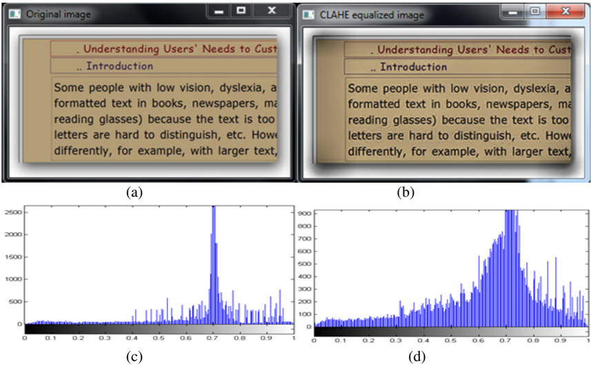
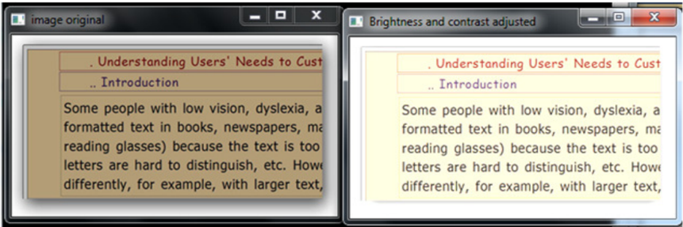
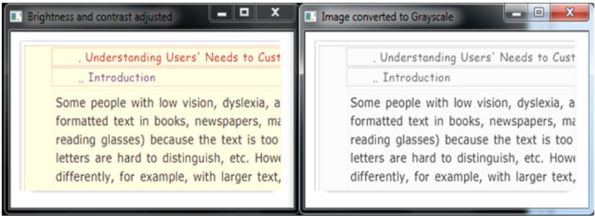
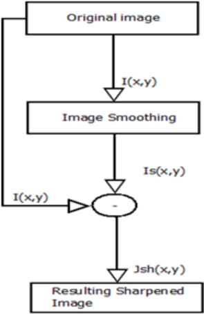
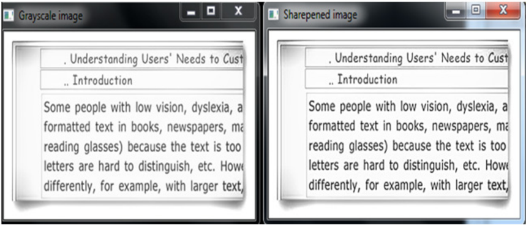
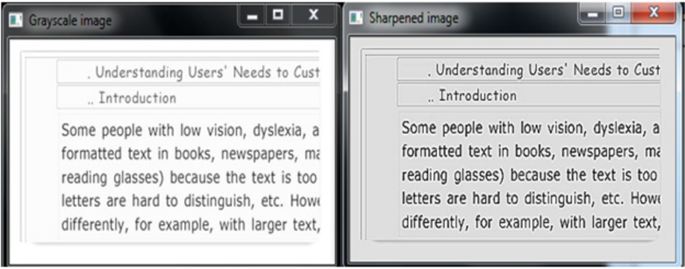
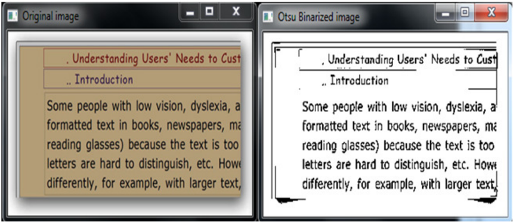
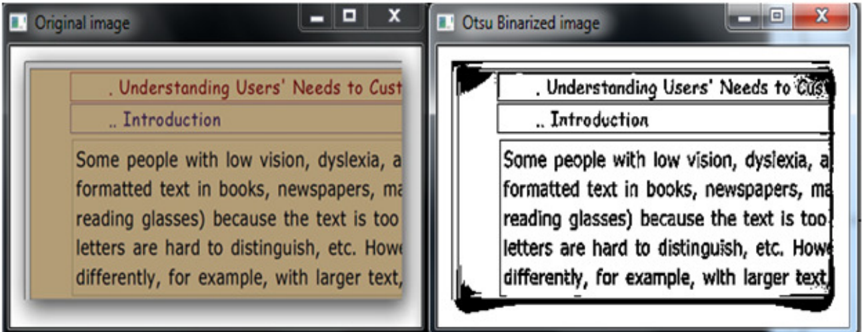
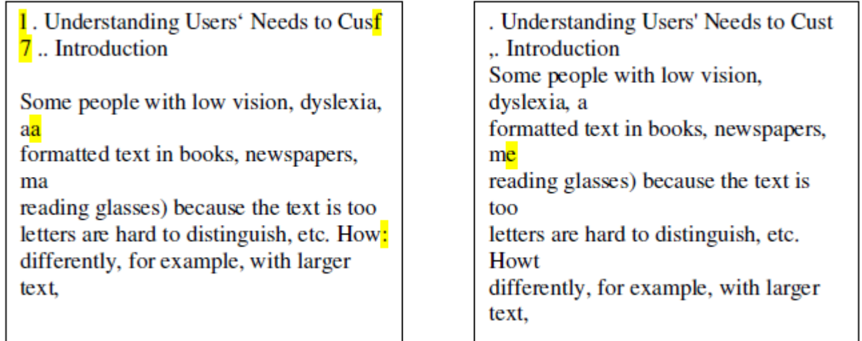

## OCR ACCURACY IMPROVEMENT ON DOCUMENT IMAGES THROUGH A NOVEL PRE-PROCESSING APPROACH

A. El Harraj 1 and N. Raissouni 2

1,2 RSAID Laboratory: "Remote sensing/Signal-image Processing &amp; Applied mathematics/Informatics/ Decision making". The National School for Applied Sciences of Tetuan. Univeristy of Abdelmalek Essaadi. BP. 2222. M'Hannech II. 93030. Tetuan. Morocco.

## ABSTRACT

Digital  camera  and  mobile  document  image  acquisition  are  new  trends  arising  in  the  world  of  Optical Character  Recognition  and  text  detection.  In  some  cases,  such  process  integrates  many  distortions  and produces  poorly  scanned  text  or  text-photo  images  and  natural  images,  leading  to  an  unreliable  OCR digitization. In this paper, we present a novel nonparametric and unsupervised method to compensate for undesirable document image distortions aiming to optimally improve OCR accuracy. Our approach relies on  a  very  efficient  stack  of  document  image  enhancing  techniques  to  recover  deformation  of  the  entire document image. First, we propose a local brightness and contrast adjustment method to effectively handle lighting  variations  and  the  irregular  distribution  of  image  illumination.  Second,  we  use  an  optimized greyscale conversion algorithm to transform our document image to greyscale level. Third, we sharpen the useful information in the resulting greyscale image using Un-sharp Masking method. Finally, an optimal global  binarization  approach  is  used  to  prepare  the  final  document  image  to  OCR  recognition.  The proposed  approach  can  significantly  improve  text  detection  rate  and  optical  character  recognition accuracy.  To  demonstrate  the  efficiency  of  our  approach,  an  exhaustive  experimentation  on  a  standard dataset is presented.

## KEYWORDS

Improve  OCR  accuracy,  optical  character  recognition,  Document  image  distortions,  text  detection, document image enhancing.

## 1. INTRODUCTION

Text based information systems have become increasingly important in almost all fields. In many situations (such as physical newspapers or old printed books), the source of the input text is not from an editable documents, but instead documents in their original paper form. In some cases imaging systems can be used to store and retrieve these documents through manually assigned key words, but full text access can be more effective as it will enable an automated process for storing, indexing and information retrieving with full access to all content key words. In order to get  full-text  content  from  paper  documents  Optical  Character  Recognition  (OCR)  is  used.  For scanned documents, OCR techniques can recognize words with a high level of accuracy and so

can  be  used  to  extract  and/or  index  information  for  further  information  retrieval.  However, automatically extracting text from document images produced by a digital camera or a mobile camera is  a  very  challenging  task.  Enabling  text  extraction  from  these  documents  with  a  high accuracy  will  provide  the  enabling  technology  for  a  number  of  applications  such  as  improved indexing,  online  searchable  documents,  indoor/outdoor  scene  understanding  [12],  and  text detection in natural images [13]. OCR technology offers better search and retrieval functionality than has been possible before [14]. As opposed to the classical scanned documents, text detection in document images produced by digital cameras and mobile cameras is a very challenging task, far from being completely solved. Complex backgrounds, uneven illumination, and presence of almost unwanted text fonts, sizes, and orientations pose great difficulties even to state-of-the-art text detection methods.

In this paper we focus on developing an approach that solves the problem of extracting text from document images. Our approach has several advantages. First, we propose to use a new model for illumination adjustment based on Contrast Limited Adaptive Histogram Equalization (CLAHE) to improve the contrast of the overall objects presents in the processed document image. Second, we  use  Luminance  algorithm  to  optimize  grayscale  conversion  for  text  extraction.  Third,  to enhance text details and edges we using Un-sharp masking filter.  As a final enhancement step we use  Otsu  Binarization  algorithm  as  a  powerful  method  for  Cleaning  and  whitening  document background. The proposed method is evaluated using a standard datasets available on [42].

The article is organized as follows. The proposed algorithm is presented in detail in Section 3, successively,  we  present  the  adopted  models  for  Illumination  adjustment,  contrast  conversion, text  details  sharpening  and  finally  document  background  cleaning  and  whitening.  Section  4 introduces  the  setup  environment  used  to  evaluate  our  approach  and  the  used  datasets,  and presents  the  evaluation  results  for  the  proposed  method.  Finally,  the  article  is  concluded  in Section 5.

## 2. RELATED WORK

Several  approaches  have  been  proposed  to  enhance  OCR  accuracy  and  text  detection.  Some approaches tried to correct OCR errors after detecting them. In [43] Kukich proposed to use a dictionary  or  n-gram  based  approaches  to  detect  OCR  errors  and  replace  them  with  the  most likely word in the dictionary using statistical measures. These approaches can reduce the overall OCR  error  rates  for  the  frequent  words  of  the  language,  but  it  is  likely  to  corrupt  correctly recognized words which are not in the dictionary for instance names and places. As an alternative Tong et  al  [44]  proposed  to  use  the  context  of  the  text  itself  to  correct  misrecognized  words. Nevertheless,  the  success  of  these  approaches  depends  on  the  language  models  and  trained dictionaries and can be useless if used on different corpora with different vocabularies. A more recent alternative is to combine multiple OCR outputs to locate and fix OCR errors automatically without using language specific information [45].

Other  approaches  are  based  on  edge  detection,  binarization,  connected-component  based  and texture-based methods [15] [16]. In [15], the authors demonstrate that best results were achieved using edge-based text detection compared to mathematical morphology and color-based character extraction. Other researchers tried to extract text from road signs [17], license plates [18], library books [19], web images [20], video frames [21] [24], natural image scenes [25][26][27] . Moalla et al. [22] developed a method to classify medieval manuscripts by different scripts in order to

assist paleographers. Ben Jlaiel et al. [23] suggested a strategy to discriminate Arabic and Latin modern scripts that can be  applied  also  to  ancient  scripts.  J.  Edwards  et  al.  [28],  on  the  other hand, developed a method based on a generalized Hidden Markov Model to improve accuracy on Latin  manuscripts  up  to  75%.  Other  researchers  proposed  to  improve  OCR  accuracy  through post-processing techniques on the output of a single or multiple OCR engines [29][30][31][32][45].  More  recently,  some  researchers  tried  to  get  good  OCR  accuracy  from document images [33] [34] by removing degradation problems, noise and improving the quality of the documents [35].

In  this  particular  work,  we  focus  on  improving  OCR  accuracy  by  pre-processing  the  input documents images. Contrary to the method proposed in [35], we propose to use a slightly more enhanced non parametric approach by improving the quality of the input document, thus using a tested combination of pre-processing techniques. This gives us the possibility to improve OCR accuracy  independently  to  any  trained  dictionary,  language  specific  information  or  language model.

## 3. THE PROPOSED METHOD

In  this  section,  we  exhaustively  detail  the  key  stages  in  our  approach,  explicitly,  Illumination adjustment,  grayscale  conversion,  Un-sharp  masking  and  optimized  adaptive  thresholding  for binarization.  We note that our method can be used with any kind of document images.

Figure 1: Diagram of different steps involved in the proposed approach.

Signal &amp; Image Processing : An International Journal (SIPIJ) Vol.6, No.4, August 2015

## 3.1. Illumination adjustment

The first step in our preprocessing stack is to improve the contrast of the overall objects presents in  the  processed  image.  For  that  raison,  we  will  use  CLAHE  [11]  as  a  powerful  contrast enhancement.

Contrast enhancement methods are not intended to increase or supplement the intrinsic structural information in an image but rather to improve the image contrast and hypothetically to enhance particular characteristics [11]. The input images are 8-bit grayscale images. We can process these images  directly.  But  there  is  a  slight  problem  with  that.  Black-to-White  transition  is  taken  as Positive  slope  (it  has  a  positive  value)  while  White-to-Black  transition  is  taken  as  a  Negative slope (It has negative value). So when we convert data, all negative slopes are made zero. And then we miss some edges. To bypass this problem, we convert data type to some higher forms like  16-bit,  64-bit  etc  (we  use  16-bit  grayscale  images),  process  it  and  then  convert  back  to original 8-bit.

## 3.1.1. Brightness Equalization

As a simple solution,  we can  convert  our  input  image  to  HSV  color  space  and  search  for  the brightness value using the V channel. The HSV color space has three components: hue, saturation and value.

HSV hue is a number in the interval [0, 360]. The hue of any neutral color--white, gray, or black-is set at 0°.

HSV Saturation measures how close a color is to the grayscale. S ranges from 0 to 1. White, gray, and black all have a saturation level of 0. Brighter, purer colors have saturation near 1.

HSV Value is the highest value among the three R, G, and B numbers. This number is divided by 255 to scale it between 0 and 1. In terms of perception, HSV Value represents how light, bright, or intense a color is. Value does not distinguish white and pure colors, all of which have V = 1. 'Value' is sometimes substituted with 'brightness' and then it is known as HSB [36] [37][38]. Unfortunately  this  approach  is  not  very  efficient  for  brithness  estimation.  A  more  efficient solution  would be the use of local bi-histogram equalization (LBHE) [40]. This approach was successfully  tested  for  the  motion  and  brightness  estimation  in  MPEG  system  [40].  When  we tested  this  approach,  we  concluded  that  this  approach  is  not  suited  for  document  images.  But instead,  we  use  the  decomposition  of  HSV  space  and  apply  Contrast  Limited  Histogram Equalization (CLAHE) [11] to the Value (V) for brightness equalization.

CLAHE is used as a very efficient adaptive histogram equalization that's has demonstrated to be successful for enhancement of low-contrast images such as portal films [11]. CLAHE is based on Adaptive Histogram Equalization (AHE) [11]. AHE calculate the histogram for the contextual region of a pixel. Then transform the resulting pixel's intensity to a value within the display range proportional to the pixel intensity's rank in the local intensity histogram but this process can over amplify the noise in the initial image. CLAHE overcome this issue by refining AHE by imposing a user specified maximum, ie, Clip Limit, to, the height of the local histogram, and thus on the maximum contrast  enhancement  factor.  The  enhancement  is  thereby  reduced  in  very  uniform areas of the image 'tiles' [11]. The resulting neighboring tiles are then stitched back seamlessly using  bilinear  interpolation,  which  prevent  over  enhancement  of  noise  and  reduce  the  edge-

Signal &amp; Image Processing : An International Journal (SIPIJ) Vol.6, No.4, August 2015

shadowing  effect  of  unlimited  AHE  (Figure  2).  Thus,  CLAHE  can  limit  the  noise  whereas enhancing the contrast [11].

In  our  case  we  use  a  Uniform  distribution  with  a  clip  limit  equal  to  4.  (Figure  2)  shows  an example of the produced enhanced grayscale image by applying the CLAHE enhancement. The clip limit can be obtained by: ß [11].

<!-- formula-not-decoded -->

Where α is clip limit factor, M region size, and N is grayscale value. The maximum clip limit is obtained for α =100.

The uniform CLAHE equalization is obtained by (2)

<!-- formula-not-decoded -->

Where:

- : computed pixel value

: Maximum pixel value

P/g4666f/g4667 :   Cumulative probability distribution

I /g2923/g2911/g2934

I /g2923/g2919/g2924 : Minimum pixel value

Let R, G and B three numbers in the interval [0, 255].

The Hue is defined as (3)

/g1

<!-- formula-not-decoded -->

We define m and M as (4)

/g1

<!-- formula-not-decoded -->

From (4) S and V can be defined as (5)

<!-- formula-not-decoded -->

First we split every channel separately and apply the CLAHE equalization to the V channel, and then we merge the color planes back into an HSV image. Finally we convert back the HSV image to RGB color space to continue the processing steps.

Let H, S, and V be the Hue, Saturation and Value in HSV color space.

From (5) we have:

/g1

<!-- formula-not-decoded -->

We define a new variable as (7)

<!-- formula-not-decoded -->

Then R, G and B can be calculated depending on the Hue values:

/g1

/g1

<!-- formula-not-decoded -->

/g1

<!-- formula-not-decoded -->

/g1

<!-- formula-not-decoded -->

/g1

<!-- formula-not-decoded -->

/g1

<!-- formula-not-decoded -->

<!-- formula-not-decoded -->

In  (figure  2)  we  give  the  resulting  enhanced  document  image  (the  image  is  from  [41])  when applying this procedure. As explained previously, we convert the RGB image to HSV color space using  (3),  (4)  and  (5)  equations.  Then  we  split  the  three  channels  separately.  We  apply  the CLAHE equalization to the V channel then we merge back the channels to obtain the resulting HSV enhanced document image. Finally we convert back the resulting image to the RGB color space to get the final image presented in the right of figure (2).

Signal &amp; Image Processing : An International Journal (SIPIJ) Vol.6, No.4, August 2015

Figure 2: (a)- the original image, (b)- the enhanced image using CLAHE equalization applied on V channel for HSV Color space, (c)- Histogram of V channel for the original image converted to HSV color space, (d)- Histogram of V channel for the enhanced image converted to HSV color space

## 3.1.2. Brightness estimation

We experiment within RGB, LAB, HSV and Y'UV color space. We found that Y'UV is more suitable for our case to estimate the brightness. Y'UV is a color space encoding color images or videos taking human perception into account. Luma (Y') is a more adapted channel for brightness estimation,  using  the  weighted  average  of  gamma-corrected  R,  G,  and  B,  based  on  their contribution to perceived luminance [38][39]. The relationship can found using the matrix bellow (14)

The relationship can found using the matrix bellow (14)

<!-- formula-not-decoded -->

Where

<!-- formula-not-decoded -->

R, G and B represent the red, green and blue channels respectively.

Y ′ is the Luma channel.

To  estimate  the  brightness  of  our  image  we  calculate  the  mean  average  value  of  the  Luma channel. We use this value to estimate the gain and bias for brightness and contrast adjustment in the next step.

## 3.1.3. Brightness and contrast adjustment

In  the  last  preprocessing  step  we  use  Otsu  Binarization  approach  [7].  As  a  limitation  of  this algorithm it's assumes uniform illumination (implicitly). In our case this not true because we are dealing with text-photos produced with digital cameras. To bypass this issue, we suggest using a strategy of brightness and contrast adjustment.

Many  approaches  have  been proposed for contrast enhancement  and  brightness control [9][10][11]  [40].  But  none  of  these  can  solve  the  problem  we  are  handling.  As  a  solution,  we propose  to  use  a  simple  yet  efficient  pixel  transform  to  create  an  operator  for  brightness  and contrast adjustment.

We multiply each input pixel with a parameter a&gt;0 called gain and add a second parameter ß called bias to the resulting multiplication.

a is used to control the contrast

ß is used to control the brightness.

The equation of this operation is given by (16):

<!-- formula-not-decoded -->

g/g4666x, y/g4667 is the resulting processed image.

f/g4666x, y/g4667 is the source image.

Where /g4666 x, y/g4667 indicates that the pixel is located in the -th row and -th column.

Using the  average  brightness  estimation  calculated  previously,  we  control  the  equation  (3),  so

We give the result of the proposed approach using:

that the Brightness /g2925/g2916/g3435/g2917 /g4666 /g2934,/g2935 /g4667 /g3439 ≤ 0.93 ( is an integer taking its values in [0, 100] ).

/g2009 = 1.4 /g1853/g1866/g1856 /g2010 = 50

Figure 3: Left: the original image. Right: the resulting image using the proposed approach for brightness and contrast adjustment.

## 3.2. Grayscale conversion

Image involving only intensity are called intensity, gray scale, or gray level images. Grayscale conversion is one of the simplest image enhancement techniques. The main reason why grayscale representations  are  often  used  for  extracting  descriptors  instead  of  operating  on  color  images directly  is  that  grayscale  simplifies  the  algorithm  and  reduces  computational  requirements. Indeed,  color  may  be  of  limited  benefit  in  many  applications  and  introducing  unnecessary information could  increase  the  amount  of  training  data  required  to  achieve  good  performance, that's the case for text recognition and identification. Many algorithms have been proposed for grayscale conversion. It' has been proven that not all color-to-grayscale algorithms work equally well [1], also it has been shown that Luminance algorithm perform better than other variations for texture based image processing [1]. In our case we use Luminance algorithm which is designed to match human brightness perception by using a weighted combination of the RGB channels in component-wise manner. Luminance is by far more important in distinguishing visual features [2]. Many algorithms exploit this property as for jpeg compression, where images are compressed in the YCbCr color space, and chrominance (Cb, Cr) are quantized and compressed more than luminance (Y) [3].

<!-- formula-not-decoded -->

Where

R is the red value

G is the green value

And B is the blue value

Luminance does not try to match the logarithmic nature of human brightness perception, but this is  achieved  to  an  extent  with  subsequent  gamma  correction  [4].  An  example  of  the  resulting image when applying this algorithm to convert images to grayscale level is given in (Figure 4)

Figure 4: Left: the resulting image after brightness and contrast adjustment. Right: the image produced using the Luminance algorithm for grayscale conversion.

## 3.3. Un-sharp masking:

This  step  aims  to  enhance  text  details  and  edges  by  using  Un-sharp  masking  filter.  Sharpness describes the clarity of detail in a photo (document text in our case), and can be a valuable tool for  emphasizing  texture.  Un-sharp  masking  filter  also  known  as  edge  enhancement  filter  is  a simple operator to enhance the appearance of detail by increasing small-scale acutance without creating additional detail [5][11]. The name was given because this operator improves details and other high frequency components in edge area via a process by subtracting a blurred version of the original image from the first one as illustrated in Figure 5.

Figure 5: Block diagram of the classical Un-sharp masking

The principle of UM is quite simple [5] [6].

First a blurred version of the original image is created (we use a Gaussian blurring filter in our case).  Then,  this  one  is  subtracted  from  the  original  image  to  detect  the  presence  of  edges, creating the unsharp mask. Finally this created mask is used to selectively increase the contrast of theses edges (fig. 4).

Mathematically this is represented by (18):

<!-- formula-not-decoded -->

I/g4666x, y/g4667 is the original image

Where /g1836 /g3046/g3035 /g4666 /g1876, /g1877 /g4667 is the sharpened resulting image

<!-- formula-not-decoded -->

I /g2929 /g4666x, y/g4667 is the smoothed version of f/g4666x, y/g4667 obtained by (19):

Where HPF is a height pass filter. Here we are using a Gaussian Kernel with 3x3 of size.

We give the result for Un-sharp masking using the parameters:

Amount=1.5;

Radius=0.5;

Threshold=0;

Figure 6: Left: the grayscale image produced in previous step. Right: the resulting sharpened image using Un-sharp Masking filter applied to the grayscale image in left.

As we can see in (Figure 6) Un-sharp masking is a very powerful method to sharpen images. But, too  much sharpening can also introduce undesirable effects such as "halo artifacts". These are visible as light/dark outlines or halos near edges (Figure 7). Halos artifacts become a problem when the light and dark over and undershoots become so large that they are clearly visible at the intended viewing distance [11].

Figure 7: Left: the grayscale image produced in previous step. Right: the resulting sharpened image using Un-sharp Masking filter applied to the grayscale image in left with parameters (Amount=3,Radius=2.12,threshold=0).

Signal &amp; Image Processing : An International Journal (SIPIJ) Vol.6, No.4, August 2015

## 3.4. Cleaning and whitening document background: Otsu thresholding

Thresholding is used to extract an object from its background by assigning an intensity value T (threshold)  for  each  pixel  such  that  each  pixel  is  either  classified  as  an  object  point  or  a background point.

Thresholding  creates  binary  images  from  grey-level  ones  by  turning  all  pixels  below  some threshold to zero and all pixels about that threshold to one. If g(x, y) is a threshold version of f(x, y) at some global threshold T, it can be defined as [8]

/g1

<!-- formula-not-decoded -->

Thresholding operation is defined as:

T = M[x, y, p/g4666x, y/g4667, f/g4666x, y/g4667]

Where T is the threshold f(x,y) is the gray value of point (x,y)

And p(x,y) is a local property of the point such as the average gray value of the neighborhood centered on point (x, y)

Converting  a  greyscale  image  to  monochrome  is  an  ordinary  image  processing  task.  Otsu's method  [7]  is  an  optimal  thresholding,  where  a  criterion  function  is  devised  that  yields  some measure of separation between regions. A criterion function is calculated for each intensity and that which maximizes this function is chosen as the threshold [7].

Otsu's  thresholding  chooses  the  threshold  to  minimize  the  intraclass  variance  (22)  of  the thresholded black and white pixels.

<!-- formula-not-decoded -->

w/g2919 are the probabilities of the two classes separated by a threshold   and σ /g2919 /g2870 are variances of these classes.

It's  based  on  a  very  simple  idea:  Find  the  threshold  that  minimizes  the  weighted  within-class variance. This turns out to be the same as maximizing the between-class variance (23).

<!-- formula-not-decoded -->

This is expressed in terms of class probabilities and class means µ

The class probability is computed from the histogram as

<!-- formula-not-decoded -->

w/g2919 /g2919 w/g2869 /g4666 t /g4667 t :

And the class mean µ /g2869 /g4666 t /g4667 is:

Where x/g4666i/g4667 is the value at the center of the  th histogram bin.

<!-- formula-not-decoded -->

<!-- formula-not-decoded -->

The goal is to find the threshold value where the sum of foreground and background spreads is at its minimum. (Figure 8) give the result of applying this algorithm of the previously preprocessed document.

Figure 8: Left: the grayscale sharpened image produced in previous step using parameters (Amount=1.5, Radius=0.5, Threshold=0). Right: the resulting binarized image using Otsu thresholding approach.

Otsu  algorithm  assumes  uniform  illumination  (implicitly),  so  the  bimodal  brightness  behavior arises from object appearance differences only. This is not always true, especially for documents scanned using a digital camera. This can lead to a low OCR accuracy where the whole document can  be  ignored  or  show  border  effects  (Figure  9).  We  can  see  that  the  produced  binarized document image is very noisy. As we have predicted for this algorithm to behave efficiently in presence  of  non  uniform  illumination,  we  solved  this  problem  using  a  linear  strategy  for brightness and contrast adjustment.

Figure 9: Left: the grayscale sharpened image produced in previous step using parameters (Amount=1.5, Radius=0.5, Threshold=0) without brightness and contrast adjustment. Right: the resulting binarized image using Otsu thresholding approach applied to the image in left.

## 4. PERFORMANCE EVALUATION

To demonstrate the efficiency of our proposed approach on improving the OCR accuracy, we test our method extensively against the standard database available on [42].

## 4.1. Test preparation

In this paper, the Open Computer Vision (OpenCV) is used as the implementation framework for Un-sharp masking and Otsu binrization, while we use our own implementation for Illumination adjustment, Brightness Equalization, Brightness estimation, Brightness and contrast adjustment, Grayscale conversion, HSV to RGB conversion and RGB to HSV conversion. Our approach is implemented using C++ language.

We test our approach on a PC with CPU: INTEL(R) PENTIUM(R) 2.13 GHZ dual core, RAM: 3GO and windows 7 Ultimate Edition (32 bits) as an operating system.

As a page-reader, we use the freely available software Tesseract-OCR (see table 1) bellow.

Table 1.  Characteristics of the page-reader used in this paper.

| Developper   | Version  Name   | Version  Number   | Platform   | Version  type   | License                                 |
|--------------|-----------------|-------------------|------------|-----------------|-----------------------------------------|
| Ray Smith    | tesseract-ocr   | 3.02.0.2          | Windows 7  | Release         | Freeware (Apache  License, Version 2.0) |

We use Tesseract-OCR on the original images without applying our approach, then we apply our approach  on  the  original  images  and  we  use  Tesseract-OCR  to  measure  the  difference  in performance.

Our  test  is  based  on  the  datasets  available  on  [42],  we  used  only  the  English  version  of  the available document images. Table 2 gives the details of the tested document images.

Table 2.  Test dataset details.

| Document ID   | Document  type   |   Page  Number |   Columns |   Words |   Characters |
|---------------|------------------|----------------|-----------|---------|--------------|
| AR00233       | Magazine         |             18 |         4 |     300 |         1516 |
| AR00235       | Magazine         |             32 |         3 |    1201 |         6087 |
| AR00270       | Proceedings      |            353 |         1 |     294 |         1367 |
| AR00319       | Journal          |             99 |         1 |     701 |         3775 |

## 4.2. Accuracy Test results:

In this step the text generated by the used page-reading system is matched with the correct text to determine the minimum  number  of  edit operations (character insertions, deletions, and

Signal &amp; Image Processing : An International Journal (SIPIJ) Vol.6, No.4, August 2015

<!-- formula-not-decoded -->

substitutions) needed to correct the generated text. This gives us the number of /g1857/g1870/g1870/g1867/g1870/g1871 . If there are /g1866 characters in the correct text, then the character accuracy is defined by (26)

<!-- formula-not-decoded -->

Table. 3 shows the number of errors for our tests and the corresponding character Accuracy

Table 3: Character accuracy using Original and processed document image

| Document ID   | Original image   | Original image   | Processed image   | Processed image   |
|---------------|------------------|------------------|-------------------|-------------------|
|               | Errors           | Accuracy         | Errors            | Accuracy          |
| AR00233       | 10               | 99.34%           | 0                 | 100%              |
| AR00235       | 60               | 99.01%           | 30                | 99.5%             |
| AR00270       | 312              | 77.17%           | 219               | 83.97%            |
| AR00319       | 89               | 97.64%           | 15                | 99.6%             |

As the table shows, we have tested our approach on articles from, Magazine, Proceedings and journal.

As we can see in table 2, the number of columns in a document image or document type does not have a big effect on the final result, but the quality of the input image does.

We  can  conclude  from  the  table  that  our  method  was  very  efficient  on  improving  the  OCR accuracy in all cases processed in this paper. The enhancement was from 2 percent to 6.8 percent.

We  give  the  resulting  output  text  for  the  processed  document  used  to  illustrate  the  approach presented in this paper.

## (a) Original image                                                                         (b) Processed image

As  we  can  see  in  this  output  text,  the  page  reader  was  able  to  recognize  all  characters  in  the processed document image except for one character, whereas it was not able to recognize five characters in the original document image.

## 5. CONCLUSIONS

We  have  presented  a  novel  approach  for  OCR  Accuracy  enhancing,  the  algorithm  combine effectively  a  stack  of  very  efficient  preprocessing  algorithm  and  adapt,  illumination  and brightness adjustment to our context of document image enhancement. The algorithm applies the Contrast Limited Adaptive Histogram Equalization separately on the Value of HSV color space to improve the Equalize the brightness of the original image. For Background cleaning, whitening and  noise  reducing  we  used  Otsu  Binarization  algorithm  as  an  aptimal  Global  thresholding algorithm.

Finally,  we  have  demonstrated  the  efficiency  of  our  approach  by  exhaustively  testing  it  on  a standards  dataset  [42],  and  presented  some  of  the  improvement  introduced  by  the  proposed approach on OCR Accuracy.

## ACKNOWLEDGEMENTS

This  research  was  supported  by  the  INVENTIVE  Technologies  laboratory 1 ,  a  part  of  the Creargie  MediaScan 2 in  CASABLANCA  Morocco  and  the  RSAID  Laboratory:  "Remote sensing/Signal-image  Processing  &amp;  Applied  mathematics/Informatics/  Decision  making".  The National  School for  Applied  Sciences  of  Tetuan  from  university  Abdelmalek  Essaâdi.  We  are grateful  to  Mr.  Dominique  Schwartz  the  CEO  of  INVENTIVE  Technologies  and  Creargie MediaScan  for  his  valuable  inputs,  to  Mme  Sanaa  Yassine  for  her  valuable  remarks  and guidance,  as  well  as  to  many  other  colleagues  at  RSAID  Laboratory  and  INVENTIVE Technologies laboratory for their very helpful discussions.

## REFERENCES

- [1] Kanan, Christopher, and Garrison W. Cottrell. (2012) 'Color-To-Grayscale: Does The Method Matter In Image Recognition?'. PLoS ONE 7.1: e29740. Web.
- [2] Grundland  M,  Dodgson  N,  (2007)  Decolorize:  Fast, contrast enhancing, color to grayscale conversion. Pattern Recognition 40: 2891-2896.
- [3] Cadik M, (2008) Perceptual evaluation of color-to-grayscale image conversions. Computer Graphics Forum 27: 1745-1754.
- [4] Pratt W, (2007) Digital image processing Wiley-Interscience.
- [5] N.  M.  Kwok,  H.  Y.  Shi,  G.  Fang,  and  Q.  P.  Ha,  (2012)  'Intensity-based  gain  adaptive  unsharp masking  for  image  contrast  enhancement,'  Image  and  Signal  Processing  (CISP),  5th  International Congress on, On page(s): 529-533.
- [6] F. Y. M. Lure, P. W. Jones and R. S. Gaborski, (1996) 'Multiresolution unsharp masking technique for mammogram image enhancement,' Proc. SPIE Med. Imag., pp.830 -839.
- [7] OTSU N, (1979) 'A Threshold Selection Method from Gray-level Histograms,' IEEE Trans. Syst. Man Cybern, 9: 62-66.
- [8] Rafael  C.  Gonzalez,  Richard  E.  Woods,  (2007)  'Digital  Image  Processing',  2nd  ed.,  Beijing: Publishing House of Electronics Industry,
- [9] Zimmerman, JB, SM Pizer, EV Staab, JR Perry, W McCartney, BC Brenton, (1988) 'An Evaluation of  the  Effectiveness  of  Adaptive  Histogram  Equalization  for  Contrast  Enhancement',  IEEE  Trans. Med. Imaging, 7(4): 304-312.

1 http://www.inventive-technologies.com/

2 http://www.creargie.com/

Signal &amp; Image Processing : An International Journal (SIPIJ) Vol.6, No.4, August 2015

- [10]  Suprijanto, Gianto, E. Juliastuti, Azhari, and Lusi Epsilawati, (2012) "Image Contrast Enhancement for Film-Based Dental Panoramic Radiography," in International Conference on System Engineering and Technology, Bandung, Indonesia.
- [11]  A. El Harraj and N. Raissouni, (2015): 'Toward Indoor and Outdoor Surveillance Using an Improved Fast Background Subtraction Algorithm' International Journal of Computer, Control, Quantum and Information Engineering, vol 9, no. 4, pp 595-600
- [12]  B. Gatos, I. Pratikakis, K. Kepene, and S. Perantonis, (2005) 'Text detection in indoor/outdoor scene images', Proc of CBDAR, pp. 127-132
- [13]  Y. Shao and C. Wang, (2011) 'Text Detection in Natural Images Based on Character Classification. Advances in Multimedia Information Processing', PCM 2010 Lecture Notes in Computer Science, Volume 6298/2011, 736-746
- [14]  I.  Z.  Yalniz  and  R.  Manmatha,  (2011)  'A  fast  alignment  scheme  for  automatic  ocr  evaluation  of books,' in ICDAR.
- [15]  N. Ezaki, M. Bulacu, L. Schomaker, (2004) 'Text Detection from Natural Scene Images: Towards a System for Visually Impaired Persons', Int.Conf. on Pattern Recognition (ICPR), vol. II, pp. 683686.
- [16]  J. Park, G. Lee, E. Kim, J. Lim, S. Kim, H. Yang, M. Lee, S. Hwang, (2010) 'Automatic detection and recognition of Korean text in outdoor signboard images', Pattern Recognition Letters.
- [17]  G. Piccioli, E. De Micheli, P.Parodi, and M. Campani, (1996): Robust method for road sign detection and recognition. Image and Vision Computing, 14:209-254
- [18]  S.K.  Kim,  D.W.  Kim  and  H.J.  Kim,  (1996).  A  recognitionof  vehicle  license  plate  using  a  generic algorithm based segmentation. Inproceedings of  ICIP, pages 661-664
- [19]  T. Gotoh, T. Toriu, S. Sasaki, and M. Yoshida, (1988). A flexible vision-based algorithm for book sorting system. IEEE Trans, PAMI, 10:393-399,
- [20]  J. Zhou, D. Lopresti, and T. Tasdisen, (1998). Finding text in color images. In Proceedings of SPIE, Document Recognition V, Pages 130-140
- [21]  R.  Lienhart  and  F.Stuber,  (1996).  Automatic  text  recognition  in  digital  videos.  In  Proceedings  of ACM Multimedia, Pages 11-20,
- [22]  I.  Moalla,  F.  Lebourgeois,  H.  Emptoz,  A.M.  Alimi,  (2006):  Image  Analysis  for  Paleography Inspection. Document Analysis Systems VII, 25-37
- [23]  M. Ben Jlaiel, S. Kanoun, A.M Alimi, R. Mullot, (2007): Three decision levels strategy for Arabic and  Latin  texts  differentiation  in  printed  and  handwritten  natures.  9th  International  Conference  on Document Analysis and Recognition, 1103-1107
- [24]  T.  Phan,  P.  Shivakumara  and  Chew  Lim  Tan,  (2009),  'A  Laplacian  Method  for  Video  Text Detection,' The 10th ICDAR, pp.66-70.
- [25]  C. Yi, and Y. Tian, (2011) 'Text String Detection from Natural Scenes by Structure-based Partition and Grouping,' IEEE Trans. on Image Processing
- [26]  X. Chen and A. L. Yuille, (2004) 'Detecting and reading text in natural scenes,' Proc. of IEEE Conf. on Computer Vision and Pattern Recognition, Vol. 2, pp. II-366 - II-373
- [27]  Y. Shao and C. Wang, (2011) 'Text Detection in Natural Images Based on Character Classification. Advances in Multimedia Information Processing', PCM 2010 Lecture Notes in Computer Science, Volume 6298/2011, 736-746
- [28]  J. Edwards, Y.W. Teh, D. Forsyth, R. Bock, M. Maire, G. Vesom, (2004): Making Latin Manuscripts Searchable using gHMM's. Advances in Neural Information Processing Systems, 17, 385-392.
- [29]  H.  Cecotti,  A.  Belaîd,  (2005):  Hybrid  OCR  combination  approach  complemented  by  a  specialized ICR  applied  on  ancient  documents.  8th  International  Conference  on  Document  Analysis  and Recognition, 7, 1045-1049
- [30]  A.M. Namboodiri, P.J. Narayanan,  C.V. Jawahar, (2007): On Using  Classical Poetry  Structure  for Indian Language  Post Processing. 9th International Conference on  Document  Analysis  and Recognition, IEEE Computer Society- Volume 02, 1238-1242
- [31]  C. Ringlstetter, K. Schulz, S. Mihov, K. Louka, (2005): The same is not the same - post correction of alphabet  confusion  errors  in  mixed-alphabet  OCR  recognition.  8th  International  Conference  on Document Analysis and Recognition, 1, 406-410

Signal &amp; Image Processing : An International Journal (SIPIJ) Vol.6, No.4, August 2015

- [32]  L.  Zhuang,  X.  Zhu,  (2005):  An  OCR  Post-processing  Approach  Based  on  Multi-knowledge.  9th International  Conference  on  Knowledge-Based  Intelligent  Information  and  Engineering  Systems, 346-352
- [33]  S. P. Chowdhury, S. Mandal, A. K. Das, and B. Chanda, (2007)  Segmentation of Text and Graphics from Document Images, Proc. of ICDAR, 619-623.
- [34]  We-Te  Chu  and  Fan  liu,  (2013)  Mathematical  formula  detection  from  heterogeneous  document Images, Proc. of CTAAI, 140-146.
- [35]  Kale,  P.,    Phade,  G.M.  ;  Gandhe,  S.T.  ;  Dhulekar,  P.A,  (2015)    'Enhancement  of  old  images  and documents  by  digital  image  processing  techniques'  International  Conference  on  Communication, Information &amp; Computing Technology (ICCICT) pages: 1-5
- [36]  B.  K.  Gunturk,  Y.  Altunbasak,  and  R.  M.  Mersereau,  (2002)  Color  plane  interpolation  using alternating projections, IEEE Trans. Image Process., vol. 11, no. 9, pp. 997-1013.
- [37]  X. Lin (2007), On modeling interchannel dependency for color image denoising, International Journal of Imaging Systems and Technology, vol. 17, no. 3, pp. 163-173.
- [38]  KD.Gennetten, (1993).RGB to CMYK conversion using 3D barycentric interpolation[J]. Proc. SPIE 1909, pp. 116-126.
- [39]  R  Lukac,  K  N  Plataniotios,  (2007).  Color  image  processing  :  methods  and  applications  [M].  New York : Taylor &amp; Francis Group, LLC.
- [40]  Hsueh-Yen  Yang,  Yu-Cheng  Fan  ;  Hen-Wai  Tsao,  (2008)  Algorithm  and  architecture  design  of adaptive brightness correction  for video application.  IEEE Transactions on Consumer Electronics. 54: 1858 - 1866.
- [41]  https://commons.wikimedia.org/wiki/File:German\_text\_example\_-\_Em\_sentence\_spaced\_-\_1907.jpg
- [42]  http://www.mediateam.oulu.fi/downloads/MTDB/
- [43]  K. Kukich, (1992) 'Technique for automatically correcting words in text,' ACM Computing Surveys, vol. 24, no. 4, pp. 377-439.
- [44]  X.  Tong  and  D.  A.  Evans,  (1996)  'A  statistical  approach  to  automatic  OCR  error  correction  in context,' in Fourth Workshop on Very Large Corpora (WVLC-96), pp. 88-100.
- [45]  I.  Z.  Yalniz  and  R.  Manmatha,  (2011)  'A  fast  alignment  scheme  for  automatic  ocr  evaluation  of books,' in ICDAR.

## AUTHORS

El  Harraj  Abdeslam  received  his  MS  degree  in  Telecommunications  and  Network engineering from the National School of Applied Sciences, Tangier, Morocco in 2008 and an MS degree in Entreprise management from University of Perpignan, French in 2010. Since 2012  he  is a PhD.  Student  in computer  vision with University Abdelmalek  Essaâdi,  Tangier-Tetuan,  Morocco.  From  2008  to  2012,  he  was  a Programmer Engineer with Creargie Maroc Company, Casablanca, Morocco. Currently, he is heading the Research and Development Department in the Company INVENTIVE  Technologies,  Casablanca,  Morocco  and  also  a  member  of  RemoteSensing &amp; Mobile-GIS Unit/Telecoms Innovation &amp; Engineering Research group.

Raissouni  Naoufal  received  the M.S.,  and  Ph.D.  degrees  in  physics from  the University  of  Valencia,  Spain,  in  1997,  and  1999,  respectively.  He  has  been  a Professor  of  physics  and  remote  sensing  at  the  National  Engineering  School  for Applied Sciences of the University Abdelmalek Essaadi (UAE) of Tetuan, since 2003. He  is  also  heading  the  Innovation  &amp;  Telecoms  Engineering  research  group  at  the UAE, responsible of the Remote Sensing &amp; Mobile GIS unit. His research interests include  atmospheric  correction  in  visible  and  infrared  domains,  the  retrieval  of

emissivity and surface temperature from satellite image, huge remote sensing computations, Mobile GIS, Adhoc networks and the development of remote sensing methods for land cover dynamic monitoring.