## Universidade de Brasília

Instituto de Ciências Exatas Departamento de Ciência da Computação

## Processamento de Linguagem Natural e Classificação de textos em Sistemas Modulares

Hugo Honda Ferreira

Monografia apresentada como requisito parcial para conclusão do Bacharelado em Ciência da Computação

Orientador Prof. Dr. Flávio de Barros Vidal

Brasília 2019


## Universidade de Brasília

Instituto de Ciências Exatas Departamento de Ciência da Computação

## Processamento de Linguagem Natural e Classificação de textos em Sistemas Modulares

Hugo Honda Ferreira

Monografia apresentada como requisito parcial para conclusão do Bacharelado em Ciência da Computação

Prof. Dr. Flávio de Barros Vidal (Orientador) CIC/UnB

Prof. Dra. Aleteia P. F. de Araujo Msc. Ana Paula G. S. de Almeida CIC/UnB PPMEC/UnB

Prof. Dr. Edison Ishikawa Coordenador do Bacharelado em Ciência da Computação

Brasília, 21 de Março de 2019

## Dedicatória

Dedico este trabalho e projeto ao meu irmão e melhor amigo, Iúri por toda a inspiração e companheirismo que nos fez e fará trilharmos muitas outras conquistas juntos. Ao meu pai Olímpio, minha mãe Luciane e minha irmã Isabela por todo o carinho, apoio e incentivo, dando uma base forte de amor, educação e união para chegar até aqui. Ao meu querido cachorro Spock, por deitar no meu pé e me fazer companhia enquanto eu estudava e programava.

## Agradecimentos

Agradeço ao meu orientador, Prof. Dr. Flávio de Barros Vidal, pela orientação e motivação durante o desenvolvimento desse trabalho e por mostrar como projetos acadêmicos realmente podem contribuir para transformar e ajudar a sociedade.

Aos meus grandes amigos Matheus Toguchi, Henrique Alvim, Paulo Coutinho, Rafael Ribeiro, Rafael Godoy e Victor Canovas por estarem sempre comigo, o time mais leal e importante da minha vida.

Aos amigos que fiz na Engenharia, mas principalmente aos que fiz ao mudar para Ciência da Computação, que me adotaram como se eu fosse do semestre deles e sempre me ajudaram e divertiram mesmo nos momentos mais complicados da graduação. Aos amigos que trabalhei junto, que muito me ensinaram, apoiaram e acompanharam nesta jornada.

Agradeço às entidades que me permitiram ter uma educação de excelência gratuita e realizar intercâmbio, que muito contribuíram para minha formação pessoal e profissional.

## Resumo

Sistemas modulares são implementados de forma que cada componente possa, individualmente, alcançar seus objetivos e contribuir para o correto funcionamento do sistema. A extração de dados textuais de fontes online pode ter alterações e depende de fornecer meios simples de modificar apenas módulos individuais responsáveis por estas tarefas, adequando-se às atualizações das fontes de dados sem afetar o resto do sistema. Os processos devem estar adequados à dinâmica do ambiente que estão disponíveis, visando escalabilidade e processamento de forma eficiente. O ambiente é estocástico e força os diferentes módulos a serem o mais completos e generalistas possível e seus componentes facilmente manuteníveis. A língua portuguesa também é um grande desafio, devido sua heterogeneidade, a diversidade de fontes e de modos de escrita, este trabalho busca encontrar padrões e metodologias de normalização e limpeza de dados que sirvam também a outros contextos e a outras línguas. Esse trabalho propõe uma arquitetura com diversos módulos que realizem tarefas de captura de dados textuais, fluxos de pré-processamento de dados, extração de entidades de textos em linguagem natural, estruturação e formatação dos dados, armazenamento destes dados de forma eficiente e resiliente, processamento de linguagem natural, classificação de textos em na língua portuguesa. Esta arquitetura se baseia em um fluxo completo que contempla a obtenção, processamento e análise dos dados. Este trabalho também visa aplicar suas metodologias sobre dados governamentais, buscando gerar insumos para a identificação de comportamento de cartéis de empresas em obras públicas por meio de técnicas de aprendizado de máquina e inteligência artificial. Experimentos indicam resultados positivos para a estruturação de uma arquitetura que possa extrair os dados e processá-los corretamente, trazendo os indícios necessários para uma análise de dados e oferecendo informações para aprofundar no campo de conhecimento de aplicação do processamento de linguagem natural em sistemas modulares e inteligentes.

Palavras-chave: Processamento de Linguagem Natural, Aprendizado de Máquina, Microserviços

## Abstract

Modular systems are implemented in a way that each component can individually achieve its objective and contribute to the correct functioning of the whole system. Extraction of textual data from online sources can have changes and the responsible modules for it should be easy to modify, adapting to updates in the data sources without affecting the rest of the system. Processes must be appropriate to the dynamics of the environment, aiming for scalability and efficient processing. The environment is stochastic and forces the different modules to be as complete and general as possible and their components easily maintainable. The Portuguese language is also a great challenge, due to its heterogeneity, diversity of sources and different modes of writing, this work seeks to find standards and methodologies for normalization and data cleansing that also serve other contexts and other languages. This work proposes an architecture with several modules that perform tasks of textual data capture, data preprocessing workflows, extraction of natural language text entities, structuring and formatting of data, efficient and resilient data storage, processing of natural language, classification of texts in Portuguese language. This architecture is based on a complete workflow that contemplates obtaining, processing and analyzing the data. This work also aims to apply its methodologies on government data, seeking to generate inputs for the identification of behavior of cartels through techniques of machine learning and artificial intelligence. Experiments indicate positive results for the structuring of an architecture that can extract the data and process it correctly, bringing the necessary tools for a data analysis and providing information to deepen in the field of application knowledge of natural language processing into modular and intelligente systems.

Keywords: Natural Language Processing, Machine Learning, Microservices

## Sumário

| 1 Introdução          | 1 Introdução                                  | 1 Introdução                          | 1   |
|-----------------------|-----------------------------------------------|---------------------------------------|-----|
| 1.1                   | Contextualização . . .                        | . . . . . .                           | 2   |
| 1.2                   | Objetivos . . . . . . . . . . . . .           | Objetivos . . . . . . . . . . . . .   | 4   |
|                       | 1.2.1                                         | Objetivo Geral . . . . . .            | 4   |
|                       | 1.2.2                                         | Objetivos Específicos . . .           | 4   |
|                       | 1.2.3                                         | Estrutura deste trabalho .            | 5   |
| 2 Referencial Teórico | 2 Referencial Teórico                         | 2 Referencial Teórico                 | 6   |
| 2.1                   | Captura dos Dados                             | . . . . . . .                         | 6   |
| 2.1                   | 2.1.1                                         | Rastreamento de Informações           | 7   |
| 2.1                   | 2.1.2                                         | Raspagem de Dados . . .               | 7   |
| 2.2                   | Estruturação dos dados . .                    | . . .                                 | 8   |
| 2.3                   | Corpus . . . . . . . . . . .                  | . . .                                 | 8   |
| 2.4                   | Léxico . . . . . . . . . . . . . .            | .                                     | 9   |
| 2.5                   | Expressões Regulares .                        | . . . . .                             | 10  |
| 2.6                   | Geração de Tokens . . .                       | . . . . .                             | 12  |
| 2.7                   | Redução a Stem . . . .                        | . . . . .                             | 12  |
| 2.8                   | Stop words . . . . . .                        | . . . . . .                           | 13  |
| 2.9                   | Representação de Dados Textuais               | Representação de Dados Textuais       | 13  |
|                       | 2.9.1                                         | Bag of Words . . . . . . .            | 14  |
|                       | 2.9.2                                         | Tf-idf . . . . . . . . . . .          | 14  |
|                       | 2.9.3                                         | Word Embedding . . . . .              | 16  |
| 2.10                  | Clusterização . . .                           | . . . . . . . .                       | 17  |
|                       |                                               |                                       | 17  |
| 2.11                  | 2.10.1 K-means .                              | . . . . . . . .                       |     |
|                       |                                               |                                       | 18  |
|                       | 2.11.1 Aprendizagem Supervisionada . . 2.11.2 | Aprendizagem Não Supervisionada       | 18  |
|                       | 2.11.3 Aprendizagem Por Reforço . . .         | 2.11.3 Aprendizagem Por Reforço . . . | 18  |

| 2.12         | Algoritmos de Aprendizagem .                                       | . . . . . . . . . . . . . . . . . . . . . . . . . 19                                                  |
|--------------|--------------------------------------------------------------------|-------------------------------------------------------------------------------------------------------|
|              | 2.12.1 Florestas Aleatórias ( Random Forests                       | ) . . . . . . . . . . . . . . . . . 19                                                                |
|              | 2.12.2 Regressão Logística ( Logistic Regression                   | ) . . . . . . . . . . . . . . . . 19                                                                  |
|              | 2.12.3 Máquina de Suporte Vetorial ( Suport Vector Machine         | ) . . . . . . . . 20                                                                                  |
| 2.13         | Avaliação de Modelos de Aprendizagem                               | . . . . . . . . . . . . . . . . . . . . 20                                                            |
| 2.14         | Capacidade de Generalização dos Modelos .                          | . . . . . . . . . . . . . . . . . . 21                                                                |
| 2.15         | Micro-serviços . . . . . . . . . .                                 | . . . . . . . . . . . . . . . . . . . . . . . . 23                                                    |
| 3            | Projeto Deep-Vacuity                                               | 24                                                                                                    |
| 3.1          | Histórico e Motivação . . . . . .                                  | . . . . . . . . . . . . . . . . . . . . . . . . 25                                                    |
| 3.2          | Atividades em Desenvolvimento                                      | . . . . . . . . . . . . . . . . . . . . . . . . 27                                                    |
| 3.3          | Resultados Esperados . . . . . .                                   | . . . . . . . . . . . . . . . . . . . . . . . . 28                                                    |
| 4            | Metodologia                                                        | 29                                                                                                    |
| 4.1          | Fluxo de Trabalho . . . . . . . .                                  | . . . . . . . . . . . . . . . . . . . . . . . . 29                                                    |
| 4.2          | Níveis de Granularidade dos Dados .                                | . . . . . . . . . . . . . . . . . . . . . . 31 33                                                     |
| 4.3          | Arquitetura do Sistema . . . . .                                   | . . . . . . . . . . . . . . . . . . . . . . . .                                                       |
| 5            | Desenvolvimento da Arquitetura                                     | 39                                                                                                    |
| 5.1          | Captura de Dados . . . . . . . .                                   | . . . . . . . . . . . . . . . . . . . . . . . . 39                                                    |
|              | 5.1.1 Dados em PDF . . . . . .                                     | . . . . . . . . . . . . . . . . . . . . . . . . 40                                                    |
|              | 5.1.2 Dados em HTML . . . . .                                      | . . . . . . . . . . . . . . . . . . . . . . . . 42                                                    |
| 5.2          | Rotulação dos Dados . . . . . .                                    | . . . . . . . . . . . . . . . . . . . . . . . . 42                                                    |
| 5.3          | Pré-processamento . . . . . . . .                                  | . . . . . . . . . . . . . . . . . . . . . . . . 43                                                    |
| 5.4          | Extração de Entidades . . . . . .                                  | . . . . . . . . . . . . . . . . . . . . . . . . 44                                                    |
| 5.5          | Treinamento dos modelos . . . .                                    | . . . . . . . . . . . . . . . . . . . . . . . . 45                                                    |
| 5.6          | Contêiners . . . . . . . . . . . .                                 | . . . . . . . . . . . . . . . . . . . . . . . .                                                       |
|              |                                                                    | 45                                                                                                    |
| 5.7          | Sistemas Distribuídos . . . . . .                                  | . . . . . . . . . . . . . . . . . . . . . . . . 46                                                    |
| 6 Resultados | Captura de Dados                                                   | 47 47                                                                                                 |
| 6.1 6.4      | . . . . . . . .                                                    | . . . . . . . . . . . . . . . . . . . . . . . .                                                       |
| 6.2 6.3      | Segmentação de Texto . . . . . . Extração de Entidades . . . . . . | . . . . . . . . . . . . . . . . . . . . . . . . 50 . . . . . . . . . . . . . . . . . . . . . . . . 51 |
|              | Classificação de dados textuais .                                  | . . . . . . . . . . . . . . . . . . . . . . . . 53                                                    |
| 6.5          | Execução do projeto . . . . . . .                                  | . . . . . . . . . . . . . . . . . . . . . . . . 53                                                    |
| 7 Conclusões |                                                                    | 54                                                                                                    |
|              | Referências                                                        | 57                                                                                                    |

## Lista de Figuras

|   2.1 | Tradução da representação visual de casos de underfitting , adequação ideal do modelo e overfitting - extraída do livro " Goodfellow, Ian, et al. Deep learning. Vol. 1. Cambridge: MIT press, 2016 " [1]. . . . . . . . . . . . . .   |   22 |
|-------|----------------------------------------------------------------------------------------------------------------------------------------------------------------------------------------------------------------------------------------|------|
|  4.1  | Tradução do Workflow Google [2] . . . . . . . . . . . . . . . . . . . . . . .                                                                                                                                                          |   29 |
|  4.2  | Exemplo de Publicação DOU. . . . . . . . . . . . . . . . . . . . . . . . . .                                                                                                                                                           |   31 |
|  4.3  | Exemplo de início de Órgão DOU. . . . . . . . . . . . . . . . . . . . . . . .                                                                                                                                                          |   31 |
|  4.4  | Exemplo de início de Capítulo DOU. . . . . . . . . . . . . . . . . . . . . .                                                                                                                                                           |   32 |
|  4.5  | Exemplo de Página DOU. . . . . . . . . . . . . . . . . . . . . . . . . . . .                                                                                                                                                           |   32 |
|  4.6  | Arquitetura da primeira fase do projeto Deep-Vacuity . . . . . . . . . . . . .                                                                                                                                                         |   33 |
|  4.7  | Captura das URL s e dos dados. . . . . . . . . . . . . . . . . . . . . . . . .                                                                                                                                                         |   35 |
|  4.8  | Geração das publicações e Pré-Processamento dos dados. . . . . . . . . . .                                                                                                                                                             |   36 |
|  4.9  | Base de Dados e outros módulos. . . . . . . . . . . . . . . . . . . . . . . .                                                                                                                                                          |   37 |
|  4.1  | Extração de Entidades. . . . . . . . . . . . . . . . . . . . . . . . . . . . . .                                                                                                                                                       |   37 |
|  4.11 | Treinamento de modelos de aprendizagem. . . . . . . . . . . . . . . . . . .                                                                                                                                                            |   38 |
|  5.1  | Arquitetura do extrator de dados . . . . . . . . . . . . . . . . . . . . . . .                                                                                                                                                         |   39 |
|  5.2  | Resultado da pesquisa Avançada DOU (http://pesquisa.in.gov.br/imprensa/).                                                                                                                                                              |   40 |
|  5.3  | Pesquisa Avançada DOU (http://pesquisa.in.gov.br/imprensa/). . . . . . .                                                                                                                                                               |   41 |
|  5.4  | Exemplo de extração de entidades de um texto em linguagem natural. . . .                                                                                                                                                               |   45 |
|  6.1  | Página web de publicação. . . . . . . . . . . . . . . . . . . . . . . . . . . .                                                                                                                                                        |   48 |
|  6.2  | Dados extraídos e estruturados da publicação. . . . . . . . . . . . . . . . .                                                                                                                                                          |   48 |
|  6.3  | Exemplo de um bloco de URL s extraído. . . . . . . . . . . . . . . . . . . .                                                                                                                                                           |   49 |
|  6.4  | Exemplo de diários extraídos do PDF , convertidos em texto e estruturados.                                                                                                                                                             |   49 |
|  6.5  | Exemplo de segmentação dos dados de uma página do diário em PDF . . . .                                                                                                                                                                |   50 |
|  6.6  | Exemplo de extração de entidades de uma publicação. . . . . . . . . . . . .                                                                                                                                                            |   51 |
|  6.7  | Exemplo de partes contratantes mais frequentes. . . . . . . . . . . . . . . .                                                                                                                                                          |   52 |
|  6.8  | Exemplo de partes contratadas mais frequentes. . . . . . . . . . . . . . . .                                                                                                                                                           |   52 |

## Lista de Tabelas

|   2.1 | Corpus exemplo. . . . . . . . . . . . . . . . . . . . . . . . . . . . . . . . . .                                                                   |   15 |
|-------|-----------------------------------------------------------------------------------------------------------------------------------------------------|------|
|   2.2 | Frequência de cada palavra no Corpus exemplo da Tabela 2.1. . . . . . . . .                                                                         |   15 |
|   2.3 | Matriz de frequência - quantidade de aparições de determinada palavra em determinado documento do Corpus , exemplo da Tabela 2.1. . . . . . . . . . |   15 |
|   2.4 | Matriz de valores binários - presença ou não de determinada palavra em determinado documento do Corpus , exemplo da Tabela 2.1. . . . . . . . . .   |   15 |
|   2.5 | Matriz Tf-idf com base no Corpus exemplo da Tabela 2.1. . . . . . . . . . .                                                                         |   16 |
|   2.6 | Exemplo de matriz de confusão para um problema de duas classes . . . . . .                                                                          |   21 |

## Capítulo 1 Introdução

Gottfried Wilhelm Leibniz [3], matemático e filósofo alemão, percebeu, por volta do ano 1700, a conexão íntima entre a forma e o conteúdo da linguagem e as operações da mente humana. Ele acreditava que as línguas são o melhor espelho da mente humana, uma análise precisa do significado das palavras nos diria mais que tudo sobre as operações do entendimento [4].

Estes pensamentos trouxeram a ideia de uma 'linguagem universal', uma linguagem artificial composta por símbolos que representasse conceitos por meio de regras lógicas e tornasse sua manipulação completamente válida. Leibniz acreditava que tal linguagem representaria perfeitamente os processos do raciocínio humano inteligível. Com esta visão ele se aproximou de antecipar o que é chamado de Inteligência Artificial. De acordo com Leibniz, a linguagem natural, apesar de ter poderosos recursos de comunicação, muitas vezes torna o raciocínio obscuro, já que não representa perfeitamente os pensamentos inteligíveis. Assim, muitas vezes é difícil raciocinar por meio da linguagem natural, 'já que é cheio de inúmeros equívocos' [5]. Desta forma, o campo do Processamento de Linguagem Natural (PLN) busca converter a linguagem natural humana em uma representação formal, de forma que se torne mais facilmente manipulável por máquinas [6].

Programas de computador geralmente leem e emitem linguagens especializadas, projetadas para permitir uma análise eficiente e sem ambiguidade por meio de programas simples. Um código fonte de um programa de computador deve interpretar e executar precisamente o que está descrito nele [7].

Textos em linguagem natural (dissertações, transcrições de fala, letras de músicas, poemas etc.) são muitas vezes escritos de forma ambígua não padronizada, dificultando uma descrição formal do seu conteúdo. Por consequência, o processamento deste conteúdo por computadores se torna mais difícil. Muitas aplicações de Processamento de Linguagem Natural (PLN) são baseadas em modelos de linguagem que definam uma distribuição de probabilidade sobre sequências de palavras, caracteres ou bytes em uma linguagem natu-

ral [1], buscando padrões e indicativos que auxiliem na compreensão sintática e semântica do texto.

Estudos em PLN e Aprendizado de Máquina convergem cada vez mais em decorrência das demandas atuais, há diariamente uma enorme geração de dados (não-estruturados, semi-estruturados e estruturados) [8]. Atualmente, a análise de dados em Linguagem Natural utiliza diversos recursos para obtenção, interpretação, segmentação e categorização dos textos. Estas demandas têm contribuído para o progresso de sistemas automáticos e soluções inteligentes na análise de textos e são utilizados em diversos projetos recentes com alguns exemplos em língua portuguesa [9].

Algoritmos de aprendizado de máquina buscam criar automaticamente classificadores de texto por meio de um processo indutivo, utilizando conjuntos de documentos já identificados como determinadas classes que contenham as características das categorias de interesse. Desta forma, o modelo é treinado com uma referência de conhecimento e se torna capaz de rotular diferentes tipos de textos de acordo com o que já foi apresentado a ele. Esta abordagem traz uma precisão comparável à alcançada por especialistas humanos, economizando consideravelmente força de trabalho que por diversas vezes é escassa, diminuindo a necessidade de intervenção dos detentores do conhecimento de caso [10].

A categorização de textos geralmente utiliza técnicas especializadas no processamento de dados sequenciais. Em muitos casos, escolhe-se considerar a linguagem natural como uma sequência de palavras, em vez de uma sequência de caracteres ou bytes individuais. Como o número total de palavras possíveis é tão grande, os modelos de linguagem baseados em palavras devem operar em um espaço discreto extremamente denso. Diversas estratégias foram desenvolvidas para tornar os modelos desse espaço eficientes, tanto no sentido computacional quanto no estatístico [1].

Este trabalho se propõe a agregar o Processamento de Linguagem Natural a estratégias de Análise de Dados e Aprendizado de Máquina em uma arquitetura computacional única, utilizando tecnologias modernas para suprir a realidade descrita na contextualização a seguir.

## 1.1 Contextualização

A partir das particularidades e capacidades de soluções baseadas em PLN e IA, percebe-se uma enorme aplicabilidade destas técnicas a setores que têm como gargalo o processamento de massivas quantidades de texto. A ciência sobre estes dados deve levar em conta solucionar o que seria inviável ser analisado apenas por humanos, não por dificuldade intelectual, mas por volume de dados e por heterogeneidade nas metodologias de análise. Uma abordagem utilizando PLN e IA pode evitar que pessoas realizem processos repetiti-

vos mecanicamente, evitando falhas por fadiga ou suprindo a falta de contingente humano especializado para este tipo de tarefa. Esta abordagem pode também, estatisticamente, evitar viés, já que cada que humano realiza uma análise de texto o faz a partir de seu entendimento próprio sobre o que está escrito, gerando influência pessoal sobre a interpretação de um texto em contextos que a precisão de sua classificação pode ser crucial. Assim, percebe-se este cenário na maioria dos dados governamentais públicos brasileiros que são gerados diariamente.

Governos em geral possuem uma enorme quantidade de informações para uso em suas operações internas e prestação de serviços. Muitos dados devem ser produzidos, arquivados e divulgados por determinação legal. Infelizmente, muitos destes dados ainda são publicados de forma custosa ou inacessíveis às partes interessadas, seja por incompatibilidade de tecnologias, falta de documentação, falta de padronização, formatação inadequada e tecnologias ultrapassadas. Desta forma, pode-se encontrar muitas dificuldades de acesso às informações de interesse sem as ferramentas adequadas para obtê-las. Os dados fornecidos pelo governo brasileiro têm uma enorme heterogeneidade de formatações e não há unanimidade nas definições em escala federal, limitando a disponibilização eficiente dos dados apenas a órgãos que têm este interesse e mesmo assim seu tipo de dado acaba divergindo de seus semelhantes, como pode-se verificar no Portal Brasileiro de Dados Abertos [11].

Junto a esta dificuldade de obter dados abertos, ainda existem alguns desafios relacionados a dados textuais. Trabalhar com dados em linguagem natural envolve, em geral, lidar com informações de diversas fontes, vários tipos de formatos de arquivo diferentes, enorme variedade de estruturas, mudança de nomenclaturas ao longo dos anos, erros gramaticais ou de digitação, variações em siglas, invenção de novas abreviações e geração de ambiguidades. Tudo isso traz uma maior dificuldade no processamento de linguagem natural, sempre haverá fenômenos particulares em cada texto.

Diante das restrições na obtenção dos dados e dificuldades de interpretação automatizada, as arquiteturas de processamento clássicas são limitadas (embora amplamente adotadas), cada etapa é realizada com base em critérios de decisão particulares. Desta forma, sistemas baseados em micro-serviços e escaláveis se apresentam como soluções mais flexíveis, nos quais diversos módulos podem operar sem a dependência sequencial dos outros e podem ser evoluídos de forma incremental de acordo com as necessidades do projeto, além de facilitar a manutenção, implementação e implantação isolada de cada módulo.

Devido as dificuldades com a obtenção e processamento constante dos dados (segmentação e interpretação de dados textuais) utilizando apenas uma arquitetura única e estática, a modelagem deste projeto foi pensada de forma a envolver a cooperação entre

vários módulos especialistas que se comuniquem para lidar com diversos desafios diferentes em prol de um resultado final interessante. O acoplamento de novos módulos se torna mais simples com uma arquitetura distribuída, e há a possibilidade de treinamento de novos modelos de aprendizado de máquina para cada nova tarefa de classificação, segmentação ou interpretação de texto.

## 1.2 Objetivos

## 1.2.1 Objetivo Geral

O objetivo geral deste projeto é modelar e implementar uma arquitetura modular e escalável, guiada por um fluxo de obtenção, formatação, processamento e armazenamento de dados textuais.

A obtenção de dados deve ser flexível e adaptável a diferentes tipos de fontes de dados textuais. A formatação deve ser organizada e tecnologicamente agnóstica, legível e compatível com diversos tipos de tecnologia. O processamento dos dados deve seguir as regras de negócio e premissas previamente definidas. O armazenamento dos dados deve ser confiável e resiliente. Cada uma das tarefas deste fluxo deve ser implementada de forma modular, capaz de se comunicar com as demais e compôr um sistema completo e escalável.

Esta arquitetura também deve englobar a geração de insumos estruturados para a análise de dados, extrair informações e obter de conhecimentos mais aprofundados sobre os dados textuais. A partir do momento que os resultados da análise dos dados for bem sucedida, módulos de inteligência irão replicar o comportamento de interpretação dos dados e também poderão ser acoplados à arquitetura.

## 1.2.2 Objetivos Específicos

Os objetivos específicos deste trabalho são modelar e implementar uma arquitetura que contemple algoritmos capazes de realizar as seguintes tarefas:

- Extrair de dados textuais em língua portuguesa de diários do Diário Oficial da União (DOU) [12] disponíveis em diversas fontes públicas online da Imprensa Nacional e disponibilizados em diferentes formatos de arquivos e formatações de texto;
- Converter dos dados dos diários oficiais em um padrão textual unificado;
- Segmentar dos dados textuais;
- Formatar e padronização eficiente dos dados;

- Armazenar e disponibilização dos dados para consulta por outros módulos do sistema.
- Tratar e processar dos dados;
- Extrair de entidades e geração de insumos para alimentar análises de dados;
- Gerar de correlações entidades extraídas e cruzar de dados textuais;
- Gerar de modelos de extração de informação e conhecimento a partir da análise dos dados;
- Gerar de modelos inteligentes para classificação de dados textuais;
- Identificar fraudes e anomalias em dados sobre o DOU, a partir dos insumos obtidos e de conhecimentos de regras de negócio.

Toda esta abordagem deve ser realizada de forma modular, possibilitando assim maior escalabilidade do sistema completo.

## 1.2.3 Estrutura deste trabalho

No Capítulo 2 serão apresentados os conceitos teóricos e técnicas que nortearam este trabalho, principalmente as bases teóricas e os algoritmos que são utilizados recentemente para o processamento de linguagem natural. No Capítulo 3 serão apresentados os detalhes básicos do framework principal que guia o desenvolvimento deste estudo e sua contextualização. O Capítulo 4 descreve a metodologia de trabalho utilizada, as premissas de desenvolvimento e engenharia do projeto. O Capítulo 5 faz uma análise da parte prática, demonstrando como foi feito o desenvolvimento dos principais módulos do projeto. O Capítulo 6 apresenta os resultados obtidos, incluindo exemplos de aplicação tirados de uma amostragem da totalidade dos dados obtidos. O Capítulo 7 conclui o trabalho e revisa os tópicos abordados, as decisões tomadas para a construção projeto e comenta trabalhos futuros.

## Capítulo 2

## Referencial Teórico

Neste trabalho serão utilizadas diversas técnicas muito disseminadas e consolidadas em PLN. Este trabalho foi projetado em uma arquitetura que busca modularizar suas atividades e orquestrar as interações entre os módulos desenvolvidos. Esta abordagem distribui as tarefas dos sistema em entidades autônomas, que sejam capazes de agir de acordo com suas funções, percepção do ambiente, estado atual e interações com os outros módulos. A extração e a geração da base de dados é realizada por estes serviços de forma automatizada, outros serviços recebem a sinalização da atualização da base de dados e realizam seu pré-processamento. Em seguida, os dados já em seu formato adequado são utilizados para o treinamento e retroalimentação de modelos de aprendizado de máquina ou de decisão de acordo com as regras de negócio.

## 2.1 Captura dos Dados

Os dados de interesse estão disponíveis em servidores online de forma dispersa em vários endereços diferentes, podendo ser acessados por diferentes ferramentas e oferecidos em diversos formatos. Desta forma, foi necessário visualizar uma maneira de extrair metodicamente tanto os dados já existentes quanto manter o rastreamento dos novos dados que estão sendo publicados diariamente. Para o objetivo deste projeto, ainda não existe uma base de dados estruturada, consolidada e pública. Desta forma, foi imprescindível a geração de uma base de dados para este caso estudado.

Há vários desafios na implementação de um mecanismos de captura de dados, deve-se evitar a sobrecarga do website ou links da rede à medida que realizam seus processamentos. É importante também decidir com que frequência revisitar as páginas que já foram visitadas, a fim de manter a base de dados atualizada e completa. Outra questão importante é o tratamento de erros, por ser um sistema dependente de dados disponíveis online , é necessário verificar de forma concreta o sucesso na obtenção dos dados e, no caso

de algum erro ou falha, fazer registro desta falta e criar uma rotina para corrigi-la assim que possível.

Internamente, o sistema deve ser pensado sob suas limitações de armazenamento e de processamento. Assim os rastreadores e os raspadores de dados devem estipular como priorizar as informações que farão a composição deste grande volume de dados, decidindo cuidadosamente quais são as informações que realmente importam para serem retidas durante o processo [13].

## 2.1.1 Rastreamento de Informações

Técnicas de rastreamento de informações ( crawling ) são comumente utilizadas por mecanismos de busca e extratores de dados. Utilizando um endereço ( URL ) base, que indique uma página inicial, o rastreador ( crawler ) extrai todos as endereços nele e os adiciona para uma fila de URL s a serem verificados. Então, o crawler obtém as URL s da fila (em alguma ordem de prioridade definida) e prossegue extraindo iterativamente os dados contidos em uma determinada plataforma online . Desta forma, pode-se obter as informações de interesse da plataforma sem o custo de análise humana constante. Esta estratégia permite um reconhecimento estrutural da plataforma de forma automatizada, e oferece a possibilidade de extração dos dados contidos em cada endereço como uma estrutura hierárquica ou um grafo de relações [14].

Esta estratégia, utilizada para a mineração de HTML s, deve avaliar a relevância de um documento ao foco de interesse e identificar as páginas relevantes dentro das URL s que estiver explorando. O ideal é realizar um rastreamento focado, com diferentes níveis de especificidade e sem perder o caminho de interesse, tornando-se robusto contra ruídos [15].

## 2.1.2 Raspagem de Dados

Técnicas de raspagem de dados ( scraping ) são necessárias para uma extração automática eficiente dos conjuntos de dados estruturados (principalmente HTML ) e seu conteúdo. Para a captura efetiva de informações, deve-se identificar onde estão disponíveis dados contendo as informações desejadas, qual a estrutura de armazenamento destes dados, quais são os segmentos relevantes destes dados e quais são as ferramentas necessárias para realizar sua extração [14].

Um Web Scraper acessa páginas web, encontra elementos de dados especificados na página e os extrai, essencialmente imitando a operação de um usuário em busca de informações em um navegador, automatizando e acelerando este acesso. Para se realizar os procedimentos de extração, deve-se analisar a viabilidade em paralelizar seus processos, quais as permissões de segurança e os canais de acesso legais possíveis ao dado. A ex-

tração de dados de páginas Web é realizada pela consulta no DOM (Modelo de Objeto de Documento) [16] - uma representação hierárquica do seu conteúdo - de forma que seja possível localizar e extrair elementos específicos em um documento HTML [14].

## 2.2 Estruturação dos dados

Dados podem estar disponíveis nos seguintes formatos:

- Não-estruturados: os dados estão disponíveis naturalmente de maneira nãoestruturada, como em arquivos de email , documentos de texto, apresentações, arquivos de imagem e arquivos de vídeo [17]. Esta falta de estruturação acontece em dados em linguagem natural;
- Semi-estruturados: os formatos desses dados geralmente estão em conformidade com um padrão que ofereça metadados (que podem podem incluir informações como autor e hora da criação de um determinado dado) [17], como em documentos XML ;
- Estruturados: os dados estão disponíveis em formatos bem estruturados e definidos, como acontece em planilhas e bancos de dados relacionais [17];

Quanto mais estruturado for o dado, mais legível por máquina ele será [17]. Este projeto lida principalmente com a extração de dados textuais não-estruturados (em linguagem natural), disponíveis em sua íntegra em documentos no formato PDF e em alguns casos com dados semi-estruturados disponíveis em páginas HTML , mas escritos em linguagem natural da mesma forma. Os dados devem ser estruturados a partir de analisadores particulares, já que há muita variação nas fontes de dados brutos. O ideal é que os dados sejam armazenados de forma estruturada, guardando tanto em seu estado bruto (principalmente para consulta e reutilização) quanto em formatos já processados com seus metadados e entidades extraídos, textos normalizados e classificados. O conjunto de dados em linguagem natural é chamado de Corpus.

## 2.3 Corpus

Um corpus , na linguística, é um grande conjunto de documentos em linguagem natural usado como base de dados para acumular estatísticas textuais e facilitar a análise de um determinado tipo de texto [18].

- O Diário Oficial da União (DOU) é um dos veículos de comunicação pelo qual a Imprensa Nacional tem de tornar público todo e qualquer assunto acerca do âmbito federal, e parte de seus dados públicos compõem o corpus gerado e utilizado neste trabalho. O

foco desta pesquisa é a identificação de diferentes tipos de publicações relacionadas a contratos, licitações, editais, etc. no Diário Oficial da União [12].

O corpus utilizado é gerado a partir de diversas publicações ao longo dos anos extraídas da plataforma online da Imprensa Nacional [12]. As publicações são, em sua totalidade, escritas em língua portuguesa brasileira. Os dados são publicados na plataforma online diariamente, e são divididos nas seguintes seções:

- Seção 1 : Leis, decretos, resoluções, instruções normativas, portarias e outros atos normativos;
- Seção 2 : Portarias de nomeação, exoneração, aposentadoria e outros atos relativos a servidores da administração;
- Seção 3 : Contratos, editais, avisos, balanços de empresas e outros.

A seção de interesse para este projeto é a Seção 3 , portanto os dados utilizados têm origem apenas nela. Em 2018, os dados do Diário Oficial da União (DOU) começaram a ser publicados de forma semi-estruturada e segmentada em diferentes arquivos XML para download por meio do Portal Brasileiro de Dados Abertos [19]. Todavia, até o dia da publicação deste projeto, esta nova estruturação foi disponibilizada apenas para as Seções 1 e 2. Os dados relativos à Seção 3 se encontram disponíveis apenas em sua íntegra em formato PDF ou em páginas HTML online . A modernização dos formatos disponíveis também só tem sido aplicada a dados novos.

Para um melhor entendimento do Corpus, pode-se utilizar também um Léxico que se baseia no Corpus.

## 2.4 Léxico

Um léxico é uma coleção de informações sobre as palavras de uma linguagem sobre as categorias lexicais às quais elas pertencem [18]. Um dos léxicos mais utilizados em língua portuguesa é o OpLexicon , um léxico de sentimento construído usando múltiplas fontes de informação [20]. Ele é constituído por cerca de 15.000 palavras polarizadas, classificadas por sua categoria morfológica, com polaridades positivas, negativas e neutras. Esta coleção foi ampliada por meio de reaplicação do método baseado em Corpus usando um Corpus maior e extraindo verbos polares usando o método baseado no thesaurus [21] e é muito utilizado para análise de sentimento.

A análise de dados textuais pode ser realizada por entendimento de sua sintaxe, semântica, modos de escrita, análise de sentimentos. Um estratégias que auxilia a maioria destas análises, principalmente na busca por formatos de termos específicos, é a utilização de expressões regulares.

## 2.5 Expressões Regulares

Expressões Regulares (ou Regular Expression ou RegEx) são expressões algébricas com símbolos de um dado alfabeto e caracteres operadores sobre um conjunto de cadeias de caracteres ( strings ) regulares, as quais têm um tipo de notação para descrever um conjunto de cadeias de caracteres. Uma string regular é qualquer string que pode ser gerada por uma série de regras lineares [14] como por exemplo:

1. Escreva a letra "a"pelo menos uma vez;
2. Anexe a esta letra "b"exatamente cinco vezes;
3. Acrescente a isso a letra "c"qualquer número par de vezes;
4. Escreva a letra "d"ou "e"no final.

As sequências de caracteres que seguem essas regras são "aaaabbbbbccccd", "aabbbbbcce"e assim por diante (há um número infinito de variações). Expressões regulares são apenas uma forma abreviada de expressar esses conjuntos de regras [14]. Por exemplo, aqui está a expressão regular para as etapas que foram descritas:

## aa*bbbbb(cc)*(d|e)

Quando uma string específica está no conjunto descrito por uma expressão regular dizemos que esta string tem correspondência ( match ) com a expressão regular.

Praticamente todas as linguagens de programação moderna dão suporte à utilização de expressões regulares, fornecendo operações de correspondência de RegEx com strings . Uma expressão regular especifica um conjunto de sequências que corresponde a ela.

No caso da linguagem Python , utilizada para o desenvolvimento deste projeto, uma RegEx representa essencialmente uma nova linguagem de programação, minúscula e altamente especializada, embutida e disponibilizada através do módulo "re" [22]. Neste "pequeno idioma", é possível especificar as regras para o conjunto de possíveis sequências de caracteres que deseja-se encontrar correspondência: frases em português, endereços de e-mail , números de CPF/CNPJ, ou qualquer outro formato relativamente padronizado [23].

A aplicação de RegEx é a detecção de uma string padronizada. Segue outro exemplo de RegEx:

- Texto original: CNPJ CONTRATADA : 93.734.150/0001-00
- RegEx exemplo:

## ([0-9]{2}[\.]?[0-9]{3}[\.]?[0-9]{3}[\/]?[0-9]{4} [\-]?[0-9]{2})|([0-9]{3}[\.]?[0-9]{3}[\.]? [0-9]{3}[\-]?[0-9]{2})

## · Correspondência ( match ): 93.734.150/0001-00

Assim, explicando a RegEx anterior:

- [0-9]{2} : [0-9] significa caracter do tipo dígito (de 0 a 9) e {2} significa que haverá 2 caracteres deste tipo, ou seja, os dois primeiros caracteres da string devem ser dígitos. O mesmo se aplica para as outras ocorrências similares;
- [\.]? : o ponto ' . ' escapado (precedido de contra-barra ' \ ') significa literalmente ponto (em Python é importante observar que o caracter ponto ' . ' não escapado representa qualquer caracter, exceto nova linha) e o ponto de interrogação ' ? ' indica que este caracter é opcional, ou seja, pode ou não haver o ponto nesta posição da frase;
- [\/]? e [\-]? : a barra ' / ' e o hífen ' -' escapados (precedidos de contra-barra ' \ ') significam literalmente estes caracteres (em Python é importante escapar caracteres especiais para que não se confundam com funções de RegEx) e o ponto de interrogação ' ? ' indica que este caracter é opcional, ou seja, pode ou não haver estes caracteres em suas respectivas posições da frase;
- | : a barra vertical indica o operador 'OU', que permite a RegEx reconhecer tanto o grupo à sua esquerda ou o grupo à sua direita. Cada grupo é definido por parênteses () .

A técnica de detecção de cadeias de caracteres por utilização de expressões regulares é muito disseminada para Recuperação de Informações ( Information Retrieval ou RI) e Processamento de Linguagem Natural, apresentando soluções muito práticas para resultados imediatos e precisos dentro de suas regras descritas. Por outro lado, a linguagem natural tem muitas variações, desde erros de digitação, erros gramaticais, diversidade de vocabulário, regionalismos e etc. E isso demandaria do mecanismo uma maior capacidade de generalização para obter um maior número de resultados e ter maior precisão na assertividade deles. Um detector de termos muito generalista pode tornar uma expressão regular muito grande, já que deverá abranger todas as possibilidades imaginadas, tornando o processamento mais custoso.

Desta forma, algumas técnicas envolvendo aprendizado de máquina, como Reconhecimento de Entidades Nomeadas ( Named Entity Recognition ou NER ), também são muito

utilizadas para a detecção de categorias diferentes de termos. Estas outras técnicas ampliam a capacidade de generalização dos mecanismos de reconhecimento de termos [24].

## 2.6 Geração de Tokens

Outra técnica muito importante para a análise de dados textuais e PNL é a geração de tokens , popularmente traduzida como tokenização ( tokenizing ). Ela consiste na segmentação do texto em unidades básicas, denominadas tokens . Este processo de segmentação do texto é essencial para as estratégias de representação numérica de dados textuais (descrita na seção 2.5 deste capítulo).

O token é uma instância de uma sequência de caracteres de algum documento específico que são agrupados como uma unidade semântica útil para processamento. Geralmente, um token terá equivalência a uma palavra, todavia também é possível haver segmentação em diferentes escalas, como frases ( sentence-tokenizing ), parágrafos e outras variações de granularidade do texto. Assim, sem estas unidades básicas bem segregadas, é muito difícil realizar qualquer análise efetiva de dados textuais com algorítimos de aprendizado de máquina.

À primeira vista, aparenta-se haver uma certa simplicidade no reconhecimento de tokens como palavras em língua portuguesa, já que normalmente os espaços em branco serão os seus delimitadores explícitos. Todavia, é importante observar que esta estratégia também pode dividir o que deveria ser considerado um único token , por exemplo com nomes (São Paulo ou Rio de Janeiro), tornando necessárias várias técnicas em conjunto para a otimização da segmentação do texto em tokens .

Além disso, observa-se também alguns casos interessantes, por exemplo, a palavra "contratado"aparece muitas vezes no Corpus indicando um substantivo "o contratado"ou um adjetivo "o prestador contratado", percebe-se que não é possível assumir que o token será sempre um verbo como em "foi contratado". Este é um detalhe da língua portuguesa que devem ser levadas em conta durante o PLN, principalmente se as regras gramaticais forem levadas em conta para alguma etapa do processamento. Uma solução para o reconhecimento adequado da classe gramatical é o POS-Tagging ( Parts of Speech Tagging ), em língua portuguesa utiliza-se, tradicionalmente, a base de notícias anotadas MAC-MORPHO [25] como referência.

## 2.7 Redução a Stem

A técnica redução de palavras a um stem , popularmente denominada stemização (stemming) consiste em uma normalização linguística, na qual as formas variantes de um termo

são reduzidas a uma forma comum denominada stem (que significa tronco, base). A aplicação de algoritmos de stemming consiste na remoção de prefixos ou sufixos de um termo, ou mesmo na transformação de um verbo para sua forma no infinitivo. Desse modo, algoritmos de stemming podem ser utilizados para reduzir a dimensão dos dados [26]. Por exemplo:

- "trabalham", "trabalhando", "trabalhar", "trabalho"e "trabalhos": podem ser convertidas em mesmo stem "trabalh";
- "contratam", "contratando", "contratar", "contrato"e "contratos": podem ser convertidas em mesmo stem "contrat".

Um dos algoritmos de stemming mais conhecido é o algoritmo de Porter , que remove sufixos de termos em inglês [27]. Emportuguês existem algumas abordagens interessantes, como o RSLP Stemmer do pacote Natural Language Toolkit ( NLTK ) [28], desenvolvido em Python . Ele utiliza um código baseado no algoritmo apresentado no artigo " A Stemming Algorithm for the Portuguese Language " [29], que tem um desempenho significativamente melhor do que a versão do algoritmo Porter em português.

Muitas representações vetoriais de dados textuais se tornam bastante custosas, pois quanto maior o número de documentos na coleção, e quanto maior o tamanho destes documentos, provavelmente menor será a porcentagem de valores não nulos dos termos utilizados em suas representações numéricas. Em outras palavras, as matrizes que representam os documentos em formato numérica provavelmente serão esparsas e o stemming é amplamente utilizado e difundido para reduzir a dimensionalidade delas.

## 2.8 Stop words

Palavras como artigos, conjunções, preposições são conhecidas na literatura como stop words (ou palavras de parada) [30], que geralmente não são relevantes para o processamento do texto nem para os mecanismos de aprendizagem. A remoção destas palavras é uma técnica chamada de Remoção de Stop Words ( stop words removal ), utilizada para a redução da quantidade de termos processados e eliminação de termos que possam ser desnecessários ao processamento.

## 2.9 Representação de Dados Textuais

Algoritmos de aprendizado de máquina processam idealmente entradas e saídas de comprimento fixo e bem definidas, não é interessante trabalhar diretamente com textos em

seu formato bruto já que dados textuais não têm padronizações em sua forma original. Assim, é necessário que o texto seja convertido em uma representação numérica e vetorial de forma que estes dados se tornem viáveis de ser utilizados em um processamento computacional.

## 2.9.1 Bag of Words

Bag of Words (BoW) é um modelo de representação que busca simplificar dados textuais e é muito utilizado em PLN. Este modelo trata o texto (como uma frase ou um documento) adequando as palavras que ele contém em um "saco"de palavras, desconsiderando a gramática e a ordem delas.

Umade suas implementações mais simples assinala a frequência de palavras, indicando, para cada documento, quantas vezes determinado termo (dentre todos termos da coleção de documentos) aparece naquele documento, mostrado na Tabela 2.3, baseada nas Tabelas 2.1 e 2.2. Nestes exemplo e nos seguintes a pontuação foi ignorada.

Outra implementação do BoW é simplesmente utilizar um indicador binário, indicando se determinado termo aparece (com 1) ou não (com 0) em determinado documento como exemplifica a Tabela 2.4, baseada nas Tabelas 2.1 e 2.2.

Em Python , a função CountVectorizer da biblioteca scikit-learn [31] converte uma coleção de documentos de texto em uma matriz de contagem dos tokens . Esta implementação produz uma representação esparsa destas contagens.

Estas abordagens não ponderam muito bem a ocorrência de palavras, existem então algumas outras estratégias para gerar pesos para os termos. O cálculo de Tf-idf , por exemplo, leva em conta também o fato de algumas palavras aparecerem muito em todos os documentos ou muito pouco em todos eles, avaliando a frequência local, e a frequência geral deste determinado termo [32].

## 2.9.2 Tf-idf

Tf-idf é um outro tipo de BoW, que utiliza outro cálculo para estipular os valores que os dados textuais receberão [32].

A medida tf ( term frequency ) indica como valor para cada termo a frequência com que ele aparece no documento. Sendo freq(tj, di) a frequência do termo tj no documento di , pode-se definir tf como:

<!-- formula-not-decoded -->

Para discriminar melhor os documentos, utiliza-se também informações que indiquem a frequência que o termo aparece na coleção completa de documentos, como o fator de

Tabela 2.1: Corpus exemplo.

|      | Corpus                                                   |
|------|----------------------------------------------------------|
| Doc1 | eu gosto de programar                                    |
| Doc2 | eu não gosto de programar, não gosto de ciência de dados |
| Doc3 | ciência de dados diverte                                 |

Tabela 2.2: Frequência de cada palavra no Corpus exemplo da Tabela 2.1.

| ciência   | dados   | de   | diverte   | eu   | gosto   | não   | programar   |
|-----------|---------|------|-----------|------|---------|-------|-------------|
| 2x        | 2x      | 5x   | 1x        | 2x   | 3x      | 2x    | 2x          |

Tabela 2.3: Matriz de frequência - quantidade de aparições de determinada palavra em determinado documento do Corpus , exemplo da Tabela 2.1.

|      |   ciência |   dados |   de |   diverte |   eu |   gosto |   não |   programar |
|------|-----------|---------|------|-----------|------|---------|-------|-------------|
| Doc1 |         0 |       0 |    1 |         0 |    1 |       1 |     0 |           1 |
| Doc2 |         1 |       1 |    3 |         0 |    1 |       2 |     2 |           1 |
| Doc3 |         1 |       1 |    1 |         1 |    0 |       0 |     0 |           0 |

Tabela 2.4: Matriz de valores binários - presença ou não de determinada palavra em determinado documento do Corpus , exemplo da Tabela 2.1.

|      |   ciência |   dados |   de |   diverte |   eu |   gosto |   não |   programar |
|------|-----------|---------|------|-----------|------|---------|-------|-------------|
| Doc1 |         0 |       0 |    1 |         0 |    1 |       1 |     1 |           1 |
| Doc2 |         1 |       1 |    1 |         0 |    1 |       1 |     0 |           1 |
| Doc3 |         1 |       1 |    1 |         1 |    0 |       0 |     0 |           0 |

ponderação idf ( inverse document frequency ) que considera N o número de documentos da coleção completa e d(tj) é o número de documentos nos quais o termo tj ocorre pelo menos uma vez, podendo variar entre 0 e log N como define a equação:

<!-- formula-not-decoded -->

Tf-idf ( term frequency - inverse document frequency ) é uma versão aprimorada de BoW que utiliza a frequência do termo no documento multiplicada pelo fator de ponderação. Assim, quando o termo aparece em todos os documentos o fator de ponderação é igual a 0 , quando aparece em apenas 1 documento ele é log N . A medida Tf-idf pode ser definida pela equação:

<!-- formula-not-decoded -->

Com o Tf-idf , é possível ter uma métrica básica para extrair os termos mais descritivos de um documento e é possível calcular facilmente a similaridade entre dois documentos usando esta técnica. Os resultados do cálculo de Tf-idf para diferentes documentos em um Corpus está exemplificado na Tabela 2.5, baseada nas Tabelas 2.1 e 2.2.

Tabela 2.5: Matriz Tf-idf com base no Corpus exemplo da Tabela 2.1.

|      | ciência    | dados      | de         | diverte    | eu         |
|------|------------|------------|------------|------------|------------|
| Doc1 | 0          | 0          | 0.40912286 | 0          | 0.52682017 |
| Doc2 | 0.22171122 | 0.22171122 | 0.51653561 | 0          | 0.22171122 |
| Doc3 | 0.4804584  | 0.4804584  | 0.37311881 | 0.63174505 | 0          |
|      |            | gosto      | não        | programar  |            |
|      | Doc1       | 0.52682017 | 0          | 0.52682017 |            |
|      | Doc2       | 0.44342243 | 0.58304721 | 0.22171122 |            |
|      | Doc3       | 0          | 0          | 0          |            |

Em Python , a função TfidfVectorizer da biblioteca scikit-learn [31] converte uma coleção de documentos de texto brutos em uma matriz de atributos do Tf-idf . Esta implementação produz uma representação esparsa destas contagens.

Assim como o BoW , ele não captura posições em texto, semântica e co-ocorrências em documentos diferentes. Ambas as abordagens são caracterizadas pela alta dimensionalidade e por valores esparsos na representação matricial dos textos. Cada palavra é um possível atributo nesta representação, e cada vetor que representa um documento deve conter todos os atributos da coleção completa de documentos, logo, representar uma coleção de documentos utilizando estas abordagens pode ser bastante custoso [26].

Nestes modelos mais básicos de representação, a estrutura linguística dentro do texto é ignorada e, assim, leva a uma "maldição estrutural" [33]: ambas as estratégias oferecem um recurso léxico que ainda é limitado para capturar a semântica do texto e é neste ponto que o modelos como o Word Embedding [34] se destacam.

## 2.9.3 Word Embedding

Word Embedding é uma técnica muito popular para representar um vocabulário predefinido e de tamanho fixo de palavras em documentos. Esta técnica é capaz de capturar o contexto de uma palavra em um documento assim como sua semelhança semântica, sintática, sua relação com outras palavras [34]. Ela faz representações vetoriais de uma palavra em particular, representações aprendidas a partir de um texto em que as palavras que têm o mesmo significado terão uma representação semelhante.

A técnica de aprendizado com Word Embedding se popularizou como o estado-daarte em PNL em 2013, com um artigo de Tomas Mikolov ( Google ) [34]. Neste ano foi apresentada a solução Word2Vec , que utiliza estratégias de aprendizado por meio de uma rede neural de camadas rasas ( shallow neural network ). Em seguida, foram lançados o GloVe (de Stanford ) [35], o fastText (pelo Facebook ) [36] entre outros mais recentes. Esta técnica tem sido cada vez mais difundida, principalmente, em projetos que aplicam o aprendizado de máquina com redes profundas.

## 2.10 Clusterização

O agrupamento de dados, popularmente conhecido como clusterização ( clustering ) tem como objetivo descobrir o agrupamento natural dos dados a partir de um conjunto de padrões intrínsecos, fazendo comparações quantitativas de múltiplas características. Cada agrupamento descoberto a partir desta abordagem em uma população de ocorrências é denominado cluster , enquadrando cada ocorrência (também chamadas de pontos) em seu devido grupo [37].

O objetivo dos algoritmos de clustering é, de forma automática, descobrir agrupamentos naturais de dados não rotulados, ou seja, é uma estratégia não-supervisionada [38]. Dada uma representação de N ocorrências, deve-se encontrar K grupos baseados em uma medida de similaridade tal que as semelhanças entre os indivíduos do mesmo grupo devem ser altas, enquanto as semelhanças entre indivíduos de grupos diferentes serão baixas. Um cluster ideal terá seu conjunto de pontos denso e isolado dos demais, sinalizando uma boa segregação dos dados.

A escala de semelhança entre pontos dependerá da configuração dos parâmetros deste algorítimo e os clusters gerados poderão diferir em forma, tamanho e densidade [39]. Para obter-se bons resultados, é necessário analisar a presença de ruído nos dados. O processamento não-supervisionado pode levar em conta os ruídos e trazer dificuldades para a acurácia do sistema e correto particionamento destes dados.

## 2.10.1 K-means

A clusterização por K-means [37] é um método extremamente popular para o particionamento automático de um conjunto de dados em K grupos ( clusters ). A partir da definição de K centróides de clusters iniciais, cada centróide será o ponto de referência de um agrupamento. E um ponto qualquer será considerado de determinado cluster se ele estiver mais próximo do centróide deste cluster do que de qualquer outro centróide. Assim, o K-Means busca encontrar os melhores centróides alternando entre a atribuição de pontos aos seus prováveis clusters com base nos centróides atuais e a escolha correta destes

centróides. Desta forma, os grupos são refinados iterativamente [40], sempre buscando os centróides ideais que indiquem um correto particionamento dos dados.

## 2.11 Tipos de aprendizagem

"O aprendizado de máquina é a ciência (e arte) dos computadores de programação para que eles possam aprender com os dados" [41], "centrando-se em ensinar computadores como aprender sem a necessidade de ser programado para tarefas específicas" [42]. Este tipo de aprendizado pode ser classificado em três principais categorias, cuja distinção é feita pelo tipo de retroalimentação que o sistema recebe. As categorias são: Aprendizagem Supervisionada, Aprendizagem Não Supervisionada e Aprendizagem Por Reforço, descritas nas seções a seguir.

## 2.11.1 Aprendizagem Supervisionada

A Aprendizagem Supervisionada assume a existência de referências, informações explícitas ou rotulações sobre os dados, que funcionam como exemplos de treinamento [43]. Este tipo de aprendizagem faz-se por meio da indução de regras, seguindo os exemplos demonstrados ao sistema. O termo aprendizagem supervisionada origina-se do fato do objetivo a ser alcançado pelo algoritimo ser fornecido por um instrutor, que mostra ao sistema de aprendizado de máquina o que fazer (supervisão) [1]. Um exemplo de aprendizagem supervisionada é a classificação de textos utilizando uma base anotada [44].

## 2.11.2 Aprendizagem Não Supervisionada

A Aprendizagem Não Supervisionada assume que os padrões de treinamento para sistema são fornecidos implicitamente [45]. Ou seja, não é necessário apresentar ao sistema exemplos rotulados para o aprendizado, o sistema reconhece e avalia por si só os padrões que utilizará para aprender [43]. Um exemplo de aprendizagem não supervisionada são os algoritmos de agrupamento ( clustering ), que tem a buscam segregar automaticamente potenciais grupos em um determinado conjunto de dados [45].

## 2.11.3 Aprendizagem Por Reforço

A aprendizagem por reforço se dá a partir de uma série de estímulos positivos ou negativos fornecidos ao sistema [45], eles retroalimentam o entendimento do sistema sobre os dados refinando a acurácia. Os algoritmos interagem com o ambiente neste ciclo de comunicação entre o modelo de aprendizado e suas experiências [1]. Um exemplo de aprendizagem

por reforço é o refinamento de sistemas de vendas online que, com a experiência dos usuários, aprende qual é a melhor forma de otimizar os lucros (vide caso apresentado por pesquisadores do Alibaba no artigo ' Real-Time Bidding with Multi-Agent Reinforcement Learning in Display Advertising ' [46]).

## 2.12 Algoritmos de Aprendizagem

Para um sistema de identificação e de classificação de documentos textuais, faz-se necessário algoritmos específicos de aprendizagem de máquina. Alguns que já são utilizados para esta finalidade [47] são descritos a seguir.

## 2.12.1 Florestas Aleatórias ( Random Forests )

Florestas aleatórias é um modelo que combina preditores chamados árvores de decisão. A Floresta Aleatória é uma coleção de árvores de decisão. Estas florestas são geradas de forma aleatória, cada árvore depende de valores em um vetor aleatório amostrado de forma independente e com a mesma distribuição para todas as árvores na floresta. Este método combina várias árvores de decisão, em um métodos de combinação de algoritmos chamado bagging . Este método busca ter uma boa combinação de modelos de aprendizado, e em geral aumenta a acurácia do resultado geral [45].

Este algoritmo pode ser utilizado tanto para tarefas de classificação quanto para as de regressão. Uma vantagem de utilizar este método e não apenas árvores de decisão é que árvores de decisão têm mais risco de sofrer overfitting (Seção 2.1). Florestas Aleatórias evitam overfitting em muitos casos já que trabalham com subconjuntos aleatórios das características dos dados, e constroem árvores menores a partir de tais subconjuntos.

## 2.12.2 Regressão Logística ( Logistic Regression )

Modelos de regressão logística são também chamados de modelos de entropia máxima, e são equivalentes a redes neurais de camada única quando treinadas para minimizar a entropia. Busca-se prever uma variável de saída, dado um conjunto de atributos de entrada. A regressão logística destina-se a problemas de classificação binária (duas classes). Ele irá prever a probabilidade de uma instância pertencente à classe padrão, que pode ser encaixada em uma classificação 0 ou 1 [45].

## 2.12.3 Máquina de Suporte Vetorial ( Suport Vector Machine )

A estratégia de Máquina de Suporte Vetorial ( Support Vector Machines ou SVM) é muito utilizada em aplicações de aprendizado de máquina já que tem se mostrado uma solução muito poderosa. Este algoritmo busca classificar um certo conjunto de dados por meio de um delimitador entre os casos apresentados, separando por uma linha os grupos de casos diferentes. SVMs podem ser bem eficientes para o aprendizado de máquina, este algoritmo tem um diferencial: busca o limiar extremo entre classes diferentes, tornandoo diferente da maioria dos outros algoritmos e em certos casos tendo uma performance muito melhor que os outros sem suporte vetorial [45].

O SVM se saiu muito bem na classificação do texto na comparação feita no artigo "A comparative study on different types of approaches to text categorization" [47].

## 2.13 Avaliação de Modelos de Aprendizagem

Cada algoritmo pode ser utilizado para o treinamento de um modelo específico de aprendizagem de máquina. Com as classificações realizadas por um determinado modelo, pode-se realizar a análise de resultados a partir da consideração das seguintes contagens [48]:

- Verdadeiros Positivos( True Positives ou TP): quantidade de instâncias do resultado em que o modelo prevê corretamente a classe positiva;
- Falsos Positivos ( False Positives ou FP): quantidade de instâncias do resultado em que o modelo prevê incorretamente a classe positiva;
- Verdadeiros Negativos ( True Negatives ou TN): quantidade de instâncias do resultado em que o modelo prevê corretamente a classe negativa;
- Falsos Negativos ( False Negatives ou FN): quantidade de instâncias do resultado em que o modelo prevê incorretamente a classe positiva.

Com estas contagens estabelecidas, é possível gerar métricas que avaliem os resultados dos modelos treinados:

- Acurácia : é uma métrica para avaliar modelos de classificação, ela indica a fração de previsões que o modelo efetivamente acertou. Formalmente, a acurácia é definida como a soma da quantidade de Verdadeiros Positivos ( TP ) com a quantidade de Verdadeiros Negativos ( TN ) divida pela soma da quantidade de Verdadeiros Positivos ( TP ) com a quantidade de Verdadeiros Negativos ( TN ), Falsos Positivos ( FP )

e Falsos Negativos ( FN ). Considerando A a acurácia, sua fórmula é definida como:

<!-- formula-not-decoded -->

- Precisão: busca representar qual a proporção de identificações positivas que foi realmente correta. Ou seja, um modelo que não produz falsos positivos tem uma precisão 1. Formalmente, a precisão é definida como a quantidade de Verdadeiros Positivos ( TP ) dividida pela soma da quantidade Verdadeiros Positivos à quantidade de Falsos Positivos ( FP ). Considerando P a precisão, sua fórmula é definida como:

<!-- formula-not-decoded -->

- Recall : busca representar qual proporção de positivos reais foi identificada corretamente. Logo, um modelo que não produz nenhum falso negativo tem um recall igual a 1. Formalmente, o recall é definido como a quantidade de Verdadeiros Positivos ( TP ) dividida pela soma da quantidade de Verdadeiros Positivos ( TP ) à quantidade de Falsos Negativos ( FN ). Considerando R o recall , sua fórmula é definida como:

<!-- formula-not-decoded -->

- Matriz de Confusão: uma das formas mais diretas de avaliar o desempenho de uma classificação é por meio da visualização e análise da matriz de confusão. Desta matriz, é possível extrair as métricas descritas anteriormente, amplamente utilizadas para medir o desempenho dos sistemas de aprendizagem. A Tabela 2.6 exemplifica uma matriz de confusão para um problema de duas classes que têm valores positivo e negativo [49].

Tabela 2.6: Exemplo de matriz de confusão para um problema de duas classes

|                 | Predição Positiva          | Predição Negativa          |
|-----------------|----------------------------|----------------------------|
| Classe Positiva | Positivos Verdadeiros (TP) | Negativos Verdadeiros (TN) |
| Classe Negativa | Positivos Falsos (FP)      | Negativos Falsos (FN)      |

## 2.14 Capacidade de Generalização dos Modelos

Um dos principais desafios na implementação de soluções de aprendizado de máquina é ter um bom desempenho a partir de novos dados (entradas), que ainda são inéditas e

desconhecidas para o modelo, não apenas naquelas em que o modelo foi treinado. A capacidade de processar corretamente e obter bons resultados a partir de dados anteriormente não observados é chamada de generalização [1].

Ao treinar um modelo de aprendizado de máquina, utiliza-se um conjunto de treinamento e um conjunto de teste. A partir deles, pode-se calcular o erro nestes dois conjuntos, respectivamente o erro de treinamento e o erro de teste (também chamado erro de generalização). Assim, busca-se reduzir ambos para alcançar bons resultados com o aprendizado de máquina [1]. A adequação ideal do modelo cobre tando os dados utilizados no treinamento (representando bem os dados de treinamento) quanto generaliza bem e processa corretamente ocorrências inéditas ao modelo. São então definidos dois termos que representam problemas nas capacidades dos modelos:

- Underfitting : ocorre quando o modelo não consegue obter um valor suficientemente baixo no erro de treinamento [1]. Neste fenômeno, os dados utilizados para treino geralmente serão pouco representativos, tornando o modelo incapaz de capturar os reais padrões intrínsecos dos dados.
- Overfitting : ocorre quando o intervalo entre o erro de treinamento e o erro de teste é muito grande [1]. Esse fenômeno acontece quando um modelo induzido reflete as idiossincrasias dos dados particulares que estão sendo processados, sem realizar generalizações suficientemente confiáveis para o propósito de previsões [50]. Desta forma, o modelo fica "viciado", extremamente especializado nos dados que foram utilizados para treinamento, mas não é tão eficiente nos processamentos que envolvam novos dados, ou seja, não generaliza suficientemente bem.

Figura 2.1: Tradução da representação visual de casos de underfitting , adequação ideal do modelo e overfitting - extraída do livro " Goodfellow, Ian, et al. Deep learning. Vol. 1. Cambridge: MIT press, 2016 " [1].

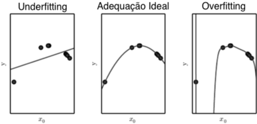

## 2.15 Micro-serviços

Micro-serviços são serviços pequenos e autônomos que trabalham em conjunto. Ao contrário de um sistema monolítico, arquiteturas baseadas em micro-serviços têm a característica de seus módulos agirem de forma independente [51].

A arquitetura baseada em Micro-serviços visa organizar um sistema de software como um pacote escalável que agregue diversos serviços modulares, facilmente implantáveis, e, potencialmente, diferentes tecnologicamente. Cada um desses mecanismos funciona em seu próprio processo, se comunica e interage com os demais através de mecanismos leves. Nesse cenário, cada serviço será um recurso para cumprir os objetivos do sistema mesmo com a utilização heterogênea tecnologias, linguagens de programação e formatos de armazenamentos de dados. Cada micro-serviço será uma entidade separada que poderá ser implementado e colocado em produção de forma isolada [51]. Algumas de suas vantagens são:

- Facilidade de acoplamento em sistemas distribuídos;
- Maior heterogeneidade de tecnologias no sistema, já que os serviços trabalharão de forma independente estarão melhor isolados;
- Maior resiliência no sistema, se um componente do sistema falha, esta falha pode ser isolada do resto do sistema que pode continuar funcionando parcialmente;
- Maior escalabilidade, escalando apenas os serviços que realmente necessitam ser escalados, economizando poder de processamento e armazenamento
- Maior facilidade de implementação em produção, realizando o deploy de forma independente somente quando necessário em cada serviço;

Este capítulo explicou os fundamentos teóricos que aplicados nos algoritmos e arquitetura implementados neste trabalho. Também são o embasamento inicial para um futuro desenvolvimento do framework completo do projeto Deep-Vacuity que é descrito no capítulo a seguir.

## Capítulo 3

## Projeto Deep-Vacuity

Neste capítulo serão apresentadas as principais características do framework computacional do projeto Deep-Vacuity 1 , este sendo o motivador e o inspirador das atividades desenvolvidas e apresentadas neste manuscrito, sendo elas parte integrante do projeto.

O projeto Deep-Vacuity tem como objetivo principal o desenvolvimento de metodologias para identificação de comportamento de cartéis de empresas em obras públicas utilizando técnicas de aprendizado de máquina e inteligência artificial.

Dentre as atividades relacionadas ao projeto, tem-se como atividades a serem desenvolvidas:

- Desenvolvimento e implantação de um framework com infraestrutura computacional de alto desempenho distribuído, para dar suporte às atividades de monitoramento e detecção de atividades suspeitas em licitações públicas. Estas realizadas em bases públicas disponíveis em sítios da web;
- Propor metodologias de captação de dados públicos nas esferas federais, estaduais e municipais;
- Incorporar no framework desenvolvido a base de aprendizado e expertise do corpo pericial da Polícia Federal no processo de detecção de fraudes em obras públicas para os ambientes computacionais;
- Permitir ações que abranjam outras esferas do poder público, tanto regulatório, quanto de fiscalização, incluindo forças policiais e órgãos de controle.

O projeto Deep-Vacuity visa auxiliar tarefas de fiscalização, auditoria e investigação, estas atualmente realizadas em sua maioria por análise humana. Desta forma, é de grande

1 Este nome foi escolhido pela combinação do termo Deep , devido ao tipo de análise profunda das informações processadas e extraídas, estas provenientes de bases públicas ainda não exploradas; e o termo Vacuity , seguindo a descrição da letra da música homônima da banda francesa Gojira do albúm The way of all flesh . Maiores informações sobre o significado do termo Vacuity podem ser encontradas neste link: https://www.letras.mus.br/gojira/1343928/traducao.html .

utilidade que o sistema tenha um canal de interação com um tipo de usuário final. Esperase então que o sistema completo tenha a capacidade acoplar interfaces úteis e de frontend com fácil usabilidade, como seguem alguns exemplos:

- Visualização de dados, metadados, agrupamentos e seleção de entidades;
- Painel de controle com gráficos e informações em escala macro e micro de determinados campos de conhecimento;
- Visualização de grafos e correlações entre dados, documentos e entidades;
- Representação espacial bidimensional ou tridimensional das relações entre dados;
- Visualização dos mesmos dados em diferentes escalas e tipos de intervalos temporais
- Representações dos dados por sua geo-localização;
- Interação com o usuário para validação e refinamento de resultados dos modelos inteligentes;
- Capacidade de retroalimentação de dados no sistema para retreinamento de modelos existentes ou treinamento de novos modelos inteligentes.

Este desenvolvimento é fruto da parceria com Instituto Nacional de Criminalística (INC), do Serviço de Perícia em Engenharia (SEPENGE) do Departamento de Polícia Federal (PF). A seguir serão listadas as principais informações das atividades que estão sendo realizadas no escopo do projeto.

## 3.1 Histórico e Motivação

Em meados de 2014, surge a maior operação de combate à corrupção da história da república brasileira, denominada de Operação Lava-jato [52, 53], a qual atingiu uma magnitude extraordinária em valores financeiros movimentados, e também na quantidade de agentes públicos envolvidos, de diversas naturezas e espectros políticos.

Com o advento desta operação, observou-se notoriamente que a capacidade de investigação, diga-se esta completamente limitada e manual, mitigou o desenvolvimento e o surgimento de diversas linhas de trabalhos científicos e e de iniciativas populares, para o auxílio no combate aos crimes de corrupção (também conhecidos como "crime do colarinho branco"). Estas modalidades estão agora mais sofisticados e complexas (vide Departamento de Operações Estruturadas da Empresa Odebrecht [54]), se comparado aos tradicionalmente relacionados na literatura sobre o tema 2 , como comparativo da evolução e melhoria do modus operandi dos envolvidos.

2 Vide exemplo da Ação Penal 470 - conhecida como "Mensalão" [55]

Mediante essa avalanche de novos dados a serem processados, bem como pelo motivo nobre da causa em combater, surgiram vários movimentos na área de tecnologia da informação com o objetivo explícito de auxiliar no combate à corrupção, a saber:

## 1. Operação Serenata de Amor

Aproposta da Operação Serenata de Amor [56] é atuar no monitoramento dos gastos referentes à atividade parlamentar, principalmente monitorando de forma automatizada, com auxílio de tecnologia, os reembolsos efetuados pela Cota para Exercício da Atividade Parlamentar (CEAP) - verba que custeia alimentação, transporte, hospedagem e até despesas com cultura e assinaturas de TV dos parlamentares.

## 2. Operação Política Supervisionada

A Operação Política Supervisionada [57] fiscaliza de forma detalhada os gastos realizados via CEAP (ou CEAPS). Até o momento já foram economizados mais de R$ 5,5 milhões do dinheiro público graças a estas fiscalizações e às exigências feitas diretamente aos parlamentares para que devolvam o dinheiro público indevidamente utilizado.

A OPS conta com a ajuda de seus colaboradores, espalhados pelo Brasil, para o levantamento de informações necessárias para a conclusão de fiscalizações, como por exemplo, o envio de fotos de endereços suspeitos em diversas cidades do país. Além disso, qualquer um pode ser um fiscal dos gastos públicos e este site oferece dados suficientes para isso.

## 3. Observatório da Despesa Pública

OObservatório da Despesa Pública (ODP) [58] é uma unidade permanente do Ministério da Transparência e Controladoria-Geral da União (CGU) voltada à aplicação de metodologia científica, apoiada em tecnologia da informação de ponta, para a produção de informações que visam a subsidiar e a acelerar a tomada de decisões estratégicas por meio do monitoramento dos gastos públicos.

O objetivo do ODP é contribuir para o aprimoramento do controle interno e funcionar como ferramenta de apoio à gestão pública, os resultados gerados pela unidade servem como insumo para realização de auditorias e fiscalizações conduzidas pela CGU, bem como para informar aos gestores sobre indicadores gerenciais relativos à realização de gastos públicos, de modo a permitir análises comparativas, subsidiando a tomada de decisões para melhoria da aplicação dos recursos públicos.

A seguir são apresentadas as atividades de desenvolvimento e os resultados esperados.

## 3.2 Atividades em Desenvolvimento

Esta fase inicial do projeto foi desenvolvida visando uma arquitetura flexível e modular, baseada em micro-serviços. Desta forma, os dados podem seguir um fluxo de trabalho que envolve a sua captura, pré-processamento, formatação, processamento efetivo e análise. Cada tarefa deste fluxo é alocada como um micro-serviço individual. Cada um dos microserviços se comunica com os demais de forma que o fluxo funcione de forma fluida, escalável e eficiente.

A captura dos dados é realizada a partir de fontes de dados online públicas e geralmente governamentais. Para esta captura há a adaptação dos mecanismos de crawling (Seção 2.1.1) e scraping (Seção 2.1.2) de acordo com as necessidades da fonte de dados. Os dados estão disponibilizados em diferentes formatos como PDF , HTML e XML e são extraídos inicialmente em seu formato bruto. Para cada tipo diferente de fonte ou formato de dado é necessário um micro-serviço individual.

A partir da captura dos dados em seu formato bruto, é realizada uma extração efetiva dos dados textuais, convertendo-os em um padrão previamente definido. Por exemplo, dados em PDF são convertidos em dados textuais puros. Os dados são então padronizados em um único formato textual. Também são extraídos os metadados disponíveis e que possam ter utilidade para caracterizar aqueles dados. Para a conversão de cada tipo específico de dado no padrão unificado é necessário um micro-serviço individual.

Os dados em formato textual passam então pelo pré-processamento, onde são aplicadas técnicas de normalização, tokenizing (Seção 2.6) e stemming (Seção 2.7) e também há a segmentação de textos de acordo com a necessidade. Os dados brutos, seus metadados e suas versões pré-processadas são então formatados como documentos semi-estruturados como CSV e JSON ou inseridos em bases de dados estruturadas, relacionais ou nãorelacionais. Para ambas as abordagens é necessária a modelagem prévia dos relacionamentos e hierarquia entre os dados. É possível fragmentar as técnicas de pré-processamento em diferentes micro-serviços ou alocar todos em um único micro-serviço. As tarefas de estruturação dos dados são alocadas em micro-serviços individuais. As tarefas de armazenamentos dos dados são alocadas em micro-serviços individuais assim como as próprias bases de dados.

Com estes dados semi-estruturados ou estruturados, é possível realizar a análise dos dados. Esta análise envolve a extração de entidades dos dados em linguagem natural, cruzamento de informações, entendimento dos metadados e classificação dos dados em diferentes categorias acordo com metodologias previamente definidas. Obtêm-se então os insumos para um futuro treinamento de modelos de aprendizado de máquina de acordo com as necessidades apontadas, buscando replicar o comportamento e entendimento de especialistas sobre os problemas a serem resolvidos. Em seguida os resultados são avaliados

e validados e, caso seja necessário, são feitos os ajustes de refinamento dos modelos de extração de entidades e classificação de texto.

Esta primeira fase do projeto Deep-Vacuity serve como um caso de estudo na geração e implementação uma arquitetura funcional que possa se tornar futuramente a base de uma arquitetura maior, com muito mais fontes de dados, diversidade de módulos, capacidade de processamento e escalonamento.

## 3.3 Resultados Esperados

Espera-se deste projeto um estágio inicial de um sistema automático de extração, monitoramento e pré-processamento de dados públicos disponibilizados pelos municípios, estados e união. Inicialmente, as atividades terão início a partir da extração e análise dos dados do Diário Oficial da União (DOU), de forma que estes dados sejam continuamente extraídos para uma base de dados, pré-processados, que suas entidades úteis sejam extraídas e classificadas de acordo com determinados interesses. Assim, haverá uma base consolidada dos dados destas publicações advindos de seções específicas desta fonte ao longo dos anos, segmentadas e em seu formato textual dos quais será possível realizar a extração de entidades de interesse e cruzamento de dados para realizar futuramente a detecção de fraudes. O mesmo procedimento deverá ser aplicado, com os aprimoramentos de acordo com o contexto para as demais unidades que possam ter os dados de interesse ao projeto.

Após a coleta dos dados, incluindo sua estruturação, o projeto deverá contemplar o desenvolvimento de diversas outras estratégias para gerar insumos e arquitetar sua utilização na análise e combate a diversos tipos de modalidades de fraudes licitatórias, entre outras possibilidades de ações de acordo com o interesse da equipe envolvida.

Os resultados gerados nesta primeira fase do projeto Deep-Vacuity servirão como um caso de estudo na geração e implementação uma arquitetura funcional. Com base neste projeto inicial, o sistema completo Deep-Vacuity poderá incrementalmente tomar maiores dimensões, com uma arquitetura mais ampla, com maior diversidade de fontes de dados, maior diversidade de módulos, maior capacidade de processamento e escalonamento.

Este capítulo abordou a estrutura do projeto principal que é utilizado como base para o desenvolvimento deste trabalho. O capítulo seguinte apresenta as metodologias estudadas e aplicadas para formalizar o projeto inicial e o projeto Deep-Vacuity .

## Capítulo 4

## Metodologia

## 4.1 Fluxo de Trabalho

Uma referência utilizada para este projeto é o fluxo de trabalho ( workflow ) em classificação de texto definido pela Google [2], representando uma visão geral de alto nível (Figura 4.1). As etapas utilizadas para resolver problemas de aprendizado de máquina são:

Figura 4.1: Tradução do Workflow Google [2]


- Etapa 1: Coleta de dados. Este passo é o mais importante na solução de qualquer problema de aprendizado de máquina supervisionado. Um classificador de texto será tão bom quanto o conjunto de dados sobre o qual ele é criado;
- Etapa 2: Exploração dos dados. Entender as características dos dados de antemão permitirá a construção de um modelo melhor. Isso pode significar simplesmente obter uma precisão maior ou também economia de dados para treinamento ou economia de recursos computacionais. Nesta etapa também já pode-se iniciar a escolha do modelo. Graças a décadas de pesquisa, existe uma grande variedade de opções de configuração de modelos. Deve-se pensar qual o modelo de classificação ideal para o problema a ser resolvido;
- Etapa 3: Preparação dos dados. Antes que os dados alimentem um modelo, eles precisam ser transformados em um formato que o modelo possa entender. Também é

necessário prepará-los para evitar que fiquem enviesados. Por exemplo, uma prática simples recomendada para que o modelo não seja afetado pela ordem dos dados é sempre embaralhá-los antes de tudo;

- Etapa 4: Criação, treinamento e validação do modelo;
- Etapa 5: Ajuste de hiper-parâmetros. Esta etapa envolve testar hiper-parâmetros, analisando o que funciona melhor. Deve-se buscar o melhor desempenho para o caso de uso;
- Etapa 6: Implantação do modelo. Por fim, implanta-se o modelo treinado em um ambiente de produção.

Outra referência utilizada é o mais fluxo tradicional de processamento de um corpus , utilizando a estrutura ( framework ) padrão para análise de texto descrito por Hu, Xia, and Huan Liu [33]. Este framework consiste em três fases consecutivas:

- Pré-processamento de texto : tem como objetivo gerar documentos mais consistentes, que facilitem a representação do texto e mantenham suas características essenciais. Esta etapa é necessária para a maioria das tarefas de análise de texto. Os métodos tradicionais de pré-processamento de texto incluem Tokenizing (Seção 2.6), Stemming (Seção 2.7) e Remoção de Stop Words (Seção 2.8). É importante realizar um estudo do que será pré-processado, em muitas aplicações em PNL pode ser necessário analisar a mensagem do ponto de vista sintático, o que requer manter estruturas da sentença original.
- Representação de dados textuais: as modelagens mais utilizadas para dados textuais os transformam em vetores numéricos esparsos. Para isso utiliza-se técnicas como Bag of Words (Seção 2.9.1), Tf-idf (Seção 2.9.2).
- Extração de conhecimento ( Knowledge Discovery ): após transformar o texto do Corpus em vetores numéricos, eles são processados por meio de operações algébricas lineares. Pode-se aplicar aprendizado de máquina e métodos de mineração de dados, como classificação ou clustering (Seção 2.10). No aprendizado de máquina, a similaridade de cossenos é uma medida importante para muitas tarefas e pode ser utilizada para encontrar a semelhança entre documentos.

Por meio da realização de pré-processamento, representação e extração de conhecimento, pode-se extrair informações úteis do Corpus . Este é um fluxo já consolidado e é bastante interessante para ser seguido em processamento de dados textuais. Para a melhor adaptação dos fluxos estudados, foi necessário o entendimento dos dados utilizados nesta etapa do projeto. Esta análise está apresentada a seguir.

## 4.2 Níveis de Granularidade dos Dados

Para a descrição dos dados utilizados na fase inicial do projeto Deep-Vacuity , é necessário estabelecer uma notação dos níveis diferentes de granularidade de textos do Corpus :

- Palavra: unidade básica dos dados discretos. As palavras são representadas como vetores de base unitária, com um único componente igual a um, e todos os outros componentes iguais a zero. Formalmente, cada palavra é definida como um item de um vocabulário indexado por {1, ..., V} , sendo V o tamanho do vocabulário;
- Publicação: unidade de publicação individual de determinado órgão em determinado dia. As publicações podem começar em uma página e terminar em outra, mas sempre pertencerão a apenas um órgão e em geral serão associados a uma sub-entidade do órgão (Figura 4.2). Formalmente, é uma sequência de N palavras denotada por p = ( w 1 , w 2 , ..., w N ), em que w N é a enésima palavra na sequência;

## IMPRENSA NACIONAL

## EXTRATO DE CONTRATO N" 13/2016 UASG 110245

N' Processo: 00034004039201684.

INEXIGIBILIDADE N' 4/2016 Contratante:   IMPRENSA NACIO NAL CNPJ Contratado: 00082024000137. Contratado COMPA NHIA DE SANEAMENTO AMBIENTAL DO DISTRITO FEDERAL. Objeto: Prestação de forma contínua dos serviços públicos de abastecimento de água, esgotamento sanitário e outros serviços para as dependencias do consumidor na unidade de consumo localizado no Setor de Indústrias Gráficas. Fundamento Legal: Lei 8.666/93 Vi gência: 05/12/2016 a 05/02/2017. Valor Total: RS752.799,36. Fonte: 150020045 2016NE800464. Data de Assinatura: 05/12/2016.

(SICON 30/12/2016)

Figura 4.2: Exemplo de Publicação DOU.

- Órgão: unidade com todas as publicações feitas por determinado órgão em determinado dia. As publicações podem estar distribuídas em mais de uma página, mas sempre pertencerão a apenas um documento (Figura 4.3). Formalmente, é uma sequência de N publicações denotada por o = ( p 1 , p 2 , ..., p N ), em que p N é a enésima publicação na sequência;

## CASA CIVIL EMPRESA BRASIL DE COMUNICAÇÃO SIA

Figura 4.3: Exemplo de início de Órgão DOU.

- Capítulo: unidade com todas as publicações feitas por determinado conjunto de órgãos em determinado dia. Suas publicações podem estar distribuídas em mais de uma página, mas sempre pertencerão a apenas um documento (Figura 4.4). Formalmente, é uma sequência de N órgãos denotada por c = ( o 1 , o 2 , ..., o N ), em que o N é o enésimo órgão na sequência;

## Presidência da República

Figura 4.4: Exemplo de início de Capítulo DOU.

- Página: unidade de página do documento, dividida apenas por critério espacial. A separação de um diário em páginas é realizada pela limitação de um número máximo de caracteres por página (Figura 4.5);


Brasíla segunda-fera, de janeiro de 2017

## Sumário

SUPFRINTENDENCIA REGIONAL EM ALAGOAS

|                      | PAGINA   |
|----------------------|----------|
| Republia             |          |
| ncultu               |          |
| Ministeno            |          |
| Jusuca               |          |
| Ministeno            |          |
| Encrvu               |          |
| Scrviços             |          |
| Espone Mcio Anhicntc |          |
| Ministeno            |          |
| Fonos                |          |
| Consclho             |          |

## Presidência da República

## CASA CIVIL

EMPRESA BRASIL DE COMUNICAÇÃO SIA

Aduro Cctcst deIraPublico de

Comunicaciol Hcmcnto 122016

Prcpocir BRASIL COMERCIO SOFTWARE SA

NEIRE MARIS MARQUES

(SIDEC

## IMPRENSA NACIONAL

Contratado COMFA AMBIENTAL DO RAL uniddc 0s 022017 05/122016-

30 122016)

INSTITUTO NACIONAL DE COLONIZAÇÃO REFORMA AGRARIA SUPERINTENDENCIA REGIONAL NO DISTRITO FEDERAL ENTORNO

SECREIARLA DE ESTADO DA AGRICULIURA DESEVOL DISTRITO HEDERAL CNPJ RIDE Recuro 0261492010 RELIO BEZERRA DA ROCHA CPF JOSE GUILHERME TOLLS TADIUS LEAL

PREGAO SISPF INSIUIO NACIONAL COLONIZAÇÃO REFORMLAAGRARIA PRESLRVE SEGURANCA contuto Totl 176170002

(SICON

SUPERINTENDENCIA REGIONAL NA BAHIA

INSTIT DE COLONIZA Objclo: 29/1220/8 Senalnus Conccucn-

REFORMA AGRARIA um ValorRs Fonic ND; u '122016 Convenenic EURES RIBEIRO PE REIRA CPF

0/76370002 GUEL PEDRO DA SILVA NEIO CPF


| IABELADEPRECOS DEJORNAISAVULSOS   |
|-----------------------------------|
| 0,30                              |

## AVISQ

CIRCULOU EM 30/12/2016 A EDIÇÃO EXTRA Nª 251-A Tambem disponivel no endereço; wwwin. Pesquisa nos Jornais govbr

Figura 4.5: Exemplo de Página DOU.

- Diário: conteúdo integral de um diário, documento publicado diariamente. Formalmente, em critério de conteúdo, é uma sequência de N capítulos denotada por

d = ( c 1 , c 2 , ..., c N ), em que c N é o enésimo capítulo na sequência. Em critério espacial, é uma sequência de páginas;

- Seção: o DOU é dividido em três seções e cada uma delas contempla seu respectivo conjunto de assuntos específicos. Uma seção conterá todos os diários de determinada temática;

## 4.3 Arquitetura do Sistema

A arquitetura da primeira fase do Deep-Vacuity (Figura 4.6) foi pensada de forma modular. Há a implementação de diversos micro-serviços (Seção 2.15) que se complementam para cumprir as tarefas de um fluxo de trabalho e também a possibilidade de acoplamento de novos módulos de acordo com as necessidades que possam surgir. Os seus componentes são ser capazes de agir de forma autônoma, apesar de seguirem um fluxo linear natural de processamento de dados. Estes módulos se comunicam de forma fluída, utilizando processamento assíncrono e baseado em filas de solicitações. Os métodos de comunicação entre os módulos são realizados de forma que tarefas não sejam repetidas e dados não sejam duplicados nem perdidos durante o processamento.

Figura 4.6: Arquitetura da primeira fase do projeto Deep-Vacuity .

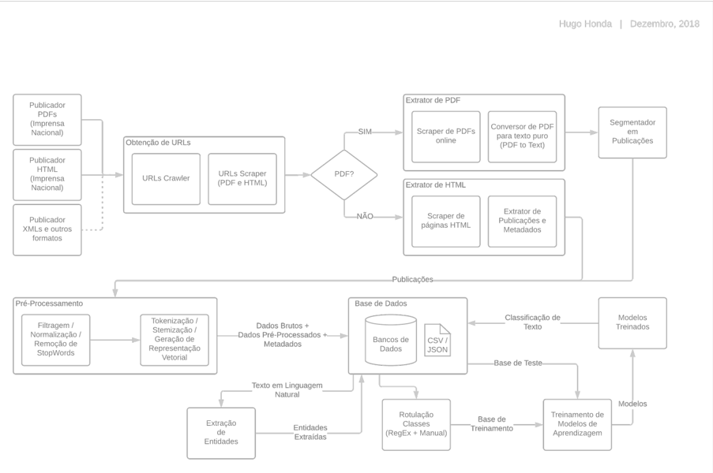

O início do fluxo da arquitetura consiste na coleta das URL s que contêm os dados. Esta estrutura de captura de URL s é detalhada na Figura 4.7. Os dados podem estar em diferentes tipos de formatação (Seção 2.2) e serem originários de diferentes fontes. Foram utilizadas fontes de dados da Seção 3 do Diário Oficial da União da Imprensa Nacional. Estes dados estão disponíveis nos formatos PDF , HTML e alguns dados de datas mais recentes estão disponíveis no formato XML .

Após a identificação das fontes de dados, foram implementados módulos de captura de URL s que contenham os dados, utilizando técnicas de crawling (Seção 2.1.1) e scraping (Seção 2.1.2) para obter os endereços referentes a cada um dos diários oficiais. Há uma abordagem diferente para cada tipo de dado, tornando necessária a implementação de diferentes micro-serviços encarregados por extrair as URL s referentes a cada tipo diferente de arquivo.

Em seguida, há uma tomada de decisão e as URL s referentes a cada tipo de dado vão para sua fila de extração específica.

## · Extração dos dados em PDF:

- -Realiza-se a raspagem das URL s de todos os diários no intervalo temporal de um ano. Realiza-se esta raspagem para todos os anos disponíveis. Os intervalos de tempo são configuráveis;
- -Cada uma das URL s obtidas endereça a página inicial de um diário em PDF . Assim, para a obtenção dos PDF s, é necessária a iteração das páginas a partir da página inicial;
- -Itera-se as páginas de um diário pela incrementação do valor da página na requisição web ;
- -Cada uma das URL s de página do diário é enviada então para o módulo de conversão do PDF para texto;
- -O módulo de conversão de PDF para texto realiza a obtenção dos conteúdos de cada página do diário em PDF por streaming , salvando seu conteúdo salvo em um arquivo temporário e em seguindo convertendo este conteúdo para texto puro;
- -Este texto puro é contínuo, concatenando várias publicações seguidas.

## · Extração dos dados em HTML:

- -Realiza-se a raspagem das URL s de todos os diários no intervalo temporal de um ano. Realiza-se esta raspagem para todos os anos disponíveis. Os intervalos de tempo são configuráveis;

- -Cada uma das URL s obtidas endereça a página HTML principal de um diário, que contém outras URL s referentes a cada publicação daquele dia no diário. Assim, é necessária a raspagem de todas as URL s referentes a cada publicação daquele diário;
- -Realiza-se a raspagem de todas as URL s de publicações dos diários, elas são enviada então para o módulo de raspagem do contéudo da publicação em HTML ;
- -Realiza-se a raspagem dos conteúdos de todas as páginas de publicações, obtendo e estruturando o conteúdo em linguagem natural e metadados referentes àquela publicação.

Para o caso dos dados extraídos dos PDF s, é necessário um módulo extra para a segmentação do texto contínuo das páginas em publicações diferentes. Além disso é realizada a remoção de informações próprias do dado em PDF como cabeçalhos, rodapés e sumário. No caso dos dados em HTML a publicação já vem naturalmente separada, já que cada uma está contida em uma página individual. Esta extração de publicações é detalhada na Figura 4.8. Estes dados de publicações são encaminhados então para os módulos de Pré-Processamento.

É possível realizar a especificação de um intervalo temporal para que sejam capturados apenas os dados de um determinado intervalo de datas. Caso contrário, a arquitetura fará requisições extraindo de ano em ano de forma decrescente, do ano atual até a data mais antiga que for possível. Também é possível especificar o tipo de formato de dado de origem que deseja-se extrair. Se não for especificado, a arquitetura fará a extração dos dados de todos os tipos de formato.

Figura 4.7: Captura das URL s e dos dados.

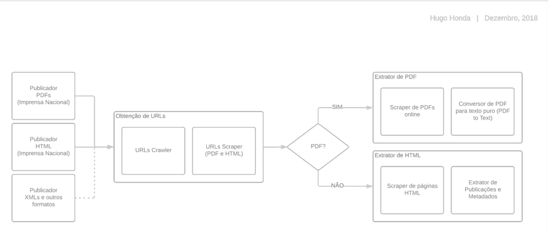

Os módulos de Pré-Processamento realizam as tarefas de tratamento de dados textuais como normalização dos dados textuais, remoção de ruídos, tokenizing (Seção 2.6), stemming (Seção 2.7), remoção de Stop-Words (Seção 2.8) e aplicação de Bag of Words (Seção 2.9.1). Esta etapa mantém os dados em seu estado bruto e gera dados pré-processados das publicações. Esta etapa também mantém os metadados obtidos e as informações sobre a origem do dado. Os dados são estruturados em objetos JSON . Os dados advindos da etapa de Pré-Processamento são então encaminhados para a base de dados, composta por módulos de armazenamento, encarregados por armazenar os dados diferentes formatos de arquivos ou bancos de dados, de acordo com a necessidade estipulada.

Figura 4.8: Geração das publicações e Pré-Processamento dos dados.

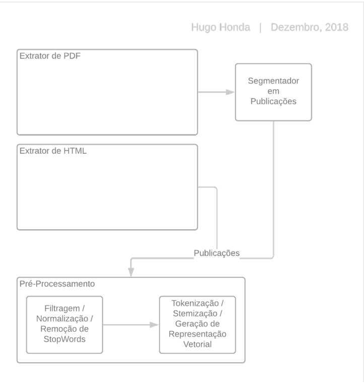

Os módulos de armazenamento são mantidos como a base central dos dados, recebendo dados brutos, dados pré-processados e os metadados relativos a cada dado textual como mostra a Figura 4.9. A base de dados alimenta e é retroalimentada pelos mó-

dulos de extração de entidades e também pelos módulos de treinamento de modelos de aprendizagem.

Figura 4.9: Base de Dados e outros módulos.

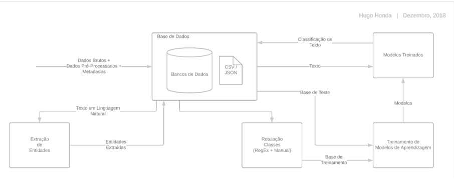

O módulo de extração de entidades realiza a extração das entidades contidas em linguagem natural no texto de cada publicação e retorna para a base de dados estas entidades já estruturadas, formatadas e normalizadas como mostra a Figura 4.10.

Figura 4.10: Extração de Entidades.

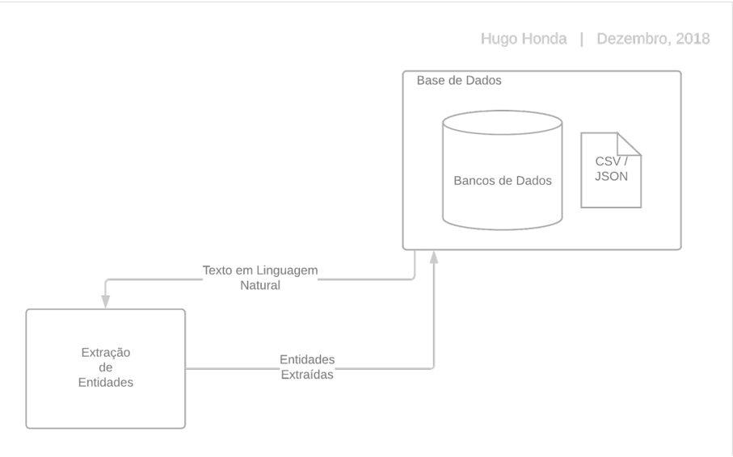

Os módulos de treinamento de modelos realizam o treinamento de modelos de aprendizagem a partir de dados rotulados. Esta rotulação dos dados é necessária para a aprendizagem supervisionada 2.11.1 e é realizada externamente ao sistema ou então é realizada a partir de regras de negócio previamente estabelecidas e implementadas no fluxo de processamento. O treinamento dos modelos gera então modelos treinados e estes são efetivamente acoplados à arquitetura, recebendo a entrada dos dados textuais (ou de outros dados e metadados) e respondendo de acordo com o que o modelo foi treinado para responder. Esta parte do fluxo está detalhada na Figura 4.11.

Figura 4.11: Treinamento de modelos de aprendizagem.

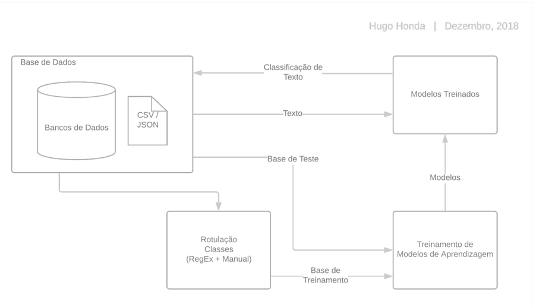

## Capítulo 5

## Desenvolvimento da Arquitetura

## 5.1 Captura de Dados

Devido a limitação da plataforma da Imprensa Nacional, até o momento da publicação deste trabalho, os dados da Seção 3 do Diário Oficial estavam disponíveis apenas em dois formatos: íntegra dos textos em forma não-estruturado no formato PDF e disponíveis online em forma semi-estruturada em HTML . Desta forma, foram estabelecidas duas abordagens diferentes para captura de dados (dois micro-serviços distintos).

Para ambos os tipos de dado, utilizou-se as técnicas de crawling (Seção 2.1.1) e scraping (Seção 2.1.2) para percorrer, a partir de uma URL base (que indicava uma página contendo todos os links referentes às publicações no determinado intervalo) as URL s de interesse e, consecutivamente, seus respectivos conteúdos (Figura 5.1). Nos dois casos houve a dependência da estabilidade e disponibilidade do website da Imprensa Nacional. Também foi necessário implementar estratégias para que os extratores não sobrecarregassem requisições nos websites nem fossem bloqueados pelo servidor da Imprensa Nacional.

Figura 5.1: Arquitetura do extrator de dados

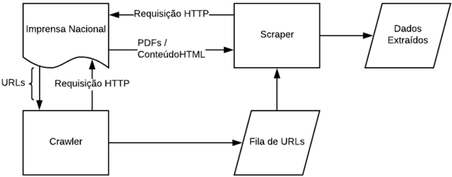

As URL s foram extraídas de página em página por meio de uma biblioteca em Python para análise e extração de dados de documentos HTML chamada Beautiful Soup [59]. Esta ferramenta transforma um documento HTML complexo em uma árvore de objetos em Python . Desta forma, é possível realizar executar vários métodos de pesquisa na árvore que filtram informações na estrutura por meio de sua tag , classe, identificadores ou conteúdo textual.

## 5.1.1 Dados em PDF

O primeiro passo foi criar um rastreador ( crawler ) para capturar os endereços dos dados de interesse da plataforma online da Imprensa Nacional. Este módulo é capaz de, dentro de qualquer intervalo temporal (entre a mais antiga publicação online até a publicação do mais recente), extrair todos os endereços ( URLs ) das publicações diárias de determinada seção contida neste intervalo.

O website contém uma página de pesquisa (http://pesquisa.in.gov.br/imprensa/), na qual pode-se realizar a leitura de jornais dentro de um determinado intervalo temporal, e selecionando as seções de interesse como mostra a Figura 5.2.

Figura 5.2: Resultado da pesquisa Avançada DOU (http://pesquisa.in.gov.br/imprensa/).


Esta pesquisa gera uma página inicial relativa àquele intervalo temporal específico mostrado na a Figura 5.3, uma URL base na qual o rastreador ( crawler ) fará a extração de todas as URL s naquela página e nas suas páginas sequenciais. Com esta funcionalidade foi possível realizar um estudo da construção da URL de busca de interesse, com variação do tipo de seção e do intervalo temporal configurável.


Figura 5.3: Pesquisa Avançada DOU (http://pesquisa.in.gov.br/imprensa/).

| Resultado da Pesquisa nos Jornais Oficiais   | Resultado da Pesquisa nos Jornais Oficiais   | Resultado da Pesquisa nos Jornais Oficiais   | Resultado da Pesquisa nos Jornais Oficiais   | Resultado da Pesquisa nos Jornais Oficiais   |
|----------------------------------------------|----------------------------------------------|----------------------------------------------|----------------------------------------------|----------------------------------------------|
| Jornal                                       | Edição                                       | Data da Publicação                           | Qtd. Pág                                     | Qtd. Pág                                     |
| Diário Oficial da União Seção 3              |                                              | 02/01/2017                                   | 128                                          |                                              |
| Diário Oficial da União Seção 3              |                                              | 03/01/2017                                   | 152                                          |                                              |
| Diário Oficial da União Seção 3              |                                              | 04/01/2017                                   | 156                                          |                                              |
| Diário Oficial da União Seção 3              |                                              | 05/01/2017                                   | 144                                          |                                              |
| Diário Oficial da União Seção 3              |                                              | 06/01/2017                                   | 176                                          |                                              |
| Diário Oficial da União Seção 3              |                                              | 09/01/2017                                   | 160                                          |                                              |
| Diário Oficial da União Seção 3              |                                              | 10/01/2017                                   | 140                                          |                                              |
| Diário Oficial da União Seção 3              |                                              | 11/01/2017                                   | 136                                          |                                              |
| Diário Oficial da União Seção 3              |                                              | 12/01/2017                                   | 148                                          |                                              |
| Diário Oficial da União Seção 3              | 10                                           | 13/01/2017                                   | 176                                          | [                                            |

## Obtenção dos endereços dos arquivos PDF

Nesta etapa, foi realizada a iteração desde a URL base inicial até a última URL que continha todas as publicações de determinado intervalo temporal, salvando o endereço referente a cada documento de cada dia e armazenando o endereço de cada uma destas páginas em formato PDF , sua data de publicação e sua quantidade de páginas total.

## Conversão dos dados de PDF para TXT

Com a fila de endereços dos arquivos PDF, utilizou-se a ferramenta pdftotext [60] para realizar o download em arquivos temporários (com o módulo tempfile [61] do Python , o que preservou espaço em disco do download e acelerou o processo de obtenção dos dados) e converter imediatamente o conteúdo binário do PDF para formato textual bruto, salvando na base de dados e em um arquivo CSV com todos os resultados. Os comandos do arquivo de configuração do pdftotext que se mostraram mais adequados foram:

- raw : mantém o texto na ordem do fluxo de conteúdo, dependendo de como o arquivo PDF foi gerado;
- UTF-8 : codificação usada para saída de texto.

## 5.1.2 Dados em HTML

Para a extração de dados disponíveis em HTML também foi necessário criar um rastreador ( crawler ) que, a partir da verificação de datas consecutivas de um determinado intervalo de tempo, capturasse com profundidade os endereços dos dados de interesse da plataforma online da Imprensa Nacional. Este módulo é capaz de, dentro de qualquer intervalo temporal (entre a mais antiga publicação online até a publicação do mais recente), extrair os dados disponíveis em cada diário disponibilizado na página web .

## Obtenção das diferentes publicações de um diário

Nesta etapa, foi realizada a iteração desde a data inicial, modificando o parâmetro de data na URL inicial e a do último dia desejado, analisando todas as publicações de determinado intervalo temporal.

As URL s de cada publicação foram obtidas a partir da página principal da data determinada, por meio do seu conteúdo obteve-se todos as identificações que geraram as URL s individuais de cada publicação. Para cada publicação foi possível obter um conjunto de informações semi-estruturadas que foram alocadas em objeto JSON. Assim, foi possível extrair informações como órgão ( agency ), texto ( body ), título ( title ), signatários ( signatories ), cargos dos signatários ( functions ) e URL da publicação como mostram a Figura 6.1 (página web original) e a Figura 6.2 (dados extraídos e estruturados).

## Análise dos dados na página HTML

Cada página referente a um diário foi obtida por meio de requisições web e, em seguida, analisada. Cada link dentro do contexto principal da página que estava disponível se referia a uma publicação individual. Assim foi necessário realizar-se uma segunda iteração com o crawler , acessando cada um daqueles links que continham o texto integral da publicação (ou seja, acessando uma segunda página e uma segunda URL), e realizando a extração relativa daquela página.

## 5.2 Rotulação dos Dados

Todas as publicações continham títulos, apesar da imensa heterogeneidade das formas de escrita ainda foi possível realizar algumas análises para o agrupamento de diferentes categorias de publicação.

A primeira abordagem foi meramente a aplicação de expressões regulares (Seção 2.5). Por exemplo, para a obtenção dos títulos de publicações que são relativos à licitação, utilizou-se a seguinte expressão regular (em Python ):

- (?!(?:extrato|aviso|processo)[\s\S]*?
- (?:dispen|inex)[\s\S]*?licita)
- ^(?:extrato|aviso|processo)[\s\S]*?licita

Nessa expressão, por exemplo, utiliza-se a presença das palavras "extrato", "aviso"ou "processo", a raíz da palavra "dispensa"e da palvra "inexigibilidade"e a raíz "licita"da palavra "licitação"/ "licitatório". Desta forma, foi possível obter vários casos de títulos de publicações sobre licitações.

A segunda abordagem foi o agrupamento por algoritmos de clustering (Seção 2.10). Primeiramente, todos os títulos de publicações foram convertidos em sua representação vetorial por meio do Tf-idf (Seção 2.9.2), em seguida utilizou-se o algoritmo K-Means (Seção 2.10.1). Utilizando o número de clusters igual a 3 obteve-se dados segregados.

A terceira abordagem foi a rotulação manual dos dados. Os dados foram simplesmente segregados manualmente para realização de testes.

## 5.3 Pré-processamento

Os módulos de Pré-Processamento realizam as tarefas de tratamento de dados textuais como segmentação do texto, normalização dos dados textuais, remoção de ruídos, tokenizing (Seção 2.6), stemming (Seção 2.7), filtragem (Seção 2.8) e aplicação de Bag of Words (Seção 2.9.1). Esta etapa utiliza os dados em seu estado bruto e gera dados pré-processados a partir deles.

- Segmentação do Texto: para o caso dos dados textuais dos PDFs foi necessário segmentar cada página integral do diário em publicações diferentes. Existem dois problemas a serem abordados:
- -União de publicações iniciadas em uma página e terminadas em outras. Solução: unir todas as páginas de um Documento (Diário);
- -Separação de publicações em uma página.

A estratégia para a separação das publicações foi inicialmente unir todos os texto de todas as páginas de um documento de forma que o texto integral do documento se tornasse contínuo (retirando cabeçalhos, rodapés e outros dados repetidos em cada página), e em seguida fazer a divisão utilizando RegEx. A expressão regular

detectava primeiramente os itens do sumário para dividi-los em capítulos, e em seguida utilizou-se a quantidade de espaços e frases em maiúsculo para detectar o início de cada Órgão;

- Normalização do Texto: normalização de termos que podem ser descritas de várias formas diferentes, padronizando-as em uma escrita comum e buscando eliminar ambiguidades. Foi feita a normalização de alguns detalhes dos dados textuais como a remoção de pontuações, remoção de acentos em palavras, remoção de dígitos e caracteres que não fossem alfabéticos. Para esta etapa foram utilizadas as bibliotecas " unicodedata "para remoção dos acentos e " re "para expressões regulares;
- Geraçao de tokens : foi aplicada a técnica tokenizing (Seção 2.6) dos textos das publicações. Esta segmentação do texto em unidades básicas chamadas de tokens é importante para a sua representação numérica;
- Filtragem: busca remover palavras específicas que não são relevantes para o processamento do texto e para os mecanismos de aprendizagem. Uma das técnicas mais populares de filtragem é a eliminação de stop words (Seção 2.8). Esta estratégia foi aplicada concomitantemente à geração de tokens . Para tokenização e filtragem foram utilizados alguns componentes da biblioteca NLTK [28] como o wordtokenize do nltk . tokenize . Também foram utilizadas as stopwords 2.8 em português do nltk . corpus ;
- Bag of Words : a aplicação de Bag of Words foi realizada com Tf-idf (Seção 2.9.2), para isso utilizou-se as ferramentas TfidfTransformer e TfidfVectorizer do módulo Feature Extraction [62] da biblioteca scikit-learn [31].

## 5.4 Extração de Entidades

Foram desenvolvidas algumas estratégias usando expressões regulares (Seção 2.5) para a detecção de entidades de importância para o contexto do projeto.

Para realizar esta tarefa é essencial reconhecer unidades de informação como entidades, incluindo nomes de pessoas, organizações e locais, e expressões numéricas, incluindo hora, data, dinheiro e expressões percentuais. A identificação de referências para essas entidades em texto é chamada de Reconhecimento e Classificação de Entidades Nomeadas ( Named Entity Recognition and Classification ou NER ou NERC) [24].

Neste caso algumas das entidades que podem ter importância em uma publicação de licitação são: datas e horários (relativos à abertura dos editais, por exemplo), telefones e email (relativos às insituições que estão promovendo a licitação), website (relativos às instituições que estão promovendo ou regulando a licitação), CNPJ e CPF (relativos

às empresas concorrentes ou ganhadoras da licitação), CEP (relativo às instituições que estão promovendo ou que estão participando de uma licitação), valores em reais (relativo a preços da licitação, de produtos ou serviços), entre outras. Também é importante detectar nomes de pessoas, buscando o signatário daquela licitação e o responsável por promovê-la.

Para cada uma destas entidades há um expressão regular que é utilizada para detectála no texto em linguagem natural, buscando ser o mais generalista possível. Com esta abordagem os resultados já são satisfatórios, já que obtêm-se a maioria dos dados desejados. Uma melhoria desta funcionalidade pode futuramente ser implementada por meio da utilização de redes neurais e redes profundas, o que otimiza a capacidade de generalização, reconhecimento e acurácia dos mecanismos de reconhecimento. A Figura 5.4 exemplifica extrações realizadas em texto em linguagem natural:

Processo Licitatório/FMS 010/2018 OBJETO: Aquisição de 03 (três) veículos zero km , 01 um ) veículo PICK-UP CABINE DUPLA 4X4 A DIESEL , 01 uma AMBULÂNCIA TIPO SIMPLES REMOÇÃO TIPO FURGÃO A DIESEL 01 uma AMBULÂNCIA SIMPLES EMOÇÃO TIPO ADAPTADA GASOLINA E/ou ÁLCOOL ; VALOR MÁXIMO ESTIMADO: R$ 382.993,33 ; TIPO DE JULGAMENTO: Menor preço un itário; ABERTURA : 04/06/2018 às O9hoOmin. 0 edital encontra-se disponível na sala de licitação situada na Avenida Jo sé Veríssimo dos Santos 365 , Bairro Centro, Cidade de Triunfo, Estado de Pernambuco CEP : 56.870-000 Fone: 87 38 46 1365 , E-mail: triunfocpl@outlook.com, no horário de 07h3Omin às 13h3Omin.

```
{'cep ['56.870-000 ] , cnpj [J , 'cpf [] , date 04/06/2018' ] , email [ 'triunfocpleoutlook_ com ' ] , hour [ '07h3Om 09h0Om 13h30m ] , phone [ '87 3846 1365 ] , website [J}
```

Figura 5.4: Exemplo de extração de entidades de um texto em linguagem natural.

## 5.5 Treinamento dos modelos

O treinamento dos modelos foi realizado a partir de bases de dados rotuladas como descrito na Seção 5.2. Majoritariamente foram realizados testes com amostras dos dados, devido as limitações de processamento da máquina utilizada para desenvolvimento do projeto. A partir do treinamento destes modelos utilizando-se métodos de rotulação diferentes, volumes de dados variantes e algoritmos diferentes, foi possível testar o acoplamento de diferentes modelos de dados ao fim da da arquitetura de processamento de dados. Foram utilizados os algoritmos descritos na Seção 2.12.

## 5.6 Contêiners

Para o desenvolvimento da arquitetura de micro-serviços, utilizou-se o Docker [63] para gerar os contêiners. O Docker é uma ferramenta que fornece um meio conveniente para

empacotar os vários componentes do projeto (o raspador, rastreador de dados e as ferramentas de back-end ) como serviço. Estes módulos foram empacotados para executar operações reais adequadas às arquiteturas modernas e habilitadas para funcionar na nuvem de forma escalável. Os contêiners podem ser executados localmente, pode-se orquestrar os diferentes contêiners que compõem os serviços, e também facilitar a implantação do sistema em ambientes locais ou provedores de nuvem.

Também torna-se mais fácil o escalonamento do projeto a partir dos contêiners prontos, pois várias ferramentas são instaladas a partir de contêineres pré-empacotados, facilitando a sua configuração e sua replicação. Os contêiners também são, na maior parte dos casos, independentes da plataforma. Um contêiner Docker baseado em Linux pode ser executado em qualquer sistema operacional suportado pelo Docker (compatível com Linux, macOS e Windows ). O processo de instalação do Docker , suas instruções de instalação podem ser encontradas em: https://docs.docker.com/install/

## 5.7 Sistemas Distribuídos

Todos os módulos citados foram construídos de forma que se possa gerar diferentes contêineres a partir de uma imagem de cada um deles. Esta descrição foi feita em um Dockerfile em cada um dos módulos, que juntamente à ferramenta Docker gera contêiners individuais que executam Python com cada uma das suas respectivas dependências instaladas. Estes módulos podem ser estruturados em uma arquitetura distribuída, com replicação de funções e escalabilidade.

A comunicação entre cada um dos módulos e seus contêineres foi estruturada por meio de um sistema de filas e trocas de mensagens, de forma que as tarefas a serem executadas são repassadas aos módulos posteriores de forma organizada, evitando a perda de dados. O broker de gerência das filas de mensagens escolhido foi o RabbitMQ [64], para o qual foi gerado um contêiner próprio. O armazenamento dos dados foi realizado em um diretório de arquivos externo aos contêineres e cada um dos conjuntos de dados advindos dos diários foi armazenado com uma chave primária própria relativa ao dia do diário, por exemplo: 20180101.json é o conjunto de publicações estruturado em formato JSON do ano 2018, mês 1, dia 1.

## Capítulo 6 Resultados

## 6.1 Captura de Dados

Os módulos relacionados à extração de HTML se mostraram mais precisos na estruturação de dados, já que, extraindo dados semi-estruturados online foi possível segmentar sem dificuldades o título, órgão, texto, signatários, cargos dos signatários e URL da publicação. No caso dos extratores de PDF , houve a dependência da ferramenta pdftotext (que não é nativa em Python , sendo chamada internamente no código para converter os dados obtidos em PDF para texto puro) e de um módulo de segmentação das publicações, que ficou responsável por segmentar o texto completo extraído dos PDF s em publicações distintas. Neste caso houve uma precisão menor na estruturação dos dados, já que estruturas como tabelas e imagens no PDF geravam confusões na conversão de PDF para texto.

Utilizando-se a linha de processamento dos módulos de extração de PDF s, foram extraídas e segmentadas 993412 publicações (relativas ao ano de 2014), todas em língua portuguesa. Os dados foram armazenados em formato CSV e JSON para facilitar a análise dos dados. Esta extração exigiu menos requisições, já que várias publicações eram obtidas em conjunto. Todavia seu processamento acabou sendo mais custoso por exigir a conversão do PDF em texto e a segmentação do texto.

Utilizando-se a linha de processamento dos módulos de extração de HTML s, foram extraídas e segmentadas 574158 publicações (relativas ao ano de 2018), todas em língua portuguesa. Os dados foram armazenados em formato CSV e JSON para facilitar a análise dos dados. Esta extração exigiu muitas requisições, já que as publicações eram isoladas cada uma em sua URL. Mas, seu processamento computacional, após os dados já serem obtidos, acabou sendo menos custoso por não exigir a conversão do PDF em texto nem segmentação do texto e os dados também estavam mais "limpos"e bem formatados por já virem segmentados conforme apresentado nas Figuras 6.1 e 6.2.

## Imprensa Nacional

CASA CIVIL DA PRESIDÊNCIA DA REPÚBLICA

INCom Envio de Matérias e-Diários Assinatura Eletrônica Pesquisar DJ e EDJFI Central de Atendimento

Página Inicial Diário Oficial da União aviso DE CHAMADA PÚBLICA Nª 1/2018

Voltar

Imprimir


## DIÁRIO OFICIAL DA UNIÃO

Publicado em: 14/02/2018 Edição: 30 Seção: 3 Página: 118 Órgão: Prefeitura Municipal de Barra de São Miguel

## AVISO DE CHAMADA PÚBLICA Nª 1/2018

Processo nª 0129.006.2018. ModalidadelNª: Chamada Pública nª 01/2018 Objeto: Aquisição de Gêneros  Alimentícios da Agricultura Familiar do Empreendedor Familiar Rural (grupo formal informal) para atendimento do Programa   Nacional de Alimentação PNAE DatalHorário: 09 de março de 2018 às 10.OOhs (dez horas) Local: Praça Valdomiro Otávio; slnª, Centro, CEP 57.180-000 Barra de São Miguel, Alagoas Informações: No endereço acima, de 08 às 12 horas em dias úteis ou pelo e-mail: cplbarrasaomiguelal@hotmail.com, e Edital pelo site: WWW: barradesaomiguel al.gov br

ROSIMEIRE DA SILVA FERREIRA Presidente da CPL

Este conteúdo não substitui publicado na versão certificada

Figura 6.1: Página web de publicação.


Figura 6.2: Dados extraídos e estruturados da publicação.

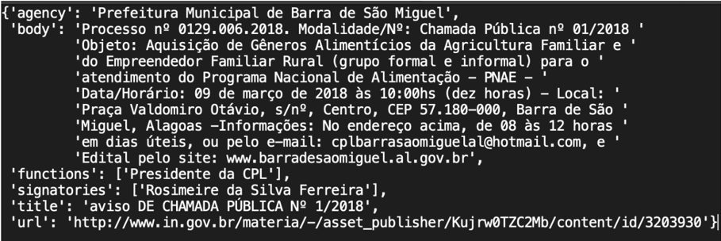

Versao certificada em PDF


A obtenção das URL s foi bem sucedida, capturando todas os endereços que o sistema se propôs a extrair dentro das suas capacidades de tempo e processamento tanto para os casos de dados em PDF quanto para os casos em HTML . A extração destas URL s era feita em blocos como exemplifica a Figura 6.3.

Figura 6.3: Exemplo de um bloco de URL s extraído.

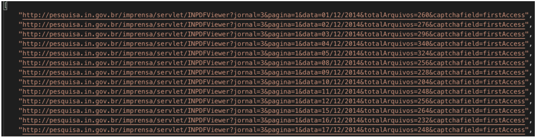

A conversão das páginas do diário em PDF para texto puro e em seguida sua formatação também foi bem sucedida em todos os casos analisados como mostra a Figura 6.4.

Figura 6.4: Exemplo de diários extraídos do PDF , convertidos em texto e estruturados.


## 6.2 Segmentação de Texto

No caso dos dados advindos do HTML , os dados principais (que não estavam contidos dentro do texto da publicação em linguagem natural) já eram segmentados. A segmentação das publicações extraídas dos PDF s foi realizada pelo módulo de segmentação. Todos PDFs convertidos em texto foram segmentados, gerando assim uma base de publicações satisfatória para a análise. Os dados obtidos a partir da segmentação do texto foram título da publicação, corpo textual da publicação e signatários.

Em uma amostragem de 59000 diários extraídos de dados advindos de PDF s, foram segmentadas 966140 publicações. Analisando uma amostra de 200 destes dos dados segmentados e comparando com a segmentação das publicações nos PDF s originais, mais de noventa e cinto por cento deles foram segmentados corretamente. A segmentação falhou majoritariamente em casos de quebra da formatação do próprio PDF , trazendo falhas ao conteúdo contínuo da página do diário. Um exemplo desta segmentação é mostrada na Figura 6.5.

Figura 6.5: Exemplo de segmentação dos dados de uma página do diário em PDF .

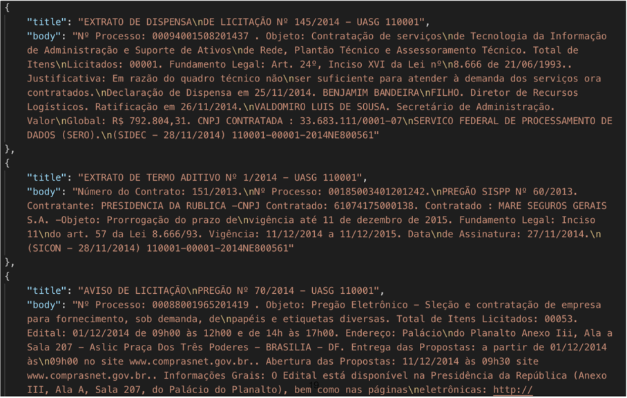

## 6.3 Extração de Entidades

A extração de entidades no texto foi objetiva para encontrar fatores bem referenciados e com características comuns claras (por exemplo número de CNPJ, valores monetários e datas). Os resultados foram satisfatórios para encontrar entidades em publicações relativas a licitações, encontrando valores, datas, nomes de concorrentes ou ganhadores de editais. A estratégia de utilizar expressões regulares funcionou bem para o propósito de entidades bem especificadas, para uma melhor generalização é possível treinar modelos de entidade nomeada que encontrem uma maior variedade de fatores (como nomes de empresas ou variações na escrita de nomenclaturas).

Utilizando-se uma amostragem de 100000 das publicações (advindas do HTML e do ano de 2018) e outra amostragem de 100000 publicações (advindas do PDF e do ano de 2014), foi possível perceber que em ambos os casos foi possível extrair diversas entidades das publicações isoladas, variando o tipo de entidade por tipo de publicação. Ou seja, há tipos de entidades que são característicos de tipos de publicações específicas. Para uma maior acurácia utilizando expressões regulares seria necessário mapear todas as possíveis entidades que ocorrem em determinados tipos diferentes de publicação.

De toda forma, mais de noventa por cento dos casos as publicações tinham alguma entidade que foi possível ser extraída. É possível verificar um exemplo de extração bem sucedida na publicação do tipo "Extrato de Termo Aditivo"na Figura 6.6).

Figura 6.6: Exemplo de extração de entidades de uma publicação.

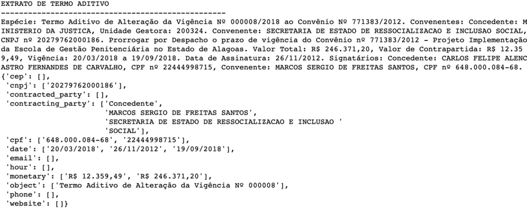

Utilizando a mesma amostragem de dados de 2018, foi possível listar e ordenar as vinte partes contratantes mais frequentes como mostra a Figura 6.7 e as vinte partes contratadas mais frequentes como mostra Figura 6.8. Este tipo de análise pode facilmente ser expandido para o resto da base de dados ou virar um módulo próprio de ranqueamento das entidades.

| instituto federal educacao                      |   1320 |
|-------------------------------------------------|--------|
| concedente                                      |    539 |
| instituto nacional seguro social                |    391 |
| ministerio justica seguranca publica            |    319 |
| ministerio fazenda                              |    310 |
| ministerio saude                                |    268 |
| fundacao nacional saude                         |    240 |
| comando aeronautica                             |    210 |
| uniao                                           |    207 |
| dnit departamento nacional infraest transportes |    196 |
| uniao federal                                   |    160 |
| fundacao oswaldo cruz                           |    154 |
| caixa economica federal                         |    137 |
| celebram uniao federal                          |    128 |
| empresa brasileira servico hospitalares ebserh  |    124 |
| ministerio agricultura                          |    112 |
| comando exercito                                |     94 |
| trt regiao                                      |     93 |
| defensoria publica uniao                        |     73 |

Figura 6.7: Exemplo de partes contratantes mais frequentes.

| empresa brasileira correio telegrafos                       |   153 |
|-------------------------------------------------------------|-------|
| claro                                                       |   122 |
| telemar norte leste                                         |   107 |
| voetur turismo representacoes ltda                          |    90 |
| telefonica brasil                                           |    85 |
| empresa brasil comunicacao                                  |    78 |
| ticket solucoes hdfgt                                       |    76 |
| imprensa nacional                                           |    75 |
| professora substituta                                       |    34 |
| beneficiario                                                |    33 |
| lideranca limpeza conservacao ltda                          |    31 |
| ceb distribuicao                                            |    28 |
| registrado                                                  |    28 |
| cooperativa agricultores familiares vale forquilha coopvale |    26 |
| fiotec fundacao desenvolvimento cientifico                  |    25 |
| trivale administracao ltda                                  |    25 |
| gente seguradora                                            |    24 |
| general motors brasil ltda                                  |    23 |
| numero                                                      |    22 |

Figura 6.8: Exemplo de partes contratadas mais frequentes.

## 6.4 Classificação de dados textuais

A classificação de dados textuais foi realizada principalmente para teste do funcionamento da arquitetura como foi explicado na Seção 5.5. O treinamento dos modelos foi realizado a partir de bases de dados rotuladas como descrito na Seção 5.2 e dentro das limitações de processamento e tempo do projeto. Houve o treinamento de modelos de classificação textual utilizando-se métodos de rotulação diferentes e algoritmos diferentes. Todavia a acurácia e a validade dos modelos em si não foi validada devido a insuficiência de conhecimento das regras de negócio sobre os dados estudados.

Foram realizados testes de rotulação dos dados a partir dos títulos das publicações em amostragens dos dados. Com estes conjuntos de dados rotulados por seu título, utilizouse os títulos das publicações como classes (como exemplificado na expressão regular da Seção 5.2). O conteúdo textual em linguagem natural da publicação foi utilizado como dado a ser classificação. Utilizou-se o conteúdo convertido em sua representação numérica (Seção 2.9.2) e em seguida os dados foram segregados em base de treinamento e base de teste. A partir desta estratégia buscou-se prever quais as classes das publicações de acordo com seus conteúdos. textos que envolviam fatos de licitação e preços foram todos alocados em uma mesma categoria na clusterização dos dados. Também foi utilizado o título das publicações para definir algumas classes, em seguida treinou-se modelos distintos com estas classes e foram apresentadas publicações não rotuladas ao modelo.

Foram escolhidas apenas três classes para treinamento e o que o modelo não fosse capaz de compreender foi alocado como uma quarta classe "outros". A acurácia desta classificação foi de, no mínimo, noventa e seis por cento. Todavia este treinamento tem o viés de muitas palavras indicativas do título estarem contidas no próprio texto da publicação e também de ter sido realizado com uma base rotulada artificialmente gerada.

Os resultados positivos desta etapa foram no teste da arquitetura. Foi possível testar o acoplamento de modelos treinados ao fim do fluxo de trabalho e confirmando que eles podem retroalimentar a base de dados com classificações.

## 6.5 Execução do projeto

Para a implementação do código foi utilizado uma máquina MacBook Pro (Retina, 15inch, Early 2013) , processador 2,4 GHz Intel Core i7 , com memória 8GB 1600 MHz DDR3 e gráficos Intel HD Graphics 4000 1536 MB . Foi utilizado o Python versão 3.7.2 , Docker versão 18.09.1 , pdftotext ( Portable Document Format ( PDF ) to text converter ) versão 4.01. Foi necessária a utilização de instâncias de máquinas na nuvem e máquinas locais menos potentes para os testes de extração massiva e processamento dos dados.

## Capítulo 7 Conclusões

Este projeto foi desenvolvido com o intuito de modelar e iniciar a implementação de uma arquitetura modular e, possivelmente, escalável que possa oferecer insumos para um melhor entendimento dos dados disponíveis. Foi possível tirar algumas conclusões sobre a implementação deste trabalho:

- Foi implementado um sistema realmente modular, com micro-serviços que cumpriram seu papel de comunicar com fluidez com possibilidade de se tornar escalável;
- Estratégias teóricas dos fluxos de extração, transformação e armazenamento dos dados foram implementadas na prática;
- Os dados originais realmente se mostraram extensos, muito heterogêneos e com um volume enorme de informações embutidas na linguagem natural o que dificultou a análise dos resultados que dependiam de validação humana;
- A leitura destes dados sem o uso das tecnologias apresentadas neste projeto se confirmou muito custosa;
- A acessibilidade aos dados analisados permanece ainda difícil para leigos com sistemas computacionais. A interpretação dos textos nos dados também não é didática para leigos;
- A ferramenta se mostrou capaz de gerar insumos para análises de um grande volume de dados, reduzindo a dimensionalidade do problema;
- Foi possível de mapear e extrair informações pontuais dentro de um texto em linguagem natural. Estas informações foram de extrema importância para uma extração rápida de conhecimento acerca daquele texto;
- Foi possível gerar listagens e ordenar detalhes descritos dentro do texto em linguagem natural, extraindo informações de utilidade;

- Houve necessidade de flexibilidade na interpretação das fontes, já que ao longo do desenvolvimento deste trabalho houve alterações nas páginas online ;
- Modificações nas fontes de dados e de métodos ao longo do tempo de implementação, trouxeram a reflexão sobre a importância da modularização. Foi necessário refatorar apenas códigos de módulos específicos, sem a necessidade de refatoração dos demais módulos;
- Durante o processo de implementação, surgiram novas opções de obtenção de dados como o XML . Todavia, a necessidade dos outros tipos de extratores de dados (PDF e HTML) permaneceu relevante. Apenas dados novos estão sendo disponibilizados em formatos mais modernos, desta forma, os formatos antigos ainda são necessários para a análise histórica dos dados;
- Expressões regulares para reconhecimento de entidades no texto em linguagem natural foi eficiente.
- A segmentação de diários em publicações por meio de expressão regulares também se mostrou eficiente;
- Pré-processamento se mostrou eficiente e seguiu as referências teóricas já conhecidas em PLN;
- Foi possível gerar insumos básicos que podem ser úteis para a classificação dos dados textuais, aprendizado de máquina e detecção de fraudes;
- A classificação efetiva dos dados ainda depende do conhecimento das regras de negócio e também da utilização dos insumos obtidos de forma correta.

Com estas conclusões, também é possível visualizar alguns trabalhos futuros que podem ser realizados a partir deste projeto:

- O reconhecimento de entidades pode ser melhor generalizado com aplicação de estratégias de reconhecimento de entidades nomeadas (NER) 2.5;
- A segmentação dos dados textuais dos PDF s em publicações provavelmente pode ser aprimorada pelo treinamento de modelos de segmentação. Há uma base de treinamento para treinar segmentadores de PDF s: existem datas em que há diários disponibilizados tanto em PDF quanto em HTML , ou seja, há a o texto original concatenado em PDF e a sua versão já corretamente segmentada em HTML que serviriam de base para o treinamento de um modelo. Em seguida estes modelos treinados poderiam ser aplicados aos PDF s mais antigos que não têm sua versão em HTML ;

- Existe uma grande oportunidade para aplicação de técnicas de processamento distribuído, utilizando técnicas como Map-Reduce .

Por fim, a abordagem proposta não se limita a aplicações na língua portuguesa ou a dados governamentais, devido ao seu caráter generalista. Certamente a mesma arquitetura ainda pode ser replicada para extrair diversos outros tipos de dados dentro de outros campos de conhecimento. Embora os estudos necessitem de conhecimento da área de negócio mais profundas para compreender os resultados, é possível analisar o desempenho do sistema como um extrator e processador de dados e fornecedor de insumos para o treinamento de modelos inteligentes. Assim sendo, trabalhos podem ser desenvolvidos aplicando a mesma arquitetura e conhecimentos de sistemas modulares e processamento de linguagem natural em outros cenários estocásticos.

## Referências

- [1] Goodfellow, Ian, Yoshua Bengio, Aaron Courville e Yoshua Bengio: Deep learning , volume 1. MIT press Cambridge, 2016. ix, 2, 18, 22
- [2] Google Text Classification Workflow . https://developers.google.com/ machine-learning/guides/text-classification/ . Accessed: 2018-11-01. ix, 29
- [3] Belaval, Yvon: Leibniz: Initiation à sa philosophie . Vrin, Paris introduction to Leibniz's thought, this book emphasizes the genesis of his philosophy. One long first part ('la formation') lays out Leibniz's biography and philosophical development; the second, shorter part treats 'le système.' Originally published in 1962., 2005. 1
- [4] Leibniz, Gottfried Wilhelm e Gottfried Wilhelm Freiherr von Leibniz: Leibniz: New essays on human understanding . Cambridge University Press, 1996. 1
- [5] Kulstad, Mark e Laurence Carlin: Leibniz's philosophy of mind . Em Zalta, Edward N. (editor): The Stanford Encyclopedia of Philosophy . Metaphysics Research Lab, Stanford University, winter 2013 edição, 2013. 1
- [6] Manning, Christopher, Mihai Surdeanu, John Bauer, Jenny Finkel, Steven Bethard e David McClosky: The stanford corenlp natural language processing toolkit . Em Proceedings of 52nd annual meeting of the association for computational linguistics: system demonstrations , páginas 55-60, 2014. 1
- [7] Appel, Andrew W: Modern compiler implementation in C . Cambridge university press, 2004. 1
- [8] Jacobson, Ralph: 2.5 quintillion bytes of data created every day. how does cpg &amp; retail manage it . IBM, 2013. 2
- [9] FERNANDES, RICARDO VIEIRA DE CARVALHO, HENRIQUE ARAÚJO COSTA e ANGELO GAMBA PRATA DE CARVALHO: Tecnologia jurídica e direito digital . 2
- [10] Sebastiani, Fabrizio: Machine learning in automated text categorization . ACM computing surveys (CSUR), 34(1):1-47, 2002. 2
- [11] Portal Brasileiro de Dados Abertos . http://dados.gov.br/ . Accessed: 2018-11-01. 3

| [12]   | ImprensaNacional . http://www.imprensanacional.gov.br/ . Accessed: 2018-11- 01. 4, 9                                                                                                                                                                     |
|--------|----------------------------------------------------------------------------------------------------------------------------------------------------------------------------------------------------------------------------------------------------------|
| [13]   | Liu, Bing: Web data mining: exploring hyperlinks, contents, and usage data . Springer Science & Business Media, 2007. 7                                                                                                                                  |
| [14]   | Mitchell, Ryan: Web Scraping with Python: Collecting More Data from the Modern Web . " O'Reilly Media, Inc.", 2018. 7, 8, 10                                                                                                                             |
| [15]   | Chakrabarti, Soumen, Martin Van den Berg e Byron Dom: Focused crawling: a new approach to topic-specific web resource discovery . Computer networks, 31(11- 16):1623-1640, 1999. 7                                                                       |
| [16]   | DOM introduction to the dom . https://developer.mozilla.org/en-US/docs/ Web/API/Document_Object_Model/Introduction . Accessed: 2018-09-05. 8                                                                                                             |
| [17]   | Blumberg, Robert e Shaku Atre: The problem with unstructured data . Dm Review, 13(42-49):62, 2003. 8                                                                                                                                                     |
| [18]   | The Natural Language Processing Dictionary . http://www.cse.unsw.edu.au/ ~billw/nlpdict.html . Accessed: 2018-11-01. 8, 9                                                                                                                                |
| [19]   | Portal Brasileiro de Dados Abertos - Diário Oficial da União . http://dados.gov. br/dataset/diario-oficial-da-uniao . Accessed: 2018-11-01. 9                                                                                                            |
| [20]   | Souza, Marlo, Renata Vieira, Débora Busetti, Rove Chishman e Isa Mara Alves: Construction of a portuguese opinion lexicon from multiple resources . Em Proceedings of the 8th Brazilian Symposium in Information and Human Language Technology , 2011. 9 |
| [21]   | Souza, Marlo e Renata Vieira: Sentiment analysis on twitter data for portuguese lan- guage . Em International Conference on Computational Processing of the Portuguese Language , páginas 241-247. Springer, 2012. 9                                     |
| [22]   | re - Regular expression operations . https://docs.python.org/3/library/re. html . Accessed: 2018-11-01. 10                                                                                                                                               |
| [23]   | Regular Expression HOWTO . https://docs.python.org/3/howto/regex.html# regex-howto . Accessed: 2018-11-01. 10                                                                                                                                            |
| [24]   | Nadeau, David e Satoshi Sekine: A survey of named entity recognition and classifi- cation . Lingvisticae Investigationes, 30(1):3-26, 2007. 12, 44                                                                                                       |
| [25]   | Fonseca, Erick Rocha e João Luís G Rosa: Mac-morpho revisited: Towards robust part-of-speech tagging . Em Proceedings of the 9th Brazilian symposium in information and human language technology , 2013. 12                                             |
| [26]   | Matsubara, Edson Takashi, Claudia Aparecida Martins e Maria Carolina Monard: Pretext: Uma ferramenta para pré-processamento de textos utilizando a abordagem bag-of-words . Techinical Report, 209:4, 2003. 13, 16                                       |

| [27]   | Porter, Martin F: An algorithm for suffix stripping . Program, 14(3):130-137, 1980. 13                                                                                                                                                                                                                                          |
|--------|---------------------------------------------------------------------------------------------------------------------------------------------------------------------------------------------------------------------------------------------------------------------------------------------------------------------------------|
| [28]   | Bird, Steven e Edward Loper: Nltk: the natural language toolkit . Em Proceedings of the ACL 2004 on Interactive poster and demonstration sessions , página 31. Associa- tion for Computational Linguistics, 2004. 13, 44                                                                                                        |
| [29]   | Orengo, Viviane e Christian Huyck: A stemming algorithmm for the portuguese lan- guage . Em spire , página 0186. IEEE, 2001. 13                                                                                                                                                                                                 |
| [30]   | Wilbur, W John e Karl Sirotkin: The automatic identification of stop words . Journal of information science, 18(1):45-55, 1992. 13                                                                                                                                                                                              |
| [31]   | Pedregosa, F., G. Varoquaux, A. Gramfort, V. Michel, B. Thirion, O. Grisel, M. Blondel, P. Prettenhofer, R. Weiss, V. Dubourg, J. Vanderplas, A. Passos, D. Cour- napeau, M. Brucher, M. Perrot e E. Duchesnay: Scikit-learn: Machine learning in Python . Journal of Machine Learning Research, 12:2825-2830, 2011. 14, 16, 44 |
|        | [32] Ramos, Juan et al. : Using tf-idf to determine word relevance in document queries . Em Proceedings of the first instructional conference on machine learning , volume 242, páginas 133-142, 2003. 14                                                                                                                       |
| [33]   | Hu, Xia e Huan Liu: Text analytics in social media . Em Mining text data , páginas 385-414. Springer, 2012. 16, 30                                                                                                                                                                                                              |
| [34]   | Mikolov, Tomas, Kai Chen, Greg Corrado e Jeffrey Dean: Efficient estimation of word representations in vector space . arXiv preprint arXiv:1301.3781, 2013. 16, 17                                                                                                                                                              |
| [35]   | Pennington, Jeffrey, Richard Socher e Christopher Manning: Glove: Global vectors for word representation . Em Proceedings of the 2014 conference on empirical methods in natural language processing (EMNLP) , páginas 1532-1543, 2014. 17                                                                                      |
| [36]   | Joulin, Armand, Edouard Grave, Piotr Bojanowski e Tomas Mikolov: Bag of tricks for efficient text classification . arXiv preprint arXiv:1607.01759, 2016. 17                                                                                                                                                                    |
|        | [37] MacQueen, James et al. : Some methods for classification and analysis of multivari- ate observations . Em Proceedings of the fifth Berkeley symposium on mathematical statistics and probability , volume 1, páginas 281-297. Oakland, CA, USA, 1967. 17                                                                   |
| [38]   | Hastie, Trevor, Robert Tibshirani e Jerome Friedman: Unsupervised learning . Em The elements of statistical learning , páginas 485-585. Springer, 2009. 17                                                                                                                                                                      |
| [39]   | Jain, Anil K: Data clustering: 50 years beyond k-means . Pattern recognition letters, 31(8):651-666, 2010. 17                                                                                                                                                                                                                   |
| [40]   | Wagstaff, Kiri, Claire Cardie, Seth Rogers, Stefan Schrödl et al. : Constrained k-means clustering with background knowledge . Em ICML , volume 1, páginas 577-584, 2001. 18                                                                                                                                                    |
| [41]   | Géron, Aurélien: Hands-on machine learning with Scikit-Learn and TensorFlow: con- cepts, tools, and techniques to build intelligent systems . " O'Reilly Media, Inc.", 2017. 18                                                                                                                                                 |

| [42]   | Gulli, Antonio e Sujit Pal: Deep Learning with Keras . Packt Publishing Ltd, 2017. 18                                                                                                                                                                                             |
|--------|-----------------------------------------------------------------------------------------------------------------------------------------------------------------------------------------------------------------------------------------------------------------------------------|
| [43]   | Khorasani, Elham S: Artificial intelligence: Structures and strategies for complex problem solving . Scalable Computing: Practice and Experience, 9(3), 2008. 18                                                                                                                  |
| [44]   | Joachims, Thorsten: Text categorization with support vector machines: Learning with many relevant features . Em European conference on machine learning , páginas 137- 142. Springer, 1998. 18                                                                                    |
| [45]   | Russell, Stuart J e Peter Norvig: Artificial intelligence: a modern approach . Malaysia; Pearson Education Limited,, 2016. 18, 19, 20                                                                                                                                             |
| [46]   | Jin, Junqi, Chengru Song, Han Li, Kun Gai, Jun Wang e Weinan Zhang: Real-time bidding with multi-agent reinforcement learning in display advertising . arXiv preprint arXiv:1802.09756, 2018. 19                                                                                  |
|        | [47] Pawar, Pratiksha Y e SH Gawande: A comparative study on different types of ap- proaches to text categorization . International Journal of Machine Learning and Com- puting, 2(4):423, 2012. 19, 20                                                                           |
| [48]   | Classification: True vs. False and Positive vs. Negative . https: //developers.google.com/machine-learning/crash-course/classification/ true-false-positive-negative . Accessed: 2018-11-01. 20                                                                                   |
| [49]   | Batista, Gustavo EAPA, Ronaldo C Prati e Maria Carolina Monard: A study of the behavior of several methods for balancing machine learning training data . ACM SIGKDD explorations newsletter, 6(1):20-29, 2004. 21                                                                |
| [50]   | Freitas, Alex A: Understanding the crucial differences between classification and dis- covery of association rules: a position paper . AcM sIGKDD Explorations Newsletter, 2(1):65-69, 2000. 22                                                                                   |
|        | [51] Newman, Sam: Building microservices: designing fine-grained systems . " O'Reilly Media, Inc.", 2015. 23                                                                                                                                                                      |
| [52]   | A impunidade e a seletividade dos crimes de colarinho branco. Tese de Mestrado, 2015. http://localhost:8080/tede/handle/tede/2716 , Ciências Humanas. 25                                                                                                                          |
| [53]   | Cioccari, Deysi: Operação lava jato: escândalo, agendamento e enquadramento . Re- vista Alterjor, 12(2):58-78, out. 2015. https://www.revistas.usp.br/alterjor/ article/view/aj12-a04 . 25                                                                                        |
| [54]   | Ferro, José Roberto: O departamento de 'operações estruturadas' da odebrecht , mar 2016. https://epocanegocios.globo.com/colunas/Enxuga-Ai/noticia/2016/ 03/o-departamento-de-operacoes-estruturadas-da-odebrecht.html . 25                                                       |
|        | [55] OLIVEIRA, BRUNO: O duplo grau de jurisdição na ação penal 470/mg: Con- siderações à luz do controle de convencionalidade . Revista Direito em Debate, 26(47):267-288, set. 2017. https://www.revistas.unijui.edu.br/index.php/ revistadireitoemdebate/article/view/5771 . 25 |

- [56] Musskopf, Irio, oct 2018. https://serenata.ai/about/ . 26
- [57] Big, Lucio, oct 2018. https://www.ops.net.br/ . 26
- [58] União, Controladoria Geral da, oct 2018. http://www.cgu.gov.br/assuntos/ informacoes-estrategicas/observatorio-da-despesa-publica . 26
- [59] Beautiful Soup Documentation . https://www.crummy.com/software/ BeautifulSoup/bs4/doc/ . Accessed: 2018-11-01. 40
- [60] pdftotext . https://www.xpdfreader.com/pdftotext-man.html . Accessed: 201811-01. 41
- [61] tempfile - Generate temporary files and directories . https://docs.python.org/3. 4/library/tempfile.html . Accessed: 2018-11-01. 41
- [62] Feature extraction . https://scikit-learn.org/stable/modules/feature\_ extraction.html . Accessed: 2018-09-05. 44
- [63] Docker . https://www.docker.com/ . Accessed: 2018-09-05. 45
- [64] RabbitMQ rabbitmq . https://www.rabbitmq.com/ . Accessed: 2018-09-05. 46