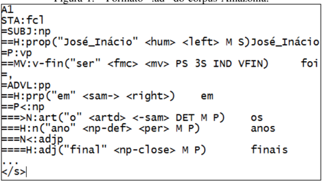
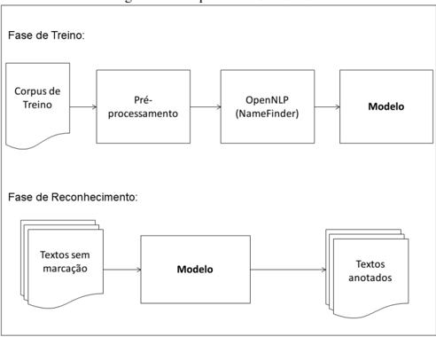

## Reconhecimento de Entidades Nomeadas para o Português Usando o OpenNLP

Evandro B. Fonseca, Gabriel C. Chiele,

Renata Vieira

Faculdade de Informática

## PUCRS

Porto Alegre, Brazil Email: evandro.fonseca, gabriel.chiele { @acad.pucrs.br } , renata.vieira@pucrs.br

Aline A. Vanin Dep. de Educação e Humanidades UFCSPA Porto Alegre, Brazil Email: aline.vanin@ymail.com

Abstract -In this paper, we present the construction process for a named entity recognition model using NameFinder, an OpenNLP class. The aim is to recognize and classify named entities for Portuguese, since there is a lack of a model for Portuguese in OpenNLP. To train and evaluate the model, the Amazônia and HAREM corpora were used. We show that the resulting OpenNLP model is compatible when compared with the current state of the art.

Resumo--Neste artigo apresentamos a construção de um modelo para o reconhecimento de entidades nomeadas utilizando o NameFinder, classe contida no OpenNLP. Nosso objetivo é reconhecer e classificar entidades nomeadas para o Português, dada a inexistência de um modelo para língua portuguesa no OpenNLP. Para treinar e avaliar o modelo, foram utilizados, respectivamente, os corpora Amazonas e Harem. Mostramos que nossos resultados são compatíveis com o atual estado da arte.

Keywords -Named Entities Recognition; Portuguese Language; Natural Language Processing; Machine Learning .

## I. INTRODUÇÃO

O reconhecimento de entidades nomeadas (NER) -Named Entity Recognition - é uma subárea de estudo no campo de extração de informação, cujo objetivo é identificar entidades nomeadas, bem como classificá-las dentro de um conjunto de categorias pré-definidas, tais como Pessoa, Organização, Local, as quais remetem a um referente específico. Dentro desse contexto, esta tarefa tem sido amplamente estudada [1].

O reconhecimento de entidades nomeadas é uma técnica amplamente utilizada em Processamento da Linguagem Natural e consiste na identificação de nomes de entidadeschave, presentes na forma livre de dados textuais. Nesse sentido, a entrada para um sistema de extração de entidades nomeadas é um texto em sua forma livre, e sua saída é um conjunto de textos anotados, ou seja, uma representação estruturada a partir da entrada de um texto não estruturado, como podemos ver em (a) :

a) 'José da Silva reside em Florianópolis e estuda na

UFSC (Universidade Federal de Santa Catarina)'.

Efetuando a extração das entidades nomeadas do exemplo (a) , temos: [José da Silva], [Florianópolis], [UFSC] e [Universidade Federal de Santa Catarina], respectivamente, entidades cujas categorias são: Pessoa, Local, Organização e Organização.

Reconhecer e aferir categorias a entidades nomeadas presentes em um texto não é uma tarefa fácil. Isso porque, quando o assunto são nomes próprios e entidades, estes podem remeter a mais de uma categoria (b) , ou simplesmente não possuir um contexto mais determinístico, que auxilie na desambiguação (c) :

b) 'A Mercedes esteve em crise nos últimos meses. A empresa afirma que...'.

c) 'Hoje foi um ótimo dia para Mercedes.'

Para o exemplo (b) , o contexto poderia auxiliar na desambiguação. Isto é, havendo uma relação entre os sintagmas [A Mercedes] e [A empresa], podemos aferir a categoria 'Organização' à entidade 'Mercedes', pois o sintagma nominal [a empresa] identifica uma organização.

Da mesma forma que o contexto pode auxiliar no reconhecimento de entidades nomeadas, a tarefa de NER pode acrescentar melhorias à interpretao textual, por exemplo. Coreixas [2] mostrou que o uso de categorias de entidades pode proporcionar uma melhora significativa na tarefa na resolução de correferências.

Em (c) , temos uma situação mais complexa. Note que apenas a informação contida na oração não é suficiente para aferir uma categoria à entidade nomeada. Não sabemos se 'Mercedes' é uma empresa que obteve êxito em seus negócios, ou se é uma pessoa que teve um ótimo dia.

Neste trabalho, apresentamos um novo classificador de entidades nomeadas para o Português, utilizando como base o NameFinder, uma classe contida no OpenNLP [3], cujo objetivo é identificar e classificar entidades nomeadas. Até o momento, o OpenNLP possuía modelos de NER para diversas línguas, como a espanhola, a inglesa, entre outras, mas nenhum havia sido desenvolvido para o português. A vantagem de utilizarmos o OpenNLP para essa tarefa é que, com isso, podemos obter um recurso mais completo, que forneça diversos tipos de anotação em uma única ferramenta. De forma a avaliar o modelo gerado, utilizamos o corpus do HAREM [4], juntamente com alguns sistemas de NER já existentes, disponíveis para o Português.

A estrutura do texto está disposta da seguinte forma: na presente seção, foi dada uma breve introdução sobre o tópico em estudo; na seção II, são relatados os principais recursos de NER , disponíveis para o Português, juntamente com o OpenNLP, um recurso de PLN escrito em JAVA, utilizado neste trabalho; na seção III, apresentamos os dois principais corpora, utilizados para treino e teste de nosso modelo; na seção IV, descrevemos a metodologia empregada na construção de nosso modelo; na seção V, são exibidos os resultados provenientes da avaliação, juntamente com resultados comparativos, remetentes ao atual estado da arte; e, por fim, na seção VI, são apresentadas as conclusões e os próximos trabalhos que darão continuidade a este estudo.

## II. SISTEMAS DE NER

Atualmente, existe uma quantidade razoável de recursos de NER , disponíveis para a língua portuguesa . Nesta Seção, descrevemos os principais deles, juntamente com o OpenNLP, recurso utilizado para gerar nosso classificador.

NERP-CRF: Desenvolvido em Python, sob licença opensource e utilizando aprendizagem de máquina, o NERP-CRF [1] é um recurso de NER para a língua portuguesa, que reconhece e classifica 10 categorias de entidades nomeadas (Pessoa, Local, Organização, Obra, Abstração, Tempo, Coisa, Outro, Valor, Acontecimento). Como seu próprio nome sugere, a ferramenta utiliza o algoritmo CRF e foi treinada por meio do corpus do HAREM [4].

LanguageTasks: LanguageTasks, também conhecido como Ltasks 1 , é um recurso de NER , livre para fins acadêmicos e pago para fins comerciais. Sua proposta principal é o reconhecimento e classificação de entidades nomeadas por meio de um ambiente web. O Ltasks conta também com uma API , desenvolvida em Java, objetivando dinamizar o processo, dessa forma o usuário acaba tendo maior flexibilidade para automatizar o processo. No entanto, como se trata de um recurso proprietário, livre apenas para uso acadêmico, em sua forma gratuita o número de acessos diários restringe-se a 1000, havendo a necessidade de que o usuário cadastre-se no website da ferramenta.

FreeLing: O FreeLing [5] é uma ferramenta de NER , contida na FreeLing package , cujo objetivo é prover recursos de PLN para o Português. No entanto, este toolkit possui recursos e funcionalidades para outros idiomas também, como o Espanhol e Inglês. O FreeLing é uma ferramenta open-source , escrita na linguagem C++. Outro aspecto interessante desse recurso é a existência de dois métodos para o reconhecimento de entidades nomeadas: o primeiro utiliza um modo mais simples, baseado em padrões morfo-sintáticos; já seu segundo método utiliza um meio mais sofisticado, envolvendo técnicas de aprendizado de máquina.

Palavras: Desenvolvido por Bick [6], o PALAVRAS é um parser para a língua portuguesa que possui uma série de recursos, tais como POS-tagging , anotação semântica, sintática, entre outras. Embora seu código seja fechado, sabe-se que este foi escrito utilizando as línguagens Python e Pearl. O software é baseado em um léxico contendo 50.000 lemmas e diversas regras gramaticais da língua portuguesa. Apesar de ser um recurso proprietário, o PALAVRAS é um toolkit bastante utilizado e reconhecido pelo meio acadêmico.

OpenNLP: O Apache OpenNLP é uma biblioteca Java baseada em aprendizado de máquina para o processamento de linguagem natural em texto. Suporta tarefas como tokenização, segmentação de sentença, etiquetagem morfosintática, extração de sintagmas, análise sintática, resolução de correferências e reconhecimento de entidades nomeadas. Embora o OpenNLP seja um recurso muito versátil, com modelos 2 disponíveis para diversos idiomas, até o momento não existia um reconhecedor de entidades nomeadas para o português.

Felizmente, o OpenNLP possui o NameFinder, uma biblioteca capaz de efetuar o treinamento de modelos, reconhecedores de entidades nomeadas, para qualquer idioma, por meio de um corpus de treinamento. Como bem sabemos, todo sistema baseado em aprendizado de máquina conta com features, que viabilizam a identificação de padrões, que auxiliam na classificação de suas amostras. Semelhante ao Stanford [7], o NameFinder utiliza um gerador de features padrão no qual, por meio de um arquivo de configuração em xml, o usuário pode escolher quais features serão utilizadas para conceber seu modelo. Na seção IV são mostrados como foi realizado o treinamento de nosso classificador de entidades usando esta API .

## III. CORPORA

Nessa seção descrevemos os dois corpora, que tiveram papel fundamental na concepção deste trabalho, o Amazônia[8] e o HAREM [4].

Amazônia: O corpus Amazônia 3 contém 4.6 milhões de palavras (cerca de 275 mil frases) retiradas do site colaborativo Overmundo 4 , um coletivo virtual que tem como objetivo apresentar a produção cultural brasileira. Por ser colaborativo, este website conta com um grande número de autores de diversos pontos do Brasil, o que se reflete também em dife- rentes estilos de escrita. Para o Amazônia, foram coletados todos os textos da seção 'Overblog' e todos os textos de não-ficção da seção 'Banco de Cultura', totalizando 4070 textos (1303 autores distintos). Diferentemente dos outros corpora da base do projeto Floresta Sintática, o Amazônia não é um corpus balanceado entre o português do Brasil e de Portugal: todos os textos são brasileiros (PT-BR).

- O corpus Amazônia é proveniente do Projeto Floresta Sintática [8] e possui o formato específico do projeto, chamado ´ Arvores Deitadas (.ad), conforme podemos visualizar na Figura 1, que remete ao fragmento de texto (d) :

d) 'José Inácio de Abreu e Lima foi, nos anos finais...'

Figura 1. Formato '.ad' do corpus Amazônia.

No formato AD, a informação linguística é codificada por meio dos pares função e forma . Assim, na terceira linha da Figura 1, há a indicação de que à função sujeito (SUBJ) corresponde a forma sintagma nominal (np). A informação relativa à hierarquia é marcada com o sinal de =. Na figura, vemos também que o sujeito 'José Inácio' pertence à categoria semântica 'Pessoa' (' &lt; hum &gt; ').

Harem: O corpus do HAREM [4] é uma iniciativa da Linguateca 5 , um centro de recursos distribuído para o processamento computacional da língua portuguesa, cujo objetivo é servir a comunidade que se dedica, em particular, ao processamento do Português. O primeiro HAREM [9], foi publicado em 2006, contendo anotações gold (anotações revisadas manualmente por profissionais das áreas linguística

3 Disponível em: http://www.linguateca.pt/floresta/ficheiros/gz/amazonia.ad.gz

4 http://www.overmundo.com.br/

5 http://www.linguateca.pt/

e da computação) de entidades nomeadas e suas categorias. O segundo corpus do HAREM [10] foi disponibilizado em 2008, com o mesmo objetivo: prover uma base anotada, que pudesse servir como referência no desenvolvimento e avaliação de sistemas voltados à tarefa de NER . Contudo, em sua versão mais recente, este foi ligeiramente melhorado. Atualmente, o HAREM possui 129 textos (89.241 palavras) anotados, distribuído em 10 categorias de entidades nomeadas, conforme podemos visualizar na Tabela I:

Tabela I DISTRIBUIÇÃO DAS CATEGORIAS NO SEGUNDO HAREM [4]

| Categoria       |   Entidades Nomeadas | Proporção   |
|-----------------|----------------------|-----------------|
| Pessoa          |                 2035 | 27.11%          |
| Local           |                 1250 | 18.15%          |
| Organização |                  960 | 14.02%          |
| Acontecimento   |                  302 | 4.21%           |
| Obra            |                  437 | 6.31%           |
| Abstração   |                  278 | 4.50%           |
| Coisa           |                  304 | 4.38%           |
| Tempo           |                 1189 | 15.21%          |
| Valor           |                  352 | 4.53%           |
| Outro           |                   79 | 1.2%            |

## IV. GERAÇÃO DO MODELO

Conforme dito anteriormente, para a concepção do novo modelo, utilizamos o OpenNLP, juntamente com suas bibliotecas e classes que viabilizam o treino, por meio de aprendizado de máquina.

Diferente da maioria dos trabalhos que propõem o aprendizado de máquina para a tarefa de NER , utilizamos o corpus Amazônia para treinar o modelo e o corpus do segundo HAREM para avaliá-lo. O início do processo de treino do modelo é dado com a marcação do corpus que será usado. Sendo assim, realizamos um pré-processamento sobre o corpus de treino (Amazônia), com a finalidade de gerar as anotações das categorias, que serão usadas pelo método. Posteriormente, o corpus está pronto para ser usado como entrada do OpenNLP.

Conforme vimos na Figura 1, o corpus Amazônia possui um formato específico, chamado ´ Arvores Deitadas (.ad). Para realizarmos o treino, foi necessária a conversão do corpus para um formato que seja aceito pelo método de treino da classe NameFinder. Este processo consiste em retirar marcações de POS (Part-of-Speech) distribuídas nos nós do corpus (Figura 1) e adicionar as marcações de categorias. Assim, ao final do procedimento, o corpus conterá apenas o texto com as anotações de categorias, conforme o fragmento de texto abaixo:

'A resposta do &lt; START:person &gt; Cineasta &lt; END &gt; italiano &lt; START:person &gt; Bertolucci &lt; END &gt; para 'ta lendária indagação é um Não, ' caio efemente ' falando, assim mesmo , maiúsculo e negrito. &lt; START:person &gt; Bertolucci &lt; END &gt; foi tão longe em 'ta sua posição em relação ao tema que no seu filme ' &lt; START:artprod &gt; Os Sonhadores (sobre as manifestações juvenis ocorridas na França de 1968) &lt; END ...'

Cada marcação de entidade nomeada inicia-se pela tag' &lt; START: categoria &gt; ' e é delimitada por ' &lt; END &gt; '.

Realizada a etapa de pré-processamento, passamos à etapa de treino, usando o próprio NameFinder, contido no OpenNLP. Na Figura 2, podemos visualizar de forma mais detalhada a metodologia empregada para a concepção de nosso modelo. Basicamente, esta divide-se em duas etapas: Fase de Treino e Fase de Reconhecimento. A fase de treino, como o próprio nome sugere, consiste em treinar o modelo usando o corpus pré-processado como entrada; a fase de reconhecimento consiste na identificação e classificação das entidades nomeadas, tendo como entrada textos simples, livres de anotação.

Figura 2. Arquitetura do Modelo

## V. AVALIAÇÃO

A avaliação do modelo foi realizada de duas formas: a primeira em relação à coleção dourada do segundo HAREM; e a segunda em relação aos outros recursos de NER para a língua portuguesa (mencionados na seção III).

Inicialmente, executamos o modelo, tendo como entrada os textos do segundo HAREM (livres de anotação). Em seguida, utilizamos um código escrito em JAVA, cujo objetivo é, basicamente receber como entrada a coleção dourada do segundo HAREM, juntamente com a saída de cada sistema a ser avaliado. Na Tabela II podemos visualizar que existem 3 colunas: a primeira, 'HAREM', representa a quantidade de entidades nomeadas existentes na coleção dourada segundo HAREM, que foram identificadas por nosso recurso de avaliação; a segunda, 'Encontradas', refere-se à quantidade de entidades nomeadas encontradas pelo sistema de NER ; a terceira, 'Acertos', remete à quantidade de entidades nomeadas que o modelo encontrou, que possuem grafia e classe semântica idênticas à coleção dourada.

Na Tabela III, temos a precisão , recall e f-measure de cada classe para o modelo. Note que as classes semânticas que obtiveram melhores resultados foram: 'Pessoa', 'Local' e 'Organização', atingindo respectivamente um f-measure de 57.61%, 54.10% e 40.50%. Dessas três classes, podemos notar, também, que 'Organização' obteve uma precisão bastante baixa, se comparada às duas anteriores. Isso remete à dificuldade de muitos outros recursos de NER , como podemos notar na Tabela VI. Nas tabelas IV, V e VI, mostramos resultados comparativos entre o modelo gerado e os atuais modelos, mencionados na seção III. Nas Tabelas VII, VIII e IX, mostramos a quantidade de entidades enconcontradas por cada sistema, bem como a quantidade de acertos. Realizamos testes levando em consideração as três categorias de entidades nomeadas mais relevantes: Pessoa, Local e Organização. Como podemos notar, o modelo apresenta resultados bastante compatíveis em relação aos demais modelos. Podemos notar também a dificuldade da maioria dos modelos em obter bons resultados para a categoria 'Organização'.

Tabela II QUANTIDADE DE ENTIDADES CORRETAMENTE CLASSIFICADAS

|                 |   HAREM |   Encontrados |   Acertos |
|-----------------|---------|---------------|-----------|
| Pessoa          |    2035 |          1964 |      1152 |
| Local           |    1250 |          1164 |       653 |
| Organização |     960 |          1919 |       583 |
| Acontecimento   |     302 |           725 |        82 |
| Obra            |     437 |           174 |        41 |
| Abstração   |     278 |           182 |        33 |
| Coisa           |     304 |            78 |        11 |
| Tempo           |    1189 |           666 |        45 |
| Valor           |     352 |           335 |       138 |
| Outro           |      79 |             0 |         0 |
| Total           |    7186 |          7217 |      2741 |

Tabela III RESULTADOS DA AVALIAÇÃO DO MODELO

|                 | Precisão   | Recall   | F-measure   |
|-----------------|--------------|----------|-------------|
| Pessoa          | 58,65%       | 56,60%   | 57,61%      |
| Local           | 56,09%       | 52,23%   | 54,10%      |
| Organização | 30,38%       | 60,72%   | 40,50%      |
| Acontecimento   | 11,72%       | 28,14%   | 16,53%      |
| Obra            | 23,56%       | 9,38%    | 13,42%      |
| Abstração   | 17,18%       | 11,87%   | 14,04%      |
| Coisa           | 14,10%       | 3,61%    | 5,75%       |
| Tempo           | 6,75%        | 3,78%    | 4,85%       |
| Valor           | 41,19%       | 39,20%   | 40,17%      |
| Outro           | 0%           | 0%       | 0%          |
| Total           | 37,97%       | 38,14%   | 38,06%      |

Tabela IV AVALIAÇÃO DOS RECURSOS PARA A CATEGORIA PESSOA.

| Sistema   | Precisão   | Recall   | F-measure   |
|-----------|--------------|----------|-------------|
| OpenNLP   | 58.65%       | 56.60%   | 57.61%      |
| NERP-CRF  | 56.13%       | 49.73%   | 52.74%      |
| LTASK     | 61.92%       | 61.38%   | 61.65%      |
| Freeling  | 53.97%       | 60.44%   | 57.02%      |
| PALAVRAS  | 59.66%       | 63.73%   | 61.63%      |

Tabela V AVALIAÇÃO DOS RECURSOS PARA A CATEGORIA LOCAL.

Tabela VI AO DOS RECURSOS PARA A CATEGORIA ORGANIZAÇÃO

| Sistema   | Precisão   | Recall   | F-measure   |
|-----------|--------------|----------|-------------|
| OpenNLP   | 56.09%       | 52.23%   | 54.10%      |
| NERP-CRF  | 48.26%       | 53.36%   | 50.68%      |
| LTASK     | 56.24%       | 52.64%   | 54.38%      |
| Freeling  | 52.48%       | 60.08%   | 56.02%      |
| PALAVRAS  | 54.19%       | 54.80%   | 54.49%      |

AVALIAC ¸ ˜

Tabela VII

| Sistema   | Precisão   | Recall   | F-measure   |
|-----------|--------------|----------|-------------|
| OpenNLP   | 30.38%       | 60.72%   | 40.50%      |
| NERP-CRF  | 43.64%       | 47.92%   | 45.68%      |
| LTASK     | 28.19%       | 60.00%   | 38.36%      |
| Freeling  | 27.54%       | 59.90%   | 37.73%      |
| PALAVRAS  | 30.12%       | 51.15%   | 37.92%      |

ENTIDADES ENCONTRADAS E ACERTOS PARA A CATEGORIA PESSOA [HAREM: 2035].

Tabela VIII

| Sistema   |   Entidades Encontradas |   Acertos |
|-----------|-------------------------|-----------|
| OpenNLP   |                    1964 |      1152 |
| NERP-CRF  |                    1803 |      1028 |
| LTASK     |                    2017 |      1262 |
| Freeling  |                    2279 |      1243 |
| PALAVRAS  |                    2158 |      1318 |

ENTIDADES ENCONTRADAS E ACERTOS PARA A CATEGORIA LOCAL [HAREM: 1250].

Tabela IX

| Sistema   |   Entidades Encontradas |   Acertos |
|-----------|-------------------------|-----------|
| OpenNLP   |                    1164 |       653 |
| NERP-CRF  |                    1382 |       718 |
| LTASK     |                    1170 |       714 |
| Freeling  |                    1431 |       823 |
| PALAVRAS  |                    1193 |       741 |

ENTIDADES ENCONTRADAS E ACERTOS PARA A CATEGORIA ORGANIZAÇÃO [HAREM: 960]

| Sistema   |   Entidades Encontradas |   Acertos |
|-----------|-------------------------|-----------|
| OpenNLP   |                    1919 |       583 |
| NERP-CRF  |                    1054 |       511 |
| LTASK     |                    2043 |       639 |
| Freeling  |                    2088 |       631 |
| PALAVRAS  |                    1615 |       544 |

## VI. CONCLUSÃO

Neste artigo, apresentamos a construção de um modelo para o reconhecimento de entidades nomeadas para o Por- tuguês. Utilizando a coleção dourada do segundo HAREM, foi possível avaliar o modelo para cada uma das 10 categorias. Além disso, efetuamos uma avaliação de desempenho entre nosso classificador e os principais recursos de NER para o Português, mostrando que nosso modelo é compatível com os demais, podendo ser ligeiramente superior em alguns aspectos. Além disso, uma grande vantagem na utilização desse modelo, se da pela sua fácil integração ao OpenNLP. Dessa forma, conseguimos reunir diversas funcionalidades, tais como: POS tagging , lematização, análise morfológica e reconhecimento de entidades nomeadas, utilizando um único recurso. Futuramente, pretendemos integrar nosso modelo 6 de NER desenvolvido a um sistema de resolução de correferências, o qual já está em fase de desenvolvimento.

## VII. AGRADECIMENTOS

Os autores agradecem o suporte financeiro do CNPq, CAPES e Fapergs.

## REFERÊNCIAS

- [1] D. O. F. do Amaral, 'O reconhecimento de entidades nomeadas por meio de conditional random fields para a língua portuguesa,' 2013.
- [2] T. Coreixas, 'Resolução de correferência e categorias de entidades nomeadas,' 2010.
- [3] J. Baldridge, 'The opennlp project,' URL: http://opennlp. apache. org/index. html,(accessed 2 February 2012) , 2005.
- [4] C. Freitas, C. Mota, D. Santos, H. G. Oliveira, and P. Carvalho, 'Second harem: Advancing the state of the art of named entity recognition in portuguese.' in LREC , 2010.
- [5] L. Padró, M. Collado, S. Reese, M. Lloberes, I. Castellón et al. , 'Freeling 2.1: Five years of open-source language processing tools,' 2010.
- [6] E. Bick, The parsing system' Palavras': Automatic grammatical analysis of Portuguese in a constraint grammar framework . Aarhus Universitetsforlag, 2000.
- [7] J. R. Finkel, T. Grenager, and C. Manning, 'Incorporating non-local information into information extraction systems by gibbs sampling,' in Proceedings of the 43rd Annual Meeting on Association for Computational Linguistics . Association for Computational Linguistics, 2005, pp. 363-370.
- [8] C. Freitas, P. Rocha, and E. Bick, 'Um mundo novo na floresta sintá (c) tica-o treebank do português,' Calidoscópio , vol. 6, no. 3, pp. 142-148, 2008.
- [9] D. Santos, N. Seco, N. Cardoso, and R. Vilela, 'Harem: An advanced ner evaluation contest for portuguese,' in Proceedings of LREC , 2006, pp. 1986-1991.
- [10] D. Santos, C. Freitas, H. G. Oliveira, and P. Carvalho, 'Second harem: new challenges and old wisdom,' in Computational Processing of the Portuguese Language . Springer, 2008, pp. 212-215.

6 O modelo encontra-se disponível em:

http://www.inf.pucrs.br/linatural/Recursos