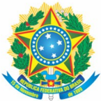

Ministério da Educação Secretaria de Educação Profissional e Tecnológica Instituto Federal de Educação; Ciência e Tecnologia de Mato Grosso do Sul

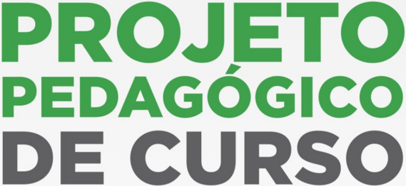

## SUPERIOR DE TECNOLOGIA EM ANÁLISE E DESENVOLVIMENTO DE SISTEMAS

Naviraí - MS

Dezembro, 2022

## Missão

Promover a educação de excelência por meio do ensino; pesquisa e extensão nas diversas áreas do conhecimento técnico e tecnológico; formando profissional humanista e inovador, com vistas a induzir 0 desenvolvimento econômico e social local, regional e nacional.

## Visão

Ser reconhecido como uma instituição de ensino de excelência, sendo referência em educação; ciência e tecnologia no Estado de Mato Grosso do Sul.

## Valores

Inovação;

Ética;

Compromisso com 0 desenvolvimento local e

regional;

Transparência;

Compromisso Social.

## MINISTÉRIO DA EDUCAÇÃO Secretaria de Educação Profissional e Tecnológica Instituto Federal de Educação, Ciência e Tecnologia de Mato Grosso do Sul

## INSTITUTO FEDERAL DE EDUCAÇÃO, CIÊNCIA E TECNOLOGIA DE MATO GROSSO DO SUL IFMS

Endereço: Rua Jornalista Belizário Lima, 236 - Vila Glória - Campo Grande/MS (Endereço provisório) CNPJ: 10.673.078/0001-20

## IDENTIFICAÇÃO

CURSO SUPERIOR DE TECNOLOGIA EM ANÁLISE E DESENVOLVIMENTO DE SISTEMAS

Classificação documental: 121.1

Proponente:

Campus Naviraí

Elaborado por: Comissão de reestruturação do Projeto Pedagógico do Curso Superior de Tecnologia em Análise e Desenvolvimento de Sistemas

## TRAMITAÇÃO

CONSELHO SUPERIOR

Aprovação: Resolução n° 056, de 13 de novembro de 2015 (Ad referendum)

## 2ª TRAMITAÇÃO - ATUALIZAÇÃO

CONSELHO SUPERIOR

Processo n°:

23347.017404.2018-54

Reunião: 30ª Ordinária

Data da reunião: 11/12/2018

Aprovação: Resolução nº 063, de 14 de novembro de 2018 ( Ad referendum )

Resolução nº 068, de 13 de dezembro de 2018 (Homologação)

Publicação: 14 de novembro de 2018

Publicação: 13 de dezembro de 2018

## 3ª TRAMITAÇÃO - ATUALIZAÇÃO

CONSELHO DE ENSINO, PESQUISA E EXTENSÃO

Processo n°: 23347.008258.2021-71

Relatoria: Gleison Nunes Jardim

Reunião: 22ª Ordinária

Data da reunião: 08/11/2022

Aprovação: Resolução nº 52/2022 - COEPE/RT/IFMS, de 25 de novembro de 2022.

Publicação: Boletim de Serviço nº 193, de 25 de novembro de 2022.

## 4ª TRAMITAÇÃO - ATUALIZAÇÃO

CONSELHO SUPERIOR

Processo n°: 23347.008258.2021-71

Relatoria: Celly Nataly Cavalcante de Souza

Reunião: 40ª Extraordinária

Data da reunião: 08/12/2022

Aprovação: Resolução nº 58/2022 - COSUP/RT/IFMS, de 21 de dezembro de 2022.

Publicação: Boletim de Serviço nº 209, de 21 de dezembro de 2022.

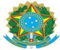

## MINISTÉRIO DA EDUCAÇÃO Secretaria de Educação Profissional e

## Tecnológica Instituto Federal de Educação; Ciência e Tecnologia de Mato Grosso do Sul

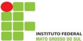

Denominação

: Curso Superior de Tecnologia em Análise e Desenvolvimento de Sistemas

Titulação conferida

: Tecnólogo (a) em Análise e Desenvolvimento de Sistemas

Modalidade do curso

: Presencial

Forma de oferta

: Semestral

Eixo Tecnológico

: Informação e Comunicação

Duração do Curso

: 6 períodos ou 3 anos

Carga Horária:

1905 h - 2540 h/a

Estágio Curricular Supervisionado:

180 h - 240 h/a

Trabalho de Conclusão de Curso:

100 h - 133,33 h/a

Atividades Complementares:

50 h - 66,67 h/a

Carga horária Total

: 2235 h - 2980 h/a

## MINISTÉRIO DA EDUCAÇÃO Secretaria de Educação Profissional e Tecnológica Instituto Federal de Educação; Ciência e Tecnologia de Mato Grosso do Sul

CNPJ 10.673.078/0001-20

## Reitora do Instituto Federal de Educação, Ciência e Tecnologia de Mato Grosso do Sul

Elaine Borges Monteiro Cassiano

## Pró-Reitora de Ensino

Cláudia Santos Fernandes

## Diretor de Graduação

Rodrigo Andrade Cardoso

## Diretor-Geral do Campus Naviraí

Matheus Bornelli de Castro

## Diretor de Ensino, Pesquisa e Extensão

Wagner Antoniassi

## Diretor de Administração

João Batista de Morais

Comissão de reestruturação do Projeto Pedagógico do Curso Superior de Tecnologia em

## Análise e Desenvolvimento de Sistemas

Presidente: Nicholas Eduardo Lopes dos Santos

Membros:

André Carvalho Baida

Caio Maqueise Alécio Pinheiro

Diego Barros e Silva

Laurentino Augusto Dantas

Vagner da Silva Bezerra

## SUMÁRIO

| 1.  JUSTIFICATIVA.......................................................................................................................8   |
|---------------------------------------------------------------------------------------------------------------------------------------------|
| 1.1.  Introdução..........................................................................................................................8 |
| 1.2.  Características Socioeconômicas do Estado de Mato Grosso do Sul............................10                                         |
| 1.3.  Características de trabalho e emprego para Mato Grosso do Sul..................................20                                     |
| 1.4.  Características Socioeconômicas do Município de Naviraí e Região.............................29                                       |
| 1.4.1.  Índice de Desenvolvimento Humano Municipal (IDHM)...........................................32                                      |
| 1.4.2.  Cenário Educacional.................................................................................................32              |
| 1.4.3.  PIB de Naviraí e demais Municípios.........................................................................33                       |
| 1.4.4.  Setor Primário (Agropecuária)..................................................................................35                   |
| 1.4.5.  Setor Secundário (Indústrias)...................................................................................36                  |
| 1.4.6.  Setor Terciário (Serviços).........................................................................................37               |
| 1.4.7.  Dados de trabalho e emprego de Naviraí.................................................................38                           |
| 1.5.  Demanda e Qualificação Profissional..............................................................................44                   |
| 2.  OBJETIVOS...........................................................................................................................45  |
| 2.1.  Objetivo Geral..................................................................................................................45    |
| 2.2.  Objetivos Específicos......................................................................................................45         |
| 3.  CARACTERÍSTICAS DO CURSO........................................................................................46                      |
| 3.1.  Público-Alvo.....................................................................................................................46   |
| 3.2.  Forma de Ingresso..........................................................................................................46         |
| 3.3.  Regime de Enriquecimento Curricular.............................................................................47                    |
| 3.4.  Regime de Ensino...........................................................................................................47         |
| 3.5.  Regime de Matrícula.......................................................................................................48          |
| 3.6.  Detalhamento do Curso...................................................................................................48            |
| 4.  PERFIL PROFISSIONAL DO EGRESSO.............................................................................49                           |
| 5.  ORGANIZAÇÃO CURRICULAR...........................................................................................49                     |
| 5.1.  Flexibilidade Curricular....................................................................................................50        |
| 5.1.1.  Núcleo de Análise e Desenvolvimento de Sistemas.................................................51                                  |
| 5.1.2.  Trilhas de aprendizado.............................................................................................52               |
| 5.1.3.  Atividades de extensão.............................................................................................53               |
| 5.1.4.  Matriz Curricular........................................................................................................55         |
| 5.2.  Distribuição da Carga Horária.........................................................................................56              |
| 5.2.1.  Atividades EAD.........................................................................................................58           |

## MINISTÉRIO DA EDUCAÇÃO Secretaria de Educação Profissional e Tecnológica Instituto Federal de Educação; Ciência e Tecnologia de Mato Grosso do Sul

## CNPJ 10.673.078/0001-20

| 5.3.  Ementas e Bibliografias...................................................................................................60                                                        |
|-------------------------------------------------------------------------------------------------------------------------------------------------------------------------------------------|
| 5.4.  Prática Profissional........................................................................................................131                                                     |
| 5.4.1.  Estágio Curricular Supervisionado..........................................................................131                                                                    |
| 5.4.2.  Trabalho de Conclusão de Curso...............................................................................132                                                                  |
| 5.4.3.  Atividades Complementares...................................................................................132                                                                   |
| 5.4.4.  Educação Ambiental...............................................................................................133                                                              |
| 6.  METODOLOGIA..................................................................................................................133                                                      |
| 6.1.  Abordagem Metodológica do Curso..............................................................................136                                                                    |
| 6.2.  O uso de Tecnologias de Informação na Aprendizagem..............................................137                                                                                 |
| 7.  AVALIAÇÃO DA APRENDIZAGEM...................................................................................137                                                                       |
| 7.1.  Regime Especial de Dependência................................................................................138                                                                   |
| 7.2.  Aproveitamento e Avaliação dos Conhecimentos Adquiridos.......................................139                                                                                   |
| 7.3.  Avaliação Integrada.......................................................................................................139                                                       |
| 8.  INFRAESTRUTURA DO CURSO........................................................................................139                                                                    |
| 8.1.  Instalações....................................................................................................................139                                                  |
| 8.2.  Laboratórios Didáticos Especializados - Layouts.........................................................141                                                                         |
| 9.  PESSOAL DOCENTE.........................................................................................................142                                                           |
| 9.1.  NÚCLEO DOCENTE ESTRUTURANTE - NDE..............................................................144                                                                                  |
| 9.2.  Colegiado do Curso.......................................................................................................144                                                        |
| 9.3.  Coordenação do Curso.................................................................................................144                                                            |
| 10.  CORPO TÉCNICO.............................................................................................................145                                                        |
| 11.  APOIO AO DISCENTE......................................................................................................147                                                           |
| 11.1.  Políticas de Inclusão....................................................................................................147                                                       |
| 11.2.  Atendimento e/ou Permanência de Estudantes..........................................................148                                                                            |
| 11.3.  Núcleo de Gestão Administrativa e Educacional.........................................................149                                                                          |
| 11.4.   Núcleo de Atendimento às Pessoas com Necessidades Educacionais Específicas (NAPNE) e Núcleo de Estudos Afro-brasileiros e Indígenas (NEABI)...................................150 |
| 11.5.  Regime Domiciliar.......................................................................................................150                                                        |
| 11.6.  Acompanhamento ao Egresso....................................................................................151                                                                   |
| 12.  DIPLOMAÇÃO...................................................................................................................151                                                     |
| 12.1.  Certificações parciais..................................................................................................152                                                        |
| 13.  AVALIAÇÃO DO CURSO.................................................................................................154                                                               |
| 13.1.  Comissão Própria de Avaliação - CPA.......................................................................154                                                                      |
| 13.2.  Avaliação do Docente pelo Discente...........................................................................155                                                                   |
| 14.  REFERÊNCIAS BIBLIOGRÁFICAS.................................................................................155                                                                       |

## MINISTÉRIO DA EDUCAÇÃO

Secretaria de Educação Profissional e Tecnológica

Instituto Federal de Educação; Ciência e Tecnologia de Mato Grosso do Sul

CNPJ 10.673.078/0001-20

## 1.  JUSTIFICATIVA

## 1.1.  Introdução

A proposta de organização e gestão dos Institutos Federais propõe o diálogo com as realidades regional e local para atender às demandas de desenvolvimento sustentável, inclusivo, com arranjos e tecnologias educacionais próprios. Sua organização pedagógica verticalizada permite aos docentes atuarem em diferentes níveis de ensino e, principalmente, permite aos discentes o compartilhamento de espaços de aprendizagem e a estruturação de uma trajetória de formação (PACHECO, 2011).

A implantação e ampliação gradativa dos Cursos Superiores de Tecnologia em Análise e Desenvolvimento de Sistemas são instrumentos para adequar o Ensino Superior ao contexto da realidade socioeconômica do país. Não se trata apenas de implantar cursos novos, mas de criar uma sistemática de ação, fundamentada nas necessidades da comunidade. A proposta de implantação e oferta do Curso Superior de Tecnologia em Análise e Desenvolvimento de Sistemas vem ao encontro dos objetivos do IFMS.

Com a aprovação da Lei no 9.394 (Lei de Diretrizes e Bases da Educação Nacional LDB), em 20 de dezembro de 1996, pelo Congresso Nacional e com o Decreto nº 5.154, de 23 de julho de 2004, que regulamentou os artigos da LDB referentes à educação profissional e tecnológica, consolidaram-se os mecanismos para a reestruturação dos cursos de superiores de tecnologia, permitindo a utilização de todo o potencial que lhes é característico sem as amarras que a velha legislação lhes impunha.

Ancorado pelo Parecer CNE/CES no 436/01, de 02 de abril de 2001, que trata de Cursos Superiores de Tecnologia - Formação de Tecnólogos e pela Resolução CNE/CP nº 1/2021, que institui as Diretrizes Curriculares Nacionais Gerais para a Educação Profissional de Nível Tecnológico, a atual proposta é a caracterização efetiva de um novo modelo de organização curricular de nível superior, que privilegia as exigências do mundo do trabalho cada vez mais competitivo e mutante, no sentido de oferecer à sociedade uma formação profissional de nível superior com duração compatível com a área tecnológica e, principalmente, relacionada com a atualidade dos requisitos profissionais.

Com o propósito de aprimorar e fortalecer os Cursos Superiores de Tecnologia e em cumprimento Decreto nº 5.773 (revogado pelo Decreto n° 9.235), o Ministério da Educação apresentou em 2006 um guia sobre o perfil de competências do tecnólogo. Este guia era composto por carga horária mínima e a infraestrutura recomendada para cada curso e teve sua última atualização realizada em 2016. Ele serve para referenciar estudantes, educadores, institui-

## MINISTÉRIO DA EDUCAÇÃO

Secretaria de Educação Profissional e Tecnológica

Instituto Federal de Educação; Ciência e Tecnologia de Mato Grosso do Sul

CNPJ 10.673.078/0001-20

ções, sistemas e redes de ensino, entidades representativas de classes, empregadores e o público em geral sobre como os cursos superiores de tecnologia são organizados e ofertados e é inspirado nas Diretrizes Curriculares Nacionais Gerais para a Educação Profissional de Nível Tecnológico, aprovado pela Resolução CNE/CP Nº 1, de 5 de janeiro de 2021, e em sintonia com a dinâmica do setor produtivo e os requerimentos da sociedade atual. Configurado, desta forma, na perspectiva de formar profissionais aptos a desenvolver, de forma plena e inovadora, as atividades em uma determinada área profissional e com capacidade para utilizar, desenvolver ou adaptar tecnologias com a compreensão crítica das implicações daí decorrentes e das suas relações com o processo produtivo, o ser humano, o ambiente e a sociedade.

Com a sistematização e a oferta do Catálogo, as instituições que oferecem graduações tecnológicas foram orientadas a adotarem as denominações dos cursos que o compõem, com suas respectivas caracterizações, neles referenciando-se tanto para a oferta de novos cursos, quanto para a migração dos cursos em desenvolvimento, beneficiando a todos os futuros profissionais.

Devido às mudanças no cenário econômico mundial que vêm ocorrendo nos últimos anos e ao fenômeno da globalização, verifica-se o surgimento de novos atributos necessários aos profissionais da era do conhecimento. O mercado mundial tornou-se mais competitivo e exigente, tanto em produtos como em serviços, o que impõe uma nova postura profissional.

A informática, hoje, está inserida em todos os segmentos do setor produtivo. A criação de novas oportunidades profissionais e de um novo perfil às profissões já estabelecidas advém da passagem da Era da Produção para a Era da Informação. A utilização de computadores no dia a dia da sociedade, nas mais diversas áreas de atuação justifica a qualificação de profissionais para essa demanda.

Nesta perspectiva, sendo a informática uma ferramenta essencial no processo de desenvolvimento de diversas atividades administrativas e operacionais, há uma grande solicitação do contexto socioeconômico para a formação de profissionais dessa área, a fim de atender à grande demanda do mercado de trabalho.

Mesmo com a economia local apoiada em grande parte no agronegócio, a dependência de sistemas de informação eficientes é cada vez maior. Grandes empresas locais do agronegócio procuram crescentemente a melhoria de sistemas informatizados, gerando demanda de profissionais desta área.

Especificamente as áreas de Desenvolvimento de Software e Sistemas de Informação apresentam-se como boas possibilidades de carreira no Brasil e, especialmente, no Mato Grosso do Sul. O investimento das empresas brasileiras no setor de tecnologia vem crescendo em relação ao seu faturamento, isto deve contribuir para a melhora na demanda por profissionais qualificados em tecnologia da informação.

## MINISTÉRIO DA EDUCAÇÃO

Secretaria de Educação Profissional e Tecnológica

Instituto Federal de Educação; Ciência e Tecnologia de Mato Grosso do Sul

## CNPJ 10.673.078/0001-20

Embora ainda seja um estado essencialmente agropecuário, Mato Grosso do Sul iniciou sua industrialização mais forte nos últimos anos. Empresas do setor industrial e comercial e as empresas do setor de serviços por elas demandadas necessitam intensamente do trabalho de profissionais e empresas de informática para garantir a eficiência e agilidade em seus processos administrativos, principalmente através do adequado manejo informatizado de seus sistemas de informação. Para essas empresas, a utilização das tecnologias de informação por meio da automação pode significar redução de custos, ganho de produtividade, e facilidade de relacionamento com clientes e fornecedores.

A indústria no Estado do Mato Grosso do Sul se desenvolve com rapidez, e com isso há necessidade de profissionais adequadamente treinados. As empresas se preocupam cada vez mais em obter vantagens competitivas sobre seus concorrentes e uma das ferramentas para alcançar este objetivo é utilizar o que a tecnologia pode oferecer de mais moderno.

Consequentemente, os profissionais da área de computação são mais exigidos, com uma necessidade maior por conhecimento de novas tecnologias e métodos de trabalho, motivados por fatores como implantação ou renovação da base tecnológica computacional.

## 1.2.  Características Socioeconômicas do Estado de Mato Grosso do Sul

O Estado de Mato Grosso do Sul (MS), localizado na região Centro-Oeste do território nacional, possui extensão territorial de 357.145,8 km², sendo o 6º com maior área dentre as unidades da federação, correspondendo a 4,19% do território nacional. Tem como limites os Estados de Goiás (nordeste), Minas Gerais (leste), Mato Grosso (norte), Paraná (sul) e São Paulo (sudeste), além da Bolívia (oeste) e o Paraguai (oeste e sul).

Criado pelo desmembramento da área do Estado de Mato Grosso pela lei complementar n. 31, de 11 de outubro de 1977, sendo que a efetiva divisão ocorreu em janeiro de 1979 e Campo Grande foi escolhida como capital do Estado.

Segundo dados do Instituto Brasileiro de Geografia e Estatística (IBGE), de acordo com estimativas de agosto de 2021, a população sul-mato-grossense é de 2.839.188 habitantes. Para 2023, a projeção da população de Mato Grosso do Sul é de 2.896.624 habitantes, conforme Tabela 1. Constata-se que no período 2014 a 2018, a população sul-mato-grossense aumentou à taxa anual de 1,19% a.a., enquanto que no período 2019-2023, espera-se redução na taxa de crescimento populacional, para 1,04% a.a..

## MINISTÉRIO DA EDUCAÇÃO

Secretaria de Educação Profissional e Tecnológica

Instituto Federal de Educação; Ciência e Tecnologia de Mato Grosso do Sul

## CNPJ 10.673.078/0001-20

| Tabela 1: Projeção da população total de Mato Grosso do Sul - período 2014 - 2023.   | Tabela 1: Projeção da população total de Mato Grosso do Sul - período 2014 - 2023.   | Tabela 1: Projeção da população total de Mato Grosso do Sul - período 2014 - 2023.   | Tabela 1: Projeção da população total de Mato Grosso do Sul - período 2014 - 2023.   | Tabela 1: Projeção da população total de Mato Grosso do Sul - período 2014 - 2023.   | Tabela 1: Projeção da população total de Mato Grosso do Sul - período 2014 - 2023.   | Tabela 1: Projeção da população total de Mato Grosso do Sul - período 2014 - 2023.   | Tabela 1: Projeção da população total de Mato Grosso do Sul - período 2014 - 2023.   | Tabela 1: Projeção da população total de Mato Grosso do Sul - período 2014 - 2023.   | Tabela 1: Projeção da população total de Mato Grosso do Sul - período 2014 - 2023.   | Tabela 1: Projeção da população total de Mato Grosso do Sul - período 2014 - 2023.   |
|--------------------------------------------------------------------------------------|--------------------------------------------------------------------------------------|--------------------------------------------------------------------------------------|--------------------------------------------------------------------------------------|--------------------------------------------------------------------------------------|--------------------------------------------------------------------------------------|--------------------------------------------------------------------------------------|--------------------------------------------------------------------------------------|--------------------------------------------------------------------------------------|--------------------------------------------------------------------------------------|--------------------------------------------------------------------------------------|
| Ano                                                                                  | 2014                                                                                 | 2015                                                                                 | 2016                                                                                 | 2017                                                                                 | 2018                                                                                 | 2019                                                                                 | 2020                                                                                 | 2021                                                                                 | 2022                                                                                 | 2023                                                                                 |
| População                                                                            | 2.621.214                                                                            | 2.653.928                                                                            | 2.685.454                                                                            | 2.716.534                                                                            | 2.748.023                                                                            | 2.778.986                                                                            | 2.809.394                                                                            | 2.839.188                                                                            | 2.868.279                                                                            | 2.896.624                                                                            |

Fonte: IBGE/Diretoria de pesquisas. Coordenação de população e indicadores Sociais

Segundo dados da Pesquisa Nacional por Amostra de Domicílios Contínua (PNAD Contínua), a população sul-mato-grossense era formada em 2017 por 2.648 mi pessoas, sendo 1.281 mi homens e 1.367 mi mulheres, representando 48,4% e 51,6%, respectivamente, conforme Tabela 2 e Gráfico 1.

Tabela 2: População total de MS conforme sexo e idade - 2017 (mil pessoas)

|        |   Total |   0 a 4 anos |   5 a 9 anos |   10 a 13 anos |   14 a 15 anos |   16 a 17 anos |   18 a 19 anos |   20 a 24 anos |   25 a 29 anos |   30 a 39 anos |   40 a 49 anos |   50 a 59 anos |   60 a 64 anos |   65 anos ou mais |
|--------|---------|--------------|--------------|----------------|----------------|----------------|----------------|----------------|----------------|----------------|----------------|----------------|----------------|-------------------|
| Total  |   2.648 |          203 |          192 |            157 |             79 |             80 |             78 |            214 |            207 |            416 |            351 |            305 |            125 |               241 |
| Homem  |   1.281 |          106 |           90 |             81 |             38 |             40 |             41 |            105 |            104 |            201 |            164 |            143 |             59 |               109 |
| Mulher |   1.367 |           97 |          101 |             76 |             41 |             40 |             36 |            109 |            103 |            215 |            186 |            162 |             67 |               132 |

Fonte: IBGE - Pnad Contínua 2017

Em 2017, Mato Grosso do Sul possuía 26,9% da população formada por pessoas com até 17 anos de idade, 34,5% com idade entre 18 anos e 39 anos e 38,6% com pessoas com 40 anos ou mais. Comparando por sexo, homens era maioria para pessoas com até 17 anos de idade (27,7% homens contra 25,97% mulheres) e para pessoas de 18 a 40 anos (35,2% homens contra 33,87% mulheres), enquanto que para pessoas com 40 anos de idade ou mais, as mulheres formavam maioria, sendo 40% contra 37,08% homens.

## MINISTÉRIO DA EDUCAÇÃO

Secretaria de Educação Profissional e Tecnológica

## CNPJ 10.673.078/0001-20

Gráfico 1: População total de MS conforme sexo e idade - 2017 (mil pessoas).

Fonte: Elaborada pelos autores com base em IBGE - Pnad Contínua 2017.

Quanto à expectativa de vida da população, segundo a Tábua Completa de Mortalidade divulgada pelo IBGE, a esperança de vida ao nascer para pessoa nascida em 2017 no Estado de MS era de 75,8 anos, enquanto a expectativa brasileira era de 76 anos. A expectativa de vida ao nascer para homens era de 72,39 anos, enquanto que para as mulheres era de 79,47 anos, ambos pouco abaixo da expectativa nacional, de 72,5 anos para homens e 79,6 anos para mulheres.

Em relação ao índice de desenvolvimento humano (IDH), divulgado pelo Programa das Nações Unidas para o Desenvolvimento (PNUD), é uma medida resumida do progresso a longo prazo, considerando renda, educação e saúde, de modo a complementar a análise de desenvolvimento. O índice a nível estadual acompanhou a evolução do índice a nível nacional nas pesquisas divulgadas, conforme Gráfico 2. Em 2010, o IDH em MS foi de 0,729, considerado alto (entre 0,700 e 0,799), visto que valores mais próximos de 1 correspondem a alto grau de desenvolvimento, enquanto valores próximos de 0 representam baixo grau de desenvolvimento humano.

## MINISTÉRIO DA EDUCAÇÃO Secretaria de Educação Profissional e Tecnológica Instituto Federal de Educação; Ciência e Tecnologia de Mato Grosso do Sul

## CNPJ 10.673.078/0001-20

Gráfico 2: IDH: Brasil e MS.

## IDH

Fonte: PNUD e Atlas Brasil.

Quanto ao nível de instrução da população de MS, o levantamento realizado pelo Censo em 2010 (Gráfico 3) apontou que mais da metade das pessoas com idade superior a 10 anos (correspondendo 1,06 milhão de pessoas, ou 51,48%) não possuíam instrução ou possuíam apenas grau fundamental incompleto. Somando-se ao número de pessoas que possuíam até ensino fundamental completo ou ensino médio incompleto, o percentual da população chegou a 68,7% daqueles acima de 10 anos de idade. Apenas 22% da população pesquisada possuíam ensino médio completo e somente 8,87% possuía ensino superior completo.

Gráfico 3: Nível de instrução da população de MS em 2010 - pessoas de 10 anos ou Mais de idade.

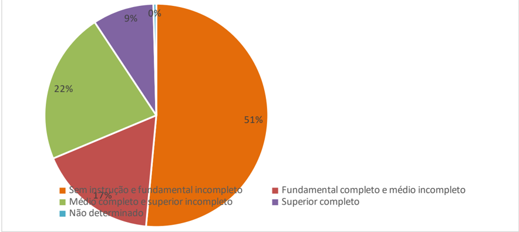

Fonte: IBGE, Censo Demográfico 2010.

## MINISTÉRIO DA EDUCAÇÃO Secretaria de Educação Profissional e Tecnológica Instituto Federal de Educação; Ciência e Tecnologia de Mato Grosso do Sul

## CNPJ 10.673.078/0001-20

A Tabela 3 apresenta percentual de pessoas com mais de 25 anos e a distribuição conforme nível de instrução no ano de 2017. Em MS, 51,3% dessas pessoas possuíam no máximo ensino fundamental completo ou equivalente. Quando somamos aqueles que possuíam ensino médio incompleto, obtemos 56,3% da população acima de 25 anos de idade com nível de instrução abaixo do médio.

Tabela 3: Distribuição das pessoas de 25 anos ou mais de idade conforme nível de instrução em MS em 2017 (%)

| Nível de instrução                    | BRASIL   | MS   |
|---------------------------------------|----------|------|
| Sem instrução                         | 7,2      | 5,5  |
| Fundamental incompleto ou equivalente | 33,8     | 37,4 |
| Fundamental completo ou equivalente   | 8,5      | 8,4  |
| Médio incompleto ou equivalente       | 4,4      | 5,0  |
| Médio completo ou equivalente         | 26,8     | 22,7 |
| Superior incompleto ou equivalente    | 3,6      | 4,6  |
| Superior completo                     | 15,7     | 16,5 |

Fonte: IBGE - PNAD Contínua, 2017.

O nível de analfabetismo em MS para pessoas com 15 anos ou mais ficou em 5%, abaixo da taxa nacional de 7% da população, conforme dados da PNAD Contínua de 2017. Segundo o IBGE, 7% da população brasileira acima de 15 anos corresponderia a 11,5 milhões de pessoas que não sabiam ler e escrever, visto na Tabela 4. O índice de analfabetismo em MS ficou abaixo da meta do Plano Nacional de Educação (meta para 2015 era de 93,5% de taxa de alfabetização da população acima de 15 anos), enquanto o índice a nível nacional não foi suficientemente baixo para cumpri-la.

Tabela 4: Taxa de analfabetismo em MS em 2017 - (%)

| Grupos de idade - analfabetismo   | BRASIL   | MS   |
|-----------------------------------|----------|------|
| 15 anos ou mais                   | 7        | 5    |
| 18 anos ou mais                   | 7,4      | 5,3  |
| 25 anos ou mais                   | 8,5      | 6,1  |
| 40 anos ou mais                   | 11,9     | 9,3  |
| 60 anos ou mais                   | 19,3     | 16,4 |

Fonte: IBGE - PNAD Contínua, 2017.

No campo econômico, o produto interno bruto (PIB) representa a soma de todos os bens e serviços finais produzidos numa determinada região, durante um determinado período. O PIB é medido em valores monetários e desconsidera-se os produtos intermediários (usados para

## MINISTÉRIO DA EDUCAÇÃO

Secretaria de Educação Profissional e Tecnológica

Instituto Federal de Educação; Ciência e Tecnologia de Mato Grosso do Sul

CNPJ 10.673.078/0001-20

produzir outros bens) para evitar dupla contagem do valor. Mede a atividade econômica e o nível de riqueza de uma região.

Quando se procura comparar ou analisar o comportamento do PIB de uma região ao longo do tempo, utiliza-se o conceito de PIB real. Para isto, leva-se em conta apenas as variações nas quantidades produzidas dos bens, e não nas alterações de seus preços de mercado. Para isso, faz-se uso de um deflator (normalmente um índice de preços) que desconta o aumento de preços da economia, isolando-o, chegando assim ao crescimento real (aquele que se dá apenas das variações nas quantidades produzidas).

O PIB nominal de Mato Grosso do Sul foi um pouco acima de R$ 83 bilhões no ano de 2015, colocando-o na 16ª posição entre todos os Estados, com uma participação de 1,4% na economia brasileira (IBGE, 2017).

Quando considera os dados entre 2003 e 2015, o crescimento econômico real estadual foi superior à média nacional em 1,26 ponto percentual ao ano (conforme Gráfico 4); além disso,   o   Estado   mostrou   resultado   bastante   superior   ao   país,   principalmente   após   2008 (IBGE,2015). Mesmo assim, sofreu as consequências da desaceleração econômica que ocorre desde 2014, havendo crescimento econômico negativo em termos reais no ano de 2015 (último dado disponível).

Gráfico 4: Taxas anuais de crescimento econômico em termos reais.

Fonte: Elaborada pelos autores com base em IBGE, 2017.

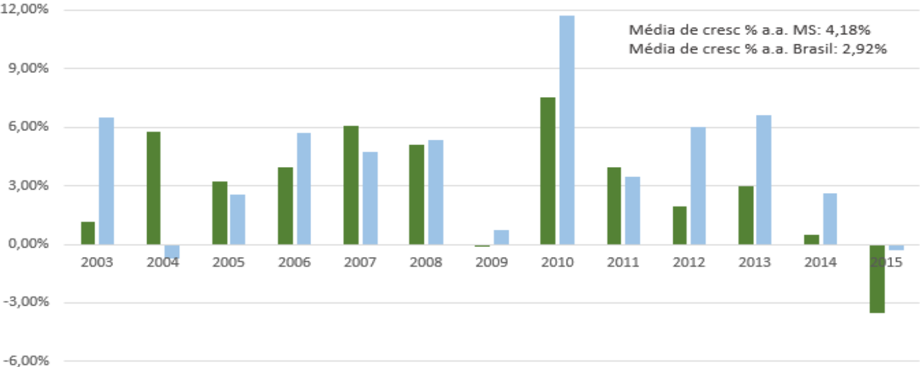

Assumindo o ano de 2002 como ano-base (2002 = 100), e tomando as taxas de crescimento real do Brasil e do Estado, o Gráfico 5 mostra o descolamento a partir de 2009 entre o MS e o Brasil. Entre 2003 e 2015, o Estado cresceu cerca de 70%, enquanto o crescimento nacional foi cerca de 45%.

## MINISTÉRIO DA EDUCAÇÃO Secretaria de Educação Profissional e Tecnológica Instituto Federal de Educação; Ciência e Tecnologia de Mato Grosso do Sul

## CNPJ 10.673.078/0001-20

## Gráfico 5: Evolução do PIB real: Brasil e MS (2000 = 100). Evolução do PIB: MS x Brasil

Fonte: Elaborada pelos autores com base em IBGE, 2017.

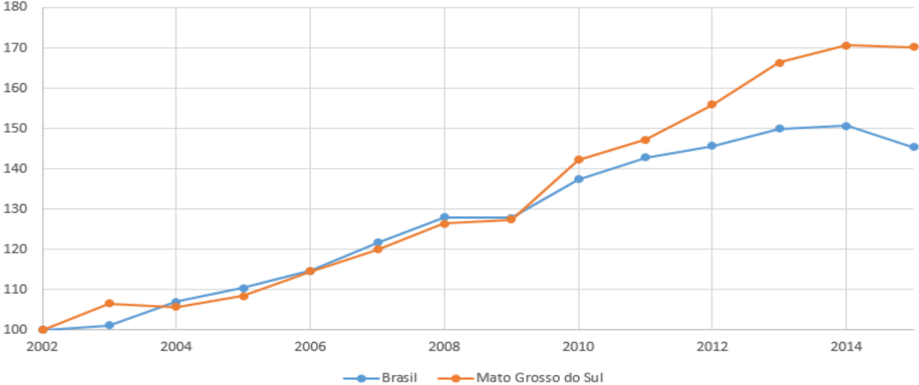

Para o cálculo do PIB per capita, divide-se o PIB nominal pela população do território analisado, como se toda a produção de um determinado período fosse igualmente dividida por todos os habitantes daquele local. O dado é apresentado de forma anual.

O valor do PIB per capita de Mato Grosso do Sul no ano de 2015 foi de R$ 31.337,22, colocando-o na 8ª posição entre os Estados brasileiros, enquanto o PIB per capita brasileiro foi de R$ 29.326,33, conforme o Gráfico 6.

Gráfico 6: PIB per capita: Brasil e MS.

PIB per capita

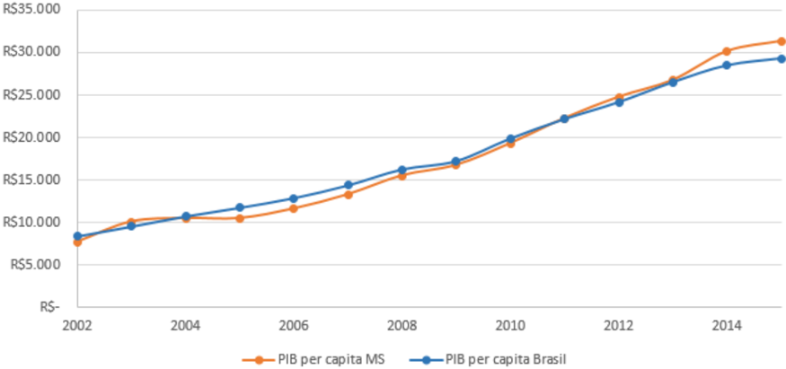

Fonte: Elaborada pelos autores com base em IBGE, 2017.

## MINISTÉRIO DA EDUCAÇÃO

Secretaria de Educação Profissional e Tecnológica

Instituto Federal de Educação; Ciência e Tecnologia de Mato Grosso do Sul

## CNPJ 10.673.078/0001-20

É comum que o produto interno bruto e a atividade econômica serem analisados pelas características dos setores produtivos, de acordo com os produtos produzidos, modos de produção e recursos utilizados. O setor primário engloba atividades de extração ou produção de matérias primas, como agricultura, pecuária e extração vegetal, por exemplo. O setor secundário envolve a produção de máquinas e equipamentos, extração mineral, construção civil, e também geração e fornecimento de água, gás e energia. Por fim, o setor terciário é definido como o setor de comércio e prestação de serviços, em que há comercialização de bens tangíveis e intangíveis. Pela metodologia do IBGE, entende-se como setor terciário, entre outros, comércio, serviços de transportes, administração pública e serviços financeiros.

A participação dos três setores na economia brasileira se mostra consolidada, sem muitas alterações no período analisado, com larga presença do setor terciário (serviços), seguido pelo secundário (indústria) e primário (agropecuária). A tendência que se viu no período analisado foi o aumento de serviços e queda da indústria, que chegou a representar 28,63% do PIB brasileiro em 2004 e em 2015 estava em 22,51%, o menor valor no período.

É importante lembrar que parte do que é entendido como 'agronegócio' envolve tanto atividades primárias de produção e extração, assim como parte da indústria e serviços ligados à agropecuária. Por este motivo, a importância de toda a atividade do agronegócio é superior aos 5,02% do Gráfico 7 em 2015. A Confederação da Agricultura e Pecuária do Brasil (CNA) junto ao Centro de Estudos Avançados em Economia Aplicada (Cepea) estimaram que a participação de todas as atividades do agronegócio correspondeu a 20,50% do PIB brasileiro em 2015.

Gráfico 7: Participação dos setores no PIB do Brasil (%).

Fonte: IBGE (2017).

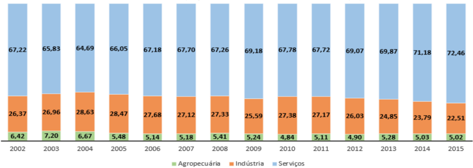

De maneira semelhante, no Estado de Mato Grosso do Sul, o setor de serviços possui maior peso para a economia com quase 60% de tudo que é produzido. Esta é uma realidade na maioria das cidades do Estado (quando analisadas isoladamente) e, com exceção de Três La-

## MINISTÉRIO DA EDUCAÇÃO Secretaria de Educação Profissional e Tecnológica Instituto Federal de Educação; Ciência e Tecnologia de Mato Grosso do Sul

## CNPJ 10.673.078/0001-20

goas em que o setor secundário lidera, os 10 maiores municípios do Estado possuem o setor de serviços como o mais representativo. A agropecuária possui um maior peso na economia do Estado quando comparada ao seu peso na economia nacional.

Gráfico 8: Participação dos setores no PIB do MS (%).

Fonte: IBGE (2017).

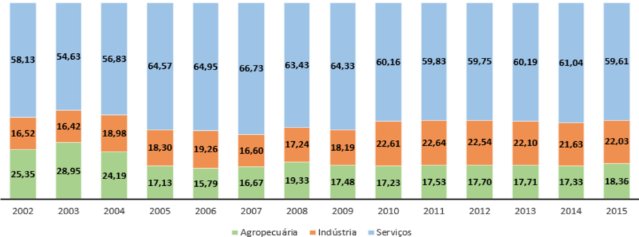

Como já comentado acima segundo o Gráfico 8, o setor que mais possui peso na economia do Estado é o de serviços e isto se reflete em quase todas as microrregiões. As exceções são as microrregiões de Paranaíba e Três Lagoas, ambas com o setor secundário (indústria) com maior expressão.

As distribuições geográficas aqui utilizadas seguem a divisão adotada pelo IBGE, em que existem 11 microrregiões no Estado de Mato Grosso do Sul. Esta divisão foi adotada em vista de alguns dados disponibilizados pelo IBGE serem segregados respeitando o Quadro 1, o que facilita para apresentação de tais dados:

Quadro 1: Microrregiões de Mato Grosso do Sul

| Microrregião   | Municípios                                                                                                   |
|----------------|--------------------------------------------------------------------------------------------------------------|
| Alto Taquari   | Alcinópolis, Camapuã, Coxim, Figueirão, Pedro Gomes, Rio Verde de Mato Grosso, São Gabriel do Oeste e Sonora |
| Aquidauana     | Aquidauana, Anastácio, Dois Irmãos do Buriti e Miranda                                                       |
| Baixo Pantanal | Corumbá, Ladário e Porto Murtinho                                                                            |
| Bodoquena      | Bela Vista,   Bodoquena,   Bonito,   Caracol,   Guia   Lopes   da Laguna, Jardim e Nioaque                   |
| Campo Grande   | Bandeirantes,   Campo   Grande,   Corguinho,   Jaraguari,   Rio Negro, Rochedo, Sidrolândia e Terenos        |
| Cassilândia    | Cassilândia, Chapadão do Sul, Costa Rica e Paraíso das Águas                                                 |

## MINISTÉRIO DA EDUCAÇÃO

Secretaria de Educação Profissional e Tecnológica

Instituto Federal de Educação; Ciência e Tecnologia de Mato Grosso do Sul

## CNPJ 10.673.078/0001-20

| Dourados       | Amambai, Antônio João, Aral Moreira, Caarapó, Douradina, Dourados,  Fátima   do   Sul,   Itaporã,   Juti,   Laguna   Carapã, Maracaju, Nova Alvorada do Sul, Ponta Porã, Rio Brilhante e Vicentina   |
|----------------|------------------------------------------------------------------------------------------------------------------------------------------------------------------------------------------------------|
| Iguatemi       | Angélica, Coronel Sapucaia, Deodápolis, Eldorado, Glória de Dourados, Iguatemi, Itaquiraí, Ivinhema, Japorã, Jateí, Mundo Novo, Naviraí, Novo Horizonte do Sul, Sete Quedas, Paranhos e Tacuru       |
| Nova Andradina | Anaurilândia,   Bataguassu,   Bataiporã,   Nova   Andradina   e Taquarussu                                                                                                                           |
| Paranaíba      | Aparecida do Taboado, Inocência, Paranaíba e Selvíria                                                                                                                                                |
| Três Lagoas    | Água Clara, Brasilândia, Ribas do Rio Pardo, Santa Rita do Pardo e Três Lagoas                                                                                                                       |

Fonte: IBGE (2017).

Dentre as microrregiões (Gráfico 9 e 10), Campo Grande, Dourados e Três Lagoas representam juntas mais de 66% da economia do Estado, com a MRG de Campo Grande na liderança com 31,1% (Gráfico 11). Os pontos em vermelho (círculos abertos) no Gráfico 11 mostram a porcentagem da população de cada microrregião em relação ao total do Estado. Por exemplo, a MRG de Campo Grande tem cerca de 36% da população do Estado em seus municípios; a MRG do Alto Taquari tem cerca de 4,7% da população do Estado em seus municípios. De modo geral, existe uma alta correlação do tamanho da população com o tamanho da economia de cada microrregião, com poucas exceções, como Três Lagoas.

Gráfico 9: Participação dos setores do PIB - Por microrregião 1.

Fonte: Elaborada pelos autores com base em IBGE, 2017.

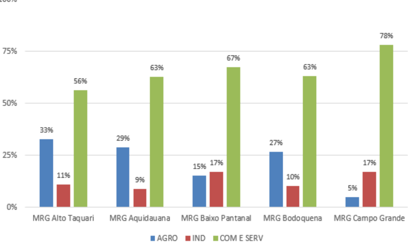

## MINISTÉRIO DA EDUCAÇÃO Secretaria de Educação Profissional e Tecnológica Instituto Federal de Educação, Ciência Tecnologia de Mato Grosso do Sul

## CNPJ 10.673,.078/0001-20

## Gráfico 10: Participação dos setores do PIB - Por microrregião 2.

Fonte: Elaborada pelos autores com base em IBGE, 2017.

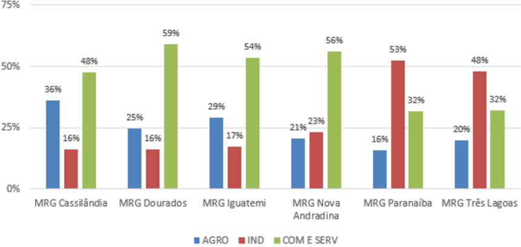

Gráfico 11: Participação no PIB do Estado x População - Por microrregião.

Fonte: Elaborada pelos autores com base em IBGE, 2017.

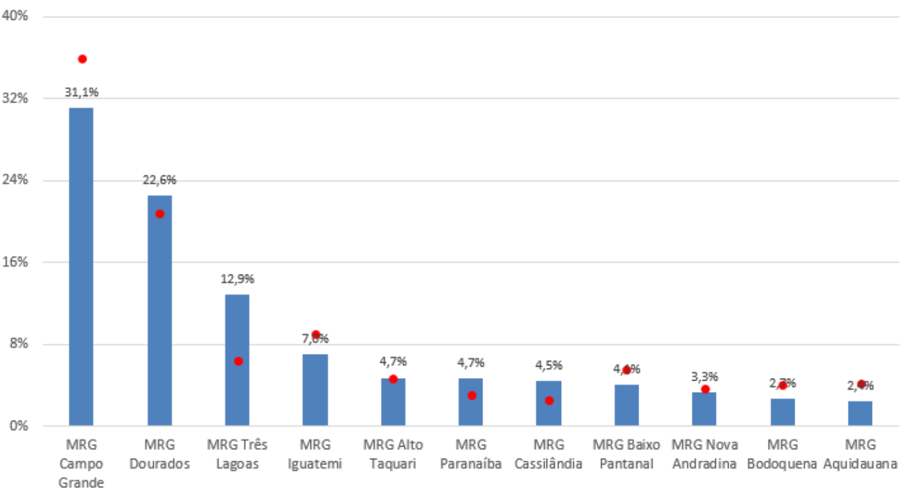

## 1.3.  Características de trabalho e emprego para Mato Grosso do Sul

Para analisarmos o comportamento do emprego, utilizamos a base de dados da Relação Anual de Informações Sociais (RAIS), disponibilizada pelo Ministério do Trabalho através do Programa de Disseminação das Estatísticas do Trabalho (PDET).

## MINISTÉRIO DA EDUCAÇÃO

Secretaria de Educação Profissional e Tecnológica

Instituto Federal de Educação; Ciência e Tecnologia de Mato Grosso do Sul

## CNPJ 10.673.078/0001-20

O número de empregos medido por essas informações em determinado período de referência corresponde ao total de vínculos empregatícios efetivados, sendo estes definidos como as relações de emprego formal onde há ocorrência de trabalho remunerado. As informações se referem ao emprego formal, não considerando, portanto, as relações de emprego que envolvam empresas não formalizadas.

A RAIS é um Registro Administrativo, de periodicidade anual, criada com a finalidade de suprir as necessidades de controle, de estatísticas e de informações às entidades governamentais da área social. Constitui um instrumento imprescindível para o cumprimento das normas legais, como também é de fundamental importância para o acompanhamento e a caracterização do mercado de trabalho formal.

Outra fonte de dados do Ministério do Trabalho é o CAGED (Cadastro Geral de Empregados e Desempregados). A base de dados do CAGED é constituída pela identificação da instituição empregadora, nome dos colaboradores, cargos e outras informações gerais. Deve declarar todo estabelecimento que tenha admitido, desligado ou transferido empregado com contrato de trabalho regido pela CLT. Vale lembrar que os números de variação do emprego formal representam o saldo líquido do período, ou seja, admissões menos as demissões.

Gráfico 12: Variação do emprego formal (2017) - Por setor.

Elaborada pelos autores com base em CAGED, 2018.

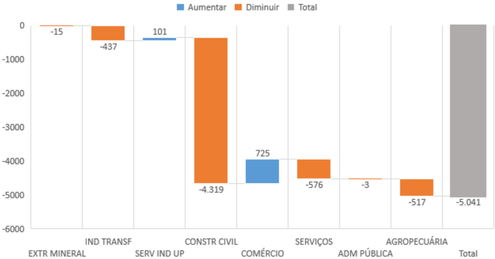

Analisando a variação do emprego formal no Estado para o ano de 2017 medida pelo CAGED, houve queda no ramo da construção civil, com mais de 4.300 vagas fechadas. O Gráfico 12 mostra que foram fechadas mais de 5.000 vagas, sendo o setor do comércio e serviços industriais de utilidade pública os únicos a apresentar mais contratações do que fechamentos.

## MINISTÉRIO DA EDUCAÇÃO

Secretaria de Educação Profissional e Tecnológica

## CNPJ 10.673.078/0001-20

Já no período de janeiro a agosto de 2018 (Gráfico 13) houve criação de mais de 9 mil novos vínculos de trabalho, com destaque para a indústria da transformação, serviços e agropecuária. O único setor a apresentar queda nos vínculos de trabalho foi o comércio.

Gráfico 13: Variação do emprego formal (jan/18 até ago/18) - Por setor.

Fonte: Elaborada pelos autores com base em CAGED, 2018.

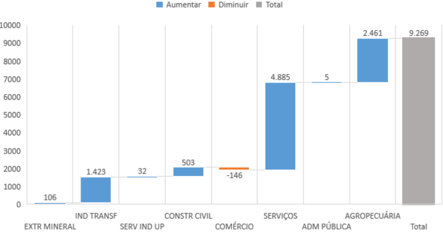

Gráfico 14: Salário média de admissão no MS - Dados até ago/18.

Fonte: Elaborada pelos autores com base em CAGED, 2018.

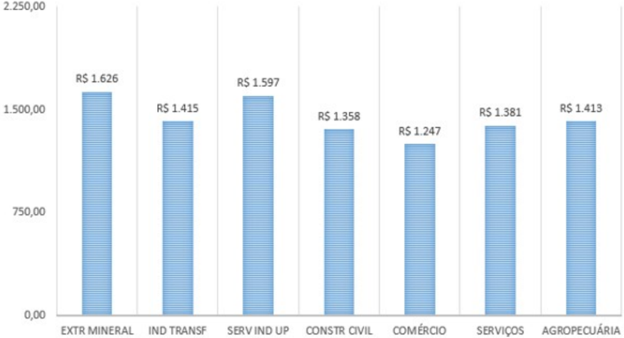

## MINISTÉRIO DA EDUCAÇÃO

Secretaria de Educação Profissional e Tecnológica

Instituto Federal de Educação; Ciência e Tecnologia de Mato Grosso do Sul

CNPJ 10.673.078/0001-20

Junto aos dados de variação de emprego formal do CAGED, também é disponibilizado o salário médio de admissão por setor (Gráfico 14), com valor médio em R$ 1.430,34, em que os setores de extração mineral e serviços industriais de utilidade pública possuem os maiores valores médios de admissão. Porém, estes dois setores representam menos de 1,50% de todos os vínculos de trabalho no Estado, computados pela RAIS de 2016. Na Tabela 5, o setor que mais emprega no Mato Grosso do Sul é o de serviços, com 30% dos vínculos, seguido do comércio (19,8%) e administração pública (19,3%). Juntos, estes setores representam quase 70% dos vínculos de emprego no Estado.

Tabela 5: Número de vínculos empregatícios no MS - 2016.

| 2016                                      |   Vínculos |       |
|-------------------------------------------|------------|-------|
| Extrativa mineral                         |      2.448 | 0,496 |
| Indústria de transformação                |     89.54  | 14,19 |
| Servicos industriais de utilidade pública |      6.688 | 1,1%  |
| Construção Civil                          |     25.891 |       |
| Comércio                                  |    125.369 |       |
| Serviços                                  |    190.229 | 30,09 |
| Administração Pública                     |    122.472 |       |
| Agropecuária extração vegetal caça pesca  |     70.917 |       |
| Total                                     |    633.554 | 100%6 |

Fonte: Elaborada pelos autores com base em RAIS, 2018.

O IBGE divide os setores da seguinte maneira: atividades da agropecuária, extração vegetal, caça e pesca são setor primário; atividades de extração mineral, indústria de transformação, serviços industriais de utilidade pública e construção civil são setor secundário; e comércio, serviços e administração pública são setor terciário. Utilizaremos essa segregação para analisar dados de empregos para os setores. Em 2016 foram computados pela RAIS 120.872 estabelecimentos no estado, empregando 633.554 pessoas, como já mostrado na Tabela 5. Dentre esses estabelecimentos, o Gráfico 15 mostra que 22.721 realizam atividades do setor primário (equivalente a 18,80% do total), 12.934 correspondem ao setor secundário (10,70% do total) e 85.217 realizam atividades do setor terciário (70,50% do total).

## MINISTÉRIO DA EDUCAÇÃO Secretaria de Educação Profissional e Tecnológica Instituto Federal de Educação; Ciência e Tecnologia de Mato Grosso do Sul

## CNPJ 10.673.078/0001-20

## Gráfico 15: Número de estabelecimentos - Por setor - 2016.

Fonte: Elaborada pelos autores com base em RAIS, 2018.

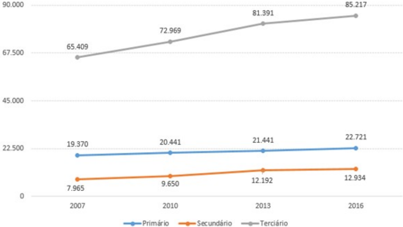

O número de estabelecimentos do setor primário cresceu 17,29% desde 2007, enquanto no setor secundário o número cresceu 62,38% e 30,28% no setor terciário.

Rearranjando os dados da Tabela 5 na Tabela 6, vemos que os vínculos empregatícios acompanham a ordem da divisão do PIB. Desta maneira, o setor primário emprega 11,2% dos trabalhadores, o setor secundário fica com 19,7% e o setor terciário emprega 69,1% do total.

Tabela 6: Somatório dos vínculos empregatícios segregados por setor - 2016.

Fonte: Elaborada pelos autores com base em RAIS, 2018.

| 2016                                      |   Vínculos | %     | Total   |
|-------------------------------------------|------------|-------|---------|
| Agropecuária extração vegetal caça epesca |     70.917 |       | 11,2%   |
| Extrativa mineral                         |      2.448 | 0,49  | 19,796  |
| Indústria de transformação                |     89.54  | 14,1% | 19,796  |
| Servicos industriais de utilidade pública |      6.688 |       | 19,796  |
| Construção Civil                          |     25.891 | 4,19  | 19,796  |
| Comércio                                  |    125.369 |       | 69,1%   |
| Serviços                                  |    190.229 |       | 69,1%   |
| Administração Pública                     |    122.472 |       | 69,1%   |
| Total                                     |    633.554 | 100%  |         |

Quando analisados por escolaridade (Tabela 7), mais de 40% de todos os vínculos registrados em 2016 pela RAIS possuem o ensino médio completo, seguido pela formação com superior completo, com quase 20% dos vínculos.

## MINISTÉRIO DA EDUCAÇÃO

Secretaria de Educação Profissional e Tecnológica

## CNPJ 10.673.078/0001-20

Tabela 7: Quantidade de vínculos em relação ao total - Por nível escolar.

## Vínculos por escolaridade

| (% do total) 2016       | (% do total) 2016   | Freq. relativa acumulada (%)   |
|-------------------------|---------------------|--------------------------------|
| Analfabeto              | 0,4096              | 0,409                          |
| Até 52 Incompleto       | 4,049               |                                |
| 52 Completo Fundamental | 3,2796              | 7,7190                         |
| 62 a 92 Fundamental     | 7,56%               | 15,270                         |
| Fundamental Completo    | 9,9396              | 25,2096                        |
| Médio Incompleto        | 8,0296              | 33,2190                        |
| Médio Completo          | 41,869              | 75,0796                        |
| Superior Incompleto     | 3,879               | 78,9496                        |
| Superior Completo       |                     | 98,8990                        |
| Mestrado                | 0,849               | 99,7396                        |
| Doutorado               | 0,2796              | 100,0096                       |

Fonte: Elaborada pelos autores com base em RAIS, 2018.

A frequência relativa acumulada mostra a quantidade total de vínculos até uma determinada escolaridade, ordenando do menor para o maior nível escolar. Por este olhar, 75,07% do total de vínculos empregatícios no Estado do Mato Grosso do Sul possuem até o ensino médio completo, e os outros 24,93% possuem desde o superior incompleto até o doutorado.

Segregar por setores também nos ajuda a visualizarmos os dados por escolaridade. Para esta análise, coletamos os números de vínculos no ano de 2016 separados por setores econômicos (classificados pelo IBGE) e classificados por nível de escolaridade, visto na Tabela 8.

O nível de escolaridade mais frequente no setor da administração pública é o ensino superior completo, seguido do ensino médio completo. Em todos os outros setores, o ensino médio é o nível escolar mais frequente, passando de 50% dos vínculos nos setores da extração mineral e comércio. Alguns setores mostram uma quantidade significativa de vínculos em níveis de escolaridade mais baixos, por exemplo, do 6º ao 9º ano do fundamental para serviços industriais de utilidade pública (como atividades de esgoto, água e eletricidade), do 6º ao 9º ano do fundamental e fundamental completo para a construção civil, e do 6º ao 9º ano do fundamental e fundamental completo para agropecuária, extração vegetal, caça e pesca.

Ao olharmos os níveis de escolaridade gerais, o setor com maior escolaridade média é o da administração pública, enquanto o setor de agropecuária, extração vegetal, caça e pesca possui a menor média.

## MINISTÉRIO DA EDUCAÇÃO Secretaria de Educação Profissional e Tecnológica Instituto Federal de Educação, Ciência e Tecnologia de Mato Grosso do Sul

## CNPJ 10.673.078/0001-20

Tabela 8: Quantidade de vínculos em cada setor, relativo ao total - Por nível.

Mato Grosso do Sul

| 2016                    | Extrativa mineral   | Indústria de transformação   | Servicos industriais delconstrução utilidade pública   | Civil   | Comércio   | Serviços   | Pública   | Administração | Agropecuária, extração vegetal, caça e pesca   |
|-------------------------|---------------------|------------------------------|--------------------------------------------------------|---------|------------|------------|-----------|----------------------------------------------------------------|
| Analfabeto              | 0,25%               | 0,64%                        | 0,22%                                                  | 0,49%   | 0,11%      | 0,21%      | 0,07%     | 1,63%                                                          |
| Até 5ª Incompleto       | 4,08%               | 5,23%                        | 1,249                                                  | 6,259   | 1,34%      | 2,609      | 2,18%     | 13,879                                                         |
| 5ª Completo Fundamental | 2,49%               | 2,949                        | 1,66%                                                  | 5,46%   | 1,73%      | 2,649      | 1,90%     | 9,85%                                                          |
| 6ª a 9ª Fundamental     | 9,40%               | 11,79%                       | 17,49%                                                 | 15,87%  | 5,01%      | 5,48%      | 2,55%     | 16,89%                                                         |
| Fundamental Completo    | 8,21%               | 9,64%                        | 6,67%                                                  | 16,279  | 9,26%      | 9,14%      | 7,19%     | 16,40%                                                         |
| Médio Incompleto        | 8,70%               | 10,649                       | 5,37%                                                  | 9,79%   | 12,35%     | 7,52%      | 2,13%     | 8,13%                                                          |
| Médio Completo          | 51,43%              | 38,11%                       |                                                        |         | 59,47%     | 45,26%     | 29,44%    | 28,22%                                                         |
| Superior Incompleto     | 2,78%               | 2,41%                        | 4,71%                                                  | 1,88%   | 4,449      | 5,07%      | 4,489     | 1,13%                                                          |
| Superior Completo       | 12,58%              | 18,54%                       | 18,44%                                                 | 4,80%   | 6,28%      | 20,07%     | 47,54%    | 3,85%                                                          |
| Mestrado                |                     | 0,05%                        | 0,22%                                                  | 0,01%   | 0,02%      | 1,21%      | 2,37%     | 0,03%                                                          |
| Doutorado               | 0,04%               | 0,01%                        | 0,07%                                                  | 0,00%   | 0,01%      | 0,80%      | 0,14%     | 0,01%                                                          |
| Total                   | 1009                | 1009                         |                                                        | 1009    | 1009       | 1009       | 1009      | 1009                                                           |

Fonte: Elaborada pelos autores com base em RAIS, 2018.

Para analisar a remuneração média por nível de escolaridade, dividimos os ramos de atividade econômica pela classificação que o IBGE usa para os setores econômicos, como já feito na Tabela 6. Desta maneira, a Tabela 9 corresponde ao setor primário, mostrando a média salarial para os vínculos empregatícios no ano de 2016, classificada por nível de escolaridade.

Tabela 9: Remuneração média do setor primário - Por nível escolar - 2016.

| Remuneração média (2016)   | Agropecuária, extração vegetal, caça e pesca   | Agropecuária, extração vegetal, caça e pesca   |
|----------------------------|------------------------------------------------|------------------------------------------------|
| Analfabeto                 | RS                                             | 1.323,61                                       |
| Até 5ª Incompleto          | RS                                             | 1.563,13                                       |
| 52 Completo Fundamental    | RS                                             | 1.641,37                                       |
| 62 a 92 Fundamental        | RS                                             | 1.666,63                                       |
| Fundamental Completo       | RS                                             | 1.626,66                                       |
| Médio Incompleto           | RS                                             | 1.672,72                                       |
| Médio Completo             | RS                                             | 1.887,59                                       |
| Superior Incompleto        | RS                                             | 2.553,67                                       |
| Superior Completo          | RS                                             | 4.046,34                                       |
| Mestrado                   | RS                                             | 4.209,16                                       |
| Doutorado                  | RS                                             | 5.656,91                                       |

Fonte: Elaborada pelos autores com base em RAIS, 2018.

Abaixo, na Tabela 10, mostramos os ramos correspondentes ao setor secundário. Vale lembrar que há muitos vínculos com mestrado e doutorado nos ramos de serviços e administração pública (ambos do setor terciário). Porém, nos outros ramos de atividade, são poucos os números de mestres e doutores, o que pode distorcer a média para os cargos com estes níveis de escolaridade específicos. Há um exemplo na Tabela 10 para o setor de extração mineral, em que há apenas um mestre e um doutor que estão registrados na RAIS em 2016 e a remuneração média para o mestrado é de R$ 27.149,55. Porém, de modo geral existem muitos dados disponíveis para os diferentes ramos de atividade e nível escolar, o que nos dá uma boa amostragem, apesar da possibilidade de algumas distorções em alguns casos específicos.

## MINISTÉRIO DA EDUCAÇÃO Secretaria de Educação Profissional e Tecnológica Instituto Federal de Educação; Ciência e Tecnologia de Mato Grosso do Sul

## CNPJ 10.673.078/0001-20

Tabela 10: Remuneração média do setor secundário - Por nível escolar - 2016

| Remuneração média (2016)   | Extrativa mineral   | Indústria de transformação   | Servicos industriais de utilidade pública   | Construção Civil   |
|----------------------------|---------------------|------------------------------|---------------------------------------------|--------------------|
| Analfabeto                 | RS 1.272,55         | RS 1.352,43                  | RS 1381,17                                  | RS 1.300,48        |
| Até 5ª Incompleto          | RS 1.657,77         | RS 1.827,91                  | RS 1.567,62                                 | RS 1.590,48        |
| 52 Completo Fundamental    | RS 1.773,22         | RS 1.758,38                  | RS 1.831,14                                 | RS 1.596,41        |
| 62 a 92 Fundamental        | RS 1.697,59         | RS 1.767,07                  | RS 1583,11                                  | RS 1.672,12        |
| Fundamental Completo       | RS 1.991,17         | RS 1.785,20                  | RS 2.124,93                                 | RS 1.688,13        |
| Médio Incompleto           | RS 1.958,46         | RS 1.690,05                  | RS 1.813,82                                 | RS 1.641,51        |
| Médio Completo             | RS 2.613,22         | RS 2.092,66                  | RS 3.125,34                                 | RS 1.829,78        |
| Superior Incompleto        | RS 2.482,33         | RS 2.613,08                  | RS 2.817,83                                 | RS 2.129,68        |
| Superior Completo          | RS 5.295,59         | RS 2.792,85                  | RS 7.253,18                                 | RS                 |
| Mestrado                   | RS 27.149,55        | RS 10.208,19                 | RS 12.406,23                                | RS 5.859,44        |
| Doutorado                  | RS 9.382,06         | RS 6.336,91                  | RS 12.795,79                                | RS11.819,77        |

Fonte: Elaborada pelos autores com base em RAIS, 2018.

Por último, a Tabela 11 mostra a remuneração média para os ramos do setor terciário, em que a maior parte das pessoas estão empregadas.

Tabela 11: Remuneração média do setor terciário - Por nível escolar - 2016.

| Remuneração média (2016)   | Comércio   | Serviços    | Administração Pública   | Administração Pública   |
|----------------------------|------------|-------------|-------------------------|-------------------------|
| Analfabeto                 | RS1.159,98 | RS 1.376,98 | RS                      | 1.519,54                |
| Até 5ª Incompleto          | RS1.323,13 | RS          | RS                      | 1.664,34                |
| 52 Completo Fundamental    | RS1.416,54 | RS 1.233,66 | RS                      | 1.726,98                |
| 62 a 92 Fundamental        | RS1.421,79 | RS 1.380,01 | RS                      | 1.782,15                |
| Fundamental Completo       | R51.465,33 | RS 1.414,75 | RS                      | 1.922,46                |
| Médio Incompleto           | RS1.364,55 | RS 1.302,85 | RS                      | 2.641,34                |
| Médio Completo             | RS1.554,23 | RS 1.635,37 | RS                      | 2.631,11                |
| Superior Incompleto_       | RS2.048,67 | RS 1931,84  | RS                      | 3.751,96                |
| Superior Completo_         | RS3.271,73 | RS 4.162,71 | RS                      | 6.194,47                |
| Mestrado                   | RS5.048,20 | RS 6.812,46 | RS                      | 5.311,44                |
| Doutorado                  | RS5.404,40 | RS12.678,06 | RS                      | 8.349,96                |

Fonte: Elaborada pelos autores com base em RAIS, 2018.

Por fim, faremos duas análises quanto ao local do Estado em que cada ramo econômico se encontra mais instalado e quais ramos econômicos são mais proeminentes em cada microrregião. Para isto, também utilizamos os últimos dados disponíveis da RAIS.

Na Tabela 13, foram sinalizadas as microrregiões em que cada ramo econômico possui maior número de vínculos em relação ao seu total. Já mostramos na Tabela 6 que o ramo da extração mineral possui 2.448 vínculos registrados na RAIS para o Estado de Mato Grosso do

## MINISTÉRIO DA EDUCAÇÃO

Secretaria de Educação Profissional e Tecnológica

Instituto Federal de Educação; Ciência e Tecnologia de Mato Grosso do Sul

## CNPJ 10.673.078/0001-20

Sul em 2016. Na análise abaixo, vemos que 46,45% do total destes vínculos se encontram na MRG do Baixo Pantanal; e 17,52% se encontram na MRG de Bodoquena.

Em um outro exemplo, o setor da construção civil possui 25.891 vínculos empregatícios no MS, onde 56,65% se encontram na MRG de Campo Grande, e 21,42% na MRG de Três Lagoas. Estes são apenas alguns exemplos de como se ler a tabela, e o restante dos números podem ser vistos logo abaixo.

Porém, aqui cabem algumas observações. A microrregião de Campo Grande possui 36% de toda a população do Estado e além disso é a economicamente mais rica; portanto, vários ramos possuem um alto número de vínculos nesta microrregião. Mesmo assim, alguns números são expressivos, como 73,37% dos vínculos dos serviços industriais de utilidade pública estarem empregados na microrregião.

De modo geral, a Tabela 12 nos ajuda a notar onde os setores mais se instalaram no Estado.

Tabela 12: Vínculos empregatícios dos ramos econômicos em relação ao seu total - Por MRG.

| 2016           | Extrativa mineral   | Indústria de transformação   | Servicos industriais |construção de utilidade pública   | Civil   | Comércio   | Serviços   | Pública   | Administração | Agropecuária, extração vegetal caça e pesca   |
|----------------|---------------------|------------------------------|---------------------------------------------------------|---------|------------|------------|-----------|---------------------------------------------------------------|
| BAIXO PANTANAL | 46,459              |                              | 2,86%                                                   | 1,09%   | 3,139      | 2,73%      | 4,669     | 4,909                                                         |
| AQUIDAUANA     |                     | 1,649                        | 1,639                                                   | 0,67%   | 2,32%      |            | 2,29%     | 5,28%                                                         |
| ALTO TAQUARI   | 1,109               | 4,149                        | 2,38%                                                   | 2,28%   | 4,29%      | 2,47%      | 3,28%     | 9,92%                                                         |
| CAMPO GRANDE   | 9,15%               |                              | 73,379                                                  |         | 43,489     | 57,00%     | 55,99%    | 12,61%                                                        |
| CASSILÂNDIA    | 1,889               | 2,66%                        | 1,21%                                                   |         | 3,45%      | 1,80%      | 2,11%     | 7,71%                                                         |
| PARANAÍBA      | 1,80%               | 6,089                        | 2,639                                                   | 2,04%   | 2,54%      | 1,55%      | 2,049     | 5,639                                                         |
| TRÊS LAGOAS    | 3,35%               | 11,809                       | 6,07%                                                   | 21,42%  | 6,209      | 5,79%      | 4,01%     | 15,72%                                                        |
| NOVA ANDRADINA | 0,41%               | 7,489                        | 0,82%                                                   | 1,119   | 3,28%      | 1,779      | 3,01%     | 4,25%                                                         |
| BODOQUENA      | 17,52%              | 1,17%                        | 1,549                                                   | 0,62%   | 2,57%      | 1,73%      | 2,909     | 5,52%                                                         |
| DOURADOS       | 11,569              | 26,11%                       | 5,649                                                   | 10,199  | 22,76%     | 20,989     | 12,82%    | 19,75%                                                        |
| IGUATEMI       | 3,849               | 13,849                       |                                                         | 3,199   | 5,98%      | 2,91%      | 6,889     | 8,719                                                         |

Fonte: Elaborada pelos autores com base em RAIS, 2018.

Apesar da similaridade entre as Tabela 12 e 13, a Tabela 13 mostra o percentual dos vínculos por microrregião, enquanto a Tabela 12 mostra por ramo econômico. Deste modo, a MRG de Cassilândia emprega 29,54% do total de vínculos desta microrregião no ramo da agropecuária, extração vegetal, caça e pesca, e 23,39% dos vínculos no ramo do comércio. Já a MRG de Dourados emprega 31,98% do total de vínculos desta microrregião no ramo de serviços e 22,85% no comércio. Novamente, estes são apenas alguns exemplos de como se ler a tabela, e o restante dos números podem ser vistos logo abaixo.

Vale lembrar que os ramos de serviço, comércio e administração pública são grandes empregadores no Estado. Desta maneira, é de se esperar que estes 3 (três) ramos apareçam com um número substancial de vínculos, mesmo quando analisamos as microrregiões em separado, como é o caso. Apesar disto, é possível observar alguns valores mais expressivos fora destes 3 (três) ramos. Como exemplo, a indústria de transformação emprega uma quantidade significativa de pessoas nas microrregiões de Paranaíba, Três Lagoas, Nova Andradina e Iguatemi, por exemplo. Outros valores também podem ser analisados na tabela abaixo.

## MINISTÉRIO DA EDUCAÇÃO Secretaria de Educação Profissional e Tecnológica Instituto Federal de Educação, Ciência e Tecnologia de Mato Grosso do Sul

## CNPJ 10.673,.078/0001-20

Tabela 13: Vínculos empregatícios nas microrregiões em relação ao seu total - Por ramo de atividade.

| 2016                                        | BAIXO PANTANAL   | AQUIDAUANA   | ALTO TAQUARI   | CAMPO GRANDE   |        |        | TRÊS LAGOAS   | NOVA ANDRADINA   | BODOQUENA | DOURADOS | IGUATEMI   |        |        |
|---------------------------------------------|------------------|--------------|----------------|----------------|--------|--------|---------------|------------------|-----------------------------------|--------|--------|
| Extrativa mineral                           | 5,38%            | 0,539        | 0,11%          | 089            | 0,25%  | 0,23%  | 0,16%         | 0,05%            |                                   |        |        |
| Indústria de transformação                  | 5,688            | 10, 76%      |                | 7,55%          | 12,878 | 28,949 | 20,549        | 31,578           |                                   | 18,738 | 30,178 |
| Servicos industriais de utilidade pública   | 909              | 0,80%        | 0,629          | 1,748          | 0,448  | 0,939  | 0,799         |                  | 0,66%                             |        | 0,309  |
| Construção Civil                            |                  |              | 2,308          | 5,21%          | 1,049  |        | 10,78%        | 1,369            | 1,02%                             |        | 2,019  |
| Comercio                                    | 18,589           |              | 21,00%         | 19,36%         |        |        | 15,109        |                  | 20,46%                            | 22,85% |        |
| Serviços                                    |                  | 17,409       | 18,379         | 38,529         |        | 15,649 | 21,429        | 15,839           | 20,989                            | 31,988 | 13,478 |
| Administração Pública                       | 27,049           | 20,579       |                | 24,369         | 13,958 | 13,309 | 9,55%         | 17,378           | 22,609                            | 12,58% | 20,51% |
| Agropecuaria extração vegetal, caça e pesca | 16,449           | 27,41%       | 27,46%         |                | 29,548 | 21,22% | 21,66%        | 14,208           | 24,899                            |        | 15,049 |

Fonte: Elaborada pelos autores com base em RAIS, 2018.

## 1.4.  Características Socioeconômicas do Município de Naviraí e Região

De modo semelhante à análise socioeconômica do estado do Mato Grosso do Sul, apresentaremos dados referentes ao município de Naviraí e, quando possível, também serão referenciados os municípios que fazem parte da abrangência do campus de Naviraí.

A população total estimada dos municípios da área de abrangência do campus Naviraí pode ser observada no Gráfico 16.

Gráfico 16: População total estimada dos municípios da área de abrangência do campus Naviraí 2019.

Fonte: IBGE/SIDRA

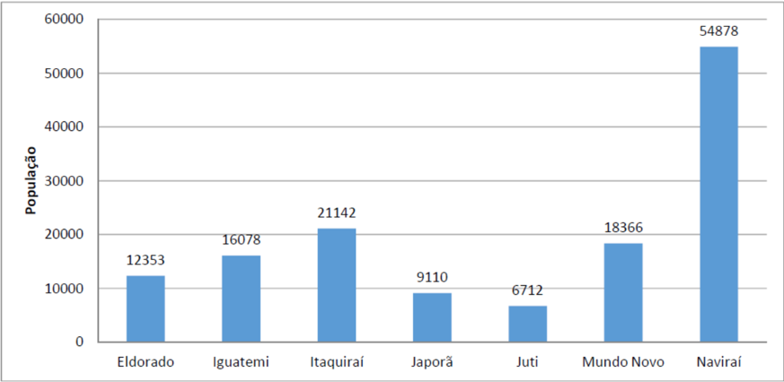

Conforme dados apresentados acima, a população total da região que compreende o Campus Naviraí era de 138.639 habitantes em 2019, que correspondia a 4,99% da população do estado de Mato Grosso do Sul, mesma proporção de 2010. Naviraí é o município mais populoso da região, com 54.878 habitantes, correspondendo a 39,6% da população da área de abrangência do Campus. Em seguida aparecem Itaquiraí (21.142 habitantes) e Mundo Novo (18.366 habitantes). Conforme dados do Censo de 2010, 74,8% da população da área de abrangência do Campus era urbana, nível abaixo do registrado no estado (85,6%). Ainda segundo o censo, do total da população, 50,2% eram homens e 49,8% mulheres.

## MINISTÉRIO DA EDUCAÇÃO

Secretaria de Educação Profissional e Tecnológica

Instituto Federal de Educação; Ciência e Tecnologia de Mato Grosso do Sul

CNPJ 10.673.078/0001-20

No Gráfico 17 é possível observar os valores PIB (Produto Interno Bruto) per capta dos municípios da área de abrangência do campus Naviraí em 2017.

Gráfico 17: PIB per capta dos municípios da área de abrangência do campus Naviraí em 2017 - em R$.

Fonte: IBGE (2017)

Gráfico 18: Evolução do PIB per capta dos municípios da área de abrangência do campus Naviraí - 2010 a 2017 (valores nominais).

Fonte: IBGE (2017)

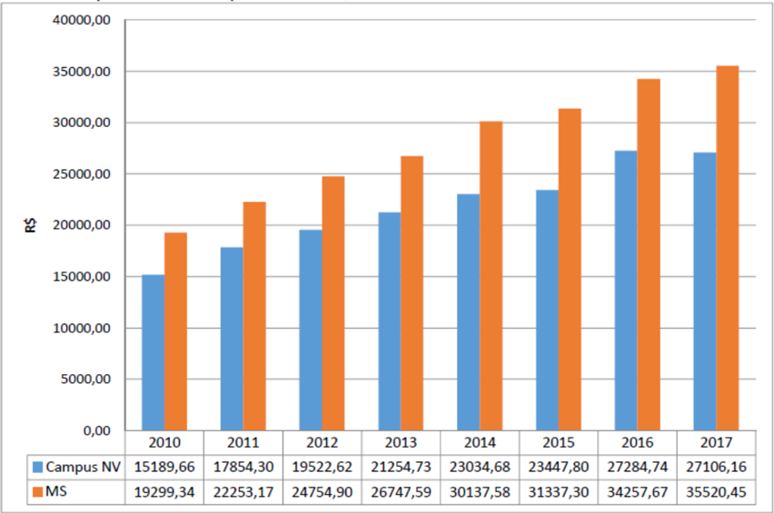

## MINISTÉRIO DA EDUCAÇÃO

Secretaria de Educação Profissional e Tecnológica

Instituto Federal de Educação; Ciência e Tecnologia de Mato Grosso do Sul

## CNPJ 10.673.078/0001-20

Considerando o PIB per capita como um indicador do nível de desenvolvimento do município, observa-se que em todo o período (2010 a 2017) o PIB per capita da região do Campus Naviraí foi inferior ao PIB per capita do estado de Mato Grosso do Sul (Gráfico 18). Em 2017 o PIB per capita da região do Campus Naviraí foi de R$ 27.106,16, enquanto que no estado de Mato Grosso do Sul foi de R$ 35.520,45.

Dos sete municípios que compõem a área de abrangência do campus Naviraí, apenas Juti apresentou PIB per capita acima do valor registrado no estado. Por outro lado, o município de Japorã apresentou o menor valor de PIB per capita, sendo um dos menores do estado (R$ 14.008,64).

Conforme o Gráfico 19, podemos acompanhar a posição do PIB per capita dos municípios de 2010 a 2017. Nota-se que a melhora desse indicador em Juti (36º para 23º), Itaquiraí (47º para 39º), Mundo Novo (57º para 50º) e Japorã (78º para 76º). Os municípios de Naviraí (34º para 43º), Eldorado (39º para 41º) e Iguatemi (43º para 54º) caíram no ranking do PIB per capita dos municípios de Mato Grosso do Sul.

Gráfico 19: Evolução no ranking do PIB per capta dos municípios da área de abrangência do campus Naviraí - 2010 a 2017.

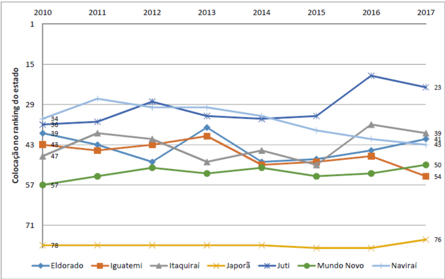

Fonte: Semagro

É importante destacar que, apesar da melhora do PIB per capita em alguns municípios, vários deles ainda estão em posições pouco relevantes no ranking do PIB per capita do estado.

## MINISTÉRIO DA EDUCAÇÃO

Secretaria de Educação Profissional e Tecnológica

## CNPJ 10.673.078/0001-20

## 1.4.1.  Índice de Desenvolvimento Humano Municipal (IDHM)

O IDHM é uma adaptação da metodologia de cálculo do Índice de Desenvolvimento Humano Global (IDH), que busca gerar indicador de desenvolvimento para 5.565 municípios brasileiros. A metodologia leva em conta três dimensões do IDH: longevidade, educação e renda. O IDHM Longevidade considera a expectativa de vida ao nascer, mostrando o número médio de anos que uma pessoa nascida em determinado município viveria a partir do nascimento. O IDHM Educação leva em conta a escolaridade da população adulta e o fluxo escolar da população jovem. O IDHM Renda é medido pela renda municipal per capita.

O IDHM resulta em um número entre 0 e 1. Quanto mais próximo da unidade, maior o grau de desenvolvimento humano.

Naviraí conta com o maior Índice de Desenvolvimento Humano Municipal (IDHM) entre os municípios da área de abrangência do campus Naviraí (Gráfico 20).

Gráfico 20: IDHM 2010 dos municípios da área de abrangência do campus Naviraí.

Fonte: Atlas do Desenvolvimento Humano no Brasil.

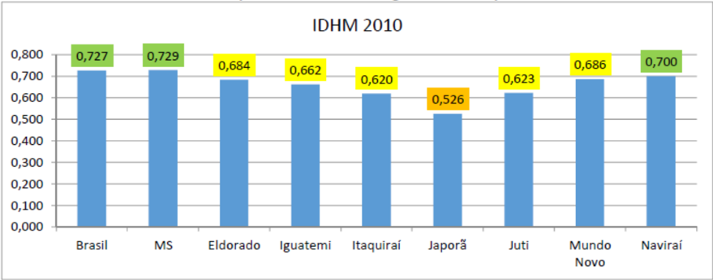

## 1.4.2.  Cenário Educacional

Em relação ao ensino superior na modalidade presencial, a região de abrangência do campus Naviraí conta hoje com quatro instituições, entre elas o Instituto Federal de Educação, Ciência e Tecnologia - IFMS de Mato Grosso do Sul, a Universidade Federal de Mato Grosso do Sul - UFMS, Universidade Estadual de Mato Grosso do Sul - UEMS e Faculdade de Administração Humanas e Exatas de Mundo Novo. No Quadro 2 é possível observar os cursos presenciais oferecidos por estas instituições.

## MINISTÉRIO DA EDUCAÇÃO

Secretaria de Educação Profissional e Tecnológica

CNPJ 10.673.078/0001-20

## Quadro 2: Oferta de cursos superiores na modalidade presencial por área de abrangência do campus Naviraí.

| Município   | Nome da Instituição                                                              | Curso                                 | Grau                     | Status       |
|-------------|----------------------------------------------------------------------------------|---------------------------------------|--------------------------|--------------|
| Mundo Novo  | Faculdade de Administração, Humanas e Exatas                                     | Administração                         |                          | Em atividade |
| Mundo Novo  | Faculdade de Administração, Humanas e Exatas                                     | Ciências Contábeis                    | Bacharelado              | Em atividade |
| Mundo Novo  | Faculdade de Administração, Humanas e Exatas                                     | Pedagogia                             | Licenciatura             | Em atividade |
| Mundo Novo  | Universidade Estadual de Mato Grosso do Sul (UEMS)                               | Ciências Biológicas                   | Licenciatura             | Em atividade |
| Mundo Novo  | Universidade Estadual de Mato Grosso do Sul (UEMS)                               | Gestão Ambiental                      | Tecnológico              | Em atividade |
| Naviraí     | Faculdades Integradas de Naviraí (FINAV)                                         | Administração                         | Bacharelado              | Extinto      |
| Naviraí     | Faculdades Integradas de Naviraí (FINAV)                                         | Geografia                             | Bacharelado              | Extinto      |
| Naviraí     | Faculdades Integradas de Naviraí (FINAV)                                         | Letras Português e Inglês             | Licenciatura             | Extinto      |
| Naviraí     | Faculdades Integradas de Naviraí (FINAV)                                         | Pedagogia                             | Bacharelado              | Extinto      |
| Naviraí     | Faculdade de Ciências Contábeis de Naviraí (FACINAV)                             | Ciências Contábeis                    | Bacharelado              | Extinto      |
| Naviraí     | Instituto Federal de Educação, Ciência e Tecnologia de Mato Grosso do Sul (IFMS) | Agronomia                             | Bacharelado              | Em atividade |
| Naviraí     | Instituto Federal de Educação, Ciência e Tecnologia de Mato Grosso do Sul (IFMS) | Análise e Desenvolvimento de Sistemas | Tecnológico              | Em atividade |
| Naviraí     | Universidade Estadual de Mato Grosso do Sul (UEMS)                               | Alimentos                             | Tecnológico              | Em extinção  |
| Naviraí     | Universidade Estadual de Mato Grosso do Sul (UEMS)                               | Direito                               | Bacharelado              | Em atividade |
| Naviraí     | Universidade Estadual de Mato Grosso do Sul (UEMS)                               | Engenharia de Alimentos               | Bacharelado              | Em atividade |
| Naviraí     | Universidade Estadual de Mato Grosso do Sul (UEMS)                               | Química                               | Licenciatura             | Em atividade |
| Naviraí     | Universidade Federal de Mato Grosso do Sul (UFMS)                                | Administração                         | Bacharelado Licenciatura | atividade    |
| Naviraí     | Universidade Federal de Mato Grosso do Sul (UFMS)                                | Arquitetura e Urbanismo               | Bacharelado Licenciatura | atividade    |
| Naviraí     | Universidade Federal de Mato Grosso do Sul (UFMS)                                | Ciências Sociais                      |                          | atividade    |
| Naviraí     | Universidade Federal de Mato Grosso do Sul (UFMS)                                | Engenharia Civil                      | Bacharelado              | Extinto      |
| Naviraí     | Universidade Federal de Mato Grosso do Sul (UFMS)                                | Engenharia Elétrica                   | Bacharelado              | Extinto      |
| Naviraí     | Universidade Federal de Mato Grosso do Sul (UFMS)                                | Pedagogia                             | Licenciatura             | Em atividade |

Fonte: Sistema e-Mec, 2018.

## 1.4.3.  PIB de Naviraí e demais Municípios

O Produto Interno Bruto da área de abrangência do Campus correspondia a 4,06% do PIB de Mato Grosso do Sul em 2010, passando para 3,87% em 2017, ou seja, de 2010 a 2017 o PIB da área de abrangência do Campus Naviraí perdeu 0,19 p.p. com relação ao PIB de MS.

A maior economia da região pertence à Naviraí, com PIB de R$ 1,48 bilhão em 2017, correspondia a 40,3% do total produzido entre os municípios que compõem o Campus. Em seguida aparecem os municípios de Itaquiraí (R$ 614 milhões e 16,7%), Mundo Novo (R$ 463 milhões e 12,6%), Iguatemi (R$ 382 milhões e 10,4%), Eldorado (R$ 353 milhões e 9,6%), Juti (R$ 251 milhões e 6,8%) e Japorã (R$ 124 milhões e 3,4%), conforme o Gráfico 21.

A Tabela 14 nos apresenta as posições dos municípios no ranking do PIB entre todos municípios do estado de Mato Grosso do Sul, posições em 2010 e 2017. Os destaque positivos

## MINISTÉRIO DA EDUCAÇÃO

Secretaria de Educação Profissional e Tecnológica

Instituto Federal de Educação; Ciência e Tecnologia de Mato Grosso do Sul

## CNPJ 10.673.078/0001-20

ficaram com Juti (ganhou 7 posições, passando da 63º economia para 56º economia do estado), Japorã (ganhou 5 posições, da última posição em 2010 para 73º em 2017) e Itaquiraí (saltou da 32ª posição para 31ª). Os municípios de Iguatemi (39ª posição para 49ª posição) e Naviraí (10ª posição para 14ª posição) registraram queda. Os municípios de Eldorado e Mundo Novo permaneceram nas mesmas colocações.

Gráfico 21: Participação dos PIB dos municípios da área de abrangência do campus Naviraí 2017.

Fonte: IBGE - PIB dos municípios

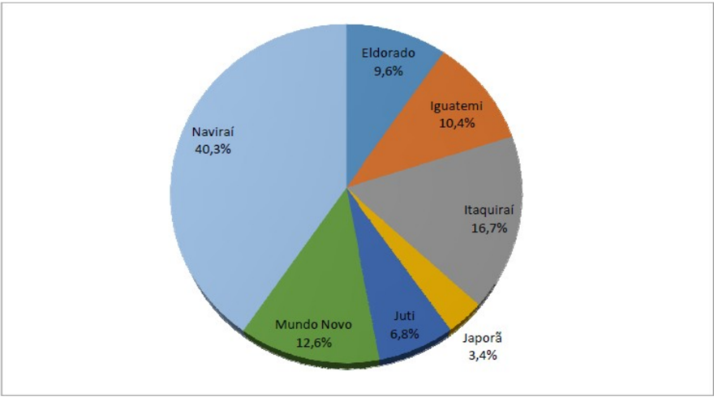

Tabela 14: Ranking dos PIB dos municípios da área de abrangência do campus Naviraí com relação aos municípios de MS - 2010 e 2017.

| Município   | Posicão em 2010   | Posicão em 2017   | Var. 2010/2017   |
|-------------|-------------------|-------------------|------------------|
| Eldorado    |                   | 470               |                  |
| Iguatemi    | 390               |                   | 9                |
| Itaquiraí   |                   | 319               |                  |
| Japorã      | 789               |                   |                  |
| Juti        |                   |                   |                  |
| Mundo Novo  | 409               |                   |                  |
| Naviraí     | 109               | 149               |                  |

Fonte: Semagro

## MINISTÉRIO DA EDUCAÇÃO Secretaria de Educação Profissional e Tecnológica Instituto Federal de Educação; Ciência e Tecnologia de Mato Grosso do Sul

## CNPJ 10.673.078/0001-20

## 1.4.4.  Setor Primário (Agropecuária)

O estado de Mato Grosso do Sul tem atraído investidores por possuir grande potencial eco turístico e grandes extensões de terras agricultáveis. O agronegócio é uma das principais bases da economia do Estado.

Os valores da produção agrícola das principais lavouras da área de abrangência do campus Naviraí, bem como os valores da produção de origem animal podem ser observados nas tabelas 15 e 16, respectivamente.

Tabela 15: Valor da produção agrícola nos municípios da área de abrangência do campus Naviraí nas principais lavouras da região - 2018 (valores em R$ 1.000).

| Município/Local                    | Abacaxi   | Café (em grão) Arábica   | Cana-de- açúcar   | Feijão (em   | Mandioca   | Melancia   | Milho (em grão)   | Soja (em grão)   |
|------------------------------------|-----------|--------------------------|-------------------|--------------|------------|------------|-------------------|------------------|
| Eldorado                           | 540       | 50                       | 31473             |              | 15400      | 1856       | 10120             | 53982            |
| Iguatemi                           |           | 15                       | 8074              |              | 12240      | 264        | 5989              | 53130            |
| Itaquiraí                          | 300       |                          | 22478             | 113          | 48998      | 768        | 45956             | 164220           |
| Japorã                             |           | 40                       |                   | 23           | 23362      | 105        | 3012              | 8452             |
| Juti                               |           |                          | 73792             | 1910         | 15506      | 240        | 14717             | 70840            |
| Mundo Novo                         | 21        | 15                       |                   |              | 11076      | 160        | 5773              | 28024            |
| Naviraí                            |           | 15                       | 33079             | 1250         | 31443      | 1125       | 144420            | 366183           |
| Campus Naviraí                     | 861       | 135                      | 168896            | 3296         | 158025     | 4518       | 229987            | 744831           |
| Mato Grosso do Sul                 | 7930      | 1279                     | 3479657           | 33270        | 353211     | 14276      | 3555542           | 11121765         |
| Part. % no valor da produção de MS | 10,86%    | 10,56%                   | 4,85%             | 9,91%        | 44,749     | 31,65%     | 6,47%             | 6,70%            |

Fonte: IBGE

Tabela 16: Produção de origem animal, por tipo de produto, na área de abrangência do campus Naviraí em 2018 (valores em R$1.000).

| Município/Local              | Leite   | Ovos de galinha   | Ovos de codorna   | Mel de abelha   | Casulos do bicho-da-seda   | Lã    |
|------------------------------|---------|-------------------|-------------------|-----------------|----------------------------|-------|
| Eldorado                     | 2504    | 3772              |                   | 28              |                            |       |
| Iguatemi                     | 11406   | 250               |                   | 60              | 5                          |       |
| Itaquiraí                    | 21466   | 768               |                   | 34              | 1874                       |       |
| Japorã                       | 4733    | 142               |                   | 31              |                            |       |
| Juti                         | 1571    | 58                |                   | 6               |                            |       |
| Mundo Novo                   | 3413    | 153               |                   | 247             |                            |       |
| Naviraí                      | 1974    | 3320              |                   | 81              |                            |       |
| Campus Naviraí               | 47067   | 8463              |                   | 487             | 1879                       | 22    |
| Mato Grosso do Sul           | 315630  | 211989            | 1259              | 7932            | 2553                       | 406   |
| Part. % no valor prod. de MS | 14,91%  | 3,99%             | 0,00%             | 6,14%           | 60%                        | 5,42% |

Fonte: IBGE

## MINISTÉRIO DA EDUCAÇÃO

Secretaria de Educação Profissional e Tecnológica

Instituto Federal de Educação; Ciência e Tecnologia de Mato Grosso do Sul

## CNPJ 10.673.078/0001-20

Sua localização estratégica, fazendo limites com os principais centros consumidores do país (São Paulo, Paraná e Minas Gerais), além de fronteira e proximidade com os países do MERCOSUL (Mercado Comum do Sul), é outro fator de atração de investimentos. O Estado está interligado por quatro eixos rodoviários federais, as BR's 060, 163, 262 e 267, duas ferrovias, a ferrovia Noroeste do Brasil e a Ferronorte, e duas hidrovias, a do Rio Paraná e Paraguai.

O município de Naviraí está inserido no grande Polo Sul do estado, acompanhado de cidades como Dourados, Nova Andradina e Iguatemi, cujos setores produtivos de maior potencial são o agropecuário, a agroindústria frigorífica e laticínios; indústria de alimentos, indústria têxtil, vestuário e artefatos de tecidos; moageira de soja; ração animal; sementes de pastagens e cereais; embalagem; indústria de produtos alimentícios, de bebidas e álcool etílico.

Sabe-se que, para garantir a pujança do setor agropecuário e sua estabilidade a longo prazo, não há alternativa que não contemple investimentos em pesquisa, ensino e tecnologia. Nesse sentido, justifica-se a necessidade da implantação de um curso de nível superior na área agrícola, principalmente se considerarmos que existe a necessidade em diversificar e qualificar a produção de alimentos na região. Cabe observar que grande parte dos alimentos comercializados na região são originários de outros estados.

## 1.4.5.  Setor Secundário (Indústrias)

Quanto ao setor secundário, podemos citar principalmente as empresas envolvidas com os setores sucroalcooleiro, frigoríficos, de suplementos minerais, produção de fécula e fiação. A Cooperativa Agrícola Sul Matogrossense - Copasul é um dos destaques nesse setor e conta com uma unidade de fiação e produção de fécula, ambas em Naviraí (Figura 1).

Figura 1: Unidade industrial para fiação da COPASUL, município de Naviraí, MS - 2016.

Fonte: Copasul, 2016.

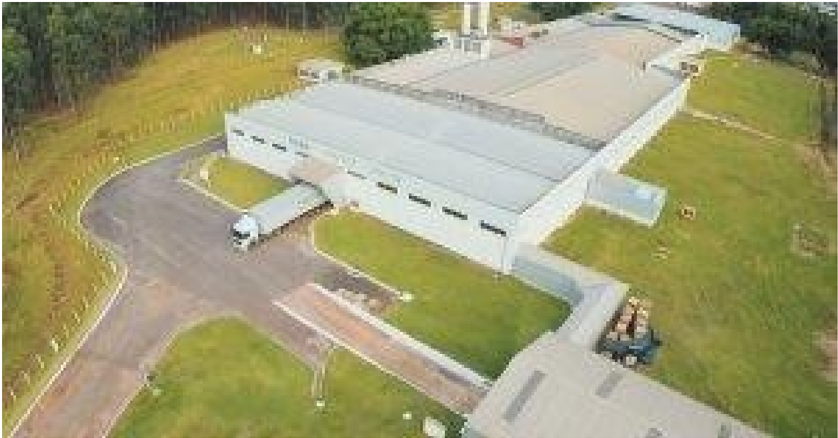

## MINISTÉRIO DA EDUCAÇÃO

Secretaria de Educação Profissional e Tecnológica

Instituto Federal de Educação; Ciência e Tecnologia de Mato Grosso do Sul

CNPJ 10.673.078/0001-20

Observa-se ainda a existência de duas Unidades de Silos para armazenamento de soja e milho no município de Naviraí e em Itaquiraí (Figura 2).

Figura 2: Unidades para recebimento e armazenagem de grãos da COPASUL, município de Naviraí e Itaquiraí, MS - 2016.

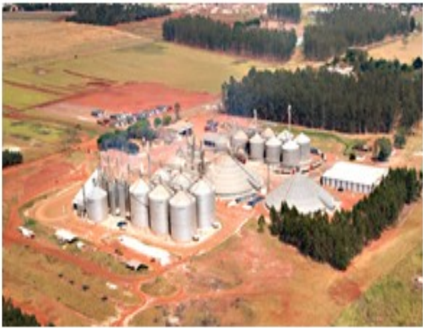

Fonte: Copasul, 2016.

No setor têxtil, destacam-se as malharias Kriswill e Lênix. O município de Naviraí apresenta ainda como destaque a Indústria de Erva-mate Campanário e café Naviraí como importantes empresas para economia local e da região. Tais fábricas e unidades industriais presentes em Naviraí corroboram para a ideia central da necessidade contínua de investimentos no setor de produção e sua tecnificação, evitando a longo prazo uma dependência no fornecimento da matéria prima de outras regiões e estados.

## 1.4.6.  Setor Terciário (Serviços)

Em algumas perspectivas, costuma-se dividir o setor terciário, considerando-o apenas com o comércio e categorizando os serviços em um suposto setor quaternário da economia. No entanto, essa divisão não é aceita e nem empregada pelos órgãos nacionais e internacionais de estudos econômicos, a exemplo do IBGE e do Instituto de Pesquisa Econômica Aplicada IPEA.

O setor de serviços, no entanto, é muito amplo, pois envolve todos os bens 'imateriais', ou seja, tudo aquilo que é oferecido ao consumidor na forma de atividades, como consertos mecânicos e domésticos, auxílios para aparelhos e tecnologias, atividades educacionais, auxílio jurídico, telemarketing, lazer, turismo, segurança, transporte, entretenimento, entre outras.

De acordo com o Ministério do Trabalho e Emprego (MTE), o estado de Mato Grosso do Sul ocupou o décimo quarto lugar em nível de trabalhadores admitidos e desligados conforme o saldo do mês de julho do ano de 2015 (MTE, 2015).

## MINISTÉRIO DA EDUCAÇÃO

Secretaria de Educação Profissional e Tecnológica

Instituto Federal de Educação; Ciência e Tecnologia de Mato Grosso do Sul

## CNPJ 10.673.078/0001-20

Pesquisa divulgada pelo Instituto de Pesquisa da Federação do Comércio de Bens, Serviços e Turismo de Mato Grosso do Sul (IPF), revela que Mato Grosso do Sul teve crescimento na geração de empregos, principalmente, no setor terciário, e que as microempresas são responsáveis em 45,1% pelo crescimento.

## 1.4.7.  Dados de trabalho e emprego de Naviraí

Analisando a variação do emprego formal em Naviraí para o ano de 2017 medida pelo CAGED (Gráfico 22), houve fechamentos de vagas no resultado geral, com destaque negativo para o ramo de serviços, enquanto o setor da agropecuária mostrou maiores admissões.

Gráfico 22: Variação do emprego formal (2017) em Naviraí - Por setor.

Fonte: Elaborada pelos autores com base em CAGED, 2018.

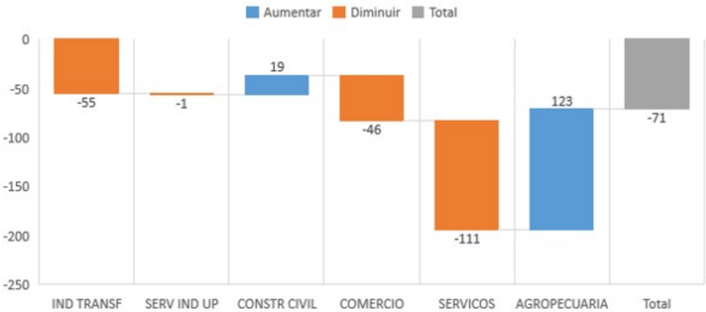

Gráfico 23: Variação do emprego formal (jan/18 até ago/18) em Naviraí - Por setor.

Aumentar

Diminuir

Total

Fonte: Elaborada pelos autores com base em CAGED, 2018.

## MINISTÉRIO DA EDUCAÇÃO

Secretaria de Educação Profissional e Tecnológica

Instituto Federal de Educação; Ciência e Tecnologia de Mato Grosso do Sul

## CNPJ 10.673.078/0001-20

Já no ano de 2018 (dados até agosto) houve criação de mais de 700 novos vínculos de trabalho, com destaque para a indústria da transformação e agropecuária (Gráfico 23). O único setor a apresentar queda nos vínculos de trabalho foi o comércio.

Junto aos dados de variação de emprego formal do CAGED, também é disponibilizado o salário médio de admissão por setor (Gráfico 24), com valor médio em R$ 1.289,76, em que os setores da indústria da transformação (que representa 22,58% dos vínculos empregatícios de Naviraí) e construção civil (com 4,87% dos vínculos) possuem os maiores valores médios de admissão.

Gráfico 24: Salário média de admissão em Naviraí - Dados até ago/18.

Fonte: Elaborada pelos autores com base em CAGED, 2018.

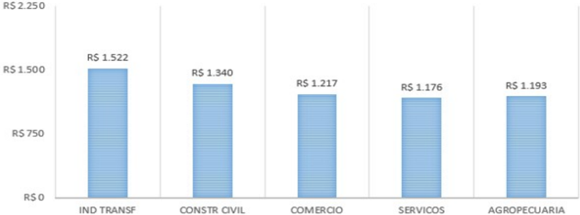

Na Tabela 17, o setor que mais emprega na região de Naviraí é o da indústria de transformação, com 25,78% dos vínculos e o comércio, com 20,42% dos vínculos. Porém, o número de vínculos possui uma certa diversificação, com os ramos da administração pública, serviços e agropecuária entre 20% e 15% dos vínculos, não havendo, portanto, um setor concentrador de empregos. O município de Naviraí representa 48,51% do total de vínculos da região.

Tabela 17: Número de vínculos empregatícios na região de abrangência de Naviraí - 2016

| 2016                                         | ELDORADO| IGUATEMI | ITAQUIRAI   |       |       | JAPORA   | JUTI   | MUNDO NOVO   |   NAVIRAI |         |
|----------------------------------------------|----------------------------------|-------|-------|----------|--------|--------------|-----------|---------|
| Agropecuaria, extração vegetal, caça e pesca | 273                              | 546   | 720   | 57       | 288    | 105          |     1.553 | 15,3536 |
| Extrativa mineral                            |                                  |       |       |          |        | 18           |    61     | 0,373   |
| Indústria de transformação                   | 297                              | 278   | 1.783 | 22       |        | 634          |     2.528 | 25,783  |
| Servicos industriais de utilidade pública    |                                  |       |       |          |        |              |    35     | 0,263   |
| Construção Civil                             | 30                               |       | 31    | 2        |        | 120          |   545     | 3,233   |
| Comércio                                     | 231                              | 272   | 378   | 18       | 106    | 720          |     2.583 |         |
| Sericos                                      | 403                              | 223   | 343   |          | 70     | 269          |     2.132 | 15,803  |
| Administração Pública                        | 307                              | 262   | 646   | 353      | 271    | 545          |  1752     | 18,803  |
| Total                                        | 1.726                            | 2.198 | 3.912 |          | 950    | 2617         |    11.191 | 100,003 |

Fonte: Elaborada pelos autores com base em RAIS, 2018.

Em 2016 foram computados pela RAIS 5.642 estabelecimentos na região em estudo, empregando 23.068 pessoas, como já mostrado acima. Dentre esses estabelecimentos, 1.012 realizam atividades do setor primário (equivalente a 17,93% do total), 642 correspondem ao se-

## MINISTÉRIO DA EDUCAÇÃO Secretaria de Educação Profissional e Tecnológica Instituto Federal de Educação; Ciência e Tecnologia de Mato Grosso do Sul

## CNPJ 10.673.078/0001-20

tor secundário (11,37% do total) e 3.988 realizam atividades do setor terciário (70,68% do total) (Gráfico 25).

Gráfico 25: Número de estabelecimentos - Por setor - 2016.

Fonte: Elaborada pelos autores com base em RAIS, 2018.

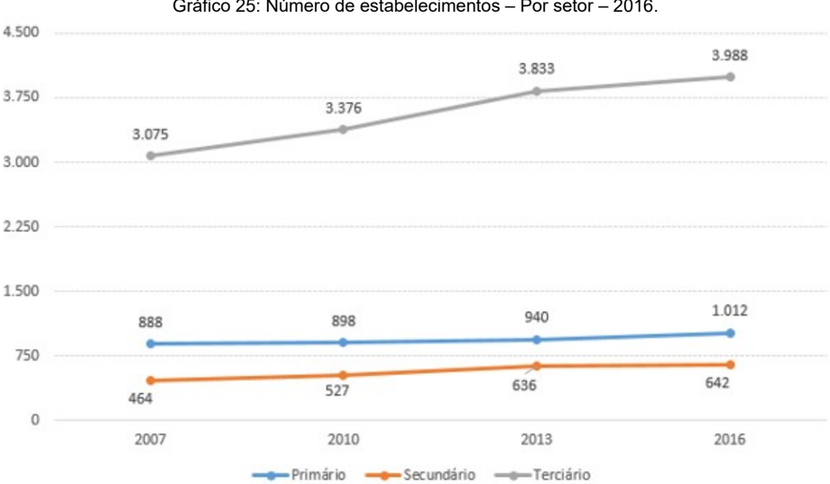

O número de estabelecimentos do setor primário cresceu 13,96% desde 2007, enquanto no setor secundário o número cresceu 38,36% e 29,69% no setor terciário.

Rearranjando os dados da Tabela 17, vemos que o setor primário emprega 15,35% dos trabalhadores, o setor secundário fica com 29,63% e o setor terciário emprega 55,01% do total de vínculos (Tabela 18).

Fonte: Elaborada pelos autores com base em RAIS, 2018.

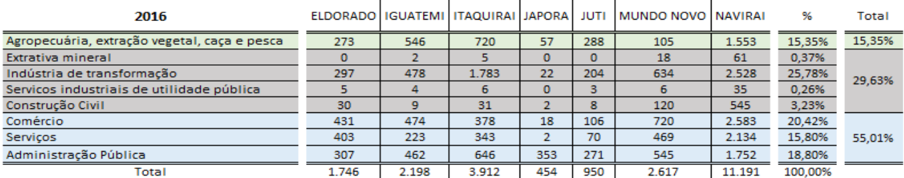

Tabela 18: Somatório dos vínculos empregatícios segregados por setor - 2016.

| 2016                                      | ELDORADO | IGUATEMI | ITAQUIRAI   |      |       | JAPORA   | JUTI   | MUNDO NOVO   | NAVIRAI   |          | Total   |
|-------------------------------------------|-----------------------------------|------|-------|----------|--------|--------------|-----------|----------|---------|
| epesca                                    | 273                               | 546  | 720   | 57       | 288    | 105          | 1.553     | 15,3536  | 15,3536 |
| Extrativa mineral                         |                                   |      |       |          |        | 18           | 61        | 0,3736   |         |
| Indústria de transformação                | 297                               | 278  | 1.783 | 22       | 204    | 634          | 2.528     | 25,7836  | 29,6336 |
| Servicos industriais de utilidade pública |                                   |      |       |          |        |              | 35        | 0,263    |         |
| Construcão Civil                          | 30                                |      | 31    |          |        | 120          |           |          |         |
| Comércio                                  | 231                               |      | 378   | 18       | 106    | 720          | 2.583     |          |         |
| Serviços                                  |                                   | 223  |       |          | 70     | 269          | 2.134     | 15,8036  | 55,0136 |
| Administração Pública                     | 307                               | 262  | 626   | 353      | 271    | 545          | 1.752     | 18,803   |         |
| Total                                     | 1.726                             | 2198 | 3.912 |          | 950    | 2.617        | 11.191    | 100,0036 |         |

Quando analisados por escolaridade (Tabela 19), mais de 40% de todos os vínculos registrados em 2016 pela RAIS no município de Naviraí possuem o ensino médio completo, seguido pela formação com superior completo, com 23% dos vínculos.

## MINISTÉRIO DA EDUCAÇÃO

Secretaria de Educação Profissional e Tecnológica

Instituto Federal de Educação; Ciência e Tecnologia de Mato Grosso do Sul

CNPJ 10.673.078/0001-20

A frequência relativa acumulada mostra a quantidade total de vínculos até uma determinada escolaridade, ordenando do menor para o maior nível escolar. Por este olhar, 74,67% do total de vínculos empregatícios em Naviraí possuem até o ensino médio completo, e os outros 25,33% possuem desde o superior incompleto até o mestrado.

Tabela 19: Quantidade de vínculos em relação ao total - Por nível escolar.

Vínculos por escolaridade

| (% do total) 2016       | (% do total) 2016   | ocumuloda (%)   |
|-------------------------|---------------------|-----------------|
| Analfabeto              |                     | 0,278           |
| Até 52 Incompleto       | 5,45%               | 5,729           |
| 50 Completo Fundamental | 3,36%               | 9,089           |
| 62 a 92 Fundamental     | 7,049               | 16,129          |
| Fundamental Completo    | 8,14%               | 24,269          |
| Médio Incompleto        | 6,72%               | 30,9896         |
| Médio Completo          |                     | 74,6786         |
| Superior Incompleto     | 2,18%               | 76,859          |
| Superior Completo       | 23,09%              | 99,9496         |
| Mestrado                | 0,06%               |                 |

Fonte: Elaborada pelos autores com base em RAIS, 2018.

Segregar por setores também nos ajuda a visualizarmos os dados por escolaridade. Para esta análise, coletamos os números de vínculos no ano de 2016 separados por setores econômicos (classificados pelo IBGE) e classificados por nível de escolaridade, visto na Tabela 20.

Tabela 20: Quantidade de vínculos em cada setor, relativo ao total - Por nível escolar.

Naviraí

| 2016                    | Extrativa mineral   | Indústria de transformação   | [Servicos industriais delconstrução utilidade pública   | Civil   | Comércio   | Serviços   | Pública   | Administração | Agropecuária, extração vegetal caça e pesca   |
|-------------------------|---------------------|------------------------------|---------------------------------------------------------|---------|------------|------------|-----------|---------------------------------------------------------------|
| Analfabeto              | 1,64%               | 0,20%                        | 0,00%                                                   | 0,37%   | 0,04%      | 0,149      | 0,00%     | 1,16%                                                         |
| Até 5ª Incompleto       | 8,20%               | 1,86%                        | 0,00%                                                   | 11,01%  | 1,39%      | 5,81%      | 4,39%     | 16,81%                                                        |
| 5ª Completo Fundamental | 0,00%               | 0,99%                        | 0,00%                                                   | 7,349   | 1,32%      | 3,05%      |           | 8,69%                                                         |
| 6ª a 9ª Fundamental     | 0,00%               |                              | 0,00%                                                   | 7,89%   | 6,629      | 4,089      | 5,149     | 18,03%                                                        |
| Fundamental Completo    | 8,20%               | 6,299                        | 0,00%                                                   | 12,849  | 7,82%      |            |           | 10,50%                                                        |
| Médio Incompleto        |                     | 3,80%                        | 0,00%                                                   | 4,77%   | 10,45%     | 9,51%      |           | 5,549                                                         |
| Médio Completo          | 72,13%              | 30,38%                       | 88,57%                                                  |         | 61,36%     | 51,92%     | 32,539    | 35,16%                                                        |
| Superior Incompleto     | 1,649               | 0,75%                        |                                                         | 3,49%   |            | 3,75%      | 0,749     | 0,849                                                         |
| Superior Completo       | 4,92%               | 51,07%                       | 11,439                                                  | 8,81%   | 7,16%      | 16,59%     | 36,99%    | 3,28%                                                         |
| Mestrado                | 0,00%               | 0,04%                        | 0,00%                                                   | 0,00%   | 0,00%      | 0,28%      |           |                                                               |
| Total                   | 1009                | 100%                         | 1009                                                    | 100%    | 100%       | 1009       | 100%      | 100%                                                          |

Fonte: Elaborada pelos autores com base em RAIS, 2018.

O nível de escolaridade mais frequente no setor da indústria da transformação e da administração pública é o ensino superior completo, seguido do ensino médio completo. Em todos os outros setores, o ensino médio é o nível escolar mais frequente, passando de 50% dos vínculos nos setores da extração mineral, serviços industriais de utilidade pública, comércio e serviços.

## MINISTÉRIO DA EDUCAÇÃO Secretaria de Educação Profissional e Tecnológica Instituto Federal de Educação; Ciência e Tecnologia de Mato Grosso do Sul

## CNPJ 10.673.078/0001-20

Ao olharmos os níveis de escolaridade gerais, o setor com maior escolaridade média é o da indústria da transformação, enquanto o setor de agropecuária, extração vegetal, caça e pesca possui a menor média.

Para analisar a remuneração média por nível de escolaridade, dividimos os ramos de atividade econômica pela classificação que o IBGE usa para os setores econômicos, como já feito na Tabela 18. Desta maneira, a Tabela 21 corresponde ao setor primário, mostrando a média salarial para os vínculos empregatícios no município de Naviraí para o ano de 2016, classificada por nível de escolaridade.

Tabela 21: Remuneração média do setor primário - Por nível escolar - 2016.

Fonte: Elaborada pelos autores com base em RAIS, 2018.

| Remuneração média (2016)   | Agropecuária, extração vegetal , caça epesca   | Agropecuária, extração vegetal , caça epesca   |
|----------------------------|------------------------------------------------|------------------------------------------------|
| Analfabeto                 | RS                                             | 1.363,60                                       |
| Até 52 Incompleto          | RS                                             | 1.685,86                                       |
| 52 Completo Fundamental    | RS                                             | 1.913,36                                       |
| 62 a 92 Fundamental        | RS                                             | 2.001,50                                       |
| Fundamental Completo       | RS                                             | 2.000,14                                       |
| Médio Incompleto           | RS                                             | 2.225,00                                       |
| Médio Completo             | RS                                             | 1.860,40                                       |
| Superior Incompleto        | RS                                             | 2.280,46                                       |
| Superior Completo          | RS                                             | 4.344,09                                       |
| Mestrado                   | RS                                             |                                                |

Tabela 22: Remuneração média do setor secundário - Por nível escolar - 2016.

| Remuneração média (2016)   | Extrativa mineral   | Indústria de transformação   | Indústria de transformação   | Servicos industriais de utilidade pública   | Servicos industriais de utilidade pública   | Construção Civil   |
|----------------------------|---------------------|------------------------------|------------------------------|---------------------------------------------|---------------------------------------------|--------------------|
| Analfabeto                 | RS2.045,85          | RS                           | 1.265,66                     | RS                                          |                                             | RS 5.208,79        |
| Até 52 Incompleto          | RS1.808,13          | RS                           | 1.207,49                     | RS                                          |                                             | RS1.911,49         |
| 52 Completo Fundamental    | RS                  | RS                           | 1.119,51                     | RS                                          |                                             | RS1.779,16         |
| 62 a 92 Fundamental        | RS                  | RS                           | 1.308,51                     | RS                                          |                                             | RS1.884,93         |
| Fundamental Completo       | RS2.079,00          | RS                           | 1.521,73                     | RS                                          |                                             | RS2.162,75         |
| Médio Incompleto           | RS2.142,39          | RS                           | 1.423,15                     | RS                                          |                                             | RS1.902,92         |
| Médio Completo             | RS 2.290,55         | RS                           | 1.598,26                     | RS                                          | 2.605,00                                    | RS1.654,22         |
| Superior Incompleto        | RS2.074,94          | RS                           | 2.099,47                     | RS                                          |                                             | RS2.031,16         |
| Superior Completo          | RS 2.098,52         | RS                           | 2.013,31                     | RS                                          | 3.767,24                                    | RS3.619,91         |
| Mestrado                   | RS                  | RS                           | 3.083,33                     | RS                                          |                                             | RS                 |

Fonte: Elaborada pelos autores com base em RAIS, 2018.

## MINISTÉRIO DA EDUCAÇÃO

Secretaria de Educação Profissional e Tecnológica

Instituto Federal de Educação; Ciência e Tecnologia de Mato Grosso do Sul

## CNPJ 10.673.078/0001-20

Na Tabela 22, mostramos os ramos correspondentes ao setor secundário. Vale lembrar que há possibilidade de deturpação da média para alguns casos específicos. Há um exemplo na tabela abaixo para o setor da construção civil, em que há apenas dois vínculos registrados na RAIS em 2016 considerados 'analfabetos', sendo o valor da remuneração média claramente um ponto fora da curva.

Por último, a Tabela 23 mostra a remuneração média para os ramos do setor terciário, em que a maior parte das pessoas estão empregadas.

Tabela 23: Remuneração média do setor terciário - Por nível escolar - 2016.

| Remuneração média (2016)   | Comércio   | Serviços    | Administração Pública   | Administração Pública   |
|----------------------------|------------|-------------|-------------------------|-------------------------|
| Analfabeto                 | RS 958,75  | RS1.274,66  | RS                      |                         |
| Até 52 Incompleto          | RS1.314,51 | RS1.403,70  | RS                      | 1806,11                 |
| 52 Completo Fundamental    | RS2.612,62 | RS1.462,25  | RS                      | 1894,10                 |
|                            | RS1.426,74 | RS1.240,67  | RS                      | 1897,50                 |
| Fundamental Completo       | RS1.563,08 | RS1.390,79  | RS                      | 1.849,04                |
| Médio Incompleto           | RS1.276,40 | RS1.347,74  | RS                      | 1.963,61                |
| Médio Completo             | RS1.462,81 | RS1.383,37  | RS                      | 2.164,01                |
| Superior Incompleto        | RS1.998,70 | RS1.748,58  | RS                      | 2.038,99                |
| Superior Completo          | RS4.302,28 | RS 2.838,18 | RS                      | 4.929,30                |
| Mestrado                   | RS         | RS1.376,62  | RS                      |                         |

Fonte: Elaborada pelos autores com base em RAIS, 2018.

Para analisarmos os dados de emprego disponíveis para o curso em questão (Análise e Desenvolvimento de Sistemas), cruzamos as informações contidas no Catálogo Nacional de Cursos Superiores de Tecnologia (3ª ed.) e na Classificação Brasileira de Ocupações (CBO, 2002). O Catálogo Nacional indica 2 (duas) ocupações associadas a este curso conforme mostrado na Figura 3.

Figura 3: Ocupações associadas ao curso

Ocupações CBO associadas

2124-05 ~Tecnélogo em análise e desenvolvimento de sistemas

Fonte: Catálogo Nacional de Cursos Superiores de Tecnologia.

Ao tentarmos analisar os dados referentes à formação superior em Análise e Desenvolvimento de Sistemas, encontramos os dados abaixo para as profissões classificadas como 'Profissionais da informática' pela CBO, em que o curso está em itálico na Tabela 24. É importante notar que é possível que haja omissões nos cadastros de emprego, o que, em alguns casos, pode comprometer uma análise mais profunda e realista. Porém, estes são os dados ofici-

## MINISTÉRIO DA EDUCAÇÃO Secretaria de Educação Profissional e Tecnológica Instituto Federal de Educação; Ciência e Tecnologia de Mato Grosso do Sul

## CNPJ 10.673.078/0001-20

ais disponibilizados pelo Ministério do Trabalho aos quais temos acesso e pelos quais análises do mercado de trabalho são feitas. Contatos com outras instituições públicas poderão ser feitos no futuro a fim de obter mais informações.

Na Tabela 25 mais abaixo, encontra-se a remuneração média para as ocupações em questão no ano de 2016.

Tabela 24: Número de vínculos de profissionais da informática (CBO) em Naviraí - 2016.

| Naviraí                                 |   Nª de vinculos |
|-----------------------------------------|------------------|
| ADMINISTRADOR DE BANCO DE DADOS         |                1 |
| ANALISTA DE DESENVOLVIMENTO DE SISTEMAS |                7 |
| ANALISTA DE SISTEMAS DE AUTOMACAO       |                2 |
| ANALISTA DE SUPORTE COMPUTACIONAL       |                9 |
| Total                                   |               19 |

Fonte: dados da RAIS

Tabela 25: Remuneração média em Naviraí - 2016.

| Navirai                                 | Remun. média   | Remun. média   |
|-----------------------------------------|----------------|----------------|
| ADMINISTRADOR DE BANCO DE DADOS         | RS             | 3.116,44       |
| ANALISTA DE DESENVOLVIMENTO DE SISTEMAS | RS             | 4,144,50       |
| ANALISTA DE SISTEMAS DE AUTOMACAO       | RS             | 1.837,33       |
| ANALISTA DE SUPORTE COMPUTACIONAL       | RS             | 3.813,56       |

Fonte: dados da RAIS

## 1.5.  Demanda e Qualificação Profissional

Em um contexto de grandes transformações, notadamente no âmbito tecnológico, a educação superior profissional não pode se restringir a uma compreensão linear que apenas treina o cidadão para a empregabilidade, e nem a uma visão reducionista, que objetiva simplesmente preparar o trabalhador para executar tarefas instrumentais.

No Brasil, conforme dados do Centro de Estudos sobre as Tecnologias da Informação e da Comunicação (TIC) divulgados em 2007 pelo Comitê Gestor da Internet do Brasil. Conduzido pelo Centro de Estudos sobre as Tecnologias da Informação e da Comunicação (Cetic.br), há uma expressiva evolução no uso da Internet e um aumento expressivo na posse de computadores em domicílios de renda familiar entre dois e cinco salários-mínimos. A Tecnologia da Informação e da Comunicação apresentou um crescimento na adoção de tecnologias como redes wireless (redes sem fio) e sistemas de gestão, assim como a automatização de processos por meio do comércio eletrônico e do governo eletrônico.

## MINISTÉRIO DA EDUCAÇÃO

Secretaria de Educação Profissional e Tecnológica

Instituto Federal de Educação; Ciência e Tecnologia de Mato Grosso do Sul

## CNPJ 10.673.078/0001-20

Os dados desta pesquisa indicam que na região Centro-Oeste, existe uma crescente demanda de empresas que contratam pessoal com habilidades de TIC. Corroborando com este indicador a pesquisa apresenta uma proporção de 40% das empresas com dificuldades para contratar especialistas em TIC. Destaca-se também que dos profissionais candidatos às vagas ou dos contratados das empresas, 58,80% apresentaram dificuldades relativas a habilidades relacionadas ao hardware do computador; 33,03% tinham dificuldades relativas a habilidades em atividades relacionadas à Internet; 36,16% dificuldades relacionadas ao software do computador e 26,91% com outras dificuldades. Assim sendo, fica evidenciada a carência de pessoal com habilidades em TIC nas empresas brasileiras.

Os serviços de comércio eletrônico, governo eletrônico, segurança de rede, dentre outros, nessa região, são atividades ainda incipientes. Dessa forma, há uma demanda potencial para a formação de profissionais no âmbito das TIC. Mato Grosso do Sul, como parte do cenário acima descrito, necessita superar esse estágio de debilidades no âmbito da oferta dos serviços de Tecnologia da Informação. O Instituto Federal de Mato Grosso do Sul propõe-se a ofertar o Curso Superior de Tecnologia em Análise e Desenvolvimento de Sistemas, de maneira a contribuir com a formação de profissionais em Tecnologia da Informação (TI), tendo em vista contribuir com o incremento dos mais variados setores da economia do Estado.

## 2.  OBJETIVOS

## 2.1.  Objetivo Geral

Formar e certificar profissional denominado Tecnólogo em Análise e Desenvolvimento de Sistemas habilitado para trabalhar com equipamentos de informática, ferramentas e sistemas computacionais de informação, atendendo a demanda do contexto social regional com qualidade, integridade e com a capacidade de manter-se atualizado em sua área do conhecimento com senso crítico sobre sua área de trabalho e sobre a comunidade em que se insere mediante a pesquisa e às experiências extraclasses e de extensão do curso.

## 2.2.  Objetivos Específicos

- Refletir criticamente sobre a realidade da informática, da profissão e da cidadania;
- Elaborar estudos, pesquisas e projetos de extensão visando à melhoria a produção de ferramentas computacionais e o desenvolvimento de projetos na produção de sistemas;
- Formar recursos humanos para o desenvolvimento tecnológico da computação com vistas a atender necessidades da sociedade;
- Habilitar o profissional a realizar análise, projetos, testes e implantação de sistemas computacionais de informação;

MINISTÉRIO DA EDUCAÇÃO Secretaria de Educação Profissional e Tecnológica Instituto Federal de Educação; Ciência e Tecnologia de Mato Grosso do Sul

## CNPJ 10.673.078/0001-20

- Habilitar o profissional a utilizar ferramentas computacionais, equipamentos de informática e aplicar a metodologia de construção de projetos;
- Habilitar o profissional a selecionar recursos de hardware e software buscando atender as necessidades dos ambientes corporativos;
- Promover o desenvolvimento da capacidade empreendedora na área da informática;
- Promover o desenvolvimento da capacidade de reflexão, compreensão e a avaliação dos impactos sociais, econômicos e ambientais resultantes da produção, gestão e incorporação de novas tecnologias;
- Incentivar o desenvolvimento da capacidade empreendedora e da compreensão do processo tecnológico, em suas causas e efeitos.

## 3.  CARACTERÍSTICAS DO CURSO

## 3.1.  Público-Alvo

Para o ingresso no Curso Superior de Tecnologia em Análise e Desenvolvimento de Sistemas, o candidato deverá ter concluído todas unidades curriculares do Ensino Médio e possuir o Certificado de Conclusão, ou equivalente, conforme a legislação vigente.

## 3.2.  Forma de Ingresso

A forma de ingresso no Curso Superior de Tecnologia em Análise e Desenvolvimento de Sistemas do IFMS Campus Naviraí será por meio de Processo Seletivo, utilizando, prioritariamente, o Sistema de Seleção Unificado (SISU) para candidatos que participaram da última edição do Exame Nacional do Ensino Médio (ENEM).

Neste   processo   seletivo,   em   concordância   com   o   disposto   na   Lei   nº   12.711   de 29/08/2012,   no   Decreto   nº   7.824   de   11/10/2012,   na   Portaria   Normativa/MEC   nº   18   de 11/10/2012, Portaria Normativa/MEC nº 21 de 05/11/2012 e Portaria Normativa/MEC nº 09 de 05/05/2017, haverá reserva de 50% das vagas disponíveis para estudantes que cursaram o ensino médio em escolas públicas. Sendo disponibilizadas, ainda, uma parte de suas vagas para políticas afirmativas: para candidatos autodeclarados pretos, pardos, indígenas, pessoas com deficiência e/ou com renda familiar bruta per capita igual ou inferior a 1,5 salário-mínimo e/ou que tenham cursado integralmente o ensino médio em escolas públicas (Lei nº 12.711/2012).

Na hipótese de restarem vagas remanescentes, elas serão preenchidas por edital próprio do IFMS.

As vagas residuais, existentes em qualquer período do curso, poderão ser ofertadas por meio de edital de ingresso para portadores de diploma ou transferência interna e externa. As vagas para portadores de diploma destinam-se a candidatos com curso superior concluído em

## MINISTÉRIO DA EDUCAÇÃO

Secretaria de Educação Profissional e Tecnológica

Instituto Federal de Educação; Ciência e Tecnologia de Mato Grosso do Sul

## CNPJ 10.673.078/0001-20

instituições de ensino reconhecidas pelo MEC, as vagas de transferência destinam-se a candidatos que estejam cursando o ensino superior em outro Campus do IFMS ou em outra instituição pública ou privada reconhecida pelo MEC.

Outras formas de ingresso poderão ser adotadas a critério do IFMS, como por exemplo o Processo Seletivo próprio do IFMS.

## 3.3.  Regime de Enriquecimento Curricular

O IFMS, atendendo ao disposto no Art. 50 da Lei nº 9.394/1996 e no Parecer CNE/CES nº 101/2007, permitirá, condicionada à disponibilidade de vagas, a matrícula em unidades curriculares em Regime de Enriquecimento Curricular - REC para estudante regular e estudante não regular. Entende-se por Enriquecimento Curricular a matrícula do estudante regular de cursos de graduação em unidades curriculares não pertencentes ao currículo do curso em que está matriculado ou a matrícula do estudante não regular em unidades curriculares isoladas dos cursos de graduação. O REC está condicionado à existência de vagas residuais publicadas pelo campus . Entende-se por estudante regular o estudante que mantém vínculo formalizado com determinada instituição de ensino por meio de matrícula em curso de graduação, independente de sua situação acadêmica. Entende-se por estudante não regular o estudante que não está devidamente vinculado ou matriculado em instituição de ensino superior de acordo com normas editalícias, estatuto e regimento, não atendendo, portanto, às condições indispensáveis ao vínculo institucional. As vagas para matrícula em REC serão divulgadas pelo campus conforme seu calendário acadêmico.

## 3.4.  Regime de Ensino

O Curso Superior de Tecnologia em Análise e Desenvolvimento de Sistemas será desenvolvido em regime semestral. O Curso será composto por seis semestres, também denominados períodos, sendo o ano civil dividido em dois períodos letivos de, no mínimo, 100 dias de trabalho acadêmico efetivo cada.

Suas unidades curriculares são formadas por um conjunto de bases tecnológicas a se desenvolver ao longo do período. Além dos conteúdos, integram a organização curricular do curso temas como: ética, desenvolvimento sustentável, consciência ambiental, empreendedorismo, normas técnicas e de segurança da informação, ensino de História e Cultura Afro-Brasileira, Africana e Indígena, Direitos Humanos, Educação Ambiental, além de fomentar a capacidade de compor equipes, atuar com iniciativa, criatividade e sociabilidade.

As unidades curriculares serão ministradas em aulas teóricas e práticas, contando com laboratórios próprios, sendo que, para o acadêmico obter o título de Tecnólogo em Análise e Desenvolvimento de Sistemas, deverá integralizar a carga horária relativa ao currículo pleno

## MINISTÉRIO DA EDUCAÇÃO

Secretaria de Educação Profissional e Tecnológica

Instituto Federal de Educação; Ciência e Tecnologia de Mato Grosso do Sul

## CNPJ 10.673.078/0001-20

proposto, incluindo o Trabalho de Conclusão de Curso (TCC). O Currículo é composto ainda por uma gama diversificada de atividades complementares como iniciação à pesquisa e extensão, participação em eventos, discussões temáticas, visitas técnicas, seminários, entre outras que compreendemos como Atividades Acadêmicas Complementares.

## 3.5.  Regime de Matrícula

A matrícula seguirá o disposto no edital de processo seletivo, bem como no Regulamento da Organização Didático-pedagógica do IFMS.

A Matrícula deverá ser efetuada pelo estudante mediante requerimento nos prazos estabelecidos no Calendário do Estudante ou no Edital de Seleção. A matrícula será feita por unidade curricular, a cada período letivo, observadas as exigências quanto a compatibilidade de horários. A coordenação do curso e/ou a equipe pedagógica orientará os estudantes a ela vinculados quanto à renovação de matrícula, visando à seleção do conjunto de unidades curriculares que favoreçam a permanência e o êxito, conforme preconiza o Artigo 123 do Regulamento da Organização Didático-pedagógica dos cursos de graduação. O estudante fará sua matrícula inicial na Central de Relacionamento do Campus, renovando-a a cada período letivo regular, sendo que o acadêmico que não renovar a matrícula será considerado desistente.

Será permitido o trancamento geral de matrícula somente após o acadêmico ter cursado pelo menos 1 (um) semestre letivo do curso e ter sido aprovado em, no mínimo, 1 (uma) unidade curricular. O trancamento geral de unidade (s) curricular (es) será por, no máximo, 2 (dois) períodos letivos, consecutivos ou não, desde que aprovado pelo Colegiado de Curso e poderá ser feito até a décima semana do período letivo. Após dois períodos letivos de matrícula trancada, o aluno deverá renová-la ou será considerado desistente.

## 3.6.  Detalhamento do Curso

Tipo : Superior de Tecnologia em Análise e Desenvolvimento de Sistemas;

Denominação : Análise e Desenvolvimento de Sistemas;

Habilitação : Tecnólogo (a) em Análise e Desenvolvimento de Sistemas;

Modalidade

: Presencial;

Turno de funcionamento

: Noturno;

Número de vagas anuais

: 40;

Carga horária total

: 2.235 horas;

Periodicidade : 6 semestres com duração mínima de 100 dias letivos (em conformidade com a Lei 9394/96, art. 47);

Integralização esperada do curso: 6 semestres;

Integralização máxima do curso:

12 semestres;

## MINISTÉRIO DA EDUCAÇÃO Secretaria de Educação Profissional e Tecnológica Instituto Federal de Educação; Ciência e Tecnologia de Mato Grosso do Sul

CNPJ 10.673.078/0001-20

## Ano e semestre de início de funcionamento do Curso: 2016 - 1º semestre;

Coordenador : Nicholas Eduardo Lopes dos Santos;

Endereço de oferta:

Instituto Federal de Educação, Ciência e Tecnologia de Mato Grosso do

Sul - Campus Naviraí

Endereço provisório: Centro Profissional Senador Ramez Tebet,

Rua Hilda, 203 - Bairro Boa Vista, CEP 79950-000;

E-mail:

dirge.nv@ifms.edu.br;

Telefone:

(67) 3409-2501;

Localização:

Naviraí - MS.

## 4.  PERFIL PROFISSIONAL DO EGRESSO

O Tecnólogo em Análise e Desenvolvimento de Sistemas será habilitado para:

- Analisar, projetar, desenvolver, testar, implantar e manter sistemas computacionais de informação.
- Avaliar, selecionar, especificar e utilizar metodologias, tecnologias e ferramentas da Engenharia de Software, linguagens de programação e bancos de dados.
- Coordenar equipes de produção de softwares.
- Vistoriar, realizar perícia, avaliar, emitir laudo e parecer técnicos em sua área de formação.
- Trabalhar em equipe, de forma presencial ou remota, usando ferramentas e técnicas de colaboração e comunicação;
- Avaliar oportunidades de demanda de mercado para soluções baseadas em software.
- Avaliar critica e conscientemente o meio circundante com a intenção de tomar decisões sobre seus projetos, sua carreira e seu comportamento enquanto profissional de desenvolvimento de software.
- Agir de acordo com os códigos de ética e conduta que incidem e/ou são referências para o exercício da profissão de desenvolvimento e análise de software.

## 5.  ORGANIZAÇÃO CURRICULAR

A Estrutura Curricular é composta por unidades curriculares, atividades complementares, estágio obrigatório e TCC, atendendo ao estatuto e o Plano de Desenvolvimento Institucional (PDI) do IFMS e suas regulamentações específicas e aos requisitos legais:

- Lei de Diretrizes e Bases da Educação Nacional (LDBEN nº. 9.394/96);
- Diretrizes Curriculares Nacionais Gerais para a organização e o funcionamento dos cursos superiores de tecnologia (Resolução CNE/CP nº 1, de 5 de janeiro de 2021);

## MINISTÉRIO DA EDUCAÇÃO

Secretaria de Educação Profissional e Tecnológica

Instituto Federal de Educação; Ciência e Tecnologia de Mato Grosso do Sul

## CNPJ 10.673.078/0001-20

- Portaria MEC nº 12/2016, Guia Pronatec de cursos FIC;
- Resolução MEC/CNE/CP nº 01/2012, das Diretrizes Nacionais para a Educação em Direitos Humanos, que, no decorrer do curso de Tecnologia em Análise e Desenvolvimento de Sistemas, será abordado em conteúdos relacionados aos Direitos Humanos, de maneira transversal e interdisciplinar, principalmente na disciplina de Informática Ética e Sociedade;
- Diretrizes Curriculares Nacionais para a Educação das relações Étnico-Raciais e para o Ensino de História e Cultura Afro-Brasileira, Africana e Indígena, por meio da Resolução MEC/CNE/CP nº 01/2004, pela Lei nº 11.645/2008 e no Parecer CNE/CP nº 03/2004. Para atender a referida legislação o IFMS conta com o NEABI - Núcleo de Estudos Afro-Brasileiros e Indígenas que promove durante o ano palestras, exposições e discussões sobre a temática com a participação dos estudantes;
- Resolução Nº 7 de 8 de dezembro de 2018, que estabelece as Diretrizes para a Extensão na Educação Superior Brasileira e regimenta o disposto na Meta 12.7 da Lei nº 13.005/201.

## 5.1.  Flexibilidade Curricular

No Curso Superior de Tecnologia em Análise e Desenvolvimento de Sistemas, o conhecimento é voltado para atender não só as demandas do mercado de trabalho, mas também em prol da sociedade na forma de transformação e desenvolvimento social. A flexibilidade curricular é uma necessidade atual que integra a formação acadêmica, profissional e cultural. Em outras palavras, procura construir um currículo que atenda não só o crescimento profissional, mas também o desenvolvimento pessoal. No curso, as atividades curriculares não estão limitadas às disciplinas. O currículo visa permitir a possibilidade de estabelecer conexões entre os diversos campos do saber e, atualmente, conta com TCC, estágio supervisionado e atividades complementares que contabilizam um determinado número de horas obrigatórias para a conclusão do curso.

Dentro das atividades extraclasse que devem ser realizadas, há a possibilidade de participação em projetos de iniciação científica como PIBIC, PIBIT, em projetos de extensão como o PAET (Pesquisa Aplicada / Extensão Tecnológica), entre outros. Além disso, a participação em palestras, seminários e ações sociais em diversas áreas, estágio obrigatório, TCC, dentre outras previstas no Regulamento da Organização Didático-Pedagógica, disponível no site do IFMS, ou definidas pelo Colegiado de Curso conforme necessidades, é de extrema importância para o completo desenvolvimento do estudante. Estas atividades permitem ao estudante apreciar temas relacionados à realidade e inclusão social, além de refletir a vivência profissional e cidadania. Estas práticas são reforçadas ainda por eventos promovidos pelo próprio IFMS, co-

## MINISTÉRIO DA EDUCAÇÃO

Secretaria de Educação Profissional e Tecnológica

Instituto Federal de Educação; Ciência e Tecnologia de Mato Grosso do Sul

## CNPJ 10.673.078/0001-20

mo por exemplo a Semana do Meio Ambiente e Semana Nacional de Ciência e Tecnologia, que contam com palestras, minicursos e apresentação de trabalhos relacionados aos temas.

Como alternativa à participação de projetos de extensão, o Curso Superior de Tecnologia em Análise e Desenvolvimento de Sistemas disponibiliza um Núcleo de Análise e Desenvolvimento de Sistemas como ferramenta de prospecção de demandas para a realização de pesquisas aplicadas e extensão tecnológica.

Além disso, o Núcleo Docente Estruturante (NDE) do Curso Superior de Tecnologia em Análise e Desenvolvimento de Sistemas discutirá constantemente a estrutura curricular do curso, consultando estudantes e professores de outras áreas do conhecimento com o objetivo de proporcionar complementaridade dos saberes na forma de atividades científicas, culturais e de formação especializada. O NDE também discutirá ementas, bibliografias e a inclusão de disciplinas eletivas para adequar o curso à realidade do mercado e da região, além da legislação vigente.

As disciplinas eletivas deverão ser realizadas, preferencialmente, a partir do quinto período e integralizadas até o término do curso, considerando o planejamento didático-pedagógico junto à Coordenação do curso e equipe pedagógica. Já as disciplinas optativas poderão ser realizadas a partir do quarto período do curso. Conforme definido no Regulamento Organizacional Didático-Pedagógico do IFMS as disciplinas eletivas são 'aquelas que integram a matriz curricular e nas quais o estudante deve determinada carga horária' e as optativas 'são aquelas que integram a matriz curricular, extrapolam a carga horária mínima do curso e constarão no histórico escolar'.

Para a definição das disciplinas e seus conteúdos, foram consideradas as áreas de atuação e os conhecimentos necessários para tal. Neste mesmo estudo, também foram identificadas unidades curriculares que comporiam a parte fixa e flexível do curso e o enquadramento das mesmas em trilhas de aprendizagem.

Os conteúdos curriculares devem também revelar inter-relações com a realidade nacional e internacional, segundo perspectiva histórica e contextualizada relacionadas com os aspectos políticos, econômicos, sociais, ambientais e culturais, utilizando tecnologias inovadoras.

## 5.1.1.  Núcleo de Análise e Desenvolvimento de Sistemas

O Núcleo de Análise e Desenvolvimento de Sistemas (NADS) tem o objetivo de oferecer apoio técnico aos estudantes para o desenvolvimento de sistemas e soluções tecnológicas à comunidade interna e externa do campus por meio de projetos de ensino, pesquisa e extensão visando uma formação integral dos estudantes e o desenvolvimento local e regional.

Esse núcleo possui regulamento próprio no campus e também apoiará nas atividades propostas para as disciplinas de Atividades de Extensão do Curso de Análise e Desenvolvimen-

## MINISTÉRIO DA EDUCAÇÃO

Secretaria de Educação Profissional e Tecnológica

Instituto Federal de Educação; Ciência e Tecnologia de Mato Grosso do Sul

## CNPJ 10.673.078/0001-20

to de Sistemas com a prospecção de demandas e sua respectiva gestão por meio de editais de pesquisa e extensão.

## 5.1.2.  Trilhas de aprendizado

As Trilhas de aprendizado têm por objetivo estabelecer um itinerário formativo específico, ajudar no processo de desenvolvimento de certificações parciais ao longo do curso e estimular o interesse do egresso na verticalização, além da especialização na sua profissão.

Os conteúdos curriculares delas também revelam inter-relações com a realidade nacional e internacional segundo perspectiva histórica e contextualizada relacionadas com os aspectos políticos, econômicos, sociais, ambientais e culturais, utilizando tecnologias inovadoras.

Elas são compostas por disciplinas básicas, essenciais e específicas. As básicas são aquelas que tem relação indireta com as disciplinas específicas e que contribuem no processo de ensino e aprendizado destas. As essenciais são aquelas que contribuem nos aspectos políticos, econômicos, sociais, ambientais e culturais do desenvolvimento integral do profissional e que podem estar legalmente determinadas. As específicas são aquelas que determinam a formação do profissional.

As trilhas de aprendizado estão divididas em seis categorias: infraestrutura e banco de dados; design de interfaces e programação front-end; fundamentos Matemáticos, lógica e programação; engenharia de software; ciências humanas, sociais e linguística; e atividades de extensão. O Quadro 3 mostra a legenda das trilhas de aprendizado.

Quadro 3: Legenda de cores das trilhas de aprendizado utilizadas na matriz curricular.

| Cor   | Trilha                                        |
|-------|-----------------------------------------------|
|       | Infraestrutura e banco de dados               |
|       | Design de interfaces e programação front-end  |
|       | Fundamentos matemáticos, lógica e programação |
|       | Engenharia de Software                        |
|       | Ciências humanas, sociais e linguística       |
|       | Atividades de Extensão                        |
|       | Agronomia e Eixo de Recursos Naturais         |

Fonte: Elaborado pelos autores.

As trilhas de fundamentos matemáticos, lógica e programação e de ciências humanas, sociais e linguística são compostas por disciplinas básicas, essenciais e específicas que fornecerão as habilidades básicas necessárias para a análise e o desenvolvimento de sistemas computacionais e que permitirão o desenvolvimento das competências profissionais.

## MINISTÉRIO DA EDUCAÇÃO

Secretaria de Educação Profissional e Tecnológica

Instituto Federal de Educação; Ciência e Tecnologia de Mato Grosso do Sul

## CNPJ 10.673.078/0001-20

As trilhas de infraestrutura e banco de dados e de design de interfaces e programação front-end são compostas por disciplinas específicas as quais disponibilizarão conhecimentos das ferramentas e técnicas que ajudarão a analisar, projetar, desenvolver, testar, implantar e manter sistemas computacionais da informação, utilizar linguagens de programação e bancos de dados, bem como vistoriar, realizar perícia, avaliar, emitir laudos e pareceres técnicos em sua área de formação.

A trilha de engenharia de software disponibilizará conhecimentos sobre as ferramentas e técnicas que ajudarão a avaliar, selecionar, especificar e utilizar metodologias de gerenciamento de projetos e modelos de processo de software.

A trilha de atividades de extensão são compostas por ações que serão realizadas para estimular a interdisciplinaridade entre as unidades curriculares de cada semestre, iniciando no segundo período.

A trilha de Agronomia e Eixo de Recursos Naturais é composta por disciplinas específicas que disponibilizarão o conhecimento necessário para elaboração de propostas futuras de projetos de pesquisa/extensão entre os Cursos Superiores de Análise e Desenvolvimento de Sistemas e Agronomia.

Além disso, essas trilhas, a partir da seleção das disciplinas eletivas, permitirão uma formação complementar àquela proposta pelo curso bem como proporcionará certificações parciais.

## 5.1.3.  Atividades de extensão

A carga horária total disponibilizada para os componentes curriculares de extensão correspondem a 225 horas (acima dos 10% do total da carga horária do curso). Destaca-se que não se trata de acréscimo de 10% na carga horária do curso, mas o remanejamento de 10% da carga horária existente para as atividades curriculares de extensão, conforme Resolução do MEC nº 7, de 18 de dezembro de 2018.

Compreende-se que os indicadores são instrumentos para que seja verificado, de forma quantitativa e qualitativa, o êxito das ações de extensão realizadas. Desta forma, as Unidades Curriculares relacionadas a atividades de extensão, deverão elaborar os instrumentos avaliativos, tais como: relatórios, fichas, diários de bordo etc, identificando:

- a)  Indicador: número de participantes/inscritos e concluintes da atividade de extensão;
- b)  Indicador: número de pessoas mobilizadas na atividade de extensão (professores, estudantes, parceiros, público externo, instituições..);
- c)  Indicador: resultados alcançados em relação ao público participante (impacto na sociedade, mudanças de hábitos; melhoria de processos etc);

## MINISTÉRIO DA EDUCAÇÃO

Secretaria de Educação Profissional e Tecnológica

Instituto Federal de Educação; Ciência e Tecnologia de Mato Grosso do Sul

## CNPJ 10.673.078/0001-20

- d)  Indicador: contribuição das atividades de extensão para o cumprimento dos objetivos do Plano de Desenvolvimento Institucional e dos Projetos Pedagógico dos Cursos. (com relação ao projeto pedagógico pode-se apontar aspectos qualitativos, como  humanização, praticas inovadores etc).

Ao longo das atividades o professor, em conjunto com o NDE (Núcleo Docente Estruturante) poderá encontrar outras possibilidades para os Indicadores de avaliação das atividades de Extensão.

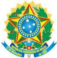

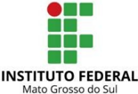

## MINISTÉRIO DA EDUCAÇÃO Secretaria de Educação Profissional e Tecnológica Instituto Federal de Educação; Ciência e Tecnologia de Mato Grosso do Sul

CNPJ 10.673.078/0001-20

## 5.1.4.  Matriz Curricular

| 1º Período                                 | 1º Período                                 | 1º Período                                 | 1º Período                                 | 2º Período                                | 2º Período                                | 2º Período                                | 2º Período                                | 3º Período                       | 3º Período                       | 3º Período                       | 4º Período                              | 4º Período                              | 4º Período                              | 4º Período                              | 5º Período                                             | 5º Período                                                                             | 5º Período                                                                             | 5º Período                                                                             | 6º Período                                                                             | 6º Período                                                                             | 6º Período                                                                             | 6º Período                                                                             |                                                                                        |
|--------------------------------------------|--------------------------------------------|--------------------------------------------|--------------------------------------------|-------------------------------------------|-------------------------------------------|-------------------------------------------|-------------------------------------------|----------------------------------|----------------------------------|----------------------------------|-----------------------------------------|-----------------------------------------|-----------------------------------------|-----------------------------------------|--------------------------------------------------------|----------------------------------------------------------------------------------------|----------------------------------------------------------------------------------------|----------------------------------------------------------------------------------------|----------------------------------------------------------------------------------------|----------------------------------------------------------------------------------------|----------------------------------------------------------------------------------------|----------------------------------------------------------------------------------------|----------------------------------------------------------------------------------------|
| 6                                          | 100                                        | 20                                         | 90                                         | 6                                         | 100                                       | 20                                        | 90                                        | 5                                | 80                               | 20 75                            | 5                                       | 80                                      | 20                                      | 75                                      | 5                                                      | 80                                                                                     | 20                                                                                     | 75 4                                                                                   | 60                                                                                     |                                                                                        | 20                                                                                     | 60                                                                                     |                                                                                        |
| Algoritmos e Lógica de  Programação        | Algoritmos e Lógica de  Programação        | Algoritmos e Lógica de  Programação        | Algoritmos e Lógica de  Programação        | Algoritmos e Estrutura de Dados           | Algoritmos e Estrutura de Dados           | Algoritmos e Estrutura de Dados           | Algoritmos e Estrutura de Dados           | Programação Orientada a  Objetos | Programação Orientada a  Objetos | Programação Orientada a  Objetos | Desenvolvimento de Serviços  para Web I | Desenvolvimento de Serviços  para Web I | Desenvolvimento de Serviços  para Web I | Desenvolvimento de Serviços  para Web I | Desenvolvimento de Serviços  para Web I                | Desenvolvimento de Serviços  para Web II Tópicos Especiais em Tecnologia da Informação | Desenvolvimento de Serviços  para Web II Tópicos Especiais em Tecnologia da Informação | Desenvolvimento de Serviços  para Web II Tópicos Especiais em Tecnologia da Informação | Desenvolvimento de Serviços  para Web II Tópicos Especiais em Tecnologia da Informação | Desenvolvimento de Serviços  para Web II Tópicos Especiais em Tecnologia da Informação | Desenvolvimento de Serviços  para Web II Tópicos Especiais em Tecnologia da Informação | Desenvolvimento de Serviços  para Web II Tópicos Especiais em Tecnologia da Informação | Desenvolvimento de Serviços  para Web II Tópicos Especiais em Tecnologia da Informação |
| 4                                          | 80                                         | 0 60                                       |                                            | 5                                         | 80                                        | 20                                        | 75                                        | 5                                | 80                               | 20 75                            | 5                                       | 80                                      | 20                                      | 75                                      | 4                                                      | 80                                                                                     | 0 60                                                                                   | 4                                                                                      | 80                                                                                     | 0                                                                                      |                                                                                        | 60                                                                                     |                                                                                        |
| Fundamentos de Design para  Interfaces Web | Fundamentos de Design para  Interfaces Web | Fundamentos de Design para  Interfaces Web | Fundamentos de Design para  Interfaces Web | Desenvolvimento Front-End para  Web       | Desenvolvimento Front-End para  Web       | Desenvolvimento Front-End para  Web       | Desenvolvimento Front-End para  Web       | Desenvolvimento Web Dinâmico     | Desenvolvimento Web Dinâmico     | Desenvolvimento Web Dinâmico     | Desenvolvimento de Interfaces  Ricas    | Desenvolvimento de Interfaces  Ricas    | Desenvolvimento de Interfaces  Ricas    | Desenvolvimento de Interfaces  Ricas    | Desenvolvimento de Aplicativos  Móveis Multiplataforma | Desenvolvimento de Aplicativos  Móveis Multiplataforma                                 | Desenvolvimento de Aplicativos  Móveis Multiplataforma                                 | Desenvolvimento de Aplicativos  Móveis Multiplataforma                                 | Desenvolvimento de Aplicativos  Móveis Multiplataforma                                 | Eletiva II                                                                             | Eletiva II                                                                             | Eletiva II                                                                             |                                                                                        |
| 4                                          | 80                                         | 0                                          | 60                                         | 2                                         | 40                                        | 0                                         | 30                                        | 4                                | 80                               | 0 60                             | 4                                       | 80                                      | 0                                       | 60                                      | 2                                                      | 40                                                                                     | 0                                                                                      | 30 2                                                                                   | 40                                                                                     |                                                                                        | 0                                                                                      | 30                                                                                     |                                                                                        |
| Fundamentos Matemáticos                    | Fundamentos Matemáticos                    | Fundamentos Matemáticos                    | Fundamentos Matemáticos                    | Fundamentos de Estatística                | Fundamentos de Estatística                | Fundamentos de Estatística                | Fundamentos de Estatística                | Projeto de Banco de Dados        | Projeto de Banco de Dados        | Projeto de Banco de Dados        | Gerência e Operação de Banco  de dados  | Gerência e Operação de Banco  de dados  | Gerência e Operação de Banco  de dados  | Gerência e Operação de Banco  de dados  | Eletiva I                                              | Eletiva I                                                                              | Eletiva I                                                                              | Eletiva I                                                                              | Auditoria e Segurança de Sistemas                                                      | Auditoria e Segurança de Sistemas                                                      | Auditoria e Segurança de Sistemas                                                      | Auditoria e Segurança de Sistemas                                                      |                                                                                        |
| 2                                          | 40                                         | 0                                          | 30                                         | 2                                         | 40                                        | 0                                         | 30                                        | 2                                | 40                               | 0 30                             | 2                                       | 40                                      | 0                                       | 30                                      | 3                                                      | 60                                                                                     | 0                                                                                      | 45 2                                                                                   | 40                                                                                     |                                                                                        | 0                                                                                      | 30                                                                                     |                                                                                        |
| Engenharia de Software                     | Engenharia de Software                     | Engenharia de Software                     | Engenharia de Software                     | Engenharia de Requisitos                  | Engenharia de Requisitos                  | Engenharia de Requisitos                  | Engenharia de Requisitos                  | Análise de Software              | Análise de Software              | Análise de Software              | Gerência de Projetos                    | Gerência de Projetos                    | Gerência de Projetos                    | Gerência de Projetos                    | Gerência e Configuração de  Serviços para Internet     | Gerência e Configuração de  Serviços para Internet                                     | Gerência e Configuração de  Serviços para Internet                                     | Gerência e Configuração de  Serviços para Internet                                     | Gerência e Configuração de  Serviços para Internet                                     | Teste de Software                                                                      | Teste de Software                                                                      | Teste de Software                                                                      |                                                                                        |
| 3                                          | 60                                         | 0                                          | 45                                         | 2                                         | 40                                        | 0                                         | 30                                        | 3                                | 60                               | 0 45                             | 3                                       | 40                                      | 20                                      | 45                                      | 2                                                      | 40                                                                                     | 0                                                                                      | 30 4                                                                                   | 80                                                                                     |                                                                                        | 0                                                                                      | 60                                                                                     |                                                                                        |
| Introdução à Tecnologia da  Computação     | Introdução à Tecnologia da  Computação     | Introdução à Tecnologia da  Computação     | Introdução à Tecnologia da  Computação     | Informática Ética e Sociedade             | Informática Ética e Sociedade             | Informática Ética e Sociedade             | Informática Ética e Sociedade             | Sistemas Operacionais            | Sistemas Operacionais            | Sistemas Operacionais            | Introdução à Redes de  Computadores     | Introdução à Redes de  Computadores     | Introdução à Redes de  Computadores     | Introdução à Redes de  Computadores     | Metodologia Científica e Redação  Técnica              | Metodologia Científica e Redação  Técnica                                              | Metodologia Científica e Redação  Técnica                                              | Metodologia Científica e Redação  Técnica                                              | Metodologia Científica e Redação  Técnica                                              | Atividades de Extensão V                                                               | Atividades de Extensão V                                                               | Atividades de Extensão V                                                               |                                                                                        |
| 2                                          | 40                                         | 0                                          | 30                                         | 4                                         | 80                                        | 0                                         | 60                                        | 2                                | 40 0                             | 30                               | 3                                       | 60                                      | 0                                       | 45                                      | 4                                                      | 80                                                                                     | 0                                                                                      | 60                                                                                     |                                                                                        |                                                                                        |                                                                                        |                                                                                        |                                                                                        |
| Inglês Técnico                             | Inglês Técnico                             | Inglês Técnico                             | Inglês Técnico                             | Administração e Estrutura  Organizacional | Administração e Estrutura  Organizacional | Administração e Estrutura  Organizacional | Administração e Estrutura  Organizacional | Empreendedorismo e Inovação      | Empreendedorismo e Inovação      | Empreendedorismo e Inovação      | Atividades de Extensão III              | Atividades de Extensão III              | Atividades de Extensão III              | Atividades de Extensão III              | Atividades de Extensão IV                              | Atividades de Extensão IV                                                              | Atividades de Extensão IV                                                              | Atividades de Extensão IV                                                              |                                                                                        |                                                                                        |                                                                                        |                                                                                        |                                                                                        |
| 2                                          | 40                                         | 0                                          | 30                                         | 2                                         | 40                                        | 0                                         | 30                                        | 2                                | 40                               | 0 30                             |                                         |                                         |                                         |                                         |                                                        |                                                                                        |                                                                                        |                                                                                        |                                                                                        |                                                                                        |                                                                                        |                                                                                        |                                                                                        |
| Operação de Computadores                   | Operação de Computadores                   | Operação de Computadores                   | Operação de Computadores                   | Atividades de Extensão I                  | Atividades de Extensão I                  | Atividades de Extensão I                  | Atividades de Extensão I                  | Atividades de Extensão II        | Atividades de Extensão II        | Atividades de Extensão II        | Atividades de Extensão II               |                                         |                                         |                                         |                                                        |                                                                                        |                                                                                        |                                                                                        |                                                                                        |                                                                                        |                                                                                        |                                                                                        |                                                                                        |

| 440 horas aulas    | 420 horas aulas    | 420 horas aulas    | 380 horas aulas    | 380 horas aulas    | 300 horas aulas    |
|--------------------|--------------------|--------------------|--------------------|--------------------|--------------------|
| 20 horas aulas EaD | 40 horas aulas EaD | 40 horas aulas EaD | 60 horas aulas EaD | 20 horas aulas EaD | 20 horas aulas EaD |
| 23 aulas semanais  | 23 aulas semanais  | 23 aulas semanais  | 22 aulas semanais  | 20 aulas semanais  | 16 aulas semanais  |
| 345 horas          | 345 horas          | 345 horas          | 330 horas          | 300 horas          | 240 horas          |

LEGENDA

- 1 CARGA HORÁRIA SEMANAL
- 2 CARGA HORÁRIA EM HORAS AULA
- 3 CARGA HORÁRIA EM HORAS AULA EAD
- 4 CARGA HORÁRIA EM HORAS
- 5 NOME DA UNIDADE CURRICULAR

1

2

3

4

5

CARGA HORÁRIA DAS UNIDADES CURRICULARES

1905 HORAS

CARGA HORÁRIA DO ESTÁGIO SUPERVISIONADO

180

CARGA HORÁRIA DAS ATIVIDADES COMPLEMENTARES

50

CARGA TRABALHO DE CONCLUSÃO DE CURSO

100

CARGA HORÁRIA TOTAL DO CURSO

2235 HORAS

## MINISTÉRIO DA EDUCAÇÃO

Secretaria de Educação Profissional e Tecnológica

CNPJ 10.673.078/0001-20

## 5.2.  Distribuição da Carga Horária

## 1º PERÍODO

| UNIDADE CURRICULAR                        |   CH Presencial |   CH Ead |   CH Extensão |   CH Total |
|-------------------------------------------|-----------------|----------|---------------|------------|
| Algoritmos e Lógica de Programação        |             100 |       20 |             0 |        120 |
| Fundamentos de Design para Interfaces Web |              80 |        0 |             0 |         80 |
| Fundamentos Matemáticos                   |              80 |        0 |             0 |         80 |
| Engenharia de Software                    |              40 |        0 |             0 |         40 |
| Introdução à Tecnologia da Computação     |              60 |        0 |             0 |         60 |
| Inglês Técnico                            |              40 |        0 |             0 |         40 |
| Operação de computadores                  |              40 |        0 |             0 |         40 |
| TOTAL PERÍODO EM HORA/AULAS               |             440 |       20 |             0 |        460 |
| TOTAL PERÍODO EM HORAS                    |             330 |       15 |             0 |        345 |

## 2º PERÍODO

| UNIDADE CURRICULAR                       |   CH Presencial |   CH Ead |   CH Extensão |   CH Total |
|------------------------------------------|-----------------|----------|---------------|------------|
| Algoritmos e Estrutura de Dados          |             100 |       20 |             0 |        120 |
| Desenvolvimento Front-End para Web       |              80 |       20 |             0 |        100 |
| Fundamentos de Estatística               |              40 |        0 |             0 |         40 |
| Engenharia de Requisitos                 |              40 |        0 |             0 |         40 |
| Informática Ética e Sociedade            |              40 |        0 |             0 |         40 |
| Administração e Estrutura Organizacional |              80 |        0 |             0 |         80 |
| Atividades de Extensão I                 |               0 |        0 |            40 |         40 |
| TOTAL PERÍODO EM HORA/AULAS              |             380 |       40 |            40 |        460 |
| TOTAL PERÍODO EM HORAS                   |             285 |       30 |            30 |        345 |

## 3°PERÍODO

| UNIDADE CURRICULAR              |   CH Presencial |   CH Ead |   CH Extensão |   CH Total |
|---------------------------------|-----------------|----------|---------------|------------|
| Programação Orientada a Objetos |              80 |       20 |             0 |        100 |
| Desenvolvimento Web Dinâmico    |              80 |       20 |             0 |        100 |
| Projeto de Banco de Dados       |              80 |        0 |             0 |         80 |
| Análise de Software             |              40 |        0 |             0 |         40 |
| Sistemas Operacionais           |              60 |        0 |             0 |         60 |
| Empreendedorismo e Inovação     |              40 |        0 |             0 |         40 |
| Atividades de Extensão II       |               0 |        0 |            40 |         40 |
| TOTAL PERÍODO EM HORA/AULAS     |             380 |       40 |            40 |        460 |
| TOTAL PERÍODO EM HORAS          |             285 |       30 |            30 |        345 |

## MINISTÉRIO DA EDUCAÇÃO Secretaria de Educação Profissional e Tecnológica Instituto Federal de Educação; Ciência e Tecnologia de Mato Grosso do Sul

CNPJ 10.673.078/0001-20

## 4º PERÍODO

| UNIDADE CURRICULAR                    |   CH Presencial |   CH Ead |   CH Extensão |   CH Total |
|---------------------------------------|-----------------|----------|---------------|------------|
| Desenvolvimento de Serviços para Web  |              80 |       20 |             0 |        100 |
| Desenvolvimento de Interfaces Ricas   |              80 |       20 |             0 |        100 |
| Gerência e Operação de Banco de dados |              80 |        0 |             0 |         80 |
| Gerência de Projetos                  |              40 |        0 |             0 |         40 |
| Introdução à Redes de Computadores    |              40 |       20 |             0 |         60 |
| Atividades de Extensão III            |               0 |        0 |            60 |         60 |
| TOTAL PERÍODO EM HORA/AULAS           |             320 |       60 |            60 |        440 |
| TOTAL PERÍODO EM HORAS                |             240 |       45 |            45 |        330 |

## 5º PERÍODO

| UNIDADE CURRICULAR                                          |   CH Presencial |   CH Ead |   CH Extensão |   CH Total |
|-------------------------------------------------------------|-----------------|----------|---------------|------------|
| Desenvolvimento de Serviços para Web II                     |              80 |       20 |             0 |        100 |
| Desenvolvimento   de   Aplicativos   Móveis Multiplataforma |              80 |        0 |             0 |         80 |
| Eletiva I                                                   |              40 |        0 |             0 |         40 |
| Gerência e Configuração de Serviços para Internet           |              60 |        0 |             0 |         60 |
| Metodologia Científica e Redação Técnica                    |              40 |        0 |             0 |         40 |
| Atividades de Extensão IV                                   |               0 |        0 |            80 |         80 |
| TOTAL PERÍODO EM HORA/AULAS                                 |             300 |       20 |            80 |        400 |
| TOTAL PERÍODO EM HORAS                                      |             225 |       15 |            60 |        300 |

## 6º PERÍODO

| UNIDADE CURRICULAR                                    |   CH Presencial |   CH Ead |   CH Extensão |   CH Total |
|-------------------------------------------------------|-----------------|----------|---------------|------------|
| Tópicos   Especiais   em   Tecnologia   da Informação |              60 |       20 |             0 |         80 |
| Eletiva II                                            |              40 |        0 |             0 |         40 |
| Teste de Software                                     |              40 |        0 |             0 |         40 |
| Auditoria e Segurança de Sistemas                     |              40 |        0 |             0 |         40 |
| Atividades de Extensão V                              |               0 |        0 |            80 |         80 |
| TOTAL PERÍODO EM HORA/AULAS                           |             180 |       20 |            80 |        280 |
| TOTAL PERÍODO EM HORAS                                |             135 |       15 |            60 |        210 |

## DISCIPLINAS OPTATIVAS

## MINISTÉRIO DA EDUCAÇÃO

Secretaria de Educação Profissional e Tecnológica

Instituto Federal de Educação; Ciência e Tecnologia de Mato Grosso do Sul

## CNPJ 10.673.078/0001-20

| Tecnologias Assistivas e Acessibilidade          |   40 |   0 |   0 |   40 |
|--------------------------------------------------|------|-----|-----|------|
| LIBRAS                                           |   40 |   0 |   0 |   40 |
| Agrometeorologia                                 |   40 |   0 |   0 |   40 |
| Topografia, Geoprocessamento Georreferenciamento |   40 |   0 |   0 |   40 |

## DISCIPLINAS ELETIVAS

| UNIDADE CURRICULAR                                                                          |   CH Presencial |   CH Ead |   CH Extensão |   CH Total |
|---------------------------------------------------------------------------------------------|-----------------|----------|---------------|------------|
| Tópicos em Linguagem de Programação                                                         |              40 |        0 |             0 |         40 |
| Elementos de Domótica                                                                       |              40 |        0 |             0 |         40 |
| Desenvolvimento de Sistemas Distribuídos                                                    |              40 |        0 |             0 |         40 |
| Tópicos   Especiais   em   Tecnologia   da Informação Aplicada ao Eixo de Recursos Naturais |              40 |        0 |             0 |         40 |
| Estrutura de Dados Não Lineares                                                             |              80 |        0 |             0 |         80 |
| Liderança em Ambientes Organizacionais                                                      |              80 |        0 |             0 |         80 |
| Desenvolvimento   de   Aplicativos   Móveis Multiplataforma avançado                        |              80 |        0 |             0 |         80 |
| Desenvolvimento   Web   Responsivo   e Acessibilidade                                       |              80 |        0 |             0 |         80 |

| UNIDADES CURRICULARES OBRIGATÓRIAS+ELETIVAS (HORAS)   |   1905 |
|-------------------------------------------------------|--------|
| ATIVIDADES COMPLEMENTARES (HORAS)                     |     50 |
| ESTÁGIO SUPERVISIONADO (HORAS)                        |    180 |
| TRABALHO DE CONCLUSÃO DE CURSO (TCC)                  |    100 |
| CARGA HORÁRIA TOTAL DO CURSO (HORAS)                  |   2235 |

## 5.2.1.  Atividades EAD

O Curso Superior de Tecnologia em Análise e Desenvolvimento de Sistemas propõe a realização de 6,8% de sua carga horária total através da modalidade a distância e 93,2% presencial. De acordo com a Instrução Normativa nº 03, de 24 de maio de 2022, a grade curricular proposta inclui unidades curriculares que serão ofertadas parcialmente à distância, respeitando o limite de 20% da carga horária total do curso.

## MINISTÉRIO DA EDUCAÇÃO

Secretaria de Educação Profissional e Tecnológica

Instituto Federal de Educação; Ciência e Tecnologia de Mato Grosso do Sul

## CNPJ 10.673.078/0001-20

Este formato tem como objetivo permitir a flexibilização dos horários dos estudos, além de incluir métodos e práticas de ensino e de aprendizagem que incorporem o uso integrado de tecnologias da informação e comunicação para a realização de objetivos pedagógicos.

O curso prevê um total de 10 (dez) unidades curriculares ofertadas com carga horária parcial na modalidade EaD. O Quadro 4 mostra a lista das unidades curriculares e suas respectivas cargas horárias.

Quadro 4: Unidades curriculares que ofertam uma carga horária parcial na modalidade EaD.

| Período     | Unidade Curricular                            | C.H. EaD   | % EaD   |
|-------------|-----------------------------------------------|------------|---------|
| 1º Semestre | Algoritmo e Lógica de Programação             | 15 horas   | 16,67%  |
| 2º Semestre | Algoritmos e Estrutura de Dados               | 15 horas   | 16,67%  |
| 2º Semestre | Desenvolvimento Front-End para Web            | 15 horas   | 20%     |
| 3º Semestre | Programação orientada a objetos               | 15 horas   | 20%     |
| 3º Semestre | Desenvolvimento Web Dinâmico                  | 15 horas   | 20%     |
| 4º Semestre | Desenvolvimento de Serviços para Web I        | 15 horas   | 20%     |
| 4º Semestre | Desenvolvimento de Interfaces Ricas           | 15 horas   | 20%     |
| 4º Semestre | Introdução à Redes de Computadores            | 15 horas   | 33%     |
| 5º Semestre | Desenvolvimento de Serviços para Web II       | 15 horas   | 20%     |
| 6º Semestre | Tópicos Especiais em Tecnologia da Informação | 15 horas   | 25%     |

Fonte: Elaborado pelos autores.

A carga horária destas 10 (dez) unidades curriculares somam 150 horas, estando abaixo do limite de 20% da carga horária total do curso e em conformidade com o Art. 16 do Regulamento da Organização-Didático Pedagógica do IFMS. Essas horas serão utilizadas como recursos de aprendizagem em formatos digitais que fomentem a leitura, a interação e a colaboração entre os estudantes. As aulas apresentarão o seguinte contexto mínimo:

- Utilização de videoaulas postadas pelo docente da Unidade Curricular;
- Resolução de exercícios com postagens no ambiente virtual de aprendizagem;
- Tira-dúvidas e atendimento ao estudante via ambiente virtual de aprendizagem, com horários predeterminados utilizando ferramentas com características de fórum de discussão ou de videoconferência.

A Unidade Curricular de Algoritmos e Lógica de Programação, única disciplina no primeiro período que contém carga horária parcial de EaD, terá em sua ementa conteúdos sobre Ambientação e Introdução ao EaD para a turma iniciante visando à familiarização dos estudantes com o Ambiente Virtual de Ensino e Aprendizagem (Avea). Essa ação visa atender ao §2º do Art. 3º da  Instrução Normativa nº 03, de 24 de maio de 2022.

## MINISTÉRIO DA EDUCAÇÃO

Secretaria de Educação Profissional e Tecnológica

Instituto Federal de Educação; Ciência e Tecnologia de Mato Grosso do Sul

CNPJ 10.673.078/0001-20

O curso conta com uma Equipe Multidisciplinar para suporte e apoio na execução das atividades EaD nomeada por portaria expedita pela Direção-Geral do campus . As ações e responsabilidades dessa equipe estão definidas na Instrução Normativa nº 03, de 24 de maio de 2022. Além disso, essa equipe também contará com o apoio do CREAD - Centro de Referência de Educação a Distância do IFMS, que atua em conjunto como uma equipe multidisciplinar própria para suporte de execução das atividades em EaD.

Os docentes das unidades curriculares atuam também como tutores, produzindo os materiais e utilizando os objetos de aprendizagem disponíveis nos AVEA - Ambientes Virtuais de Ensino e Aprendizagem disponibilizados e mantidos pelo IFMS.

Ressaltamos que o corpo docente do curso Superior de Tecnologia em Análise e Desenvolvimento de Sistemas já têm utilizado o Ambiente Virtual  de Ensino e Aprendizagem (AVEA) Moodle e produzido conteúdos para as disciplinas na modalidade a distância tendo como suporte, quando necessário, o CREAD. O corpo docente também atua em outros cursos que possuem carga horária de educação a distância, como é caso do curso Técnico Integrado de Informática para Internet e o de Agricultura.

Portanto, o corpo docente já está habituado com as estratégias de educação a distância, assim como possuem experiência na utilização dos AVEAs. Além disso, participam frequentemente de cursos de formação continuada, ofertadas pela instituição.

## 5.3.  Ementas e Bibliografias

## PRIMEIRO PERÍODO

## Unidade Curricular: Algoritmos e Lógica de Programação

Carga Horária Semanal: 6 h/a

Carga Horária Semestral: 120 h/a

## EMENTA:

Introdução ao Ambiente EaD; Introdução a lógica de programação, variáveis, constantes e tipos   de   dados;   Estruturas   algorítmicas:   atribuição,   instruções   de   entrada   e   saída; Operadores aritméticos e expressões; Estruturas de controle: desvio condicional e laços de repetição;   Operadores   lógicos   e   relacionais;   Conceitos   de   programação   estruturada   e modular; Procedimentos e funções; Estruturas de dados homogêneas; Introdução a uma linguagem de programação.

## OBJETIVOS:

- Compreender os conceitos fundamentais de algoritmos como forma de solução de problemas;
- Compreender as questões envolvendo a implementação de algoritmos.

## POSSIBILIDADES DE INTEGRAÇÃO:

Fundamentos Matemáticos.

## MINISTÉRIO DA EDUCAÇÃO

Secretaria de Educação Profissional e Tecnológica

Instituto Federal de Educação; Ciência e Tecnologia de Mato Grosso do Sul

## CNPJ 10.673.078/0001-20

## BASES CIENTÍFICO-TECNOLÓGICAS (Conteúdos):

1. Introdução ao ambiente EaD:
2. 1.1. Como acessar o ambiente;
3. 1.2. Primeiro acesso (trocar senha);
4. 1.3. Visualizando as disciplinas;
5. 1.4. Acessando conteúdos, fóruns de discussão e/ou videoconferência;
6. 1.5. Como realizar as atividades e questionários;
7. 1.6. Como acessar as notas das atividades e questionários.
2. Conceitos Básicos:
9. 2.1. Algoritmos e pseudocódigo;
10. 2.2. Variáveis, constantes e tipos de dados;
11. 2.3. Comandos básicos: Leitura e Escrita;
12. 2.4. Operadores: Aritméticos; Atribuição; Lógicos; Relacionais.
3. Estruturas:
14. 3.1. Estruturas de seleção;
15. 3.2. Estruturas de repetição;
16. 3.3. Estrutura de dados homogênea.
4. Programação estruturada e modular:
18. 4.1. Conceitos e Procedimentos e funções;
19. 4.2. Recursividade:
20. 4.2.1. Princípio;
21. 4.2.2. Como e quando usar e não usar;
22. 4.2.3. Removendo recursividade.
5. Processamento de cadeia de caracteres (Strings):
24. 5.1. Busca em cadeia de caracteres;
25. 5.2. Casamento de padrões ( pattern matching );
26. 5.3. Comparação de strings.
6. Introdução uma linguagem de programação.

## BIBLIOGRAFIA BÁSICA:

CORMEN, Thomas H. et al. Algoritmos: teoria e prática. Rio de Janeiro: Elsevier, c2012. xvi, 926 p. ISBN 9788535236996 (broch.).

CORMEN, Thomas H. Desmistificando algoritmos . Rio de Janeiro: Elsevier, 2014. xii, 188 p.

VILARIM, Gilvan. Algoritmos: programação para iniciantes. 3. ed. Rio de Janeiro: Ciência Moderna, 2017. 284 p.

## BIBLIOGRAFIA COMPLEMENTAR:

JÚNIOR, Dilermando Piva; NAKAMITI, Gilberto Shigueo; ENGELBRECHT, Angela de Mendonça; BIANCHI, Francisco. Algoritmos e programação de computadores . Rio de Janeiro: Elsevier, 2012. 497 p. Disponível em: &lt;https://www.evolution.com.br/product/algoritmos-eprogramao-de-computadores-1ed&gt;. Acesso em: 12 agosto. 2022.

MANZANO, José Augusto N. G.; OLIVEIRA, Jayr Figueiredo de. Algoritmos: lógica para desenvolvimento de programação de computadores. 28. ed. São Paulo: Erica, 2016. 1 recurso online. ISBN 9788536518657. Disponível em: &lt;https://integrada.minhabiblioteca.com.br/bo-

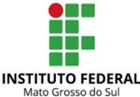

## MINISTÉRIO DA EDUCAÇÃO

Secretaria de Educação Profissional e Tecnológica

Instituto Federal de Educação; Ciência e Tecnologia de Mato Grosso do Sul

## CNPJ 10.673.078/0001-20

oks/9788536518657&gt;. Acesso em: 16 out. 2018.

SOUZA, Marco Antonio Furlan de et al. Algoritmos e lógica de programação: um texto introdutório para engenharia. 2. ed. rev. e ampl. São Paulo: Cengage Learning, c2011. xxiii, 234 p.

SZWARCFITER, Jayme Luiz; MARKENSON, Lilian. Estruturas de dados e seus algoritmos . 3. ed. Rio de Janeiro: LTC, 2010. 1 recurso online. ISBN 978-85-216-2995-5. Disponível em: &lt;https://integrada.minhabiblioteca.com.br/books/978-85-216-2995-5&gt;. Acesso em: 5 out. 2018.

## Unidade Curricular: Fundamentos de Design para Interfaces Web

## Carga Horária Semanal: 4 h/a

Carga Horária Semestral: 80 h/a

## EMENTA:

Introdução   ao   design   para   web;   princípios   básicos   do   design;   Identidade   visual; Sistematização; classificação e esquematização das cores; tipografia e iconografia; Imagens e   resoluções;   projeto   de   interface   gráfica;   Organização   e   arquitetura   da   informação; planejamento de layout web; Conceitos de usabilidade e experiência do usuário; Utilização de software editor gráfico de vetor e prototipagem de projetos de design.

## OBJETIVOS GERAIS:

Desenvolver protótipos de interface gráfica de sites e aplicações web aplicando os princípios básicos do design, organização e arquitetura da informação.

## POSSIBILIDADES DE INTEGRAÇÃO:

Não é aplicável.

## BASES CIENTÍFICO-TECNOLÓGICAS (Conteúdos):

1. Design Gráfico para Web:
2. 1.1. Introdução;
3. 1.2. Princípios básicos do Design (contraste, repetição, alinhamento, proximidade).
2. Imagem Digital:
5. 2.1. Bitmap;
6. 2.2. Vetores;
7. 2.3. Resolução;
8. 2.4. Ferramentas para edição de imagens.
3. Cores:
10. 3.1. Teoria das Cores;
11. 3.2. Psicodinâmica das cores;
12. 3.3. Harmonização de Cores:
13. 3.3.1. Análogas;
14. 3.3.2. Complementares;
15. 3.3.3. Triádicas;
16. 3.3.4. Monocromáticas.
4. Tipografia:
18. 4.1. Família de Fontes;
19. 4.2. Peso;

## MINISTÉRIO DA EDUCAÇÃO

Secretaria de Educação Profissional e Tecnológica

Instituto Federal de Educação; Ciência e Tecnologia de Mato Grosso do Sul

## CNPJ 10.673.078/0001-20

- 4.3. Hierarquia;
- 4.4. Utilização de Bibliotecas de Fontes.

## 5. Layout:

- 5.1. Padrões e técnicas de criação;
- 5.2. Grids ;
- 5.3. Wireframes e Mockups ;
- 5.4. Fundamentos da Organização e Arquitetura da Informação.
6. Guia de Estilos:
- 6.1. Paleta de Cores;
- 6.2. Ícones;
- 6.3. Componentes de Interface.
7. Software de Prototipação.

## BIBLIOGRAFIA BÁSICA:

SOBRAL, Wilma Sirlange. Design de interfaces : introdução. São Paulo: Érica, 2019. 152 p. ISBN 9788536532059 (broch.).

WILLIAMS, Robin. Design para quem não é designer : princípios de design e tipografia para iniciantes. 4. ed. color. e atual. São Paulo: Callis, 2013. 215 p. ISBN 9788574168364 (broch.).

KRUG, Steve. Não me faça pensar - atualizado: uma abordagem de bom senso à usabilidade web e mobile. Rio de Janeiro: Alta Books, 2014. xi, 198 p. ISBN 9788576088509 (broch.).

HELLER, Eva. A Psicologia das cores: Como as cores afetam a emoção e a razão.São Paulo: Editora Gustavo Gili, 2014, 311 p. ISBN: 9788565985079.

## BIBLIOGRAFIA COMPLEMENTAR:

BASTOS, Hekiodoro. PEREZ, Clotilde. Psicodinâmica das Cores em Comunicação 6. ed . São Paulo: Editora Blucher, 2011. 192 p. ISBN 9788521216933 (broch.).

GRANT, Will. UX design: guia definitivo com as melhores práticas de UX. São Paulo: Novatec, 2019. 208 p. ISBN 9788575227763 (broch.).

BENYON, David. Interação humano-computador . 2. ed. São Paulo: Pearson Education do Brasil, 2011. xx, 442 p. ISBN 9788579361098 (broch.).

YABLONSKI, Jon. Leis da psicologia aplicada a UX : usando a psicologia para projetar produtos e serviços melhores. São Paulo: Novatec, 2020. 152 p. ISBN 9786586057263 (broch.).

FERRAZ, Reinaldo. Acessibilidade na Web: boas práticas para construir sites e aplicações acessíveis. São Paulo: Casa do Código, 2020. 246 p. ISBN 978-65-86110-10-4 (broch.).

PEREIRA, Rogério. User Experience Design: Como criar produtos digitais com foco nas pessoas. São Paulo: Casa do Código, 2018. 196 p. ISBN 978-85-94188-66-3 (broch.).

LUPTON, Ellen. Pensar com tipos: Guia para designers, escritores, editores e estudantes. São Paulo: Editora Gustavo Gili, 2020, 224 p.ISBN 8584521666.

## MINISTÉRIO DA EDUCAÇÃO

Secretaria de Educação Profissional e Tecnológica

Instituto Federal de Educação; Ciência e Tecnologia de Mato Grosso do Sul

CNPJ 10.673.078/0001-20

## Unidade Curricular: Fundamentos Matemáticos

Carga Horária Semanal: 4 h/a

Carga Horária Semestral:

80 h/a

## EMENTA:

Conjuntos   numéricos   e   operações   com   conjuntos;   Porcentagem;   Funções   (1º,   2º, Exponenciais e Logarítmicas); Sequências numéricas (PA e PG); Matrizes.

## OBJETIVOS:

Identificar os conhecimentos matemáticos como meios para compreender e transformar a realidade   à   sua   volta,   bem   como   estimular   o   interesse,   a   curiosidade,   o   espírito   de investigação e o desenvolvimento da capacidade para resolver problemas.

## POSSIBILIDADES DE INTEGRAÇÃO:

Algoritmos e Lógica de Programação.

## BASES CIENTÍFICO-TECNOLÓGICAS (Conteúdos):

1. Conjuntos numéricos e operações com conjuntos:
2. 1.1. Apresentação dos conjuntos numéricos (Naturais, Inteiros, Racionais, Irracionais e Reais);
3. 1.2. Relação de pertinência e inclusão;
4. 1.3. Operações com conjuntos (união, inclusão, subtração e complementar).
2. Porcentagem:
6. 2.1. Definição e cálculo.
3. Funções (1º, 2º, Exponenciais e Logarítmicas):
8. 3.1. Função de 1º grau:
9. 3.1.1. Definição;
10. 3.1.2. Gráfico;
11. 3.1.3. Análise de coeficientes.
12. 3.2. Função do 2º grau:
13. 3.2.1. Definição;
14. 3.2.2. Gráfico (concavidade, raízes, vértice).
15. 3.3. Função Exponencial:
16. 3.3.1. Definição e propriedades;
17. 3.3.2. Gráfico;
18. 3.3.3. Equações exponenciais.
19. 3.4. Função Logarítmica:
20. 3.4.1. Definição e propriedades;
21. 3.4.2. Gráfico;
22. 3.4.3. Equações Logarítmicas.
4. Sequências numéricas (PA e PG):
24. 4.1. PA (Progressão Aritmética):
25. 4.1.1. Definição;
26. 4.1.2. Razão;
27. 4.1.3. Termo Geral;
28. 4.1.4. Interpolação Aritmética;
29. 4.1.5. Soma dos termos.
30. 4.2. PG (Progressão Geométrica):
31. 4.2.1. Definição;
32. 4.2.2. Razão;
33. 4.2.3. Termo Geral;
34. 4.2.4. Interpolação Geométrica;

## MINISTÉRIO DA EDUCAÇÃO

Secretaria de Educação Profissional e Tecnológica

Instituto Federal de Educação; Ciência e Tecnologia de Mato Grosso do Sul

## CNPJ 10.673.078/0001-20

## 4.2.5. Soma dos termos (PG finita e PG infinita);

- 4.2.6. Produto dos termos.

## 5. Matrizes:

- 5.1. Noção de matrizes;
- 5.2. Tipos de matrizes;
- 5.3. Operações com matrizes.

## BIBLIOGRAFIA BÁSICA:

DANTE, Luiz Roberto. Matemática: contexto &amp; aplicações: ensino médio. Vol. 1. 5. ed. São Paulo: Ática, [2011]. v. 1, 496 p.

IEZZI, Gelson; MURAKAMI, Carlos. Fundamentos de matemática elementar :   conjuntos, funções. 9. ed. São Paulo: Atual, 2013. 410 p.

IEZZI, Gelson; HAZZAN, Samuel. Fundamentos de matemática elementar: sequências, matrizes, determinantes e sistemas. 8. ed. São Paulo: Atual, 2013. 282 p.

## BIBLIOGRAFIA COMPLEMENTAR:

DANTE, Luiz Roberto. Matemática: contexto &amp; aplicações: ensino médio. Vol. 2. 5. ed. São Paulo: Ática, 2011. v. 2, 440 p.

PAIVA, M. Matemática . São Paulo: Moderna, 2005. v. 1.

RIBEIRO, J. Matemática: ciência, linguagem e tecnologia. São Paulo: Scipione, 2012. v. 1.

## Unidade Curricular: Engenharia de Software

Carga Horária Semanal: 2 h/a

Carga Horária Semestral: 40 h/a

## EMENTA :

Introdução à Engenharia de Software, ciclo de vida de um software; metodologias e modelos de desenvolvimento de software, processos de desenvolvimento de software;   práticas de desenvolvimento de software, introdução à engenharia de requisitos, introdução à análise e modelagem de software.

## OBJETIVOS:

- Apresentar   aos   alunos   os   principais   conceitos   que   embasam   a   Engenharia   de Software;
- Apresentar o histórico e a evolução da Engenharia de Software;
- Introduzir aos alunos o uso das boas práticas de desenvolvimento de software.
- Apresentar o ciclo de vida de desenvolvimento de software;
- Fazer   com   que   os   alunos   compreendam   todo   o   processo   envolvido   no desenvolvimento de sistemas de software;
- Explicar aos alunos os principais diagramas UML envolvidos no desenvolvimento de software.

## POSSIBILIDADES DE INTEGRAÇÃO:

## MINISTÉRIO DA EDUCAÇÃO

Secretaria de Educação Profissional e Tecnológica

Instituto Federal de Educação; Ciência e Tecnologia de Mato Grosso do Sul

## CNPJ 10.673.078/0001-20

Inglês Técnico, Fundamentos de Design para Interfaces Web, Introdução à Tecnologia da Computação.

## BASES CIENTÍFICO-TECNOLÓGICAS (Conteúdos):

1. Introdução à engenharia de software.
2. Metodologias e modelos de desenvolvimento de software.
3. Ciclo de vida do software.
4. Princípios de engenharia de requisitos
5. Principais diagramas UML
6. Princípios de análise e modelagem de software.

## BIBLIOGRAFIA BÁSICA:

PRESSMAN, Roger S. Engenharia de software: uma abordagem profissional. 7. ed. Porto Alegre: AMGH, 2011. xxviii, 780 p. ISBN 9788563308337 (broch.).

WAZLAWICK, R. S.. Engenharia de Software: conceitos e práticas. Rio de Janeiro: Elseiver, 2013.

SOMMERVILLE, Ian. Engenharia de software .   9.   ed.   São   Paulo:  Pearson Prentice Hall, 2011. xiii, 529 p. ISBN 9788579361081 (broch.).

Valente, Marco Tulio. Engenharia de software moderna: Princípios e Práticas para Desenvolvimento de Software com Produtividade 1 (2020).

## BIBLIOGRAFIA COMPLEMENTAR:

MACHADO, Felipe Nery Rodrigues. Análise e gestão de requisitos de software: onde nascem os sistemas. 3. ed. São Paulo: Érica, 2016. 288 p. ISBN 9788536516066 (broch.).

WASLAWICK, Raul Sidnei. Análise e design orientados a objetos para sistemas de informação: modelagem com UML, OCL e IFML. 3. ed. Rio de Janeiro: Elsevier, 2015. 462 p. ISBN 9788535279849 (broch.).

GÓES, Wilson Moraes. Aprenda UML por meio de estudos de caso . São Paulo: Novatec, c2014. 287 p. ISBN 9788575223468 (broch.).

MILETTO, Evandro Manara; BERTAGNOLLI, Silvia de Castro (org.). Desenvolvimento de software II: introdução ao desenvolvimento web com HTML, CSS, JAVASCRIPT, e PHP. Porto Alegre: Bookman, 2014. 266 p. (série tekne). ISBN 9788582601952 (broch.).

FREEMAN, Eric; ROBSON, Elisabeth. Use a cabeça! padrões e projetos . 2. ed. rev. Rio de Janeiro: Alta Books, 2009. xxiv, 478 p. (Use a cabeça!). ISBN 9788576081746 (broch.).

## Unidade Curricular: Introdução à Tecnologia da Computação

Carga Horária Semanal:

3 h/a

Carga Horária Semestral:

60 h/a

## MINISTÉRIO DA EDUCAÇÃO

Secretaria de Educação Profissional e Tecnológica

## CNPJ 10.673.078/0001-20

## EMENTA:

História   da   computação.   Classificação   de   hardware   e   software.   Modelo   fundamental   da computação: entrada, processamento e saída. Principais componentes de um computador: processador,   memórias,   dispositivos   de   armazenamento,   placa-mãe,   placas   gráficas   e periféricos. Instalação de sistema operacional e softwares. Tabela-verdade, Bases Numéricas e notação científica.

## OBJETIVOS:

- Apresentar conceitos básicos de hardware e software;
- Demonstrar a instalação dos sistemas operacionais atuais.
- Mostrar todos os componentes principais de um sistema computacional;

## POSSIBILIDADES DE INTEGRAÇÃO:

Operação de Computadores.

## BASES CIENTÍFICO-TECNOLÓGICAS (Conteúdos):

1. História da computação;
2. Bases Numéricas:
3. 2.1. Introdução;
4. 2.2. Representação de números;
5. 2.3. Transformação entre bases.

## 3. Hardware:

- 3.1. Conceitos de hardware;
- 3.2. Hardware externo;
- 3.3. Hardware interno:
- 3.3.1. Microprocessadores;
- 3.3.2. Motherboard;
- 3.3.3. Memória RAM;
- 3.3.4. Placa de vídeo;
- 3.3.5. SSD;
- 3.3.6. HDD.
- 3.4. Fontes.

## 4. Memórias:

- 4.1. Introdução a memórias;
- 4.2. Tipos de memórias;
- 4.3. Software;
5. Instalação de sistemas operacionais e de softwares.

## BIBLIOGRAFIA BÁSICA:

PATTERSON, David A. Organização e projeto de computadores . 5. ed. Rio de Janeiro: Elsevier, 2017. 501 p.

TANENBAUM, Andrew S. Organização estruturada de computadores . 6. ed. São Paulo: Pearson Education do Brasil, c2013. xvii, 605 p.

TOCCI, Ronald J.; WIDMER, Neal S.; MOSS, Gregory L. Sistemas digitais: princípios e aplicações. 11. ed. São Paulo: Pearson Prentice Hall, 2012 [i.e. 2011]. xviii, 817 p.

## MINISTÉRIO DA EDUCAÇÃO

Secretaria de Educação Profissional e Tecnológica

## CNPJ 10.673.078/0001-20

## BIBLIOGRAFIA COMPLEMENTAR:

BROOKSHEAR, J. Glenn. Ciência da computação: uma visão abrangente. 11. ed. Porto Alegre: Bookman, 2013. 1 recurso online. ISBN 9788582600313. Disponível em: https://integrada.minhabiblioteca.com.br/books/9788582600313. Acesso em: 16 out. 2018.

FEDELI, Ricardo Daniel; POLLONI, Enrico Giulio Franco; PERES, Fernando Eduardo. Introdução à ciência da computação . 2. ed. atual. São Paulo: Cengage Learning, 2013. 1 recurso online. ISBN 9788522110001. Disponível em: https://integrada.minhabiblioteca.com.br/books/9788522110001. Acesso em: 6 out. 2018.

HENNESSY, John L.; PATTERSON, David A. Arquitetura de computadores : uma abordagem   quantitativa.   Rio   de   Janeiro:   Elsevier,   c2008.   xvii,   494   p.   +   CD-ROM.   ISBN 9788535223552 (broch.). Disponível em: https://www.evolution.com.br/product/arquitetura-decomputadores-5ed. Acesso em: 11 out. 2018.

STALLINGS, William; PANNAIN, Ricardo (Revisão técnica). Arquitetura e organização de computadores .   10.   ed.   São   Paulo:   Pearson   Education   do   Brasil,   2017.   709   p.   ISBN 9788543020532 (broch.).

WEBER, Raul Fernando. Fundamentos de arquitetura de computadores . 4. ed. Porto Alegre:   Bookman,   2012.   1   recurso   online.   (Livros   didáticos   informática   UFRGS,   8).   ISBN 9788540701434. Disponível em: http://integrada.minhabiblioteca.com.br/books/ 9788540701434. Acesso em: 5 out. 2018.

## Unidade Curricular: Inglês Técnico

Carga Horária Semanal: 2

Carga Horária Semestral: 40 h/a

## EMENTA:

Estudo da língua inglesa, através de leitura de textos, tradução, produção escrita, com ênfase no conhecimento e aprimoramento de vocábulos na área técnica relacionada ao curso.

## OBJETIVOS:

- Exercitar as estratégias de compreensão textual, através de resolução de projetos escritos em língua inglesa;
- Identificar as partes de um resumo científico;
- Resolver tutoriais a partir de textos em inglês;
- Diferenciar e utilizar orações em inglês;
- Identificar informações específicas a partir de textos orais;
- Traduzir textos da área de redes de computadores.

## POSSIBILIDADES DE INTEGRAÇÃO:

Fundamentos   de   Design   para   Interfaces   Web,   Engenharia   de   Software,   Introdução   à Tecnologia da Computação.

## BASES CIENTÍFICO-TECNOLÓGICAS (Conteúdos):

1. ESP (English for Specific Purposes) baseado em gênero;
2. Tópicos textuais;
3. Técnicas e estratégias de leitura;

## MINISTÉRIO DA EDUCAÇÃO

Secretaria de Educação Profissional e Tecnológica

## CNPJ 10.673.078/0001-20

4. Types of texts; LANs and WANS; Topologies; Firewalls; Going wireless; Netiquette; Fact   and   opinion;   How   to   write   an   Abstract;   listening   to   specific   information; Topologies; Going Wireless; Requests for Comments (RFCs);
5. Aspectos gramaticais de língua inglesa aplicados à leitura.

## BIBLIOGRAFIA BÁSICA:

CRUZ, Décio Torres,; SILVA, Alba Valéria; ROSAS, Marta. Inglês.com.textos para informática . Salvador: Disal, 2001. 189 p.

GALLO, Lígia Razera. Inglês instrumental para informática: Módulo 1. 3. ed. atual. São Paulo: Ícone, 2014. 170 p.

GLENDINNING, Eric H.; MCEWAN, John. Basic english for computing . Revised &amp; updated. Oxford, N.Y.: Oxford University Press, 2003. 136 p. ISBN 9780194574709 (broch.).

## BIBLIOGRAFIA COMPLEMENTAR:

DREY, Rafaela Fetzner; SELISTRE, Isabel Cristina Tedesco; AIUB, Tânia. Inglês: práticas de leitura e escrita. Porto Alegre: Penso, 2015. 1 recurso online. (Tekne). ISBN 9788584290314. Disponível em: https://integrada.minhabiblioteca.com.br/books/9788584290314. Acesso em: 4 out. 2018.

LIMA, Denilso de. Gramática de uso da língua inglesa . Rio de Janeiro: Grupo GEN, 2015. 1 recurso online. ISBN 978-85-216-2864-4. Disponível em: https://integrada.minhabiblioteca.com.br/books/978-85-216-2864-4. Acesso em: 16 out. 2018.

REJANI, Márcia. Inglês instrumental: comunicação e processos para hospedagem. São Paulo: Erica, 2014. 1 recurso online. ISBN 9788536521831. Disponível em: https://integrada.minhabiblioteca.com.br/books/9788536521831. Acesso em: 16 out. 2018.

THOMPSON, Marco Aurélio da Silva. Inglês instrumental: estratégias de leitura para informática e Internet. São Paulo: Erica, 2016. 1 recurso online. ISBN 9788536517834. Disponível em: https://integrada.minhabiblioteca.com.br/books/9788536517834. Acesso em: 4 out. 2018.

## Unidade Curricular: Operação de Computador

Carga Horária Semanal: 2 h/a

Carga Horária Semestral:

40 h/a

## EMENTA:

Definição   de   hardware   e   software;   Conceitos   gerais   de   um   Sistema   Operacional: gerenciamento de pastas e arquivos, painel de controle, principais aplicativos e configurações básicas.   Processador   de   textos:   edição   e   formatação   de   textos   e   tabelas,   inserção   e formatação de imagens. Planilha eletrônica: edição e formatação de planilhas; inserção de fórmulas e gráficos; principais funções. Programa de apresentação: elaboração e criação de apresentações. Internet: navegadores, criação de endereço eletrônico, armazenamento em nuvem e edição de documentos online.

## OBJETIVOS:

## MINISTÉRIO DA EDUCAÇÃO

Secretaria de Educação Profissional e Tecnológica

## CNPJ 10.673.078/0001-20

1. Criar documentos de texto de maneira apropriada com o curso.
2. Elaborar planilhas eletrônicas com as devidas formatações e funções.
3. Confeccionar documentos de apresentação de forma adequada.
4. Navegar pelos endereços eletrônicos de forma correta, visando o conhecimento e possibilidades de plataforma.
5. Utilizar ferramentas tecnológicas da área da computação.

## POSSIBILIDADES DE INTEGRAÇÃO:

Introdução à Tecnologia da Computação.

## BASES CIENTÍFICO-TECNOLÓGICAS (Conteúdos):

1. Conceitos gerais de um Sistema Operacional:
2. 1.1. Definição de hardware e software;
3. 1.2. Conceitos básicos de sistema operacional;
4. 1.3. Gerenciamento de pastas e arquivos;
5. 1.4. Painel de controle;
6. 1.5. Principais aplicativos.
2. Processador de textos:
8. 2.1. Edição e formatação de textos;
9. 2.2. Edição e formatação tabelas;
10. 2.3. Inserção e formatação de imagens.
3. Planilha eletrônica:
12. 3.1. Edição e formatação de planilhas;
13. 3.2. Inserção de fórmulas e gráficos.
4. Internet:
15. 4.1. Navegadores;
16. 4.2. Criação de endereço eletrônico;
17. 4.3. Armazenamento em nuvem; e
18. 4.4. Edição de documentos online.

## BIBLIOGRAFIA BÁSICA:

VELLOSO, Fernando de Castro. Informática: conceitos básicos. 10. ed. rev. e atual. Rio de Janeiro: Elsevier, 2017. 448 p. ISBN 9788535243970.

SIMÃO, Daniel Hayashida. Libre Office: calc 4.2. Santa Cruz do Rio Pardo, SP: Viena, 2014. 206 p. ISBN 9788537103333.

RIBEIRO JÚNIOR, José Ivo. Análises estatísticas no excel: guia prático. Viçosa, MG: UFV, 2013. 311 p. ISBN 9788572694926.

## BIBLIOGRAFIA COMPLEMENTAR:

ANDRADE, Denise de F. Excel 2010: controlando dados. Santa Cruz do Rio Pardo, SP: Viena, 2011. 302 p. ISBN 9788537102480.

ANDRADE, Denise de F. Excel 2010: controlando dados. Santa Cruz do Rio Pardo, SP: Viena, 2011. 302 p. ISBN 9788537102480.

MENDONCA, Tales Araújo; ARAUJO, Bruno Gonçalves. Linux: simplicidade ao seu alcance. 1. ed. Santa Cruz do Rio Pardo, SP: Viena, 2012. 238 p. ISBN 9788537103012.

LAUREANO, Marcos Aurelio Pchek; OLSEN, Diogo Roberto. Sistemas operacionais . 1. ed.

## MINISTÉRIO DA EDUCAÇÃO

Secretaria de Educação Profissional e Tecnológica

Instituto Federal de Educação; Ciência e Tecnologia de Mato Grosso do Sul

## CNPJ 10.673.078/0001-20

Curitiba: Editora do Livro Técnico, 2010. 160 p. ISBN 9788563687159.

MARQUES, José Alves et al. Sistemas operacionais . Rio de Janeiro: LTC, c2011. xxiv, 375 p. ISBN 9788521618072.

## SEGUNDO PERÍODO

## Unidade Curricular: Algoritmos e Estrutura de Dados

Carga Horária Semanal: 6 h/a

Carga Horária Semestral:

120 h/a

## EMENTA:

Estruturas heterogêneas (Listas. Filas. Pilhas). Estruturas lineares. Busca e ordenação de   dados.   Bibliotecas   mais   utilizadas   da   linguagem.   Utilizar   uma   linguagem   de programação para aplicação das estruturas.

## OBJETIVOS:

Proporcionar   conhecimentos   gerais   para   utilizar   e   aplicar   estruturas   de   dados   como alternativa de solução de problemas por meio de uso de computadores, possibilitando a construção de algoritmos com estruturas de dados simples e complexas.

## POSSIBILIDADES DE INTEGRAÇÃO:

Fundamentos   de   Estatística,   Desenvolvimento   Front-End   para   Web,   Engenharia   de Requisitos e Atividades de Extensão I.

## BASES CIENTÍFICO-TECNOLÓGICAS (Conteúdos):

## 1. Algoritmos de busca:

- 1.1. Busca linear;
- 1.2. Busca binária.

## 2. Algoritmos de ordenação:

- 2.1. Algoritmos quadráticos (inserção, bolha e seleção);
- 2.2. MergeSort;
- 2.3. QuickSort.

## 3. Conceitos de estruturas de dados heterogêneas;

## 4. Listas lineares encadeadas:

- 4.1. Conceitos, implementações e aplicações;
- 4.2. Listas simplesmente encadeadas;
- 4.3. Listas duplamente encadeadas.
5. Pilhas, Filas e Deques: Conceitos, implementações e aplicações;
6. Bibliotecas mais utilizadas da linguagem:
- 6.1. DATE;
- 6.2. NUMBER.
7. Estruturas de dados lineares baseadas em tipos genéricos:

## MINISTÉRIO DA EDUCAÇÃO

Secretaria de Educação Profissional e Tecnológica

Instituto Federal de Educação; Ciência e Tecnologia de Mato Grosso do Sul

## CNPJ 10.673.078/0001-20

- 7.1. Conceitos de tipos genéricos;
- 7.2. Implementação e utilização de estruturas de dados baseadas em tipos genéricos.

## BIBLIOGRAFIA BÁSICA:

CORMEN, Thomas H. et al. Algoritmos: teoria e prática. Rio de Janeiro: Elsevier, c2012. xvi, 926 p. ISBN 9788535236996 (broch.).

FORBELLONE, André Luiz Villar; EBERSPÄCHER, Henri Frederico. Lógica de programação: a construção de algoritmos e estruturas de dados . 3. ed. São Paulo: Pearson Prentice Hall, 2005. xii, 218 p. ISBN 9788576050247 (broch.).

GOODRICH, M. T.; TAMASSIA, R. Estruturas de dados e algoritmos em Java. 4.ed. Porto Alegre: Bookman, 2007.

SZWARCFITER, Jayme Luiz; MARKENZON, Lilian. Estruturas de dados e seus algoritmos . 3. ed. Rio de Janeiro: LTC, 2010. xvi, 302 p. ISBN 9788521617501 (broch.).

## BIBLIOGRAFIA COMPLEMENTAR:

MANZANO, José Augusto N. G.; OLIVEIRA, Jayr Figueiredo de. Algoritmos: lógica para desenvolvimento de programação de computadores. 27. ed. rev. São Paulo: Érica, 2014. 328 p. ISBN 9788536502212 (broch.).

CORMEN, Thomas H. Desmistificando algoritmos . Rio de Janeiro: Elsevier, 2014. xii, 188 p. ISBN 9788535271775 (broch.).

## Unidade Curricular: Desenvolvimento Front-End para Web

Carga Horária Semanal:

5 h/a

Carga Horária Semestral:

100 h/a

## EMENTA:

Estruturação de documentos web utilizando linguagem de marcação de texto e hipermídia; Estilização de documentos web utilizando folhas de estilo; Projeto e implementação de layout web responsivo; Criação e estilização de formulários de entrada de dados.

## OBJETIVOS GERAIS:

Desenvolver sites e aplicações web responsivas utilizando os conceitos e padrões do design de layouts e interface de usuário.

## POSSIBILIDADES DE INTEGRAÇÃO:

Engenharia de Requisitos e Atividades de Extensão I.

## BASES CIENTÍFICO-TECNOLÓGICAS (Conteúdos):

1. Introdução a Web e Internet:
2. 1.1. Histórico e Evolução;
3. 1.2. Funcionamento da Web;

## MINISTÉRIO DA EDUCAÇÃO

Secretaria de Educação Profissional e Tecnológica

Instituto Federal de Educação; Ciência e Tecnologia de Mato Grosso do Sul

## CNPJ 10.673.078/0001-20

- 1.3. Comunicação Cliente Servidor;
- 1.4. Protocolo HTTP;
- 1.5. Navegadores;
- 1.6. Domínio e Hospedagem.

## 2. HTML:

- 2.1. Tags e atributos;
- 2.2. Estrutura padrão de uma página web;
- 2.3. Favicon;

## 2.4. Marcação de Texto:

- 2.4.1. Parágrafos e quebras de linha;
- 2.4.2. Hierarquia de títulos;
- 2.4.3. Negrito e itálico e sublinhado: &lt;b&gt;,&lt;i&gt;,&lt;u&gt;;
- 2.4.4. Texto marcado &lt;mark&gt;,texto deletado &lt;del&gt;;
- 2.4.5. Texto sobrescrito e subscrito;
- 2.4.6. Citações e códigos.
- 2.5. Listas ordenadas e não ordenadas;
- 2.6. Listas mistas e de definição;
- 2.7. Links: Links e âncoras, Links internos, Links para download;

## 2.8. Multimídia:

- 2.8.1. Inserindo imagens: &lt;img&gt;,&lt;figure&gt;;
- 2.8.2. Formatos de imagens para web;
- 2.8.3. Inserindo áudio: &lt;audio&gt;;
- 2.8.4. Formatos de áudio para web;
- 2.8.5. Inserindo vídeos: &lt;video&gt;;
- 2.8.6. Formatos de vídeos para web;
- 2.8.7. Incorporação de vídeos externos;

## 2.9. Semântica no HTML 5:

- 2.9.1. Tags   estruturais   semânticas: &lt;header&gt;,   &lt;footer&gt;,   &lt;section&gt;,   &lt;article&gt;,
- &lt;aside&gt;, &lt;nav&gt;.

## 3. CSS:

## 3.1. Fundamentos do CSS:

- 3.1.1. Definição e finalidade;
- 3.1.2. Regra CSS (Seletor, propriedade, valor);

## 3.1.3. Vinculando uma folha de estilo a documentos HTML:

- 1.3.1. Estilos inline;
- 1.3.2. Estilos incorporados;
- 1.3.3. Estilos externos.

## 3.2. Seletores, cascata e herança:

- 3.2.1. Herança, especificidade e efeito cascata;
- 3.2.2. Seletor universal;
- 3.2.3. Seletor de classe e id;
- 3.2.4. Seletor de atributo;
- 3.2.5. Pseudoclasses e pseudoelementos.
4. Box Model (Modelo de Caixa):

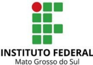

## MINISTÉRIO DA EDUCAÇÃO

Secretaria de Educação Profissional e Tecnológica

Instituto Federal de Educação; Ciência e Tecnologia de Mato Grosso do Sul

## CNPJ 10.673.078/0001-20

- 4.1. Elementos de bloco e elementos inline;
- 4.2. Diagrama do Box Model ( DevTools);
- 4.3. Propriedades : width, height ,margin, padding e border;
- 4.4. Cantos arredondados com a propriedade border-radius;
- 4.5. Propriedade box-sizing.
5. Módulos de Layout do CSS: FlexBox e Grid.

## 6. Cores e Opacidade:

- 6.1. Tipos de codificação de cores: Hexadecimal, RGB e RGBA;
- 6.2. Propriedade color e opacity;
- 6.3. Palavras-chave transparent e currentColor;
- 6.4. Definindo temas de cores para o Navegador.

## 7. Fontes:

- 7.1. Tipografia;
- 7.2. Propriedade font-family: serif, sans-serif, cursive, fantasy, monospace;
- 7.3. Propriedades: font-size,font-weight, font-style, color;
- 7.4. Utilizando fontes externas (Google Fonts).
8. Planos   de   Fundo: background-color;   background-image;   background-repeat; background-attachment; background-position.
9. Sombras e Gradientes;

## 10. Animações e Transições;

## 11. Design Responsivo:

- 11.1. Recursos do CSS para design responsivo;
- 11.2. Unidades de medida: EM, REM;
- 11.3. Breakpoints e Media Queries;
- 11.4. Imagens e planos de fundos responsivos;
- 11.5. Elemento &lt;picture&gt;;
- 11.6. Padrões de Interface responsiva.

## 12. Formulários:

- 12.1. Tipos de Campos;
- 12.2. Atributos;
- 12.3. Validação de Dados com padrões de entrada;
- 12.4. Estilização de elementos de formulário baseado em estados.

## BIBLIOGRAFIA BÁSICA:

Duckett, JON. HTML e CSS -  Projete e Construa Websites. Rio de Janeiro: Alta Books, 2015.

ZEMEL, Tárcio. Web design responsivo: páginas adaptáveis para todos os dispositivos. São Paulo: Casa do Código, 2017. 179 p. ISBN 9788566250077 (broch.).

MAZZA, Lucas. HTML5 e CSS3: domine a web do futuro. São Paulo: Casa do Código, 2017.

SILVA, Maurício Samy. CSS grid layout: criando layouts CSS profissionais. São Paulo: Novatec, 2017. 176 p. ISBN 9788575226322 (broch.).

## MINISTÉRIO DA EDUCAÇÃO

Secretaria de Educação Profissional e Tecnológica

Instituto Federal de Educação; Ciência e Tecnologia de Mato Grosso do Sul

## CNPJ 10.673.078/0001-20

## BIBLIOGRAFIA COMPLEMENTAR:

PILGRIM, Mark. HTML5 : Entendendo e executando. Rio de Janeiro: Alta Books, 2011.

SILVA, Maurício Samy. HTML5: a linguagem de marcação que revolucionou a Web. 2. ed. rev. e ampl. São Paulo: Novatec, 2014.

HOGAN, Brian P. HTML 5 e CSS3: desenvolva hoje com o padrão de amanhã. Rio de Janeiro: Ciência Moderna, 2012.

ZEMEL, Tárcio . CSS Eficiente: técnicas e ferramentas que fazem a diferença nos seus estilos. São Paulo: Casa do Código, 2017.

## Unidade Curricular: Fundamentos de Estatística

Carga Horária Semanal: 2 h/a

Carga Horária Semestral: 40 h/a

## EMENTA:

Fases do Método Estatístico; População e amostra; Séries estatísticas; Gráficos estatísticos; Distribuição de Frequência; Medidas de Posição; Medidas de Dispersão ou Variabilidade; Probabilidade.

## OBJETIVOS:

Conhecer e saber aplicar os conhecimentos da Estatística como ferramenta para tomada de decisão, fomentando hábitos de investigação e formação científica.

## POSSIBILIDADES DE INTEGRAÇÃO:

Algoritmos e Estrutura de Dados e Atividades de Extensão I.

## BASES CIENTÍFICO-TECNOLÓGICAS (Conteúdos):

1. Fases do Método Estatístico;
2. População e amostra;
3. Séries estatísticas;
4. Gráficos estatísticos;
5. Distribuição de Frequência;
6. Medidas de Posição;
7. Medidas de Dispersão ou Variabilidade;
8. Probabilidade.

## BIBLIOGRAFIA BÁSICA:

BARBETTA, Pedro Alberto. Estatística: para cursos de engenharia e informática. 3. ed. São Paulo: Atlas, 2010. 410 p.

CRESPO, Antônio Arnot. Estatística . São Paulo: Saraiva, 2020. 240 p. (Série + em foco).

TRIOLA, Mario F.. Introdução à estatística . 12. ed. -. Rio de Janeiro: LTC, 2017. xv, 812 p.

## MINISTÉRIO DA EDUCAÇÃO

Secretaria de Educação Profissional e Tecnológica

Instituto Federal de Educação; Ciência e Tecnologia de Mato Grosso do Sul

## CNPJ 10.673.078/0001-20

## BIBLIOGRAFIA COMPLEMENTAR:

COSTA, Sérgio Francisco. Introdução ilustrada à estatística .   5.   ed.  São Paulo: Harbra, 2013. 399 p.

FONSECA, Jairo Simon da; MARTINS, Gilberto de Andrade. Curso de estatística . 6. ed. São Paulo: Atlas, 1996. 320 p.

IEZZI, Gelson,; HAZZAN, Samuel; DEGENSZAJN, David Mauro. Fundamentos de matemática elementar: matemática comercial, matemática financeira, estatística descritiva. Vol 11. 2. ed. São Paulo: Atual, 2013. 245 p.

## Unidade Curricular: Engenharia de Requisitos

Carga Horária Semanal: 2 h/a

Carga Horária Semestral: 40 h/a

## EMENTA:

Engenharia   de   Requisitos.   Técnicas   e   instrumentos   de   coleta   de   requisitos.   Análise   e Gerenciamento de Requisitos. Requisitos Funcionais. Requisitos Não Funcionais. Regras de Negócio. Introdução à UML 2. Modelo de Casos de Uso. Diagrama de Casos de Uso. Descrição de cenários de casos de uso.

## OBJETIVOS:

- Definir   os   principais   conceitos   sobre   Engenharia   de   Software   e   os   processos envolvidos para o desenvolvimento de software no que diz respeito às técnicas para coleta, análise e gerenciamento de requisitos.
- Empregar o uso de diagramas UML2 para a representação de modelos e auxílio na elaboração de projetos de software.
- Capacitar o aluno a fazer o levantamento e definição de requisitos funcionais e não funcionais de um projeto de software.

## POSSIBILIDADES DE INTEGRAÇÃO:

Desenvolvimento   Front-End   para   Web,   Informática   Ética   e   Sociedade   e   Atividades   de Extensão I.

## BASES CIENTÍFICO-TECNOLÓGICAS (Conteúdos):

1. Definições de Engenharia de Software
2. Fundamentos de Engenharia de Requisitos
3. Produção de Requisitos
4. Requisitos
5. 4.1. Requisitos funcionais
6. 4.2. Requisitos não funcionais
7. 4.3. Requisitos de domínio
5. Levantamento de Requisitos
6. Gerência de Qualidade de Requisitos
7. Diagramas de Casos de Uso

## BIBLIOGRAFIA BÁSICA:

PRESSMAN, Roger S. Engenharia de software : uma abordagem profissional. 8. ed. Porto

## MINISTÉRIO DA EDUCAÇÃO Secretaria de Educação Profissional e Tecnológica Instituto Federal de Educação; Ciência e Tecnologia de Mato Grosso do Sul

CNPJ 10.673.078/0001-20

Alegre: AMGH, 2016. 940 p.

SOMMERVILLE, Ian. Engenharia de software .   9.   ed.   São  Paulo: Pearson Prentice Hall, 2011. xiii, 529 p.

WAZLAWICK, Raul Sidnei. Engenharia de software: conceitos e práticas. Rio de Janeiro: Elsevier, 2013. 343 p.

## BIBLIOGRAFIA COMPLEMENTAR:

MACHADO, Felipe Nery Rodrigues. Análise e gestão de requisitos de software: onde nascem os sistemas. 3. ed. São Paulo: Érica, 2016. 288 p.

PADUA FILHO, Wilson de Paula. Engenharia de software . 3. ed. Rio de Janeiro: LTC, 2008.

SCHACH, Stephen R. Engenharia de software. 7. ed. Porto Alegre: ArtMed, 2010.

SBROCCO, José Henrique Teixeira de Carvalho; MACEDO, Paulo César de. Metodologias ágeis: engenharia de software sob medida. São Paulo: Erica, 2012.

VAZQUEZ, Carlos   Eduardo;   SIMÕES,   Guilherme   Siqueira. Engenharia   de   requisitos: software orientado ao negócio. 3. ed. Rio de Janeiro: Brasport, 2016.

## Unidade Curricular: Informática Ética e Sociedade

Carga Horária Semanal: 2

Carga Horária Semestral: 40 h/a

## EMENTA:

Aspectos sociais,   etno-raciais,   econômicos   e   ambientais   da   aplicação   da   tecnologia   da informação. Direitos humanos. Ética  profissional  e no uso da tecnologia. Questões legais: segurança, privacidade, direito de propriedade e política nacional de resíduos sólidos. Lei Geral de Proteção de Dados.

## OBJETIVOS:

- Analisar os impactos do uso dos computadores sobre a sociedade, os grupos sociais e os indivíduos;
- Avaliar   as   repercussões   das   novas   tecnologias   na   sociedade,   considerando   os aspectos sociais, econômicos, políticos e educacionais;
- Posicionar   os   futuros   profissionais   em   relação   aos   aspectos   técnicos,   legais   e econômicos da escolha profissional.

## POSSIBILIDADES DE INTEGRAÇÃO:

Administração   e   Estrutura   Organizacional,   Engenharia   de   Requisitos   e   Atividades   de Extensão I.

## BASES CIENTÍFICO-TECNOLÓGICAS (Conteúdos):

1. A tecnologia informacional e o problema da inclusão em seus múltiplos aspectos.
2. O acesso à informação como um direito humano.

## MINISTÉRIO DA EDUCAÇÃO

Secretaria de Educação Profissional e Tecnológica

## CNPJ 10.673.078/0001-20

3. Arranjos produtivos, política e indústria nacional de informática.
4. Situação das indústrias de hardware e software no Brasil e no mundo.
5. A economia "pós-industrial".
6. A repercussão do computador no mercado de trabalho e a difusão do teletrabalho e a flexibilização da jornada de trabalho.
7. Propriedade   intelectual:   a   importância   da   proteção   à   propriedade   intelectual,   a propriedade intelectual e os códigos de ética da ACM e unificado.
8. Direito autoral, patente, segredos de negócio, engenharia reversa, novas tecnologias associadas ao direito autoral.
9. Ética e computação: o que é a Ética, o Profissional de Computação, a abrangência da Ética em Computação.
8. 10.Códigos de ética profissional: ética profissional, ética e regulamentação da profissão, Códigos de Ética Profissionais na área de computação, o Código de Ética da ACM, o Código de Ética unificado IEEE-CS/ACM para Engenharia de Software.
9. 11.Lei geral de proteção de dados.

## BIBLIOGRAFIA BÁSICA:

BARGER, Robert N. Ética na computação: uma abordagem baseada em casos. Rio de Janeiro: LTC, 2010. 1 recurso online. ISBN 978-85-216-2464-6. Disponível em: https://integrada.minhabiblioteca.com.br/books/978-85-216-2464-6. Acesso em: 6 out. 2018.

CASTELLS, Manuel. A sociedade em rede . 18. ed. rev. e atual. São Paulo: Paz e Terra, 2017. 628 p.

MASIERO, Paulo César. Ética em computação . 1. ed. São Paulo: EDUSP, 2000. 213 p.

## BIBLIOGRAFIA COMPLEMENTAR:

SCHAEFER, Richard T. Fundamentos de sociologia . 6. ed. Porto Alegre: AMGH, 2016. 1 recurso online. ISBN 9788580555714. Disponível em: https://integrada.minhabiblioteca.com.br/books/9788580555714. Acesso em: 16 out. 2018.

BARGER, Robert N. Ética na computação: uma abordagem baseada em casos. Rio de Janeiro: LTC, 2010. 1 recurso online. ISBN 978-85-216-2464-6. Disponível em: https://integrada.minhabiblioteca.com.br/books/978-85-216-2464-6. Acesso em: 16 out. 2018.

BRASILEIRO, Ada Magaly Matias. Manual de produção de textos acadêmicos e científicos . São Paulo: Atlas, 2013. 1 recurso online. ISBN 9788522477562. Disponível em: https:// integrada.minhabiblioteca.com.br/books/9788522477562. Acesso em: 16 out. 2018.

GABRIEL, Martha. Você, eu e os robôs: pequeno manual do mundo digital. Rio de Janeiro: Atlas, 2017. 1 recurso online. ISBN 9788597014785. Disponível em: https://integrada.minhabiblioteca.com.br/books/9788597014785. Acesso em: 16 out. 2018.

SANTOS, Jair Ferreira dos. O que é pós-moderno . 6. ed. São Paulo: Brasiliense, 1989, 113 p. (Primeiros passos (Brasiliense)).

## MINISTÉRIO DA EDUCAÇÃO

Secretaria de Educação Profissional e Tecnológica

Instituto Federal de Educação; Ciência e Tecnologia de Mato Grosso do Sul

CNPJ 10.673.078/0001-20

## Carga Horária Semanal: 4

## Carga Horária Semestral: 80 h/a

## EMENTA:

Fundamentos da administração, conceitos e evolução da administração. Estudo das funções administrativas,   novas   abordagens,   tendências   e   administração   na   sociedade   moderna. Planejamento   estratégico.   Comportamento organizacional e   motivação.   Estruturas organizacionais   das   empresas   contemporâneas.   A   Tecnologia   da   Informação   e   a Administração. Gestão e meio ambiente.

## OBJETIVOS:

- Demonstrar a importância da ciência administrativa, seu devir e suas funções.
- Refletir acerca das diversas estruturas organizacionais nas empresas contemporâneas, assim como o papel da tecnologia nas mesmas.
- Descortinar ferramentas de gestão, liderança e gestão de pessoas.

## POSSIBILIDADES DE INTEGRAÇÃO:

Informática Ética e Sociedade, Engenharia de Requisitos e Atividades de Extensão I.

## BASES CIENTÍFICO-TECNOLÓGICAS (Conteúdos):

1. A evolução da administração e do pensamento administrativo;
2. Abordagem sistêmica e contingencial;
3. Processos administrativos; planejamento, organização, direção e controle;
4. O enfoque comportamental na organização;
5. Ética e responsabilidade social.

## BIBLIOGRAFIA BÁSICA:

CARAVANTES, Geraldo Ronchetti; PANNO, Cláudia Caravantes; KLOECKNER, Mônica Caravantes. Administração: teorias e processo. São Paulo: Pearson Education do Brasil, 2005. 572 p.

CHIAVENATO, Idalberto. Introdução à teoria geral da administração . 9. ed. Barueri, SP: Manole, 2015 [i.e. 2014]. x, 654p.

LACOMBE, Francisco José Masset; HEILBORN, Gilberto Luiz José. Administração: princípios e tendências. 3. ed. São Paulo: Saraiva, 2015. 560 p.

PATTERSON, David A. Organização e projeto de computadores . 5. ed. Rio de Janeiro: Elsevier, 2017. 501 p.

## BIBLIOGRAFIA COMPLEMENTAR:

ALMEIDA, Martinho Isnard Ribeiro de. Manual de planejamento estratégico: desenvolvimento de um plano estratégico com a utilização de planilhas Excel. 3. ed. São Paulo: Atlas, 2010. 1 recurso online. ISBN 9788522481316. Disponível em: https://integrada.minhabiblioteca.com.br/books/9788522481316. Acesso em: 4 out. 2018.

CHIAVENATO, Idalberto. Teoria geral da administração : abordagens descritivas e explicativas. Vol. 2. 7. ed. São Paulo: Manole, 2014. 1 recurso online. ISBN 9788520440483. Disponível em: https://integrada.minhabiblioteca.com.br/books/9788520440483. Acesso em: 4 out. 2018.

## MINISTÉRIO DA EDUCAÇÃO

Secretaria de Educação Profissional e Tecnológica

Instituto Federal de Educação; Ciência e Tecnologia de Mato Grosso do Sul

## CNPJ 10.673.078/0001-20

JABBOUR, Ana Beatriz Lopes de Sousa; JABBOUR, Charbel José Chiappetta. Gestão ambiental nas organizações: fundamentos e tendências. São Paulo: Atlas, 2013. 1 recurso online.   ISBN   9788522477227.   Disponível   em:   https://integrada.minhabiblioteca.com.br/books/ 9788522477227. Acesso em: 4 out. 2018.

MAXIMIANO, Antônio César Amaru. Teoria geral da administração: da revolução urbana à revolução digital. 8. ed. Rio de Janeiro: Atlas, 2017. 1 recurso online. ISBN 9788597012460. Disponível em: https://integrada.minhabiblioteca.com.br/books/9788597012460. Acesso em: 7 out. 2018.

RICHTER, Burton. Além da fumaça e dos espelhos: mudanças climáticas e energia no século XXI. Rio de Janeiro: LTC, 2012. 1 recurso online. ISBN 978-85-216-2396-0. Disponível em: https://integrada.minhabiblioteca.com.br/books/978-85-216-2396-0.   Acesso   em:   4   out. 2018.

## Unidade Curricular: Atividades de Extensão I

Carga Horária Semanal: 2 h/a

Carga Horária Semestral: 40 h/a

## EMENTA:

Compreender a realização das atividades de Extensão. Entender a Extensão como princípio educativo. Abordagens para a Extensão Universitária. Construção de projetos de extensão. Soluções de TI enquanto ações extensionistas. Visitas ao público-alvo da extensão para diagnóstico   das   necessidades   e   posterior   elaboração   e   organização   de   plano   de desenvolvimento de sistemas.

## OBJETIVOS:

Conforme Art. 5º do Regulamento de Organização das Atividades de Extensão, nos cursos de graduação presenciais e/ou a distância, o objetivo da Curricularização da Extensão é intensificar, aprimorar e articular as ações de Extensão nos processos educacionais, sob os seguintes princípios:

- I. integração entre Ensino, Pesquisa e Extensão ao longo da trajetória acadêmica;
- II. relação interativa entre docentes, técnicos administrativos, discentes e sociedade no desenvolvimento das Atividades de Extensão;
- III. atendimento   à   comunidade   externa   como   processo   de   aplicação   de   soluções acadêmicas ou institucionais a questões do meio social, especialmente em grupos em vulnerabilidade socioeconômica e/ou ambiental;
- IV. indução do desenvolvimento sustentável, especialmente no universo dos arranjos produtivos, sociais e culturais locais; e
- V. preparação dos discentes para atuação no mundo do trabalho, conforme dinâmicas do meio social e seu perfil de formação.

## POSSIBILIDADES DE INTEGRAÇÃO:

- Algoritmos e Estrutura de Dados
- Fundamentos de Estatística
- Desenvolvimento Front-End para Web
- Engenharia de Requisitos
- Administração e Estrutura Organizacional
- Informática Ética e Sociedade

## MINISTÉRIO DA EDUCAÇÃO

Secretaria de Educação Profissional e Tecnológica

Instituto Federal de Educação; Ciência e Tecnologia de Mato Grosso do Sul

## CNPJ 10.673.078/0001-20

## BASES CIENTÍFICO-TECNOLÓGICAS (Conteúdos):

Não se aplica.

## BIBLIOGRAFIA BÁSICA:

MELLO, Cleyson de Moraes; ALMEIDA NETO, José Rogério Moura de; PETRILLO, Regina Pentagna. Curricularização da Extensão Universitária .   Rio   de   Janeiro:   Freitas   Bastos, 2020.   Disponível   em:   https://plataforma.bvirtual.com.br/Acervo/Publicacao/184189.   Acesso em: 19 maio 2021.

MEDEIROS, João Bosco. Redação Científica: a prática de fichamentos, resumos, resenhas. 12. ed. São Paulo: Atlas, 2014.

PRESSMAN, Roger S. Engenharia de software: uma abordagem profissional. 8. ed. Porto Alegre: AMGH, 2016. 940 p.

WAZLAWICK, Raul Sidnei. Engenharia de software: conceitos e práticas. Rio de Janeiro: Elsevier, 2013. 343 p.

## BIBLIOGRAFIA COMPLEMENTAR:

ALVES, William Pereira. Desenvolvimento e design de sites . São Paulo: Erica, 2014. 1 recurso online. ISBN 9788536519012. Disponível em: https:// integrada.minhabiblioteca.com.br/books/9788536519012. Acesso em: 16 out. 2018.

CORMEN, Thomas H. Desmistificando algoritmos . Rio de Janeiro: Elsevier, 2014. xii, 188 p.

CYBIS, Walter; BETIOL, Adriana Holtz; FAUST, Richard. Ergonomia e usabilidade: conhecimentos, métodos e aplicações. 3. ed. São Paulo: Novatec, 2015. 488 p.

KALBACH, James. Design de navegação web: otimizando a experiência do usuário. Porto Alegre: Bookman, 2009. 1 recurso online. ISBN 9788577805310. Disponível em: https://integrada.minhabiblioteca.com.br/books/9788577805310. Acesso em: 16 out. 2018.

NETO, S. C. Extensão e Universidade: a construção de transições paradigmáticas por meio das realidades sociais. 1° Edição. Editora Appris, 2016.

## TERCEIRO PERÍODO

## Unidade Curricular: Programação Orientada a Objetos

Carga Horária Semanal: 5 h/a

Carga Horária Semestral:

100 h/a

## EMENTA:

Conceitos básicos de orientação a objetos.  Criação de programas orientado a objetos. Manipulação de exceções. Acesso a bancos de dados relacionais.

## MINISTÉRIO DA EDUCAÇÃO

Secretaria de Educação Profissional e Tecnológica

## CNPJ 10.673.078/0001-20

## OBJETIVOS:

- Apresentar   os  conceitos   de   programação   orientada   a   objetos   com   ênfase   em interfaces e classes abstratas;
- Compreender, de forma abrangente, o mapeamento de objetos para bancos de dados relacionais;
- Utilizar os componentes gráficos na criação de aplicações com interfaces gráficas que acessem e manipulem bancos de dados relacionais.

## POSSIBILIDADES DE INTEGRAÇÃO:

Desenvolvimento   Web   Dinâmico,   Projeto   de   Banco   de   Dados,   Análise   de   Sistemas   e Atividades de Extensão II.

## BASES CIENTÍFICO-TECNOLÓGICAS (Conteúdos):

1. Conceitos básicos de orientação a objetos:
2. 1.1. Diferença entre estruturado e orientado a objetos;
3. 1.2. Classes e objetos;
4. 1.3. Atributos e métodos;
5. 1.4. Construtores e destrutores de objetos;
6. 1.5. Mensagens.
2. Conceito e aplicação dos pilares da orientação a objetos:
8. 2.1. Abstração;
9. 2.2. Herança;
10. 2.3. Encapsulamento:
11. 2.3.1. Sobrescrita;
12. 2.3.2. Sobrecarga;
13. 2.3.3. Modificadores de acesso.
14. 2.4. Polimorfismo.
3. Funções da linguagem:
16. 3.1. Casting ;
17. 3.2. Coleções.
4. Classes abstratas;
5. Interfaces;
6. Tratamento de exceções;
7. Acesso a bancos de dados relacionais.

## BIBLIOGRAFIA BÁSICA:

DEITEL, Paul J.; DEITEL, Harvey M. Java: como programar . 10. ed. São Paulo: Pearson Education do Brasil, 2016. xviii, 934 p. ISBN 9788543004792 (broch.).

FURGERI, Sérgio. Java 7: ensino didático. 2. ed. rev. e atual. São Paulo: Érica, 2012. 320 p.

GOODRICH, Michael T.; TAMASSIA, Roberto. Estruturas de dados &amp; algoritmos em Java . 5. ed. Porto Alegre: Bookman, 2013. 1 recurso online. ISBN 9788582600191. Disponível em: https://integrada.minhabiblioteca.com.br/books/9788582600191. Acesso em: 16 out. 2018.

MANZANO, José Augusto N. G.; COSTA JUNIOR, Roberto Affonso da. Programação de computadores com Java . São Paulo: Erica, 2014. 1 recurso online. ISBN 9788536519494. Disponível em: https://integrada.minhabiblioteca.com.br/books/9788536519494. Acesso em: 16 out. 2018.

SIERRA, Kathy; BATES, Bert. Use a cabeça! Java. Rio de Janeiro: Alta Books, 2010. 484 p. (Use a cabeça!). ISBN 9788576081739 (broch.).

## MINISTÉRIO DA EDUCAÇÃO

Secretaria de Educação Profissional e Tecnológica

Instituto Federal de Educação; Ciência e Tecnologia de Mato Grosso do Sul

## CNPJ 10.673.078/0001-20

## BIBLIOGRAFIA COMPLEMENTAR:

ALVES, William Pereira. Java para Web: desenvolvimento de aplicações. São Paulo: Erica, 2015. 1 recurso online. ISBN 9788536519357. Disponível em: https://integrada.minhabiblioteca.com.br/books/9788536519357. Acesso em: 16 out. 2018.

COELHO, Hébert. JPA eficaz: as melhores práticas de persistência de dados em Java. São Paulo: Casa do Código, 2016. 167 p. FLANAGAN, David. JavaScript: o guia definitivo. 6. ed. Porto Alegre: Bookman, 2013. 1062 p.

MACHADO, Rodrigo Prestes; FRANCO, Márcia Islabão; BERTAGNOLLI, Silvia de Castro. Desenvolvimento de software: programação de sistemas web orientada a objetos em Java. Vol 3. Porto Alegre: Bookman, 2016. 1 recurso online. (Tekne). ISBN 9788582603710. Disponível   em:   https://integrada.minhabiblioteca.com.br/books/9788582603710.   Acesso   em:   16 out. 2018.

MANZANO, José Augusto N. G. Java 8 programação de computadores: guia prático de introdução, orientação e desenvolvimento. São Paulo: Érica, 2014.

SCHILDT, Herbert. Java: a referência completa. 8. ed. Rio de Janeiro: Alta Books, 2014. 1148 p.

## Unidade Curricular: Desenvolvimento Web Dinâmico

Carga Horária Semanal: 5 h/a

Carga Horária Semestral:

100 h/a

## EMENTA:

Programação   dinâmica   para   Internet.   Introdução   a   linguagem   de script para   web. Manipulação dinâmica de elementos. Fluxo de dados assíncronos. Utilização de API's da Web ( LocalStorage , Web Sockets ).

## OBJETIVOS:

Criar interfaces dinâmicas e interativas de sites e aplicações web utilizando linguagem de script client-side.

## POSSIBILIDADES DE INTEGRAÇÃO:

Projeto de Banco de Dados, de Software e Atividades de Extensão III.

## BASES CIENTÍFICO-TECNOLÓGICAS (Conteúdos):

1. Fundamentos da Web:
2. 1.1. Histórico;
3. 1.2. Navegadores;
4. 1.3. Internet x WEB;
5. 1.4. Comunicação Cliente - Servidor;
6. 1.5. Protocolo HTTP (Requisição e Resposta).
2. Linguagem Javascript:
8. 2.1. Introdução;
9. 2.2. Linguagens Interpretadas X Linguagens Compiladas;

## MINISTÉRIO DA EDUCAÇÃO

Secretaria de Educação Profissional e Tecnológica

Instituto Federal de Educação; Ciência e Tecnologia de Mato Grosso do Sul

## CNPJ 10.673.078/0001-20

- 2.3. Ambientes de Execução (Navegador, Node JS);
- 2.4. Entrada e saída de dados;
- 2.5. Variáveis:
- 2.5.1. Tipos de dados;
- 2.5.2. Tipagem Dinâmica X Tipagem Estática;
- 2.5.3. Escopo;
- 2.5.4. Palavras-chaves: var, let, const.
- 2.6. Funções:
- 2.6.1. Declaração de Função;
- 2.6.2. Escopo;
- 2.6.3. Expressão de Função;
- 2.6.4. Funções Anônimas;
- 2.6.5. Funções de Callback.

## 2.7. Arrays:

- 2.7.1. Criação;
- 2.7.2. Métodos de manipulação.

## 2.8. Objetos:

- 2.8.1. Classes;
- 2.8.2. Funções Construtoras;
- 2.8.3. Objetos Literais.
- 2.9. Recursos do ES6 - ESNEXT:
- 2.9.1. Operador spread;
- 2.9.2. Funções de Flecha (Arrow Function);
- 2.9.3. ES Modules (import, export);
- 2.9.4. Atribuição via desestruturação;
- 2.9.5. Métodos Funcionais de Array (forEach(), map(), filter(),find() e reduce());
- 2.9.6. Template Literals.
- 2.10. DOM ( Document Object Model):
- 2.10.1. Árvore de elementos do HTML;
- 2.10.2. Criação e Manipulação de Elementos HTML:
- 10.2.1. Objeto Document;
- 10.2.2. Métodos de seleção de elementos;
- 10.2.3. Criação e remoção de elementos;
- 10.2.4. Manipulação de atributos;
- 10.2.5. Manipulação de CSS.
- 2.10.3. Eventos:
- 10.3.1. Ouvintes de Eventos;
- 10.3.2. Eventos de Mouse;
- 10.3.3. Eventos de Teclado;
- 10.3.4. Eventos do DOM.
- 2.11. Fluxo de dados assíncronos:
- 2.11.1. Javascript Assíncron;
- 2.11.2. Promises (Async await);
- 2.11.3. Consumo de API´s;
- 2.11.4. API Fetch;
- 2.11.5. Formato de Dados JSON.
- 2.12. API's da Web:
- 2.12.1. LocalStorage;
- 2.12.2. Web Sockets;
- 2.12.3. Introdução a PWA (Progressive Web Apps).

IEPSEN, Edécio Fernando. Lógica de programação e algoritmos com JavaScript: uma in-

## MINISTÉRIO DA EDUCAÇÃO

Secretaria de Educação Profissional e Tecnológica

## CNPJ 10.673.078/0001-20

trodução à programação de computadores com exemplos e exercícios para iniciantes. 2. ed. ampliada e revisada. São Paulo: Novatec, 2022. 352 p. ISBN 978-65-86057-90-4 (broch.).

DUCKETT, Jon; RUPPERT, Gilles; MOORE, Jack. JavaScript &amp; Jquery: desenvolvimento de interfaces web interativas. Rio de Janeiro: Alta Books, 2015. 640 p. ISBN 9788576089452 (broch.).

PINHO, Diego Martins. ECMAScript 6: entre de cabeça no futuro do JavaScprit. São Paulo: Casa do Código, 2018. 227 p. ISBN 9788555192586 (broch.).

## BIBLIOGRAFIA COMPLEMENTAR:

ALMEIDA, Flávio. Cangaceiro JavaScript: uma aventura no sertão da programação. São Paulo: Casa do Código, 2019. 501 p. (Caelum). ISBN 9788594188007 (broch).

FLANAGAN, David. JavaScript: o guia definitivo. 6. ed. Porto Alegre: Bookman, 2013. 1062 p. ISBN 9788565837194 (broch).

GRONER, Loiane. Estrutura de dados com JavaScript: escreva um código JavaScript complexo e eficaz usando a mais recente ECMAScript. São Paulo: Novatec, 2019. 452 p.

## Unidade Curricular: Projeto de Banco de Dados

Carga Horária Semanal: 4 h/a

Carga Horária Semestral:

80 h/a

## EMENTA:

Conceitos de banco de dados. Modelagem relacional e lógica. Sistemas Gerenciadores de Bancos de Dados (SGDBs). Linguagem de consulta estruturada.

## OBJETIVOS:

- Compreender os conceitos fundamentais de banco de dados;
- Compreender e utilizar uma linguagem relacional.
- Construir modelos de dados e utilizar técnicas de normalização;

## POSSIBILIDADES DE INTEGRAÇÃO:

Programação Orientada a Objetos, Desenvolvimento Web Dinâmico,  Análise de Sistemas e Atividades de Extensão II.

## BASES CIENTÍFICO-TECNOLÓGICAS (Conteúdos):

1. Conceitos Básicos de Banco de Dados
2. Modelo de dados
3. 2.1. Entidade-relacionamento
4. 2.2. Relacional
5. 2.3. Algebra relacional
3. Projeto de Banco de dados
7. 3.1. Fases do projeto
8. 3.2. Projeto Lógico de banco de dados relacionais
9. 3.3. Normalização
4. Linguagem de definição de dados

## MINISTÉRIO DA EDUCAÇÃO

Secretaria de Educação Profissional e Tecnológica

## CNPJ 10.673.078/0001-20

## 5. Linguagem de consulta Estruturada

## BIBLIOGRAFIA BÁSICA:

Taylor, Allen G. SQL Para Leigos. Brasil, Alta Books Editora, 2016.

ELMASRI, Ramez,; NAVATHE, Sham. Sistemas de banco de dados. 6. ed. São Paulo: Pearson Education do Brasil, c2011. xviii, 788 p.

HEUSER, Carlos Alberto. Projeto de banco de dados. 6. ed . Porto Alegre: Bookman, 2010 [i.e. 2009]. xvii, 277 p.

SILBERSCHATZ, Abraham; KORTH, Henry F.; SUDARSHAN, S. Sistema de banco de dados . Rio de Janeiro: Elsevier, c2012. 861 p. Disponível em: https://www.evolution.com.br/viewinside/9788535251425. Acesso em: 02/19/2022.

## BIBLIOGRAFIA COMPLEMENTAR:

CARDOSO, Vírginia M. Linguagem sql: fundamentos e práticas . São Paulo: Saraiva, 2009. 1 recurso online. ISBN 9788502200463. Disponível em: https://integrada.minhabiblioteca.com.br/books/9788502200463. Acesso em: 02/19/2022.

DAMAS, Luís. SQL: Structured Query Language .   6.   ed.   Rio   de   Janeiro:   LTC,   2007.   1 recurso online. ISBN 9788521632450. Disponível em: https://integrada.minhabiblioteca.com.br/books/9788521632450. Acesso em: 02/19/2022.

MACHADO, Felipe Nery Rodrigues. Banco de dados: projeto e implementação. 3. ed. São Paulo: Erica,   2014.   1   recurso   online.   ISBN   9788536518978.   Disponível   em: https://integrada.minhabiblioteca.com.br/books/9788536518978. Acesso em: 02/19/2022.

POLENTINI, Ricardo. Banco de Dados Sql: aprendendo através de exemplos. 1.   ed. Riode Janeiro: Ciência Moderna, 2015.

PUGA, Sandra; FRANÇA, Edson; GOYA, Milton. Banco de dados: implementando em SQL, PL/SQL e Oracle 11 g. São Paulo: Pearson Education do Brasil, c2014.

## Unidade Curricular: Análise de Software

Carga Horária Semanal: 2 h/a

Carga Horária Semestral: 60 h/a

## EMENTA:

Conceitos de análise e modelagem de software, conceituação e definição de metodologia ágeis, aplicação de metodologias ágeis na análise e modelagem de software, modelagem de software utilizando diagramas UML.

## MINISTÉRIO DA EDUCAÇÃO

Secretaria de Educação Profissional e Tecnológica

CNPJ 10.673.078/0001-20

## OBJETIVOS:

- Apresentar ao aluno os conceitos envolvidos nos processos de análise e modelagem de software.
- Introduzir ao aluno as principais metodologias ágeis e a sua utilização na análise e modelagem de software.
- Capacitar   o   aluno   a   utilizar   metodologias   ágeis   e   diagramas   UML   na   análise   e modelagem de software.

## POSSIBILIDADES DE INTEGRAÇÃO:

Programação Orientada a Objetos, Projeto de Banco de Dados e Atividades de Extensão II

## BASES CIENTÍFICO-TECNOLÓGICAS (Conteúdos):

1. Introdução à análise e modelagem de software.
2. Definição de metodologias ágeis
3. Principais metodologias ágeis
4. Diagrama UML 2.0
5. Análise e modelagem de software utilizando diagramas UML
6. Aplicação de metodologias ágeis na análise e modelagem de software.

## BIBLIOGRAFIA BÁSICA:

GÓES, Wilson Moraes. Aprenda UML por meio de estudos de caso . São Paulo: Novatec, c2014. 287 p.

MACHADO, Rodrigo Prestes; FRANCO, Márcia Islabão; BERTAGNOLLI, Silvia de Castro. Desenvolvimento de software: programação de sistemas web orientada a objetos em Java. Vol. 3. Porto Alegre: Bookman, 2016.

WASLAWICK, Raul Sidnei. Análise e design orientados a objetos para sistemas de informação: modelagem com UML, OCL e IFML. 3. ed. Rio de Janeiro: Elsevier, 2015. 462p.

## BIBLIOGRAFIA COMPLEMENTAR:

GUERREIRO, Sérgio. Introdução à Engenharia de Software . 1. ed. Lisboa: FCA, 2015.

PRESSMAN, Roger S. Engenharia de software: uma abordagem profissional. 8. ed. Porto Alegre: AMGH, 2016. 940 p. SCHACH,

STEPHEN R. Engenharia de software . 7. ed. Porto Alegre: ArtMed, 2010.

SOMMERVILLE, Ian. Engenharia de software. 9. ed. São Paulo: Pearson Prentice Hall, 2011. xiii, 529 p.

WAZLAWICK, Raul Sidnei. Engenharia de software: conceitos e práticas. Rio de Janeiro: Elsevier, 2013. 343 p.

## Unidade Curricular: Sistemas Operacionais

Carga Horária Semanal: 3 h/a

Carga Horária Semestral: 60 h/a

## MINISTÉRIO DA EDUCAÇÃO

Secretaria de Educação Profissional e Tecnológica

Instituto Federal de Educação; Ciência e Tecnologia de Mato Grosso do Sul

## CNPJ 10.673.078/0001-20

## EMENTA:

LINUX. Propósito dos sistemas operacionais. Estrutura de um sistema operacional. Gestão e comunicação de tarefas. Gestão de entrada e saída. Manipulação de arquivos e diretórios. Navegação. Gerenciamento de usuários e grupos. Gerenciamento de permissões e controle de acesso. Configurações básicas de redes. Criação e manipulação de scripts.

## OBJETIVOS:

- Apresentar os conceitos de sistemas operacionais;
- Demonstrar a estrutura dos sistemas operacionais.
- Conhecer os conceitos de gerenciamento de manipulação de arquivos e diretórios;

## POSSIBILIDADES DE INTEGRAÇÃO:

Atividades de Extensão II

## BASES CIENTÍFICO-TECNOLÓGICAS (Conteúdos):

1. Introdução:
2. 1.1. Conceitos básicos;
3. 1.2. Histórico de sistemas operacionais;
4. 1.3. Processos, memória, arquivos, entrada/saída e proteção;
5. 1.4. Chamadas de sistema;
6. 1.5. Estrutura de um Sistema Operacionais.
2. Processos e threads:
8. 2.1. Processos;
9. 2.2. Threads;
10. 2.3. Comunicação entre processos;
11. 2.4. Escalonamento.
3. Sistemas de arquivos:
13. 3.1. Arquivos;
14. 3.2. Diretórios;
15. 3.3. Implementação do sistema de arquivos;
16. 3.4. Gerenciamento e otimização dos sistemas de arquivos;
17. 3.5. Pesquisas em sistemas de arquivos.
4. Entrada/saída:
19. 4.1. Princípios do hardware de E/S;
20. 4.2. Princípios do software de E/S;
21. 4.3. Interfaces com o usuário: teclado, mouse, monitor;
22. 4.4. Discos.

## BIBLIOGRAFIA BÁSICA:

TANENBAUM, Andrew S. Sistemas operacionais modernos . 3. ed. São Paulo: Pearson Education do Brasil, 2009. xvi, 653 p. ISBN 9788576052371 (broch.).

LAUREANO, Marcos Aurelio Pchek; OLSEN, Diogo Roberto. Sistemas operacionais . 1. ed. Curitiba: Editora do Livro Técnico, 2010. 160 p. ISBN 9788563687159.

SILBERSCHATZ, Abraham; GALVIN, Peter B.; GAGNE, Greg. Sistemas operacionais com Java . 7. ed. rev. e atual. Rio de Janeiro: Elsevier, 2008. xx, 673 p. ISBN 9788535224061.

## BIBLIOGRAFIA COMPLEMENTAR:

MACHADO, Francis B.; MAIA, Luiz Paulo. Arquitetura de sistemas operacionais . 5. ed. Rio

## MINISTÉRIO DA EDUCAÇÃO

Secretaria de Educação Profissional e Tecnológica

Instituto Federal de Educação; Ciência e Tecnologia de Mato Grosso do Sul

CNPJ 10.673.078/0001-20

de Janeiro: LTC, 2013. 250 p. ISBN 9788521622109.

STUART, Brian L. P rincípios de sistemas operacionais: projetos e aplicações. São Paulo: Cengage Learning, c2011. xxi, 655 p. ISBN 9788522107339.

MARQUES, José Alves et al. Sistemas operacionais . Rio de Janeiro: LTC, c2011. xxiv, 375 p. ISBN 9788521618072 (broch.).

DEITEL, Harvey M.,; DEITEL, Paul J.; CHOFFNES, David R. Sistemas operacionais . 3. ed. São Paulo: Pearson Prentice Hall, c2005. xxi, 760 p. ISBN 9788576050117 (broch.).

OLIVEIRA, Rômulo Silva de; CARISSIMI, Alexandre da Silva; TOSCANI, Simão Sirineo. Sistemas operacionais . 4. ed. Porto Alegre: Bookman, 2010. xii, 374 p. (Série livros didáticos informática UFRGS; 11). ISBN 9788577805211 (broch.).

## Unidade Curricular: Empreendedorismo e Inovação

Carga Horária Semanal: 3

Carga Horária Semestral: 60 h/a

## EMENTA:

Empreendedorismo.   O   empreendedor.   Visão,   oportunidade   e   criatividade.   O   perfil   do empreendedor de sucesso. A análise de oportunidades. O processo de criação de novas empresas. Plano de negócios: importância, estrutura e apresentação. Caminhos a seguir e recursos disponíveis para o empreendedor.

## OBJETIVOS:

- Contribuir   para   o   desenvolvimento   da   capacidade   empreendedora   através   de atividades teóricas e práticas;
- Fazer   uso   das   tecnologias   da   informação,   adequando-as   aos   novos   modelos organizacionais e dos processos e sistemas de inovação tecnológica.

## POSSIBILIDADES DE INTEGRAÇÃO:

Atividades de Extensão II.

## BASES CIENTÍFICO-TECNOLÓGICAS (Conteúdos):

1. Empreendedorismo;
2. Gerência de recursos empresariais;
3. Criatividade e visão empreendedora;
4. Plano de negócios;
5. Assessoria para o negócio.

## BIBLIOGRAFIA BÁSICA:

CHIAVENATO, Idalberto. Empreendedorismo: dando asas ao espírito empreendedor. 4. ed. São Paulo: Saraiva, 2012. xv, 315 p.

DORNELAS, José Carlos Assis. Empreendedorismo: transformando ideias em negócios. 7. ed. São Paulo: Empreende, 2018. 267 p.

LINS, Luiz Dos Santos. Empreendedorismo: uma abordagem prática e descomplicada. São Paulo: Atlas, 2014. 1 recurso online. ISBN 9788522493968. Disponível em: https://integrada.-

## MINISTÉRIO DA EDUCAÇÃO

Secretaria de Educação Profissional e Tecnológica

## CNPJ 10.673.078/0001-20

minhabiblioteca.com.br/books/9788522493968. Acesso em: 16 out. 2018.

## BIBLIOGRAFIA COMPLEMENTAR:

BARANAUSKAS, Maria Cecília Calani; MARTINS, Maria Cecília; VALENTE, José Armando. Codesign de redes digitais: tecnologia e educação a serviço da inclusão social. 1. ed. Porto Alegre: Penso, 2013. 1 recurso online. ISBN 9788565848626. Disponível em: https://integrada.minhabiblioteca.com.br/books/9788565848626. Acesso em: 16 out. 2018.

FEIJÓ, Ricardo Luis Chaves. Economia agrícola e desenvolvimento rural . Rio de Janeiro: LTC, 2010. 1 recurso online. ISBN 978-85-216-1986-4. Disponível em: http://integrada.minhabiblioteca.com.br/books/978-85-216-1986-4. Acesso em: 7 out. 2018.

MAXIMIANO, Antonio Cesar Amaru. Teoria geral da administração: da revolução urbana à revolução digital. 8. ed. Rio de Janeiro: Atlas, 2017. 1 recurso online. ISBN 9788597012460. Disponível em: https://integrada.minhabiblioteca.com.br/books/9788597012460. Acesso em: 7 out. 2018.

O'BRIEN, James A.; MARAKAS, George M. Administração de sistemas de informação . 15. ed. Porto Alegre: AMGH, 2013. 590 p.

SCHWANKE, Cibele. Ambiente : tecnologias. 1. ed. Porto Alegre: Bookman, 2013. 1 recurso online.   (Tekne).   ISBN   9788582600122.   Disponível   em:   https://integrada.minhabiblioteca.com.br/books/9788582600122. Acesso em: 16 out. 2018.

## Atividades de Extensão II

Carga Horária Semanal: 2 ha

Carga Horária Semestral: 40 h/a

## EMENTA:

Organização   e   execução   dos   minicursos,   mesas   redondas,   debates,   palestras,   visitas técnicas e oficinas. Organização da página do evento, contato com os convidados, listas de presença,   materiais   gráficos,   divulgação,   inscrições,   instruções   aos   participantes   e certificados. Trabalhar as ações a partir do diagnóstico realizado na unidade curricular de Atividade de Extensão I.

## OBJETIVOS:

Conforme Art. 5º do Regulamento de Organização das Atividades de Extensão, nos cursos de graduação presenciais e/ou a distância, o objetivo da Curricularização da Extensão é intensificar, aprimorar e articular as ações de Extensão nos processos educacionais, sob os seguintes princípios:

- I. integração entre Ensino, Pesquisa e Extensão ao longo da trajetória acadêmica;
- II. relação interativa entre docentes, técnicos administrativos, discentes e sociedade no desenvolvimento das Atividades de Extensão;
- III. atendimento   à   comunidade   externa   como   processo   de   aplicação   de   soluções acadêmicas ou institucionais a questões do meio social, especialmente em grupos em vulnerabilidade socioeconômica e/ou ambiental;
- IV. indução do desenvolvimento sustentável, especialmente no universo dos arranjos produtivos, sociais e culturais locais; e

## MINISTÉRIO DA EDUCAÇÃO

Secretaria de Educação Profissional e Tecnológica

Instituto Federal de Educação; Ciência e Tecnologia de Mato Grosso do Sul

## CNPJ 10.673.078/0001-20

- V. preparação dos discentes para atuação no mundo do trabalho, conforme dinâmicas do meio social e seu perfil de formação.

## POSSIBILIDADES DE INTEGRAÇÃO:

- Programação Orientada a Objetos
- Projeto de Banco de Dados
- Desenvolvimento Web Dinâmico
- Análise de Sistemas
- Empreendedorismo e Inovação
- Sistemas Operacionais

## BASES CIENTÍFICO-TECNOLÓGICAS (Conteúdos):

Não se aplica.

## BIBLIOGRAFIA BÁSICA:

MELLO, Cleyson de Moraes; ALMEIDA NETO, José Rogério Moura de; PETRILLO, Regina Pentagna. Curricularização da Extensão Universitária .   Rio  de Janeiro: Freitas Bastos, 2020. Disponível em: https://plataforma.bvirtual.com.br/Acervo/Publicacao/184189. Acesso em: 19 maio 2021.

MEDEIROS, João Bosco. Redação Científica: a prática de fichamentos, resumos, resenhas. 12. ed. São Paulo: Atlas, 2014.

PRESSMAN, Roger S. Engenharia de software: uma abordagem profissional. 8. ed. Porto Alegre: AMGH, 2016. 940 p.

WAZLAWICK, Raul Sidnei. Engenharia de software: conceitos e práticas. Rio de Janeiro: Elsevier, 2013. 343 p.

## BIBLIOGRAFIA COMPLEMENTAR:

ALVES, William Pereira. Desenvolvimento e design de sites . São Paulo: Erica, 2014. 1 recurso online. ISBN 9788536519012. Disponível em: https:// integrada.minhabiblioteca.com.br/books/9788536519012. Acesso em: 16 out. 2018.

CORMEN, Thomas H. Desmistificando algoritmos . Rio de Janeiro: Elsevier, 2014. xii, 188 p.

CYBIS, Walter; BETIOL, Adriana Holtz; FAUST, Richard. Ergonomia e usabilidade: conhecimentos, métodos e aplicações. 3. ed. São Paulo: Novatec, 2015. 488 p.

FREIRE, P. Extensão ou comunicação? 15 ed. Rio de Janeiro: Paz e Terra, 2011.

KALBACH, James. Design de navegação web: otimizando a experiência do usuário. Porto Alegre: Bookman, 2009. 1 recurso online. ISBN 9788577805310. Disponível em: https://integrada.minhabiblioteca.com.br/books/9788577805310. Acesso em: 16 out. 2018.

NETO, S. C. Extensão e Universidade: a   construção de transições paradigmáticas por meio das realidades sociais. 1° Edição. Editora Appris, 2016.

## MINISTÉRIO DA EDUCAÇÃO

Secretaria de Educação Profissional e Tecnológica

CNPJ 10.673.078/0001-20

## QUARTO PERÍODO

## Unidade Curricular: Desenvolvimento de Serviços para Web I

Carga Horária Semanal: 5 h/a

Carga Horária Semestral:

100 h/a

## EMENTA:

Arquiteturas   de   software.   Conceito   de   frameworks.   Principais   frameworks   para desenvolvimento de aplicações. Utilização de frameworks para desenvolvimento de software para a Internet com manipulação e consulta de dados. Introdução à técnica de mapeamento objeto-relacional(ORM).

## OBJETIVOS:

- Compreender as principais tarefas relacionadas ao desenvolvimento web utilizando Frameworks;
- Configurar, projetar sistemas, persistir os dados em um Banco de Dados utilizando mapeamento objeto-relacional.

## POSSIBILIDADES DE INTEGRAÇÃO:

Desenvolvimento de Interfaces Ricas, Gerência e Operação de Banco de Dados, Gerência de Projetos, Introdução à Redes de Computadores e Atividades de Extensão III.

## BASES CIENTÍFICO-TECNOLÓGICAS (Conteúdos):

1. Conceitos básicos:
2. 1.1. O que é framework;
3. 1.2. Principais frameworks do mercado.
2. Arquitetura de software:
5. 2.1. Principais arquiteturas:
6. 2.1.1. MVC;
7. 2.1.2. Layers (camadas);
8. 2.1.3. Microservices;
9. 2.1.4. Client-server (cliente-servidor).
3. M apeamento O bjeto-Relacional(ORM):
11. 3.1. Conceitos;
12. 3.2. Persistência em SGBD;
13. 3.3. Técnicas de mapeamento objeto-relacional.
4. Programação para web utilizando um framework:
15. 4.1. Principais componentes;
16. 4.2. Plugins;
17. 4.3. Bibliotecas;
18. 4.4. CRUD:
19. 4.4.1. Conceitos;
20. 4.4.2. Desenvolvimento de uma aplicação.

## BIBLIOGRAFIA BÁSICA:

WEISSMANN, Henrique Lobo. Vire o jogo com SpringFramework .   São Paulo: Casa do

## MINISTÉRIO DA EDUCAÇÃO

Secretaria de Educação Profissional e Tecnológica

Instituto Federal de Educação; Ciência e Tecnologia de Mato Grosso do Sul

## CNPJ 10.673.078/0001-20

Código, [2017]. 316 p.

SOUZA, Alberto. Spring MVC: domine o principal framework web java. São Paulo: Casa do Código, 2017. 260 p. (Série Caelum).

FISHER, Paul Tepper; MURPHY, Brian D. Persistência no Spring com o Hibernate . Rio de janeiro: Ciência Moderna, 2011.

## BIBLIOGRAFIA COMPLEMENTAR:

GABARDO, Ademir Cristiano. Laravel para ninjas . São Paulo: Novatec, 2017. 184 p. ISBN 9788575225509 (broch).

Costa, Caio. Spring Boot: Microsserviços na prática. N.p., Independently Published, 2021.

Boaglio, Fernando. Spring Boot: Acelere o desenvolvimento de microsserviços. Brasil, Casa do Código, 2017.

## Unidade Curricular: Desenvolvimento de Interfaces Ricas

Carga Horária Semanal: 5 h/a

Carga Horária Semestral:

100 h/a

## EMENTA:

Bibliotecas   e   frameworks   front-end   reativos   baseados   em   componentes   da   web; Desenvolvimento de Single Page Applications (SPA) e aplicações web progressivas (PWA).

## OBJETIVOS GERAIS:

Desenvolver aplicações web utilizando frameworks front-end reativos utilizando os conceitos de SPA (Single Page Applications) implementando recursos de apps progressivos (PWA).

## POSSIBILIDADES DE INTEGRAÇÃO:

Desenvolvimento de Serviços para Web 1, Gerência e Operação de Banco de Dados, Gerência de Projetos e Atividades de Extensão III.

## BASES CIENTÍFICO-TECNOLÓGICAS (Conteúdos):

1. Introdução
2. 1.1. Programação Reativa
3. 1.2. Componentes da Web

## 2. REACT JS

- 2.1. Javascript para REACT
- 2.1.1. Javascript e EcmaScript
- 2.1.2. Declaração de variáveis
- 2.1.3. Operador Ternário
- 2.1.4. Arrow Functions
- 2.1.5. Operador Spread
- 2.1.6. Métodos map(), filter(), find(), reduce()
- 2.1.7. Template Literals
- 2.1.8. ES Modules ( import, export )

## MINISTÉRIO DA EDUCAÇÃO

Secretaria de Educação Profissional e Tecnológica

Instituto Federal de Educação; Ciência e Tecnologia de Mato Grosso do Sul

## CNPJ 10.673.078/0001-20

- 2.1.9. Atribuição via desestruturação
- 2.1.10. Sintaxe JSX
- 2.2. Começando com React
- 2.2.1. Ferramentas de Desenvolvimento com REACT
- 2.2.2. DOM Core versus React.DOM
- 2.2.3. Componentes funcionais
- 2.2.4. Fases e métodos do ciclo de vida dos componentes
- 2.2.5. Props
- 2.2.6. Gerenciamento de Estado
- 2.2.7. Gerenciamento de Contexto
- 2.2.8. Hooks
- 2.2.9. Rotas
- 2.3. Bibliotecas de Componentes
- 2.4. Bibliotecas de estilização CSS in JS
- 2.5. Bibliotecas de Ícones
- 2.6. Biblioteca React Router
- 2.7. Conteúdo dinâmico e consumo de API´s
- 2.8. Hospedagem de Aplicações construídas em React
3. Progressive Web APPS (PWA)
- 3.1. Introdução e Conceitos
- 3.2. Web App Manifest
- 3.3. Service Works
- 3.4. Web Storage
- 3.5. Cache
- 3.6. Dados Offline
- 3.7. Instalação
- 3.8. Integração com Sistema Operacional
- 3.9. Ferramentas e Bibliotecas para criação de PWA

## BIBLIOGRAFIA BÁSICA:

SILVA, Maurício Samy. REACT: Aprenda Praticando. 1. ed. São Paulo: Novatec, 2021.

PONTES, Guilherme. Progressive web apps: construa aplicações progressivas com React. São Paulo: Casa do Código, 2018. 443 p. ISBN 9788594188540 (broch.).

IEPSEN, Edécio Fernando. Lógica de programação e algoritmos com JavaScript: uma introdução à programação de computadores com exemplos e exercícios para iniciantes. 2. ed. ampliada e revisada. São Paulo: Novatec, 2022. 352 p. ISBN 978-65-86057-90-4 (broch.).

## BIBLIOGRAFIA COMPLEMENTAR:

PINHO, Diego Martins. ECMAScript 6: entre de cabeça no futuro do JavaScprit. São Paulo: Casa do Código, 2018. 227 p. ISBN 9788555192586 (broch.).

ADRIANO, Thiago da Silva. Guia prático de TypeScript: melhore suas aplicações JavaScript. São Paulo: Casa do Código, 2018. 178 p. ISBN 978-65-86110-77-7 (broch.).

BROWN, Ethan. Programação web com node e express : beneficiando-se da stack JavaScript. São Paulo: Novatec, 2020. 368 ISBN 97886057089 (broch.).

## MINISTÉRIO DA EDUCAÇÃO

Secretaria de Educação Profissional e Tecnológica

Instituto Federal de Educação; Ciência e Tecnologia de Mato Grosso do Sul

## CNPJ 10.673.078/0001-20

FERRAZ, Reinaldo. Acessibilidade na Web: boas práticas para construir sites e aplicações acessíveis. São Paulo: Casa do Código, 2020. 246 p. ISBN 978-65-86110-10-4 (broch.).

## Unidade Curricular: Gerência e Operação de Banco de dados

Carga Horária Semanal: 4 h/a

Carga Horária Semestral: 80 h/a

## EMENTA:

Administração de banco de dados. Consultas avançadas. Gerenciamento de transações. Triggers. Procedures/funções. Views. Backup e restauração de dados. Planos de execução de consultas e indexação.

## OBJETIVOS:

- Consolidar os conhecimentos de teoria de banco de dados.
- Aprender e aplicar as técnicas de administração de sistemas de banco de dados.
- Compreender e aplicar as técnicas de sistemas gerenciador de banco de dados.

## POSSIBILIDADES DE INTEGRAÇÃO:

Desenvolvimento de Serviços para Web 1, Desenvolvimento de Interfaces Ricas, Gerência de Projetos e Atividades de Extensão III.

## BASES CIENTÍFICO-TECNOLÓGICAS (Conteúdos):

1. Consultas avançadas
2. Linguagem procedural
3. 2.1. Views
4. 2.2. Triggers
5. 2.3. Funções/procedimentos
3. Administração do banco de dados
7. 3.1. Processamento e otimização de consultas
8. 3.2. Processamento de transações
9. 3.3. Estrutura de índices
4. Segurança
11. 4.1. Backup de dados
12. 4.2. Restauração de dados

RAMAKRISHNAN, Raghu; GEHRKE, Johannes. Sistemas de gerenciamento de banco de dados . São Paulo: McGraw-Hill, 2008. xxvii, 884 p.

SOUZA, Thiago Hernandes de. SQL: avançado e teoria relacional. Rio de Janeiro: Ciência Moderna, 2013. ix, 151 p.

CORONEL, Carlos; ROB, Peter. Sistemas de banco de dados: projeto, implementação e administração. São Paulo: Cengage Learning, 2011.

## BIBLIOGRAFIA COMPLEMENTAR:

CARDOSO, Vírginia M. Linguagem sql: fundamentos e práticas. São Paulo: Saraiva, 2009.

## MINISTÉRIO DA EDUCAÇÃO

Secretaria de Educação Profissional e Tecnológica

Instituto Federal de Educação; Ciência e Tecnologia de Mato Grosso do Sul

## CNPJ 10.673.078/0001-20

1 recurso online. ISBN 9788502200463. Disponível em: https://integrada.minhabiblioteca.com.br/books/9788502200463. Acesso em: 02/09/2022.

Beighley, Lynn. Use A Cabeça! SQL . Brasil, Alta Books, 2008.

MACHADO, Felipe Nery Rodrigues. Banco de dados: projeto e implementação. 3. ed. São Paulo: Erica, 2014. 1 recurso online. ISBN 9788536518978. Disponível em: https://integrada.minhabiblioteca.com.br/books/9788536518978. Acesso em: 02/09/2022.

## Unidade Curricular: Gerência de Projetos

Carga Horária Semanal: 2 h/a

Carga Horária Semestral: 40 h/a

## EMENTA:

Contexto   da   gerência   de   projetos,   manifesto   ágil,   metodologias   ágeis   aplicadas   ao gerenciamento   de   projetos,   plano   de   projeto,   gestão   de   projetos   de   software   com metodologias ágeis. Ciclo de vida de projeto, processo de gestão: concepção, planejamento, execução, controle e finalização, fatores de sucesso da gestão de projetos de software, processo de planejamento e gestão de escopo.

## OBJETIVOS:

- Conceituar e explicar a importância da gerência de  projetos no desenvolvimento de software.
- Apresentar   ao   aluno   as   metodologias   ágeis   e   sua   conexão   com   a   gerência   de projetos;
- Capacitar o aluno a aplicar os métodos ágeis para o gerenciamento eficaz de projetos.

## POSSIBILIDADES DE INTEGRAÇÃO:

Atividades de Extensão III.

## BASES CIENTÍFICO-TECNOLÓGICAS (Conteúdos):

1. O contexto da gerência de projetos;
2. Introdução à gerência de projetos com PMBOK: características, ciclo de vida, áreas de conhecimento e processos;
3. Diferenças entre a gestão de projetos tradicional e ágil;
4. Manifesto ágil;
5. Visão geral das metodologias ágeis;
6. Scrum: características, papéis, responsabilidades, eventos, artefatos e ferramentas;
7. Kanban: características, artefatos e ferramentas;
8. Estudos de Casos.

## BIBLIOGRAFIA BÁSICA:

PMI. Um guia do conhecimento em gerenciamento de projetos . Guia PMBOK 6a ed. EUA: Project Management Institute, 2018, 756 p.

PMI. Guia Ágil. Agile Practice Guide 1a. ed. - EUA: Project Management Institute, 2018, 210 p.

PRIKLADNICKI, R.;  WILLI,   R.;   MILANI,   F. Métodos Ágeis para Desenvolvimento de

## MINISTÉRIO DA EDUCAÇÃO

Secretaria de Educação Profissional e Tecnológica

Instituto Federal de Educação; Ciência e Tecnologia de Mato Grosso do Sul

## CNPJ 10.673.078/0001-20

Software . 1ed. Porto Alegre, RS: Bookman. 2014 312 p.

SABBAGH, Rafael. Scrum: Gestão ágil para projetos de sucesso. São Paulo: Casa do Código, 2013. 270 p.

## BIBLIOGRAFIA COMPLEMENTAR:

CARVALHO, M. M.; RABECHINI Jr, R. Fundamentos em Gestão de Projetos: Construindo Competências para Gerenciar Projetos. São Paulo: Editora Atlas, 5 ed, 2018 432p.

GOMES, André F. Agile: Desenvolvimento de software com entregas frequentes e foco no valor de negócio. São Paulo: Casa do Código, 2014. 166 p.

KALBACH, James. Design de navegação web: otimizando a experiência do usuário. Porto Alegre: Bookman, 2009.

PRESSMAN, Roger S. Engenharia de software: uma abordagem profissional. 8. ed. Porto Alegre: AMGH, 2016. 940 p.

VAZQUEZ, Carlos   Eduardo;   SIMÕES,   Guilherme   Siqueira. Engenharia   de   Requisitos Software Orientado ao Negócio . 1. ed. São Paulo: Brasport, 2016.

## Unidade Curricular: Introdução à Redes de Computadores

Carga Horária Semanal: 3 h/a

Carga Horária Semestral: 60 h/a

## EMENTA:

Modelos OSI e TCP/IP. Protocolos de rede das camadas de rede, transporte e aplicação. Cálculo de IP em CIDR. Funcionamento da internet.

## OBJETIVOS:

- Proporcionar aos alunos conhecimentos teóricos e práticos, sobre os recursos de equipamentos de redes de computadores e demais ferramentas necessárias, em nível de redes LAN, MAN e WAN.
- Apresentar os conceitos dos Modelos OSI e TCP/IP.

## POSSIBILIDADES DE INTEGRAÇÃO:

Desenvolvimento de Serviços para Web I,  Gerência  e Operação de Banco de Dados e Atividades de Extensão III.

## BASES CIENTÍFICO-TECNOLÓGICAS (Conteúdos):

1. Meios Físicos (Mídias de Transmissão):
2. 1.1. O que são mídias de transmissão?
3. 1.1.1. Cabeamento.
4. 1.2. Wireless-redes sem fio.
2. 2 - Técnicas de Transmissão de Dados:
6. 2.1. Modelo de comunicação:
7. 2.1.1. Transmissão analógica;

## MINISTÉRIO DA EDUCAÇÃO Secretaria de Educação Profissional e Tecnológica Instituto Federal de Educação; Ciência e Tecnologia de Mato Grosso do Sul

## CNPJ 10.673.078/0001-20

- 2.1.2. Transmissão digital.
- 2.2. Modulação e codificação:
- 2.2.1. Tipos de modulação;
- 2.2.2. Codificação;
- 2.2.3. Degeneração dos sinais.
- 2.3. Transmissão de sinais:
- 2.3.1. Transmissão síncrona;
- 2.3.2. Transmissão assíncrona.
- 2.4. Capacidade de largura de banda;
- 2.5. Multiplexação:
- 2.5.1. Multiplexação por divisão de frequência (frequency division multiplexing);
- 2.5.2. Multiplexação por divisão de tempo (time division multiplexing);
- 2.5.3. Multiplexação   por   divisão   de   tempo   estatistico   (statistical   time   division multiplexing);
- 2.5.4. Multiplexação CDMA (Code Division Multiplex Access);
- 2.5.5. Multiplexação OFDM (Orthogonal Frequency Division Multiplexing).
3. Arquitetura de Redes e Modelo de Referência:
- 3.1. Conceitos básicos:
- 3.1.1. O que é rede local?
- 3.1.2. Histórico e os benefícios da rede;
- 3.1.3. Comunicação de dados e as redes de computadores.
- 3.2. 3.2 Padrões de rede:
- 3.2.1. Camada física;
- 3.2.2. Camada enlace;
- 3.2.3. Camada rede;
- 3.2.4. Camada transporte;
- 3.2.5. Camada sessão;
- 3.2.6. Camada apresentação;
- 3.2.7. Camada aplicação.
- 3.3. Métodos de transporte;
- 3.4. Topologias:
- 3.4.1. Barramento;
- 3.4.2. Anel;
- 3.4.3. Estrela;
- 3.4.4. Topologías híbridas.
- 3.5. Dispositivos de rede:
- 3.5.1. Placa adaptadora de rede;
- 3.5.2. Hub;
- 3.5.3. Switch;
- 3.5.4. Estação cliente;
- 3.5.5. Estação servidora;
- 3.5.6. Estação de gerência.
4. Normas e Convenções de Redes:
- 4.1. Órgãos de padronização:
- 4.1.1. Padronização da indústria;
- 4.1.2. Padronização de fato.
- 4.2. Padronização de interfaces DTE/DCE;
- 4.3. Dispositivos de comunicação e padrões;
- 4.4. Ethernet:
- 4.4.1. Endereçamento MAC;
- 4.4.2. Método de acesso ao meio;
- 4.4.3. Frame Ethernet.
5. Sistemas de Cabeamento Estruturado:

## MINISTÉRIO DA EDUCAÇÃO

Secretaria de Educação Profissional e Tecnológica

Instituto Federal de Educação; Ciência e Tecnologia de Mato Grosso do Sul

## CNPJ 10.673.078/0001-20

- 5.1. Cabeamento:
- 5.1.1. Planejamento para o cabeamento estruturado.
- 5.2. Principais componentes do cabeamento estruturado:
- 5.2.1. Cabeamento horizontal;
- 5.2.2. Cabeamento vertical;
- 5.2.3. Área de trabalho;
- 5.2.4. Sala de equipamentos.
- 5.3. Equipamento de testes de cabeamento estruturado:
- 5.3.1. Testes em cabos de cobre;
- 5.3.2. Teste em cabo de fibra óptica.
6. Protocolos e Roteamento:
- 6.1. O que são protocolos?
- 6.1.1. Protocolos de aplicação;
- 6.1.2. Protocolos de transporte;
- 6.1.3. Protocolos de rede;
- 6.1.4. Protocolos de redes locais.
- 6.2. TCP/IP:
- 6.2.1. Comparação entre o TCP/IP e o OSI;
- 6.2.2. Endereçamento IP;
- 6.2.3. Máscara de rede;
- 6.2.4. Protocolos de transporte do TCP/IP.
- 6.3. Roteamento:
- 6.3.1. Roteadores.
- 6.4. IP versão 6.
7. Redes Wireless Wi-Fi:
- 7.1. Definição;
- 7.2. Benefícios;
- 7.3. Tipos de redes sem fio:
- 7.3.1. Infravermelho;
- 7.3.2. Radiofrequência (micro-ondas) ou WiFi;
- 7.3.3. Sistemas baseados em laser.
- 7.4. Métodos de acesso;
- 7.5. Alcance;
- 7.6. Performance;
- 7.7. Elementos da solução;
- 7.8. Topologias da rede sem fio:
- 7.8.1. Topologia estruturada;
- 7.8.2. Topologia ad hoc.
8. Aplicações em Rede:
- 8.1. Sistemas operacionais em rede:
- 8.1.1. Multitarefa;
- 8.1.2. Componentes de software;
- 8.1.3. Compartilhamento de recursos;
- 8.1.4. Controle de usuários;
- 8.1.5. Gerenciamento da rede;
- 8.2. Modelo cliente-servidor:
- 8.2.1. A arquitetura cliente-servidor e o banco de dados;
- 8.2.2. O servidor de banco de dados;
- 8.2.3. Mecanismo de comunicação cliente-servidor;
- 8.2.4. Vantagens do modelo cliente-servidor.
- 8.3. Modelo P2P (Peer to Peer);
- 8.4. Aplicações e protocolos:
- 8.4.1. FTP (File Transfer Protocol);

## MINISTÉRIO DA EDUCAÇÃO

Secretaria de Educação Profissional e Tecnológica

Instituto Federal de Educação; Ciência e Tecnologia de Mato Grosso do Sul

## CNPJ 10.673.078/0001-20

- 8.4.2. TFTP (Trivial File Transfer Protocol);

- 8.4.3. NFS (Network File System);

- 8.4.4. Telnet;

- 8.4.5. SNMP (Simple Network Management Protocol);

- 8.4.6. Correio eletrônico e o SMTP (Simple Mail Transfer Protocol);

- 8.4.7. Hypertext Transfer Protocol (HTTP);

- 8.4.8. Domain Name System (DNS);

- 8.4.9. Dynamic Host Configuration Protocol (DHCP).

## BIBLIOGRAFIA BÁSICA:

TORRES, Gabriel. Redes de computadores . 2. ed. rev. e atual. Rio de Janeiro: Novaterra, c2014. xxviii, 1005 p. ISBN 9788561893286.

COMER, Douglas. Redes de computadores e internet . 6. ed. Porto Alegre: Bookman, 2016. xxv, 557 p. ISBN 9788582603727.

TANENBAUM, Andrew S.; WETHERALL, D. Redes de computadores . 5. ed. São Paulo: Pearson Education do Brasil, c2011. xvi, 582 p. ISBN 9788576059240.

## BIBLIOGRAFIA COMPLEMENTAR:

OLSEN, Diogo Roberto; LAUREANO, Marcos Aurelio Pchek. Redes de computadores . Curitiba:   Editora   do   Livro   Técnico,   2010.   120   p.   (Informação   e   Comunicação).   ISBN 9788563687142 (broch.).

HAYAMA, Marcelo Massayuki. Montagem de redes locais: prático e didático. 11. ed. rev. e atual. São Paulo: Érica, [2011]. 128 p. ISBN 9788571948167 (broch.).

THOMPSON, Marco Aurélio. Microsoft windows server 2012: instalação, configuração e administração de redes. 2. ed. São Paulo: Érica, 2014. 366 p. ISBN 9788536504346 (broch.).

MARÇULA, Marcelo; BENINI FILHO, Pio Armando. Informática: conceitos e aplicações. 5. ed. São Paulo: Érica, 2019. 408 p. ISBN 9788536500539 (broch.). BARRIVIERA, Rodolfo; OLIVEIRA, Eder Diego de. Introdução à informática. Curitiba: Editora do Livro Técnico, 2012. 152 p. ISBN 9788563687463 (broch.) .

## Unidade Curricular: Atividades de Extensão III

## Carga Horária Semanal: 3

Carga Horária Semestral: 60 h/a

## EMENTA:

Organização   e   execução   dos   minicursos,   mesas   redondas,   debates,   palestras,   visitas técnicas e oficinas. Organização da página do evento, contato com os convidados, listas de presença,   materiais   gráficos,   divulgação,   inscrições,   instruções   aos   participantes   e certificados. Análise e Desenvolvimento de Sistemas a partir do diagnóstico realizado na unidade curricular de Atividade de Extensão I enquanto forma de intervenção em áreas relacionadas: aos arranjos produtivos locais e regionais, às novas demandas do processo de consumo e prestação de serviços.

## MINISTÉRIO DA EDUCAÇÃO

Secretaria de Educação Profissional e Tecnológica

## CNPJ 10.673.078/0001-20

## OBJETIVOS:

Conforme Art. 5º do Regulamento de Organização das Atividades de Extensão, nos cursos de graduação presenciais e/ou a distância, o objetivo da Curricularização da Extensão é intensificar, aprimorar e articular as ações de Extensão nos processos educacionais, sob os seguintes princípios:

- I. integração entre Ensino, Pesquisa e Extensão ao longo da trajetória acadêmica;
- II. relação interativa entre docentes, técnicos administrativos, discentes e sociedade no desenvolvimento das Atividades de Extensão;
- III. atendimento   à   comunidade   externa   como   processo   de   aplicação   de   soluções acadêmicas ou institucionais a questões do meio social, especialmente em grupos em vulnerabilidade socioeconômica e/ou ambiental;
- IV. indução do desenvolvimento sustentável, especialmente no universo dos arranjos produtivos, sociais e culturais locais; e
- V. preparação dos discentes para atuação no mundo do trabalho, conforme dinâmicas do meio social e seu perfil de formação.

## POSSIBILIDADES DE INTEGRAÇÃO:

Desenvolvimento de Serviços para Web I, Desenvolvimento de Interfaces Ricas, Gerência e Operação de Banco de dados, Gerência de Projetos e Introdução à Redes de Computadores.

## BASES CIENTÍFICO-TECNOLÓGICAS (Conteúdos):

Não se aplica.

## BIBLIOGRAFIA BÁSICA:

MELLO, Cleyson de Moraes; ALMEIDA NETO, José Rogério Moura de; PETRILLO, Regina Pentagna. Curricularização da Extensão Universitária .   Rio   de   Janeiro:   Freitas   Bastos, 2020.   Disponível   em:   https://plataforma.bvirtual.com.br/Acervo/Publicacao/184189.   Acesso em: 19 maio 2021.

MEDEIROS, João Bosco. Redação Científica: a prática de fichamentos, resumos, resenhas. 12. ed. São Paulo: Atlas, 2014.

PRESSMAN, Roger S. Engenharia de software: uma abordagem profissional. 8. ed. Porto Alegre: AMGH, 2016. 940 p.

WAZLAWICK, Raul Sidnei. Engenharia de software: conceitos e práticas. Rio de Janeiro: Elsevier, 2013. 343 p.

## BIBLIOGRAFIA COMPLEMENTAR:

ALVES, William Pereira. Desenvolvimento e design de sites . São Paulo: Erica, 2014. 1 recurso online. ISBN 9788536519012. Disponível em: https:// integrada.minhabiblioteca.com.br/books/9788536519012. Acesso em: 16 out. 2018.

CORMEN, Thomas H. Desmistificando algoritmos . Rio de Janeiro: Elsevier, 2014. xii, 188 p.

CYBIS, Walter; BETIOL, Adriana Holtz; FAUST, Richard. Ergonomia e usabilidade : conhecimentos, métodos e aplicações. 3. ed. São Paulo: Novatec, 2015. 488 p.

## MINISTÉRIO DA EDUCAÇÃO

Secretaria de Educação Profissional e Tecnológica

CNPJ 10.673.078/0001-20

FREIRE, P. Extensão ou comunicação? 15 ed. Rio de Janeiro: Paz e Terra, 2011.

KALBACH, James. Design de navegação web: otimizando a experiência do usuário. Porto Alegre: Bookman, 2009. 1 recurso online. ISBN 9788577805310. Disponível em: https://integrada.minhabiblioteca.com.br/books/9788577805310. Acesso em: 16 out. 2018.

NETO, S. C. Extensão e Universidade: a construção de transições paradigmáticas por meio das realidades sociais. 1° Edição. Editora Appris, 2016.

## QUINTO PERÍODO

| Unidade Curricular: Desenvolvimento de Serviços para Web II                                                                                                                                                                                                                                                                                                                                                                                                                                                                                                                                                                       | Unidade Curricular: Desenvolvimento de Serviços para Web II                                                                                                                                                                                                                                                                                                                                                                                                                                                                                                                                                                       |
|-----------------------------------------------------------------------------------------------------------------------------------------------------------------------------------------------------------------------------------------------------------------------------------------------------------------------------------------------------------------------------------------------------------------------------------------------------------------------------------------------------------------------------------------------------------------------------------------------------------------------------------|-----------------------------------------------------------------------------------------------------------------------------------------------------------------------------------------------------------------------------------------------------------------------------------------------------------------------------------------------------------------------------------------------------------------------------------------------------------------------------------------------------------------------------------------------------------------------------------------------------------------------------------|
| Carga Horária Semanal:  5 h/a                                                                                                                                                                                                                                                                                                                                                                                                                                                                                                                                                                                                     | Carga Horária Semestral:  100 h/a                                                                                                                                                                                                                                                                                                                                                                                                                                                                                                                                                                                                 |
| EMENTA: Utilização de frameworks para desenvolvimento de aplicações robustas. Autenticação, perfis, segurança, introdução a testes unitários.                                                                                                                                                                                                                                                                                                                                                                                                                                                                                     | EMENTA: Utilização de frameworks para desenvolvimento de aplicações robustas. Autenticação, perfis, segurança, introdução a testes unitários.                                                                                                                                                                                                                                                                                                                                                                                                                                                                                     |
| OBJETIVOS: Desenvolver a habilidade de construção de projetos web corporativos utilizando frameworks que   permitam   a   manutenibilidade,   escalabilidade   e   segurança   no   desenvolvimento   de sistemas.                                                                                                                                                                                                                                                                                                                                                                                                                | OBJETIVOS: Desenvolver a habilidade de construção de projetos web corporativos utilizando frameworks que   permitam   a   manutenibilidade,   escalabilidade   e   segurança   no   desenvolvimento   de sistemas.                                                                                                                                                                                                                                                                                                                                                                                                                |
| POSSIBILIDADES DE INTEGRAÇÃO: Desenvolvimento   de   Aplicativos   Móveis   Multiplataforma,   Gerência   e   Configuração   de Serviços para Internet e Atividades de Extensão IV.                                                                                                                                                                                                                                                                                                                                                                                                                                               | POSSIBILIDADES DE INTEGRAÇÃO: Desenvolvimento   de   Aplicativos   Móveis   Multiplataforma,   Gerência   e   Configuração   de Serviços para Internet e Atividades de Extensão IV.                                                                                                                                                                                                                                                                                                                                                                                                                                               |
| BASES CIENTÍFICO-TECNOLÓGICAS (Conteúdos): 1.  Segurança de sistemas 1.1. Conceitos iniciais 1.2. Aplicação de segurança em frameworks 2.  Autenticação e perfis 2.1. Conceitos 2.2. Técnicas de autenticação 2.3. Uso de criptografia para proteção dos dados 2.4. Implementação de sistemas de autenticação 2.4.1. Autenticação básica 2.4.2. Autenticação baseada em tokens 2.4.3. Autenticação   usando   componentes   de   integração   com   serviços   de autenticação externos 3.  Introdução a testes unitários 3.1. Ferramentas para testes 3.2. Test-driven development (TDD) 3.3. Mock Objects 3.4. Teste de sistema | BASES CIENTÍFICO-TECNOLÓGICAS (Conteúdos): 1.  Segurança de sistemas 1.1. Conceitos iniciais 1.2. Aplicação de segurança em frameworks 2.  Autenticação e perfis 2.1. Conceitos 2.2. Técnicas de autenticação 2.3. Uso de criptografia para proteção dos dados 2.4. Implementação de sistemas de autenticação 2.4.1. Autenticação básica 2.4.2. Autenticação baseada em tokens 2.4.3. Autenticação   usando   componentes   de   integração   com   serviços   de autenticação externos 3.  Introdução a testes unitários 3.1. Ferramentas para testes 3.2. Test-driven development (TDD) 3.3. Mock Objects 3.4. Teste de sistema |

## MINISTÉRIO DA EDUCAÇÃO

Secretaria de Educação Profissional e Tecnológica

## CNPJ 10.673.078/0001-20

WEISSMANN, Henrique Lobo. Vire o jogo com SpringFramework . São Paulo: Casa do Código, [2017]. 316 p.

SOUZA, Alberto. Spring MVC: domine o principal framework web java. São Paulo: Casa do Código, 2017. 260 p. (Série Caelum).

FISHER, Paul Tepper; MURPHY, Brian D. Persistência no Spring com o Hibernate . Rio de janeiro: Ciência Moderna, 2011.

Eloy, Adolfo. OAuth 2.0: Proteja suas aplicações com o Spring Security OAuth2. Brasil, Casa do Código, 2017.

Aniche, Mauricio. Testes automatizados de software: Um guia prático. Brasil, Casa do Código, 2015.

## BIBLIOGRAFIA COMPLEMENTAR:

GABARDO, Ademir Cristiano. Laravel para ninjas . São Paulo: Novatec, 2017. 184 p. ISBN 9788575225509 (broch).

Costa, Caio. Spring Boot: Microsserviços na prática . N.p., Independently Published, 2021.

Boaglio, Fernando. Spring Boot: Acelere o desenvolvimento de microsserviços . Brasil, Casa do Código, 2017.

Yoshiriro, José. Spock framework: Testes automatizados para Java, Android e REST. Brasil, Casa do Código, 2018.

## Unidade Curricular: Desenvolvimento de Aplicativos Móveis Multiplataforma

Carga Horária Semanal: 4 h/a

Carga Horária Semestral: 80 h/a

## EMENTA:

Ambientes   e   linguagens   de   programação   para   desenvolvimento   de   sistemas   para dispositivos   móveis.   Banco   de   dados   móvel   e   persistência   de   dados.   Frameworks. Comunicação e transmissão de dados. Configurações e instalação de aplicativos. Recursos disponíveis e requisitos básicos.

## OBJETIVOS:

Conhecer conceitos  relacionados   à   programação  de   dispositivos   móveis   e   desenvolver habilidades de programação para multiplataformas, criando aplicativos com qualidade e em conformidade com as exigências do mercado de entretenimento digital.

## POSSIBILIDADES DE INTEGRAÇÃO:

Gerência e Configuração de Serviços para Internet, Desenvolvimento de Serviços para Web II e Atividades de Extensão IV.

## BASES CIENTÍFICO-TECNOLÓGICAS (Conteúdos):

1. Conceitos básicos

## MINISTÉRIO DA EDUCAÇÃO

Secretaria de Educação Profissional e Tecnológica

Instituto Federal de Educação; Ciência e Tecnologia de Mato Grosso do Sul

## CNPJ 10.673.078/0001-20

- 1.1. Características de sistemas operacionais para dispositivos móveis.
- 1.2. Ambiente de desenvolvimento para dispositivos móveis.
- 1.3. Ciclo de vida de uma aplicação.
2. Framework para desenvolvimento mobile
- 2.1. Arquitetura de software para dispositivos móveis
3. Componentes de Desenvolvimento
- 3.1. Visuais de interface do usuário
- 3.2. Manipulação de arquivos
- 3.3. Armazenamento de dados persistentes.
4. Transferência de dados
- 4.1. sincronização de dados de aplicações servidoras
- 4.2. acesso a serviços da internet
5. Acesso à recursos de hardware

## BIBLIOGRAFIA BÁSICA:

ARAÚJO, Everton Coimbra de. Ionic 6: Desenvolvimento multiplataforma para dispositivos móveis. Brasil, Casa do Código, 2022.

GRIFFITHS, Dawn; GRIFFITHS, David. Use a cabeça! desenvolvendo para Android . Rio de Janeiro: Alta Books, 2016. 739 p.

PINHO, Diego, and Escudelario, Bruna. React Native: Desenvolvimento de aplicativos mobile com React. Brasil, Casa do Código, 2020.

VILARIM, Gilvan. Algoritmos: programação para iniciantes. 3. ed. Rio de Janeiro: Ciência Moderna, 2017. 284 p.

## BIBLIOGRAFIA COMPLEMENTAR:

FELKER, Donn, and Burton, Michael. Desenvolvimento de Aplicativos Android para Leigos . Brasil, Alta Books, 2019.

FILHO, Luiz Carlos Q. Desenvolvendo seu primeiro aplicativo Android - 2ª edição: Entre de cabeça no mundo dos aplicativos móveis, criando e publicando seu próprio programa para o sistema líder do mercado! . Brasil, Novatec Editora, 2013.

LECHETA,   Ricardo   R. Android   essencial. São   Paulo:   Novatec,   2016.   380   p.   ISBN 9788575224793 (broch.).

## Unidade Curricular: Gerência e Configuração de Serviços para Internet

Carga Horária Semanal: 3 h/a

Carga Horária Semestral:

60 h/a

## EMENTA:

Servidores web. DNS. Serviços em cloud para hospedagem. Virtualização e Containers; Deploy e CI e CD.

## OBJETIVOS:

## MINISTÉRIO DA EDUCAÇÃO

Secretaria de Educação Profissional e Tecnológica

## CNPJ 10.673.078/0001-20

- Apresentar os principais conceitos de serviços para internet.
- Apresentar e aplicar os conceitos de virtualização.
- Demonstrar configuração dos serviços para internet.

## POSSIBILIDADES DE INTEGRAÇÃO:

Desenvolvimento   de   Serviços   para   Web   II,   Desenvolvimento   de   Aplicativos   Móveis Multiplataforma e Atividades de Extensão IV.

## BASES CIENTÍFICO-TECNOLÓGICAS (Conteúdos):

1. Introdução a servidores
2. 1.1. Introdução aos conceitos de servidores
3. 1.2. Firewall
4. 1.3. NAT
5. 1.4. DHCP
6. 1.5. PROXY
7. 1.6. DNS
8. 1.7. SAMBA
9. 1.8. FTP
10. 1.9. SSH
11. 1.10. Banco de Dados

## 2. Cloud

- 2.1. Visão geral da computação em nuvens
- 2.2. Tipos de nuvens
- 2.3. Quando usar computação em nuvens
- 2.4. Serviços em Cloud

## 3. Virtualização

- 3.1. Conceitos básicos
- 3.2. Arquitetura e Infraestrutura
- 3.3. Cloud Computing

## 4. Deploy

- 4.1. Continuous Integration
- 4.2. Continuous Delivery

## BIBLIOGRAFIA BÁSICA:

BRITO, Samuel Henrique Bucke. Serviço de redes em servidores linux . São Paulo: Novatec, 2017. 192 p. ISBN 9788575226193.

COMER, Douglas. Redes de computadores e internet .   6.   ed.   Porto   Alegre:   Bookman, 2016. xxv, 557 p. ISBN 9788582603727 (broch.).

TANENBAUM, Andrew S.; WETHERALL, D. Redes de computadores . 5. ed. São Paulo: Pearson Education do Brasil, c2011. xvi, 582 p. ISBN 9788576059240.

## BIBLIOGRAFIA COMPLEMENTAR:

OLSEN, Diogo Roberto; LAUREANO, Marcos Aurelio Pchek. Redes de computadores . Curitiba:   Editora   do   Livro   Técnico,   2010.   120   p.   (Informação   e   Comunicação).   ISBN 9788563687142 (broch.).

HAYAMA, Marcelo Massayuki. Montagem de redes locais: prático e didático. 11. ed. rev. e

## MINISTÉRIO DA EDUCAÇÃO

Secretaria de Educação Profissional e Tecnológica

## CNPJ 10.673.078/0001-20

atual. São Paulo: Érica, [2011]. 128 p. ISBN 9788571948167 (broch.).

THOMPSON, Marco Aurélio. Microsoft windows server 2012: instalação, configuração e administração de redes. 2. ed. São Paulo: Érica, 2014. 366 p. ISBN 9788536504346 (broch.).

TORRES, Gabriel. Redes de computadores . 2. ed. rev. e atual. Rio de Janeiro: Novaterra, c2014. xxviii, 1005 p. ISBN 9788561893286.

## Unidade Curricular: Metodologia Científica e Redação Técnica

Carga Horária Semanal: 2 h/a

Carga Horária Semestral: 40 h/a

## EMENTA:

Conceito de ciência e do método científico. Pesquisa: conceito, abordagens e finalidades. Ética na pesquisa. Elaboração do projeto de pesquisa. Redação científica. Redação Técnica (carta   comercial,   ofício,   requerimento,   carta,   procuração,   currículo   vitae,   memorando, relatório), manual técnico de software.

## OBJETIVOS:

- Compreender os aspectos teóricos e práticos referentes à elaboração de trabalhos científicos, enfatizando a importância do saber científico no processo de produção do conhecimento;
- Aprender as técnicas de redação, contextualizando os conhecimentos a fim de aplicálos nas diferentes situações do cotidiano profissional e na sociedade como meio de resolver problemas e se expressar com profissionalismo ético e cidadania;
- Compreender as virtudes do texto técnico (transparência, publicidade, formalidade, impessoalidade, objetividade, clareza);
- Promover do letramento acadêmico.

## POSSIBILIDADES DE INTEGRAÇÃO:

Atividades de Extensão IV.

## BASE CIENTÍFICO-TECNOLÓGICA:

1. Características do conhecimento científico;
2. Especificidades do conhecimento e da pesquisa nas diversas áreas da ciência;
3. Introdução ao método científico de pesquisa e análise;
4. Ciências e senso comum;
5. Leitura e estudo de trabalhos científicos;
6. Técnicas de pesquisa;
7. Técnicas de redação;
8. Elaboração de projetos de pesquisa;
9. Redação de relatórios acadêmicos, teóricos e artigos científicos;
10. Elaboração de manual técnico de software.

## BIBLIOGRAFIA BÁSICA:

MATTAR, João. Metodologia científica na era digital . 4. ed. São Paulo: Saraiva, 2017. 292 p.

WAZLAWICK, Raul Sidnei. Metodologia de pesquisa para ciência da computação . 2. ed.

## MINISTÉRIO DA EDUCAÇÃO

Secretaria de Educação Profissional e Tecnológica

Instituto Federal de Educação; Ciência e Tecnologia de Mato Grosso do Sul

## CNPJ 10.673.078/0001-20

Rio de Janeiro: Elsevier, 2014. 146 p.

LAKATOS, E. M. Técnicas de Pesquisa . 7. ed. São Paulo: Atlas, 2008.

MACHADO, A. R.; LOUSADA, E. G.; TARDELLI, A. L. S. Planejar gêneros acadêmicos . São Paulo: Parábola Editorial, 2009.

## BIBLIOGRAFIA COMPLEMENTAR:

ANDRADE, M. M. Introdução à metodologia do trabalho científico .   10 ed. São Paulo: Atlas, 2010.

GIL, A. C. Como elaborar projetos de pesquisa . 5 ed. São Paulo: Atlas, 2010. MEDEIROS, J. B. Redação científica. A prática de fichamentos, resumos, resenhas. 11 ed. São Paulo: Atlas, 2009.

PERROTTA, Claudia. Um texto para chamar de seu: preliminares sobre a produção do texto acadêmico. São Paulo: Martins Fontes, 2004.

SILVA, J. M.; SILVEIRA, E. S. Apresentação de trabalhos acadêmicos: Normas e Técnicas - Edição Atualizada de acordo com a ABNT. 7 ed. Petrópolis: Vozes, 2011.

## Unidade Curricular: Atividades de Extensão IV

Carga Horária Semanal: 4

Carga Horária Semestral: 80 h/a

## EMENTA:

Organização   e   execução   dos   minicursos,   mesas   redondas,   debates,   palestras,   visitas técnicas e oficinas. Organização da página do evento, contato com os convidados, listas de presença,   materiais   gráficos,   divulgação,   inscrições,   instruções   aos   participantes   e certificados. Análise e Desenvolvimento de Sistemas a partir do diagnóstico realizado na unidade curricular de Atividade de Extensão I enquanto forma de intervenção em áreas relacionadas: aos arranjos produtivos locais e regionais, às novas demandas do processo de consumo e prestação de serviços.

## OBJETIVOS:

Conforme Art. 5º do Regulamento de Organização das Atividades de Extensão, nos cursos de graduação presenciais e/ou a distância, o objetivo da Curricularização da Extensão é intensificar, aprimorar e articular as ações de Extensão nos processos educacionais, sob os seguintes princípios:

- I. integração entre Ensino, Pesquisa e Extensão ao longo da trajetória acadêmica;
- II. relação interativa entre docentes, técnicos administrativos, discentes e sociedade no desenvolvimento das Atividades de Extensão;
- III. atendimento   à   comunidade   externa   como   processo   de   aplicação   de   soluções acadêmicas ou institucionais a questões do meio social, especialmente em grupos em vulnerabilidade socioeconômica e/ou ambiental;

## MINISTÉRIO DA EDUCAÇÃO

Secretaria de Educação Profissional e Tecnológica

Instituto Federal de Educação; Ciência e Tecnologia de Mato Grosso do Sul

## CNPJ 10.673.078/0001-20

- IV. indução do desenvolvimento sustentável, especialmente no universo dos arranjos produtivos, sociais e culturais locais; e
- V. preparação dos discentes para atuação no mundo do trabalho, conforme dinâmicas do meio social e seu perfil de formação.

## POSSIBILIDADES DE INTEGRAÇÃO:

Desenvolvimento   de   Serviços   para   Web   II,   Desenvolvimento   de   Aplicativos   Móveis Multiplataforma, Gerência e Configuração de Serviços para Internet e Metodologia Científica e Redação Técnica.

## BASES CIENTÍFICO-TECNOLÓGICAS (Conteúdos):

Não se aplica.

## BIBLIOGRAFIA BÁSICA:

MELLO, Cleyson de Moraes; ALMEIDA NETO, José Rogério Moura de; PETRILLO, Regina Pentagna. Curricularização da Extensão Universitária .   Rio   de   Janeiro:   Freitas   Bastos, 2020.   Disponível   em:   https://plataforma.bvirtual.com.br/Acervo/Publicacao/184189.   Acesso em: 19 maio 2021.

MEDEIROS, João Bosco. Redação Científica: a prática de fichamentos, resumos, resenhas. 12. ed. São Paulo: Atlas, 2014.

PRESSMAN, Roger S. Engenharia de software: uma abordagem profissional. 8. ed. Porto Alegre: AMGH, 2016. 940 p.

WAZLAWICK, Raul Sidnei. Engenharia de software: conceitos e práticas. Rio de Janeiro: Elsevier, 2013. 343 p.

## BIBLIOGRAFIA COMPLEMENTAR:

ALVES, William Pereira. Desenvolvimento e design de sites . São Paulo: Erica, 2014. 1 recurso online. ISBN 9788536519012. Disponível em: https:// integrada.minhabiblioteca.com.br/books/9788536519012. Acesso em: 16 out. 2018.

CORMEN, Thomas H. Desmistificando algoritmos . Rio de Janeiro: Elsevier, 2014. xii, 188 p.

CYBIS, Walter; BETIOL, Adriana Holtz; FAUST, Richard. Ergonomia e usabilidade: conhecimentos, métodos e aplicações. 3. ed. São Paulo: Novatec, 2015. 488 p.

FREIRE, P. Extensão ou comunicação? 15 ed. Rio de Janeiro: Paz e Terra, 2011.

KALBACH, James. Design de navegação web: otimizando a experiência do usuário. Porto Alegre: Bookman, 2009. 1 recurso online. ISBN 9788577805310. Disponível em: https://integrada.minhabiblioteca.com.br/books/9788577805310. Acesso em: 16 out. 2018.

NETO, S. C. Extensão e Universidade: a construção de transições paradigmáticas por meio das realidades sociais. 1° Edição. Editora Appris, 2016.

## MINISTÉRIO DA EDUCAÇÃO

Secretaria de Educação Profissional e Tecnológica

CNPJ 10.673.078/0001-20

## SEXTO PERÍODO

## Unidade Curricular: Tópicos Especiais em Tecnologia da Informação

Carga Horária Semanal: 4 h/a

Carga Horária Semestral: 80 h/a

## EMENTA:

Ementa variável, focalizando tópicos relacionados com tecnologias, aplicações, produtos, metodologias e/ou ferramentas de desenvolvimento de software.

## OBJETIVOS:

Apresentar tecnologias, métodos, técnicas, ferramentas emergentes e/ou que estão em destaque na área de tecnologia da informação que possam ampliar as habilidades e os conhecimentos sobre tecnologias da informação.

## POSSIBILIDADES DE INTEGRAÇÃO:

Atividades de Extensão V.

## BASES CIENTÍFICO-TECNOLÓGICAS (Conteúdos):

Conteúdo a ser desenvolvido a partir da seleção do tópico especial e do detalhamento da ementa.

## MINISTÉRIO DA EDUCAÇÃO

Secretaria de Educação Profissional e Tecnológica

Instituto Federal de Educação; Ciência e Tecnologia de Mato Grosso do Sul

CNPJ 10.673.078/0001-20

## BIBLIOGRAFIA BÁSICA:

ABLESON, Frank ; KING, Chris ; SEN, Robi. Android em ação . 3. ed. Rio de Janeiro: Campus, 2012. Disponível em: https://www.evolution.com.br. Acesso em: 16 out. 2018.

MILETTO,   Evandro   Manara;   BERTAGNOLLI,   Silvia   de   Castro. Desenvolvimento   de software ii: introdução ao desenvolvimento web com html, css, javascript e php. Porto Alegre: Bookman, 2014. 1 recurso online. ISBN 9788582601969. Disponível em: https://integrada.minhabiblioteca.com.br/books/9788582601969. Acesso em: 16 out. 2018.

PADUA FILHO, Wilson de Paula. Engenharia de software .   3.   ed.   Rio de Janeiro: LTC, 2008. 1 recurso online. ISBN 978-85-216-1992-5. Disponível em: &lt;http://integrada.minhabiblioteca.com.br/books/978-85-216-1992-5&gt;. Acesso em: 8 out. 2018.

## BIBLIOGRAFIA COMPLEMENTAR:

DEITEL, Paul J.; DEITEL, Harvey M.; WALD, Alexander. Android 6 para programadores: uma abordagem baseada em aplicativos. 3. ed. São Paulo: Bookman, 2016. 1 recurso online. ISBN 9788582604120. Disponível em: https://integrada.minhabiblioteca.com.br/books/ 9788582604120. Acesso em: 16 out. 2018.

DELGADO, José; RIBEIRO, Carlos. Arquitetura de computadores . 5. ed. Rio de Janeiro: LTC, 2017. 1 recurso online. ISBN 9788521633921. Disponível em: https://integrada.minhabiblioteca.com.br/books/9788521633921. Acesso em: 16 out. 2018.

MONK, Simon. Projetos com Arduino e Android: use seu smartphone ou tablet para controlar   o   Arduino.   Porto   Alegre:   Bookman,   2013.   1   recurso   online.   (Tekne).   ISBN 9788582601228. Disponível em: https://integrada.minhabiblioteca.com.br/books/ 9788582601228. Acesso em: 16 out. 2018.

ROGERS, Rick et al. Desenvolvimento de aplicações Android . São Paulo: Novatec, 2009.

SILVEIRA, Paulo; LOPES, Sérgio; STEPPAT, Nico; SILVEIRA, Guilherme; MOREIRA, Guilherme; KUNG, Fabio (Co-Autor). Introdução à arquitetura e design de software: uma visão sobre a plataforma JAVA. 1. ed. Rio de Janeiro: Elsevier, 2012. Disponível em:&lt;https:// www.evolution.com.br/searchresults?option=catalog&amp;keyword=INTRODUÇÃO+à+arquitetura+e+design+de+software&gt;. Acesso em: 11/10/2018.

## Unidade Curricular: Auditoria e Segurança de Sistemas

Carga Horária Semanal: 2 h/a

Carga Horária Semestral: 40 h/a

## EMENTA:

Segurança   da   informação.   Segurança   no   Desenvolvimento   de   Software.   Auditoria   em Sistemas de Informação. Políticas e normas de segurança em ambiente de TI.

## MINISTÉRIO DA EDUCAÇÃO

Secretaria de Educação Profissional e Tecnológica

## CNPJ 10.673.078/0001-20

## OBJETIVOS:

Tratar dos temas relacionados com a segurança e a auditoria, da função de sistemas de informação e dos sistemas de informação nas organizações.

## POSSIBILIDADES DE INTEGRAÇÃO:

Tópicos   Especiais   em   Tecnologia   da   Informação,   Testes   de   Software   e   Atividades   de Extensão V.

## BASES CIENTÍFICO-TECNOLÓGICAS (Conteúdos):

1. Segurança da Informação:
2. 1.1. Conceitos e Princípios de Segurança da Informação;
3. 1.2. A Segurança e o Ciclo de Vida da Informação;
4. 1.3. Classificação e Controle dos Ativos de Informação;
5. 1.4. Aspectos Humanos da Segurança da Informação;
6. 1.5. Segurança do Ambiente Físico e Lógico;
7. 1.6. Controle de Acesso;
8. 1.7. Organização da Segurança;
9. 1.8. A Segurança no Contexto da Governança de TI.
2. Segurança no Desenvolvimento de Software:
11. 2.1. Modelos de Especificação da Segurança;
12. 2.2. Especificação da Segurança Desejada;
13. 2.3. Segurança do Ambiente de Desenvolvimento;
14. 2.4. Garantia da Segurança da Aplicação.
3. Auditoria em Sistemas de Informação:
16. 3.1. Fundamentos em Auditoria de Sistemas de Informação;
17. 3.2. Metodologia de Auditoria de Sistemas de Informação;
18. 3.3. Ferramentas de Auditoria de Sistemas de Informação;
19. 3.4. Técnicas de Auditoria de Sistemas de Informação;
20. 3.5. Auditoria   na   Aquisição,   Desenvolvimento,   Documentação   e   Manutenção   de Sistemas de Informação;
21. 3.6. Auditoria   no   Processo   ou   Metodologia   de   Desenvolvimento   de   Sistema   de Informação;
22. 3.7. Auditoria de Sistemas de Informação em Produção.
4. Políticas e normas de Segurança em ambiente de TI:
24. 4.1. Estrutura de uma política de segurança;
25. 4.2. Importância das empresas terem uma política de segurança;
26. 4.3. Normas vigentes sobre segurança da informação.

## BIBLIOGRAFIA BÁSICA:

BASTA, Alfred; BASTA, Nadine; BROWN, Mary. Segurança de computadores e teste de invasão . São Paulo: Cengage Learning, 2014. 1 recurso online. ISBN 9788522121366.

CABRAL, Carlos. Trilhas em segurança da informação: caminhos e ideias para proteção de dados. Rio de Janeiro: Brasport, 2015. 242 p.

LYRA, Maurício Rocha. Segurança e auditoria em sistemas de informação . 2. ed. rev. e ampl. Rio de Janeiro: Ciência Moderna, 2017. 316 p.

PAIVA, Severino (Org.). Segurança e Auditoria de Sistemas . João Pessoa: Imprell Editora, 2017.

SCHMIDT, P.; SANTOS, J. L. &amp; ARIMA, C. H. Fundamentos de Auditoria de Sistemas . Rio de Janeiro, Atlas, 2006.

## MINISTÉRIO DA EDUCAÇÃO

Secretaria de Educação Profissional e Tecnológica

## CNPJ 10.673.078/0001-20

STALLINGS, William. Criptografia e segurança de redes: princípios e práticas. 4. Ed São Paulo: Prentice Hall, c2008, xvii, 492 p. ISBN 9788576051190.

## BIBLIOGRAFIA COMPLEMENTAR:

BARGER, Robert N. Ética na computação: uma abordagem baseada em casos. Rio de Janeiro: LTC, 2010. 1 recurso online. ISBN 978-85-216-2464-6. Disponível em: . Acesso em: 8 out. 2018.

IMONIANA, Joshua Onome. Auditoria de sistemas de informação . 3. ed. Rio de Janeiro: Atlas, 2016. 1 recurso online. ISBN 9788597005745.

SILVA, Antônio Everardo Nunes da. Segurança da Informação: vazamento de informações, as informações estão realmente seguras em sua empresa? Rio de Janeiro: Ciência Moderna, 2012. 104 p. ISBN 978-85-399-0261-3.

SILVEIRA, Paulo; LOPES, Sérgio; STEPPAT, Nico; SILVEIRA, Guilherme; MOREIRA, Guilherme; KUNG, Fabio (Co-Autor). Introdução à arquitetura e design de software: uma visão sobre a plataforma JAVA. 1. ed. Rio de Janeiro: Elsevier, 2012.

TANENBAUM, Andrew S. Sistemas operacionais modernos . 3. ed. São Paulo: Pearson Education do Brasil, 2009. xvi, 653 p.

TORRES, Gabriel. Redes de computadores . 2. ed. rev. e atual. Rio de Janeiro: Novaterra, c2014. xxviii, 1005 p.

## Unidade Curricular: Teste de Software

Carga Horária Semanal: 2 h/a

Carga Horária Semestral:

40 h/a

## EMENTA:

Validação, verificação e teste de software. Princípios e técnicas de testes de software: teste de unidade; teste de integração; teste de regressão. Automação dos testes. Geração de casos de teste. Teste de interfaces humanas. Teste de aplicações para web. Testes alfas, beta e de aceitação. Ferramentas de testes. Planos de testes. Gerenciamento do processo de testes. Registro e acompanhamento de problemas.

## OBJETIVOS:

- Compreender aspectos teóricos e práticos sobre o teste de software;
- Conhecer e manipular ferramentas de teste de software;
- Compreender quando e como aplicar técnicas de software;
- Proporcionar a aplicação prática de teste de software durante o desenvolvimento de software.

## POSSIBILIDADES DE INTEGRAÇÃO:

Atividades de Extensão V.

## BASES CIENTÍFICO-TECNOLÓGICAS (Conteúdos)

## MINISTÉRIO DA EDUCAÇÃO Secretaria de Educação Profissional e Tecnológica Instituto Federal de Educação; Ciência e Tecnologia de Mato Grosso do Sul

## CNPJ 10.673.078/0001-20

1. Conceitos básicos:
2. 1.1. Introdução;
3. 1.2. Validação, verificação e teste de software;
4. 1.3. Técnicas e critérios de teste;
5. 1.4. Características e limitações;
6. 1.5. Automação de testes.
2. Princípios, técnicas e ferramentas de testes de software:
8. 2.1. Teste de unidade:
9. 2.1.1. Análise de cobertura de testes;
10. 2.2. Testes de integração;
11. 2.3. Teste de regressão;
12. 2.4. Teste funcional;
13. 2.5. teste estrutural;
14. 2.6. Testes alfa, beta e de aceitação.
3. Desenvolvimento orientado a testes;
4. Processo de teste de software:
17. 4.1. Planejamento dos testes;
18. 4.2. Documentação dos testes;
19. 4.3. Registro e acompanhamento de problemas.
5. Teste baseado em modelos;
6. Teste orientado a objetos e testes de componentes.

## BIBLIOGRAFIA BÁSICA:

DELAMARO. M. E.; MALDONADO, J. C.; JINO, M. Introdução ao Teste de Software. Rio de Janeiro: Editora CAMPUS, 2007.

BECK, K. TDD Desenvolvimento Guiado por Testes . Porto Alegre: Bookman, 2010.

PEZZÈ, M; YOUNG, M. Teste e Análise de Software . Porto Alegre: Bookman, 2008.

## BIBLIOGRAFIA COMPLEMENTAR:

SMITH, N. Cost-Effective Software Testing . John Wiley Professional, 2012.

MOLINARI, L. Inovação e Automação de Testes de Software . São Paulo: Editora Érica, 2010.

\_\_\_\_\_.

Testes Funcionais de Software . Florianópolis: Visual Books, 2008.

RIOS, E.; MOREIRA FILHO, T. R. Teste de Software . São Paulo: Alta Books, 2006.

SINGH, Y. Software Testing . Cambridge (USA): 2011.

## Unidade Curricular: Atividades de Extensão V

Carga Horária Semanal: 4

Carga Horária Semestral:

80 h/a

## MINISTÉRIO DA EDUCAÇÃO

Secretaria de Educação Profissional e Tecnológica

CNPJ 10.673.078/0001-20

## EMENTA:

Organização   e   execução   dos   minicursos,   mesas   redondas,   debates,   palestras,   visitas técnicas e oficinas. Organização da página do evento, contato com os convidados, listas de presença,   materiais   gráficos,   divulgação,   inscrições,   instruções   aos   participantes   e certificados. Análise e Desenvolvimento de Sistemas a partir do diagnóstico realizado na unidade curricular de Atividade de Extensão I enquanto forma de intervenção em áreas relacionadas: aos arranjos produtivos locais e regionais, às novas demandas do processo de consumo e prestação de serviços.

## OBJETIVOS:

Conforme Art. 5º do Regulamento de Organização das Atividades de Extensão, nos cursos de graduação presenciais e/ou a distância, o objetivo da Curricularização da Extensão é intensificar, aprimorar e articular as ações de Extensão nos processos educacionais, sob os seguintes princípios:

- VI. integração entre Ensino, Pesquisa e Extensão ao longo da trajetória acadêmica;
- VII. relação interativa entre docentes, técnicos administrativos, discentes e sociedade no desenvolvimento das Atividades de Extensão;
- VIII. atendimento à comunidade externa como processo de aplicação de soluções acadêmicas ou institucionais a questões do meio social, especialmente em grupos em vulnerabilidade socioeconômica e/ou ambiental;
- IX. indução do desenvolvimento sustentável, especialmente no universo dos arranjos produtivos, sociais e culturais locais; e
- X. preparação dos discentes para atuação no mundo do trabalho, conforme dinâmicas do meio social e seu perfil de formação.

## POSSIBILIDADES DE INTEGRAÇÃO:

Tópicos  Especiais   em   Desenvolvimento   de   Sistemas,   Teste   de   Software   e   Auditoria   e Segurança de Sistemas.

## BASES CIENTÍFICO-TECNOLÓGICAS (Conteúdos):

Não se aplica.

## BIBLIOGRAFIA BÁSICA:

MELLO, Cleyson de Moraes; ALMEIDA NETO, José Rogério Moura de; PETRILLO, Regina Pentagna. Curricularização da Extensão Universitária .   Rio   de   Janeiro:   Freitas   Bastos, 2020.   Disponível   em:   https://plataforma.bvirtual.com.br/Acervo/Publicacao/184189.   Acesso em: 19 maio 2021.

MEDEIROS, João Bosco. Redação Científica: a prática de fichamentos, resumos, resenhas. 12. ed. São Paulo: Atlas, 2014.

PRESSMAN, Roger S. Engenharia de software: uma abordagem profissional. 8. ed. Porto Alegre: AMGH, 2016. 940 p.

WAZLAWICK, Raul Sidnei. Engenharia de software: conceitos e práticas. Rio de Janeiro: Elsevier, 2013. 343 p.

## MINISTÉRIO DA EDUCAÇÃO

Secretaria de Educação Profissional e Tecnológica

CNPJ 10.673.078/0001-20

## BIBLIOGRAFIA COMPLEMENTAR:

ALVES, William Pereira. Desenvolvimento e design de sites . São Paulo: Erica, 2014. 1 recurso online. ISBN 9788536519012. Disponível em: https:// integrada.minhabiblioteca.com.br/books/9788536519012. Acesso em: 16 out. 2018.

CORMEN, Thomas H. Desmistificando algoritmos . Rio de Janeiro: Elsevier, 2014. xii, 188 p.

CYBIS, Walter; BETIOL, Adriana Holtz; FAUST, Richard. Ergonomia e usabilidade: conhecimentos, métodos e aplicações. 3. ed. São Paulo: Novatec, 2015. 488 p.

FREIRE, P. Extensão ou comunicação? 15 ed. Rio de Janeiro: Paz e Terra, 2011.

KALBACH, James. Design de navegação web: otimizando a experiência do usuário. Porto Alegre: Bookman, 2009. 1 recurso online. ISBN 9788577805310. Disponível em: https://integrada.minhabiblioteca.com.br/books/9788577805310. Acesso em: 16 out. 2018.

NETO, S. C. Extensão e Universidade: a construção de transições paradigmáticas por meio das realidades sociais. 1° Edição. Editora Appris, 2016.

## UNIDADES CURRICULARES OPTATIVAS

## Unidade Curricular: Tecnologias Assistivas e Acessibilidade

Carga Horária Semanal: 2 h/a

Carga Horária Semestral: 40 h/a

## EMENTA:

Conceito de Tecnologia Assistiva. Diferentes aplicações das tecnologias assistivas. Inclusão Digital. Aspectos legais da acessibilidade. A acessibilidade em dispositivos computacionais. Tecnologias de Informação e Comunicação (TICs) e seu papel como Tecnologia Assistiva.

## OBJETIVOS:

Compreender o conceito de tecnologia assistiva e suas aplicações como ferramenta para estimular   a   inclusão   digital   em   suas   diferentes   naturezas   por   meio   de   tecnologia   da informação e comunicação.

## POSSIBILIDADES DE INTEGRAÇÃO:

Desenvolvimento de Interfaces Ricas (4º Período) e Atividades de Extensão III.

## BASES CIENTÍFICO-TECNOLÓGICAS (Conteúdos):

1. Conceito de Tecnologia Assistiva;
2. Diferentes aplicações das tecnologias assistivas;
3. Inclusão Digital:
1. Aspectos legais da acessibilidade;
2. A acessibilidade em dispositivos computacionais.
4. Tecnologias de Informação e Comunicação (TICs) e seu papel como Tecnologia Assistiva.

## MINISTÉRIO DA EDUCAÇÃO

Secretaria de Educação Profissional e Tecnológica

CNPJ 10.673.078/0001-20

## BIBLIOGRAFIA BÁSICA:

CORRADI, Juliane Adne Mesa. Acessibilidade em ambientes informacionais digitais: uma questão de diferença.São Paulo: UNESP, 2011.

BARANAUSKAS, Maria Cecília Calani; MARTINS, Maria Cecília; VALENTE, José Armando. Codesign de redes digitais: tecnologia e educação a serviço da inclusão social. 1. ed. Porto Alegre: Penso, 2013. 1 recurso online. ISBN 9788565848626. Disponível em: https://integrada.minhabiblioteca.com.br/books/9788565848626. Acesso em: 16 out. 2018.

ULBRICHT, Vania Riba; FADEL, Luciane Maria; BATISTA, Claudia Regina. Design para acessibilidade .   1.   ed.   São Paulo: Blucher, 2018. Disponível em: https://bv4.digitalpages.com.br. Acesso em: 16 out. 2018.

## BIBLIOGRAFIA COMPLEMENTAR:

COOK, Albert M.; POLGAR, Jan Miller. Cook &amp; Hussey's Assistive Technologies: principles and practices. 3. ed. St. Louis: Mosby Elsevier, 2008.

FAVA, Rui. Educação para o século XXII: a era do indivíduo digital. São Paulo: Saraiva, 2016. 1 recurso online. ISBN 978-85-472-0494-5. Disponível em: https://integrada.minhabiblioteca.com.br/books/978-85-472-0494-5. Acesso em: 16 out. 2018.

FERREIRA, Simone Bacellar Leal; NUNES, Ricardo Rodrigues. E-usabilidade . Rio de Janeiro: LTC, 2008. 1 recurso online. ISBN 978-85-216-1960-4. Disponível em: http://integrada.minhabiblioteca.com.br/books/978-85-216-1960-4. Acesso em: 16 out. 2018.

MEMÓRIA, Felipe. Design para internet: projetando a experiência perfeita. 1. ed. Rio de Janeiro: Elsevier, 2005. Disponível em: https://www.evolution.com.br. Acesso em: 16 out. 2018.

PACHECO, José; EGGERTSDÓTTIR, Rósa; MARINÓSSON, Gretar L. Caminhos para a inclusão. Porto Alegre: ArtMed, 2007. 1 recurso online. ISBN 9788536309446. Disponível em: http://integrada.minhabiblioteca.com.br/books/9788536309446. Acesso em: 16 out. 2018.

## Unidade Curricular: LIBRAS

Carga Horária Semanal: 2 h/a

Carga Horária Semestral: 40 h/a

## EMENTA:

Aspectos linguísticos da Língua Brasileira de Sinais (LIBRAS). História das comunidades surdas, da cultura e das identidades surdas. Ensino básico da LIBRAS. Políticas linguísticas e educacionais para surdos.

## OBJETIVOS:

Compreender as diferentes visões   sobre   surdez,   surdos   e   língua   de   sinais   que   foram construídas ao longo da história e como isso repercutiu na educação dos surdos e conhecer a língua de sinais no seu uso e sua importância no desenvolvimento educacional da pessoa surda por meio de noções básicas de língua de sinais.

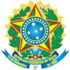

MINISTÉRIO DA EDUCAÇÃO Secretaria de Educação Profissional e Tecnológica Instituto Federal de Educação; Ciência e Tecnologia de Mato Grosso do Sul

CNPJ 10.673.078/0001-20

## POSSIBILIDADES DE INTEGRAÇÃO:

Desenvolvimento de Interfaces Ricas (4º Período) e Atividades de Extensão III.

## BASES CIENTÍFICO-TECNOLÓGICAS (Conteúdos):

1. Abordagem histórica da surdez;
2. Mitos sobre as línguas de sinais;
3. Abordagens Educacionais: Oralismo, comunicação total e Bilinguismo;
4. Língua de Sinais (básico) - exploração de vocabulário e diálogos em sinais: alfabeto datilológico;   expressões   socioculturais;   números   e   quantidade;   noções   de   tempo; expressão facial e corporal;  calendário;  meios   de   comunicação;   tipos   de   verbos; animais;   objetos   +   classificadores;   contação   de   histórias   sem   texto;   meios   de transportes; alimentos; relações de parentesco; profissões; advérbios.

## BIBLIOGRAFIA BÁSICA:

ESTELITA, Mariangela. ELIS: Sistema Brasileiro de Escrita das Línguas de Sinais . Porto Alegre: Penso, 2015. 1 recurso online. ISBN 9788584290529. Disponível em: https://integrada.minhabiblioteca.com.br/books/9788584290529. Acesso em: 16 out. 2018.

BOTELHO, Paula. Linguagem e letramento na educação dos surdos: ideologias e práticas pedagógicas. 3. ed. São Paulo: Autêntica, 2007. 1 recurso online. ISBN 9788582179314. Disponível em: https://integrada.minhabiblioteca.com.br/books/9788582179314. Acesso em: 16 out. 2018.

GESSER, Audrei. Libras? Que língua é essa?: crenças e preconceitos em torno da língua de sinais e da realidade surda. São Paulo: Parábola, 2009.

## BIBLIOGRAFIA COMPLEMENTAR:

LOPES, Maura Corcini. Surdez &amp; educação . 2. ed. rev. e ampl. Belo Horizonte: Autêntica, [2011]. 102 p. Disponível em: https://bv4.digitalpages.com.br. Acesso em: 16 out. 2018.

MADUREIRA, Gilza Helena. (AANEE): atendimento de alunos com necessidades educacionais especiais. São Paulo: Cengage Learning, 2015. 1 recurso online. ISBN 9788522122653. Disponível em: https://integrada.minhabiblioteca.com.br/books/9788522122653. Acesso em: 16 out. 2018.

MOURA, Maria Cecília. Educação para surdos: práticas e perspectivas 2. Rio de Janeiro: Santos, 2011. 1 recurso online. ISBN 978-85-412-0043-1. Disponível em: http://integrada.minhabiblioteca.com.br/books/978-85-412-0043-1. Acesso em: 16 out. 2018.

PEREIRA, Maria C. C. Libras: conhecimento além dos sinais. 1. ed. Rio de Janeiro: Pearson, 2011. Disponível em: https://bv4.digitalpages.com.br. Acesso em: 16 out. 2018.

QUADROS, Ronice Müller de; CRUZ, Carina Rebello. Língua de sinais: instrumento de avaliação. Porto Alegre: ArtMed, 2011. 1 recurso online. ISBN 9788536325200. Disponível em: http://integrada.minhabiblioteca.com.br/books/9788536325200. Acesso em: 11 out. 2018.

## MINISTÉRIO DA EDUCAÇÃO

Secretaria de Educação Profissional e Tecnológica

Instituto Federal de Educação; Ciência e Tecnologia de Mato Grosso do Sul

CNPJ 10.673.078/0001-20

## Unidade Curricular: Agrometeorologia

Carga Horária Semanal: 2 h/a

Carga Horária Semestral: 40 h/a

## EMENTA:

Estudo da Atmosfera. Estudo do macro, meso e microclimas. Zoneamento climatológico. Elementos  Meteorológicos   (radiação,   vento,   temperatura,   precipitação,   umidade   relativa, balanço hídrico). Estações meteorológicas e equipamentos.

## OBJETIVOS:

Compreender o comportamento do clima, a importância da sua classificação e sua influência nas atividades agrícolas.

## POSSIBILIDADES DE INTEGRAÇÃO:

Desenvolvimento de Serviços para Web I e Atividades de Extensão III.

## BASES CIENTÍFICO-TECNOLÓGICAS (Conteúdos):

1. Estudo da Atmosfera:
1. Estudo do macro, meso e microclimas.
2. Zoneamento climatológico:
1. Elementos   Meteorológicos   (radiação,   vento,   temperatura,   precipitação, umidade relativa, balanço hídrico).
3. Estações meteorológicas e equipamentos.

## BIBLIOGRAFIA BÁSICA:

ESTÊVES, L. F. Biogeografia, climatologia e hidrogeografia: fundamentos teórico - conceituais e aplicados. Editora Intersaberes, 2016.

SILVA, M. A. V. Meteorologia e Climatologia . Versão Digital 2. Recife, 2006.

TUCCI, C. E. M.; BRAGA, B. Clima e recursos hídricos no Brasil . ABRH, 2003.

## BIBLIOGRAFIA COMPLEMENTAR:

MANTOVANI, E. C.; BERNARDO, S.; PALARETTI, L.F. Irrigação: princípios e métodos. Viçosa. Ed. UFV. 2009.

MARIN, F. R.; ASSAD, E. D.; PILAU, F. G. Climatologia - Noções básicas e clima no Brasil. Oficina de Textos, 2007.

MONTEIRO, J. E. (Org.). Agrometeorologia dos Cultivos: o fator meteorológico na produção agrícola. Brasília: INMET, 2009.

GOULART, A; FOGAÇA, T. Introdução à climatologia: conceitos pesquisa e ensino. Editora Intersaberes, 2018.

PEREIRA, A.R., ANGELOCCI, L.R., SENTELHAS, P.C. Agrometeorologia, fundamentos e aplicações . Livraria e Editora Agropecuária, 478p. 2002.

## MINISTÉRIO DA EDUCAÇÃO

Secretaria de Educação Profissional e Tecnológica

Instituto Federal de Educação; Ciência e Tecnologia de Mato Grosso do Sul

CNPJ 10.673.078/0001-20

## Unidade Curricular: Topografia, Geoprocessamento e Georreferenciamento

Carga Horária Semanal: 2 h/a

Carga Horária Semestral: 40 h/a

## EMENTA:

Topografia aplicadas ao georreferenciamento. Cartografia. Sistemas de referência. Projeções cartográficas.   Ajustamentos.   Métodos   e   medidas   de   posicionamento   geodésico.   Alvos terrestres. Sistema de posicionamento global (GPS). Fatores importantes no sensoriamento remoto. Sistema de Informações Geográficas (SIG). Geotecnologias. Arquiteturas para SIG. Armazenamento de dados geográficos. Geoprocessamento. Softwares aplicados. Mapas temáticos.

## OBJETIVOS:

Desenvolver habilidades e conhecimentos para utilização das ferramentas de topografia e geoprocessamento com destaque aos princípios básicos de Banco de Dados e Cartografia, com operação de Sistemas de Posicionamento Global e Sensoriamento Remoto.

## POSSIBILIDADES DE INTEGRAÇÃO:

Desenvolvimento de Serviços para Web I, Gerência e Operação de Banco de Dados e Atividades de Extensão III.

## BASES CIENTÍFICO-TECNOLÓGICAS (Conteúdos):

1. Topografia aplicada ao georreferenciamento
2. Cartografia
3. 2.1. Sistemas de referência
4. 2.2. Projeções cartográficas
3. Ajustamentos
6. 3.1. Métodos e medidas de posicionamento geodésico.
7. 3.2. Alvos terrestres.
4. Sistema de posicionamento global (GPS).
9. 4.1. Fatores importantes no sensoriamento remoto.
10. 4.2. Sistema de Informações Geográficas (SIG).
11. 4.2.1. Geotecnologias.
12. 4.2.2. Arquiteturas para SIG.
13. 4.2.3. Armazenamento de dados geográficos.
5. Geoprocessamento.
15. 5.1. Softwares aplicados.
16. 5.2. Mapas temáticos.

## BIBLIOGRAFIA BÁSICA:

ROCHA, C. H. B. Geoprocessamento: tecnologia transdisciplinar. Juiz de Fora, MG: ed. do autor, 2000.

BENZORI, M. Georreferenciamento: conceitos. Ed. Baraúna. 2017.

GIOVANINI, A. Topografia Cadastral E Georreferenciamento De Imóveis Rurais Na Prática . Editora:  Independently Published. 2018.

## BIBLIOGRAFIA COMPLEMENTAR:

ASSAD, E. D. Sistemas de informações geográfica: aplicações na agricultura. 2 ed. Brasí-

## MINISTÉRIO DA EDUCAÇÃO

Secretaria de Educação Profissional e Tecnológica

Instituto Federal de Educação; Ciência e Tecnologia de Mato Grosso do Sul

CNPJ 10.673.078/0001-20

lia: Embrapa, 1998.

TEIXEIRA, A. L. A. et al. Introdução aos sistemas de informação geográfica . Rio Claro: ed. do Autor, 1992.

FITZ. P. R. Geoprocessamento sem complicações . Ed. Oficina de Textos. 2008.

DALLA CORTE, A. P.; SILVA, C. A.; SANQUETTA, C. R.; REX, F. E.; PFUTZ, I. F. P.; MACEDO, R. De C. Explorando o Qgis 3 .X. Ed. Dos Autores. Curitiba. 2020.

MENEZES, P. M. L.; FERNANDES, M do C. Roteiro de Cartografia . Ed. Oficina de Textos. 2013.

## Tópicos Especiais em Tecnologia da Informação Aplicada ao Eixo de Recursos Naturais

Carga Horária Semanal: 2 h/a

Carga Horária Semestral:

40 h/a

## EMENTA:

Ementa variável, focalizando tópicos relacionados com tecnologias, aplicações, produtos, metodologias e ferramentas de desenvolvimento de software e hardware aplicadas ao Eixo de Recursos Naturais.

## OBJETIVOS:

Estimular   o   desenvolvimento   de   soluções   de   tecnologia   da   informação   que  possam maximizar as atividades e ações do eixo de recursos naturais.

## BASES CIENTÍFICO-TECNOLÓGICAS (Conteúdos):

A ser desenvolvido conforme ementa variável.

## BIBLIOGRAFIA BÁSICA:

ABLESON, Frank ; KING, Chris ; SEN, Robi. Android em ação . 3. ed. Rio de Janeiro: Campus, 2012. Disponível em: https://www.evolution.com.br. Acesso em: 16 out. 2018.

MILETTO, Evandro Manara; BERTAGNOLLI, Silvia de Castro. Desenvolvimento de software ii: introdução ao desenvolvimento web com html, css, javascript e php. Porto Alegre: Bookman, 2014. 1 recurso online. ISBN 9788582601969. Disponível em: &lt;https://integrada.minhabiblioteca.com.br/books/9788582601969&gt;. Acesso em: 16 out. 2018.

PADUA FILHO, Wilson de Paula. Engenharia de software .   3.   ed.   Rio   de  Janeiro: LTC, 2008. 1 recurso online. ISBN 978-85-216-1992-5. Disponível em: &lt;http://integrada.minhabiblioteca.com.br/books/978-85-216-1992-5&gt;. Acesso em: 8 out. 2018

## BIBLIOGRAFIA COMPLEMENTAR:

DEITEL, Paul J.; DEITEL, Harvey M.; WALD, Alexander. Android 6 para programadores: uma abordagem baseada em aplicativos. 3. ed. São Paulo: Bookman, 2016. 1 recurso online.

MINISTÉRIO DA EDUCAÇÃO Secretaria de Educação Profissional e Tecnológica Instituto Federal de Educação; Ciência e Tecnologia de Mato Grosso do Sul

## CNPJ 10.673.078/0001-20

ISBN   9788582604120.   Disponível   em:   https://integrada.minhabiblioteca.com.br/books/ 9788582604120. Acesso em: 16 out. 2018.

DELGADO, José; RIBEIRO, Carlos. Arquitetura de computadores . 5. ed. Rio de Janeiro: LTC, 2017. 1 recurso online. ISBN 9788521633921. Disponível em: https://integrada.minhabiblioteca.com.br/books/9788521633921. Acesso em: 16 out. 2018.

MONK, Simon. Projetos com Arduino e Android: use seu smartphone ou tablet para controlar   o   Arduino.   Porto   Alegre:   Bookman,   2013.   1   recurso   online.   (Tekne).   ISBN 9788582601228. Disponível em: https://integrada.minhabiblioteca.com.br/books/ 9788582601228. Acesso em: 16 out. 2018.

ROGERS, Rick et al. Desenvolvimento de aplicações Android . São Paulo: Novatec, 2009.

SILVEIRA, Paulo; LOPES, Sérgio; STEPPAT, Nico; SILVEIRA, Guilherme; MOREIRA, Guilherme; KUNG, Fabio (Co-Autor). Introdução à arquitetura e design de software: uma visão sobre a plataforma JAVA. 1. ed. Rio de Janeiro: Elsevier, 2012. Disponível em:&lt;https:// www.evolution.com.br/searchresults?option=catalog&amp;keyword=INTRODUÇÃO+à+arquitetura+e+design+de+software&gt;. Acesso em: 11/10/2018.

## UNIDADES CURRICULARES ELETIVAS

## Unidade Curricular: Tópicos Especiais em Linguagem de Programação

Carga Horária Semanal: 2 h/a

Carga Horária Semestral: 40 h/a

## EMENTA:

Apresentação de uma linguagem de programação diferente daquela aplicada no curso. Apresentar a sintaxe e semântica da linguagem de programação selecionada. Utilizar as estruturas de controle sequencial, de seleção e de repetição, modularização e bibliotecas mais utilizadas.

## OBJETIVOS:

Conhecer   e   desenvolver   habilidades   de   programação   em   linguagens   de   programação distintas daquelas já utilizadas durante o curso.

## POSSIBILIDADES DE INTEGRAÇÃO:

Atividades de Extensão IV.

## BASES CIENTÍFICO-TECNOLÓGICAS (Conteúdos):

1. Introdução a sistemas distribuídos:
2. 1.1. Conceitos e características da linguagem de programação;
3. 1.2. Motivação.
2. Conceitos Básicos:
5. 2.1. Estrutura da linguagem de programação;
6. 2.2. Variáveis, constantes e tipos de dados utilizados pela linguagem de programação;
7. 2.3. Comandos básicos de Leitura e Escrita.
3. Operadores:

## MINISTÉRIO DA EDUCAÇÃO Secretaria de Educação Profissional e Tecnológica Instituto Federal de Educação; Ciência e Tecnologia de Mato Grosso do Sul

CNPJ 10.673.078/0001-20

- 3.1. Aritméticos;
- 3.2. Atribuição;
- 3.3. Lógicos;
- 3.4. Relacionais.
4. Estruturas condicionais;
5. Estruturas de repetição;
6. Estrutura de armazenamento;
7. Programação estruturada e modular:
- 7.1. Conceitos;
- 7.2. Procedimentos e funções.

## BIBLIOGRAFIA BÁSICA:

CORNELL, Gary; HORSTMANN, Cay S. Core Java: fundamentos. 8 ed. São Paulo: Prentice Hall, 2010. v. 1.

CORMEN, Thomas H. Desmistificando algoritmos . Rio de Janeiro: Elsevier, 2014. xii, 188 p.

VILARIM, Gilvan. Algoritmos: programação para iniciantes. 3. ed. Rio de Janeiro: Ciência Moderna, 2017. 284 p.

## BIBLIOGRAFIA COMPLEMENTAR:

DEITEL, Paul; DEITEL, Harvey. Java: como programar. 8. ed. São Paulo: Pearson, c2010.

FURGERI, Sérgio. Java 7: ensino didático. São Paulo: Érica, 2010.

MACHADO, Rodrigo Prestes; FRANCO, Márcia Islabão; BERTAGNOLLI, Silvia de Castro. Desenvolvimento de software: programação de sistemas web orientada a objetos em Java. Porto Alegre: Bookman, 2016. 1 recurso online. (Tekne). ISBN 9788582603710. Disponível em:   https://integrada.minhabiblioteca.com.br/books/9788582603710.   Acesso   em:   16   out. 2018.

JÚNIOR, Dilermando Piva; NAKAMITI, Gilberto Shigueo; ENGELBRECHT, Angela de Mendonça; BIANCHI, Francisco. Algoritmos e programação de computadores . Rio de Janeiro: Elsevier, 2012. 497 p.Disponível em: https://www.evolution.com.br/product/algoritmos-e-programao-de-computadores-1ed. Acesso em: 12 agosto. 2022.

## Unidade Curricular: Desenvolvimento de Sistemas Distribuídos

Carga Horária Semanal: 2 h/a

Carga Horária Semestral: 40 h/a

## EMENTA:

Conceitos de sistemas distribuídos.  Tecnologia de comunicação: invocação de métodos remotos   e   infraestrutura   para   objetos   distribuídos.   Programação   orientada   a   serviços. Computação em nuvem.

## OBJETIVOS:

## MINISTÉRIO DA EDUCAÇÃO

Secretaria de Educação Profissional e Tecnológica

Instituto Federal de Educação; Ciência e Tecnologia de Mato Grosso do Sul

## CNPJ 10.673.078/0001-20

Compreender   e   aplicar   os   conceitos   de   sistemas   distribuídos   e   de   comunicação cliente/servidor   e   partir   da   programação   de   servidores   e   clientes   de   Webservices   e   do desenvolvimento de sistemas utilizando conceitos de computação em nuvem.

## POSSIBILIDADES DE INTEGRAÇÃO:

Auditoria e Segurança de Sistemas e Atividades de Extensão V.

## BASES CIENTÍFICO-TECNOLÓGICAS (Conteúdos):

1. Introdução a sistemas distribuídos:
2. 1.1. Conceitos e características de sistemas distribuídos;
3. 1.2. Motivação;
4. 1.3. Exemplos de sistemas distribuídos;
2. Tecnologias de implementação de sistemas distribuídos:
6. 2.1. Chamada de procedimento remoto (Remote Procedure Call - RPC):
7. 2.1.1. Passagem de parâmetros, referências remotas;
8. 2.1.2. XML-RPC;
9. 2.1.3. RMI.
10. 2.2. Programação de Serviços;
11. 2.3. Computação em nuvem.
3. Programação de Serviços:
13. 3.1. Conceitos;
14. 3.2. Web Services baseados em SOAP;
15. 3.3. Web Services baseados em REST;
16. 3.4. Framework para desenvolvimento de servidores de serviços;
17. 3.5. Programação de clientes móveis;
18. 3.6. Programação de clientes desktop;
19. 3.7. Integração entre plataformas de desenvolvimento.
4. Computação em Nuvem:
21. 4.1. Conceitos;
22. 4.2. Frameworks de desenvolvimentos de sistemas para a nuvem.

## BIBLIOGRAFIA BÁSICA:

TANENBAUM, Andrew S.; VAN STEEN, Maarten. Sistemas distribuídos: princípios e paradigmas. 2. ed. São Paulo: Pearson, 2008. Disponível em:/bv4.digitalpages.com.br. Acesso em: 15 out. 2018.

George Coulouris et al. Sistemas distribuídos: conceitos e projeto. 5. ed. Porto Alegre: Bookman, 2013. 1 recurso online. ISBN 9788582600542. Disponível em: https://integrada.minhabiblioteca.com.br/books/9788582600542. Acesso em: 8 out. 2018.

ALVES, William Pereira. Java para Web: desenvolvimento de aplicações. São Paulo: Erica, 2015. Recurso online. ISBN 9788536519357. Disponível em: https://integrada.minhabiblioteca.com.br/books/9788536519357. Acesso em: 16 out. 2018.

TANENBAUM, A. S. Sistemas Operacionais Modernos . 2.ed. Rio de Janeiro: Prentice-Hall, 2003.

## BIBLIOGRAFIA COMPLEMENTAR:

CARDOSO, J. Programação de Sistemas Distribuídos em Java . Portugal: Editora FCA, 2008.

## MINISTÉRIO DA EDUCAÇÃO

Secretaria de Educação Profissional e Tecnológica

## CNPJ 10.673.078/0001-20

ERL, Thomas. SOA: princípios de design de serviços. São Paulo: Prentice Hall, 2009. Disponível em: https://bv4.digitalpages.com.br. Acesso em: 15 out. 2018.

KEITH Mike. Ejb3 profissional: Java Persistence Api. Rio de Janeiro: Ciência Moderna, 2008.

MACHADO, Rodrigo Prestes; FRANCO, Márcia Islabão; BERTAGNOLLI, Silvia de Castro. Desenvolvimento de software: programação de sistemas web orientada a objetos em Java. Porto Alegre: Bookman, 2016. 1 recurso online. (Tekne). ISBN 9788582603710. Disponível em:   https://integrada.minhabiblioteca.com.br/books/9788582603710.   Acesso   em:   16   out. 2018.

PANDA, Debu; RAHMAN, Reza; LANE, Derek. EJB 3 em ação . 2. ed. Rio de Janeiro: Alta Books, 2009.

## Unidade Curricular: Elementos de Domótica

Carga Horária Semanal: 2 h/a

Carga Horária Semestral: 40 h/a

## EMENTA:

Eletrônica fundamental. Conceitos de computação física. Conceitos de domótica. Introdução ao Arduino. Linguagem Wiring (C, C++). Sensores. Atuadores. Motores. Projetos de domótica utilizando o Arduino.

## OBJETIVOS:

Conhecer e aplicar os conceitos fundamentais de eletrônica e domótica utilizando o Arduíno e linguagens de programação para manipulação e controle de sensores, atuadores, motores, entre outros componentes.

## POSSIBILIDADES DE INTEGRAÇÃO:

Desenvolvimento   de   Serviços   para   Web   II,   Desenvolvimento   de   Aplicativos   Móveis Multiplataforma e Atividades de Extensão IV.

## BASES CIENTÍFICO-TECNOLÓGICAS (Conteúdos):

1. Introdução a elementos de domótica:
2. 1.1. Conceitos fundamentais de eletrônica;
3. 1.2. Fundamentos de eletricidade aplicada à eletrônica:
4. 1.2.1. Corrente elétrica;
5. 1.2.2. Circuitos básicos;
6. 1.2.3. Tensão e corrente elétrica.
7. 1.3. Conceitos de computação física;
8. 1.4. Conceitos de domótica.
2. Utilização de Arduino:
10. 2.1. Conceitos básicos sobre a arquitetura;
11. 2.2. Família de componentes.
3. Linguagem Wiring:
13. 3.1. Fundamentos da linguagem de programação:
14. 3.1.1. Definição de variáveis;
15. 3.1.2. Utilização de métodos.
16. 3.2. Estruturas de controle:

## MINISTÉRIO DA EDUCAÇÃO

Secretaria de Educação Profissional e Tecnológica

Instituto Federal de Educação; Ciência e Tecnologia de Mato Grosso do Sul

## CNPJ 10.673.078/0001-20

- 3.2.1. Estruturas de seleção;
- 3.2.2. Estruturas de repetição (Loops).
4. Componentes eletrônicos:
- 4.1. Apresentação de componentes básicos;
- 4.2. Utilização de sensores, atuadores e motores;
- 4.3. Conceitos e aplicação de LEDS e LDR;
- 4.4. Utilização de potenciômetros.

## BIBLIOGRAFIA BÁSICA:

BANZI, Massimo. Primeiros passos com o arduino . São Paulo: Novatec, 2011.4

MONK, Simon. Programação com Arduino: começando com Sketches. Porto Alegre: Bookman, 2013.

OLIVEIRA, Cláudio Luís Vieira; ZANETTI, Humberto Augusto Piovesana. Arduino descomplicado: como elaborar projetos de eletrônica. São Paulo: Erica, 2015. 1 recurso online. ISBN 9788536518114. Disponível em: https://integrada.minhabiblioteca.com.br/books/ 9788536518114. Acesso em: 16 out. 2018.

## BIBLIOGRAFIA COMPLEMENTAR:

BOLZANI, Caio Augustus M. Residências inteligentes: domótica, redes domésticas e automação residencial.São Paulo: Livraria da Física, 2004.

FALUDI, Robert. Building wireless sensor networks: with zigbee, Xbee, arduino, and processing.Sebastopol, CA :O'Reilly, 2010.

KARVINEN, Kimmo; KARVINEN, Tero. Make Arduinobots and gadgets: learning by discovery.Sebastopol, CA :O'Reilly, 2010.

MONK, Simon. 30 projetos com arduino . 2. ed. Porto Alegre: Bookman, 2014. 1 recurso online.   ISBN   9788582601631. Disponível em: https://integrada.minhabiblioteca.com.br/books/ 9788582601631. Acesso em: 16 out. 2018.

PRUDENTE, Francesco. Automação predial e residencial: uma introdução. Rio de Janeiro: LTC, 2011. 1 recurso online. ISBN 978-85-216-2024-2. Disponível em: http://integrada.minhabiblioteca.com.br/books/978-85-216-2024-2. Acesso em: 11 out. 2018.

## Unidade Curricular: Estruturas de Dados Não Lineares

Carga Horária Semanal: 4 h/a

Carga Horária Semestral: 80 h/a

## EMENTA:

Estrutura de dados não lineares: árvores genéricas, árvores binárias, árvores binárias de pesquisa,   árvores   balanceadas   (AVL   e   rubro-negra).   Filas   de   prioridade   com   Heaps. Introdução à teoria dos grafos. Representação computacional de grafos. Algoritmos de busca em grafos, problema de menor caminho.

## MINISTÉRIO DA EDUCAÇÃO

Secretaria de Educação Profissional e Tecnológica

Instituto Federal de Educação; Ciência e Tecnologia de Mato Grosso do Sul

CNPJ 10.673.078/0001-20

## OBJETIVOS:

- Compreender conceitos utilizados no processo de desenvolvimento das estruturas de dados;
- Desenvolver programas utilizando estruturas de dados;
- Aplicar técnicas de pesquisa e classificação de dados.

## POSSIBILIDADES DE INTEGRAÇÃO:

Desenvolvimento   de   Serviços   para   Web   II,   Desenvolvimento   de   Aplicativos   Móveis Multiplataforma e Atividades de Extensão IV.

## BASES CIENTÍFICO-TECNOLÓGICAS (Conteúdos):

1. Árvores:
2. 1.1. Conceitos, representação e terminologia;
3. 1.2. Árvores genéricas;
4. 1.3. Árvores binárias;
5. 1.4. Árvores binárias de pesquisa;
6. 1.5. Algoritmos de caminhamento.
2. Filas de Prioridade com Heaps: conceito, implementação e aplicação;
3. Árvores Balanceadas:
9. 3.1. AVL: Conceito, balanceamento, inserção e remoção;
10. 3.2. Rubro-negra: Conceito, balanceamento, inserção e remoção.
4. Teoria dos grafos:
12. 4.1. Conceitos;
13. 4.2. Representação computacional;
14. 4.3. Coloração;
15. 4.4. Planaridade.
5. Conectividade e distância:
17. 5.1. Grafo conexo, Grafo f-conexo, componentes conexas e fortemente conexas;
18. 5.2. Algoritmos para conexidade;
19. 5.3. Distância.
6. Caminhos em Grafos:
21. 6.1. Caminhos e ciclos;
22. 6.2. Grafos de Eulerianos;
23. 6.3. Grafos Hamiltonianios.
7. Busca em grafos:
25. 7.1. Algoritmo básico;
26. 7.2. Busca em profundidade;
27. 7.3. Busca em largura.
8. Problemas do Menor Caminho:
29. 8.1. Carteiro chinês;
30. 8.2. Caixeiro viajante;
31. 8.3. Algoritmo de Floyd;
32. 8.4. Algoritmo de Dijkstra.

## BIBLIOGRAFIA BÁSICA:

BOAVENTURA NETTO, P. O. Grafos : teoria, modelos, algoritmos. 3.ed. São Paulo: Edgar Blucher LTDA, 2003.

CORMEN, Thomas H. et al. Algoritmos: teoria e prática. Rio de Janeiro: Elsevier, c2012. xvi, 926 p. ISBN 9788535236996 (broch.).

GOODRICH, M. T.; TAMASSIA, R. Estruturas de dados e algoritmos em Java. 4.ed. Porto

## MINISTÉRIO DA EDUCAÇÃO Secretaria de Educação Profissional e Tecnológica Instituto Federal de Educação; Ciência e Tecnologia de Mato Grosso do Sul

CNPJ 10.673.078/0001-20

Alegre: Bookman, 2007.

## BIBLIOGRAFIA COMPLEMENTAR:

CORMEN, Thomas H. Desmistificando algoritmos . Rio de Janeiro: Elsevier, 2014. xii, 188 p. ISBN 9788535271775 (broch.).

DEITEL, Paul J.; DEITEL, Harvey M.; WALD, Alexander. Android 6 para programadores: uma abordagem baseada em aplicativos. 3. ed. São Paulo: Bookman, 2016. 1 recurso online. ISBN   9788582604120.   Disponível   em:   https://integrada.minhabiblioteca.com.br/books/ 9788582604120. Acesso em: 16 out. 2018.

MANZANO, José Augusto N. G.; OLIVEIRA, Jayr Figueiredo de. Algoritmos: lógica para desenvolvimento de programação de computadores . 27. ed. rev. São Paulo: Érica, 2014. 328 p. ISBN 9788536502212 (broch.).

## Unidade Curricular: Liderança em Ambientes Organizacionais

Carga Horária Semanal: 4 h/a

Carga Horária Semestral:

80 h/a

## EMENTA:

Estudo do contexto, fundamentos, definição e importância dos conceitos da Liderança: o ambiente organizacional, gestão de pessoas, competência organizacional, perfil do líder, relações   interpessoais   e   inteligência   emocional;   personalidade   e   diferenças   individuais; comunicação; grupos e equipes de trabalho; liderança; administração de conflitos.

## OBJETIVOS:

- Conhecer   o   processo   de   liderar   e   suas   contribuições   para   o   desenvolvimento organizacional;
- Desenvolver a capacidade de relacionamento interpessoal no ambiente de trabalho, e habilidades para trabalhar em equipe, liderar e respeitar às diferenças individuais, buscando o autoconhecimento, o domínio das emoções e da percepção do ambiente organizacional;
- Desenvolver   competências   de   comunicação   assertiva,   com   habilidade   para administrar   conflitos,   assumindo   comportamento   ético   e   postura   profissional adequada.

## POSSIBILIDADES DE INTEGRAÇÃO:

Atividades de Extensão IV.

## BASES CIENTÍFICO-TECNOLÓGICAS (Conteúdos):

1. Liderança como Função da Administração;
2. Gestão de Pessoas;
3. Competência Organizacional;
4. Perfil do Líder;
5. Relações interpessoais e Inteligência emocional;
6. Personalidade e diferenças individuais;

## MINISTÉRIO DA EDUCAÇÃO

Secretaria de Educação Profissional e Tecnológica

Instituto Federal de Educação; Ciência e Tecnologia de Mato Grosso do Sul

## CNPJ 10.673.078/0001-20

7. Comunicação interpessoal, feedback e assertividade;
8. Grupos e Equipes de trabalho;
9. Administração de conflitos;
4. 10.Ética no trabalho e postura profissional.

## BIBLIOGRAFIA BÁSICA:

CHIAVENATO, Idalberto. Gestão de pessoas: o novo papel da gestão do talento humano. 5. ed. São Paulo: Atlas, 2020.

COVEY, Stephen R. Os sete hábitos das pessoas altamente eficazes . São Paulo: Best, 2003.

DEL PRETTE, A.; DEL PRETTE, Z.A.P. Psicologia das relações interpessoais: vivências para o trabalho em grupo. Petrópolis, RJ: Vozes, 2008

DRUCKER, Peter F. O líder do futuro: visões, estratégias e práticas para uma nova era. São Paulo: Futura, 1996.

DUTRA, Joel Souza. Competências: conceitos, instrumentos e experiências. 2. ed. São Paulo: Atlas, 2017.

HERSEY, Paul &amp; BLANCHARD, Kenneth H. Psicologia para administradores de empresas: a utilização de recursos humanos. Irad. Moreira Leite, Dante. São Paulo, EPU, Ed. da Universidade de São Paulo, 1974.

GOLEMAN, D. Inteligência Emocional: a teoria revolucionária que redefine o que é ser inteligente. Rio de Janeiro: Objetiva, 2001.

MAXWELL, John C. O livro de ouro da liderança . Thomas Nelson Brasil, 2014.

MOSCOVICI, F. Desenvolvimento interpessoal .   Rio   de   Janeiro:   Editora   José   Olympio, 2008.

ROBBINS, S. P.; JUDGE, T.A.; SOBRAL, F. Comportamento organizacional: teoria e prática no contexto brasileiro. São Paulo: Pearson Pentrice Hall, 2010.

## BIBLIOGRAFIA COMPLEMENTAR:

CARNEGIE, Dale. Como fazer amigos e influenciar pessoas . São Paulo: Leya, 2021.

DRUCKER, Peter F. O gerente eficaz . São Paulo: Zahar, 1977.

GOLEMAN, D. Trabalhando com a inteligência emocional . Rio de Janeiro: Objetiva, 2006.

MICHENER, H.A., DELAMATER, J.D.; MYERS, D.J. Psicologia social . São Paulo: Pioneira Thomson Learning, 2005.

ROBBINS, Tony. Desperte seu gigante interior . Editora Best Seller, 2017.

TZU, Sun. A arte da guerra. Editora Schwarcz-Companhia das Letras, 2019.

## MINISTÉRIO DA EDUCAÇÃO

Secretaria de Educação Profissional e Tecnológica

## CNPJ 10.673.078/0001-20

## VERGARA, Sylvia C. Gestão de pessoas. 10ª ed, Rio de Janeiro, Atlas, 2019.

## Unidade Curricular: Desenvolvimento de Aplicativos Móveis Multiplataforma avançado

Carga Horária Semanal: 4 h/a

Carga Horária Semestral: 80 h/a

## EMENTA:

Arquiteturas de aplicação móvel. Integração entre dispositivo móvel e a Internet. Uso de APIs para dispositivos móveis. Troca de Dados entre Cliente e Servidor. Serviços e Notificações. Acesso a recursos de hardware do dispositivo móvel.

## OBJETIVOS:

Conhecer as arquiteturas de aplicação móvel e desenvolver habilidades de programação para   multiplataformas   usando   APIs   de   serviços   disponibilizados   por   Arquiteturas   SaaS (Softwares as a Service) para criar aplicativos mais robustos e seguros.

## POSSIBILIDADES DE INTEGRAÇÃO:

Teste de Software e Atividades de Extensão V.

## BASES CIENTÍFICO-TECNOLÓGICAS (Conteúdos):

1. Arquiteturas de aplicação móvel;
2. Integração entre dispositivo móvel e a Internet;
3. Uso de APIs para dispositivos móveis;
4. Troca de Dados entre Cliente e Servidor;
5. Serviços e Notificações;
6. Acesso a recursos de hardware do dispositivo móvel.

## BIBLIOGRAFIA BÁSICA:

LECHETA,   Ricardo   R. Android   essencial .   São   Paulo:   Novatec,   2016.   380   p.   ISBN 9788575224793 (broch.).

FREEMAN, Eric. Use a cabeça! programação JavaScript .   Rio   de   Janeiro:   Alta   Books, 2016. 661 p. ISBN 9788576089902 (broch).

GRONER, Loiane. Estruturas de dados e algoritmos com JavaScript . 2. ed. São Paulo: Novatec, 2019.

DONAT, Wolfram. Programação do Raspberry Pi com Python . São Paulo: Novatec, 2018.

## BIBLIOGRAFIA COMPLEMENTAR:

GRIFFITHS, Dawn; GRIFFITHS, David. Use a cabeça! desenvolvendo para Android . Rio de Janeiro: Alta Books, 2016. 739 p.

VILARIM, Gilvan. Algoritmos: programação para iniciantes. 3. ed. Rio de Janeiro: Ciência Moderna, 2017. 284 p.

## MINISTÉRIO DA EDUCAÇÃO

Secretaria de Educação Profissional e Tecnológica

Instituto Federal de Educação; Ciência e Tecnologia de Mato Grosso do Sul

## CNPJ 10.673.078/0001-20

SILVA, Diego. Desenvolvimento para dispositivos móveis .   São Paulo: Pearson, 2017. Disponível em: https://plataforma.bvirtual.com.br/Leitor/Publicacao/128205/pdf/0. Acesso em: 19 maio 2021.

JÚNIOR, Dilermando Piva; NAKAMITI, Gilberto Shigueo; ENGELBRECHT, Angela de Mendonça; BIANCHI, Francisco. Algoritmos e programação de computadores . Rio de Janeiro: Elsevier, 2012. 497 p. Disponível em: https://www.evolution.com.br/product/algoritmos-e-programao-de-computadores-1ed#view1. Acesso em: 11 out. 2018.

SZWARCFITER, Jayme Luiz; MARKENSON, Lilian. Estruturas de dados e seus algoritmos . 3. ed. Rio de Janeiro: LTC, 2010. 1 recurso online. ISBN 978-85-216-2995-5. Disponível   em:   https://integrada.minhabiblioteca.com.br/books/978-85-216-2995-5.   Acesso   em:   8 out. 2018.

## 5.4.  Prática Profissional

A prática profissional caracteriza-se pela flexibilidade e articulação entre teoria e prática. Logo, a prática profissional supervisionada contribui para uma formação completa e global do acadêmico. Ela compreende diferentes situações de vivência profissional, aprendizagem e trabalho, como experimentos e atividades específicas em ambientes especiais, bem como investigação sobre atividades profissionais, projetos de pesquisa ou intervenção, visitas técnicas, simulações e observações, em consonância com a Resolução CNE/CP n.1 de 05/01/2021.

Dentre as atividades relacionadas à prática profissional podemos citar: desenvolvimento do TCC, estágio supervisionado, projetos de extensão ou pesquisa (por exemplo, bolsas de iniciação científica ou de desenvolvimento tecnológico e inovação), além de outras atividades de caráter acadêmico, científico ou cultural.

## 5.4.1.  Estágio Curricular Supervisionado

O Estágio Curricular Supervisionado é uma atividade obrigatória que poderá ser iniciada a partir do 3.º período com uma carga de 180 horas e deverá ser realizado em empresas e/ou instituições públicas, do terceiro setor ou privadas relacionadas à área de formação do profissional. Ele pode ser realizado concomitante no período letivo ou durante as férias letivas.

O estágio curricular supervisionado tem o objetivo de permitir que o estudante vivencie situações de efetivo exercício profissional, facilitando seu ingresso no mercado de trabalho. O estágio deve consolidar os conhecimentos desenvolvidos durante o curso, por meio de atividades formativas de natureza prática e ser executado conforme determina o Regulamento de Estágio da instituição.

## MINISTÉRIO DA EDUCAÇÃO

Secretaria de Educação Profissional e Tecnológica

Instituto Federal de Educação; Ciência e Tecnologia de Mato Grosso do Sul

CNPJ 10.673.078/0001-20

- O Regulamento da Organização Didático-Pedagógica assim como o Regulamento do Estágio Curricular Supervisionado do IFMS, definem os procedimentos operacionais para este modelo de atividade de ensino.

Há ainda a possibilidade de convalidação e equiparação conforme definido no Regulamento de Estágio da instituição e de acordo com as seguintes circunstâncias:

1. O estudante que exercer atividade profissional relacionada com a área de atuação e o perfil do egresso, poderá solicitar a convalidação dessas atividades como estágio curricular obrigatório.
2. O discente que atuou oficialmente em atividades de extensão, monitorias e iniciação científica, desde que relacionadas com a área de atuação do curso poderá solicitar a equiparação do estágio curricular obrigatório.
3. Tanto na convalidação quanto na equiparação devem ser respeitadas todas as condições e critérios expressos no Regulamento do Estágio Curricular dos Cursos Superiores do IFMS.

## 5.4.2.  Trabalho de Conclusão de Curso

O Trabalho de Conclusão de Curso, disposto na matriz curricular com uma carga horária de 100 horas, tem o objetivo de promover a consolidação dos conhecimentos abordados no transcorrer do processo de formação. Ele pode ser iniciado a partir do quarto período do curso.

Prevista para os últimos períodos do curso, tal atividade estará em consonância com interesses dos estudantes, consubstanciando-se na relação entre a teoria e a prática aplicadas ao mundo do trabalho.

- O TCC é um componente obrigatório no curso de Análise e Desenvolvimento de Sistemas do IFMS e tem como objetivos:
- I. Desenvolver a capacidade de aplicação dos conceitos e teorias adquiridas durante o curso de forma integrada, por meio da execução de um projeto de ensino, pesquisa ou extensão;
- II. Estimular a criatividade e o espírito empreendedor, por meio de projetos que levem ao desenvolvimento de produtos, sistemas ou soluções que possam ser patenteados e/ou comercializados;
- III. Estimular o desenvolvimento de projetos de ensino, pesquisa ou extensão visando resolução de problemas na respectiva área de conhecimento;
- IV. Estimular a construção do conhecimento coletivo pautado por fundamentos éticos, estéticos, políticos e sociais de igualdade, justiça e sustentabilidade;
- V. Estimular a inovação tecnológica.

## MINISTÉRIO DA EDUCAÇÃO

Secretaria de Educação Profissional e Tecnológica

Instituto Federal de Educação; Ciência e Tecnologia de Mato Grosso do Sul

CNPJ 10.673.078/0001-20

O Regulamento da Organização Didático - Pedagógica do IFMS define todos os procedimentos operacionais para este modelo de ensino, além de permitir ajustes de acordo com a particularidade de cada graduação.

## 5.4.3.  Atividades Complementares

É desejável que o estudante do Curso Superior de Tecnologia em Análise e Desenvolvimento de Sistemas participe das atividades do curso para além da simples frequência às aulas, a fim de que seja protagonista de sua aprendizagem por meio do envolvimento com desafios mediados pelos professores. Desse modo, espera-se que o papel do estudante não seja de mero ouvinte; pelo contrário, que seja sujeito do ato de aprender por meio de vivências significativas como visitas técnicas, palestras, semanas acadêmicas, iniciação científica, desenvolvimento de projetos, entre outras atividades. Essas atividades podem ser iniciadas desde o primeiro semestre, com carga horária de 50 horas.

Cabe ao estudante, sob a orientação dos docentes, a responsabilidade pela construção do conhecimento, consideradas as condições favoráveis para o ensino-aprendizagem. A curiosidade e a observação instigadas pelos docentes devem ser marca permanente do corpo discente. O profissional do futuro deverá ter a capacidade de aprender a aprender. Deverá ser um estudante a vida toda, ou seja, seu aprendizado será permanente e esta postura deve ser incorporada no processo de ensino e aprendizagem desenvolvido no curso.

As atividades educacionais complementares devem privilegiar a construção de comportamentos sociais e profissionais que as atividades acadêmicas tradicionais, de sala de aula ou de laboratório, não têm condições de propiciar. Desse modo, o Regulamento da Organização Didático Pedagógica do IFMS trata de relacionar as atividades que poderão ser consideradas e avaliadas pelas coordenações de cursos como Atividades Complementares.

## 5.4.4.  Educação Ambiental

Visando atender as Diretrizes Curriculares Nacionais para a Educação Ambiental em sua Resolução CNE/CP nº 02/2012, a proposta pedagógica do Curso de Tecnologia em Análise e Desenvolvimento de Sistemas do IFMS Campus Naviraí propõe em seu currículo que a inserção dos conhecimentos concernentes à Educação Ambiental ocorra de modo transversal por meio da participação efetiva na Semana do Meio Ambiente, evento no qual a Instituição oferece anualmente. Este evento promove ações para viabilizar a educação ambiental e a conscientização de tomada de atitudes pela comunidade acadêmica que sejam coerentes com a realidade do meio no qual se vive. São oferecidas palestras, debates e mesas redondas sobre diferentes relacionados ao meio ambiente com professores do Campus e convidados.

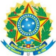

## MINISTÉRIO DA EDUCAÇÃO

Secretaria de Educação Profissional e Tecnológica

Instituto Federal de Educação; Ciência e Tecnologia de Mato Grosso do Sul

CNPJ 10.673.078/0001-20

## 6.  METODOLOGIA

Com o objetivo de capacitar os egressos do Curso Superior de Tecnologia em Análise e Desenvolvimento de Sistemas para atuarem produtivamente no mercado de trabalho e na sociedade, foi organizada uma estrutura curricular com a preocupação de estabelecer inter-relação entre as disciplinas que são ofertadas com a prática profissional e o mundo do trabalho. Assim, são definidas metodologias e técnicas que facilitem o processo de aprendizagem visando à formação adequada do egresso.

O desenvolvimento das unidades curriculares, no momento presencial de ensino, é direcionado pelo docente, que organiza e define o trabalho pedagógico, descrevendo em plano de ensino, aprovado pelo colegiado do curso e apresentado aos estudantes no início do período letivo. As estratégias pedagógicas para o desenvolvimento da metodologia educacional das competências dos módulos de ensino estão caracterizadas conforme o Quadro 5 do projeto de curso.

## MINISTÉRIO DA EDUCAÇÃO

Secretaria de Educação Profissional e Tecnológica

Instituto Federal de Educação; Ciência e Tecnologia de Mato Grosso do Sul

## CNPJ 10.673.078/0001-20

## Quadro 5: Estratégias Pedagógicas.

## Estratégias Pedagógicas

| Técnica de Ensino                                                                                                                                                                                                         | Recurso Didático                                                                                                                                                    | Forma de Avaliação                                                                                                  |
|---------------------------------------------------------------------------------------------------------------------------------------------------------------------------------------------------------------------------|---------------------------------------------------------------------------------------------------------------------------------------------------------------------|---------------------------------------------------------------------------------------------------------------------|
| 1. Expositiva dialogada 2. Atividades de Laboratório 3. Trabalho Individual 4. Trabalho em grupo 5. Pesquisa 6. Dramatização 7. Projeto 8. Debate 9. Estudo de Caso 10. Seminário 11. Visita Técnica 12. Painel Integrado | 1. Transparência 2. Slides 3. DVD 4. Computador 5. Mapas/ Catálogos 6. Laboratório 7. Impressos (aposti- las) 8. Quadro Branco 9. Projetor Multimí- dia  10. Outros | 1. Prova Objetiva 2. Prova Dissertativa 3. Prova Prática 4. Palestra 5. Projeto 6. Relatório 7. Seminário 8. Outros |

Fonte: NUGED (2017)

Alguns dos procedimentos didático-pedagógicos para auxiliar os discentes nas construções intelectuais ou atitudinais são recomendados:

- Elaboração do Plano de Ensino para definição de objetivos, procedimentos e formas da avaliação dos conteúdos previstos na ementa da disciplina;
- Problematização do conhecimento, buscando confirmação em diferentes fontes e solução de problemas;
- Contextualização dos conhecimentos sistematizados, relacionando-os com sua aplicabilidade no mundo real e valorizando as experiências dos discentes sem perder de vista também a construção do conhecimento;
- Promoção da integração dos saberes, tendo como princípios a contextualização e a interdisciplinaridade, expressos tanto na forma de trabalhos previstos nos planos das disciplinas como na prática profissional e em especial os projetos integradores;
- Diagnóstico das necessidades de aprendizagem dos estudantes a partir do levantamento dos seus conhecimentos;
- Elaboração de materiais a serem trabalhados em aulas expositivas dialogadas e atividades em grupo;
- Utilização de recursos tecnológicos para subsidiar as atividades pedagógicas;
- Desenvolvimento de projetos, seminários, debates, entre outras atividades que promovam o enriquecimento do trabalho em grupo e aprendizagem colaborativa;

Tais estratégias visam otimizar o processo de ensino e aprendizagem, levando o estudante a entender as múltiplas relações que o homem estabelece na sociedade, sua relação com a tecnologia e o papel que esta tecnologia pode desempenhar nos processos produtivos, na preservação ambiental e na transformação da sociedade e ainda devem prever não apenas

## MINISTÉRIO DA EDUCAÇÃO

Secretaria de Educação Profissional e Tecnológica

Instituto Federal de Educação; Ciência e Tecnologia de Mato Grosso do Sul

## CNPJ 10.673.078/0001-20

a articulação entre as bases como também o desenvolvimento da competência de aplicação, em busca de soluções tecnológicas, contribuindo na formação de um profissional que será capaz de atuar nas áreas de competência estabelecidas pela legislação profissional vigente de maneira crítica e ética, com capacidade técnica científica e responsabilidade social.

No curso superior de Tecnologia em Análise e Desenvolvimento de Sistemas do campus Naviraí busca-se estimular o uso de metodologias para aprendizagem ativa, como forma de promover uma educação mais centrada no aluno, conforme o § 6º, do inciso VIII, art. 6º da RESOLUÇÃO Nº 2, DE 24 DE ABRIL DE 2019.

## 6.1.  Abordagem Metodológica do Curso

Com o objetivo de capacitar os egressos do Curso Superior de Tecnologia em Análise e Desenvolvimento de Sistema para atuarem produtivamente no mercado de trabalho e na sociedade, foi organizada uma estrutura curricular com a preocupação de estabelecer inter-relação entre as disciplinas que são oferecidas com a prática profissional e o mundo do trabalho. Assim, neste item são definidas metodologias e técnicas que facilitem o processo de aprendizagem visando à formação adequada do egresso pretendido.

Visando a integração do conhecimento deve-se estimular o desenvolvimento de atividades interdisciplinares, por meio de projetos ou resolução de problemas. Nessa perspectiva, a pesquisa deve ser importante instrumento das atividades de ensino nas diferentes unidades curriculares, propiciando a investigação e sistematização de conceitos, princípios, fundamentos teóricos para a solução de problemas práticos inerentes à área de formação/atuação do egresso.

Além disso, as atividades de ensino devem primar ainda pela contextualização. Os conteúdos devem ser abordados numa perspectiva relacional entre unidades curriculares do mesmo semestre e de semestres anteriores, para que os estudantes percebam a evolução gradativa de seus estudos e compreendam a aplicação prática do que estão aprendendo. Convém que os conteúdos sejam abordados, ainda, numa perspectiva histórica da produção do conhecimento para que os estudantes compreendam que aquilo que se sabe hoje, em relação ao assunto em estudo, é a evolução de descobertas e construções feitas no passado e, portanto, propicia novas construções futuras. Dessa forma, as unidades curriculares desenvolvidas propiciam a aquisição de conteúdos factuais, procedimentos e ferramentas tecnológicas que estão em plena evolução. A compreensão dessa dimensão histórica e não estática do conhecimento permitirá ao egresso do curso continuar aprendendo e se adaptando às novas tecnologias e conhecimentos inerentes a sua área de atuação.

## MINISTÉRIO DA EDUCAÇÃO

Secretaria de Educação Profissional e Tecnológica

Instituto Federal de Educação; Ciência e Tecnologia de Mato Grosso do Sul

CNPJ 10.673.078/0001-20

## 6.2.  O uso de Tecnologias de Informação na Aprendizagem

O uso das tecnologias de comunicação e informação é fundamental na aprendizagem dos estudantes. Além da utilização dos laboratórios de informática, computadores e o acesso à internet, é fundamental a utilização e acesso ao AVEA (Ambiente Virtual de Ensino e Aprendizagem). Sabemos que os AVEAs têm importância fundamental no processo de ensino aprendizagem, pois por meio deles é que se configura o acesso à informação, que possibilita ampliar a aprendizagem, superando assim as barreiras da distância, do tempo e o acesso à tecnologia e ao saber. As principais funcionalidades do AVEA estão presentes nas suas ferramentas, entre elas destacamos: Questionários, Fórum, vídeos, chats e Wikis que possibilitam, aos estudantes, maior interação na aprendizagem. Através do uso das tecnologias disponíveis, é possível formar cidadãos críticos e preparados para o mercado de trabalho da sociedade pós-moderna. Com a utilização do ambiente virtual de aprendizagem, a mediação entre o professor e os estudantes extrapola os limites da sala de aula e permite novas abordagens e rediscussões das temáticas já discutidas durante as aulas.

A estratégia pedagógica da utilização de tecnologias de comunicação e informação se apresenta como uma proposta inovadora de ensino aprendizagem, que valoriza além dos recursos didáticos tradicionais, pois explora os AVEAs, especificamente a plataforma Moodle, como possibilidades de continuidade do processo de ensino-aprendizagem, desconstruindo a ruptura existente no processo tradicional de ensino. Com o uso da Plataforma Moodle, é possível ampliar as possibilidades de aprendizagem, além da interatividade de discutir o conteúdo no fórum ou chat com o professor e responder aos questionamentos e reflexões discutidas em sala de aula, o ambiente virtual torne-se uma extensão do trabalho do professor, além do tempo previsto em sala de aula.

## 7.  AVALIAÇÃO DA APRENDIZAGEM

Avaliar aprendizagem implica acompanhar o desempenho dos estudantes durante todo o processo de ensino, a fim de detectar avanços ou erros, corrigir as construções equivocadas e promover a apreensão de novos conhecimentos.

Ao avaliar o estudante, o professor observa também os resultados de sua atuação pedagógica, sendo capaz de perceber a necessidade de novas intervenções metodológicas, seja para um grupo de estudantes, seja para toda a classe.

Nessa perspectiva, é importante que o professor utilize instrumentos diversificados os quais lhe possibilitem observar melhor o desempenho do estudante nas atividades desenvolvidas. Através destes diversos instrumentos, é possível tomar decisões e orientar o estudante diante das dificuldades de aprendizagem apresentadas em diferentes aspectos do desenvolvi-

## MINISTÉRIO DA EDUCAÇÃO

Secretaria de Educação Profissional e Tecnológica

Instituto Federal de Educação; Ciência e Tecnologia de Mato Grosso do Sul

## CNPJ 10.673.078/0001-20

mento. Dentre as ações que colaboram neste desenvolvimento, podemos citar: atividades contextualizadas, diálogo permanente com o estudante buscando uma resposta aos estímulos, consenso dos critérios de avaliação, disponibilização de horários de permanência ou monitoria para aqueles que possuem dificuldade, discussão em sala e, sempre que possível, de forma participativa e colaborativa dos resultados obtidos e das soluções para as questões levantadas nas avaliações. Análise das características pessoais do estudante de forma que seja possível identificar com maior clareza as possíveis metodologias ou ações pedagógicas que otimizem o processo de aprendizagem.

Os instrumentos e critérios de avaliação estão previstos no plano de ensino do professor e são apresentados aos estudantes no início do semestre letivo para que estes possam gerir o seu próprio processo de aprendizagem. Sempre que observar a necessidade de ajustes, visando à superação de dificuldades observadas na turma, o professor tem autonomia para fazê-lo e deve informar aos estudantes.

Segundo o Regulamento da Organização Didático-Pedagógica do IFMS (ROD), o rendimento escolar será apurado por meio de:

- I. Verificação da frequência, quando couber;
- II. Avaliação do aproveitamento acadêmico.

Considerar-se-á aprovado o discente que tiver frequência nas atividades de ensino de cada unidade curricular igual ou superior a 75% da carga horária e média final igual ou superior a 6,0 (seis). O discente com Média Final inferior a 6,0 (seis) e/ou com frequência inferior a 75% será considerado reprovado. Outras situações comuns aos cursos de graduação do IFMS, como regras sobre a segunda chamada e revisão de avaliações estão descritas no Regulamento da Organização Didático-Pedagógica do IFMS.

Para os estudantes que não conseguirem atingir a média nas avaliações parciais, será aplicada a recuperação paralela conforme Art. 52º do ROD. Os instrumentos, critérios e datas de avaliação, assim como as propostas de recuperação paralela da aprendizagem, devem ser claros, dialogados com o grupo e definidos de forma coerente e razoável, adequados ao perfil da turma, à proposta do currículo do curso e ao perfil do egresso, pautados numa perspectiva de avaliação inclusiva, respeitando as necessidades específicas circunstanciais ou permanentes daqueles que as evidenciarem (conforme orienta a LDB 9.394/96, o Regulamento DidáticoPedagógico).

## 7.1.  Regime Especial de Dependência

Conforme o Art. 65º do Regulamento da Organização Didático-Pedagógica do IFMS, o Regime Especial de Dependência (RED) aplica-se nos casos de reprovação em unidade curricular por nota e não decorrente de frequência insuficiente, quando será permitido novo proces-

## MINISTÉRIO DA EDUCAÇÃO

Secretaria de Educação Profissional e Tecnológica

## CNPJ 10.673.078/0001-20

so de avaliação sem a exigência de frequência na respectiva unidade curricular. Caberá ao colegiado de curso informar à respectiva Coordenação de Gestão Acadêmica (Cogea) a relação de unidades curriculares que poderão ser cursadas nesse Regime a cada período letivo.

Caberá ao docente da disciplina, considerando as suas características e o processo de avaliação previsto em seu Plano de Ensino, decidir (ou emitir parecer sobre) a aplicação do RED, conforme orientação do Colegiado de Curso Superior de Tecnologia em Análise e Desenvolvimento de Sistemas.

## 7.2.  Aproveitamento e Avaliação dos Conhecimentos Adquiridos

No Regulamento da Organização Didático-Pedagógica do IFMS estão previstas formas de aproveitamento e avaliação dos conhecimentos adquiridos por meio do Exame de Suficiência, Convalidação, Equivalência e Enriquecimento curricular.

## 7.3.  Avaliação Integrada

O curso de Análise e Desenvolvimento de Sistemas realizará a Avaliação Integrada como procedimento de avaliação dos processos de ensino-aprendizagem. A prova é constituída por 4 (quatro) questões de cada unidade curricular, com o valor de 2.0 (dois pontos) inseridos no final de cada semestre. A Avaliação Integrada é um dos instrumentos de avaliação cujo conteúdo engloba todas as disciplinas do curso. Portanto, é uma avaliação interdisciplinar, em cumprimento às novas exigências do MEC e o devido preparo para atuação no mundo do trabalho, cujo foco dá-se na construção do conhecimento de forma integrada, transversal e em acordo com as demandas de conhecimentos atuais.

## 8.  INFRAESTRUTURA DO CURSO

As aulas teóricas e práticas de laboratório acontecem no Centro de Educação Profissional Senador Ramez Tebet, Rua Hilda nº 203, bairro Boa Vista, Naviraí/MS (sede provisória).

## 8.1.  Instalações

A Tabela 26 apresenta a infraestrutura física do Campus de Naviraí (sede provisória) disponível em 2021 e que será utilizada também pelos estudantes do curso de Tecnologia em Análise e Desenvolvimento de Sistemas.

Tabela 26: Estrutura geral Campus Naviraí no ano de 2021

| Dependências   |   Quantidade | m²    |
|----------------|--------------|-------|
| Salas de Aula  |           08 | 64,00 |

## MINISTÉRIO DA EDUCAÇÃO Secretaria de Educação Profissional e Tecnológica Instituto Federal de Educação; Ciência e Tecnologia de Mato Grosso do Sul

## CNPJ 10.673.078/0001-20

| Sala da Coordenação Pedagógica - NUGED                              |   01 | 25,00   |
|---------------------------------------------------------------------|------|---------|
| Sala das Coordenações                                               |   01 | 45,61   |
| Sala da Direção Geral                                               |   01 | 12,00   |
| Sala da Direção de Ensino                                           |   01 | 12,00   |
| Sala da Direção de Administração                                    |   01 | 12,00   |
| Sala de Professores                                                 |   02 | 85,62   |
| Sala de Videoconferência                                            |   01 | 19,32   |
| Biblioteca                                                          |   01 | 60,62   |
| Laboratório de Informática                                          |   04 | 242,48  |
| Laboratório Específico de Química/ Solos                            |   01 | 60,62   |
| Laboratório Específico de Biologia/Fisiologia Vegetal/Microbiologia |   01 | 60,62   |
| Laboratório Específico de Física/Engenharia Agrícola                |   01 | 60,62   |
| Auditório                                                           |   01 | 220,97  |
| Central de Relacionamentos (CEREL)                                  |   01 | 43,5    |
| Quadra Poliesportiva                                                |   01 | 462,2   |
| Vestiário Masculino                                                 |   01 | 44,24   |
| Vestiário Feminino                                                  |   01 | 44,24   |
| Vestiário pne                                                       |   01 | 10,36   |
| Sala da Enfermaria                                                  |   01 | 10      |
| Reprografia                                                         |   01 | 9,76    |
| Almoxarifado de Informática                                         |   01 | 16,1    |
| Almoxarifado CEREL                                                  |   01 | 6,1     |
| Refeitório e Copa                                                   |   01 | 306,09  |
| Despensa                                                            |   01 | 24,17   |
| Sanitários                                                          |   04 | 40,94   |
| Sanitários pne                                                      |   02 | 8,9     |
| Estufa agrícola                                                     |   01 | 96,00   |
| Sala para armazenamento de ferramentas                              |   01 | 9,00    |
| Container (2,43 x 12m) para armazenamento de materiais              |   02 | 58,32   |

## e insumos agrícolas

Fonte: DIRAD, IFMS, Campus Naviraí.

## 8.2.  Laboratórios Didáticos Especializados - Layouts

O Campus conta com quatro laboratórios de informática e um laboratório de arquitetura de computadores destinados aos estudantes dos cursos do ensino médio e superior. Nos quadros 6 e 7, estão disponíveis as informações de cada um dos laboratórios.

Quadro 6: Área física dos laboratórios do Campus do IFMS, município de Naviraí, MS - 2021

| Nome do laboratório                        | Área física   |
|--------------------------------------------|---------------|
| Laboratório de Informática 01              | 60,62 m 2     |
| Laboratório de Informática 02              | 60,62 m 2     |
| Laboratório de Informática 03              | 60,62 m 2     |
| Laboratório de Informática 04              | 60,62 m 2     |
| Laboratório de Arquitetura de Computadores | 17,03 m 2     |

Fonte: Elaborado pelos autores.

Quadro 7: Descrição dos equipamentos dos laboratórios do Campus do IFMS, município de Naviraí, MS - 2021

| Nome do laboratório           | Equipamentos existentes                                                                                                                                                                                                |
|-------------------------------|------------------------------------------------------------------------------------------------------------------------------------------------------------------------------------------------------------------------|
| Laboratório de Informática 01 | • 40 microcomputadores instalados com conexão de internet; • Mesas e cadeiras para 40 discentes; • 1 microcomputador e uma mesa com cadeira para o docente; • 1 projetor; • 1 tela de projeção; • Condicionador de ar. |
| Laboratório de Informática 02 | • 40 microcomputadores com conexão de internet; • Mesas e cadeiras para 40 discentes; • 1 microcomputador e uma mesa com cadeira para o docente; • 1 projetor; • 1 tela de projeção; • Condicionador de ar.            |
| Laboratório de Informática 03 | • 40 microcomputadores com conexão de internet; • Mesas e cadeiras para 40 discentes; • 1 microcomputador e uma mesa com cadeira para o docente; • 1 projetor;                                                         |

CNPJ 10.673.078/0001-20

## MINISTÉRIO DA EDUCAÇÃO

Secretaria de Educação Profissional e Tecnológica

Instituto Federal de Educação; Ciência e Tecnologia de Mato Grosso do Sul

## CNPJ 10.673.078/0001-20

|                               | • 1 tela de projeção; • Condicionador de ar.                                                                                                                                                               |
|-------------------------------|------------------------------------------------------------------------------------------------------------------------------------------------------------------------------------------------------------|
| Laboratório de Informática 04 | • 40 microcomputadores com conexão de internet; • Mesas e cadeiras para 40 discentes; • 1 microcomputador, uma mesa com cadeira para o docente; • 1 projetor; • 1 tela de projeção; • Condicionador de ar. |

Fonte: Org. (Autor).

Figura 4: Layout de laboratórios de informática com capacidade para 40 estudantes.

Fonte: Elaborado pelos autores.

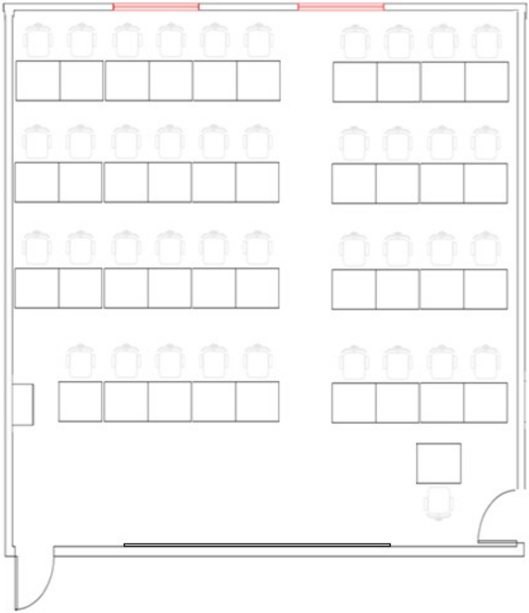

## 9.  PESSOAL DOCENTE

O corpo docente que atua no Campus Naviraí foi composto a partir de processos de remoção, realizados por meio de editais internos e concursos públicos, estruturado conforme o Quadro 8 mostra o corpo docente específico da área de informática e o Quadro 9 mostra o corpo docente das outras áreas que atuam no curso.

## MINISTÉRIO DA EDUCAÇÃO

Secretaria de Educação Profissional e Tecnológica

Instituto Federal de Educação; Ciência e Tecnologia de Mato Grosso do Sul

CNPJ 10.673.078/0001-20

Quadro 8: Descrição da composição do quadro de docentes específicos da área de informática do curso de Análise e Desenvolvimento de Sistemas do IFMS, Campus de Naviraí, MS - 2022

| Docente Efetivo                    | Área da Graduação                                     | Titulação    | Regime de trabalho   |
|------------------------------------|-------------------------------------------------------|--------------|----------------------|
| Alisson Gaspar Chiquitto           | Desenvolvimento de Software                           | Mestre       | 40h (DE)             |
| Caio Maqueise Alécio Pinheiro      | Sistemas de Informação                                | Especialista | 40h (DE)             |
| Danilo Adriano Mikucki             | Ciência da Computação                                 | Mestre       | 40h (DE)             |
| Laurentino Augusto Dantas          | Processamento de Dados                                | Mestre       | 40h (DE)             |
| Marcos Rogerio Ferreira            | Licenciatura em Computação/Tecnologia em Informática  | Mestre       | 40h (DE)             |
| Maximilian Jaderson de Melo        | Ciência da Computação                                 | Mestre       | 40h (DE)             |
| Nicholas Eduardo Lopes dos  Santos | Ciência da Computação                                 | Mestre       | 40h (DE)             |
| Vagner da Silva Bezerra            | Sistemas de Informação                                | Especialista | 40h (DE)             |
| Wagner Antoniassi                  | Ciência da Computação/Matemática/Ciên cias Biológicas | Mestre       | 40h (DE)             |

Fonte: Elaborado pelos autores.

Quadro 9: Descrição da composição do quadro de docentes de outras áreas que atuam no curso de Análise e Desenvolvimento de Sistemas do IFMS, Campus de Naviraí, MS - 2022

| Docente Efetivo                      | Área da Graduação                 | Titulação   | Regime de trabalho   |
|--------------------------------------|-----------------------------------|-------------|----------------------|
| André Carvalho Baida                 | Ciências Sociais                  | Mestre      | 40h (DE)             |
| Carlos Alberto Dettmer               | Administração                     | Doutor      | 40h (DE)             |
| César Peixoto Ferreira               | Física                            | Doutor      | 40h (DE)             |
| Gilberto Aparecido Tenani            | Matemática                        | Mestre      | 40h (DE)             |
| Ivânia Patricia Laguilio             | Letras Português/Inglês           | Mestre      | 40h (DE)             |
| Márcio Batista de Miranda            | Ciências Econômicas/Administração | Doutor      | 40h (DE)             |
| Paula Renata de Morais Gomes Freitas | Licenciatura em Matemática.       | Mestre      | 40h (DE)             |
| Valério Gonçalves de Matos           | Matemática/Engenharia Civil       | Mestre      | 40h (DE)             |

Fonte: Elaborado pelos autores.

## MINISTÉRIO DA EDUCAÇÃO

Secretaria de Educação Profissional e Tecnológica

Instituto Federal de Educação; Ciência e Tecnologia de Mato Grosso do Sul

CNPJ 10.673.078/0001-20

## 9.1.  NÚCLEO DOCENTE ESTRUTURANTE - NDE

De acordo com o Regulamento do NDE do IFMS, as atribuições devidas ao núcleo são:

- I. Contribuir para a consolidação do perfil profissional do egresso do curso;
- II. Zelar pela integração curricular interdisciplinar entre as diferentes atividades de ensino constantes no currículo;
- III. Indicar formas de incentivo ao desenvolvimento de linhas de pesquisa e extensão, oriundas de necessidades da graduação, de exigências do mundo do trabalho e afinadas com as políticas públicas relativas à área de conhecimento do curso e Plano de desenvolvimento Institucional (PDI);
- IV. Zelar pelo cumprimento das Diretrizes Curriculares Nacionais para os Cursos de Graduação pertinentes;
- V. Elaborar o PPC, definindo sua concepção e fundamentos, bem como acompanhar sua implantação e consolidação;
- VI. Avaliar continuamente o PPC, encaminhando proposições de atualização ao Colegiado de Curso.
7. O NDE do Curso Superior de Tecnologia em Análise e Desenvolvimento de Sistemas será formado conforme Regulamento dos Colegiados de cursos superiores do IFMS.

## 9.2.  Colegiado do Curso

O Colegiado de Curso é o órgão consultivo, normativo, de planejamento acadêmico e executivo para assuntos de política de ensino, pesquisa e extensão em conformidade com as diretrizes do IFMS. O Colegiado do Curso Superior de Tecnologia em Análise e Desenvolvimento de Sistemas é constituído por um grupo de seis docentes que ministram aulas nas unidades curriculares do curso, incluindo o presidente, além de um membro discente, um membro técnico administrativo, dois estudantes suplentes, um técnico administrativo suplente e dois professores suplentes.

O Coordenador do Curso Superior de Tecnologia em Análise e Desenvolvimento de Sistemas será designado por Portaria Institucional específica.

## 9.3.  Coordenação do Curso

O coordenador é responsável, com o Núcleo Docente Estruturante e colegiado, pela elaboração e execução do PPC do curso. Deve acompanhar todas as atividades realizadas no curso e todo o processo de sua execução. É responsável pelas ações que cumprem os objetivos do curso definidos nas diretrizes nacionais, bem como as exigências mínimas que atendam aos instrumentos de qualidade exigidos pelo Ministério da Educação.

## MINISTÉRIO DA EDUCAÇÃO

Secretaria de Educação Profissional e Tecnológica

Instituto Federal de Educação; Ciência e Tecnologia de Mato Grosso do Sul

## CNPJ 10.673.078/0001-20

Elabora e acompanha os horários de execução das unidades curriculares, bem como resolve problemas com as mesmas. Incentiva a participação em projetos de extensão e pesquisa, principalmente em Iniciação Científica, bem como a produção e publicação dos trabalhos desenvolvidos pelos professores e pelos estudantes.

O Coordenador acompanha também as atividades inerentes ao estágio curricular supervisionado e as atividades complementares, previstas no projeto do curso. O coordenador deve manter um bom relacionamento com professores e estudantes, sendo imparcial no tratamento de ambos. Deve possibilitar uma maior participação de seus professores na elaboração do planejamento do curso e incentivar a formação continuada dos professores e estudantes concluintes.

O coordenador do Curso Superior de Tecnologia em Análise e Desenvolvimento de Sistemas participa ainda como Presidente do Núcleo Docente Estruturante e do Colegiado do referido curso, de acordo com o Regulamento do Colegiado de Curso do IFMS.

## 10.  CORPO TÉCNICO

O Corpo técnico do Campus Naviraí tem por finalidade apoiar as atividades de ensino, pesquisa e extensão, promovendo o atendimento individual e orientação aos estudantes, professores e demais membros da comunidade acadêmica. Além de suas atribuições relativas ao atendimento ao público, manutenção e organização dos documentos, possuem a competência de orientar estudantes e professores a respeito dos procedimentos técnicos burocráticos do campus .

Quadro 10: Descrição da composição do quadro de técnicos administrativos do campus do IFMS, município de Naviraí, MS - 2022

| Técnicos efetivos                       | Função                                     | Formação                |
|-----------------------------------------|--------------------------------------------|-------------------------|
| Adriano Rodrigues Ferreira              | Assistente em Administração                | Letras                  |
| Adriele Dzindzik Lins                   | Auditora                                   | Ciências Contábeis      |
| Agenor Ricardo De Paiva                 | Técnico em Agropecuária                    | Técnico em Agropecuária |
| Aline Alves da Silva                    | Assistente de Alunos                       | Zootecnia               |
| Alisson Adriano Dagher Schlotefeldt     | Assistente em Administração                | Comunicação Social      |
| Amauri Baptista Bolzani                 | Técnico   de   Laboratório   - Informática | Técnico em Informática  |
| Caio   Fernando   Ramalho   de Oliveira | Técnico de Laboratório                     | Ciências Biológicas     |

## MINISTÉRIO DA EDUCAÇÃO Secretaria de Educação Profissional e Tecnológica Instituto Federal de Educação; Ciência e Tecnologia de Mato Grosso do Sul

## CNPJ 10.673.078/0001-20

| Carla Gilmeres Aparecida Lima               | Auxiliar de Biblioteca                    | Química                                            |
|---------------------------------------------|-------------------------------------------|----------------------------------------------------|
| Claudia Cazetta Jeronimo Salvatino          | Assistente em Administração               | Direito                                            |
| Daniel  Colman Sanabria                     | Assistente em Administração               | Administração                                      |
| Daniele Pires De Oliveira Martins           | Técnico de TI                             | Tecnólogo em Análise e Desenvolvimento de Sistemas |
| Denize Domingues Tiba                       | Técnico em Assuntos Educacionais          | Educação Física                                    |
| Douglas Tavares Da Silva                    | Técnico   de   Tecnologia   da Informação | Tecnólogo em Análise e Desenvolvimento de Sistemas |
| Elizabeth   Amara   de   Oliveira Lima      | Pedagoga                                  | Pedagogia                                          |
| Francisco Roberto Da Silva De Carvalho      | Técnico em Assuntos Educacionais          | Educação Física                                    |
| Gabriel   Souza   Cavalcante   de Magalhães | Assistente em Administração               | Ensino Médio                                       |
| Jaqueline da Silva Amazonas                 | Administradora                            | Administração                                      |
| Jeferson Alves Berto                        | Auxiliar em Administração                 | Serviço Social                                     |
| Jenifer Serra Lino                          | Administradora                            | Administração                                      |
| Jiuliano Beltrame                           | Técnico em Agropecuária                   | Zootecnia                                          |
| João Batista de Morais                      | Assistente em Administração               | Direito                                            |
| Jovaci Alves de Novais                      | Assistente em Administração               | Biologia                                           |
| Letícia Roriz Nunes                         | Assistente em administração               | Ensino Médio                                       |
| Lucas Gustavo Yock Durante                  | Engenheiro Agrônomo                       | Engenheiro Agrônomo                                |
| Marli dos Santos De Oliveira                | Pedagoga                                  | Pedagogia                                          |
| Mayara Regina Chaves                        | Técnico Laboratório                       | Tecnólogo em Produção Sucroalcooleira              |
| Michel Martins Lopes                        | Técnico em Audiovisual                    | Tecnólogo em Análise e Desenvolvimento de Sistemas |
| Mirian Cristina Da Silva Gomes              | Técnico   em   Alimentos   e Laticínios   | Tecnologia em Alimentos                            |

## MINISTÉRIO DA EDUCAÇÃO

Secretaria de Educação Profissional e Tecnológica

Instituto Federal de Educação; Ciência e Tecnologia de Mato Grosso do Sul

## CNPJ 10.673.078/0001-20

| Nicolle Neiva Lamas                            | Enfermeira                   | Enfermagem         |
|------------------------------------------------|------------------------------|--------------------|
| Paula   Renata   Cameschi   de Souza           | Assistente em Administração  | Administração      |
| Pedro   Henrique   Garcia   De Almeida         | Assistente em administração  | Ensino Médio       |
| Pedro   Jorge   Cardozo   da   Silva Rodrigues | Assistente em Administração  | Ensino Médio       |
| Rafael Pereira Faustino                        | Contador                     | Ciências Contábeis |
| Renata Franco Ferreira                         | Assistente de Alunos         | Turismo            |
| Thatiane Ramos dos Santos                      | Bibliotecária/Documentalista | Comunicação Social |
| William Penante Cruz                           | Psicólogo                    | Psicologia         |

Fonte: Elaborado pelos autores.

## 11.  APOIO AO DISCENTE

O IFMS conta com uma equipe multidisciplinar qualificada composta por Pedagogo, Psicólogo e Assistente Social. Destacamos o desenvolvimento de atividades esportivas e culturais.

## 11.1.  Políticas de Inclusão

Em atenção aos requisitos legais aplicáveis à Educação Superior, e considerando a responsabilidade social, o campus Naviraí conta com o NAPNE (Núcleo de Atendimento às Pessoas com Necessidades Educacionais Específicas) com a finalidade de definir normas de inclusão a serem praticadas no IFMS, promover a cultura da convivência, respeito à diferença e buscar a superação de obstáculos arquitetônicos e atitudinais, de modo a garantir democraticamente a prática da inclusão social como diretriz da instituição. (IFMS, Resolução 026/2016).

As instalações do campus contam atualmente com rampas de acesso, barras de apoio, corrimão, banheiro acessível e alargamento de portas como infraestrutura para a promoção da acessibilidade.

Está previsto a necessidade de realização de adaptação de documentos e identificações do campus em LIBRAS e Braille e também em línguas estrangeiras como inglês e espanhol, no sentido de tornar acessível à instituição, o público-alvo de cegos, surdos e estrangeiros, tanto como estudantes e/ou visitantes.

O campus dispõe de laboratórios de informática e computadores com acesso à internet na biblioteca. Há também a possibilidade de utilização do sistema operacional DOSVOX que

## MINISTÉRIO DA EDUCAÇÃO

Secretaria de Educação Profissional e Tecnológica

Instituto Federal de Educação; Ciência e Tecnologia de Mato Grosso do Sul

## CNPJ 10.673.078/0001-20

permite pessoas com deficiência visual utilizarem um microcomputador comum para desempenhar uma série de tarefas, adquirindo assim independência no estudo.

## 11.2.  Atendimento e/ou Permanência de Estudantes

O Programa de Auxílio Permanência tem por objetivo incentivar o estudante em sua formação educacional, bem como apoiá-lo em sua permanência no IFMS, visando à redução dos índices de evasão escolar decorrentes de dificuldades de ordem socioeconômica. São concedidos auxílios mensais para os estudantes do Curso Técnico, de acordo com os critérios previstos em edital publicado no site da instituição no início de cada ano letivo. A manutenção do auxílio está vinculada à frequência mensal do estudante, que não deve ser inferior a 75% das aulas ministradas.

A Política de Assistência Estudantil do IFMS constitui-se de um conjunto de princípios e diretrizes norteadoras para a implementação de ações que favoreçam a democratização do acesso, dentre elas a permanência e êxito escolar, promovendo estímulo ao desenvolvimento de atividades de ensino, pesquisa e extensão. São finalidades da Política de Assistência Estudantil contribuir para a formação integral dos estudantes, buscando dirimir suas necessidades no que tange aos aspectos socioeconômicos e pedagógicos bem como minimizar os efeitos das desigualdades sociais na permanência e conclusão do curso, reduzir os índices de reprovação, retenção e evasão escolar decorrentes de dificuldades de ordem socioeconômica e também possibilitar a participação em atividades de ensino, pesquisa e extensão.

As Políticas de Assistência Estudantil do IFMS contam com as seguintes categorias:

- I. Auxílios concedidos por critério socioeconômico: Auxilio Alimentação, Moradia, Auxíliotransporte, Auxílio Permanência;
- II. Auxílio para ações de Ensino, Pesquisa e Extensão: Acesso à cultura, artes, esportes e lazer, acesso a inovação, ciência e tecnologia, Promoção à Saúde e à qualidade de vida;
- III. Auxílio de acesso a Inovação, Ciência e Tecnologia - Para participação em eventos científicos, os estudantes que tiverem projetos de pesquisa selecionados para feiras de tecnologias, engenharias e ciências de Mato Grosso do Sul serão beneficiados com auxílio para participação do evento, sempre mediante a Edital.

Os docentes que atuam no curso possuem em sua carga horária um número de horas destinadas às atividades de apoio ao ensino. Dentre elas, há aquelas reservadas ao atendimento ou permanência de estudantes, que visa sanar dificuldades observadas no processo de ensino aprendizagem durante o período letivo.

Estes horários são divulgados aos estudantes para que os mesmos possam procurar os docentes para esclarecimento de dúvidas a respeito dos conteúdos desenvolvidos nas aulas ou

## MINISTÉRIO DA EDUCAÇÃO

Secretaria de Educação Profissional e Tecnológica

Instituto Federal de Educação; Ciência e Tecnologia de Mato Grosso do Sul

CNPJ 10.673.078/0001-20

atividades avaliativas. Este trabalho favorece a recuperação paralela dos conceitos vistos em sala.

## 11.3.  Núcleo de Gestão Administrativa e Educacional

O Núcleo de Gestão Administrativa e Educacional - NUGED é um núcleo subordinado à Direção-Geral - DIRGE dos campi , responsável pela assessoria técnica especializada. Caracterizado como uma equipe multidisciplinar que tem como o objetivo principal implementar ações que promovam o desenvolvimento escolar e institucional com eficiência, eficácia e efetividade.

Atende às demandas institucionais de acordo com as atribuições específicas de cada cargo que compõe o núcleo, acompanhando os estudantes e servidores, e identificando as dificuldades inerentes aos processos da instituição, assim como os aspectos biopsicossociais que interfiram no desenvolvimento institucional e pessoal.

As ações dos Pedagogos nos campi estão relacionadas à organização, com a Direção de Ensino, Pesquisa e Extensão - DIREN e Coordenações da Semana Pedagógica, prevendo reuniões formativas, abertura do semestre letivo, promoção e divulgação de atividades pedagógicas que tenham apresentado bons resultados, organização da avaliação do docente pelo discente, análise e repasse dos resultados estimulando a definição de ações de melhoria contínua dos processos. Cabe ao Pedagogo orientar a aplicação do Regulamento Disciplinar Discente e atender e esclarecer sobre o processo educativo de eventuais ocorrências e acompanhar o planejamento das atividades de ensino.

As ações do Atendimento do Psicólogo são de desenvolver atividades e projetos visando prevenir, identificar e resolver problemas psicossociais que possam prejudicar o desenvolvimento das potencialidades dos estudantes e encaminhamento dos estudantes para atendimento especializado quando necessário. Por fim, cabe ao psicólogo acompanhar os processos de regime domiciliar quanto aos aspectos psicossociais.

O Assistente Social implementa as ações da Assistência Estudantil no âmbito do campus , que tem como objetivo incentivar o discente em sua formação educacional, visando a redução dos índices de evasão escolar decorrentes de dificuldades de ordem socioeconômica e faz o atendimento à comunidade escolar visando conhecer dificuldades inerentes ao processo educativo, assim como aspectos biopsicossociais que interfiram na aprendizagem, bem como orienta, encaminha e acompanha estudantes às alternativas cabíveis a resolução dos problemas observados na Educação Técnica.

No sentido de socialização, a participação do NUGED será desenvolver ações e atividades específicas para auxiliar a socialização e aprendizagem dos estudantes.

## MINISTÉRIO DA EDUCAÇÃO

Secretaria de Educação Profissional e Tecnológica

Instituto Federal de Educação; Ciência e Tecnologia de Mato Grosso do Sul

## CNPJ 10.673.078/0001-20

11.4.  Núcleo de Atendimento às Pessoas com Necessidades Educacionais Específicas (NAPNE) e Núcleo de Estudos Afro-brasileiros e Indígenas (NEABI)

O Núcleo de Atendimento às Pessoas com Necessidades Especiais/ Específicas (NAPNE) do Instituto Federal é um núcleo que tem por finalidade possibilitar e garantir o acesso e permanência do estudante com necessidades educacionais especiais no IFMS. O NAPNE visa à implantação de ações de educação inclusiva, auxiliando na aprendizagem do estudante. Para isso realiza o trabalho de captação de agentes formadores, orientação aos docentes e atendimento às famílias para encaminhamentos quando necessário.

Sendo responsabilidade do núcleo, mas não somente dele e sim da instituição como um todo assegurar a proteção dos direitos da pessoa com transtorno do espectro autista conforme Lei nº 12.764/2012. Verificar e zelar pelo cumprimento no disposto na Constituição Federal nos artigos 205, 206 e 208, na NBR 9050/2004, da ABNT, na Lei nº 10.098/2000 e nos Decretos nº 5.296/2004, nº 6.949/2009, nº 7.611/2011 e na Portaria nº 3.284/2003 em relação as condições de acessibilidade para pessoas com deficiência ou mobilidade reduzida.

Bem como o Campus Naviraí conta com um servidor Interprete de Libras atendendo desta forma o Decreto nº 5.626/2005.

O Núcleo de Estudos Afro-brasileiros e Indígenas -NEABI, em conformidade com implementação da Lei n° 11.645/2008 que institui a obrigatoriedade de incluir no currículo oficial da rede de ensino a temática 'História e Cultura Afro-Brasileira e Indígena', e fortalecimento da Lei nº 12.288/2010 - Estatuto da Igualdade Racial, foi criado por portaria instituída no campus Naviraí, e possui natureza propositiva e consultiva voltada para o direcionamento de estudos na instituição IFMS. Seu papel visa fomentar a produção de conhecimentos, a formação e a realização de ações que contribuam para a valorização das identidades, da história e culturas africanas, negras, afro descendente e dos povos originários tradicionais no âmbito da instituição e em suas relações com a comunidade externa.

## 11.5.  Regime Domiciliar

Conforme Regulamento da Organização Didático Pedagógica do Instituto Federal do Mato Grosso do Sul, em seu artigo 177, o Regime de Exercício Domiciliar (RD) é uma condição legal concedida ao estudante pelo Decreto-Lei nº 1.044, de 21 de outubro de 1969, no caso de situações de saúde, e pela Lei nº 6.202, de 17 de abril de 1975, no caso de licença-maternidade.

No Regime Domiciliar é assegurado ao estudante acompanhamento domiciliar com visitas periódicas de servidores do Instituto Federal de Mato Grosso do Sul para amparo educacional durante o período de afastamento.

## MINISTÉRIO DA EDUCAÇÃO

Secretaria de Educação Profissional e Tecnológica

Instituto Federal de Educação; Ciência e Tecnologia de Mato Grosso do Sul

## CNPJ 10.673.078/0001-20

## 11.6.  Acompanhamento ao Egresso

O acompanhamento de egressos é realizado por meio do Programa de Acompanhamento de Egressos (Pace) do Instituto Federal de Mato Grosso do Sul aprovado por meio da Resolução nº 059, de 25 de outubro de 2018. Ele dispõe sobre a natureza, objetivos, responsabilidades e ações para o acompanhamento de egressos e avaliação da atuação institucional, com base na Lei n° 10.861, de 14 de abril de 2004, no Regimento Geral do Instituto, aprovado pela Resolução Cosup/IFMS nº 061, de 28 de julho de 2017, no Plano de Desenvolvimento Institucional do IFMS (PDI) e na Política de Extensão da instituição, aprovada pela Resolução Cosup/IFMS n° 059, de 21 de julho de 2017.

O Pace é um mecanismo de singular importância para a retroalimentação do currículo escolar e para a aferição dos resultados institucionais. Ele contribui na definição de indicadores de efetividade, uma vez que, a partir de dados coletados com os egressos, a instituição pode aprimorar o planejamento e a execução de ações específicas no âmbito do ensino, da pesquisa, da extensão, da administração e do desenvolvimento institucional, e ainda, subsidiar políticas de permanência e êxito de seus estudantes.

## 12.  DIPLOMAÇÃO

É condição para a diplomação o cumprimento de todas as competências previstas na matriz curricular do Curso Superior de Tecnologia em Análise e Desenvolvimento de Sistemas, inclusive no que diz respeito aos elementos da Prática Profissional (atividades acadêmico-científico culturais, estágio curricular supervisionado, TCC e realização da prova do Exame Nacional de Desempenho de Estudantes (Enade). O Enade é obrigatório e a situação de regularidade do estudante no Exame deve constar em seu histórico escolar. Após o cumprimento desses itens, será conferido ao discente o Diploma de Tecnólogo em Análise e Desenvolvimento de Sistemas ,   de   acordo   com   a   Lei   nº.9.394/96,   Parecer   CNE/CES   nº.   436/2001,   Resolução CNP/CP nº. 3 de 18 de dezembro de 2002.

Os requisitos e as responsabilidades para emissão do certificado e/ou diploma, explicitando a titulação concedida toma como base o Regulamento para Emissão, Registro e Expedição de Diploma de Curso de Graduação, disponível em  https://www.ifms.edu.br/centrais-deconteudo/documentosinstitucionais/regulamentos/alteracao-do-regulamento-para-emissaoregistro-e-expedicao-decertificados-e-diplomas-23-10.2019.pdf.

No curso, há também a previsão de certificações parciais, concedidas ao acadêmico, à medida que este conclua as disciplinas dos períodos.

## MINISTÉRIO DA EDUCAÇÃO Secretaria de Educação Profissional e Tecnológica Instituto Federal de Educação; Ciência e Tecnologia de Mato Grosso do Sul

## CNPJ 10.673.078/0001-20

## 12.1.  Certificações parciais

Atendendo a proposta geral do ensino profissional, o currículo de formação do curso de Tecnologia em Análise e Desenvolvimento de Sistemas prevê a oferta de certificados para a conclusão parcial do curso, proporcionando flexibilidade na formação do estudante.

Dessa forma, o estudante receberá certificados de qualificação profissional à medida que concluir as disciplinas da matriz curricular do curso. A denominação dos nomes das qualificações profissionais foi concebida buscando coerência com os conteúdos ministrados em cada período do curso e em aderência à CBO - Classificação Brasileira de Ocupações do Ministério do Trabalho (Quadro 11), quais sejam (Ministério do Trabalho e Emprego, 2012):

Quadro 11: Certificações emitidas para conclusão parcial do curso

| Certificação                                          | Código CBO   |
|-------------------------------------------------------|--------------|
| Operador de computador                                | 3172-05      |
| Programador de Internet                               | 3171-05      |
| Desenvolvedor de Sistemas de Tecnologia da Informação | 3171-10      |

Fonte: Elaborado pelos autores com base em Ministério do Trabalho e Emprego, 2012.

Para obtenção dos certificados, o estudante deve atender aos requisitos de aprovação e desenvolvimento de atividades constantes no esquema descrito pelo Quadro 12.

## MINISTÉRIO DA EDUCAÇÃO

Secretaria de Educação Profissional e Tecnológica

## CNPJ 10.673.078/0001-20

## Quadro 12: Requisitos para obtenção das certificações parciais

| Tecnólogo em Análise e Desenvolvimento de Sistemas    | Tecnólogo em Análise e Desenvolvimento de Sistemas    | Tecnólogo em Análise e Desenvolvimento de Sistemas   | Tecnólogo em Análise e Desenvolvimento de Sistemas   | Tecnólogo em Análise e Desenvolvimento de Sistemas   | Tecnólogo em Análise e Desenvolvimento de Sistemas   | Tecnólogo em Análise e Desenvolvimento de Sistemas   | Tecnólogo em Análise e Desenvolvimento de Sistemas   | Tecnólogo em Análise e Desenvolvimento de Sistemas   |
|-------------------------------------------------------|-------------------------------------------------------|------------------------------------------------------|------------------------------------------------------|------------------------------------------------------|------------------------------------------------------|------------------------------------------------------|------------------------------------------------------|------------------------------------------------------|
| Desenvolvedor de Sistemas de Tecnologia da Informação | Desenvolvedor de Sistemas de Tecnologia da Informação | 3º                                                   | 4º  período                                          | 5º  período                                          | 6º  período                                          | Atividades com- plementares                          | Estágio                                              | TCC                                                  |
| Programador de Internet Operador de Computador 1º     | 2º                                                    | período                                              | 4º  período                                          | 5º  período                                          | 6º  período                                          | Atividades com- plementares                          | Estágio                                              | TCC                                                  |
| 345h                                                  | 345h                                                  | 345h                                                 | 345h                                                 | 300h                                                 | 240h                                                 | 50h                                                  | 180h                                                 | 100h                                                 |

Fonte: Elaborado pelos autores.

Em conformidade com as orientações contidas na CBO e os conteúdos ministrados nos períodos correspondentes à exigência de cada certificação, atestando a evolução das competências do estudante nas diversas áreas de conhecimento em Análise de Desenvolvimento de Sistemas, espera-se dos perfis intermediários de:

Operador de Computador: para integralização do currículo da certificação de Operador de Computador é necessário que o estudante do curso de Tecnologia em Análise e Desenvolvimento de Sistemas conclua as disciplinas do 1º e 2º períodos, com carga horária de 690 horas de aulas, esperando-se o desenvolvimento das seguintes competências gerais e fundamentais na operação de sistemas de computacionais:

1. Manusear equipamentos de computador e aplicativos;
2. Monitorar o desempenho de hardware e software;
3. Administrar recursos de entrada e saída de dados;
4. Oferecer suporte aos usuários na utilização dos recursos computacionais;
5. Levantar, especificar e gerenciar requisitos de sistemas de software;
6. Elaborar e implementar algoritmos e utilizar técnicas de programação para construir soluções para problemas computacionais.

Desenvolvedor Web: para integralização do currículo da certificação de Desenvolvedor Web, além das competências adquiridas durante a certificação anterior, é necessário que o estudante do curso de Tecnologia em Análise e Desenvolvimento de Sistemas conclua as unidades curriculares do 1º, 2º, 3º e 4º períodos, com carga horária de 1380 horas de aulas, esperando-se o desenvolvimento das seguintes competências específicas no desenvolvimento de programas para Internet:

1. Construir interfaces com o usuário utilizando padrões e boas práticas;
2. Estruturar páginas para Internet;
3. Desenvolver aplicações dinâmicas com interação com o usuário e acesso a bancos de dados;
4. Modelar requisitos de software;

## MINISTÉRIO DA EDUCAÇÃO

Secretaria de Educação Profissional e Tecnológica

Instituto Federal de Educação; Ciência e Tecnologia de Mato Grosso do Sul

## CNPJ 10.673.078/0001-20

5. Projetar e administrar banco de dados;
6. Instalar e configurar sistemas operacionais;
7. Desenvolver aplicativos para desktop

Desenvolvedor de Sistemas de Tecnologia da Informação: para integralização do currículo da certificação de Desenvolvedor de Sistemas de Tecnologia da Informação, além das competências adquiridas durante a certificação anterior, é necessário que o estudante do curso de Tecnologia em Análise e Desenvolvimento de Sistemas conclua as disciplinas do 1º, 2º, 3º, 4º e 5º períodos, com carga horária de 1680 horas de aulas, esperando-se o desenvolvimento das seguintes competências avançadas no desenvolvimento de sistemas:

1. Desenvolver softwares utilizando frameworks ;
2. Elaborar projetos de sistemas;
3. Realizar projetos e implementações básicas de redes de computadores;
4. Desenvolver sistemas observando os aspectos de qualidade.

## 13.  AVALIAÇÃO DO CURSO

Estão implementados pelo IFMS mecanismos de avaliação permanente da efetividade do processo de ensino-aprendizagem, visando compatibilizar a oferta de vagas e o modelo do curso com a demanda do mercado de trabalho. Uma delas é a autoavaliação a ser realizada pela CPA - Comissão Própria de Avaliação. Paralelamente, há a atuação do NDE e do Colegiado de Curso, em conjunto com o coordenador de curso, visando consolidar mecanismos que possibilitem a permanente avaliação dos objetivos do curso.

## 13.1.  Comissão Própria de Avaliação - CPA

A CPA no Instituto Federal de Mato Grosso do Sul tem como função conduzir os processos de avaliação interna da instituição, assim como sistematizar e prestar as informações solicitadas pelo Instituto Nacional de Estudos e Pesquisas Educacionais Anísio Teixeira (Inep). Os processos de avaliação conduzidos pela CPA subsidiam o credenciamento e recredenciamento de instituições de ensino superior, bem como reconhecimento e renovação de cursos de graduação oferecidos.

A legislação prevê os seguintes processos de avaliação, o Avalies - Avaliação das Instituições de Educação Superior: Autoavaliação (coordenada pela CPA) e Avaliação externa (realizada por comissões designadas pelo Inep), bem como a Avaliação dos Cursos de Graduação (ACG) e o Exame Nacional de Desempenho dos Estudantes (ENADE).

O Curso Superior de Tecnologia em Análise e Desenvolvimento de Sistemas encontrase em constante processo de autoavaliação anualmente. Com isso, a CPA promove uma avaliação com todos os segmentos da organização (docentes, técnicos administrativos e estudan-

## MINISTÉRIO DA EDUCAÇÃO

Secretaria de Educação Profissional e Tecnológica

Instituto Federal de Educação; Ciência e Tecnologia de Mato Grosso do Sul

## CNPJ 10.673.078/0001-20

tes), em cumprimento com a Lei 10.861/2004. Desta forma, pretende-se detectar os pontos que precisam ser melhorados no ambiente organizacional e na prática pedagógica e a partir dessa sistematização promover os avanços que contribuirão de maneira significativa para melhoria da Instituição e dos cursos superiores.

## 13.2.  Avaliação do Docente pelo Discente

Parte da avaliação dos docentes, utilizada para aprovação em estágio probatório e progressão por mérito profissional, dá-se pela Avaliação do Docente pelo Discente. Esta avaliação é um programa executado pela gestão e NUGED com o objetivo de levantar um diagnóstico das práticas pedagógicas e avaliar o desempenho do professor em sala de aula. De posse destas informações, é possível que professores e a coordenação de curso planejem ações contínuas para melhoria das práticas de ensino. A periodicidade da avaliação é semestral e são avaliados todos os professores que atuam em sala de aula, para cada disciplina.

## 14.  REFERÊNCIAS BIBLIOGRÁFICAS

BRASIL. Lei nº 9.394, de 20 de dezembro de 1996. Estabelece as diretrizes e bases da educação nacional. Diário Oficial da União. Brasília, DF, 23 dez. 1996. Disponível em: http://www.planalto.gov.br/ccivil\_03/leis/l9394.htm. Acesso em: 06, mar. 2017.

\_\_\_\_\_\_. Lei nº 10.098, de 19 de dezembro de 2000. Estabelece normas gerais e critérios básicos para a promoção da acessibilidade das pessoas portadoras de deficiência ou com mobilidade reduzida, e dá outras providências . Diário Oficial da União. Brasília, DF, 20 dez. 2000. Disponível em: http://www.planalto.gov.br/ccivil\_03/LEIS/L10098.htm. Acesso em: 08, mar. 2017.

\_\_\_\_\_. Lei nº 11.645, de 10 de março de 2008. Altera a Lei n o   9.394, de 20 de dezembro de 1996, modificada pela Lei n o 10.639, de 9 de janeiro de 2003, que estabelece as diretrizes e bases da educação nacional, para incluir no currículo oficial da rede de ensino a obrigatoriedade da temática 'História e Cultura Afro-Brasileira e Indígena'. Diário Oficial da União. Brasília, DF, 11 de mar. 2008. Disponível em: http://www.planalto.gov.br/ccivil\_03/\_ato2007-2010/2008/lei/ l11645.htm. Acesso em: 08, mar. 2017.

\_\_\_\_\_. Lei nº 12.711, de 29 de agosto de 2012. Dispõe sobre o ingresso nas universidades federais e nas instituições federais de ensino técnico de nível médio e dá outras providências . Diário Oficial da União. Brasília, DF, 30 de ago. 2012. Disponível em: http://www.planalto.gov.br/ccivil\_03/\_ato2011-2014/2012/lei/l12711.htm. Acesso em: 08, mar. 2017.

\_\_\_\_\_. Lei nº 12.764, de 27 de dezembro de 2012. Institui a Política Nacional de Proteção dos Direitos da Pessoa com Transtorno do Espectro Autista; e altera o § 3 o do art. 98 da Lei n o 8.112, de 11 de dezembro de 1990. Diário Oficial da União. Brasília, DF, 28 dez. 2012. Disponível em: http://www.planalto.gov.br/ccivil\_03/\_ato2011-2014/2012/lei/l12764.htm. Acesso em: 09, mar. 2017.

\_\_\_\_\_\_. Resolução MEC/CNE/CP nº 01/2012, de 30 de maio de 2012. Estabelece Diretrizes Nacionais para a Educação em Direitos Humanos. Brasília, DF. Disponível em: http://portal.mec.gov.br/dmdocuments/rcp001\_12.pdf. Acesso em 02, mar. 2017.

## MINISTÉRIO DA EDUCAÇÃO

Secretaria de Educação Profissional e Tecnológica

Instituto Federal de Educação; Ciência e Tecnologia de Mato Grosso do Sul

## CNPJ 10.673.078/0001-20

\_\_\_\_\_. Resolução CNE/CP Nº 01/2021, de 5 de janeiro de 2021. Que trata das Diretrizes Curriculares Nacionais Gerais para a Educação Profissional e Tecnológica . Brasília, DF. Disponível em: http://portal.mec.gov.br/index.php?option=com\_docman&amp;view=download&amp;alias=167931rcp001-21&amp;category\_slug=janeiro-2021-pdf&amp;Itemid=30192. Acesso em: 21, set. 2022.

- \_\_\_\_\_. Parecer CNE/CP nº 03/2004, de 10 de março de 2004. Que trata das Diretrizes Curriculares Nacionais para a Educação das Relações Étnico-Raciais e para o Ensino de História e Cultura Afro-Brasileira e Africana . Brasília, DF. Disponível em: http://portal.mec.gov.br/dmdocuments/cnecp\_003.pdf. Acesso em: 09, mar. 2017.
- \_\_\_\_\_. Parecer CNE/CES nº 101/2007, de 19 de abril de 2007. Que consulta sobre a oferta de disciplinas isoladas pelas instituições de ensino superior e a normatização do art. 50 da LDB. Brasília,   DF.   Disponível   em: http://portal.mec.gov.br/cne/arquivos/pdf/2007/pces101\_07.pdf. Acesso em: 09, mar. 2017.
- \_\_\_\_\_. PARECER CNE/CES 436/2001. Cursos Superiores de Tecnologia - Formação de Tecnólogos. Disponível em: http://portal.mec.gov.br/cne/arquivos/pdf/CES0436.pdf. Acesso em: 09, mar. 2017.
- \_\_\_\_\_. Parecer CNE/CES nº 239/2008. Carga horária das atividades complementares nos cursos superiores de tecnologia. Disponível  em:  http://portal.mec.gov.br/cne/arquivos/pdf/2008/ pces239\_08.pdf. Acesso em 25, ago. 2022.
- \_\_\_\_\_\_. Decreto nº 5.154/2004. Regulamenta o § 2º do art. 36 e os arts. 39 a 41 da Lei nº. 9.394, de 20 de dezembro de 1996, que estabelece as diretrizes e bases da educação nacional, e   dá   outras   providências.   Brasília/DF:   2004.   Disponível   em:   http://www.planalto.gov.br/ ccivil\_03/\_ato2004-2006/2004/decreto/d5154.htm. Acesso em: 25, ago. 2022.
- \_\_\_\_\_. Decreto nº 5.296/2004, de 02 de dezembro de 2004. Regulamenta as Leis n os 10.048, de 8 de novembro de 2000, que dá prioridade de atendimento às pessoas que especifica, e 10.098, de 19 de dezembro de 2000, que estabelece normas gerais e critérios básicos para a promoção da acessibilidade das pessoas portadoras de deficiência ou com mobilidade reduzida, e dá outras providências. Diário Oficial da União. Brasília, DF, 03 dez. 2004. Disponível em: http://www.planalto.gov.br/ccivil\_03/\_ato2004-2006/2004/decreto/d5296.htm.   Acesso   em:   09, mar. 2017.
- \_\_\_\_\_. Decreto nº 5.626/2005, de 22 de dezembro de 2005. Regulamenta a Lei n o 10.436, de 24 de abril de 2002, que dispõe sobre a Língua Brasileira de Sinais - Libras, e o art. 18 da Lei n o 10.098, de 19 de dezembro de 2000 . Diário Oficial da União. Brasília, DF, 23 dez. 2005. Disponível em: http://www.planalto.gov.br/ccivil\_03/\_ato2004-2006/2005/decreto/d5626.htm. Acesso em: 09, mar. 2017.
- \_\_\_\_\_. Decreto nº 5.773/2006, de 09 de maio de 2006. Dispõe sobre o exercício das funções de regulação, supervisão e avaliação de instituições de educação superior e cursos superiores de graduação e sequenciais no sistema federal de ensino . Diário Oficial da União. Brasília, DF, 10 mai. 2006. Disponível em:  Acesso em: 25, mar. 2017.
- \_\_\_\_\_. Decreto nº 6.949/2009, de 25 de agosto de 2009. Promulga a Convenção Internacional sobre os Direitos das Pessoas com Deficiência e seu Protocolo Facultativo, assinados em Nova York, em 30 de março de 2007. Diário Oficial da União. Brasília, DF, 26 ago. 2009. Disponível em:   http://www.planalto.gov.br/ccivil\_03/\_ato2007-2010/2009/decreto/d6949.htm.   Acesso   em: 09, mar. 2017.

\_\_\_\_\_. Decreto nº 7.611/2011, de 17 de novembro de 2011. Dispõe sobre a educação especial, o atendimento educacional especializado e dá outras providências. Diário Oficial da União. Bra-

## MINISTÉRIO DA EDUCAÇÃO

Secretaria de Educação Profissional e Tecnológica

Instituto Federal de Educação; Ciência e Tecnologia de Mato Grosso do Sul

## CNPJ 10.673.078/0001-20

sília,   DF,   18   nov.   2011.   Disponível   em:   http://www.planalto.gov.br/ccivil\_03/\_ato2011-2014/2011/decreto/d7611.htm. Acesso em: 09, mar. 2017.

- \_\_\_\_\_. Decreto nº 7.824/2012, de 11 de outubro de 2012. Regulamenta a Lei n o 12.711, de 29 de agosto de 2012, que dispõe sobre o ingresso nas universidades federais e nas instituições federais de ensino técnico de nível médio. Diário Oficial da União. Brasília, DF, 15 out. 2012. Disponível   em:   http://www.planalto.gov.br/ccivil\_03/\_ato2011-2014/2012/decreto/d7824.htm. Acesso em: 09, mar. 2017.
- \_\_\_\_\_. Decreto nº 9.235/2017, de 15 de dezembro de 2017. Dispõe sobre o exercício das funções de regulação, supervisão e avaliação das instituições de educação superior e dos cursos superiores de graduação e de pós-graduação no sistema federal de ensino. Diário Oficial da União.   Brasília,   DF,   18   dez.   2017.   Disponível   em:   http://www.planalto.gov.br/ccivil\_03/ \_Ato2015-2018/2017/Decreto/D9235.htm#art107. Acesso em: 21, set. 2022.
- \_\_\_\_\_. Portaria nº 3.284/2003, de 07 de novembro de 2003. Dispõe sobre requisitos de acessibilidade de pessoas portadoras de deficiências, para instruir os processos de autorização e de reconhecimento de cursos, e de credenciamento de instituições. Brasília, DF. Disponível em: http://portal.mec.gov.br/seesp/arquivos/pdf/port3284.pdf. Acesso em: 09, mar. 2017.
- \_\_\_\_\_. Portaria Normativa/MEC nº 18/2012, de 11 de outubro de 2012. Dispõe sobre a implementação das reservas de vagas em instituições federais de ensino de que tratam a Lei nº 12.711, de 29 de agosto de 2012, e o Decreto nº 7.824, de 11 de outubro de 2012. Diário Oficial da União. Brasília, DF, 15 out. 2012. Disponível em: http://portal.mec.gov.br/cotas/docs/porta-ria\_18.pdf. Acesso em: 09, mar. 2017.
- \_\_\_\_\_. Portaria Normativa/MEC nº 21/2012, de 05 de novembro de 2012. Dispõe sobre o Sistema de Seleção Unificada - SISU. Diário Oficial da União. Brasília, DF, 06 nov. 2012. Disponível em: https://sisu.furg.br/images/portaria21mec.pdf. Acesso em: 09, mar. 2017.
- \_\_\_\_\_. Portaria Normativa/MEC nº 09/2017, de 05 de maio de 2017. Dispõe sobre o Sistema de Seleção Unificada - SISU. Diário Oficial da União. Brasília, DF, 08 mai. 2017. Disponível em: http://www.ufrpe.br/sites/www.ufrpe.br/files/Portaria%20Normativa%20N%C2%BA%20092017%20-%20Altera%20Portaria%20Normativa%20N%C2%B0%2018-2012\_0\_0\_0.pdf. Acesso em: 25, ago. 2022.
- CETIC. Pesquisa sobre o Uso das Tecnologias de Informação e Comunicação no Brasil. São Paulo, 2013. Disponível em: http://www.cetic.br/usuarios/tic/2012/apresentacao-tic-domicilios2012.pdf. Acesso em: 02 Abril de 2013.

IBGE. Censo Agropecuário , 2006. Disponível em: Acesso em: 09, mar. 2017.

\_\_\_\_\_.

Censo Demográfico , 2014. Disponível em:  Acesso em 09, mar. 2017.

IBGE. Estatísticas do Cadastro Central de Empresas - 2011 - Campo Grande - MS. 2011. Disponível em: &lt;http://www.ibge.gov.br/cidadesat/xtras/temas.php? codmun=500270&amp;idtema=115&amp;search=mato-grosso-do-sul|campo-grande|estatisticas-docadastro-central-de-empresas-2011 &gt;. Acesso em: 02 Abril de 2013.

- IFMS. Estatuto do Instituto Federal de Educação, Ciência e Tecnologia de Mato Grosso do Sul . Disponível em: http://www.ifms.edu.br/ Acesso em: 2. março.2017.

\_\_\_\_\_\_. Regulamento da Organização Didático-Pedagógica do IFMS . Disponível em:  http:// www.ifms.edu.br/. Acesso em: março de 2017.

## MINISTÉRIO DA EDUCAÇÃO

Secretaria de Educação Profissional e Tecnológica

Instituto Federal de Educação; Ciência e Tecnologia de Mato Grosso do Sul

## CNPJ 10.673.078/0001-20

\_\_\_\_\_. Regulamento do Núcleo Docente Estruturante . Disponível em: http://www.ifms.edu.br/. Acesso em: março de 2017.

Ministério do Trabalho e Emprego. (2012). CBO - Classificação Brasileira de Ocupações. Acesso em 12 de Maio de 2021, disponível em CBO - Classificação Brasileira de Ocupações: Disponível em &lt;http://www.mtecbo.gov.br/cbosite/pages/home.jsf&gt;

PACHECO, Eliezer (org.). Institutos Federais: uma revolução na educação profissional e tecnológica . Fundação Santilanna. São Paulo: Editora Moderna, 2011.

## Documento Digitalizado Público

## PPC TADS NV - Sugestões propostas pela Relatora - COSUP

Assunto:

PPC TADS NV - Sugestões propostas pela Relatora - COSUP

Assinado por:

Nicholas Santos

Tipo do Documento:

Projeto Pedagógico de Curso

Situação:

Finalizado

Nível de Acesso:

Público

Tipo do Conferência:

Documento Original

Documento assinado eletronicamente por:

- Nicholas Eduardo Lopes dos Santos , COORDENADOR - FUC1 - NV-COTAD , em 10/12/2022 08:25:45.

Este  documento  foi  armazenado  no  SUAP  em  10/12/2022.  Para  comprovar  sua  integridade,  faça  a  leitura  do  QRCode  ao  lado  ou  acesse https://suap.ifms.edu.br/verificar-documento-externo/ e forneça os dados abaixo:

Código Verificador:

Código de Autenticação: 62d6aaca1c

402229

Rua Jornalista Belizário Lima, 236, Bairro Vila Glória Campo Grande/MS CEP: 79.004-270 (Endereço provisório) Telefone: (67) 3378-9501