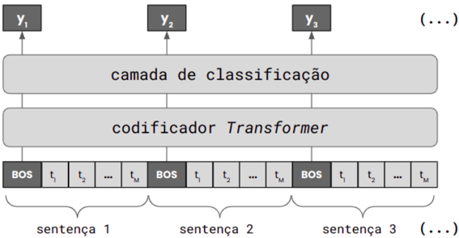

## Segmentação Textual Baseada em Tópicos em Português Utilizando BERTimbau

Luciano A. C. da Silva 1 , Maiara S. F. Rodrigues 1 , Adriana P. Archanjo 1 , Luis Pessoa 1 , Miguel L. Silva 1 , Thiago F. de Almeida 1 , Leonardo Silveira 2 ,

1 CPQD - Centro de Pesquisa e Desenvolvimento, Campinas, SP, Brasil

2 Pontifícia Universidade Católica de Campinas, SP, Brasil luciano.augusto.silva@usp.br, maiara.frodrigues2000@gmail.com, prestoarch@hotmail.com, { luisp, mfilho, tfelipea } @cpqd.com.br, leonardo.silveira@ga.ita.br

Abstract. In this work, we explore text segmentation for Portuguese using the BERTimbau model, with datasets derived from machine translation and online news sources. We obtained P k = 6 . 89 for an in-domain evaluation, but worse results in out-of-domain evaluations, highlighting the importance of a diverse training set to improve generalization across multiple domains.

Resumo. Neste trabalho, exploramos a segmentação textual para o português utilizando o modelo BERTimbau, com bases de dados construídas usando tradução automática e a partir de notícias online. Obtivemos P k = 6 , 89 para uma avaliação dentro do domínio, mas resultados piores em avaliações fora do domínio, destacando a importância de uma base de treinamento diversificada para melhorar a generalização em múltiplos domínios.

## 1. Introdução

Com o aumento na geração de conteúdo textual não estruturado, como transcrições automáticas de notícias, aulas e reuniões, há também um crescente interesse em extrair de forma eficiente informações relevantes desse material [Retkowski and Waibel 2024, Gklezakos et al. 2024]. Por exemplo, pode ser desafiador encontrar o início de um determinado tópico discutido na transcrição de uma longa reunião, a menos que essa transcrição esteja devidamente estruturada. A segmentação textual baseada em tópicos é uma tarefa de Processamento de Linguagem Natural (PLN) que divide um texto longo em segmentos não sobrepostos, de acordo com as mudanças de tópico [Hearst 1997]. Essa ferramenta permite estruturar e compreender melhor grandes volumes de dados, facilitando a busca e a extração de informações.

Há poucos trabalhos recentes sobre segmentação textual em português [Cardoso et al. 2017, Francisco 2018]. Neste artigo, exploramos a segmentação textual baseada em tópicos para o português, aplicando a abordagem proposta em [Yu et al. 2023], utilizando o modelo BERTimbau [Souza et al. 2023]. Construímos os conjuntos de dados de treinamento e teste por meio de tradução automática para o português, e utilizando notícias extraídas da internet.

## 2. Metodologia

Neste trabalho, utilizamos a abordagem proposta por [Yu et al. 2023] que trata a segmentação textual como um problema de classificação de uma sequência de sentenças, em que se deseja identificar a última sentença de cada tópico, ou seja, identificar as fronteiras dos segmentos. O componente principal é um modelo de linguagem pré-treinado do tipo Transformer encoder [Vaswani et al. 2023], que produz a representação contextual das sentenças do texto de entrada. Cada representação de sentença é usada na classificação de fronteira do segmento, conforme mostrado na Figura 1.

Figura 1. Estrutura do modelo de segmentação proposto por [Yu et al. 2023]

Em [Yu et al. 2023], além da tarefa principal de segmentação baseada em tópicos, são definidas duas tarefas auxiliares adicionais, Topic-aware Sentence Structure Prediction (TSSP) e Contrastive Semantic Similarity Learning (CSSL), com o objetivo de modelar a coerência textual e obter melhores resultados na segmentação. O modelo é treinado de forma supervisionada, otimizando a soma das perdas das três tarefas definidas, sobre um conjunto de treinamento devidamente anotado.

Neste trabalho, utilizamos datasets para o treinamento e a avaliação obtidos por meio de tradução automática para português ou construídos a partir de notícias em português extraídas da internet. Os datasets WikiSection e WIKI-50 foram usados por [Yu et al. 2023] e passaram pelo processo de tradução automática usando a API de tradução da Google. O dataset WikiSection [Arnold et al. 2019] foi usado para treinamento e avaliação, e consiste num conjunto de 38K artigos em inglês e alemão, nos domínios de doenças e cidades. Após a tradução, restaram 3.590 documentos no domínio de doenças e 19.539 documentos no domínio de cidades. O dataset WIKI-50 [Koshorek et al. 2018] foi usado apenas para avaliação, e consiste originalmente em um conjunto de 50 amostras em inglês, provenientes da Wikipedia.

Para a avaliação dos modelos, utilizamos também datasets em português construídos a partir de notícias extraídas com webscrapping do portal G1 1 (portal de notícias do Grupo Globo de Comunicação), e do canal de notícias do IBGE 2 (Instituto Brasileiro de Geografia e Estatística). Os documentos de texto foram formados pela concatenação aleatória de notícias, sendo cada notícia considerada um segmento de tópico diferente. No caso do dataset G1, foram gerados 454 documentos a partir de 1.300 notícias. Para o dataset IBGE, foram gerados 1.517 documentos a partir de 3.376 notícias.

1 https://g1.globo.com/tecnologia/noticia/2012/11/siga-o-g1-por-rss.html

2 https://servicodados.ibge.gov.br/api/docs/noticias?versao=3

Como o nosso objetivo é aplicar a segmentação para o português, substituímos o modelo usado em [Yu et al. 2023] pelo modelo BERTimbau [Souza et al. 2023], prétreinado para o português do Brasil. Utilizamos as versões BERTimbau Base (110M de parâmetros) e BERTimbau Large (335M de parâmetros) 3 .

O treinamento foi realizado em uma GPU NVIDIA T4, usando BERTimbau Base e Large, com 70% do dataset WikiSection em português, por 5 épocas, com learning rate de 5 × 10 -5 , batch size de 2 e gradiente acumulado de 2. Criamos sempre um modelo treinado com WiKiSection/cidades e o outro modelo treinado com WiKiSection/doenças. No caso do BERTimbau Large, o treinamento durou aproximadamente 2 dias e 5 horas para o conjunto de cidades e pouco mais de 11 horas para o conjunto de doenças.

A avaliação dos modelos seguiu a mesma linha de [Yu et al. 2023]. Usamos três métricas usuais para avaliação de segmentação textual: F 1 , P k [Beeferman et al. 1999], e WindowDiff [Pevzner and Hearst 2002]. No caso das métricas P k e WindowDiff , quanto menor o valor, melhor o desempenho. No caso da métrica F 1 , quanto maior o valor, melhor o desempenho. A avaliação dentro do domínio de treinamento foi realizada com 20% do dataset WikiSection em português. Os datasets WIKI-50, G1 e IBGE são usados apenas para avaliação fora do domínio de treinamento.

## 3. Resultados

As Tabelas 1 e 2 apresentam os resultados de avaliação dos modelos usando BERTimbau, criados e avaliados para o português, dentro do mesmo domínio, com os datasets WikiSection/cidades e WikiSection/doenças. Também são apresentados os resultados para o inglês correspondentes ao modelo BERT Base [Devlin et al. 2018], obtidos por [Yu et al. 2023].

Tabela 1. Resultados dos modelos criados e avaliados com o dataset WikiSection / cidades. BERT Base avaliado em inglês, BERTimbau em português.

| Modelo                          | F 1   | P k   | WD    |
|---------------------------------|-------|-------|-------|
| (en) BERT Base [Yu et al. 2023] | 80,16 | 8,22  | 10,19 |
| (pt) BERTimbau Base             | 87,41 | 7,07  | 8,55  |
| (pt) BERTimbau Large            | 87,59 | 6,89  | 8,37  |

Tabela 2. Resultados dos modelos criados e avaliados com o dataset WikiSection / doenças. BERT Base avaliado em inglês, BERTimbau em português.

| Modelo                          | F 1   | P k   | WD    |
|---------------------------------|-------|-------|-------|
| (en) BERT Base [Yu et al. 2023] | 68,26 | 18,29 | 22,06 |
| (pt) BERTimbau Base             | 76,91 | 17,16 | 19,45 |
| (pt) BERTimbau Large            | 77,77 | 16,55 | 18,76 |

As métricas de avaliação obtidas com os modelos BERTimbau para o português são melhores e próximas ` aquelas apresentadas por [Yu et al. 2023] em inglês. Neste caso, devemos considerar também que o modelo criado para o português usando BERTimbau Large é maior que o modelo usado em [Yu et al. 2023].

3 https://huggingface.co/neuralmind/bert-base-portuguese-cased

A Tabela 3 apresenta os resultados da avaliação de dois modelos criados para o português nos domínios de cidades e doenças, usando o BERTimbau Large, e avaliados fora do domínio de treinamento, nos datasets WIKI-50, G1 e IBGE.

Tabela 3. Avaliação fora do domínio de treinamento. Modelos com o BERTimbau Large criados com o dataset WikiSection/cidades e WikiSection/doenças.

| Dataset   | Modelo / cidades   | Modelo / cidades   | Modelo / cidades   | Modelo / doenças   | Modelo / doenças   | Modelo / doenças   |
|-----------|--------------------|--------------------|--------------------|----------------------|----------------------|----------------------|
|           | F 1                | P k                | WD                 | F 1                  | P k                  | WD                   |
| Wiki50    | 15,43              | 35,01              | 35,36              | 12,97                | 35,98                | 36,02                |
| G1        | 64,66              | 13,62              | 17,28              | 54,81                | 25,61                | 32,42                |
| IBGE      | 43,12              | 20,12              | 21,06              | 43,36                | 23,40                | 26,55                |

Odesempenho do modelo fora do domínio de treinamento foi inferior ao desempenho dentro do domínio. Os resultados foram melhores para o modelo treinado com o dataset WiKiSection/cidades. De fato, segundo [Arnold et al. 2019], o conteúdo do dataset WikiSection apresenta características distintas para cada domínio: WiKiSection/doenças é de domínio científico restrito com linguagem específica, enquanto WiKiSection/cidades é de domínio geral mais diverso, mais próximo de um conteúdo de notícias. Isso sugere que a composição de dados de treinamento pode ajudar a obter um modelo para segmentação textual que generalize melhor para múltiplos domínios.

## 4. Conclusão

Neste trabalho, exploramos a segmentação textual para o português, seguindo a abordagem de [Yu et al. 2023], mas utilizando o modelo pré-treinado para o português BERTimbau [Souza et al. 2023]. Empregamos bases de treinamento e teste construídas usando a tradução automática de bases existentes, além de bases de teste construídas a partir de notícias em português recuperadas da internet. Obtivemos ótimos resultados na segmentação de texto dentro do mesmo domínio para o português, semelhante ao que foi obtido por [Yu et al. 2023] para o inglês. Nossos resultados sugerem a eficácia do método empregado para a criação do modelo em português e a importância de usar uma base de treinamento de domínio diversificado para obter um modelo que generalize melhor para múltiplos domínios.

Para trabalhos futuros, pretendemos explorar modelos diferentes e buscar uma composição mais variada de dados de treinamento para obter um modelo que generalize melhor para vários domínios. Além disso, desejamos estudar a segmentação textual de transcrições automáticas obtidas com reconhecimento de fala, e explorar a segmentação de textos muito longos, considerando a típica limitação do contexto de entrada de modelos baseados em Transformer [Vaswani et al. 2023].

## Agradecimentos

Este projeto foi apoiado pelo Ministério da Ciência, Tecnologia e Inovações, com recursos da Lei no 8.248, de 23 de outubro de 1991, no âmbito do PPI-SOFTEX, coordenado pela Softex e publicado PDI 03, DOU 01245.023862/2022-14.

## Referências

Arnold, S., Schneider, R., Cudré-Mauroux, P., Gers, F. A., and L¨ oser, A. (2019). Sector: Aneural model for coherent topic segmentation and classification. Transactions of the Association for Computational Linguistics , 7:169-184.

Beeferman, D., Berger, A. L., and Lafferty, J. D. (1999). Statistical models for text segmentation. Machine Learning , 34:177-210.

Cardoso, P. C., Pardo, T. A., and Taboada, M. (2017). Subtopic annotation and automatic segmentation for news texts in brazilian portuguese. Corpora , 12(1):23-54.

Devlin, J., Chang, M., Lee, K., and Toutanova, K. (2018). BERT: pre-training of deep bidirectional transformers for language understanding. CoRR , abs/1810.04805.

Francisco, O. J. (2018). Recuperação de informação em atas de reunião utilizando segmentação textual e extração de tópicos. Dissertação de mestrado, Universidade Federal de São Carlos, Sorocaba.

Gklezakos, D. C., Misiak, T., and Bishop, D. (2024). Treeseg: Hierarchical topic segmentation of large transcripts. arXiv preprint arXiv:2407.12028 .

Hearst, M. A. (1997). Text tiling: Segmenting text into multi-paragraph subtopic passages. Computational linguistics , 23(1):33-64.

Koshorek, O., Cohen, A., Mor, N., Rotman, M., and Berant, J. (2018). Text segmentation as a supervised learning task. In Proceedings of the 2018 Conference of the North American Chapter of the Association for Computational Linguistics: Human Language Technologies, Volume 2 (Short Papers) , pages 469-473.

Pevzner, L. and Hearst, M. A. (2002). A critique and improvement of an evaluation metric for text segmentation. Computational Linguistics , 28(1):19-36.

Retkowski, F. and Waibel, A. (2024). From text segmentation to smart chaptering: A novel benchmark for structuring video transcriptions. In Proceedings of the 18th Conference of the European Chapter of the Association for Computational Linguistics (Volume 1: Long Papers) , pages 406-419.

Souza, F., Nogueira, R., and Lotufo, R. (2023). Bert models for brazilian portuguese: Pretraining, evaluation and tokenization analysis. Applied Soft Computing , 149:110901.

Vaswani, A., Shazeer, N., Parmar, N., Uszkoreit, J., Jones, L., Gomez, A. N., Kaiser, L., and Polosukhin, I. (2023). Attention is all you need.

Yu, H., Deng, C., Zhang, Q., Liu, J., Chen, Q., and Wang, W. (2023). Improving long document topic segmentation models with enhanced coherence modeling. In Bouamor, H., Pino, J., and Bali, K., editors, Proceedings of the 2023 Conference on Empirical Methods in Natural Language Processing , pages 5592-5605, Singapore. Association for Computational Linguistics.