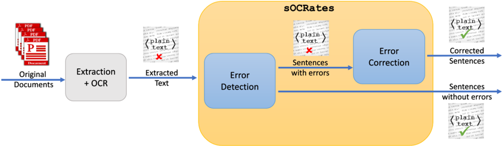
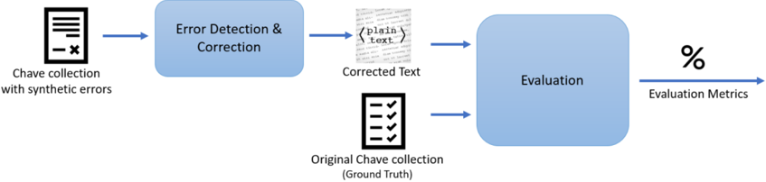

## sOCRates - a post-OCR text correction method

Danny Suarez Vargas, Lucas Lima de Oliveira, Viviane P. Moreira, Guilherme Torresan Bazzo, Gustavo Acauan Lorentz

1 Instituto de Informática - Universidade Federal do Rio Grande do Sul (UFRGS) Caixa Postal 15.064 - 91.501-970 - Porto Alegre - RS - Brazil

{ dsvargas,lloliveira,viviane,gtbazzo,galorentz } @inf.ufrgs.br

Abstract. A significant portion of the textual information of interest to an organization is stored in PDF files that should be converted into plain text before their contents can be processed by an information retrieval or text mining system. When the PDF documents consist of scanned documents, optical character recognition (OCR) is typically used to extract the textual contents. OCR errors can have a negative impact on the quality of information retrieval systems since the terms in the query will not match incorrectly extracted terms in the documents. This work introduces sOCRates , a post-OCR text correction method that relies on contextual word embeddings and on a classifier that uses format, semantic, and syntactic features. Our experimental evaluation on a test collection in Portuguese showed that sOCRates can accurately correct errors and improve retrieval results.

## 1. Introduction

A significant portion of textual information of interest to organizations is stored in PDF files. Reports, presentations, and contracts are typically shared as PDF documents and need to be converted into plain text before their contents can be processed by information retrieval (IR) or text mining systems. When the PDF file contains a scanned image of the text, it needs to undergo Optical Character Recognition (OCR) so that its textual contents can be extracted. The extraction process is not perfect, and thus the output text may contain errors that normally involve the exchange of characters.

Correcting extraction errors is a challenging task. It is possible that an extraction error generates another valid word (for example ball → bell ). Thus, the mere presence or absence of the word in the lexicon of the language does not provide a definitive decision as to whether its correct. In many cases, it is necessary to analyze the words that precede and follow the analyzed word and this increases the computational cost of the solution. In addition, the presence of acronyms, formulas, and proper nouns makes the task more difficult. Bazzo et al. [2020] found that word error rates of 5% and above pose a statistically significant decrease in the quality of the results of IR systems.

In this context, the post-OCR text correction task aims at fixing OCR extraction errors. It is a challenging task, and as a result, still an open research topic. In the last few years, the International Conference on Document Analysis and Recognition (ICDAR) [Chiron et al., 2017, Rigaud et al., 2019] organized two competitions for post-OCR text correction. The best performing approaches employ state-of-the-art methods, such as deep learning algorithms (bidirectional LSTMs) using BERT [Devlin et al., 2018] embeddings as input. The best results for the error detection task were less than 0.7 in terms of F1 in several languages [Rigaud et al., 2019], showing that there is still much room for improvement. A recent survey by Nguyen et al. [2021] reports on the most recent advances and calls for approaches that address languages other than English.

The errors associated with post-OCR text correction include not correcting a word that was incorrectly extracted and inserting errors in a word that was correctly extracted. We argue that the latter is more serious as it introduces noise that can affect downstream tasks.

In this work, we propose sOCRates 1 , a post-OCR text correction method aimed at fixing extraction errors. sOCRates works in two steps - error detection and error correction. Error detection relies on a fine-tuned BERT model. Error correction is modeled as a multi-class classification problem that used format, semantic, and syntactic features. Weperformed experiments to evaluate the quality of sOCRates for error correction ( i.e., an intrinsic evaluation). We also evaluated the impact that post-processing the text has on IR ( i.e., an extrinsic evaluation). The tests were done on the Chave collection [Santos and Rocha, 2004], which has news articles from Folha de São Paulo published in 1994 and 1995. To the best of our knowledge, this is the first work to assess post-OCR correction in Portuguese. The pattern of errors typically differs across languages. Thus, this is a language-dependent task. Our main findings can be summarized as follows.

- The error detection step is important to improve efficiency and to avoid inserting errors in correct words.
- It is easier to correct frequent words than rare words, and context plays a determinant role.
- A good performance in an intrinsic evaluation of error correction does not assure a good performance in an extrinsic ( i.e., downstream) task.

The remainder of this paper is organized as follows: Section 2 introduces fundamental concepts. Section 3 surveys the related literature. In Section 4, we present sOCRates . Section 5 discusses the intrinsic evaluation procedure. Then, the extrinsic evaluation on an IR context is presented in Section 6. Finally, Section 7 concludes this work, pointing out possibilities for future work.

## 2. Background

The work by Nguyen et al. [2019] presents a study on the types of errors found in the extraction of PDF documents. This section builds on that work. The authors also calculated the frequency of these errors using a set of monographs and newspapers produced between 1744 and 1921 in English and French.

The words extracted incorrectly can be classified into two types.

- Non-Words: are words that are not in the lexicon of words considered correct, for example ' oil ' → ' oll '.
- Real words: are extraction errors that end up generating a word that appears in the lexicon of correct words, for example, ' week ' → ' weak ';

Estimates by Nguyen et al. [2019] report that about 60% of errors are from real words while 40% are from non-words. Correcting errors that generate real words are

1 https://github.com/dannysv/sOCRates.git

more complex as they require that the context ( i.e., neighboring words in the sentence) are evaluated and this makes the method more costly from a computational point of view. The correction of non-words is also not trivial because it is difficult for a lexicon to contain all the possible correct words in a language - proper nouns, acronyms, several verb conjugations, and foreign words make this list incredibly large.

Segmentation errors are also frequent - they can be classified into two types.

- Incorrect Segmentation: occurs when a word is separated into two (or more), i.e., an unexpected space is inserted into the word, for example ' number ' → ' nu mber ' or ' validate ' → ' valid ate '.
- Incorrect Concatenation: occurs when two (or more) words are concatenated into one, i.e., the space is omitted, for example ' show image ' → ' showimage ' or ' in correct ' → ' incorrect '.

Segmentation problems are orthogonal to non-word and real word classification. Note that valid , ate and incorrect are corect words whereas nu , mber and showimage are not, and would not be in the lexicon. Estimates by Nguyen et al. [2019] report that incorrect segmentation is 2.3 times more frequent than incorrect concatenation and that the two types of errors do not usually occur together.

The correction of each type of error could be considered a challenging task by itself. So, in this work, we put special attention to the non-word error occurrences as they are the starting point for better approaches.

## 3. Related Work

In this section, we survey existing work on post-OCR text correction methods and on the impact of dealing with OCR-ed text for IR.

## 3.1. Post-OCR text correction

Existing work on dealing with texts extracted by OCR spans a long period of time during which various approaches to detect and correct errors were proposed [Droettboom, 2003, Evershed and Fitch, 2014, Nguyen et al., 2019, Parapar et al., 2009].

Most of the recent work on OCR post-processing was carried out within the framework of competitions organized by ICDAR (International Conference on Document Analysis and Recognition) in 2017 2 and 2019 3 . The competition divided the task into two subtasks: detecting OCR errors and correcting OCR errors. Among some of the differences between the two editions, the following stand out - in the 2017 edition, the two sub-tasks were considered as independent tasks, but in the 2019 edition, the second sub-task works on the results of the first; in the 2017 edition, two languages (English and French) were considered and, in 2019, eight additional languages (Bulgarian, Czech, Dutch, Finnish, German, Polish, Spanish, and Slovak) were also included. Still, Portuguese is not among the languages, which means there are no annotated datasets available. The top performing method in most languages was Context-based Character Correction (CCC), proposed by Clova AI 4 . It uses multilingual BERT 5 together with convolutional layers to address the

2 https://sites.google.com/view/icdar2017-postcorrectionocr

3 https://sites.google.com/view/icdar2019-postcorrectionocr

4 https://clova.ai/ocr

5 https://github.com/google-research/bert/blob/master/multilingual.md

error detection as a classification task. For error detection, CCC yields F1 scores between 67% (for English) and 95% (for German). In error correction, CCC achieved improvements from 6% (in Spanish) to 24% (in German) comparing to the uncorrected version. This wide variation across languages suggests that the characteristics of the language affect the correction task and corroborates the need for experimenting in more languages.

Analyzing the related bibliography, we observed that the solutions that obtain the best results use state-of-the-art techniques of Natural Language Processing. These techniques are being investigated and tested to assess their feasibility as part of our solution under development. It is worth mentioning, even the best results published in the literature are still far from perfect as they manage to detect about 75% of errors and correct an even smaller fraction of these.

## 3.2. Information Retrieval on OCR-ed text

Specifically, on the topic of improving IR on OCR-ed documents, Beitzel et al. [2003] researched several solutions - most of them dated to the late 1990s. More recently, TREC (Text REtrieval Conference) organized a task called confusion track to evaluate the effectiveness of retrieval in collections degraded by OCR errors. Their modified test collections had error rates of 5 to 20% (at the character level). The task organizers reported that counter-intuitive results were found and that 'there is still a lot to be understood about the interaction of the different approaches' [Kantor and Voorhees, 2000].

To assess the impact of OCR errors in retrieval quality, Croft et al. [1994] simulated errors by randomly selecting words to be discarded from the documents. These words were not indexed by the IR system. Then, they assessed retrieval quality on the original collection and on the collection that had discarded words. Their main finding was that performance degradation was more critical for very short documents. In a detailed investigation, Taghva et al. [1996] observed that, although retrieval results appear to have no significant degradation in the average of a set of queries, some individual queries can be quite impacted by OCR errors. They also found a very large increase in the number of indexing terms in the presence of errors and that relevance feedback methods were not robust to deal with OCR errors. Recently, Bazzo et al. [2020] systematically inserted errors into the Chave [Bazzo et al., 2020] collection (to simulate OCR errors) and measured the impact of these errors in retrieval quality. They found that a statistically significant degradation is observed when 5% or more words contain errors.

While existing work [Croft et al., 1994, Taghva et al., 1996, Bazzo et al., 2020] focused on assessing the degradation in IR performance caused by OCR errors, to the best of our knowledge, our work is the first to investigate how attempting to fix these errors impacts IR performance.

## 4. sOCRates

sOCRates works into two steps depicted in Figure 1. The input is the text of the PDF document extracted by third-party software. The extracted text is segmented into sentences, and each sentence goes through a filtering step to detect whether it has errors. The sentences considered incorrect are sent to the error correction module. The next subsections detail the two steps.

Figure 1. sOCRates and the pipeline for OCR extraction and correction.

## 4.1. Error Detection

The error detection step aims to identify whether the sentence requires correction. A naive way of doing this would be to analyze the text word by word using a lexicon of correct words. This process would require building such a resource and loading it into a data structure optimized for searching. In order to circumvent the need to go through the text in this way, we model this task as a binary classification problem. The training data are pairs composed of sentences (with and without grammatical errors) and a class that indicates the existence or absence of errors. The rationale is to use a classifier to identify sentences that need corrections, avoiding the need to go through the text word by word. Training is done offline and only once.

The state-of-the-art in text classification uses language models based on Transformers, such as BERT [Devlin et al., 2018]. BERT-based models are pre-trained on very large (plain) corpora to learn contextual relations between words (or sub-words). There are several pre-trained BERT-based models available for different languages and domains. The pre-trained models are then fine-tuned to perform specific downstream tasks. In our case, the task is to distinguish between correct and incorrect sentences. Fine-tuning requires an annotated dataset with correct and incorrect sentences.

## 4.2. Error Correction

Error correction is the most challenging step in this work. For sentences that were identified as having errors in the previous step, this step needs to identify the misspelled words and replace them with their correct versions. A side effect of correction, which should be minimized as much as possible, is the insertion of errors in correct words.

For words that have been identified as potentially wrong, the choice of the most appropriate correction is based different sources of evidence. First, the correction candidates are selected using two open-source spell checkers, namely ASpell 6 and SymSpell 7 . Both solutions are based on predefined lexicons and similarity metrics such as edit distance. SymSpell aims for fast processing using the Symmetric Delete spelling correction algorithm. It requires word frequency lists (to prioritize frequent words) of unigrams and bigrams. Bigrams are used to incorporate a bit of context to help choose the best correc-

6 http://aspell.net/

https://medium.com/@wolfgarbe/1000x-faster-spelling-correction-algo

7 rithm-2012-8701fcd87a5f

tion. Our procedure is to simply take the first k words suggested by these spell checkers as candidates.

To decide which of the candidate words is the most likely correction, we compute the following set of features:

- Word length difference (in pixels) - the corrected word should be similar in length to the extracted word since OCR tools prioritize characters with similar formats. Thus, a small difference in length helps indicate the expected corrected word.
- Word height difference (in pixels) - similar to the length feature, but for height.
- Is the first character uppercase ? - the first character to be capitalized may indicate that the word is a proper name and should not be fixed.
- Capitalized - an entire word in capital letters may indicate that it is an acronym, which should not be corrected.
- Syntactic similarity - the corrected word should be syntactically similar to the extracted word. We use two string similarity functions to measure syntactic similarity: ( i ) Jaro - a function that considers the number of transpositions between characters; and ( ii ) an adaptation of Levenshtein's edit distance, proposed here, to account for frequent changes, which we describe next.
- Semantic similarity - vector representation using embedding models has shown great potential to capture syntactic and semantic relatedness between words. In this feature, we use the cosine similarity between the vector representations of a pair of words.

Edit distance adapted to OCR error detection . The original edit distance metric assigns equal weights to any type of substitution between characters. However, it is known that OCR errors tend to involve visually similar characters. In order to address this aspect, we created a similarity function based on the Levenshtein distance, changing the way the weights are assigned to the substitutions. The greater the weight, the greater the score obtained for the string distance. The algorithm for our edit distance adapted for OCR correction can be found in the repository for sOCRates . Four categories of exchanges are considered: frequent exchange, rare exchange, frequent subsequent exchange, and rare subsequent exchange. The first two consider at only single character exchanges and have weights of 0 . 5 and 0 . 75 , respectively. The last two categories simulate exchanges between multiple characters (in our case, we limit to two characters). For that, we concatenate the characters with their predecessors and compute their frequency. Frequent subsequent exchanges weigh in at 0 . 5 and rare subsequent exchange at 0 . 8 . The intuition for setting these weights was that frequent exchanges should count as half a normal exchange. We consider that two simple exchanges or exchanges involving one to two (or two to one) characters are rare.

Classification algorithm . To choose which of the candidate words is the most suitable, we model this task as a classification problem with m +1 classes, where m is the number of candidates and the additional class is for cases in which the original word should be maintained (because it is not wrong or the expected correction is not within the candidates). The training instances are represented by the values of their features and the expected class ( i.e., the ground truth). These instances are fed into a supervised classification algorithm which learns a model that is then able to predict the expected output ( i.e., correction) for new (unseen) words.

Figure 2. Intrinsic evaluation pipeline

## 5. Intrinsic Evaluation

The goal of our intrinsic evaluation experiments is to assess the quality of sOCRates in detecting and correcting OCR errors. The experimental setup is depicted in Figure 2. Because we do not have an annotated dataset for this task in Portuguese, we resort to the dataset used by Bazzo et al. [2020] in which 25% of the words in the Chave collection [Santos and Rocha, 2004] had synthetic errors inserted. The errors involve character exchanges, insertion/removal of spaces between words, and insertion of erroneous symbols. The frequency of the errors is proportional to the frequencies observed in real cases. This way, they can be representative of the types of errors OCR tools usually insert.

This dataset goes through error detection and correction using sOCRates and the compared methods. In order to calculate the evaluation metrics, the outputs of the correction systems are compared against the ground truth, which in our case is the original Chave collection (without errors). The dataset used in our experiments is the sample with 14,017 documents (out of 103K) in which the errors were inserted. This sample has nearly 6 million tokens.

For the error detection step (see Section 4.1), the ideal dataset for fine-tuning the BERT-based classifier would contain real OCR extraction errors and their corrected versions. Since such a resource was not available, we adopted the strategy of using synthetically inserted errors by Bazzo et al. [2020]. Our fine-tuning was performed on a sample containing 10k sentences (out of 316,337 in the complete dataset), of which half were correct and half were incorrect. The BERT model was BERT-Base Multilingual Cased 8 trained on 104 languages, 12 layers, 768 hidden nodes, 12-heads, and 110M parameters.

For the error correction step (described in Section 4.2), we took a sample of 20K words (half correct and half incorrect) manually annotated with their corrected versions ( i.e., ground truth) and computed the features w.r.t three candidate corrections (two from SymSpell and one from ASpell). Then, we trained a Random Forest classifier and used the generated model to produce the corrections for unseen words. The semantic similarity feature used word2vec Mikolov et al. [2013] (SkipGram model, window size=5, and 200 dimensions).

The evaluation metrics are character error rate (CER) and word error rate (WER), which are widely used to assess OCR post processing. CER counts the number of character level operations that are required to transform the output into the ground truth and it is

8 https://github.com/google-research/bert/blob/master/multilingual.md

calculated as in Eq. 1. WER (Eq. 2) applies the same idea, but for word level operations.

<!-- formula-not-decoded -->

<!-- formula-not-decoded -->

where i , s , and d represent insertion, substitution, and deletion, respectively. n c and n w are the number of characters and words in the ground truth. These metrics were calculated using the OCREvaluation script 9 . Additionally, we also computed the ratio of incorrect words that were corrected (IWC) and the ratio of the correct words that were kept as such (CWK). Notice that CER and WER are error metrics, so lower scores are better. On the other hand, IWC and CWK measure accuracy , so the higher, the better.

Table 1 shows the results for sOCRates , ASpell, SymSpell, and the original text (without corrections). sOCRates outperforms the spell checkers and achieves the best scores for all metrics. These differences were considered statistically significant by z -tests (p-values &lt;&lt; 0.01 in all cases). In the accuracy metrics, our proposed approach was able to have a good balance between IWC and CWK.

ASpell is the worst performer in the error metrics, especially in CER in which it has more characters with errors than the original text. Looking at the accuracy metrics (IWC and CWK), we see that ASpell can keep a good proportion of correct words without modification, but it fails to correct more than half of the incorrect words. Despite its poor results, we noticed that there are a few cases in which ASpell is able to identify the expected correction and SymSpell is not. These cases tend to involve incorrect separation of a word or accented characters. For example, in 'ca usa' it was able to suggest 'causa' as the correction while SymSpell maintained the word as two separate tokens.

The CWK scores were similar for all three systems, meaning that, on average, they tend to insert errors in 20% of words that were originally correct, and this is an important limitation in the application of correction tools. sOCRates relies on candidates coming from both ASpell and SymSpell and, while it is able to improve their results, that comes at a computational cost. SymSpell takes 19 seconds to process 10K words while sOCRates takes 169. In addition, unlike the other spell checkers, sOCRates requires training for both error detection and correction.

Table 1. Error correction results. Best scores in bold. For CER and WER, lower is better. For ICW and CWK, higher is better.

|               |   CER ↓ |   WER ↓ | IWC ↑   | CWK ↑   |
|---------------|---------|---------|---------|---------|
| Original text |    3.77 |   25.76 | -       | -       |
| SymSpell      |    3.69 |   18.53 | 78%     | 79%     |
| ASpell        |    5.08 |   24.7  | 44%     | 80%     |
| sOCRates      |    3.02 |   15.12 | 82%     | 82%     |

9 https://github.com/impactcentre/ocrevalUAtion

Evaluating Error Detection . Besides analyzing the results of sOCRates for error correction, it is also useful to inspect the results of the error detection step on its own. Thus, we took the 10K sentences used for fine-tuning and used 80% for training and 20% for testing. This test showed that the classifier accuracy was 79% and 91% for identifying incorrect and correct sentences, respectively, averaging 84.5%.

Finally, to perform a simplified ablation study, we also computed the results of sOCRates without the filtering step ( i.e., all sentences go through the correction step). The scores are 4.55 and 16.33 for CER and WER, respectively. These results indicate that the filtering step prevents introducing errors in words that are correct. We examined sentences that were incorrectly classified to try and establish error patterns. The sentence ' Meu papel teve reiação com a turbulência hidrodinâmica. ' (My role was reiated to hydrodynamic turbulence.) was classified as correct, but it has an error - ' reiação ' should be ' relação '. We attribute this to the fact that BERT used a sub-word tokenizer (and not entire words). For a given sentence s and tokenizer t , the intuition is that the greater quantity of sub-words required by t to encode s means a greater probability of s containing errors. Thus, cases in which t requires only a few sub-words to encode s tend to indicate that s is a correct sentence. In this case, both rei and ação are common sub-words and lead the classifier to believe it was a correct word. Conversely, the sentence ' O local é frequentado por muita gente descolada, além de praticantes de jiu-jitsu - o que torna um assalto quase impossível. ' (The place is frequented by many cool people, in addition to jiu-jitsu practitioners - which makes a robbery almost impossible.) is correct, but it was identified as having errors. We noticed that the classifier tends to assign sentences with too many commas and hyphens as incorrect. Finally, this error detection experiment is similar to ICDAR sub-task 1, discussed in Section 3. Although a direct comparison with the results reported in ICDAR is not possible since the datasets are different, our results (84.5%) are above the average obtained by the best participating system (CCC) (which was 75% averaged, across eight languages).

## 6. Extrinsic Evaluation

Our extrinsic evaluation experiments aim to assess the impact that correcting OCR-ed text has on retrieval quality. The pipeline is detailed in Figure 3. The IR collection used was Chave. Different from the experiments in Section 5, where we used only the 14k documents in which errors had been inserted, here we use the complete collection (103K documents). The documents go through error detection and correction, then the corrected text is indexed. Apache Solr was our IR System. In all experimental runs, the ranking function was BM25, and the stemmer was the standard Portuguese LightStem. Chave has 100 queries and their corresponding relevance judgments ( i.e., the documents that should be retrieved for each query). Trec eval 10 was used to compute the standard IR metrics. Our focus was on three metrics ( i ) Mean Average Precision (MAP), which measures the proportion of relevant documents that were retrieved and how close they were to the top of the ranking; ( ii ) Pr@10 , which tells the ratio of relevant documents that were retrieved among the top ten results; and ( iii ) Relevant Retrieved , which simply counts the number of relevant documents retrieved for the complete set of queries. In all these metrics, higher scores are better.

10 https://trec.nist.gov/trec eval/

Figure 3. Extrinsic evaluation pipeline

The following experimental runs were performed:

- ASpell , with the documents corrected by ASpell.
- sOCRates , with the documents corrected by our proposed system.
- SymSpell , with the documents corrected by SymSpell.
- baseline , with the uncorrected documents.
- ideal , with the clean documents ( i.e., without the synthetic errors).

The results are presented in Table 2. The quality metric of the correction systems should be higher than the baseline , and close to the ideal scenario. The scores in Table 2 are marked with a glyph[star] if they are significantly better than the baseline, and with a † if there is no statistically significant difference between the score of the system and the score of the ideal run. Single-tailed paired t -tests with a confidence interval of 99% were performed. Both sOCRates and SymSpell were significantly better than the baseline in all three metrics and not different from the ideal scenario in terms of Pr@10. However, only SymSpell was able to achieve comparable scores in relation to the ideal case in terms of MAP. Again ASpell was the worst performer, being outperformed by the baseline in all metrics. We believe this is a consequence of analyzing each word separately, without taking the context into consideration.

Our results showed that sOCRates obtained the best scores for error correction, but it did not bring the biggest improvements in terms of retrieval quality. We attribute this difference to the fact that sOCRates tends to fix errors that affect more frequent words. However, for rare words, it has a higher chance of inserting an error. Because rare words have more weight in IR systems, this has a negative impact on the quality of the

Table 2. Extrinsic Evaluation Results - Information Retrieval Experiments

| Experimental Run   | MAP                                 | Pr@10                               | Relevant Retrieved              |
|--------------------|-------------------------------------|-------------------------------------|---------------------------------|
| ASpell sOCRates    | 0.208 0.243 glyph[star] glyph[star] | 0.230 0.303 glyph[star] glyph[star] | 769 937 glyph[star] glyph[star] |
|                    |                                     | †                                   |                                 |
| SymSpell           | 0.271 †                             | 0.318 †                             | 992                             |
| baseline           | 0.220                               | 0.277                               | 829                             |
| ideal              | 0.276                               | 0.320                               | 1030                            |

results. This can be seen, for example, in query 268, which has few relevant documents and seeks information about ethics and human cloning ( 'ética e a clonagem humana' ). In one of the documents in which errors were inserted, the single occurrence of one of these terms was 'cionagem' . While SymSpell was able to correct it to 'clonagem' , sOCRates suggested 'coragem' as the correction since it has a higher frequency than the expected correction. Nevertheless, in some queries, such as 263, which seeks for refereeing disputes in football ( 'disputas de arbitragem no futebol' ), sOCRates obtained better performance, correcting the wrong word 'futebolda' to 'futebol da' , while SymSpell changed to 'fute bolda' .

To mitigate cases in which the correctors insert errors instead of fixing them, we performed a further experiment in which we index both the original and the corrected version in the IR System. In this experiment, the MAP of sOCRates increased to 0.257, but Pr@10 had a very small drop (0.299). The biggest improvement was in terms of relevant retrieved, with an additional 64 relevant documents (1001 in total). These scores indicate that indexing both versions is better at enhancing recall rather than precision at the top ranks, with the cost of duplicating the size of the documents.

This work has some limitations. Our experiments are based on synthetic errors that simulate typical OCR extraction problems, while the ideal scenario would involve the use of a dataset with real errors. The difficulty of building such a dataset is that it requires significant effort of human annotators. In a step towards generating this resource, we developed an annotation system that shows chunks of extracted texts that seem to contain extraction errors (because it has words that are not present in a large lexicon), their extracted versions, and the original PDF. The annotator is asked to mark whether the extracted text is correct or to fix it if it is incorrect. This is still ongoing work. Another limitation is that we used a single dataset in our evaluation as it required an IR test collection, and Chave was the only collection in Portuguese available. Our main focus was on correcting non-words , but there is also the case in which an incorrect extraction yields a real word . In order to address this type of error, the context needs to be taken into consideration. In the current version of the work, the context is being limited to bigrams, and although it helps in some cases, such as the 'futebolda' example, it is not able to solve all cases. Finally, it is not clear whether our results would generalize to other languages - the performance by language in the ICDAR competitions had noticeable differences. Thus, further experiments with multilingual collections are needed.

## 7. Conclusion

This paper describes sOCRates , a post-OCR text correction method that relies on spell checkers, contextual word embeddings, and on a classifier that uses format and syntactic similarity features. We described the entire process of detecting and correcting errors and the resources used to build our system. Intrinsic and extrinsic experimental evaluations were performed on a test collection in Portuguese. sOCRates had the best results in the intrinsic evaluation. Conversely, in the IR experiments, it was outperformed by SymSpell, which was able to achieve results comparable to the ideal scenario. Still, sOCRates significantly improved retrieval metrics in relation to the baseline with errors.

We also identified that the error detection phase has a relevant role in the whole process as it is able to reduce processing time and error insertion. This is important since it is better to choose to keep the word without modifications instead of trying to correct it and insert new errors. Although the context was not fully explored in this work, it plays a determinant role in the correction phase, especially to correct real words. In addition, frequent words are easier to correct than rare ones, and it reflects directly in the extrinsic experiments, where rare words have more weight in the IR scoring functions. For future work, we plan to evaluate sOCRates using real datasets with OCR-ed documents, and improve how sentence context is modelled. Also, experimenting with further languages is needed to assess whether our results generalize.

Acknowledgments : This work was partially supported by Petrobras 2017/00752-3, CNPq/Brazil, and by CAPES Finance Code 001.

## References

- Guilherme Torresan Bazzo, Gustavo Acauan Lorentz, Danny Suarez Vargas, and Viviane P. Moreira. Assessing the impact of OCR errors in information retrieval. In Advances in Information Retrieval , pages 102-109, 2020.
- Steven M. Beitzel, Eric C. Jensen, and David A. Grossman. A survey of retrieval strategies for OCR text collections. In Symposium on Document Image Understanding Technologies , 2003.
- G. Chiron, A. Doucet, M. Coustaty, and J. Moreux. ICDAR 2017 Competition on Post-OCR Text Correction. In Intl. Conf. on Document Analysis and Recognition , volume 01, pages 1423-1428, 2017.
- W. Bruce Croft, Stephen Harding, Kazem Taghva, and Julie Borsack. An evaluation of information retrieval accuracy with simulated ocr output. In Symposium of Document Analysis and Information Retrieval , 1994.
- Jacob Devlin, Ming-Wei Chang, Kenton Lee, and Kristina Toutanova. Bert: Pre-training of deep bidirectional transformers for language understanding. arXiv preprint arXiv:1810.04805 , 2018.
- M. Droettboom. Correcting broken characters in the recognition of historical printed documents. In Joint Conference on Digital Libraries , pages 364-366, May 2003.
- John Evershed and Kent Fitch. Correcting noisy ocr: Context beats confusion. In Intl. Conference on Digital Access to Textual Cultural Heritage , DATeCH '14, pages 45-51, 2014.
- Paul B. Kantor and Ellen M. Voorhees. The TREC-5 confusion track: Comparing retrieval methods for scanned text. Information Retrieval , 2(2):165-176, May 2000.
- Tomas Mikolov, Ilya Sutskever, Kai Chen, Greg S Corrado, and Jeff Dean. Distributed representations of words and phrases and their compositionality. In Advances in Neural Information Processing Systems 26 , pages 3111-3119. 2013.
- T. Nguyen, A. Jatowt, M. Coustaty, N. Nguyen, and A. Doucet. Deep statistical analysis of OCR errors for effective post-OCR processing. In Joint Conference on Digital Libraries (JCDL) , pages 29-38, June 2019.
- Thi Tuyet Hai Nguyen, Adam Jatowt, Mickael Coustaty, and Antoine Doucet. Survey of post-ocr processing approaches. ACM Computing Surveys (CSUR) , 54(6):1-37, 2021.
- Javier Parapar, Ana Freire, and ´ Alvaro Barreiro. Revisiting n-gram based models for retrieval in degraded large collections. In Advances in Information Retrieval , pages 680-684, 2009.
- C. Rigaud, A. Doucet, M. Coustaty, and J. Moreux. Icdar 2019 competition on post-ocr text correction. In Intl. Conf. on Document Analysis and Recognition , pages 1588-1593, 2019.
- Diana Santos and Paulo Rocha. The key to the first clef with Portuguese: Topics, questions and answers in Chave. In Workshop of the Cross-Language Evaluation Forum for European Languages , pages 821-832, 2004.

Kazem Taghva, Julie Borsack, and Allen Condit. Evaluation of model-based retrieval effectiveness with ocr text. ACM Trans. Inf. Syst. , 14(1):64-93, January 1996.