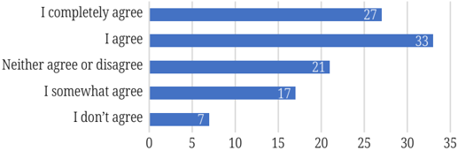
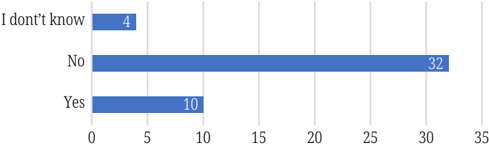
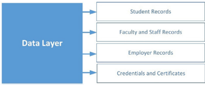
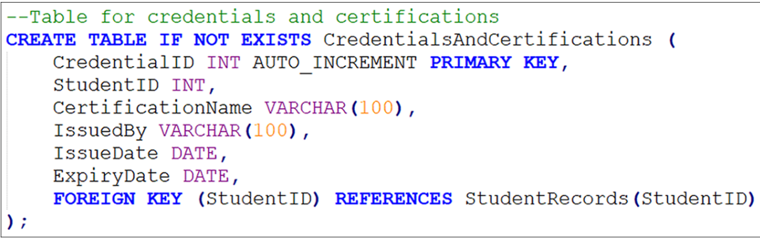
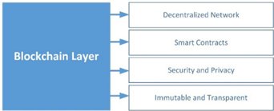
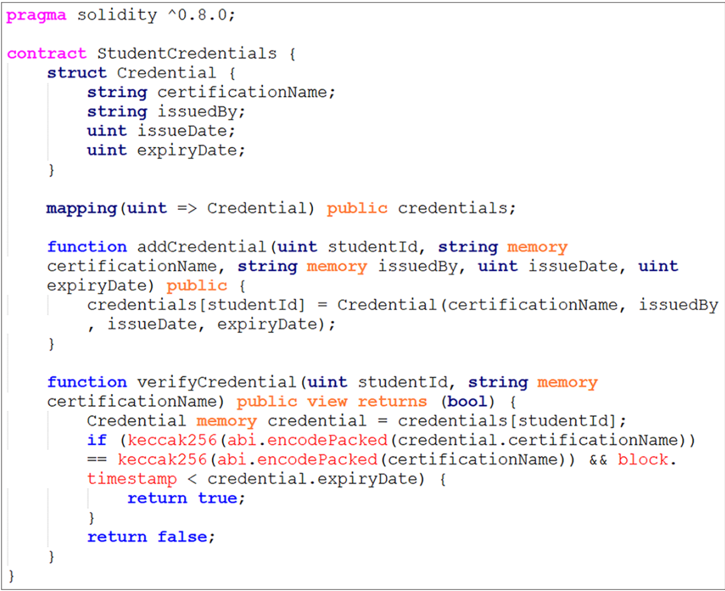
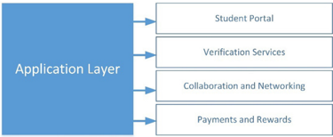
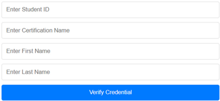
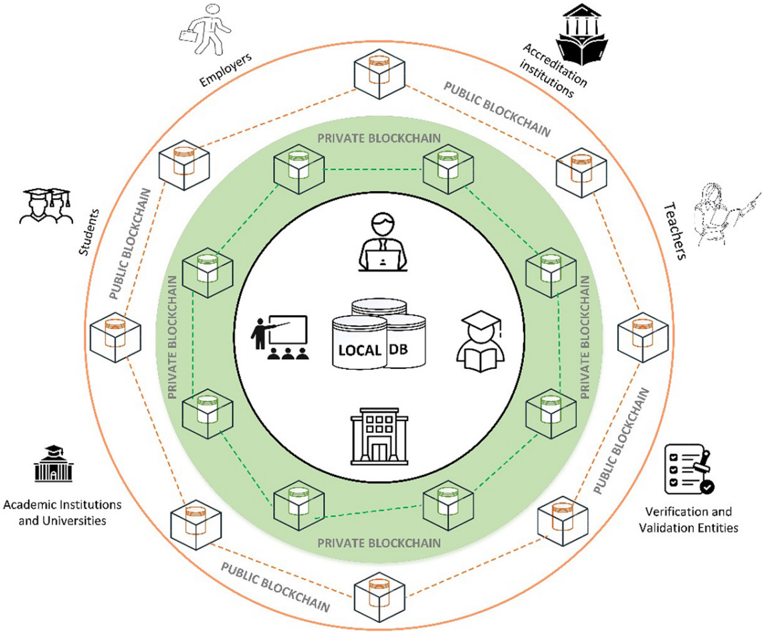

## JOE International Journal of Online and Biomedical Engineering

iJOE  |  eISSN: 2626-8493  |  Vol. 20 No. 9 (2024)  |

https://doi.org/10.3991/ijoe.v20i09.48999

## PAPER

## Trustworthy Verification of Academic Credentials through Blockchain Technology

Faton Kabashi 1,2 , Halil Snopçe 1 , Artan Luma 1 , Vehbi Neziri 2 (  )

## ABSTRACT

1 SEE University, Tetovo, North Macedonia

2 UBT - Higher Education Institution, Prishtina, Kosovo vehbi.neziri@ubt-uni.net

The  increasing  demand  for  a  secure  and  transparent  mechanism  for  verifying  academic credentials  has  led  to  the  exploration  of  blockchain  technology  (BT)  as  a  viable  solution. This paper presents a three-layered application for the reliable verification of academic cre -dentials,  leveraging  the  immutable and decentralized nature of BT. The system includes a data layer (DL), a blockchain layer (BL), and an application layer (AL). The DL records student records, faculty staff records, and credentials. The BL utilizes smart contracts to record and verify academic records, ensuring their authenticity and integrity. The AL provides a userfriendly  interface  for  various  stakeholders,  such  as  students,  educational  institutions,  and employers, to communicate with the system. This effort aims to determine how BT can be uti -lized to enhance the security, transparency, and efficiency of academic credential verification processes. Efficiency in academic credential verification processes ultimately contributes to a more reliable and effective educational ecosystem.

## KEYWORDS

blockchain technology (BT), academic credentials, verification, hash, decentralization

## 1 INTRODUCTION

Blockchain technology has ushered in a new era of innovation across various sectors, and higher education is no exception [1]. This technology, known for its decentralized and secure framework, has the potential to transform the way academic records are managed, stored, and verified [2]. Student records, including transcripts, degrees, certificates, and accomplishments, are stored in centralized databases in traditional sys -tems. However, this setup often leads to issues such as data integrity problems, privacy violations,  and  time-consuming  verification  procedures.  Traditionally,  the  manage -ment of student records, such as transcripts, degrees, certifications, and achievements, has been handled using centralized databases and human verification procedures [3]. However,  with  its  principles  of  transparency,  immutability,  and  decentralized  control, BT provides an effective solution to these issues. Blockchain-based solutions can

Kabashi,  F.,  Snopçe,  H.,  Luma,  A.,  Neziri,  V.  (2024).  Trustworthy  Verification  of  Academic  Credentials  through  Blockchain  Technology. International Journal of Online and Biomedical Engineering (iJOE) , 20(9), pp. 51-64. https://doi.org/10.3991/ijoe.v2 0i09.48999

Article submitted 2024-03-07. Revision uploaded 2024-04-17. Final acceptance 2024-04-17.

© 2024 by the authors of this article. Published under CC-BY.


significantly  enhance  the  security,  efficiency,  and  reliability  of  academic  and  career records.  By  utilizing  a  decentralized  and  tamper-proof  ledger,  student  records  are stored across a network of computers, eliminating the need for a central authority or a single point of failure [4]. With blockchain, credentials can be instantly verified because each  record  on  the  blockchain  is  cryptographically  secured  and  cannot  be  altered. This not only reduces the verification process but also decreases the likelihood of fraud -ulent claims, ensuring that the credentials presented by students or graduates are genuine and accurate. This ensures that every record is securely and transparently recorded as an immutable transaction, making any changes or additions traceable and auditable. Furthermore, blockchain facilitates the creation of a lifelong learning passport, where all educational achievements, from formal degrees to informal learning experiences, can be securely recorded and accessed. This approach allows students to have control over their academic records, which can be easily shared with potential employers or other educational institutions. It also facilitates the recognition of prior learning, making it easier for students to transfer credits between institutions or pursue further education  without  requiring  additional  courses.  Furthermore,  the  decentralization aspect of blockchain contrasts with the growing trend of decentralized education models, such as online learning platforms and open educational resources. By leveraging BT,  these  platforms  can  offer  authentic  and  recognized  credentials,  thereby  enhanc -ing their credibility and acceptance in the academic and professional realms. Taking into  consideration  the  results  gathered  through  the  methodology,  a  new  approach has been proposed where only the hash of the credentials is stored on the blockchain. This approach addresses concerns about data privacy when credentials are stored on a public blockchain. By implementing such a system, higher education institutions can leverage the advantages of blockchain to improve the management of student records, thus enabling a more reliable and efficient learning environment. In conclusion, the implementation of BT in higher education holds the promise of transforming the way academic credentials are managed, verified, and shared. Institutions can enhance the security, transparency, and effectiveness of their record-keeping operations by adopting a blockchain-based system. This can also promote greater mobility and trust among students and other stakeholders in the educational system.

## 2 METHODOLOGY

This  study  utilizes  a  comprehensive  and  multi-dimensional  methodology  to investigate the adoption and impact of BT in the higher education sector of Kosovo. Our goal is to gather diverse perspectives from current students, recent graduates, and  university  administrators  to  comprehensively  grasp  the  challenges,  opportunities,  and  practical  implications  of  integrating  BT  into  educational  processes. The detailed methodology is outlined in the subsections.

## 2.1 Questionnaire	for	active	students

A structured questionnaire was distributed among students from various universities in Kosovo to gather their views on using blockchain for the management of academic certificates and diplomas. The questionnaire aimed to assess participants' knowledge of BT, perceived advantages, and willingness to adopt such a system. Key questions included their understanding of BT, the potential benefits of academic credential  management,  and  any  concerns  they  might  have.  The  questionnaire used in this study was customized differently for current students and graduates. The questionnaire contained 15 specific questions for active students. According to

Figure 1, approximately 57% of both active and graduated students believe that BT can facilitate the verification of credentials.



Fig. 1. Student belief in blockchain for credential verification

## 2.2 Survey	for	graduates

A comprehensive survey comprising 17 questions was conducted with recent graduates to examine post-graduation challenges associated with academic certifi -cates and diplomas. The survey explored issues such as delays in issuing certificates, loss  or  damage  of  certificates,  difficulties  in  obtaining  duplicates,  and  concerns regarding the  security  and  authenticity  of  these  documents.  The  primary  aim  of the survey was to examine how BT could potentially address these challenges and streamline the verification process. As depicted in Figure 2, a significant number of graduate students have expressed a lack of trust in the current authenticity of their diplomas and certificates. They argue that their credentials, typically disseminated as scanned documents, are prone to forgery and fail to convey genuine authenticity.

Fig. 2. Graduated concerns regarding diploma/certificate security



## 2.3 Interviews	with	university	staff

The interviews were conducted with university personnel responsible for issuing certificates and diplomas. The aim was to gain insight into the existing manage -ment systems, challenges in ensuring authenticity, and the potential advantages and disadvantages of adopting BT. Key topics of discussion included current credential management  practices,  perceived  benefits  of  blockchain,  and  technical  require -ments for implementation. Furthermore, concerns were raised regarding privacy issues if credentials were to be stored on the blockchain, highlighting the need for secure and privacy-preserving measures. Solutions in such applications.

## 2.4 Data	analysis

The data collected from the questionnaires, surveys, and interviews was systematically  analyzed  to  identify  key  themes,  challenges,  and  opportunities  related  to blockchain adoption in higher education. The analysis focused on the stakeholders' awareness and acceptance levels, as well as the technical and administrative requirements for successful implementation, taking into account security issues.


## 2.5 Schema	design	approach

Based on the research findings, a blockchain-based system was designed to digi -tize student achievements. This proposed system addresses the identified challenges by offering a secure, transparent, and efficient method for credential management and ver -ification. The design emphasizes a high level of privacy, ensuring that academic infor -mation is protected while maintaining the integrity and authenticity of the credentials.

## 3 LITERATURE	REVIEW

Blockchain technology has found applications in various fields and is being explored in  many areas [5], such as economics, electronic voting [6], [7], and interoperability between multiple blockchains [8]. It can also be utilized in higher education. In addition, blockchain has also found applications in government services [9], open information [10], and many other fields. The integration of BT in higher education has been a subject of increasing interest among researchers [11]. This literature review examines various studies that have focused on the application of blockchain in academia, particularly in the management and verification of academic credentials. Alshahrani and colleagues [12] introduced the concept of the decentralized application for smart certif -icates (DASC), a system designed to create and distribute student certificates in higher education. They proposed a framework for verifying and disseminating certificates to ensure the authentication of traditional academic credentials while maintaining privacy and security in a blockchain network. This approach highlights the potential of blockchain to enhance the credibility and security of academic certificates. Abreu and the team [13] developed an architectural framework utilizing Ethereum smart contracts to register and retrieve student certificates issued by higher education institutions. They contend that this system provides improved automation, scalability, and cost-efficiency by eliminating the need for third-party oversight in transactions. Furthermore, it can prevent unauthorized use of data by individuals seeking personal gain, thus ensuring the integrity of academic records. Liang, Xiubo, and Qian Zhao [14] designed a blockchain driven platform for assessing students' comprehensive capabilities. Their system utilizes  'on-chain  and  off-chain'  data  to  provide  secure  and  reliable  data  exchange, employing  smart  contracts,  the  interplanetary  file  system  (IPFS),  and  web  services. This platform aims to enhance the value of data shared by university students and streamline the alignment between higher education and societal talent requirements. Mahamatov and colleagues [15] proposed a theoretical framework for implementing BT in two areas: education and science. The first scenario involves identifying a student's academic performance throughout their educational journey and creating a comprehensive overview of their academic activities. The second scenario focuses on identifying a student's strengths and weaknesses, enabling retrospective analysis of past mistakes, and facilitating adjustments in the learning process to address knowledge gaps. These studies collectively demonstrate the potential of BT to revolutionize the management, verification, and utilization of academic credentials in higher education. By providing secure,  transparent,  and  efficient  systems,  blockchain  can  significantly  contribute  to the  reliability  and  effectiveness  of  educational  processes  and  outcomes.  Higher  edu -cation is not immune to the transformative impact of BT, and provides a comprehensive overview of the potential future applications of this technology in education [16]. By providing a decentralized and secure framework, BT has the potential to transform the recording and verification of student credentials, achievements, and career paths [17]. Utilizing the principles of transparency, immutability, and decentralized control, blockchain-based solutions can enhance the security, efficiency, and reliability of academic

and career records within higher education institutions. Traditionally, the management of student records, such as transcripts, degrees, certifications, and achievements, has been conducted using centralized databases and human verification procedures [3]. These systems often encounter challenges related to data integrity, privacy breaches, and time-consuming verification processes. Additionally, the dependence on digital or paper-based records that are susceptible to loss or tampering poses significant challenges in guaranteeing the accuracy and authenticity of students' academic accomplishments. By providing a decentralized and tamper-proof ledger, BT offers a game-changing solu -tion to these issues. Student records are stored on a distributed network of computers in a blockchain-based academic and career record system, eliminating the need for a central authority or single point of control [18]. Every record is securely and transparently stored as an immutable transaction, enabling traceability and auditability of any changes or additions. Additionally, BT offers a high level of data security and privacy protection due to the use of cryptographic algorithms. The ability to selectively share information with employers, other educational institutions, or other relevant stakeholders while ensuring data confidentiality enables students to maintain ownership and control over their academic records. This paper explores potential blockchain applications in higher education and proposes a blockchain-based academic and career record system within this context. By utilizing a blockchain-based academic and career record system, higher education institutions can improve the security, transparency, and effi -ciency of student record management. This technology provides benefits [19], such as improved data integrity, simplified verification processes, reduced administrative bur -dens, and increased trust among stakeholders. However, challenges such as regulatory compliance, interoperability, and user adoption must be addressed to fully harness the potential of blockchain in higher education. The authors [20] highlight the potential of BT to revolutionize the education sector while emphasizing the need to address privacy concerns. Another approach by the authors [21] is to verify micro-credentials, emphasiz -ing the necessity of a reliable and secure strategy for leveraging blockchain technology.

Privacy remains a primary concern in most research studies on BT. To address this issue, our paper proposes a comprehensive design schema for a blockchain-based academic and career record system specifically tailored for higher education insti -tutions. This system leverages BT to transform the management and verification of students, credentials, and achievements while implementing measures to guarantee data privacy and security. By utilizing a decentralized and secure database, our system ensures enhanced security, transparency, and efficiency throughout various academic and administrative tasks [22]. Furthermore, our approach is based on the findings of numerous research studies that demonstrate the significant potential of BT across various sectors. By addressing the critical issue of privacy in the blockchain industry, we aim to fully harness the benefits of this technology.

## 4 PROPOSED	BLOCKCHAIN	APPROACH

Our proposed blockchain schema for higher education consists of three fundamental  layers:  the  data  layer,  the  blockchain  layer  (BL),  and  the  application  layer  (AL). The DL serves as the foundation, encompassing the storage and management of student  records,  including  personal  information,  course  details,  grades,  certifications, and other relevant data. By leveraging a decentralized database, data integrity and immutability are upheld, removing the need for a centralized authority and minimizing the risk of unauthorized access or tampering. The BL serves as the underlying technology, offering a robust framework for secure and transparent transactions [23]. It  leverages cryptographic algorithms, such as digital signatures and encryption, to


ensure the authenticity, privacy, and security of data exchanges within the system [24]. Additionally,  consensus  mechanisms,  such  as  proof-of-work  or  proof-of-stake,  are employed to validate and verify the accuracy of transactions, reinforcing the trustworthiness of the system. On top of the BL lies the AL, which includes a variety of user-friendly interfaces and functionalities for students, faculty, employers, and other stakeholders [25]. This layer facilitates access to academic records, collaborative oppor -tunities,  verification  services,  payment  processing,  and  rewards  systems.  Through intuitive interfaces, users can effortlessly navigate the system, ensuring a seamless and efficient user experience. By implementing this blockchain-based academic and career record system, higher education institutions can unlock numerous benefits. These include enhanced data security, reduced administrative burdens, streamlined verification processes, increased transparency, and improved trustworthiness in the academic ecosystem. However, challenges such as regulatory compliance and interoperability need to be addressed to fully harness the potential of BT in higher education.

Based on these principles, our proposed blockchain scheme for the higher education sector is designed with three distinct layers to ensure a secure and efficient system for obtaining and verifying academic credentials. These layers include the DL, the BL, and the AL.

Data layer: The  DL  is  the  foundational  component  of  the  system,  responsible for  storing  and  managing  student  records,  faculty  and  staff  information,  creden -tials, and certifications. It is a repository for various types of data, including personal details, course information, grades, and achievements. This layer ensures data integrity, security, and accessibility by providing mechanisms for data validation, storage, and retrieval. Additionally, it may include functionalities for data synchronization, backup, and recovery, as well as data governance policies to maintain data quality and privacy standards. The DL plays a crucial role in managing and providing reliable access to student records and information within the blockchain-based academic and career record system for higher education. In the proposed blockchain-based academic and career record system for higher education, Figure 3 illustrates the DL, which securely stores and manages various types of digital records, including:

- Student records: Each student's academic and career records, such as courses taken, grades, certificates, and achievements, are stored as digital records.
- Faculty and staff records: Information regarding faculty and staff members, such as qualifications, employment history, and professional development activ -ities, is digitally recorded.
- Employer records: Data related to employers, such as job postings, internships, and recruitment history, are stored securely.
- Credentials  and  certificates: Digital  versions  of  certificates,  diplomas,  and other credentials earned by students are recorded in this layer.

Fig. 3. Data layer



By centralizing these records in the data layer, the system enhances data accessibility,  integrity,  and  security,  thereby  improving  the  efficiency  of  academic  and career processes in higher education. In our case, as shown in Figure 4, we have

added 'student credentials' to store student credentials, which can be customized to meet project requirements.

Fig. 4. Data layer



Blockchain layer: The core of the system, the BL, ensures a secure framework for  managing  academic  credentials.  It  upholds  data  integrity,  transparency,  and immutability  through  decentralization  and  secure  transactions.  Decentralization allows multiple network nodes to validate transactions, while cryptographic algorithms secure them. Key features include:

- Consensus  mechanism: Provides  network-wide  agreement  on  transactions, preventing fraud.
- Immutable ledger: Once recorded, transactions cannot be altered, ensuring the integrity of data.
- Transparency: Enables  all  network  participants  to  access  and  verify  transaction data.

In our proposed system for higher education, the BL is included (see Figure 5).

- Decentralized  network: Operates without a central authority, enhancing security.
- Smart  contracts: Automate processes like grade verification and tran -script issuance.
- Security  and  privacy: Data  is  safeguarded  by  cryptographic  algorithms  and consensus mechanisms.
- Immutable and transparent: Provides a tamper-proof record of all transac -tions and changes.

Fig. 5. Blockchain layer



In our system, we selected Ethereum as the blockchain platform for its robust support and active community [26]. We use Solidity to develop smart contracts on Ethereum. Figure 6 illustrates a smart contract designed for adding and verifying student  credentials.  Integration  between  the  DL  and  the  blockchain  is  achieved through an API that interacts with the smart contract, facilitating data exchange.

Fig. 6. Smart contract to add and verify credentials




The  application  binary  interface  (ABI)  for  the  contract  contains  information about the 'add credential' and 'verify credential' functions, as well as the structure of the credential. It is generated as a JSON string during contract compilation and is utilized by client applications to interact with the contract functions and blockchain data.

Application layer: This layer is crucial for providing functionalities and interfaces  to  users  within  a  blockchain-based  academic  and  career  record  system  for higher education. It offers a variety of features to students, faculty, employers, and other stakeholders, as depicted in Figure 7. Key features include:

- Student portal: Provide students with access to their records, such as grades and transcripts, through a web or mobile app.
- Verification services: Provides third-party organizations with the ability to ver -ify a student's records directly from the blockchain.
- Collaboration and networking: Facilitates collaboration by providing a platform for sharing projects and networking.
- Payments and rewards: Integrates  payment  processing  for  various  transactions, ensuring secure and efficient transactions.

Fig. 7. Application layer



The AL ensures user-friendliness, accessibility, and compatibility. It uses an API (Figure 8) to interact with the BL and verify credentials.

```
const express require('express const Web3 require ( web3 ) const database require( Idatabase ) ; const app express () const web3 new Web3 ( http: /localhost:8545 ) Ethereum node URL const contractAddress contract address 1 / Address of the smart contract const contractABI [] 1 / Smart contract ABI const contract new web3 eth.Contract (contractABI, contractAddress) app use (express.json () ) ; app.post ( ' /verify-credential (req, res) const studentId , certificationName req.body ; 1 / Check if the student exists database.query ( SELECT FROM StudentRecords WHERE StudentID [studentId] (err, result) => if (err) return res status (500) json ( { error: Internal server error if (result.length 0) return res status (404) . json ( { error: Student not found ' } ) 1 / Verify credentials using smart contract contract methods verifycredential(studentId certificationName) call () then ( (isValid) => res.json ( { valid: isValid catch ( (error) => res status (500) .json ( { error: Error verifying credential' } ) }) }) ; const PORT 3000 app listen (PORT , () => console . log Server running on port $ { PORT} ` )
```

Fig. 8. API

Figure 9 presents a possible interface that could be part of the AL, showcasing how users might interact with the system to access and manage academic records, verify credentials, and utilize other functionalities provided by the blockchain-based academic and career record system. This interface is designed to be user-friendly and intuitive, ensuring a seamless experience for students, faculty, employers, and other stakeholders engaging with the platform.

## Student Verification Portal

Fig. 9. Application layer view




Our proposed blockchain scheme for higher education integrates three layers to  manage and verify academic credentials, enhancing security, transparency, and efficiency. This system empowers students with greater control over their records, enables seamless verification of credentials, and fosters collaboration. It  provides a secure platform for storing and managing student data, utilizing smart contracts for data access and verification, and ensuring data integrity and privacy. This blockchain-based system has the potential to transform higher education by providing a more reliable, transparent, and efficient way of managing academic records. To ensure privacy while enabling the sharing and verifica -tion  of  student  credentials,  we  propose  a  two-step  approach  within  the  BL  of our system.

- Hashing of credential transactions: The hash of a diploma or higher education certificate can be generated using a cryptographic hash function, which takes the digital representation of the certificate as input and produces a fixed-size string of characters, usually expressed as a hexadecimal number.

For example, consider the following credentials: diploma\_data = ' Name: Ambla Prishtina, Degree: Bachelor of Science, Major: Computer Science, University: Kosova University, Date: February 17, 2008 .' The hash generated for these credentials could be: e3b0c44298fc1c149afbf4c8996fb92427ae41e4649b934ca495991b7852b855. This hash is a unique identifier for the certificate and can be used to verify its integ -rity and authenticity without revealing the actual content of the certificate. When the certificate is stored on a blockchain, the hash can be used to confirm that the cer -tificate has not been tampered with. Any alteration to the original document would result in a different hash value. For example, a university can generate the hash of a diploma and register it on the blockchain. When an employer or another institution needs to verify a diploma, they can acquire a digital copy of it, generate the hash, and compare it with the hash stored on the blockchain. If individuals match, they can be confident that the diploma is authentic and has not been modified.

- Database  connection  for  detailed  verification: When  a  thorough  verification of the credentials is required, we establish a connection to a secure database where the complete details of the student's credentials are stored. This  database  connection  is  initiated  only  when  necessary  and  is  protected by robust security measures to prevent unauthorized access. The verification process involves comparing the hash of the credential stored on the blockchain with the hash of the equivalent credential in the database. If the hashes match, it confirms the authenticity of the credential without revealing its content on the blockchain.

This approach offers several benefits:

- Privacy preservation: By storing only hashes of transactions on the blockchain, we safeguard the privacy of student credentials while still utilizing the blockchain's security and immutability.
- Efficient verification: The utilization of hashes enables rapid and effective ver -ification of credentials without the necessity of revealing sensitive information on the blockchain.
- Flexibility: The connection to a database for detailed verification offers flexibil -ity in accessing complete credentials when necessary, without compromising the efficiency of the blockchain.

This  proposal  aims  to  develop  a  system  that  ensures  security  and  privacy when sharing and verifying student credentials within higher education. It combines the advantages of BT with traditional database systems to achieve this goal. Figure 10 provides a comprehensive view of a hybrid system that integrates BT with traditional systems. The inner layer reflects the traditional system, where academic institutions manage their data using conventional databases and systems. This layer encompasses the existing infrastructure and processes that are in place to handle student records, enrollment, and other academic information. The middle layer is a private blockchain that can be used for academic purposes, where access to the network is restricted. This layer provides a higher level of security and control over the stored data, which is crucial for higher education institutions to manage sensitive information. The private blockchain can be utilized to automate and streamline academic processes, such as issuing digital certificates, verifying academic credentials, and maintaining immutable records of student achievements.

In the outer layer, a public blockchain is depicted, where academic credentials are stored as hashes of the credentials. This method allows for full transparency by enabling public access, but it also preserves the privacy of the data since only the hash is stored on the blockchain. The public blockchain can be utilized to verify the authenticity of academic credentials without disclosing the actual data, thereby ensuring the integrity of the verification process.

Fig. 10. Blockchain system view



Overall, this layered approach combines the traditional system with private and public blockchains, offering a balance between security, privacy, and transparency in managing and verifying academic credentials.


## 5 CONCLUSIONS

This paper has explored the transformative potential of BT in revolutionizing the management and verification of academic credentials within the higher education sector. Our proposed three-layered blockchain schema, consisting of the DL, the BL, and the AL, offers a comprehensive approach to enhancing the security, transpar -ency, and efficiency of academic credential verification processes. A key innovation within the BL is the storage of only the hashes of academic credentials, enabling easy verification without the need to check for any modifications. This strategy effec -tively safeguards the privacy of sensitive student information while preserving the integrity and authenticity of the records. By leveraging the immutable and transparent nature of BT, this layer provides a robust solution to the challenges faced by the traditional credential verification system, including vulnerability to fraud, data tam -pering, and lengthy verification processes. Our study emphasizes the importance of  students  and  university  staff  embracing  BT  to  handle  academic  credentials. The  proposed  approach  addresses  the  identified  challenges  by  offering  a  decen -tralized, tamper-proof system that simplifies the verification process and reduces administrative burdens.

In conclusion, the integration of BT into higher education has the potential to fundamentally alter the way academic credentials are issued, managed, and verified. By implementing the proposed blockchain approach, educational institutions can enhance the reliability and efficiency of their credential verification processes. This advancement fosters greater trust among stakeholders and lays the foundation for a more secure and streamlined educational system, with the hashing of credential transactions being a particularly effective solution.

## 6 REFERENCES

- [1] A.  Alam,  'Platform  utilising  blockchain  technology  for  elearning  and  online  educa -tion  for  open  sharing  of  academic  proficiency  and  progress  records,'  in Smart  Data Intelligence , R. Asokan, D. P. Ruiz, and Z. A. Baig, S. Piramuthu, Eds. , Springer, Singapore, pp. 307-320, 2022. https://doi.org/10.1007/978-981-19 -3311-0\_26
- [2] S. T. Siddiqui, M. Fakhreldin, and S. Alam, 'Blockchain technology for IoT based edu -cational  framework  and  credentials,'  in 2021  International  Conference  on  Software Engineering  &amp;  Computer  Systems  and  4th  International  Conference  on  Computational Science and Information Management (ICSECS-ICOCSIM) ,  2021, pp. 194-199. https://doi. org/10.1109/ICSECS52883.2021.00042
- [3] C.  Kontzinos,  P.  Kokkinakos,  S.  Skalidakis,  O.  Markaki,  V.  Karakolis,  and  J.  Psarras, 'Decentralised qualifications' verification and management for learner empowerment, education reengineering and public sector transformation: The QualiChain project,' in eLmL 2020: The Twelfth International Conference on Mobile, Hybrid, and On-line Learning , 2020, pp. 43-47.
- [4] L.  Meria,  Q.  Aini,  N.  P.  L.  Santoso,  U.  Raharja,  and  S.  Millah,  'Management  of  access control for decentralized online educations using blockchain technology,' in 2021 Sixth International Conference on Informatics and Computing (ICIC) ,  2021, pp. 1-6. https://doi. org/10.1109/ICIC54025.2021.9632999
- [5] U.  Bodkhe,  S.  Tanwar,  K.  Parekh,  P.  Khanpara,  S.  Tyagi,  N.  Kumar,  and  M.  Alazab, 'Blockchain for industry 4.0: A comprehensive review,' IEEE Access , vol. 8, pp. 79764-79800, 2020. https://doi.org/10.1109/ACCESS.2020.2988579

- [6] V.  Neziri,  I.  Shabani,  R.  Dervishi,  and  B.  Rexha,  'Assuring  anonymity  and  privacy  in electronic voting with distributed technologies based on blockchain,' Applied Sciences , vol. 12, no. 11, p. 5477, 2022. https://doi.org/10.3390/app12115477
- [7] V. Neziri, R. Dervishi, and B. Rexha, 'Survey on using blockchain technologies in electronic voting systems,' in 25th International Conference on Circuits, Systems, Communications and  Computers  (CSCC) ,  Crete  Island,  Greece,  2021,  pp.  61-65. https://doi.org/10.1109/ CSCC53858.2021.00019
- [8] B.  Rexha, V. Neziri, and R. Dervishi, 'Enhancing trustworthiness and interoperability of  electronic  voting  systems  through  blockchain  bridges,' HighTech  and  Innovation Journal , vol. 4, no. 4, pp. 749-760, 2023. https://doi.org/10.28991/HIJ-2023-04-04-04
- [9] V. Neziri, R. Dervishi, and B. Rexha, 'Blockchain invoicing for government services,' in UBT International Conference , Prishtine, 2021.
- [10] V. Neziri and B. Abazi, 'Blockchain for open information governance: A new era of data sharing,' in UBT International Conference , Prishtine, 2023.
- [11] F.  Kabashi,  V.  Neziri,  H.  Snopce,  A.  Luma,  A.  Aliu,  and  L.  Shkurti,  'The  possibility  of blockchain  application  in  higher  education,'  in 12th  Mediterranean  Conference  on Embedded  Computing  (MECO) ,  Budva,  Montenegro,  2023,  pp.  1-5. https://doi.org/ 10.1109/MECO58584.2023.10154919
- [12] A.  Mona,  N.  Beloff,  and  M.  White,  'Revolutionising  higher  education  by  adopting Blockchain  technology  in  the  certification  process,'  in International  Conference  on Innovation and Intelligence for Informatics, Computing and Technologies (3ICT) , 2020.
- [13] A. W. S. Abreu, E. F. Coutinho, and C. I. M. Bezerra, 'A blockchain-based architecture for query and registration of student degree certificates,' in 14th Brazilian Symposium on Software Components, Architectures, and Reuse , 2020. https://doi.org/10.1145/ 3425269.3425285
- [14] X.  Liang  and  Q.  Zhao,  'On  the  design  of  a  blockchain-based  student  quality  assessment  system,'  in 2020  International  Conference  on  High  Performance  Big  Data  and Intelligent Systems (HPBD&amp;IS) , 2020, pp. 151-160. https://doi.org/10.1109/HPBDIS49115. 2020.9130584
- [15] E. P. Fedorova and E. I. Skobleva, 'Application of blockchain technology in higher edu -cation,' European Journal of Contemporary Education ,  vol.  9,  no.  3,  pp.  552-571,  2020. https://doi.org/10.13187/ejced.2020.3.552
- [16] M. J. Fleener, 'Blockchain technologies: A study of the future of education,' in Journal of Higher Education Theory and Practice , 2022, vol. 22, no. 1.
- [17] S. T. Siddiqui, M. Fakhreldin, and S. Alam, 'Blockchain technology for IoT based educa -tional framework and credentials,' in International Conference on Software Engineering &amp;  Computer  Systems  and  4th  International  Conference  on  Computational  Science  and Information Management (ICSECS-ICOCSIM) ,  2021, pp. 194-199. https://doi.org/10.1109/ ICSECS52883.2021.00042
- [18] L.  Meria,  Q.  Aini,  N.  P.  L.  Santoso,  U.  Raharja,  and  S.  Millah,  'Management  of  access control  for  decentralized  online  educations  using  blockchain  technology,'  in Sixth International Conference on Informatics and Computing (ICIC) ,  2021, pp. 1-6. https://doi. org/10.1109/ICIC54025.2021.9632999
- [19] L.  K.  Ramasamy  and  F.  Khan,  'Utilizing  blockchain  for  a  decentralized  database  of educational credentials,' Blockchain for Global Education ,  pp.  19-35,  2024. https://doi. org/10.1007/978-3-031-52123-2\_2
- [20] A. D. Samala, D. Mhlanga, L. Bojic, N.-J. Howard, and D. P. Coelho, 'Blockchain technology in education: Opportunities, challenges, and beyond,' International Journal of Interactive Mobile  Technologies  (iJIM) ,  vol.  18,  no.  1,  pp.  20-42,  2024. https://doi.or g/10.3991/ ijim.v1 8i01.46307


- [21] H.  A.  Alsobhi,  R.  A.  Alakhtar,  A.  Ubaid,  O.  K.  Hussain,  and  F.  K.  Hussai,  'Blockchainbased micro-credentialing system in higher education institutions: Systematic literature review,' Knowledge-Based  Systems ,  vol.  265,  p.  110238,  2023. https://doi.org/10.1016/ j.knosys.2022.110238
- [22] P. Dutta, T.-M. Choi, S. Somani, and R. Butala, 'Blockchain technology in supply chain operations: Applications, challenges and research opportunities,' Transportation Research Part E: Logistics and Transportation Review ,  vol. 142, p. 102067, 2022. https:// doi.org/10.1016/j.tre.2020.102067
- [23] A. Carelli, A. Palmieri, A. Vilei, F. Castanier, and A. Vesco, 'Enabling secure data exchange through the IOTA tangle for IoT constrained devices,' Sensosrs ,  vol. 22, no. 4, p. 1384, 2022. https://doi.org/10.3390/s22041384
- [24] V.  Hassija, S. Zeadally, I. Jain, A. Tahiliani, V. Chamola, and S. Gupta, 'Framework for determining the suitability of blockchain: Criteria and issues to consider,' Transactions on Emerging Telecommunications Technologies , vol. 32, no. 10, p. e4334, 2021. https://doi. org/10.100 2/ett.4334
- [25] M. S. Khan, M. Woo, K. Nam, and P. K. Chathoth, 'Smart city and smart tourism: A case of Dubai,' Sustainability , vol. 9, no. 12, p. 2279, 2017. https://doi.org/10.3390/su9122279
- [26] G. A. Oliva, A. E. Hassan, and Z. M. Jiang, 'An exploratory study of smart contracts in the Ethereum blockchain platform,' Empir. Software Eng., vol. 25, pp. 1864-1904, 2020. https://doi.org/10.1007/s10664-019-09796-5

## 7 AUTHORS

Faton Kabashi is  a  Ph.D.  candidate  at  the  Faculty  of  Contemporary  Sciences and Technologies, Southeast European University in North Macedonia. He is also employed as a Mathematics Lecturer at the University for Business and Technology in Kosovo. His research interests include mathematics, blockchain, machine learning, and algorithm optimization (E-mail: fk29821@see u.edu.mk).

Halil Snopçe is an Associate Professor at the Faculty of Contemporary Sciences and Technologies at Southeast European University in North Macedonia. He holds a  PhD degree in Computer Science and Applied Mathematics. His research inter -ests  include  mathematics, parallel computation, and signal processing algorithms (E-mail: h.snopce@see u.edu.mk).

Artan Luma is  a  Full  Professor  at  the  Faculty  of  Contemporary  Sciences  and Technologies, Southeast European University in North Macedonia. He holds a PhD degree in Computer Science. His research interests include computer security, cyber -security, and networking (E-mail: a.luma@see u.edu.mk).

Vehbi  Neziri is  an  Assistant  Professor  at  the  University  for  Business  and Technology in Kosovo. He holds a PhD degree in Computer Science. His research interests  include  software  engineering,  biometrics,  electronic  voting,  blockchain, machine learning, and language proofing tools (E-mail: vehbi.neziri@ubt -uni.net).