## Tutorial Banco de horas de Discente e Creditação de Atividades Complementares e Extensão no SIGAA

2022

SUPERINTENDÊNCIA DE TECNOLOGIA DA INFORMAÇÃO - UFC PRÓ-REITORIA DE EXTENSÃO - UFC PRÓ-REITORIA DE GRADUAÇÃO - UFC

## Contexto

- ❖ Operacionalização da Curricularização - SIGAA
- ❖ Não duplicar creditação de extensão e atividade complementar
- ❖ Validação PROGRAD e CPACs
- ❖ Demanda das coordenações
- ❖ Efetivação do papel dos supervisores de extensão

## Apresentação

Este tutorial é dedicado aos membros discentes, docentes e  técnico-administrativos  da  Universidade  Federal  do  Ceará (UFC).

Possui como finalidade principal apresentar e instruir sobre os  procedimentos  de  ' creditação  de  horas de Atividades Complementares e de Extensão (modalidade I da curricularização  da  extensão)',  por  meio  do  uso  de  novas funcionalidades que foram implementadas no SIGAA - Sistema Integrado de Gestão de Atividades Acadêmicas .

No passo a passo demonstrado, a seguir, será percebida a facilidade  de  todo  o  processo,  feito  de  modo  autônomo  pelo discente, seguro aos Cursos de graduação, célere e dinâmico.

Aproveitem todos!

Etapas do procedimento no SIGAA: passo a passo, da composição do ' banco de horas do discente ' à ' creditação das horas de Atividades Complementares e de Extensão '

## Etapas do procedimento no SIGAA

1. Discente compõe seu banco de horas;
2. Discente aguarda e acompanha a situação de deferimento das horas lançadas no banco;
3. Docente responsável (Coordenador do Curso/ Supervisor/ CPAc) analisa bancos de horas discentes;
4. Docente analisa e conclui (defere/ indefere) horas solicitadas no banco;
5. Discente acompanha  deferimento  das  horas, etapa resultante da análise de seu Curso de Graduação;
6. Discente  realiza  a  Integralização  (lançamento  no  seu histórico  escolar)  das  horas  exigidas  e  deferidas  pelo Curso - procedimento feito uma única vez .

## Discente compondo seu banco de horas no SIGAA Atividades Complementares / Extensão

Para compor o banco de horas na Modalidade I - Participação em Ações de Extensão , a participação discente deve ser registrada na equipe das ações.

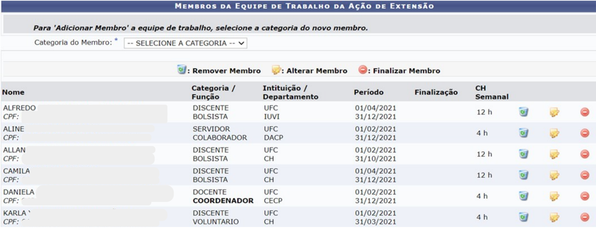

| Membros DE Trabalho DA AçÃo ExtensÃo                                             | Membros DE Trabalho DA AçÃo ExtensÃo                                             | Membros DE Trabalho DA AçÃo ExtensÃo                                             | Membros DE Trabalho DA AçÃo ExtensÃo                                             | Membros DE Trabalho DA AçÃo ExtensÃo                                             | Membros DE Trabalho DA AçÃo ExtensÃo                                             | Membros DE Trabalho DA AçÃo ExtensÃo                                             | Membros DE Trabalho DA AçÃo ExtensÃo                                             | Membros DE Trabalho DA AçÃo ExtensÃo                                             |
|----------------------------------------------------------------------------------|----------------------------------------------------------------------------------|----------------------------------------------------------------------------------|----------------------------------------------------------------------------------|----------------------------------------------------------------------------------|----------------------------------------------------------------------------------|----------------------------------------------------------------------------------|----------------------------------------------------------------------------------|----------------------------------------------------------------------------------|
| Para 'Adicionar Menbro equipe de trabalho, selecione a categoria do novo membro. | Para 'Adicionar Menbro equipe de trabalho, selecione a categoria do novo membro. | Para 'Adicionar Menbro equipe de trabalho, selecione a categoria do novo membro. | Para 'Adicionar Menbro equipe de trabalho, selecione a categoria do novo membro. | Para 'Adicionar Menbro equipe de trabalho, selecione a categoria do novo membro. | Para 'Adicionar Menbro equipe de trabalho, selecione a categoria do novo membro. | Para 'Adicionar Menbro equipe de trabalho, selecione a categoria do novo membro. | Para 'Adicionar Menbro equipe de trabalho, selecione a categoria do novo membro. | Para 'Adicionar Menbro equipe de trabalho, selecione a categoria do novo membro. |
| Categoria do Membro:                                                             |                                                                                  |                                                                                  |                                                                                  |                                                                                  |                                                                                  |                                                                                  |                                                                                  |                                                                                  |
|                                                                                  | Remover Membro                                                                   | Alterar Membro                                                                   | Finalizar Membro                                                                 | Finalizar Membro                                                                 | Finalizar Membro                                                                 | Finalizar Membro                                                                 | Finalizar Membro                                                                 |                                                                                  |
|                                                                                  | Categoria 7 Função                                                               | Intituição / Departamento                                                        | Periodo                                                                          | Nome                                                                             | CH Semanal                                                                       | CH Semanal                                                                       |                                                                                  |                                                                                  |
| CPF;                                                                             | DISCENTE BOLSISTA                                                                | UFC IUVI                                                                         | 01/04/2021 31/12/2021                                                            | ALFREDO                                                                          | 12 h                                                                             |                                                                                  |                                                                                  |                                                                                  |
| ALINE CPF;                                                                       | SERVIDOR COLABORADOR                                                             | UFC DACP                                                                         | 01/02/2021 31/12/2021                                                            |                                                                                  | 4 h                                                                              |                                                                                  |                                                                                  |                                                                                  |
| ALLAN CPF:                                                                       | DISCENTE BOLSISTA                                                                | UFC CH                                                                           | 01/02/2021 31/10/2021                                                            |                                                                                  | 12 h                                                                             |                                                                                  |                                                                                  |                                                                                  |
| CPF:                                                                             | DISCENTE BOLSISTA                                                                | UFC CH                                                                           | 01/04/2021 31/12/2021                                                            | CAMILA                                                                           | 12 h                                                                             |                                                                                  |                                                                                  |                                                                                  |
| DANIELA                                                                          | DOCENTE COORDENADOR                                                              | UFC CECP                                                                         | 01/02/2021 31/12/2021                                                            | CPF:                                                                             | 4 h                                                                              |                                                                                  |                                                                                  |                                                                                  |
| KARLA                                                                            | DISCENTE VOLUNTARIO                                                              | UFC CH                                                                           | 01/02/2021 31/03/2021                                                            | CPF:                                                                             | 4 h                                                                              |                                                                                  |                                                                                  |                                                                                  |

## Discente compondo seu banco de horas no SIGAA Atividades Complementares / Extensão

O lançamento da frequência e o gerenciamento de membros da equipe é feito pelo(a) coordenador(a) da ação de extensão, nos botões Lançar Frequência e Gerenciar Membros respectivamente.

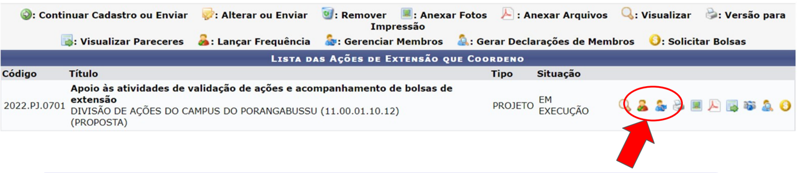

A PREX disponibiliza, nos links abaixo, tutoriais e  manuais para  o uso das funcionalidades:

- -Lançamento de frequência &gt; www.prex.ufc.br/tutorial-frequencia
- -Gerenciamento de membros &gt; www.prex.ufc.br/gerenciaequipe

## Discente compondo seu banco de horas no SIGAA Atividades Complementares / Extensão

- -Para compor o banco de horas, a participação do(a) discente na ação já deve ter sido encerrada pelo(a) coordenador(a) extensionista;
- -A carga horária a ser aproveitada é somente aquela lançada na frequência da ação de extensão pelo(a) coordenador(a) extensionista;
- -Recomendamos que o lançamento da frequência seja mensal;
- -Todas as ações devem lançar frequência , com ou sem bolsista;
- -No caso de bolsistas , o lançamento de frequência é, exclusivamente, entre os dias 15 a 22 de cada mês . Não é permitido lançamento retroativo.
- -O gerenciamento de membros e lançamento de frequência de voluntários tem o prazo máximo de 60 dias para registro. Veja os exemplos:

Exemplo  1: em  casos  alterações  na  equipe  (registro  de  início  ou  fim  de  participação  e alteração de carga horária)

Coordenador deseja realizar alteração ocorrida na ação no mês de janeiro. O registro no sistema deve ser feito até março. Após esse período, só será possível registrar a alteração a partir de fevereiro.

Exemplo 2: lançamento de frequência de voluntários.

A frequência do mês de abril, por exemplo, poderá ser lançada de abril a junho. Em julho, o(a)  coordenador  só  conseguirá  lançar  frequência  de  maio  a  julho.  Caso  não  haja lançamento no período adequado a frequência será zero.

## Discente compondo seu banco de horas no SIGAA Atividades Complementares / Extensão

Após acessar o sistema SIGAA com dados de usuário e senha, clique em:

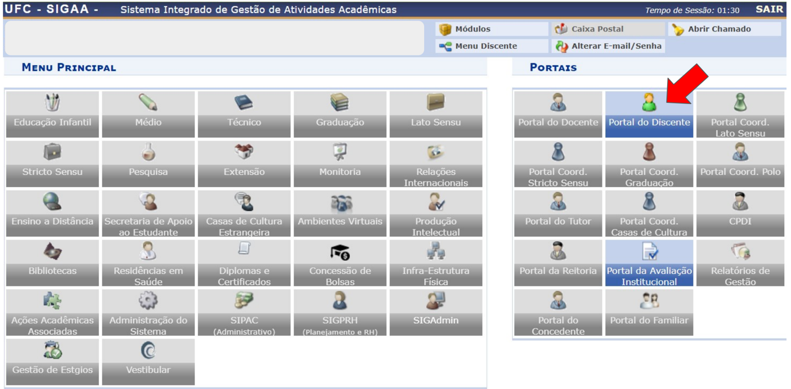

## Discente compondo seu banco de horas no SIGAA Atividades Complementares / Extensão

Clique em Ensino &gt; Atividades Complementares e Extensão &gt; Solicitação de Creditação de Horas, como demonstrado na tela abaixo:

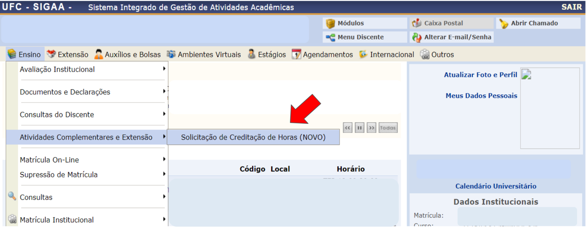

## Discente compondo seu banco de horas no SIGAA Atividades Complementares / Extensão

A tela inicial do banco de horas do discente no SIGAA é dividida em 4 (quatro) seções principais :

- ❖ Atividades  de  Extensão  do  Discente  na  UFC -  apresenta  a listagem das ações do discente vinculadas à PREX - Pró-Reitoria de Extensão, a serem creditadas como 'Atividade Complementar' ou 'Extensão' (modalidade I da curricularização da extensão).
- ❖ Outras Atividades -permite creditar, como 'Atividade Complementar' ou 'Extensão', ações realizadas em outras instituições,  ou  realizadas  na  própria  UFC  e  que  não  estejam listadas acima.
- ❖ Solicitações de Creditação Submetidas - seção que contém as horas cadastradas/ creditadas pelo discente, por ação.
- ❖ Acompanhamento  de  horas  deferidas e integralizadas -permite  acompanhar  o status do  banco  de  horas  e  realizar  a Integralização.

## Discente compondo seu banco de horas no SIGAA Atividades Complementares / Extensão

Cadastrando ( + ) horas provenientes de uma ação do discente vinculada à PREX:

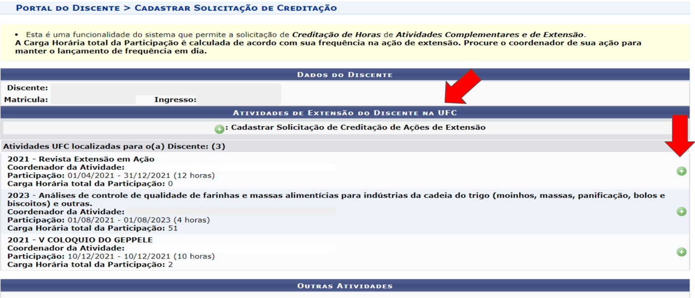

## Discente compondo seu banco de horas no SIGAA Atividades Complementares / Extensão

Cadastrando ( + ) horas provenientes de uma ação do discente vinculada à PREX:

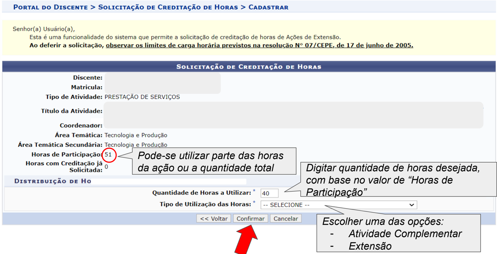

## Discente compondo seu banco de horas no SIGAA Atividades Complementares / Extensão

Cadastrando horas provenientes de Outras Atividades:

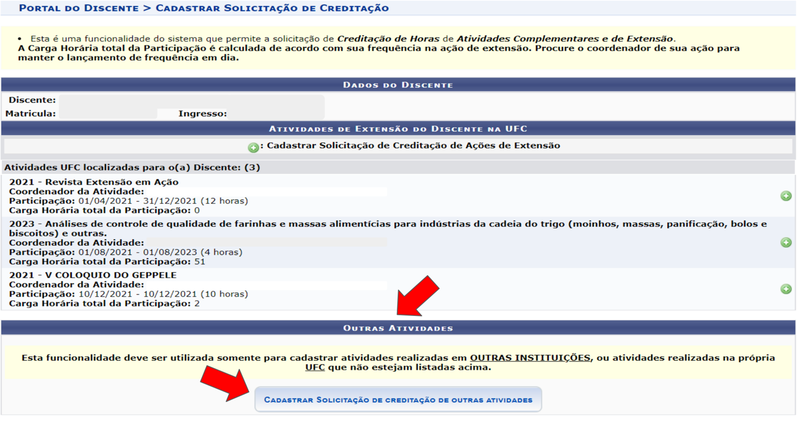

Status

## Discente compondo seu banco de horas no SIGAA Atividades Complementares / Extensão

Cadastrando horas provenientes de Outras Atividades - preencha a tela:

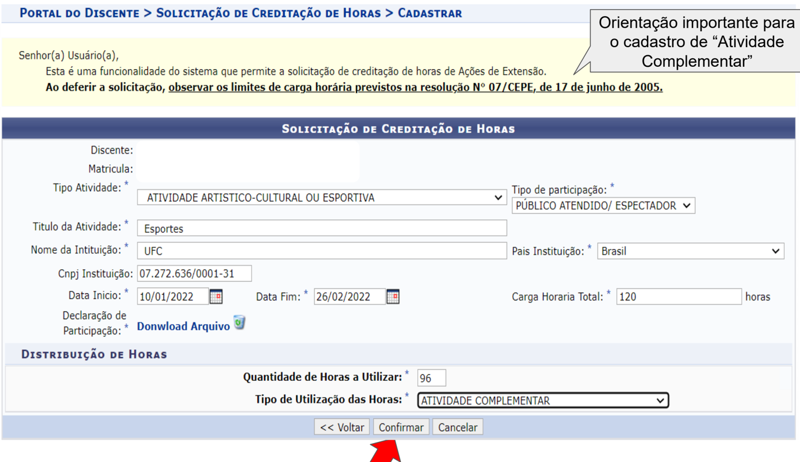

## Discente acompanhando situação das horas lançadas no banco

Acesse o SIGAA &gt;  Ensino &gt; Atividades Complementares e Extensão &gt; Solicitação de Creditação de Horas:

## Discente acompanhando situação das horas lançadas no banco

Acompanhe, na terceira seção da tela, as ações já cadastradas/ submetidas:

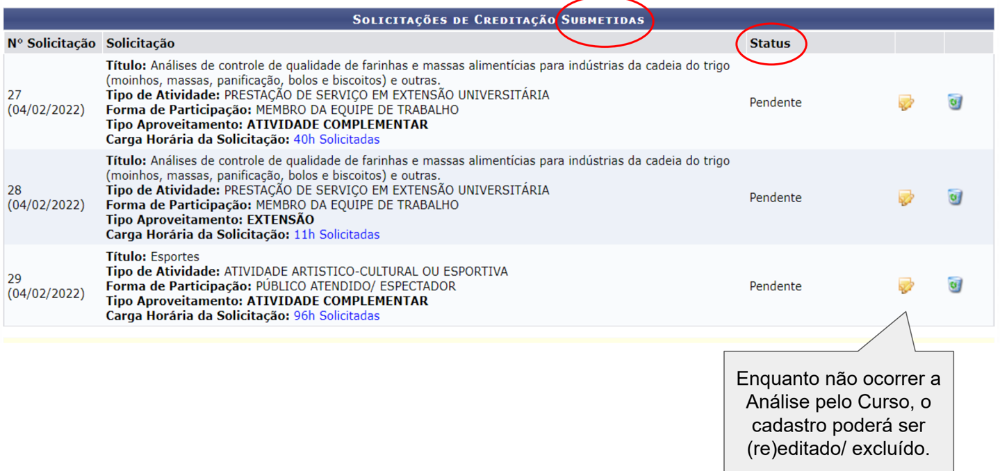

## Discente acompanhando situação das horas lançadas no banco

Acompanhe, na última seção da tela, as situações dos bancos de horas de Atividade Complementar / Extensão do discente:

- Integralização é 0 processo de registro na carga horária total deferida no Histórico Escolar
- Para que seja possível realizar integralização, as Horas em Solicitações Deferidas das categorias de aproveitamento EXTENSÃO e ATIVIDADE COMPLEMENTAR devem ser maiores ou iguais às Horas Pendentes .
- A Integralização das solicitações de aproveitamento poderá ser realizada uma única vez.

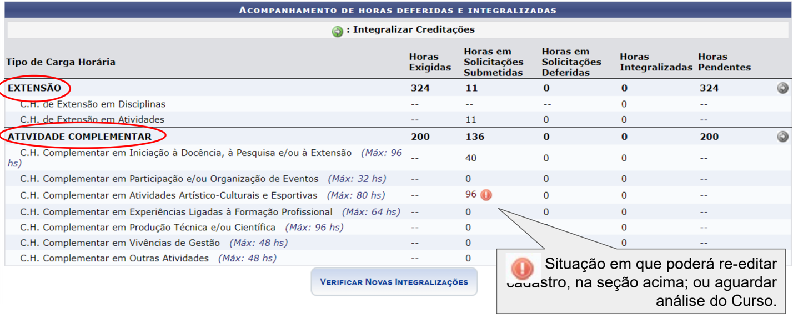

| AcoMPANHAMENTO DE HORAS DEFERIDAS E INTEGRALIZADAS                             | AcoMPANHAMENTO DE HORAS DEFERIDAS E INTEGRALIZADAS   | AcoMPANHAMENTO DE HORAS DEFERIDAS E INTEGRALIZADAS   | AcoMPANHAMENTO DE HORAS DEFERIDAS E INTEGRALIZADAS                                         | AcoMPANHAMENTO DE HORAS DEFERIDAS E INTEGRALIZADAS   | AcoMPANHAMENTO DE HORAS DEFERIDAS E INTEGRALIZADAS   | AcoMPANHAMENTO DE HORAS DEFERIDAS E INTEGRALIZADAS   |
|--------------------------------------------------------------------------------|------------------------------------------------------|------------------------------------------------------|--------------------------------------------------------------------------------------------|------------------------------------------------------|------------------------------------------------------|------------------------------------------------------|
| Integralizar Creditações                                                       | Integralizar Creditações                             | Integralizar Creditações                             | Integralizar Creditações                                                                   | Integralizar Creditações                             | Integralizar Creditações                             | Integralizar Creditações                             |
| Tipo de Carga Horária                                                          | Horas Exigidas                                       | Horas em Solicitações Submetidas                     | Horas em Solicitações Deferidas                                                            | Horas Integralizadas                                 | Horas Pendentes                                      | Horas Pendentes                                      |
| EXTENSÃO                                                                       | 324                                                  |                                                      |                                                                                            |                                                      | 324                                                  |                                                      |
| em Disciplinas                                                                 |                                                      |                                                      |                                                                                            |                                                      |                                                      |                                                      |
| CHde Extensão em Atividades                                                    |                                                      | 11                                                   |                                                                                            |                                                      |                                                      |                                                      |
| TIVIDADE COMPLEMENTAR                                                          | 200                                                  | 136                                                  |                                                                                            | 0                                                    | 200                                                  |                                                      |
| C.H. Complementar em Iniciação à Docência, à Pesquisa elou à Extensão (Máx: 96 |                                                      | 40                                                   | 0                                                                                          | 0                                                    |                                                      | hs)                                                  |
| C.H Complementar em Participação elou Organização de Eventos (Máx: 32 hs)      |                                                      |                                                      |                                                                                            | 0                                                    |                                                      |                                                      |
| C.H. Complementar em Atividades Artístico-Culturais Esportivas (Máx: 80 hs)    |                                                      | 96                                                   |                                                                                            | 0                                                    |                                                      |                                                      |
| C.H. Complementar em Experiências Ligadas à Formação Profissional (Máx: 64 hs) |                                                      |                                                      |                                                                                            |                                                      |                                                      |                                                      |
| C.H. Complementar em Produção Técnica elou Científica (Máx: 96 hs)             |                                                      |                                                      |                                                                                            |                                                      |                                                      |                                                      |
| C.H. Complementar em Vivências de Gestão (Máx: 48 hs)                          |                                                      |                                                      |                                                                                            |                                                      |                                                      |                                                      |
| C.H. Complementar em Outras Atividades (Máx: 48 hs)                            | VERIFICAR NovAs INTEGRALIZAÇÕES                      |                                                      | Situação em que poderá re-editar  cadastro, na seção acima; ou aguardar  análise do Curso. |                                                      |                                                      |                                                      |

Passível de indeferimento. Valor acima do Limite Máximo estabelecido na Res. 07/CEPE/2005.

## Docente responsável - Coordenador do Curso/ Supervisor/ CPAc - analisando bancos de horas discentes

Após acessar o sistema SIGAA com dados de usuário e senha, clique em:

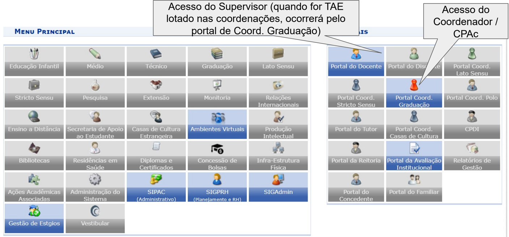

Não Definido

## Docente responsável - Coordenador do Curso/ Supervisor/ CPAc - analisando bancos de horas discentes

Clique em Atividades &gt; Curricularização de Atividades Complementares/ Extensão, &gt; Solicitação de Creditação de Horas &gt; Analisar, como demonstrado na tela abaixo:

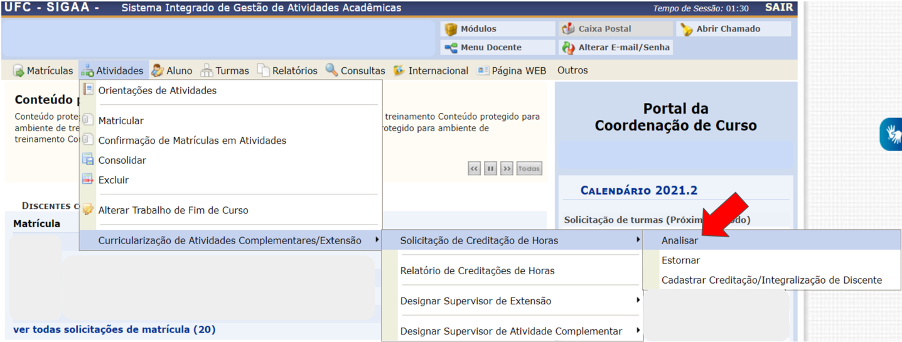

## Docente responsável - Coordenador do Curso/ Supervisor/ CPAc - analisando bancos de horas discentes

A  análise  do  membro  do  Curso  poderá  ser  por  consulta  a  um  discente,  ou  por cadastros submetidos, que se apresentam listados na tela:

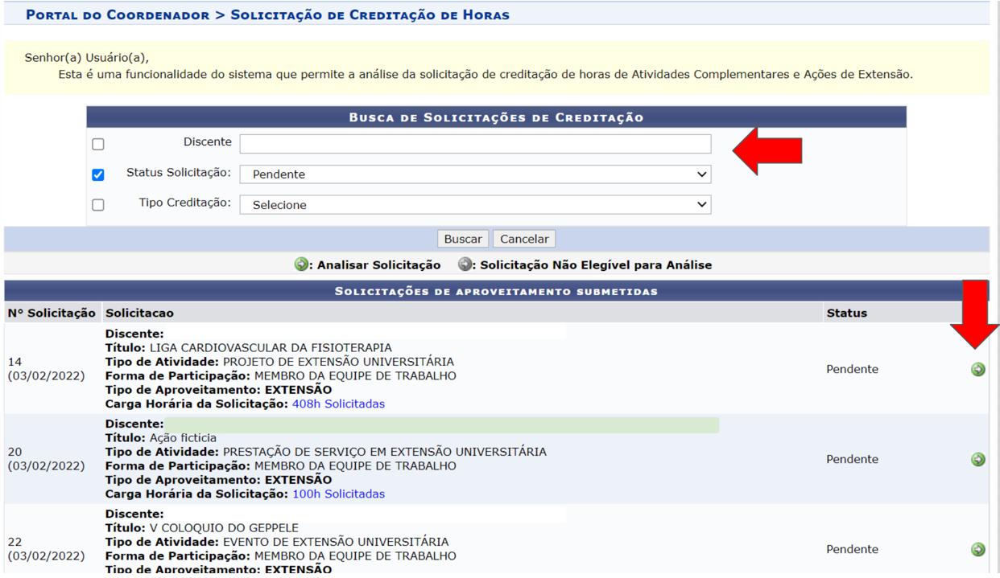

## Docente responsável - Coordenador do Curso/ Supervisor/ CPAc - analisando bancos de horas discentes

Docente do Curso na tela de Análise: selecionar opções e concluir.

PoRTAL Do CooRDENADOR SoLICITAÇÃO DE CREDITAÇÃO DE HoRAS &gt; ANALISAR

Senhor(a) Usuário(a) ,

Esta é uma funcionalidade do sistema que permite a solicitação de creditação de horas de Ações de Extensão\_

Orientação importante sobre o cadastro de 'Atividade Complementar'

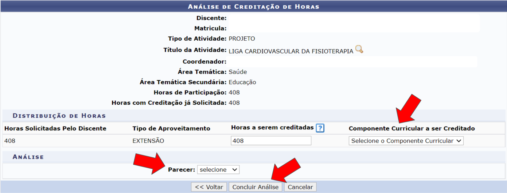

## Docente responsável - Coordenador do Curso/ Supervisor/ CPAc - analisando 'Outras Atividades' do banco de horas do discente

Senhor(a) Usuário(a)

Esta é uma funcionalidade do sistema que permite solicitação de creditação de horas de Ações de Extensão.

Orientação importante sobre o cadastro de 'Atividade Complementar'

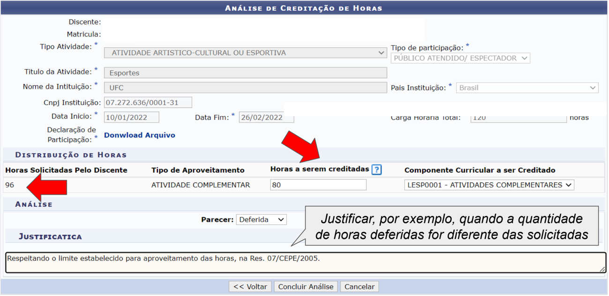

Docente responsável - Coordenador do Curso/ Supervisor/ CPAc - analisando bancos de horas discentes

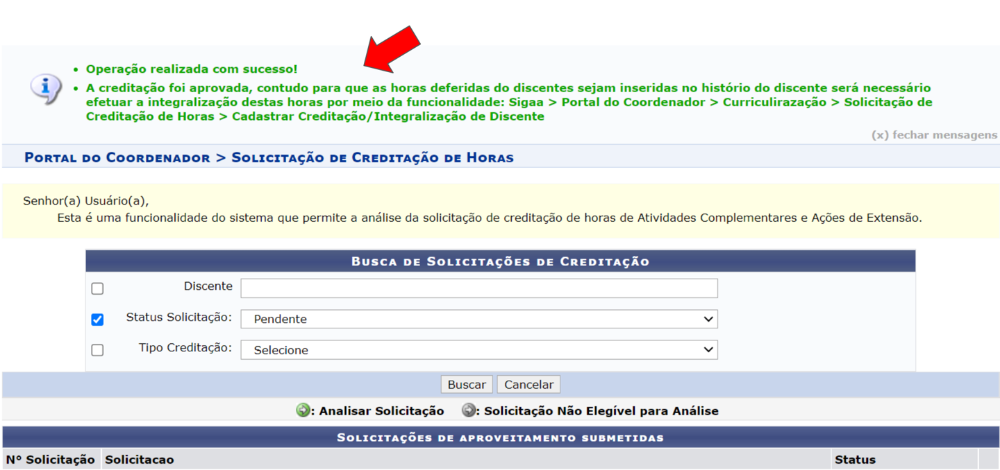

## Discente acompanhando deferimento das horas analisadas por seu Curso de Graduação

Acesse o SIGAA &gt;  Ensino &gt; Atividades Complementares e Extensão &gt; Solicitação de Creditação de Horas:

## Discente acompanhando deferimento das horas analisadas por seu Curso de Graduação

Na terceira seção da tela do banco de horas, há o status de cada ação cadastrada/ submetida, com o parecer de análise do membro do Curso:

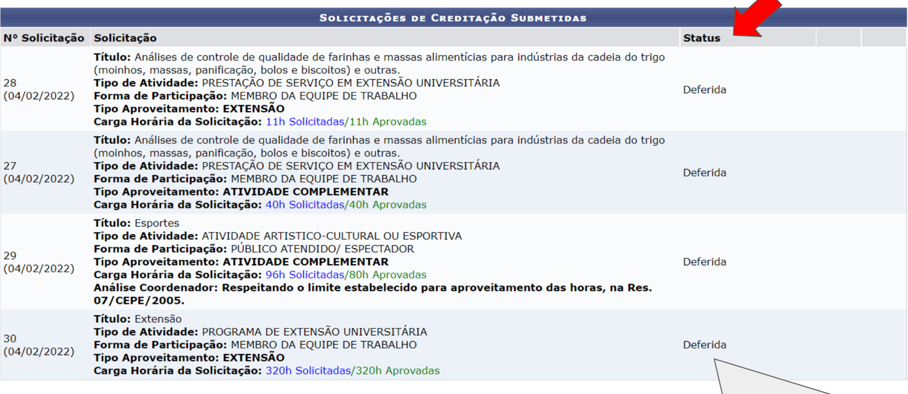

A coluna ' Status ' pode apresentar os seguintes resultados: Deferida; Indeferida; Estornada.

## Discente acompanhando deferimento das horas analisadas por seu Curso de Graduação

Na  última  seção  da  tela  do  banco  de  horas,  há  o  acompanhamento  das: Horas  Exigidas  (no  PPC  -  Projeto  Pedagógico  de  Curso  e  no  currículo  de vínculo),  Horas  Submetidas  (pelo  Discente),  Horas  Deferidas  (pelo  Docente), Horas Integralizadas (no histórico escolar) e Horas Pendentes (para conclusão):

| AcoMPANHAMENTO DE HORAS DEFERIDAS E INTEGRALIZADAS                             | AcoMPANHAMENTO DE HORAS DEFERIDAS E INTEGRALIZADAS   | AcoMPANHAMENTO DE HORAS DEFERIDAS E INTEGRALIZADAS   | AcoMPANHAMENTO DE HORAS DEFERIDAS E INTEGRALIZADAS   | AcoMPANHAMENTO DE HORAS DEFERIDAS E INTEGRALIZADAS   | AcoMPANHAMENTO DE HORAS DEFERIDAS E INTEGRALIZADAS   | AcoMPANHAMENTO DE HORAS DEFERIDAS E INTEGRALIZADAS   |
|--------------------------------------------------------------------------------|------------------------------------------------------|------------------------------------------------------|------------------------------------------------------|------------------------------------------------------|------------------------------------------------------|------------------------------------------------------|
| Tipo de Carga Horária                                                          | Horas Exigidas                                       | Horas em Solicitações Submetidas                     | Horas em Solicitações Deferidas                      | Horas                                                | Horas Integralizadas Pendentes                       |                                                      |
| EXTENSÃO                                                                       | 324                                                  | 331                                                  | 331                                                  |                                                      | 324                                                  |                                                      |
| CH.d Extensão em Disciplinas                                                   |                                                      |                                                      |                                                      |                                                      |                                                      |                                                      |
| C.H. de Extensão em Atividades                                                 |                                                      | 331                                                  | 331                                                  |                                                      |                                                      |                                                      |
| ATIVIDADE COMPLEMENTAR                                                         | 200                                                  | 136                                                  | 120                                                  |                                                      | 200                                                  |                                                      |
| C.H. Complementar em Iniciação à Docência, à Pesquisa e/ou à Extensão (Máx: 96 |                                                      | 40                                                   | 40                                                   | 0                                                    |                                                      | hs)                                                  |
| C.H. Complementar em Participação elou Organização de Eventos (Máx: 32 hs)     |                                                      |                                                      |                                                      |                                                      |                                                      |                                                      |
| C.H. Complementar em Atividades Artístico-Culturais e Esportivas (Máx: 80 hs)  |                                                      | 96                                                   | 80                                                   | 0                                                    |                                                      |                                                      |
| C.H. Complementar em Experiências Ligadas à Formação Profissional (Máx: 64 hs) |                                                      |                                                      |                                                      | 0                                                    |                                                      |                                                      |
| C.H Complementar em Produção Técnica elou Científica (Máx: 96 hs)              |                                                      |                                                      |                                                      | 0                                                    |                                                      |                                                      |
| C.H. Complementar em Vivências de Gestão (Máx: 48 hs)                          |                                                      |                                                      |                                                      |                                                      |                                                      |                                                      |
| C.H. Complementar em Outras Atividades (Máx: 48 hs)                            |                                                      |                                                      |                                                      | 0                                                    |                                                      |                                                      |

## Discente realizando a Integralização (lançamento no histórico) das horas exigidas e deferidas

Na  última  seção,  alcançando  o  mínimo  de  horas  exigidas,  a  partir  das  ações  que foram  cadastradas  e  deferidas,  o  Discente  pode  realizar  a  INTEGRALIZAÇÃO  das horas de 'Atividades Complementares' e de 'Extensão' (modalidade I da curricularização da extensão), lançando-as em seu histórico escolar:

- Integralização é 0 processo de registro na carga horária total deferida no Histórico Escolar
- Para que seja possível realizar a integralização, as Horas em Solicitações Deferidas das categorias de aproveitamento EXTENSÃO e ATIVIDADE COMPLEMENTAR devem ser maiores ou iguais às Horas Pendentes\_
- A Integralização das solicitações de aproveitamento poderá ser realizada uma única vez.

| DEFERIDAS                                                                      | DEFERIDAS      | DEFERIDAS                        | DEFERIDAS                       | DEFERIDAS             |                                |     |                          |
|--------------------------------------------------------------------------------|----------------|----------------------------------|---------------------------------|-----------------------|--------------------------------|-----|--------------------------|
|                                                                                | Horas Exigidas | Horas em Solicitações Submetidas | Horas em Solicitações Deferidas | Tipo de Carga Horária | Horas Integralizadas Pendentes |     |                          |
| EXTENSÃO                                                                       | 324            | 331                              | 331                             |                       | 324                            |     |                          |
| C.H. de Extensão em Disciplinas                                                |                |                                  |                                 |                       |                                |     |                          |
| C.H. de Extensão em Atividades                                                 |                | 331                              | 331                             |                       |                                |     | Integralizar Creditações |
| ATIVIDADE COMPLEMENTAR                                                         | 200            | 136                              | 120                             |                       | 200                            |     |                          |
| C.H. Complementar em Iniciação à Docência, à Pesquisa elou à Extensão (Máx: 96 |                | 40                               | 40                              |                       |                                | hs) |                          |
| C.H. Complementar em Participação elou Organização de Eventos (Máx: 32 hs)     |                |                                  |                                 |                       |                                |     |                          |
| C.H. Complementar em Atividades Artístico-Culturais e Esportivas (Máx: 80 hs)  |                | 96                               | 80                              |                       |                                |     |                          |
| C.H. Complementar em Experiências Ligadas à Formação Profissional (Máx: 64 hs) |                |                                  |                                 |                       |                                |     |                          |
| C.H. Complementar em Produção Técnica elou Científica (Máx: 96 hs)             |                |                                  |                                 |                       |                                |     |                          |
| C.H. Complementar em Vivências de Gestão (Máx: 48 hs)                          |                |                                  |                                 |                       |                                |     |                          |
| C.H. Complementar em Outras Atividades (Máx: 48 hs)                            |                |                                  |                                 |                       |                                |     |                          |

## Discente realizando a Integralização (lançamento no histórico) das horas exigidas e deferidas

Na última seção, o Discente pode realizar a INTEGRALIZAÇÃO das horas deferidas de 'Atividades Complementares' e de 'Extensão' (modalidade I da curricularização da extensão), para lançar em seu histórico escolar, clicando na seta verde (       ):

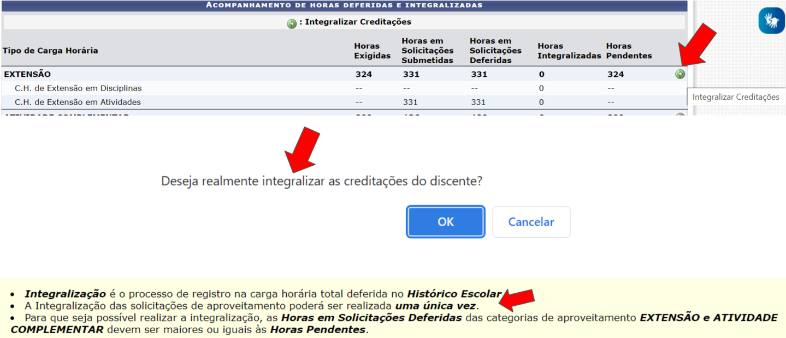

## Discente acompanhando seu banco de horas por situação

Na última seção, novamente, o Discente pode acompanhar a INTEGRALIZAÇÃO das horas de Atividades Complementares e de Extensão (modalidade I da curricularização da extensão) que foram lançadas em seu histórico escolar:

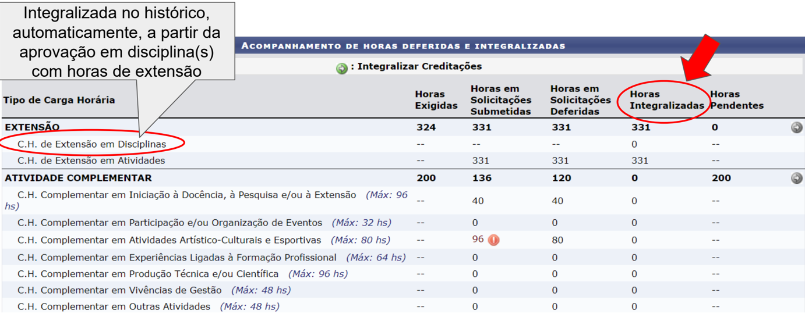

| Integralizada no histórico,  automaticamente, a partir da  aprovação em disciplina(s)  DE E INTEGRALIZADAS Integralizar Creditações   | Integralizada no histórico,  automaticamente, a partir da  aprovação em disciplina(s)  DE E INTEGRALIZADAS Integralizar Creditações   | Integralizada no histórico,  automaticamente, a partir da  aprovação em disciplina(s)  DE E INTEGRALIZADAS Integralizar Creditações   | Integralizada no histórico,  automaticamente, a partir da  aprovação em disciplina(s)  DE E INTEGRALIZADAS Integralizar Creditações   | Integralizada no histórico,  automaticamente, a partir da  aprovação em disciplina(s)  DE E INTEGRALIZADAS Integralizar Creditações   | Integralizada no histórico,  automaticamente, a partir da  aprovação em disciplina(s)  DE E INTEGRALIZADAS Integralizar Creditações   | Integralizada no histórico,  automaticamente, a partir da  aprovação em disciplina(s)  DE E INTEGRALIZADAS Integralizar Creditações   | Integralizada no histórico,  automaticamente, a partir da  aprovação em disciplina(s)  DE E INTEGRALIZADAS Integralizar Creditações   |
|---------------------------------------------------------------------------------------------------------------------------------------|---------------------------------------------------------------------------------------------------------------------------------------|---------------------------------------------------------------------------------------------------------------------------------------|---------------------------------------------------------------------------------------------------------------------------------------|---------------------------------------------------------------------------------------------------------------------------------------|---------------------------------------------------------------------------------------------------------------------------------------|---------------------------------------------------------------------------------------------------------------------------------------|---------------------------------------------------------------------------------------------------------------------------------------|
| Tipo de Carga Horária                                                                                                                 | com horas de extensão                                                                                                                 | Horas Exigidas                                                                                                                        | Horas em Solicitações Submetidas                                                                                                      | Horas em Solicitações Deferidas                                                                                                       | Horas Integralizadas                                                                                                                  | Horas Pendentes                                                                                                                       |                                                                                                                                       |
| EXTENSÃQ                                                                                                                              |                                                                                                                                       | 324                                                                                                                                   | 331                                                                                                                                   | 331                                                                                                                                   | 331                                                                                                                                   |                                                                                                                                       |                                                                                                                                       |
| C.H. de Extensão em Disciplinas                                                                                                       |                                                                                                                                       |                                                                                                                                       |                                                                                                                                       |                                                                                                                                       |                                                                                                                                       |                                                                                                                                       |                                                                                                                                       |
| C.H. de Extensão em Atividades                                                                                                        |                                                                                                                                       |                                                                                                                                       | 331                                                                                                                                   | 331                                                                                                                                   | 331                                                                                                                                   |                                                                                                                                       |                                                                                                                                       |
| ATIVIDADE COMPLEMENTAR                                                                                                                |                                                                                                                                       | 200                                                                                                                                   | 136                                                                                                                                   | 120                                                                                                                                   |                                                                                                                                       | 200                                                                                                                                   |                                                                                                                                       |
| C.H Complementar em Iniciação à Docência, à Pesquisa elou à Extensão (Máx: 96                                                         | C.H Complementar em Iniciação à Docência, à Pesquisa elou à Extensão (Máx: 96                                                         |                                                                                                                                       | 40                                                                                                                                    | 40                                                                                                                                    | 0                                                                                                                                     |                                                                                                                                       | hs)                                                                                                                                   |
| C.H. Complementar em Participação elou Organização de Eventos (Máx: 32 hs)                                                            | C.H. Complementar em Participação elou Organização de Eventos (Máx: 32 hs)                                                            |                                                                                                                                       |                                                                                                                                       |                                                                                                                                       | 0                                                                                                                                     |                                                                                                                                       |                                                                                                                                       |
| C.H. Complementar em Atividades Artístico-Culturais Esportivas (Máx: 80 hs)                                                           | C.H. Complementar em Atividades Artístico-Culturais Esportivas (Máx: 80 hs)                                                           |                                                                                                                                       | 96                                                                                                                                    | 80                                                                                                                                    | 0                                                                                                                                     |                                                                                                                                       |                                                                                                                                       |
| C.H. Complementar em Experiências Ligadas à Formação Profissional (Máx: 64 hs)                                                        | C.H. Complementar em Experiências Ligadas à Formação Profissional (Máx: 64 hs)                                                        |                                                                                                                                       |                                                                                                                                       |                                                                                                                                       | 0                                                                                                                                     |                                                                                                                                       |                                                                                                                                       |
| C.H. Complementar em Produção Técnica elou Científica (Máx: 96 hs)                                                                    | C.H. Complementar em Produção Técnica elou Científica (Máx: 96 hs)                                                                    |                                                                                                                                       |                                                                                                                                       |                                                                                                                                       | 0                                                                                                                                     |                                                                                                                                       |                                                                                                                                       |
| Complementar em Vivências de Gestão (Máx: 48 hs)                                                                                      | Complementar em Vivências de Gestão (Máx: 48 hs)                                                                                      |                                                                                                                                       |                                                                                                                                       |                                                                                                                                       |                                                                                                                                       |                                                                                                                                       |                                                                                                                                       |
| C.H. Complementar em Outras Atividades (Máx: 48 hs)                                                                                   | C.H. Complementar em Outras Atividades (Máx: 48 hs)                                                                                   |                                                                                                                                       |                                                                                                                                       | 0                                                                                                                                     | 0                                                                                                                                     |                                                                                                                                       |                                                                                                                                       |

## Discente acompanhando seu histórico escolar

No  histórico  escolar,  há  um  quadro  com  os  cálculos  para  conclusão  de  curso, apresentando o resultado da INTEGRALIZAÇÃO do banco de horas:

| Legenda:                                      | Legenda:                                      | Legenda:                                      | Legenda:             | Legenda:           | Legenda:           | Legenda:   |
|-----------------------------------------------|-----------------------------------------------|-----------------------------------------------|----------------------|--------------------|--------------------|------------|
| Comp. Optativo                                | e: Comp. Equivalente a Obrig-                 | &: Comp. Equivalente a Optativo               | Comp. Optativo Livre | Ativ . Obrigatória | S: Ativ . Optativa |            |
|                                               |                                               | Exigido                                       | Integralizado        | Computável         | Pendente           |            |
| Carga Horária Total                           | Carga Horária Total                           | 3228                                          | 1259                 | 1259               | 1969               |            |
| Carga Horária Optativa                        | Carga Horária Optativa                        | 448                                           | 96                   | 96                 | 352                |            |
|                                               |                                               | Exigido                                       | Integralizado        | Computável         | Pendente           |            |
| Carga Horária de Atividades Complementares    | Carga Horária de Atividades Complementares    | 200                                           |                      |                    | 200                |            |
| Carga Horária de Componentes Optativos Livres | Carga Horária de Componentes Optativos Livres | Carga Horária de Componentes Optativos Livres | 64                   | 64                 |                    |            |
| Carga Horária de TCC                          | Carga Horária de TCC                          | 96                                            |                      |                    | 96                 |            |
| Carga Horária de Estágio                      | Carga Horária de Estágio                      | 400                                           |                      |                    | 400                |            |
| Carga Horária de Extensão                     | Carga Horária de Extensão                     | 324                                           | 331                  | 331                |                    |            |

## Outras funcionalidades do SIGAA disponíveis para a creditação de horas de Atividades Complementares e Extensão

No SIGAA, há também as seguintes funcionalidades adicionais, liberadas por perfis de usuário :

- -cadastro  de  supervisor(a)  da  atividade,  por  coordenador(a)  do  curso  / CPAc;
- -cadastro de horas discentes, por coordenador(a) do curso / supervisor(a) da atividade;
- -deferimento  de  horas,  por  coordenador(a)  do  curso  /  supervisor(a)  da atividade, CPAc;
- -estorno  de  atividades  já 'deferidas', por coordenador(a)  do  curso  / supervisor(a) da atividade, quando necessário;
- -integralização das horas, por coordenador(a) do curso / supervisor(a) da atividade, CPAc;
- -estorno de horas já 'integralizadas' (lançadas em histórico escolar), pelo CPAc, quando necessário;
- -emissões  de  relatórios,  por  coordenador(a)  do  curso  /  supervisor(a)  da atividade, CPAc;

## Sucesso acadêmico a tod@s!

## Equipe de elaboração:

Contatos administrativos

E-mail

: copac@prograd.ufc.br

Endereços eletrônicos: https://prograd.ufc.br/pt/

Suporte às funcionalidades da Modalidade I - Participação em Ações de Extensão

E-mail : prex.sigaa@gmail.com

Endereço eletrônico: www.prex.ufc.br