## Tutorial Sistec

## Perfil -Órgão Validador

Aba Ciclo de Matrícula

MINISTÉRIO DA EDUCAÇÃO

## SUMÁRIO

| APRESENTAÇÃO ....................................................................................................................................  3                                  |
|---------------------------------------------------------------------------------------------------------------------------------------------------------------------------------------|
| PERFIS DE ACESSO ...............................................................................................................................  4                                   |
| CICLO DE MATRÍCULA - LISTAR EXISTENTES ....................................................................................  5                                                        |
| Acesso à funcionalidade  .......................................................................................................................................................... 5 |
| Uso da funcionalidade ............................................................................................................................................................. 6 |
| VISUALIZAR REGISTROS DE MATRÍCULA DE UM CICLO ESPECÍFICO  ............................................................................. 8                                             |
| CONSULTAR ALUNO ............................................................................................................................  10                                      |
| Acesso à funcionalidade  ........................................................................................................................................................ 10  |
| Uso da funcionalidade ........................................................................................................................................................... 11  |
| PESQUISAR ALUNO .............................................................................................................................  13                                     |
| Acesso à funcionalidade  ........................................................................................................................................................ 13  |
| Uso da funcionalidade ........................................................................................................................................................... 13  |
| VISUALIZAR DETALHAMENTO DE MATRÍCULA DE UM ALUNO  ....................................................................................... 16                                          |
| CONSULTAR DIPLOMA CICLO DE MATRÍCULA ................................................................................  17                                                             |
| Acesso à funcionalidade  ........................................................................................................................................................ 17  |
| Uso da funcionalidade ........................................................................................................................................................... 18  |

## MINISTÉRIO DA EDUCAÇÃO

## APRESENTAÇÃO

Este tutorial tem a finalidade de instruir os gestores de Órgão Validador, no Sistec, a utilizar a aba Ciclo de Matrícula com suas respectivas funcionalidades.

Essa  aba  está  disponibilizada  no  sistema  Sistec  para  Órgãos  Validadores  Municipais,  Estaduais/Distrital e Federais.

Destaca-se que todas as funcionalidades estão parametrizadas conforme o escopo de atuação do órgão validador, ou seja, órgãos municipais visualizarão dados do seu município, estaduais/distrital visualizarão dados do seu estado e os federais visualizarão dados em âmbito federal conforme o seu nível de abrangência.

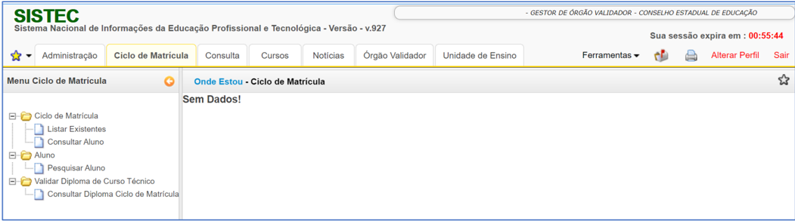

A aba Ciclo de Matrícula para Órgãos Validadores dispõe de 4 funcionalidades principais: Ciclo de Matrícula - listar existentes, Consultar Aluno, Pesquisar Aluno e Consultar Diploma Ciclo de Matrícula.

Mineducacao

## MINISTÉRIO DA EDUCAÇÃO

## PERFIS DE ACESSO

Os Órgãos Validadores no sistema Sistec possuem 3 perfis de acesso conforme detalhado abaixo:

Gestor Responsável pelo Órgão Validador: é o perfil principal e que responde formalmente pelo Órgão Validador perante os órgãos competentes. Há apenas um perfil desse tipo por órgão.

Possui permissão para conceder e/ou retirar os perfis de Gestor de Órgão Validador e Assessor de Órgão Validador no âmbito do seu próprio órgão.

Gestor de Órgão Validador: concedido a critério do Gestor Responsável e não há limites de concessão desse perfil por órgão validador no sistema. Possui permissão para conceder o perfil de Assessor de Órgão Validador no âmbito do seu próprio órgão.

Assessor de Órgão Validador: concedido a critério do Gestor Responsável e/ou Gestor de Órgão Validador e não há limites de concessão desse perfil por órgão validador no sistema.

A seguir serão detalhadas cada uma das funcionalidades disponibilizadas.

## MINISTÉRIO DA EDUCAÇÃO

## CICLO DE MATRÍCULA - LISTAR EXISTENTES

Essa funcionalidade permitirá que os órgãos validadores consultem os ciclos de matrícula, ou seja, as ofertas realizadas pelas unidades de ensino sob a gestão do órgão.

## Acesso à funcionalidade

É necessário acessar o sistema Sistec com algum perfil de órgão validador (gestor responsável pelo órgão validador, gestor de órgão validador ou assessor de órgão validador), clicar na aba Ciclo de Matrícula, clicar no ícone '+' ao lado da pasta de Ciclo de Matrícula e posteriormente clicar na funcionalidade Listar Existentes . Ciclo de Matrícula Listar Existentes

Para fazer a consulta, recomenda-se o uso de filtros para otimizar os resultados.

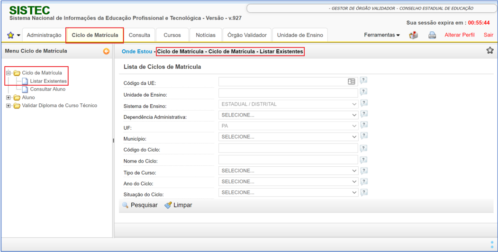

Mineducacao

## MINISTÉRIO DA EDUCAÇÃO

Os filtros mais recomendados para uso estão marcados em amarelo na imagem abaixo:

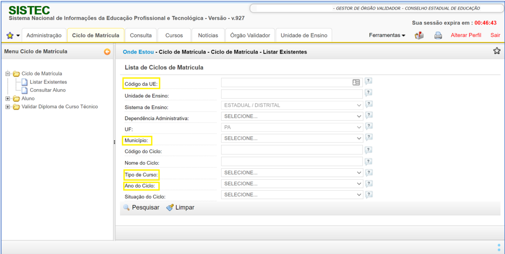

ATENÇÃO! Consultas realizadas SEM FILTROS demandam um grande processamento de dados do sistema, por isso, devem ser evitadas.

Utilize o máximo de filtros possíveis para otimizar as consultas.

## Uso da funcionalidade

Acesse a funcionalidade conforme o passo a passo descrito na seção anterior:

Aba Ciclo de Matrícula &gt; Pasta Ciclo de Matrícula &gt; Funcionalidade Listar Existentes.

Abaixo será demonstrado o uso da funcionalidade utilizando um dos filtros mais recomendados:

## Filtro pelo Código Sistec da Unidade de Ensino

No campo Código UE, informe o código Sistec da unidade de ensino que deseja consultar os ciclos de matrícula.

Após inserir o código de uma unidade de ensino que pertença ao seu escopo de atuação, alguns campos serão automaticamente carregados conforme o cadastro da unidade no Sistec:

Mineducacao

## MINISTÉRIODA EDUCACÃO

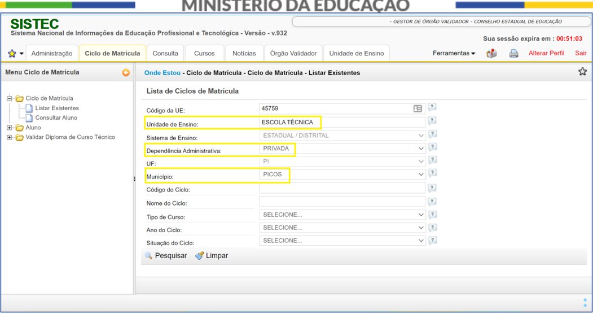

Se o código informado não pertencer ao seu escopo de atuação, o sistema mostrará um alerta conforme a imagem abaixo:

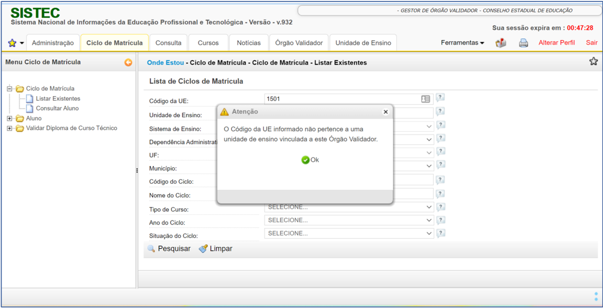

Caso não saiba o código Sistec de uma unidade de ensino, é possível consultá-lo por meio da funcionalidade:

Aba Unidade de Ensino &gt; Pasta Cadastro &gt; Funcionalidade Relatório de Unidades de Ensino.

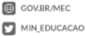

Mineducacao

MINISTERICDAEDUCACRO

MINEDUCCC

## MINISTÉRIO DA EDUCAÇÃO

Caso seja uma unidade de ensino que possua muitas ofertas registradas, ou o filtro utilizado tenha uma grande amplitude, como por exemplo o filtro de município, recomenda-se que outros filtros também sejam preenchidos, tais como o tipo de curso e o ano do ciclo.

Após preenchimento dos filtros, clique no ícone para que o sistema processe as informações e exiba em tela os resultados encontrados:

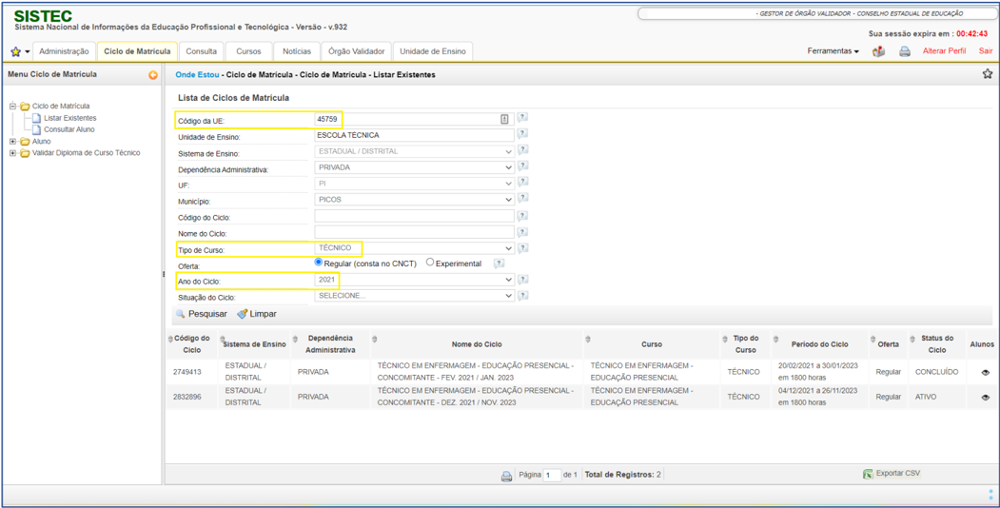

Os resultados encontrados, ou seja, os dados dos ciclos de matrícula, podem ser exportados por

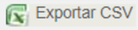

meio do ícone disponível no rodapé direito da página. Exportar CSV

Para limpar os filtros e a consulta realizada, utilize o ícone

.

## VISUALIZAR REGISTROS DE MATRÍCULA DE UM CICLO ESPECÍFICO

Essa funcionalidade fica disponível após realizar uma consulta de ciclos de matrícula.

Na tela em que os resultados são mostrados, na coluna Alunos, consta um ícone de olho que permitirá a visualização dos alunos cadastrados no respectivo ciclo de matrícula, conforme a imagem abaixo:

Mineducacao

MINISTERICDAEDUCACRO

MINEDUCCC

## MINISTÉRIO DA EDUCAÇÃO

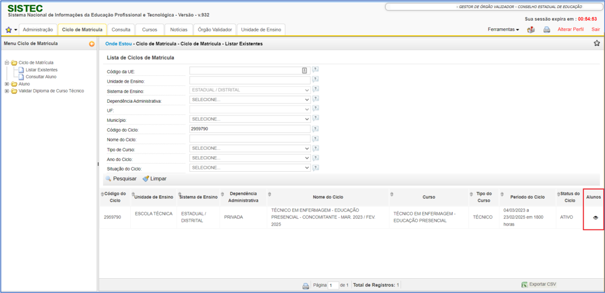

Ao clicar no ícone, o sistema mostrará a listagem dos alunos cadastros no respectivo ciclo:

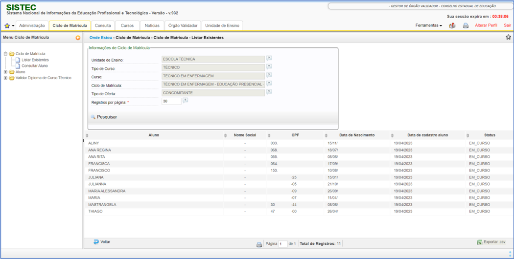

*Consulta com dados anonimizados.

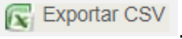

Os resultados encontrados, ou seja, as matrículas cadastradas no ciclo consultado, podem ser exportados por meio do ícone . Exportar CSV

Mineducacao

MINISTERICDAEDUCACRO

## MINISTÉRIO DA EDUCAÇÃO

## CONSULTAR ALUNO

Essa funcionalidade permitirá que os órgãos validadores consultem as matrículas que constam registradas no Sistec e que foram realizadas pelas unidades de ensino sob a gestão do órgão.

## Acesso à funcionalidade

É necessário acessar o sistema Sistec com algum perfil de órgão validador (gestor responsável pelo órgão validador, gestor de órgão validador ou assessor de órgão validador), clicar na aba Ciclo de Matrícula, clicar no ícone '+' ao lado da pasta de Ciclo de Matrícula e posteriormente clicar na funcionalidade Consultar Aluno . Ciclo de Matrícula Consultar Aluno

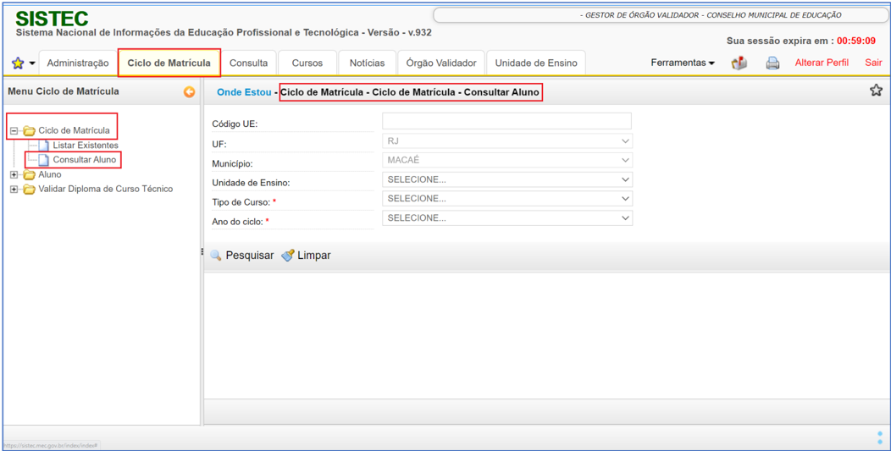

Mineducacao

## MINISTÉRIO DA EDUCAÇÃO

## Uso da funcionalidade

Acesse a funcionalidade conforme o passo a passo descrito na seção anterior:

Aba Ciclo de Matrícula &gt; Pasta Ciclo de Matrícula &gt; Funcionalidade Consultar Aluno.

Essa funcionalidade possui filtros obrigatórios para otimizar a consulta devido ao volume de dados e recomenda-se o uso do filtro de Código UE.

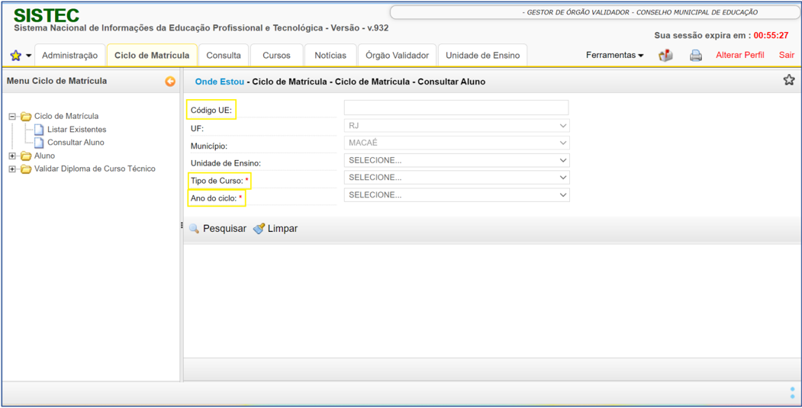

Após preenchimento dos filtros, clique no ícone para que o sistema processe as informações e exiba em tela os resultados encontrados: Pesquisar

Mineducacao

MINISTERICDAEDUCACRO

MINEDUCCC

## MINISTÉRIO DA EDUCAÇÃO

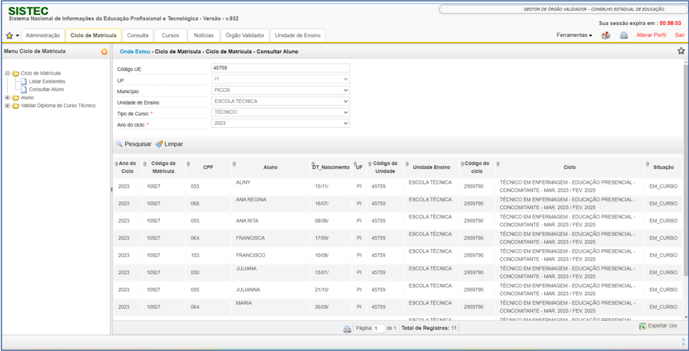

*Consulta com dados anonimizados.

Os resultados encontrados podem ser exportados por meio do ícone no rodapé direito da página.

Para limpar os filtros e a consulta realizada, utilize o ícone

.

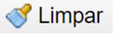

ATENÇÃO! Os dados apresentados nessa funcionalidade possuem um processamento em D-1, ou seja, se a consulta está sendo realizada em 11/05/2023, o sistema mostrará dados até 10/05/2023.

GOVARMFC

12

## MINISTÉRIO DA EDUCAÇÃO

## PESQUISAR ALUNO

Essa funcionalidade permitirá que os órgãos validadores pesquisem alunos, ou seja, realizem uma consulta específica de algum aluno que possua matrícula registrada no Sistec que foi realizada pelas unidades de ensino sob a gestão do órgão.

## Acesso à funcionalidade

É necessário acessar o sistema Sistec com algum perfil de órgão validador (gestor responsável pelo órgão validador, gestor de órgão validador ou assessor de órgão validador), clicar na aba Ciclo de Matrícula, clicar no ícone '+' ao lado da pasta de Aluno

e posteriormente clicar na

funcionalidade Pesquisar Aluno

.

Pesquisar Aluno

## Uso da funcionalidade

Acesse a funcionalidade conforme o passo a passo descrito na seção anterior:

Aba Ciclo de Matrícula &gt; Pasta Aluno &gt; Funcionalidade Pesquisar aluno.

Recomenda-se que a consulta seja feita pelo CPF do aluno e caso o aluno não possua CPF, pelo código do aluno.

Mineducacao

MINISTERICDAEDUCACRO

## MINISTÉRIO DA EDUCAÇÃO

ATENÇÃO! Consultas realizadas com um parâmetro genérico, exemplo: nome Maria ou João, demandam um grande processamento de dados do sistema, por isso, devem ser evitadas.

Insira o CPF do aluno a ser consultado no campo de CPF do Aluno e clique no ícone

.

Caso o aluno consultado possua registro de matrícula, o sistema mostrará o resultado em tela:

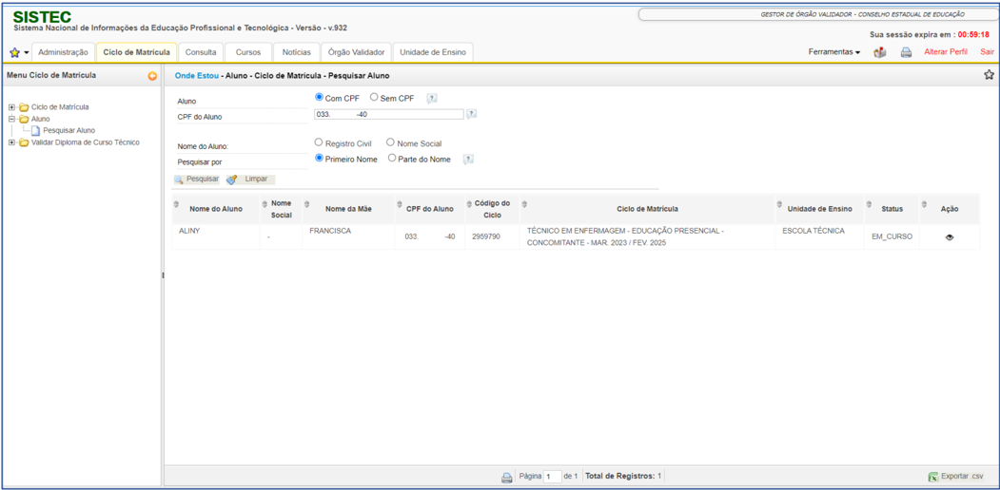

*Consulta com dados anonimizados.

Os resultados encontrados podem ser exportados por meio do ícone no rodapé direito da página.

disponível

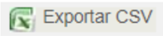

Quando o CPF informado não possuir matrícula, o sistema mostrará que nenhum registro foi encontrado:

Mineducacao

## MINISTÉRIO DA EDUCAÇÃO

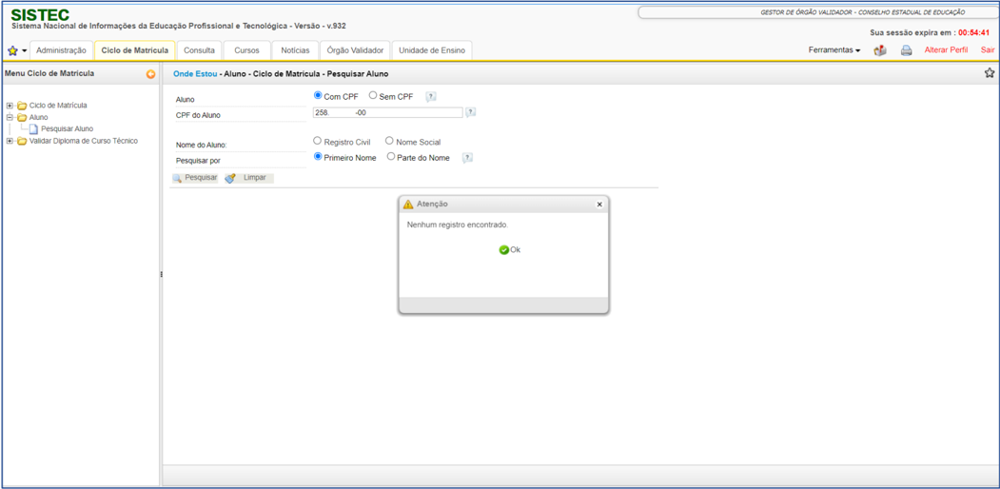

Quando o CPF informado possuir registro de matrícula fora do escopo de atuação do órgão, o sistema apresentará um alerta:

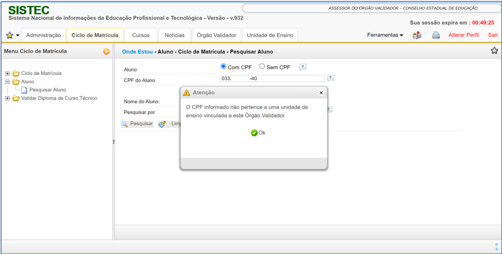

Mineducacao

## MINISTÉRIO DA EDUCAÇÃO

## VISUALIZAR DETALHAMENTO DE MATRÍCULA DE UM ALUNO

Essa funcionalidade fica disponível após ser encontrado algum registro de matrícula.

Na tela em que os resultados são mostrados, na coluna Ação, consta um ícone de olho permitirá a visualização de dados detalhados da matrícula, conforme a imagem abaixo:

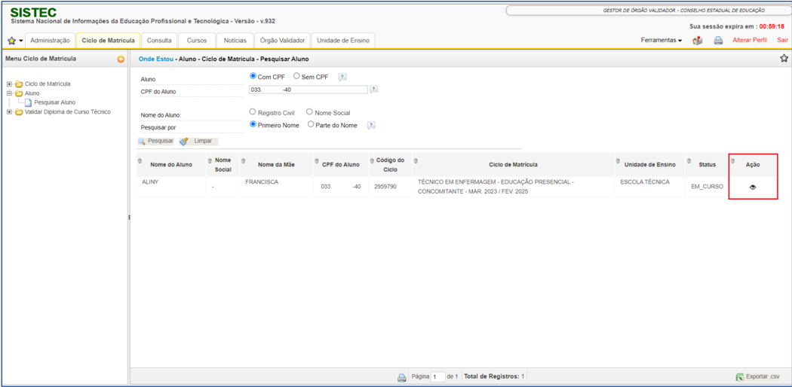

*Consulta com dados anonimizados.

Ao clicar no ícone de olho, o sistema mostrará dados detalhados da matrícula:

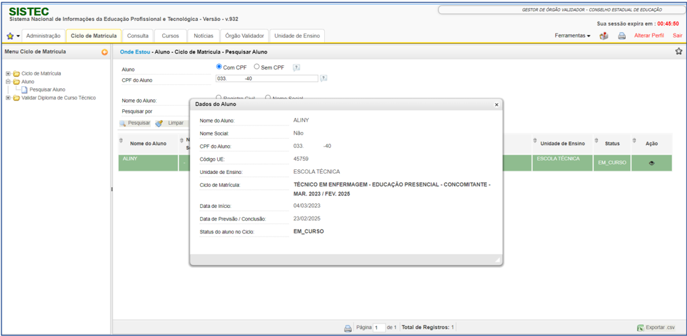

Mineducacao

## MINISTÉRIO DA EDUCAÇÃO

## CONSULTAR DIPLOMA CICLO DE MATRÍCULA

Essa funcionalidade permite que os órgãos validadores consultem os códigos de autenticação de cursos técnicos que foram gerados pelas unidades de ensino sob a gestão do órgão.

## Acesso à funcionalidade

É necessário acessar o sistema Sistec com algum perfil de órgão validador (gestor responsável pelo órgão validador, gestor de órgão validador ou assessor de órgão validador), clicar na aba Ciclo de  Matrícula, clicar  no  ícone '+' ao  lado da  pasta Validar  Diploma  de  Curso  Técnico

Validar Diploma de Curso Técnico e  posteriormente  clicar  na  funcionalidade  Consultar  Diploma

## Ciclo de Matrícula

.

Consultar Diploma Ciclo de Matrícula

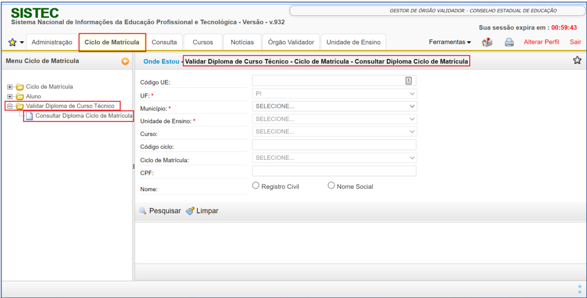

Mineducacao

## MINISTÉRIO DA EDUCAÇÃO

## Uso da funcionalidade

Essa funcionalidade possui filtros obrigatórios para otimizar a consulta devido ao volume de dados.

Acesse a funcionalidade conforme o passo a passo descrito na seção anterior:

Aba Ciclo de Matrícula &gt; Pasta Validar Diploma de Curso Técnico &gt; Funcionalidade Consultar Aluno.

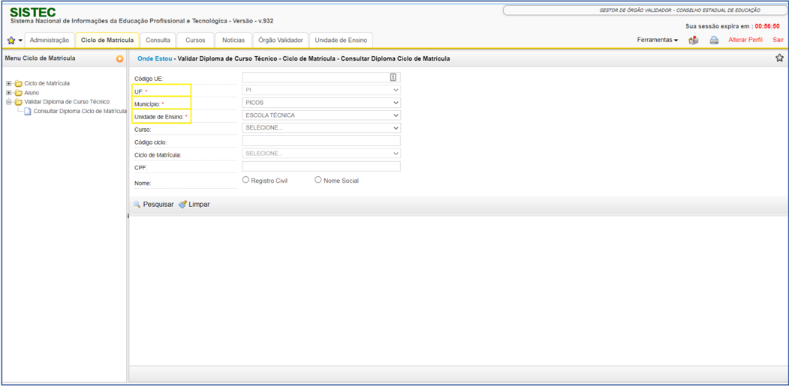

Após inserir o código de uma unidade de ensino que pertença ao seu escopo de atuação, alguns campos serão automaticamente carregados conforme o cadastro da unidade no Sistec:

Mineducacao

MINISTERICDAEDUCACRO

## MINISTÉRIO DA EDUCAÇÃO

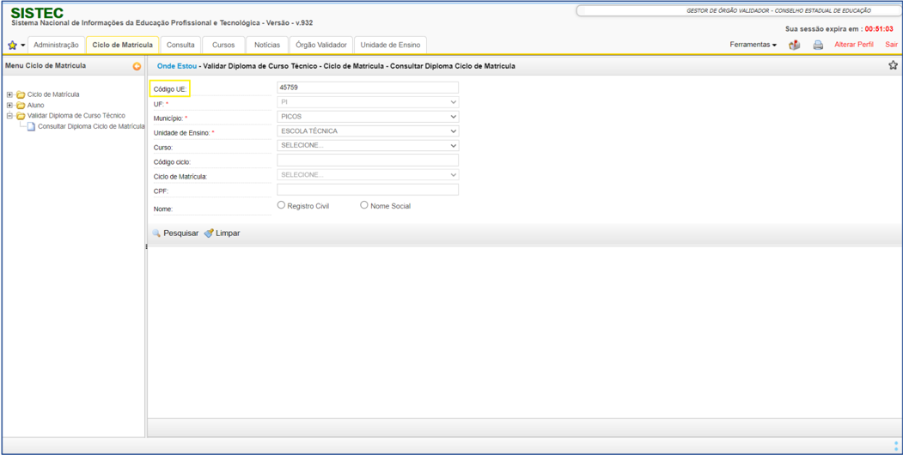

Se o código informado não pertencer ao seu escopo de atuação, o sistema mostrará a mensagem de alerta abaixo:

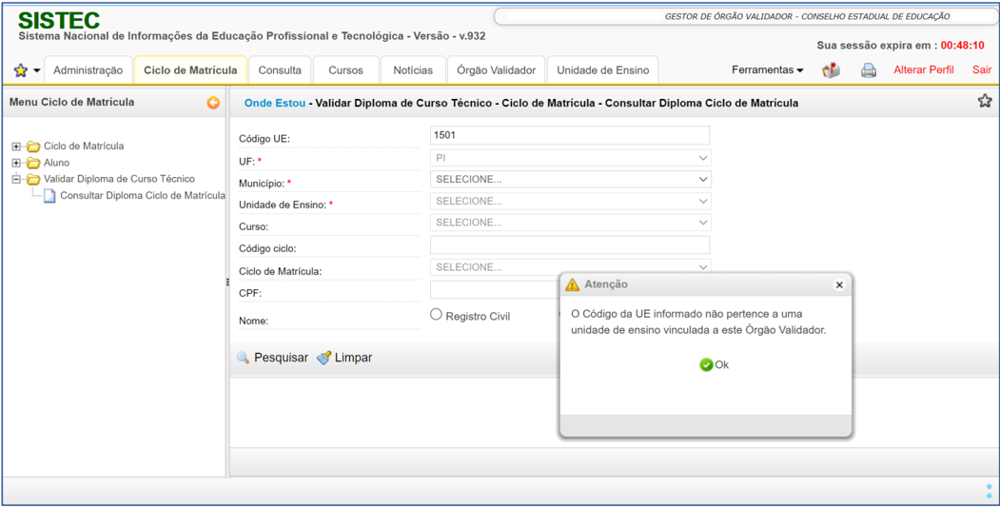

Mineducacao

## MINISTÉRIO DA EDUCAÇÃO

Alguns filtros específicos, quando utilizados, dispensam o preenchimento dos filtros obrigatórios, são eles:

## Código do ciclo

## CPF do Aluno

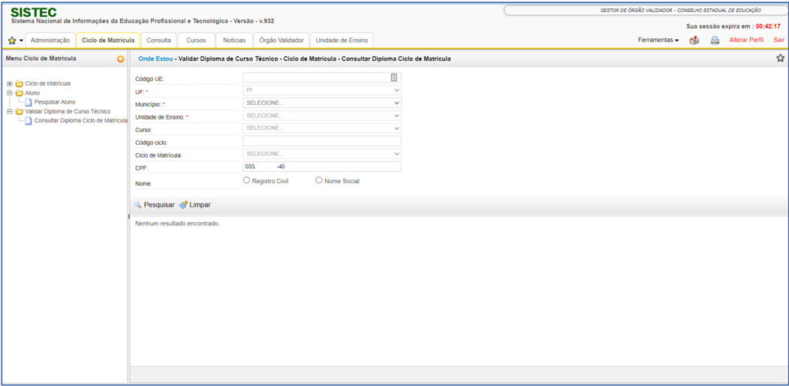

*Consulta com dados anonimizados.

Mineducacao

## MINISTÉRIO DA EDUCAÇÃO

Após  o  preenchimento  dos  filtros  obrigatórios  ou  dos  filtros  sugeridos  acima,  clique  no  ícone para que o sistema realize a consulta: Pesquisar

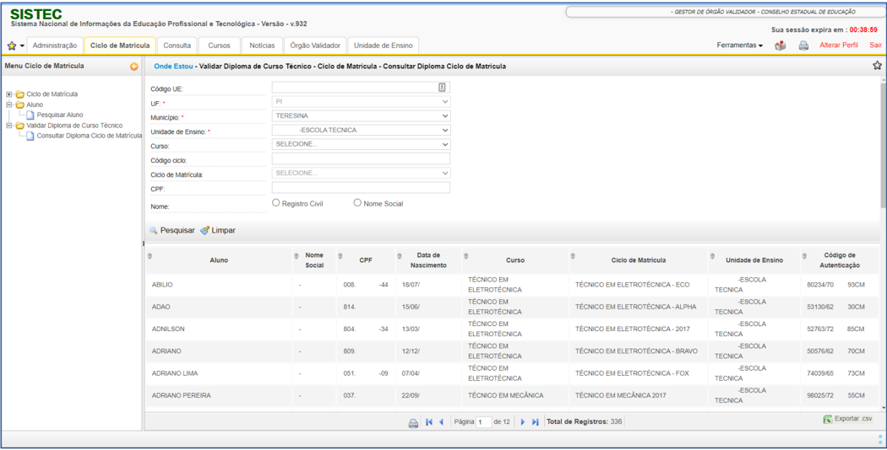

*Consulta com dados anonimizados.

Os resultados encontrados podem ser exportados por meio do ícone disponível no rodapé direito da página. Exportar CSV

Mineducacao

21

https://sistec.mec.gov.br/

https://www.gov.br/mec/ptbr/canais\_atendimento/fale-conosco

