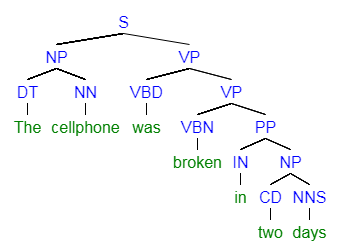
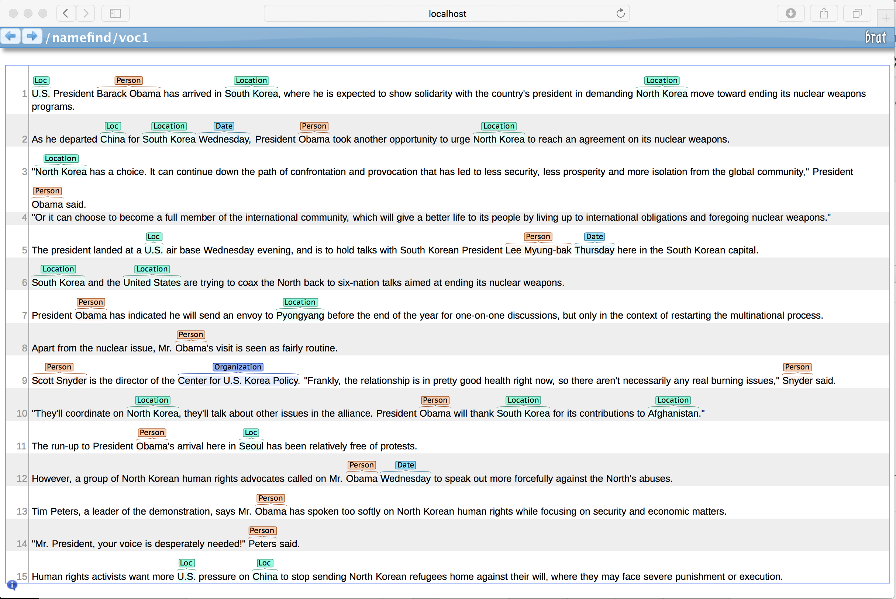

# Apache OpenNLP Developer Documentation

## Metadados

| Campo | Valor |
|-------|-------|
| **URL** | https://opennlp.apache.org/docs/2.5.4/manual/opennlp.html |
| **Tipo** | documentation |
| **Data de Extração** | 19/07/2025 19:28 |

---

## Conteúdo


# Apache OpenNLP Developer Documentation

### Written and maintained by the Apache OpenNLP Development
				Community

Version 2.5.4

Copyright © 2011, 2025 The Apache Software Foundation

License and Disclaimer.The ASF licenses this documentation
					to you under the Apache License,
					Version 2.0 (the
					"License"); you may not use this documentation
					except in compliance
					with the License. You may obtain a copy of the
					License at

> http://www.apache.org/licenses/LICENSE-2.0

Unless required by applicable law or agreed to in writing,
					this documentation and its contents are distributed under the License
					on an
					"AS IS" BASIS, WITHOUT WARRANTIES OR CONDITIONS OF ANY
					KIND, either express or implied. See the License for the
					specific language governing permissions and limitations
					under the License.

Table of Contents
1. IntroductionDescriptionGeneral Library StructureApplication Program Interface (API). Generic ExampleCommand line interface (CLI)DescriptionList of toolsSetting upGeneric ExampleOpenNLP ModelsOpenNLP ModelsONNX ModelsSystem PropertiesString Interning2. Language DetectorClassifyingLanguage Detector ToolLanguage Detector APITrainingTraining ToolTraining with LeipzigTraining API3. Sentence DetectorSentence DetectionSentence Detection ToolSentence Detection APISentence Detector TrainingTraining ToolTraining APIEvaluationEvaluation Tool4. TokenizerTokenizationTokenizer ToolsTokenizer APITokenizer TrainingTraining ToolTraining APIDetokenizingDetokenizing APIDetokenizer Dictionary5. Name FinderNamed Entity RecognitionName Finder ToolName Finder APIUsing an ONNX ModelName Finder TrainingTraining ToolTraining APICustom Feature GenerationFeature Generation defined by APIFeature Generation defined by XML DescriptorEvaluationEvaluation ToolEvaluation APINamed Entity Annotation Guidelines6. Document CategorizerClassifyingDocument Categorizer ToolDocument Categorizer APIUsing an ONNX ModelTrainingTraining ToolTraining API7. Part-of-Speech TaggerTaggingPOS Tagger ToolPOS Tagger APITrainingTraining ToolTraining APITag DictionaryEvaluationEvaluation Tool8. LemmatizerLemmatizer ToolLemmatizer APILemmatizer TrainingTraining ToolTraining APILemmatizer Evaluation9. ChunkerChunkingChunker ToolChunking APIChunker TrainingTraining ToolTraining APIChunker EvaluationChunker Evaluation Tool10. ParserParsingParser ToolParsing APIParser TrainingTraining ToolTraining APIParser EvaluationParser Evaluation ToolEvaluation API11. Coreference Resolution12. Classpath Loading of OpenNLP ModelsLoading a pre-trained OpenNLP model from the classpathBundling a custom trained OpenNLP model for the classpath13. Extending OpenNLPWriting an extension14. CorporaCONLLCONLL 2000Getting the dataConverting the dataTrainingEvaluatingCONLL 2002Getting the dataConverting the dataTraining with Spanish dataCONLL 2003Getting the dataConverting the data (optional)Training with English dataEvaluating with English dataArvores DeitadasGetting the dataConverting the data (optional)Training and EvaluationOntoNotes Release 4.0Name Finder TrainingBrat Format SupportTrainingEvaluationCross Validation15. Machine LearningMaximum EntropyImplementation16. UIMA IntegrationRunning the pear sample in CVDFurther Help17. Morfologik AddonMorfologik IntegrationMorfologik CLI Tools18. The Command Line InterfaceDoccatDoccatDoccatTrainerDoccatEvaluatorDoccatCrossValidatorDoccatConverterLangdetectLanguageDetectorLanguageDetectorTrainerLanguageDetectorConverterLanguageDetectorCrossValidatorLanguageDetectorEvaluatorDictionaryDictionaryBuilderTokenizerSimpleTokenizerTokenizerMETokenizerTrainerTokenizerMEEvaluatorTokenizerCrossValidatorTokenizerConverterDictionaryDetokenizerSentdetectSentenceDetectorSentenceDetectorTrainerSentenceDetectorEvaluatorSentenceDetectorCrossValidatorSentenceDetectorConverterNamefindTokenNameFinderTokenNameFinderTrainerTokenNameFinderEvaluatorTokenNameFinderCrossValidatorTokenNameFinderConverterCensusDictionaryCreatorPostagPOSTaggerPOSTaggerTrainerPOSTaggerEvaluatorPOSTaggerCrossValidatorPOSTaggerConverterLemmatizerLemmatizerMELemmatizerTrainerMELemmatizerEvaluatorChunkerChunkerMEChunkerTrainerMEChunkerEvaluatorChunkerCrossValidatorChunkerConverterParserParserParserTrainerParserEvaluatorParserConverterBuildModelUpdaterCheckModelUpdaterTaggerModelReplacerEntitylinkerEntityLinkerLanguagemodelNGramLanguageModel19. Evaluation Test DataWhat is it ?Where is it?How to use the evaluation test data to run test?How to change evaluation data?
List of Tables
2.1.Normalizers5.1.Feature Generators
# Chapter 1. Introduction

Table of Contents
DescriptionGeneral Library StructureApplication Program Interface (API). Generic ExampleCommand line interface (CLI)DescriptionList of toolsSetting upGeneric ExampleOpenNLP ModelsOpenNLP ModelsONNX ModelsSystem PropertiesString Interning
## Description

The Apache OpenNLP library is a machine learning based toolkit for the processing of natural language text.
        It supports the most common NLP tasks, such as tokenization, sentence segmentation,
        part-of-speech tagging, named entity extraction, chunking, parsing, and coreference resolution.
        These tasks are usually required to build more advanced text processing services.
        OpenNLP also includes maximum entropy and perceptron based machine learning.

The goal of the OpenNLP project will be to create a mature toolkit for the aforementioned tasks.
        An additional goal is to provide a large number of pre-built models for a variety of languages, as
        well as the annotated text resources that those models are derived from.

## General Library Structure

The Apache OpenNLP library contains several components, enabling one to build
            a full natural language processing pipeline. These components
            include: sentence detector, tokenizer,
            name finder, document categorizer, part-of-speech tagger, chunker, parser,
            coreference resolution. Components contain parts which enable one to execute the
            respective natural language processing task, to train a model and often also to evaluate a
            model. Each of these facilities is accessible via its application program
            interface (API). In addition, a command line interface (CLI) is provided for convenience
            of experiments and training.

## Application Program Interface (API). Generic Example

OpenNLP components have similar APIs. Normally, to execute a task,
            one should provide a model and an input.

A model is usually loaded by providing a FileInputStream with a model to a
            constructor of the model class:

```

                    
try (InputStream modelIn = new FileInputStream("lang-model-name.bin")) {
  SomeModel model = new SomeModel(modelIn);
}
            
```

After the model is loaded the tool itself can be instantiated.

```

                
ToolName toolName = new ToolName(model);
        
```

After the tool is instantiated, the processing task can be executed. The input and the
        output formats are specific to the tool, but often the output is an array of String,
        and the input is a String or an array of String.

```

                
String[] output = toolName.executeTask("This is a sample text.");
        
```

## Command line interface (CLI)
DescriptionList of toolsSetting upGeneric Example
### Description

OpenNLP provides a command line script, serving as a unique entry point to all
                included tools. The script is located in the bin directory of OpenNLP binary
                distribution. Included are versions for Windows: opennlp.bat and Linux or
                compatible systems: opennlp.

### List of tools

The list of command line tools for Apache OpenNLP 2.5.4,
               	as well as a description of its arguments, is available at sectionChapter 18,The Command Line Interface.

### Setting up

OpenNLP script uses JAVA_CMD and JAVA_HOME variables to determine which command to
                use to execute Java virtual machine.

OpenNLP script uses OPENNLP_HOME variable to determine the location of the binary
                distribution of OpenNLP. It is recommended to point this variable to the binary
                distribution of current OpenNLP version and update PATH variable to include
                $OPENNLP_HOME/bin or %OPENNLP_HOME%\bin.

Such configuration allows calling OpenNLP conveniently. Examples below
                suppose this configuration has been done.

### Generic Example

Apache OpenNLP provides a common command line script to access all its tools:

```

                
$ opennlp
                 
```

This script prints current version of the library and lists all available tools:

```

                
OpenNLP <VERSION>. Usage: opennlp TOOL
where TOOL is one of:
  Doccat                            learnable document categorizer
  DoccatTrainer                     trainer for the learnable document categorizer
  DoccatConverter                   converts leipzig data format to native OpenNLP format
  DictionaryBuilder                 builds a new dictionary
  SimpleTokenizer                   character class tokenizer
  TokenizerME                       learnable tokenizer
  TokenizerTrainer                  trainer for the learnable tokenizer
  TokenizerMEEvaluator              evaluator for the learnable tokenizer
  TokenizerCrossValidator           K-fold cross validator for the learnable tokenizer
  TokenizerConverter                converts foreign data formats (namefinder,conllx,pos) to native OpenNLP format
  DictionaryDetokenizer
  SentenceDetector                  learnable sentence detector
  SentenceDetectorTrainer           trainer for the learnable sentence detector
  SentenceDetectorEvaluator         evaluator for the learnable sentence detector
  SentenceDetectorCrossValidator    K-fold cross validator for the learnable sentence detector
  SentenceDetectorConverter         converts foreign data formats (namefinder,conllx,pos) to native OpenNLP format
  TokenNameFinder                   learnable name finder
  TokenNameFinderTrainer            trainer for the learnable name finder
  TokenNameFinderEvaluator          Measures the performance of the NameFinder model with the reference data
  TokenNameFinderCrossValidator     K-fold cross validator for the learnable Name Finder
  TokenNameFinderConverter          converts foreign data formats (bionlp2004,conll03,conll02,ad) to native OpenNLP format
  CensusDictionaryCreator           Converts 1990 US Census names into a dictionary
  POSTagger                         learnable part of speech tagger
  POSTaggerTrainer                  trains a model for the part-of-speech tagger
  POSTaggerEvaluator                Measures the performance of the POS tagger model with the reference data
  POSTaggerCrossValidator           K-fold cross validator for the learnable POS tagger
  POSTaggerConverter                converts conllx data format to native OpenNLP format
  ChunkerME                         learnable chunker
  ChunkerTrainerME                  trainer for the learnable chunker
  ChunkerEvaluator                  Measures the performance of the Chunker model with the reference data
  ChunkerCrossValidator             K-fold cross validator for the chunker
  ChunkerConverter                  converts ad data format to native OpenNLP format
  Parser                            performs full syntactic parsing
  ParserTrainer                     trains the learnable parser
  ParserEvaluator					Measures the performance of the Parser model with the reference data
  BuildModelUpdater                 trains and updates the build model in a parser model
  CheckModelUpdater                 trains and updates the check model in a parser model
  TaggerModelReplacer               replaces the tagger model in a parser model
All tools print help when invoked with help parameter
Example: opennlp SimpleTokenizer help
                
```

OpenNLP tools have similar command line structure and options. To discover tool
                options, run it with no parameters:

```

                
$ opennlp ToolName
                 
```

The tool will output two blocks of help.

The first block describes the general structure of this tool command line:

```

                
Usage: opennlp TokenizerTrainer[.namefinder|.conllx|.pos] [-abbDict path] ...  -model modelFile ...
                
```

The general structure of this tool command line includes the obligatory tool name
                (TokenizerTrainer), the optional format parameters ([.namefinder|.conllx|.pos]),
                the optional parameters ([-abbDict path] ...), and the obligatory parameters
                (-model modelFile ...).

The format parameters enable direct processing of non-native data without conversion.
                Each format might have its own parameters, which are displayed if the tool is
                executed without or with help parameter:

```

                
$ opennlp TokenizerTrainer.conllx help
                
```

```

                
Usage: opennlp TokenizerTrainer.conllx [-abbDict path] [-alphaNumOpt isAlphaNumOpt] ...

Arguments description:
        -abbDict path
                abbreviation dictionary in XML format.
        ...
                
```

To switch the tool to a specific format, add a dot and the format name after
                the tool name:

```

                
$ opennlp TokenizerTrainer.conllx -model en-pos.bin ...
                
```

The second block of the help message describes the individual arguments:

```

                
Arguments description:
        -type maxent|perceptron|perceptron_sequence
                The type of the token name finder model. One of maxent|perceptron|perceptron_sequence.
        -dict dictionaryPath
                The XML tag dictionary file
        ...
                
```

Most tools for processing need to be provided at least a model:

```

                
$ opennlp ToolName lang-model-name.bin
                 
```

When tool is executed this way, the model is loaded and the tool is waiting for
                the input from standard input. This input is processed and printed to standard
                output.

Alternative, or one should say, most commonly used way is to use console input and
                output redirection options to provide also an input and an output files:

```

            
$ opennlp ToolName lang-model-name.bin < input.txt > output.txt
                
```

Most tools for model training need to be provided first a model name,
                optionally some training options (such as model type, number of iterations),
                and then the data.

A model name is just a file name.

Training options often include number of iterations, cutoff,
                abbreviations dictionary or something else. Sometimes it is possible to provide these
                options via training options file. In this case these options are ignored and the
                ones from the file are used.

For the data one has to specify the location of the data (filename) and often
                language and encoding.

A generic example of a command line to launch a tool trainer might be:

```

                
$ opennlp ToolNameTrainer -model en-model-name.bin -lang en -data input.train -encoding UTF-8
                 
```

or with a format:

```

                
$ opennlp ToolNameTrainer.conll03 -model en-model-name.bin -lang en -data input.train \
                                  -types per -encoding UTF-8
                 
```

Most tools for model evaluation are similar to those for task execution, and
                need to be provided fist a model name, optionally some evaluation options (such
                as whether to print misclassified samples), and then the test data. A generic
                example of a command line to launch an evaluation tool might be:

```

                
$ opennlp ToolNameEvaluator -model en-model-name.bin -lang en -data input.test -encoding UTF-8
                 
```

## OpenNLP Models
OpenNLP ModelsONNX Models
### OpenNLP Models

OpenNLP supports training NLP models that can be used by OpenNLP. In this
                documentation we will refer to these models as "OpenNLP models." All NLP
                components of OpenNLP support this type of model. The sections below in
                this documentation describe how to train and use these models.Pre-trained
                modelsare available for some languages and some OpenNLP components.

### ONNX Models

OpenNLP supports ONNX models via the ONNX Runtime for theName Finder.
                andDocument Categorizer. This allows models trained by other frameworks
                such as PyTorch and Tensorflow to be used by OpenNLP. The documentation for
                each of the OpenNLP components that supports ONNX models describes how to
                use ONNX models for inference. Note that OpenNLP does not support training
                models that can be used by the ONNX Runtime - ONNX models must be created
                outside OpenNLP using other tools.

## System Properties
String Interning
### String Interning

OpenNLP provides different implementations for String interning to reduce
                memory footprint. By default, OpenNLP uses a custom String interner
                implementation.

Users may override by setting the following system property:

```

                    
-Dopennlp.interner.class=opennlp.tools.util.jvm.JvmStringInterner
                
```

In addition, users can provide custom String interner implementations by implementing
                the interface 'StringInterner' and specify this class via 'opennlp.interner.class'.

# Chapter 2. Language Detector

Table of Contents
ClassifyingLanguage Detector ToolLanguage Detector APITrainingTraining ToolTraining with LeipzigTraining API
## Classifying

The OpenNLP Language Detector classifies a document in ISO-639-3 languages according to the model capabilities.
		A model can be trained with Maxent, Perceptron or Naive Bayes algorithms. By default, normalizes a text and
			the context generator extracts n-grams of size 1, 2 and 3. The n-gram sizes, the normalization and the
			context generator can be customized by extending the LanguageDetectorFactory.

The default normalizers are:

Table 2.1. Normalizers

| Normalizer | Description |
|---|---|
| EmojiCharSequenceNormalizer | Replaces emojis by blank space |
| UrlCharSequenceNormalizer | Replaces URLs and E-Mails by a blank space. |
| TwitterCharSequenceNormalizer | Replaces hashtags and Twitter usernames by blank spaces. |
| NumberCharSequenceNormalizer | Replaces number sequences by blank spaces |
| ShrinkCharSequenceNormalizer | Shrink characters that repeats three or more times to only two repetitions. |


## Language Detector Tool

The easiest way to try out the language detector is the command line tool. The tool is only
		intended for demonstration and testing. The following command shows how to use the language detector tool.

```

			
$ bin/opennlp LanguageDetector model
		 
```

The input is read from standard input and output is written to standard output, unless they are redirected
		 or piped.

## Language Detector API

To perform classification you will need a machine learning model -
			these are encapsulated in the LanguageDetectorModel class of OpenNLP tools.

First you need to grab the bytes from the serialized model on an InputStream - 
			we'll leave it you to do that, since you were the one who serialized it to begin with. Now for the easy part:

```

				
InputStream is = ...
LanguageDetectorModel m = new LanguageDetectorModel(is);
				
```

With the LanguageDetectorModel in hand we are just about there:

```

				
String inputText = ...
LanguageDetector myCategorizer = new LanguageDetectorME(m);

// Get the most probable language
Language bestLanguage = myCategorizer.predictLanguage(inputText);
System.out.println("Best language: " + bestLanguage.getLang());
System.out.println("Best language confidence: " + bestLanguage.getConfidence());

// Get an array with the most probable languages
Language[] languages = myCategorizer.predictLanguages(null);
				
```

Note that the both the API or the CLI will consider the complete text to choose the most probable languages.
			To handle mixed language one can analyze smaller chunks of text to find language regions.

## Training
Training ToolTraining with LeipzigTraining API
The Language Detector can be trained on annotated training material. The data
			can be in OpenNLP Language Detector training format. This is one document per line,
			containing the ISO-639-3 language code and text separated by a tab. Other formats can also be
			available.
			The following sample shows the sample from above in the required format.

```

				
spa     A la fecha tres calles bonaerenses recuerdan su nombre (en Ituzaingó, Merlo y Campana). A la fecha, unas 50 \
		naves y 20 aviones se han perdido en esa área particular del océano Atlántico.
deu     Alle Jahre wieder: Millionen Spanier haben am Dienstag die Auslosung in der größten Lotterie der Welt verfolgt.\
 		Alle Jahre wieder: So gelingt der stressfreie Geschenke-Umtausch Artikel per E-Mail empfehlen So gelingt der \
 		stressfre ie Geschenke-Umtausch Nicht immer liegt am Ende das unter dem Weihnachtsbaum, was man sich gewünscht hat.
srp     Већина становника боравила је кућама од блата или шаторима, како би радили на својим удаљеним пољима у долини \
		Јордана и напасали своје стадо оваца и коза. Већина становника говори оба језика.
lav     Egija Tri-Active procedūru īpaši iesaka izmantot siltākajos gadalaikos, jo ziemā aukstums var šķist arī \
		nepatīkams. Valdība vienojās, ka izmaiņas nodokļu politikā tiek konceptuāli atbalstītas, tomēr deva \
		nedēļu laika Ekonomikas ministrijai, Finanšu ministrijai un Labklājības ministrijai, lai ar vienotu \
		pozīciju atgrieztos pie jautājuma izskatīšanas.
			
```

Note: The line breaks marked with a backslash are just inserted for formatting purposes and must not be
			included in the training data.

### Training Tool

The following command will train the language detector and write the model to langdetect-custom.bin:

```

					
$ bin/opennlp LanguageDetectorTrainer[.leipzig] -model modelFile [-params paramsFile] \
  [-factory factoryName] -data sampleData [-encoding charsetName]
				
```

Note: To customize the language detector, extend the class opennlp.tools.langdetect.LanguageDetectorFactory
				add it to the classpath and pass it in the -factory argument.

### Training with Leipzig

The Leipzig Corpora collection presents corpora in different languages. The corpora are a collection
				of individual sentences collected from the web and newspapers. The Corpora are available as plain text
				and as MySQL database tables. The OpenNLP integration can only use the plain text version.
				The	individual plain text packages can be downloaded here:https://wortschatz.uni-leipzig.de/en/download

This corpora is specially good to train Language Detector and a converter is provided. First, you need to
				download the files that compose the Leipzig Corpora collection to a folder. Apache OpenNLP Language
				Detector supports training, evaluation and cross validation using the Leipzig Corpora. For example,
				the following command shows how to train a model.

```

					
$ bin/opennlp LanguageDetectorTrainer.leipzig -model modelFile [-params paramsFile] [-factory factoryName] \
	-sentencesDir sentencesDir -sentencesPerSample sentencesPerSample -samplesPerLanguage samplesPerLanguage \
	[-encoding charsetName]
				
```

The following sequence of commands shows how to convert the Leipzig Corpora collection at folder
				leipzig-train/ to the default Language Detector format, by creating groups of 5 sentences as documents
				and limiting to 10000 documents per language. Then, it shuffles the result and select the first
				100000 lines as train corpus and the last 20000 as evaluation corpus:

```

					
$ bin/opennlp LanguageDetectorConverter leipzig -sentencesDir leipzig-train/ -sentencesPerSample 5 -samplesPerLanguage 10000 > leipzig.txt
$ perl -MList::Util=shuffle -e 'print shuffle(<STDIN>);' < leipzig.txt > leipzig_shuf.txt
$ head -100000 < leipzig_shuf.txt > leipzig.train
$ tail -20000 < leipzig_shuf.txt > leipzig.eval
				
```

### Training API

The following example shows how to train a model from API.

```

						
InputStreamFactory inputStreamFactory = new MarkableFileInputStreamFactory(new File("corpus.txt"));

ObjectStream<String> lineStream =
  new PlainTextByLineStream(inputStreamFactory, StandardCharsets.UTF_8);
ObjectStream<LanguageSample> sampleStream = new LanguageDetectorSampleStream(lineStream);

TrainingParameters params = ModelUtil.createDefaultTrainingParameters();
params.put(TrainingParameters.ALGORITHM_PARAM,
  PerceptronTrainer.PERCEPTRON_VALUE);
params.put(TrainingParameters.CUTOFF_PARAM, 0);

LanguageDetectorFactory factory = new LanguageDetectorFactory();

LanguageDetectorModel model = LanguageDetectorME.train(sampleStream, params, factory);
model.serialize(new File("langdetect-custom.bin"));
	
```

# Chapter 3. Sentence Detector

Table of Contents
Sentence DetectionSentence Detection ToolSentence Detection APISentence Detector TrainingTraining ToolTraining APIEvaluationEvaluation Tool
## Sentence Detection
Sentence Detection ToolSentence Detection API
The OpenNLP Sentence Detector can detect that a punctuation character 
		marks the end of a sentence or not. In this sense a sentence is defined 
		as the longest white space trimmed character sequence between two punctuation
		marks. The first and last sentence make an exception to this rule. The first 
		non whitespace character is assumed to be the start of a sentence, and the
		last non whitespace character is assumed to be a sentence end.
		The sample text below should be segmented into its sentences.

```

				
Pierre Vinken, 61 years old, will join the board as a nonexecutive director Nov. 29. Mr. Vinken is
chairman of Elsevier N.V., the Dutch publishing group. Rudolph Agnew, 55 years
old and former chairman of Consolidated Gold Fields PLC, was named a director of this
British industrial conglomerate.
		
```

After detecting the sentence boundaries each sentence is written in its own line.

```

				
Pierre Vinken, 61 years old, will join the board as a nonexecutive director Nov. 29.
Mr. Vinken is chairman of Elsevier N.V., the Dutch publishing group.
Rudolph Agnew, 55 years old and former chairman of Consolidated Gold Fields PLC,
    was named a director of this British industrial conglomerate.
		
```

Usually Sentence Detection is done before the text is tokenized and that's the way the pre-trained models on the website are trained,
		but it is also possible to perform tokenization first and let the Sentence Detector process the already tokenized text.
		The OpenNLP Sentence Detector cannot identify sentence boundaries based on the contents of the sentence. A prominent example is the first sentence in an article where the title is mistakenly identified to be the first part of the first sentence.
		Most components in OpenNLP expect input which is segmented into sentences.

### Sentence Detection Tool

The easiest way to try out the Sentence Detector is the command line tool. The tool is only intended for demonstration and testing.
		Download the english sentence detector model and start the Sentence Detector Tool with this command:

```

        
$ opennlp SentenceDetector opennlp-en-ud-ewt-sentence-1.2-2.5.0.bin
		
```

Just copy the sample text from above to the console. The Sentence Detector will read it and echo one sentence per line to the console.
		Usually the input is read from a file and the output is redirected to another file. This can be achieved with the following command.

```

				
$ opennlp SentenceDetector opennlp-en-ud-ewt-sentence-1.2-2.5.0.bin < input.txt > output.txt
		
```

For the english sentence model from the website the input text should not be tokenized.

### Sentence Detection API

The Sentence Detector can be easily integrated into an application via its API.
		To instantiate the Sentence Detector the sentence model must be loaded first.

```

				
try (InputStream modelIn = new FileInputStream("opennlp-en-ud-ewt-sentence-1.2-2.5.0.bin")) {
  SentenceModel model = new SentenceModel(modelIn);
}
		
```

After the model is loaded the SentenceDetectorME can be instantiated.

```

				
SentenceDetectorME sentenceDetector = new SentenceDetectorME(model);
		
```

The Sentence Detector can output an array of Strings, where each String is one sentence.

```

				
String[] sentences = sentenceDetector.sentDetect("  First sentence. Second sentence. ");
		
```

The result array now contains two entries. The first String is "First sentence." and the
        second String is "Second sentence." The whitespace before, between and after the input String is removed.
		The API also offers a method which simply returns the span of the sentence in the input string.

```

				
Span[] sentences = sentenceDetector.sentPosDetect("  First sentence. Second sentence. ");
		
```

The result array again contains two entries. The first span beings at index 2 and ends at
            17. The second span begins at 18 and ends at 34. The utility method Span.getCoveredText can be used to create a substring which only covers the chars in the span.

## Sentence Detector Training
Training ToolTraining API
### Training Tool

OpenNLP has a command line tool which is used to train the models available from the model
		download page on various corpora. The data must be converted to the OpenNLP Sentence Detector
		training format. Which is one sentence per line. An empty line indicates a document boundary.
		In case the document boundary is unknown, it's recommended to have an empty line every few ten
		sentences. Exactly like the output in the sample above.
		Usage of the tool:

```

				
$ opennlp SentenceDetectorTrainer
Usage: opennlp SentenceDetectorTrainer[.namefinder|.conllx|.pos] [-abbDict path] \
               [-params paramsFile] [-iterations num] [-cutoff num] -model modelFile \
               -lang language -data sampleData [-encoding charsetName]

Arguments description:
        -abbDict path
                abbreviation dictionary in XML format.
        -params paramsFile
                training parameters file.
        -iterations num
                number of training iterations, ignored if -params is used.
        -cutoff num
                minimal number of times a feature must be seen, ignored if -params is used.
        -model modelFile
                output model file.
        -lang language
                language which is being processed.
        -data sampleData
                data to be used, usually a file name.
        -encoding charsetName
                encoding for reading and writing text, if absent the system default is used.
	
```

To train an English sentence detector use the following command:

```

				
$ opennlp SentenceDetectorTrainer -model en-custom-sent.bin -lang en -data en-custom-sent.train -encoding UTF-8
                        
        
```

It should produce the following output:

```

                
Indexing events using cutoff of 5

	Computing event counts...  done. 4883 events
	Indexing...  done.
Sorting and merging events... done. Reduced 4883 events to 2945.
Done indexing.
Incorporating indexed data for training...  
done.
	Number of Event Tokens: 2945
	    Number of Outcomes: 2
	  Number of Predicates: 467
...done.
Computing model parameters...
Performing 100 iterations.
  1:  .. loglikelihood=-3384.6376826743144	0.38951464263772273
  2:  .. loglikelihood=-2191.9266688597672	0.9397911120212984
  3:  .. loglikelihood=-1645.8640771555981	0.9643661683391358
  4:  .. loglikelihood=-1340.386303774519	0.9739913987302887
  5:  .. loglikelihood=-1148.4141548519624	0.9748105672742167

 ...<skipping a bunch of iterations>...

 95:  .. loglikelihood=-288.25556805874436	0.9834118369854598
 96:  .. loglikelihood=-287.2283680343481	0.9834118369854598
 97:  .. loglikelihood=-286.2174830344526	0.9834118369854598
 98:  .. loglikelihood=-285.222486981048	0.9834118369854598
 99:  .. loglikelihood=-284.24296917223916	0.9834118369854598
100:  .. loglikelihood=-283.2785335773966	0.9834118369854598
Wrote sentence detector model.
Path: en-custom-sent.bin

		
```

### Training API

The Sentence Detector also offers an API to train a new sentence detection model.
		Basically three steps are necessary to train it:

- The application must open a sample data stream
- Call the SentenceDetectorME.train method
- Save the SentenceModel to a file or directly use it

The following sample code illustrates these steps:

```

				

ObjectStream<String> lineStream =
  new PlainTextByLineStream(new MarkableFileInputStreamFactory(new File("en-custom-sent.train")), StandardCharsets.UTF_8);

SentenceModel model;

try (ObjectStream<SentenceSample> sampleStream = new SentenceSampleStream(lineStream)) {
  model = SentenceDetectorME.train("eng", sampleStream,
      new SentenceDetectorFactory("eng", true, null, null), TrainingParameters.defaultParams());
}

try (OutputStream modelOut = new BufferedOutputStream(new FileOutputStream(modelFile))) {
  model.serialize(modelOut);
}
		
```

## Evaluation
Evaluation Tool
### Evaluation Tool

The command shows how the evaluator tool can be run:

```

				
$ opennlp SentenceDetectorEvaluator -model en-custom-sent.bin -data en-custom-sent.eval -encoding UTF-8

Loading model ... done
Evaluating ... done

Precision: 0.9465737514518002
Recall: 0.9095982142857143
F-Measure: 0.9277177006260672
                
```

The en-custom-sent.eval file has the same format as the training data.

# Chapter 4. Tokenizer

Table of Contents
TokenizationTokenizer ToolsTokenizer APITokenizer TrainingTraining ToolTraining APIDetokenizingDetokenizing APIDetokenizer Dictionary
## Tokenization
Tokenizer ToolsTokenizer API
The OpenNLP Tokenizers segment an input character sequence into
			tokens. Tokens are usually
			words, punctuation, numbers, etc.

```

			
Pierre Vinken, 61 years old, will join the board as a nonexecutive director Nov. 29.
Mr. Vinken is chairman of Elsevier N.V., the Dutch publishing group.
Rudolph Agnew, 55 years old and former chairman of Consolidated Gold Fields
    PLC, was named a director of this British industrial conglomerate.
			
		    
```

The following result shows the individual tokens in a whitespace
			separated representation.

```

			
Pierre Vinken , 61 years old , will join the board as a nonexecutive director Nov. 29 .
Mr. Vinken is chairman of Elsevier N.V. , the Dutch publishing group .
Rudolph Agnew , 55 years old and former chairman of Consolidated Gold Fields PLC ,
    was named a nonexecutive director of this British industrial conglomerate . 
A form of asbestos once used to make Kent cigarette filters has caused a high
    percentage of cancer deaths among a group of workers exposed to it more than 30 years ago ,
    researchers reported . 
			
		 	
```

OpenNLP offers multiple tokenizer implementations:

- Whitespace Tokenizer - A whitespace tokenizer, non whitespace
						sequences are identified as tokens
- Simple Tokenizer - A character class tokenizer, sequences of
						the same character class are tokens
- Learnable Tokenizer - A maximum entropy tokenizer, detects
						token boundaries based on probability model

Most part-of-speech taggers, parsers and so on, work with text
			tokenized in this manner. It is important to ensure that your
			tokenizer produces tokens of the type expected by your later text
			processing components.

With OpenNLP (as with many systems), tokenization is a two-stage
			process:
			first, sentence boundaries are identified, then tokens within
			each sentence are identified.

### Tokenizer Tools

The easiest way to try out the tokenizers are the command line
			tools. The tools are only intended for demonstration and testing.

There are two tools, one for the Simple Tokenizer and one for
			the learnable tokenizer. A command line tool the for the Whitespace
			Tokenizer does not exist, because the whitespace separated output
			would be identical to the input.

The following command shows how to use the Simple Tokenizer Tool.

```

			
$ opennlp SimpleTokenizer
		    
```

To use the learnable tokenizer download the english token model from
			our website.

```

			
$ opennlp TokenizerME opennlp-en-ud-ewt-tokens-1.2-2.5.0.bin
		    
```

To test the tokenizer copy the sample from above to the console. The
			whitespace separated tokens will be written back to the
			console.

Usually the input is read from a file and written to a file.

```

			
$ opennlp TokenizerME opennlp-en-ud-ewt-tokens-1.2-2.5.0.bin < article.txt > article-tokenized.txt
		    
```

It can be done in the same way for the Simple Tokenizer.

Since most text comes truly raw and doesn't have sentence boundaries
			and such, it's possible to create a pipe which first performs sentence
			boundary detection and tokenization. The following sample illustrates
			that.

```

			
$ opennlp SentenceDetector sentdetect.model < article.txt | opennlp TokenizerME tokenize.model | more
Loading model ... Loading model ... done
done
Showa Shell gained 20 to 1,570 and Mitsubishi Oil rose 50 to 1,500.
Sumitomo Metal Mining fell five yen to 692 and Nippon Mining added 15 to 960 .
Among other winners Wednesday was Nippon Shokubai , which was up 80 at 2,410 .
Marubeni advanced 11 to 890 .
London share prices were bolstered largely by continued gains on Wall Street and technical 
    factors affecting demand for London 's blue-chip stocks .
...etc...
		 
```

Of course this is all on the command line. Many people use the models
			directly in their Java code by creating SentenceDetector and
			Tokenizer objects and calling their methods as appropriate. The
			following section will explain how the Tokenizers can be used
			directly from java.

### Tokenizer API

The Tokenizers can be integrated into an application by the defined
			API.
			The shared instance of the WhitespaceTokenizer can be retrieved from a
			static field WhitespaceTokenizer.INSTANCE. The shared instance of the
			SimpleTokenizer can be retrieved in the same way from
			SimpleTokenizer.INSTANCE.
			To instantiate the TokenizerME (the learnable tokenizer) a Token Model
			must be created first. The following code sample shows how a model
			can be loaded.

```

			
try (InputStream modelIn = new FileInputStream("opennlp-en-ud-ewt-tokens-1.2-2.5.0.bin")) {
  TokenizerModel model = new TokenizerModel(modelIn);
}
		 
```

After the model is loaded the TokenizerME can be instantiated.

```

			
Tokenizer tokenizer = new TokenizerME(model);
		 
```

The tokenizer offers two tokenize methods, both expect an input
			String object which contains the untokenized text. If possible it
			should be a sentence, but depending on the training of the learnable
			tokenizer this is not required. The first returns an array of
			Strings, where each String is one token.

```

			
String[] tokens = tokenizer.tokenize("An input sample sentence.");
		 
```

The output will be an array with these tokens.

```

			
"An", "input", "sample", "sentence", "."
		 
```

The second method, tokenizePos returns an array of Spans, each Span
			contain the start and end character offsets of the token in the input
			String.

```

			
Span[] tokenSpans = tokenizer.tokenizePos("An input sample sentence.");		
			
```

The tokenSpans array now contain 5 elements. To get the text for one
			span call Span.getCoveredText which takes a span and the input text.

			The TokenizerME is able to output the probabilities for the detected
			tokens. The getTokenProbabilities method must be called directly
			after one of the tokenize methods was called.

```

			
TokenizerME tokenizer = ...

String[] tokens = tokenizer.tokenize(...);
double[] tokenProbs = tokenizer.getTokenProbabilities();
			
```

The tokenProbs array now contains one double value per token, the
			value is between 0 and 1, where 1 is the highest possible probability
			and 0 the lowest possible probability.

## Tokenizer Training
Training ToolTraining API
### Training Tool

OpenNLP has a command line tool which is used to train the models
				available from the model download page on various corpora. The data
				can be converted to the OpenNLP Tokenizer training format or used directly.
                The OpenNLP format contains one sentence per line. Tokens are either separated by a
                whitespace or by a special <SPLIT> tag. Tokens are split automatically on whitespace
                and at least one <SPLIT> tag must be present in the training text.
				
				The following sample shows the sample from above in the correct format.

```

			    
Pierre Vinken<SPLIT>, 61 years old<SPLIT>, will join the board as a nonexecutive director Nov. 29<SPLIT>.
Mr. Vinken is chairman of Elsevier N.V.<SPLIT>, the Dutch publishing group<SPLIT>.
Rudolph Agnew<SPLIT>, 55 years old and former chairman of Consolidated Gold Fields PLC<SPLIT>,
    was named a nonexecutive director of this British industrial conglomerate<SPLIT>.
			    
```

Usage of the tool:

```

			    
$ opennlp TokenizerTrainer
Usage: opennlp TokenizerTrainer[.namefinder|.conllx|.pos] [-abbDict path] \
                [-alphaNumOpt isAlphaNumOpt] [-params paramsFile] [-iterations num] \
                [-cutoff num] -model modelFile -lang language -data sampleData \
                [-encoding charsetName]

Arguments description:
        -abbDict path
                abbreviation dictionary in XML format.
        -alphaNumOpt isAlphaNumOpt
                Optimization flag to skip alpha numeric tokens for further tokenization
        -params paramsFile
                training parameters file.
        -iterations num
                number of training iterations, ignored if -params is used.
        -cutoff num
                minimal number of times a feature must be seen, ignored if -params is used.
        -model modelFile
                output model file.
        -lang language
                language which is being processed.
        -data sampleData
                data to be used, usually a file name.
        -encoding charsetName
                encoding for reading and writing text, if absent the system default is used.
                
```

To train the english tokenizer use the following command:

```

			    
$ opennlp TokenizerTrainer -model en-custom-token.bin -alphaNumOpt true -lang en -data en-custom-token.train -encoding UTF-8

Indexing events with TwoPass using cutoff of 5

	Computing event counts...  done. 45 events
	Indexing...  done.
Sorting and merging events... done. Reduced 45 events to 25.
Done indexing in 0,09 s.
Incorporating indexed data for training...
done.
	Number of Event Tokens: 25
	    Number of Outcomes: 2
	  Number of Predicates: 18
...done.
Computing model parameters ...
Performing 100 iterations.
  1:  ... loglikelihood=-31.191623125197527	0.8222222222222222
  2:  ... loglikelihood=-21.036561339080343	0.8666666666666667
  3:  ... loglikelihood=-16.397882721809086	0.9333333333333333
  4:  ... loglikelihood=-13.624159882595462	0.9333333333333333
  5:  ... loglikelihood=-11.762067054883842	0.9777777777777777

 ...<skipping a bunch of iterations>...

 95:  ... loglikelihood=-2.0234942537226366	1.0
 96:  ... loglikelihood=-2.0107265117555935	1.0
 97:  ... loglikelihood=-1.998139365828305	1.0
 98:  ... loglikelihood=-1.9857283791639697	1.0
 99:  ... loglikelihood=-1.9734892753591327	1.0
100:  ... loglikelihood=-1.9614179307958106	1.0
Writing tokenizer model ... done (0,044s)

Wrote tokenizer model to
Path: en-custom-token.bin
				
```

### Training API

The Tokenizer offers an API to train a new tokenization model. Basically three steps
                are necessary to train it:

- The application must open a sample data stream
- Call the TokenizerME.train method
- Save the TokenizerModel to a file or directly use it

The following sample code illustrates these steps:

```

                    
ObjectStream<String> lineStream = new PlainTextByLineStream(new MarkableFileInputStreamFactory(new File("en-custom-sent.train")),
    StandardCharsets.UTF_8);

ObjectStream<TokenSample> sampleStream = new TokenSampleStream(lineStream);

TokenizerModel model;

try {
  model = TokenizerME.train(sampleStream,
  	TokenizerFactory.create(null, "eng", null, true, null), TrainingParameters.defaultParams());
}
finally {
  sampleStream.close();
}

OutputStream modelOut = null;
try {
  modelOut = new BufferedOutputStream(new FileOutputStream(modelFile));
  model.serialize(modelOut);
} finally {
  if (modelOut != null)
     modelOut.close();
}
                
```

## Detokenizing
Detokenizing APIDetokenizer Dictionary
Detokenizing is simple the opposite of tokenization, the original non-tokenized string should
		be constructed out of a token sequence. The OpenNLP implementation was created to undo the tokenization
		of training data for the tokenizer. It can also be used to undo the tokenization of such a trained
		tokenizer. The implementation is strictly rule based and defines how tokens should be attached
		to a sentence wise character sequence.

The rule dictionary assign to every token an operation which describes how it should be attached
		to one continuous character sequence.

The following rules can be assigned to a token:

- MERGE_TO_LEFT - Merges the token to the left side.
- MERGE_TO_RIGHT - Merges the token to the right side.
- RIGHT_LEFT_MATCHING - Merges the token to the right side on first occurrence
				and to the left side on second occurrence.

The following sample will illustrate how the detokenizer with a small
		rule dictionary (illustration format, not the xml data format):

```

			
. MERGE_TO_LEFT
" RIGHT_LEFT_MATCHING		
		
```

The dictionary should be used to de-tokenize the following whitespace tokenized sentence:

```

			
He said " This is a test " .		
		
```

The tokens would get these tags based on the dictionary:

```

			
He -> NO_OPERATION
said -> NO_OPERATION
" -> MERGE_TO_RIGHT
This -> NO_OPERATION
is -> NO_OPERATION
a -> NO_OPERATION
test -> NO_OPERATION
" -> MERGE_TO_LEFT
. -> MERGE_TO_LEFT		
			
```

That will result in the following character sequence:

```

			
He said "This is a test".		
		
```

### Detokenizing API

The Detokenizer can be used to detokenize the tokens to String.
				To instantiate the Detokenizer (a rule based detokenizer)
				a DetokenizationDictionary (the rule of dictionary) must be created first.
				The following code sample shows how a rule dictionary can be loaded.

```

					
InputStream dictIn = new FileInputStream("latin-detokenizer.xml");
DetokenizationDictionary dict = new DetokenizationDictionary(dictIn);
				
```

After the rule dictionary is loaded the DictionaryDetokenizer can be instantiated.

```

					
Detokenizer detokenizer = new DictionaryDetokenizer(dict);
				
```

The detokenizer offers two detokenize methods, the first detokenize the input tokens into a String.

```

					
String[] tokens = new String[]{"A", "co", "-", "worker", "helped", "."};
String sentence = detokenizer.detokenize(tokens, null);
Assert.assertEquals("A co-worker helped.", sentence);
				
```

Tokens which are connected without a space in-between can be separated by a split marker.

```

					
String sentence = detokenizer.detokenize(tokens, "<SPLIT>");
Assert.assertEquals("A co<SPLIT>-<SPLIT>worker helped<SPLIT>.", sentence);
				
```

The API also offers a method which simply returns operations array in the input tokens array.

```

					
DetokenizationOperation[] operations = detokenizer.detokenize(tokens);
for (DetokenizationOperation operation : operations) {
  System.out.println(operation);
}
				
```

Output:

```

					
NO_OPERATION
NO_OPERATION
MERGE_BOTH
NO_OPERATION
NO_OPERATION
MERGE_TO_LEFT
				
```

### Detokenizer Dictionary

Detokenization Dictionary is the rule dictionary about detokenizer.
				tokens - an array of tokens that should be detokenized according to an operation.
				operations - an array of operations which specifies which operation
				should be used for the provided tokens.
				The following code sample shows how a rule dictionary can be created.

```

					
String[] tokens = new String[]{".", "!", "(", ")", "\"", "-"};
Operation[] operations = new Operation[]{
    Operation.MOVE_LEFT,
    Operation.MOVE_LEFT,
    Operation.MOVE_RIGHT,
    Operation.MOVE_LEFT,
    Operation.RIGHT_LEFT_MATCHING,
    Operation.MOVE_BOTH};
DetokenizationDictionary dict = new DetokenizationDictionary(tokens, operations);
				
```

# Chapter 5. Name Finder

Table of Contents
Named Entity RecognitionName Finder ToolName Finder APIUsing an ONNX ModelName Finder TrainingTraining ToolTraining APICustom Feature GenerationFeature Generation defined by APIFeature Generation defined by XML DescriptorEvaluationEvaluation ToolEvaluation APINamed Entity Annotation Guidelines
## Named Entity Recognition
Name Finder ToolName Finder APIUsing an ONNX Model
The Name Finder can detect named entities and numbers in text. To be able to
			detect entities the Name Finder needs a model. The model is dependent on the
			language and entity type it was trained for. The OpenNLP projects offers a number
			of pre-trained name finder models which are trained on various freely available corpora.
			They can be downloaded at our model download page. To find names in raw text the text
			must be segmented into tokens and sentences. A detailed description is given in the
			sentence detector and tokenizer tutorial. It is important that the tokenization for
			the training data and the input text is identical.

### Name Finder Tool

The easiest way to try out the Name Finder is the command line tool.
			The tool is only intended for demonstration and testing. Download the
			English
			person model and start the Name Finder Tool with this command:

```

				
$ opennlp TokenNameFinder en-ner-person.bin
			 
```

The name finder now reads a tokenized sentence per line from stdin, an empty
			line indicates a document boundary and resets the adaptive feature generators.
			Just copy this text to the terminal:

```

				
Pierre Vinken , 61 years old , will join the board as a nonexecutive director Nov. 29 .
Mr . Vinken is chairman of Elsevier N.V. , the Dutch publishing group .
Rudolph Agnew , 55 years old and former chairman of Consolidated Gold Fields PLC , was named
    a director of this British industrial conglomerate .
			 
```

the name finder will now output the text with markup for person names:

```

				
<START:person> Pierre Vinken <END> , 61 years old , will join the board as a nonexecutive director Nov. 29 .
Mr . <START:person> Vinken <END> is chairman of Elsevier N.V. , the Dutch publishing group .
<START:person> Rudolph Agnew <END> , 55 years old and former chairman of Consolidated Gold Fields PLC ,
    was named a director of this British industrial conglomerate .
			 
```

### Name Finder API
Using an ONNX Model
To use the Name Finder in a production system it is strongly recommended to embed it
			directly into the application instead of using the command line interface.
			First the name finder model must be loaded into memory from disk or another source.
			In the sample below it is loaded from disk.

```

				
try (InputStream modelIn = new FileInputStream("en-ner-person.bin")){
  TokenNameFinderModel model = new TokenNameFinderModel(modelIn);
}

			 
```

There is a number of reasons why the model loading can fail:

- Issues with the underlying I/O
- The version of the model is not compatible with the OpenNLP version
- The model is loaded into the wrong component,
					for example a tokenizer model is loaded with TokenNameFinderModel class.
- The model content is not valid for some other reason

After the model is loaded the NameFinderME can be instantiated.

```

				
NameFinderME nameFinder = new NameFinderME(model);
			
```

The initialization is now finished and the Name Finder can be used. The NameFinderME
			class is not thread safe, it must only be called from one thread. To use multiple threads
			multiple NameFinderME instances sharing the same model instance can be created.
			The input text should be segmented into documents, sentences and tokens.
			To perform entity detection an application calls the find method for every sentence in the
			document. After every document clearAdaptiveData must be called to clear the adaptive data in
			the feature generators. Not calling clearAdaptiveData can lead to a sharp drop in the detection
			rate after a few documents.
			The following code illustrates that:

```

				
for (String document[][] : documents) {

  for (String[] sentence : document) {
    Span nameSpans[] = nameFinder.find(sentence);
    // do something with the names
  }

  nameFinder.clearAdaptiveData()
}
			 
```

the following snippet shows a call to find

```

				
String[] sentence = new String[]{
    "Pierre",
    "Vinken",
    "is",
    "61",
    "years"
    "old",
    "."
    };

Span[] nameSpans = nameFinder.find(sentence);
			
```

The nameSpans arrays contains now exactly one Span which marks the name Pierre Vinken. 
			The elements between the start and end offsets are the name tokens. In this case the start
			offset is 0 and the end offset is 2. The Span object also knows the type of the entity.
			In this case it is person (defined by the model). It can be retrieved with a call to Span.getType().
			Additionally to the statistical Name Finder, OpenNLP also offers a dictionary and a regular
			expression name finder implementation.

#### Using an ONNX Model

Using an ONNX model is similar, except we will utilize theNameFinderDLclass instead.
					You must provide the path to the model file and the vocabulary file to the name finder.
					(There is no need to load the model as an InputStream as in the previous example.) The name finder
					requires a tokenized list of strings as input. The output will be an array of spans.

```

						
File model = new File("/path/to/model.onnx");
File vocab = new File("/path/to/vocab.txt");
Map<Integer, String> categories = new HashMap<>();
String[] tokens = new String[]{"George", "Washington", "was", "president", "of", "the", "United", "States", "."};
NameFinderDL nameFinderDL = new NameFinderDL(model, vocab, false, getIds2Labels());
Span[] spans = nameFinderDL.find(tokens);
					
```

For additional examples, refer to theNameFinderDLEvalclass.

## Name Finder Training
Training ToolTraining APICustom Feature GenerationFeature Generation defined by APIFeature Generation defined by XML Descriptor
The pre-trained models might not be available for a desired language, can not detect
			important entities or the performance is not good enough outside the news domain.
			These are the typical reason to do custom training of the name finder on a new corpus
			or on a corpus which is extended by private training data taken from the data which should be analyzed.

### Training Tool

OpenNLP has a command line tool which is used to train the models available from the model
			download page on various corpora.

Note that ONNX model support is not available through the command line tool. The models that can be trained
			using the tool are OpenNLP models. ONNX models are trained through deep learning frameworks and then
			utilized by OpenNLP.

The data can be converted to the OpenNLP name finder training format. Which is one
            sentence per line. Some other formats are available as well.
			The sentence must be tokenized and contain spans which mark the entities. Documents are separated by
			empty lines which trigger the reset of the adaptive feature generators. A training file can contain
			multiple types. If the training file contains multiple types the created model will also be able to
			detect these multiple types.

Sample sentence of the data:

```

				
<START:person> Pierre Vinken <END> , 61 years old , will join the board as a nonexecutive director Nov. 29 .
Mr . <START:person> Vinken <END> is chairman of Elsevier N.V. , the Dutch publishing group .
			 
```

The training data should contain at least 15000 sentences to create a model which performs well.
			 Usage of the tool:

```

				
$ opennlp TokenNameFinderTrainer
Usage: opennlp TokenNameFinderTrainer[.evalita|.ad|.conll03|.bionlp2004|.conll02|.muc6|.ontonotes|.brat] \
[-featuregen featuregenFile] [-nameTypes types] [-sequenceCodec codec] [-factory factoryName] \
[-resources resourcesDir] [-type typeOverride] [-params paramsFile] -lang language \
-model modelFile -data sampleData [-encoding charsetName]

Arguments description:
        -featuregen featuregenFile
                The feature generator descriptor file
        -nameTypes types
                name types to use for training
        -sequenceCodec codec
                sequence codec used to code name spans
        -factory factoryName
                A sub-class of TokenNameFinderFactory
        -resources resourcesDir
                The resources directory
        -type typeOverride
                Overrides the type parameter in the provided samples
        -params paramsFile
                training parameters file.
        -lang language
                language which is being processed.
        -model modelFile
                output model file.
        -data sampleData
                data to be used, usually a file name.
        -encoding charsetName
                encoding for reading and writing text, if absent the system default is used.
			 
```

It is now assumed that the english person name finder model should be trained from a file
			 called 'en-ner-person.train' which is encoded as UTF-8. The following command will train
			 the name finder and write the model to en-ner-person.bin:

```

				
$ opennlp TokenNameFinderTrainer -model en-ner-person.bin -lang en -data en-ner-person.train -encoding UTF-8
			 
```

The example above will train models with a pre-defined feature set. It is also possible to use the -resources parameter to generate features based on external knowledge such as those based on word representation (clustering) features. The external resources must all be placed in a resource directory which is then passed as a parameter. If this option is used it is then required to pass, via the -featuregen parameter, an XML custom feature generator which includes some clustering features shipped with the TokenNameFinder. Currently, three formats of clustering lexicons are accepted:

- Space separated two column file specifying the token and the cluster class as generated by toolkits such asword2vec.
- Space separated three column file specifying the token, clustering class and weight as such asClark's clusters.
- Tab separated three column Brown clusters as generated byLiang's toolkit.

Additionally it is possible to specify the number of iterations,
			 the cutoff and to overwrite all types in the training data with a single type. Finally, the -sequenceCodec parameter allows to specify a BIO (Begin, Inside, Out) or BILOU (Begin, Inside, Last, Out, Unit) encoding to represent the Named Entities. An example of one such command would be as follows:

```

			   
$ opennlp TokenNameFinderTrainer -featuregen brown.xml -sequenceCodec BILOU -resources clusters/ \
-params PerceptronTrainerParams.txt -lang en -model ner-test.bin -data en-train.opennlp -encoding UTF-8
			 
```

### Training API

To train the name finder from within an application it is recommended to use the training
			API instead of the command line tool.
			Basically three steps are necessary to train it:

- The application must open a sample data stream
- Call the NameFinderME.train method
- Save the TokenNameFinderModel to a file

The three steps are illustrated by the following sample code:

```

				
TokenNameFinderFactory factory = TokenNameFinderFactory.create(null, null, Collections.emptyMap(), new BioCodec());
File trainingFile = new File("en-ner-person.train");
ObjectStream<String> lineStream =
				new PlainTextByLineStream(new MarkableFileInputStreamFactory(trainingFile), StandardCharsets.UTF_8);

TokenNameFinderModel trainedModel;
try (ObjectStream<NameSample> sampleStream = new NameSampleDataStream(lineStream)) {
	trainedModel = NameFinderME.train("eng", "person", sampleStream, TrainingParameters.defaultParams(), factory);
}

File modelFile = new File("en-ner-person.bin");
try (OutputStream modelOut = new BufferedOutputStream(new FileOutputStream(modelFile))) {
	trainedModel.serialize(modelOut);
}
			 
```

### Custom Feature Generation
Feature Generation defined by APIFeature Generation defined by XML Descriptor
OpenNLP defines a default feature generation which is used when no custom feature
				generation is specified. Users which want to experiment with the feature generation
				can provide a custom feature generator. Either via an API or via a xml descriptor file.

#### Feature Generation defined by API

The custom generator must be used for training
				and for detecting the names. If the feature generation during training time and detection
				time is different the name finder might not be able to detect names.
				The following lines show how to construct a custom feature generator

```

					
AdaptiveFeatureGenerator featureGenerator = new CachedFeatureGenerator(
         new AdaptiveFeatureGenerator[]{
           new WindowFeatureGenerator(new TokenFeatureGenerator(), 2, 2),
           new WindowFeatureGenerator(new TokenClassFeatureGenerator(true), 2, 2),
           new OutcomePriorFeatureGenerator(),
           new PreviousMapFeatureGenerator(),
           new BigramNameFeatureGenerator(),
           new SentenceFeatureGenerator(true, false),
           new BrownTokenFeatureGenerator(BrownCluster dictResource)
           });
				
```

which is similar to the default feature generator but with a BrownTokenFeature added.
				The javadoc of the feature generator classes explain what the individual feature generators do.
				To write a custom feature generator please implement the AdaptiveFeatureGenerator interface or
				if it must not be adaptive extend the FeatureGeneratorAdapter.
				The train method which should be used is defined as

```

					
public static TokenNameFinderModel train(String languageCode, String type,
          ObjectStream<NameSample> samples, TrainingParameters trainParams,
          TokenNameFinderFactory factory) throws IOException
				
```

where the TokenNameFinderFactory allows to specify a custom feature generator.
				To detect names the model which was returned from the train method must be passed to the NameFinderME constructor.

```

					
new NameFinderME(model);
				 
```

#### Feature Generation defined by XML Descriptor

OpenNLP can also use a xml descriptor file to configure the feature generation. The
            descriptor
			file is stored inside the model after training and the feature generators are configured
			correctly when the name finder is instantiated.

			The following sample shows a xml descriptor which contains the default feature generator plus several types of clustering features:

```

					
<featureGenerators cache="true" name="nameFinder">
  <generator class="opennlp.tools.util.featuregen.WindowFeatureGeneratorFactory">
    <int name="prevLength">2</int>
    <int name="nextLength">2</int>
    <generator class="opennlp.tools.util.featuregen.TokenClassFeatureGeneratorFactory"/>
  </generator>
  <generator class="opennlp.tools.util.featuregen.WindowFeatureGeneratorFactory">
    <int name="prevLength">2</int>
    <int name="nextLength">2</int>
    <generator class="opennlp.tools.util.featuregen.TokenFeatureGeneratorFactory"/>
  </generator>
  <generator class="opennlp.tools.util.featuregen.DefinitionFeatureGeneratorFactory"/>
  <generator class="opennlp.tools.util.featuregen.PreviousMapFeatureGeneratorFactory"/>
  <generator class="opennlp.tools.util.featuregen.BigramNameFeatureGeneratorFactory"/>
  <generator class="opennlp.tools.util.featuregen.SentenceFeatureGeneratorFactory">
    <bool name="begin">true</bool>
    <bool name="end">false</bool>
  </generator>
  <generator class="opennlp.tools.util.featuregen.WindowFeatureGeneratorFactory">
    <int name="prevLength">2</int>
    <int name="nextLength">2</int>
    <generator class="opennlp.tools.util.featuregen.BrownClusterTokenClassFeatureGeneratorFactory">
      <str name="dict">brownCluster</str>
    </generator>
  </generator>
  <generator class="opennlp.tools.util.featuregen.BrownClusterTokenFeatureGeneratorFactory">
    <str name="dict">brownCluster</str>
  </generator>
  <generator class="opennlp.tools.util.featuregen.BrownClusterBigramFeatureGeneratorFactory">
    <str name="dict">brownCluster</str>
  </generator>
  <generator class="opennlp.tools.util.featuregen.WordClusterFeatureGeneratorFactory">
    <str name="dict">word2vec.cluster</str>
  </generator>
  <generator class="opennlp.tools.util.featuregen.WordClusterFeatureGeneratorFactory">
    <str name="dict">clark.cluster</str>
  </generator>
</featureGenerators>
				 
```

The root element must be featureGenerators, each sub-element adds a feature generator to the configuration.
		    The sample xml contains additional feature generators with respect to the API defined above.

The following table shows the supported feature generators (you must specify the Factory's FQDN):

Table 5.1. Feature Generators

| Feature Generator | Parameters |
|---|---|
| CharacterNgramFeatureGeneratorFactory | minandmaxspecify the length of the generated character ngrams |
| DefinitionFeatureGeneratorFactory | none |
| DictionaryFeatureGeneratorFactory | dictis the key of the dictionary resource to use,
					       andprefixis a feature prefix string |
| PreviousMapFeatureGeneratorFactory | none |
| SentenceFeatureGeneratorFactory | beginandendto generate begin or end features, both are optional and are boolean values |
| TokenClassFeatureGeneratorFactory | none |
| TokenFeatureGeneratorFactory | none |
| BigramNameFeatureGeneratorFactory | none |
| TokenPatternFeatureGeneratorFactory | none |
| POSTaggerNameFeatureGeneratorFactory | modelis the file name of the POS Tagger model to use |
| WordClusterFeatureGeneratorFactory | dictis the key of the clustering resource to use |
| BrownClusterTokenFeatureGeneratorFactory | dictis the key of the clustering resource to use |
| BrownClusterTokenClassFeatureGeneratorFactory | dictis the key of the clustering resource to use |
| BrownClusterBigramFeatureGeneratorFactory | dictis the key of the clustering resource to use |
| WindowFeatureGeneratorFactory | prevLengthandnextLengthmust be integers and specify the window size |


Window feature generator can contain other generators.

## Evaluation
Evaluation ToolEvaluation API
The built in evaluation can measure the named entity recognition performance of the name finder.
		The performance is either measured on a test dataset or via cross validation.

### Evaluation Tool

The following command shows how the tool can be run:

```

            
$ opennlp TokenNameFinderEvaluator -model en-ner-person.bin -data en-ner-person.test -encoding UTF-8

Precision: 0.8005071889818507
Recall: 0.7450581122145297
F-Measure: 0.7717879983140168
         
```

Note: The command line interface does not support cross evaluation in the current version.

### Evaluation API

The evaluation can be performed on a pre-trained model and a test dataset or via cross validation.
		In the first case the model must be loaded and a NameSample ObjectStream must be created (see code samples above),
		assuming these two objects exist the following code shows how to perform the evaluation:

```

				
TokenNameFinderEvaluator evaluator = new TokenNameFinderEvaluator(new NameFinderME(model));
evaluator.evaluate(sampleStream);

FMeasure result = evaluator.getFMeasure();

System.out.println(result.toString());
			
```

In the cross validation case all the training arguments must be
			provided (see the Training API section above).
			To perform cross validation the ObjectStream must be resettable.

```

				
InputStreamFactory dataIn = new MarkableFileInputStreamFactory(new File("en-ner-person.train"));
ObjectStream<NameSample> sampleStream = new NameSampleDataStream(
    new PlainTextByLineStream(dataIn, StandardCharsets.UTF_8));
TokenNameFinderCrossValidator evaluator = new TokenNameFinderCrossValidator("eng",
    null, TrainingParameters.defaultParams(), null, (TokenNameFinderEvaluationMonitor) null);
evaluator.evaluate(sampleStream, 10);

FMeasure result = evaluator.getFMeasure();

System.out.println(result.toString());
			
```

## Named Entity Annotation Guidelines

Annotation guidelines define what should be labeled as an entity. To build
			a private corpus it is important to know these guidelines and maybe write a
			custom one.
			Here is a list of publicly available annotation guidelines:

- MUC6
- MUC7
- ACE
- CONLL 2002
- CONLL 2003

# Chapter 6. Document Categorizer

Table of Contents
ClassifyingDocument Categorizer ToolDocument Categorizer APIUsing an ONNX ModelTrainingTraining ToolTraining API
## Classifying
Document Categorizer ToolDocument Categorizer APIUsing an ONNX Model
The OpenNLP Document Categorizer can classify text into pre-defined categories. 
		It is based on maximum entropy framework. For someone interested in Gross Margin,
		the sample text given below could be classified as GMDecrease

```

			
Major acquisitions that have a lower gross margin than the existing network
also had a negative impact on the overall gross margin, but it should improve
following the implementation of its integration strategies.
		 
```

and the text below could be classified as GMIncrease

```

			
The upward movement of gross margin resulted from amounts pursuant to 
adjustments to obligations towards dealers.
		 
```

To be able to classify a text, the document categorizer needs a model. 
		 The classifications are requirements-specific
		 and hence there is no pre-built model for document categorizer under OpenNLP project.

### Document Categorizer Tool

Note that ONNX model support is not available through the command line tool. The models that can be trained
			using the tool are OpenNLP models. ONNX models are trained through deep learning frameworks and then
			utilized by OpenNLP.

The easiest way to try out the document categorizer is the command line tool. The tool is only
		intended for demonstration and testing. The following command shows how to use the document categorizer tool.

```

			
$ opennlp Doccat model
		 
```

The input is read from standard input and output is written to standard output, unless they are redirected
		 or piped. As with most components in OpenNLP, document categorizer expects input which is segmented into sentences.

### Document Categorizer API
Using an ONNX Model
To perform classification you will need a maxent model -
			these are encapsulated in the DoccatModel class of OpenNLP tools - or an ONNX model trained
			for document classification.

Using an OpenNLP model, first you need to grab the bytes from the serialized model on an InputStream:

```

				
InputStream is = ...
DoccatModel m = new DoccatModel(is);
				
```

With the DoccatModel in hand we are just about there:

```

				
String inputText = ...
String[] textTokens = inputText.split(" "); // split by whitespace
DocumentCategorizerME myCategorizer = new DocumentCategorizerME(m);
double[] outcomes = myCategorizer.categorize(textTokens);
String category = myCategorizer.getBestCategory(outcomes);
				
```

#### Using an ONNX Model

Using an ONNX model is similar, except we will utilize theDocumentCategorizerDLclass instead.
				You must provide the path to the model file and the vocabulary file to the document categorizer.
				(There is no need to load the model as an InputStream as in the previous example.)

```

					
File model = new File("/path/to/model.onnx");
File vocab = new File("/path/to/vocab.txt");
Map<Integer, String> categories = new HashMap<>();
String[] inputText = new String[]{"My input text is great."};
final DocumentCategorizerDL myCategorizer = new DocumentCategorizerDL(model, vocab, categories);
double[] outcomes = myCategorizer.categorize(inputText);
String category = myCategorizer.getBestCategory(outcomes);
				
```

For additional examples, refer to theDocumentCategorizerDLEvalclass.

## Training
Training ToolTraining API
The Document Categorizer can be trained on annotated training material. The data
			can be in OpenNLP Document Categorizer training format. This is one document per line,
			containing category and text separated by a whitespace. Other formats can also be
            available.
			The following sample shows the sample from above in the required format. Here GMDecrease and GMIncrease
			are the categories.

```

			
GMDecrease Major acquisitions that have a lower gross margin than the existing network also \ 
           had a negative impact on the overall gross margin, but it should improve following \ 
           the implementation of its integration strategies .
GMIncrease The upward movement of gross margin resulted from amounts pursuant to adjustments \
           to obligations towards dealers .
			
```

Note: The line breaks marked with a backslash are just inserted for formatting purposes and must not be
			included in the training data.

### Training Tool

The following command will train the document categorizer and write the model to en-doccat.bin:

```

						
$ opennlp DoccatTrainer -model en-doccat.bin -lang en -data en-doccat.train -encoding UTF-8
		 
```

Additionally it is possible to specify the number of iterations, and the cutoff.

### Training API

So, naturally you will need some access to many pre-classified events to train your model.
		The class opennlp.tools.doccat.DocumentSample encapsulates a text document and its classification.
		DocumentSample has two constructors. Each take the text's category as one argument. The other argument can either be raw
		text, or an array of tokens. By default, the raw text will be split into tokens by whitespace. So, let's say
		your training data was contained in a text file, where the format is as described above.
		Then you might want to write something like this to create a collection of DocumentSamples:

```

						
DoccatModel model = null;
try {
  ObjectStream<String> lineStream =
		new PlainTextByLineStream(new MarkableFileInputStreamFactory(new File("en-sentiment.train")), StandardCharsets.UTF_8);

  ObjectStream<DocumentSample> sampleStream = new DocumentSampleStream(lineStream);

  model = DocumentCategorizerME.train("eng", sampleStream,
      TrainingParameters.defaultParams(), new DoccatFactory());
} catch (IOException e) {
  e.printStackTrace();
}

	
```

Now might be a good time to cruise over to Hulu or something, because this could take a while if you've got a large training set.
	You may see a lot of output as well. Once you're done, you can pretty quickly step to classification directly,
	but first we'll cover serialization. Feel free to skim.

```

						
try (OutputStream modelOut = new BufferedOutputStream(new FileOutputStream(modelFile))) {
  model.serialize(modelOut);
}


```

# Chapter 7. Part-of-Speech Tagger

Table of Contents
TaggingPOS Tagger ToolPOS Tagger APITrainingTraining ToolTraining APITag DictionaryEvaluationEvaluation Tool
## Tagging
POS Tagger ToolPOS Tagger API
The Part of Speech Tagger marks tokens with their corresponding word type
		based on the token itself and the context of the token. A token might have
		multiple pos tags depending on the token and the context. The OpenNLP POS Tagger
		uses a probability model to predict the correct pos tag out of the tag set.
		To limit the possible tags for a token a tag dictionary can be used which increases
		the tagging and runtime performance of the tagger.

### POS Tagger Tool

The easiest way to try out the POS Tagger is the command line tool. The tool is
		only intended for demonstration and testing.
		Download the English maxent pos model and start the POS Tagger Tool with this command:

```

			
$ opennlp POSTagger opennlp-en-ud-ewt-pos-1.2-2.5.0.bin
		 
```

The POS Tagger now reads a tokenized sentence per line from stdin.
		Copy these two sentences to the console:

```

			
Pierre Vinken , 61 years old , will join the board as a nonexecutive director Nov. 29 .
Mr. Vinken is chairman of Elsevier N.V. , the Dutch publishing group .
		 
```

The POS Tagger will now echo the sentences with pos tags to the console:

```

			
Pierre_PROPN Vinken_PROPN ,_PUNCT 61_NUM years_NOUN old_ADJ ,_PUNCT will_AUX join_VERB the_DET board_NOUN as_ADP
		a_DET nonexecutive_ADJ director_NOUN Nov._PROPN 29_NUM ._PUNCT
Mr._PROPN Vinken_PROPN is_AUX chairman_NOUN of_ADP Elsevier_ADJ N.V._PROPN ,_PUNCT the_DET Dutch_PROPN publishing_VERB group_NOUN .
		 
```

The tag set used by the English pos model is thePenn Treebank tag set.

### POS Tagger API

The POS Tagger can be embedded into an application via its API.
			First the pos model must be loaded into memory from disk or another source.
			In the sample below it is loaded from disk.

```

				
try (InputStream modelIn = new FileInputStream("opennlp-en-ud-ewt-pos-1.2-2.5.0.bin"){
  POSModel model = new POSModel(modelIn);
}
			
```

After the model is loaded the POSTaggerME can be instantiated.

```

				
POSTaggerME tagger = new POSTaggerME(model);
			
```

The POS Tagger instance is now ready to tag data. It expects a tokenized sentence
			as input, which is represented as a String array, each String object in the array
			is one token.

The following code shows how to determine the most likely pos tag sequence for a sentence.

```

		  
String[] sent = new String[]{"Most", "large", "cities", "in", "the", "US", "had",
                             "morning", "and", "afternoon", "newspapers", "."};		  
String[] tags = tagger.tag(sent);
			
```

The tags array contains one part-of-speech tag for each token in the input array. The corresponding
			tag can be found at the same index as the token has in the input array.
			The confidence scores for the returned tags can be easily retrieved from
			a POSTaggerME with the following method call:

```

		  
double[] probs = tagger.probs();
			
```

The call to probs is stateful and will always return the probabilities of the last
			tagged sentence. The probs method should only be called when the tag method
			was called before, otherwise the behavior is undefined.

Some applications need to retrieve the n-best pos tag sequences and not
			only the best sequence.
			The topKSequences method is capable of returning the top sequences.
			It can be called in a similar way as tag.

```

		  
Sequence[] topSequences = tagger.topKSequences(sent);
			
```

Each Sequence object contains one sequence. The sequence can be retrieved
			via Sequence.getOutcomes() which returns a tags array 
			and Sequence.getProbs() returns the probability array for this sequence.

## Training
Training ToolTraining APITag Dictionary
The POS Tagger can be trained on annotated training material. The training material
			is a collection of tokenized sentences where each token has the assigned part-of-speech tag.
			The native POS Tagger training material looks like this:

```

		  
About_ADV 10_NUM Euro_PROPN ,_PUNCT I_PRON reckon._PUNCT
That_PRON sounds_VERB good_ADJ ._PUNCT
			
```

Each sentence must be in one line. The token/tag pairs are combined with "_".
			The token/tag pairs are whitespace separated. The data format does not
			define a document boundary. If a document boundary should be included in the
			training material it is suggested to use an empty line.

The Part-of-Speech Tagger can either be trained with a command line tool,
		or via a training API.

### Training Tool

OpenNLP has a command line tool which is used to train the models available from the model
			download page on various corpora.

Usage of the tool:

```

				
$ opennlp POSTaggerTrainer
Usage: opennlp POSTaggerTrainer[.conllx] [-type maxent|perceptron|perceptron_sequence] \
               [-dict dictionaryPath] [-ngram cutoff] [-params paramsFile] [-iterations num] \
               [-cutoff num] -model modelFile -lang language -data sampleData \
               [-encoding charsetName]

Arguments description:
        -type maxent|perceptron|perceptron_sequence
                The type of the token name finder model. One of maxent|perceptron|perceptron_sequence.
        -dict dictionaryPath
                The XML tag dictionary file
        -ngram cutoff
                NGram cutoff. If not specified will not create ngram dictionary.
        -params paramsFile
                training parameters file.
        -iterations num
                number of training iterations, ignored if -params is used.
        -cutoff num
                minimal number of times a feature must be seen, ignored if -params is used.
        -model modelFile
                output model file.
        -lang language
                language which is being processed.
        -data sampleData
                data to be used, usually a file name.
        -encoding charsetName
                encoding for reading and writing text, if absent the system default is used.
			 
```

The following command illustrates how an English part-of-speech model can be trained:

```

		  
$ opennlp POSTaggerTrainer -type maxent -model en-custom-pos-maxent.bin \
                           -lang en -data en-custom-pos.train -encoding UTF-8
		    
```

### Training API

The Part-of-Speech Tagger training API supports the training of a new pos model.
		Basically three steps are necessary to train it:

- The application must open a sample data stream
- Call the 'POSTagger.train' method
- Save the POSModel to a file

The following code illustrates that:

```

				
POSModel model = null;

try {
  ObjectStream<String> lineStream = new PlainTextByLineStream(
  	new MarkableFileInputStreamFactory(new File("en-custom-pos-maxent.bin")), StandardCharsets.UTF_8);

  ObjectStream<POSSample> sampleStream = new WordTagSampleStream(lineStream);

  model = POSTaggerME.train("eng", sampleStream, TrainingParameters.defaultParams(), new POSTaggerFactory());
} catch (IOException e) {
  e.printStackTrace();
}
	
```

The above code performs the first two steps, opening the data and training
	the model. The trained model must still be saved into an OutputStream, in
	the sample below it is written into a file.

```

				
try (OutputStream modelOut = new BufferedOutputStream(new FileOutputStream(modelFile))){
  model.serialize(modelOut);
}
		
```

### Tag Dictionary

The tag dictionary is a word dictionary which specifies which tags a specific token can have. Using a tag
		dictionary has two advantages, inappropriate tags can not been assigned to tokens in the dictionary and the
		beam search algorithm has to consider fewer possibilities and can search faster.

The dictionary is defined in a xml format and can be created and stored with the POSDictionary class.
		Below is an example to train a custom model using a tag dictionary.

Sample POS Training material (file : en-custom-pos.train)

```

				
It_PRON is_OTHER spring_PROPN season_NOUN. The_DET flowers_NOUN are_OTHER red_ADJ and_CCONJ yellow_ADJ ._PUNCT
Red_NOUN is_OTHER my_DET favourite_ADJ colour_NOUN ._PUNCT
			
```

Sample Tag Dictionary (file : dictionary.xml)

```

				
<?xml version="1.0" encoding="UTF-8"?>
 <dictionary case_sensitive="false">
  <entry tags="PRON">
    <token>It</token>
  </entry>
  <entry tags="OTHER">
    <token>is</token>
  </entry>
  <entry tags="PROPN">
    <token>Spring</token>
  </entry>
  <entry tags="NOUN">
    <token>season</token>
  </entry>
  <entry tags="DET">
    <token>the</token>
  </entry>
  <entry tags="NOUN">
    <token>flowers</token>
  </entry>
  <entry tags="OTHER">
    <token>are</token>
  </entry>
  <entry tags="NOUN">
    <token>red</token>
  </entry>
  <entry tags="CCONJ">
    <token>and</token>
  </entry>
  <entry tags="NOUN">
    <token>yellow</token>
  </entry>
  <entry tags="PRON">
    <token>my</token>
  </entry>
  <entry tags="ADJ">
    <token>favourite</token>
  </entry>
  <entry tags="NOUN">
    <token>colour</token>
  </entry>
  <entry tags="PUNCT">
    <token>.</token>
  </entry>
</dictionary>
			
```

Sample code to train a model using above tag dictionary

```

			
POSModel model = null;
	try {
		ObjectStream<String> lineStream = new PlainTextByLineStream(
				new MarkableFileInputStreamFactory(new File("en-custom-pos.train")), StandardCharsets.UTF_8);

		ObjectStream<POSSample> sampleStream = new WordTagSampleStream(lineStream);

		TrainingParameters params = ModelUtil.createDefaultTrainingParameters();
		params.put(TrainingParameters.CUTOFF_PARAM, 0);

		POSTaggerFactory factory = new POSTaggerFactory();
		TagDictionary dict = factory.createTagDictionary(new File("dictionary.xml"));
		factory.setTagDictionary(dict);

		model = POSTaggerME.train("eng", sampleStream, params, factory);

		OutputStream modelOut = new BufferedOutputStream(new FileOutputStream("en-custom-pos-maxent.bin"));
		model.serialize(modelOut);

	} catch (IOException e) {
		e.printStackTrace();
	}
			
```

The custom model is then used to tag a sequence.

```

			
String[] sent = new String[]{"Spring", "is", "my", "favourite", "season", "."};
String[] tags = tagger.tag(sent);
Arrays.stream(tags).forEach(k -> System.out.print(k + " "));
		
```

InputSentence:	Spring is my favourite season.OutputPOS Tags using the custom model (en-custom-pos-maxent.bin): PROPN OTHER PRON ADJ NOUN PUNCTOutput with the default modelPOS Tags using the default model (opennlp-en-ud-ewt-pos-1.2-2.5.0.bin):	NOUN AUX PRON ADJ NOUN PUNCT

## Evaluation
Evaluation Tool
The built-in evaluation can measure the accuracy of the pos tagger.
		The accuracy can be measured on a test data set or via cross validation.

### Evaluation Tool

There is a command line tool to evaluate a given model on a test data set.
		The following command shows how the tool can be run:

```

				
$ opennlp POSTaggerEvaluator -model pt.postagger.bin -data pt.postagger.test -encoding utf-8
			 
```

This will display the resulting accuracy score, e.g.:

```

				
Loading model ... done
Evaluating ... done

Accuracy: 0.9659110277825124
			 
```

There is a command line tool for cross-validation of the test data set.
            The following command shows how the tool can be run:

```

                    
$ opennlp POSTaggerCrossValidator -lang pt -data pt.postagger.test -encoding utf-8
                 
```

This will display the resulting accuracy score, e.g.:

```

                    
Accuracy: 0.9659110277825124
                 
```

# Chapter 8. Lemmatizer

Table of Contents
Lemmatizer ToolLemmatizer APILemmatizer TrainingTraining ToolTraining APILemmatizer Evaluation
The lemmatizer returns, for a given word form (token) and Part of Speech
			tag,
			the dictionary form of a word, which is usually referred to as its
			lemma. A token could
			ambiguously be derived from several basic forms or dictionary words which is why
			the
			postag of the word is required to find the lemma. For example, the form
			`show' may refer
			to either the verb "to show" or to the noun "show".
			Currently, OpenNLP implement statistical and dictionary-based lemmatizers.

## Lemmatizer Tool

The easiest way to try out the Lemmatizer is the command line tool,
				which provides access to the statistical
				lemmatizer. Note that the tool is only intended for demonstration and testing.

Once you have trained a lemmatizer model (see below for instructions),
				you can start the Lemmatizer Tool with this command:

```

		   
$ opennlp LemmatizerME opennlp-en-ud-ewt-lemmas-1.2-2.5.0.bin < sentences
		  
```

The Lemmatizer now reads a pos tagged sentence(s) per line from
				standard input. For example, you can copy this sentence to the
				console:

```

		    
Rockwell_PROPN International_ADJ Corp_NOUN 's_PUNCT Tulsa_PROPN unit_NOUN said_VERB it_PRON
signed_VERB a_DET tentative_NOUN agreement_NOUN extending_VERB its_PRON contract_NOUN
with_ADP Boeing_PROPN Co._NOUN to_PART provide_VERB structural_ADJ parts_NOUN for_ADP
Boeing_PROPN 's_PUNCT 747_NUM jetliners_NOUN ._PUNCT
		  
```

The Lemmatizer will now echo the lemmas for each word postag pair to
				the console:

```

		    
Rockwell	PROPN	rockwell
International	ADJ	international
Corp	NOUN	corp
's	PUNCT	's
Tulsa	PROPN	tulsa
unit	NOUN	unit
said	VERB	say
it	PRON	it
signed	VERB	sign
...

		  
```

## Lemmatizer API

The Lemmatizer can be embedded into an application via its API.
				Currently, a statistical
				and DictionaryLemmatizer are available. Note that these two methods are
				complementary and
				the DictionaryLemmatizer can also be used as a way of post-processing
				the output of the statistical
				lemmatizer.

The statistical lemmatizer requires that a trained model is loaded
				into memory from disk or from another source.
				In the example below it is loaded from disk:

```

		
LemmatizerModel model = null;
try (InputStream modelIn = new FileInputStream("opennlp-en-ud-ewt-lemmas-1.2-2.5.0.bin"))) {
  model = new LemmatizerModel(modelIn);
}

			
```

After the model is loaded a LemmatizerME can be instantiated.

```

				
LemmatizerME lemmatizer = new LemmatizerME(model);
			
```

The Lemmatizer instance is now ready to lemmatize data. It expects a
				tokenized sentence
				as input, which is represented as a String array, each String object
				in the array
				is one token, and the POS tags associated with each token.

The following code shows how to determine the most likely lemma for
				a sentence.

```

		  
String[] tokens = new String[] { "Rockwell", "International", "Corp.", "'s",
    "Tulsa", "unit", "said", "it", "signed", "a", "tentative", "agreement",
    "extending", "its", "contract", "with", "Boeing", "Co.", "to",
    "provide", "structural", "parts", "for", "Boeing", "'s", "747",
    "jetliners", "." };

String[] postags = new String[] { "PROPN", "ADJ", "NOUN", "PUNCT", "PROPN", "NOUN",
    "VERB", "PRON", "VERB", "DET", "NOUN", "NOUN", "VERB", "PRON", "NOUN", "ADP",
    "PROPN", "NOUN", "PART", "VERB", "ADJ", "NOUN", "ADP", "PROPN", "PUNCT", "NUM", "NOUN",
    "PUNCT" };

String[] lemmas = lemmatizer.lemmatize(tokens, postags);
		
```

The lemmas array contains one lemma for each token in the
				input array. The corresponding
				tag and lemma can be found at the same index as the token has in the
				input array.

The DictionaryLemmatizer is constructed
				by passing the InputStream of a lemmatizer dictionary. Such dictionary
				consists of a text file containing, for each row, a word, its postag and the
				corresponding lemma, each column separated by a tab character.

```

		
show		NOUN	show
showcase	NOUN	showcase
showcases	NOUN	showcase
showdown	NOUN	showdown
showdowns	NOUN	showdown
shower		NOUN	shower
showers		NOUN	shower
showman		NOUN	showman
showmanship	NOUN	showmanship
showmen		NOUN	showman
showroom	NOUN	showroom
showrooms	NOUN	showroom
shows		NOUN	show
shrapnel	NOUN	shrapnel
		
		
```

Alternatively, if a (word,postag) pair can output multiple lemmas, the
				the lemmatizer dictionary would consist of a text file containing, for
				each row, a word, its postag and the corresponding lemmas separated by "#":

```

		
muestras	NOUN	muestra
cantaba		VERB	cantar
fue		VERB	ir#ser
entramos	VERB	entrar
		
					
```

First the dictionary must be loaded into memory from disk or another
				source.
				In the sample below it is loaded from disk.

```

				
InputStream dictLemmatizer = null;

try (dictLemmatizer = new FileInputStream("english-dict-lemmatizer.txt")) {

}

			
```

After the dictionary is loaded the DictionaryLemmatizer can be
				instantiated.

```

			  
DictionaryLemmatizer lemmatizer = new DictionaryLemmatizer(dictLemmatizer);
			
```

The DictionaryLemmatizer instance is now ready. It expects two
				String arrays as input,
				a containing the tokens and another one their respective postags.

The following code shows how to find a lemma using a
				DictionaryLemmatizer.

```

		  
String[] tokens = new String[]{"Most", "large", "cities", "in", "the", "US", "had",
                             "morning", "and", "afternoon", "newspapers", "."};
String[] tags = tagger.tag(sent);
String[] lemmas = lemmatizer.lemmatize(tokens, postags);

			
```

The tags array contains one part-of-speech tag for each token in the
				input array. The corresponding
				tag and lemmas can be found at the same index as the token has in the
				input array.

## Lemmatizer Training
Training ToolTraining API
The training data consist of three columns separated by tabs. Each
				word has been put on a
				separate line and there is an empty line after each sentence. The first
				column contains
				the current word, the second its part-of-speech tag and the third its
				lemma.
				Here is an example of the file format:

Sample sentence of the training data:

```

		
He        PRON  he
reckons   VERB  reckon
the       DET   the
current   ADJ   current
accounts  NOUN  account
deficit   NOUN   deficit
will      AUX   will
narrow    VERB   narrow
to        PART   to
only      ADV   only
#         #    #
1.8       NUM   1.8
millions  NOUN   million
in        ADP   in
September PROPN  september
.         PUNCT   O
		
```

The Universal Dependencies Treebank and the CoNLL 2009 datasets
				distribute training data for many languages.

### Training Tool

OpenNLP has a command line tool which is used to train the models on
					various corpora.

Usage of the tool:

```

		
$ opennlp LemmatizerTrainerME
Usage: opennlp LemmatizerTrainerME [-factory factoryName] [-params paramsFile] -lang language -model modelFile -data sampleData [-encoding charsetName]

Arguments description:
	-factory factoryName
		A sub-class of LemmatizerFactory where to get implementation and resources.
	-params paramsFile
		training parameters file.
	-lang language
		language which is being processed.
	-model modelFile
		output model file.
	-data sampleData
		data to be used, usually a file name.
	-encoding charsetName
	encoding for reading and writing text, if absent the system default is used.
		
		
```

Its now assumed that the english lemmatizer model should be trained
					from a file called
					'en-custom-lemmatizer.train' which is encoded as UTF-8. The following command will train the
					lemmatizer and write the model to en-custom-lemmatizer.bin:

```

		
$ opennlp LemmatizerTrainerME -model en-custom-lemmatizer.bin -params PerceptronTrainerParams.txt -lang en -data en-custom-lemmatizer.train -encoding UTF-8
		
```

### Training API

The Lemmatizer offers an API to train a new lemmatizer model. First
					a training parameters
					file needs to be instantiated:

```

                    
 TrainingParameters mlParams = CmdLineUtil.loadTrainingParameters(params.getParams(), false);
 if (mlParams == null) {
   mlParams = ModelUtil.createDefaultTrainingParameters();
 }
                
```

Then we read the training data:

```

                    
InputStreamFactory inputStreamFactory = null;
    try {
      inputStreamFactory = new MarkableFileInputStreamFactory(
          new File(en-custom-lemmatizer.train));
    } catch (FileNotFoundException e) {
      e.printStackTrace();
    }
    ObjectStream<String> lineStream = null;
    LemmaSampleStream lemmaStream = null;
    try {
      lineStream = new PlainTextByLineStream(
      (inputStreamFactory), StandardCharsets.UTF_8);
      lemmaStream = new LemmaSampleStream(lineStream);
    } catch (IOException e) {
      CmdLineUtil.handleCreateObjectStreamError(e);
    }

                
```

The following step proceeds to train the model:

```

    LemmatizerModel model;
    try {
      LemmatizerFactory lemmatizerFactory = LemmatizerFactory
          .create(params.getFactory());
      model = LemmatizerME.train(params.getLang(), lemmaStream, mlParams,
          lemmatizerFactory);
    } catch (IOException e) {
      throw new TerminateToolException(-1,
          "IO error while reading training data or indexing data: "
              + e.getMessage(),
          e);
    } finally {
      try {
        sampleStream.close();
      } catch (IOException e) {
      }
    }
		
```

## Lemmatizer Evaluation

The built in evaluation can measure the accuracy of the statistical
					lemmatizer.
					The accuracy can be measured on a test data set.

There is a command line tool to evaluate a given model on a test
					data set.
					The following command shows how the tool can be run:

```

				
$ opennlp LemmatizerEvaluator -model en-custom-lemmatizer.bin -data en-custom-lemmatizer.test -encoding utf-8
			 
```

This will display the resulting accuracy score, e.g.:

```

				
Loading model ... done
Evaluating ... done

Accuracy: 0.9659110277825124
			 
```

# Chapter 9. Chunker

Table of Contents
ChunkingChunker ToolChunking APIChunker TrainingTraining ToolTraining APIChunker EvaluationChunker Evaluation Tool
## Chunking
Chunker ToolChunking API
Text chunking consists of dividing a text in syntactically correlated parts of words,
		like noun groups, verb groups, but does not specify their internal structure, nor their role in the main sentence.

### Chunker Tool

The easiest way to try out the Chunker is the command line tool. The tool is only intended
		for demonstration and testing.

Download the English maxent chunker model from the website and start the Chunker Tool with this command:

```

				
$ opennlp ChunkerME en-chunker.bin
		
```

The Chunker now reads a pos tagged sentence per line from stdin.
		Copy these two sentences to the console:

```

				
Rockwell_NNP International_NNP Corp._NNP 's_POS Tulsa_NNP unit_NN said_VBD it_PRP signed_VBD 
    a_DT tentative_JJ agreement_NN extending_VBG its_PRP$ contract_NN with_IN Boeing_NNP Co._NNP
    to_TO provide_VB structural_JJ parts_NNS for_IN Boeing_NNP 's_POS 747_CD jetliners_NNS ._.
Rockwell_NNP said_VBD the_DT agreement_NN calls_VBZ for_IN it_PRP to_TO supply_VB 200_CD
    additional_JJ so-called_JJ shipsets_NNS for_IN the_DT planes_NNS ._.
		
```

The Chunker will now echo the sentences grouped tokens to the console:

```

				
[NP Rockwell_NNP International_NNP Corp._NNP ] [NP 's_POS Tulsa_NNP unit_NN ] [VP said_VBD ]
    [NP it_PRP ] [VP signed_VBD ] [NP a_DT tentative_JJ agreement_NN ] [VP extending_VBG ]
    [NP its_PRP$ contract_NN ] [PP with_IN ] [NP Boeing_NNP Co._NNP ] [VP to_TO provide_VB ]
    [NP structural_JJ parts_NNS ] [PP for_IN ] [NP Boeing_NNP ] [NP 's_POS 747_CD jetliners_NNS ] ._.
[NP Rockwell_NNP ] [VP said_VBD ] [NP the_DT agreement_NN ] [VP calls_VBZ ] [SBAR for_IN ]
    [NP it_PRP ] [VP to_TO supply_VB ] [NP 200_CD additional_JJ so-called_JJ shipsets_NNS ]
    [PP for_IN ] [NP the_DT planes_NNS ] ._.
		
```

The tag set used by the English pos model is thePenn Treebank tag set.

### Chunking API

The Chunker can be embedded into an application via its API.
			First the chunker model must be loaded into memory from disk or another source.
			In the sample below it is loaded from disk.

```

				
InputStream modelIn = null;
ChunkerModel model = null;

try (modelIn = new FileInputStream("en-chunker.bin")){
  model = new ChunkerModel(modelIn);
}
			
```

After the model is loaded a Chunker can be instantiated.

```

				
ChunkerME chunker = new ChunkerME(model);
			
```

The Chunker instance is now ready to tag data. It expects a tokenized sentence
			as input, which is represented as a String array, each String object in the array
			is one token, and the POS tags associated with each token.

The following code shows how to determine the most likely chunk tag sequence for a sentence.

```

		  
String[] sent = new String[] { "Rockwell", "International", "Corp.", "'s",
    "Tulsa", "unit", "said", "it", "signed", "a", "tentative", "agreement",
    "extending", "its", "contract", "with", "Boeing", "Co.", "to",
    "provide", "structural", "parts", "for", "Boeing", "'s", "747",
    "jetliners", "." };

String[] pos = new String[] { "NNP", "NNP", "NNP", "POS", "NNP", "NN",
    "VBD", "PRP", "VBD", "DT", "JJ", "NN", "VBG", "PRP$", "NN", "IN",
    "NNP", "NNP", "TO", "VB", "JJ", "NNS", "IN", "NNP", "POS", "CD", "NNS",
    "." };

String[] tag = chunker.chunk(sent, pos);
			
```

The tags array contains one chunk tag for each token in the input array. The corresponding
			tag can be found at the same index as the token has in the input array.
			The confidence scores for the returned tags can be easily retrieved from
			a ChunkerME with the following method call:

```

		  
double[] probs = chunker.probs();
			
```

The call to probs is stateful and will always return the probabilities of the last
			tagged sentence. The probs method should only be called when the tag method
			was called before, otherwise the behavior is undefined.

Some applications need to retrieve the n-best chunk tag sequences and not
			only the best sequence.
			The topKSequences method is capable of returning the top sequences.
			It can be called in a similar way as chunk.

```

		  
Sequence[] topSequences = chunk.topKSequences(sent, pos);
			
```

Each Sequence object contains one sequence. The sequence can be retrieved
			via Sequence.getOutcomes() which returns a tags array 
			and Sequence.getProbs() returns the probability array for this sequence.

## Chunker Training
Training ToolTraining API
The pre-trained models might not be available for a desired language,
		can not detect important entities or the performance is not good enough outside the news domain.

These are the typical reason to do custom training of the chunker on a new
	    corpus or on a corpus which is extended by private training data taken from the data which should be analyzed.

The training data can be converted to the OpenNLP chunker training format,
		which is based onCoNLL2000.
        Other formats may also be available.
		The training data consist of three columns separated one single space. Each word has been put on a
		separate line and there is an empty line after each sentence. The first column contains
		the current word, the second its part-of-speech tag and the third its chunk tag. 
		The chunk tags contain the name of the chunk type, for example I-NP for noun phrase words
		and I-VP for verb phrase words. Most chunk types have two types of chunk tags,
		B-CHUNK for the first word of the chunk and I-CHUNK for each other word in the chunk.
		Here is an example of the file format:

Sample sentence of the training data:

```

				
He        PRP  B-NP
reckons   VBZ  B-VP
the       DT   B-NP
current   JJ   I-NP
account   NN   I-NP
deficit   NN   I-NP
will      MD   B-VP
narrow    VB   I-VP
to        TO   B-PP
only      RB   B-NP
#         #    I-NP
1.8       CD   I-NP
billion   CD   I-NP
in        IN   B-PP
September NNP  B-NP
.         .    O
		
```

Note that for improved visualization the example above uses tabs instead of a single space as column separator.

### Training Tool

OpenNLP has a command line tool which is used to train the models available from the
		model download page on various corpora.

Usage of the tool:

```

				
$ opennlp ChunkerTrainerME
Usage: opennlp ChunkerTrainerME[.ad] [-params paramsFile] [-iterations num] [-cutoff num] \
               -model modelFile -lang language -data sampleData [-encoding charsetName]

Arguments description:
        -params paramsFile
                training parameters file.
        -iterations num
                number of training iterations, ignored if -params is used.
        -cutoff num
                minimal number of times a feature must be seen, ignored if -params is used.
        -model modelFile
                output model file.
        -lang language
                language which is being processed.
        -data sampleData
                data to be used, usually a file name.
        -encoding charsetName
                encoding for reading and writing text, if absent the system default is used.
		
```

Its now assumed that the English chunker model should be trained from a file called
		en-chunker.train which is encoded as UTF-8. The following command will train the
		name finder and write the model to en-chunker.bin:

```

		
$ opennlp ChunkerTrainerME -model en-chunker.bin -lang en -data en-chunker.train -encoding UTF-8
		
```

Additionally its possible to specify the number of iterations, the cutoff and to overwrite
		all types in the training data with a single type.

### Training API

The Chunker offers an API to train a new chunker model. The following sample code
                illustrates how to do it:

```

                    
ObjectStream<String> lineStream =
    new PlainTextByLineStream(new MarkableFileInputStreamFactory(new File("en-chunker.train")), StandardCharsets.UTF_8);

ChunkerModel model;

try(ObjectStream<ChunkSample> sampleStream = new ChunkSampleStream(lineStream)) {
  model = ChunkerME.train("eng", sampleStream,
       TrainingParameters.defaultParams(), new ChunkerFactory());
}

try (OutputStream modelOut = new BufferedOutputStream(new FileOutputStream(modelFile))) {
  model.serialize(modelOut);
}
                
```

## Chunker Evaluation
Chunker Evaluation Tool
The built-in evaluation can measure the chunker performance. The performance is either
		measured on a test dataset or via cross validation.

### Chunker Evaluation Tool

The following command shows how the tool can be run:

```

				
$ opennlp ChunkerEvaluator
Usage: opennlp ChunkerEvaluator[.ad] -model model [-misclassified true|false] \
               [-detailedF true|false] -lang language -data sampleData [-encoding charsetName]
		
```

A sample of the command considering you have a data sample named en-chunker.eval
		and you trained a model called en-chunker.bin:

```

				
$ opennlp ChunkerEvaluator -model en-chunker.bin -data en-chunker.eval -encoding UTF-8
		
```

and here is a sample output:

```

		
Precision: 0.9255923572240226
Recall: 0.9220610430991112
F-Measure: 0.9238233255623465
		
```

You can also use the tool to perform 10-fold cross validation of the Chunker.
The following command shows how the tool can be run:

```

				
$ opennlp ChunkerCrossValidator
Usage: opennlp ChunkerCrossValidator[.ad] [-params paramsFile] [-iterations num] [-cutoff num] \
               [-misclassified true|false] [-folds num] [-detailedF true|false] \
               -lang language -data sampleData [-encoding charsetName]

Arguments description:
        -params paramsFile
                training parameters file.
        -iterations num
                number of training iterations, ignored if -params is used.
        -cutoff num
                minimal number of times a feature must be seen, ignored if -params is used.
        -misclassified true|false
                if true will print false negatives and false positives.
        -folds num
                number of folds, default is 10.
        -detailedF true|false
                if true will print detailed FMeasure results.
        -lang language
                language which is being processed.
        -data sampleData
                data to be used, usually a file name.
        -encoding charsetName
                encoding for reading and writing text, if absent the system default is used.
		
```

It is not necessary to pass a model. The tool will automatically split the data to train and evaluate:

```

            
$ opennlp ChunkerCrossValidator -lang pt -data en-chunker.cross -encoding UTF-8
		
```

# Chapter 10. Parser

Table of Contents
ParsingParser ToolParsing APIParser TrainingTraining ToolTraining APIParser EvaluationParser Evaluation ToolEvaluation API
## Parsing
Parser ToolParsing API
A parser returns a parse tree from a sentence according to a phrase structure grammar. A parse tree specifies
		the internal structure of a sentence. For example, the following image represents a parse tree for 
		the sentence 'The cellphone was broken in two days':

A parse tree can be used to determine the role of subtrees or constituents in the sentence. For example, it is possible to
		know that 'The cellphone' is the subject of the sentence and the verb (action) is 'was broken.'

### Parser Tool

The easiest way to try out the Parser is the command line tool.
		The tool is only intended for demonstration and testing.
		Download the English chunking parser model from the website and start the Parse
		Tool with the following command.

```

				
$ opennlp Parser en-parser-chunking.bin
		
```

Loading the big parser model can take several seconds, be patient.
		Copy this sample sentence to the console.

```

				
The cellphone was broken in two days .
		
```

The parser should now print the following to the console.

```

				
(TOP (S (NP (DT The) (NN cellphone)) (VP (VBD was) (VP (VBN broken) (PP (IN in) (NP (CD two) (NNS days))))) (. .)))
		
```

With the following command the input can be read from a file and be written to an output file.

```

				
$ opennlp Parser en-parser-chunking.bin < article-tokenized.txt > article-parsed.txt.
		
```

The article-tokenized.txt file must contain one sentence per line which is
		tokenized with the English tokenizer model from our website.
		See the Tokenizer documentation for further details.

### Parsing API

The Parser can be easily integrated into an application via its API.
			To instantiate a Parser the parser model must be loaded first.

```

				
InputStream modelIn = new FileInputStream("en-parser-chunking.bin");
try {
  ParserModel model = new ParserModel(modelIn);
}
catch (IOException e) {
  e.printStackTrace();
}
finally {
  if (modelIn != null) {
    try {
      modelIn.close();
    }
    catch (IOException e) {
    }
  }
}
		
```

Unlike the other components to instantiate the Parser a factory method
		should be used instead of creating the Parser via the new operator.
		The parser model is either trained for the chunking parser or the tree
		insert parser the parser implementation must be chosen correctly.
		The factory method will read a type parameter from the model and create
		an instance of the corresponding parser implementation.

```

				
Parser parser = ParserFactory.create(model);
		
```

Right now the tree insert parser is still experimental and there is no pre-trained model for it.
		The parser expect a whitespace tokenized sentence. A utility method from the command
		line tool can parse the sentence String. The following code shows how the parser can be called.

```

				
String sentence = "The quick brown fox jumps over the lazy dog .";
Parse[] topParses = ParserTool.parseLine(sentence, parser, 1);
		
```

The topParses array only contains one parse because the number of parses is set to 1.
		The Parse object contains the parse tree.
		To display the parse tree call the show method. It either prints the parse to
		the console or into a provided StringBuffer. Similar to Exception.printStackTrace.

TODO: Extend this section with more information about the Parse object.

## Parser Training
Training ToolTraining API
The OpenNLP offers two different parser implementations, the chunking parser and the
		treeinsert parser. The later one is still experimental and not recommended for production use.
		(TODO: Add a section which explains the two different approaches)
		The training can either be done with the command line tool or the training API.
		In the first case the training data must be available in the OpenNLP format. Which is
		the Penn Treebank format, but with the limitation of a sentence per line.

```

				
(TOP (S (NP-SBJ (DT Some) )(VP (VBP say) (NP (NNP November) ))(. .) ))
(TOP (S (NP-SBJ (PRP I) )(VP (VBP say) (NP (CD 1992) ))(. .) ('' '') ))
		
```

Penn Treebank annotation guidelines can be found on thePenn Treebank home page.
		A parser model also contains a pos tagger model, depending on the amount of available
		training data it is recommended to switch the tagger model against a tagger model which
		was trained on a larger corpus. The pre-trained parser model provided on the website
		is doing this to achieve a better performance. (TODO: On which data is the model on
		the website trained, and say on which data the tagger model is trained)

### Training Tool

OpenNLP has a command line tool which is used to train the models available from the
		model download page on various corpora. The data must be converted to the OpenNLP parser
		training format, which is shortly explained above.
		To train the parser a head rules file is also needed. (TODO: Add documentation about the head rules file)
		Usage of the tool:

```

				
$ opennlp ParserTrainer
Usage: opennlp ParserTrainer -headRules headRulesFile [-parserType CHUNKING|TREEINSERT] \
                             [-params paramsFile] [-iterations num] [-cutoff num] \
                             -model modelFile -lang language -data sampleData \
                             [-encoding charsetName]

Arguments description:
	-headRules headRulesFile
		head rules file.
	-parserType CHUNKING|TREEINSERT
		one of CHUNKING or TREEINSERT, default is CHUNKING.
	-params paramsFile
		training parameters file.
	-iterations num
		number of training iterations, ignored if -params is used.
	-cutoff num
		minimal number of times a feature must be seen, ignored if -params is used.
	-model modelFile
		output model file.
	-format formatName
		data format, might have its own parameters.
	-encoding charsetName
		encoding for reading and writing text, if absent the system default is used.
	-lang language
		language which is being processed.
	-data sampleData
		data to be used, usually a file name.
	-encoding charsetName
		encoding for reading and writing text, if absent the system default is used.
        
```

The model on the website was trained with the following command:

```

		
$ opennlp ParserTrainer -model en-parser-chunking.bin -parserType CHUNKING \
                        -headRules head_rules \
                        -lang en -data train.all -encoding ISO-8859-1
    
		
```

Its also possible to specify the cutoff and the number of iterations, these parameters
		are used for all trained models. The -parserType parameter is an optional parameter,
		to use the tree insertion parser, specify TREEINSERT as type. The TaggerModelReplacer
		tool replaces the tagger model inside the parser model with a new one.

Note: The original parser model will be overwritten with the new parser model which
		contains the replaced tagger model.

```

		
$ opennlp TaggerModelReplacer en-parser-chunking.bin en-pos-maxent.bin
		
```

Additionally there are tools to just retrain the build or the check model.

### Training API

The Parser training API supports the training of a new parser model.
		Four steps are necessary to train it:

- A HeadRules class needs to be instantiated: currently EnglishHeadRules and AncoraSpanishHeadRules are available.
- The application must open a sample data stream.
- Call a Parser train method: This can be either the CHUNKING or the TREEINSERT parser.
- Save the ParseModel to a file

The following code snippet shows how to instantiate the HeadRules:

```

				
static HeadRules createHeadRules(TrainerToolParams params) throws IOException {

    ArtifactSerializer headRulesSerializer = null;

    if (params.getHeadRulesSerializerImpl() != null) {
      headRulesSerializer = ExtensionLoader.instantiateExtension(ArtifactSerializer.class,
              params.getHeadRulesSerializerImpl());
    }
    else {
      if ("eng".equals(params.getLang())) {
        headRulesSerializer = new opennlp.tools.parser.lang.en.HeadRules.HeadRulesSerializer();
      }
      else if ("es".equals(params.getLang())) {
        headRulesSerializer = new opennlp.tools.parser.lang.es.AncoraSpanishHeadRules.HeadRulesSerializer();
      }
      else {
        // default for now, this case should probably cause an error ...
        headRulesSerializer = new opennlp.tools.parser.lang.en.HeadRules.HeadRulesSerializer();
      }
    }

    Object headRulesObject = headRulesSerializer.create(new FileInputStream(params.getHeadRules()));

    if (headRulesObject instanceof HeadRules) {
      return (HeadRules) headRulesObject;
    }
    else {
      throw new TerminateToolException(-1, "HeadRules Artifact Serializer must create an object of type HeadRules!");
    }
}
	
```

The following code illustrates the three other steps, namely, opening the data, training
	the model and saving the ParserModel into an output file.

```

				
ParserModel model = null;
File modelOutFile = params.getModel();
CmdLineUtil.checkOutputFile("parser model", modelOutFile);

try {
  HeadRules rules = createHeadRules(params);
  InputStreamFactory inputStreamFactory = new MarkableFileInputStreamFactory(new File("parsing.train"));
  ObjectStream<String> stringStream = new PlainTextByLineStream(inputStreamFactory, StandardCharsets.UTF_8);
  ObjectStream<Parse> sampleStream = new ParseSample(stringStream);

  ParserType type = parseParserType(params.getParserType());
  if (ParserType.CHUNKING.equals(type)) {
    model = opennlp.tools.parser.chunking.Parser.train(
            params.getLang(), sampleStream, rules,
            mlParams);
  } else if (ParserType.TREEINSERT.equals(type)) {
    model = opennlp.tools.parser.treeinsert.Parser.train(params.getLang(), sampleStream, rules,
            mlParams);
    }
  }
  catch (IOException e) {
      throw new TerminateToolException(-1, "IO error while reading training data or indexing data: "
          + e.getMessage(), e);
  }
  finally {
      try {
        sampleStream.close();
      }
      catch (IOException e) {
        // sorry that this can fail
      }
  }
  CmdLineUtil.writeModel("parser", modelOutFile, model);

	
```

## Parser Evaluation
Parser Evaluation ToolEvaluation API
The built in evaluation can measure the parser performance. The
			performance is measured
			on a test dataset.

### Parser Evaluation Tool

The following command shows how the tool can be run:

```

				
$ opennlp ParserEvaluator
Usage: opennlp ParserEvaluator[.ontonotes|frenchtreebank] [-misclassified true|false] -model model \
               -data sampleData [-encoding charsetName]
		
```

A sample of the command considering you have a data sample named
				en-parser-chunking.eval,
				and you trained a model called en-parser-chunking.bin:

```

				
$ opennlp ParserEvaluator -model en-parser-chunking.bin -data en-parser-chunking.eval -encoding UTF-8
		
```

and here is a sample output:

```

		
Precision: 0.9009744742967609
Recall: 0.8962012400910446
F-Measure: 0.8985815184245214
		
```

The Parser Evaluation tool reimplements the PARSEVAL scoring method
				as implemented by theEVALBscript, which is the most widely used evaluation
				tool for constituent parsing. Note however that currently the Parser
				Evaluation tool does not allow
				to make exceptions in the constituents to be evaluated, in the way
				Collins or Bikel usually do. Any
				contributions are very welcome. If you want to contribute please contact us on
				the mailing list or comment
				on the jira issueOPENNLP-688.

### Evaluation API

The evaluation can be performed on a pre-trained model and a test dataset or via cross validation.
		In the first case the model must be loaded and a Parse ObjectStream must be created (see code samples above),
		assuming these two objects exist the following code shows how to perform the evaluation:

```

			  
Parser parser = ParserFactory.create(model);
ParserEvaluator evaluator = new ParserEvaluator(parser);
evaluator.evaluate(sampleStream);

FMeasure result = evaluator.getFMeasure();

System.out.println(result.toString());
			
```

In the cross validation case all the training arguments must be
			provided (see the Training API section above).
			To perform cross validation the ObjectStream must be resettable.

```

				
InputStreamFactory inputStreamFactory = new MarkableFileInputStreamFactory(new File("parsing.train"));
ObjectStream<String> stringStream = new PlainTextByLineStream(inputStreamFactory, StandardCharsets.UTF_8);
ObjectStream<Parse> sampleStream = new ParseSample(stringStream);
ParserCrossValidator evaluator = new ParserCrossValidator("eng", trainParameters, headRules, \
parserType, listeners.toArray(new ParserEvaluationMonitor[listeners.size()])));
evaluator.evaluate(sampleStream, 10);

FMeasure result = evaluator.getFMeasure();

System.out.println(result.toString());
			
```

# Chapter 11. Coreference Resolution

The OpenNLP Coreference Resolution system links multiple mentions of an
entity in a document together.
The OpenNLP implementation is currently limited to noun phrase mentions,
other mention types cannot be resolved.

TODO: Write more documentation about the coref component. Any contributions
are very welcome. If you want to contribute please contact us on the mailing list
or comment on the jira issueOPENNLP-48.

# Chapter 12. Classpath Loading of OpenNLP Models

Table of Contents
Loading a pre-trained OpenNLP model from the classpathBundling a custom trained OpenNLP model for the classpath
Since version 2.4.0, OpenNLP supports the ability to load pre-trained OpenNLP models from the classpath.
        It relies on either a simple implementation using the application's classpath or on theclassgraphlibrary to locate OpenNLP model JAR files.
        Our pre-trained models are bundled from theOpenNLP Models
        repository.

        This section describes

- how to load and use a pre-trained OpenNLP model from the classpath.
- how to bundle a custom OpenNLP model to be loadable as a JAR file from the classpath.

## Loading a pre-trained OpenNLP model from the classpath

First, you need to add the following dependency to your classpath:

```

                
<dependency>
  <groupId>org.apache.opennlp</groupId>
  <artifactId>opennlp-tools-models</artifactId>
  <version>CURRENT_OPENNLP_VERSION</version>
</dependency>

            
```

by using our pre-trained models or by building custom models as described later in this section.
            If you need advanced classpath scanning capabilities, you can also add the classgraph library to your classpath.

```

                
<dependency>
    <groupId>io.github.classgraph</groupId>
    <artifactId>classgraph</artifactId>
    <version>CURRENT_CLASSGRAPH_VERSION</version>
</dependency>

            
```

Make sure you replace the placeholders with the appropriate version values.

            Next, you can search for such a model and load it from the classpath:

```

                
final ClassgraphModelFinder finder = new ClassgraphModelFinder(); // or use new SimpleClassPathModelFinder()
final ClassPathModelLoader loader = new ClassPathModelLoader();
final Set<ClassPathModelEntry> models = finder.findModels(false);
for(ClassPathModelEntry entry : models) {

   final ClassPathModel model = loader.load(entry);

   if(model != null) {
                System.out.println(model.getModelName());
                System.out.println(model.getModelSHA256());
                System.out.println(model.getModelVersion());
                System.out.println(model.getModeLanguage());
      // do something with the model by consuming the byte array
   }
}
            
```

## Bundling a custom trained OpenNLP model for the classpath

If you intend to provide your own custom trained OpenNLP models as JAR files for classpath discovery,
            we recommend that you have a look at our setup in theOpenNLP Models
            repository. We recommend to bundle one model per JAR file.

            Make sure you add amodel.propertiesfile with the following content

```

                
model.name=${model.name}
model.version=${model.version}
model.sha256=${model.sha256}
model.language=${model.language}

            
```

Make sure to replace the values accordingly and configure your build tool to include the binary model and themodel.propertiesin the resulting JAR file.

            To load such a custom model, you may need to adjust the pattern for classpath scanning. For example, if you name your model "custom-opennlp-model",
            you need the following code to successfully find and load it:

```

                
final ClassgraphModelFinder finder = new ClassgraphModelFinder("custom-opennlp-model.jar"); // or use new SimpleClassPathModelFinder("custom-opennlp-model.jar")
final ClassPathModelLoader loader = new ClassPathModelLoader();
final Set<ClassPathModelEntry> models = finder.findModels(false);
for(ClassPathModelEntry entry : models) {

   final ClassPathModel model = loader.load(entry);

   if(model != null) {
                System.out.println(model.getModelName());
                System.out.println(model.getModelSHA256());
                System.out.println(model.getModelVersion());
                System.out.println(model.getModeLanguage());
      // do something with the model by consuming the byte array
   }
}
            
```

# Chapter 13. Extending OpenNLP

Table of Contents
Writing an extension
In OpenNLP extension can be used to add new functionality and to
heavily customize an existing component. Most components define
a factory class which can be implemented to customize the creation
of it. And some components allow to add new feature generators.

## Writing an extension

In many places it is possible to pass in an extension class name to customize
	some aspect of OpenNLP. The implementation class needs to implement the specified
	interface and should have a public no-argument constructor.

# Chapter 14. Corpora

Table of Contents
CONLLCONLL 2000Getting the dataConverting the dataTrainingEvaluatingCONLL 2002Getting the dataConverting the dataTraining with Spanish dataCONLL 2003Getting the dataConverting the data (optional)Training with English dataEvaluating with English dataArvores DeitadasGetting the dataConverting the data (optional)Training and EvaluationOntoNotes Release 4.0Name Finder TrainingBrat Format SupportTrainingEvaluationCross Validation
OpenNLP has built-in support to convert into the native training format or directly use
        various corpora	needed by the different	trainable components.

## CONLL
CONLL 2000Getting the dataConverting the dataTrainingEvaluatingCONLL 2002Getting the dataConverting the dataTraining with Spanish dataCONLL 2003Getting the dataConverting the data (optional)Training with English dataEvaluating with English data
CoNLL stands for the Conference on Computational Natural Language Learning and is not
		a single project but a consortium of developers attempting to broaden the computing
		environment. More information about the entire conference series can be obtained here
		for CoNLL.

### CONLL 2000
Getting the dataConverting the dataTrainingEvaluating
The shared task of CoNLL-2000 is Chunking.

#### Getting the data

CoNLL-2000 made available training and test data for the Chunk task in English. 
		The data consists of the same partitions of the Wall Street Journal corpus (WSJ) 
		as the widely used data for noun phrase chunking: sections 15-18 as training data 
		(211727 tokens) and section 20 as test data (47377 tokens). The annotation of the 
		data has been derived from the WSJ corpus by a program written by Sabine Buchholz 
		from Tilburg University, The Netherlands. Both training and test data can be
		obtained fromhttps://www.clips.uantwerpen.be/conll2000/chunking/.

#### Converting the data

The data don't need to be transformed because Apache OpenNLP Chunker follows
		the CONLL 2000 format for training. CheckChunker Trainingsection to learn more.

#### Training

We can train the model for the Chunker using the train.txt available at CONLL 2000:

```

			
$ opennlp ChunkerTrainerME -model en-chunker.bin -iterations 500 \
                           -lang en -data train.txt -encoding UTF-8
		
```

```

			
Indexing events using cutoff of 5

	Computing event counts...  done. 211727 events
	Indexing...  done.
Sorting and merging events... done. Reduced 211727 events to 197252.
Done indexing.
Incorporating indexed data for training...  
done.
	Number of Event Tokens: 197252
	    Number of Outcomes: 22
	  Number of Predicates: 107838
...done.
Computing model parameters...
Performing 500 iterations.
  1:  .. loglikelihood=-654457.1455212828	0.2601510435608118
  2:  .. loglikelihood=-239513.5583724216	0.9260037690044255
  3:  .. loglikelihood=-141313.1386347238	0.9443387003074715
  4:  .. loglikelihood=-101083.50853437989	0.954375209585929
... cut lots of iterations ...
498:  .. loglikelihood=-1710.8874647317095	0.9995040783650645
499:  .. loglikelihood=-1708.0908900815848	0.9995040783650645
500:  .. loglikelihood=-1705.3045902366732	0.9995040783650645
Writing chunker model ... done (4.019s)

Wrote chunker model to path: .\en-chunker.bin
		
```

#### Evaluating

We evaluate the model using the file test.txt  available at CONLL 2000:

```

			
$ opennlp ChunkerEvaluator -model en-chunker.bin -lang en -encoding utf8 -data test.txt
		
```

```

			
Loading Chunker model ... done (0,665s)
current: 85,8 sent/s avg: 85,8 sent/s total: 86 sent
current: 88,1 sent/s avg: 87,0 sent/s total: 174 sent
current: 156,2 sent/s avg: 110,0 sent/s total: 330 sent
current: 192,2 sent/s avg: 130,5 sent/s total: 522 sent
current: 167,2 sent/s avg: 137,8 sent/s total: 689 sent
current: 179,2 sent/s avg: 144,6 sent/s total: 868 sent
current: 183,2 sent/s avg: 150,3 sent/s total: 1052 sent
current: 183,2 sent/s avg: 154,4 sent/s total: 1235 sent
current: 169,2 sent/s avg: 156,0 sent/s total: 1404 sent
current: 178,2 sent/s avg: 158,2 sent/s total: 1582 sent
current: 172,2 sent/s avg: 159,4 sent/s total: 1754 sent
current: 177,2 sent/s avg: 160,9 sent/s total: 1931 sent


Average: 161,6 sent/s 
Total: 2013 sent
Runtime: 12.457s

Precision: 0.9244354736974896
Recall: 0.9216837162502096
F-Measure: 0.9230575441395671
		
```

### CONLL 2002
Getting the dataConverting the dataTraining with Spanish data
The shared task of CoNLL-2002 is language independent named entity recognition for Spanish and Dutch.

#### Getting the data

The data consists of three files per language: one training file and two test files testa and testb.
		The first test file will be used in the development phase for finding good parameters for the learning system.
		The second test file will be used for the final evaluation. Currently, there are data files available for two languages:
		Spanish and Dutch.

The Spanish data is a collection of newswire articles made available by the Spanish EFE News Agency. The articles are
		from May 2000. The annotation was carried out by theTALP Research Centerof the Technical University of Catalonia (UPC)
		and theCenter of Language and Computation (CLiC)of the University of Barcelona (UB), and funded by the European Commission
		through the NAMIC project (IST-1999-12392).

The Dutch data consist of four editions of the Belgian newspaper "De Morgen" of 2000 (June 2, July 1, August 1 and September 1).
		The data was annotated as a part of theAtranosproject at the University of Antwerp.

You can find the Spanish files here:https://www.lsi.upc.edu/~nlp/tools/nerc/nerc.htmlYou must download esp.train.gz, unzip it and you will see the file esp.train.

You can find the Dutch files here:https://www.cnts.ua.ac.be/conll2002/ner.tgzYou must unzip it and go to /ner/data/ned.train.gz, so you unzip it too, and you will see the file ned.train.

#### Converting the data

I will use Spanish data as reference, but it would be the same operations to Dutch. You just must remember change “-lang es” to “-lang nl” and use
		the correct training files. So to convert the information to the OpenNLP format:

```

			
$ opennlp TokenNameFinderConverter conll02 -data esp.train -lang es -types per > es_corpus_train_persons.txt
		
```

Optionally, you can convert the training test samples as well.

```

			
$ opennlp TokenNameFinderConverter conll02 -data esp.testa -lang es -types per > corpus_testa.txt
$ opennlp TokenNameFinderConverter conll02 -data esp.testb -lang es -types per > corpus_testb.txt
		
```

#### Training with Spanish data

To train the model for the name finder:

```

			
\bin\opennlp TokenNameFinderTrainer -lang es -encoding u
tf8 -iterations 500 -data es_corpus_train_persons.txt -model es_ner_person.bin


Indexing events using cutoff of 5

        Computing event counts...  done. 264715 events
        Indexing...  done.
Sorting and merging events... done. Reduced 264715 events to 222660.
Done indexing.
Incorporating indexed data for training...
done.
        Number of Event Tokens: 222660
           Number of Outcomes: 3
          Number of Predicates: 71514
...done.
Computing model parameters ...
Performing 500 iterations.
  1:  ... loglikelihood=-290819.1519958615      0.9689326256540053
  2:  ... loglikelihood=-37097.17676455632      0.9689326256540053
  3:  ... loglikelihood=-22910.372489660916     0.9706476776911017
  4:  ... loglikelihood=-17091.547325669497     0.9777874317662392
  5:  ... loglikelihood=-13797.620926769372     0.9833821279489262
  6:  ... loglikelihood=-11715.806710780415     0.9867140131839903
  7:  ... loglikelihood=-10289.222078246517     0.9886859452618855
  8:  ... loglikelihood=-9249.208318314624      0.9902310031543358
  9:  ... loglikelihood=-8454.169590899777      0.9913227433277298
 10:  ... loglikelihood=-7823.742997451327      0.9921953799369133
 11:  ... loglikelihood=-7309.375882641964      0.9928224694482746
 12:  ... loglikelihood=-6880.131972149693      0.9932946754056249
 13:  ... loglikelihood=-6515.3828767792365     0.993638441342576
 14:  ... loglikelihood=-6200.82723154046       0.9939595413935742
 15:  ... loglikelihood=-5926.213730444915      0.994269308501596
 16:  ... loglikelihood=-5683.9821840753275     0.9945299661900534
 17:  ... loglikelihood=-5468.4211798176075     0.9948246227074401
 18:  ... loglikelihood=-5275.127017232056      0.9950286156810154

... cut lots of iterations ...

491:  ... loglikelihood=-1174.8485558758211     0.998983812779782
492:  ... loglikelihood=-1173.9971776942477     0.998983812779782
493:  ... loglikelihood=-1173.1482915871768     0.998983812779782
494:  ... loglikelihood=-1172.3018855781158     0.998983812779782
495:  ... loglikelihood=-1171.457947774544      0.998983812779782
496:  ... loglikelihood=-1170.6164663670502     0.998983812779782
497:  ... loglikelihood=-1169.7774296286693     0.998983812779782
498:  ... loglikelihood=-1168.94082591387       0.998983812779782
499:  ... loglikelihood=-1168.1066436580463     0.9989875904274408
500:  ... loglikelihood=-1167.2748713765225     0.9989875904274408
Writing name finder model ... done (2,168s)

Wrote name finder model to
path: .\es_ner_person.bin
		
```

### CONLL 2003
Getting the dataConverting the data (optional)Training with English dataEvaluating with English data
The shared task of CoNLL-2003 is language independent named entity recognition
		for English and German.

#### Getting the data

The English data is the Reuters Corpus, which is a collection of newswire articles.
		The Reuters Corpus can be obtained free of charges from the NIST for research
		purposes:https://trec.nist.gov/data/reuters/reuters.html

The German data is a collection of articles from the German newspaper Frankfurter
		Rundschau. The articles are part of the ECI Multilingual Text Corpus which
		can be obtained for 75$ (2010) from the Linguistic Data Consortium:http://www.ldc.upenn.edu/Catalog/CatalogEntry.jsp?catalogId=LDC94T5

After one of the corpora is available the data must be
		transformed as explained in the README file to the CONLL format.
		The transformed data can be read by the OpenNLP CONLL03 converter.

      Note that for CoNLL-2003 corpora, the -lang argument should either be "eng" or "deu", instead of "en" or "de".

#### Converting the data (optional)

To convert the information to the OpenNLP format:

```

			
$ opennlp TokenNameFinderConverter conll03 -lang eng -types per -data corpus_train.txt > eng.train
		
```

Optionally, you can convert the training test samples as well.

```

			
$ opennlp TokenNameFinderConverter conll03 -lang eng -types per -data corpus_testa.txt > eng.testa
$ opennlp TokenNameFinderConverter conll03 -lang eng -types per -data corpus_testb.txt > eng.testb
		
```

#### Training with English data

You can train the model for the name finder this way:

```

                
$ opennlp TokenNameFinderTrainer.conll03 -model en_ner_person.bin \
                                 -lang eng -types per -data eng.train -encoding utf8
                
```

If you have converted the data, then you can train the model for the name finder this way:

```

                
$ opennlp TokenNameFinderTrainer.conll03 -model en_ner_person.bin \
                                 -lang eng -types per -data corpus_train.txt -encoding utf8
		        
```

Either way you should see the following output during the training process:

```

			    
Indexing events with TwoPass using cutoff of 0

	Computing event counts...  done. 203621 events
	Indexing...  done.
Collecting events... Done indexing in 6,01 s.
Incorporating indexed data for training...
done.
	Number of Event Tokens: 203621
	    Number of Outcomes: 3
	  Number of Predicates: 442041
Computing model parameters...
Performing 300 iterations.
  1:  . (201717/203621) 0.9906492945226671
  2:  . (202770/203621) 0.9958206668270955
  3:  . (203129/203621) 0.9975837462737144
  4:  . (203261/203621) 0.9982320094685715
  5:  . (203381/203621) 0.9988213396457143
  6:  . (203429/203621) 0.9990570717165714
  7:  . (203454/203621) 0.9991798488368095
  8:  . (203494/203621) 0.9993762922291906
  9:  . (203509/203621) 0.9994499585013333
 10:  . (203533/203621) 0.999567824536762
 20:  . (203592/203621) 0.9998575785405238
 30:  . (203613/203621) 0.9999607113215239
Stopping: change in training set accuracy less than 1.0E-5
Stats: (203621/203621) 1.0
...done.

Training data summary:
#Sentences: 14041
#Tokens: 203621
#person entities: 6600

Writing name finder model ... Compressed 442041 parameters to 29538
4 outcome patterns
done (0,395s)

Wrote name finder model to
path: ./en_ner_person.bin

Execution time: 11,498 seconds
		        
```

#### Evaluating with English data

You can evaluate the model for the name finder this way:

```

                
$ opennlp TokenNameFinderEvaluator.conll03 -model en_ner_person.bin \
                                   -lang eng -types per -data eng.testa -encoding utf8
                
```

If you converted the test A and B files above, you can use them to evaluate the
                model.

```

			
$ opennlp TokenNameFinderEvaluator.conll03 -model en_ner_person.bin \
                                   -lang eng -types per -data corpus_testa.txt -encoding utf8
		        
```

Either way you should see the following output:

```

			
Loading Token Name Finder model ... done (0,176s)
current: 1805,4 sent/s avg: 1805,4 sent/s total: 1961 sent


Average: 2298,1 sent/s
Total: 3454 sent
Runtime: 1.503s

Evaluated 3453 samples with 1617 entities; found: 1472 entities; correct: 1370.
       TOTAL: precision:   93,07%;  recall:   84,72%; F1:   88,70%.
      person: precision:   93,07%;  recall:   84,72%; F1:   88,70%. [target: 1617; tp: 1370; fp: 102]

Execution time: 1,955 seconds
		
```

## Arvores Deitadas
Getting the dataConverting the data (optional)Training and Evaluation
The Portuguese corpora available atFloresta Sintá(c)ticaproject follow the Arvores Deitadas (AD) format. Apache OpenNLP includes tools to convert from AD format to native format.

### Getting the data

The Corpus can be downloaded from here:https://www.linguateca.pt/floresta/corpus.html

The Name Finder models were trained using the Amazonia corpus:amazonia.ad.
			The Chunker models were trained using theBosque_CF_8.0.ad.

### Converting the data (optional)

To extract NameFinder training data from Amazonia corpus:

```

			        
$ opennlp TokenNameFinderConverter ad -lang pt -encoding ISO-8859-1 -data amazonia.ad > corpus.txt
			        
```

To extract Chunker training data from Bosque_CF_8.0.ad corpus:

```

			    
$ opennlp ChunkerConverter ad -lang pt -data Bosque_CF_8.0.ad.txt -encoding ISO-8859-1 > bosque-chunk
    			
```

### Training and Evaluation

To perform the evaluation the corpus was split into a training and a test part.

```

			        
$ sed '1,55172d' corpus.txt > corpus_train.txt
$ sed '55172,100000000d' corpus.txt > corpus_test.txt
        			
```

```

        			
$ opennlp TokenNameFinderTrainer -model pt-ner.bin -cutoff 20 -lang PT -data corpus_train.txt -encoding UTF-8
...
$ opennlp TokenNameFinderEvaluator -model pt-ner.bin -lang PT -data corpus_train.txt -encoding UTF-8

Precision: 0.8005071889818507
Recall: 0.7450581122145297
F-Measure: 0.7717879983140168
			
```

## OntoNotes Release 4.0
Name Finder Training
"OntoNotes Release 4.0, Linguistic Data Consortium (LDC) catalog number
		LDC2011T03 and isbn 1-58563-574-X, was developed as part of the
		OntoNotes project, a collaborative effort between BBN Technologies,
		the University of Colorado, the University of Pennsylvania and the
		University of Southern Californias Information Sciences Institute. The
		goal of the project is to annotate a large corpus comprising various
		genres of text (news, conversational telephone speech, weblogs, usenet
		newsgroups, broadcast, talk shows) in three languages (English,
		Chinese, and Arabic) with structural information (syntax and predicate
		argument structure) and shallow semantics (word sense linked to an
		ontology and coreference). OntoNotes Release 4.0 is supported by the
		Defense Advance Research Project Agency, GALE Program Contract No.
		HR0011-06-C-0022.

OntoNotes Release 4.0 contains the content of earlier releases -- OntoNotes
		Release 1.0 LDC2007T21, OntoNotes Release 2.0 LDC2008T04 and OntoNotes
		Release 3.0 LDC2009T24 -- and adds newswire, broadcast news, broadcast
		conversation and web data in English and Chinese and newswire data in
		Arabic. This cumulative publication consists of 2.4 million words as
		follows: 300k words of Arabic newswire 250k words of Chinese newswire,
		250k words of Chinese broadcast news, 150k words of Chinese broadcast
		conversation and 150k words of Chinese web text and 600k words of
		English newswire, 200k word of English broadcast news, 200k words of
		English broadcast conversation and 300k words of English web text.

The OntoNotes project builds on two time-tested resources, following the
		Penn Treebank for syntax and the Penn PropBank for predicate-argument
		structure. Its semantic representation will include word sense
		disambiguation for nouns and verbs, with each word sense connected to
		an ontology, and co-reference. The current goals call for annotation of
		over a million words each of English and Chinese, and half a million
		words of Arabic over five years." (https://catalog.ldc.upenn.edu/LDC2011T03)

### Name Finder Training

The OntoNotes corpus can be used to train the Name Finder. The corpus
		contains different name types
		to train a model for a specific type only the built-in type filter
		option should be used.

The sample shows how to train a model to detect person names.

```

			
$ bin/opennlp TokenNameFinderTrainer.ontonotes -lang en -model en-ontonotes.bin \
			 -nameTypes person -ontoNotesDir ontonotes-release-4.0/data/files/data/english/
			 
Indexing events using cutoff of 5

	Computing event counts...  done. 1953446 events
	Indexing...  done.
Sorting and merging events... done. Reduced 1953446 events to 1822037.
Done indexing.
Incorporating indexed data for training...  
done.
	Number of Event Tokens: 1822037
	    Number of Outcomes: 3
	  Number of Predicates: 298263
...done.
Computing model parameters ...
Performing 100 iterations.
  1:  ... loglikelihood=-2146079.7808976253	0.976677625078963
  2:  ... loglikelihood=-195016.59754190338	0.976677625078963
... cut lots of iterations ...			 
 99:  ... loglikelihood=-10269.902459614596	0.9987299367374374
100:  ... loglikelihood=-10227.160010853702	0.9987314724850341
Writing name finder model ... done (2.315s)

Wrote name finder model to
path: /dev/opennlp/trunk/opennlp-tools/en-ontonotes.bin	
	
```

## Brat Format Support
TrainingEvaluationCross Validation
The brat annotation tool is an online environment for collaborative text annotation and
			supports labeling documents with named entities. The best performance of a name finder
			can only be achieved if it was trained on documents similar to the documents it will
			process. For that reason it is often necessary to manually label a large number of documents and
			build a custom corpus. This is where brat comes in handy.

|  |


OpenNLP can directly be trained and evaluated on labeled data in the brat format.
			Instructions on how to use, download and install brat can be found on the project website:https://brat.nlplab.orgConfiguration of brat, including setting up the different entities and relations can be found at:https://brat.nlplab.org/configuration.html

### Training

To train your namefinder model using your brat annotated files you can either use the opennlp command
				line tool or call opennlp.tools.cmdline.CLI main class from your preferred IDE.

				Calling opennlp TokenNameFinder.brat without arguments gives you a list of all the arguments you can use.
				Obviously some combinations are not valid. E.g. you should not provide a token model and also define
				a rule based tokenizer.

```

					
$ opennlp TokenNameFinderTrainer.brat
Usage: opennlp TokenNameFinderTrainer.brat [-factory factoryName] [-resources resourcesDir] [-type modelType]
[-featuregen featuregenFile] [-nameTypes types] [-sequenceCodec codec] [-params paramsFile] -lang language
-model modelFile [-tokenizerModel modelFile] [-ruleBasedTokenizer name] -annotationConfig annConfFile
-bratDataDir bratDataDir [-recursive value] [-sentenceDetectorModel modelFile]

Arguments description:
	-factory factoryName
		A sub-class of TokenNameFinderFactory
	-resources resourcesDir
		The resources directory
	-type modelType
		The type of the token name finder model
	-featuregen featuregenFile
		The feature generator descriptor file
	-nameTypes types
		name types to use for training
	-sequenceCodec codec
		sequence codec used to code name spans
	-params paramsFile
		training parameters file.
	-lang language
		language which is being processed.
	-model modelFile
		output model file.
	-tokenizerModel modelFile
	-ruleBasedTokenizer name
	-annotationConfig annConfFile
	-bratDataDir bratDataDir
		location of brat data dir
	-recursive value
	-sentenceDetectorModel modelFile

				
```

The following command will train a danish organization name finder model.

```

					
$ opennlp TokenNameFinderTrainer.brat -resources conf/resources \
-featuregen conf/resources/fg-da-org.xml -nameTypes Organization \
-params conf/resources/TrainerParams.txt -lang da \
-model models/da-org.bin -ruleBasedTokenizer simple \
-annotationConfig data/annotation.conf -bratDataDir data/gold/da/train \
-recursive true -sentenceDetectorModel models/da-sent.bin

Indexing events using cutoff of 0

Computing event counts...
done. 620738 events
Indexing...  done.
Collecting events... Done indexing.
Incorporating indexed data for training...
done.
	Number of Event Tokens: 620738
	    Number of Outcomes: 3
	  Number of Predicates: 1403655
Computing model parameters...
Performing 100 iterations.
  1:  . (614536/620738) 0.9900086671027067
  2:  . (617590/620738) 0.9949286172265915
  3:  . (618615/620738) 0.9965798775006525
  4:  . (619263/620738) 0.9976237961909856
  5:  . (619509/620738) 0.9980200986567602
  6:  . (619830/620738) 0.9985372250450271
  7:  . (619968/620738) 0.9987595410624128
  8:  . (620110/620738) 0.9989883010223315
  9:  . (620200/620738) 0.9991332897293222
 10:  . (620266/620738) 0.9992396147811153
 20:  . (620538/620738) 0.999677802873354
 30:  . (620641/620738) 0.9998437343935767
 40:  . (620653/620738) 0.9998630662211755
Stopping: change in training set accuracy less than 1.0E-5
Stats: (620594/620738) 0.9997680180688149
...done.

Writing name finder model ... Training data summary:
#Sentences: 26133
#Tokens: 620738
#Organization entities: 13053

Compressed 1403655 parameters to 116378
4 outcome patterns
done (11.099s)

Wrote name finder model to
path: models/da-org.bin

				
```

### Evaluation

To evaluate you name finder model opennlp provides an evaluator that works with your brat
				annotated data. Normally you would partition your data in a training set and a test set e.g. 70%
				training and 30% test.
				The training set is of cause only used for training the model and should never be used for
				evaluation. The test set is only used for evaluation. In order to avoid overfitting, it is preferable if the training set and
				test set is somewhat balanced so that both sets represents a broad variety of the entities
				it should be able to identify. Shuffling the data before splitting is most likely sufficient in many cases.

```

					
$ opennlp TokenNameFinderEvaluator.brat -model models/da-org.bin \
-ruleBasedTokenizer simple -annotationConfig data/annotation.conf \
-bratDataDir data/gold/da/test -recursive true \
-sentenceDetectorModel models/da-sent.bin

Loading Token Name Finder model ... done (12.395s)

Average: 610.7 sent/s
Total: 6133 sent
Runtime: 10.043s

Precision: 0.7321974661424203
Recall: 0.25176505933603727
F-Measure: 0.3746926000447127


				
```

### Cross Validation

You can also use the cross validation to evaluate you model. This can come in handy when you do
				not have enough data to divide it into a proper training and test set.
				Running cross validation with the misclassified attribute set to true can also be helpful because it
				will identify missed annotations as they will pop up as false positives in the text output.

```

					
$ opennlp TokenNameFinderCrossValidator.brat -resources conf/resources \
-featuregen conf/resources/fg-da-org.xml -nameTypes Organization \
-params conf/resources/TrainerParams.txt -lang da -misclassified true \
-folds 10 -detailedF true -ruleBasedTokenizer simple -annotationConfig data/annotation.conf \
-bratDataDir data/gold/da -recursive true -sentenceDetectorModel models/da-sent.bin

Indexing events using cutoff of 0

Computing event counts...
done. 555858 events
    Indexing...  done.
Collecting events... Done indexing.
Incorporating indexed data for training...
done.
	Number of Event Tokens: 555858
	    Number of Outcomes: 3
	  Number of Predicates: 1302740
Computing model parameters...
Performing 100 iterations.
  1:  . (550095/555858) 0.9896322442062541
  2:  . (552971/555858) 0.9948062274897546
...
...
... (training and evaluating x 10)
...
done

Evaluated 26133 samples with 13053 entities; found: 12174 entities; correct: 10361.
       TOTAL: precision:   85.11%;  recall:   79.38%; F1:   82.14%.
Organization: precision:   85.11%;  recall:   79.38%; F1:   82.14%. [target: 13053; tp: 10361; fp: 1813]


        
				
```

# Chapter 15. Machine Learning

Table of Contents
Maximum EntropyImplementation
## Maximum Entropy
Implementation
To explain what maximum entropy is, it will be simplest to quote from Manning and Schütze* (p. 589):“Maximum entropy modeling is a framework for integrating information from many heterogeneous
		information sources for classification.  The data for a  classification problem is described
		as a (potentially large) number of features.  These features can be quite complex and allow
		the experimenter to make use of prior knowledge about what types of information are expected
		to be important for classification. Each feature corresponds to a constraint on the model.
		We then compute the maximum entropy model, the model with the maximum entropy of all the models
		that satisfy the constraints.  This term may seem perverse, since we have spent most of the book
		trying to minimize the (cross) entropy of models, but the idea is that we do not want to go beyond
		the data.  If we chose a model with less entropy, we would add `information' constraints to the
		model that are not justified by the empirical evidence available to us. Choosing the maximum
		entropy model is motivated by the desire to preserve as much uncertainty as possible.”

So that gives a rough idea of what the maximum entropy framework is.
		Don't assume anything about your probability distribution other than what you have observed.

On the engineering level, using maxent is an excellent way of creating programs which perform
		very difficult classification tasks very well.  For example,  precision and recall figures for
		programs using maxent models have reached (or are) the state of the art on tasks like part of
		speech tagging, sentence detection, prepositional phrase attachment, and named entity recognition.
		On the engineering level, an added benefit is that the person creating a maxent model only needs
		to inform the training procedure of the event space, and need not worry about independence between
		features.

While the authors of this implementation of maximum entropy are generally interested using
		maxent models in natural language processing, the framework is certainly quite general and
		useful for a much wider variety of fields.  In fact, maximum entropy modeling was originally
		developed for statistical physics.

For a very in-depth discussion of how maxent can be used in natural language processing,
		try reading Adwait Ratnaparkhi's dissertation.   Also,  check out Berger, Della Pietra,
		and Della Pietra's paper A Maximum Entropy Approach to Natural Language Processing, which
		provides an excellent introduction and discussion of the framework.

*Foundations of statistical natural language processing . Christopher D. Manning, Hinrich Schütze.
		Cambridge, Mass. : MIT Press, c1999.

### Implementation

We have tried to make the opennlp.maxent implementation easy to use.  To create a model, one
		needs (of course) the training data, and then implementations of two interfaces in the
		opennlp.maxent package, EventStream and ContextGenerator.  These have fairly simple specifications,
		and example implementations can be found in the OpenNLP Tools preprocessing components.

We have also set in place some interfaces and code to make it easier to automate the training
		and evaluation process (the Evaluable interface and the TrainEval class).  It is not necessary
		to use this functionality, but if you do you'll find it much easier to see how well your models
		are doing.  The opennlp.grok.preprocess.namefind package is an example of a maximum entropy
		component which uses this functionality.

We have managed to use several techniques to reduce the size of the models when writing them to
		disk, which also means that reading in a model for use is much quicker than with less compact
		encodings of the model.  This was especially important to us since we use many maxent models in
		the Grok library, and we wanted the start up time and the physical size of the library to be as
		minimal as possible. As of version 1.2.0, maxent has an io package which greatly simplifies the
		process of loading and saving models in different formats.

# Chapter 16. UIMA Integration

Table of Contents
Running the pear sample in CVDFurther Help
The UIMA Integration wraps the OpenNLP components in UIMA Analysis Engines which can 
	be used to automatically annotate text and train new OpenNLP models from annotated text.

## Running the pear sample in CVD

The Cas Visual Debugger is shipped as part of the UIMA distribution and is a tool which can run
			the OpenNLP UIMA Annotators and display their analysis results. The source distribution comes with a script
			which can create a sample UIMA application. Which includes the sentence detector, tokenizer,
			pos tagger, chunker and name finders for English. This sample application is packaged in the
			pear format and must be installed with the pear installer before it can be run by CVD.
			Please consult the UIMA documentation for further information about the pear installer.

The OpenNLP UIMA pear file must be build manually.
			First download the source distribution, unzip it and go to the apache-opennlp/opennlp folder.
			Type "mvn install" to build everything. Now build the pear file, go to apache-opennlp/opennlp-uima
			and build it as shown below. Note the models will be downloaded
			from the old SourceForge repository and are not licensed under the AL 2.0.

```

			
$ ant -f createPear.xml 
Buildfile: createPear.xml

createPear:
     [echo] ##### Creating OpenNlpTextAnalyzer pear #####
     [copy] Copying 13 files to OpenNlpTextAnalyzer/desc
     [copy] Copying 1 file to OpenNlpTextAnalyzer/metadata
     [copy] Copying 1 file to OpenNlpTextAnalyzer/lib
     [copy] Copying 3 files to OpenNlpTextAnalyzer/lib
    [mkdir] Created dir: OpenNlpTextAnalyzer/models
      [get] Getting: https://opennlp.sourceforge.net/models-1.5/en-token.bin
      [get] To: OpenNlpTextAnalyzer/models/en-token.bin
      [get] Getting: https://opennlp.sourceforge.net/models-1.5/en-sent.bin
      [get] To: OpenNlpTextAnalyzer/models/en-sent.bin
      [get] Getting: https://opennlp.sourceforge.net/models-1.5/en-ner-date.bin
      [get] To: OpenNlpTextAnalyzer/models/en-ner-date.bin
      [get] Getting: https://opennlp.sourceforge.net/models-1.5/en-ner-location.bin
      [get] To: OpenNlpTextAnalyzer/models/en-ner-location.bin
      [get] Getting: https://opennlp.sourceforge.net/models-1.5/en-ner-money.bin
      [get] To: OpenNlpTextAnalyzer/models/en-ner-money.bin
      [get] Getting: https://opennlp.sourceforge.net/models-1.5/en-ner-organization.bin
      [get] To: OpenNlpTextAnalyzer/models/en-ner-organization.bin
      [get] Getting: https://opennlp.sourceforge.net/models-1.5/en-ner-percentage.bin
      [get] To: OpenNlpTextAnalyzer/models/en-ner-percentage.bin
      [get] Getting: https://opennlp.sourceforge.net/models-1.5/en-ner-person.bin
      [get] To: OpenNlpTextAnalyzer/models/en-ner-person.bin
      [get] Getting: https://opennlp.sourceforge.net/models-1.5/en-ner-time.bin
      [get] To: OpenNlpTextAnalyzer/models/en-ner-time.bin
      [get] Getting: https://opennlp.sourceforge.net/models-1.5/en-pos-maxent.bin
      [get] To: OpenNlpTextAnalyzer/models/en-pos-maxent.bin
      [get] Getting: https://opennlp.sourceforge.net/models-1.5/en-chunker.bin
      [get] To: OpenNlpTextAnalyzer/models/en-chunker.bin
      [zip] Building zip: OpenNlpTextAnalyzer.pear

BUILD SUCCESSFUL
Total time: 3 minutes 20 seconds
		 
```

After the pear is installed start the Cas Visual Debugger shipped with the UIMA framework.
			And click on Tools -> Load AE. Then select the opennlp.uima.OpenNlpTextAnalyzer_pear.xml
			file in the file dialog. Now enter some text and start the analysis engine with
			"Run -> Run OpenNLPTextAnalyzer". Afterwards the results will be displayed.
			You should see sentences, tokens, chunks, pos tags and maybe some names. Remember the input text
			must be written in English.

## Further Help

For more information about how to use the integration please consult the javadoc of the individual
			Analysis Engines and checkout the included xml descriptors.

TODO: Extend this documentation with information about the individual components.
			If you want to contribute please contact us on the mailing list
			or comment on the jira issueOPENNLP-49.

# Chapter 17. Morfologik Addon

Table of Contents
Morfologik IntegrationMorfologik CLI Tools
Morfologikprovides tools for finite state automata (FSA) construction and dictionary-based morphological dictionaries.

The Morfologik Addon implements OpenNLP interfaces and extensions to allow the use of FSA Morfologik dictionary tools.

## Morfologik Integration

To allow for an easy integration with OpenNLP, the following implementations are provided:

- TheMorfologikPOSTaggerFactoryextendsPOSTaggerFactory, which helps create a POSTagger model with an embedded FSA TagDictionary.
- TheMorfologikTagDictionaryimplements an FSA basedTagDictionary, allowing for much smaller files than the default XML based with improved memory consumption.
- TheMorfologikLemmatizerimplements an FSA basedLemmatizerdictionaries.

The first two implementations can be used directly from command line, as in the example bellow. Having an FSA Morfologik dictionary (see next section how to build one), you can train a POS Tagger
		model with an embedded FSA dictionary.

The example trains a POSTagger with a CONLL corpus namedportuguese_bosque_train.conlland an FSA dictionary namedpt-morfologik.dict. It will output a model namedpos-pt_fsadic.model.

```

		
$ bin/opennlp POSTaggerTrainer -type perceptron -lang pt -model pos-pt_fsadic.model -data portuguese_bosque_train.conll \
	 -encoding UTF-8 -factory opennlp.morfologik.tagdict.MorfologikPOSTaggerFactory -dict pt-morfologik.dict
		
```

Another example follows. It shows how to use theMorfologikLemmatizer. You will need a lemma dictionary and info file, in this example, we will use a very small Portuguese dictionary. 
		Its syntax islemma,lexeme,postag.

FilelemmaDictionary.txt:

```

		
casa,casa,NOUN
casar,casa,V
casar,casar,V-INF
Casa,Casa,PROP
casa,casinha,NOUN
casa,casona,NOUN
menino,menina,NOUN
menino,menino,NOUN
menino,meninão,NOUN
menino,menininho,NOUN
carro,carro,NOUN
		
```

Mandatory metadata file, which must have the same name but .info extensionlemmaDictionary.info:

```

		
#
# REQUIRED PROPERTIES
#

# Column (lemma, inflected, tag) separator. This must be a single byte in the target encoding.
fsa.dict.separator=,

# The charset in which the input is encoded. UTF-8 is strongly recommended.
fsa.dict.encoding=UTF-8

# The type of lemma-inflected form encoding compression that precedes automaton
# construction. Allowed values: [suffix, infix, prefix, none].
# Details are in Daciuk's paper and in the code. 
# Leave at 'prefix' if not sure.
fsa.dict.encoder=prefix
		
		
```

The following code creates a binary FSA Morfologik dictionary, loads it in MorfologikLemmatizer and uses it to 
		find the lemma the word "casa" noun and verb.

```

		
// Part 1: compile an FSA lemma dictionary
   
// we need the tabular dictionary. It is mandatory to have info 
//  file with same name, but .info extension
Path textLemmaDictionary = Paths.get("dictionaryWithLemma.txt");

// this will build a binary dictionary located in compiledLemmaDictionary
Path compiledLemmaDictionary = new MorfologikDictionayBuilder()
    .build(textLemmaDictionary);

// Part 2: load a MorfologikLemmatizer and use it
MorfologikLemmatizer lemmatizer = new MorfologikLemmatizer(compiledLemmaDictionary);

String[] toks = {"casa", "casa"};
String[] tags = {"NOUN", "V"};

String[] lemmas = lemmatizer.lemmatize(toks, tags);
System.out.println(Arrays.toString(lemmas)); // outputs [casa, casar]
    
			
```

## Morfologik CLI Tools

The Morfologik addon provides a command line tool.XMLDictionaryToTablemakes easy to convert from an OpenNLP XML based dictionary
				to a tabular format.MorfologikDictionaryBuildercan take a tabular dictionary and output a binary Morfologik FSA dictionary.

```

		
$ sh bin/morfologik-addon
OpenNLP Morfologik Addon. Usage: opennlp-morfologik-addon TOOL
where TOOL is one of:
  MorfologikDictionaryBuilder    builds a binary POS Dictionary using Morfologik
  XMLDictionaryToTable           reads an OpenNLP XML tag dictionary and outputs it in a tabular file
All tools print help when invoked with help parameter
Example: opennlp-morfologik-addon POSDictionaryBuilder help
		
		
```

# Chapter 18. The Command Line Interface

Table of Contents
DoccatDoccatDoccatTrainerDoccatEvaluatorDoccatCrossValidatorDoccatConverterLangdetectLanguageDetectorLanguageDetectorTrainerLanguageDetectorConverterLanguageDetectorCrossValidatorLanguageDetectorEvaluatorDictionaryDictionaryBuilderTokenizerSimpleTokenizerTokenizerMETokenizerTrainerTokenizerMEEvaluatorTokenizerCrossValidatorTokenizerConverterDictionaryDetokenizerSentdetectSentenceDetectorSentenceDetectorTrainerSentenceDetectorEvaluatorSentenceDetectorCrossValidatorSentenceDetectorConverterNamefindTokenNameFinderTokenNameFinderTrainerTokenNameFinderEvaluatorTokenNameFinderCrossValidatorTokenNameFinderConverterCensusDictionaryCreatorPostagPOSTaggerPOSTaggerTrainerPOSTaggerEvaluatorPOSTaggerCrossValidatorPOSTaggerConverterLemmatizerLemmatizerMELemmatizerTrainerMELemmatizerEvaluatorChunkerChunkerMEChunkerTrainerMEChunkerEvaluatorChunkerCrossValidatorChunkerConverterParserParserParserTrainerParserEvaluatorParserConverterBuildModelUpdaterCheckModelUpdaterTaggerModelReplacerEntitylinkerEntityLinkerLanguagemodelNGramLanguageModel
This section details the available tools and parameters of the Command Line Interface. For an introduction in its usage please refer tothe section called “Command line interface (CLI)”.

## Doccat
DoccatDoccatTrainerDoccatEvaluatorDoccatCrossValidatorDoccatConverter
### Doccat

Learned document categorizer

```


Usage: opennlp Doccat model < documents


```

### DoccatTrainer

Trainer for the learnable document categorizer

```


Usage: opennlp DoccatTrainer[.leipzig] [-factory factoryName] [-featureGenerators fg] [-tokenizer tokenizer] 
        [-params paramsFile] -lang language -model modelFile -data sampleData [-encoding charsetName] 
Arguments description:
	-factory factoryName
		A sub-class of DoccatFactory where to get implementation and resources.
	-featureGenerators fg
		Comma separated feature generator classes. Bag of words is used if not specified.
	-tokenizer tokenizer
		Tokenizer implementation. WhitespaceTokenizer is used if not specified.
	-params paramsFile
		training parameters file.
	-lang language
		language which is being processed.
	-model modelFile
		output model file.
	-data sampleData
		data to be used, usually a file name.
	-encoding charsetName
		encoding for reading and writing text, if absent the system default is used.


```

The supported formats and arguments are:

| Format | Argument | Value | Optional | Description |
|---|---|---|---|---|
| leipzig | sentencesDir | sentencesDir | No | Dir with Leipzig sentences to be used |
| encoding | charsetName | Yes | Encoding for reading and writing text, if absent the system default is used. |


### DoccatEvaluator

Measures the performance of the Doccat model with the reference data

```


Usage: opennlp DoccatEvaluator[.leipzig] -model model [-misclassified true|false] [-reportOutputFile 
        outputFile] -data sampleData [-encoding charsetName] 
Arguments description:
	-model model
		the model file to be evaluated.
	-misclassified true|false
		if true will print false negatives and false positives.
	-reportOutputFile outputFile
		the path of the fine-grained report file.
	-data sampleData
		data to be used, usually a file name.
	-encoding charsetName
		encoding for reading and writing text, if absent the system default is used.


```

The supported formats and arguments are:

| Format | Argument | Value | Optional | Description |
|---|---|---|---|---|
| leipzig | sentencesDir | sentencesDir | No | Dir with Leipzig sentences to be used |
| encoding | charsetName | Yes | Encoding for reading and writing text, if absent the system default is used. |


### DoccatCrossValidator

K-fold cross validator for the learnable Document Categorizer

```


Usage: opennlp DoccatCrossValidator[.leipzig] [-misclassified true|false] [-folds num] [-factory factoryName] 
        [-featureGenerators fg] [-tokenizer tokenizer] [-params paramsFile] -lang language [-reportOutputFile 
        outputFile] -data sampleData [-encoding charsetName] 
Arguments description:
	-misclassified true|false
		if true will print false negatives and false positives.
	-folds num
		number of folds, default is 10.
	-factory factoryName
		A sub-class of DoccatFactory where to get implementation and resources.
	-featureGenerators fg
		Comma separated feature generator classes. Bag of words is used if not specified.
	-tokenizer tokenizer
		Tokenizer implementation. WhitespaceTokenizer is used if not specified.
	-params paramsFile
		training parameters file.
	-lang language
		language which is being processed.
	-reportOutputFile outputFile
		the path of the fine-grained report file.
	-data sampleData
		data to be used, usually a file name.
	-encoding charsetName
		encoding for reading and writing text, if absent the system default is used.


```

The supported formats and arguments are:

| Format | Argument | Value | Optional | Description |
|---|---|---|---|---|
| leipzig | sentencesDir | sentencesDir | No | Dir with Leipzig sentences to be used |
| encoding | charsetName | Yes | Encoding for reading and writing text, if absent the system default is used. |


### DoccatConverter

Converts leipzig data format to native OpenNLP format

```


Usage: opennlp DoccatConverter help|leipzig [help|options...]


```

The supported formats and arguments are:

| Format | Argument | Value | Optional | Description |
|---|---|---|---|---|
| leipzig | sentencesDir | sentencesDir | No | Dir with Leipzig sentences to be used |
| encoding | charsetName | Yes | Encoding for reading and writing text, if absent the system default is used. |


## Langdetect
LanguageDetectorLanguageDetectorTrainerLanguageDetectorConverterLanguageDetectorCrossValidatorLanguageDetectorEvaluator
### LanguageDetector

Learned language detector

```


Usage: opennlp LanguageDetector model < documents


```

### LanguageDetectorTrainer

Trainer for the learnable language detector

```


Usage: opennlp LanguageDetectorTrainer[.leipzig] -model modelFile [-params paramsFile] [-factory factoryName] 
        -data sampleData [-encoding charsetName] 
Arguments description:
	-model modelFile
		output model file.
	-params paramsFile
		training parameters file.
	-factory factoryName
		A sub-class of LanguageDetectorFactory where to get implementation and resources.
	-data sampleData
		data to be used, usually a file name.
	-encoding charsetName
		encoding for reading and writing text, if absent the system default is used.


```

The supported formats and arguments are:

| Format | Argument | Value | Optional | Description |
|---|---|---|---|---|
| leipzig | sentencesDir | sentencesDir | No | Dir with Leipzig sentences to be used |
| sentencesPerSample | sentencesPerSample | No | Number of sentences per sample |
| samplesPerLanguage | samplesPerLanguage | No | Number of samples per language |
| encoding | charsetName | Yes | Encoding for reading and writing text, if absent the system default is used. |


### LanguageDetectorConverter

Converts leipzig data format to native OpenNLP format

```


Usage: opennlp LanguageDetectorConverter help|leipzig [help|options...]


```

The supported formats and arguments are:

| Format | Argument | Value | Optional | Description |
|---|---|---|---|---|
| leipzig | sentencesDir | sentencesDir | No | Dir with Leipzig sentences to be used |
| sentencesPerSample | sentencesPerSample | No | Number of sentences per sample |
| samplesPerLanguage | samplesPerLanguage | No | Number of samples per language |
| encoding | charsetName | Yes | Encoding for reading and writing text, if absent the system default is used. |


### LanguageDetectorCrossValidator

K-fold cross validator for the learnable Language Detector

```


Usage: opennlp LanguageDetectorCrossValidator[.leipzig] [-misclassified true|false] [-folds num] [-factory 
        factoryName] [-params paramsFile] [-reportOutputFile outputFile] -data sampleData [-encoding 
        charsetName] 
Arguments description:
	-misclassified true|false
		if true will print false negatives and false positives.
	-folds num
		number of folds, default is 10.
	-factory factoryName
		A sub-class of LanguageDetectorFactory where to get implementation and resources.
	-params paramsFile
		training parameters file.
	-reportOutputFile outputFile
		the path of the fine-grained report file.
	-data sampleData
		data to be used, usually a file name.
	-encoding charsetName
		encoding for reading and writing text, if absent the system default is used.


```

The supported formats and arguments are:

| Format | Argument | Value | Optional | Description |
|---|---|---|---|---|
| leipzig | sentencesDir | sentencesDir | No | Dir with Leipzig sentences to be used |
| sentencesPerSample | sentencesPerSample | No | Number of sentences per sample |
| samplesPerLanguage | samplesPerLanguage | No | Number of samples per language |
| encoding | charsetName | Yes | Encoding for reading and writing text, if absent the system default is used. |


### LanguageDetectorEvaluator

Measures the performance of the Language Detector model with the reference data

```


Usage: opennlp LanguageDetectorEvaluator[.leipzig] -model model [-misclassified true|false] 
        [-reportOutputFile outputFile] -data sampleData [-encoding charsetName] 
Arguments description:
	-model model
		the model file to be evaluated.
	-misclassified true|false
		if true will print false negatives and false positives.
	-reportOutputFile outputFile
		the path of the fine-grained report file.
	-data sampleData
		data to be used, usually a file name.
	-encoding charsetName
		encoding for reading and writing text, if absent the system default is used.


```

The supported formats and arguments are:

| Format | Argument | Value | Optional | Description |
|---|---|---|---|---|
| leipzig | sentencesDir | sentencesDir | No | Dir with Leipzig sentences to be used |
| sentencesPerSample | sentencesPerSample | No | Number of sentences per sample |
| samplesPerLanguage | samplesPerLanguage | No | Number of samples per language |
| encoding | charsetName | Yes | Encoding for reading and writing text, if absent the system default is used. |


## Dictionary
DictionaryBuilder
### DictionaryBuilder

Builds a new dictionary

```


Usage: opennlp DictionaryBuilder -outputFile out -inputFile in [-encoding charsetName]

Arguments description:
	-outputFile out
		The dictionary file.
	-inputFile in
		Plain file with one entry per line
	-encoding charsetName
		encoding for reading and writing text, if absent the system default is used.


```

## Tokenizer
SimpleTokenizerTokenizerMETokenizerTrainerTokenizerMEEvaluatorTokenizerCrossValidatorTokenizerConverterDictionaryDetokenizer
### SimpleTokenizer

Character class tokenizer

```


Usage: opennlp SimpleTokenizer < sentences


```

### TokenizerME

Learnable tokenizer

```


Usage: opennlp TokenizerME model < sentences


```

### TokenizerTrainer

Trainer for the learnable tokenizer

```


Usage: opennlp TokenizerTrainer[.irishsentencebank|.ad|.pos|.conllx|.namefinder|.parse|.conllu] [-factory 
        factoryName] [-abbDict path] [-alphaNumOpt isAlphaNumOpt] [-params paramsFile] -lang language -model 
        modelFile -data sampleData [-encoding charsetName] 
Arguments description:
	-factory factoryName
		A sub-class of TokenizerFactory where to get implementation and resources.
	-abbDict path
		abbreviation dictionary in XML format.
	-alphaNumOpt isAlphaNumOpt
		Optimization flag to skip alpha numeric tokens for further tokenization
	-params paramsFile
		training parameters file.
	-lang language
		language which is being processed.
	-model modelFile
		output model file.
	-data sampleData
		data to be used, usually a file name.
	-encoding charsetName
		encoding for reading and writing text, if absent the system default is used.


```

The supported formats and arguments are:

| Format | Argument | Value | Optional | Description |
|---|---|---|---|---|
| irishsentencebank | data | sampleData | No | Data to be used, usually a file name. |
| encoding | charsetName | Yes | Encoding for reading and writing text, if absent the system default is used. |
| ad | encoding | charsetName | No | Encoding for reading and writing text, if absent the system default is used. |
| lang | language | No | Language which is being processed. |
| data | sampleData | No | Data to be used, usually a file name. |
| splitHyphenatedTokens | split | Yes | If true all hyphenated tokens will be separated (default true) |
| detokenizer | dictionary | No | Specifies the file with detokenizer dictionary. |
| pos | data | sampleData | No | Data to be used, usually a file name. |
| encoding | charsetName | Yes | Encoding for reading and writing text, if absent the system default is used. |
| detokenizer | dictionary | No | Specifies the file with detokenizer dictionary. |
| conllx | data | sampleData | No | Data to be used, usually a file name. |
| encoding | charsetName | Yes | Encoding for reading and writing text, if absent the system default is used. |
| detokenizer | dictionary | No | Specifies the file with detokenizer dictionary. |
| namefinder | data | sampleData | No | Data to be used, usually a file name. |
| encoding | charsetName | Yes | Encoding for reading and writing text, if absent the system default is used. |
| detokenizer | dictionary | No | Specifies the file with detokenizer dictionary. |
| parse | data | sampleData | No | Data to be used, usually a file name. |
| encoding | charsetName | Yes | Encoding for reading and writing text, if absent the system default is used. |
| detokenizer | dictionary | No | Specifies the file with detokenizer dictionary. |
| conllu | data | sampleData | No | Data to be used, usually a file name. |
| encoding | charsetName | Yes | Encoding for reading and writing text, if absent the system default is used. |


### TokenizerMEEvaluator

Evaluator for the learnable tokenizer

```


Usage: opennlp TokenizerMEEvaluator[.irishsentencebank|.ad|.pos|.conllx|.namefinder|.parse|.conllu] -model 
        model [-misclassified true|false] -data sampleData [-encoding charsetName] 
Arguments description:
	-model model
		the model file to be evaluated.
	-misclassified true|false
		if true will print false negatives and false positives.
	-data sampleData
		data to be used, usually a file name.
	-encoding charsetName
		encoding for reading and writing text, if absent the system default is used.


```

The supported formats and arguments are:

| Format | Argument | Value | Optional | Description |
|---|---|---|---|---|
| irishsentencebank | data | sampleData | No | Data to be used, usually a file name. |
| encoding | charsetName | Yes | Encoding for reading and writing text, if absent the system default is used. |
| ad | encoding | charsetName | No | Encoding for reading and writing text, if absent the system default is used. |
| lang | language | No | Language which is being processed. |
| data | sampleData | No | Data to be used, usually a file name. |
| splitHyphenatedTokens | split | Yes | If true all hyphenated tokens will be separated (default true) |
| detokenizer | dictionary | No | Specifies the file with detokenizer dictionary. |
| pos | data | sampleData | No | Data to be used, usually a file name. |
| encoding | charsetName | Yes | Encoding for reading and writing text, if absent the system default is used. |
| detokenizer | dictionary | No | Specifies the file with detokenizer dictionary. |
| conllx | data | sampleData | No | Data to be used, usually a file name. |
| encoding | charsetName | Yes | Encoding for reading and writing text, if absent the system default is used. |
| detokenizer | dictionary | No | Specifies the file with detokenizer dictionary. |
| namefinder | data | sampleData | No | Data to be used, usually a file name. |
| encoding | charsetName | Yes | Encoding for reading and writing text, if absent the system default is used. |
| detokenizer | dictionary | No | Specifies the file with detokenizer dictionary. |
| parse | data | sampleData | No | Data to be used, usually a file name. |
| encoding | charsetName | Yes | Encoding for reading and writing text, if absent the system default is used. |
| detokenizer | dictionary | No | Specifies the file with detokenizer dictionary. |
| conllu | data | sampleData | No | Data to be used, usually a file name. |
| encoding | charsetName | Yes | Encoding for reading and writing text, if absent the system default is used. |


### TokenizerCrossValidator

K-fold cross validator for the learnable tokenizer

```


Usage: opennlp TokenizerCrossValidator[.irishsentencebank|.ad|.pos|.conllx|.namefinder|.parse|.conllu] 
        [-misclassified true|false] [-folds num] [-factory factoryName] [-abbDict path] [-alphaNumOpt 
        isAlphaNumOpt] [-params paramsFile] -lang language -data sampleData [-encoding charsetName] 
Arguments description:
	-misclassified true|false
		if true will print false negatives and false positives.
	-folds num
		number of folds, default is 10.
	-factory factoryName
		A sub-class of TokenizerFactory where to get implementation and resources.
	-abbDict path
		abbreviation dictionary in XML format.
	-alphaNumOpt isAlphaNumOpt
		Optimization flag to skip alpha numeric tokens for further tokenization
	-params paramsFile
		training parameters file.
	-lang language
		language which is being processed.
	-data sampleData
		data to be used, usually a file name.
	-encoding charsetName
		encoding for reading and writing text, if absent the system default is used.


```

The supported formats and arguments are:

| Format | Argument | Value | Optional | Description |
|---|---|---|---|---|
| irishsentencebank | data | sampleData | No | Data to be used, usually a file name. |
| encoding | charsetName | Yes | Encoding for reading and writing text, if absent the system default is used. |
| ad | encoding | charsetName | No | Encoding for reading and writing text, if absent the system default is used. |
| lang | language | No | Language which is being processed. |
| data | sampleData | No | Data to be used, usually a file name. |
| splitHyphenatedTokens | split | Yes | If true all hyphenated tokens will be separated (default true) |
| detokenizer | dictionary | No | Specifies the file with detokenizer dictionary. |
| pos | data | sampleData | No | Data to be used, usually a file name. |
| encoding | charsetName | Yes | Encoding for reading and writing text, if absent the system default is used. |
| detokenizer | dictionary | No | Specifies the file with detokenizer dictionary. |
| conllx | data | sampleData | No | Data to be used, usually a file name. |
| encoding | charsetName | Yes | Encoding for reading and writing text, if absent the system default is used. |
| detokenizer | dictionary | No | Specifies the file with detokenizer dictionary. |
| namefinder | data | sampleData | No | Data to be used, usually a file name. |
| encoding | charsetName | Yes | Encoding for reading and writing text, if absent the system default is used. |
| detokenizer | dictionary | No | Specifies the file with detokenizer dictionary. |
| parse | data | sampleData | No | Data to be used, usually a file name. |
| encoding | charsetName | Yes | Encoding for reading and writing text, if absent the system default is used. |
| detokenizer | dictionary | No | Specifies the file with detokenizer dictionary. |
| conllu | data | sampleData | No | Data to be used, usually a file name. |
| encoding | charsetName | Yes | Encoding for reading and writing text, if absent the system default is used. |


### TokenizerConverter

Converts foreign data formats (irishsentencebank,ad,pos,conllx,namefinder,parse,conllu) to native OpenNLP format

```


Usage: opennlp TokenizerConverter help|irishsentencebank|ad|pos|conllx|namefinder|parse|conllu 
        [help|options...] 


```

The supported formats and arguments are:

| Format | Argument | Value | Optional | Description |
|---|---|---|---|---|
| irishsentencebank | data | sampleData | No | Data to be used, usually a file name. |
| encoding | charsetName | Yes | Encoding for reading and writing text, if absent the system default is used. |
| ad | encoding | charsetName | No | Encoding for reading and writing text, if absent the system default is used. |
| lang | language | No | Language which is being processed. |
| data | sampleData | No | Data to be used, usually a file name. |
| splitHyphenatedTokens | split | Yes | If true all hyphenated tokens will be separated (default true) |
| detokenizer | dictionary | No | Specifies the file with detokenizer dictionary. |
| pos | data | sampleData | No | Data to be used, usually a file name. |
| encoding | charsetName | Yes | Encoding for reading and writing text, if absent the system default is used. |
| detokenizer | dictionary | No | Specifies the file with detokenizer dictionary. |
| conllx | data | sampleData | No | Data to be used, usually a file name. |
| encoding | charsetName | Yes | Encoding for reading and writing text, if absent the system default is used. |
| detokenizer | dictionary | No | Specifies the file with detokenizer dictionary. |
| namefinder | data | sampleData | No | Data to be used, usually a file name. |
| encoding | charsetName | Yes | Encoding for reading and writing text, if absent the system default is used. |
| detokenizer | dictionary | No | Specifies the file with detokenizer dictionary. |
| parse | data | sampleData | No | Data to be used, usually a file name. |
| encoding | charsetName | Yes | Encoding for reading and writing text, if absent the system default is used. |
| detokenizer | dictionary | No | Specifies the file with detokenizer dictionary. |
| conllu | data | sampleData | No | Data to be used, usually a file name. |
| encoding | charsetName | Yes | Encoding for reading and writing text, if absent the system default is used. |


### DictionaryDetokenizer

```


Usage: opennlp DictionaryDetokenizer detokenizerDictionary


```

## Sentdetect
SentenceDetectorSentenceDetectorTrainerSentenceDetectorEvaluatorSentenceDetectorCrossValidatorSentenceDetectorConverter
### SentenceDetector

Learnable sentence detector

```


Usage: opennlp SentenceDetector model < sentences


```

### SentenceDetectorTrainer

Trainer for the learnable sentence detector

```


Usage: opennlp 
        SentenceDetectorTrainer[.irishsentencebank|.ad|.pos|.conllx|.namefinder|.parse|.moses|.conllu|.letsmt] 
        [-factory factoryName] [-eosChars string] [-abbDict path] [-params paramsFile] -lang language -model 
        modelFile -data sampleData [-encoding charsetName] 
Arguments description:
	-factory factoryName
		A sub-class of SentenceDetectorFactory where to get implementation and resources.
	-eosChars string
		EOS characters.
	-abbDict path
		abbreviation dictionary in XML format.
	-params paramsFile
		training parameters file.
	-lang language
		language which is being processed.
	-model modelFile
		output model file.
	-data sampleData
		data to be used, usually a file name.
	-encoding charsetName
		encoding for reading and writing text, if absent the system default is used.


```

The supported formats and arguments are:

| Format | Argument | Value | Optional | Description |
|---|---|---|---|---|
| irishsentencebank | data | sampleData | No | Data to be used, usually a file name. |
| encoding | charsetName | Yes | Encoding for reading and writing text, if absent the system default is used. |
| ad | encoding | charsetName | No | Encoding for reading and writing text. |
| lang | language | No | Language which is being processed. |
| data | sampleData | No | Data to be used, usually a file name. |
| includeTitles | includeTitles | Yes | If true will include sentences marked as headlines. |
| pos | data | sampleData | No | Data to be used, usually a file name. |
| encoding | charsetName | Yes | Encoding for reading and writing text, if absent the system default is used. |
| detokenizer | dictionary | No | Specifies the file with detokenizer dictionary. |
| conllx | data | sampleData | No | Data to be used, usually a file name. |
| encoding | charsetName | Yes | Encoding for reading and writing text, if absent the system default is used. |
| detokenizer | dictionary | No | Specifies the file with detokenizer dictionary. |
| namefinder | data | sampleData | No | Data to be used, usually a file name. |
| encoding | charsetName | Yes | Encoding for reading and writing text, if absent the system default is used. |
| detokenizer | dictionary | No | Specifies the file with detokenizer dictionary. |
| parse | data | sampleData | No | Data to be used, usually a file name. |
| encoding | charsetName | Yes | Encoding for reading and writing text, if absent the system default is used. |
| detokenizer | dictionary | No | Specifies the file with detokenizer dictionary. |
| moses | data | sampleData | No | Data to be used, usually a file name. |
| encoding | charsetName | Yes | Encoding for reading and writing text, if absent the system default is used. |
| conllu | sentencesPerSample | sentencesPerSample | No | Number of sentences per sample |
| data | sampleData | No | Data to be used, usually a file name. |
| encoding | charsetName | Yes | Encoding for reading and writing text, if absent the system default is used. |
| letsmt | detokenizer | dictionary | Yes | Specifies the file with detokenizer dictionary. |
| data | sampleData | No | Data to be used, usually a file name. |
| encoding | charsetName | Yes | Encoding for reading and writing text, if absent the system default is used. |


### SentenceDetectorEvaluator

Evaluator for the learnable sentence detector

```


Usage: opennlp 
        SentenceDetectorEvaluator[.irishsentencebank|.ad|.pos|.conllx|.namefinder|.parse|.moses|.conllu|.letsmt] 
        -model model [-misclassified true|false] -data sampleData [-encoding charsetName] 
Arguments description:
	-model model
		the model file to be evaluated.
	-misclassified true|false
		if true will print false negatives and false positives.
	-data sampleData
		data to be used, usually a file name.
	-encoding charsetName
		encoding for reading and writing text, if absent the system default is used.


```

The supported formats and arguments are:

| Format | Argument | Value | Optional | Description |
|---|---|---|---|---|
| irishsentencebank | data | sampleData | No | Data to be used, usually a file name. |
| encoding | charsetName | Yes | Encoding for reading and writing text, if absent the system default is used. |
| ad | encoding | charsetName | No | Encoding for reading and writing text. |
| lang | language | No | Language which is being processed. |
| data | sampleData | No | Data to be used, usually a file name. |
| includeTitles | includeTitles | Yes | If true will include sentences marked as headlines. |
| pos | data | sampleData | No | Data to be used, usually a file name. |
| encoding | charsetName | Yes | Encoding for reading and writing text, if absent the system default is used. |
| detokenizer | dictionary | No | Specifies the file with detokenizer dictionary. |
| conllx | data | sampleData | No | Data to be used, usually a file name. |
| encoding | charsetName | Yes | Encoding for reading and writing text, if absent the system default is used. |
| detokenizer | dictionary | No | Specifies the file with detokenizer dictionary. |
| namefinder | data | sampleData | No | Data to be used, usually a file name. |
| encoding | charsetName | Yes | Encoding for reading and writing text, if absent the system default is used. |
| detokenizer | dictionary | No | Specifies the file with detokenizer dictionary. |
| parse | data | sampleData | No | Data to be used, usually a file name. |
| encoding | charsetName | Yes | Encoding for reading and writing text, if absent the system default is used. |
| detokenizer | dictionary | No | Specifies the file with detokenizer dictionary. |
| moses | data | sampleData | No | Data to be used, usually a file name. |
| encoding | charsetName | Yes | Encoding for reading and writing text, if absent the system default is used. |
| conllu | sentencesPerSample | sentencesPerSample | No | Number of sentences per sample |
| data | sampleData | No | Data to be used, usually a file name. |
| encoding | charsetName | Yes | Encoding for reading and writing text, if absent the system default is used. |
| letsmt | detokenizer | dictionary | Yes | Specifies the file with detokenizer dictionary. |
| data | sampleData | No | Data to be used, usually a file name. |
| encoding | charsetName | Yes | Encoding for reading and writing text, if absent the system default is used. |


### SentenceDetectorCrossValidator

K-fold cross validator for the learnable sentence detector

```


Usage: opennlp 
        SentenceDetectorCrossValidator[.irishsentencebank|.ad|.pos|.conllx|.namefinder|.parse|.moses|.conllu|.letsmt] 
        [-factory factoryName] [-eosChars string] [-abbDict path] [-params paramsFile] -lang language 
        [-misclassified true|false] [-folds num] -data sampleData [-encoding charsetName] 
Arguments description:
	-factory factoryName
		A sub-class of SentenceDetectorFactory where to get implementation and resources.
	-eosChars string
		EOS characters.
	-abbDict path
		abbreviation dictionary in XML format.
	-params paramsFile
		training parameters file.
	-lang language
		language which is being processed.
	-misclassified true|false
		if true will print false negatives and false positives.
	-folds num
		number of folds, default is 10.
	-data sampleData
		data to be used, usually a file name.
	-encoding charsetName
		encoding for reading and writing text, if absent the system default is used.


```

The supported formats and arguments are:

| Format | Argument | Value | Optional | Description |
|---|---|---|---|---|
| irishsentencebank | data | sampleData | No | Data to be used, usually a file name. |
| encoding | charsetName | Yes | Encoding for reading and writing text, if absent the system default is used. |
| ad | encoding | charsetName | No | Encoding for reading and writing text. |
| lang | language | No | Language which is being processed. |
| data | sampleData | No | Data to be used, usually a file name. |
| includeTitles | includeTitles | Yes | If true will include sentences marked as headlines. |
| pos | data | sampleData | No | Data to be used, usually a file name. |
| encoding | charsetName | Yes | Encoding for reading and writing text, if absent the system default is used. |
| detokenizer | dictionary | No | Specifies the file with detokenizer dictionary. |
| conllx | data | sampleData | No | Data to be used, usually a file name. |
| encoding | charsetName | Yes | Encoding for reading and writing text, if absent the system default is used. |
| detokenizer | dictionary | No | Specifies the file with detokenizer dictionary. |
| namefinder | data | sampleData | No | Data to be used, usually a file name. |
| encoding | charsetName | Yes | Encoding for reading and writing text, if absent the system default is used. |
| detokenizer | dictionary | No | Specifies the file with detokenizer dictionary. |
| parse | data | sampleData | No | Data to be used, usually a file name. |
| encoding | charsetName | Yes | Encoding for reading and writing text, if absent the system default is used. |
| detokenizer | dictionary | No | Specifies the file with detokenizer dictionary. |
| moses | data | sampleData | No | Data to be used, usually a file name. |
| encoding | charsetName | Yes | Encoding for reading and writing text, if absent the system default is used. |
| conllu | sentencesPerSample | sentencesPerSample | No | Number of sentences per sample |
| data | sampleData | No | Data to be used, usually a file name. |
| encoding | charsetName | Yes | Encoding for reading and writing text, if absent the system default is used. |
| letsmt | detokenizer | dictionary | Yes | Specifies the file with detokenizer dictionary. |
| data | sampleData | No | Data to be used, usually a file name. |
| encoding | charsetName | Yes | Encoding for reading and writing text, if absent the system default is used. |


### SentenceDetectorConverter

Converts foreign data formats (irishsentencebank,ad,pos,conllx,namefinder,parse,moses,conllu,letsmt) to native OpenNLP format

```


Usage: opennlp SentenceDetectorConverter 
        help|irishsentencebank|ad|pos|conllx|namefinder|parse|moses|conllu|letsmt [help|options...] 


```

The supported formats and arguments are:

| Format | Argument | Value | Optional | Description |
|---|---|---|---|---|
| irishsentencebank | data | sampleData | No | Data to be used, usually a file name. |
| encoding | charsetName | Yes | Encoding for reading and writing text, if absent the system default is used. |
| ad | encoding | charsetName | No | Encoding for reading and writing text. |
| lang | language | No | Language which is being processed. |
| data | sampleData | No | Data to be used, usually a file name. |
| includeTitles | includeTitles | Yes | If true will include sentences marked as headlines. |
| pos | data | sampleData | No | Data to be used, usually a file name. |
| encoding | charsetName | Yes | Encoding for reading and writing text, if absent the system default is used. |
| detokenizer | dictionary | No | Specifies the file with detokenizer dictionary. |
| conllx | data | sampleData | No | Data to be used, usually a file name. |
| encoding | charsetName | Yes | Encoding for reading and writing text, if absent the system default is used. |
| detokenizer | dictionary | No | Specifies the file with detokenizer dictionary. |
| namefinder | data | sampleData | No | Data to be used, usually a file name. |
| encoding | charsetName | Yes | Encoding for reading and writing text, if absent the system default is used. |
| detokenizer | dictionary | No | Specifies the file with detokenizer dictionary. |
| parse | data | sampleData | No | Data to be used, usually a file name. |
| encoding | charsetName | Yes | Encoding for reading and writing text, if absent the system default is used. |
| detokenizer | dictionary | No | Specifies the file with detokenizer dictionary. |
| moses | data | sampleData | No | Data to be used, usually a file name. |
| encoding | charsetName | Yes | Encoding for reading and writing text, if absent the system default is used. |
| conllu | sentencesPerSample | sentencesPerSample | No | Number of sentences per sample |
| data | sampleData | No | Data to be used, usually a file name. |
| encoding | charsetName | Yes | Encoding for reading and writing text, if absent the system default is used. |
| letsmt | detokenizer | dictionary | Yes | Specifies the file with detokenizer dictionary. |
| data | sampleData | No | Data to be used, usually a file name. |
| encoding | charsetName | Yes | Encoding for reading and writing text, if absent the system default is used. |


## Namefind
TokenNameFinderTokenNameFinderTrainerTokenNameFinderEvaluatorTokenNameFinderCrossValidatorTokenNameFinderConverterCensusDictionaryCreator
### TokenNameFinder

Learnable name finder

```


Usage: opennlp TokenNameFinder model1 model2 ... modelN < sentences


```

### TokenNameFinderTrainer

Trainer for the learnable name finder

```


Usage: opennlp TokenNameFinderTrainer[.evalita|.ad|.conll03|.bionlp2004|.conll02|.muc6|.ontonotes|.brat] 
        [-factory factoryName] [-resources resourcesDir] [-type modelType] [-featuregen featuregenFile] 
        [-nameTypes types] [-sequenceCodec codec] [-params paramsFile] -lang language -model modelFile -data 
        sampleData [-encoding charsetName] 
Arguments description:
	-factory factoryName
		A sub-class of TokenNameFinderFactory
	-resources resourcesDir
		The resources directory
	-type modelType
		The type of the token name finder model
	-featuregen featuregenFile
		The feature generator descriptor file
	-nameTypes types
		name types to use for training
	-sequenceCodec codec
		sequence codec used to code name spans
	-params paramsFile
		training parameters file.
	-lang language
		language which is being processed.
	-model modelFile
		output model file.
	-data sampleData
		data to be used, usually a file name.
	-encoding charsetName
		encoding for reading and writing text, if absent the system default is used.


```

The supported formats and arguments are:

| Format | Argument | Value | Optional | Description |
|---|---|---|---|---|
| evalita | lang | it | No |  |
| types | per,loc,org,gpe | No |  |
| data | sampleData | No | Data to be used, usually a file name. |
| encoding | charsetName | Yes | Encoding for reading and writing text, if absent the system default is used. |
| ad | encoding | charsetName | No | Encoding for reading and writing text, if absent the system default is used. |
| lang | language | No | Language which is being processed. |
| data | sampleData | No | Data to be used, usually a file name. |
| splitHyphenatedTokens | split | Yes | If true all hyphenated tokens will be separated (default true) |
| conll03 | lang | eng|deu | No |  |
| types | per,loc,org,misc | No |  |
| data | sampleData | No | Data to be used, usually a file name. |
| encoding | charsetName | Yes | Encoding for reading and writing text, if absent the system default is used. |
| bionlp2004 | types | DNA,protein,cell_type,cell_line,RNA | No |  |
| data | sampleData | No | Data to be used, usually a file name. |
| encoding | charsetName | Yes | Encoding for reading and writing text, if absent the system default is used. |
| conll02 | lang | spa|nld | No |  |
| types | per,loc,org,misc | No |  |
| data | sampleData | No | Data to be used, usually a file name. |
| encoding | charsetName | Yes | Encoding for reading and writing text, if absent the system default is used. |
| muc6 | tokenizerModel | modelFile | No |  |
| data | sampleData | No | Data to be used, usually a file name. |
| encoding | charsetName | Yes | Encoding for reading and writing text, if absent the system default is used. |
| ontonotes | ontoNotesDir | OntoNotes 4.0 corpus directory | No |  |
| brat | tokenizerModel | modelFile | Yes |  |
| ruleBasedTokenizer | name | Yes |  |
| annotationConfig | annConfFile | No |  |
| bratDataDir | bratDataDir | No | Location of brat data dir |
| recursive | value | Yes |  |
| sentenceDetectorModel | modelFile | Yes |  |


### TokenNameFinderEvaluator

Measures the performance of the NameFinder model with the reference data

```


Usage: opennlp TokenNameFinderEvaluator[.evalita|.ad|.conll03|.bionlp2004|.conll02|.muc6|.ontonotes|.brat] 
        [-nameTypes types] -model model [-misclassified true|false] [-detailedF true|false] 
        [-reportOutputFile outputFile] -data sampleData [-encoding charsetName] 
Arguments description:
	-nameTypes types
		name types to use for evaluation
	-model model
		the model file to be evaluated.
	-misclassified true|false
		if true will print false negatives and false positives.
	-detailedF true|false
		if true (default) will print detailed FMeasure results.
	-reportOutputFile outputFile
		the path of the fine-grained report file.
	-data sampleData
		data to be used, usually a file name.
	-encoding charsetName
		encoding for reading and writing text, if absent the system default is used.


```

The supported formats and arguments are:

| Format | Argument | Value | Optional | Description |
|---|---|---|---|---|
| evalita | lang | it | No |  |
| types | per,loc,org,gpe | No |  |
| data | sampleData | No | Data to be used, usually a file name. |
| encoding | charsetName | Yes | Encoding for reading and writing text, if absent the system default is used. |
| ad | encoding | charsetName | No | Encoding for reading and writing text, if absent the system default is used. |
| lang | language | No | Language which is being processed. |
| data | sampleData | No | Data to be used, usually a file name. |
| splitHyphenatedTokens | split | Yes | If true all hyphenated tokens will be separated (default true) |
| conll03 | lang | eng|deu | No |  |
| types | per,loc,org,misc | No |  |
| data | sampleData | No | Data to be used, usually a file name. |
| encoding | charsetName | Yes | Encoding for reading and writing text, if absent the system default is used. |
| bionlp2004 | types | DNA,protein,cell_type,cell_line,RNA | No |  |
| data | sampleData | No | Data to be used, usually a file name. |
| encoding | charsetName | Yes | Encoding for reading and writing text, if absent the system default is used. |
| conll02 | lang | spa|nld | No |  |
| types | per,loc,org,misc | No |  |
| data | sampleData | No | Data to be used, usually a file name. |
| encoding | charsetName | Yes | Encoding for reading and writing text, if absent the system default is used. |
| muc6 | tokenizerModel | modelFile | No |  |
| data | sampleData | No | Data to be used, usually a file name. |
| encoding | charsetName | Yes | Encoding for reading and writing text, if absent the system default is used. |
| ontonotes | ontoNotesDir | OntoNotes 4.0 corpus directory | No |  |
| brat | tokenizerModel | modelFile | Yes |  |
| ruleBasedTokenizer | name | Yes |  |
| annotationConfig | annConfFile | No |  |
| bratDataDir | bratDataDir | No | Location of brat data dir |
| recursive | value | Yes |  |
| sentenceDetectorModel | modelFile | Yes |  |


### TokenNameFinderCrossValidator

K-fold cross validator for the learnable Name Finder

```


Usage: opennlp 
        TokenNameFinderCrossValidator[.evalita|.ad|.conll03|.bionlp2004|.conll02|.muc6|.ontonotes|.brat] 
        [-factory factoryName] [-resources resourcesDir] [-type modelType] [-featuregen featuregenFile] 
        [-nameTypes types] [-sequenceCodec codec] [-params paramsFile] -lang language [-misclassified 
        true|false] [-folds num] [-detailedF true|false] [-reportOutputFile outputFile] -data sampleData 
        [-encoding charsetName] 
Arguments description:
	-factory factoryName
		A sub-class of TokenNameFinderFactory
	-resources resourcesDir
		The resources directory
	-type modelType
		The type of the token name finder model
	-featuregen featuregenFile
		The feature generator descriptor file
	-nameTypes types
		name types to use for training
	-sequenceCodec codec
		sequence codec used to code name spans
	-params paramsFile
		training parameters file.
	-lang language
		language which is being processed.
	-misclassified true|false
		if true will print false negatives and false positives.
	-folds num
		number of folds, default is 10.
	-detailedF true|false
		if true (default) will print detailed FMeasure results.
	-reportOutputFile outputFile
		the path of the fine-grained report file.
	-data sampleData
		data to be used, usually a file name.
	-encoding charsetName
		encoding for reading and writing text, if absent the system default is used.


```

The supported formats and arguments are:

| Format | Argument | Value | Optional | Description |
|---|---|---|---|---|
| evalita | lang | it | No |  |
| types | per,loc,org,gpe | No |  |
| data | sampleData | No | Data to be used, usually a file name. |
| encoding | charsetName | Yes | Encoding for reading and writing text, if absent the system default is used. |
| ad | encoding | charsetName | No | Encoding for reading and writing text, if absent the system default is used. |
| lang | language | No | Language which is being processed. |
| data | sampleData | No | Data to be used, usually a file name. |
| splitHyphenatedTokens | split | Yes | If true all hyphenated tokens will be separated (default true) |
| conll03 | lang | eng|deu | No |  |
| types | per,loc,org,misc | No |  |
| data | sampleData | No | Data to be used, usually a file name. |
| encoding | charsetName | Yes | Encoding for reading and writing text, if absent the system default is used. |
| bionlp2004 | types | DNA,protein,cell_type,cell_line,RNA | No |  |
| data | sampleData | No | Data to be used, usually a file name. |
| encoding | charsetName | Yes | Encoding for reading and writing text, if absent the system default is used. |
| conll02 | lang | spa|nld | No |  |
| types | per,loc,org,misc | No |  |
| data | sampleData | No | Data to be used, usually a file name. |
| encoding | charsetName | Yes | Encoding for reading and writing text, if absent the system default is used. |
| muc6 | tokenizerModel | modelFile | No |  |
| data | sampleData | No | Data to be used, usually a file name. |
| encoding | charsetName | Yes | Encoding for reading and writing text, if absent the system default is used. |
| ontonotes | ontoNotesDir | OntoNotes 4.0 corpus directory | No |  |
| brat | tokenizerModel | modelFile | Yes |  |
| ruleBasedTokenizer | name | Yes |  |
| annotationConfig | annConfFile | No |  |
| bratDataDir | bratDataDir | No | Location of brat data dir |
| recursive | value | Yes |  |
| sentenceDetectorModel | modelFile | Yes |  |


### TokenNameFinderConverter

Converts foreign data formats (evalita,ad,conll03,bionlp2004,conll02,muc6,ontonotes,brat) to native OpenNLP format

```


Usage: opennlp TokenNameFinderConverter help|evalita|ad|conll03|bionlp2004|conll02|muc6|ontonotes|brat 
        [help|options...] 


```

The supported formats and arguments are:

| Format | Argument | Value | Optional | Description |
|---|---|---|---|---|
| evalita | lang | it | No |  |
| types | per,loc,org,gpe | No |  |
| data | sampleData | No | Data to be used, usually a file name. |
| encoding | charsetName | Yes | Encoding for reading and writing text, if absent the system default is used. |
| ad | encoding | charsetName | No | Encoding for reading and writing text, if absent the system default is used. |
| lang | language | No | Language which is being processed. |
| data | sampleData | No | Data to be used, usually a file name. |
| splitHyphenatedTokens | split | Yes | If true all hyphenated tokens will be separated (default true) |
| conll03 | lang | eng|deu | No |  |
| types | per,loc,org,misc | No |  |
| data | sampleData | No | Data to be used, usually a file name. |
| encoding | charsetName | Yes | Encoding for reading and writing text, if absent the system default is used. |
| bionlp2004 | types | DNA,protein,cell_type,cell_line,RNA | No |  |
| data | sampleData | No | Data to be used, usually a file name. |
| encoding | charsetName | Yes | Encoding for reading and writing text, if absent the system default is used. |
| conll02 | lang | spa|nld | No |  |
| types | per,loc,org,misc | No |  |
| data | sampleData | No | Data to be used, usually a file name. |
| encoding | charsetName | Yes | Encoding for reading and writing text, if absent the system default is used. |
| muc6 | tokenizerModel | modelFile | No |  |
| data | sampleData | No | Data to be used, usually a file name. |
| encoding | charsetName | Yes | Encoding for reading and writing text, if absent the system default is used. |
| ontonotes | ontoNotesDir | OntoNotes 4.0 corpus directory | No |  |
| brat | tokenizerModel | modelFile | Yes |  |
| ruleBasedTokenizer | name | Yes |  |
| annotationConfig | annConfFile | No |  |
| bratDataDir | bratDataDir | No | Location of brat data dir |
| recursive | value | Yes |  |
| sentenceDetectorModel | modelFile | Yes |  |


### CensusDictionaryCreator

Converts 1990 US Census names into a dictionary

```


Usage: opennlp CensusDictionaryCreator [-encoding charsetName] [-lang code] -censusData censusDict -dict dict

Arguments description:
	-encoding charsetName
	-lang code
	-censusData censusDict
	-dict dict


```

## Postag
POSTaggerPOSTaggerTrainerPOSTaggerEvaluatorPOSTaggerCrossValidatorPOSTaggerConverter
### POSTagger

Learnable part of speech tagger

```


Usage: opennlp POSTagger model < sentences


```

### POSTaggerTrainer

Trains a model for the part-of-speech tagger

```


Usage: opennlp POSTaggerTrainer[.ad|.conllx|.parse|.ontonotes|.conllu] [-factory factoryName] [-resources 
        resourcesDir] [-tagDictCutoff tagDictCutoff] [-featuregen featuregenFile] [-dict dictionaryPath] 
        [-params paramsFile] -lang language -model modelFile -data sampleData [-encoding charsetName] 
Arguments description:
	-factory factoryName
		A sub-class of POSTaggerFactory where to get implementation and resources.
	-resources resourcesDir
		The resources directory
	-tagDictCutoff tagDictCutoff
		TagDictionary cutoff. If specified will create/expand a mutable TagDictionary
	-featuregen featuregenFile
		The feature generator descriptor file
	-dict dictionaryPath
		The XML tag dictionary file
	-params paramsFile
		training parameters file.
	-lang language
		language which is being processed.
	-model modelFile
		output model file.
	-data sampleData
		data to be used, usually a file name.
	-encoding charsetName
		encoding for reading and writing text, if absent the system default is used.


```

The supported formats and arguments are:

| Format | Argument | Value | Optional | Description |
|---|---|---|---|---|
| ad | encoding | charsetName | No | Encoding for reading and writing text, if absent the system default is used. |
| lang | language | No | Language which is being processed. |
| data | sampleData | No | Data to be used, usually a file name. |
| expandME | expandME | Yes | Expand multiword expressions. |
| includeFeatures | includeFeatures | Yes | Combine POS Tags with word features, like number and gender. |
| conllx | data | sampleData | No | Data to be used, usually a file name. |
| encoding | charsetName | Yes | Encoding for reading and writing text, if absent the system default is used. |
| parse | data | sampleData | No | Data to be used, usually a file name. |
| encoding | charsetName | Yes | Encoding for reading and writing text, if absent the system default is used. |
| ontonotes | ontoNotesDir | OntoNotes 4.0 corpus directory | No |  |
| conllu | tagset | tagset | Yes | U|x u for unified tags and x for language-specific part-of-speech tags |
| data | sampleData | No | Data to be used, usually a file name. |
| encoding | charsetName | Yes | Encoding for reading and writing text, if absent the system default is used. |


### POSTaggerEvaluator

Measures the performance of the POS tagger model with the reference data

```


Usage: opennlp POSTaggerEvaluator[.ad|.conllx|.parse|.ontonotes|.conllu] -model model [-misclassified 
        true|false] [-reportOutputFile outputFile] -data sampleData [-encoding charsetName] 
Arguments description:
	-model model
		the model file to be evaluated.
	-misclassified true|false
		if true will print false negatives and false positives.
	-reportOutputFile outputFile
		the path of the fine-grained report file.
	-data sampleData
		data to be used, usually a file name.
	-encoding charsetName
		encoding for reading and writing text, if absent the system default is used.


```

The supported formats and arguments are:

| Format | Argument | Value | Optional | Description |
|---|---|---|---|---|
| ad | encoding | charsetName | No | Encoding for reading and writing text, if absent the system default is used. |
| lang | language | No | Language which is being processed. |
| data | sampleData | No | Data to be used, usually a file name. |
| expandME | expandME | Yes | Expand multiword expressions. |
| includeFeatures | includeFeatures | Yes | Combine POS Tags with word features, like number and gender. |
| conllx | data | sampleData | No | Data to be used, usually a file name. |
| encoding | charsetName | Yes | Encoding for reading and writing text, if absent the system default is used. |
| parse | data | sampleData | No | Data to be used, usually a file name. |
| encoding | charsetName | Yes | Encoding for reading and writing text, if absent the system default is used. |
| ontonotes | ontoNotesDir | OntoNotes 4.0 corpus directory | No |  |
| conllu | tagset | tagset | Yes | U|x u for unified tags and x for language-specific part-of-speech tags |
| data | sampleData | No | Data to be used, usually a file name. |
| encoding | charsetName | Yes | Encoding for reading and writing text, if absent the system default is used. |


### POSTaggerCrossValidator

K-fold cross validator for the learnable POS tagger

```


Usage: opennlp POSTaggerCrossValidator[.ad|.conllx|.parse|.ontonotes|.conllu] [-misclassified true|false] 
        [-folds num] [-factory factoryName] [-resources resourcesDir] [-tagDictCutoff tagDictCutoff] 
        [-featuregen featuregenFile] [-dict dictionaryPath] [-params paramsFile] -lang language 
        [-reportOutputFile outputFile] -data sampleData [-encoding charsetName] 
Arguments description:
	-misclassified true|false
		if true will print false negatives and false positives.
	-folds num
		number of folds, default is 10.
	-factory factoryName
		A sub-class of POSTaggerFactory where to get implementation and resources.
	-resources resourcesDir
		The resources directory
	-tagDictCutoff tagDictCutoff
		TagDictionary cutoff. If specified will create/expand a mutable TagDictionary
	-featuregen featuregenFile
		The feature generator descriptor file
	-dict dictionaryPath
		The XML tag dictionary file
	-params paramsFile
		training parameters file.
	-lang language
		language which is being processed.
	-reportOutputFile outputFile
		the path of the fine-grained report file.
	-data sampleData
		data to be used, usually a file name.
	-encoding charsetName
		encoding for reading and writing text, if absent the system default is used.


```

The supported formats and arguments are:

| Format | Argument | Value | Optional | Description |
|---|---|---|---|---|
| ad | encoding | charsetName | No | Encoding for reading and writing text, if absent the system default is used. |
| lang | language | No | Language which is being processed. |
| data | sampleData | No | Data to be used, usually a file name. |
| expandME | expandME | Yes | Expand multiword expressions. |
| includeFeatures | includeFeatures | Yes | Combine POS Tags with word features, like number and gender. |
| conllx | data | sampleData | No | Data to be used, usually a file name. |
| encoding | charsetName | Yes | Encoding for reading and writing text, if absent the system default is used. |
| parse | data | sampleData | No | Data to be used, usually a file name. |
| encoding | charsetName | Yes | Encoding for reading and writing text, if absent the system default is used. |
| ontonotes | ontoNotesDir | OntoNotes 4.0 corpus directory | No |  |
| conllu | tagset | tagset | Yes | U|x u for unified tags and x for language-specific part-of-speech tags |
| data | sampleData | No | Data to be used, usually a file name. |
| encoding | charsetName | Yes | Encoding for reading and writing text, if absent the system default is used. |


### POSTaggerConverter

Converts foreign data formats (ad,conllx,parse,ontonotes,conllu) to native OpenNLP format

```


Usage: opennlp POSTaggerConverter help|ad|conllx|parse|ontonotes|conllu [help|options...]


```

The supported formats and arguments are:

| Format | Argument | Value | Optional | Description |
|---|---|---|---|---|
| ad | encoding | charsetName | No | Encoding for reading and writing text, if absent the system default is used. |
| lang | language | No | Language which is being processed. |
| data | sampleData | No | Data to be used, usually a file name. |
| expandME | expandME | Yes | Expand multiword expressions. |
| includeFeatures | includeFeatures | Yes | Combine POS Tags with word features, like number and gender. |
| conllx | data | sampleData | No | Data to be used, usually a file name. |
| encoding | charsetName | Yes | Encoding for reading and writing text, if absent the system default is used. |
| parse | data | sampleData | No | Data to be used, usually a file name. |
| encoding | charsetName | Yes | Encoding for reading and writing text, if absent the system default is used. |
| ontonotes | ontoNotesDir | OntoNotes 4.0 corpus directory | No |  |
| conllu | tagset | tagset | Yes | U|x u for unified tags and x for language-specific part-of-speech tags |
| data | sampleData | No | Data to be used, usually a file name. |
| encoding | charsetName | Yes | Encoding for reading and writing text, if absent the system default is used. |


## Lemmatizer
LemmatizerMELemmatizerTrainerMELemmatizerEvaluator
### LemmatizerME

Learnable lemmatizer

```


Usage: opennlp LemmatizerME model < sentences


```

### LemmatizerTrainerME

Trainer for the learnable lemmatizer

```


Usage: opennlp LemmatizerTrainerME[.conllu] [-factory factoryName] [-params paramsFile] -lang language -model 
        modelFile -data sampleData [-encoding charsetName] 
Arguments description:
	-factory factoryName
		A sub-class of LemmatizerFactory where to get implementation and resources.
	-params paramsFile
		training parameters file.
	-lang language
		language which is being processed.
	-model modelFile
		output model file.
	-data sampleData
		data to be used, usually a file name.
	-encoding charsetName
		encoding for reading and writing text, if absent the system default is used.


```

The supported formats and arguments are:

| Format | Argument | Value | Optional | Description |
|---|---|---|---|---|
| conllu | tagset | tagset | Yes | U|x u for unified tags and x for language-specific part-of-speech tags |
| data | sampleData | No | Data to be used, usually a file name. |
| encoding | charsetName | Yes | Encoding for reading and writing text, if absent the system default is used. |


### LemmatizerEvaluator

Measures the performance of the Lemmatizer model with the reference data

```


Usage: opennlp LemmatizerEvaluator[.conllu] -model model [-misclassified true|false] [-reportOutputFile 
        outputFile] -data sampleData [-encoding charsetName] 
Arguments description:
	-model model
		the model file to be evaluated.
	-misclassified true|false
		if true will print false negatives and false positives.
	-reportOutputFile outputFile
		the path of the fine-grained report file.
	-data sampleData
		data to be used, usually a file name.
	-encoding charsetName
		encoding for reading and writing text, if absent the system default is used.


```

The supported formats and arguments are:

| Format | Argument | Value | Optional | Description |
|---|---|---|---|---|
| conllu | tagset | tagset | Yes | U|x u for unified tags and x for language-specific part-of-speech tags |
| data | sampleData | No | Data to be used, usually a file name. |
| encoding | charsetName | Yes | Encoding for reading and writing text, if absent the system default is used. |


## Chunker
ChunkerMEChunkerTrainerMEChunkerEvaluatorChunkerCrossValidatorChunkerConverter
### ChunkerME

Learnable chunker

```


Usage: opennlp ChunkerME model < sentences


```

### ChunkerTrainerME

Trainer for the learnable chunker

```


Usage: opennlp ChunkerTrainerME[.ad] [-factory factoryName] [-params paramsFile] -lang language -model 
        modelFile -data sampleData [-encoding charsetName] 
Arguments description:
	-factory factoryName
		A sub-class of ChunkerFactory where to get implementation and resources.
	-params paramsFile
		training parameters file.
	-lang language
		language which is being processed.
	-model modelFile
		output model file.
	-data sampleData
		data to be used, usually a file name.
	-encoding charsetName
		encoding for reading and writing text, if absent the system default is used.


```

The supported formats and arguments are:

| Format | Argument | Value | Optional | Description |
|---|---|---|---|---|
| ad | encoding | charsetName | No | Encoding for reading and writing text, if absent the system default is used. |
| lang | language | No | Language which is being processed. |
| end | end | Yes | Index of last sentence |
| start | start | Yes | Index of first sentence |
| data | sampleData | No | Data to be used, usually a file name. |


### ChunkerEvaluator

Measures the performance of the Chunker model with the reference data

```


Usage: opennlp ChunkerEvaluator[.ad] -model model [-misclassified true|false] [-detailedF true|false] -data 
        sampleData [-encoding charsetName] 
Arguments description:
	-model model
		the model file to be evaluated.
	-misclassified true|false
		if true will print false negatives and false positives.
	-detailedF true|false
		if true (default) will print detailed FMeasure results.
	-data sampleData
		data to be used, usually a file name.
	-encoding charsetName
		encoding for reading and writing text, if absent the system default is used.


```

The supported formats and arguments are:

| Format | Argument | Value | Optional | Description |
|---|---|---|---|---|
| ad | encoding | charsetName | No | Encoding for reading and writing text, if absent the system default is used. |
| lang | language | No | Language which is being processed. |
| end | end | Yes | Index of last sentence |
| start | start | Yes | Index of first sentence |
| data | sampleData | No | Data to be used, usually a file name. |


### ChunkerCrossValidator

K-fold cross validator for the chunker

```


Usage: opennlp ChunkerCrossValidator[.ad] [-factory factoryName] [-params paramsFile] -lang language 
        [-misclassified true|false] [-folds num] [-detailedF true|false] -data sampleData [-encoding 
        charsetName] 
Arguments description:
	-factory factoryName
		A sub-class of ChunkerFactory where to get implementation and resources.
	-params paramsFile
		training parameters file.
	-lang language
		language which is being processed.
	-misclassified true|false
		if true will print false negatives and false positives.
	-folds num
		number of folds, default is 10.
	-detailedF true|false
		if true (default) will print detailed FMeasure results.
	-data sampleData
		data to be used, usually a file name.
	-encoding charsetName
		encoding for reading and writing text, if absent the system default is used.


```

The supported formats and arguments are:

| Format | Argument | Value | Optional | Description |
|---|---|---|---|---|
| ad | encoding | charsetName | No | Encoding for reading and writing text, if absent the system default is used. |
| lang | language | No | Language which is being processed. |
| end | end | Yes | Index of last sentence |
| start | start | Yes | Index of first sentence |
| data | sampleData | No | Data to be used, usually a file name. |


### ChunkerConverter

Converts ad data format to native OpenNLP format

```


Usage: opennlp ChunkerConverter help|ad [help|options...]


```

The supported formats and arguments are:

| Format | Argument | Value | Optional | Description |
|---|---|---|---|---|
| ad | encoding | charsetName | No | Encoding for reading and writing text, if absent the system default is used. |
| lang | language | No | Language which is being processed. |
| end | end | Yes | Index of last sentence |
| start | start | Yes | Index of first sentence |
| data | sampleData | No | Data to be used, usually a file name. |


## Parser
ParserParserTrainerParserEvaluatorParserConverterBuildModelUpdaterCheckModelUpdaterTaggerModelReplacer
### Parser

Performs full syntactic parsing

```


Usage: opennlp Parser [-bs n -ap n -k n -tk tok_model] model < sentences 
-bs n: Use a beam size of n.
-ap f: Advance outcomes in with at least f% of the probability mass.
-k n: Show the top n parses.  This will also display their log-probabilities.
-tk tok_model: Use the specified tokenizer model to tokenize the sentences. Defaults to a WhitespaceTokenizer.


```

### ParserTrainer

Trains the learnable parser

```


Usage: opennlp ParserTrainer[.ontonotes|.frenchtreebank] [-headRulesSerializerImpl className] -headRules 
        headRulesFile [-parserType CHUNKING|TREEINSERT] [-fun true|false] [-params paramsFile] -lang language 
        -model modelFile [-encoding charsetName] -data sampleData 
Arguments description:
	-headRulesSerializerImpl className
		head rules artifact serializer class name
	-headRules headRulesFile
		head rules file.
	-parserType CHUNKING|TREEINSERT
		one of CHUNKING or TREEINSERT, default is CHUNKING.
	-fun true|false
		Learn to generate function tags.
	-params paramsFile
		training parameters file.
	-lang language
		language which is being processed.
	-model modelFile
		output model file.
	-encoding charsetName
		encoding for reading and writing text, if absent the system default is used.
	-data sampleData
		data to be used, usually a file name.


```

The supported formats and arguments are:

| Format | Argument | Value | Optional | Description |
|---|---|---|---|---|
| ontonotes | ontoNotesDir | OntoNotes 4.0 corpus directory | No |  |
| frenchtreebank | data | sampleData | No | Data to be used, usually a file name. |
| encoding | charsetName | Yes | Encoding for reading and writing text, if absent the system default is used. |


### ParserEvaluator

Measures the performance of the Parser model with the reference data

```


Usage: opennlp ParserEvaluator[.ontonotes|.frenchtreebank] -model model [-misclassified true|false] -data 
        sampleData [-encoding charsetName] 
Arguments description:
	-model model
		the model file to be evaluated.
	-misclassified true|false
		if true will print false negatives and false positives.
	-data sampleData
		data to be used, usually a file name.
	-encoding charsetName
		encoding for reading and writing text, if absent the system default is used.


```

The supported formats and arguments are:

| Format | Argument | Value | Optional | Description |
|---|---|---|---|---|
| ontonotes | ontoNotesDir | OntoNotes 4.0 corpus directory | No |  |
| frenchtreebank | data | sampleData | No | Data to be used, usually a file name. |
| encoding | charsetName | Yes | Encoding for reading and writing text, if absent the system default is used. |


### ParserConverter

Converts foreign data formats (ontonotes,frenchtreebank) to native OpenNLP format

```


Usage: opennlp ParserConverter help|ontonotes|frenchtreebank [help|options...]


```

The supported formats and arguments are:

| Format | Argument | Value | Optional | Description |
|---|---|---|---|---|
| ontonotes | ontoNotesDir | OntoNotes 4.0 corpus directory | No |  |
| frenchtreebank | data | sampleData | No | Data to be used, usually a file name. |
| encoding | charsetName | Yes | Encoding for reading and writing text, if absent the system default is used. |


### BuildModelUpdater

Trains and updates the build model in a parser model

```


Usage: opennlp BuildModelUpdater[.ontonotes|.frenchtreebank] -model modelFile [-params paramsFile] -lang 
        language -data sampleData [-encoding charsetName] 
Arguments description:
	-model modelFile
		output model file.
	-params paramsFile
		training parameters file.
	-lang language
		language which is being processed.
	-data sampleData
		data to be used, usually a file name.
	-encoding charsetName
		encoding for reading and writing text, if absent the system default is used.


```

The supported formats and arguments are:

| Format | Argument | Value | Optional | Description |
|---|---|---|---|---|
| ontonotes | ontoNotesDir | OntoNotes 4.0 corpus directory | No |  |
| frenchtreebank | data | sampleData | No | Data to be used, usually a file name. |
| encoding | charsetName | Yes | Encoding for reading and writing text, if absent the system default is used. |


### CheckModelUpdater

Trains and updates the check model in a parser model

```


Usage: opennlp CheckModelUpdater[.ontonotes|.frenchtreebank] -model modelFile [-params paramsFile] -lang 
        language -data sampleData [-encoding charsetName] 
Arguments description:
	-model modelFile
		output model file.
	-params paramsFile
		training parameters file.
	-lang language
		language which is being processed.
	-data sampleData
		data to be used, usually a file name.
	-encoding charsetName
		encoding for reading and writing text, if absent the system default is used.


```

The supported formats and arguments are:

| Format | Argument | Value | Optional | Description |
|---|---|---|---|---|
| ontonotes | ontoNotesDir | OntoNotes 4.0 corpus directory | No |  |
| frenchtreebank | data | sampleData | No | Data to be used, usually a file name. |
| encoding | charsetName | Yes | Encoding for reading and writing text, if absent the system default is used. |


### TaggerModelReplacer

Replaces the tagger model in a parser model

```


Usage: opennlp TaggerModelReplacer parser.model tagger.model


```

## Entitylinker
EntityLinker
### EntityLinker

Links an entity to an external data set

```


Usage: opennlp EntityLinker model < sentences


```

## Languagemodel
NGramLanguageModel
### NGramLanguageModel

Gives the probability and most probable next token(s) of a sequence of tokens in a language model

```


Usage: opennlp NGramLanguageModel model


```

# Chapter 19. Evaluation Test Data

Table of Contents
What is it ?Where is it?How to use the evaluation test data to run test?How to change evaluation data?
## What is it ?

The evaluation test data is the data used in the tests that evaluate functionality and performance of
			OpenNLP.
			These tests ensure reliability and can help identify potential bugs, errors, or performance issues.

The evaluation tests leverage the k-fold cross-validation procedure.
			This technique works by dividing the evaluation data intokequally sized parts or folds.
			The algorithm is then trained onk-1of the folds and tested on the remaining fold.
			This process is repeatedktimes, so that each of the k-folds is used exactly once as the test data,
			and the results of each fold are combined to produce an overall estimate of the algorithm's performance.

## Where is it?

OpenNLP evaluation tests data is available athttps://nightlies.apache.org/opennlp/(file name :opennlp-data.zip)

Here's a link to the evaluation-tests build on Jenkins:https://builds.apache.org/job/OpenNLP/

## How to use the evaluation test data to run test?

The evaluation tests data can be downloaded and saved in the desired directory and can be used to run
			OpenNLP Evaluation Tests as below:

```

			
mvn test -DOPENNLP_DATA_DIR=/path/to/opennlp-eval-test-data/ -Peval-tests
			
		
```

## How to change evaluation data?

OpenNLP Evaluation Tests usenightlies.apache.orgto
			share data for testing and releasing candidate build.
			You can also upload the opennlp-data.zip tonightlies.apache.orgas below:

```

				
curl -u your_asf_username -T ./opennlp-data.zip "https://nightlies.apache.org/opennlp/"
				
			
```

More information about changing the evaluation test data onnightlies.apache.orgcan be found
			at:https://nightlies.apache.org/authoring.html


## Imagens

### Imagem 1


### Imagem 2



## Links Encontrados

### Links Internos

- [1. Introduction](https://opennlp.apache.org/docs/2.5.4/manual/opennlp.html#opennlp)
- [Description](https://opennlp.apache.org/docs/2.5.4/manual/opennlp.html#intro.description)
- [General Library Structure](https://opennlp.apache.org/docs/2.5.4/manual/opennlp.html#intro.general.library.structure)
- [Application Program Interface (API). Generic Example](https://opennlp.apache.org/docs/2.5.4/manual/opennlp.html#intro.api)
- [Command line interface (CLI)](https://opennlp.apache.org/docs/2.5.4/manual/opennlp.html#intro.cli)
- [Description](https://opennlp.apache.org/docs/2.5.4/manual/opennlp.html#intro.cli.description)
- [List of tools](https://opennlp.apache.org/docs/2.5.4/manual/opennlp.html#intro.cli.toolslist)
- [Setting up](https://opennlp.apache.org/docs/2.5.4/manual/opennlp.html#intro.cli.setup)
- [Generic Example](https://opennlp.apache.org/docs/2.5.4/manual/opennlp.html#intro.cli.generic)
- [OpenNLP Models](https://opennlp.apache.org/docs/2.5.4/manual/opennlp.html#intro.models)
- [OpenNLP Models](https://opennlp.apache.org/docs/2.5.4/manual/opennlp.html#intro.models.native)
- [ONNX Models](https://opennlp.apache.org/docs/2.5.4/manual/opennlp.html#intro.models.onnx)
- [System Properties](https://opennlp.apache.org/docs/2.5.4/manual/opennlp.html#intro.sysprops)
- [String Interning](https://opennlp.apache.org/docs/2.5.4/manual/opennlp.html#intro.sysprops.interner)
- [2. Language Detector](https://opennlp.apache.org/docs/2.5.4/manual/opennlp.html#tools.langdetect)
- [Classifying](https://opennlp.apache.org/docs/2.5.4/manual/opennlp.html#tools.langdetect.classifying)
- [Language Detector Tool](https://opennlp.apache.org/docs/2.5.4/manual/opennlp.html#tools.langdetect.classifying.cmdline)
- [Language Detector API](https://opennlp.apache.org/docs/2.5.4/manual/opennlp.html#tools.langdetect.classifying.api)
- [Training](https://opennlp.apache.org/docs/2.5.4/manual/opennlp.html#tools.langdetect.training)
- [Training Tool](https://opennlp.apache.org/docs/2.5.4/manual/opennlp.html#tools.langdetect.training.tool)
- [Training with Leipzig](https://opennlp.apache.org/docs/2.5.4/manual/opennlp.html#tools.langdetect.training.leipzig)
- [Training API](https://opennlp.apache.org/docs/2.5.4/manual/opennlp.html#tools.langdetect.training.api)
- [3. Sentence Detector](https://opennlp.apache.org/docs/2.5.4/manual/opennlp.html#tools.sentdetect)
- [Sentence Detection](https://opennlp.apache.org/docs/2.5.4/manual/opennlp.html#tools.sentdetect.detection)
- [Sentence Detection Tool](https://opennlp.apache.org/docs/2.5.4/manual/opennlp.html#tools.sentdetect.detection.cmdline)
- [Sentence Detection API](https://opennlp.apache.org/docs/2.5.4/manual/opennlp.html#tools.sentdetect.detection.api)
- [Sentence Detector Training](https://opennlp.apache.org/docs/2.5.4/manual/opennlp.html#tools.sentdetect.training)
- [Training Tool](https://opennlp.apache.org/docs/2.5.4/manual/opennlp.html#tools.sentdetect.training.tool)
- [Training API](https://opennlp.apache.org/docs/2.5.4/manual/opennlp.html#tools.sentdetect.training.api)
- [Evaluation](https://opennlp.apache.org/docs/2.5.4/manual/opennlp.html#tools.sentdetect.eval)

### Links Externos

- [http://www.apache.org/licenses/LICENSE-2.0](http://www.apache.org/licenses/LICENSE-2.0)
- [https://wortschatz.uni-leipzig.de/en/download](https://wortschatz.uni-leipzig.de/en/download)
- [word2vec](https://code.google.com/p/word2vec/)
- [Clark's clusters](https://github.com/ninjin/clark_pos_induction)
- [Liang's toolkit](https://github.com/percyliang/brown-cluster)
- [MUC6](https://cs.nyu.edu/cs/faculty/grishman/NEtask20.book_1.html)
- [MUC7](http://acl.ldc.upenn.edu/muc7/ne_task.html)
- [ACE](https://www.ldc.upenn.edu/sites/www.ldc.upenn.edu/files/english-entities-guidelines-v6.6.pdf)
- [CONLL 2002](https://www.clips.uantwerpen.be/conll2002/ner/)
- [CONLL 2003](https://www.clips.uantwerpen.be/conll2003/ner/)
- [Penn Treebank tag set](https://www.ling.upenn.edu/courses/Fall_2003/ling001/penn_treebank_pos.html)
- [CoNLL2000](https://www.cnts.ua.ac.be/conll2000/chunking)
- [Penn Treebank home page](https://www.ling.upenn.edu/courses/Fall_2003/ling001/penn_treebank_pos.html)
- [EVALB](http://nlp.cs.nyu.edu/evalb/)
- [OPENNLP-688](https://issues.apache.org/jira/browse/OPENNLP-688)
- [OPENNLP-48](https://issues.apache.org/jira/browse/OPENNLP-48)
- [classgraph](https://github.com/classgraph/classgraph)
- [OpenNLP Models
        repository](https://github.com/apache/opennlp-models)
- [OpenNLP Models
            repository](https://github.com/apache/opennlp-models)
- [https://www.clips.uantwerpen.be/conll2000/chunking/](https://www.clips.uantwerpen.be/conll2000/chunking/)
- [TALP Research Center](https://www.talp.cat/)
- [Center of Language and Computation (CLiC)](https://web.archive.org/web/20220516042208/http://clic.ub.edu/)
- [Atranos](http://atranos.esat.kuleuven.ac.be/)
- [https://www.lsi.upc.edu/~nlp/tools/nerc/nerc.html](https://www.lsi.upc.edu/~nlp/tools/nerc/nerc.html)
- [https://www.cnts.ua.ac.be/conll2002/ner.tgz](https://www.cnts.ua.ac.be/conll2002/ner.tgz)
- [https://trec.nist.gov/data/reuters/reuters.html](https://trec.nist.gov/data/reuters/reuters.html)
- [http://www.ldc.upenn.edu/Catalog/CatalogEntry.jsp?catalogId=LDC94T5](http://www.ldc.upenn.edu/Catalog/CatalogEntry.jsp?catalogId=LDC94T5)
- [Floresta Sintá(c)tica](https://www.linguateca.pt)
- [https://www.linguateca.pt/floresta/corpus.html](https://www.linguateca.pt/floresta/corpus.html)
- [amazonia.ad](https://www.linguateca.pt/floresta/ficheiros/gz/amazonia.ad.gz)
